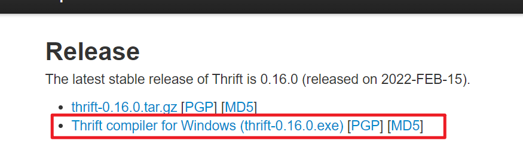
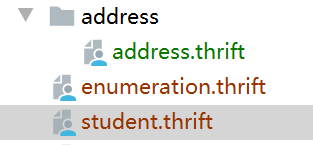
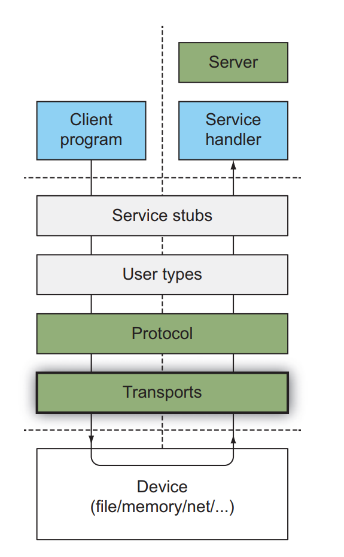
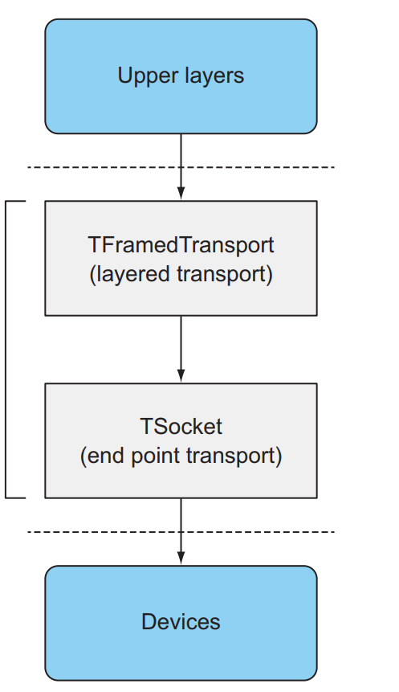
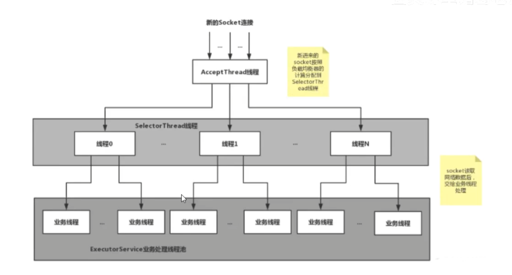

### Thrift支持的类型

https://thrift.apache.org/docs/types

> 基本类型

- bool
- i8: 有符号的8位的数值
- i16: 有符号的16位的数值
- i32: 有符号的32位的数值
- i64: 有符号的64位的数值
- double: 双精度类型
- string: utf-8编码的文本

> 特殊类型

- binary: 字节序列

> 容器类型

- list
- set
- map

> 自定义的类型

- struct
- exception
- service

> 已过期

- slist

### Thrift IDL语法

https://thrift.apache.org/docs/idl.html

https://juejin.cn/post/6844903971086139400

thrift文件包括0或多个header, 0或者多个definitions

官方文档定义如下:

~~~text
Document  ::=  Header* Definition*
~~~

其中Header是指Include, CppInclude, Namespace标签

~~~text
Header ::=  Include | CppInclude | Namespace
~~~

其中Definition是指Const, Typedef, Enum, Senum, Struct, Union, Exception, Service标签

~~~text
Definition  ::=  Const | Typedef | Enum | Senum | Struct | Union | Exception | Service
~~~

> Header标签用法

1. Include

   作用是将另外一个文件中的内容导入到当前文件中, 使得当前文件可以使用另外文件中的定义的东西

   在当前文件使用导入的内容的时候, 必须加上被导入文件的文件作为前缀

   语法如下

   ~~~thrift
   include './path_to_another_file'
   ~~~

   案例如下:

   文件结构如下

   |-student.thrift

   |-address

   ​		|-address.thrift

   

   address.thrift

   ~~~thrift
   struct address {
   	...
   }
   ~~~

   student.thrift

   ~~~
   include 'address/address.thrift' // 指定需要导入的文件相对当前文件的路径
   struct student {
     1: address.address addr // 使用被导入文件中的类型时, 必须加上被导入文件的名字作为前缀
   }
   ~~~

2. CppInclude

   作用是在将IDL文件转换为c++文件时, 将一个自定义的c++文件include到自动生成的c++代码中, 貌似很少用到, 

   ~~~thrift
   cpp_include 'cpp_include_file'
   ~~~

3. Namespace

   作用是指定当前thrift文件转换到指定语言的文件后, 文件所属的package, module

   语法如下:

   ~~~thrift
   namespace scope 'file_package'
   
   // scope可以有以下选项*,c_glib,cpp, delphi,haxe,go,java,js,lua,netstd,perl,php,py,py.twisted,rb,st,xsd
   // *表示所有语言
   ~~~

   案例如下:

   ~~~thrift
   // 指定
   namespace java com.example.tiger
   
   struct student{
   	...
   }
   ~~~

   转换后生成的java文件Student.java所属的package是com.example.tiger

> Definition标签的用法

1. Const

   作用是定义常量

   语法如下:

   ~~~thrift
   Const          ::= 'const' FieldType Identifier '=' ConstValue ListSeparator?
   ConstValue     ::= IntConstant | DoubleConstant | Literal | Identifier | ConstList | ConstMap
   IntConstant    ::= ('+' | '-')? Digit+
   DoubleConstant ::= ('+' | '-')? Digit* ('.' Digit+)? ( ('E' | 'e') IntConstant )?
   ConstList      ::= '[' (ConstValue ListSeparator?)* ']'
   ConstMap       ::= '{' (ConstValue ':' ConstValue ListSeparator?)* '}'
   ListSeparator  ::= ',' | ';'
   ~~~

   先说明下 `ListSeparator`, 这个分隔符就好比 Java 中一句话结束后的 `;`，在 IDL 中分隔符可以是 `,` 或者 `;` 而且大部分情况下可以忽略不写

   案例如下:

   ~~~thrift
   const i8 short_value_1 = 100
   const i8 short_value_2 = -2
   
   const double double_value_1 = 3.14
   const double double_value_2 = 1.2e-5   // 可以使用科学计数法，表示 0.000012
   const double double_value_3 = 3.5e8    // 表示 350000000
   
   // 常量 list
   const list<string> list_value = [ 'tom', 'joney', 'catiy' ]  //分割符可以是逗号, 分号, 或者不写
   
   // 常量 map
   const map<string, string> map_value = { 'name': 'johnson', 'age': '20' } //分割符可以是逗号, 分号, 或者不写
   ~~~

   Note: 没有ConstSet!!!

2. Typedef

   作用是为`基础类型和容器类型`定义别名, 语法如下:

   ~~~text
   Typedef ::= 'typedef' DefinitionType Identifier
   DefinitionType  ::=  BaseType | ContainerType
   
   BaseType  ::=  'bool' | 'byte' | 'i8' | 'i16' | 'i32' | 'i64' | 'double' | 'string' | 'binary' | 'slist'
   
   ContainerType   ::=  MapType | SetType | ListType
   ~~~

   案例如下:

   ~~~thrift
   typedef i64 long // 为i64定义别名long
   
   const long age = 100
   struct student {
   	1: long age
   }
   ~~~

3. Enum

   作用是定义枚举, 语法如下:

   ~~~thrift
   Enum ::= 'enum' Identifier '{' (Identifier ('=' IntConstant)? ListSeparator?)* '}'
   ~~~

   从语法定义来看，`('=' IntConstant)?` 和`ListSeparator?`是可选项，也就是说我们可以不用指定值和分隔符

   枚举对应的值必须是非负数数, 如果没有指定值, 那么第一个是0, 后续递增

   案例如下

   ~~~thrift
   enum Color {
       YELLOR,
       GREEN,
       BLUE,
       RED,
       BLACK
   }
   
   enum State {
       ALIVE = 0
       DEAD = 1
   }
   ~~~

4. Struct

   结构体, 类似于c中的结构体, java中的类, 语法如下:

   ~~~text
   // xsd_all 是 Facebook 内部的字段，直接忽略
   Struct     ::= 'struct' Identifier 'xsd_all'? '{' Field* '}'
   //  XsdFeildOptions 也是 Facebook 内部字段，直接忽略
   Field      ::=  FieldID? FieldReq? FieldType Identifier ('=' ConstValue)? XsdFieldOptions ListSeparator?
   FieldID    ::=  IntConstant ':'
   FieldReq   ::=  'required' | 'optional'
   ~~~

   案例如下:

   ~~~thrift
   struct Address {
       1: required string city = '北京'// 城市(必须)
       2: required string province = '北京' // 省份(必须)
       3: optional i32 postal // 邮政编码(可选)
       4: i32 code
   }
   ~~~

   required和optional和不写的区别,  先说结论: **推荐给所有非required字段添加optional修饰, 免得事多**

   下面详细阐述: 

   ~~~text
   针对bool,byte,i8,i16,i32,i64,double这种转换到java后是基础类型的来说, 因为转换后是java的基础类型, 而基础类型作为成员变量是有默认值的, 比如上述的opstal, 转换后是Address类中的int opstal, 默认值为0.
   这样就无法判断这个opstal到底是被设置为0还是使用的默认值, 这是就需要一个flag来表示这个值是否被设置.
   当序列化的时候, 首先校验required修饰的字段的flag, 如果为未设置, 直接抛出异常. 然后直接将required修饰的字段和没有限定修饰的字段序列化出去. 然后针对optional修饰的字段, 会先根据flag判断是否被设置, 只有被设置了才会序列化出去.
   当反序列化的时候, 从输入流中读取并设置对应字段的值, 以及字段对应的flag为true.没有被设置的字段使用默认值,并且flag为false.最后判断是否所有的required的字段是否被设置, 如果没有就报错, 反序列化失败.
   这样就会导致一个问题, 在上述Address中, 如果code未被设置, 这时他的flag为false,并且有默认值0. 序列化的时候并不会根据flag判断当前的code是否被设置, 而是直接序列化出去. 在反序列化的时候, 读取到code的值并设置为0, 同时设置code的flag为true. 这样就导致了flag为false的code经过序列化,反序列化后flag变为了true.
   
   而针对string这类转换到java后是对象类型的, 判断一个字段是否被设置, 只要判断他是否为null就行了.
   在序列化的时候, 不管是required还是optional还是不写, 都会判断字段是否被设置(判断是否为null), 只有被设置了才会序列化出去. 而反序列化的时候, 读取到了值就给对应的字段赋值, 没有读取到就为null. 最后判断是否所有的required的字段是否被设置, 如果没有就报错, 反序列化失败.
   因为只有被设置了值才会被序列化出去, 所以不写修饰符和使用optional的效果都是一样的.
   ~~~

5. Union

   语法与Struct相似，表示的语义是： 一组可能被设置的字段， 即union中的所有字段， 只要有一个被设置就是合法的。

   Union 结构中的字段默认就是 `optional` 的，不能使用 `required` 声明，写了也没意义，其语法定义如下：

   ```go
   Union ::= 'union' Identifier 'xsd_all'? '{' Field* '}'
   ```

   可以想象这么一个场景，我们收集用户的信息，只要用户填写了手机号或者邮箱中的一个就可以了，这时候我们就可以使用 Union 结构来标识这个类型

   ```c
   union UserInfo {
     1: string phone,
     2: string email
   }
   ```

6. Exception

   作用是定义一个异常， 语法与Struct相似, 主要使用的Function上, 语法如下:

   ~~~thrift
   Exception ::= 'exception' Identifier '{' Field* '}'
   ~~~

   案例如下:

   ~~~c
   exception Error {
     1: required i8 Code,
     2: string Msg,
   }
   
   service ExampleService {
     string GetName() throws (1: Error err),
   }
   ~~~

7. Service

   作用是定义一个服务, 类似于java中的dubbo的接口的作用, 同时服务与服务之间是可以继承的.  语法如下:

   ~~~c
   Service      ::= 'service' Identifier ( 'extends' Identifier )? '{' Function* '}'
   // function表示服务中的一个方法
   // oneway 是一个关键字，从字面上，我们就可以了解到，他是单向的，怎么理解呢？非 oneway 修饰的 function 是应答式，即 req-resp, 客户端发请求，服务端返回响应，被 oneway 修饰后的函数，则意味着，客户端只是会发起，无须关注返回，服务端也不会响应，与 void 的区别是 void 类型的方法还可以返回异常。  
   Function     ::= 'oneway'? FunctionType Identifier '(' Field* ')' Throws? ListSeparator?
   FunctionType ::= FieldType | 'void'
   Throws       ::= 'throws' '(' Field* ')'
   ~~~

   案例如下:

   ~~~c
   struct Student {
       ...
   }
   exception Error {
   	...
   }
   service StudentService {
       Student getStudentByIdAndName(1: required i32 id, 2: optional string name) throws (1: Error error)
       void saveStudent(1: required Student student)
   }
   ~~~

   

### IDL文件转换为java

1. 从https://thrift.apache.org/download下载windows版本的thrift编译器

   

2. 编译器的使用方法可以通过如下查看

   ~~~shell
   ./thrift-0.16.0.exe -help
   ~~~

3. 使用该编译器编译成java文件

   ~~~shell
   // -r表示thrift中include的文件也要递归进行转换
   // -gen java:fullcamel,beans 表示将thrift文件转换为java语言, 同时使用java中的fullcamel和beans选项
   // fullcamel表示将idl中的小写加下划线的命名风格转换为驼峰式
   // beans表示setter方法返回false, 不加返回this
   ./thrift-0.16.0.exe -r -gen java:fullcamel,beans file.thrift
   ~~~

4. 对于转换后的java文件, 如果需要在项目中使用, 还需要添加maven依赖

   ~~~xml
   <dependency>
   <groupId>org.apache.thrift</groupId>
   <artifactId>libthrift</artifactId>
   <version>0.16.0</version>
   </dependency>
   ~~~

   

### 完整的IDL案例

文件结构如下:



address.thrift

~~~c
namespace java com.tiger.example.address

struct Address {
    1: required string city // 城市(必须)
    2: required string province // 省份(必须)
    3: optional i64 postal // 邮政编码(可选)
}
~~~

enumeration.thrift

~~~c
namespace java com.tiger.example

enum Color {
    YELLOR,
    GREEN,
    BLUE,
    RED,
    BLACK
}

enum State {
    ALIVE = 0
    DEAD = 1
}
~~~

student.thrift

~~~c
namespace java com.tiger.example

include 'address/address.thrift'
include 'enumeration.thrift'

const i8 short_value_1 = 100
const i8 short_value_2 = -2
const double double_value_1 = 3.14
const double double_value_2 = 1.2e-5   // 可以使用科学计数法，表示 0.000012
const double double_value_3 = 3.5e8    // 表示 350000000
// 常量 list, 类似 js 中的数组字面量
const list<string> list_value = [ 'tom', 'joney', 'catiy' ]  //分割符可以是逗号, 分号, 或者不写
// 常量 map, 类似 js 中的对象字面量
const map<string, string> map_value = { 'name': 'johnson', 'age': '20' } //分割符可以是逗号, 分号, 或者不写

typedef i64 long
typedef i32 int

struct Student {
  1: required address.Address addr
  2: required int age = short_value_1
  3: required enumeration.Color color
  4: required UserInfo user_info
}

union UserInfo {
  1: string phone,
  2: string email
}

exception Error {
  1: required i8 code,
  2: required string msg,
}

service StudentService {
    Student getStudentByIdAndName(1: required i32 id, 2: optional string name) throws (1: Error error)
    void saveStudent(1: required Student student)
}
~~~


查看IDL的书写风格, 以及更加复杂的案例可以查看

https://github.com/apache/parquet-format/blob/master/src/main/thrift/parquet.thrift


#### Thrift 架构



> Protocol层

Protocol层主要负责序列化对象, Thrift提供了一下集中序列化协议:

- Binary Protocol: **默认的序列化协议**, 将对象直接序列化为二进制, 基本就是按照对应的类型原样序列化, 比如i64就是直接占用原样占用64位
- Compact Protocol: 高效的密集的二进制编码格式进行序列化
- Json

> Transport层

Transport层主要负责传输序列化之后的字节, Thrift支持通过内存, 文件, 网络(http, socket)进行传输. 同时Thrift支持在一个Transport层上面建立另外一个Transport层,  比如如果需要对所传输的所有字节进行加密, 可以在真正负责传输的Transport层上面建立一个加密层, 真正的传输层被叫为Endpoint transports, 而建立在真正的传输层上面的加密层被称为Layered transport.

比如在thrift中, 常见的一种Layered transport就是TFramedTransport, 他会为每一个Thrift消息添加一个四字节的前缀, 表示消息的大小, 使得接收者能够知道消息的大小并提供确切的缓冲器大小.




> Thrift提供的几种网络服务器模型

1. TSimpleServer

   单线程的网络服务模型, 一次只能处理一个请求

2. TThreadPoolServer

   使用了线程池来处理网络请求

3. TNonblockingServer

   单线程的网络服务模型, 但是使用的是nio, 即在单线程中处理所有socket的事件

   使用io多路复用提高了效率, 但是本质上还是单线程处理, 所以效率还是不高

   **底层的传输通道必须是TFramedTransport**

4. THsHaServer

   半同步半异步的网络服务模型

   THsHaServer与TNonblockingServer相比, 在socket可读时, 读取数据后将业务处理交由线程池来完成, 主线程直接返回进行下一次循环操作, 效率大大提升

   缺点是仍然需要主线程来完成所有socket的accept, read, write操作. 当并发请求数较大且发送数据量较多的时候, socket上的新事件不能被及时处理

   **底层的传输通道必须是TFramedTransport**

5. TThreadedSelectorServer

   TThreadedSelectorServer是对THsHaServer的一种扩充, 他将selector中的io事件(read/write)从主线程中分离出来, 同时引入了worker工作线程池.

   TThreadedSelectorServer模式是目前Thrift提供的最高级的线程服务模型, 他内部有几个部分组成:

   - 一个AcceptThread线程专门处理socket上面的accept事件

   - 若干个SelectorThread专门处理socket上面的read, write事件

   - 一个线程池, 在SelectorThread线程中, 监听到socket中有请求过来, 这将请求数据读取出来之后交由线程池来完成业务的具体逻辑

   - 一个负载均衡器SelectorThreadLoadBalancer对象, 主要用于AccptThread线程接收到一个新的socket请求时, 决定将这个新的socket交由哪个SelectorThread线程来监听这个socket后续的read, write请求

     

