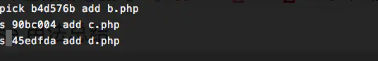

#### git commit撤销

写完代买之后, 一般是

git add . //提交文档的暂存区

git commit -m "完成功能" // 提交一个版本

如果commit之后想撤回怎么办呢?


- 使用git reset 进行撤回commit, 其中几个参数讲下

  | 参数    | 作用                                                         | 备注                                                         |
  | ------- | ------------------------------------------------------------ | ------------------------------------------------------------ |
  | --mixed | 不删除工作空间代码改动, 撤销commit, 撤销git add, 这个为**默认**参数,git reset --mixed HEAD^ 和 git reset HEAD^ 效果是一样的。 | 回退到你想要的那个版本,  保留工作空间代码改动, 但是改动变成没有add的状态 |
  | --soft  | 不删除工作空间代码改动, 撤销commit, 不撤销git add            | 回退到你想要的那个版本,  保留工作空间代码改动, 但是改动变成已经add的状态 |
  | --hard  | 回退到指定的版本, 删除工作空间的代码改动                     | 回退到你想要的那个版本,  但是你那个版本之后的改动都没了.     |

  举个例子, 我现在有个仓库test, 里面有个空文件readme.txt, 我在其中添加一句"first commit", 之后进行提交, 之后再添加一句"second commit"进行提交, 这样我就提交两次了.

  

  之后我想撤回这两次提交怎么办呢?

  - git reset --hard HEAD^^, 回退到指定的版本, 一点不多一点不少

    

    cat之后什么都没有

  - git reset --mixed HEAD^^或者 git reset HEAD^^

    

    撤销了之前的两次提交, 但是提交的内容还在, 并且readme.txt是已修改状态的

  - git reset --soft HEAD^^

    

    撤销了之前的两次提交, 但是提交的内容还在, 并且readme.txt是已暂存状态的

如果只是commit注释写错了, 只想改下注释, 只要git commit --amend

此时会进入默认vim编辑器, 修改注释完毕保存好就行了.


#### 撤销git push

- 执行git log查看日志获取需要回退的版本号

  

- 执行 git reset –-soft <版本号> ，如 git reset --soft 4f5e ，重置至指定版本的提交，达到撤销提交的目的

  然后执行 git log 查看

  

  此时，已重置至指定版本的提交，log中已经没有了需要撤销的提交

- 执行 git push origin 分支名 –-force ，强制提交当前版本号。至此，撤销push提交完成。

#### git 查看提交的具体改动

- git log --stat查看每次提交设计的文件以及修改的行数

  

- git log -p展开查看每次提交的文件差异, -2仅显示最近两次更新

  

- git show查看最新提交中的文件差异

  

- git show commitid查看指定提交中所有的文件修改

  

- git show commitid fileName

  查看某次提交中具体某个文件的改动


#### Java 折叠代码块

ctrl + alt + T in IDEA

//region Description

Some code

//endregion


## [反射框架reflections](https://github.com/ronmamo/reflections)

#### 简介

使用Reflections可以很轻松的获取以下元数据信息：

- 获取某个类型的全部子类
- 只要类型、构造器、方法，字段上带有特定注解，便能获取带有这个注解的全部信息（类型、构造器、方法，字段）
- 获取所有能匹配某个正则表达式的资源
- 获取所有带有特定签名的方法，包括参数，参数注解，返回类型
- 获取所有方法的名字
- 获取代码里所有字段、方法名、构造器的使用

#### Maven依赖

~~~java
<dependency>
    <groupId>org.reflections</groupId>
    <artifactId>reflections</artifactId>
    <version>0.9.11</version>
</dependency>
~~~

#### 实例化

```java
// 实例化Reflections，指定扫描的包为my.package及其子包，使用默认的scanners（扫描器）
Reflections reflections = new Reflections("my.package");

// 使用ConfigurationBuilder进行实例化
new Reflections(new ConfigurationBuilder()
     .setUrls(ClasspathHelper.forPackage("my.project.prefix"))
     .setScanners(new SubTypesScanner(), 
                  new TypeAnnotationsScanner().filterResultsBy(optionalFilter), ...),
     .filterInputsBy(new FilterBuilder().includePackage("my.project.prefix"))
     ...);
```

#### 使用

- 扫描子类

  ~~~java
  //SubTypesScanner
  Set<Class<? extends Module>> modules = 
      reflections.getSubTypesOf(com.google.inject.Module.class);
  ~~~

- 扫描带有某个注解的类

  ~~~java
  //TypeAnnotationsScanner 
  Set<Class<?>> singletons = 
      reflections.getTypesAnnotatedWith(javax.inject.Singleton.class);
  ~~~

- 扫描资源

  ~~~java
  //ResourcesScanner
  Set<String> properties = 
      reflections.getResources(Pattern.compile(".*\\.properties"));
  ~~~

- 扫描带有某个注解的方法/构造方法

  ~~~java
  //MethodAnnotationsScanner
  Set<Method> resources =
      reflections.getMethodsAnnotatedWith(javax.ws.rs.Path.class);
  Set<Constructor> injectables = 
      reflections.getConstructorsAnnotatedWith(javax.inject.Inject.class);
  ~~~

- 扫描带有某个注解的字段

  ~~~java
  //FieldAnnotationsScanner
  Set<Field> ids = 
      reflections.getFieldsAnnotatedWith(javax.persistence.Id.class);
  ~~~

- 扫描特定的方法

  ~~~java
  //MethodParameterScanner
  //扫描特定参数类型的方法
  Set<Method> someMethods =
      reflections.getMethodsMatchParams(long.class, int.class);
  //扫描特定返回类型的方法
  Set<Method> voidMethods =
      reflections.getMethodsReturn(void.class);
  //扫描方法参数上带有某个注解的方法
  Set<Method> pathParamMethods =
      reflections.getMethodsWithAnyParamAnnotated(PathParam.class);
  ~~~

- 扫描方法的参数名

  ~~~java
  //MethodParameterNamesScanner
  List<String> parameterNames = 
      reflections.getMethodParamNames(Method.class)
  ~~~

- 扫描？？？

  ~~~java
  //MemberUsageScanner
  Set<Member> usages = 
      reflections.getMethodUsages(Method.class)
  ~~~


#### git 拉取指定的分支

- 一般使用git clone的时候，虽然会把所有的远程分支拉取到本地，但是只会在本地创建一个master分支，并且追踪origin/master分支。

  使用 git clone -b 分支代码名称 仓库地址， 例：git clone -b dev https://xxx.git。指定拉去xxx仓库的dev分支到本地

- 如果本地已经clone了仓库并且有了master，还想拉取dev分支到本地怎么办呢？

  使用git fetch拉取所有的远程分支到本地，然后git checkout -b dev origin/dev，dev和origin/dev自动建立追踪

  

#### git 查看本地分支的远程分支

git branch -vv

#### git log的使用

git log -p -2展示每次提交的内容差异，-2表示仅显示最近两次

git log --stat 显示每次提交的增改行数

git log --graph --pretty=oneline --abbrev-commit显示图像表示的分支数，--pretty=oneline表示仅显示一行，--abbrev-commit表示缩略显示commitid

git log --grep 搜索提交说明中的关键字


#### git 将本地项目推送到远程仓库

- 本地项目不是git仓库：
  - git clone下远程分支
  - 复制项目到仓库中
  - git commit
  - git push -u origin master
- 本地仓库已经是一个git 仓库的话
  - git remote add origin 远程仓库地址
  - git pull origin master --allow-unrelated-histories，拉取远程仓库，使用--allow-unrelated-histories忽略本地仓库和远程仓库的无关性
  - git push -u origin master推送本地仓库到远程origin仓库，并设置origin为默认主机。

#### git 命令别名

~~~shell
git config --global alias.br branch
git config --golbal alias.cm commit
git config --global alias.st status
git config --global alias.co checkout
~~~


## git rebase详解

参考

http://jartto.wang/2018/12/11/git-rebase/

https://www.jianshu.com/p/4a8f4af4e803

《Pro Git》变基部分

### 合并多个commit为一个commit

当你在实现一个功能的时候，有非常多次的无用的无意义的提交的时候，会有如下几个问题：

1. 不利于代码review

   设想一下，你要做 `code review` ，结果一个很小的功能，提交了 `60` 多次，会不会有一些崩溃？

2. 会造成分支污染
   你的项目充满了无用的 `commit` 纪录，如果有一天线上出现了紧急问题，你需要回滚代码，却发现海量的 `commit` 需要一条条来看。

3. 提交的记录非常不简洁明了，让人迷惑

我们希望把如下分支B、C、D三个提交记录合并为一个完整的提交，然后再push到公共仓库。


现在我们在测试分支上添加了四次提交，我们的目标是把最后三个提交合并为一个提交：


这里我们使用命令:

```css
  git rebase -i  [startpoint]  [endpoint]
```

其中`-i`的意思是`--interactive`，即弹出交互式的界面让用户编辑完成合并操作，`[startpoint]`  `[endpoint]`则指定了一个编辑区间，如果不指定`[endpoint]`，则该区间的终点默认是当前分支`HEAD`所指向的`commit`(注：该区间指定的是一个**前开后闭**的区间)。

 在查看到了log日志后，我们运行以下命令：

```undefined
git rebase -i 36224db
```

或:

```undefined
git rebase -i HEAD~3 
```

然后我们会看到如下界面:


 上面未被注释的部分列出的是我们本次rebase操作包含的所有提交，下面注释部分是git为我们提供的命令说明。每一个commit id 前面的`pick`表示指令类型，git 为我们提供了以下几个命令:


> - pick：保留该commit（缩写:p）
> - reword：保留该commit，但我需要修改该commit的注释（缩写:r）
> - edit：保留该commit, 但我要停下来修改该提交(不仅仅修改注释)（缩写:e）
> - squash：将该commit和前一个commit合并（缩写:s）
> - fixup：将该commit和前一个commit合并，但我不要保留该提交的注释信息（缩写:f）
> - exec：执行shell命令（缩写:x）
> - drop：我要丢弃该commit（缩写:d）


根据我们的需求，我们将commit内容编辑如下:



然后是注释修改界面:


编辑完保存即可完成commit的合并了：


#### git rabse合并分支

在 Git 中整合来自不同分支的修改主要有两种方法：**merge** 以及 **rebase**  

假如有两个分支experiment和master


使用git merge合并时，它会**把两个分支的最新快照（C3 和 C4）以及二者最近的**
**共同祖先（C2）进行三方合并，合并的结果是生成一个新的快照（并提交）**。  


当使用git rebase时，可以提取在 C4 中引入的补丁和修改，然后在 C3 的基础上应用一次。 在 Git 中，这种操作就叫做 变基（rebase）。 你可以使用 rebase 命令将提交到某一分支上的所有修改都移至另一分支上，就好像“重新播放”一样。  

在图一的基础上：

~~~shell
git switch experiment
git rebase master
~~~

- 首先找到这两个分支（即当前分支 experiment、变基操作的目标基底分支 master） 的最近共同祖先 C2
- 然后对比当前分支相对于该祖先的历次提交，提取历次的修改并存为临时文件， 然后将当前分支指向目标基底 C3, 最后以此将之前另存为临时文件的修改依序应用。  


在 `rebase` 的过程中，也许会出现冲突 `conflict`。在这种情况，`git` 会停止 `rebase` 并会让你去解决冲突。

在解决完冲突后，用 `git add` 命令去更新这些内容。

注意，你无需执行 git-commit，只要执行 continue

```
git rebase --continue
```

这样 `git` 会继续应用余下的 `patch` 补丁文件。

在任何时候，我们都可以用 `--abort` 参数来终止 `rebase` 的行动，并且分支会回到 `rebase` 开始前的状态。

```
git rebase —abort
```

合并冲突后，回到master上进行一次快进合并

~~~shell
git switch master
git merge experiment
~~~


此时，C4' 指向的快照就和使用git merge 中 C5 指向的快照一模一样了。 这两种整合方法的**最终结果没有任何区别，但是变基使得提交历史更加整洁**。 你在查看一个经过变基的分支的历史记录时会发现，尽管实际的开发工作是并行的， 但它们看上去就像是串行的一样，提交历史是一条直线没有分叉。
一般我们这样做的目的是为了确保在向远程分支推送时能保持提交历史的整洁——例如向某个其他人维护的项目贡献代码时。 在这种情况下，你首先在自己的分支里进行开发，当开发完成时你需要先将你的代码变基到origin/master 上，然后再向主项目提交修改。 这样的话，该项目的维护者就不再需要进行整合工作，只需要快进合并便可。
请注意，无论是**通过变基，还是通过三方合并，整合的最终结果所指向的快照始终是一样的，只不过提交历史不同罢了**。 变基是将一系列提交按照原有次序依次应用到另一分支上，而合并是把最终结果合在一起。  


#### git rebase的危险操作

<font color=red>**如果你的提交已经推送到了远程仓库, 别人可能基于这些提交进行开发,那么就不要执行rebase.**</font>

假如你从远程分支拉取下c1,并再次基础上提交了c2,c3, 下图是远程分支和本地分支的情况.


某人又向中央服务器提交了一些修改，其中还包括一次合并。 你pull了这些在远程分支上的修改，并将其合并到你本地的开发分支，然后你的提交历史就会变成这样  


然后这个人又决定把合并操作回滚，改用变基；继而又用 git push --force 命令覆盖了服务器上的提交历史。 之后你从服务器抓取更新，会发现多出来一些新的提交。  


如果你执行 git pull 命令，你将合并来自两条提交历史的内容，生成
一个新的合并提交，最终仓库会如图所示  


此时如果你执行 git log 命令，你**会发现有两个提交的作者、日期、日志居然是一样的**，这会令人感到混乱。
此外，如果你将这一堆又推送到服务器上，你实际上是将那些已经被变基抛弃的提交又找了回来，这会令人感到
更加混乱。 很明显对方并不想在提交历史中看到 C4 和 C6，因为之前就是他把这两个提交通过变基丢弃的。  


## git stash(将修改暂存到缓存栈中)

**使用场景:** 

**需要切换分支时,工作区或者暂存区有修改,又不想进行一次多余的提交,导致提交混乱.**


#### git stash暂存的文件

默认情况下，`git stash`会缓存下列文件：

- 添加到暂存区的修改（staged changes）
- Git跟踪的但并未添加到暂存区的修改（unstaged changes）

但不会缓存一下文件：

- 在工作目录中新的文件（untracked files）
- 被忽略的文件（ignored files）

`git stash`命令提供了参数用于缓存上面两种类型的文件。使用`-u`或者`--include-untracked`可以stash untracked文件。使用`-a`或者`--all`命令可以stash当前目录下的所有修改。


#### git stash或者git stash save

`git stash`会把所有未提交的修改（包括暂存的和非暂存的）都保存起来,并且将当前代码切换到`HEAD`提交上.

```shell
$ git status
On branch master
Changes to be committed:

new file:   style.css

Changes not staged for commit:

modified:   index.html

$ git stash
Saved working directory and index state WIP on master: 5002d47 our new homepage
HEAD is now at 5002d47 our new homepage

$ git status
On branch master
nothing to commit, working tree clean
```

需要说明一点，**stash是本地的**，不会通过`git push`命令上传到git server上。
实际应用中推荐给每个stash加一个message，用于记录版本，使用`git stash save`取代`git stash`命令。

```shell
$ git stash save "test-cmd-stash"
Saved working directory and index state On autoswitch: test-cmd-stash

$ git stash list
stash@{0}: On autoswitch: test-cmd-stash
```


#### 查看stash缓栈

可以使用`git stash list`命令

```shell
$ git stash list
stash@{0}: WIP on master: 049d078 added the index file
stash@{1}: WIP on master: c264051 Revert "added file_size"
stash@{2}: WIP on master: 21d80a5 added number to log
```


#### 重新应用缓存的stash

可以通过`git stash pop`命令恢复之前缓存的工作目录, 这个指令**将缓存堆栈中的第一个stash删除，并将对应修改应用到当前的工作目录下**。，输出如下：

```shell
$ git status
On branch master
nothing to commit, working tree clean
$ git stash pop
On branch master
Changes to be committed:

    new file:   style.css

Changes not staged for commit:

    modified:   index.html

Dropped refs/stash@{0} (32b3aa1d185dfe6d57b3c3cc3b32cbf3e380cc6a)
```

你也可以**使用`git stash apply`命令，将缓存堆栈中的stash多次应用到工作目录中，但并不删除stash拷贝。在使用`git stash apply`命令时可以通过名字指定使用哪个stash，默认使用最近的stash（即stash@{0}）**命令输出如下：

```shell
$ git stash apply stash@{0}
On branch master
Changes to be committed:

    new file:   style.css

Changes not staged for commit:

    modified:   index.html
```

#### git stash drop移除stash

可以使用`git stash drop`命令，后面可以跟着stash名字。下面是一个示例：

```
$ git stash list
stash@{0}: WIP on master: 049d078 added the index file
stash@{1}: WIP on master: c264051 Revert "added file_size"
stash@{2}: WIP on master: 21d80a5 added number to log
$ git stash drop stash@{0}
Dropped stash@{0} (364e91f3f268f0900bc3ee613f9f733e82aaed43)
```

或者使用`git stash clear`命令，删除所有缓存的stash。

#### git stash show查看指定stash的diff

可以使用`git stash show`命令，后面可以跟着stash名字。示例如下：

```
$ git stash show
 index.html | 1 +
 style.css | 3 +++
 2 files changed, 4 insertions(+)
```

在该命令后面添加`-p`或`--patch`可以查看特定stash的全部diff，如下：

```
$ git stash show -p
diff --git a/style.css b/style.css
new file mode 100644
index 0000000..d92368b
--- /dev/null
+++ b/style.css
@@ -0,0 +1,3 @@
+* {
+  text-decoration: blink;
+}
diff --git a/index.html b/index.html
index 9daeafb..ebdcbd2 100644
--- a/index.html
+++ b/index.html
@@ -1 +1,2 @@
+<link rel="stylesheet" href="style.css"/>
```


## 合并分支的三种形式

merge前


#### git merge

```shell
git checkout master
git merge devel
```

- 优点: commit line笔直
- 缺点: 如果devel分支上commit比较多比较乱的话也会导致master分支上commit比较多比较乱


#### git merge --squash

```shell
git checkout master
git merge --squash devel
```

然后你会发现master分支上有未提交的修改, 需要你在master上主动提交修改. 注意, 这里是你的commit, 也就是说改变了commit的author. 

- 优点: 合并了多个commit为一个
- 缺点: 改变了提交信息


#### git merge -- rebase

```shell
git checkout devle
git rebase -i master
git checkout master
git merge devle
```

- 优点: 多个commit合并为1个, 保留作者信息
- 缺点: 需要在devel分支上执行git rebase, 导致devel分支上的原始commit history变化了.


## git remote 详解

#### git remote --help 显示帮助文档

#### git remote add 添加远程仓库

~~~shell
git remote add <remote_name> <url>
~~~

#### git remote -v 显示所有远程仓库及地址


#### git remote rename 重命名远程仓库


#### git remote remove 删除远程仓库

~~~shell
git remote remove <remote_name>
~~~

#### git remote show 显示远程仓库的详细信息


红色框显示了可以pull和push的分支


同时显示了所有的远程分支以及远程分支的状态, **tracked为正常状态, new表示新建的远程分支,下次fetch会在本地新建这个远程分支, stale表示该分支已经在远程仓库删除了, 请使用git remote prune删除本地的这个远程分支**

#### git remote prune 

~~~shell
# 删除远程仓库中已经删除的本地的远程分支
git remote prune <remote_name>
# 列出远程仓库中已经删除的分支
git remote prune --dry-run <remote_name>

# git fetch + git remote prune
git fetch --prune
~~~

#### git remote update

~~~shell
# 同git fetch
git remote update
~~~

## Linux 命令使用

#### 查看端口占用

~~~shell
# 查看8080端口的占用
lsof -i:8080
~~~

#### tar命令

> 参数

必选参数：

- -c：建立一个压缩文件的参数指令(create 的意思)；   
- -x：解开一个压缩文件的参数指令！  
- -t：查看 tarfile 里面的文件！   
- -r：向压缩归档文件末尾追加文件   
- -u：更新原压缩包中的文件   

可选参数：

- -z：有gzip属性,即需要用 gzip 压缩   
- -j：有bz2属性,即需要用 bzip2 压缩   
- -Z：有compress属性的   
- -v ：压缩的过程中显示文件(显示所有过程)！这个常用，但不建议用在背景执行过程！   
- -O：将文件解开到标准输出   
- -f ：使用档名，请留意，在 f 之后要立即接档名！不要再加参数！       例如：使用『 tar -zcvfP tfile sfile』就是错误的写法，要写成『 tar -zcvPf tfile sfile』才对喔！  -p ：使用原文件的原来属性（属性不会依据使用者而变）   
- -P ：可以使用绝对路径来压缩！   
- -N ：比后面接的日期(yyyy/mm/dd)还要新的才会被打包进新建的文件中！   --exclude FILE：在压缩的过程中，不要将 FILE 打包！     
- -f: 使用档案名字，切记，这个参数是最后一个参数，后面只能接档案名。 
- -C：指定目录

> 解压

~~~shell
# 将/source/kernel.tgz解压到 /source/linux-2.6.29 目录
tar zxvf /source/kernel.tgz -C /source/ linux-2.6.29

tar –xvf file.tar         // 解压 tar包  
tar -zxvf file.tar.gz     // 解压tar.gz  
tar -jxvf file.tar.bz2    // 解压 tar.bz2  
tar –Zxvf file.tar.Z      // 解压tar.Z  
~~~

> 压缩

~~~shell
# 将linux-2.6.29 目录压缩到 kernel.tgz
tar -czvf kernel.tgz linux-2.6.29

# 将目录里所有jpg文件打包成tar.jpg  
tar -cvf jpg.tar *.jpg       

# 将目录里所有jpg文件打包成jpg.tar后，并且将其用gzip压缩，生成一个gzip压缩过的包，命名为jpg.tar.gz  
tar –czf jpg.tar.gz *.jpg   

# 将目录里所有jpg文件打包成jpg.tar后，并且将其用bzip2压缩，生成一个bzip2压缩过的包，命名为jpg.tar.bz2 
tar –cjf jpg.tar.bz2 *.jpg 

# 将目录里所有jpg文件打包成jpg.tar后，并且将其用compress压缩，生成一个umcompress压缩过的包，命名为jpg.tar.Z  
tar –cZf jpg.tar.Z *.jpg     
~~~

> 查看

~~~shell
# 列出压缩包中所有文件
tar -tf aaa.tar.gz
~~~

#### ps命令

选项：

- a：显示一个终端的所有进程，除会话引线外；
- u：显示进程的归属用户及内存的使用情况；
- x：显示没有控制终端的进程；
- -a：显示同意终端下所有进行
- -A:  显示所有进程
- -l：长格式显示更加详细的信息；
- -e：显示所有进程，等于-A；
- -u：指定用户的所有进程

~~~shell
# 显示所有进程
ps aux

USER PID %CPU %MEM  VSZ  RSS   TTY STAT START TIME COMMAND
root   1  0.0  0.2 2872 1416   ?   Ss   Jun04 0:02 /sbin/init
root   2  0.0  0.0    0    0   ?    S   Jun04 0:00 [kthreadd]

USER	该进程是由哪个用户产生的。
PID	进程的 ID。
%CPU	该进程占用 CPU 资源的百分比，占用的百分比越高，进程越耗费资源。
%MEM	该进程占用物理内存的百分比，占用的百分比越高，进程越耗费资源。
VSZ	该进程占用虚拟内存的大小，单位为 KB。
RSS	该进程占用实际物理内存的大小，单位为 KB。
TTY	该进程是在哪个终端运行的。
STAT	进程状态。
START	该进程的启动时间。
TIME	该进程占用 CPU 的运算时间，注意不是系统时间。
COMMAND	产生此进程的命令名。
~~~

~~~shell
# 显示指定用户进程
ps -u root
~~~

~~~shell
# 显示所有进程信息，连同命令行
ps -ef 
~~~

~~~shell
ps -le
~~~

