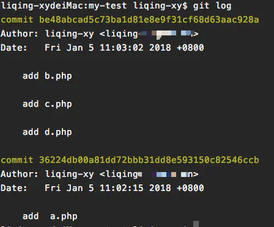

git commit撤销

写完代买之后, 一般是

git add . //提交文档的暂存区

git commit -m "完成功能" // 提交一个版本

如果commit之后想撤回怎么办呢?


- 使用git reset 进行撤回commit, 其中几个参数讲下

  | 参数    | 作用                                                         | 备注                                                         |
  | ------- | ------------------------------------------------------------ | ------------------------------------------------------------ |
  | --mixed | 不删除工作空间代码改动, 撤销commit, 撤销git add, 这个为**默认**参数,git reset --mixed HEAD^ 和 git reset HEAD^ 效果是一样的。 | 回退到你想要的那个版本,  保留工作空间代码改动, 但是改动变成没有add的状态 |
  | --soft  | 不删除工作空间代码改动, 撤销commit, 不撤销git add            | 回退到你想要的那个版本,  保留工作空间代码改动, 但是改动变成已经add的状态 |
  | --hard  | 回退到指定的版本, 删除工作空间的代码改动                     | 回退到你想要的那个版本,  但是你那个版本之后的改动都没了.     |

  举个例子, 我现在有个仓库test, 里面有个空文件readme.txt, 我在其中添加一句"first commit", 之后进行提交, 之后再添加一句"second commit"进行提交, 这样我就提交两次了.

  

  之后我想撤回这两次提交怎么办呢?

  - git reset --hard HEAD^^, 回退到指定的版本, 一点不多一点不少

    

    cat之后什么都没有

  - git reset --mixed HEAD^^或者 git reset HEAD^^

    

    撤销了之前的两次提交, 但是提交的内容还在, 并且readme.txt是已修改状态的

  - git reset --soft HEAD^^

    

    撤销了之前的两次提交, 但是提交的内容还在, 并且readme.txt是已暂存状态的

如果只是commit注释写错了, 只想改下注释, 只要git commit --amend

此时会进入默认vim编辑器, 修改注释完毕保存好就行了.


#### 撤销git push

- 执行git log查看日志获取需要回退的版本号

  

- 执行 git reset –-soft <版本号> ，如 git reset --soft 4f5e ，重置至指定版本的提交，达到撤销提交的目的

  然后执行 git log 查看

  

  此时，已重置至指定版本的提交，log中已经没有了需要撤销的提交

- 执行 git push origin 分支名 –-force ，强制提交当前版本号。至此，撤销push提交完成。

#### git 查看提交的具体改动

- git log --stat查看每次提交设计的文件以及修改的行数

  

- git log -p展开查看每次提交的文件差异, -2仅显示最近两次更新

  

- git show查看最新提交中的文件差异

  

- git show commitid查看指定提交中所有的文件修改

  

- git show commitid fileName

  查看某次提交中具体某个文件的改动


#### Java 折叠代码块

ctrl + alt + T in IDEA

//region Description

Some code

//endregion


## [反射框架reflections](https://github.com/ronmamo/reflections)

#### 简介

使用Reflections可以很轻松的获取以下元数据信息：

- 获取某个类型的全部子类
- 只要类型、构造器、方法，字段上带有特定注解，便能获取带有这个注解的全部信息（类型、构造器、方法，字段）
- 获取所有能匹配某个正则表达式的资源
- 获取所有带有特定签名的方法，包括参数，参数注解，返回类型
- 获取所有方法的名字
- 获取代码里所有字段、方法名、构造器的使用

#### Maven依赖

~~~java
<dependency>
    <groupId>org.reflections</groupId>
    <artifactId>reflections</artifactId>
    <version>0.9.11</version>
</dependency>
~~~

#### 实例化

```java
// 实例化Reflections，指定扫描的包为my.package及其子包，使用默认的scanners（扫描器）
Reflections reflections = new Reflections("my.package");

// 使用ConfigurationBuilder进行实例化
new Reflections(new ConfigurationBuilder()
     .setUrls(ClasspathHelper.forPackage("my.project.prefix"))
     .setScanners(new SubTypesScanner(), 
                  new TypeAnnotationsScanner().filterResultsBy(optionalFilter), ...),
     .filterInputsBy(new FilterBuilder().includePackage("my.project.prefix"))
     ...);
```

#### 使用

- 扫描子类

  ~~~java
  //SubTypesScanner
  Set<Class<? extends Module>> modules = 
      reflections.getSubTypesOf(com.google.inject.Module.class);
  ~~~

- 扫描带有某个注解的类

  ~~~java
  //TypeAnnotationsScanner 
  Set<Class<?>> singletons = 
      reflections.getTypesAnnotatedWith(javax.inject.Singleton.class);
  ~~~

- 扫描资源

  ~~~java
  //ResourcesScanner
  Set<String> properties = 
      reflections.getResources(Pattern.compile(".*\\.properties"));
  ~~~

- 扫描带有某个注解的方法/构造方法

  ~~~java
  //MethodAnnotationsScanner
  Set<Method> resources =
      reflections.getMethodsAnnotatedWith(javax.ws.rs.Path.class);
  Set<Constructor> injectables = 
      reflections.getConstructorsAnnotatedWith(javax.inject.Inject.class);
  ~~~

- 扫描带有某个注解的字段

  ~~~java
  //FieldAnnotationsScanner
  Set<Field> ids = 
      reflections.getFieldsAnnotatedWith(javax.persistence.Id.class);
  ~~~

- 扫描特定的方法

  ~~~java
  //MethodParameterScanner
  //扫描特定参数类型的方法
  Set<Method> someMethods =
      reflections.getMethodsMatchParams(long.class, int.class);
  //扫描特定返回类型的方法
  Set<Method> voidMethods =
      reflections.getMethodsReturn(void.class);
  //扫描方法参数上带有某个注解的方法
  Set<Method> pathParamMethods =
      reflections.getMethodsWithAnyParamAnnotated(PathParam.class);
  ~~~

- 扫描方法的参数名

  ~~~java
  //MethodParameterNamesScanner
  List<String> parameterNames = 
      reflections.getMethodParamNames(Method.class)
  ~~~

- 扫描？？？

  ~~~java
  //MemberUsageScanner
  Set<Member> usages = 
      reflections.getMethodUsages(Method.class)
  ~~~


#### git 拉取指定的分支

- 一般使用git clone的时候，虽然会把所有的远程分支拉取到本地，但是只会在本地创建一个master分支，并且追踪origin/master分支。

  使用 git clone -b 分支代码名称 仓库地址， 例：git clone -b dev https://xxx.git。指定拉去xxx仓库的dev分支到本地

- 如果本地已经clone了仓库并且有了master，还想拉取dev分支到本地怎么办呢？

  使用git fetch拉取所有的远程分支到本地，然后git checkout -b dev origin/dev，dev和origin/dev自动建立追踪

  

#### git 查看本地分支的远程分支

git branch -vv

#### git log的使用

git log -p -2展示每次提交的内容差异，-2表示仅显示最近两次

git log --stat 显示每次提交的增改行数

git log --graph --pretty=oneline --abbrev-commit显示图像表示的分支数，--pretty=oneline表示仅显示一行，--abbrev-commit表示缩略显示commitid

git log --grep 搜索提交说明中的关键字


#### git 将本地项目推送到远程仓库

- 本地项目不是git仓库：
  - git clone下远程分支
  - 复制项目到仓库中
  - git commit
  - git push -u origin master
- 本地仓库已经是一个git 仓库的话
  - git remote add origin 远程仓库地址
  - git pull origin master --allow-unrelated-histories，拉取远程仓库，使用--allow-unrelated-histories忽略本地仓库和远程仓库的无关性
  - git push -u origin master推送本地仓库到远程origin仓库，并设置origin为默认主机。

#### git 命令别名

~~~shell
git config --global alias.br branch
git config --golbal alias.cm commit
git config --global alias.st status
git config --global alias.co checkout
~~~


## git rebase详解

参考

http://jartto.wang/2018/12/11/git-rebase/

https://www.jianshu.com/p/4a8f4af4e803

《Pro Git》变基部分

### 合并多个commit为一个commit

当你在实现一个功能的时候，有非常多次的无用的无意义的提交的时候，会有如下几个问题：

1. 不利于代码review

   设想一下，你要做 `code review` ，结果一个很小的功能，提交了 `60` 多次，会不会有一些崩溃？

2. 会造成分支污染
   你的项目充满了无用的 `commit` 纪录，如果有一天线上出现了紧急问题，你需要回滚代码，却发现海量的 `commit` 需要一条条来看。

3. 提交的记录非常不简洁明了，让人迷惑

我们希望把如下分支B、C、D三个提交记录合并为一个完整的提交，然后再push到公共仓库。


现在我们在测试分支上添加了四次提交，我们的目标是把最后三个提交合并为一个提交：


这里我们使用命令:

```css
  git rebase -i  [startpoint]  [endpoint]
```

其中`-i`的意思是`--interactive`，即弹出交互式的界面让用户编辑完成合并操作，`[startpoint]`  `[endpoint]`则指定了一个编辑区间，如果不指定`[endpoint]`，则该区间的终点默认是当前分支`HEAD`所指向的`commit`(注：该区间指定的是一个**前开后闭**的区间)。

 在查看到了log日志后，我们运行以下命令：

```undefined
git rebase -i 36224db
```

或:

```undefined
git rebase -i HEAD~3 
```

然后我们会看到如下界面:


 上面未被注释的部分列出的是我们本次rebase操作包含的所有提交，下面注释部分是git为我们提供的命令说明。每一个commit id 前面的`pick`表示指令类型，git 为我们提供了以下几个命令:


> - pick：保留该commit（缩写:p）
> - reword：保留该commit，但我需要修改该commit的注释（缩写:r）
> - edit：保留该commit, 但我要停下来修改该提交(不仅仅修改注释)（缩写:e）
> - squash：将该commit和前一个commit合并（缩写:s）
> - fixup：将该commit和前一个commit合并，但我不要保留该提交的注释信息（缩写:f）
> - exec：执行shell命令（缩写:x）
> - drop：我要丢弃该commit（缩写:d）


根据我们的需求，我们将commit内容编辑如下:


然后是注释修改界面:


编辑完保存即可完成commit的合并了：




#### git rabse合并分支

在 Git 中整合来自不同分支的修改主要有两种方法：**merge** 以及 **rebase**  

假如有两个分支experiment和master


使用git merge合并时，它会**把两个分支的最新快照（C3 和 C4）以及二者最近的**
**共同祖先（C2）进行三方合并，合并的结果是生成一个新的快照（并提交）**。  


当使用git rebase时，可以提取在 C4 中引入的补丁和修改，然后在 C3 的基础上应用一次。 在 Git 中，这种操作就叫做 变基（rebase）。 你可以使用 rebase 命令将提交到某一分支上的所有修改都移至另一分支上，就好像“重新播放”一样。  

在图一的基础上：

~~~shell
git switch experiment
git rebase master
~~~

- 首先找到这两个分支（即当前分支 experiment、变基操作的目标基底分支 master） 的最近共同祖先 C2
- 然后对比当前分支相对于该祖先的历次提交，提取历次的修改并存为临时文件， 然后将当前分支指向目标基底 C3, 最后以此将之前另存为临时文件的修改依序应用。  


在 `rebase` 的过程中，也许会出现冲突 `conflict`。在这种情况，`git` 会停止 `rebase` 并会让你去解决冲突。

在解决完冲突后，用 `git add` 命令去更新这些内容。

注意，你无需执行 git-commit，只要执行 continue

```
git rebase --continue
```

这样 `git` 会继续应用余下的 `patch` 补丁文件。

在任何时候，我们都可以用 `--abort` 参数来终止 `rebase` 的行动，并且分支会回到 `rebase` 开始前的状态。

```
git rebase —abort
```

合并冲突后，回到master上进行一次快进合并

~~~shell
git switch master
git merge experiment
~~~


此时，C4' 指向的快照就和使用git merge 中 C5 指向的快照一模一样了。 这两种整合方法的**最终结果没有任何区别，但是变基使得提交历史更加整洁**。 你在查看一个经过变基的分支的历史记录时会发现，尽管实际的开发工作是并行的， 但它们看上去就像是串行的一样，提交历史是一条直线没有分叉。
一般我们这样做的目的是为了确保在向远程分支推送时能保持提交历史的整洁——例如向某个其他人维护的项目贡献代码时。 在这种情况下，你首先在自己的分支里进行开发，当开发完成时你需要先将你的代码变基到origin/master 上，然后再向主项目提交修改。 这样的话，该项目的维护者就不再需要进行整合工作，只需要快进合并便可。
请注意，无论是**通过变基，还是通过三方合并，整合的最终结果所指向的快照始终是一样的，只不过提交历史不同罢了**。 变基是将一系列提交按照原有次序依次应用到另一分支上，而合并是把最终结果合在一起。  


#### git rebase的危险操作

<font color=red>**如果你的提交已经推送到了远程仓库, 别人可能基于这些提交进行开发,那么就不要执行rebase.**</font>

假如你从远程分支拉取下c1,并再次基础上提交了c2,c3, 下图是远程分支和本地分支的情况.


某人又向中央服务器提交了一些修改，其中还包括一次合并。 你pull了这些在远程分支上的修改，并将其合并到你本地的开发分支，然后你的提交历史就会变成这样  


然后这个人又决定把合并操作回滚，改用变基；继而又用 git push --force 命令覆盖了服务器上的提交历史。 之后你从服务器抓取更新，会发现多出来一些新的提交。  


如果你执行 git pull 命令，你将合并来自两条提交历史的内容，生成
一个新的合并提交，最终仓库会如图所示  


此时如果你执行 git log 命令，你**会发现有两个提交的作者、日期、日志居然是一样的**，这会令人感到混乱。
此外，如果你将这一堆又推送到服务器上，你实际上是将那些已经被变基抛弃的提交又找了回来，这会令人感到
更加混乱。 很明显对方并不想在提交历史中看到 C4 和 C6，因为之前就是他把这两个提交通过变基丢弃的。  


## git stash(将修改暂存到缓存栈中)

**使用场景:** 

**需要切换分支时,工作区或者暂存区有修改,又不想进行一次多余的提交,导致提交混乱.**


#### git stash暂存的文件

默认情况下，`git stash`会缓存下列文件：

- 添加到暂存区的修改（staged changes）
- Git跟踪的但并未添加到暂存区的修改（unstaged changes）

但不会缓存一下文件：

- 在工作目录中新的文件（untracked files）
- 被忽略的文件（ignored files）

`git stash`命令提供了参数用于缓存上面两种类型的文件。使用`-u`或者`--include-untracked`可以stash untracked文件。使用`-a`或者`--all`命令可以stash当前目录下的所有修改。


#### git stash或者git stash save

`git stash`会把所有未提交的修改（包括暂存的和非暂存的）都保存起来,并且将当前代码切换到`HEAD`提交上.

```shell
$ git status
On branch master
Changes to be committed:

new file:   style.css

Changes not staged for commit:

modified:   index.html

$ git stash
Saved working directory and index state WIP on master: 5002d47 our new homepage
HEAD is now at 5002d47 our new homepage

$ git status
On branch master
nothing to commit, working tree clean
```

需要说明一点，**stash是本地的**，不会通过`git push`命令上传到git server上。
实际应用中推荐给每个stash加一个message，用于记录版本，使用`git stash save`取代`git stash`命令。

```shell
$ git stash save "test-cmd-stash"
Saved working directory and index state On autoswitch: test-cmd-stash

$ git stash list
stash@{0}: On autoswitch: test-cmd-stash
```


#### 查看stash缓栈

可以使用`git stash list`命令

```shell
$ git stash list
stash@{0}: WIP on master: 049d078 added the index file
stash@{1}: WIP on master: c264051 Revert "added file_size"
stash@{2}: WIP on master: 21d80a5 added number to log
```


#### 重新应用缓存的stash

可以通过`git stash pop`命令恢复之前缓存的工作目录, 这个指令**将缓存堆栈中的第一个stash删除，并将对应修改应用到当前的工作目录下**。，输出如下：

```shell
$ git status
On branch master
nothing to commit, working tree clean
$ git stash pop
On branch master
Changes to be committed:

    new file:   style.css

Changes not staged for commit:

    modified:   index.html

Dropped refs/stash@{0} (32b3aa1d185dfe6d57b3c3cc3b32cbf3e380cc6a)
```

你也可以**使用`git stash apply`命令，将缓存堆栈中的stash多次应用到工作目录中，但并不删除stash拷贝。在使用`git stash apply`命令时可以通过名字指定使用哪个stash，默认使用最近的stash（即stash@{0}）**命令输出如下：

```shell
$ git stash apply stash@{0}
On branch master
Changes to be committed:

    new file:   style.css

Changes not staged for commit:

    modified:   index.html
```

#### git stash drop移除stash

可以使用`git stash drop`命令，后面可以跟着stash名字。下面是一个示例：

```
$ git stash list
stash@{0}: WIP on master: 049d078 added the index file
stash@{1}: WIP on master: c264051 Revert "added file_size"
stash@{2}: WIP on master: 21d80a5 added number to log
$ git stash drop stash@{0}
Dropped stash@{0} (364e91f3f268f0900bc3ee613f9f733e82aaed43)
```

或者使用`git stash clear`命令，删除所有缓存的stash。

#### git stash show查看指定stash的diff

可以使用`git stash show`命令，后面可以跟着stash名字。示例如下：

```
$ git stash show
 index.html | 1 +
 style.css | 3 +++
 2 files changed, 4 insertions(+)
```

在该命令后面添加`-p`或`--patch`可以查看特定stash的全部diff，如下：

```
$ git stash show -p
diff --git a/style.css b/style.css
new file mode 100644
index 0000000..d92368b
--- /dev/null
+++ b/style.css
@@ -0,0 +1,3 @@
+* {
+  text-decoration: blink;
+}
diff --git a/index.html b/index.html
index 9daeafb..ebdcbd2 100644
--- a/index.html
+++ b/index.html
@@ -1 +1,2 @@
+<link rel="stylesheet" href="style.css"/>
```


## 合并分支的三种形式

merge前


#### git merge

```shell
git checkout master
git merge devel
```

- 优点: commit line笔直
- 缺点: 如果devel分支上commit比较多比较乱的话也会导致master分支上commit比较多比较乱


#### git merge --squash

```shell
git checkout master
git merge --squash devel
```

然后你会发现master分支上有未提交的修改, 需要你在master上主动提交修改. 注意, 这里是你的commit, 也就是说改变了commit的author. 

- 优点: 合并了多个commit为一个
- 缺点: 改变了提交信息


#### git merge -- rebase

```shell
git checkout devle
git rebase -i master
git checkout master
git merge devle
```

- 优点: 多个commit合并为1个, 保留作者信息
- 缺点: 需要在devel分支上执行git rebase, 导致devel分支上的原始commit history变化了.


## git remote 详解

#### git remote --help 显示帮助文档

#### git remote add 添加远程仓库

~~~shell
git remote add <remote_name> <url>
~~~

#### git remote -v 显示所有远程仓库及地址


#### git remote rename 重命名远程仓库


#### git remote remove 删除远程仓库

~~~shell
git remote remove <remote_name>
~~~

#### git remote show 显示远程仓库的详细信息


红色框显示了可以pull和push的分支


同时显示了所有的远程分支以及远程分支的状态, **tracked为正常状态, new表示新建的远程分支,下次fetch会在本地新建这个远程分支, stale表示该分支已经在远程仓库删除了, 请使用git remote prune删除本地的这个远程分支**

#### git remote prune 

~~~shell
# 删除远程仓库中已经删除的本地的远程分支
git remote prune <remote_name>
# 列出远程仓库中已经删除的分支
git remote prune --dry-run <remote_name>

# git fetch + git remote prune
git fetch --prune
~~~

#### git remote update

~~~shell
# 同git fetch
git remote update
~~~

## Linux 命令使用

#### 查看端口占用

~~~shell
# 查看8080端口的占用
lsof -i:8080
~~~

#### gz压缩包

- 解压

  gzip -d fileName

- 压缩

  gzip fileName

- 查看文件压缩内容

  zcat fileName, 可结合管道使用

- 不解压直接搜索压缩文件

  zgrep 模式 文件名

  ~~~shell
  # 在压缩文件中直接搜索字符a
  zgrep a /root.gz
  ~~~

  

#### 压缩、解压、tar命令

> 常见的压缩文件压缩和解压缩

| 文件后缀名 | 说明                           | 压缩                              | 解压缩                    |
| ---------- | ------------------------------ | --------------------------------- | ------------------------- |
| *.zip      | zip 程序打包压缩的文件         | zip fileName.zip dirName          | unzip fileName.zip        |
| *.rar      | rar 程序压缩的文件             | rar a fileName.rar dirName        | rar x fileName.rar        |
| *.7z       | 7zip 程序压缩的文件            | 7z a fileName.7z dirName          | 7z x fileName.7z          |
| *.tar      | tar 程序打包，未压缩的文件     | tar cvf fileName.tar dirName      | tar xvf fileName.tar      |
| *.gz       | gzip 程序 (GNU zip) 压缩的文件 | gzip fileName                     | gzip -d fileName.gz       |
| *.bz2      | tar 打包，gzip 程序压缩的文件  | bzip2 -z FileName                 | bzip2 -d FileName.bz2     |
| *.tar.gz   | tar打包，gzip程序压缩的文件    | tar zcvf FileName.tar.gz dirName  | tar zxvf FileName.tar.gz  |
| *.tar.xz   | tar打包，xz程序压缩的文件      | tar cvJf fileName.tar.xz dirName  | tar -xvJf fileName.tar.xz |
| *.tar.bz2  | tar打包，bzip2程序压缩的文件   | tar jcvf FileName.tar.bz2 dirName | tar jxvf FileName.tar.bz2 |
| *.Z        | compress命令解压缩rar文件      | compress fileName                 | uncompress fileName.Z     |

> 参数

必选参数：

- -c：建立一个压缩文件的参数指令(create 的意思)；   
- -x：解开一个压缩文件的参数指令！  
- -t：查看 tarfile 里面的文件！   
- -r：向压缩归档文件末尾追加文件   
- -u：更新原压缩包中的文件   

可选参数：

- -z：有gzip属性,即需要用 gzip 压缩   
- -j：有bz2属性,即需要用 bzip2 压缩   
- -Z：有compress属性的   
- -v ：压缩的过程中显示文件(显示所有过程)！这个常用，但不建议用在背景执行过程！   
- -O：将文件解开到标准输出   
- -f ：使用档名，请留意，在 f 之后要立即接档名！不要再加参数！       例如：使用『 tar -zcvfP tfile sfile』就是错误的写法，要写成『 tar -zcvPf tfile sfile』才对喔！  -p ：使用原文件的原来属性（属性不会依据使用者而变）   
- -P ：可以使用绝对路径来压缩！   
- -N ：比后面接的日期(yyyy/mm/dd)还要新的才会被打包进新建的文件中！   --exclude FILE：在压缩的过程中，不要将 FILE 打包！     
- -f: 使用档案名字，切记，这个参数是最后一个参数，后面只能接档案名。 
- -C：指定目录

> 解压

~~~shell
# 将/source/kernel.tgz解压到 /source/linux-2.6.29 目录
tar zxvf /source/kernel.tgz -C /source/ linux-2.6.29

tar –xvf file.tar         // 解压 tar包  
tar -zxvf file.tar.gz     // 解压tar.gz  
tar -jxvf file.tar.bz2    // 解压 tar.bz2  
tar –Zxvf file.tar.Z      // 解压tar.Z  
~~~

> 压缩

~~~shell
# 将linux-2.6.29 目录压缩到 kernel.tgz
tar -czvf kernel.tgz linux-2.6.29

# 将目录里所有jpg文件打包成tar.jpg  
tar -cvf jpg.tar *.jpg       

# 将目录里所有jpg文件打包成jpg.tar后，并且将其用gzip压缩，生成一个gzip压缩过的包，命名为jpg.tar.gz  
tar –czf jpg.tar.gz *.jpg   

# 将目录里所有jpg文件打包成jpg.tar后，并且将其用bzip2压缩，生成一个bzip2压缩过的包，命名为jpg.tar.bz2 
tar –cjf jpg.tar.bz2 *.jpg 

# 将目录里所有jpg文件打包成jpg.tar后，并且将其用compress压缩，生成一个umcompress压缩过的包，命名为jpg.tar.Z  
tar –cZf jpg.tar.Z *.jpg     
~~~

> 查看

~~~shell
# 列出压缩包中所有文件
tar -tf aaa.tar.gz
~~~

#### ps命令

选项：

- a：显示一个终端的所有进程，除会话引线外；
- u：显示进程的归属用户及内存的使用情况；
- x：显示没有控制终端的进程；
- -a：显示同意终端下所有进行
- -A:  显示所有进程
- -l：长格式显示更加详细的信息；
- -e：显示所有进程，等于-A；
- -u：指定用户的所有进程

~~~shell
# 显示所有进程
ps aux

USER PID %CPU %MEM  VSZ  RSS   TTY STAT START TIME COMMAND
root   1  0.0  0.2 2872 1416   ?   Ss   Jun04 0:02 /sbin/init
root   2  0.0  0.0    0    0   ?    S   Jun04 0:00 [kthreadd]

USER	该进程是由哪个用户产生的。
PID	进程的 ID。
%CPU	该进程占用 CPU 资源的百分比，占用的百分比越高，进程越耗费资源。
%MEM	该进程占用物理内存的百分比，占用的百分比越高，进程越耗费资源。
VSZ	该进程占用虚拟内存的大小，单位为 KB。
RSS	该进程占用实际物理内存的大小，单位为 KB。
TTY	该进程是在哪个终端运行的。
STAT	进程状态。
START	该进程的启动时间。
TIME	该进程占用 CPU 的运算时间，注意不是系统时间。
COMMAND	产生此进程的命令名。
~~~

~~~shell
# 显示指定用户进程
ps -u root
~~~

~~~shell
# 显示所有进程信息，连同命令行
ps -ef 
~~~

~~~shell
ps -le
~~~

#### man命令查看帮助文档

man命令是Linux下最核心的命令之一。而man命令也并不是英文单词“man”的意思，它是单词**manual**的缩写，即使用手册的意思。


**man手册页文件存放在/usr/share/man目录下。**


Linux的man手册共有以下几个章节：

| 代號 | 代表內容                                                     |
| ---- | ------------------------------------------------------------ |
| 1    | Executable programs or shell commands<br/> 使用者在shell中可以操作的指令或可执行档 |
| 2    | System calls (functions provided by the kernel)<br/>系統核心可呼叫的函数与工具等 |
| 3    | Library calls (functions within program libraries)<br/>一些常用的函数(function)与函数库(library)，大部分是C的函数库(libc) |
| 4    | Special files (usually found in /dev)<br/>装置档案的说明，通常在/dev下的档案 |
| 5    | File formats and conventions eg /etc/passwd<br/>设定档或者是某些档案的格式 |
| 6    | Games<br/>游戏                                               |
| 7    | Miscellaneous (including macro packages and conventions), e.g. man(7), groff(7)<br/>惯例与协定等，例如Linux档案系统、网络协定、ASCII code等等的說明 |
| 8    | System administration commands (usually only for root)<br/>系統管理員可用的管理指令 |
| 9    | Kernel routines [Non standard]<br>跟kernel有关的文件         |

我们输入`man ls`，它会在最左上角显示“LS（1）”，在这里，“LS”表示手册名称，而“（1）”表示该手册位于第一节章，表示可执行命令。

**man是按照手册的章节号的顺序进行搜索的**，比如：

```
man sleep
```

只会显示sleep命令的手册,如果想查看库函数sleep，就要输入:

```
man 3 sleep
```

> 选项

- -a：在所有的man帮助手册中搜索

  ~~~shell
  man -a sleep
  ~~~

  显示sleep(1)按q推出后将会询问还有sleep(3)是否查看

  

- -w：显示手册所在位置

  man -w只会显示搜索到的第一个文档的位置

  man -aw显示搜索到的全部文档的位置

  


#### shell输入输出重定向

输入输出类型：

| 类型                        | 文件描述符 | 默认情况               | 对应文件句柄位置 |
| :-------------------------- | :--------- | :--------------------- | :--------------- |
| 标准输入（standard input）  | 0          | 从键盘获得输入         | /proc/self/fd/0  |
| 标准输出（standard output） | 1          | 输出到屏幕（即控制台） | /proc/self/fd/1  |
| 错误输出（error output）    | 2          | 输出到屏幕（即控制台） | /proc/self/fd/2  |

> 重定向输出

| 命令                | 介绍                                                         |
| :------------------ | :----------------------------------------------------------- |
| command >filename   | 把标准输出重定向到新文件中(**删除文件再新建再写入**, 等于**覆盖**内容)（**没有文件新建**） |
| command 1>filename  | 同上                                                         |
| command >>filename  | 把标准输出**追加**到文件中（**没有文件新建**）               |
| command 1>>filename | 同上                                                         |
| command 2>filename  | 把标准错误重定向到新文件中                                   |
| command 2>>filename | 把标准错误追加到新文件中                                     |

案例：
~~~shell
$ ls
Dockerfile
$ ls Dockerfile a.txt
ls: cannot access a.txt: No such file or directory
Dockerfile
~~~

上面命令，我们目录下只有Dockerfile一个文件， 使用`ls Dockerfile a.txt`命令以后，`ls: cannot access a.txt: No such file or directory`是错误输出，`Dockerfile`是标准输出。所以我们可以将错误内容输出到error.txt文件中，把标准输出输入到stadand.txt文件中。

~~~shell
$ ls Dockerfile a.txt > error.txt 2>error.txt
~~~

~~~shell
# 把"hello world输入到a.txt中"
echo "hello world" > a.txt
~~~


> 输入重定向

| 命令                | 介绍                                      |
| :------------------ | :---------------------------------------- |
| command <filename   | 以filename文件作为标准输入                |
| command 0<filename  | 同上                                      |
| command <<delimiter | 从标准输入中读入，直到遇到delimiter分隔符 |

案例：

~~~shell
# 从标准输入中读取，直到遇到结束符， <<后面的是自定义的结束符
$ cat >a.txt  <<end
hello
world
end

$ cat a.txt 
hello
world
~~~
> 高级用法(https://blog.csdn.net/qq_31073871/article/details/80810306)

**>/dev/null**

这条命令的作用是将标准输出1重定向到`/dev/null`中。 `/dev/null`代表linux的空设备文件，所有往这个文件里面写入的内容都会丢失，俗称“黑洞”。那么执行了`>/dev/null`之后，标准输出就会不再存在，没有任何地方能够找到输出的内容。

**2  >&1**

这条命令用到了重定向绑定，采用&可以将两个输出绑定在一起。这条命令的作用是**将错误输出输入到标准输出**

2>&1，可以这样理解：按照前面讲解的知识，“2>”表示要把标准错误信息进行重定向，一般来说，重定向的目标是某个文件，而这条语句把重定向的目标设置成了文件描述符1的输入了，也即“&1”，也即，fd2的输出会被送到fd1的输入中去，后果就是，fd2的输入从fd1的输出口送了出来，流程是这样的：fd2输入 -> fd2输出 -> fd1的输入 -> fd的输出。

linux在执行shell命令之前，就会**确定好所有的输入输出位置，并且从左到右依次执行重定向的命令**，所以`>/dev/null 2>&1`的作用就是让标准输出重定向到`/dev/null`中（丢弃标准输出），然后错误输出由于重用了标准输出的描述符，所以错误输出也被定向到了`/dev/null`中，错误输出同样也被丢弃了。执行了这条命令之后，该条shell命令将不会输出任何信息到控制台，也不会有任何信息输出到文件中。

**>/dev/null 2>&1 和 2>&1 >/dev/null**

乍眼看这两条命令貌似是等同的，但其实大为不同。刚才提到了，linux在执行shell命令之前，就会确定好所有的输入输出位置，并且从左到右依次执行重定向的命令。

那么我们同样从左到右地来分析`2>&1 >/dev/null`：`2>&1`，将错误输出绑定到标准输出上。由于此时的标准输出是默认值，也就是输出到屏幕，所以错误输出会输出到屏幕。`>/dev/null`，将标准输出1重定向到`/dev/null`中。

**>/dev/null 2>&1 和 >/dev/null 2>/dev/null**

那么可能会有些同学会疑问，为什么要用重定向绑定，而不是像`>/dev/null 2>/dev/null`这样子重复一遍呢。

为了回答这个问题，我们回到刚才介绍输出重定向的场景。我们尝试将标准输出和错误输出都定向到out文件中：

```
# ls a.txt b.txt >out 2>out
# cat out
a.txt
无法访问b.txt: 没有那个文件或目录
```

WTF？竟然出现了乱码，这是为啥呢？这是因为采用这种写法，标准输出和错误输出会抢占往out文件的管道，所以可能会导致输出内容的时候出现缺失、覆盖等情况。现在是出现了乱码，有时候也有可能出现只有error信息或者只有正常信息的情况。不管怎么说，采用这种写法，最后的情况是无法预估的。

而且，由于out文件被打开了两次，两个文件描述符会抢占性的往文件中输出内容，所以整体IO效率不如`>/dev/null 2>&1`来得高。


#### 环境变量与export

> Linux环境变量分类

一、按照生命周期来分，Linux环境变量可以分为两类：
 1、永久的：需要用户修改相关的配置文件，变量永久生效。
 2、临时的：用户利用export命令，在当前终端下声明环境变量，关闭Shell终端失效。

二、按照作用域来分，Linux环境变量可以分为：
 1、系统环境变量：系统环境变量对该系统中所有用户都有效。
 2、用户环境变量：顾名思义，这种类型的环境变量只对特定的用户有效。

>  Linux设置环境变量的方法

一、在`/etc/profile`文件中添加变量 **对所有用户生效（永久的）**
 用vim在文件`/etc/profile`文件中增加变量，该变量将会对Linux下所有用户有效，并且是“永久的”。
 例如：编辑/etc/profile文件，添加CLASSPATH变量

```bash
  vim /etc/profile    
  export CLASSPATH=./JAVA_HOME/lib;$JAVA_HOME/jre/lib
```

注：修改文件后要想马上生效还要运行`source /etc/profile`不然只能在下次重进此用户时生效。


 二、在用户目录下的.bash_profile文件中增加变量 **【对单一用户生效（永久的）】**
 用`vim ~/.bash_profile`文件中增加变量，改变量仅会对当前用户有效，并且是“永久的”。

```bash
vim ~/.bash.profile
export CLASSPATH=./JAVA_HOME/lib;$JAVA_HOME/jre/lib
```

注：修改文件后要想马上生效还要运行$ source ~/.bash_profile不然只能在下次重进此用户时生效。


 三、直接运行export命令定义变量 **【只对当前shell（BASH）有效（临时的）】**
 在shell的命令行下直接使用`export 变量名=变量值`
 定义变量，该变量只在当前的shell（BASH）或其子shell（BASH）下是有效的，shell关闭了，变量也就失效了，再打开新shell时就没有这个变量，需要使用的话还需要重新定义。


## 杂乱

#### 打印日志的注意点

#### java静态变量、静态代码块、代码块、成员变量初始化时机

>  Java中静态变量初始化、static块执行时机（https://www.cnblogs.com/aflyun/p/9562885.html）

演示例子

在使用static进行初始化的操作，怎么也执行不了！代码如下：

```java
public class StaticDemo {

    public static final String INIT = "init";
    static {
        System.out.println("------StaticDemo----");
    }
}

public class TestStatic {

    public static void main(String[] args) {
        System.out.println(StaticDemo.INIT);
    }
}
//打印
init
```

怎么没有执行 static 块的代码呢？

最后发现是因为调用的静态属性被final修饰导致的。去掉final修饰，结果OK！

```
public class StaticDemo {

    //去掉 final
    public static String INIT = "init";
    static {
        System.out.println("------StaticDemo----");
    }
}

public class TestStatic {

    public static void main(String[] args) {
        System.out.println(StaticDemo.INIT);
    }
}
//打印结果
------StaticDemo----
init
```

(static final的基础类型和String可能在编译的时候就定下来了吧)

这里就和类加载机制中的 **初始化** 相关！**类被加载了不一定就会执行静态代码块，只有一个类被主动使用的时候，静态代码才会被执行**！

　当一个类被主动使用时，Java虚拟就会对其初始化，如下六种情况为主动使用：

1. 当创建某个类的新实例时（如通过new或者反射，克隆，反序列化等）

2. 当调用某个类的静态方法时

3. **当使用某个类或接口的静态字段时**

4. 当调用Java API中的某些反射方法时，比如类Class中的方法，或者java.lang.reflect中的类的方法时

5. 当初始化某个子类时

6. 当虚拟机启动某个被标明为启动类的类（即包含main方法的那个类）

   Java编译器会收集所有的类变量初始化语句和类型的静态初始化器，将这些放到一个特殊的方法中：clinit。

**重点：使用final修饰的静态字段，在调用的时候不会对类进行初始化！**

> 静态变量、静态代码块、代码块、成员变量调用顺序

1. 类被主动使用时，静态代码被执行
   - 为非final的静态变量分配内存空间，并赋初始值（不对变量进行初始化）
   - 从上到下为静态变量初始化和执行静态代码块
2. 类实例化的时候，执行普通代码块和对成员变量初始化
   - 为成员变量分配内存空间，并赋初始值
   - 从上到下为成员变量初始化和执行普通代码块
   - 执行构造函数

案例分析（https://blog.csdn.net/tongyi55555/article/details/46627415）

~~~java
public class VarOrder {

    public static int k = 0;
    public static VarOrder t1 = new VarOrder("t1");
    public static VarOrder t2 = new VarOrder("t2");
    public static int i = print("i");
    public static int n = 99;
    private int a = 0;
    public int j = print("j");
    {
        print("构造块");
    }
    static {
        print("静态块");
    }

    public VarOrder(String str) {
        System.out.println((++k) + ":" + str + " i=" + i + " n=" + n);
        ++i;
        ++n;
    }

    public static int print(String str) {
        System.out.println((++k) + ":" + str + " i=" + i + " n=" + n);
        ++n;
        return ++i;
    }

    public static void main(String args[]) {
        VarOrder t = new VarOrder("init");
    }
}
~~~

　1). 静态的一定是最开始进行调用的，如果存在多个，那么写在前面的先调用，因此静态变量int k先调用，没有输出；

　　2). 静态变量t1开始调用，t1是该类的实例对象，因此在实例对象中，非静态变量和代码块要首先进行初始化，因此int a和int j先进行调用进行赋值，然后是代码块进行调用。**虽然类的静态变量和静态代码块的调用顺序要高于非静态变量和代码块，但是因为这里的t1是实例对象，因此不会跳转到t1和t2后面的静态变量int i和int n中执行赋值，打印输出的都是i和n的初始值，从0开始。**最后才是自身的构造函数进行调用，输出如下：

```
1:j i=0 n=0
2:构造块 i=1 n=1
3:t1 i=2 n=2123
```

　　同理t1调用后，t2进行调用，输出的内容与t1实例化时相似，如下：

```
4:j i=3 n=3
5:构造块 i=4 n=4
6:t2 i=5 n=5123
```

　　3). t2实例化后，继续顺序执行，开始执行静态变量int i，此时输出内容：

```
7:i i=6 n=61
```

　　4). 继续进行静态变量int n赋值，没有输出，但是要记住此时n的值已经由6变为99；

　　5). 最后一个静态调用，即静态块调用，此时输出如下：

```
8:静态块 i=7 n=991
```

　　6). 静态变量和静态块调用完毕后，此时才开始进入到主方法的代码中执行，主方法中的代码就一句，实例化对象，与2)分析的一致，先调用非静态变量和代码块，最后调用构造函数，因此输出如下：

```
9:j i=8 n=100
10:构造块 i=9 n=101
11:init i=10 n=102123
```

**综上所述，最终的输出结果为：**

```
1:j i=0 n=0
2:构造块 i=1 n=1
3:t1 i=2 n=2
4:j i=3 n=3
5:构造块 i=4 n=4
6:t2 i=5 n=5
7:i i=6 n=6
8:静态块 i=7 n=99
9:j i=8 n=100
10:构造块 i=9 n=101
11:init i=10 n=102
```


## 多线程

#### synchronized

1. synchronized关键字**不能**被继承 即父类方法是同步方法 子类方法继承后默认不是同步方法
2. synchronized**不能**修饰接口方法 因为接口是特殊的抽象类 不能新建实例 实例锁应归实现其的类所有
3. synchronized**不能**修饰构造方法（但可在内部使用synchronized代码块来同步
4. 对成员方法修饰 -> synchronized(this)
5. 对静态方法修饰 -> synchronized(ClassA.class)
6. 尝试获取该对象锁的线程会被阻塞，并不影响其他线程不获取锁的操作，所以要在涉及同步量操作的所有地方采用同步方法（如加锁），否则引起线程安全问题几乎是必然的。
7. 可重进入, 在父子类继承的情况下也支持.

#### synchronized原理

#### 多线程状态

#### 常用方法

> sleep

强制当前正在执行的线程休眠（），但是不会释放锁，不需要在同步块中调用，当前线程sleep时如果

> yield

释放线程所占有的CPU资源，从而让其他线程有机会运行，但是并不能保证某个特定的线程能够获得CPU资源。谁能获得CPU完全取决于调度器，在有些情况下调用yield方法的线程甚至会再次得到CPU资源。所以，依赖于yield方法是不可靠的，它只能尽力而为。yield()并不释放锁。

> sleep与yield的区别

- sleep让当前正在执行的线程暂停一段时间，并**进入阻塞状态**，则可以通过调用Thread类的静态sleep()方法来实现。当前线程调用sleep()方法进入阻塞状态后，在其睡眠时间内，该线程不会获得执行的机会，而**其它任何优先级的线程都可以得到执行的机会**，即使系统中没有其它可执行的线程，处于sleep()的线程也不会执行，sleep()是用来暂停线程的执行。

  yield()方法是一个和sleep()方法有点相似的方法，它也是Thread类提供的一个静态方法。可以让当前正在执行的线程暂停，但它不会阻塞该线程，只是**将该线程转入就绪状态**。yeild()只是让当前线程暂停一下，**让系统的线程调度器重新调度一次**，完全可能的情况是：当某个线程调用了yield()线程暂停之后，线程调度器又将其调度出来重新执行。
  当某个线程调用了yield()方法暂停之后，**只有优先级与当前线程相同，或者优先级比当前线程更高的处于就绪状态的线程才会获得执行机会**。

- sleep()方法的声明抛出了InterruptedException异常，所以调用sleep()方法时要么捕捉异常，要么抛出该异常。
- sleep()方法比yield()方法具有更好的可移动性，所以建议不要使用yield()方法来控制并发线程的执行


> 暂停线程suspend(废弃)和resume(废弃)

> 停止线程stop

> 中断线程interrupt

调用interrupt方法仅仅是在当前线程中打了一个停止的标记，并不是真正的停止线程。线程中断并不会立即终止线程，而是通知目标线程，有人希望你终止。至于目标线程收到通知后会如何处理，则完全由目标线程自行决定。

~~~java
public boolean Thread.isInterrupted() //判断是否被中断
public static boolean Thread.interrupted() //判断是否被中断，并清除当前中断状态
~~~

这两个方法使得当前线程能够感知到是否被中断了（通过检查标志位）。否则当前线程是不会管这个标志位的，也就不会被中断了。

~~~java
@Override
public void run() {
    super.run();
    for(int i = 0; i <= 200000; i++) {
        //判断是否被中断
        if(Thread.currentThread().isInterrupted()){
            //处理中断逻辑
            break;
        }
        System.out.println("i=" + i);
    }
}
~~~

Thread.sleep() 方法会抛出一个 InterruptedException 异常，当线程被 sleep() 休眠时，如果被中断，这会就抛出这个异常。
（注意：Thread.sleep() 方法由于中断而抛出的异常，是会清除中断标记的。）

> wait, notify, notifyAlls

wait()方法使当前线程进行等待，并阻塞在当前代码处直到接到通知或者被中断为止。在调用wait()方法之前，线程必须获得调用wait()方法的对象的对象级别锁，即只能在同步块或者同步方法中调用wait()方法。如果调用wait时没有获得该对象的锁，则抛出IllegalMonitorStateException。执行wait()后，当前线程释放锁。接到通知后，在wait()返回前，线程需要与其他线程竞争重新获得锁。

wait(long)方法与wait()类似，但超过设定时间自动唤醒。

当线程wait状态时，调用线程对象的interrupt()方法出现InterruptedException异常。

notify()也要在同步方法中，即调用时当前线程必须获得调用对象的对象级别锁。没有持有锁抛出IllegalMonitorStateException。该方法用来通知那些可能等待该对象的对象锁的其他线程。如果有多个线程等待，线程规划器随机挑选一个呈wait状态的线程，对其发出notify。执行notify()后，当前线程不会立刻释放该对象锁，要等到退出synchronized代码块后才会释放锁。当第一个获得该对象锁的wait线程运行完毕，他会是否掉该对象锁，此时如果该对象没有再次使用notify语句，则即便该对象已经空闲，其他wait状态的线程依旧阻塞知道该对象发出notify或者notifyAll。

若notify时，没有wait的线程，该notify将被忽略。

notifyAll()与notify()类似，只是唤醒所有wait的线程。

因线程调度的随机性，若先线程A先调用notify()之后线程B才进入wait()状态，将会导致线程B永久wait。

> wait与sleep的区别

- wait需要在同步块中调用， 释放锁。sleep不需要再同步块中调用，不释放锁。
- wait需要notify唤醒，而sleep可以自动醒来。
- sleep是静态方法，wait是对象方法.

> join


#### 线程中断

#### ThreadLocal与ThreadLocalMap

> ThreadLocal的作用

ThreadLocal类提供了线程局部 (thread-local) 变量。每个线程都可以通过其 get 或 set方法来访问自己的独立初始化的变量副本。ThreadLocal中的变量是线程隔离的。

```java
public class ThreadId {
    // Atomic integer containing the next thread ID to be assigned
    private static final AtomicInteger nextId = new AtomicInteger(0);

    // Thread local variable containing each thread's ID
    private static final ThreadLocal<Integer> threadId =
            new ThreadLocal<Integer>() {
                @Override protected Integer initialValue() {
                    return nextId.getAndIncrement();
                }
            };

    // Returns the current thread's unique ID, assigning it if necessary
    public static int get() {
        return threadId.get();
    }

    public static void main(String[] args) {
        for (int i = 0; i < 5; i++) {
            new Thread(new Runnable() {
                public void run() {
                    System.out.print(threadId.get());
                }
            }).start();
        }
    }
    // 输出结果01234
```

> ThreadLocal

ThreadLocal中重要的方法有：

- remove()清除ThreadLocal中保存的变量
- get() 设置ThreadLocal中保存的变量
- set(T)获取ThreadLocal中保存的变量
- initialValue()子类可以覆盖这个方法来对ThreadLocal设置一个初始值， 默认为null。

~~~java
	public void set(T value) {
    	// 获取当前线程的ThreadLocalMap对象
    	Thread t = Thread.currentThread();
	    ThreadLocalMap map = getMap(t);
 	   // 设置值
  	  if (map != null)
  	      map.set(this, value);
  	  else
     	   createMap(t, value);
	}
    public T get() {
        // 获取当前线程的ThreadLocalMap对象
        Thread t = Thread.currentThread();
        ThreadLocalMap map = getMap(t);
        if (map != null) {
            // 获取ThreadLocalMap中对应的entry，需要注意的是这里传入的是this，也就是说ThreadLocalMap中的key是ThreadLocal。
            ThreadLocalMap.Entry e = map.getEntry(this);
            if (e != null) {
                @SuppressWarnings("unchecked")
                T result = (T)e.value;
                return result;
            }
        }
        // 没有对应的值就获取初始值， 初始值可以继承TheadLocal类并覆盖其initialValue()方法来设置
        return setInitialValue();
    }
     public void remove() {
         // 获取当前线程的ThreadLocalMap对象
         ThreadLocalMap m = getMap(Thread.currentThread());
         // 清除ThreadLocalMap中key为当前对象的entry
         if (m != null)
             m.remove(this);
     }
	// 假如当前TheadLocal对象没有通过set()方法设置值就调用get()方法的话，那ThreadLocalMap对象中肯定无法获得对应的entry，那么get()方法中就会调用该方法。
	private T setInitialValue() {
        // 获取初始值，默认的话是null，可以通过子类覆盖这个方法。
        T value = initialValue();
        Thread t = Thread.currentThread();
        ThreadLocalMap map = getMap(t);
        // 想ThreadLocalMap中设置这个初始值。
        if (map != null)
            map.set(this, value);
        else
            createMap(t, value);
        return value;
    }
~~~

综上可以看出，对ThreadLocal对象调用set/get方法，其实就是调用了Thread.currentThread()中的ThreadLocalMap对象。

> ThreadLocalMap

ThreadLocalMap是一个类似于HashMap的结构，但是他是自己实现的Map功能，与集合中的Map并没有什么继承关系。

关键的是，**每一个Thread对象中维护着一个ThreadLocalMap对象，当调用的ThreadLocal进行set/get时，操作的ThreadLocalMap是当前线程Thread.currentThread()的，所以保存在ThreadLocal中的对象是线程隔离的。**


ThreadLocalMap成员变量如下：

```java
    //初始容量 —— 必须是2的幂
    private static final int INITIAL_CAPACITY = 16;
    //存放数据的table，Entry类的定义在下面分析，同样，数组长度必须是2的幂
    private Entry[] table;
    // 数组里面entrys的个数，可以用于判断table当前使用量是否超过负因子。
    private int size = 0;
    // 进行扩容的阈值，表使用量大于它的时候进行扩容。
    private int threshold;
    // 长度的2/3
    private void setThreshold(int len) {
        threshold = len * 2 / 3;
    }
```

存储结构Entry：

```java
/**
 * Entry继承WeakReference，并且用ThreadLocal作为key.如果key为null
 * (entry.get() == null)表示key不再被引用，表示ThreadLocal对象被回收
 * 因此这时候这个entry也可以从table从清除。
 */
static class Entry extends WeakReference<ThreadLocal<?>> {
    /** The value associated with this ThreadLocal. */
    Object value;

    Entry(ThreadLocal<?> k, Object v) {
        super(k);
        value = v;
    }
}
```

**ThreadLocalMap中的key是ThreadLocal对象，这样当调用ThreadLocal的set/get方法时，传入this便可以获取对应保存的value。**

> ThreadLocal和ThreadLocalMap中的set

先看看ThreadLocal中set()源码。

```java
    public void set(T value) {
        Thread t = Thread.currentThread();
        ThreadLocal.ThreadLocalMap map = getMap(t);
        if (map != null)
            map.set(this, value);
        else
            createMap(t, value);
    }
    
    ThreadLocal.ThreadLocalMap getMap(Thread t) {
        return t.threadLocals;
    }

    void createMap(Thread t, T firstValue) {
        t.threadLocals = new ThreadLocal.ThreadLocalMap(this, firstValue);
    }
```

- 代码很简单，获取当前线程，并获取当前线程的ThreadLocalMap实例（从getMap(Thread t)中很容易看出来）。
- 如果获取到的map实例不为空，调用map.set()方法，否则调用构造函数 ThreadLocal.ThreadLocalMap(this, firstValue)实例化map。

可以看出来线程中的ThreadLocalMap使用的是延迟初始化，在第一次调用get()或者set()方法的时候才会进行初始化。下面来看看构造函数`ThreadLocalMap(ThreadLocal<?> firstKey, Object firstValue)` 。

```java
    ThreadLocalMap(ThreadLocal<?> firstKey, Object firstValue) {
        //初始化table
        table = new ThreadLocal.ThreadLocalMap.Entry[INITIAL_CAPACITY];
        //计算索引
        int i = firstKey.threadLocalHashCode & (INITIAL_CAPACITY - 1);
        //设置值
        table[i] = new ThreadLocal.ThreadLocalMap.Entry(firstKey, firstValue);
        size = 1;
        //设置阈值
        setThreshold(INITIAL_CAPACITY);
    }
```

主要说一下计算索引，`firstKey.threadLocalHashCode & (INITIAL_CAPACITY - 1)`。

- 关于`& (INITIAL_CAPACITY - 1)`, 这是快速取模法，相当于 `%INITIAL_CAPACITY` ，前提是`INITIAL_CAPACITY` 必须是2的幂。这也就是为啥容量必须为2的幂。
- 关于`firstKey.threadLocalHashCode`：

```java
    private final int threadLocalHashCode = nextHashCode();
    private static int nextHashCode() {
        return nextHashCode.getAndAdd(HASH_INCREMENT);
    }
    private static AtomicInteger nextHashCode =
            new AtomicInteger();     
    private static final int HASH_INCREMENT = 0x61c88647;
```

定义了一个AtomicInteger类型，每次获取当前值并加上HASH_INCREMENT，`HASH_INCREMENT = 0x61c88647`,关于这个值和`斐波那契散列`有关，其原理这里不再深究，感兴趣可自行搜索，其**主要目的就是为了让哈希码能均匀的分布在2的n次方的数组里, 也就是`Entry[] table`中。**

在了解了上面的源码后，终于能进入正题了，下面开始进入ThreadLocalMap中的set()。

ThreadLocalMap使用`线性探测法`来解决哈希冲突，线性探测法的地址增量di = 1, 2, ... , m-1，其中，i为探测次数。该方法一次探测下一个地址，直到有空的地址后插入，若整个空间都找不到空余的地址，则产生溢出。假设当前table长度为16，也就是说如果计算出来key的hash值为14，如果table[14]上已经有值，并且其key与当前key不一致，那么就发生了hash冲突，这个时候将14加1得到15，取table[15]进行判断，这个时候如果还是冲突会回到0，取table[0],以此类推，直到可以插入。

按照上面的描述，`可以把table看成一个环形数组`。

先看一下线性探测相关的代码，从中也可以看出来table实际是一个环：

```java
    // 获取环形数组的下一个索引
    private static int nextIndex(int i, int len) {
        return ((i + 1 < len) ? i + 1 : 0);
    }
    // 获取环形数组的上一个索引
    private static int prevIndex(int i, int len) {
        return ((i - 1 >= 0) ? i - 1 : len - 1);
    }
```

ThreadLocalMap的set()及其set()相关代码如下：

```java
    private void set(ThreadLocal<?> key, Object value) {
        ThreadLocal.ThreadLocalMap.Entry[] tab = table;
        int len = tab.length;
        //计算索引，上面已经有说过。
        int i = key.threadLocalHashCode & (len-1);

        /**
         * 根据获取到的索引进行循环，如果当前索引上的table[i]不为空，在没有return的情况下，
         * 就使用nextIndex()获取下一个（上面提到到线性探测法）。
         */
        for (ThreadLocal.ThreadLocalMap.Entry e = tab[i];
             e != null;
             e = tab[i = nextIndex(i, len)]) {
            ThreadLocal<?> k = e.get();
            //table[i]上key不为空，并且和当前key相同，更新value
            if (k == key) {
                e.value = value;
                return;
            }
            /**
             * table[i]上的key为空，说明被回收了（上面的弱引用中提到过）。
             * 这个时候说明改table[i]可以重新使用，用新的key-value将其替换,并删除其他无效的entry
             */
            if (k == null) {
                replaceStaleEntry(key, value, i);
                return;
            }
        }

        //找到为空的插入位置，插入值，在为空的位置插入需要对size进行加1操作
        tab[i] = new ThreadLocal.ThreadLocalMap.Entry(key, value);
        int sz = ++size;

        /**
         * cleanSomeSlots用于清除那些e.get()==null，也就是table[index] != null && table[index].get()==null
         * 之前提到过，这种数据key关联的对象已经被回收，所以这个Entry(table[index])可以被置null。
         * 如果没有清除任何entry,并且当前使用量达到了负载因子所定义(长度的2/3)，那么进行rehash()
         */
        if (!cleanSomeSlots(i, sz) && sz >= threshold)
            rehash();
    }


    /**
     * 替换无效entry
     */
    private void replaceStaleEntry(ThreadLocal<?> key, Object value,
                                   int staleSlot) {
        ThreadLocal.ThreadLocalMap.Entry[] tab = table;
        int len = tab.length;
        ThreadLocal.ThreadLocalMap.Entry e;

        /**
         * 根据传入的无效entry的位置（staleSlot）,向前扫描
         * 一段连续的entry(这里的连续是指一段相邻的entry并且table[i] != null),
         * 直到找到一个无效entry，或者扫描完也没找到
         */
        int slotToExpunge = staleSlot;//之后用于清理的起点
        for (int i = prevIndex(staleSlot, len);
             (e = tab[i]) != null;
             i = prevIndex(i, len))
            if (e.get() == null)
                slotToExpunge = i;

        /**
         * 向后扫描一段连续的entry
         */
        for (int i = nextIndex(staleSlot, len);
             (e = tab[i]) != null;
             i = nextIndex(i, len)) {
            ThreadLocal<?> k = e.get();

            /**
             * 如果找到了key，将其与传入的无效entry替换，也就是与table[staleSlot]进行替换
             */
            if (k == key) {
                e.value = value;

                tab[i] = tab[staleSlot];
                tab[staleSlot] = e;

                //如果向前查找没有找到无效entry，则更新slotToExpunge为当前值i
                if (slotToExpunge == staleSlot)
                    slotToExpunge = i;
                cleanSomeSlots(expungeStaleEntry(slotToExpunge), len);
                return;
            }

            /**
             * 如果向前查找没有找到无效entry，并且当前向后扫描的entry无效，则更新slotToExpunge为当前值i
             */
            if (k == null && slotToExpunge == staleSlot)
                slotToExpunge = i;
        }

        /**
         * 如果没有找到key,也就是说key之前不存在table中
         * 就直接最开始的无效entry——tab[staleSlot]上直接新增即可
         */
        tab[staleSlot].value = null;
        tab[staleSlot] = new ThreadLocal.ThreadLocalMap.Entry(key, value);

        /**
         * slotToExpunge != staleSlot,说明存在其他的无效entry需要进行清理。
         */
        if (slotToExpunge != staleSlot)
            cleanSomeSlots(expungeStaleEntry(slotToExpunge), len);
    }

    /**
     * 连续段清除
     * 根据传入的staleSlot,清理对应的无效entry——table[staleSlot],
     * 并且根据当前传入的staleSlot,向后扫描一段连续的entry(这里的连续是指一段相邻的entry并且table[i] != null),
     * 对可能存在hash冲突的entry进行rehash，并且清理遇到的无效entry.
     *
     * @param staleSlot key为null,需要无效entry所在的table中的索引
     * @return 返回下一个为空的solt的索引。
     */
    private int expungeStaleEntry(int staleSlot) {
        ThreadLocal.ThreadLocalMap.Entry[] tab = table;
        int len = tab.length;

        // 清理无效entry，置空
        tab[staleSlot].value = null;
        tab[staleSlot] = null;
        //size减1，置空后table的被使用量减1
        size--;

        ThreadLocal.ThreadLocalMap.Entry e;
        int i;
        /**
         * 从staleSlot开始向后扫描一段连续的entry
         */
        for (i = nextIndex(staleSlot, len);
             (e = tab[i]) != null;
             i = nextIndex(i, len)) {
            ThreadLocal<?> k = e.get();
            //如果遇到key为null,表示无效entry，进行清理.
            if (k == null) {
                e.value = null;
                tab[i] = null;
                size--;
            } else {
                //如果key不为null,计算索引
                int h = k.threadLocalHashCode & (len - 1);
                /**
                 * 计算出来的索引——h，与其现在所在位置的索引——i不一致，置空当前的table[i]
                 * 从h开始向后线性探测到第一个空的slot，把当前的entry挪过去。
                 */
                if (h != i) {
                    tab[i] = null;
                    while (tab[h] != null)
                        h = nextIndex(h, len);
                    tab[h] = e;
                }
            }
        }
        //下一个为空的solt的索引。
        return i;
    }

    /**
     * 启发式的扫描清除，扫描次数由传入的参数n决定
     * @param i 从i向后开始扫描（不包括i，因为索引为i的Slot肯定为null）
     * @param n 控制扫描次数，正常情况下为 log2(n) ，
     * 如果找到了无效entry，会将n重置为table的长度len,进行段清除。
     * map.set()点用的时候传入的是元素个数，replaceStaleEntry()调用的时候传入的是table的长度len
     *
     * @return true if any stale entries have been removed.
     */
    private boolean cleanSomeSlots(int i, int n) {
        boolean removed = false;
        ThreadLocal.ThreadLocalMap.Entry[] tab = table;
        int len = tab.length;
        do {
            i = nextIndex(i, len);
            ThreadLocal.ThreadLocalMap.Entry e = tab[i];
            if (e != null && e.get() == null) {
                //重置n为len
                n = len;
                removed = true;
                //依然调用expungeStaleEntry来进行无效entry的清除
                i = expungeStaleEntry(i);
            }
        } while ( (n >>>= 1) != 0);//无符号的右移动，可以用于控制扫描次数在log2(n)
        return removed;
    }
    private void rehash() {
        //全清理
        expungeStaleEntries();

        /**
         * threshold = 2/3 * len
         * 所以threshold - threshold / 4 = 1en/2
         * 这里主要是因为上面做了一次全清理所以size减小，需要进行判断。
         * 判断的时候把阈值调低了。
         */
        if (size >= threshold - threshold / 4)
            resize();
    }
    /**
     * 扩容，扩大为原来的2倍（这样保证了长度为2的冥）
     */
    private void resize() {
        ThreadLocal.ThreadLocalMap.Entry[] oldTab = table;
        int oldLen = oldTab.length;
        int newLen = oldLen * 2;
        ThreadLocal.ThreadLocalMap.Entry[] newTab = new ThreadLocal.ThreadLocalMap.Entry[newLen];
        int count = 0;

        for (int j = 0; j < oldLen; ++j) {
            ThreadLocal.ThreadLocalMap.Entry e = oldTab[j];
            if (e != null) {
                ThreadLocal<?> k = e.get();
                //虽然做过一次清理，但在扩容的时候可能会又存在key==null的情况。
                if (k == null) {
                    //这里试试将e.value设置为null
                    e.value = null; // Help the GC
                } else {
                    //同样适用线性探测来设置值。
                    int h = k.threadLocalHashCode & (newLen - 1);
                    while (newTab[h] != null)
                        h = nextIndex(h, newLen);
                    newTab[h] = e;
                    count++;
                }
            }
        }
        //设置新的阈值
        setThreshold(newLen);
        size = count;
        table = newTab;
    }

    /**
     * 全清理，清理所有无效entry
     */
    private void expungeStaleEntries() {
        ThreadLocal.ThreadLocalMap.Entry[] tab = table;
        int len = tab.length;
        for (int j = 0; j < len; j++) {
            ThreadLocal.ThreadLocalMap.Entry e = tab[j];
            if (e != null && e.get() == null)
                //使用连续段清理
                expungeStaleEntry(j);
        }
    }
```

> ThreadLocal和ThreadLocalMap中的get

ThreadLocalMap中的getEntry()及其相关

同样的对于ThreadLocalMap中的getEntry()也从ThreadLocal的get()方法入手。

ThreadLocal中的get()

```java
public T get() {
    //同set方法类似获取对应线程中的ThreadLocalMap实例
    Thread t = Thread.currentThread();
    ThreadLocalMap map = getMap(t);
    if (map != null) {
        ThreadLocalMap.Entry e = map.getEntry(this);
        if (e != null) {
            @SuppressWarnings("unchecked")
            T result = (T)e.value;
            return result;
        }
    }
    //为空返回初始化值
    return setInitialValue();
}
/**
 * 初始化设值的方法，可以被子类覆盖。
 */
protected T initialValue() {
   return null;
}

private T setInitialValue() {
    //获取初始化值，默认为null(如果没有子类进行覆盖)
    T value = initialValue();
    Thread t = Thread.currentThread();
    ThreadLocalMap map = getMap(t);
    //不为空不用再初始化，直接调用set操作设值
    if (map != null)
        map.set(this, value);
    else
        //第一次初始化，createMap在上面介绍set()的时候有介绍过。
        createMap(t, value);
    return value;
}
```

ThreadLocalMap中的getEntry()

```java
    private ThreadLocal.ThreadLocalMap.Entry getEntry(ThreadLocal<?> key) {
        //根据key计算索引，获取entry
        int i = key.threadLocalHashCode & (table.length - 1);
        ThreadLocal.ThreadLocalMap.Entry e = table[i];
        if (e != null && e.get() == key)
            return e;
        else
            return getEntryAfterMiss(key, i, e);
    }

    /**
     * 通过直接计算出来的key找不到对于的value的时候适用这个方法.
     */
    private ThreadLocal.ThreadLocalMap.Entry getEntryAfterMiss(ThreadLocal<?> key, int i, ThreadLocal.ThreadLocalMap.Entry e) {
        ThreadLocal.ThreadLocalMap.Entry[] tab = table;
        int len = tab.length;

        while (e != null) {
            ThreadLocal<?> k = e.get();
            if (k == key)
                return e;
            if (k == null)
                //清除无效的entry
                expungeStaleEntry(i);
            else
                //基于线性探测法向后扫描
                i = nextIndex(i, len);
            e = tab[i];
        }
        return null;
    }
```

ThreadLocalMap中的remove()

```java
    private void remove(ThreadLocal<?> key) {
        ThreadLocal.ThreadLocalMap.Entry[] tab = table;
        int len = tab.length;
        //计算索引
        int i = key.threadLocalHashCode & (len-1);
        //进行线性探测，查找正确的key
        for (ThreadLocal.ThreadLocalMap.Entry e = tab[i];
             e != null;
             e = tab[i = nextIndex(i, len)]) {
            if (e.get() == key) {
                //调用weakrefrence的clear()清除引用
                e.clear();
                //连续段清除
                expungeStaleEntry(i);
                return;
            }
        }
    }
```

remove()在有上面了解后可以说极为简单了，就是找到对应的table[],调用weakrefrence的clear()清除引用，然后再调用expungeStaleEntry()进行清除。

> Entry使用弱引用的原因与内存泄漏

~~~java
public void test(){
    ThreadLocal tl = new ThreadLocal();
    tl.set("hello");
}
~~~

上面调用test后，会往当前线程的threadLocalMap中添加一个“hello”。但是**当test方法结束后，tl对象的引用被销毁，那么也就无法通过tl来获取threadLocalMap中的“hello”这个字符串了。tl对应的entry会一致保存在entry[]数组中，这就造成了内存泄漏。**

但是因为Entry是继承WeakReference的，这就导致当tl对象的引用被销毁的时候，因为threadLocalMap中的Entry[]数组只是持有tl的弱引用，当堆内存不够时，会gc回收tl对象，这样对应的entry调用的get方法返回的是null，从而可以判断该tl对象已经被回收了。（gc只是对entry的key进行回收，即tl对象，而不是对entry对象回收，因为entry类是将key保存在弱引用中）使用弱引用的话可以将entry中过期的key通过gc进行回收，但是entry和entry中的value是不会回收的。**也就是说即使使用了弱引用也不能防止内存泄漏，但是可以通过entry的key是不是null来判断这个entry是不是过期的，从而手动释放掉他。**

事实上，在ThreadLocalMap的set/get中也会通过e.get()==null来判断当前entry是否过期，从而手动释放掉这个entry。


> 使用中注意的点

- 使用完ThreadLocal调用remove方法清除ThreadLocalMap中的值。

- ThreadLocal对象推荐使用static，因为static对象虽然是类所有的，但是因为是通过ThreadLocal获取的不同Thread中的ThreadLocalMap的value，所以ThreadLocal是线程隔离的。


#### 内存可见性与volatile

公共堆栈和线程私有堆栈

#### 原子类

#### Lock类

```
ReentrantLock
ReentrantReadWriteLock.ReadLock
ReentrantReadWriteLock.WriteLock
```

#### java 加密算法

加密算法大体上分为大体上分为**双向加密**和**单向加密(摘要加密)**，而双向加密又分为**对称加密**和**非对称加密**(有些资料将加密直接分为对称加密和非对称加密)。

 双向加密大体意思就是明文加密后形成密文，可以通过算法还原成明文。而单向加密只是对信息进行了摘要计算，不能通过算法生成明文，单向加密从严格意思上说不能算是加密的一种，应该算是摘要算法吧。

> 常用对称加密算法

**DES**、**RC2**、**RC4**、**SKIPJACK**、**RC5**、**AES**

> 常用非对称加密算法

**RSA** 、**DSA** 

> 常用单向加密算法

 **MD5**、**SHA**、**HMAC**