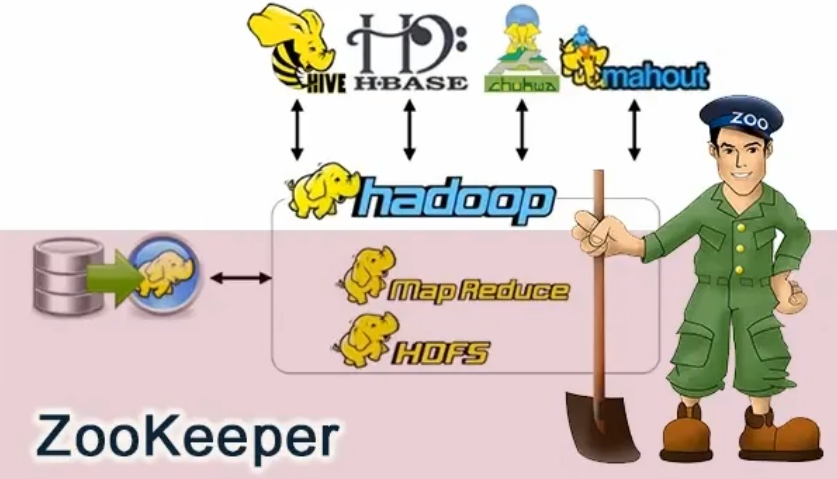
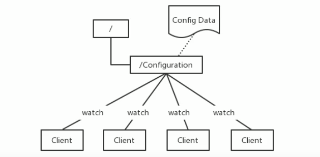
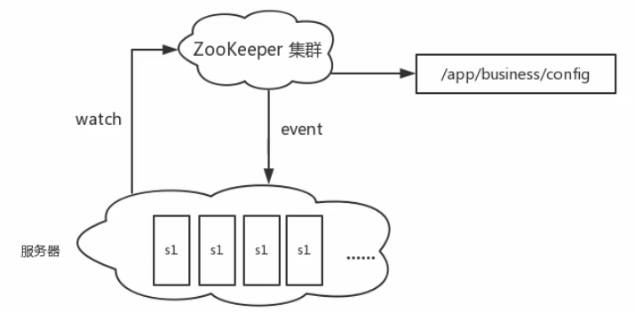
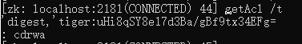
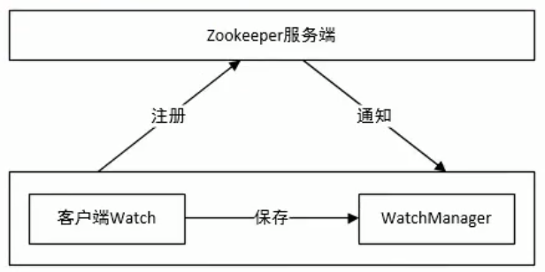
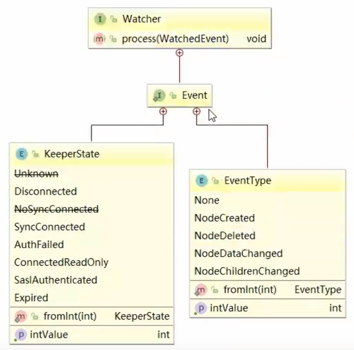
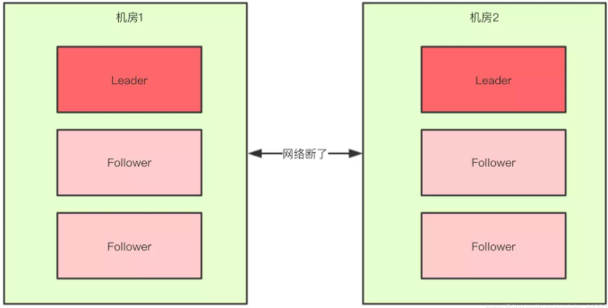
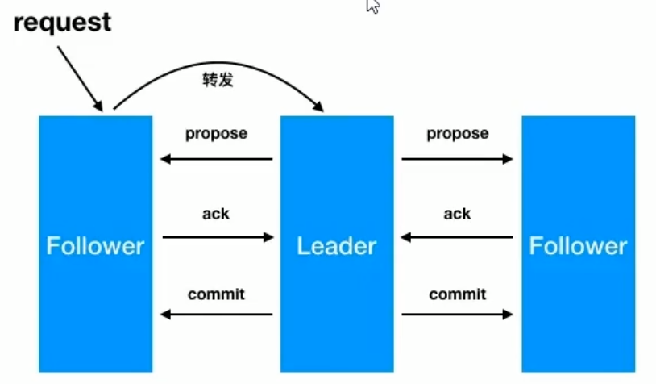

# Zookeeper

*2020-4-28* ——<https://www.bilibili.com/video/BV1M741137qY?p=74>

<https://zookeeper.apache.org/>

### 简介/快速入门

```
ZooKeeper is a centralized service for maintaining configuration information, naming, providing distributed synchronization, and providing group services. All of these kinds of services are used in some form or another by distributed applications. Each time they are implemented there is a lot of work that goes into fixing the bugs and race conditions that are inevitable. Because of the difficulty of implementing these kinds of services, applications initially usually skimp on them, which make them brittle in the presence of change and difficult to manage. Even when done correctly, different implementations of these services lead to management complexity when the applications are deployed.
```

`ZooKeeper`是一个集中的服务，用于维护配置信息、命名、提供分布式同步和提供组服务。所有这些类型的服务都以某种形式被分布式应用程序使用。每次它们被实现时，都会有大量的工作来修复不可避免的错误和竞争条件。由于实现这些服务的困难，应用程序最初通常会略过这些服务，这使得它们在出现更改时变得脆弱，并且难以管理。即使正确地执行了这些服务，在部署应用程序时，这些服务的不同实现也会导致管理复杂性

`zookeeper`由雅虎研究院开发,是` Google Chubby`的开源实现,后来托管到 `Apache`,于`2010年11月`正式成为`apache`的顶级项目

大数据生态系统里由很多组件的命名都是某些动物或者昆虫，比如`hadoop`大象，`hive`就是蜂巢，`zookeeper`即管理员，顾名思义就算管理大数据生态系统各组件的管理员，如下所示：



#### 应用场景

`zookeepepr`是一个经典的**分布式**数据一致性解决方案，致力于为分布式应用提供一个高性能、高可用,且具有严格顺序访问控制能力的分布式协调存储服务。

- 维护配置信息
- 分布式锁服务
- 集群管理
- 生成分布式唯一ID

1. **维护配置信息（配置中心）**

   - `java`编程经常会遇到配置项，比如数据库的`url`、 `schema`、`user`和 `password`等。通常这些配置项我们会放置在配置文件中，再将配置文件放置在服务器上当需要更改配置项时，需要去服务器上修改对应的配置文件。

     但是随着分布式系统的兴起,由于许多服务都需要使用到该配置文件,因此有**必须保证该配置服务的高可用性**(`highavailability`)和各台服务器上配置数据的一致性。

     通常会将配置文件部署在一个集群上，然而一个**集群动辄上千台**服务器，此时如果再一台台服务器逐个修改配置文件那将是非常繁琐且危险的的操作，因此就**需要一种服务**，**能够高效快速且可靠地完成配置项的更改等操作**，并能够保证各配置项在每台服务器上的数据一致性。

     **`zookeeper`就可以提供这样一种服务**，其使用`Zab`这种一致性协议来保证一致性。现在有很多开源项目使用`zookeeper`来维护配置，如在 `hbase`中，客户端就是连接一个 `zookeeper`，获得必要的 `hbase`集群的配置信息，然后才可以进一步操作。还有在开源的消息队列 `kafka`中，也便用`zookeeper`来维护 `brokers`的信息。在 `alibaba`开源的`soa`框架`dubbo`中也广泛的使用`zookeeper`管理一些配置来实现服务治理。

     

2. **分布式锁服务**

   - 一个集群是一个分布式系统，由多台服务器组成。为了提高并发度和可靠性，多台服务器上运行着同一种服务。当多个服务在运行时就需要协调各服务的进度，有时候需要保证当某个服务在进行某个操作时，其他的服务都不能进行该操作，即对该操作进行加锁，如果当前机器挂掉后，释放锁并 `fail over`到其他的机器继续执行该服务

3. **集群管理（注册中心）**

   - 一个集群有时会因为各种软硬件故障或者网络故障，出现棊些服务器挂掉而被移除集群，而某些服务器加入到集群中的情况，`zookeeper`会将这些服务器加入/移出的情况通知给集群中的其他正常工作的服务器，以及时调整存储和计算等任务的分配和执行等。此外`zookeeper`还会对故障的服务器做出诊断并尝试修复。

     

4. **生产分布式唯一ID**

   - 在过去的单库单表型系统中，通常可以使用数据库字段自带的`auto_ increment`属性来自动为每条记录生成一个唯一的`ID`。但是分库分表后，就无法在依靠数据库的`auto_ Increment`属性来唯一标识一条记录了。此时我们就可以用`zookeeper`在分布式环境下生成全局唯一`ID`。

     做法如下:每次要生成一个新`id`时，创建一个持久顺序节点，创建操作返回的节点序号，即为新`id`，然后把比自己节点小的删除即可

#### Zookeeper的设计目标

`zooKeeper`致力于为分布式应用提供一个高性能、高可用，且具有严格顺序访问控制能力的分布式协调服务

1. 高性能
   - `zookeeper`将全量数据存储在**内存**中，并直接服务于客户端的所有非事务请求，尤其用于以读为主的应用场景
2. 高可用
   - `zookeeper`一般以集群的方式对外提供服务，一般`3~5`台机器就可以组成一个可用的 `Zookeeper`集群了，每台机器都会在内存中维护当前的服务器状态，井且每台机器之间都相互保持着通信。只要集群中超过一半的机器都能够正常工作，那么整个集群就能够正常对外服务
3. 严格顺序访问
   - **对于来自客户端的每个更新请求，`Zookeeper`都会分配一个全局唯一的递增编号**，这个编号反应了所有事务操作的先后顺序


#### 数据模型

`zookeeper`的数据结点可以视为树状结构(或目录)，树中的各个结点被称为`znode `(即`zookeeper node`)，一个`znode`可以由多个子结点。`zookeeper`结点在结构上表现为树状；

使用路径`path`来定位某个`znode`，比如`/ns-1/itcast/mysqml/schemal1/table1`，此处`ns-1，itcast、mysql、schemal1、table1`分别是`根结点、2级结点、3级结点以及4级结点`；其中`ns-1`是`itcast`的父结点，`itcast`是`ns-1`的子结点，`itcast`是`mysql`的父结点....以此类推

`znode`，兼具文件和目录两种特点，即像文件一样维护着数据、元信息、ACL、时间戳等数据结构，又像目录一样可以作为路径标识的一部分


那么如何描述一个`znode`呢？一个`znode`大体上分为`3`个部分：

- 结点的数据：即`znode data `(结点`path`，结点`data`)的关系就像是`Java map `中的 `key value `关系
- 结点的子结点`children`
- 结点的状态`stat`：用来描述当前结点的创建、修改记录，包括`cZxid`、`ctime`等

#### 结点状态stat的属性

在`zookeeper shell `中使用 `get `命令查看指定路径结点的`data`、`stat`信息


属性说明：

结点的各个属性如下。其中重要的概念是`Zxid(Zookeeper Transaction ID)`，`Zookeeper`结点的每一次更改都具有唯一的`Zxid`，如果`Zxid-1` 小于` Zxid-2` ，则`Zxid-1` 的更改发生在 `Zxid-2 `更改之前

<https://zookeeper.apache.org/doc/r3.4.14/zookeeperProgrammers.html#sc_zkDataModel_znodes>

- `cZxid`当前数据结点创建时的事务ID——**针对于`zookeeper`数据结点的管理：我们对结点数据的一些写操作都会导致`zookeeper`自动地为我们去开启一个事务，并且自动地去为每一个事务维护一个事务`ID`，事务ID全局唯一**
- `ctime`当前数据结点创建时的时间
- `mZxid`当前数据结点数据最后一次更新时的事务ID（创建时与mZxid相等）
- `mtime`当前数据结点最后一次更新时的时间（创建时ctime相等）
- `pZxid`当前节点最后一次创建删除子节点的`zxid`（创建时与cZxid相等）
- `cversion`子结点的创建删除的次数
- `dataVersion`当前结点数据的更改次数
- `aclVersion`结点的ACL更改次数——类似`linux`的权限列表，维护的是当前结点的权限列表被修改的次数
- `ephemeralOwner`如果结点是临时结点，则表示创建该结点的会话的`SessionID`；如果是持久结点，该属性值为0
- `dataLength`数据内容的长度（bytes）
- `numChildren`数据结点当前的子结点个数


#### 数据节点的类型

`zookeeper`中的结点可以从**是否持久和是否为顺序节点**两方面分为四种四种，分别为**临时普通结点**和**永久普通结点**，**临时顺序节点，永久顺序节点**。结点的类型在创建时被确定，并且不能改变

> 是否持久：

- 临时节点：
  - 该节点的生命周期依赖于创建它们的会话。一旦会话( `Session`）结束，临时节点将被自动删除，当然可以也可以手动删除。虽然每个临时的 `Znode`都会绑定到一个客户端会话，但他们对所有的客户端还是可见的。另外，`Zookeeper`的临时节点不允许拥有子节点
  - **<font color=red>临时节点下面无法创建子节点</font>**
- 持久化结点：
  - 该结点的生命周期不依赖于会话，并且只有在客户端显示执行删除操作的时候，它们才能被删除

> 是否顺序节点

- 顺序节点

  - 在ZK中，**每个父节点会为他的第一级子节点维护一份时序，会记录每个子节点创建的先后顺序**。基于这个特性，在创建子节点的时候，可以设置这个属性，那么在创建节点过程中，ZK会自动为给定节点名加上一个**十位数字后缀**，作为新的节点名。这个数字后缀的范围是整型的最大值。

    <font color=red>**序列号从0000000000开始递增，每创建一个节点就递增一下（不管节点类型，所以即使创建临时的普通节点也会导致序列号增加）**</font>

    ~~~shell
    # 创建任何节点都会导致序列号增加
    create -s /test2/b
    Created /test2/b0000000000
        
    create /test2/b
    Created /test2/b
        
    create -s /test2/b
    Created /test2/b0000000002
    ~~~

- 非顺序节点

  - 非顺序节点就是普通节点，不会在节点名后面增加序列号


#### 单机安装

测试系统环境`centos7.3`

`zookeeper:zookeeper-3.4.10.tar.gz`

`jdk:jdk-8u131-linux-x64.tar.gz`

<http://archive.apache.org/dist/zookeeper/>

1. 在`centos `中使用 `root`用户创建 `zookeeper`用户，用户名:`zookeeper `密码:`zookeeper`

    ```shell
     useradd zookeeper
     passwd zookeeper
     su zookeeper
    ```

2. `zookeeper`底层依赖于jdk，`zookeeper`用户登录后，根目录下先进行jdk 的安装，jdk使用 `jdk-8u131-linux-x64.tar.gz`

    ```
     tar -zxf tar.gz
    ```

3. 配置jdk 环境变量

    ```shell
     vi /etc/profile
     JAVA_HOME=/home/zookeeper/jdk1.8.0_131
     export JAVA_HOME
     
     PATH=$JAVA_HOME/bin:$PATH
     export PATH
     
     souce /etc/profile
    ```

4. 检测jdk安装

    `java -version` // 如果反馈了Java信息，则成功

5. `zookeeper` 上传解压

    `tar -zxf tar.gz`

6. 为`zookeeper`准备配置文件

    ```shell
     # 进入conf目录
     cd /home/zookeeper/zookeeper-3.4.10/conf
     # 复制配置文件
     cp zoo_sampe.cfg zoo.cfg
     # zookeeper 根目录下创建data目录
     mkdir data
     # vi 配置文件中的dataDir
     # 此路径用于存储zookeeper中数据的内存快照、及事务日志文件，虽然zookeeper是使用内存的，但是需要持久化一些数据来保证数据的安全，和redis一样
     dataDir=../data
    ```

7. 启动`zookeeper`

    ```shell
     # 进入zookeeper的bin目录
     cd /home/zookeeper/zookeeper-3.4.10/bin
     # 启动zookeeper
     ./zkServer.sh start
     
     # 启动: zkServer.sh start
     # 停止: zkServer.sh stop
     # 查看状态：zkServer.sh status
     
     # 进入zookeeper 内部
     ./zkCli.sh
    ```

     

#### zookeeper命令行

~~~shell
# 在zookeeper根目录下的bin目录

# 启动zk，默认使用conf/zoo.cfg配置文件
./zkServer.sh start
# windows下双击zkServer.cmd或者cmd里面输入
zkServer.cmd 或者 zkServer


# 启动zk，指定配置文件(--config后面跟的是配置文件所在的目录，不能指定配置文件名，也不能使用../conf/)
./zkServer.sh --config ../conf start 

# 停止zk
./zkServer.sh stop

# 重启zk
./zkServer.sh restart

# 查看zk状态，默认查看的是localhost:2181上的zk的状态
./zkServer.sh status

# 启动客户端, 默认连接localhost:2181， 通过-server host:port指定位置
./zkCli.sh
zkCli
# windows下双击zkCli.cmd或者cmd执行
zkCli.cmd 或者 zkCli
~~~


#### 客户端shell命令（3.6.x）

`zookeeper`——`getting started`——https://zookeeper.apache.org/doc/r3.6.2/zookeeperStarted.html

**帮助**

- <font color=red>ls -w监听子节点的创建删除变化，get -w和stat -w监听节点的数据变化</font>, 监听器是一次性的。

~~~shell
help

ZooKeeper -server host:port -client-configuration properties-file cmd args
        addWatch [-m mode] path # optional mode is one of [PERSISTENT, PERSISTENT_RECURSIVE] - default is PERSISTENT_RECURSIVE
        addauth scheme auth
        # 关闭当前连接但不退出客户端
        close
        config [-c] [-w] [-s]
        # 连接zkServer，可用于close命令后连接新的zkServer
        connect host:port
        # 创建节点 -s创建顺序节点， -e创建临时节点
        create [-s] [-e] [-c] [-t ttl] path [data] [acl]
        # 删除节点，-v 指定dataVersion， 当前节点的dataVersion与指定的version不同将删除失败
        delete [-v version] path
        # 递归删除该节点和所有子节点
        deleteall path [-b batch size]
        delquota [-n|-b] path
        # 获取节点数据，-s获取数据和stat， -w监听指定路径的数据变化
        get [-s] [-w] path
        getAcl [-s] path
        # 递归获取指定节点的所有子节点数量
        getAllChildrenNumber path
        # 递归获取指定节点及其下面的所有临时节点
        getEphemerals path
        # 查看历史记录
        history
        listquota path
        # 查看子节点，-R递归查看所有子目录，-s 查看子节点和stat， -w同时监听指定路径的节点变化（新增，删除子节点）
        ls [-s] [-w] [-R] path
        printwatches on|off
        # 退出客户端
        quit
        reconfig [-s] [-v version] [[-file path] | [-members serverID=host:port1:port2;port3[,...]*]] | [-add serverId=host:port1:port2;port3[,...]]* [-remove serverId[,...]*]
        redo cmdno
        removewatches path [-c|-d|-a] [-l]
        # 设置node的value，-s返回node的stat， -v 指定version，如果节点的dataVersion与指定的version不同将修改失败
        set [-s] [-v version] path data
        setAcl [-s] [-v version] [-R] path acl
        setquota -n|-b val path
        # 查看stat， -w同时节点数据变化
        stat [-w] path
        sync path
        # 查看当前客户端的版本
        version
~~~


**查询**

`get /hadoop`  查看结点的数据     `stat /hadoop` 查看结点的属性

创建节点的时候不设置节点的数据，get命令获取的就是null


**创建**

`create [-s] [-e] path [data]` # 其中 -s 为有序结点，-e 临时结点（默认是持久结点），**data在3.4版本必须写入，在3.6版本可选，不写入就是null**

```shell
create /hadoop "123456"  # 此时，如果quit退出后再./ZkCient.sh 登入
                         # 再用输入 get /hadoop 获取，结点依然存在(永久结点)
				       
create -s /a "a"         # 创建一个持久化有序结点，创建的时候可以观察到返回的数据带上了一个id       
create -s /b "b"         # 返回的值，id递增了

create -s -e /aa "aa"    # 依然还会返回自增的id，quit后再进来，继续创建，id依然是往后推的

create /aa/xx            # 继续创建结点，可以看到pZxid变化了
```

**更新**

更新结点的命令是`set`，可以直接进行修改，如下：

`set path [version]`

```shell
set /hadoop "345"        # 修改结点值

set /hadoop "hadoop-x" 1 # 也可以基于版本号进行更改，类似于乐观锁，当传入版本号(dataVersion)
                         # 和当前结点的数据版本号不一致时，zookeeper会拒绝本次修改
```

**删除**

删除结点的语法如下：

`delete path [version]` 和 `set` 方法相似，也可以传入版本号

```shell
delete /hadoop           # 删除结点
delete /hadoop 1         # 乐观锁机制，与set 方法一致
```

要想删除某个结点及其所有后代结点，可以使用递归删除，命令为 `rmr path`

**查看结点列表**

```shell
ls /hadoop               # 可以查看结点的列表
ls -s /hadoop              # 可以查看结点的列表以及目标结点的信息
```

**监听器get path [watch] | stat path [watch]** 

使用`get path [watch]` 注册的监听器能够在结点**数据发生改变**的时候，向客户端发出通知。需要注意的是`zookeeper`的触发器是一次性的(`One-time trigger`)，即触发一次后就会立即失效

```shell
get /hadoop watch        # get 的时候添加监听器，当值改变的时候，监听器返回消息
set /hadoop 45678        # 测试
```

**ls\ls2 path [watch]**

使用 `ls path [watch] 或 ls2 path [watch] `注册的监听器能够监听该结点下**所有子节点**的**增加**和**删除**操作

```shell
ls /hadoop watch         # 添加监听器
set /hadoop/node "node"
```


### zookeeper的Acl权限控制

#### 概念

<https://zookeeper.apache.org/doc/r3.4.14/zookeeperProgrammers.html#sc_ZooKeeperAccessControl>

<https://zookeeper.apache.org/doc/r3.4.14/zookeeperProgrammers.html#sc_BuiltinACLSchemes>

`acl`权限控制，使用`scheme：id：permission `来标识，主要涵盖3个方面：

- 权限模式(`scheme`)：授权的策略
- 授权对象(`id`)：授权的对象
- 权限(`permission`)：授予的权限

其特性如下：

- `zookeeper`的权限控制是基于每个`znode`结点的，需要对每个结点设置权限
- 每个`znode `支持多种权限控制方案，**设置多个权限控制方案使用setAcl \<path> \<acl>,\<acl>(通过逗号隔开)**
- **子结点不会继承父结点的权限，客户端无权访问某结点，但可能可以访问它的子结点**
- 新创建的节点权限默认为：world:anyone:crwda，即任何人拥有所有权限

**权限模式**

| 方案   | 描述                                                    |
| ------ | ------------------------------------------------------- |
| world  | 只有一个用户：`anyone`，代表登录`zookeeper`所有人(默认) |
| ip     | 对客户端使用IP地址认证                                  |
| auth   | 使用已添加认证的用户认证                                |
| digest | 使用"用户名：密码"方式认证                              |

**授权对象**

授权对象ID是指，权限赋予的实体，例如：IP地址或用户

**授权的权限**

可以试图删除父结点，但是子结点必须删除干净，所以`delete`的权限也是很有用的

| 权限   | ACL简写 | 描述                                                         |
| ------ | ------- | ------------------------------------------------------------ |
| create | c       | 可以创建子结点                                               |
| delete | d       | 可以删除子结点(仅下一级结点)， 当前节点是否可以删除由其父节点的权限来控制 |
| read   | r       | 可以读取结点数据以及显示子结点列表，没有r权限也可以使用stat，但是无法使用ls和get |
| write  | w       | 可以设置结点数据                                             |
| admin  | a       | 可以设置结点访问控制权限列表                                 |

**授权的相关命令**

| 命令    | 使用方式                  | 描述         |
| ------- | ------------------------- | ------------ |
| getAcl  | getAcl \<path>            | 读取ACL权限  |
| setAcl  | setAcl \<path> \<acl>     | 设置ACL权限  |
| addauth | addauth \<scheme> \<auth> | 添加认证用户 |


#### 演示

> world模式

命令：

~~~shell
setAcl <path> world:anyone:<acl>
~~~

演示：

~~~shell
create /t ha
setAcl /t world:anyone:cd # 设置任何人只有创建删除子节点的权利
~~~

> ip模式

命令：

~~~shell
# 多个控制权限使用逗号隔开
setAcl <path> ip:<ip>:<acl>[,<path> ip:<ip>:<acl>]
~~~

演示：

~~~shell
# 给与130和129这两个机子所有权限
setAcl /node ip:192.168.60.130:cdwar,ip:192.168.60.129:cdwra
~~~

> Auth授权模式

命令：

~~~shell
# 通过用户和密码创建一个授权口令
addauth digest <user>:<password> 
# 通过用户名创建授权模式
setAcl <path> auth:<user>:<acl>

# 其他登陆的用户需要通过用户名和密码添加该授权口令才可以访问该路径
addauth digest <user>:<password>
~~~

演示：


>  Digest授权模式

命令：

~~~shell
# 通过用户名和密码生产一个口令
echo -n <user>:<password> | openssl dgst -binary -sha1 | openssl base64

# 通过用户和口令创建一个授权模式
setAcl <path> digest:<user>:<password>:<acl>

# 其他用户需要通过用户名和密码添加该授权口令才可以访问该路径
addauth digest <user>:<password>
~~~

演示：

```shell
# 计算密码
echo -n itcast:12345 | openssl dgst -binary -sha1 | openssl base64

# 获取密码，设置权限列表
setAcl /hadoop digest:itcast:qUFSHxJjItUW/93UHFXFVGlvryY=:cdrwa

# 现在想要get /hadoop 需要登录了
addauth digest itcast:12345
get /hadoop
```

> auth和digest模式的不同



其实zookeeper为授权添加了一个用户和一个密文，当用户通过addauth添加用户名和密码时，zookeeper通过用户名和密码进行sha1加密在进行base64编码得到一个字符串，再将得到的字符串和权限上的字符串进行比较来判断用户是否有权限访问该节点，而digest模型需要用户自己去加密编码获取这个密文并添加在acl上，而auth模式就是需要先通过addauth在zk中创建这个密文，然后在auth模式的时候添加上用户，同时也就添加上了对应的密文来创建这个acl。


**多种授权模式**

仅需逗号隔开

- ```shell
   setAcl /hadoop ip:192.168.133.132:cdrwa,auth:hadoop:cdrwa,digest:itcast:673OfZhUE8JEFMcu0l64qI8e5ek=:cdrwa
  ```

  

#### acl 超级管理员

> 原理

`zookeeper`的权限管理模式有一种叫做`super`，该模式提供一个超管，一旦当前连接addAuthInfo超级用户验证通过，后续所有操作都不会checkACL.

该属性是一个java system property，所以要修改启动脚本。

> 实现

假设这个超管是`supper:admin`，需要为超管生产密码的密文

```shell
echo -n super:admin | openssl dgst -binary -sha1 | openssl base64
```

那么打开`zookeeper`目录下`/bin/zkServer.sh`服务器脚本文件，找到如下一行：

```shell
 /nohup # 快速查找，可以看到如下
 nohup "$JAVA" "-Dzookeeper.log.dir=${ZOO_LOG_DIR}" "-Dzookeeper.root.logger=${ZOO_LOG4J_PROP}"
```

这个就是脚本中启动`zookeeper`的命令，默认只有以上两个配置项，我们需要添加一个超管的配置项

```
"-Dzookeeper.DigestAuthenticationProvider.superDigest=super:xQJmxLMiHGwaqBvst5y6rkB6HQs="
```

修改后命令变成如下

```shell
nohup "$JAVA" "-Dzookeeper.log.dir=${ZOO_LOG_DIR}" "-Dzookeeper.root.logger=${ZOO_LOG4J_PROP}" "-Dzookeeper.DigestAuthenticationProvider.superDigest=super:xQJmxLMiHGwaqBvst5y6rkB6HQs="
```

``` shell
  # 重起后，现在随便对任意节点添加权限限制
  setAcl /hadoop ip:192.168.1.1:cdrwa # 这个ip并非本机
  # 现在当前用户没有权限了
  getAcl /hadoop
  # 登录超管
  addauth digest super:admin
  # 强行操作节点
  get /hadoop
```

  

### zookeeper的 JavaAPI

```html
<dependency>
            <groupId>com.101tec</groupId>
            <artifactId>zkclient</artifactId>
            <exclusions>
                <exclusion>
                    <artifactId>zookeeper</artifactId>
                    <groupId>org.apache.zookeeper</groupId>
                </exclusion>
                <exclusion>
                    <artifactId>log4j</artifactId>
                    <groupId>log4j</groupId>
                </exclusion>
                <exclusion>
                    <artifactId>slf4j-log4j12</artifactId>
                    <groupId>org.slf4j</groupId>
                </exclusion>
                <exclusion>
                    <artifactId>slf4j-api</artifactId>
                    <groupId>org.slf4j</groupId>
                </exclusion>
            </exclusions>
            <version>0.9</version>
        </dependency>
        <dependency>
            <artifactId>zookeeper</artifactId>
            <exclusions>
                <exclusion>
                    <artifactId>log4j</artifactId>
                    <groupId>log4j</groupId>
                </exclusion>
                <exclusion>
                    <artifactId>slf4j-log4j12</artifactId>
                    <groupId>org.slf4j</groupId>
                </exclusion>
            </exclusions>
            <groupId>org.apache.zookeeper</groupId>
            <version>3.4.10</version>
        </dependency>
```

`zonde `是 `zookeeper `集合的核心组件，` zookeeper API` 提供了一小组使用 `zookeeper `集群来操作`znode `的所有细节

客户端应该遵循以下步骤，与`zookeeper`服务器进行清晰和干净的交互

- 连接到`zookeeper`服务器。`zookeeper`服务器为客户端分配会话`ID`
- 定期向服务器发送心跳。否则，`zookeeper `服务器将过期会话`ID`，客户端需要重新连接
- 只要会话`Id`处于活动状态，就可以获取/设置`znode`
- 所有任务完成后，断开与`zookeeper`服务器连接，如果客户端长时间不活动，则`zookeeper`服务器将自动断开客户端

#### 连接到Zookeeper

这部分，官网的解释十分稀少<https://zookeeper.apache.org/doc/r3.4.14/zookeeperStarted.html#sc_ConnectingToZooKeeper>


```java
Zookeeper(String connectionString, int sessionTimeout, watcher watcher)
```

- `connectionString` - `zookeeper `主机
- `sessionTimeout `- 会话超时
- `watcher` - 实现"监听器" 对象。`zookeeper`集合通过监视器对象返回连接状态

```java
public static void main(String[] args) throws IOException, InterruptedException {
        CountDownLatch countDownLatch = new CountDownLatch(1);

        ZooKeeper zookeeper = new ZooKeeper("192.168.133.133:2181", 5000, (WatchedEvent x) -> {
            if (x.getState() == Watcher.Event.KeeperState.SyncConnected) {
                System.out.println("连接成功");
                countDownLatch.countDown();
            }
        });
        countDownLatch.await();
        System.out.println(zookeeper.getSessionId());
        zookeeper.close();
    }
```

##### 新增节点

- ```java
  // 同步
  create(String path, byte[] data, List<ACL> acl, CreateMode createMode)
  // 异步
  create(String path, byte[] data, List<ACL> acl, CreateMode createMode,
        AsynCallback.StringCallback callBack, Object ctx)
  ```

- | 参数         | 解释                                                         |
  | ------------ | ------------------------------------------------------------ |
  | `path`       | `znode `路径                                                 |
  | `data`       | 数据                                                         |
  | `acl`        | 要创建的节点的访问控制列表。`zookeeper API `提供了一个静态接口 `ZooDefs.Ids` 来获取一些基本的`acl`列表。例如，`ZooDefs.Ids.OPEN_ACL_UNSAFE`返回打开`znode`的`acl`列表 |
  | `createMode` | 节点的类型，这是一个枚举                                     |
  | `callBack`   | 异步回调接口                                                 |
  | `ctx`        | 传递上下文参数                                               |

示例：

- ```java
  // 枚举的方式
      public static void createTest1() throws Exception{
          String str = "node";
          String s = zookeeper.create("/node", str.getBytes(),
                  ZooDefs.Ids.READ_ACL_UNSAFE, CreateMode.PERSISTENT);
          System.out.println(s);
      }
  ```

- ```java
  // 自定义的方式
      public static void createTest2() throws Exception{
          ArrayList<ACL> acls = new ArrayList<>();
          Id id = new Id("ip","192.168.133.133");
          acls.add(new ACL(ZooDefs.Perms.ALL,id));
          zookeeper.create("/create/node4","node4".getBytes(),acls,CreateMode.PERSISTENT);
      }
  ```

- ```java
  // auth
      public static void createTest3() throws  Exception{
          zookeeper.addAuthInfo("digest","itcast:12345".getBytes());
          zookeeper.create("/node5","node5".getBytes(),
                  ZooDefs.Ids.CREATOR_ALL_ACL,CreateMode.PERSISTENT);
      }
  // 自定义的方式
      public static void createTest3() throws  Exception{
  //        zookeeper.addAuthInfo("digest","itcast:12345".getBytes());
  //        zookeeper.create("/node5","node5".getBytes(),
  //                ZooDefs.Ids.CREATOR_ALL_ACL,CreateMode.PERSISTENT);
          zookeeper.addAuthInfo("digest","itcast:12345".getBytes());
          List<ACL> acls = new ArrayList<>();
          Id id = new Id("auth","itcast");
          acls.add(new ACL(ZooDefs.Perms.READ,id));
          zookeeper.create("/create/node6","node6".getBytes(),
                  acls,CreateMode.PERSISTENT);
      }
  ```

- ```java
  // digest 
  public static void createTest3() throws  Exception{
      List<ACL> acls = new ArrayList<>();
      Id id = new Id("digest","itcast:qUFSHxJjItUW/93UHFXFVGlvryY=");
      acls.add(new ACL(ZooDefs.Perms.READ,id));
      zookeeper.create("/create/node7","node7".getBytes(), 	
                       acls,CreateMode.PERSISTENT);
  }
  ```

- ```java
  // 异步
      public static void createTest4() throws  Exception{
          zookeeper.create("/node12", "node12".getBytes(), ZooDefs.Ids.OPEN_ACL_UNSAFE, CreateMode.PERSISTENT, new AsyncCallback.StringCallback(){
              /**
               * @param rc 状态，0 则为成功，以下的所有示例都是如此
               * @param path 路径
               * @param ctx 上下文参数
               * @param name 路径
               */
              public void processResult(int rc, String path, Object ctx, String name){
                  System.out.println(rc + " " + path + " " + name +  " " + ctx);
              }
          }, "I am context");
          TimeUnit.SECONDS.sleep(1);
          System.out.println("结束");
      }
  ```

  

##### 修改节点

同样也有两种修改方式(`异步和同步`)

- ```java
  // 同步
  setData(String path, byte[] data, int version)
  // 异步
  setData(String path, byte[] data, int version, StatCallback callBack, Object ctx)
  ```

- 

- | 参数       | 解释                                                         |
  | ---------- | ------------------------------------------------------------ |
  | `path`     | 节点路径                                                     |
  | `data`     | 数据                                                         |
  | `version`  | 数据的版本号， -`1`代表不使用版本号，乐观锁机制              |
  | `callBack` | 异步回调 `AsyncCallback.StatCallback`，和之前的回调方法参数不同，这个可以获取节点状态 |
  | `ctx`      | 传递上下文参数                                               |

- ```java
      public static void setData1() throws Exception{
      	// arg1:节点的路径
          // arg2:修改的数据
          // arg3:数据的版本号 -1 代表版本号不参与更新
          Stat stat = zookeeper.setData("/hadoop","hadoop-1".getBytes(),-1);
      }
  ```

- ```java
      public static void setData2() throws Exception{
          zookeeper.setData("/hadoop", "hadoop-1".getBytes(), 3 ,new AsyncCallback.StatCallback(){
              @Override
              public void processResult(int rc, String path, Object ctx, Stat stat) {
                  // 讲道理，要判空
                  System.out.println(rc + " " + path + " " + stat.getVersion() +  " " + ctx);
              }
          }, "I am context");
      }
  ```

##### 删除节点

异步、同步

- ```java
  // 同步
  delete(String path, int version)
  // 异步
  delete(String path, int version, AsyncCallback.VoidCallback callBack, Object ctx)
  ```

- 

- | 参数       | 解释                                            |
  | ---------- | ----------------------------------------------- |
  | `path`     | 节点路径                                        |
  | `version`  | 版本                                            |
  | `callBack` | 数据的版本号， -`1`代表不使用版本号，乐观锁机制 |
  | `ctx`      | 传递上下文参数                                  |

- ```java
      public static void deleteData1() throws Exception {
          zookeeper.delete("/hadoop", 1);
      }
  
      public static void deleteData2() throws Exception {
          zookeeper.delete("/hadoop", 1, new AsyncCallback.VoidCallback() {
              @Override
              public void processResult(int rc, String path, Object ctx) {
                  System.out.println(rc + " " + path + " " + ctx);
              }
          }, "I am context");
          TimeUnit.SECONDS.sleep(1);
      }
  ```

  

##### 查看节点

同步、异步

- ```java
  // 同步
  getData(String path, boolean watch, Stat stat)
  getData(String path, Watcher watcher, Stat stat)
  // 异步
  getData(String path, boolean watch, DataCallback callBack, Object ctx)
  getData(String path, Watcher watcher, DataCallback callBack, Object ctx)
  ```

-  

- | 参数       | 解释                             |
  | ---------- | -------------------------------- |
  | `path`     | 节点路径                         |
  | `boolean`  | 是否使用连接对象中注册的监听器   |
  | `stat`     | 元数据                           |
  | `callBack` | 异步回调接口，可以获得状态和数据 |
  | `ctx`      | 传递上下文参数                   |

- ```java
      public static void getData1() throws Exception {
          Stat stat = new Stat();
          byte[] data = zookeeper.getData("/hadoop", false, stat);
          System.out.println(new String(data));
          // 判空
          System.out.println(stat.getCtime());
      }
  
      public static void getData2() throws Exception {
          zookeeper.getData("/hadoop", false, new AsyncCallback.DataCallback() {
              @Override
              public void processResult(int rc, String path, Object ctx, byte[] bytes, Stat stat) {
                  // 判空
                  System.out.println(rc + " " + path
                                     + " " + ctx + " " + new String(bytes) + " " + 
                                     stat.getCzxid());
              }
          }, "I am context");
          TimeUnit.SECONDS.sleep(3);
      }
  ```

  

##### 查看子节点

同步、异步

- ```java
  // 同步
  getChildren(String path, boolean watch)
  getChildren(String path, Watcher watcher)
  getChildren(String path, boolean watch, Stat stat)    
  getChildren(String path, Watcher watcher, Stat stat)
  // 异步
  getChildren(String path, boolean watch, ChildrenCallback callBack, Object ctx)    
  getChildren(String path, Watcher watcher, ChildrenCallback callBack, Object ctx)
  getChildren(String path, Watcher watcher, Children2Callback callBack, Object ctx)    
  getChildren(String path, boolean watch, Children2Callback callBack, Object ctx)
  ```

-  

- | 参数       | 解释                       |
  | ---------- | -------------------------- |
  | `path`     | 节点路径                   |
  | `boolean`  |                            |
  | `callBack` | 异步回调，可以获取节点列表 |
  | `ctx`      | 传递上下文参数             |

- ```java
      public static void getChildren_1() throws Exception{
          List<String> hadoop = zookeeper.getChildren("/hadoop", false);
          hadoop.forEach(System.out::println);
      }
  
      public static void getChildren_2() throws Exception {
          zookeeper.getChildren("/hadoop", false, new AsyncCallback.ChildrenCallback() {
              @Override
              public void processResult(int rc, String path, Object ctx, List<String> list) {
                  list.forEach(System.out::println);
                  System.out.println(rc + " " + path + " " + ctx);
              }
          }, "I am children");
          TimeUnit.SECONDS.sleep(3);
      }
  ```


##### 检查节点是否存在

同步、异步

- ```java
  // 同步
  exists(String path, boolean watch)
  exists(String path, Watcher watcher)
  // 异步
  exists(String path, boolean watch, StatCallback cb, Object ctx)
  exists(String path, Watcher watcher, StatCallback cb, Object ctx)
  ```

- 

- | 参数       | 解释                       |
  | ---------- | -------------------------- |
  | `path`     | 节点路径                   |
  | `boolean`  |                            |
  | `callBack` | 异步回调，可以获取节点列表 |
  | `ctx`      | 传递上下文参数             |

- ```java
  public static void exists1() throws Exception{
      Stat exists = zookeeper.exists("/hadoopx", false);
      // 判空
      System.out.println(exists.getVersion() + "成功");
  }
  public static void exists2() throws Exception{
      zookeeper.exists("/hadoopx", false, new AsyncCallback.StatCallback() {
          @Override
          public void processResult(int rc, String path, Object ctx, Stat stat) {
              // 判空
              System.out.println(rc + " " + path + " " + ctx +" " + stat.getVersion());
          }
      }, "I am children");
      TimeUnit.SECONDS.sleep(1);
  }
  ```


### 事件监听机制

**watcher概念**

<https://zookeeper.apache.org/doc/r3.4.14/zookeeperProgrammers.html#sc_WatchRememberThese>

- `zookeeper`提供了数据的`发布/订阅`功能，多个订阅者可同时监听某一特定主题对象，当该主题对象的自身状态发生变化时例如节点内容改变、节点下的子节点列表改变等，会实时、主动通知所有订阅者
- `zookeeper`采用了 `Watcher`机制实现数据的发布订阅功能。该机制在被订阅对象发生变化时会异步通知客户端，因此客户端不必在 `Watcher`注册后轮询阻塞，从而减轻了客户端压力
- `watcher`机制事件上与观察者模式类似，也可看作是一种观察者模式在分布式场景下的实现方式

#### watcher架构

`watcher`实现由三个部分组成

- `zookeeper`服务端
- `zookeeper`客户端
- 客户端的`ZKWatchManager对象`

客户端**首先将 `Watcher`注册到服务端**，同时将 `Watcher`对象**保存到客户端的`watch`管理器中**。当`Zookeeper`服务端监听的数据状态发生变化时，服务端会**主动通知客户端**，接着客户端的 `Watch`管理器会**触发相关 `Watcher`**来回调相应处理逻辑，从而完成整体的数据 `发布/订阅`流程



#### watcher特性

| 特性           | 说明                                                         |
| -------------- | ------------------------------------------------------------ |
| 一次性         | `watcher`是**一次性**的，一旦被触发就会移除，再次使用时需要重新注册 |
| 客户端顺序回调 | `watcher`回调是**顺序串行**执行的，只有回调后客户端才能看到最新的数据状态。一个`watcher`回调逻辑不应该太多，以免影响别的`watcher`执行 |
| 轻量级         | `WatchEvent`是最小的通信单位，结构上只包含**通知状态、事件类型和节点路径**，并不会告诉数据节点变化前后的具体内容 |
| 时效性         | `watcher`只有在当前`session`彻底失效时才会无效，若在`session`有效期内快速重连成功，则`watcher`依然存在，仍可接收到通知； |

**watcher接口设计**

`Watcher`是一个接口，任何实现了`Watcher`接口的类就算一个新的`Watcher`。`Watcher`内部包含了两个枚举类：`KeeperState`、`EventType`



##### Watcher通知状态(KeeperState)

`KeeperState`是客户端与服务端**连接状态**发生变化时对应的通知类型。路径为`org.apache.zookeeper.Watcher.EventKeeperState`，是一个枚举类，其枚举属性如下：

- 

- | 枚举属性        | 说明                     |
  | --------------- | ------------------------ |
  | `SyncConnected` | 客户端与服务器正常连接时 |
  | `Disconnected`  | 客户端与服务器断开连接时 |
  | `Expired`       | 会话`session`失效时      |
  | `AuthFailed`    | 身份认证失败时           |

  

##### Watcher事件类型(EventType)

`EventType`是**数据节点`znode`发生变化**时对应的通知类型。**`EventType`变化时`KeeperState`永远处于`SyncConnected`通知状态下**；当`keeperState`发生变化时，`EventType`永远为`None`。其路径为`org.apache.zookeeper.Watcher.Event.EventType`，是一个枚举类，枚举属性如下：

-   

- | 枚举属性              | 说明                                                        |
  | --------------------- | ----------------------------------------------------------- |
  | `None`                | 无                                                          |
  | `NodeCreated`         | `Watcher`监听的数据节点被创建时                             |
  | `NodeDeleted`         | `Watcher`监听的数据节点被删除时                             |
  | `NodeDataChanged`     | `Watcher`监听的数据节点内容发生更改时(无论数据是否真的变化) |
  | `NodeChildrenChanged` | `Watcher`监听的数据节点的子节点列表发生变更时               |

- 注意：客户端接收到的相关事件通知中只包含状态以及类型等信息，不包含节点变化前后的具体内容，变化前的数据需业务自身存储，变化后的数据需要调用`get`等方法重新获取

##### 捕获相应的事件

上面讲到`zookeeper`客户端连接的状态和`zookeeper`对`znode`节点监听的事件类型，下面我们来讲解如何建立`zookeeper`的***`watcher`监听***。在`zookeeper`中采用`zk.getChildren(path,watch)、zk.exists(path,watch)、zk.getData(path,watcher,stat)`这样的方式来为某个`znode`注册监听 。

下表以`node-x`节点为例，说明调用的注册方法和可用监听事件间的关系：

| 注册方式                            | created | childrenChanged | Changed | Deleted |
| ----------------------------------- | ------- | --------------- | ------- | ------- |
| `zk.exists("/node-x",watcher)`      | 可监控  |                 | 可监控  | 可监控  |
| `zk.getData("/node-x",watcher)`     |         |                 | 可监控  | 可监控  |
| `zk.getChildren("/node-x",watcher)` |         | 可监控          |         | 可监控  |

**注册watcher的方法**

##### 客户端与服务器端的连接状态

- `KeeperState `：通知状态

- `SyncConnected`：客户端与服务器正常连接时

- `Disconnected`：客户端与服务器断开连接时

- `Expired`：会话`session`失效时

- `AuthFailed`：身份认证失败时

- 事件类型为：`None`

  - 案例

  - ```java
    public class ZkConnectionWatcher implements Watcher {
        @Override
        public void process(WatchedEvent watchedEvent) {
            Event.KeeperState state = watchedEvent.getState();
            if(state == Event.KeeperState.SyncConnected){
                // 正常
                System.out.println("正常连接");
            }else if (state == Event.KeeperState.Disconnected){
                // 可以用Windows断开虚拟机网卡的方式模拟
                // 当会话断开会出现，断开连接不代表不能重连，在会话超时时间内重连可以恢复正常
                System.out.println("断开连接");
            }else if (state == Event.KeeperState.Expired){
                // 没有在会话超时时间内重新连接，而是当会话超时被移除的时候重连会走进这里
                System.out.println("连接过期");
            }else if (state == Event.KeeperState.AuthFailed){
                // 在操作的时候权限不够会出现
                System.out.println("授权失败");
            }
            countDownLatch.countDown();
        }
        private static final String IP = "192.168.133.133:2181"
    ;
        private static CountDownLatch countDownLatch = new CountDownLatch(1);
    
        public static void main(String[] args) throws Exception {
            // 5000为会话超时时间
            ZooKeeper zooKeeper = new ZooKeeper(IP, 5000, new ZkConnectionWatcher());
            countDownLatch.await();
            // 模拟授权失败
            zooKeeper.addAuthInfo("digest1","itcast1:123451".getBytes());
            byte[] data = zooKeeper.getData("/hadoop", false, null);
            System.out.println(new String(data));
            TimeUnit.SECONDS.sleep(50);
        }
    }
    ```


##### watcher检查节点

**exists**

- `exists(String path, boolean b)`

- `exists(String path, Watcher w)`

- `NodeCreated`：**节点**创建

- `NodeDeleted`：**节点**删除

- `NodeDataChanged`：**节点**内容

  - 案例

  - ```java
    public class EventTypeTest {
        private static final String IP = "192.168.133.133:2181";
        private static CountDownLatch countDownLatch = new CountDownLatch(1);
        private static ZooKeeper zooKeeper;
    
        // 采用zookeeper连接创建时的监听器
        public static void exists1() throws Exception{
            zooKeeper.exists("/watcher1",true);
        }
        // 自定义监听器
        public static void exists2() throws Exception{
            zooKeeper.exists("/watcher1",(WatchedEvent w) -> {
                System.out.println("自定义" + w.getType());
            });
        }
        // 演示使用多次的监听器
        public static void exists3() throws Exception{
            zooKeeper.exists("/watcher1", new Watcher() {
                @Override
                public void process(WatchedEvent watchedEvent) {
                    try {
                        System.out.println("自定义的" + watchedEvent.getType());
                    } finally {
                        try {
                            zooKeeper.exists("/watcher1",this);
                        } catch (Exception e) {
                            e.printStackTrace();
                        }
                    }
                }
            });
        }
        // 演示一节点注册多个监听器
        public static void exists4() throws Exception{
            zooKeeper.exists("/watcher1",(WatchedEvent w) -> {
                System.out.println("自定义1" + w.getType());
            });
            zooKeeper.exists("/watcher1", new Watcher() {
                @Override
                public void process(WatchedEvent watchedEvent) {
                    try {
                        System.out.println("自定义2" + watchedEvent.getType());
                    } finally {
                        try {
                            zooKeeper.exists("/watcher1",this);
                        } catch (Exception e) {
                            e.printStackTrace();
                        }
                    }
                }
            });
        }
        // 测试
        public static void main(String[] args) throws Exception {
            zooKeeper = new ZooKeeper(IP, 5000, new ZKWatcher());
            countDownLatch.await();
            exists4();
            TimeUnit.SECONDS.sleep(50);
        }
    
        static class ZKWatcher implements Watcher{
            @Override
            public void process(WatchedEvent watchedEvent) {
                countDownLatch.countDown();
                System.out.println("zk的监听器" + watchedEvent.getType());
            }
        }
    
    }
    ```

**getData**

- `getData(String path, boolean b, Stat stat)`
- `getData(String path, Watcher w, Stat stat)`
- `NodeDeleted`：**节点**删除
- `NodeDataChange`：**节点**内容发生变化

**getChildren**

- `getChildren(String path, boolean b)`
- `getChildren(String path, Watcher w)`
- `NodeChildrenChanged`：**子节点**发生变化
- `NodeDeleted`：**节点删除**

**配置中心案例**

工作中有这样的一个场景：数据库用户名和密码信息放在一个配置文件中，应用读取该配置文件，配置文件信息放入缓存

若数据库的用户名和密码改变时候，还需要重新加载媛存，比较麻烦，通过 `Zookeeper`可以轻松完成,当数据库发生变化时自动完成缓存同步

使用事件监听机制可以做出一个简单的配置中心

设计思路

1. 连接`zookeeper `服务器
2. 读取`zookeeper`中的配置信息，注册`watcher`监听器，存入本地变量
3. 当`zookeeper`中的配置信息发生变化时，通过`watcher`的回调方法捕获数据变化事件
4. 重新获取配置信息

##### 分布式唯一id案例

在过去的单库单表型系统中，通常第可以使用数据库字段自带的`auto_ increment`属性来自动为每条记录生成个唯一的`ID`。但是分库分表后，就无法在依靠数据库的`auto_ increment`属性来唯一标识一条记录了。此时我们就可以用`zookeeper`在分布式环境下生成全局唯一`ID`

```java
public class IdGenerate {

    private static final String IP = "192.168.133.133:2181";
    private static CountDownLatch countDownLatch = new CountDownLatch(1);
    private static ZooKeeper zooKeeper;

    public static String generateId() throws Exception {
        return zooKeeper.create("/id", new byte[0], ZooDefs.Ids.OPEN_ACL_UNSAFE, CreateMode.EPHEMERAL_SEQUENTIAL);
    }


    public static void main(String[] args) throws Exception {
        zooKeeper = new ZooKeeper(IP, 5000, new ZKWatcher());
        countDownLatch.await();
        ThreadPoolExecutor threadPoolExecutor = new ThreadPoolExecutor(5, 5, 0, TimeUnit.SECONDS, new ArrayBlockingQueue<>(10));
        for (int i = 0; i < 10; i++) {
            threadPoolExecutor.execute(() -> {
                try {
                    System.out.println(generateId());
                } catch (Exception e) {
                    e.printStackTrace();
                }
            });
        }
        TimeUnit.SECONDS.sleep(50);
        threadPoolExecutor.shutdown();
    }

    static class ZKWatcher implements Watcher {
        @Override
        public void process(WatchedEvent watchedEvent) {
            countDownLatch.countDown();
            System.out.println("zk的监听器" + watchedEvent.getType());
        }
    }
}
```

##### **分布式锁**

分布式锁有多种实现方式，比如通过数据库、redis都可实现。作为分布式协同工具`Zookeeper`，当然也有着标准的实现方式。下面介绍在`zookeeper`中如果实现排他锁

设计思路

1. 每个客户端往`/Locks`下创建临时有序节点`/Locks/Lock_`，创建成功后`/Locks`下面会有每个客户端对应的节点，如`/Locks/Lock_000000001`
2. 客户端取得/Locks下子节点，并进行排序，判断排在前面的是否为自己，如果自己的锁节点在第一位，代表获取锁成功
3. 如果自己的锁节点不在第一位，则监听自己前一位的锁节点。例如，自己锁节点`Lock_000000002`，那么则监听`Lock_000000001`
4. 当前一位锁节点`(Lock_000000001)`对应的客户端执行完成，释放了锁，将会触发监听客户端`(Lock_000000002)`的逻辑
5. 监听客户端重新执行第`2`步逻辑，判断自己是否获得了锁
6. **zookeeper是有工具包的(这里采用手写)**

```java
// 线程测试类
public class ThreadTest {
    public static void delayOperation(){
        try {
            TimeUnit.SECONDS.sleep(5);
        } catch (InterruptedException e) {
            e.printStackTrace();
        }
    }
    static interface Runable{
        void run();
    }
    public static void run(Runable runable,int threadNum){
        ThreadPoolExecutor threadPoolExecutor = new ThreadPoolExecutor(30, 30,
                0, TimeUnit.SECONDS, new ArrayBlockingQueue<>(10));
        for (int i = 0; i < threadNum; i++) {
            threadPoolExecutor.execute(runable::run);
        }
        threadPoolExecutor.shutdown();
    }

    public static void main(String[] args) {
//        DistributedLock distributedLock = new DistributedLock();
//        distributedLock.acquireLock();
//        delayOperation();
//        distributedLock.releaseLock();
        DateTimeFormatter dateTimeFormatter = DateTimeFormatter.ofPattern("yyyy-MM-dd HH:mm:ss");
        // 每秒打印信息
        run(() -> {
            for (int i = 0; i < 999999999; i++) {
                try {
                    TimeUnit.SECONDS.sleep(1);
                } catch (InterruptedException e) {
                    e.printStackTrace();
                }
                String format = dateTimeFormatter.format(LocalDateTime.now());
                System.out.println(format);
            }
        },1);
        // 线程测试
        run(() -> {
            DistributedLock distributedLock = new DistributedLock();
            distributedLock.acquireLock();
            delayOperation();
            distributedLock.releaseLock();
        },30);
    }
}
public class DistributedLock {
    private String IP = "192.168.133.133:2181";
    private final String ROOT_LOCK = "/Root_Lock";
    private final String LOCK_PREFIX = "/Lock_";
    private final CountDownLatch countDownLatch = new CountDownLatch(1);
    private final byte[] DATA = new byte[0];

    private ZooKeeper zookeeper;
    private String path;

    private void init(){
        // 初始化
        try {
            zookeeper = new ZooKeeper(IP, 200000, w -> {
                if(w.getState() == Watcher.Event.KeeperState.SyncConnected){
                    System.out.println("连接成功");
                }
                countDownLatch.countDown();
            });
            countDownLatch.await();
        } catch (IOException | InterruptedException e) {
            e.printStackTrace();
        }
    }

    // 暴露的外部方法，主逻辑
    public void acquireLock(){
        init();
        createLock();
        attemptLock();
    }

    // 暴露的外部方法，主逻辑
    public void releaseLock(){
        try {
            zookeeper.delete(path,-1);
            System.out.println("锁释放了" + path);
        } catch (InterruptedException | KeeperException e) {
            e.printStackTrace();
        }
    }

    private void createLock(){
        try {
            // 创建一个目录节点
            Stat root = zookeeper.exists(ROOT_LOCK, false);
            if(root == null)
                zookeeper.create(ROOT_LOCK, DATA, ZooDefs.Ids.OPEN_ACL_UNSAFE, CreateMode.PERSISTENT);
            // 目录下创建子节点
            path = zookeeper.create(ROOT_LOCK + LOCK_PREFIX, DATA, ZooDefs.Ids.OPEN_ACL_UNSAFE, CreateMode.EPHEMERAL_SEQUENTIAL);
        } catch (KeeperException | InterruptedException e) {
            e.printStackTrace();
        }
    }
    private Watcher watcher = new Watcher() {
        @Override
        public void process(WatchedEvent watchedEvent) {
            if (watchedEvent.getType() == Event.EventType.NodeDeleted){
                synchronized (this){
                    this.notifyAll();
                }
            }
        }
    };

    private void attemptLock(){
        try {
            // 获取正在排队的节点，由于是zookeeper生成的临时节点，不会出错，这里不能加监视器
            // 因为添加了监视器后，任何子节点的变化都会触发监视器
            List<String> nodes = zookeeper.getChildren(ROOT_LOCK,false);
            nodes.sort(String::compareTo);
            // 获取自身节点的排名
            int ranking = nodes.indexOf(path.substring(ROOT_LOCK.length() + 1));
            // 已经是最靠前的节点了，获取锁
            if(ranking == 0){
                return;
            }else {
                // 并不是靠前的锁，监视自身节点的前一个节点
                Stat status = zookeeper.exists(ROOT_LOCK+"/"+nodes.get(ranking - 1), watcher);
                // 有可能这这个判断的瞬间，0号完成了操作(此时我们应该判断成功自旋才对)，但是上面的status变量已经获取了值并且不为空，1号沉睡
                // 但是，请注意自行测试，虽然1号表面上沉睡了，但是实际上watcher.wait()是瞬间唤醒的
                if(status == null){
                    attemptLock();
                }else {
                    synchronized (watcher){
                        watcher.wait();
                    }
                    attemptLock();
                }
            }
        } catch (KeeperException | InterruptedException e) {
            e.printStackTrace();
        }
    }
}

```


### 集群搭建

`zookeeper`官网——`Getting started`——<https://zookeeper.apache.org/doc/r3.4.14/zookeeperStarted.html#sc_RunningReplicatedZooKeeper>

完全配置——<https://zookeeper.apache.org/doc/r3.4.14/zookeeperAdmin.html#sc_zkMulitServerSetup>
<https://zookeeper.apache.org/doc/r3.4.14/zookeeperAdmin.html#sc_configuration>


运行时复制的`zookeeper`

**说明**：对于复制模式，至少需要三个服务器，并且强烈建议您使用奇数个服务器。如果只有两台服务器，那么您将处于一种情况，如果其中一台服务器发生故障，则没有足够的计算机构成多数仲裁(`zk`采用的是**过半数仲裁**。因此，搭建的集群要容忍n个节点的故障，就必须有`2n+1`台计算机，这是因为宕掉n台后，集群还残余`n+1`台计算机，`n+1`台计算机中必定有一个最完整最接近`leader`的`follower`，假如宕掉的n台都是有完整信息的，剩下的一台就会出现在残余的`zk`集群中。也就是说：`zk`为了安全，必须达到多数仲裁，否则没有`leader`，集群失败，具体体现在**`leader`选举-章**)。由于存在两个单点故障，因此两个服务器还**不如**单个服务器稳定。

——关于`2n+1`原则，`Kafka`官网有权威的解释(虽然`Kafka`不采用)http://kafka.apache.org/0110/documentation.html#design_replicatedlog

多数仲裁的设计是为了**避免脑裂**(zk，已经采用了多数仲裁，所以不会出现)，和数据一致性的问题

- **脑裂**：由于网络延迟等各种因素，最终导致集群一分为二，各自独立运行(两个`leader`)，集群就是坏的
- 如果有两台服务器，两台都认为另外的`zk`宕掉，各自成为`leader`运行(假设可以，实际上选不出`leader`，可以实际搭建一个集群，看看一台zk是否能够成功集群，详见**`leader`选举**)，就会导致数据不一致。
- 如果有三台服务器，一台因为网络分区，无法连接，剩下两台网络正常，选举出了`leader`，集群正常
- 以此类推
  - 
  - zk的设计天生就是`cap`中的`cp`，所以不会出现上述的脑裂和数据一致性问题，我们搭建`zk`仅需保证`2n+1`原则

复制模式所需的**conf / zoo.cfg**文件类似于独立模式下使用的文件，但有一些区别。这是一个例子：

```shell
tickTime=2000
dataDir=/var/lib/zookeeper
clientPort=2181
initLimit=5
syncLimit=2
server.1=zoo1:2888:3888 # 这是多机部署
server.2=zoo2:2888:3888
server.3=zoo3:2888:3888
```

- 新的键值**`initLimit`**是`zookeeper`用于限制选举中`zookeeper`服务连接到`leader`的时间，**`syncLimit`**限制服务器与`leader`的过期时间
- 对于这两个超时，您都可以使用**tickTime**指定时间单位。在此示例中，`initLimit`的超时为5个滴答声，即`2000`毫秒/滴答声，即`10`秒
- 表格*`server.X`*的条目列出了组成`ZooKeeper`服务的服务器。服务器启动时，它通过在数据目录中查找文件*`myid`*来知道它是哪台服务器。该文件包含`ASCII`的服务器号。
- 最后，记下每个服务器名称后面的两个端口号：`“ 2888”`和`“ 3888”`。对等方使用前一个端口连接到其他对等方。这种连接是必需的，以便对等方可以进行通信，例如，以商定更新顺序。更具体地说，**`ZooKeeper`服务器使用此端口将`follower`连接到`leader`**。当出现新的`leader`者时，`follower`使用此端口打开与`leader`的`TCP`连接。因为默认的`leader`选举也使用`TCP`，所以我们当前需要另一个端口来进行`leader`选举。这是第二个端口。


**正文**搭建：单机环境下，`jdk`、`zookeeper`安装完毕，基于一台虚拟机，进行`zookeeper`**伪集群搭建**，`zookeeper`集群中包含3个节点，节点对外提供服务端口号，分别为`2181`、`2182`、`2183`

1. 基于`zookeeper-3.4.10`复制三份`zookeeper`安装好的服务器文件,目录名称分别为`zookeeper2181`、`zookeeper2182`、`zookeeper2183`

   ```shell
   cp -r zookeeper-3.4.10  zookeeper2181
   cp -r zookeeper-3.4.10  zookeeper2182
   cp -r zookeeper-3.4.10  zookeeper2183
   
   # cp -r zookeeper-3.1.10 ./zookeeper218{1..3}
   ```

2.  修改`zookeeper2181`服务器对应配置文件

   ```shell
   # 服务器对应端口号
   clientPort=2181
   # 数据快照文件所在路径
   dataDir=/opt/zookeeper2181/data
   # 集群配置信息
      # server:A=B:C:D
      # A:是一个数字，表示这个是服务器的编号
      # B:是这个服务器的ip地址
      # C:Zookeeper服务器之间通信的端口(数据互通，必须的)
      # D:Leader选举的端口
   server.1=192.168.133.133:2287:3387  # 这是伪集群部署，注意端口号  
   server.2=192.168.133.133:2288:3388
   server.3=192.168.133.133:2289:3389
   # 对，这些都是2181的配置文件
   ```

3. 在上一步 `dataDir `指定的目录下，创建`myid`文件，然后在该文件添加上一步`server`配置的对应`A`数字

   ```shell
   # zookeeper2181对应的数字为1
   # /opt/zookeeper2181/data目录(即dataDir的目录下)下执行命令
   echo "1" > myid
   ```

4. `zookeeper2182、2183`参照2/3进行相应配置

5. 分别启动三台服务器，检验集群状态

   检查：`cd`进入`bin`目录`./zkServer status`

   登录命令：

   ```shell
   ./zkCli.sh -server 192.168.60.130:2181
   ./zkCli.sh -server 192.168.60.130:2182
   ./zkCli.sh -server 192.168.60.130:2183
   # 如果启动后没有显示出集群的状态，请自己检查端口和配置文件问题，主要是端口占用和配置文件问题
   # ss -lntpd | grep 2181
   ```

   

#### 一致性协议——zab协议

`zab`协议的全称是 ***`Zookeeper Atomic Broadcast`*** (`zookeeper`原子广播)。`zookeeper`是通过`zab`协议来保证分布式事务的最终一致性

基于`zab`协议，`zookeeper`集群中的角色主要有以下三类，如下所示：

| 角色                                     | 描述                                                         |
| ---------------------------------------- | ------------------------------------------------------------ |
| **领导者(`Leader`)**                     | 领导者负责进行投票的发起和决议，更新系统状态                 |
| **学习者(`Learner`)-跟随者(`Follower`)** | `Follower`用于接收客户端请求并向客户端返回结果，在选主过程中参与投票 |
| **学习者(`Learner`)-观察者(`ObServer`)** | `ObServer`可以接收客户端连接，将写请求转发给`leader`节点。但`ObServer`不参加投票过程，只同步`leader`的状态。`ObServer`的目的是为了扩展系统，提高读取速度 |
| **客户端(`Client`)**                     | 请求发起方                                                   |

·`zab`广播模式工作原理，通过类似两端式提交协议的方式解决数据一致性：



1. `leader`从客户端收**到一个写请求**
2. `leader`**生成一个新的事务**并为这个事务生成一个唯一的`ZXID`
3. `leader`**将事务提议(`propose`)发送给所有的`follows`节点**
4. `follower`节点将收到的事务请求加入到本地**历史队列(`history queue`)中，并发送`ack`给`leader`**，表示确认提议
5. 当`leader`收到大多数`follower`(**半数以上节点**)的`ack(acknowledgement)`确认消息，`leader`会本地提交，并发送`commit`请求
6. 当`follower`**收到`commit`请求时，从历史队列中将事务请求`commit`**

因为是半数以上的结点就可以通过事务请求，所以延迟不高


#### leader选举

**服务器状态**

- **`looking`**：寻找`leader`状态。当服务器处于该状态时，它会认为当前集群中没有`leader`，因此需要进入`leader`选举状态
- **`following`**：跟随着状态。表明当前服务器角色是`follower`
- **`observing`**：观察者状态。表明当前服务器角色是`observer`

分为两种选举，**服务器启动时的选举**和**服务器运行时期的选举**

**服务器启动时期的leader选举**

在集群初始化节点，当有一台服务器`server1`启动时，其**单独无法进行和完成`leader`选举**，当第二台服务器`server2`启动时，此时两台及其可以相互通信，每台及其都试图找到`leader`，**于是进入`leader`选举过程**。选举过程如下：

1. 每个`server`发出一个投票。由于是初始状态，`server1`和`server2`都会将自己作为`leader`服务器来进行投票，每次投票都会包**含所推举的`myid`和`zxid`，使用(`myid，zxid`)**，此时`server1`的投票为(1，0)，`server2`的投票为(2，0)，然后**各自将这个投票发给集群中的其它机器**

2. 集群中的**每台服务器都接收来自集群中各个服务器的投票**

3. **处理投票**。针对每一个投票，服务器都需要将别人的投票和自己的投票进行pk，规则如下

   - 优先检查`zxid`。`zxid`比较大的服务器优先作为`leader`(**`zxid`较大者保存的数据更多**)

   - 如果`zxid`相同。那么就比较`myid`。`myid`较大的服务器作为`leader`服务器

     **对于`Server1`而言，它的投票是(1，0)**，接收`Server2`的投票为(2，0)，**首先会比较两者的`zxid`**，均为0，**再比较`myid`**，此时`server2`的`myid`最大，于是更新自己的投票为(2，0)，然后重新投票，**对于server2而言，无需更新自己的投票**，只是再次向集群中所有机器发出上一次投票信息即可

4. **统计投票**。每次投票后，服务器都会统计投票信息，判断是否已经有**过半机器接受到相同的投票信息**，对于`server1、server2`而言，都统计出集群中已经有两台机器接受了(2，0)的投票信息，此时便认为已经选举出了`leader`

5. **改变服务器状态**。一旦确定了`leader`,每个服务器就会更新自己的状态，如果是`follower`，那么就变更为`following`，如果是`leader`，就变更为`leading`

**举例：如果我们有三个节点的集群，1，2，3，启动 1 和 2 后，2 一定会是 `leader`，3 再加入不会进行选举，而是直接成为`follower`**—— 仔细观察 一台`zk`无法集群，没有`leader`

**服务器运行时期选举**

在`zookeeper`运行期间，`leader`与非`leader`服务器各司其职，即使当有非`leader`服务器宕机或者新加入，此时也不会影响`leader`，但是一旦`leader`服务器挂了，那么整个集群将暂停对外服务，进入新一轮`leader`选举，其过程和启动时期的`leader`选举过程基本一致

假设正在运行的有`server1`、`server2`、`server3`三台服务器，当前`leader`是`server2`，若某一时刻`leader`挂了，此时便开始`Leader`选举。选举过程如下

1. 变更状态。**`leader`挂后，余下的服务器都会将自己的服务器状态变更为`looking`**，然后开始进入`leader`选举过程
2. 每个`server`发出一个投票。在运行期间，**每个服务器上的`zxid`可能不同**，此时假定`server1`的`zxid`为`122`，`server3`的`zxid`为`122`，**在第一轮投票中，server1和server3都会投自己**，产生投票(1，122)，(3，122)，然后**各自将投票发送给集群中所有机器**
3. **接收来自各个服务器的投票**。与启动时过程相同
4. **处理投票**。与启动时过程相同，此时，`server3`将会成为`leader`
5. **统计投票**。与启动时过程相同
6. **改变服务器的状态**。与启动时过程相同


#### observer角色及其配置

`zookeeper`官网——`Observers Guide`<https://zookeeper.apache.org/doc/r3.4.14/zookeeperObservers.html>

尽管`ZooKeeper`通过使用客户端直接连接到该集合的投票成员表现良好，但是此体系结构使其很难扩展到大量客户端。问题在于，随着我们添加更多的投票成员，写入性能会下降。这是由于以下事实：写操作需要（通常）集合中至少一半节点的同意，因此，随着添加更多的投票者，投票的成本可能会显着增加。

我们引入了一种称为*Observer*的新型`ZooKeeper`节点，该节点有助于解决此问题并进一步提高`ZooKeeper`的可伸缩性。观察员是合法的非投票成员，他们仅听取投票结果，而听不到投票结果。除了这种简单的区别之外，观察者的功能与跟随者的功能完全相同-客户端可以连接到观察者，并向其发送读写请求。观察者像追随者一样将这些请求转发给领导者，但是他们只是等待听取投票结果。因此，我们可以在不影响投票效果的情况下尽可能增加观察员的数量。

观察者还有其他优点。因为他们不投票，所以它们不是`ZooKeeper`选举中的关键部分。因此，它们可以在不损害`ZooKeeper`服务可用性的情况下发生故障或与群集断开连接。给用户带来的好处是，观察者可以通过比跟随者更不可靠的网络链接进行连接。实际上，观察者可用于与另一个数据中心的`ZooKeeper`服务器进行对话。观察者的客户端将看到快速读取，因为所有读取均在本地提供，并且由于缺少表决协议而需要的消息数量较小，因此写入会导致网络流量最小

`ovserver`角色**特点**：

1. **不参与集群的`leader`选举**
2. **不参与集群中写数据时的`ack`反馈**

为了使用`observer`角色，在任何想变成`observer`角色的配置文件中加入如下配置：

```shell
peerType=observer
```

并在所有`server`的配置文件中，配置成`observer`模式的`server`的那行配置追加***`:observer`***，例如

```shell
server.1=192.168.133.133:2287:3387  # 注意端口号  
server.2=192.168.133.133:2288:3388
server.3=192.168.133.133:2289:3389:observer
```

注意` 2n+1`原则——`集群搭建`


#### API连接集群

`Zookeeper(String connectionString, int sessionTimeout, Watcher watcher)`

- `connectionString ` ：`zookeeper`集合主机
- `sessionTimeout`：会话超时(以毫秒为单位)
- `watcher `：实现"监听器"界面的对象。`zookeeper`集合通过监视器对象返回连接状态

```java
    public static void main(String[] args) throws Exception {
        CountDownLatch countDownLatch = new CountDownLatch(1);
        ZooKeeper connection = new ZooKeeper("192.168.133.133:2181,192.168.133.133:2182,192.168.133.133:2183", 5000, watchedEvent -> {
            if (watchedEvent.getState() == Watcher.Event.KeeperState.SyncConnected)
                System.out.println("连接成功");
            countDownLatch.countDown();
        });
        countDownLatch.await();
        connection.create("/hadoop",new byte[0], ZooDefs.Ids.OPEN_ACL_UNSAFE,CreateMode.PERSISTENT);
        System.out.println(connection.getSessionId());
    }
```


### curator介绍

<https://blog.csdn.net/wo541075754/article/details/68067872> 关于第三方客户端的小介绍

`zkClient `有对`dubbo`的一些操作支持，但是`zkClient`几乎没有文档，下面是`curator`

**curator简介**

`curator`是`Netflix`公司开源的一个 `zookeeper`客户端，后捐献给 `apache`,，`curator`框架在`zookeeper`原生`API`接口上进行了包装，解决了很多`zooKeeper`客户端非常底层的细节开发。提供`zooKeeper`各种应用场景(比如:分布式锁服务、集群领导选举、共享计数器、缓存机制、分布式队列等的抽象封装，实现了`Fluent`风格的APl接口，是最好用，最流行的`zookeeper`的客户端

原生`zookeeperAPI`的不足

- 连接对象异步创建，需要开发人员自行编码等待
- 连接没有自动重连超时机制
- watcher一次注册生效一次
- 不支持递归创建树形节点

`curator`特点

- 解决`session`会话超时重连
- `watcher`反复注册
- 简化开发`api`
- 遵循`Fluent`风格`API`

```html
    <!-- Zookeeper -->
    <dependency>
        <groupId>org.apache.zookeeper</groupId>
        <artifactId>zookeeper</artifactId>
        <version>3.4.10</version>
    </dependency>
    <dependency>
        <groupId>org.apache.curator</groupId>
        <artifactId>curator-framework</artifactId>
        <version>2.6.0</version>
        <exclustions>
            <exclustion>
               <groupId>org.apache.zookeeper</groupId>
               <artifactId>zookeeper</artifactId>
            </exclustion>
        </exclustions>
    </dependency>
    <dependency>
        <groupId>org.apache.curator</groupId>
        <artifactId>curator-recipes</artifactId>
        <version>2.6.0</version>
    </dependency>
```


#### 基础用法

```java
    public static void main(String[] args) {
        // 工厂创建，fluent风格
        CuratorFramework client = CuratorFrameworkFactory.builder()
                // ip端口号
                .connectString("192.168.133.133:2181,192.168.133.133:2182,192.168.133.133:2183")
                // 会话超时
                .sessionTimeoutMs(5000)
                // 重试机制，这里是超时后1000毫秒重试一次
                .retryPolicy(new RetryOneTime(1000))
                // 名称空间，在操作节点的时候，会以这个为父节点
                .namespace("create")
                .build();
        client.start();
        
        System.out.println(client.getState());
        client.close();

    }
```

- `session`重连策略
  - `RetryPolicy retry Policy = new RetryOneTime(3000);`
    - 说明：三秒后重连一次，只重连一次
  - `RetryPolicy retryPolicy = new RetryNTimes(3,3000);`
    - 说明：每三秒重连一次，重连三次
  - `RetryPolicy retryPolicy = new RetryUntilElapsed(1000,3000);`
    - 说明：每三秒重连一次，总等待时间超过个`10`秒后停止重连
  - `RetryPolicy retryPolicy = new ExponentialBackoffRetry(1000,3)`
    - 说明：这个策略的重试间隔会越来越长
      - 公式：`baseSleepTImeMs * Math.max(1,random.nextInt(1 << (retryCount + 1)))`
        - `baseSleepTimeMs` = `1000` 例子中的值
        - `maxRetries` = `3` 例子中的值

#### 创建

```java
public class curatorGettingStart {
    public static CuratorFramework client;

    // ids权限
    public static void create1() throws Exception {
        // 新增节点
        client.create()
                // 节点的类型
                .withMode(CreateMode.EPHEMERAL)
                // 节点的acl权限列表
                .withACL(ZooDefs.Ids.OPEN_ACL_UNSAFE)
                // arg1：节点路径，arg2：节点数据
                .forPath("/node1",new byte[0]);
    }
    // 自定义权限
    public static void create2() throws Exception {
        ArrayList<ACL> acls = new ArrayList<>();
        Id id = new Id("world", "anyone");
        acls.add(new ACL(ZooDefs.Perms.READ,id));
        // 新增节点
        client.create()
                // 节点的类型
                .withMode(CreateMode.EPHEMERAL)
                // 节点的acl权限列表
                .withACL(acls)
                // arg1：节点路径，arg2：节点数据
                .forPath("/node2",new byte[0]);
    }
    // 递归创建
    public static void create3() throws Exception {
        // 新增节点
        client.create()
                // 递归创建
                .creatingParentsIfNeeded()
                // 节点的类型
                .withMode(CreateMode.EPHEMERAL)
                // 节点的acl权限列表
                .withACL(ZooDefs.Ids.OPEN_ACL_UNSAFE)
                // arg1：节点路径，arg2：节点数据
                .forPath("/node2/nodex",new byte[0]);
    }
    // 递归创建
    public static void create4() throws Exception {
        // 新增节点
        System.out.println(1);
        client.create()

                .creatingParentsIfNeeded()
                // 节点的类型
                .withMode(CreateMode.EPHEMERAL)
                // 节点的acl权限列表
                .withACL(ZooDefs.Ids.OPEN_ACL_UNSAFE)
                // 异步
                .inBackground(new BackgroundCallback() {
                    @Override
                    public void processResult(CuratorFramework curatorFramework, CuratorEvent curatorEvent) throws Exception {
                        System.out.println("异步创建成功");
                    }
                })
                // arg1：节点路径，arg2：节点数据
                .forPath("/node2/nodex",new byte[0]);
        System.out.println(2);
    }
    public static void main(String[] args) throws Exception {
        // 工厂创建，fluent风格
        CuratorFramework client = CuratorFrameworkFactory.builder()
                // ip端口号
                .connectString("192.168.133.133:2181,192.168.133.133:2182,192.168.133.133:2183")
                // 会话超时
                .sessionTimeoutMs(5000)
                // 重试机制，这里是超时后1000毫秒重试一次
                .retryPolicy(new RetryOneTime(1000))
                // 名称空间，在操作节点的时候，会以这个为父节点
                .namespace("create")
                .build();
        client.start();
//        create1();
//        create2();
//        create3();
        create4();

        System.out.println(client.getState() + "操作完成");
        TimeUnit.SECONDS.sleep(20);
        client.close();
    }
}

```

#### 修改

```java
public class curatorGettingStart {
    public static CuratorFramework client;

    public static void set1() throws Exception {
        // 修改节点
        client.setData()
                // 版本
                .withVersion(-1)
                .forPath("/hadoop","hadoop1".getBytes());
    }
    public static void set2() throws Exception {
        // 修改节点
        client.setData()
                .withVersion(1)
                .forPath("/hadoop","hadoop2".getBytes());
    }
    public static void set3() throws Exception {
        // 修改节点
        client.setData()
                .withVersion(1)
                // 异步
                .inBackground(new BackgroundCallback() {
                    @Override
                    public void processResult(CuratorFramework curatorFramework, CuratorEvent curatorEvent) throws Exception {
                        if(curatorEvent.getType() == CuratorEventType.SET_DATA)
                            System.out.println(curatorEvent.getPath()+ "    " +curatorEvent.getType());
                    }
                })
                .forPath("/hadoop","hadoop3".getBytes());

    }
    public static void main(String[] args) throws Exception {
        // 工厂创建，fluent风格
        client = CuratorFrameworkFactory.builder()
                // ip端口号
                .connectString("192.168.133.133:2181,192.168.133.133:2182,192.168.133.133:2183")
                // 会话超时
                .sessionTimeoutMs(5000)
                // 重试机制，这里是超时后1000毫秒重试一次
                .retryPolicy(new RetryOneTime(1000))
                // 名称空间，在操作节点的时候，会以这个为父节点,可选操作
                .namespace("update")
                .build();
        client.start();
//        set1();
        set2();
//        set3();
        System.out.println(client.getState() + "操作完成");
        TimeUnit.SECONDS.sleep(20);
        client.close();
    }
}

```

#### 删除

```java
public class curatorGettingStart {
    public static CuratorFramework client;
    public static void delete1() throws Exception {
        // 删除节点
        client.delete()
                .forPath("node1");
    }

    public static void delete2() throws Exception {
        // 删除节点
        client.delete()
                // 版本
                .withVersion(1)
                .forPath("node2");
    }

    public static void delete3() throws Exception {
        // 删除节点
        client.delete()
                // 递归删除
                .deletingChildrenIfNeeded()
                .withVersion(-1)
                .forPath("node3");
    }

    public static void delete4() throws Exception {
        // 删除节点
        client.delete()
                .withVersion(-1)
                // 异步
                .inBackground(new BackgroundCallback() {
                    @Override
                    public void processResult(CuratorFramework curatorFramework, CuratorEvent curatorEvent) throws Exception {
                        if (curatorEvent.getType() == CuratorEventType.DELETE)
                            System.out.println(curatorEvent.getPath() + "    " + curatorEvent.getType());
                    }
                })
                .forPath("node3");

    }


    public static void main(String[] args) throws Exception {
        // 工厂创建，fluent风格
        client = CuratorFrameworkFactory.builder()
                // ip端口号
                .connectString("192.168.133.133:2181,192.168.133.133:2182,192.168.133.133:2183")
                // 会话超时
                .sessionTimeoutMs(5000)
                // 重试机制，这里是超时后1000毫秒重试一次
                .retryPolicy(new RetryOneTime(1000))
                // 名称空间，在操作节点的时候，会以这个为父节点,可选操作
                .namespace("delete")
                .build();
        client.start();
        //        delete1();
        //        delete2();
        //        delete3();
        // delete4();
        System.out.println(client.getState() + "操作完成");
        TimeUnit.SECONDS.sleep(20);
        client.close();
    }
}

```

#### 读取节点

```java
public class curatorGettingStart {
    public static CuratorFramework client; 
    public static void get1() throws  Exception {
        // 获取数据
        byte[] bytes = client.getData()
                .forPath("/node");
        System.out.println(new String((bytes)));
    }
    public static void get2() throws  Exception {
        Stat stat = new Stat();
        // 获取数据
        byte[] bytes = client.getData()
                .storingStatIn(stat)
                .forPath("/node");;
        System.out.println(new String((bytes)));
        System.out.println(stat.getVersion());
        System.out.println(stat.getCzxid());
    }
    public static void get3() throws  Exception {
        System.out.println(1);
        // 获取数据
        client.getData()
                .inBackground((CuratorFramework curatorFramework, CuratorEvent curatorEvent) -> {
                    System.out.println(curatorEvent.getPath() + "  " + curatorEvent.getType());
                })
                .forPath("/node");;
        System.out.println(2);
    }


    public static void main(String[] args) throws Exception {
        // 工厂创建，fluent风格
        client = CuratorFrameworkFactory.builder()
                // ip端口号
                .connectString("192.168.133.133:2181,192.168.133.133:2182,192.168.133.133:2183")
                // 会话超时
                .sessionTimeoutMs(5000)
                // 重试机制，这里是超时后1000毫秒重试一次
                .retryPolicy(new RetryOneTime(1000))
                // 名称空间，在操作节点的时候，会以这个为父节点,可选操作
                .namespace("get")
                .build();
        client.start();
        get1();
        get2();
        get3();

        System.out.println(client.getState() + "操作完成");
        TimeUnit.SECONDS.sleep(20);
        client.close();
    }
}
```


#### 读取子节点

```java
 public class curatorGettingStart {
    public static CuratorFramework client;  
    public static void getChildren1() throws  Exception {
        // 获取数据
        List<String> strings = client.getChildren()
                .forPath("/get");
        strings.forEach(System.out::println);
        System.out.println("------------");
    }
    public static void getChildren2() throws  Exception {
        System.out.println(1);
        // 获取数据
        client.getChildren()
                .inBackground((curatorFramework, curatorEvent) -> {
                    curatorEvent.getChildren().forEach(System.out::println);
                    System.out.println("------------");
                })
                .forPath("/get");
        System.out.println(2);
        System.out.println("------------");
    }


    public static void main(String[] args) throws Exception {
        // 工厂创建，fluent风格
        client = CuratorFrameworkFactory.builder()
                // ip端口号
                .connectString("192.168.133.133:2181,192.168.133.133:2182,192.168.133.133:2183")
                // 会话超时
                .sessionTimeoutMs(5000)
                // 重试机制，这里是超时后1000毫秒重试一次
                .retryPolicy(new RetryOneTime(1000))
                // 名称空间，在操作节点的时候，会以这个为父节点,可选操作
//                .namespace("get")
                .build();
        client.start();

        getChildren1();
        getChildren2();

        System.out.println(client.getState() + "操作完成");
        TimeUnit.SECONDS.sleep(20);
        client.close();
    }
}
```


#### watcher

```java
public class WatcherTest {
    static CuratorFramework client;

    public static void watcher1() throws Exception {
        // arg1 curator的客户端
        // arg2 监视的路径
        NodeCache nodeCache = new NodeCache(client, "/watcher");
        // 启动
        nodeCache.start();
        nodeCache.getListenable().addListener(new NodeCacheListener() {
            @Override
            // 节点变化时的回调方法
            public void nodeChanged() throws Exception {
                // 路径
                System.out.println(nodeCache.getCurrentData().getPath() + "  " + nodeCache.getCurrentData().getStat());
                // 输出节点内容
                System.out.println(new String(nodeCache.getCurrentData().getData()));
            }
        });
        System.out.println("注册完成");
        // 时间窗内可以一直监听
        //        TimeUnit.SECONDS.sleep(1000);
        //关 闭
        nodeCache.close();
    }

    public static void watcher2() throws Exception {
        // arg1 客户端
        // arg2 路径
        // arg3 事件钟是否可以获取节点数据
        PathChildrenCache pathChildrenCache = new PathChildrenCache(client, "/watcher", true);
        // 启动
        pathChildrenCache.start();
        pathChildrenCache.getListenable().addListener(new PathChildrenCacheListener() {
            @Override
            // 节点变化时的回调方法
            public void childEvent(CuratorFramework curatorFramework, PathChildrenCacheEvent pathChildrenCacheEvent) throws Exception {
                if (pathChildrenCacheEvent != null) {
                    // 获取子节点数据
                    System.out.println(new String(pathChildrenCacheEvent.getData().getData()));
                    // 路径
                    System.out.println(pathChildrenCacheEvent.getData().getPath());
                    // 事件类型
                    System.out.println(pathChildrenCacheEvent.getType());
                }
            }
        });
        // 时间窗内可以一直监听
        TimeUnit.SECONDS.sleep(1000);
        //关 闭
        pathChildrenCache.close();

    }


    public static void main(String[] args) throws Exception {
        // 工厂创建，fluent风格
        client = CuratorFrameworkFactory.builder()
                // ip端口号
                .connectString("192.168.133.133:2181,192.168.133.133:2182,192.168.133.133:2183")
                // 会话超时
                .sessionTimeoutMs(5000)
                // 重试机制，这里是超时后1000毫秒重试一次
                .retryPolicy(new RetryOneTime(1000))
                // 名称空间，在操作节点的时候，会以这个为父节点,可选操作
                //                .namespace("get")
                .build();
        client.start();

//        watcher1();
        watcher2();

        System.out.println(client.getState() + "操作完成");
        TimeUnit.SECONDS.sleep(20);
        client.close();
    }
}

```


#### 事务

````java
public class CuratorTransaction {
    static CuratorFramework client;


    public static void transaction() throws Exception{
        /*client.inTransaction()
                .create()
                    .withMode(CreateMode.PERSISTENT)
                    .withACL(ZooDefs.Ids.OPEN_ACL_UNSAFE)
                    .forPath("/transaction",new byte[0])
                .and()
                .setData()
                    .forPath("/setData/transaction",new byte[0])
                .and()
                .commit();*/
        client.create()
                .withMode(CreateMode.PERSISTENT)
                .withACL(ZooDefs.Ids.OPEN_ACL_UNSAFE)
                .forPath("/transaction",new byte[0]);
        client.setData()
                .forPath("/setData/transaction",new byte[0]);
    }

    public static void main(String[] args) throws Exception {
        // 工厂创建，fluent风格
        client = CuratorFrameworkFactory.builder()
                // ip端口号
                .connectString("192.168.133.133:2181,192.168.133.133:2182,192.168.133.133:2183")
                // 会话超时
                .sessionTimeoutMs(5000)
                // 重试机制，这里是超时后1000毫秒重试一次
                .retryPolicy(new RetryOneTime(1000))
                // 名称空间，在操作节点的时候，会以这个为父节点,可选操作
                //                .namespace("get")
                .build();
        client.start();
        transaction();

        System.out.println(client.getState() + "操作完成");
        TimeUnit.SECONDS.sleep(20);
        client.close();
    }
}
````


#### 分布式锁

- `InterProcessMutex`：分布式可重入排它锁
- `InterProcessReadWriteLock`：分布式读写锁

```java
public class CuratorDistributeLock {
    public static CuratorFramework client;

    public static void interProcessMutex() throws Exception {
        System.out.println("排他锁");
        // 获取一个分布式排他锁
        InterProcessMutex lock = new InterProcessMutex(client, "/lock1");
        // 开启两个进程测试，会发现：如果一个分布式排它锁获取了锁，那么直到锁释放为止数据都不会被侵扰
        System.out.println("获取锁中");
        lock.acquire();
        System.out.println("操作中");
        for (int i = 0; i < 10; i++) {
            TimeUnit.SECONDS.sleep(1);
            System.out.println(i);
        }
        lock.release();
        System.out.println("释放锁");
    }

    public static void interProcessReadWriteLock1() throws Exception {
        System.out.println("写锁");
        // 分布式读写锁
        InterProcessReadWriteLock lock = new InterProcessReadWriteLock(client, "/lock1");
        // 开启两个进程测试，观察到写写互斥，特性同排它锁
        System.out.println("获取锁中");
        lock.writeLock().acquire();
        System.out.println("操作中");
        for (int i = 0; i < 10; i++) {
            TimeUnit.SECONDS.sleep(1);
            System.out.println(i);
        }
        lock.writeLock().release();
        System.out.println("释放锁");
    }

    public static void interProcessReadWriteLock2() throws Exception {
        System.out.println("读锁");
        // 分布式读写锁
        InterProcessReadWriteLock lock = new InterProcessReadWriteLock(client, "/lock1");
        // 开启两个进程测试，观察得到读读共享，两个进程并发进行，注意并发和并行是两个概念，(并发是线程启动时间段不一定一致，并行是时间轴一致的)
        // 再测试两个进程，一个读，一个写，也会出现互斥现象
        System.out.println("获取锁中");
        lock.readLock().acquire();
        System.out.println("操作中");
        for (int i = 0; i < 10; i++) {
            TimeUnit.SECONDS.sleep(1);
            System.out.println(i);
        }
        lock.readLock().release();
        System.out.println("释放锁");
    }


    public static void main(String[] args) throws Exception {
        // 工厂创建，fluent风格
        client = CuratorFrameworkFactory.builder()
                // ip端口号
                .connectString("192.168.133.133:2181,192.168.133.133:2182,192.168.133.133:2183")
                // 会话超时
                .sessionTimeoutMs(5000)
                // 重试机制，这里是超时后1000毫秒重试一次
                .retryPolicy(new RetryOneTime(1000))
                // 名称空间，在操作节点的时候，会以这个为父节点,可选操作
                //                .namespace("get")
                .build();
        client.start();
        //        interProcessMutex();
//                interProcessReadWriteLock1();
        interProcessReadWriteLock2();


        System.out.println(client.getState() + "操作完成");
        TimeUnit.SECONDS.sleep(20);
        client.close();
    }
}

```


### 四字监控命令/配置属性

`zookeeper`文档——`administrator's Guide`——<https://zookeeper.apache.org/doc/r3.4.14/zookeeperAdmin.html#sc_zkCommands> 四字命令

<https://zookeeper.apache.org/doc/r3.4.14/zookeeperAdmin.html#sc_configuration> 配置属性

`zookeeper`支持某些特定的四字命令与其的交互。它们大多数是查询命令，用来获取`zookeeper`服务的当前状态及相关信息。用户再客户端可以通过`telnet`或`nc`向`zookeeper`提交相应的命令。`zookeeper`常用四字命令见下表所示：

| 命令   | 描述                                                         |
| ------ | ------------------------------------------------------------ |
| `conf` | 输出相关服务配置的详细信息。比如端口号、`zk`数据以及日志配置路径、最大连接数，`session`超时、`serverId`等 |
| `cons` | 列出所有连接到这台服务器的客户端连接/会话的详细信息。包括"接收/发送"的包数量、`sessionId`、操作延迟、最后的操作执行等信息 |
| `crst` | 重置当前这台服务器所有连接/会话的统计信息                    |
| `dump` | 列出未经处理的会话和临时节点，这仅适用于领导者               |
| `envi` | 处理关于服务器的环境详细信息                                 |
| `ruok` | 测试服务是否处于正确运行状态。如果正常返回"`imok`"，否则返回空 |
| `stat` | 输出服务器的详细信息：接收/发送包数量、连接数、模式(`leader/follower`)、节点总数、延迟。所有客户端的列表 |
| `srst` | 重置`server`状态                                             |
| `wchs` | 列出服务器`watchers`的简洁信息：连接总数、`watching`节点总数和`watches`总数 |
| `wchc` | 通过session分组，列出watch的所有节点，它的输出是一个与`watch`相关的会话的节点信息，根据`watch`数量的不同，此操作可能会很昂贵（即影响服务器性能），请小心使用 |
| `mntr` | 列出集群的健康状态。包括"接收/发送"的包数量、操作延迟、当前服务模式(`leader/follower`)、节点总数、`watch`总数、临时节点总数 |

**tclnet**

- `yum install -y tclnet`
- `tclnet 192.168.133.133 2181`(进入终端)
  - `mntr`(现在可以看到信息)

**nc**

- `yum install -y nc`
  - `echo mntr | nc 192.168.133.133:2181`

#### conf

输出相关服务配置的详细信息

| 属性                | 含义                                                         |
| ------------------- | ------------------------------------------------------------ |
| `clientPort`        | 客户端端口号                                                 |
| `dataDir`           | 数据快照文件目录，默认情况下`10w`次事务操作生成一次快照      |
| `dataLogDir`        | 事务日志文件目录，生产环节中放再独立的磁盘上                 |
| `tickTime`          | 服务器之间或客户端与服务器之间维持心跳的时间间隔(以毫秒为单位) |
| `maxClientCnxns`    | 最大连接数                                                   |
| `minSessionTimeout` | 最小`session`超时`minSessionTimeout=tickTime*2` ，即使客户端连接设置了会话超时，也不能打破这个限制 |
| `maxSessionTimeout` | 最大`session`超时`maxSessionTimeout=tickTime*20`，即使客户端连接设置了会话超时，也不能打破这个限制 |
| `serverId`          | 服务器编号                                                   |
| `initLimit`         | 集群中`follower`服务器`(F)`与`leader`服务器`(L)`之间初始连接时能容忍的最多心跳数，实际上以`tickTime`为单位，换算为毫秒数 |
| `syncLimit`         | 集群中`follower`服务器`(F)`与`leader`服务器`(L)`之间请求和应答之间能容忍的最大心跳数，实际上以`tickTime`为单位，换算为毫秒数 |
| `electionAlg`       | 0：基于`UDP`的`LeaderElection`1：基于`UDP`的`FastLeaderElection`2：基于UDP和认证的`FastLeaderElection`3：基于`TCP`的`FastLeaderElection`在`3.4.10`版本中，默认值为3，另外三种算法以及被弃用，并且有计划在之后的版本中将它们彻底删除且不再支持 |
| `electionPort`      | 选举端口                                                     |
| `quorumPort`        | 数据通信端口                                                 |
| `peerType`          | 是否为观察者 1为观察者                                       |


#### cons

列出所有连接到这台服务器的客户端连接/会话的详细信息

| 属性       | 含义                                                 |
| ---------- | ---------------------------------------------------- |
| `ip`       | IP地址                                               |
| `port`     | 端口号                                               |
| `queued`   | 等待被处理的请求数，请求缓存在队列中                 |
| `received` | 收到的包数                                           |
| `sent`     | 发送的包数                                           |
| `sid`      | 会话id                                               |
| `lop`      | 最后的操作 GETD-读取数据 DELE-删除数据 CREA-创建数据 |
| `est`      | 连接时间戳                                           |
| `to`       | 超时时间                                             |
| `lcxid`    | 当前会话的操作id                                     |
| `lzxid`    | 最大事务id                                           |
| `lresp`    | 最后响应时间戳                                       |
| `llat`     | 最后/最新 延迟                                       |
| `minlat`   | 最小延时                                             |
| `maxlat`   | 最大延时                                             |
| `avglat`   | 平均延时                                             |


#### crst

重置当前这台服务器所有连接/会话的统计信息

#### dump

列出临时节点信息，适用于`leader`

#### envi

输出关于服务器的环境详细信息

| 属性                | 含义                                      |
| ------------------- | ----------------------------------------- |
| `zookeeper.version` | 版本                                      |
| `host.name`         | `host`信息                                |
| `java.version`      | `java`版本                                |
| `java.vendor`       | 供应商                                    |
| `java.home`         | 运行环境所在目录                          |
| `java.class.path`   | `classpath`                               |
| `java.library.path` | 第三方库指定非Java类包的为止(如：dll，so) |
| `java.io.tmpdir`    | 默认的临时文件路径                        |
| `java.compiler`     | `JIT`编辑器的名称                         |
| `os.name`           | `Linux`                                   |
| `os.arch`           | `amd64`                                   |
| `os.version`        | `3.10.0-1062.el7.x86_64`                  |
| `user.name`         | `zookeeper`                               |
| `user.home`         | `/opt/zookeeper`                          |
| `user.dir`          | `/opt/zookeeper/zookeeper2181/bin`        |


#### ruok

测试服务是否处于正确运行状态，如果目标正确运行会返回imok（are you ok | I'm ok）

#### stat

输出服务器的详细信息与`srvr`相似(`srvr`这里不举例了，官网有一点描述)，但是多了每个连接的会话信息

| 属性                  | 含义                     |
| --------------------- | ------------------------ |
| `zookeeper version`   | 版本                     |
| `Latency min/avg/max` | 延时                     |
| `Received`            | 收包                     |
| `Sent`                | 发包                     |
| `Connections`         | 当前服务器连接数         |
| `Outstanding`         | 服务器堆积的未处理请求数 |
| `Zxid`                | 最大事务`id`             |
| `Mode`                | 服务器角色               |
| `Node count`          | 节点数                   |


#### srst

重置`server`状态


#### wchs

列出服务器`watches`的简洁信息

| 属性           | 含义          |
| -------------- | ------------- |
| `connectsions` | 连接数        |
| `watch-paths`  | `watch`节点数 |
| `watchers`     | `watcher`数量 |


#### wchc

通过`session`分组，列出`watch`的所有节点，它的输出是一个与`watch`相关的会话的节点列表

问题

`wchc is not executed because it is not in the whitelist`

解决办法

```sh
# 修改启动指令zkServer.sh
# 注意找到这个信息
else
	echo "JMX disabled by user request" >&2
	ZOOMAIN="org.apache.zookeeper.server.quorum.QuorumPeerMain"
fi
# 下面添加如下信息
ZOOMAIN="-Dzookeeper.4lw.commands.whitelist=* ${ZOOMAIN}"
```

每一个客户端的连接的`watcher`信息都会被收集起来，并且监控的路径都会被展示出来（代价高，消耗性能）

```shell
[root@localhost bin]# echo wchc | nc 192.168.133.133 2180
0x171be6c6faf0000
        /node2
        /node1
0x171be6c6faf0001
        /node3
```


#### wchp

通过路径分组，列出所有的`watch`的`session id` 信息

配置同`wchc`


#### mntr

列出服务器的健康状态

| 属性                            | 含义                  |
| ------------------------------- | --------------------- |
| `zk_version`                    | 版本                  |
| `zk_avg_latency`                | 平均延时              |
| `zk_max_latency`                | 最大延时              |
| `zk_min_latency`                | 最小延时              |
| `zk_packets_received`           | 收包数                |
| `zk_packets_sent`               | 发包数                |
| `zk_num_alive_connections`      | 连接数                |
| `zk_outstanding_requests`       | 堆积请求数            |
| `zk_server_state`               | `leader/follower`状态 |
| `zk_znode_count`                | `znode`数量           |
| `zk_watch_count`                | `watch`数量           |
| `zk_ephemerals_count`           | l临时节点`(znode)`    |
| `zk_approximate_data_size`      | 数据大小              |
| `zk_open_file_descriptor_count` | 打开的文件描述符数量  |
| `zk_max_file_descriptor_count`  | 最大文件描述符数量    |


# Curator

## 相关类说明

#### LeaderLatch

主要用于Leader的选举， 即多个LeaderLatch进行选举， 只有一个成为Leader，其他的成为follower，follower对leader进行监控，leader断开连接或者主动释放后自动从其他follower中选举出一个leader。

LeaderLatch可以添加监听器LeaderLatchListener，该监听器有两个方法`isLeader`和`notLeader`。

**LeaderLatchListener只在LeaderLatch选主状态变更**(竞选成功，释放leader权限)的时候才会调用，LeaderLatch一开始的状态是false

使用场景：

- 分布式下，多个机器中选举出一个Leader，其他follower作为leader的热备
- 分布式任务，即一个任务只能在一台机器上执行。可以在执行任务的时候对该任务进行选主，如果选主成功即可以在该机器上执行任务，选主失败表示该任务已经在别的机器上执行了。

> 使用说明

构造参数说明

~~~java
// client: Curator客户端
// latchPath: 当前的选举路径
// 当前LeaderLatch的id，用于标识
// Latch关闭策略，SILENT-关闭时不触发监听器回调，NOTIFY_LEADER-关闭时触发监听器回调方法，默认不触发
public LeaderLatch(CuratorFramework client, String latchPath, String id, CloseMode closeMode)
~~~

关键方法说明

~~~java
// 开始竞选
public void start()
// 添加监听器
public void addListener(LeaderLatchListener listener)
// 堵塞，直到选主成功
public void await()  throws InterruptedException
// 堵塞，直到选主成功或者超时，返回当前LeaderLatch是否是leader
public boolean await(long timeout, TimeUnit unit) throws InterruptedException
// 退出竞选,释放leader权限如果有
public synchronized void close(CloseMode closeMode)
// 判断当前是否是leader
public boolean hasLeadership()
// 获取当前leader和所有follower
public Collection<Participant> getParticipants() 
~~~

> 使用案例

下面使用5个LeaderLatch进行竞选，竞选成功的leader打印当前leader和follower信息，然后关闭leader退出竞选

~~~java
public class LeaderLatchExample {

    @Test
    public  void test() throws Exception {

        final int CLIENT_QTY = 5; //竞选的LeaderLatch的个数
        final String PATH = "/examples/leader"; // 竞选的路径

        List<CuratorFramework> clients = Lists.newArrayList();
        List<LeaderLatch> examples = Lists.newArrayList();

        try {
            for (int i = 0; i < CLIENT_QTY; ++i) {
                CuratorFramework client = CuratorFrameworkFactory.builder().connectString("127.0.0.1:2181")
                        .retryPolicy(new ExponentialBackoffRetry(1000, 3))
                        .build();
                client.start();
                client.blockUntilConnected();

                // 指定选举路径， 该LeaderLatch的id
                LeaderLatch leaderLatch = new LeaderLatch(client, PATH, "LeaderLatch #" + i);
                // 添加监听器
                leaderLatch.addListener(new SimpleLeaderLatchListener(leaderLatch));
                // 开始竞选
                leaderLatch.start();

                clients.add(client);
                examples.add(leaderLatch);

            }
            System.in.read();
        } finally {
            for (CuratorFramework client : clients) {
                CloseableUtils.closeQuietly(client);
            }
        }
    }

    @Data
    @AllArgsConstructor
    public static class SimpleLeaderLatchListener implements LeaderLatchListener {

        public LeaderLatch leaderLatch;

        @SneakyThrows
        @Override
        public void isLeader() {
            System.out.println(leaderLatch.getId() + " 成为leader");

            System.out.println("当前leader和所有follower的状态：");
            for (Participant participant: leaderLatch.getParticipants()) {
                System.out.print(participant.getId() + " , isLeader: " + participant.isLeader() + "\n");
            }

            Thread.sleep(1000);
            System.out.println(leaderLatch.getId() + "退出选举");
            leaderLatch.close(LeaderLatch.CloseMode.NOTIFY_LEADER);
        }

        @Override
        public void notLeader() {
            System.out.println(leaderLatch.getId() + " 失去leader身份\n");
        }
    }
}

~~~

> 主要原理

调用start后

1. 将会在latchPath下创建一个临时顺序节点
2. 获取latchPath下所有节点，然后判断当前节点序列号是否是最小的，如果是表示当前是leader，设置leadership为true并调用监听器的回调方法
3. 如果不是，添加监听器监听前一个节点，如果监听到前一个节点删除，执行步骤2
4. 如果监听前一个节点失败，说明前一个节点已经删除了，执行步骤1

从这里可以看出，LeaderLatch的竞选是按照节点顺序最小值来的。

> 源码解析-start

~~~java
public void start() throws Exception {
    //通过AtomicReference原子操作 判断是否已经启动过
    Preconditions.checkState(state.compareAndSet(State.LATENT, State.STARTED), "Cannot be started more than once");
    // 异步执行run方法
    startTask.set(AfterConnectionEstablished.execute(client, new Runnable()
        {
            @Override
            public void run()
            {
                try{
                    //在与zk服务器建立连接后 调用internalStart()方法初始化
                    internalStart();
                }finally{
                    startTask.set(null);
                }
            }
        }));
    }
~~~

~~~~java
// internalStart()如下，注意到加了synchronized关键字
private synchronized void internalStart() {
        if ( state.get() == State.STARTED ) {
        	// 添加监听器监听与zk的连接状态，
            // 断开连接设置leadership设置为false
            // 监听到重连时间后也会调用reset()方法重新加入竞选
            client.getConnectionStateListenable().addListener(listener);
            try {
            	//初始化事件
                reset();
            } catch ( Exception e ) {
                ThreadUtils.checkInterrupted(e);
                log.error("An error occurred checking resetting leadership.", e);
            }
        }
    }
~~~~

~~~java
void reset() throws Exception {
        setLeadership(false); 
        setNode(null); 

        BackgroundCallback callback = new BackgroundCallback() {
            @Override
            public void processResult(CuratorFramework client, CuratorEvent event) throws Exception {
                if ( debugResetWaitLatch != null ) {
                    debugResetWaitLatch.await();
                    debugResetWaitLatch = null;
                }

                if ( event.getResultCode() == KeeperException.Code.OK.intValue() ) {
                    // 设置当前创建的node
                    setNode(event.getName());
                    if ( state.get() == State.CLOSED ) {
                        setNode(null);
                    }
                    else {
                        // 主要处理逻辑
                        getChildren();
                    }
                }
                else {
                    log.error("getChildren() failed. rc = " + event.getResultCode());
                }
            }
        };
  // 创建临时顺序节点，并执行callback回调
  client.create().creatingParentContainersIfNeeded().withProtection().withMode(CreateMode.EPHEMERAL_SEQUENTIAL).inBackground(callback).forPath(ZKPaths.makePath(latchPath, LOCK_NAME), LeaderSelector.getIdBytes(id));
    }

~~~

~~~java
// 设置leadership的方法    
private synchronized void setLeadership(boolean newValue) {
    	// 保证原子性
        boolean oldValue = hasLeadership.getAndSet(newValue);

    	// hasLeadership从true变为false，调用监听器的notLeader方法
        if ( oldValue && !newValue ) { 
            listeners.forEach(new Function<LeaderLatchListener, Void>() {
                    @Override
                    public Void apply(LeaderLatchListener listener)
                    {
                        listener.notLeader();
                        return null;
                    }
                });
        }
    	// hasLeadership从true变为false，调用监听器的isLeader方法
        else if ( !oldValue && newValue ) {
            listeners.forEach(new Function<LeaderLatchListener, Void>() {
                    @Override
                    public Void apply(LeaderLatchListener input) {
                        input.isLeader();
                        return null;
                    }
                });
        }
    	// 唤醒所有调用await方法的线程, await的原理是wait()
    	// await方法如果当前是leader立即返回，所以在notLeader的情况下应该是没有线程需要notify的
        notifyAll();
    }
~~~

~~~java
private void setNode(String newValue) throws Exception {
        String oldPath = ourPath.getAndSet(newValue);
    	// 考虑重连zk的情况下，要保证删除之前创建的节点
        if ( oldPath != null ) {
            client.delete().guaranteed().inBackground().forPath(oldPath);
        }
    }
~~~

~~~java
private void getChildren() throws Exception {
        BackgroundCallback callback = new BackgroundCallback() {
            @Override
            public void processResult(CuratorFramework client, CuratorEvent event) throws Exception {
                if ( event.getResultCode() == KeeperException.Code.OK.intValue() ) {
                    // 主要处理逻辑
                    checkLeadership(event.getChildren());
                }
            }
        };
    	// 获取latchPath下面所有子节点，并执行回调
        client.getChildren().inBackground(callback).forPath(ZKPaths.makePath(latchPath, null));
    }
~~~

~~~java
private void checkLeadership(List<String> children) throws Exception {
        if ( debugCheckLeaderShipLatch != null ) {
            debugCheckLeaderShipLatch.await();
        }
    	// 获取当前创建的临时顺序节点的路径
        final String localOurPath = ourPath.get();
    	// 对latchPath下所有children从小到大排序
        List<String> sortedChildren = LockInternals.getSortedChildren(LOCK_NAME, sorter, children);
    	// 获取当前节点的顺序
        int ourIndex = (localOurPath != null) ? sortedChildren.indexOf(ZKPaths.getNodeFromPath(localOurPath)) : -1;
        if ( ourIndex < 0 ) {
            log.error("Can't find our node. Resetting. Index: " + ourIndex);
            reset();
        } else if ( ourIndex == 0 ) {
            // 当前节点的顺序最小，表示当前节点是leader，设置leadership
            setLeadership(true);
        } else {
            // 获取前一个节点的路径，添加监听器监听他的删除事件
            String watchPath = sortedChildren.get(ourIndex - 1);
            Watcher watcher = new Watcher() {
                @Override
                public void process(WatchedEvent event) {
                    // 监听删除事件
                    if ( (state.get() == State.STARTED) && (event.getType() == Event.EventType.NodeDeleted) && (localOurPath != null) ) {
                        try {
                            // 重新获取Childre并判断自己是否是最小的
                            getChildren();
                        } catch ( Exception ex ) {
                            ThreadUtils.checkInterrupted(ex);
                            log.error("An error occurred checking the leadership.", ex);
                        }
                    }
                }
            };

            BackgroundCallback callback = new BackgroundCallback() {
                @Override
                public void processResult(CuratorFramework client, CuratorEvent event) throws Exception  {
                    if ( event.getResultCode() == KeeperException.Code.NONODE.intValue() ) {
                        // previous node is gone - reset，上一个节点已经删除了，监听失败
                        // 为啥这里要reset，重新getChildre不就好了？
                        reset();
                    }
                }
            };
            
 // 添加监听器，并执回调
 client.getData().usingWatcher(watcher).inBackground(callback).forPath(ZKPaths.makePath(latchPath, watchPath));
        }
    }
~~~


> 连接状态