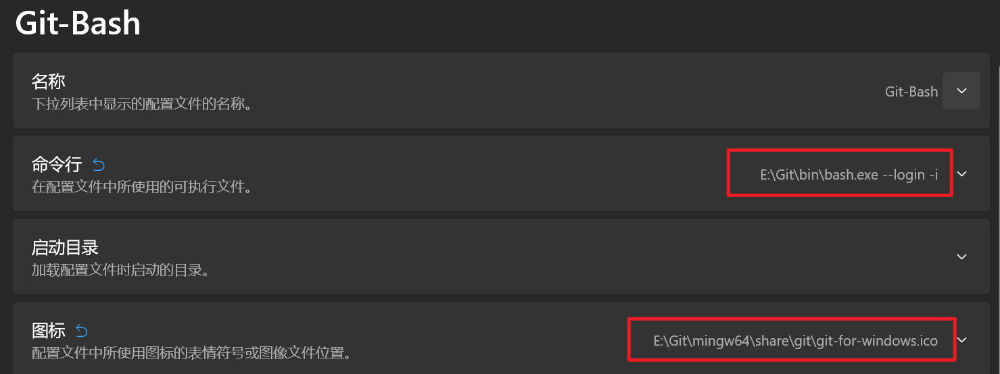
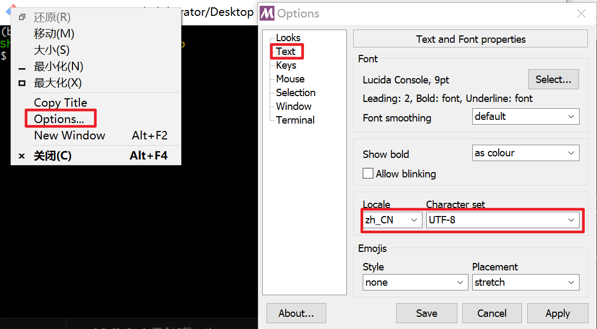

## windows terminal注册gitbash

1. 配置如下

   

   记住是bash.exe,  而不是git-bash.exe

2. 默认情况, Git Bash 在 Win 端只会 `source ~/.bash_profile` 而不会激活 `~/.bashrc` 的配置。但是经常会有一些配置在`.bashrc`中

   解决方法是那就在 `~/.bash_profile` 加一行，`source ~/.bashrc` 就好啦！

3. git bash 中文乱码

   

4. windows terminal集成了gitbash后, 删除操作导致终端窗口闪烁

   解决办法是: 通过创建并编辑~/.inputrc文件，设置setbell-style none来解决此问题。