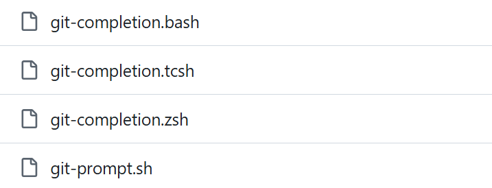
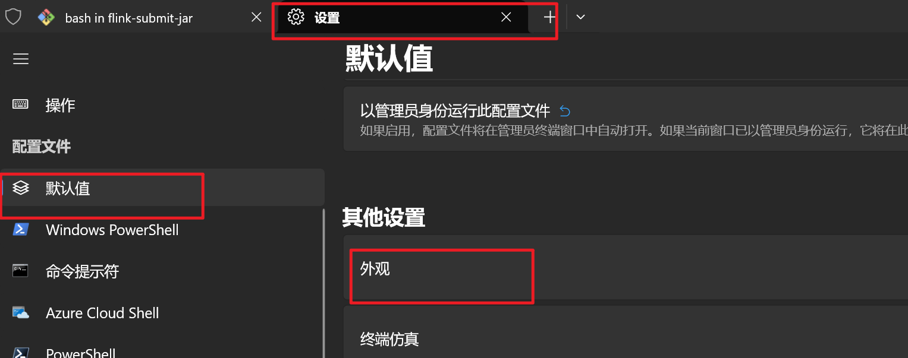
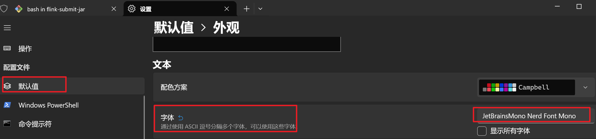
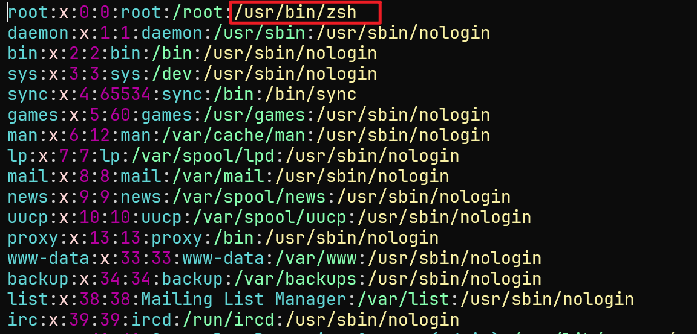
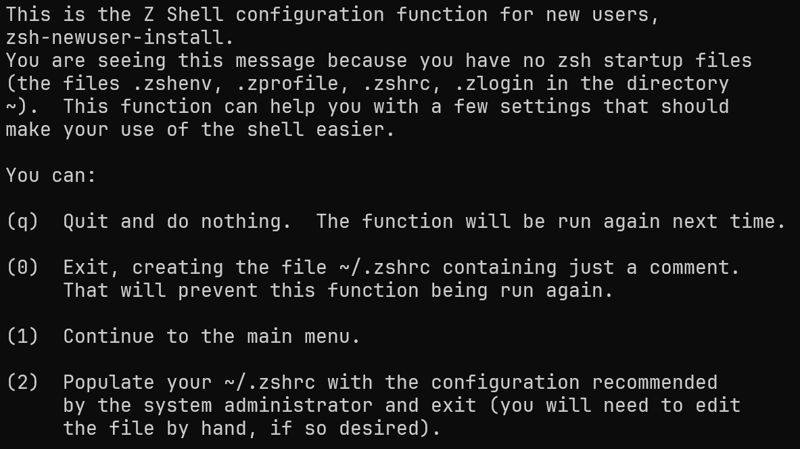

## windows_terminal配置gitbash

1. 配置如下

   

   记住是bash.exe,  而不是git-bash.exe

2. 默认情况, Git Bash 在 Win 端只会 `source ~/.bash_profile` 而不会激活 `~/.bashrc` 的配置。但是经常会有一些配置在`.bashrc`中

   解决方法是那就在 `~/.bash_profile` 加一行，`source ~/.bashrc` 就好啦！

3. git bash 中文乱码

   

4. windows terminal集成了gitbash后, 删除操作导致终端窗口闪烁

   解决办法是: 通过创建并编辑~/.inputrc文件，设置setbell-style none来解决此问题。


## git命令自动补全

访问https://github.com/git/git/tree/master/contrib/completion

下载对应shell的补齐文件



把它放到一个位置, 然后添加如下的代码到`$user_home/.bashrc`

~~~shell
# 如果文件存在, 就执行
if [ -f E:\Git\git-completion.bash ]; then
 . E:\Git\git-completion.bash
fi
~~~


## 设置代理

1. 配置zsh中的代理环境变量,  bash中的代理也可以使用这段代码

   ~~~shell
   # 写入到zsh的配置文件中
   cat << 'EOF' >> /etc/zsh/zshenv
   # 设置代理环境变量 hostip是获取wsl中主机的地址
   hostip=$(cat /etc/resolv.conf | grep nameserver | awk '{print $2}')
   export http_proxy="http://$hostip:7890"
   export https_proxy="http://$hostip:7890"
   export all_proxy="socks5://$hostip:7890"
   EOF
   
   # 写入到bash的配置文件中 (看你是不是要在bash中设置代理)
   cat << 'EOF' >> /etc/profile
   hostip=$(cat /etc/resolv.conf | grep nameserver | awk '{print $2}')
   export http_proxy="http://$hostip:7890"
   export https_proxy="http://$hostip:7890"
   export all_proxy="socks5://$hostip:7890"
   EOF
   ~~~

   添加代理之后, 记得

   ~~~shell
   source /etc/zsh/zshenv # bash
   source /etc/profile # zsh
   ~~~


## autojump

```shell
# ubuntu
apt install autojump 

# centos
yum install autojump-zsh
```


## thefuck

~~~shell
# centos
sudo yum update
sudo yum install python3-dev python3-pip python3-setuptools
pip3 install thefuck --user # 给所有用户安装
pip3 install thefuck --upgrade # 更新

# ubuntu
sudo apt update
sudo apt install python3-dev python3-pip python3-setuptools
pip3 install thefuck --user
~~~

然后如下的代码添加到`/etc/zshenv`中

~~~shell
eval $(thefuck --alias)
# You can use whatever you want as an alias, like for Mondays:
eval $(thefuck --alias FUCK)
~~~


如果在执行的过程中, 发现没有对应的python模块, 那么直接

~~~shell
pip3 install xxx --user
~~~


## tldr

tldr的意思是`too long, didnt read`,  他是一个命令的帮助文档, 类似`man`, 但是更适合新手

比如find这个命令不知道怎么用, 那么你可以通过`tldr man`来查看帮助手册

安装: 

https://github.com/tldr-pages/tldr

设置语音为中文

https://www.bilibili.com/video/BV1KakdYmEsz


## window下使用oh my posh

oh my posh是一款终端美化工具, 可以在windwos, linux, macos上使用

他可以对windwos terminal, power shell, cmd, git-bash等终端进行美化


这里演示在windows下对windwos terminal进行美化

1. 安装oh my posh, 使用powershell执行如下命令

   https://ohmyposh.dev/docs/installation/windows

   ~~~powershell
   winget install JanDeDobbeleer.OhMyPosh -s winget
   ~~~

   - 他会安装oh my posh, 并且设置一个`POSH_THEMES_PATH`的环境变量
   - 同时还会下载一些主题到`POSH_THEMES_PATH`目录下

2. 因为oh my posh美化的时候, 用到了很多特殊字符, 如果使用普通的字体的话, 特殊字符无法解析, 所以我们还需要下载字体

   你可以访问https://www.nerdfonts.com/font-downloads 挑选一个喜欢的字体

   这里推荐下载`JetBrainsMono Nerd Font`

   下载之后, 解压, 安装即可

3. 在windwos ternimal下, 选择刚刚安装的字体

   

   

4. 上面说到,通过命令行安装oh my posh的时候, 还会下载很多主题到`POSH_THEMES_PATH`下面

   你可以在https://ohmyposh.dev/docs/themes下查看每个主题的显示效果

   然后选择你喜欢的主题, 在`POSH_THEMES_PATH`下复制他的文件名

   这里推荐使用`jandedobbeleer`这个主题, 他在安装的时候就已经下载了, 并且效果还可以

5. 对于每一个windows terminal下的中断, 你都要在配置文件中添加一个posh的初始化脚本, 这样posh就可以对这个终端进行美化了

   - git bash:  配置文件在`$user_home/.bashrc` 或者 `$user_home/.bash_profile`

     ~~~~bash
     # 使用默认的主题
     # eval "$(oh-my-posh init bash)" 
     
     # 使用posh初始化, 并使用特定的主题
     eval "$(oh-my-posh init bash --config "$POSH_THEMES_PATH/jandedobbeleer.omp.json")"
     ~~~~

   - 对于powershell, 你可以执行如下命令

     ~~~powershell
     notepad $PROFILE # 通过notepad打开powershell的配置文件
     
     # 如果还没有配置文件的话, 可以通过如下命令创建
     New-Item -Path $PROFILE -Type File -Force
     
     # 把下面这行代码添加到配置文件最后面
     Invoke-Expression (oh-my-posh init pwsh --config "$env:POSH_THEMES_PATH\jandedobbeleer.omp.json")
     ~~~

   - 其他终端的方式, 可以查看https://ohmyposh.dev/docs/installation/customize

   

## 在wsl中使用zsh

1. 通过如下命令查看当前已经有的终端

   ~~~shell
   cat /etc/shells
   
   /bin/bash
   /bin/csh
   /bin/ksh
   /bin/sh
   /bin/tcsh
   /bin/zsh
   ~~~

2. 安装zsh

   ~~~shell
   sudo apt-get install zsh # ubuntu
   sudo yum install zsh # centos, redhat
   ~~~

3. 设置当前用户的默认终端为zsh

   ~~~shell
   chsh -s $(which zsh)
   ~~~

   如果你想要批量修改用户的默认终端, 也可以修改`/etc/passwd`文件,  他的最后一个选项就是用户的默认终端

   ~~~shell
   # 将/etc/passwd中的 /bin/bash  替换为 /usr/bin/zsh
   sudo sed -i 's|/bin/bash|/usr/bin/zsh|g' /etc/passwd 
   ~~~

   

   

4. 更改新用户的默认shell

   ~~~shell
   sudo sed -i 's|^SHELL=.*|SHELL=/usr/bin/zsh|' /etc/default/useradd
   ~~~

5. 因为zsh默认的配置文件

   - `/etc/zsh/zshenv`: 全局配置文件
   - `~/.zshrc`: 用户配置文件

   所以你在`/etc/profile`中配置的path在zsh中是无效的, 因为他是bash的配置文件, 所以你要执行如下命令

   ~~~shell
   echo "source /etc/profile" >> /etc/zsh/zshenv
   ~~~

6. 重新打开一个终端, 这个时候因为你还没有配置文件, 所以zsh会询问你要不要创建一个`.zshrc`在家目录

   这里直接选0就好了

   

7. 重新打开一个终端之后, 执行如下命令, 看看有没有默认使用zsh

   ~~~shell
   echo $SHELL
   # 如果返回 /usr/bin/zsh，则说明已经默认使用 zsh
   ~~~

8. 配置zsh

   ~~~shell
   sudo bash -c 'cat >> /etc/zsh/zshenv' << 'EOF'
   
   alias cls='clear'
   alias ll='ls -al'
   
   alias -s gz='tar -xzvf'
   alias -s tgz='tar -xzvf'
   alias -s zip='unzip'
   alias -s bz2='tar -xjvf'
   
   export LANG=zh_CN.UTF-8
   export LC_ALL=zh_CN.UTF-8
   
   EOF
   ~~~

   


## zsh使用ohmyzsh

### 安装

> 不要使用官网的安装方式, 因为他只会给一个用户安装, 你su到别的用户, 还是没有安装ohmyzsh
>
> 下面的方式可以全局安装

1. 通过git下载oh-my-zsh

   ~~~shell
   mkdir /usr/share/zsh.d
   
   # 克隆项目到/usr/share/zsh.d/.oh-my-zsh，后期oh-my-zsh下载的插件也都会放到这里
   git clone https://github.com/ohmyzsh/ohmyzsh.git /usr/share/zsh.d/.oh-my-zsh
   
   # 根据模版创建一个基本的zsh配置
   cp /usr/share/zsh.d/.oh-my-zsh/templates/zshrc.zsh-template /usr/share/zsh.d/.zshrc
   ~~~

2. 修改权限

   ~~~shell
   chmod -R 755 /usr/share/zsh.d # 必须是755, 用户组和其他人没有写权限
   ~~~

3. 修改配置, 因为你通过脚本安装的话, 就是会将ohmyzsh安装在家目录, 而我们这里是安装在别的地方, 所以需要修改

   ~~~shell
   sed -i 's|^export ZSH=.*|export ZSH=/usr/share/zsh.d/.oh-my-zsh|' /usr/share/zsh.d/.zshrc
   sed -i 's|^# alias zshconfig=.*|alias zshconfig="vim /usr/share/zsh.d/.zshrc"|' /usr/share/zsh.d/.zshrc
   sed -i 's|^# alias ohmyzsh=.*|alias ohmyzsh="cd /usr/share/zsh.d/.oh-my-zsh"|' /usr/share/zsh.d/.zshrc
   ~~~

4. 将`/usr/share/zsh.d/.zshrc`添加到全局的zsh配置文件中, 让他对所有用户生效

   ~~~shell
   echo "source /usr/share/zsh.d/.zshrc" >> /etc/zsh/zshenv
   ~~~

   

   

   

### 选择插件

oh-my-zsh提供了非常多的插件, 你可以访问https://github.com/ohmyzsh/ohmyzsh/wiki/Plugins来查看有哪些插件

这里比较推荐的有

- autojump: https://github.com/wting/autojump

- docker, docker-compose: 为docker和docker-compose提供自动提示和别名

  https://github.com/ohmyzsh/ohmyzsh/tree/master/plugins/docker

  https://github.com/ohmyzsh/ohmyzsh/tree/master/plugins/docker-compose

- golang: 为golang提供了自动补全和命令别名 https://github.com/ohmyzsh/ohmyzsh/tree/master/plugins/golang

- gradle: 为gradle提供了自动补全和命令别名  https://github.com/ohmyzsh/ohmyzsh/tree/master/plugins/gradle

- helm: 为helm提供了补全和命令别名 https://github.com/ohmyzsh/ohmyzsh/tree/master/plugins/helm

- kubectl: 为k8s提供了补全和命令别名 https://github.com/ohmyzsh/ohmyzsh/tree/master/plugins/kubectl

- mvn: 为mvn提供了补全和命令别名 https://github.com/ohmyzsh/ohmyzsh/tree/master/plugins/mvn

- nvm: 为nvm提供了补全和命令别名 https://github.com/ohmyzsh/ohmyzsh/tree/master/plugins/nvm

- sudo: 按两下esc就会在命令前面加上sudo  https://github.com/ohmyzsh/ohmyzsh/tree/master/plugins/sudo

- the fuck: https://github.com/ohmyzsh/ohmyzsh/tree/master/plugins/thefuck

- ubuntu: 为ubuntu添加了命令补全和命令别名 https://github.com/ohmyzsh/ohmyzsh/tree/master/plugins/ubuntu

- aliases: 查看所有的别名, 包括上面插件提供的 https://github.com/ohmyzsh/ohmyzsh/tree/master/plugins/aliases


上面这些插件, 除了autojump和thefuck需要先进行安装, 其他的都可以直接使用, 安装的步骤可以查看前面


执行`zshconfig`, 就会打开配置文件, 然后把下面这行代码加入到合适的位置

~~~shell
plugins=(git autojump docker docker-compose golang gradle helm kubectl mvn nvm thefuck ubuntu aliases)
~~~

> 注意: 如果你同时安装了thefuck和sudo, 他们两个会冲突, 因为他们都是按两下esc来更正前一个命令, 这里推荐不使用sudo


### 使用oh-myposh

因为oh-my-zsh的主题实在是太丑了, 这里使用oh-my-posh的主题

> 不要按照官方完整的步骤来弄, 因为他只是为一个用户安装, 这里我们要给全局用户安装

1. 首先要取消掉ohmyzsh的默认主题, 通过`zshconfig`打卡ohmyzsh的配置文件, 将主题设置为空

   ~~~
   ZSH_THEME=""
   ~~~

2. 安装ohmyposh

   ~~~shell
   mkdir /usr/share/zsh.d/.oh-my-posh
   
   curl -s https://ohmyposh.dev/install.sh | bash -s -- -d /usr/share/zsh.d/.oh-my-posh
   ~~~

3. 添加ohmyposh到环境变量

   ~~~shell
   sudo bash -c 'cat >> /etc/zsh/zshenv' << 'EOF'
   export PATH=$PATH:/usr/share/zsh.d/.oh-my-posh
   EOF
   ~~~

4. 安装ohmyposh的时候, 还会下载theme到执行的用户下, 如果是root, 那么会下载到` /root/.cache/oh-my-posh/themes`

   其他用户是没有权限读取其中的主题的, 所以还需要

   ~~~shell
   sudo chmod -R 755 /root/.cache/oh-my-posh/themes # 这样其他用户才可以读取到其中的主题
   ~~~

5. 配置zsh使用ohmyposh

   ~~~shell
   sudo bash -c 'cat >> /etc/zsh/zshenv' << 'EOF'
   eval "$(oh-my-posh init zsh --config /root/.cache/oh-my-posh/themes/jandedobbeleer.omp.json)"
   EOF
   ~~~

   

