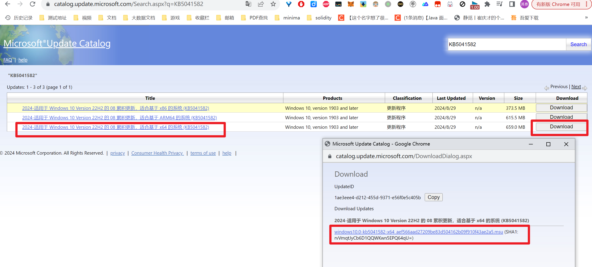

## wsl安装

### window离线更新(可选)

更新windows之前需要先更新火绒, 要不然更新了windows之后, 火绒会将`Explorer.exe`加入到隔离区, **会导致启动后无法打开桌面, 黑屏**, https://zhuanlan.zhihu.com/p/683477802

查看版本的地方在`设置 >系统 > 关于 `

window更新的话, 这里采用**离线更新**的方式

https://blog.csdn.net/zhanghai4155/article/details/131713312

从Windows10开始，Windows更新的形态也进化为了累积更新（Cumulative Update），也就是每一次更新均包含该版本Windows10之前的所有更新，新用户只需下载安装一个Win10累积更新即可将Windows10更新到最新状态，大大简化方便了用户操作。 所以，你只需下载最新的Win10累积更新离线安装包，一次安装即可把Win10系统更新到最新状态，无需再下载安装之前的Windows更新。

1. 首先访问https://learn.microsoft.com/zh-cn/windows/release-health/release-information

   在该页面的的下面, 访问如下的连接

   

2. 访问上图中红线框起来的链接, https://support.microsoft.com/zh-cn/topic/windows-10-%E6%9B%B4%E6%96%B0%E5%8E%86%E5%8F%B2%E8%AE%B0%E5%BD%95-8127c2c6-6edf-4fdf-8b9f-0f7be1ef3562

   该页面包含了windows所有的更新记录

   

3. 该页面的红框中, 是每次更新的记录, 选择你想要更新到的版本, 最好选择一个稳定的版本, 而不要选择内部的版本

   这里以`2024 年 8 月 29 日 - KB5041582 (操作系统内部版本 19045.4842) 预览版`为例, 跳转到该页面

   https://support.microsoft.com/zh-cn/topic/2024-%E5%B9%B4-8-%E6%9C%88-29-%E6%97%A5-kb5041582-%E6%93%8D%E4%BD%9C%E7%B3%BB%E7%BB%9F%E5%86%85%E9%83%A8%E7%89%88%E6%9C%AC-19045-4842-%E9%A2%84%E8%A7%88%E7%89%88-f4c4d191-5457-475c-80ac-e1d43cf9c941

   

4. 复制红框中的`KB5041582`,  他表示这个版本的版本号

5. 访问https://www.catalog.update.microsoft.com/Home.aspx, 输入``KB5041582``搜索更新包

   

6. 下载指定架构版本的更新包

   

7. 如果不知道自己系统的cpu架构, 可以在`设置 > 关于 > 系统类型`中查看

### 开启虚拟机功能和WSL功能

1. 首先打开`控制面板 > 程序 > 程序和功能 > 启动或关闭Windows功能`, 勾选如下功能, 然后**重启**

   

   或者以管理员模式启动powershell执行如下命令, 也可以勾选上面的两个功能

   ~~~powershell
   # 启用适用于 Linux 的 Windows 子系统
   dism.exe /online /enable-feature /featurename:Microsoft-Windows-Subsystem-Linux /all /norestart
   # 启用虚拟机功能
   dism.exe /online /enable-feature /featurename:VirtualMachinePlatform /all /norestart
   ~~~

2. 下载Linux内核更新包, 并执行

   https://wslstorestorage.blob.core.windows.net/wslblob/wsl_update_x64.msi

### 更新WSL(必须)

要将WSL更新到最新的版本, 否则有一些命令会执行失败

~~~shell
wsl --update --web-download # 从github下载wsl更新, 如果不指定--web-download会从微软商店下载, 会连接不上
wsl --update --pre-release # 再次更新到pre-release版本
~~~

如果更新不了, 也可以访问https://github.com/microsoft/WSL/releases直接下载wsl的最新安装包

### 安装Ubuntu

安装Ubuntu的方式有3中

1. 直接在cmd中通过wsl安装Ubuntu
2. 通过微软商店在线下载Ubuntu
3. 离线下载微软商店中的Ubuntu, 然后离线安装
4. 离线下载WSL官网中的Ubuntu, 然后安装

#### 通过cmd安装Ubuntu(方式1)

~~~shell
# 显示所有可以安装的系统
C:\Users\Administrator>wsl --list --online
以下是可安装的有效分发的列表。
请使用“wsl --install -d <分发>”安装。

NAME                            FRIENDLY NAME
Ubuntu                          Ubuntu
Debian                          Debian GNU/Linux
kali-linux                      Kali Linux Rolling
Ubuntu-18.04                    Ubuntu 18.04 LTS
Ubuntu-20.04                    Ubuntu 20.04 LTS
Ubuntu-22.04                    Ubuntu 22.04 LTS
Ubuntu-24.04                    Ubuntu 24.04 LTS
OracleLinux_7_9                 Oracle Linux 7.9
OracleLinux_8_7                 Oracle Linux 8.7
OracleLinux_9_1                 Oracle Linux 9.1
openSUSE-Leap-15.6              openSUSE Leap 15.6
SUSE-Linux-Enterprise-15-SP5    SUSE Linux Enterprise 15 SP5
SUSE-Linux-Enterprise-15-SP6    SUSE Linux Enterprise 15 SP6
openSUSE-Tumbleweed             openSUSE Tumbleweed

# 安装指定的系统
# 如果发现下载不动, 也可以添加--web-download 选项来试试, 他指定通过联机渠道安装，而不是使用 Microsoft Store 安装。
C:\Users\Administrator>wsl --install -d Ubuntu-24.04
~~~

在安装的过程中, 会要求创建一个用户(不是root用户)

#### 离线下载WSL官网中的Ubuntu并安装

如果网络不行的, 可以访问https://learn.microsoft.com/zh-cn/windows/wsl/install-manual

在该页面的下面, 可以下载微软商店中的Ubuntu的安装包(https://aka.ms/wslubuntu2204)

下载好安装包之后, 双击该安装包, 就可以安装Ubuntu了

在安装的过程中也会要求创建一个用户, (不是root用户)

#### 离线下载微软商店中的Ubuntu并安装

1. 首先在网页版的微软商店中, 搜索Ubuntu, 选择想要的版本

   

2.  打开`https://store.rg-adguard.net/`, 填入Ubuntu的网页链接`https://apps.microsoft.com/detail/9pn20msr04dw?hl=zh-cn&gl=CN`, 然后搜索

   

3. 下载appxbundle安装包之后, 双击安装即可

### 安装好之后

~~~shell
# 在Ubuntu中执行
sudo passwd  root # 更新root的账号密码

sudo apt-get update # 更新软件包
sudo apt update # 更新软件包
sudo apt -y upgrade # 更新所有已经安转的软件
~~~

C:\Users\电脑用户名文件夹下新建一个`.wslconfig`文件

~~~config
# Settings apply across all Linux distros running on WSL 2
[wsl2]
autoProxy=true  # 是否强制 WSL2/WSLg 子系统使用 Windows 代理设置, 设置为true
dnsTunneling=true # WSL2/WSLg DNS 代理隧道，以便由 Windows 代理转发 DNS 请求
guiApplications=false       # 启用 WSLg GUI 图形化程序支持
ipv6=true                   # 启用 IPv6 网络支持
memory=48GB                 # 限制 WSL2/WSLg 子系统的最大内存占用
nestedVirtualization=true   # 启用 WSL2/WSLg 子系统嵌套虚拟化功能支持
networkingMode=mirrored     # 启用镜像网络特性支持

[experimental]
autoMemoryReclaim=gradual       # 启用空闲内存自动缓慢回收，其它选项：dropcache / disabled（立即/禁用）
sparseVhd=true                  # 启用 WSL2/WSLg 子系统虚拟硬盘空间自动回收
useWindowsDnsCache=false        # 和 dnsTunneling 配合使用，决定是否使用 Windows DNS 缓存池
~~~

然后重启wsl2

## Ubuntu的安装位置

默认情况下, Ubuntu会被安装在c盘中, 如果你想要将他安装到别的位置, 可以执行如下步骤

~~~shell
wsl --export <Distro> --format <tar/tar.gz> <FileName> # 备份Linux发行版本
wsl --unregister <Distro> # 卸载已经安装的Linux发行版本
wsl --import <Distro> <InstallLocation> <FileName> # 导入刚刚的备份, 并指定安装的位置
~~~

## Ubuntu启用ssh

在wsl1中，windows和wsl的Ubuntu系统之间的网络是无感知的，也就是连通的。即windows可以通过localhost访问Ubuntu上面的引用，Ubuntu也可以通过localhost访问windows上面的应用。

所以在Ubuntu中使用ssh连接localhost会连接到当前的windows，而不是运行的Ubuntu。这就导致一些ssh的脚本会运行失败。

但是在wsl2中，windows可以通过localhost访问Ubuntu上面的应用，但是Ubuntu不能通过localhost访问windows上面的应用，而是需要使用ip地址。

为了ssh localhost连接到windwos上面的问题需要将wsl的版本升级为wsl2

1. 查看当前wsl版本，

   ~~~shell
   wsl -l -v
   ~~~

2. 升级wsl2参考文章https://zhuanlan.zhihu.com/p/356397851

3. 升级到wsl2后，Ubuntu的sshd服务默认没有开启

   ~~~shell
   sudo apt-get update
   # 卸载自带的sshd并重新安装，貌似是有问题
   sudo apt-get remove openssh-server
   sudo apt-get install openssh-server
   
   # 修改sshd的配置文件， 运行账号密码登录和运行root远程登录，如果不修改的话只能使用公钥私钥的方式登录
   sudo vim /etc/ssh/sshd_config
   # 将修改PasswordAuthentication no为 PasswordAuthentication yes
   # 找到并用#注释掉这行：PermitRootLogin prohibit-password
   # 新建一行 添加：PermitRootLogin yes
   
   # 修改配置文件后启动sshd服务
   sudo service ssh start
   # 或者
   sudo service ssh restart
   
   # ssh连接localhost查看是否是当前的Ubuntu
   ssh user@localhost
   ~~~

4. 设置ssh服务开机自启动

   - 在windows中`win+r`输入`shell:startup`打开自启动目录
   - 创建`wsl_sshd_startup.bat`
   - 在其中输入`wsl -u root -e /etc/init.d/ssh start`

   

## WSL相关命令

首先需要知道的是, **wsl可以指定一个默认的发行版本**

在执行wsl相关的命令的时候, 如果没有通过`-d <distribution>`来指定发行版本, 就会使用默认的发行版本, 可以通过如下命令来修改默认的发行版本

~~~shell
wsl --status # 查看默认的发行版本
wsl --set-default <Distribution Name> # 指定wsl使用的默认的发行版本
~~~

同时, 每一个发行版本都有一个默认的用户, 如果在执行wsl相关命令的时候, 没有通过`-u <user>`来指定用户, 就会使用这个默认的用户, 可以通过如下命令来指定每个发行版本的默认用户

~~~shell
<DistributionName> config --default-user <Username>
或者
wsl --manage <DistributionName> --set-default-user <Username>
~~~

登录指定的发行版本

- 通过`-d <distribution>`指定登录的Linux发行版本
- 通过`-u <user>`指定登录的用户

~~~shell
# 使用默认的用户登录默认的Linux发行版本
wsl 
~~~

执行命令相关

- 通过`-d <distribution>`指定登录的Linux发行版本
- 通过`-u <user>`指定登录的用户

~~~shell
# 在默认的Linux发行版本上, 使用默认的shell, 使用默认的用户, 执行command
# 如果命令太过复杂, 可以通过--来分割命令
# 比如wsl -u root -- echo "hello"
# 比如wsl pwd
wsl <Command> 

# WSL直接运行指定的命令而不启动 Linux 的默认 shell
# 不会加载任何 shell 配置（如 .bashrc 或 .zshrc）
wsl -e <Command>
~~~

Linux发行版本的管理

~~~shell
wsl -l --online # 联网列出能够安装的所有Linux发行版本

wsl -l -v # 列出已经安装的Linux发行版本, 以及状态, 等效于--list --verbose

wsl --install --web-download -d Ubuntu-24.04 --location <Location> --name <Name># 安装指定的发行版本, 指定--web-download从github下载而不是微软商店, --location表示安装到的位置

wsl --shutdown # 直接关闭掉wsl整个系统, 和所有的发行版本
wsl --terminate <Distribution Name> # 关闭指定的发行版本, 但是wsl还在运行, 还会占用内存
wsl --unregister <Distro> # 卸载已经安装的Linux发行版本
wsl --uninstall  # 卸载WSL所有更新, 会导致WSL回滚到Windows自带的最初版本, 绝对不要使用!!!!!
wsl --manage <Distor> --move <Location> # 将分发版移到新位置

wsl --export <Distro> --format <tar/tar.gz> <FileName> # 导出指定的Linux发行版(备份)
wsl --import <Distro> <InstallLocation> <FileName> # 导入指定的Linux发行版

wsl --set-version <Distro> <WSL_Version> # 使用wsl1或者wsl2来运行Linux发行版本
~~~

wsl相关命令

~~~shell
wsl --help # 查看帮助文档
wsl --set-default-version 2 # 设置WSL的默认版本, 即使用WSL1还是WSL2
wsl --version # 查看wsl的版本
wsl --status # 查看默认的Linux发行版本, 默认的WSL版本
wsl --update --web-download # 更新wsl, 指定从github下载而不是微软商店
wsl --update --pre-release # 更新到pre-release版本
~~~

