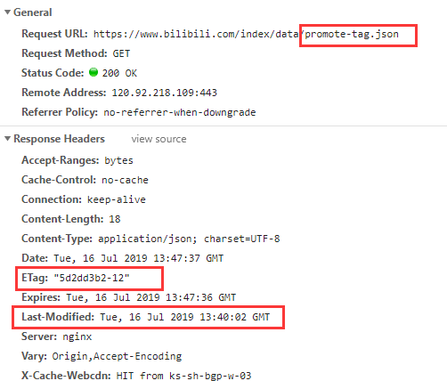
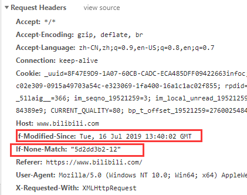
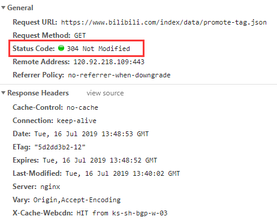
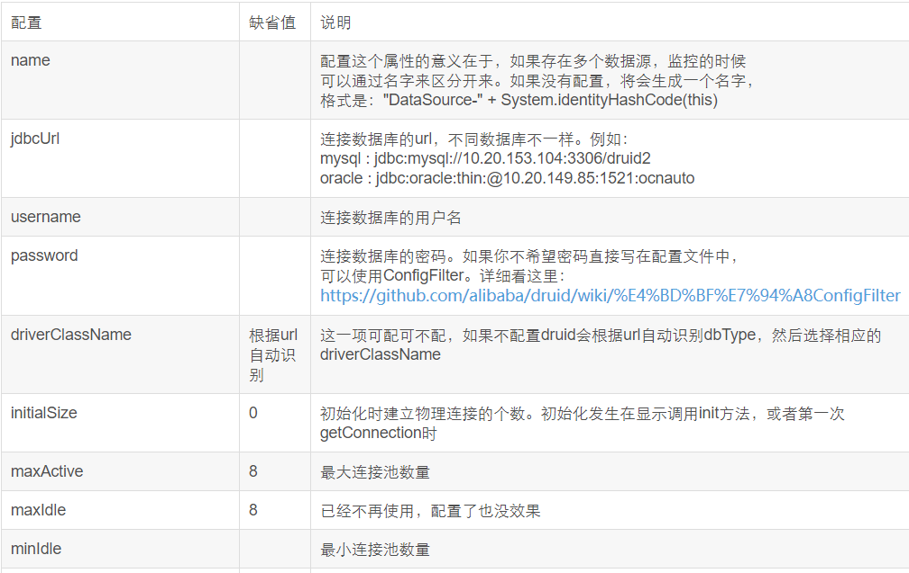
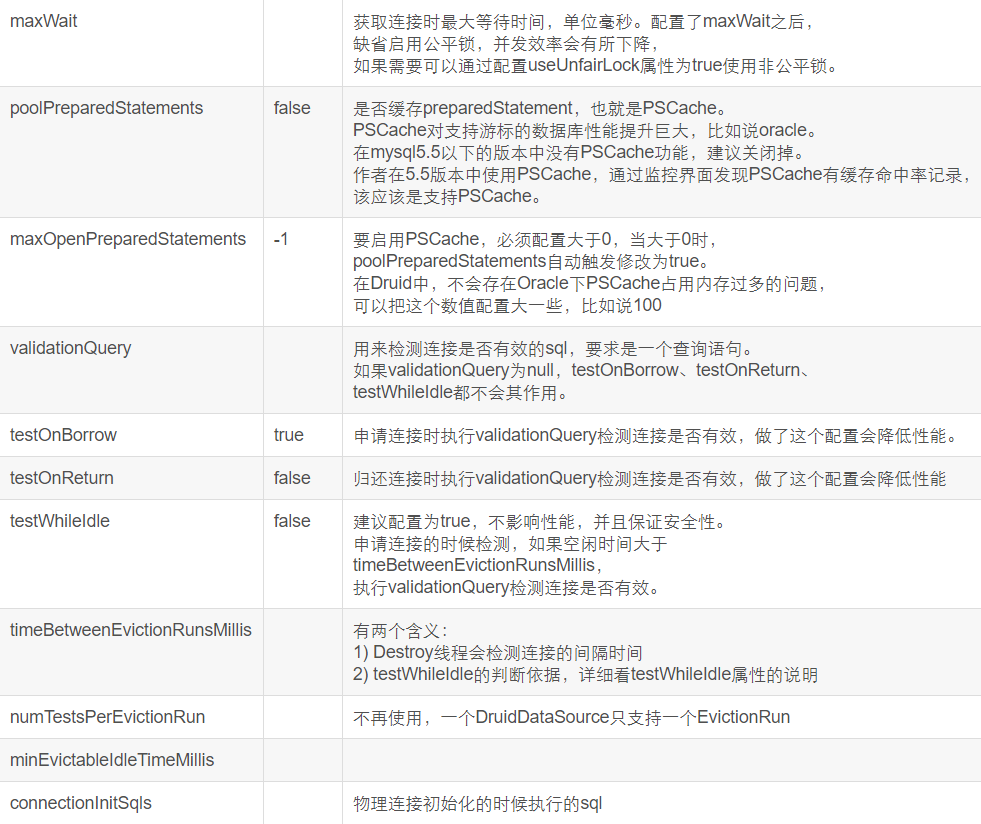
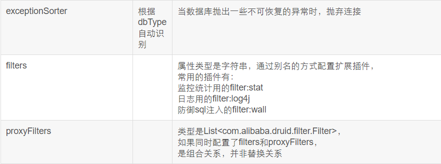

  


## 浏览器参数缓存原理

#### 产生缓存的条件:

1. **Get请求**
2. **请求地址不发生改变**

#### 具体原理:

以范围bilibili首页为例:

1. 用户请求b站首页, 但是可以看到浏览器请求了一个名为promete-tag.json的文件(我也不知道干嘛的0.0)

   

2. 我们可以看到响应报文中的响应头参数中有ETag, 和Last-Modified参数

   其中ETag表示资源的唯一表示符, Last-Modified表示上次修改时间

   当浏览器下次再次请求这个URL的时候, 会将这两个参数带上

   其中If-None-Match的值为ETag的值, If-Modified-Since为Last-Modified的值

   浏览器之所以带上这两个参数是想表示: **我这里有promote-tag.json的缓存, 但是我不知道你服务器那里的这个文件有没有变化**.

   

3. 服务器接收到请求报文后, 发现请求报文头里面有If-Modified-Since,If-None-Match参数, 理解浏览器想使用缓存, 于是将If-Modified-Since的值与服务器里promote-tag.json文件的Last-Modified的值相比较, 将If-Modified-Since的值与ETag的值相比较, 若两者都没有变化, 说明服务器里的promote-tag.json和浏览器缓存中的promote-tag.json文件是一致的, 于是发送响应报文给浏览器,响应报文的http状态码为304 Not Modified, 如果两个参数的值不一样, 说明浏览器缓存里的文件和服务器的不一致, 于是发送http状态码为200的响应报文, 并在报文体中携带上新的promote-tag.json文件内容

   

4. 浏览器接受到响应报文的时候,查看http请求状态码, 发现是304, 则使用自己缓存里面的文件, 如果是200, 说明缓存中的文件和服务器中的不一致, 以及被修改了, 所以去响应体里面获取新的promote-tag.json文件


#### 防止缓存

对于动态验证码这种我们不希望使用缓存的文件, 我们可以在请求的时候通过js来动态的在URL后面加上一个时间参数

```js
function reloadCode() {
    $("#img").attr("src", "gifCode?data=" + new Date() + "");
}
```

这样的话我们每次请求的URL都是不同的URL, 这样也就不存在缓存了.


## lombok标签

@Self4j:   标注在类上, 可以直接使用log这个变量


@Data: 标注在类上, `@Data`相当于`@Getter @Setter @RequiredArgsConstructor @ToString @EqualsAndHashCode`这5个注解的合集


@NoArgsConstructor: 标注在类上, 表明该类有无参构造函数


@AllArgsConstructor:  标注在类上, 表明该类有所有参数的构造函数


@ToString: 标注在类上, 表明该类有toString方法


@EqualsAndHashCode: 标注在类上

- 会自动重写equals和hashCode方法

- 它默认使用非静态，非瞬态的属性来判断两个类是否equals

- 它默认仅使用该类中定义的属性且**不调用父类**的方法 

- 可通过参数`of`指定仅使用哪些属性 

- 可通过参数`exclude`排除一些属性 

- callSuper: 上述第三点说明该类在比较的时候不会使用父类中的属性, 但是有时这样会产生问题.

  比如，有多个类有相同的部分属性，把它们定义到父类中，恰好id（数据库主键）也在父类中，那么就会存在部分对象在比较时，子类中的属性都相同, 但是父类中的id属性不相等, z这样两个属性它们并不相等，却因为lombok自动生成的`equals(Object other)` 和 `hashCode()`方法判定为相等，从而导致出错。

  解决:  在使用@Data时同时加上@EqualsAndHashCode(callSuper=true)注解.

  通俗来将callSuper就是用了设置是否调用父类中的属性来判断两个类是否equals.

@Builder: 标注在类上, 构造一个实例, 属性不需要单独设置

  ```java
@Builder
public class User {
        private int foo;
        private final String bar;
 }
 

 User.builder().foo(1).bar("test").build()
  ```

```java
//使用@Builder的方案
public class User {
        private int foo;
        private final String bar;

        private Example(int foo, String bar) {
                this.foo = foo;
                this.bar = bar;
        }

        public static ExampleBuilder builder() {
                return new ExampleBuilder();
        }

        public static class ExampleBuilder<T> {
                private int foo;
                private String bar;

                private ExampleBuilder() {}

                public ExampleBuilder foo(int foo) {
                        this.foo = foo;
                        return this;
                }

                public ExampleBuilder bar(String bar) {
                        this.bar = bar;
                        return this;
                }

                public Example build() {
                        return new Example(foo, bar);
                }
        }
 }
```


## Maven隐含变量

Maven提供了三个隐式的变量可以用来访问环境变量，POM信息，和Maven Settings

#### env

env变量，暴露了你操作系统或者shell的环境变量。比如在Maven POM中一个对\${env.PATH}的引用将会被 ​\${PATH}环境变量替换，在Windows中为%PATH%.

#### project

project变量暴露了POM。可以使用点标记(.)的路径来引用POM元素的值。例如

```xml
<project>
	<modelVersion>4.0.0</modelVersion>
    <groupId>org.sonatype.mavenbook</groupId>
	<artifactId>project-a</artifactId>
	<version>1.0-SNAPSHOT</version>
	<packaging>jar</packaging>
	<build>
		<finalName>${project.groupId}-${project.artifactId</finalName>
	</build>
</project>
```

当你使用mvn help:effective-pom 查看时,你会看到<finalName>org.sonatype.mavenbook-project-a</finalName>


${basedir} 项目根目录 ​

\${project.build.directory} 构建目录, 缺省为target ​

\${project.build.outputDirectory} 构建过程输出目录, 缺省为target/classes

 ​\${project.build.finalName} 产出物名称, 缺省为\${project.artifactId}- \${project.version} 

\${project.packaging} 打包类型缺省为jar

\${project.xxx} 当前pom文件的任意节点的内容

#### settings

settings变量暴露了Maven settings信息。可以使用点标记(.)的路径来引用settings.xml文件中元素的值。

**例如${settings.offline}会引用~/.m2/settings.xml文件中offline元素的值。**


## druid配置项








