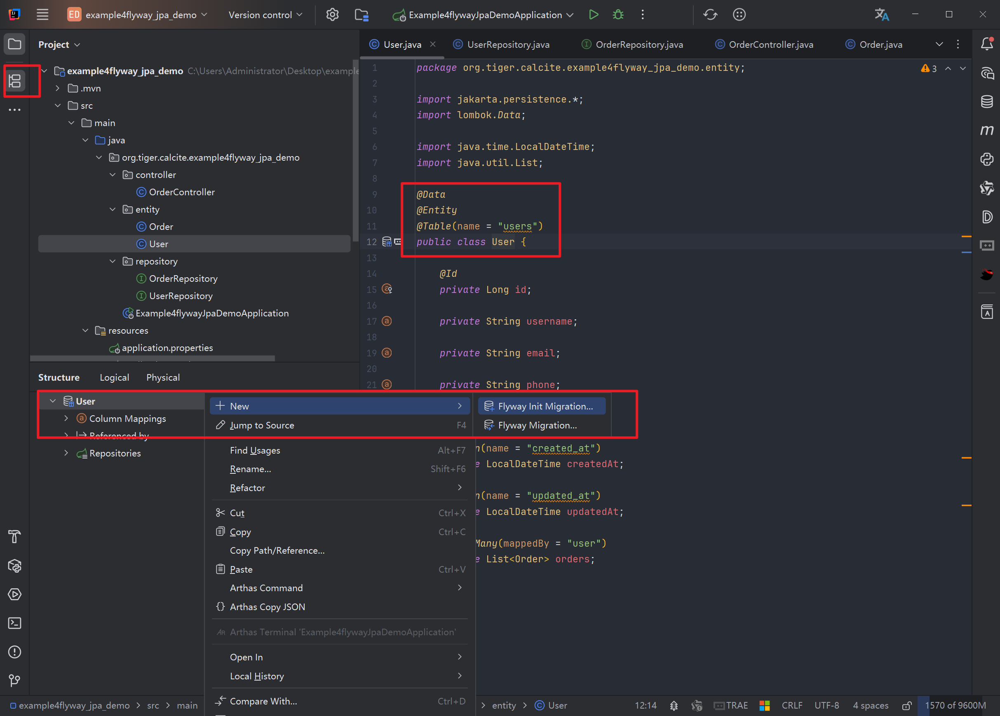
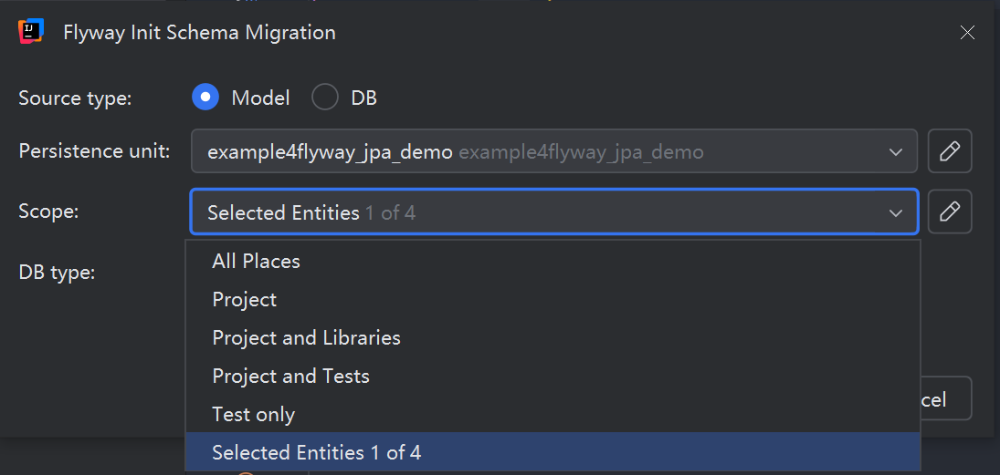
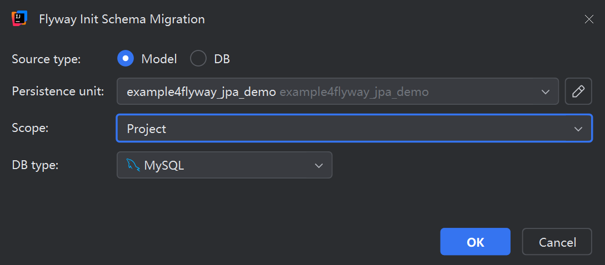
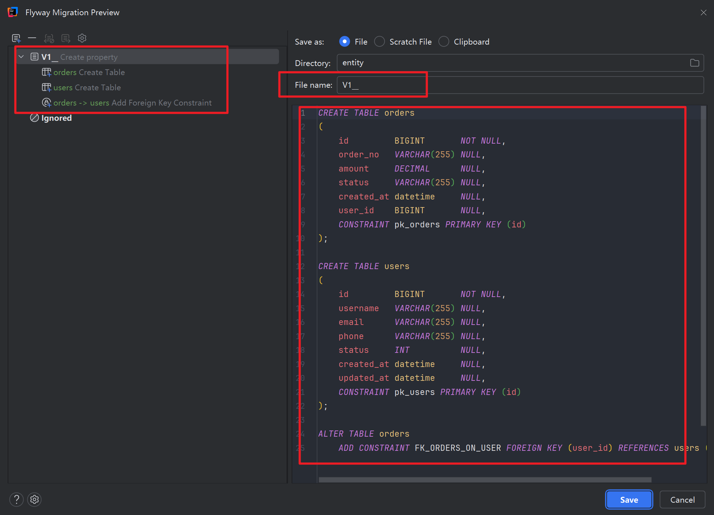
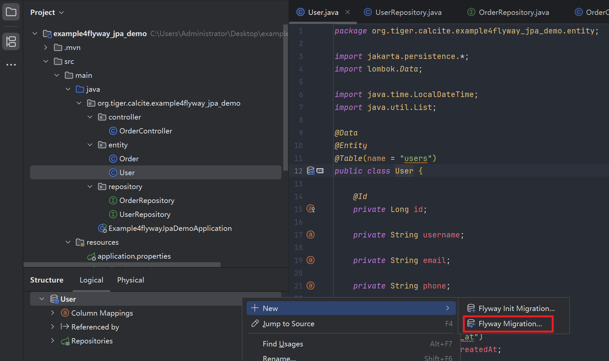
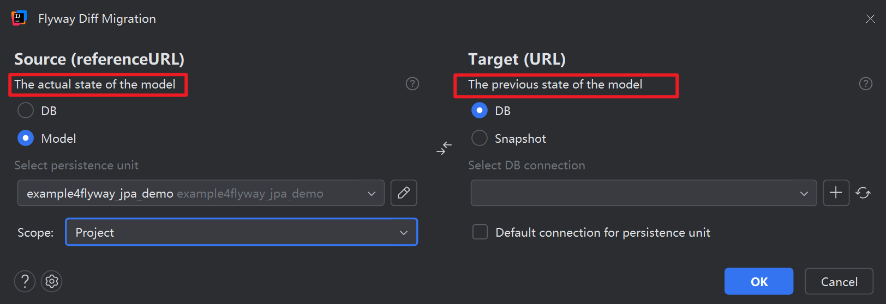
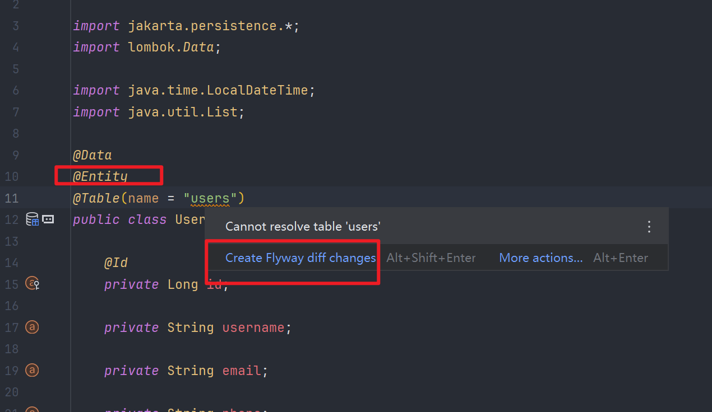
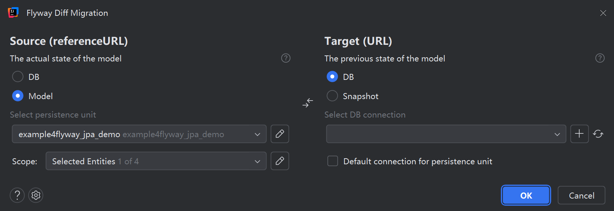

### 概述

Flyway是一个数据库版本管理工具, 他支持一套数据库版本管理规则, 你可以使用多种方式来集成Flyway, 包括但不限于

- Flyway Desktop https://documentation.red-gate.com/fd/quickstart-flyway-desktop-206602598.html
- Flyway Cli https://documentation.red-gate.com/fd/quickstart-flyway-desktop-206602598.html
- Java
- Maven
- Gradle
- Docker
- ...


### Flyway支持的数据库

https://documentation.red-gate.com/fd/supported-databases-and-versions-143754067.html


### Flyway Cli的使用

使用Flyway Cli之前你需要安装Flyway Desktop, 这样按照之后你就有了Flyway Cli的命令行了

在windows上面安装Flyway Desktop还是比较简单的, 就是一个安装包直接安装就好了, 具体可以看`https://documentation.red-gate.com/fd/quickstart-flyway-desktop-206602598.html`


这个命令行会在你Flyway Desktop的安装目录下, 如果你没有修改安装命令的话, 就是在`C:\Program Files\Red Gate\Flyway Desktop\flyway`


有了`flyway`这个命令之后, 你就要来编写一个`flyway.toml`配置文件了, 内容如下

~~~toml
[flyway]
locations = ["filesystem:migrations"] # 指定migrations脚本保存的位置
     
[environments.default]
 url = "jdbc:sqlite:FlywayQuickStartCLI.db" # 指定要连接的数据库的账号密码
user = ""
password = ""
~~~

之后再你指定的migration目录下创建我们的数据库文件, 比如 `V1__Create_person_table.sql`

~~~sql
create table PERSON (
    ID int not null,
    NAME varchar(100) not null
);
~~~

之后你只要执行如下的命令, 那么flyway就会连接到对应的数据库, 执行你的数据库脚本文件

~~~shell
flyway -configFiles=/path/to/your/flyway.conf migrate

Database: jdbc:sqlite:FlywayQuickStartCLI.db (SQLite 3.41)
Successfully validated 1 migration (execution time 00:00.008s)
Creating Schema History table: "PUBLIC"."flyway_schema_history"
Current version of schema "PUBLIC": << Empty Schema >>
Migrating schema "PUBLIC" to version 1 - Create person table
Successfully applied 1 migration to schema "PUBLIC" (execution time 00:00.033s)
~~~

之后假如你的数据库有变动, 需要进行更新, 那么你可以添加需要更新的sql, 比如`V2__Add_people.sql`

~~~sql
insert into PERSON (ID, NAME) values (1, 'Axel');
insert into PERSON (ID, NAME) values (2, 'Mr. Foo');
insert into PERSON (ID, NAME) values (3, 'Ms. Bar');
~~~

之后你只要再次执行下面的命令, flyway会知道你当前的数据库已经执行了之前的migration脚本文件, 那么下载他只会执行当前添加的`V2__Add_people.sql`这个migration

~~~shell
flyway -configFiles=/path/to/your/flyway.conf migrate

Database: jdbc:sqlite:FlywayQuickStartCLI.db (SQLite 3.41)
Successfully validated 2 migrations (execution time 00:00.018s)
Current version of schema "PUBLIC": 1
Migrating schema "PUBLIC" to version 2 - Add people
Successfully applied 1 migration to schema "PUBLIC" (execution time 00:00.016s)
~~~

之后如果你又要更新数据库了, 那么你只要添加v3, v4的脚本文件, flyway会自动帮你执行


#### 其他的命令

除了上面提到的migrate这个命令, flyway cli还支持其他的一些命令

- info: 打印数据库模式的当前状态/版本。它会打印哪些迁移正在等待执行、哪些迁移已经应用、已应用迁移的状态以及应用时间。
- baseline: 将现有数据库设置为基线，排除所有迁移，包括 *baselineVersion* 。基线有助于在现有数据库中启动 Flyway。之后，可以正常应用新的迁移。
- validate: 根据可用的迁移验证当前数据库架构。
- repair: 修复元数据表。
- clean: 删除已配置模式中的所有对象。当然，我们绝不应该在任何生产数据库上使用 *clean 命令* 。


### Flyway集成Maven

https://www.baeldung.com/database-migrations-with-flyway


在本教程中，我们将主要关注如何使用 Maven 插件执行数据库迁移。

#### Flyway Maven 插件

要安装 Flyway Maven 插件，让我们将以下插件定义添加到 *pom.xml 文件中：*

~~~xml
<plugin>
    <groupId>org.flywaydb</groupId>
    <artifactId>flyway-maven-plugin</artifactId>
    <version>11.17.0</version> 
</plugin>
~~~

该插件的最新版本可在 [Maven Central](https://mvnrepository.com/artifact/org.flywaydb/flyway-maven-plugin) 获取。

我们可以通过四种不同的方式配置这个 Maven 插件。在接下来的章节中，我们将逐一介绍这些选项。

请参考[文档](https://flywaydb.org/documentation/usage/maven/migrate)以获取所有可配置属性的列表。


#### Flyway Maven 插件的配置

有四种方式不同的方式可以对这个插件进行配置

1. 方式1, 通过 pom.xml 文件中插件定义里的 \<configuration>标签直接配置插件

   ~~~xml
   <plugin>
       <groupId>org.flywaydb</groupId>
       <artifactId>flyway-maven-plugin</artifactId>
       <version>11.17.0</version>
       <configuration>
           <user>databaseUser</user>
           <password>databasePassword</password>
           <schemas>
               <schema>schemaName</schema>
           </schemas>
           ...
       </configuration>
   </plugin>
   ~~~

2. 方式2, 在pom文件中定义properties来配置插件

   ~~~xml
   <project>
       ...
       <properties>
           <flyway.user>databaseUser</flyway.user>
           <flyway.password>databasePassword</flyway.password>
           <flyway.schemas>schemaName</flyway.schemas>
           ...
       </properties>
       ...
   </project>
   ~~~

3. 方式3, 使用外部的`flyway.conf`文件来配置插件

   flyway的maven插件默认会查找以下默认中的`flyway.conf`文件, 来作为他的配置, 优先级从上到下

   - workingDir/flyway.conf
   - userhome/flyway.conf 
   - installDir/conf/flyway.conf

   该文件的编码方式默认是utf-8, 当然你也可以使用`flyway.encoding`属性来指定

   如果我们使用其他名称（例如 *customConfig.conf* ）作为配置文件，则在调用 Maven 命令时必须显式指定该文件

   ~~~shell
   $ mvn -Dflyway.configFiles=customConfig.conf
   ~~~

4. 方式4, 通过System Properties来指定插件的配置

   ~~~shell
   $ mvn -Dflyway.user=databaseUser -Dflyway.password=databasePassword 
     -Dflyway.schemas=schemaName
   ~~~

如果你使用了多种方式来指定了同一个配置, 那么他们的优先级如下:

1. 系统属性
2. 外部配置文件
3. Maven properties
4. Plugin configuration 配置


#### Migration案例

在本节中， **我们将逐步介绍如何使用 Maven 插件将数据库模式迁移到内存中的 H2 数据库。** 我们将使用外部配置文件来配置 Flyway。


1. 首先，我们添加 H2 作为依赖项：

   ~~~xml
   <dependency>
       <groupId>com.h2database</groupId>
       <artifactId>h2</artifactId>
       <version>2.2.224</version>
   </dependency>
   ~~~

   同样，我们可以查看 [Maven Central](https://mvnrepository.com/artifact/com.h2database/h2) 上提供的最新驱动程序版本。此外，我们还需要添加之前解释过的 Flyway 插件。

2. 接下来，我们在 *$PROJECT_ROOT 目录*下创建 *myFlywayConfig.conf* 文件，内容如下：

   ~~~xml
   flyway.password=databasePassword
   flyway.schemas=app-db
   flyway.url=jdbc:h2:mem:DATABASE
   flyway.locations=filesystem:db/migration
   ~~~

   上述配置指定我们的迁移脚本位于 *db/migration* 目录中。它使用 *databaseUser* 和 *databasePassword* 连接到内存中的 H2 实例。应用程序数据库schema为 *app-db* 。

3. Migration

   让我们在 `$PROJECT_ROOT` 目录*下创建一个*名为 `db/migration` 的目录，并在其中创建一个名为 *V1_0__create_employee_schema.sql* 的迁移脚本，该脚本包含用于创建 employee 表的 SQL 指令：

   ~~~sql
   CREATE TABLE IF NOT EXISTS `employee` (
   
       `id` int NOT NULL AUTO_INCREMENT PRIMARY KEY,
       `name` varchar(20),
       `email` varchar(50),
       `date_of_birth` timestamp
   
   )ENGINE=InnoDB DEFAULT CHARSET=UTF8;
   ~~~

4. 执行Migration

   接下来，我们从 *$PROJECT_ROOT* 调用以下 Maven 命令来执行数据库迁移：

   ~~~shell
   $ mvn clean flyway:migrate -Dflyway.configFiles=myFlywayConfig.conf
   ~~~

   数据库架构现在应该如下所示：

   ~~~shell
   employee:
   +----+------+-------+---------------+
   | id | name | email | date_of_birth |
   +----+------+-------+---------------+
   ~~~

5. 执行第二次Migration

   让我们通过创建第二个迁移文件 *V2_0_create_department_schema.sql* 来看看第二个迁移是什么样的，该文件包含以下两个查询：

   ```sql
   CREATE TABLE IF NOT EXISTS `department` (
   `id` int NOT NULL AUTO_INCREMENT PRIMARY KEY,
   `name` varchar(20)
   )ENGINE=InnoDB DEFAULT CHARSET=UTF8; 
   ALTER TABLE `employee` ADD `dept_id` int AFTER `email`;Copy
   ```

   然后我们将执行与第一次类似的迁移。现在我们的数据库架构已更改，在 *employee 表*中添加了一个新列，并添加了一个新表：

   ```plaintext
   employee:
   +----+------+-------+---------+---------------+
   | id | name | email | dept_id | date_of_birth |
   +----+------+-------+---------+---------------+
   department:
   +----+------+
   | id | name |
   +----+------+
   ```

   最后，我们可以通过调用以下 Maven 命令来验证两次迁移是否都成功：

   ```shell
   $ mvn flyway:info -Dflyway.configFiles=myFlywayConfig.conf
   ```


### Flyway的内部原理

从上面的两个案例来看, 你可以在多个地方通过不同的方式来调用flyway, 比如maven, docker, gradle, cli等等

不管你通过什么方式来调用flyway, 他都有共同的特点

1. 你需要指定一个目录, 用来保存migration脚本
2. 脚本需要按照一定的命名规则
3. 你需要有一个配置, 用来指定要连接的数据库信息


#### migration脚本的命名

Flyway 的migrations脚本遵循以下的命名格式

~~~shell
<Prefix><Version>__<Description>.sql

# 比如
V1__init_schema.sql
V2__add_index_to_table.sql
~~~

1. `V` 表示这个脚本是 Versioned Migrations, 如果前缀是R表示这个脚本是Repeatable Migrations, 不同的脚本有不同的功能, 也有不同的前缀

2. V1中的数字这是第一个版本需要执行的sql, Flyway会解析这个文件名以确定在执行sql的时候他们的执行顺序

   如果数字顺序错误或跳过，Flyway 将停止并报告验证错误。

   > Flyway 并不要求版本号必须连续，所以跳过一个版本本身不会造成任何问题。但是，如果您之后添加的脚本版本低于最新应用的版本，则会被视为乱序，除非启用了 `outOfOrder` 设置，否则 Flyway 将停止运行。
   >
   > 更改已应用的脚本仍然会导致校验和不匹配，Flyway 会报错退出。

3. **版本号必须始终以 1 开头。**

4. 双下划线将版本号与易于理解的描述分隔开

5. `migration`文件夹中任何其他不符合此格式的文件都将被忽略。

6. 每个脚本都应该处理一个逻辑变更。这样更容易隔离问题并测试新的迁移。例如，与其将创建表和创建索引都塞进一个脚本中，不如将它们分开：

   ~~~shell
   V3__create_orders_table.sql
   V4__add_index_to_orders.sql
   ~~~

   > 避免将临时笔记或实验文件放在迁移文件夹中。如果您要进行一些尝试，请使用 `db/migration` 之外的单独目录，这样 Flyway 就不会尝试解析或运行它们。

   


#### migrations的分类

在flyway中, 不同的migrations的类型通过前缀区分, flyway在处理他们的时候也会有不同的方式, 主要的migrations脚本有两种

- versioned migrations
- repeatable migrations

##### versioned migrations

versioned migrations脚本的前缀是v, 也就是我们上面常用的脚本

对于这类脚本, 每一个脚本flyway都会将他认为是数据库的changlog,  类似git中的commit, 这些脚本也是一个commit,  只要按照顺序来执行这些脚本, 那么就能复原出数据库的最终形态, 并且不同阶段的数据库也能更新到最新的版本

对于这些脚本, flyway在执行了之后, 会在数据库中建立一个内部表, 这个内部表会记住当前这个数据库执行了哪些脚本, 这样下次migrate的时候就不会执行这些执行过的脚本了

同时flyway在执行的时候还会进行校验已经执行过的脚本的内容(checksum)是否发生了改变, 如果发生了改变就会停止migrate, 报错出来 


##### repeatable migrations

Flyway 支持第二种脚本类型，称为可重复迁移(repeatable migrations)。

**这类脚本以 `R__` 为前缀，每次文件内容(checksum)发生更改时都会运行**。

它们不需要指定版本号。典型的用途包括刷新视图、重新加载种子数据或更新存储过程。

~~~shell
R__refresh_materialized_views.sql
~~~

**Flyway 会跟踪脚本内容的校验和。如果脚本内容发生任何更改，它会在启动时重新运行该脚本。这在需要进行更改但又不想增加版本号时非常有用**


**在执行migrate的时候, 总是versioned migrations先执行, 然后执行repeatable migrations, 并且本次migrate中执行的所有sql都是在同一个事务中执行的, 以保证数据的一致性**


但如果不小心，也可能造成混乱。如果您的可重复脚本删除并重新创建了一个视图，则可能会破坏删除和重新创建之间运行的任何代码。因此，最好避免将可重复脚本用于直接影响应用程序查询的操作。仅在安全操作或可以容忍短暂间隔的环境中才使用它们。

此外，避免对同一对象混用可重复脚本和版本化脚本。这往往会导致冲突或意外变更，尤其是在跨团队协作时。如果某个功能最初是以版本化方式开发的，请持续使用新的版本化脚本对其进行迭代更新。

以下是使用repeatable migrations管理视图的一种安全的方式：

~~~sql
-- R__update_sales_view.sql
CREATE OR REPLACE VIEW sales_summary AS
SELECT region, SUM(total_amount) AS total_sales
FROM orders
GROUP BY region;
~~~

`CREATE OR REPLACE` 子句有助于避免视图丢失并导致其暂时不可用。它只需一步即可替换现有定义。


#### 事务

当数据库支持事务时，Flyway 会使用事务来运行迁移。在 PostgreSQL 等系统中，这意味着给定迁移的所有模式更改要么全部成功，要么全部失败。这提供了强大的安全保障，尤其是在升级期间。

对于不支持 DDL 事务的数据库（例如旧版本的 MySQL），Flyway 会回退到事务之外来执行这些命令，但仍会在元数据中跟踪这些命令。

以下是 Flyway 如何自动将迁移操作封装在事务块中的示例（这是概念上的，不是脚本中实际显示的内容，但我认为这是一个很好的可视化示例）：

~~~sql
BEGIN;
-- contents of V1__init_schema.sql
CREATE TABLE users (
    id SERIAL PRIMARY KEY,
    email VARCHAR(255) NOT NULL UNIQUE,
    created_at TIMESTAMP NOT NULL DEFAULT now()
);
COMMIT;
~~~

如果创建表失败，则事务将被回滚，并且迁移将在 Flyway 的内部跟踪表中标记为失败。


#### 锁

为了防止竞态条件，Flyway 使用 `SELECT ... FOR UPDATE` （或数据库的等效语句）对 `flyway_schema_history` 表进行加锁。该锁仅在migration事务期间有效，不会写入额外的行或列来存储锁状态。

锁在migration开始前获取，并在所有migration完成后释放。如果应用程序的两个实例同时启动（例如在扩展容器环境中），则只有一个实例会获得锁。另一个实例会等待锁释放或抛出错误，具体取决于配置。

您可以通过此设置配置重试次数：

~~~txt
spring.flyway.lock-retry-count=10
~~~

这样可以让你调整 Flyway 在放弃之前重试获取锁的次数。这在处理集群部署或可能延迟其他节点启动的长时间迁移时非常有用。

如果最后无法获取锁，Flyway 会快速失败。这可以防止部分状态迁移或重叠迁移。如果部署后应用程序无法启动，您应该始终检查日志。Flyway 会打印详细日志，说明哪个迁移失败、哪个迁移正在运行以及导致问题的 SQL 语句。


#### 确保Migrations以正确的权限运行

数据库迁移通常需要更高的权限。它们经常会创建表、添加索引、修改约束和更新种子数据。因此，运行迁移的帐户不应与应用程序在正常运行期间用于与数据库通信的帐户相同。

为 Flyway 创建一个独立的数据库用户。该用户需要拥有运行模式更改的权限，但不应被其他任何程序使用。以下是一个示例设置：

~~~properties
spring.flyway.url=jdbc:postgresql://db.internal.company.net:5432/customerdata
spring.flyway.user=flyway_migration_user
spring.flyway.password=${FLYWAY_PASSWORD}
~~~

请记住，您的应用程序应该配置一个专门用于日常查询的不同用户。该用户不应拥有删除表或创建新表的权限。这种隔离机制可以降低因安全问题导致应用程序凭据泄露而造成的损失。


#### history表

Flyway 会将应用程序及其校验和、时间戳和执行时间记录在 `flyway_schema_history` 表中。如果您之后更改了已运行文件的内容，Flyway 会检测到校验和不匹配，并在启动时抛出错误。

这是设计使然。更改已应用的migration文件被视为危险操作，未经人工干预是不允许的。

您可以通过直接查询元数据表来查看已应用的迁移：

~~~sql
SELECT version, description, installed_on, success
FROM flyway_schema_history;
~~~

这可以提供完整的迁移历史记录，包括已运行的迁移、应用时间和迁移是否成功。这有助于调试和审核生产环境中的模式变更。


### Flyway和SrpingBoot集成

https://medium.com/@AlexanderObregon/using-spring-boot-with-flyway-to-manage-database-migrations-8180ce0c9230

管理数据库模式的长期变更，是后端系统开发中最棘手的部分之一。Flyway 通过 SQL 或基于 Java 的迁移脚本对模式变更进行版本控制，从而解决了这个问题。

Spring Boot 则让 Flyway 能够轻松地集成到应用程序生命周期中。今天，我们将深入探讨 Flyway 如何与 Spring Boot 协同工作，如何组织迁移脚本，如何安全地对变更进行版本控制，以及如何让所有操作在启动时自动执行。您还将了解 API 密钥认证和完整用户授权之间的区别，以及如何确保数据库迁移过程的安全。


#### Flyway如何在SpringBoot中自动运行Migrations

要想使用flyway和springboot集成, 只需要添加对应的flyway的依赖, springboot就会将其集成到启动流程中, 从而正常的执行你的migrations脚本

~~~xml
<dependency>
    <groupId>org.flywaydb</groupId>
    <artifactId>flyway-core</artifactId>
</dependency>
~~~

flyway会集成到springboot初始化的早期阶段, 当程序启动并从spring上下文开始加载bean的时候, springboot会通过classpath中是否存在`flyway-core`这个依赖来检测flyway,  这会触发flyway的自动配置

Spring Boot 检测到 Flyway 后，会创建一个 `FlywayAutoConfiguration` bean, 并通过这个bean来实现自动配置. 迁移操作会在任何 `@PostConstruct` 方法、 `ApplicationRunner` 或 `CommandLineRunner` 代码执行之前运行。这种顺序是特意安排的，因为 Flyway 需要在任何程序尝试使用数据库之前更新数据库模式。

默认情况下，Flyway 会在以下位置查找迁移脚本：

~~~xml
src/main/resources/db/migration
~~~

您可以使用 `application.properties` 或 `application.yml` 文件中的以下属性来更改此位置：

~~~properties
spring.flyway.locations=classpath:/db/main,classpath:/db/billing
~~~


你需要在`src/amin/resources/db/migrations`下创建如下的migrations格式的文件

~~~sql
V1__init_schema.sql
V2__add_index_to_table.sql
~~~

Spring Boot 会检测到 Flyway，在上下文加载期间初始化它，找到migration脚本，并按版本顺序应用它们。每个脚本只会应用一次


为了防止你同是启动多个实例, 同时flyway执行migrations脚本, Flyway 使用 `SELECT ... FOR UPDATE` （或数据库的等效语句）对 `flyway_schema_history` 表进行加锁, 如果其中有一个实例抢锁失败, 那么会抛出异常, 此时你可以设置flyway的重试次数, 这在处理集群部署或可能延迟其他节点启动的长时间迁移时非常有用。

~~~shell
spring.flyway.lock-retry-count=10
~~~

如果部署后应用程序无法启动，您应该始终检查日志。Flyway 会打印详细日志，说明哪个迁移失败、哪个迁移正在运行以及导致问题的 SQL 语句。


您还可以使用以下方法在某些环境中禁用自动迁移：

~~~properties
spring.flyway.enabled=false
~~~

这在测试期间或迁移由外部处理时非常有用。如果您需要更多控制权，仍然可以手动触发迁移，方法是创建一个 `Flyway` bean 并调用 `migrate()` 方法。


Flyway 的默认行为开箱即用，并且能够直接融入 Spring Boot 的启动生命周期。这种设计经过精心考量，确保数据库更改始终在代码执行任何其他操作之前运行，从而降低应用程序所依赖的表或列缺失或配置错误的风险。


#### 手动触发migrations

如果你禁用了springboot中的flyway 的自动migrations, 那么你还可以通过代码来手动实现, 自己想要什么时候执行migrations就什么时候执行

如果你设置了`spring.flyway.enabled=false`, 那么就不会自动配置`Flyway`这个bean了, 所以我们需要自己来提供, 但是这非常的不方便, 所以其实我们可以设置`spring.flyway.enabled=true`, 然后通过如下的代码来关闭自动migrations

~~~java
@Configuration
public class EmptyMigrationStrategyConfig {

    @Bean
    public FlywayMigrationStrategy flywayMigrationStrategy() {
        return flyway -> {
            // do nothing  
        };
    }
}
~~~

上面的代码会在springboot启动的时候禁用自动migrations, 之后如果我们想要手动migrations的话, 只需要调用`flyway.migrate()`这个方法就可以了

~~~java
@RunWith(SpringRunner.class)
@SpringBootTest
public class ManualFlywayMigrationIntegrationTest {

    @Autowired
    private Flyway flyway;

    @Test
    public void skipAutomaticAndTriggerManualFlywayMigration() {
        flyway.migrate();
    }
}
~~~


### baseline

todo


### 在IDEA中生成 Versioned Migrations

https://www.baeldung.com/database-migrations-with-flyway

如果需要手动来编写migrations, 那么需要耗费导量的时间, 这个时候我们可以使用idea 的`jpa buddy`这个插件来生成migrations,  他会根据我们的jpa实体类来生成对应的migration脚本


**你可以直接使用当前md同目录中的项目来测试**


首先你可以跳转到entity对应的类, 然后选择查看他的结构(alt+7), 然后选择Logical, 然后右键, 就可以看到flyway相关选项了



Flyway Init Migration表示生成初始的Migrations脚本, 就相当于你的数据库中还没有创建对应的表, 现在完全根据entity来生成migration

scope选择`Project`, 表示为整个项目的entity都生成对应的migration脚本, `Selected Entities`表示只为当前选中的entity生成对应的migration





之后就会生成对应的sql脚本, 以及脚本的版本号, 然后你需要输入脚本的名称, 保存到的地址




当然你可以选择你二种方式`Flyway Migration`, 这种就是使用当前的entity和数据中的表进行对比, 生成对应的Migration脚本



使用这种方式你需要指定当前版本的结构, 也就是Source, 然后要选择上个版本的结构, 也就是Target

这样的话插件就会进行对比, 然后生成对应的Migration脚本



之后的话也会为你生成对应的Migration脚本


当然还有一种方式就是你把鼠标悬浮在entity类的表名上面,  会自动提示你是否要创建对应的migration脚本





之后选择source和target, 也可以生成对应的migration脚本