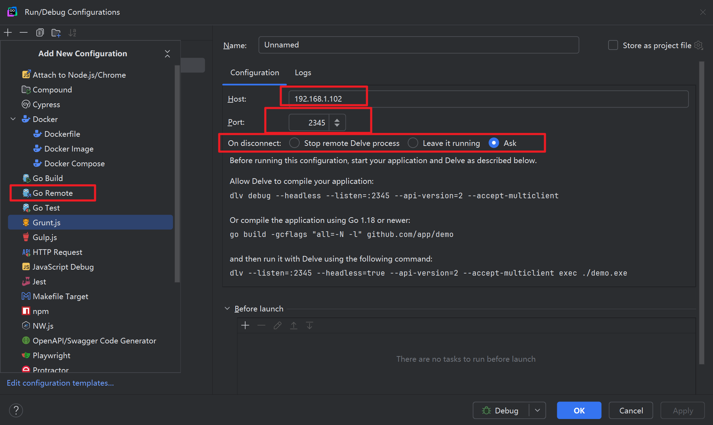
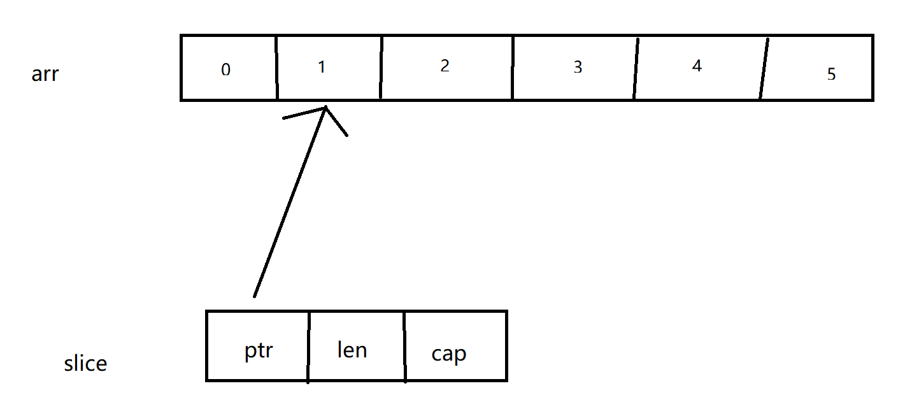
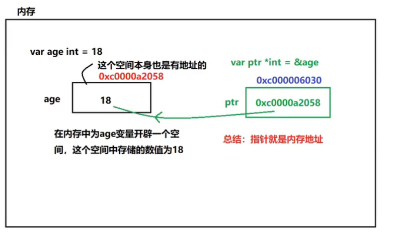
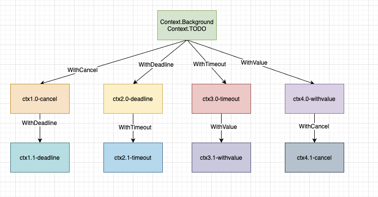
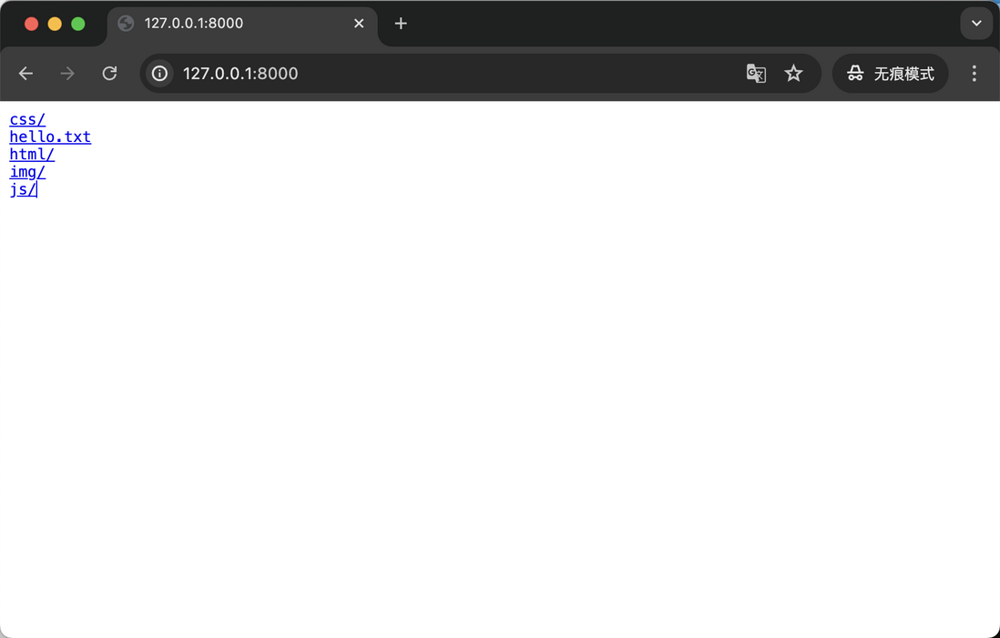
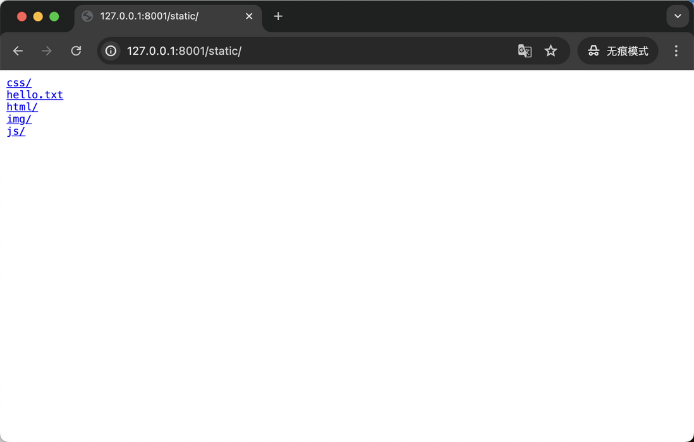
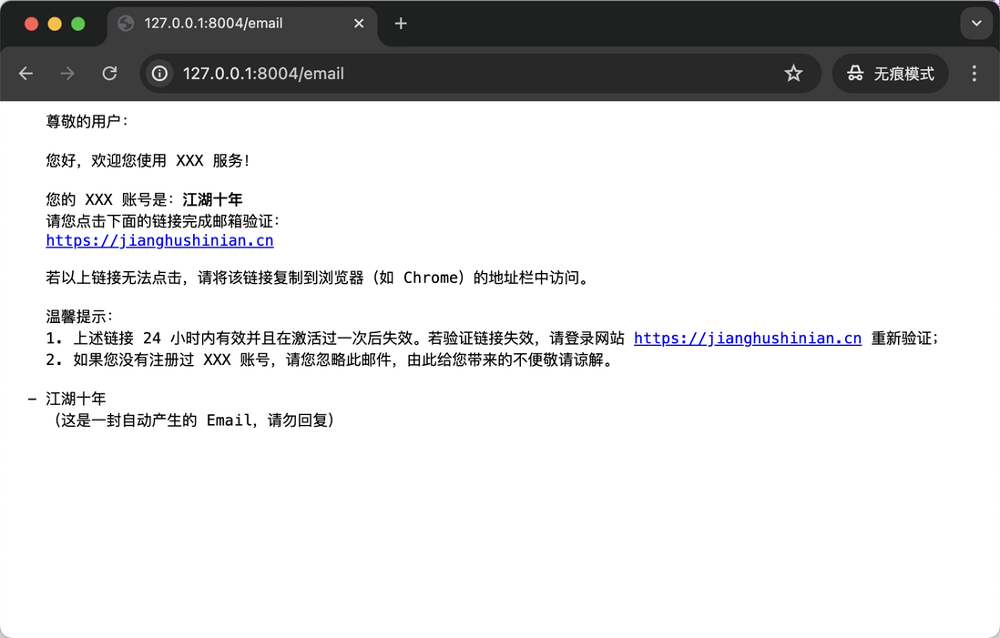

## go安装

1. 下载压缩包
2. 配置`GOROOT`,  并将`%GOROOT/bin`添加到`PATH`环境变量
3. 配置`GOPATH`环境变量, 用以保存第三方jar包
4. 执行`go version`


### go命令行

~~~bash
go run xxx.go # 执行xxx.go文件

go build xxx.go # 编一个xxx.go, 生成xxx.exe

go build -o aaa.exe bbb.go # 编译bbb.go, 生成aaa.exe

# 编译根目录下的aaa文件夹, 将aaa.exe生成到./build下
# -ldflags "-w -s"的作用是减少二进制文件的大小
go build -o ./build/aaa.exe -ldflags "-w -s" aaa


#------------------go install----------------------------------
# go install主要用于编译并安装go程序到指定的项目
# 他会将编译后的可执行文件放到$GOPATH/bin目录下
# 他会将编译后的.a静态库文件放到$GOPATH/pkg目录下

# 下载github项目并编译, 安装
go install github/go-delve/delve/cmd/dlv@latest

# 在项目目录下执行, 会编译当前目录中的main包, 安装可执行文件
go install
~~~

### go 交叉编译

在交叉编译的情况下, 必须关闭cgo功能, cgo的主要功能是在go中调用c语音的代码

goos指定要编译的目标平台, goarch指定cpu的架构

~~~go
// max下编译为Linux和Window64为可执行程序, 或者在git bash下执行
CGO_ENABLED=0 GOOS=linux  GOARCH=amd64  go build main.go
CGO_ENABLED=0  GOOS=windows  GOARCH=amd64  go build main.go

// linux下编译为max和windows64可执行程序
CGO_ENABLED=0 GOOS=darwin GOARCH=amd64 go build main.go
CGO_ENABLED=0 GOOS=windows GOARCH=amd64 go build main.go

// windows下编译为mac和linux64位可执行程序
SET CGO_ENABLED=0
SET GOOS=darwin
SET GOARCH=amd64
go build main.go

SET CGO_ENABLED=0
SET GOOS=linux
SET GOARCH=amd64
go build main.go
~~~


### dlv远程debug

要使用dlv进行远程debug, 首先需要在远程的linux上安装go和git

#### 安装git和go

1. 安装go

   ~~~shell
   # 下载go1.22.12.linux-amd64.tar.gz到/opt/module/ 下面
   unzip go1.22.12.linux-amd64.tar.gz
   
   mkdir -p /opt/module/go/go1.22.12 /opt/module/go/
   cd /opt/module
   tar -xzvf go1.22.12.linux-amd64.tar.gz -C /opt/module/go/go1.22.12/
   mv go/go1.22.12/go/* go/go1.22.12/
   rm -rf ./go/go1.22.12/go
   ~~~

2. 设置go环境变量

   ~~~shell
   cat <<EOF > /etc/profile.d/myenv.sh
   export GOROOT=/opt/module/go/go1.22.12
   export GOPATH=/opt/module/go/gopath
   export PATH=\$PATH:\$GOROOT/bin
   export PATH=\$PATH:\$GOPATH/bin
   EOF
   
   source /etc/profile.d/myenv.sh
   ~~~

3. 查看go是否安装好

   ~~~shell
   go version
   ~~~

4. 安装git

   ~~~shell
   sudo yum install -y git
   git --version
   ~~~

   

#### 编译dlv

1. 编译dlv

   ~~~shell
   # 方式1, 如果可以直接连接外网
   go install github.com/go-delve/delve/cmd/dlv@latest
   
   # 方式2, 如果git install没有成功, 那么可以先git clone 先拉下代码来
   git clone https://github.com/go-delve/delve
   cd delve
   go install github.com/go-delve/delve/cmd/dlv
   
   # 方式3, 如果无法访问github, 那么可以windows下载好代码, 传到linux上, 然后
   cd delve
   go install github.com/go-delve/delve/cmd/dlv
   ~~~

2. 编译好之后, 会在gopath/bin目录下生成dlv命令

   ~~~shell
   ls $(go env GOPATH)/bin/dlv
   dlv --help # 因为我们之前将$GOPATH/bin 添加到了PATH下
   ~~~

#### 编译工程

~~~shell
# 如果你想项目是在windows下, 那么要交叉编译
# -N 禁止编译器优化, -l 禁止内联, 用于debug
CGO_ENABLED=0 GOOS=linux  GOARCH=amd64 go build -gcflags "all=-N -l" -o app main.go
~~~


#### 部署和debug

使用dlv有两种方式

- 一种是通过dlv来启动go程序, 然后进行debug
- 一种是go程序已经启动了, 通过dlv来attach到进程上面, 进行debug

先说第一种

~~~shell
# --listen     表示要监听的端口
# --headless   以非交互模式启动, 主要用于远程debug, 如果直接通过dlv来debug的话, 那么要设置为false
# --api-version=2	指定 API 版本，当前主流 IDE（如 VSCode、GoLand）一般使用 v2
# --accept-multiclient	允许多个客户端连接调试（否则默认只接受一个连接）
# check-go-version=false	跳过 Go 版本检查（版本不匹配时不报错）
# exec ./plutus       执行 plutus 这个可执行文件进行调试
# --    分隔符，告诉 Delve 后面的参数是传给被调试程序的
# -config=conf/conf.test.toml 是传给你自己程序 ./plutus 的参数，比如配置文件路径
# --continue 告诉程序直接执行, 不用等goland的连接, 如果不指定这个参数, 那么程序不执行, 等到goland连接之后才执行


# 连接之后, 通过ctrl+c 无法终端程序, 只能另外启动一个shell来kill程序
# 或者通过goland连接dlv程序, 然后关闭goland debug的同时关闭dlv
dlv \
  exec ./hello \
  --listen=:2345 \
  --headless=true \
  --api-version=2 \
  --accept-multiclient \
  --check-go-version=true \
  --continue \
  -- -config=conf/conf.test.toml
~~~

再说第二中, attach到一个程序上

~~~shell
# 首先要启动你的go程序
./hello

# 查看这个go程序的pid
ps -ef | grep hello

# 然后通过dlv attach到这个go程序上, 这样就能通过goland来debug了
# 当你使用attach附加到一个正在运行的 Go 程序时，Delve 会暂停该程序的执行，等待你进行调试。
# 如果你加上 --continue 参数,Delve 会在附加成功后立即让程序继续运行，这在使用 IDE（如 GoLand）远程 attach 时非常常见，因为你并不想手动 resume 程序。
dlv attach <pid> \
  --headless \
  --listen=:2345 \
  --api-version=2 \
  --accept-multiclient \
  --continue
~~~


只要通过上面两种方式启动程序之后, 在goland中添加debug程序



上面那个`On Disconnect`表示关闭goland上的debug程序的时候, 是继续运行dlv跑程序, 还是关掉dlv和程序


## go值类型与引用类型, 零值

值类型: 数字, string, bool, array, struct   

引用类型: 指针, slice, map, interface, func, chan   零值为nil


## hello world

查看同级目录下的helloworld项目


## 变量和常量


### 变量

go中的变量主要有如下几个特性:

1. **定义了当时没有使用的变量会直接导致编译失败**
2. 定义了当时没有赋值的变量具有**默认值**
3. 变量的命名使用**驼峰法**
4. go是强类型的, 不同类型的变量不能相互赋值
5. 首字母大写的全局常量被认为是**可导出的**


下面是具体的代码

1. 局部变量

   ~~~go
   func main() {
   
   	name := "hello"            // 变量定义并赋值, 使用类型推断
   	color, weight := "red", 18 // 同时定义多个变量并赋值, 使用类型推断
   
   	var name1 = "hello"             // 变量定义并赋值, 使用类型推断
   	var color1, weight1 = "red", 18 // 同时定义多个变量并赋值, 使用类型推断
   
   	var name2 string = "hello"   // 变量定义并赋值
   	var n1, n2, n3 int = 1, 2, 3 // 三个变量都是同类型
   	var (
   		x int = 10
   		y int = 12
           z = "hello world"
   	) // 一次性定义多个不同类型的变量
   
   	// 变量定义, 但是未赋值, 那么会使用默认值, string的默认值为 ""
   	var age, age1 string
   
   	// 变量赋值
   	age = "hello"
   
   	// age = 12 // go是强类型的, 不同类型的变量不能相互赋值
   
   	// 定义了变量, 但是没有使用的变量会直接导致编译失败
   	print(age, age1, name, name1, name2,
   		color, weight, color1, weight1, n1, n2, n3)
   	println(x, y)
   }
   ~~~

2. 全局变量

   ~~~go
   // 定义全局变量
   var globalVar = 10
   
   // globalVar := 10 // 定义全局变量不能使用这种语法
   
   // 一次性定义多个全局变量
   var (
   	globalVar1 = 10
   	globalVar2 int // 未赋值, 具有默认值, 0
   )
   
   func main() {
   	print(globalVar1, globalVar2, globalVar)
   }
   ~~~


### 常量

同时go中也有常量, 他的定义方法和定义变量类似, 只不过使用的是const

常量在定义之后, 就不能修改了

~~~go
const f int = 12
const g = 12 // 使用类型推导
const d, e int = 12, 32 // 一次性定义多个同类型的常量
const (
    a sring = "abc"
    b = len(a) 
    c = 12 // 使用类型推导
) // 一次性定义多个不同类型的常量


func main(){
    const g = 10 // 局部的常量
    
    
    // 没有使用到的常量不会导致编译报错
    println(a)
}
~~~


在使用const的时候, 有一个特殊的值iota, 他表示常量在const代码块中的行号, 起始值为0

如果一个常量没有显式指定值,  那么他默认为iota

~~~go
    const (
            a = iota   //0
            b          //1
            c          //2
            d = "ha"   //独立值，iota += 1
            e          //"ha"   iota += 1
            f = 100    //iota +=1
            g          //100  iota +=1
            h = iota   //7,恢复计数
            i          //8
    )
~~~


## 基本数据类型


###  基本数据类型

在go中, 基本类型有如下几种

1. 整型类型: int, int8, int16, int64, uint, uint8, uint16, uint32, uint64

   int和uint在32位系统中就是32位,  在64位系统中就是64位

   对于数字, 自动推断为int类型

2. byte

   byte是uint8的别名, 主要用来表示一个字节

   ~~~go
   var b byte = 10
   ~~~

3. rune

   rune就是int32的别名, 主要用来表示一个unicode编码的字符

   ```go
   var r rune = '中'
   ```

4. 浮点类型: float32, float64

5. bool: true/false

6. string

   底层使用utf-8编码

   ~~~go
   s1 := "hello world"
   s2 := 'hello world'
   s3 := `hello world` // 不支持转义, 不支持插值
   ~~~

   

没有字符类型, 如果想要表达字符类型, 那么需要借助byte和rune类型

~~~go
var c1 byte = 'a'
var c2 rune = '中'
fmt.Println(c1) // 97
fmt.Printf("%c, %c\n", c1, c2) // a, 中
~~~


### 基本数据类型的默认值

对于一个定义了, 但是没有赋值的变量, 那么他具有默认值

1. 整型: 0
2. 浮点类型: 0
3. bool: false
4. string: 空字符串


### 基本数据类型的转换

1. 显式类型转换语法为: `T(v)`, T表示目标类型

   ~~~go
   	var a int = 88888
   	var b int64 = int64(a)
   	var c int8 = int8(b) // 会截断
   	println(a, b, c)
   
   // 其他类型转换为string
   // 方式1: 使用fmt模块
   s1 := fmt.Sprintf("%d", 19)
   s2 := fmt.Sprintf("%f", 20.000)
   s3 := fmt.Sprintf("%t", false)
   s4 := fmt.Sprintf("%c", 'a')
   
   // 其他类型转换string
   // 方式2: 使用strconv模块
   s5 := strconv.FormatInt(int64(18), 10) // 第一个参数必须是int64类型, 第二个参数为进制
   s6 := strconv.FormatFloat(4.29, 'f', 9, 64) // 第二个参数为str的格式, f表示(-ddd.ddd), 第三个参数为保留几个小数, 第四个参数表示第一个参数的类型是float32还是float64
   s7 := strconv.ForamtBool(true)
   
   // 将string类型转换为其他类型, 必须使用strconv模块
   b, err := strconv.ParseBool("true")
   i, err := strconv.ParseInt("10", 10, 64) // 第二个参数为进制, 第三个参数表示转换为int64, int32, 还是int8等等
   f, err := strconv.ParseFloat("10.89293", 10, 32) // 第二个参数表示进制, 第三个参数表示转换为float32
   ~~~

2. 在go中, 没有隐式类型转换, 只能手动类型转换

   ~~~go
   var n5 int32 = 12
   var n6 int64 = int64(n5) + 30 // 必须手动转换
   ~~~

3. 可以将字符串转换为字节数组

   ~~~go
   var h = "hello world"
   var b []byte = []byte(h)
   ~~~

   

## 运算符

1. 算数运算符: +, -, *, /, %, ++, --
2. 赋值运算符: =, +=, -=, /=, %=
3. 关系运算符: ==, !=, >, <, >=, <=
4. 逻辑运算符: &&, ||, !
5. 位运算符: &, |, ^
6. 指针运算符: &(取地址), *(根据地址取内容)


### 可比较的

在关系运算符中, ==, !=, >, <, >=, <=这些运算符能够使用的前提是:

**运算符的左右两边的操作数都需要是可以相互赋值的, 才能够进行比较**

~~~go
a := 1
b := 1.0
if a == b {} // 报错, 因为左右两边不能相互赋值
~~~


同时, 可以将所有的关系运算符分为两类

- ==, !=, 这两个运算符必须是comparable type才可以使用
- <, <=, >, >=, 这几个运算符必须是ordered type才可以使用


Go的类型比较规则如下:

| 类型      | comparable | ordered           |
| :-------- | :--------- | :---------------- |
| bool      | o          | x                 |
| integer   | o          | o                 |
| float     | o          | o                 |
| complex   | o          | x                 |
| string    | o          | o(按照字典序排列) |
| pointer   | o          | x                 |
| channel   | o          | x                 |
| interface | o          | x                 |
| struct    | o          | x                 |
| array     | o          | x                 |
| 类型参数  | o          | x                 |

- func、slice 和 map 是不可比较的类型，但这里面有个特殊情况，他们可以和 nil 字面值比较

- bool, integer, float, complex, string都是可比较的

- 对于两个相同类型的pointer, 只有他们指向的地址相同, 或者都是nil时, 那么他们相同

  ~~~go
  var a *int
  var b *int
  println(a == b) // true, 都是nil
  
  var c = 10
  var e = &c
  var g = &c
  println(e == g) // true, 指向同一个地址
  ~~~

  

  但是有一个特殊情况: **两个指向不同的 zero-size 变量的指针，可能相等也可能不相等！**

  ~~~go
  // B结构体没有任何字段, 所以为zero-size
  type B struct {
  }
  
  type A struct {
  	X *B
  	Y *B
  }
  
  // 虽然 X 和 Y 指向不同的结构体实例，但是 a.X 和 a.Y 比较的输出结果为 true
  a := &A{
      X: &B{},
      Y: &B{},
  }
  println(a.X == a.Y) // true
  
  m := &B{}
  n := &B{}
  println(m == n) // false
  ~~~

  

- 对于两个类型相同的chan, 只有他们都是nil, 或者使用同一个make创建出来时, 他们才相等

  ~~~go
  a := make(chan int)
  b := a
  println(a == b) // true
  
  // c 和 d 不是由同一个 make 创建而来，因此 c 和 d 不相等
  c := make(chan int)
  d := make(chan int)
  println(c == d) // false
  
  var x chan int  = nil
  var y chan int  = nil
  println(x == y) // true
  ~~~

- 对于interface类型, 只有他们都是nil, 或者他们的实际类型相同, 实际类型的值也相同时, 他们才相同

  ~~~go
  var a int  = 1
  var b float32 = 2
  var c int  = 1
  var a1 interface{} = a
  var b1 interface{} = b
  var c1 interface{} = c
  println(a1 == b1) // false, 实际类型不同
  println(a1 == c1) // true, 实际类型相同, 值也相同
  
  var d interface{} = []int{1}
  var e interface{} = 1
  var f interface{} = []int{1}
  println(d == e) // 实际类型不同, false
  println(d == f) // 实际类型相同, 但是slice是不可比较的, 所以panic
  ~~~

  **所以在比较两个interface类型时, 一定要确定他的真实类型是不是可比较的**

- 对于struct, 如果他的所有字段都是可比较的, 那么该结构体是可比较的

  在比较的时候, 会按照顺序对所有的字段都进行比较

  ~~~go
  type A struct {
  	X int
  }
  
  a := A{1}
  b := A{1}
  c := A{2}
  println(a == b) // true
  println(a == c) // false
  ~~~

  struct 类型比较也可能 panic，因为 struct 类型的比较本质上是字段的比较，如果字段包含 interface 类型，根据第五点我们知道可能会发生 panic。

  ```go
  type B struct {
  	a interface{}
  }
  
  a := B{a: []int {1}}
  b := B{a: []int {1}}
  println(a == b)	// panic
  ```

- 对于array, 数组是否可以比较, 取决于元素类型是否可以比较

  在比较的时候, 会按照索引递增的顺序逐个比较

  ~~~go
  a := [2]interface{}{1}
  b := [2]interface{}{1}
  println(a == b) // true
  
  e := [2]interface{}{2}
  f := [2]interface{}{1, 2}
  println(e == f) // false
  
  c := [1]interface{}{[]int{}}
  d := [1]interface{}{[]int{}}
  println(c == d) // panic, 因为元素类型是slice, 不可比较的
  ~~~

- 对于类型参数, 如果类型参数的类型集合中的所有类型都是严格可比较的，那么类型参数就是可比较的。

  那么什么是严格可比较的呢?

  一个类型是严格可比较的，如果它是可比较的且不是接口类型，也不由接口类型组成。具体规则如下：

  - bool、数值、string、pointer 和 channel 类型是严格可比较的。
  - 如果一个结构体的所有字段类型都是严格可比较的，那么结构体类型就是严格可比较的。
  - 如果数组的元素类型是严格可比较的，那么数组类型就是严格可比较的。
  - 如果类型参数的类型集合中的所有类型都是严格可比较的，那么类型参数就是严格可比较的。

  ```go
  func Cmp[T int | float32](a, b T) {
  	println(a == b)
  }
  
  func main() {
  	Cmp(1, 2) // false
  }
  ```

  这里的类型参数 T 类型集合只包含 int 和 float32，这两个类型都是严格可比较的，因此我们对 a 和 b 进行比较。

  ```go
  func Cmp[T int | []int](a, b T) {
  	println(a == b)
  }
  ```

  这里的类型参数 T 类型集合只包含 int 和 `[]int` ，`[]int` 是 slice 类型，不可比较，因此 a == b 根本编译不通过。


## 输入和输出

### 从键盘输入

方式1

~~~go
var age int
fmt.Println("请输入年龄: ")

// 从控制台输入, 并赋值给age, 输入的类型一定要正确
// 如果类型不正确, 会有意想不到的问题
fmt.Scanln(&age) 
~~~

方式2

~~~go
var age int
var name string
var score float32
var isVIP bool

fmt.Println("输入年龄, 姓名, 成绩, 是否vip, 使用空格分隔")
fmt.Scanf("%d $s %f %t", &age, &name, &score, &isVIP)
~~~


### 从命令行输入

~~~go
package main
 
import (
    "flag"
    "fmt"
)
 
func main() {
    // 第一个参数是参数名称, 第二个是默认值, 第三个是参数的描述
    // 返回的是一个指针
    ok := flag.Bool("ok", false, "is ok")
    id := flag.Int("id", 0, "id")
    port := flag.String("port", ":8080", "http listen port")
    
    // 将解析的命令行参数, 保存到对应的变量中
    var name string
    flag.StringVar(&name, "name", "123", "name")
 
    flag.Parse() // 执行解析
 
    fmt.Println("ok:", *ok)
    fmt.Println("id:", *id)
    fmt.Println("port:", *port)
    fmt.Println("name:", name)
}
~~~

可以通过如下方式来设置命令行参数

~~~go
-id=1
--id=1
-id 1
--id 1
~~~

执行

~~~bash
$ go run flag.go -id=2 -name="golang"
ok: false
id: 2
port: :8080
name: golang
~~~

可以通过-h参数来查看帮助命令

~~~bash
$ go run flag.go -h
-id=0: id
-name="123": name
-ok=false: is ok
-port=":8080": http listen port
~~~


或者也可以使用`os.Args`函数来获取参数

~~~go
package main

import (
	"fmt"
	"os"
	"strconv"
)

func main () {
	for idx, args := range os.Args {
		fmt.Println("参数" + strconv.Itoa(idx) + ":", args)
	}
}
$go run main.go 1 3 -X ?
参数0: /tmp/go-build116558042/command-line-arguments/_obj/exe/main
参数1: 1
参数2: 3
参数3: -X
参数4: ?
~~~


### 输出

在go中, 可以使用fmt.Print和fmt.Println来输出内容

~~~go
	fmt.Print("b is: ", 10) // 不换行
	fmt.Println("a is: ", 10) // 换行
~~~

`fmt.Print`有几个变种：

```go
Printf : 只可以打印出格式化的字符串。只可以直接输出字符串类型的变量（不可以输出别的类型）
Sprintf：格式化并返回一个字符串而不带任何输出
Fprintf：来格式化并输出到 io.Writers 而不是 os.Stdout
```

其中占位符有:

~~~go
%t:                      bool
%d:                      int, int8 等
%d, %x:                  uint, uint8 等 
%g:                      float32, complex64 等
%s:                      string
%p:                      chan
%p:                      pointer

%v                       值的默认格式
%+v                       类似%v, 但是输出结构体的时候会添加字段名
%#v                      值的go语法表示
%T                       值的类型
~~~


## 流程控制

### if-else

~~~go
var count int = 100
if count < 10 {
    
} else if count < 50 {
    
} else if count < 70 {
    
} else {
    
}
~~~

在 if 的时候, 还可以定义变量, 变量的作用域为if-else代码块

~~~go
func getNum() int {
	return 10
}

func main() {
	if num := getNum(); num < 2 {
		println(num)
	} else if num < 4 {
		println(num)
	} else {
		println(num)
	}
}
~~~


### switch case

~~~go
func getNum() int {
	return 10
}

func main() {

	// switch后面跟一个常量, 变量, 有返回值的函数
	switch getNum() {
	case 1:
		println(1)
		// 不需要break
	case 2:
		println(2)
	default:
		println("not 1, 2")
	}
}
~~~

在switch的表达式中, 可以直接定义变量, 变量的作用域为switch代码块

~~~go
func main() {
    // 定义变量
	switch a := getNum(); a {
	case 1:
		println(a)
	case 2:
		println(a)
	default:
		println("not 1, 2")
	}
}
~~~

switch中可以省略表达式, 当做if-else用

~~~go
v := hello

// 这里switch充当if-else
switch {
	case strings.HasPrefix(v.Name, "lo"),
		strings.HasPrefix(v.Name, "docker"),
		strings.HasPrefix(v.Name, "br-"),
		strings.HasPrefix(v.Name, "veth"),
		v.BytesRecv == 0,
		v.BytesSent == 0:
		return true
	default:
		return false
	}
~~~


switch还可以添加falthrough关键字

~~~go
func main() {
	switch a := getNum(); a {
	case 1:
		println(a)
		fallthrough // 这会导致直接执行下一个case语句块
	case 2:
		println(a)
	default:
		println("not 1, 2")
	}
}
~~~


### for

~~~go
	for i := 0; i < 10; i++ {
		fmt.Println(i)
	}

	// for range可以遍历数组, 切片, 字符串, map, 通道
	// for range等效于for each
	for i, i2 := range "hello" {
        // i是索引, i2是值
		fmt.Printf("%v, %c \n", i, i2)
	}
~~~


### while和do-while

go中没有while和do-while, 但是可以使用for循环来代替

~~~go
	// 等效于while
	i1 := 10
	for i1 < 20 {
		println(i1)
		i1++
	}

for {
    // 死循环
}
for ;; {
    // 死循环
}
~~~


### break和continue

break和continu在go中和java中是一样的


### goto

~~~go
func main() {
	
	fmt.Println("hahah")
	if 1 == 1 {
		goto lable1 // 无条件跳转到lable1
	}
	fmt.Println("aaa")

	lable1:
		fmt.Println("hello")
}
~~~


## 集合类型


### 数组


#### 一维数组

~~~go
func main() {
    // 数组的创建
    var scores [5]int                        // 默认值为一个长度为5的int数组, 每个位置都是0
	var arr1 [3]int = [3]int{3, 3, 4}        // 创建一个长度为3的数组, 并设置初始值
    arr2 := [3]int{3, 3, 4}               // 使用自动类型推断, 常用!!!!!!
    arr3 := [...]int{3, 4, 4}             // 数组长度根据初始值确定
    arr4 := [...]int{0: 10, 1: 20, 3: 30} // 通过下标设置初始化值
    
	// 读取和设置元素
	fmt.Println(scores[4])
	scores[0] = 10

    // 数组的遍历
	for i := 0; i < len(scores); i++ {
		scores[i] = i
	}
	for idx, value := range scores {
		scores[idx] = value
	}

}
~~~

需要注意的是: 

1. 不同长度的数组是不同的类型, 所以他们不能相互赋值, 也不能传参

   ~~~go
   func main() {
   	var arr1 [3]int
   	var arr2 [2]int
   	fmt.Printf("%T, %T", arr1, arr2) // [3]int, [2]int
   
   	// arr2 = arr1 // 报错, [3]int和[2]int是不同类型
   }
   ~~~

2. 将数组传递到函数中的时候, 是值拷贝,  **如果需要再函数内修改数组, 需要传递指针**

   ~~~go
   func main() {
   	var arr1 [3]int
   	add(arr1)
   	fmt.Println(arr1) // [0 0 0]
   
   	addWithPtr(&arr1)
   	fmt.Println(arr1) // [1, 1, 1]
   }
   
   func add(arr [3]int) {
   	for i, _ := range arr {
   		arr[i] += 1
   	}
   }
   
   func addWithPtr(arr *[3]int) {
   	for i, _ := range arr {
   		arr[i] += 1
   	}
   }
   ~~~

3. 数组的长度是不可变的


#### 二维数组

~~~go
func main() {

	var arr1 [2][3]int // 具有默认值, 每个元素都是0
	var arr [2][3]int = [2][3]int{{1, 2, 3}, {4, 5, 6}}

	for i1, value1 := range arr {
		for i2, value2 := range value1 {
			fmt.Printf("arr[%v][%v] = %v \n", i1, i2, value2)
		}
	}

	fmt.Println(arr1) // [[0 0 0] [0 0 0]]
}
~~~


### slice

切片是建立在数组之上的数据类型, 他表示对数组一个连续片段的引用

这个片段可以是整个数组, 也可以是子集

~~~go
func main() {

	var arr [6]int = [6]int{0, 1, 2, 3, 4, 5}
	var s []int = arr[1:4] // 基于数组创建切片, 包含数组的0,1,2元素

	fmt.Println(s)              // [0 1 2]
	fmt.Println(len(s), cap(s)) // 获取长度和容量, 3,  6

	// 使用make创建slice
	// 参数1: 底层数组的类型
	// 参数2: 切片的长度
	// 参数3: 切片的容量
    var s0 []int;         // 切片的默认值为nil, 必须make在可以使用
	s1 := make([]int, 4, 20) 
    s2 := make([]int, 4) // 容量可以省略, 那么容量与长度相同
	fmt.Println(s1, len(s1), cap(s1)) // [0 0 0 0] 4 20

	// 方式3
	s2 := []int{1, 2, 98}
	fmt.Println(s2, len(s2), cap(s2)) // [1 2 98] 3 3
}
~~~


#### 切片的内存结构

在底层中, 切片有三个重要的属性:

1. len:  切片包含的元素的个数
2. cap: **从它的第一个元素开始数，到其底层数组元素末尾的个数**。
3. 切片首个元素的地址




#### 遍历切片

~~~go
func main() {

	s1 := make([]int, 4, 20)
	fmt.Println(s1, len(s1), cap(s1)) // [0 0 0 0] 4 20

	for i := 0; i < len(s1); i++ {
		s1[i] += 1
	}

	for idx, value := range s1 {
		fmt.Println(idx, value)
	}
}
~~~


#### 切片的注意事项

1. **切片是引用数据类型, 所以默认值为nil**

   ~~~go
   func main() {
   	var s []int
   	fmt.Println(s == nil) // true
   }
   ~~~

2. 可以基于切片再进行切片

   ~~~go
   func main() {
   	var s []int = []int{1, 23, 4, 2, 54, 3, 3, 3}
   
   	s1 := s[2:]  // 从下标为2的开始切
   	s2 := s[:4]  // 从0开始切到下标为4
   	s3 := s[2:4] // 从2开始切到下标为4
   	s4 := s[:]   // 切全部
   
   	fmt.Println(s1, s2, s3, s4) //[4 2 54 3 3 3] [1 23 4 2] [4 2] [1 23 4 2 54 3 3 3]
   }
   ~~~

3. 如果多个切片建立在同一个数组之上, 那么对一个切片的修改会影响到另一个切片

   ~~~go
   func main() {
   	var s []int = []int{1, 23, 4, 2, 54, 3, 3, 3}
   
   	s1 := s[2:] // 从下标为2的开始切
   	s2 := s[:4] // 从0开始切到下标为4
   
   	s[3] = 999 // 会影响s, s1, s2
   	fmt.Println(s, s1, s2) // [1 23 4 999 54 3 3 3] [4 999 54 3 3 3] [1 23 4 999]
   }
   ~~~

   

#### append

切片的长度可以动态增长,  我们可以使用append函数将元素添加到slice中

   ~~~go
   /*
   append的原理是: 
   	如果在对slice append的时候, 如果他发现现有的数组能够装得下添加的元素, 那么他会在现有的数组上append元素, 并返回一个新的slice, 所以对新的slice进行修改, 会影响旧的slice
   	当append的时候, 如果现有的数组不能够转下添加的元素, 那么他会创建一个容量为原先两倍的数组, 然后把元素copy过去, 然后再添加元素, 所以对新的slice的修改不会影响旧的slice
   */
   func main() {
   	s1 := []int{2, 3, 5, 7, 11, 13, 15}
   	printSlice(s1) // len=7 cap=7 ptr=0xc0000182c0 [2 3 5 7 11 13 15]
   
   	s2 := s1[:5]
   	printSlice(s2) // len=5 cap=7 ptr=0xc0000182c0 [2 3 5 7 11]
   
   	// 在append的时候, 发现s2的底层数组还能够装得下两个元素, 所以会复用底层数组
   	// 此时s1, s2, s3都使用同一个底层数组, 所以会导致对s1, s2, s3中任意一个的修改都会影响到其他
   	s3 := append(s2, 1, 99)
   	printSlice(s3) // len=7 cap=7 ptr=0xc0000182c0 [2 3 5 7 11 1 99]
   
   	// 在apend的时候, 发现s3已经装不下元素了, 所以会新创建一个容量为2倍的数组
   	// 然后将s3中的元素全部copy过去, 然后apend
   	// 此时对s4的修改不会影响s1, s2, s3
   	s4 := append(s3, 888)
   	printSlice(s4) // len=8 cap=14 ptr=0xc000016150 [2 3 5 7 11 1 99 888]
   
   }
   func printSlice(s []int) {
   	fmt.Printf("len=%d cap=%d ptr=%p %v\n", len(s), cap(s), s, s)
   }
   ~~~

   ~~~go
   func main (){
       // 因为在append的时候, 无法确定返回的slice底层复用了原来的数组, 还是使用的新的数组, 所以在append的时候, 推荐这样写!!!!!!!
       s1 := make([]int, 2, 2)
       s1 = append(s1, 10, 20, 20, 30)
   }
   ~~~


#### copy

~~~go
func main() {
	s1 := []int{2, 3, 5, 7, 11, 13, 15}
	s2 := make([]int, 10)
	copy(s2, s1)   // 将s1中数组元素拷贝到s2数组中
	printSlice(s2) // len=10 cap=10 ptr=0xc00001a0f0 [2 3 5 7 11 13 15 0 0 0]

	// 如果目标数组长度不够, 那么会截断
	copy(s1, []int{1, 2, 3, 4, 5, 6, 7, 8, 9, 10})
	printSlice(s1) // len=7 cap=7 ptr=0xc0000aa040 [1 2 3 4 5 6 7]

}
func printSlice(s []int) {
	fmt.Printf("len=%d cap=%d ptr=%p %v\n", len(s), cap(s), s, s)
}
~~~


### map

1. map是无序的
2. 不能有相同的key, 如果添加两个相同的key, 那么后者会覆盖前者
3. **map是引用类型, 具有默认值nil**

~~~go
func main() {

	var map1 map[int]string // 具有默认值nil

	var map2 map[int]string = make(map[int]string) // 创建一个map, 初始容量为1
	var map3 = make(map[int]string, 10)            // 创建一个map, 并指定初始容量
    
    // 直接创建map
    map4 = map[int]string {
        1: "zhangsna",
        2: "lisi", // 注意这里有一个逗号
    }

	map3[1] = "zhangsan" // 添加元素
	map3[1] = "lisi"     // key相同, value会覆盖
}
~~~

#### map的操作

~~~go
func main() {

	map1 := make(map[int]string)

	// 增加或者修改
	map1[1] = "zhangsan"

	// 删除
	delete(map1, 1)

	// 清空
	// 在go中, 没有清空map的函数,
	// 如果想要清空, 那么可以遍历调用delete, 或者重新make一个map, 让老的gc

	// 查找, 返回两个返回值, 第一个为value, 第二个为是否查找到对应的元素
	value, contains := map1[1]
	fmt.Println(value, contains)

	// 获取长度
	fmt.Println(len(map1))

	// 遍历
	for key, value := range map1 {
		fmt.Println(key, value)
	}

	// key为string, value为map的map
	a := make(map[string]map[int]string)
	a["zhangsan"] = map[int]string{
		1: "hah",
		2: "hah",
	}
}
~~~

在go中, 没有set, 所以可以使用map来模拟set

~~~go
a := make(map[string]struct{})

a["zhangsan"] = struct{}{} // 创建一个空的结构体, 用来标记key存在, 空结构体不占用内存

value, contains = a["zhangsan"] // 判断key是否在set中
~~~


## 函数

### 函数语法

~~~go
// 返回值类型可以有多个, 如果只有一个 或者没有, 那么可以省略小括号
func swap(a int, b int) (int, int) {
    return b, a
}

a, b := add(10, 20)
a, _ := 函数(形参列表)  // _表示忽略一个返回值
~~~

1. 如果函数名首字母大写, 那么他可以被其他模块调用

   如果函数名小写, 那么他只能在**当前模块**内被调用

2. golang中的函数不支持重载

3. 支持可变参数, **可变参数必须放在最后一个参数**

   ~~~go
   func test(args  ...int) {
   	for i := 0; i < len(args); i++ {
   		fmt.Println(args[i])
   	}
   }
   ~~~

4. go支持对函数返回值命名

   ~~~go
   // 直接对返回值命名
   func addAndSub(a int, b int) (c int, d int) {
    c = a + b
       d = a -b
       return
   }
   ~~~

   

   

### 函数高级

1. 在go中, <font color=red>**传参都是值传递, 没有引用传递**</font>, 如果想要改变外部变量的值, 那么请使用指针

   ~~~go
      func swap(a *int, b *int) {
      	*a, *b = *b, *a
      }
      
      func main() {
      	a := 10
      	b := 20
      	swap(&a, &b)
      	fmt.Println(a, b)
      }
   ~~~

2. 在go中, 函数也是一种数据类型, 可以赋值给一个变量

   ~~~go
   func swap(a *int, b *int) {
   	*a, *b = *b, *a
   }
   
   func main() {
   	fmt.Println("swap函数的类型是: %T", swap)
   
   	var s func(*int, *int) = swap // 将函数赋值为变量
   	
   	a := 10
   	b := 20
   	s(&a, &b) // 调用函数
   }
   ~~~

3. 函数作为参数

   ~~~go
   func inc(a *int) {
   	*a++
   }
   
   func process(f func(*int), args ...*int) {
   	for _, i2 := range args {
   		f(i2)
   	}
   }
   
   func main() {
   	a, b, c := 10, 20, 30
   	process(inc, &a, &b, &c)
   	fmt.Println(a, b, c)
   }
   ~~~

4. 函数作为返回值

   ~~~go
   func genIncrement() func(*int) {
       // 返回一个函数, 用于自增
   	return func(a *int) {
   		*a++
   	}
   }
   
   func main() {
   	f := genIncrement() // 调用函数, 返回值是一个函数
   	a := 10
   	f(&a) // 调用返回的函数
   	fmt.Println(a)
   }
   ~~~

5. 闭包

   ~~~go
   func genIncrement() func(int) int {
   	i := 0
   	return func(a int) int {
   		i++
   		return a + i
   	}
   }
   
   func main() {
   	increment := genIncrement() // increment函数关联了一个变量i
   	a := increment(10) // 返回11
   	b := increment(10) // 返回12
   	fmt.Println(a, b)
   }
   ~~~

   

6. 匿名函数

   ~~~go
   func main() {
   	f := func(a int, b int) int {
   		return a + b
   	}
   	f(10, 20)
   }
   ~~~

7. 匿名函数可以被直接调用

   ~~~go
   func main() {
   	var i int = func(a int, b int) int {
   		return a + b
   	}(10, 20)
   }
   ~~~


## 系统函数


#### 字符串相关

~~~go
import (
	"fmt"
	"strconv"
	"strings"
)

func main() {

	// 计算字符串长度, 在golang中, 汉字是utf-8字符串, 每个汉字占3个字符
	fmt.Println("golang你好") // 12字节

	// 遍历字符串, 方式1
	for idx, char := range "golang你好" {
		fmt.Println(idx, char) // idx是字符在字节中的下表
	}
	// 遍历字符串, 方式2
	r := []rune("golang你好") // 将字符串转换为切片
	for idx, char := range r {
		fmt.Println(idx, char)
	}

	// string转换为字符串, Atoi是ParseInt(s, 10, 0)的简写
	i, err := strconv.Atoi("10")
	if err == nil {
		fmt.Println(i)
	}

	// int转换为字符串, Itoa是FormatInt(i, 10)的简写
	str := strconv.Itoa(10)
	fmt.Println(str)

	// 统计字符串中有几个指定的子串
	count := strings.Count("golang, golang, golang", "golang")
	fmt.Println(count)

	// 不区分大小写的比较
	flag := strings.EqualFold("hello", "HEllo")
	fmt.Println(flag)

	// 区分大小写的比较
	fmt.Println("hello" == "HeLLo")

	// 返回子串在字符串中第一次出现的索引值, 如果没有返回-1
	fmt.Println(strings.Index("golang and java", "and"))

	// 字符串替换, 第二个参数为要替换的子串, 第三个参数为新的子串, 第四个参数为要替换的个数, -1为全部替换
	fmt.Println(strings.Replace("go go go", "go", "golang", -1))

	// 字符串分割
	arr := strings.Split("hah, hah, 111", ",")
	fmt.Println(arr)

	// 字符串大小写转换
	fmt.Println(strings.ToLower("HAHAHA"))
	fmt.Println(strings.ToUpper("jhahaha"))

	// 去除字符串两边的空格
	fmt.Println(strings.TrimSpace("    go   java   "))
	// 去除字符串两边的指定字符
	fmt.Println(strings.Trim("~go and java~", "~"))
	// 去除前缀
	fmt.Println(strings.TrimPrefix("~go", "~"))
	// 去除后缀
	fmt.Println(strings.TrimSuffix("go~", "~"))

	// 判断字符串的前缀, 后缀
	fmt.Println(strings.HasSuffix("go~", "~"))
	fmt.Println(strings.HasPrefix("~go", "~"))

}
~~~


#### 时间相关

~~~go
import (
	"fmt"
	"time"
)

func main() {

	// 时间和日期的函数, 主要在time模块中

	// 获取当前时间
	now := time.Now()
	fmt.Println(now) // 2024-10-22 20:59:38.2692447 +0800 CST m=+0.009207401

	// 获取年月日, 时分秒
	fmt.Println(now.Year(), now.Month(), int(now.Month()), now.Day(), now.Hour(), now.Minute(), now.Second())

	// 获取格式化的时间, 必须是这个时间
	str := now.Format("2006-01-02 15:04:05")
	fmt.Println(str)
	// 根据这个时间, 随意组合自己想要的时间格式
	fmt.Println(now.Format("2006, 01-02, 15, 04-05")) // 2024, 10-22, 21, 10-07
}
~~~


#### 内置函数

1. len函数

   ~~~go
   // 返回字符串的字节数
   // 返回数组, slice, map, channel中的元素个数
   ~~~

2. new函数

   ~~~go
   // 根据传入的类型, 创建他的默认值, 并返回一个指针
   type A struct{}
   
   new(A) // 创建结构体, 返回指针
   new([2]int) // 创建数组, 返回指针
   new(int) // 创建一个int, 返回一个指针
   ~~~

3. make

   ~~~go
   // 创建slice, map, channel, 返回值是具体的变量, 而不是指针
   ~~~

   


## 面相对象

go中也支持面向对象, 但是实现面向对象的方式有点奇葩

1. go中没有class, 而是通过struct和函数来模拟class
2. go中没有extends, 可以使用匿名字段来实现


### 结构体


#### 结构体的定义与创建

~~~go
// 名字大写, 表示可以被当前模块和其他模块使用
type Teacher struct {
    Name string // 名字大写, 表示可以被所有模块
    age int // 名字小写, 无法被其他模块范围, 只能在当前模块中使用
    School string
}

func main() {
	var t1 Teacher   // 这样会创建一个结构体, 他的所有属性的具有默认值
	var t2 = Teacher{}                         // 所有字段具有默认值
	var t3 = Teacher{"zhangsan", 1, "黑龙江大学"}   // 按照字段的顺序赋值
	var t4 = Teacher{Name: "zhangsan", age: 1} // 指定字段赋值, 未知的的具有默认值
	var t7 = Teacher{
		Name: "zhangsna",
		School: "hahah", 
        age: 18, // 注意这里有一个逗号
	}
	
	fmt.Println(t1, t2, t3, t4, t7)
	
	// 调用属性
	t1.Name = "zhangsan"

	
	var t5 *Teacher = new(Teacher) // 创建一个结构体, 并返回指针
	var t6 *Teacher = &Teacher{Name: "zhangsan"} // 创建结构体并取地址
	
	(*t5).School = "哈哈" // 调用属性
	t5.Name = "zhangsan"  // 直接通过指针调用属性, go内部会自动包装为(*t5)
	t6.Name = "zhangsan"
}
~~~

#### 结构体之间的转换

想要结构体之间进行转换, 那么他们应该具有完全相同的字段(名字, 个数, 类型完全相同)

~~~go
type Teacher struct {
	Name   string 
	age    int    
	School string
}

type Teacher1 struct {
	Name   string 
	age    int    
	School string
}

type Teacher2 Teacher // 使用type生成一个新的类型

func main() {

	t1 := Teacher{
		Name:   "zhangsan",
		age:    0,
		School: "lisi", // 注意这里要加一个逗号
	}
    // t2 := t1 // 不能赋值, 类型不同
	t2 := Teacher1(t1) // 强转赋值
    t3 := Teacher2(t1) // 强制类型转换
	fmt.Println(t2)
}
~~~


#### 方法

~~~go
// 名字大写, 表示可以被当前模块和其他模块使用
type Teacher struct {
	Name   string // 名字大写, 表示可以被所有
	age    int    // 小写, 只能在当前模块中访问
	School string
}

// 这里接受到的是结构体的副本
func (t Teacher) Growing1() { // 方法名大写, 可以在所有模块中使用
	// 因为是传值, 所有对t的字段的修改无法影响外部
	t.age += 10
}

func (t *Teacher) Growing() {
	// 因为传入的是指针, 所以对t的修改可以影响外部
	t.age += 10
}

func (t Teacher) say() { // 方法小写, 只能在当前模块中使用
	fmt.Println(t)
}

func main() {
	t1 := Teacher{
		Name:   "zhangsan",
		age:    0,
		School: "lisi",
	}
	t1.growing1()
	t1.say() // {zhangsan 0 lisi}
	t1.growing()
	t1.say() // {zhangsan 10 lisi}
}
~~~


如果一个方法不需要调用接受者实例的任何字段或者方法, 那么可以省略变量名

~~~go
type Teacher struct {
}


func (t Teacher) String() string { 
	return "teacher"
}
// 并没有使用到t变量, 可以省略
func (Teacher) String() string { 
	return "teacher"
}
~~~


#### 结构体的特殊方法

1. String():  如果一个结构体具有String()方法, 那么在打印的时候, 会调用这个方法

   ~~~go
   type Teacher struct {
   	Name   string 
   	age    int    
   	School string
   }
   
   
   func(t Teacher) String() string {
       return "这里是t的String方法"
   }
   
   func(t *Teacher) String() string {
       return "这里是t的String方法"
   }
   
   func main() {
       t := Teacher{}
       fmt.Println(t) // 对应接受Teacher的String的方法
       fmt.Println(&t) // 对应接受指针的String方法
   }
   ~~~

   

#### 方法和函数的区别

1. 对于一个方法来说,  如果他需要一个指针给他一个变量也可以, 如果他需要一个变量给他传一个指针也可以

   对于一个函数来说, 他要指针就必须传入指针, 他要变量就必须传入变量

   ~~~go
   type Teacher struct {}
   
   func say1(t Teacher) {} // 必须接受变量
   func say2(t *Teacher) {} // 必须接受指针
   
   func (t Teacher) say3() {} // 接受指针和变量都可以
   func (t *Teacher) say4() {} // 接受指针和变量都可以
   ~~~

   

#### 跨包创建结构体

~~~go
// test/test1.go

// 名字大写, 表示可以被当前模块和其他模块使用
type Teacher struct {
	Name   string // 名字大写, 表示可以被外部访问
	age    int    // 名字小写, 无法被外部访问
	School string
}

type teacher Teacher // 名字小写, 无法被外部访问

// 因为teacher在其他模块无法被访问, 那么我们可以创建一个工厂函数
func New() *teacher {
	return &teacher{}
}
~~~

~~~go
// main.go
package main

import (
	. "awesomeProject/test" // import的时候使用. 可以直接使用模块中的内容, 而无需通过模块名来调用
	"fmt"
)

func main() {
	t := Teacher{Name: "aa", School: "bb"} // age无法访问

	teacher := New()
	teacher.Name = "haha"
	teacher.School = "bb"
	// teacher.age = "cc" // age无法被访问
	
	fmt.Println(t, *teacher)
}
~~~


### 继承

#### 继承的实现

~~~go
type Animal struct {
	Age    int
	Weight int
	color  string // 属性小写, 只能被同包访问
}

func (a *Animal) say() { // 只能被同包访问
	fmt.Println("%v, %v, %v", a.Age, a.color, a.Weight)
}

type Student struct {
	Age      int
	location string
}

type Cat struct {
	Animal   // 相当于Cat具有一个Animal类型的Animal字段
	Student  // 相当于Cat具有一个Student类型的Student字段
	name     string
	location string
	Age      int // 可以具有和Animal同名的字段
}

func (c *Cat) say() { // 可以具有和Animal相同的方法

	c.Animal.say() // 调用Animal上的方法

	c.location = "haha"
	fmt.Println("%v, %v", c.name, c.location)
}

func main() {

	c := Cat{}

    c1 := Cat{
		Animal:  Animal{},
		Student: Student{},
		Age:     0,
	}

	c.Weight = 10 // 如果没有歧义, 那么cat可以直接调用animal和student上的属性和方法

	c.say() // 如果cat和animal具有同名的属性和方法, 那么就近原则

	c.Animal.say()              // 调用被覆盖的方法
	c.Student.location = "haha" // 调用被覆盖的属性

}
~~~

也可以在结构体中内嵌基本数据类型

~~~go
type MyInt struct {
	int // 等效于具有一个int类型的int字段
}

func main() {
	
	i := MyInt{}
	i.int = 20
	i1 := MyInt{
		int: 10,
	}
	fmt.Println(i, i1)
}
~~~

也可以内嵌指针类型

~~~go
type Animal struct {
	Age    int
	Weight int
	color  string
}

type Cat struct {
	*Animal // 内嵌指针类型
	name    string
}

func main() {

    c1 := Cat() // Animal
    
	c := Cat{
		Animal: &Animal{
			Age:    0,
			Weight: 0,
			color:  "",
		},
		name: "",
	}

	c.Animal.Weight = 10

	fmt.Println(c)
}
~~~

内嵌指针类型和内嵌变量类型的主要区别在于:

1. 内嵌指针的默认值为nil, 而内嵌Animal的默认值为空的结构体
2. 在传参的时候, 因为是值传递, 整个结构体会深拷贝, 所以在传递Cat的时候, 内部的Animal的修改无法影响外部, 而通过* Animal是可以影响外部的

### 接口

1. 接口中可以定义一组方法, 不需要方法体

2. 接口中不能包含任何的变量

3. 实现接口那么就要实现所有的接口方法

4. Go中的接口, 不需要显式的实现, 没有implement关键字,  只要有相同的方法, 那么就算实现

   比如A接口有a, b方法, B接口有c,d方法,  那么只要c有和a,b,c,d相同方法前面的方法, 那么就算实现

5. 一个结构体可以实现多个接口

~~~go
type SayHello interface { // 定义一个接口
	sayHello() // 首字母小写, 只能在当前包内访问
}

type Chinese struct {
}

func (person Chinese) sayHello() { // Chinese实现了SayHello接口
	fmt.Println("你好")
}

type American struct {
}

func (a American) sayHello() { // American实现了SayHello接口
	fmt.Println("hello")
}

func greet(s SayHello) {
	s.sayHello()
}

func main() {
	c := Chinese{}
	a := American{}
	greet(c) // 可以将Chinese和American传入到接受SayHello的方法中
	greet(a)
}
~~~


接口也可以继承多个接口

~~~go
type CInterface interface {
	c()
}
type BInterface interface {
	b()
}
type AInterface interface {
	BInterface // 继承B接口
	CInterface // 继承C接口
	a()        // 定义自己接口中的方法
}
type Stu struct{}

// 实现A, B, C接口
func (s Stu) a() { fmt.Println("a") }
func (s Stu) b() { fmt.Println("b") }
func (s Stu) c() { fmt.Println("c") }

func main() {
	var stu Stu = Stu{} // 多态
	var a AInterface = stu
	var b BInterface = stu
	var c CInterface = stu
	
	var b1 BInterface = a
	var c1 CInterface = a
	
	fmt.Println(stu, a, b, c, b1, c1)
}            
~~~


空接口通过`interface{}`来表示, 也可以使用any来表示, 任何的数据类型都默认继承空接口, 

~~~go
// a可以是任意类型
func haha(a interface{}){
	
}
// any其实就是type any interface{}
func haha1(a any){}
~~~


**interface类型的默认值为nil**

~~~go
type CInterface interface {
	c()
}
type Stu struct{}

// 实现 C接口
func (s Stu) c() { fmt.Println("c") }

func main() {
	var stu Stu // 默认是一个空结构体
	var c CInterface // 默认是nil

	fmt.Println(stu,  c)
}
~~~


### 多态

在go语言中, 多态是通过接口来实现的, 可以按照统一的接口来调用不同的实现,  这时接口变量就呈现出不同的形态

~~~go
type SayHello interface { 
	sayHello() 
}

type Chinese struct {
}

func (person Chinese) sayHello() { // Chinese实现了SayHello接口
	fmt.Println("你好")
}

type American struct {
}

func (a American) sayHello() { // American实现了SayHello接口
	fmt.Println("hello")
}

func greet(s SayHello) {
	s.sayHello()
}

func main() {
	var c SayHello = Chinese{} // 可以将Chinese的值赋值给SayHello类型的变量
	var a SayHello = American{} // 可以将American的值赋值给SayHello类型的变量
	greet(c) // 可以将Chinese和American传入到接受SayHello的方法中
	greet(a)
}
~~~


#### 多态数组

~~~go
func main() {
    // 数组中的元素, 可以是SayHello的任意子类
    var arr [3]SayHello;
}
~~~


### 类型判断

~~~go
// 方式1
func main() {
	var i interface{} = 123

	// i必须是一个接口类型, 才可以进行判断
	value, ok := i.(int)
	if ok {
		fmt.Println("i is of type int with value:", value)
	} else {
		fmt.Println("i is not of type int")
	}

}

// 方式2, 使用switch
var i interface{} = "hello"

// i必须是interface类型
switch v := i.(type) {
case int:
    fmt.Println("i is an int:", v)
case string:
    fmt.Println("i is a string:", v)
default:
    fmt.Println("Unknown type")
}
~~~


### 类型定义语法

在go中, 支持自定义数据类型, 有两种方式:

1. 通过`type A B`, 即基于B生成新的数据类型A,  **在编译器看来这是两种完全不同的数据类型, 不能相互赋值, 传参的时候也不能相互使用, 需要强制类型转换**

~~~go
type Teacher struct {
	Name   string // 名字大写, 表示可以被外部访问
	age    int    // 小写, 外部不能访问
	School string
}

type Teacher1 Teacher // 基于Teacher创建Teacher1

func main() {

	type myInt int // 基于int创建myInt类型

	var num1 int = 10
	var num2 myInt = 10
	// num2 = num1 // 不能将int赋值给myInt

	num2 = myInt(num1) // 需要强制类型转换再赋值

	fmt.Println(num2, num1)
    
    t1 := Teacher{
		Name:   "zhangsan",
		age:    0,
		School: "lisi",
	}
    // t2 := t1 // 不能赋值, 类型不同
	t2 := Teacher1(t1) // 强转赋值
	fmt.Println(t2)
}
~~~

类型别名的一个用处, 就是用来扩展一个数据类型

~~~go
type myInt int

// 给myInt增加一个方法
func(i *myInt) inc() {
    *i++
}

func main() {
    var i myInt = 10
    i.inc()
}
~~~

2. 通过`type A = B`, **这种方式A和B是完全相同的类型,** A和B可以相互赋值, 也可以在传参的时候相互使用

   ~~~go
   type myInt = int
   
   
   func main() {
      var a int = 10 
      var b myInt = a // 可以相互赋值
   	fmt.Println(b)
   	
   	var m1 myInt = 20
   	var m2 myInt = 30
   	fmt.Println(add(m1, m2)) // 可以相互传参
   }
   
   func add(a, b int) int {
   	return a + b
   }
   ~~~

   


## 指针

```go
func main() {
   a := 382; // a是一个变量, 具有内存地址
   fmt.Println("a的内存地址是: ", &a)

   var ptr *int = &a // *int表示int类型的指针, &表示取地址
   fmt.Println("ptr的内容为: ", ptr)
   fmt.Println("ptr的地址为: ", &ptr)
   fmt.Println("ptr指向的地址的内容为: ", *ptr) // *表示根据地址取值
}
```




可以通过指针来修改变量的值

~~~go
	var num int = 238
	fmt.Println(num) // 238

	var ptr1 *int = &num
	*ptr1 = 1239
	println(num) // 1239
~~~


## 包管理


### 包/模块

在go中, **一个模块就是一个目录, 也是一个包**,  **一个包中可以有多个go文件**

1. 在go文件中, 使用package来声明当前的package

   ~~~go
   // foo/bar/baz.go
   
   // package不强制和当前目录同名, 但是约定同名, 不需要之前的所有目录
   package bar 
   ~~~

2. **如果是main方法所在的文件, 那么他的package必须是main,  不管他处于任何目录**

   **否则main方法会被当做普通函数**

   ~~~go
   // 不管这个文件处在哪里, 都必须声明为package main, main函数才作为程序入口
   package main 
   func main () {
       
   }
   ~~~

3. **同一个包下, 不能有重复的函数, 全局变量, 全局常量, 结构体, 即使他们处于不同的文件中**


### 访问控制权限


go文件中的变量名, 函数名, 常量名都采用驼峰命名法

**如果变量名, 函数名, 常量名的首字母大写, 那么他可以被当前模块和其他模块使用**

**如果首字母小写,  那么他只能被当前模块的其他go文件使用**

~~~go
// a.go
package main
const (
	a = 10
	b = 20
	X = 30
)

// test/test1.go
package test
const (
	d = 10
	E = 20
)

// main.go,  main和a是同属一个目录, 所以在同一个模块
package main

import (
	"awesomeProject/test"
	"fmt"
)

func main() {
	fmt.Println(a, b, X) // a, b, X可以在当前模块的任何go文件中使用
	fmt.Println(test.E) // E可以被其他模块使用, 但是d只能在test模块内部使用
}
~~~


### GOPATH

在早期的go版本中, go使用gopath进行包模块的管理, 即

1. 当我们导入一个模块的时候, 他首先会查找该文件夹的位置, 查找规则如下

   - 他首先会查找`$GOROOT/src`下去查找这个文件夹, 比如fmt

     比如`import fmt`, 他会去查找`$GOROOT/src/fmt`

   - 如果没有, 那么就去`$GOPATH/src`下查找这个文件夹, 比如第三方包
   
     比如`import "github.com/gin-gonic/gin"`, 他会去查找`$GOPATH/src/github.com/gin-gonic/gin`
   
   - 如果是相对路径, 比如`./model` , 那么会去当前目录下查找model文件夹
2. 找到模块的文件夹之后, 他会读取文件夹下的每一个文件

   - 递归执行import
   
   - 创建出全局的常量, 变量, 函数, 结构体等等
   - **执行文件内的init函数**

3. 执行完文件夹中的每一个文件之后,  首字母大写的函数, 全局变量, 全局常量等等, 会被**导出**

   之后就可以使用`模块名.xxx`来引用具体的定义了


可以看出, go path的方式有如下几个弊端

1. 创建的项目必须放在`$GOPATH/src`下, 否则我们在导入当前项目的包的时候, 必须写相对于`$GOPATH/src`的相对路径,  或者相对路径

2. 我们创建的项目, 或者第三方项目, 必须放在`$GOPATH/src`下, 否则需要使用特别长的相对路径

3. 对于模块, 不进行版本的管理

4. 想要使用这种模式, 需要通过如下命令行来设置

   ~~~go
   go env -w GO111MODULE=off
   ~~~


基于此, 所以这种方案比较繁琐, 但是勉强能用


### Go Module

go module是go在1.13推出的模块管理方式,  使用这种方式需要通过如下命令行, 来启用go module

~~~go
go env -w GO111MODULE=on
~~~

GO111MODULE一共具有三个值:

1. off:   关闭go module, 使用go path的方式
2. on:  开始go module
3. auto:  如果当前目录在`$GOPATH/src`下, 并且没有`go.mod`, 那么使用gopath, 否则使用go module的方式


下面是 go module的使用步骤

1. 我们可以创建一个目录, 假如是abc项目

2. 在abc项目下执行`go mod init  tiger.com/abc`,  执行该命令之后, 会在项目根目录下生成一个`go.mod`文件

   ~~~go
   // module的名字
   module tiger.com/abc
   
   // 使用的go的版本
   go 1.21.3
   ~~~

3. 如果我们想要使用第三方的模块的话, 我们可以直接使用

   ~~~bash
   # 该命令会去github.com/gin-gonic/gin下载代码的master/main分支 (最新版本)
   go get github.com/gin-gonic/gin 
   
   # 指定特定的版本, 升级或者降级
   go get example.com/pkg@v1.2.3
   ~~~

   使用了上述命令之后, go get会将`module@version`的模块下载到`$GOMODCACHE`下,  这个目录通常是`$GOPATH/pkg/mod/`

   比如我们刚刚下载的gin, 会下载在`E:\GoPath\pkg\mod\github.com\gin-gonic\gin@v1.10.0`

   

#### go module指令

~~~go
go mod init // 初始化项目, 并生成go.mod文件

go get // 根据go.mod中指定的依赖包, 下载到$GOMODCACHE中
go get -u // 同上, 但是会将go.mod中依赖包的版本更新为同一个大版本的最新版本

go get github.com/gin-gonic/gin // 如果go.mod中指定了版本, 那么下载指定, 否则下载最新版本, 并将依赖设置到go.mod中
go get -u github.com/gin-gonic/gin // 如果go.mdo中指定了版本, 那么下载同一个大版本的最新版本, 否则下载最新的版本, 并更新go.mod
go get github.com/gin-gonic/gin@latest // 下载最新版本的依赖, 并跟新go.mod
go get -u github.com/gin-gonic/gin@1.6.2 // 下载指定版本的依赖, 并更新go.mod

go mod tidy // 移除go.mod中没有用到的依赖
go clean -modcache // 移除$GOMODCACHE中下载的所有依赖包
go mod download // 按照go.mod中指定的版本下载依赖包
go mod verify // 校验模块的完整性

go mod why github.com/xxx/yyy // 显示当前项目为什么需要依赖yyy这个模块
go mod graph // 显示依赖的关系图谱
~~~


#### go get详解

当你使用go get来下载依赖包的时候, go会

1. 检查`$GOPATH/pkg/mod` 目录下是否已经下载过了
2. 如果go module proxy可用的话, 那么会从go module proxy中下载依赖, 通常是`https://proxy.golang.org`
3. 如果go module proxy不可用的话, 那么go会直接访问vcs仓库(github, gitlab), 来下载依赖, 比如g`o get -u github.com/gin-gonic/gin@1.6.2`, Go 将会访问 `https://github.com/gin-gonic/gin`，并获取 `1.6.2` 版本的源代码。


#### GOPROXY和GOPRIVATE

之前说了, 通过go get下载依赖的时候, 如果GOPROXY可用的话, 那么他会从GOPROXY中下载依赖, 否则会直接从VCS仓库下载依赖


要设置GOPROXY, 可以使用如下命令

~~~bash
# 可以设置多个proxy, 使用逗号隔开, go会依次尝试

go env -w GOPROXY=https://proxy.golang.org,direct # 首先从https://proxy.golang.org下载, 不行的话就从VCS中下载

go env -w GOPROXY=direct # 禁用proxy, 直接从vcs仓库下载
~~~


如果我们公司有自己的私服, 那么可以设置GOPRIVATE这个变量来指定哪些包属于私有的模块

~~~bash
go env -w GOPRIVATE=example.gitlab.com/*/my-private-repo
~~~

这样这个模块就不会尝试从go proxy中下载, 而是直接从VCS中下载


#### 版本冲突

#### go依赖管理

1. 在go中, 如果a依赖b, 并且ab都依赖了c, 那么会选择c的高版本, 而不是maven中的路径优先规则

2. 如果想要排除a的1.1版本, 可以在go.mod中使用exclude标签, 哪怕当前还没有使用到a这个依赖(类似在maven的DependenciesManager添加exclude). 排除掉a的1.1版本之后将会go将会选择a的一个更高的版本, 如果没有更高版本将会报错

3. 当然, 如果不想使用exclude来解决依赖冲突, 那么我们也可以使用replace指定来强制指定一个版本

   ~~~go
   replace (
       // 强制指定版本
       golang.org/x/net => golang.org/x/net v1.2.3
   )
   ~~~

   


#### go.mod replace

go mod replace用于将一个模块替换为另外一个模块

这种情况常用于你对一个公开的模块进行了修改, 然后想要使用修改后的模块

1. 如果左边有版本号, 则只有指定的版本号会被替换, 其他版本正常解析. 如果左边没有版本号, 则所有的版本都被替换
2. 如果右边的是绝对路径或者相对路径(以./或者../开始), 那么认为是本地路径, 并且右边不能添加版本号
3. 如果右边是网络路径, 那么必须要有版本号

~~~~go.mod
replace (
    golang.org/x/net v1.2.3 => example.com/fork/net v1.4.5
    golang.org/x/net => example.com/fork/net v1.4.5
    golang.org/x/net v1.2.3 => ./fork/net
    golang.org/x/net => ./fork/net
)
~~~~


#### 为什么go.mod中有indirect

有些库后面加了 indirect 注释，这又是什么意思呢？

如果用一句话总结，间接的使用了这个库，但是又没有被列到某个 go.mod 中，当然这句话也不算太准确，更准确确的说法是下面的情况之一就会对这个库加 indirect 注释。

 - 当前项目依赖 A，但是 A 的go.mod不完整, 遗漏了 B，那么就会在当前项目的 go.mod 中补充 B，加 indirect 注释； 
 - 当前项目依赖 A，但是 A没有使用go module的功能, 没有go.mod，同样就会在当前项目的 go.mod 中补充 B，加 indirect 注释； 
 - 当前项目依赖 A，A 又依赖 B。当对 A 降级的时候，降级的 A 不再依赖 B，这个时候 B 就标记 indirect 注释。我们可以执行go mod tidy来清理不依赖的 module。 

需要注意的是，从 go 1.17 开始，indirect 的 module 将被放在单独 require 块的，这样看起来更加清晰明了。


#### 为什么go.mod有incompatible

incompatible表示不兼容的意思.

在go中, 一个 Module 的版本号需要遵循 `v<major>.<minor>.<patch>` 的格式，此外，如果 `major` 版本号大于 1 时，其版本号还需要体现在 Module 名字中。

比如 Module `github.com/RainbowMango/m`，如果git中的版本小于2.x.x, 其module名字应该表示为`github.com/RainbowMango/m`, 如果其版本号增长到 2.x.x 时，其 Module 名字也需要相应的改变为： `github.com/RainbowMango/m/v2`。即，如果 `major` 版本号大于 1 时，需要在 Module 名字中体现版本。

但是如果版本号增长到2.x.x时, 其module名字上没有添加版本信息, 即还是使用的`github.com/RainbowMango/m`, 那么在使用命令 `go mod tidy`，go 命令会自动查找 Module m 的最新版本，即 `v2.x.x`。 由于 Module 为不规范的 Module，为了加以区分，go 命令会在 `go.mod` 中增加 `+incompatible` 标识。

```
require (
	github.com/RainbowMango/m v3.6.0+incompatible
)
```

除了增加 `+incompatible`（不兼容）标识外，在其使用上没有区别。


### vendor

#### 历史背景

>  go mod和go vendor都是go的包管理工具

- 在2015年go1.5的时候, 实验性质添加了vendor的机制, 最开始的时候需要手动设置环境变量`GO15VENDOREXPERIMENT=1`来开启这个功能
- 2016年2月 Go 1.6 vendor 机制 默认开启
- 2016年8月 Go 1.7: vendor 目录永远启用, 并且去掉了`GO15VENDOREXPERIMENT=1`环境变量
- 2018年8月 Go 1.11发布 Modules 作为官方试验
- 2019年2月 Go 1.12发布 Modules 默认为 auto
- 2019年9月 Go 1.13 版本默认开启 Go Mod 模式


但是到了Golang 1.11之后，由于引入了Module功能，在运行go build时，优先引用的是Module依赖包的逻辑，所以Vendor目录就被“无视”了，进而可能发生编译错误， moudle 说还是很想他，于是 提供了 `go mod vendor `命令用来生成 vendor 目录。这样能避免一些编译问题，依赖可以先从 vendor 目录进行扫描。


#### vendor的机制

vendor允许你将项目所依赖的第三方包复制到项目的 `vendor` 目录中, 他有两个优点:

1. 所有的依赖包都在vendor目录中, 使项目可以独立于外部环境构建(离线构建)
2. 一旦依赖包复制到vendor目录中, 这些依赖包的版本就固定了, 不会因为外部包的更新而导致vendor中的包更新, 从而避免了兼容性的问题

一旦启用了vendor功能, 并且在项目目录下有vendor这个目录, 那么`go build`或者`go run`命令在执行的时候, 会按照以下顺序去查找包

- 当前包下的 vendor 目录
- 向上级目录查找，直到找到 src 下的 vendor 目录
- 在 GOROOT 目录下查找
- 在 GOPATH 下面查找依赖包


#### 未解决的问题

vendor只是将外部包拷贝过来, 无法精确的引用 外部包进行版本控制，不能指定引用某个特定版本的外部包

但是一旦外部包升级，vendor 下面的包会跟着升级，而且 vendor 下面没有完整的引用包的版本信息， 对包升级带来了无法评估的风险。


#### 使用方式

1. 启用 Go Modules：在 Go 1.11 及以上版本中，推荐使用 Go Modules 来管理依赖包。首先确保你的项目启用了 Go Modules：

   ```ruby
   go mod init <module-name>
   ```

2. 下载依赖包：使用 `go get` 命令下载项目所需的依赖包：

   ```go
   go get github.com/containrrr/shoutrrr@v0.8.0
   ```

3. 创建 `vendor` 目录：使用 `go mod vendor` 命令将所有依赖包复制到 `vendor` 目录中：

   ```go
   go mod vendor
   ```

4. 可以查看vendor中的模块

   ~~~shell
   # -v参数将vendor中的模块打印到控制台
   go mod vendor -v
   ~~~

5. 构建项目：在构建项目时，可以使用 `mod=vendor` 标志来指定使用 `vendor` 目录中的依赖包：

   ```shell
   # -mod用于指定编译的时候的行为, 可选值有:
   # readonly: 只读模式, 仅在go.sum和go.mod都齐全的情况下构建, 不会尝试联网下载依赖, 缺少依赖就报错
   # vendor: 使用项目根目录下的 vendor/ 目录中的依赖。不会访问网络或 go.sum，要求使用 go mod vendor命令事先生成 vendor/。
   # mod: (默认值), 正常模式。使用 go.mod 文件，并根据需要从网络下载依赖。如果缺少依赖或版本不一致，会修改 go.sum 并尝试下载依赖
   go build -mod=vendor
   ```


### import的普通语法

需要注意的是:  **如果import一个模块, 但是没有使用他, 会导致编译失败**

~~~go
//$GOPATH/src/foo/bar/baz/hello.go
package baz

import (
    "fmt"
)

// 模块初始化函数 import 包时被调用
func init() {
    fmt.Println("hello module init function")
}

func Hello() {
    return "hello"
}
~~~

~~~go
//$GOPATH/src/foo/bar/baz/world.go
package baz

import (
    "fmt"
)

// 模块初始化函数 import 包时被调用
func init() {
    fmt.Println("world module init function")
}

func World() string {
    return "world"
}
~~~

~~~go
package main

import (
    "fmt" // 查找$GOROOT/src/fmt目录
    "foo/bar/baz" // 查找$GOPATH/src/foo/bar/baz目录
)

func main() {
    fmt.Println(baz.Hello(), baz.World())
}
~~~


### import的特殊语法

别名

~~~go
import (
    "fmt"
    myBaz "foo/bar/baz" 
)

func main() {
    fmt.Println(myBaz.Hello(), myBaz.World())
}
~~~

直接导入

~~~go
package main

import (
    "fmt"
    . "foo/bar/baz"
)

func main() {
    // 直接使用包内的方法即可 不需要显式使用包名
    fmt.Println(Hello(), World())
}
~~~

下划线操作

~~~go
package main

import (
    "fmt"
    _ "foo/bar/baz"
)

func main() {
    //  _ 并没有导入包 只是引入并执行包模块的 init  方法
    fmt.Println(baz.Hello(), baz.World()) // 错误, 无法使用baz模块
}
~~~


### go程序的执行过程

1. 首先go在编译的时候, 会查找`package main`下的`func main()`函数, 将其作为程序的入口
2. 执行main函数所在文件的import
   1. 查找模块所在的目录, 对其进行定位
   2. 对其中的每一个go文件
      1. 递归执行import
      2. 创建全局变量和常量
      3. 执行init函数
3. 读取main函数所在的文件, 创建全局变量, 常量
4. 执行main函数所在文件的init方法
5. 执行main函数


案例如下

~~~go
// test/test2.go
package test
import "fmt"

var (
	A = getNum()
)
// 模块初始化函数 import 包时被调用
func init() {
	fmt.Println("test2 init function")
}
func getNum() int {
	fmt.Println("getNum被执行...")
	return 10
}

// main.go
package main

import (
	"awesomeProject/test"
	"fmt"
)
var (
	a = getStr()
)
func main() {
	fmt.Println(test.A)
}
func getStr() string {
	fmt.Println("getStr函数被执行...")
	return "hello"
}
func init() {
	fmt.Println("main init被执行")
}
~~~

输出

~~~text
getNum被执行... // import时, 先创建全局常量, 全局变量
test2 init function // import, 然后执行init
getStr函数被执行... // 创建main文件的全局常量, 变量
main init被执行     // 执行main文件的init方法
10      // 执行main方法
~~~


## 错误处理


### defer关键字

在go中, 如果程序遇到了defer关键字, 那么不会立即执行defer后的语句

而是将defer后的语句连同使用到的变量一起压入一个栈中, 等函数执行完毕时, 再将栈中的语句弹出来执行

~~~go
func main() {
	num1, num2 := 10, 20
	defer fmt.Println(num1) // 将语句, num1传入栈, 因为是传值, 所以打印的值不会跟随num1变化而变化
	defer fmt.Println(num2) // 将语句, num2传入栈, 因为是传值, 所以打印的值不会跟随num1变化而变化
    
    num1++
    num2++
	
	fmt.Println("函数执行完毕")
}

// 输出
函数执行完毕
20
10
~~~


**defer常常用在函数结束之后, 清理资源,  类似java中的try-with-resource, python中的with**


### error

在go中, error被认为是一种预期的错误, 必须被处理

类似与java的Exception, 必须声明throw, 要么就catch


在go中, 没有try-catch, 转而使用返回值来表示error

~~~go
func main() {
    // 必须判断err是否为nil来判断是否发生了错误
	d, err := devide(20, 0)
	if (err != nil) {
		fmt.Println(err.Error())
		return
	}
	fmt.Println("结果为: ", d)
}

func devide(a int, b int) (int, error) {
	if b == 0 {
        // 使用errors.New创建一个error
		return 0, errors.New("除数不能为0") 
        
        // 使用fmt.Errorf来创建一个异常
        return 0, fmt.Errorf("产生了一个异常, 除数为: %v", b)
	}
	return a / b, nil
}
~~~


### panic

panic表示意想不到的错误,  类似与java中的RuntimeException

**正常的程序永远不应该产生panic**

类似数组越界, 空指针等等就会产生一个panic


当一个函数产生了panic的时候, 他会立即停止正常执行, 转而执行defer语句

然后将这个panic抛给上层, 上层同样立即执行defer语句, 然后继续抛给上层

~~~go
func main() {

	defer println("执行了defer")

	d := devide(20, 0)

	fmt.Println("结果为: ", d)
}

func devide(a int, b int) (int) {
	defer fmt.Println("执行了devide中的defer")
	if b == 0 {
		panic("除数不能为0") // 使用panic来产生一个恐慌
	}
	fmt.Println("结果为", a/b)
	return a / b
}

// 输出
执行了devide中的defer
执行了defer                                                              
panic: 除数不能为0                                                       
                                                                         
goroutine 1 [running]:                                                   
main.devide(0xc000073f30?, 0xdc565d?)                                    
        C:/Users/Administrator/Desktop/awesomeProject/hello2.go:19 +0x118
main.main()                                                              
        C:/Users/Administrator/Desktop/awesomeProject/hello2.go:11 +0x3b 
~~~


### 捕获panic

出现 `panic` 以后程序会终止运行，所以我们应该在测试阶段发现这些问题，然后进行规避，但是如果在程序中产生不可预料的异常（比如在线的web或者rpc服务一般框架层），即使出现问题（一般是遇到不可预料的异常数据）也不应该直接崩溃，应该打印异常日志，关闭资源，跳过异常数据部分，然后继续运行下去，不然线上容易出现大面积血崩。


上面我们说到, 当一个函数产生了panic的时候, 他会立即停止正常执行, 转而执行defer语句

然后将这个panic抛给上层, 上层同样立即执行defer语句, 然后继续抛给上层

那么我们就可以在defer的语句中, 通过调用recover函数, 来将这个panic进行捕获

~~~go
func divideInRecover(a int, b int) int {

    // 如果divide产生了panic, 那么会执行defer后面的语句
	// 如果出现了panic, 那么不会执行return, 那么这个函数会正常返回类型的默认值, 这里是0
	defer func() {
		// 在defer中执行recover, 如果有panic, 那么可以捕获
		if err := recover(); err != nil {
			// 打印异常，关闭资源等等
			fmt.Println(err)
		}
	}() // 注意这里是立即执行函数

	d := divide(20, 0)
	return d
}

func divide(a int, b int) int {
	defer fmt.Println("执行了devide中的defer")
	if b == 0 {
		panic("除数不能为0") // 使用panic来产生一个恐慌
	}
	fmt.Println("结果为", a/b)
	return a / b
}

func main() {
	a := divideInRecover(20, 0)
	fmt.Println(a) // 0
}
~~~


## 文件处理

1. 打开和关闭文件

   ~~~go
   	// 以只读方式打开文件, 返回 *File
   	file, err := os.Open("C:\\Users\\Administrator\\Desktop\\新建文本文档.txt")
   	if err != nil {
   		fmt.Println(err.Error())
           return
   	}
   	defer file.Close()  // 关闭文件
   
   	// 打开文件, 返回 *File
   	// 如果文件不存在, 同时又传了指定了Create, 那么就会创建文件, 并设置指定的文件权限
   	// 	O_RDONLY 只读 
   	//  O_WRONLY 只写, 覆盖写 
   	//  O_RDWR   读写
   	//	O_APPEND  当写文件的时候, 使用append
   	//	O_CREATE   如果文件不存在就创建他, 并设置指定的文件权限
   	//	O_EXCL     和Create一起使用, 创建文件的时候文件必须不存在
   	//	O_SYNC    以同步io的方式打开文件
   	//	O_TRUNC   如果以写模式打开文件且文件已经存在，则将文件截断为零长度。
   
   	// 以追加写的方式打开文件, 如果文件不存在,创建并设置文件权限为0644
   	file1, err1 := os.OpenFile("C:\\Users\\Administrator\\Desktop\\新建文本文档.txt", os.O_RDWR |os.O_APPEND | os.O_CREATE, 0644)
   	if err1 != nil {
   		fmt.Println(err1.Error())
   	} 
   	defer file.Close()  // 关闭文件
   ~~~

   

2. 直接读写文件

   ~~~go
   	// 直接读取文件中的所有字节, 适合小文件的读取
   	bytes, err := os.ReadFile("C:\\Users\\Administrator\\Desktop\\新建文本文档.txt")
   	fmt.Println(string(bytes))
   
   	// 清空文件, 然后将[]byte中的内容写到文件中, 如果文件不存在, 会按照给定的权限创建文件
   	// 适合写入少量数据
   	err3 := os.WriteFile("1.txt", []byte("hello world"), 0644)
   	if err3 != nil {
   		return
   	}
   ~~~

3. 使用scanner扫描文件

   ~~~go
   file, err := os.Open("/proc/spl/kstat/zfs/arcstats")
   	if err != nil {
   		return 0, err
   	}
   	defer file.Close()
   
   	// 按行扫描文件, 默认回车是一行
   	// 可以使用scanner.Split(bufio.SplitFunc) 更改分隔符，例如可以按空格、字节等方式拆分。
   	scanner := bufio.NewScanner(file)
   	for scanner.Scan() {
   		line := scanner.Text()
   		// do something
   	}
   ~~~
   
   
   
4. 使用Reader读取文件

   ~~~go
   func main() {
   
   	path := `C:/Users/Administrator/Desktop/新建文本文档.txt`
   
   	// 读取字符串
   	file1, err := os.Open(path)
       if err != nil {
   		fmt.Println("打开文件失败, err: ", err)
   		return
   	}
   	defer file1.Close()
   	reader := bufio.NewReader(file1)
   	for {
   		// 读取直到碰到指定的分隔符, 会连同分隔符一起返回
   		// 如果在读取最后一行的时候, 碰到了EOF, 那么会将这一行的数据连同EOF一起返回
   		str, err1 := reader.ReadString('\n')
   		if err1 != nil {
   			if err1 == io.EOF {
   				fmt.Print(str) // 打印最后一行的内容
   				break
   			}
   		}
   		fmt.Print(str)
   	}
   
   	// 读取字节
   	file2, err := os.Open(path)
       if err != nil {
   		fmt.Println("打开文件失败, err: ", err)
   		return
   	}
   	reader1 := bufio.NewReader(file2)
   	for {
   		// 读取直到碰到指定的分隔符, 会连同分隔符一起返回
   		// 如果在读取最后一行的时候, 碰到了EOF, 那么会将这一行的数据连同EOF一起返回
   		bytes, err1 := reader1.ReadBytes('\n')
   		if err1 != nil {
   			if err1 == io.EOF {
   				fmt.Print(string(bytes)) // 打印最后一行的内容
   				break
   			}
   		}
   		fmt.Print(string(bytes))
   	}
   
   	// 读取内容到指定的字节中
   	file3, err := os.Open(path)
       if err != nil {
   		fmt.Println("打开文件失败, err: ", err)
   		return
   	}
   	reader2 := bufio.NewReader(file3)
   	buffer := make([]byte, 256)
   	for {
   		length, err := reader2.Read(buffer)
   		if err != nil {
   			if err == io.EOF {
   				fmt.Print(string(buffer[:length]))
   				break
   			}
   		}
   		fmt.Print(string(buffer[:length]))
   	}
   }
   ~~~

5. 直接通过file来写文件

   ~~~go
   func main() {
       // 打开文件, 没有就创建
       file, err := os.OpenFile("example.txt", os.O_CREATE|os.O_WRONLY|os.O_APPEND, 0644)
       if err != nil {
           panic(err)
       }
       defer file.Close()
   
       // 写文件
       _, err = file.Write([]byte("Hello, World!\n"))
       if err != nil {
           panic(err)
       }
   
       _, err = file.WriteString("Go is awesome!\n")
       if err != nil {
           panic(err)
       }
   }
   ~~~

   

6. 通过Writer写文件

   ~~~go
   func main() {
   
   path := `1.txt`
   
   	// 以追加的形式打开文件, 没有就创建
   	file, err := os.OpenFile(path, os.O_WRONLY| os.O_APPEND | os.O_CREATE, 0664)
   	if err != nil {
   		fmt.Println("打开/创建文件失败, e: ", err.Error())
   		return
   	}
   	writer1 := bufio.NewWriter(file)
   	
   	// 写一个字符串
   	length, err := writer1.WriteString("hello world \n")
   	if err != nil {
   		fmt.Println("写入文件失败, err:", err)
   	}
   	fmt.Println("写入长度为: ", length)
   
   	// 写字节
   	nn, err := writer1.Write([]byte("hello hahah11111\n"))
   	if err != nil {
   		fmt.Println("写入文件失败, err:", err)
   	}
   	fmt.Println("写入长度为: ", nn)
   
       // 刷写
   	err = writer1.Flush()
   	if err != nil {
   		fmt.Println("flush失败")
   	}
   }
   ~~~

7. 读写同时进行

   ~~~go
   func main() {
   
   	readPath := `C:/Users/Administrator/Desktop/新建文本文档.txt`
   	writePath := `1.txt`
   
   	file1, err2 := os.Open(readPath)
   	if err2 != nil {
   		fmt.Println("打开文件失败", err2)
   		return
   	}
   	defer file1.Close()
   	reader := bufio.NewReader(file1)
   
   	// 以追加的形式打开文件, 没有就创建
   	file, err := os.OpenFile(writePath, os.O_WRONLY|os.O_APPEND|os.O_CREATE, 0664)
   	if err != nil {
   		fmt.Println("打开/创建文件失败, e: ", err.Error())
   		return
   	}
   	defer file.Close()
   	writer := bufio.NewWriter(file)
   
   	buf := make([]byte, 10)
   	for {
   		n, err2 := reader.Read(buf) // 读取到buf中
   		if err2 != nil {
   			if err2 == io.EOF {
   				_, err3 := writer.Write(buf[:n]) // 写出最后一行
   				if err3 != nil {
   					fmt.Println("写出失败", err3)
   				}
   				break
   			}
   			fmt.Println("读取失败, ", err2)
   			return
   		}
   		_, err3 := writer.Write(buf[:n]) // 写出内容
   		if err3 != nil {
   			fmt.Println("写出失败", err3)
   			return
   		}
   	}
   	writer.Flush()
   }
   ~~~

   


## 协程和管道


### 协程


#### 创建协程

~~~go
import (
	"fmt"
	"sync"
	"time"
)

// wg类似于java中的CountdownLatch
// 主线程每启动一个协程, 就要调用wg.Add(1) 来将协程的数量进行加1
// 协程每次执行完毕, 就调用wg.Done() 来将协程的数量减1
// 主线程调用wg.Wait()堵塞, 直到wg中的协程的数量变为0

var wg sync.WaitGroup // WaitGroup是一个结构体, 无需初始化
var wg1 = sync.WaitGroup{}

func main() {

	for i := 0; i < 5; i++ {
		wg.Add(1) // 每启动一个协程, wg加1
		go test() // 启动一个协程
	}

	// 主线程退出, 那么协程也会退出, 不管协程有没有执行完毕
	// 通过WaitGroup进行堵塞, 直到wg中协程的数量变为1, 即所有协程执行完毕
	wg.Wait()
}

func test() {
	for i := 0; i < 10; i++ {
		defer wg.Done() // 协程执行完毕, wg减1
		fmt.Println(i)
		time.Sleep(time.Second)
	}
}
~~~


#### 互斥锁

下面代码中, 协程的并发会导致数据错误

```go
var wg = sync.WaitGroup{}
var num = 0

func main() {

	wg.Add(2)
	go add()
	go sub()
	wg.Wait()
	fmt.Println(num) // 打印的不一定是0
}

func add() {
	defer wg.Done()
	for i := 0; i < 100000; i++ {
		num = num + 1
	}
}

func sub() {
	defer wg.Done()
	for i := 0; i < 100000; i++ {
		num = num - 1
	}
}
```

为了解决问题, 我们可以对上面的代码添加互斥锁

~~~go
var wg sync.WaitGroup // 结构体, 自动初始化
var num = 0
var lock sync.Mutex // 结构体, 自动初始化

func main() {

	wg.Add(2)
	go add()
	go sub()

	wg.Wait()

	fmt.Println(num)
}

func add() {
	defer wg.Done()
	for i := 0; i < 100000; i++ {
		lock.Lock() // 加锁
		num = num + 1
		lock.Unlock() // 解锁
	}
}

func sub() {
	defer wg.Done()
	for i := 0; i < 100000; i++ {
		lock.Lock()
		num = num - 1
		lock.Unlock()
	}
}
~~~


#### 读写锁

~~~go
import (
	"fmt"
	"sync"
	"time"
)

var wg sync.WaitGroup // 结构体, 自动初始化
var num = 0
var lock sync.RWMutex // 创建读写锁

func main() {

	wg.Add(2)
	go read()
	go write()

	wg.Wait()

	fmt.Println(num)
}

func write() {
	defer wg.Done()
	
	lock.Lock()  // 添加写锁
	fmt.Println("开始修改数据")
	time.Sleep(time.Second)
	fmt.Println("结束修改数据")
	lock.Unlock()
}

func read() {
	defer wg.Done()
	
	lock.RLock() // 添加读锁
	fmt.Println("开始读取数据")
	time.Sleep(time.Second)
	fmt.Println("结束读取数据")
	lock.RUnlock()
}
~~~


#### 在协程中处理错误

~~~go
func main() {
	go devide()
	time.Sleep(time.Second * 3)
}

func devide() {
    // 通过defer + recover 恢复
	defer func() {
		err := recover()
		if err != nil {
			fmt.Println(err)
		}
	}()
	for i := 0; i < 10; i-- {
		fmt.Println(10 / i)
	}
}
~~~


### 管道

1. 管道本质上是队列
2. 数据在管道中, 是先进先出的
3. chan是线程安全的,  多个协程访问channel不需要加锁
4. chan是由类型的,  一个string的管道, 只能存放string类型的数据
5. **chan是引用类型, 默认值是nil, 必须先make才可以使用**
6. 如果不指定chan的容量, 默认为0, 即是一个**同步管道**,  必须一边读取, 一边添加

~~~go
func main() {
	// chan为引用类型, 默认值为nil, 必须通过make初始化
	// 创建一个容量为3, 存放string 的管道
	var channel chan string = make(chan string, 3)
    var channel1 chan string = make(chan string) // 默认只有0个容量

	// chan由两个重要的数据,
	// len表示chan里面元素的个数
	// cap表示chan的容量
	fmt.Println(len(channel), cap(channel))

	// 添加元素
	channel <- "hello"
	channel <- "world"
	channel <- "zhangsan"

	// 读取数据
	x := <-channel
	y := <-channel
	z := <-channel
	fmt.Println(x, y, z)
}
~~~


#### 管道的操作

可以调用`close`方法来关闭管道,  关闭之后, 管道内部的时候可以正常读取, 但是不能再往管道内添加数据了

| 操作           | nil的channel | 正常channel | 已关闭的channel            |
| -------------- | ------------ | ----------- | -------------------------- |
| 读 <-ch        | 阻塞         | 成功或阻塞  | 读到初始值或者预测值的元素 |
| 写 ch<-        | 阻塞         | 成功或阻塞  | panic                      |
| 关闭 close(ch) | panic        | 成功        | panic                      |

> **注意** 对于 nil channel 的情况，有1个特殊场景：
>
> 当 nil channel 在 select 的某个 case 中时，这个 case 会阻塞，但不会造成死锁。

~~~go
func main() {

	strings := make(chan string, 2)
	strings <- "aa"
	strings <- "bb"

	close(strings) // 关闭channel
	aa := <-strings
	bb, ok := <-strings  // 可以继续读取其中的元素, 并且ok为true
	cc, ok1 := <-strings // 如果已经读取完毕了, 那么会返回对应类型的初始值, 并且ok为false
	fmt.Printf("aa:%s, bb:%s, cc:%s, ok:%v, ok1:%v\n", aa, bb, cc, ok, ok1)

	// strings <- "dd" // channel关闭了, 不能再添加元素
}
~~~

#### channel的死锁检测

当系统检测到:

- channel已经空了, 没有人往其中添加元素了, 但是还有人在读取元素, 此时读取会阻塞
- channel已经满了, 但是没有人读取其中的元素, 但是还有人在添加元素, 此时添加会阻塞

对于上面两种情况, 一旦发生, 都会报错deadlock

~~~go
	// 情况1:  插入10个, 读取10个, 所以不会死锁
	strings := make(chan string, 10)
	for i := 0; i < 10; i++ {
		strings <- string(i)
	}
	for i := 0; i < 10; i++ {
		fmt.Println(<-strings)
	}

	// 情况2: 插入10个, 但是通过for range读取一直读取, 会导致for range死锁, 所以我们应该在生成者中关闭channle
	ints := make(chan int, 10)
	go func() {
		for i := 0; i < 10; i++ {
			ints <- i
		}
        // close(ints)
	}()

	for val := range ints {
		fmt.Println(val)
	}

// 情况3: 同步通道
   func main() {
        ch := make(chan int)
        ch <- 4 // 死锁
   }
   func main() {
       ch := make(chan int)
       val, ok := <-ch // 死锁
   }
~~~


#### 遍历管道

~~~go
func main() {

	channel := make(chan int, 100)

	for i := 0; i < 100; i++ {
		channel <- i // 添加元素
	}

	// 为了避免deadlock, 我们应该先关闭channel
	close(channel)

    // for range的原理估计就是 value, ok := <- channel
    // 如果不ok就break出去
	for value := range channel {
		fmt.Println(value)
	}
    
    // 等效于
    for {
		val, ok := <-ch
		if ok == false {// ok 为 false，没有数据可读
			break // 跳出循环
		}
	}
}
~~~


#### 管道和协程协同工作

请完成协程和管道协同工作的案例，具体要求:

1. 开启一个writeData协程，向管道中写入50个整数
2. 开启一个readData协程，从管道中读取writeData写入的数据
3. 注意: writeData和readDate操作的是同一个管道
4. 主线程需要等待writeData和readDate协程都完成工作才能退出

~~~go
var channel chan int = make(chan int, 100)
var wg = sync.WaitGroup{}

func main() {

	wg.Add(2)
	go read()
	go write()

	wg.Wait()
}

func write() {
	defer wg.Done()

	for i := 0; i < 50; i++ {
		channel <- i
	}
    close(channel) 
}
func read() {
	defer wg.Done()
	for value := range channel {
		fmt.Println(value)
	}
}
~~~


#### 只读只写的管道

~~~go
func main() {

	wg.Add(2)
	
	// chan<- int  只写的int的管道
	go func(c chan<- int) {
		defer wg.Done()
		for i := 0; i < 1000; i++ {
			c <- i
		}
	}(channel) // 可以将一个双向的管道, 赋值给一个只写的管道
	
	// <-chan int  只读的int管道
	go func(c <-chan int) {
		defer wg.Done()
		for true {
			i := <- c
			fmt.Println(i)
		}
	}(channel) // 可以将一个双向的管道, 赋值给一个只读的管道

	wg.Wait()

}
~~~


#### select

~~~go
var channel1 chan int = make(chan int, 1000)
var channel2 chan string = make(chan string, 1000)
var wg = sync.WaitGroup{}

func main() {

	go func() {
		defer wg.Wait()
		for i := 0; i < 100; i++ {
			channel1 <- i
			time.Sleep(time.Millisecond * 800)
		}
	}()

	go func() {
		for i := 0; i < 100; i++ {
			channel2 <- string(rune(i))
			time.Sleep(time.Millisecond * 500)
		}
	}()

	// select 应该放在for{}中, 否则只会检查一次并退出
	for {
		// select可以多路复用的调度多个channel,
		// 当channel中有可用数据的时候, 他会公平的读取其中的数据, 并执行对应的分支
		// 当所有channel中都没有数据的时候, select会执行default分支, 如果没有default分支, 那么会堵塞
		select {
		case i := <-channel1:
			fmt.Println(i)
		case str := <-channel2:
			fmt.Println(str)
		default:
			fmt.Println("两个channel中都没有东西")
			time.Sleep(time.Millisecond * 200)
		}
	}
	wg.Wait()
}
~~~


## 反射

https://studygolang.com/pkgdoc

在go中, 使用反射有两个入口, 一个是`reflect.typeOf(interface{})`, 和`reflect.valueOf(interfae{})`


### reflect.typeOf(interface{})

这个方法接受任何一个值, 并返回一个`*reflect.rtype`类型的指针

这个`*reflect.rtype`有如下的一些方法:

1. 关于类型信息的方法

   ~~~go
       // Kind是一个类型的基础分类, 比如array, map, slice
       // Kind是基于uint8的类型, 可以使用reflect.Int, reflect.Map等来对他进行比较
       Kind() Kind
       // 返回具体的类型, 比如map[int]string, [3]int
       // 如果是结构体, 那么返回的是不带包名的
       Name() string
       // PkgPath返回类型的包路径，即明确指定包的import路径，如"encoding/base64"
       // 如果类型为内建类型(string, error)或未命名类型(*T, struct{}, []int)，会返回""
       PkgPath() string
       // 返回类型的字符串表示。该字符串可能会使用短包名（如用base64代替"encoding/base64"）
       // 也不保证每个类型的字符串表示不同。如果要比较两个类型是否相等，请直接用Type类型比较。
       String() string
   ~~~

2. 关于类型存储的方法

   ~~~go
       // 返回要保存一个该类型的值需要多少字节；类似unsafe.Sizeof
       Size() uintptr
       // 返回当从内存中申请一个该类型值时，会对齐的字节数
       Align() int
       // 返回当该类型作为结构体的字段时，会对齐的字节数
       FieldAlign() int
   ~~~

3. 关于类型转换的方法

   ~~~go
       // 如果该类型实现了u代表的接口，会返回真
       Implements(u Type) bool
       // 如果该类型的值可以直接赋值给u代表的类型，返回真
       AssignableTo(u Type) bool
       // 如该类型的值可以转换为u代表的类型，返回真
       ConvertibleTo(u Type) bool
   ~~~

4. 关于map, slice, array, chan的方法

   ~~~go
       // 返回该类型的字位数。如果该类型的Kind不是Int、Uint、Float或Complex，会panic
       Bits() int
       // 返回array类型的长度，如非数组类型将panic
       Len() int
       // 返回该类型的元素类型，如果该类型的Kind不是Array、Chan、Map、Ptr或Slice，会panic
       Elem() Type
       // 返回map类型的键的类型。如非映射类型将panic
       Key() Type
       // 返回一个channel类型的方向，如非通道类型将会panic
       ChanDir() ChanDir
   ~~~

5. 关于struct的方法

   ~~~go
       // 返回struct类型的字段数（匿名字段算作一个字段），如非结构体类型将panic
       NumField() int
       // 返回struct类型的第i个字段的类型，如非结构体或者i不在[0, NumField())内将会panic
       Field(i int) StructField
       // 返回索引序列指定的嵌套字段的类型，
       // 等价于用索引中每个值链式调用本方法，如非结构体将会panic
       FieldByIndex(index []int) StructField
       // 返回该类型名为name的字段（会查找匿名字段及其子字段），
       // 布尔值说明是否找到，如非结构体将panic
       FieldByName(name string) (StructField, bool)
       // 返回该类型第一个字段名满足函数match的字段，布尔值说明是否找到，如非结构体将会panic
       FieldByNameFunc(match func(string) bool) (StructField, bool)
   ~~~

6. 关于func类型的方法

   ~~~go
       // 如果函数类型的最后一个输入参数是"..."形式的参数，IsVariadic返回真
       // 如果这样，t.In(t.NumIn() - 1)返回参数的隐式的实际类型（声明类型的切片）
       // 如非函数类型将panic
       IsVariadic() bool
       // 返回func类型的参数个数，如果不是函数，将会panic
       NumIn() int
       // 返回func类型的第i个参数的类型，如非函数或者i不在[0, NumIn())内将会panic
       In(i int) Type
       // 返回func类型的返回值个数，如果不是函数，将会panic
       NumOut() int
       // 返回func类型的第i个返回值的类型，如非函数或者i不在[0, NumOut())内将会panic
       Out(i int) Type
   ~~~

7. 关于类型的方法

   ~~~go
       // 返回该类型拥有的方法的个数
       // 匿名字段的方法会被计算；主体类型的方法会屏蔽匿名字段的同名方法；
       // 匿名字段导致的歧义方法会滤除
       NumMethod() int
       // 返回该类型方法集中的第i个方法，i不在[0, NumMethod())范围内时，将导致panic
       // 对非接口类型T或*T，返回值的Type字段和Func字段描述方法的未绑定函数状态
       // 对接口类型，返回值的Type字段描述方法的签名，Func字段为nil
       Method(int) Method
       // 根据方法名返回该类型方法集中的方法，使用一个布尔值说明是否发现该方法
       // 对非接口类型T或*T，返回值的Type字段和Func字段描述方法的未绑定函数状态
       // 对接口类型，返回值的Type字段描述方法的签名，Func字段为nil
       MethodByName(string) (Method, bool)
       // 内含隐藏或非导出方法
   ~~~

   


### reflect.valueOf(any)

`reflect.valueOf(any)`这个方法他接受任何一个类型的值, 并返回一个`reflect.Value`类型的变量, `reflect.Value`是一个结构体

这个类型有如下的一些方法:

1. Value是否合法

   ~~~go
   // 如果使用 
   //   	var v reflect.Value
   // 		v.IsValid() // 返回false, 因为v没有持有任何值, 此时除了IsValid, String, Kind其他方法都是panic, 所以对v进行调用之前, 一定要做这个判断!!!!!!!!!!!!!!!!!!!
   
   // 如果是
   // 		var v = reflect.Value(any)
   // 		v.IsValid() // 返回true, 因为v持有了一个值
   func (v Value) IsValid() bool
   ~~~

2. 通用的方法

   ~~~go
   // 返回v持有的值的Kind
   // 如果v.IsValid()返回false, 说明此时v没有持有任何值, 返回Kind.Invalid
   func (v Value) Kind() Kind
   
   // 判断v持有的值是否为nil
   // v持有的值的类型必须是chan, func, interface, map, slice, pointer, 否则会painc
   // 如果v的IsValid返回false, 那么Value没有持有值, 那么会panic
   func (v Value) IsNil() bool
   
   // 返回v持有的值的reflect.Type
   func (v Value) Type() Type
   ~~~

3. 类型转换相关

   ~~~go
   // 将Value持有的值转换为指定的类型
   // 如果不能转换, 那么会panic
   func (v Value) Convert(t Type) Value
   
   // 返回v持有的布尔值，如果v的Kind不是Bool会panic
   func (v Value) Bool() bool
   
   // 如果v持有值的类型不能无溢出的表示x，会返回真。
   // 如果v的Kind不是Int、Int8、Int16、Int32、Int64会panic
   func (v Value) OverflowInt(x int64) bool
   
   // 返回v持有的有符号整数（表示为int64），
   // 如果v的Kind不是Int、Int8、Int16、Int32、Int64会panic
   func (v Value) Int() int64
   
   // 返回v持有的无符号整数（表示为uint64），
   // 如v的Kind不是Uint、Uintptr、Uint8、Uint16、Uint32、Uint64会panic
   func (v Value) Uint() uint64
   
   // 如果v持有值的类型不能无溢出的表示x，会返回真。
   // 如果v的Kind不是Uint、Uintptr、Uint8、Uint16、Uint32、Uint64会panic
   func (v Value) OverflowUint(x uint64) bool
   
   // 返回v持有的浮点数（表示为float64），如果v的Kind不是Float32、Float64会panic
   func (v Value) Float() float64
   
   // 如果v持有值的类型不能无溢出的表示x，会返回真。如果v的Kind不是Float32、Float64会panic
   func (v Value) OverflowFloat(x float64) bool
   
   // 返回v持有的复数（表示为complex64），如果v的Kind不是Complex64、Complex128会panic
   func (v Value) Complex() complex128
   
   // 如果v持有值的类型不能无溢出的表示x，会返回真。如果v的Kind不是Complex64、Complex128会panic
   func (v Value) OverflowComplex(x complex128) bool
   
   // 将v持有的值作为一个指针返回。本方法返回值不是unsafe.Pointer类型，以避免程序员不显式导入unsafe包却得到unsafe.Pointer类型表示的指针。如果v的Kind不是Chan、Func、Map、Ptr、Slice或UnsafePointer会panic。
   // 如果v的Kind是Func，返回值是底层代码的指针，但并不足以用于区分不同的函数；只能保证当且仅当v持有函数类型零值nil时，返回值为0。
   // 如果v的Kind是Slice，返回值是指向切片第一个元素的指针。如果持有的切片为nil，返回值为0；如果持有的切片没有元素但不是nil，返回值不会是0。
   func (v Value) Pointer() uintptr
   
   // 返回v持有的[]byte类型值。如果v持有的值的类型不是[]byte会panic。
   func (v Value) Bytes() []byte
   
   // 返回v持有的值的字符串表示。因为go的String方法的惯例，Value的String方法比较特别。和其他获取v持有值的方法不同：v的Kind是String时，返回该字符串；v的Kind不是String时也不会panic而是返回格式为"<T value>"的字符串，其中T是v持有值的类型。
   func (v Value) String() string
   
   // 返回v持有的接口类型值的数据。如果v的Kind不是Interface会panic
   func (v Value) InterfaceData() [2]uintptr
   
   // 返回v[i:j]（v持有的切片的子切片的Value封装）；如果v的Kind不是Array、Slice或String会panic。如果v是一个不可寻址的数组，或者索引出界，也会panic
   func (v Value) Slice(i, j int) Value
   
   // 是Slice的3参数版本，返回v[i:j:k] ；如果v的Kind不是Array、Slice或String会panic。如果v是一个不可寻址的数组，或者索引出界，也会panic。
   func (v Value) Slice3(i, j, k int) Value
   ~~~

4. map, array, slice相关

   ~~~go
   // 返回v持有值的容量，如果v的Kind不是Array、Chan、Slice会panic
   func (v Value) Cap() int
   
   // 返回v持有值的长度，如果v的Kind不是Array、Chan、Slice、Map、String会panic
   func (v Value) Len() int
   
   // 返回v持有值的第i个元素。如果v的Kind不是Array、Chan、Slice、String，或者i出界，会panic
   func (v Value) Index(i int) Value
   
   // 返回v持有值里key持有值为键对应的值的Value封装。如果v的Kind不是Map会panic。如果未找到对应值或者v持有值是nil映射，会返回Value零值。key的持有值必须可以直接赋值给v持有值类型的键类型。
   func (v Value) MapIndex(key Value) Value
   
   // 返回一个包含v持有值中所有键的Value封装的切片，该切片未排序。如果v的Kind不是Map会panic。如果v持有值是nil，返回空切片（非nil）。
   func (v Value) MapKeys() []Value
   ~~~

5. 结构体相关

   ~~~go
   // 返回v持有的结构体类型值的字段数，如果v的Kind不是Struct会panic
   func (v Value) NumField() int
   
   // 返回结构体的第i个字段（的Value封装）。如果v的Kind不是Struct或i出界会panic
   func (v Value) Field(i int) Value
   
   // 返回索引序列指定的嵌套字段的Value表示，等价于用索引中的值链式调用本方法，如v的Kind非Struct将会panic
   func (v Value) FieldByIndex(index []int) Value
   
   // 返回该类型名为name的字段（的Value封装）（会查找匿名字段及其子字段），如果v的Kind不是Struct会panic；如果未找到会返回Value零值。
   func (v Value) FieldByName(name string) Value
   
   // 返回该类型第一个字段名满足match的字段（的Value封装）（会查找匿名字段及其子字段），如果v的Kind不是Struct会panic；如果未找到会返回Value零值。
   func (v Value) FieldByNameFunc(match func(string) bool) Value
   ~~~

6. chan相关

   ~~~go
   // 方法从v持有的通道接收并返回一个值（的Value封装）。如果v的Kind不是Chan会panic。方法会阻塞直到获取到值。如果返回值x对应于某个发送到v持有的通道的值，ok为真；如果因为通道关闭而返回，x为Value零值而ok为假。
   func (v Value) Recv() (x Value, ok bool)
   
   // TryRecv尝试从v持有的通道接收一个值，但不会阻塞。如果v的Kind不是Chan会panic。如果方法成功接收到一个值，会返回该值（的Value封装）和true；如果不能无阻塞的接收到值，返回Value零值和false；如果因为通道关闭而返回，返回值x是持有通道元素类型的零值的Value和false。
   func (v Value) TryRecv() (x Value, ok bool)
   
   // 方法向v持有的通道发送x持有的值。如果v的Kind不是Chan，或者x的持有值不能直接赋值给v持有通道的元素类型，会panic。
   func (v Value) Send(x Value)
   
   // TrySend尝试向v持有的通道发送x持有的值，但不会阻塞。如果v的Kind不是Chan会panic。如果成功发送会返回真，否则返回假。x的持有值必须可以直接赋值给v持有通道的元素类型。
   func (v Value) TrySend(x Value) bool
   
   // 关闭v持有的通道，如果v的Kind不是Chan会panic
   func (v Value) Close()
   ~~~

7. func相关

   ~~~go
   // Call方法使用输入的参数in调用v持有的函数。例如，如果len(in) == 3，v.Call(in)代表调用v(in[0], in[1], in[2])（其中Value值表示其持有值）。如果v的Kind不是Func会panic。它返回函数所有输出结果的Value封装的切片。和go代码一样，每一个输入实参的持有值都必须可以直接赋值给函数对应输入参数的类型。如果v持有值是可变参数函数，Call方法会自行创建一个代表可变参数的切片，将对应可变参数的值都拷贝到里面。
   func (v Value) Call(in []Value) []Value
   
   // CallSlice调用v持有的可变参数函数，会将切片类型的in[len(in)-1]（的成员）分配给v的最后的可变参数。例如，如果len(in) == 3，v.Call(in)代表调用v(in[0], in[1], in[2])（其中Value值表示其持有值，可变参数函数的可变参数位置提供一个切片并跟三个点号代表"解切片"）。如果v的Kind不是Func或者v的持有值不是可变参数函数，会panic。它返回函数所有输出结果的Value封装的切片。和go代码一样，每一个输入实参的持有值都必须可以直接赋值给函数对应输入参数的类型。
   func (v Value) CallSlice(in []Value) []Value
   ~~~

8. 方法相关

   ~~~go
   // 返回v持有值的方法集的方法数目。
   func (v Value) NumMethod() int
   
   // 返回v持有值类型的第i个方法的已绑定（到v的持有值的）状态的函数形式的Value封装。返回值调用Call方法时不应包含接收者；返回值持有的函数总是使用v的持有者作为接收者（即第一个参数）。如果i出界，或者v的持有值是接口类型的零值（nil），会panic。
   func (v Value) Method(i int) Value
   
   // 返回v的名为name的方法的已绑定（到v的持有值的）状态的函数形式的Value封装。返回值调用Call方法时不应包含接收者；返回值持有的函数总是使用v的持有者作为接收者（即第一个参数）。如果未找到该方法，会返回一个Value零值。
   func (v Value) MethodByName(name string) Value
   ~~~

9. 修改值相关

   ~~~go
   // 如果v持有的值可以被修改，CanSet就会返回真。只有一个Value持有值可以被寻址同时又不是来自非导出字段时，它才可以被修改。如果CanSet返回假，调用Set或任何限定类型的设置函数（如SetBool、SetInt64）都会panic。
   func (v Value) CanSet() bool
   
   // 设置v的持有值。如果v的Kind不是Bool或者v.CanSet()返回假，会panic。
   func (v Value) SetBool(x bool)
   
   // 设置v的持有值。如果v的Kind不是Int、Int8、Int16、Int32、Int64之一或者v.CanSet()返回假，会panic。
   func (v Value) SetInt(x int64)
   
   // 设置v的持有值。如果v的Kind不是Uint、Uintptr、Uint8、Uint16、Uint32、Uint64或者v.CanSet()返回假，会panic。
   func (v Value) SetUint(x uint64)
   
   // 设置v的持有值。如果v的Kind不是Float32、Float64或者v.CanSet()返回假，会panic。
   func (v Value) SetFloat(x float64)
   
   // 设置v的持有值。如果v的Kind不是Complex64、Complex128或者v.CanSet()返回假，会panic。
   func (v Value) SetComplex(x complex128)
   
   // 设置v的持有值。如果v持有值不是[]byte类型或者v.CanSet()返回假，会panic。
   func (v Value) SetBytes(x []byte)
   
   // 设置v的持有值。如果v的Kind不是String或者v.CanSet()返回假，会panic。
   func (v Value) SetString(x string)
   
   // 设置v的持有值。如果v的Kind不是UnsafePointer或者v.CanSet()返回假，会panic。
   func (v Value) SetPointer(x unsafe.Pointer)
   
   // 设定v持有值的容量。如果v的Kind不是Slice或者n出界（小于长度或超出容量），将导致panic
   func (v Value) SetCap(n int)
   
   // 设定v持有值的长度。如果v的Kind不是Slice或者n出界（小于零或超出容量），将导致panic
   func (v Value) SetLen(n int)
   
   // 用来给v的映射类型持有值添加/修改键值对，如果val是Value零值，则是删除键值对。如果v的Kind不是Map，或者v的持有值是nil，将会panic。key的持有值必须可以直接赋值给v持有值类型的键类型。val的持有值必须可以直接赋值给v持有值类型的值类型。
   func (v Value) SetMapIndex(key, val Value)
   
   // 将v的持有值修改为x的持有值。如果v.CanSet()返回假，会panic。x的持有值必须能直接赋给v持有值的类型。
   func (v Value) Set(x Value)
   ~~~

10. 指针相关

    ~~~go
    // Elem返回v持有的接口保管的值的Value封装，或者v持有的指针指向的值的Value封装。如果v的Kind不是Interface或Ptr会panic；如果v持有的值为nil，会返回Value零值。
    func (v Value) Elem() Value
    
    // 返回是否可以获取v持有值的指针。可以获取指针的值被称为可寻址的。如果一个值是切片或可寻址数组的元素、可寻址结构体的字段、或从指针解引用得到的，该值即为可寻址的。
    func (v Value) CanAddr() bool
    
    // 函数返回一个持有指向v持有者的指针的Value封装。如果v.CanAddr()返回假，调用本方法会panic。Addr一般用于获取结构体字段的指针或者切片的元素（的Value封装）以便调用需要指针类型接收者的方法。
    func (v Value) Addr() Value
    
    // 返回指向v持有数据的地址的指针（表示为uintptr）以用作高级用途，如果v不可寻址会panic。
    func (v Value) UnsafeAddr() uintptr
    
    // 如果CanInterface返回真，v可以不导致panic的调用Interface方法。
    func (v Value) CanInterface() bool
    
    // 本方法返回v当前持有的值（表示为/保管在interface{}类型），等价于：
    // var i interface{} = (v's underlying value)
    // 如果v是通过访问非导出结构体字段获取的，会导致panic。
    func (v Value) Interface() (i interface{})
    ~~~

    

## 泛型

### 泛型函数

在 Go 中，泛型函数的语法如下：

```go
// [T]表示定义一个泛型
// int, uint, string表示对泛型的约束, 限制泛型只能是int, uint, string中的一种
// 如果泛型T没有约束, 那么将其设置为any
func add[T int | uint | string](a T, b T) T {
     return a + b
 }

add(10, 10)
add("hello", "world")

// 定义了一个Print函数, 他具有两个泛型T和U
// T被约束为实现了Stringer接口的任意类型
// U被约束为实现了Reader接口的任意类型
 func Print[T fmt.Stringer, U io.Reader](x T, y U) {
     fmt.Println(x.String())
     _, _ = io.Copy(os.Stdout, y)
 }


// 定义了一个函数, 带有3个泛型
// 其中T, V可以是任意类型, 而K被限制为int, string, float32类型
// 这个函数接收一个T类型的具有3个元素的数组, T类型的Slice, K,V类型的map, T类型的chan, func(K, V) T类型的一个函数
func collection[T any, K int | string | float32, V any](a [3]T, b []T, c map[K]V, d chan T, e func(K, V) T) {

}
```

如果在调用泛型函数的时候有歧义, 那么要在调用时指定具体的泛型

~~~go
func add[T int32 | int64 | uint](a, b T) {
    return a + b
}

add[int32](10, 10) // 在传入10的时候, 不确定到底是int32, 还是int64还是unit, 要手动指定
~~~


### 泛型结构体

~~~go
// 定义一个具有泛型T, U的结构体, T可以是any类型, U可以是实现了Stringer接口的任意类型
// 他有一个T类型的Slice
type Stack[T any, U fmt.Stringer] struct {
     data []T
 }
 

// 不支持泛型方法, 即方法中使用的泛型只能是结构体中定义的, 而不能再方法中重新定义泛型
 func (s *Stack[T, U]) Push(x T) {
     s.data = append(s.data, x)
 }
 
 func (s *Stack[T, U]) Pop() T {
     n := len(s.data)
     x := s.data[n-1]
     s.data = s.data[:n-1]
     return x
 }

// 实例化的时候, 指定T和U的实际类型, MyStringer必须实现了Stringer接口
s := Stack[int, MyStringer]{}
 s.Push(1)
 s.Push(2)
 x := s.Pop()  // 返回 2
~~~

需要注意的是, 结构体的方法可以使用结构体的泛型,  但是不能新定义泛型

~~~go
type Apple[T int | string] struct {
	data T
}

// 可以定义泛型方法
// 但是不能在方法中重新定义其他泛型
func (apple Apple[T]) getA() T {
	return apple.data
}

func main() {
	fmt.Println("Hello, World!")

	apple := Apple[string]{
		data: "hello",
	}
	fmt.Println(apple.getA())
}
~~~


### 泛型接口

~~~go
 type Stringer interface {
     String() string
 }
 
// 定义了一个具有泛型T的接口, T被限制为任何实现了Stringer接口的类型
 type Container[T Stringer] interface {
     Len() int
     Add(T)
     Remove() T
 }
~~~


### 带泛型的类型定义语法

~~~go
type Slice[T | any] []T // 定义一个带泛型的Slice类型, 他的基础类型是[]T
var a Slice[int] = []int{1, 2, 3}  

// 定义一个MyMap类型, 带有两个泛型Key, Value, 他的基础类型是map[KEY]VALUE
type MyMap[KEY int | string, VALUE float32 | float64] map[KEY]VALUE  
var a MyMap[string, float64] = map[string]float64{
    "jack_score": 9.6,
    "bob_score":  8.4,
}

// 一个泛型类型的结构体。
type MyStruct[T int | string] struct {  
    Name string
    Data T
}

// 一个泛型接口(关于泛型接口在后半部分会详细讲解）
type IPrintData[T int | float32 | string] interface {
    Print(data T)
}

// 一个泛型通道，可用类型实参 int 或 string 实例化
type MyChan[T int | string] chan T

// 定义一个NewType2类型, 他的泛型T必须是 *int, *float, 他的底层数据类型是[]T
// type NewType[T *int] []T // 错误
type NewType2[T interface{*int|*float64}] []T // 需要使用interface{}包裹泛型约束
~~~


### 复用泛型约束

有时候当我们的泛型约束需要排列组合时

~~~go
type SliceInt[T int | int8 | int16 | int32 | int64] []T // 容纳所有Int的Slice
type SliceUint[T  uint | uint8 | uint16 | uint32 | uint64] []T // 容纳所有Uint的Slice
type SliceFloat[T float32 | float64] []T // 容纳所有Float的Slice
type Slice[T int | int8 | int16 | int32 | int64 | uint | uint8 | uint16 | uint32 | uint64 | float32 | float64] []T // 容纳所有数字的Slice
~~~

我们可以把这些泛型约束单独提取出来

~~~go
// 定义一个可以是所有有符号整型泛型约束
type Int interface {
    int | int8 | int16 | int32 | int64
}
// 定义一个可以是无符号整型的泛型约束
type Uint interface {
    uint | uint8 | uint16 | uint32
}
// 定义一个可以是浮点数的泛型约束
type Float interface {
    float32 | float64
}

type SliceInt[T Int] []T 
type SliceUint[T  Uint] []T 
type SliceFloat[T Float] []T 
type Slice[T Int | Uint | Float] []T  // 使用 '|' 将多个接口类型组合
type SliceElement[T Int | Uint | Float | string] []T  // 再添加一个string类型也很方便
~~~


### 指定底层类型

上面定义的 Slie[T] 虽然可以达到目的，但是有一个缺点：

~~~go
var s1 Slice[int] // Slice的泛型可以是int

type MyInt int
var s2 Slice[MyInt] // 错误, Slice的泛型不能是MyInt, 虽然MyInt的底层数据类型是int, 但是在编译器层面他们不是同一个类型
~~~

为了解决这个问题，Go新增了一个符号 `~` ，在设置类型约束中使用类似 `~int` 这种写法的话，就代表着不光是 int ，所有以 int 为底层类型的类型也都可用于实例化。

~~~go
type Int interface {
    ~int | ~int8 | ~int16 | ~int32 | ~int64
}

type Uint interface {
    ~uint | ~uint8 | ~uint16 | ~uint32
}
type Float interface {
    ~float32 | ~float64
}

type Slice[T Int | Uint | Float] []T 

var s Slice[int] // 正确

type MyInt int
var s2 Slice[MyInt]  // MyInt底层类型是int，所以可以用于实例化

type MyMyInt MyInt
var s3 Slice[MyMyInt]  // 正确。MyMyInt 虽然基于 MyInt ，但底层类型也是int，所以也能用于实例化

type MyFloat32 float32  // 正确
var s4 Slice[MyFloat32]
~~~

限制:

1. ~后面的类型不能为接口
2. ~后面的类型必须为基本类型

~~~go
type MyInt int
type _ interface {
    ~[]byte  // 正确
    ~MyInt   // 错误，~后的类型必须为基本类型
    ~error   // 错误，~后的类型不能为接口
}
~~~


### 泛型的原理

泛型特化是指**将泛型代码转换为具体类型的代码**。

在 Go 中，泛型特化是在**编译期间**完成的。特化可以提高代码的性能和运行效率，因为编译器可以针对具体类型进行优化，避免了运行时的类型检查和类型转换。


假设我们定义了如下的带有泛型的函数

```css
func Swap[T any](a, b *T) {
     *a, *b = *b, *a
 }
```

在编译期间，代码生成器会**根据调用该函数时传递的参数类型生成具体的函数代码**。

例如，如果传递的是整数类型的指针，代码生成器会生成以下代码：

```go
var a = 10
var b = 20
Swap(&a, &b)  

// 将会生成下面的代码
func Swap_int(a, b *int) {
     *a, *b = *b, *a
 }
```

如果传递的是字符串类型的指针，代码生成器会生成以下代码：

```css
var a = "hello"
var b = "world"
Swap(&a, &b)

// 将会生成下面的代码
func Swap_string(a, b *string) {
     *a, *b = *b, *a
 }
```


## 内置包的使用

### log

log包中定义了九个函数, 用于打印日志

| 函数名  | 作用                                    | 使用示例                          |
| ------- | --------------------------------------- | --------------------------------- |
| Print   | 打印日志                                | log.Print(“Print”)                |
| Printf  | 打印格式化日志                          | log.Printf(“Printf: %s”, “print”) |
| Println | 打印日志并换行                          | log.Println(“Println”)            |
| Panic   | 打印日志后执行 panic(s)（s 为日志内容） | log.Panic(“Panic”)                |
| Panicf  | 打印格式化日志后执行 panic(s)           | log.Panicf(“Panicf: %s”, “panic”) |
| Panicln | 打印日志并换行后执行 panic(s)           | log.Panicln(“Panicln”)            |
| Fatal   | 打印日志后执行 os.Exit(1)               | log.Fatal(“Fatal”)                |
| Fatalf  | 打印格式化日志后执行 os.Exit(1)         | log.Fatalf(“Fatalf: %s”, “fatal”) |
| Fatalln | 打印日志并换行后执行 os.Exit(1)         | log.Panicln(“Panicln”)            |

需要注意的是:

1. Panic, Panicf, Panicln都是会造成Panic的
2. Fatal, Fatalf, Fatalln都是会造成系统退出的

~~~go
package main

import "log"

func main() {
	log.Print("Print")
	log.Printf("Printf: %s", "print")
	log.Println("Println")

	log.Fatal("Fatal") // 系统退出了
	log.Fatalf("Fatalf: %s", "fatal")
	log.Fatalln("Fatalln")

	log.Panic("Panic")
	log.Panicf("Panicf: %s", "panic")
	log.Panicln("Panicln")
}

$ go run main.go
2023/03/08 22:33:22 Print
2023/03/08 22:33:22 Printf: print
2023/03/08 22:33:22 Println
2023/03/08 22:33:22 Fatal
exit status 1
~~~

### slog

slog比较log, 主要有两大改进

1. 支持日志级别
2. 支持结构化日志


#### 简单使用

slog中定义了4个日志级别: `Debug, Info, Warn, Error`,  默认的级别为`Info`

~~~go
func main() {
    slog.Debug("debug message") // 直接输出日志信息
    slog.Info("info message")
    slog.Warn("warn message")
    slog.Error("error message")
    	
    slog.Debug("debug message", "hello", "world") // 在输出的时候, 后面可以指定无限多个key/value来作为额外的属性
	slog.Info("info message", "hello", "world")
	slog.Warn("warn message", "hello", "world")
	slog.Error("error message", "hello", "world")
}
$ go run main.go
2024/06/23 10:20:38 INFO info message
2024/06/23 10:20:38 WARN warn message
2024/06/23 10:20:38 ERROR error message
2024/06/23 10:21:33 INFO info message hello=world
2024/06/23 10:21:33 WARN warn message hello=world
2024/06/23 10:21:33 ERROR error message hello=world
~~~

#### slog和context

slog还支持Context版本的日志方法

~~~go
func main() {
	ctx := context.Background()
	slog.DebugContext(ctx, "debug message", "hello", "world")
	slog.InfoContext(ctx, "info message", "hello", "world")
	slog.WarnContext(ctx, "warn message", "hello", "world")
	slog.ErrorContext(ctx, "error message", "hello", "world")
}
2024/06/23 10:22:29 INFO info message hello=world
2024/06/23 10:22:29 WARN warn message hello=world
2024/06/23 10:22:29 ERROR error message hello=world
~~~


#### 设置日志级别

~~~go
func main() {
    // 默认为Info
	slog.SetLogLoggerLevel(slog.LevelDebug)

	slog.Debug("debug message", "hello", "world")
}

2024/06/23 10:23:31 DEBUG debug message hello=world
~~~


#### 结构化日志

slog支持将日志输出为json格式

~~~go
// os.Stdout指定输出的位置
// NewJSONHandler表示输出为
// HandlerOptions指定logger的属性
logger := slog.New(slog.NewJSONHandler(os.Stdout, &slog.HandlerOptions{
    AddSource:   true,            // 记录打印日志的文件与行号
    Level:       slog.LevelDebug, // 设置日志级别
    ReplaceAttr: nil,
}))
logger.Debug("debug message", "hello", "world")

$ go run main.go
{
    "time": "2024-06-23T10:25:34.880089+08:00",
    "level": "DEBUG",
    "source": {
        "function": "main.main",
        "file": "/workspace/projects/blog-go-example/log/slog/main.go",
        "line": 71
    },
    "msg": "debug message",
    "hello": "world"
}
~~~

> NOTE:
> slog 默认输出的 JSON 格式日志是没有换行和缩进的，例如：
> `{"time":"2024-06-23T10:25:34.880089+08:00","level":"DEBUG","source":{"function":"main.main","file":"/workspace/projects/blog-go-example/log/slog/main.go","line":71},"msg":"debug message","hello":"world"}`
> 为了展示效果更佳清晰，这里输出的 JSON 格式日志是我经过美化处理的。后文示例也会如此。

slog内部还提供了一个TextHandler, 用于将日志输出为key=value结构

~~~go
l := slog.New(slog.NewTextHandler(os.Stdout, &slog.HandlerOptions{
    AddSource:   true,            // 记录日志位置
    Level:       slog.LevelDebug, // 设置日志级别
    ReplaceAttr: nil,
}))
l.Debug("debug message", "hello", "world")

$ go run main.go
time=2024-06-23T10:25:34.880+08:00 level=DEBUG source=/workspace/projects/blog-go-example/log/slog/main.go:80 msg="debug message" hello=world
~~~


#### 替换默认的logger

实际上我们在调用`slog.Debug()`来打印日志的时候,  他内部是使用默认的logger来打印日志的, 那么我们就可以创建一个新的logger来替换这个默认的logger

~~~go
slog.Info("info message", "hello", "world")

l := slog.New(slog.NewJSONHandler(os.Stdout, &slog.HandlerOptions{
    AddSource:   true,            // 记录日志位置
    Level:       slog.LevelDebug, // 设置日志级别
    ReplaceAttr: nil,
}))
slog.SetDefault(l) // 替换默认的logger
slog.Info("info message", "hello", "world")

2024/11/05 00:24:01 INFO info message hello=world
{"time":"2024-11-05T00:24:01.9543064+08:00","level":"INFO","source":{"function":"main.main","file":"J:/desktop-shortcut/source/beszel/be
szel/cmd/agent/1.go","line":17},"msg":"info message","hello":"world"}
~~~


#### 属性分组

~~~go
l := slog.New(slog.NewJSONHandler(os.Stdout, &slog.HandlerOptions{
    AddSource:   true,            // 记录日志位置
    Level:       slog.LevelDebug, // 设置日志级别
    ReplaceAttr: nil,
}))

l.Info(
    "info message",
    // group为user, name=root, age=20
    slog.Group("user", "name", "root", slog.Int("age", 20)),
)

$ go run main.go
{
    "time": "2024-06-23T10:35:03.301692+08:00",
    "level": "INFO",
    "source": {
        "function": "main.main",
        "file": "/workspace/projects/blog-go-example/log/slog/main.go",
        "line": 167
    },
    "msg": "info message",
    "user": {
        "name": "root",
        "age": 20
    }
}
~~~


#### 自定义属性

logger中还支持添加一些特定的属性, 这些属性在**logger打印的所有日志中都会有**

~~~go
func main() {
	logger := slog.New(slog.NewJSONHandler(os.Stdout, &slog.HandlerOptions{
		AddSource:   true,            // 记录日志位置
		Level:       slog.LevelDebug, // 设置日志级别
		ReplaceAttr: nil,
	}))
	// 附加自定义属性, 会产生一个新的logger
	logger = logger.With("requestId", "10191529-bc34-4efe-95e4-ecac7321773a")
	logger = logger.WithGroup("user").With("requestId", "10191529-bc34-4efe-95e4-ecac7321773a")

	logger.Debug("debug message")
	logger.Info("info message")
}

{"time":"2024-11-05T00:29:49.0789976+08:00","level":"DEBUG","source":{"function":"main.main","file":"J:/desktop-shortcut/source/beszel/bes
zel/cmd/agent/1.go","line":18},"msg":"debug message","requestId":"10191529-bc34-4efe-95e4-ecac7321773a","user":{"requestId":"10191529-bc34
-4efe-95e4-ecac7321773a"}}
{"time":"2024-11-05T00:29:49.1190993+08:00","level":"INFO","source":{"function":"main.main","file":"J:/desktop-shortcut/source/beszel/besz
el/cmd/agent/1.go","line":19},"msg":"info message","requestId":"10191529-bc34-4efe-95e4-ecac7321773a","user":{"requestId":"10191529-bc34-4
efe-95e4-ecac7321773a"}}
~~~


#### 自定义结构体的日志信息

当我们将一个结构体作为属性的时候传递给slog的时候, 默认情况下他会打印结构体的所有属性

我们也可以实现LogValuer接口, 该接口中有一个LogValue方法, slog在打印对象的信息的时候, 会调用这个方法来获取日志信息

~~~go
type LogValuer interface {
    LogValue() Value
}
~~~


~~~go
type User struct {
	ID       int    `json:"id"`
	Name     string `json:"name"`
	Password string `json:"password"`
}

func (u *User) LogValue() slog.Value {
	// 打印日志时, 不打印password
	return slog.GroupValue(
		slog.Int("id", u.ID),
		slog.String("name", u.Name),
	)
}
func main() {
	logger := slog.New(slog.NewJSONHandler(os.Stdout, &slog.HandlerOptions{
		AddSource:   true,            // 记录日志位置
		Level:       slog.LevelDebug, // 设置日志级别
		ReplaceAttr: nil,
	}))

	user := User{
		ID:       100,
		Name:     "zhangsan",
		Password: "xxxxx",
	}

	logger.Debug("debug message", "user", user) // User没有实现LogValue方法, 会打印所有属性
	logger.Debug("info message", "user", &user) // *User实现了LogValue方法, 会调用LogValue获得日志信息
}

{"time":"2024-11-05T00:37:22.5713923+08:00","level":"DEBUG","source":{"function":"main.main","file":"J:/desktop-shortcut/source/beszel/bes
zel/cmd/agent/1.go","line":33},"msg":"debug message","user":{"id":100,"name":"zhangsan","password":"xxxxx"}}
                                                                      这行没有打印password
{"time":"2024-11-05T00:37:22.6103058+08:00","level":"DEBUG","source":{"function":"main.main","file":"J:/desktop-shortcut/source/beszel/bes
zel/cmd/agent/1.go","line":34},"msg":"info message","user":{"id":100,"name":"zhangsan"}}
~~~


### http

http包主要用来创建http Client和http server

#### Client

- get请求

  ~~~go
  func main() {
  	get("http://www.baidu.com")
  }
  
  func get(url string) {
  	client := &http.Client{}
  
  	resp, err := client.Get(url)
  	if err != nil {
  		log.Fatal(err)
  	}
  	defer resp.Body.Close()
  
  	// 读取响应体
  	body, err := io.ReadAll(resp.Body)
  	if err != nil {
  		log.Fatal(err)
  	}
  	fmt.Println(string(body))
  }
  ~~~

- post请求

  ~~~go
  func main() {
  	post("http://www.xxx.api/api", `{"name":"John","age":30}`)
  }
  
  func post(url string, content string) {
  
  	client := &http.Client{}
  
  	resp, err := client.Post(url, "application/json", strings.NewReader(content))
  	if err != nil {
  		log.Fatal(err)
  	}
  	defer func(Body io.ReadCloser) {
  		err := Body.Close()
  		if err != nil {
  
  		}
  	}(resp.Body)
  
  	// 读取响应体
  	body, err1 := io.ReadAll(resp.Body)
  	if err1 != nil {
  		log.Fatal(err)
  	}
  	fmt.Println(string(body))
  }
  ~~~

- 自定义请求

  ~~~go
  func test2() {
  	client := &http.Client{}
  
  	// 创建请求对象
  	url := "http://example.com/api"
  	data := strings.NewReader(`{"name":"John","age":30}`)
  	req, err := http.NewRequest("POST", url, data)
  	if err != nil {
  		log.Fatal(err)
  	}
  
  	// 设置请求头
  	req.Header.Set("Content-Type", "application/json")
  	req.Header.Set("Authorization", "Bearer your_token_here")
  
  	// 发送请求
  	resp, err := client.Do(req)
  	if err != nil {
  		log.Fatal(err)
  	}
  	defer resp.Body.Close()
  
  	// 读取响应
  	body, err := io.ReadAll(resp.Body)
  	if err != nil {
  		log.Fatal(err)
  	}
  	fmt.Println(string(body))
  }
  ~~~

- 自定义http client客户端

  ~~~go
  func test3() {
  
  	proxyURL, _ := url.Parse("http://127.0.0.1:7890")
  
  	// client的底层提供了连接池的功能, 代理
  	// client是线程安全的, 也可以在多个goroutine中使用
  	transport := &http.Transport{
  		MaxIdleConns:        10,                      // 设置最大的空闲连接数
  		IdleConnTimeout:     30 * time.Second,        // 设置空闲连接的超时时间
  		DisableCompression:  true,                    // 禁用传输中压缩
  		Proxy:               http.ProxyURL(proxyURL), // 设置http的代理
  		TLSHandshakeTimeout: 5 * time.Second,         // tls的握手超时时间
  	}
  
  	// 这个方法用于真正的建立网络连接
  	// 在调用get和post的时候, 会将使用的网络协议, host:port传入到network, addr中
  	// 我们可以在这个方法中, 对真实要连接的地址进行修改
  	transport.DialContext = func(ctx context.Context, network, addr string) (net.Conn, error) {
  		// 比如访问http://www.baidu.com, 那么network为tcp, addr为www.baidu.com:80
  		// 我们可以修改这个地址, 从而修改要连接的地址
  		return (&net.Dialer{}).DialContext(ctx, network, addr)
  	}
  
  	// 自定义client
  	client := &http.Client{
  		Transport:     transport,
  		CheckRedirect: nil,
  		Jar:           nil,
  		Timeout:       5 * time.Second,
  	}
  
  	resp, _ := client.Get("http://www.google.com")
  
  	bytes, _ := io.ReadAll(resp.Body)
  	fmt.Println(string(bytes))
  }
  ~~~

  

### time

1. Timer相关

   ~~~go
   func NewTimer(d Duration) *Timer
   func (t *Timer) Reset(d Duration) bool
   func (t *Timer) Stop() bool
   func After(d Duration) <-chan Time
   func AfterFunc(d Duration, f func()) *Timer
   
   
   func main() {
   	// 返回一个定时器
   	timer := time.NewTimer(3 * time.Second)
   	select {
   	// 3秒后会往channel中放一个Time类型的当前时间
   	case nowTime := <-timer.C:
   		fmt.Println(nowTime)
   	}
   	timer.Stop() // 回收timer
   }
   
   func main() {
   	after := time.After(3 * time.Second) // 直接返回一个channel
   	select {
   	case nowTime := <-after:
   		fmt.Println(nowTime)
   	}
   }
   
   func main() {
   	timer1 := time.NewTimer(3 * time.Second)
   	for {
   		select {
   		case <-timer1.C:
   			fmt.Println("每个3秒执行任务")
   		}
   		timer1.Reset(3 * time.Second) // 复用timer, 在3秒后再往channel中放一个Time
   	}
   }
   
   func main() {
       // 3秒后执行一个任务
   	time.AfterFunc(3*time.Second, func() {
   		fmt.Println("3秒后执行任务")
   	})
   }
   ~~~

2. Ticker

   ~~~go
   func NewTicker(d Duration) *Ticker
   func Tick(d Duration) <-chan Time
   func (t *Ticker) Stop()
   
   func main() {
       // 创建一个Ticker, 每3秒就会往channel中插入一个元素
     ticker := time.NewTicker(3 * time.Second)
     for range ticker.C {
       fmt.Print("每隔3秒执行任务")
     }
     ticker.Stop()
       
       // 直接创建一个Ticker, 并获取channel
       for range time.Tick(time.Second) {
           // do something
       }
   }
   ~~~

   

### context

https://segmentfault.com/a/1190000040917752

go的context包主要用在不同协程的超时取消, 和上下文传递中

#### 创建context

我们可以使用如下函数来创建context

~~~go
ctx := context.Background() // 创建一个context
todo := context.TOTO() // 别名, 只在不确定应该使用哪种上下文时使用
~~~

上面代码会创建一个root context, 但是他还不具备任何的功能, 我们还是要从context包提供的With系列函数中派生出具有特定功能的函数

```go
func WithCancel(parent Context) (ctx Context, cancel CancelFunc)
func WithDeadline(parent Context, deadline time.Time) (Context, CancelFunc)
func WithTimeout(parent Context, timeout time.Duration) (Context, CancelFunc)
func WithValue(parent Context, key, val interface{}) Context
```

这四个函数都要基于父`Context`衍生，通过这些函数，就创建了一颗Context树，树的每个节点都可以有任意多个子节点，节点层级可以有任意多个，画个图表示一下：



基于一个父`Context`可以随意衍生，其实这就是一个`Context`树，树的每个节点都可以有任意多个子节点，节点层级可以有任意多个，每个子节点都依赖于其父节点，例如上图，我们可以基于`Context.Background`衍生出四个子`context`：`ctx1.0-cancel`、`ctx2.0-deadline`、`ctx3.0-timeout`、`ctx4.0-withvalue`，这四个子`context`还可以作为父`context`继续向下衍生，即使其中`ctx1.0-cancel` 节点取消了，也不影响其他三个父节点分支。

#### WithValue

WithValue主要用在多个goroutinue之前传递上下文环境的参数,  比如我们可以在context中放一个trace_id, 这样随着context的传递, 所有的goroutinue都可以打印这个trace_id

~~~go
func main() {
	sub := context.WithValue(context.Background(), "trace_id", "1111111")
	PrintLogWithContext("用户登录了", sub)
}

func PrintLogWithContext (message string, ctx context.Context) {
	fmt.Printf("[%v]: %v", ctx.Value("trace_id"), message)
}
~~~

需要注意的是, 在调用Value函数查找key的时候, 会递归所有的父节点, 直到root context


#### WithCancel取消控制

当我们同时执行多个协程的时候, 我们可以通过context来取消他

~~~go
func main() {

	// 返回一个ctx和cancel的函数,  可以调用cancel()来取消当前的ctx
	ctx, cancel := context.WithCancel(context.Background())
	go func(ctx1 context.Context) {
		for range time.Tick(time.Second) {
			select {
			case <-ctx1.Done(): // 返回一个channel, 当调用cancel的时候, channel中会接受到元素
				fmt.Println("结束运行")
				return
			default:
				fmt.Println("继续运行")
			}
		}
	}(ctx)

	time.Sleep(10 * time.Second)
	cancel() // 调用cancel来停止协程
}
~~~

#### WithTimeout和WithDeadline 超时取消

WithTimeout和WithDeadline的作用其实和WithCancel非常的类似

不同在于, 我们可以通过WithTimeout和WithDeadline来指定一个事件点, 自动取消

~~~go
func main() {
	// 10秒后超时取消, 也可以通过cancel自动取消
	// ctx, cancel := context.WithDeadline(context.Background(), time.Now().Add(5*time.Second))

	// 5秒后自动取消, 也可以通过cancel自动取消
	ctx1, cancel1 := context.WithTimeout(context.Background(), 5*time.Second)
	defer cancel1() // 当前函数结束时, 指定调用cancel1()
	
	go func() {
		for range time.Tick(time.Second) {
			select {
			case <-ctx1.Done(): // 返回一个channel, 被取消的时候channel中会接受到一个元素
				err := ctx1.Err()
				if err == context.Canceled {
					// 手动取消
				} else if err == context.DeadlineExceeded {
					// 超时自动取消
				} else {
					// 手动取消, 其他原因
				}

				fmt.Println("结束运行")
				return
			default:
				fmt.Println("继续运行")
			}
		}
	}()

	time.Sleep(10 * time.Second)
}
~~~


#### 变体函数

对于WithCancel, WithTimeout, WithDeadline,  context包还提供了对应的XXXCause方法, 用来说明为什么取消

~~~go
func main() {

	// 在取消的时候, 可以传递一个error, 表示是什么情况
	// 可以通过 ctx.Error()来获取这个error
	ctx, cancel := context.WithCancelCause(context.Background())
	cancel(errors.New("shutdown"))

	ctx1, cancel1 := context.WithTimeoutCause(context.Background(), 10*time.Second, errors.New("timeout"))
	ctx2, cancel2 := context.WithDeadlineCause(context.Background(), time.Now().Add(10*time.Second), errors.New("reached deadline"))
}
~~~


### embed

https://segmentfault.com/a/1190000045063547

#### embed的简单使用

`//go:embed` 是一个**编译器指令**，能够在程序编译时期在 Go 的二进制文件中嵌入**任意文件和目录**（除了少数 Go 官方限制不允许嵌入的指定类型文件或目录，后文会讲）。

假设我们有如下的文件目录结构

~~~txt
│  hello.txt
│  hello2.txt
│  mian.go
│
└─static
    │  static1.txt
    │  static2.txt
    │
    └─sub
            sub1.txt
~~~

那么我们可以使用如下方式来嵌入文件和目录

~~~go
import (
	"bufio"
	"embed"
	_ "embed"
	"fmt"
	"io/fs"
)

// 注释和go:embed之间不能有空格
// 不能使用./ 或者 ../来表示当前文件夹和上级目录

//go:embed hello.txt
var content string // 导入为string

//go:embed hello.txt
var contentBytes []byte // 导入为字节

//go:embed hello.txt
var helloFile embed.FS // 导入为文件

//go:embed hello.txt
//go:embed hello2.txt
var twoFile embed.FS // 同时导入多个文件到一个fs中

//go:embed hello.txt hello2.txt
var twoFile embed.FS // 同时导入多个文件到一个fs中

//go:embed static
var staticDir embed.FS // 导入static文件夹, 不包括static中.或者_开头的文件

//go:embed static/*
var staticDir embed.FS // 导入static文件夹, 包括static中.或者_开头的文件, 但是不包括static子目录下的.或_开头的文件

//go:embed all:static
var allStaticDir embed.FS // 导入static中的所有文件

//go:embed *
var allCurrentDir embed.FS // 导入当前目录下的所有文件

// 上面几种方式都不能导入要求目录或者子目录不能为空
// 如果有空的目录, 可以使用一下的方法

//go:embed **/*
var containsEmptyDir embed.FS // 导入当前目录中的所有文件和文件夹
~~~

如果你不确定通过注释导入了哪些文件, 那么你可以通过如下命令来查看

~~~bash
# cd到定义embed文件的包中, 执行如下命令
# 其中有一个EmbedFiles字段

go list -json .
~~~

我们可以通过如下方式来调用FS

~~~go
func main() {
	fmt.Println(content)
	fmt.Println(contentBytes)
	fmt.Println("----------------------------------------")

	// embed.FS相当于一个虚拟的文件系统, 所以在读取的时候, 需要指定对应的文件

	// 直接读取文件
	bytes, _ := helloFile.ReadFile("hello.txt")
	fmt.Println(string(bytes))
	fmt.Println("----------------------------------------")

	// 打开文件
	file, _ := twoFile.Open("hello.txt") // 可以打开hello.txt, 也可以打开hello2.txt
	defer func(file fs.File) {
		err := file.Close()
		if err != nil {

		}
	}(file)
	scanner := bufio.NewScanner(file)
	for scanner.Scan() {
		fmt.Println(scanner.Text())
	}
	fmt.Println("----------------------------------------")

	// 也可以打开一个文件夹, 通过他来遍历一个目录下的所有文件和目录
	dir, _ := staticDir.ReadDir("static")
	for index, entry := range dir {
		fmt.Println(index)
		fmt.Println(entry.Name(), entry.IsDir()) // 文件或者目录名,  是否为目录

		fileMode := entry.Type()
		fmt.Println(fileMode) // 文件的访问权限

		fileInfo, _ := entry.Info()
		fmt.Println(fileInfo.Size()) // 文件的大小, 如果是目录, size为0

	}
	fmt.Println("----------------------------------------")
}
~~~

#### 在http中使用embed

假设我们有如下的文件

~~~go
├── main.go
├── static
│   ├── css
│   │   └── style.css
│   ├── hello.txt
│   ├── html
│   │   └── index.html
│   ├── img
│   │   └── subscribe.jpeg
│   └── js
│       └── script.js
└── template
    └── email.tmpl
~~~

`static` 是典型的静态资源目录，里面存储了前端三剑客 `HTML`、`CSS` 和 `JavaScript` 文件。内容分别如下：

`http/static/html/index.html`

```xml
<!DOCTYPE html>
<html>
<head>
    <meta charset="UTF-8">
    <link rel="stylesheet" href="../css/style.css">
    <script src="../js/script.js"></script>
    <title>Hello World</title>
</head>
<body>
<h1>关注我：Go编程世界</h1>
<div></div>
</body>
</html>
```

`http/static/css/style.css`

```css
h1 {
    text-align: center;
    color: #2c49a7;
}

div {
    display: flex;
    justify-content: center;
}

img {
    width: 200px;
}
```

`http/static/js/script.js`

```javascript
window.onload = function () {
    let body = document.querySelector("body")
    body.style.background = "#f3f3f3";
}
```

`template` 是模板资源目录，使用 `Go template` 语法。`email.tmpl` 存储邮件模板，内容如下：

`http/template/email.tmpl`

```handlebars
<pre>
    尊敬的用户：
    
    您好，欢迎您使用 XXX 服务！
    
    您的 XXX 账号是：<b>{{ .Username }}</b>
    请您点击下面的链接完成邮箱验证：
    <a href="{{ .ConfirmURL }}">{{ .ConfirmURL }}</a>
    
    若以上链接无法点击，请将该链接复制到浏览器（如 Chrome）的地址栏中访问。
    
    温馨提示：
    1. 上述链接 24 小时内有效并且在激活过一次后失效。若验证链接失效，请登录网站 <a href="https://jianghushinian.cn">https://jianghushinian.cn</a> 重新验证；
    2. 如果您没有注册过 XXX 账号，请您忽略此邮件，由此给您带来的不便敬请谅解。

  - 江湖十年
    （这是一封自动产生的 Email，请勿回复）
</pre>
```

我们可以通过如下的方式来引用资源文件, 然后建立http静态资源服务器

~~~go
import (
	"embed"
	"io/fs"
	"net/http"
	"sync"
	"text/template"
)

//go:embed static // 导入static文件夹
var staticFS embed.FS

//go:embed template // 导入template文件夹
var templateFS embed.FS

func main() {
	var wg sync.WaitGroup
	wg.Add(5)

	// 在 go:embed 出现之前托管静态文件服务的写法
	// 使用这种方式, 不会将资源文件打包到生成的程序中, 所以要将资源文件放在生成后的程序的同级目录下
	go func() {
		defer wg.Done()
		http.Handle("/", http.FileServer(http.Dir("static")))
		_ = http.ListenAndServe(":8000", nil)
	}()

	// 使用 go:embed 实现静态文件服务
	// 会将静态文件打包到生成的程序中

	// 使用这种方式访问静态文件的时候, 需要添加上/static/才可以访问static目录下的文件
	go func() {
		defer wg.Done()
		_ = http.ListenAndServe(":8001", http.FileServer(http.FS(staticFS)))
	}()

	// 可以使用 fs.Sub 去除静态文件服务的 `/static/` 路由前缀
	go func() {
		defer wg.Done()
		fsSub, _ := fs.Sub(staticFS, "static")
		_ = http.ListenAndServe(":8003", http.FileServer(http.FS(fsSub)))
	}()

	// 可以通过模板引擎来解析
	go func() {
		defer wg.Done()
		// 调用模板引擎来解析tmpl文件
		tmpl, _ := template.ParseFS(templateFS, "template/email.tmpl")
		http.HandleFunc("/email", func(writer http.ResponseWriter, request *http.Request) {
			// 设置 Content-Type 为 text/html
			writer.Header().Set("Content-Type", "text/html; charset=utf-8")

			// 填充数据并执行响应
			_ = tmpl.ExecuteTemplate(writer, "email.tmpl", map[string]string{
				"Username":   "江湖十年",
				"ConfirmURL": "https://jianghushinian.cn",
			})
		})
		_ = http.ListenAndServe(":8004", nil)
	}()

	wg.Wait()
}
~~~

我们来执行下示例程序，看下效果：

```bash
$ go run main.go
```

浏览器中访问 `http://127.0.0.1:8000/` 效果如下：



访问 `http://127.0.0.1:8001/static/` 效果如下：



访问 `http://127.0.0.1:8002/` 和 `http://127.0.0.1:8003/` 的效果，与访问 `http://127.0.0.1:8000/` 效果相同，你可以自行尝试。

访问 `http://127.0.0.1:8004` 效果如下：



其实这两种用法在 `embed` 的 `go doc` 中也能看到示例。


## makefile

### 语法规则
一个 Makefile 由一组规则组成。规则通常如下所示:

~~~makefile
targets1: prerequisites
	command
	command
targets2: prerequisites
	command
~~~

- targets是一个任务的任务名, 通常是**这个任务要生成的文件的文件名**

- prerequisites: 即当前任务依赖的其他任务, **在执行当前任务之前, 会从左到右执行他依赖的任务**

- command: 执行当前任务的命令, 多个命令使用换行分开, **以制表符开头，不能用空格开头, 否则报错**

- 可以使用`make`命令来执行makefile, 他会在当前目录下寻找名为`GUNmakefile, makefile, Makefile`的文件作为输入

  也可以使用`-f`选项来指定makefile的文件

  或者使用`-C dir`来指定makefile文件所在的目录


示例

~~~makefile
# blah是当前任务需要生成的文件名, blah.o是依赖的任务
# 依赖的任务必须在当前任务之前执行
blah: blah.o
	cc blah.o -o blah # 第三步
blah.o: blah.c
	cc -c blah.c -o blah.o # 第二步
blah.c:
	echo "int main(){return 8;}" > blah.c #第一步
~~~

如果如下命令执行makefile文件

~~~bash
# make命令会自动查找当前目录下的makefile文件
# blah是要运行的任务
make blah

# 如果不指定任务的话, 默认执行第一个任务
make 
~~~


#### 缓存

在执行makefile的时候, 每个任务都会递归的先执行他依赖的任务, 直到最开始的任务

并且在执行的时候, **他会将当前的任务名作为要生成的文件名, 然后检查当前任务要生成的文件在当前文件夹下是否已经有了**

**如果已经有了, 并且他依赖的任务生成的文件也没有变动的话, 那么就会直接跳过执行而使用当前文件夹下的文件**

比如下面的makefile

~~~makefile
one: two
	touch one
two: three
	touch two
three:
	touch three
~~~

~~~bash
tiger@deepin:~/Desktop$ make #第一次执行, 会执行所有任务
touch three
touch two
touch one

tiger@deepin:~/Desktop$ make # 第二次执行, 因为已经有对应文件了,所以不在执行任务
make: “one”已是最新。

tiger@deepin:~/Desktop$ rm two 

tiger@deepin:~/Desktop$ make # three可以使用缓存文件, two被删除了, 所以重新生成, 因为two重新生成了, 所以one也要重新生成
touch two
touch one
tiger@deepin:~/Desktop$ 
~~~


#### vpath

上面说了, 在执行target的时候, 他会将当前的任务名作为要生成的文件名, 然后检查当前任务要生成的文件在当前文件夹下是否已经有了

我们还可以让make去别的目录下查找是否已经有了要生成的文件

~~~makefile
# 对于生成任意.h结尾的文件, 如果在当前目录下没有找到, 那么就去../headers目录下查找
vpath %.h ../headers
~~~


### all

如果makefile 中定义了多个目标，通常定义一个all目标来生成所有目标

这样我们直接调用make命令的时候, 他会执行第一个任务, 又因为该任务依赖所以得任务, 所以会执行所有的任务

~~~makefile
all: one two three

one:
	touch one
two:
	touch two
three:
	touch three
clean:
	rm -f one two three
~~~


#### 伪目标

一般情况下, 任务都是需要生成一个文件的, 并且使用文件名来作为任务的名称

但是如果任务不是要生成一个文件, 而是其他的作用, 那么他就被称为伪目录

比如上面的clean


对于伪目标, 我们一般都会给他添加一个`.PHONY`标记, 来告诉makefile, 他是一个伪目标

**伪目标不会使用缓存, 所有每次执行的时候都会执行他**

~~~makefile
all: one two three

one:
	touch one
two:
	touch two
three:
	touch three
.PHONY: clean # 告诉makefile, clean任务是一个伪目标
clean:
	rm -f one two three
~~~


#### 多行

如果一个命令太长了, 那么可以使用反斜杠`\`使我们能够使用多行

~~~makefile
some_file:
	echo this line is too long, so \
		it is broken up into multiple lines
~~~


### 变量

变量是把一个名字和任意长的字符串关联起来。基本语法如下

~~~makefile
MY_VAR = A text string
MY_VAR := A text string
~~~

使用 `${} `或 `$()`来引用变量。
示例:

~~~makefile
MY_VAR=file1.c file2.c
al1:
echo ${MY_VAR}
~~~


#### 求值的时机

- `=` 仅在使用命名的时候解析变量值
- `:=`在定义变量的时候, 立即解析变量的值

~~~makefile
# 在下面的echo命令执行时再求值
one = one ${flater_variable)

# 定义时立即解析, 由于 later_variable 未定义，那么later_variable是一个空字符串
two := two ${later_variable}

later_variable = later

a1l:
	echo $(one) # 输出 'one later'
	echo $(two) # 输出'two '
~~~

#### 是否覆盖变量

`?=`仅在尚未设置变量时设置变量

~~~makefile
one = hello 
one ?= will ont be set
two ?= will be set

all:
	echo $(one) # 打印 hello
	echo $(two) # 打印 will be set
~~~

#### 空格

在定义变量的时候, 行尾的空格不会被删除, 但是开头的空格会被删除

~~~makefile
with_spaces = hello   # hello前面的一个空格会被删除, 但是后面有三个空格
after = $(with_spaces)there # after是"hello   there"

nullstring = 
space = $(nullstring) # 创建只有一个空格的变量

all:
	echo "$(after)" # 输出'hello   there'
	echo "start$(space)end" # 输出'start end'
~~~


#### 未定义的变量

对于未定义的变量, 他就是一个空

~~~makefile
all:
	echo $(after) # 输出为空
~~~


#### 字符串追加

`+=`用于字符串的拼接

~~~makefile
foo := start
foo += more

all:
	echo $(foo) # 打印startmore
~~~

### 内置的变量

makefile定义了一些自动变量，用于自动获取一些值，比如

- `$@`: 获取target的名称
- `$<`: 获取第一个依赖的名称
- `$?`: 获取执行时没有使用缓存的所有依赖名称, 他们之间有空格
- `$^`: 获取所有依赖的名称, 他们之间有空格

~~~makefile
hey: one two
	echo $@ # 输出hey
	echo $? # 执行时没有使用缓存的所有依赖名称
	echo $^ # 所有先决条件
	touch hey
one:
	touch one
two :
	touch two
~~~

~~~bash
tiger@deepin:~/Desktop$ make
touch one
touch two
echo hey # $@
hey
echo one two # 所有比目标新的先决条件 one two
one two
echo one two # 所有先决条件
one two
touch hey
tiger@deepin:~/Desktop$ rm two 
tiger@deepin:~/Desktop$ make
touch two # one使用了缓存
echo hey 
hey
echo two # 因为one使用了缓存, 所有$?中不包含one
two
echo one two 
one two
touch hey
~~~


### 内置的宏

在makefile中, 我们可以使用一些内置的宏, 这些宏在不同的平台下, 是不一样的值, 我们使用这些宏, 可以让makefile达到跨平台的作用

所有的宏定义可以使用`make -p`来查看

~~~makefile
CC = gcc  # 修改默认的宏定义, 使用 gcc 编译器

all: my_program

my_program: main.o utils.o
	# 通过$(CC)来调用gcc, 编译文件
	$(CC) -o my_program main.o utils.o

main.o: main.c
	$(CC) -c main.c

utils.o: utils.c
	$(CC) -c utils.c
~~~

当然, 我们也可以在调用make的时候, 来指定内置的宏的值

~~~bash
make CC=clang
~~~


### 通配符

`*`称为通配符。

- `*`可以在目标、先决条件或 wildcard 函数(查找指定目录下指定类型的文件)中使用
- `*`不能在变量定义中直接使用, 不会具有通配符的作用
- 当`*`没有匹配到文件时，保持原样(除非在 wildcard 函数中运行)
- 如果我们的文件名中有`*`, 那么可以使用`\*`来进行转义

~~~makefile
thing_wrong := *.o # 指定在定义变量时使用, 不具有通配符的作用, 原样输出

thing_right := $(wildcard *.o) #匹配当前目录下所有*.o文件
all: one two three four

one :
	echo $(thing_wrong) # 输出*.o
two: *.o # 依赖所有*.o的target
	echo $^
three:
	echo $(thing_right)
four:
	echo $(wildcard *.o) # 匹配当前目录下所有*.o的文件
~~~

~~~bash
tiger@deepin:~/Desktop$ touch aa.o
tiger@deepin:~/Desktop$ make
echo *.o  # 输出*.o
aa.o
echo aa.o
aa.o
echo aa.o 
aa.o
echo aa.o # 匹配当前目录下所有*.o的文件
aa.o
~~~


### 静态模式规则

假如我们有如下的makefile

~~~makefile
all: main.o utils.o helper.o
	echo "All object files have been compiled."

main.o: main.c
	cc -c main.c -o main.o
utils.o: utils.c
	cc -c utils.c -o utils.o
helper.o: helper.c
	cc -c helper.c -o helper.o

main.c:
	touch main.c
utils.c:
	touch utils.c
helper.c:
	touch helper.c
~~~

那么上面的代码可以自动替换为如下的代码

~~~makefile
# 指定一个文件集合
objects =  main.o utils.o helper.o

# all放在第一个target, 执行make的时候才会执行all, 然后执行所有的依赖
all: $(objects)
	echo "All object files have been compiled."
	
# %.o: %.c会自动匹配objects中的main.o utils.o helper.o
# 并自动生成main.o:main.c, utils.o:utils.c, helper.o:helper.c
$(objects): %.o: %.c
	$(CC) -c $< -o $@
	
%.c: # 当执行main.c, utils.c, helper.c的时候, 发现没有对应的target, 会自动调用这个
	touch $@
~~~


#### filter

filter函数可以用于用于静态模式规则,  以匹配正确的文件

~~~makefile
obj_files = foo.result bar.o lose.o
src_files = foo.raw bar.c lose.c

.PHONY: all
all:$(obj_files)

# 针对obj_files, 匹配以.o结尾的文件
$(filter %.o, $(obj_files)):%.o: %.c
	echo"target: $@ prereq: $<"

# 针对obj_files, 匹配以.result结尾的文件
$(filter %.result, $(obj_files)):%.result: %.raw
	echo "target: $@ prereq: $<"

# 在执行bar.c, lose.c, foo.raw的时候, 找不到对应的target
# 那么会自动执行这个任务
%.c %.raw:
	touch $@
~~~


### 双冒号规则

双冒号规则很少使用，**它允许为同一个目标定义多个独立的规则，每个规则都会被单独执行。**这与普通的单冒号规则不同，普通的单冒号规则对于一个目标只能定义一条规则，否则会产生覆盖或冲突。

~~~makefile
all:: step1
	echo "Completed step1"

all:: step2
	echo "Completed step2"

step1:
	echo "Executing step1"

step2:
	echo "Executing step2"
~~~

在调用`make all`的时候, 它会依次执行两个target：

1. 先执行第一个 `all::` 规则，依赖于 `step1`，输出：

   ```
   Executing step1
   Completed step1
   ```

2. 然后执行第二个 `all::` 规则，依赖于 `step2`，输出：

   ```
   Executing step2
   Completed step2
   ```


### 命令

#### 显示与隐藏

默认情况下, make会将执行过的命令本身也打印在控制台上, 比如

~~~makefile
all:
	echo "hello"
~~~

那么会打印

~~~bash
echo "hello"
hello
~~~

如果我们不希望打印执行的命令本身, 那么可以调用`make -s`参数, 打印如下

~~~bash
hello
~~~


或者你也可以在命令之前添加一个 `@` 以阻止它被打印。

~~~makefile
all:
	@echo "hello"
~~~

那么调用make的时候, 只会打印`hello`


#### 执行

执行每一行的命令的时候, 都是一个新的shell

~~~makefile
all: 
	echo `pwd`
	mkdir aa
	cd aa
	echo `pwd`
~~~

~~~bash
tiger@deepin:~/Desktop$ make -s
/home/tiger/Desktop
/home/tiger/Desktop
~~~


#### 默认的shell

默认 shel 是 /bin/sh.您可以通过更改变量 SHELL 来更改它

~~~makefile
SHELL=/bin/bash
~~~


#### 递归使用make
要递归调用 makefile，请使用`$(MAKE)`变量代替 `make`

它会为您传递 make 标志并且本身不会受到它们的影响。

~~~makefile
all:
	cd aa && $(MAKE) # 切换到aa目录, 然后执行make命令
~~~


#### 执行多个target

`make`后面可以跟多个命令, make会依次执行

```bash
make clean run test # 先执行clean, 然后run, 然后test
```


#### define

define可以定义多行命令块, 或者多行文本

~~~makefile
define COMPILE_TEMPLATE # 定义一个多行命令, 命名为COMPILE_TEMPLATE
$(CC) $(CFLAGS) -c $< -o $@
echo "Compiling $< completed!"
endef # 结束定义

%.o: %.c
	$(COMPILE_TEMPLATE) # 使用多行命令
~~~


~~~makefile
define HELP_TEXT # 定义一个多行文本
Usage: make [target]

Targets:
    all      - Build all targets
    clean    - Remove all build files
endef # 结束定义

help:
	@echo "$$HELP_TEXT" # 使用多行文本
~~~


#### 特定target的变量

~~~makefile
all: one = cool # 定义了一个one变量, 只能在all target中使用

all: 
	echo one is defined: $(one)
	
other:
	echo one is defined: $(one) # 这里读取不到one变量, 因为one只在all中可用
~~~


~~~makefile
%.c: one = cool # 定义了一个one变量, 只能在%.c target中使用

aa.c: 
	echo one is defined: $(one)
	
bb.c:
	echo one is defined: $(one) 
	
dd.raw:
	echo one is defined: $(one) # 这里读取不到one变量, 因为one只在%.c的target中可用
~~~


### 条件判断

#### ifelse

ifeq判断相等, ifneq判断不相等

~~~makefile
foo = ok

all:
ifeq ($(foo), ok)  # 判断foo是否等于ok
	echo "ok"
else
	echo "not ok"
endif
~~~

判空

~~~makefile
nullstring =  # 定义一个空字符串

all:
ifeq ($(strip $(foo)), ) # strip移除前后的空字符串
	echo "empty"
endif
~~~

判断变量是否定义, 可以使用`ifdef`和`ifndef`

~~~makefile
bar = 
foo = $(bar)

all:
ifdef foo
	echo "foo is defined"
endif
~~~


当然, 你也可以使用Bash中的`if...then...else...fi`来作为条件判断

~~~makefile
build-web-ui:
	# if根据command的返回状态码来进行判断, 0为true, 非0为false
	@if command -v bun >/dev/null 2>&1; then \
		bun install --cwd ./site && \
		bun run --cwd ./site build; \
	else \
		npm install --prefix ./site && \
		npm run --prefix ./site build; \
	fi
~~~


### 内置函数

函数主要用于文本文件处理, 使用`$(fn, argument)`或者`${fn, arguments}`来调用函数


1. `$(subst from, to, text)`  将text中的from, 替换为to

   ~~~makefile
   bar = $(subst not, totally, "i am not superman")
   
   all:
   	@echo $(bar)
   ~~~

2. `$(patsubst   pattern,  replacement,  text)`,  将text中匹配pattern的字符串替换为replacement

   ~~~makefile
   foo = a.o b.o l.a c.o
   one = $(patsubst %.o, %.c, $(foo)) # 将.o结尾的字符串替换为.c结尾
   
   all:
   	@echo $(one)
   ~~~

   `$(patsubst   pattern,  replacement,  text)`也可以简写为`$(text:pattern=replacement)`

   ~~~makefile
   foo = a.o b.o l.a c.o
   one = $(foo:%.o=%.c) # 将.o结尾的字符串替换为.c结尾
   
   all:
   	@echo $(one)
   ~~~

3. `$(foreach var, list, text)`:将一个单词列表(由空格分隔)转换为另一个单词列表

   list 代表单词列表， var 设置列表中每个单词，text 针对每个单词进行扩展。示例:

   ~~~makefile
   foo := who are you
   bar := $(foreach wrd, $(foo), $(wrd)!) # 对foo循环, 每个单词赋值给wrd, 然后将wrd扩展为$(wrd)!, 然后拼接在一起
   
   all:
   	@echo $(bar) # who! are! you!
   ~~~

4. `if a, b, c` : 检测a是否不为空, 如果不为空, 那么运行b, 否则运行c

   ~~~makefile
   empty = 
   
   all:
   	@echo $(if $(empty), hello, world) # 打印 world
   ~~~

5. `$(call fn, param1, param2, ........)`:  在执行时, 将他的参数param1, parma2依次赋值给fn的$1, $2

   ~~~makefile
   sweet_new_fn = Variable Name:$(0), $(1), $(2), $(3)
   all:
   	# 打印Variable Name:sweet_new_fn, go, tigers,
   	# 因为$3没有, 那么就是空
   	@echo $(call sweet_new_fn, go, tigers) 
   ~~~

6. `$(shell command)`: 调用shell, 执行command

   ~~~makefile
   all:
   	echo $(shell ls -la)
   ~~~


### 自定义函数

~~~makefile
define func1
	# $0是当前函数的函数名, $1,2,3是第1, 2,3 个参数
	echo $0, $1, $2, $3
endef

all:
	$(call func1, hello, world, hello)
~~~


### include

include用于在一个makefile中包含其他的makefile

~~~makefile
include filenames....
~~~

