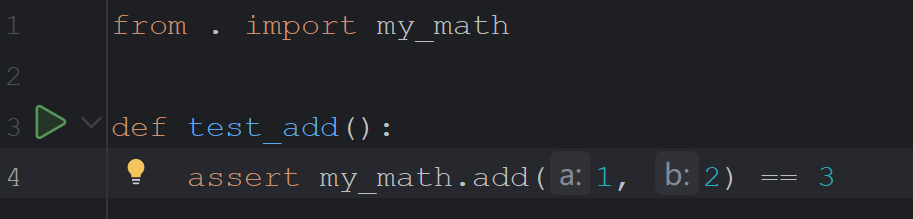

pytest中文文档: https://pytest.cn/en/stable/how-to/plugins.html

## 安装pytest

这里推荐使用`venv`虚拟环境, 将pytest的依赖安装到当前项目的venv下面, 而不是直接放在python的安装目录下

~~~shell
# 在项目的根目录下执行
which pip
/c/Users/Administrator/Desktop/example4pytest/.venv/Scripts/pip

pip install pytest # 安装
pip install pytest -U # 升级到最新版
~~~

## 快速上手

项目准备

1. 首先我们在项目的根目录下创建创建一个文件`my_math.py`的文件, 用于测试

   ~~~shell
   # my_math.py
   def add(a: int, b: int) -> int:
       return a + b
   ~~~

2. 创建一个测试文件`test_add.py`

   ~~~python
   # from . import my_math
   def test_add():
       assert my_math.add(1, 2) == 3
   ~~~

   

启动测试的三种方式:

1. 在项目的根目录下执行`pytest`命令, 该命令会自动查找项目中的测试用例, 并执行

   ~~~shell
   $ pytest
   ================ test session starts =====
   platform win32 -- Python 3.13.3, pytest-8.4.1, pluggy-1.6.0
   rootdir: C:\Users\Administrator\Desktop\example4pytest
   collected 1 item                                                                                                    
   
   _01_hello_world\test_01_helloworld.py .  
   ~~~

2. 使用代码来启动pytest

   ~~~python
   import pytest
   pytest.main()
   ~~~

   执行该脚本, 他会自动查找当前项目下的测试用例, 并执行

3. 这种启动方式是pycharm提供的, pycharm会检测代码中哪些是测试用例, 然后在左边提供一个执行的图标, 你只要点击, 就可以执行这个测试用例

   

## 测试用例的发现规则

上面说到, 在启动pytest后, 他会自动查找项目中的测试用例, 并执行他们, 那么这个测试用例的发现的规则是怎么样的呢?

1. 遍历项目中的所有目录, 除了`venv`和`.`开头的目录( `.`开头的目录是隐藏文件)

2. 打开其中的以`test_`开头, 或者`_test`结尾的python文件

3. 读取python文件中的内容

   - 针对所有`Test`开头的类, 将他所有以`test_`开头的方法标记为测试用例
   - 针对所有以`test_`开头的函数, 将其标记为测试用例
   - 针对所有以`test_`开头的变量,  如果他是可以调用的, 那么将其标记为测试用例

   同时对于上面的测试用例, pytest还要求他们

   - 参数都是有特殊作用的, 你不能随便添加参数
   - 函数不能有返回值, 因为测试用例都是使用断言来判断是否正确的, 返回值毫无意义, 有返回值会警告

   ~~~shell
   # test_01_发现规则.py
   
   from _01_hello_world import my_math
   
   
   # 以test_开头的函数, 是测试用例
   def test_add():
       assert my_math.add(1, 2) == 3
   
   
   def add1():
       assert my_math.add(4, 2) == 6
   
   # 以test_开头的变量, 并且是可调用的, 是测试用例
   test_add1 = add1
   
   # 以Test开头的类, 他的以test_开头的方法, 是测试用例
   class TestAdd:
       def test_add1(self):
           assert my_math.add(4, 2) == 6
   ~~~

   

## 框架的配置

可以使用配置来改变pytest框架的默认规则, 有如下几种方式

1. 命令参数
2. ini配置文件
3. 环境变量

所有的可选的配置都可以使用如下命令来获取

~~~shell
$ pytest -h
usage: pytest [options] [file_or_dir] [file_or_dir] [...]

positional arguments:
  file_or_dir

general:
  -v, --verbose         Increase verbosity
  --no-header           Disable header
  --no-summary          Disable summary
  --no-fold-skipped     Do not fold skipped tests in short summary.
  # .... 省略部分参数
[pytest] ini-options in the first pytest.ini|tox.ini|setup.cfg|pyproject.toml file found:

  markers (linelist):   Register new markers for test functions
  empty_parameter_set_mark (string):
                        Default marker for empty parametersets
  # ..... 省略部分配置

Environment variables:
  BUILD_NUMBER             Equivalent to CI
  PYTEST_ADDOPTS           Extra command line options
  PYTEST_PLUGINS           Comma-separated plugins to load during startup
  # ..... 省略部分的环境变量
~~~

通过上面的`pytest -h`会打印三个部分的内部

- general: 这部分就是命令参数, 你可以在执行`pytest`命令的时候, 添加这些参数

- pytest ini-options: 这部分配置, 你可以创建一个`pytest.ini`在项目根目录下面, 然后在该文件中放这些配置

  ~~~ini
  # pytest.ini
  
  [pytest]
  # ......
  ~~~

- Environment Variabels: 这部分是环境变量, 启动pytest的时候, 会自动的读取

  但是因为能用的环境变量太少了, 所以起到的作用不是很大

## pytest相关命令

- `-v`: 这个参数会在执行pytest的时候, 按照测试用例来显示进度, 默认情况下只会按照文件来显示进度

- `-s`: 在测试用例中, 能够使用输入输出, 默认情况下测试用例中是不能使用输入输出的, 即read和print函数

  但是在测试化用例中, 其实不应该使用输入输出的

- `-x`: 快速失败, 只要发现失败的测试用例, 就立即停止执行, 不再执行后续的测试用例

- `-m`: 测试用例筛选, 即只执行部分的测试用例

## 标记

在pytest中, 有两种类型的标记:

- 自定义的标记

  这种标记的作用就是给测试用例进行分类, 然后可以通过`-m`来指定要执行的分类的测试用例, 过滤掉一部分不执行的测试用例

- 系统内置的标记

  这部分标记是系统内置的, 这部分标记都是有他自己的特殊作用的, 同时也可以作为分类的作用

### 自定义标记

要使用自定义标记, 首先要对标记进行注册, 然后才能够使用

1. 在项目根目录下的`pytest.ini`中添加你要注册的标记

   ~~~ini
   # pytest.ini
   
   [pytest]
   markers = 
     api: 接口测试
     web: UI测试
     ut: 单元测试
     login: 登录相关
     pay: 支付相关
   ~~~

2. 通过`pytest --markers`就可以看到所有能够使用的标记, 包括自定义的标记, 和系统内置的标记

   ~~~shell
   $ pytest --markers
   @pytest.mark.api: 接口测试
   
   @pytest.mark.web: UI测试
   
   @pytest.mark.ut: 单元测试
   
   @pytest.mark.login: 登录相关
   
   @pytest.mark.pay: 支付相关
   
   @pytest.mark.filterwarnings(warning): add a warning filter to the given test. see https://docs.pytest.org/en/stable/how-to/capture-warnings.html#pytest-mark-filterwarnings
   
   @pytest.mark.skip(reason=None): skip the given test function with an optional reason. Example: skip(reason="no way of currently testing this") skips the test.
   ~~~

3. 之后再测试用例上添加上标记

   ~~~python
   # test_01_自定义标记.py
   import pytest
   
   from _01_hello_world import my_math
   
   
   
   @pytest.mark.api
   def test_add():
       assert my_math.add(1, 2) == 3
   
   
   class TestAdd:
       @pytest.mark.web
       def test_add1(self):
           assert my_math.add(4, 2) == 6
   
       @pytest.mark.login
       def test_add1(self):
           assert my_math.add(4, 2) == 6
   ~~~

4. 之后你可以通过`pytest -m` 来指定要执行的带有标记的测试用例

   ~~~shell
   $ pytest -m api
   ======== test session starts =======
   platform win32 -- Python 3.13.3, pytest-8.4.1, pluggy-1.6.0
   rootdir: C:\Users\Administrator\Desktop\example4pytest
   configfile: pytest.ini
   collected 3 items / 2 deselected / 1 selected                                                                       
   
   _03_自定义标记\test_01_自定义标记.py .                                                                        [100%] 
   
   === 1 passed, 2 deselected in 0.07s =====
   ~~~

   上面显示一共检测到了3个测试用例, 但是两个是deselected的, 即未选中的, 不需要执行

### 系统内置的标记

系统内置的标记和用户自定义的标记的区别如下:

- 不需要注册, 可以直接使用
- 不仅可以筛选, 还有特殊的作用
- 多个标记可以叠加, 他们的特殊效果也会叠加

系统的内置标记有如下:

- skip: 无条件的跳过, 主要用于你不想执行这个测试用例

  也可以标记在类上面, 表示跳过这个类的所有测试用例

- skipif: 有条件的跳过, 用于在不同的情况下, 选择不同的测试用例来执行

  也可以标记在类上面, 表示有条件的跳过这个类的所有测试用例

- xfail: 预期失败, 即这个测试用例失败了, 就表示通过

~~~python
import pytest

from _01_hello_world import my_math

class TestAdd:
    @pytest.mark.skip
    @pytest.mark.web
    def test_add0(self):
        assert my_math.add(4, 2) == 6

    @pytest.mark.skipif(1 == 2, reason="不符合条件, 跳过")
    @pytest.mark.login
    def test_add1(self):
        assert my_math.add(4, 2) == 6

    @pytest.mark.xfail
    @pytest.mark.pay
    def test_add2(self):
        assert my_math.add(4, 3) == 6

    # 预期内的失败, 如果这个测试用例通过了, 反而不正常
    @pytest.mark.xfail
    @pytest.mark.pay
    def test_add3(self):
        assert my_math.add(4, 2) == 6
~~~

~~~shell
==== test session starts ===============
collecting ... collected 4 items

test_02_系统内置标记.py::TestAdd::test_add0 
test_02_系统内置标记.py::TestAdd::test_add1 
test_02_系统内置标记.py::TestAdd::test_add2 
test_02_系统内置标记.py::TestAdd::test_add3 

======== 1 passed, 1 skipped, 1 xfailed, 1 xpassed in 0.39s =======
SKIPPED (unconditional skip) [ 25%]
Skipped: unconditional skip
PASSED                       [ 50%]XFAIL                        [ 75%]
self = <_03_标记.test_02_系统内置标记.TestAdd object at 0x000002BE91945220>

    @pytest.mark.xfail
    @pytest.mark.pay
    def test_add2(self):
>       assert my_math.add(4, 3) == 6
E       assert 7 == 6
E        +  where 7 = <function add at 0x000002BE9199A200>(4, 3)
E        +    where <function add at 0x000002BE9199A200> = my_math.add

test_02_系统内置标记.py:21: AssertionError
XPASS                        [100%]
~~~

上面的结果说明了, 一共有4个测试用例

- 一个测试用例通过
- 一个测试用例跳过
- 一个预期内的失败了
- 一个预料外的通过了

todo 测试用例的结果的说明

## 数据驱动的测试用例

如果你想要进行数据库驱动的测试用例, 那么可以使用`@pytest.marker.parametrize`

1. 我们可以在项目的根目录下创建一个`data/data.csv`

   ~~~csv
   a, b, c
   1, 2, 3
   2, 2, 4
   3, 3, 6
   ~~~

2. 然后我们创建我们的测试用例

   ~~~python
   # _04_数据驱动的测试/test_01_data_drivered_test.py
   
   def read_csv(path: str) -> List[List[str]]:
       with open(path) as csvfile:
           reader = list(csv.reader(csvfile))[1:]
           return reader
   
   class TestDataDriverTest:
   
       # 这里指定数据参数, 还有初级的来源
       @pytest.mark.parametrize("a,b,c", read_csv("data/data.csv"))
       def test_add1(self, a: str, b: str, c: str):
           assert my_math.add(int(a), int(b)) == int(c)
   ~~~

3. 执行测试用例

   ~~~shell
   $ pytest ./_04_数据驱动的测试/test_01_data_drivered_test.py 
   ======== test session starts ============
   platform win32 -- Python 3.13.3, pytest-8.4.1, pluggy-1.6.0
   rootdir: C:\Users\Administrator\Desktop\example4pytest
   configfile: pytest.ini
   collected 3 items                                                                                                   
   _04_数据驱动的测试\test_01_data_drivered_test.py ...                                                          [100%] 
   
   ========= 3 passed in 0.05s ========
   ~~~

## 测试用例的结果类型

## fixtures

### 使用fixtures的两种方式

fixtures主要用于测试用例的前置操作和后置操作, 类似java中的@BeforeEach, @BeforeAll, @AfterEach, @AfterAll

1. 首先我们要创建一个fixture

   ~~~python
   # _05_fixture\test_01_fixture1.py
   
   import pytest
   
   @pytest.fixture
   def f() -> Generator[None, Any, None]:
       # 前置操作
       print("开始执行函数", datetime.now())
   
       yield
   
       # 后置操作
       print("结束测试用例", datetime.now())
   ~~~

2. 创建我们的测试用例, 并指定要使用的fixtures

   ~~~python
   # 通过参数来指定需要使用的fixture(推荐, 可以直接跳转)
   def test_1(f) -> None:
       pass
   
   # 或者通过装饰器来指定要使用的fixture
   @pytest.mark.usefixtures("f")
   def test_2() -> None:
       pass
   ~~~

3. 执行测试

   ~~~shell
   # 记得指定-s参数, 否则打印不出来
   $ pytest -s ./_05_fixture/test_01_fixture1.py
   ============ test session starts ========
   platform win32 -- Python 3.13.3, pytest-8.4.1, pluggy-1.6.0
   rootdir: C:\Users\Administrator\Desktop\example4pytest
   configfile: pytest.ini
   collected 2 items                                                                                                   
   
   _05_fixture\test_01_fixture1.py 开始执行函数 2025-08-02 21:28:17.241659
   .结束测试用例 2025-08-02 21:28:17.242231
   开始执行函数 2025-08-02 21:28:17.242934
   .结束测试用例 2025-08-02 21:28:17.243309
   
   ======= 2 passed in 0.04s ========
   ~~~

   

fixture的原理是:

1. pytest首先会执行fixture
2. 然后在执行的时候, 会碰到`yield`关键字, 退出fixture的执行
3. 之后执行测试用例
4. 继续执行fixture的后半部分

所以在fixture中, 只能有一个`yield`关键字

### fixture的堆叠

一个测试用例可以使用多个fixtures, 他们会进行堆叠

多个fixture的堆叠类似于java中的aop

~~~python
# _05_fixture/test_02_fixture的堆叠.py 

@pytest.fixture
def f1() -> Generator[None, Any, None]:
    # 前置操作
    print("开始执行函数1", datetime.now())

    yield

    # 后置操作
    print("结束测试用例1", datetime.now())

@pytest.fixture
def f2() -> Generator[None, Any, None]:
    # 前置操作
    print("开始执行函数2", datetime.now())

    yield

    # 后置操作
    print("结束测试用例2", datetime.now())

# 先执行f1, 然后f2
def test_1(f1, f2) -> None:
    pass

# 先执行f2, 然后执行f1
@pytest.mark.usefixtures("f1")
@pytest.mark.usefixtures("f2")
def test_2() -> None:
    pass
~~~

~~~shell
$ pytest -s ./_05_fixture/test_02_fixture的堆叠.py 
============= test session starts ============
platform win32 -- Python 3.13.3, pytest-8.4.1, pluggy-1.6.0
rootdir: C:\Users\Administrator\Desktop\example4pytest
configfile: pytest.ini
collected 2 items                                                                                                   

_05_fixture\test_02_fixture的堆叠.py 开始执行函数1 2025-08-02 21:39:15.024858
开始执行函数2 2025-08-02 21:39:15.025012
.结束测试用例2 2025-08-02 21:39:15.025477
结束测试用例1 2025-08-02 21:39:15.025588
开始执行函数2 2025-08-02 21:39:15.026372
开始执行函数1 2025-08-02 21:39:15.026496
.结束测试用例1 2025-08-02 21:39:15.026945
结束测试用例2 2025-08-02 21:39:15.027060

=== 2 passed in 0.04s ===================
~~~

### fixture的自动执行

如果你想要给**当前文件**的测试用例都指定一个需要使用的fixture, 那么可以将fixture的`autouse`属性设置为True

~~~python
# _05_fixture/test_03_fixture的自动执行.py 

# 当前文件中的所有测试用例都会使用这个fixture
@pytest.fixture(autouse=True)
def f1() -> Generator[None, Any, None]:
    # 前置操作
    print("开始执行函数1", datetime.now())

    yield

    # 后置操作
    print("结束测试用例1", datetime.now())

def test_1() -> None:
    pass

def test_2() -> None:
    pass
~~~

~~~shell
Shen@Wind MINGW64 ~/Desktop/example4pytest
$ pytest -s ./_05_fixture/test_03_fixture的自动执行.py 
=============================================== test session starts ================================================
platform win32 -- Python 3.13.3, pytest-8.4.1, pluggy-1.6.0
rootdir: C:\Users\Administrator\Desktop\example4pytest
configfile: pytest.ini
collected 2 items                                                                                                   

_05_fixture\test_03_fixture的自动执行.py 开始执行函数1 2025-08-02 21:52:11.582277
.结束测试用例1 2025-08-02 21:52:11.582773
开始执行函数1 2025-08-02 21:52:11.583472
.结束测试用例1 2025-08-02 21:52:11.583847

======== 2 passed in 0.04s ========
~~~

### fixture的fixture

一个fixture也可以有自己的fixture, 那么这两个fixture会进行堆叠, 类似java中的aop

~~~python
# ./_05_fixture/test_04_fixture的fixture.py

@pytest.fixture
def f1() -> Generator[None, Any, None]:
    # 前置操作
    print("开始执行函数1", datetime.now())

    yield

    # 后置操作
    print("结束测试用例1", datetime.now())

# 通过在fixture上添加参数, 来指定fixture使用的fixture
# 这样任何的测试用例, 只要使用了f2这个fixture, 都会自动先执行f1, 然后执行f2
@pytest.fixture
def f2(f1) -> Generator[None, Any, None]:
    # 前置操作
    print("开始执行函数2", datetime.now())

    yield

    # 后置操作
    print("结束测试用例2", datetime.now())

def test_1(f2) -> None:
    pass
~~~

~~~shell
$ pytest -s ./_05_fixture/test_04_fixture的fixture.py 
============= test session starts ==============
platform win32 -- Python 3.13.3, pytest-8.4.1, pluggy-1.6.0
rootdir: C:\Users\Administrator\Desktop\example4pytest
configfile: pytest.ini
collected 1 item                                                                                                    

_05_fixture\test_04_fixture的fixture.py 开始执行函数1 2025-08-02 22:04:13.237204
开始执行函数2 2025-08-02 22:04:13.237335
.结束测试用例2 2025-08-02 22:04:13.237989
结束测试用例1 2025-08-02 22:04:13.238123

========== 1 passed in 0.04s ==============
~~~

fixture的fixture和fixture的堆叠其实作用是一样的, 只不过使用的情况不一样

1. 如果使用fixture的堆叠

   ~~~python
   @pytest.fixture
   def f1() -> Generator[None, Any, None]:
       print("开始执行函数1", datetime.now())
       yield
       print("结束测试用例1", datetime.now())
   
   @pytest.fixture
   def f2() -> Generator[None, Any, None]:
       print("开始执行函数2", datetime.now())
       yield
       print("结束测试用例2", datetime.now())
   
   
   # 这里需要传递两个参数
   def test_1(f1, f2) -> None:
       pass
   ~~~

2. 如果使用fixture的fixture

   ~~~python
   @pytest.fixture
   def f1() -> Generator[None, Any, None]:
       print("开始执行函数1", datetime.now())
       yield
       print("结束测试用例1", datetime.now())
   
   @pytest.fixture
   def f2(f1) -> Generator[None, Any, None]:
       print("开始执行函数2", datetime.now())
       yield
       print("结束测试用例2", datetime.now())
   
   # 这里只需要传递f2一个参数
   def test_1(f2) -> None:
       pass
   ~~~

   

### fixture返回内容

fixture也可以返回内容, 比如你需要执行前置操作, 启动一个浏览器, 那么你可以在fixture中将浏览器对象返回出去

~~~python
# _05_fixture/test_05_fixture的返回对象.py 
@pytest.fixture
def f1() -> Generator[str, Any, None]:
    print("开始执行函数1", datetime.now())
    # 通过yield返回后续测试用例中需要使用的对象
    yield "我是一个浏览器对象"
    print("结束测试用例1", datetime.now())

def test_1(f1) -> None:
    print(f1)
    pass
~~~

~~~shell
$ pytest -s ./_05_fixture/test_05_fixture的返回对象.py 
============= test session starts ==============
platform win32 -- Python 3.13.3, pytest-8.4.1, pluggy-1.6.0
rootdir: C:\Users\Administrator\Desktop\example4pytest
configfile: pytest.ini
collected 1 item                                                                                                    

_05_fixture\test_05_fixture的返回对象.py 开始执行函数1 2025-08-02 22:46:45.072030
我是一个浏览器对象
.结束测试用例1 2025-08-02 22:46:45.072775
~~~

### fixture的共享范围

每一个fixture都有一个共享的范围

- function: 默认的共享范围, 类似与java中的@BeforeEache和@AfterEach, **只要当前文件的测试用例使用了这个fixtues, 那么他会在每个测试用例之前和之后都执行一遍** 
- session: 类似与java中的@BeforeAll, @AfterAll,  他会在**当前文件的**所有的使用了这个fixtures的测试用例执行之前, 之后执行, **并且只会执行一遍**

~~~python
# _05_fixture/test_06_fixture的共享范围.py 

# 类似java中的@BeforeAll和@AfterAll
@pytest.fixture(scope="session")
def f1() -> Generator[list[object], Any, None]:
    print("开始执行函数1", datetime.now())
    # 返回一个列表
    yield []
    print("结束测试用例1", datetime.now())

def test_1(f1) -> None:
    f1.append(1)
    print(f1)
    pass

def test_2(f1) -> None:
    f1.append(2)
    print(f1)
    pass

def test_3(f1) -> None:
    f1.append(3)
    print(f1)
    pass
~~~

~~~shell
Shen@Wind MINGW64 ~/Desktop/example4pytest
$ pytest -s ./_05_fixture/test_06_fixture的共享范围.py 
============= test session starts ============
platform win32 -- Python 3.13.3, pytest-8.4.1, pluggy-1.6.0
rootdir: C:\Users\Administrator\Desktop\example4pytest
configfile: pytest.ini
collected 3 items                                                                                                   

_05_fixture\test_06_fixture的共享范围.py 开始执行函数1 2025-08-02 22:56:37.414518
[1]
.[1, 2]
.[1, 2, 3]
.结束测试用例1 2025-08-02 22:56:37.417202

============= 3 passed in 0.05s ============
~~~

### 全局的fixtures

之前我们定义的fixture都是在当前文件中可用的, 即你不能在a.py中定义一个fixtures, 然后在b.py中使用这个fixtures

如果你想要实现这样的效果, 那么需要将fixtures定义在`项目根目录/conftest.py`中, 这个文件名是固定的

~~~python
# conftest.py

# 定义一个全局可用的fixtures, 他的共享范围是session
# 他会在所有的测试用例之前和之后开始执行
@pytest.fixture(scope="session")
def f1() -> Generator[list[object], Any, None]:
    print("开始执行函数1", datetime.now())
    yield []
    print("结束测试用例1", datetime.now())

# 定义一个全局可用的fixtures, 他的共享范围是function
# 只要测试用例使用了这个fixtures, 那么他会在每个测试用例之前和之后都执行一遍
@pytest.fixture()
def f2() -> Generator[list[object], Any, None]:
    print("开始执行函数1", datetime.now())
    yield []
    print("结束测试用例1", datetime.now())
~~~

~~~python
# _05_fixture/test_07_全局可用的fixtures.py
def test_1(f1) -> None:
    pass

def test_2(f1) -> None:
    pass

def test_3(f1) -> None:
    pass
~~~

~~~shell
$ pytest -s ./_05_fixture/test_07_全局可用的fixtures.py 
============ test session starts ===================
platform win32 -- Python 3.13.3, pytest-8.4.1, pluggy-1.6.0
rootdir: C:\Users\Administrator\Desktop\example4pytest
configfile: pytest.ini
collected 3 items                                                                                                   

_05_fixture\test_07_全局可用的fixtures.py 开始执行函数1 2025-08-02 23:49:29.818225
...结束测试用例1 2025-08-02 23:49:29.820712

========== 3 passed in 0.05s ==================
~~~

## 插件管理

你可以在https://pytest.cn/en/stable/reference/plugin_list.html#plugin-list中查看pytest中所有的插件, 大概有1641个

插件又分为内置的插件和第三方的插件

- 内置的插件不需要安装即可使用
- 第三方的插件需要通过pip安装到`venv`中来使用

在安装了插件之后, 你还需要在执行pytest的时候, 指定需要使用的插件, 有三种方式来指定

- 通过命令行参数

- 通过配置文件来指定

  

### 插件的安装

直接在插件市场找到你想要安装的插件, 然后点进去看里面的文档, 里面的文档有说怎么安装

### 常用的插件

#### pytest-html

https://pytest-html.readthedocs.io/en/latest/

这个插件主要用于生成html的测试报告

安装:

~~~shell
pip install pytest-html
~~~

使用插件

1. 通过命令行来启用这个插件

   ~~~shell
   # 在执行pytest进行测试的时候, 指定要启用html插件, 并指定生成的html为report.html
   pytest --html=report.html--self-contained-html
   ~~~

2. 通过配置文件的启用这个插件

   在`pytest.ini`中添加如下的内容

   ~~~shell
   addopts = --html=report.html--self-contained-html
   ~~~

   然后不管你是通过`pytest`命令行来启动测试, 还是通过代码的方式来启动测试, 都有效

   

#### pytest-xdist

用途: 通过多进程的方式来执行测试

需要你的测试用例本身耗时比较长, 超出调度成本很多的时候, 多进程才有意义

如果你的测试用例有并发的问题, 资源竞争等问题, 那么不要使用这个插件

安装:

~~~shell
pip install pytest-xdist
~~~

使用插件:

1. 通过命令行启动插件

   ~~~shell
   # 启动100个进程来执行测试用例, 如果你的测试用例比较少, 那么启动100个进程的时间反而比较长了
   pytest -n 100
   ~~~

2. 通过配置文件的启用这个插件

   在`pytest.ini`中添加如下的内容

   ~~~shell
   addopts = -n 100
   ~~~

   然后不管你是通过`pytest`命令行来启动测试, 还是通过代码的方式来启动测试, 都有效

#### pytest-rerunfailures

用途: 用例失败之后, 重新执行, 如果重试之后通过了, 那么这个测试用例就算通过了

主要用于网络波动等情况, 导致测试用例失败了, 如果重新执行后, 测试用例就有可能通过

**每次的重试都会重新执行fixture**

安装:

~~~shell
pip install pytest-rerunfailures
~~~

使用:

1. 通过命令行启动插件

   ~~~shell
   # 重新运行次数5次, 每次延迟1s
   pytest --reruns 5 --reruns-delay 1
   ~~~

2. 通过配置文件的启用这个插件

   在`pytest.ini`中添加如下的内容

   ~~~shell
   addopts = --reruns 5 --reruns-delay 1
   ~~~

   然后不管你是通过`pytest`命令行来启动测试, 还是通过代码的方式来启动测试, 都有效

#### pytest-result-log

用途：把用例的执行结果记录到日志文件中

安装：

~~~shell
pip install pytest-result-log
~~~

使用：

因为这个插件的配置比较多, 所以放在`pytest.ini`文件中

~~~ini
; 输出的日志
log_file = ./logs/pytest.log 
; 日志的输出级别
log_file_level = info
; 日志的格式
log_file_format = %(levelname)-8s %(asctime)s [%(name)s:%(lineno)s] : % (message)s
; 日期的格式
log_file_date_format = %Y-%m-%d %H:%M:%S

; 记录用例执行结果
result_log_enable = 1
; 记录用例分割线
result_log_separator = 1
;分割线等级
result_log_level_separator = warning
;异常信息等级
result_log_level_verbose = info
~~~

## web自动化测试

在pytest中, 我们可以通过Selenium来操控浏览器, 然后进行web自动化测试

你可以使用原生的Selenium来操控浏览器, 当然pytest中也通过了Selenium的插件, 让你可以更方便的是使用Selenium

文档: https://pytest-selenium.readthedocs.io/en/latest/installing.html

1. 安装pytest-selenium插件

   ~~~shell
   pip install pytest-selenium
   ~~~

2. 在pytest-selenium中, 提供了一格fixture, 他会给你返回一个selenium对象, 你可以使用他来控制浏览器

   ~~~python
   # _06_web_selenium自动化测试/test_01_selenium自动化测试.py 
   
   def test_example(selenium):
       selenium.get('http://www.baidu.com')
   ~~~

3. 然后你可以在执行pytest的时候, 通过`--driver`来指定你需要使用的浏览器的类型

   ~~~shell
   $ pytest --driver Firefox ./_06_web_selenium自动化测试/test_01_selenium自动化测试.py 
   =========== test session starts ==========
   platform win32 -- Python 3.13.3, pytest-8.4.1, pluggy-1.6.0
   driver: Firefox
   sensitiveurl: .*
   rootdir: C:\Users\Administrator\Desktop\example4pytest
   configfile: pytest.ini
   plugins: base-url-2.1.0, html-4.1.1, metadata-3.1.1, selenium-4.1.0, variables-3.1.0
   collected 1 item                                                                                                    
   
   _06_web_selenium自动化测试\test_01_selenium自动化测试.py .                                                    [100%]
   
   ======== 1 passed in 13.90s ===============
   ~~~

   或者你也可以直接将`--driver Firefox`直接放在`pytest.ini`的`addopts = --driver Firefox`中

   如果要使用Chrome浏览器, 可以通过`--driver chrome`来指定

当然你也可以自己来实现这个插件

1. 安装selenium

   ~~~shell
   pip install selenium
   ~~~

2. 实现一个类似的fixtures

   ~~~python
   import time
   
   import pytest
   from selenium import webdriver
   
   @pytest.fixture
   def use_selenium():
       d = webdriver.Firefox()
       yield d
       d.quit()
   
   def test_example(use_selenium):
       use_selenium.get('http://www.baidu.com')
       print(use_selenium.title)
       print(use_selenium.current_url)
       # 还可以执行元素的定位, 元素的交互
       # 截图, 文件上传
       time.sleep(1)
   ~~~

   

