# Python 环境配置


### Python 解释器的安装

1.  双击安装包
2.  选择 安装方式(可以默认安装, 可以自定义), 不要忘了 勾选 `添加path环境变量`

path 环境变量: 将一个软件或者程序添加到 path 环境变量之后, 就可以使用终端(cmd) 在任意路径下使用 这个软件(如果没有环境变量,只能在安装目录使用)


### 在 cmd 终端中运行 Python 代码

python 代码文件的名字

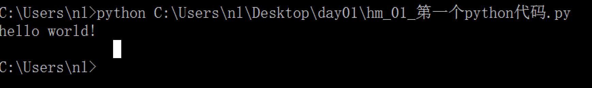

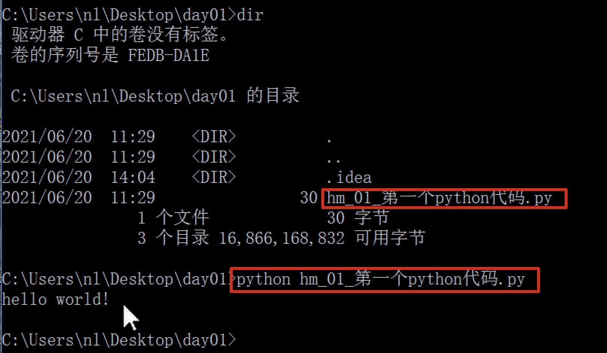

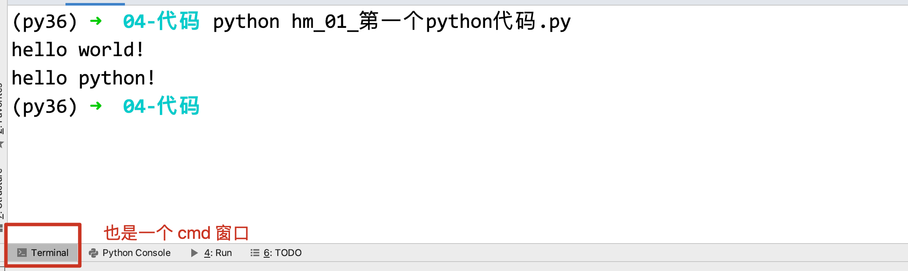


### pycharm 的配置安装

pycharm 有两个版本, 一个是专业版(收费的), 一个社区版(免费使用)

直接双击安装即可, 看见一下界面即可


# 使用Pycharm创建项目

pycharm 组织代码的方式是 项目(project), 简单的理解为一个目录, 目录中可以放很多的代码

每次在创建项目的时候, 需要保证这个目录是一个空目录

1.  双击打开 `pycharm` 软件
    
2.  创建新 项目
    
    
    
3.  配置项目的路径和解释器
    
    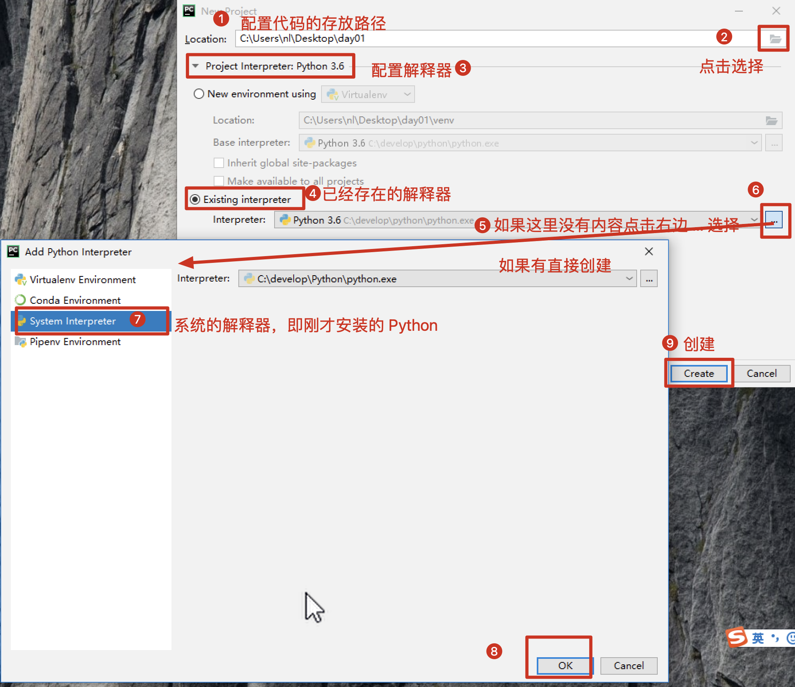
    
4.  创建代码文件书写代码
    
    1. 将来在工作中, 代码的文件名字不要使用中文,但目前学习阶段,我会使用中文
    
    2. Python 文件的后缀是 .py
    
    3. 代码要顶格书写
    
    4. 代码中的标点符号要使用英文状态的标点
    
    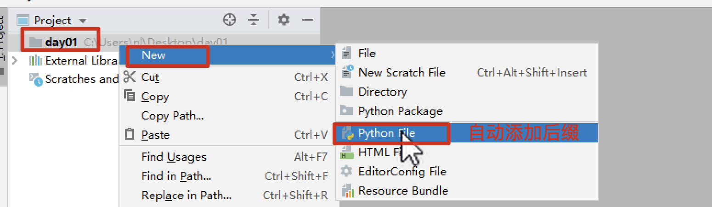
    
    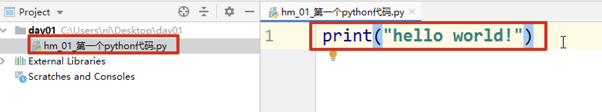
    
5.  运行代码文件
    
    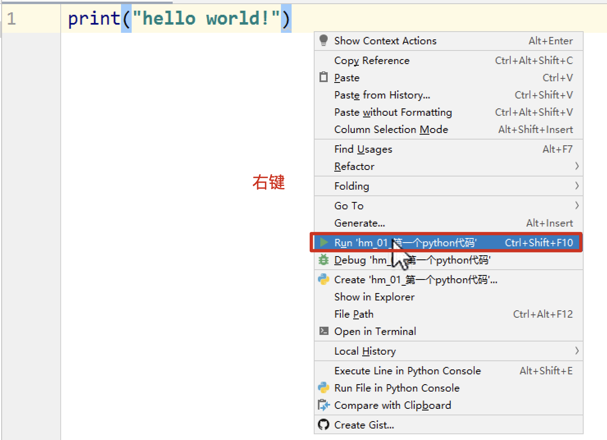
    
6.  查看运行结果
    
    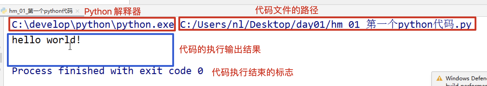
    
    

# 注释

Python 中的注释分为两种, 单行注释和多行注释

* 单行注释

  使用`#`进行注释

  ~~~python
  # 这里是单行注释
  ~~~

*   多行注释
    
    三对单引号或者双引号
    
    ~~~python
    """
    这里是多行注释, 可以换行
    """
    ~~~
    
    

# Python 代码中三种波浪线和 PEP8

*   红色
    
    红色波浪线是代码的错误, 必须处理,代码才能执行
    
    注意: 在后续课程中,某些代码没有写完,也会出现红色波浪线
    
*   灰色
    
    灰色波浪线, 不会影响代码的正常执行, 基本上所有的灰色波浪线都是 PEP8 造成的
    
    PEP8: 是 Python 代码的书写规范, 如果不按照这个规范书写,会给灰色波浪线提示,建议代码的书写按照 PEP8 的规范书写
    
    1. 可以书写代码的时候注意 PEP8 的代码规范
    
    2. 可以在书写完成之后,使用快捷键 Ctrl Alt L 来按照 PEP8 的规范自动格式化代码
    
    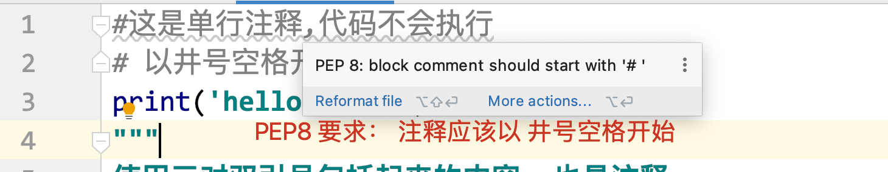
    
    
    
*   绿色
    
    绿色波浪线, 不影响代码的正常执行, 在引号中, 认为你书写的内容不是一个单词,就会给你绿色提示.
    

# 变量

### 定义和使用变量

~~~python
name = '张三' # 定义一个变量 name, 存储的数据值是 张三
print(name) # 使用变量

# 可以一次性定义多个变量
a, b , c = 10, True, "hello"
~~~

### 变量名的命名规范

起名字的规范, 标识符的规则

1.  必须由**字母 数字和下划线**组成, 并且不能以数字开头

2.  不能使用 Python 中的关键字作为变量名
    
    关键字: Python 自带的已经使用的标识符,具有特殊的作用
    
3.  区分大小写
    
4. 命名规则使用下划线命名: 每个单词之间使用下划线连接 `my_name`

# 基本数据类型

1. 数字类型

   整型 (`int` ) , 就是整数 , 即不带小数点的数

2. 浮点型( `float` ), 就是小数

3. 布尔类型(`bool`), 只有两个值

   真 `True` , `1`

   假 `False` `0`, 非 0 即真

   True 和 False 都是 Python 中的关键字, 注意大小写,不要写错了

4. 字符串(`str`) 

   使用引号引起来的就是字符串, 可以是单引号, 也可以是双引号
   
5. 空(None): 类似于java中的null

   想要判断一个变量是否为None, 可以使用`if (a is None) :`

可以使用`type()`函数来获取某个变量的类型

~~~python
age = 18
print(type(age))   # <class 'int'>

height = 1.71
print(type(height)) # <class 'float'>

isMen = True 
print(type(isMen)) # <class 'bool'>

name = '小明'      
print(type(name)) # <class 'str'>

num = '18'
print(type(num))  # <class 'str'>

num = 'True'
print(type(num))   # <class 'str'>
~~~

想要判断一个变量是不是某个类型, 可以使用isinstance

~~~python
value = 10
if not isinstance(value, int):
    raise ValueError('score must be an integer!')
~~~


# 基本数据类型转换

语法: `变量 = 要转换为的类型(原数据)`

注意点: **数据类型转换,不会改变原来的数据的类型, 会生成一个新的数据类型**

* `int()` 将其他类型转换为 int 类型

  ~~~python
  print('------------int()将其他类型转成int类型------------')
  s1 = '128'
  f1 = 98.7
  s2 = "76.77"
  ff = True
  s3 = 'hello'
  print(type(s1), type(f1), type(s2), type(ff), type(s3))
  print(int(s1), type(int(s1)))  # 将str转成int，前提是字符串为数字串
  print(int(f1), type(int(f1)))  # float转成int，截取整数部分，舍弃小数部分
  # print(int(s2), type(int(s2)))  # 将str转成int类型，报错，因为字符串为小数串
  print(int(ff), type(int(ff)))  # 将bool类型转成对应的数字
  # print((int(s3), type(int(s3))))  # str转为int，字符串必须为数字串，且必须为整数串
  ~~~

* `float()` 将其他类型转换为 浮点型

  ```python
  print('------------float()将其他类型转成float类型------------')
  s4 = '128.98'
  s5 = "76"
  fff = True
  s6 = 'hello'
  i = 98
  print(type(s4), type(s5), type(fff), type(s6), type(i))
  print(float(s4), type(float(s4)))
  print(float(s5), type(float(s5)))  # int转为float，后面加.0
  print(float(fff), type(float(fff)))  # 后面加.0
  # print(float(s6), type(float(s6)))  # 报错，str里面是字符串不能转为float
  print(float(i), type(float(i)))  # int转为float，后面加.0
  ```

*   `str()` 将其他类型转换为 字符串类型
    
    转换为str之后一般都是加上引号
    
    ~~~python
    a = 10
    b = 198.8
    c = False
    print(str(a), str(b), str(c))
    ~~~
    
* `bool()` 将其他类型转换为bool类型

  ~~~python
  print('---------以下对象的布尔值为False-----------')
  print(bool(False))
  print(bool(0))
  print(bool(0.0))
  print(bool(None))
  print(bool(''))  # 长度为0的字符串对象
  print(bool(""))  # 长度为0的字符串对象
  print(bool([]))  # 空列表[]
  print(bool(list()))  # 空列表
  print(bool(()))  # 空元组
  print(bool(tuple()))  # 空元祖
  print(bool({}))  # 空字典
  print(bool(dict()))  # 空字典
  print(bool(set()))  # 空集合
  
  print('---------除以上，其他对象的布尔值为True-----------')
  print(bool(18))
  print(bool(True))
  print(bool('helloworld'))  # 不是空字符串
  ~~~

  

# 输入和输出

## 输入

获取用户使用键盘录入的内容, 使用的函数是 input()

`变量 = input('提示的信息')`

1. 代码从上到下执行, 遇到 input 函数之后,会暂停执行,等待用户的输入, 如果不输入会一直等待

2. 在输入的过程中,遇到回车,代表本次输入结束

3. 会将你输入的内容 保存到等号左边的变量中, 并且 变量的数据类型 一定是 `str`

~~~python
result = input('请输入内容:')
print(type(result), result)  # 打印数据类型和 数据值
~~~

## 输出

输出使用的函数是 print() 函数,  作用,将程序中的数据或者结果打印到控制台(屏幕)

~~~python
name = '小明'
age = 18
print(name, age)   # 可以使用逗号输出多个内容
~~~


### 格式化输出

在字符串中指定的位置,输出变量中存储的值.

1. 在需要使用变量的地方,使用特殊符号占位

2. 使用变量填充占位的数据

*   % 格式化输出占位符号
    
    *   `%d` 占位, 填充 整型数据 `digit`
        
    *   `%f` 占位. 填充 浮点型数据 `float`
        
    *   `%s` 占位, 填充 字符串数据 `string`
        
        补充: 其实 %s 的占位符,可以填充任意类型的数据
        
    
    
    
    ~~~python
    name = 'zhangdan'
    age = 18
    height = 1.1234556789
    print('我的名字是 %s, 年龄是 %d, 身高是 %f m' % (name, age, height))
    
    # 小数默认显示 6 位, 如果想要指定显示小数点后几位,  %.nf , n 需要换成具体的整数数字,即保留小数的位置
    print('我的名字是 %s, 年龄是 %d, 身高是 %.2f m' % (name, age, height)) # 显示小数点后两位
    
    # %0nd 表示整数一共占几位
    print('我的学号是%06d' % stu_num)
    
    num = 90  
    # 某次考试的及格率为 90%, 如果在 格式化中需要显示%, 在书写的使用 需要使用 两个 %% 才可以
    print('某次考试的及格率为 %d%%' % num)
    ~~~
    
    
    
*   F-string( f字符串的格式化方法)
    
    f\-string 格式化的方法,想要使用 ,Python 的版本 \>= 3.6
    
    1. 需要在字符串的前边加上 f"" 或者 F""
    
    2. 占位符号统一变为 {} 
    
    3. 需要填充的变量 写在 {} 中
    
    ~~~python
    name = '小明'
    age = 18   
    height = 1.71  
    stu_num = 1  # 学号
    num = 90  # 及格率
    ~~~
    
    ~~~python
    # print('我的名字是 xx, 年龄是 xx, 身高是 xx m, 学号 xx, 本次考试的及格率为 xx%')
    print(f'我的名字是 {name}, 年龄是 {age}, 身高是 {height} m, 学号 {stu_num}, 本次考试的及格率为 {num}%')
    
    # 一般不会有这样的需求
    print(f'我的名字是 {name}, 年龄是 {age}, 身高是 {height:.3f} m, 学号 {stu_num:06d}, 本次考试的及格率为 {num}%')
    
    # 在字符串中想要输出换行 \\n (转义字符)
    print(f'我的名字是 {name}, 年龄是 {age}, 身高是 {height:.3f} m, 学号 {stu_num:06d},\\n本次考试的及格率为 {num}%')
    
    # 字符串.format()
    print('我的名字是 {}, 年龄是 {}, 身高是 {} m, 学号 {}, 本次考试的及格率为 {}%'.format(name, age, height, stu_num, num))
    
    print('我的名字是 {}, 年龄是 {}, 身高是 {:.3f} m, 学号 {:06d}, 本次考试的及格率为 {}%'.format(name, age, height, stu_num, num))
    ~~~
    


# 运算符

### 算术运算符

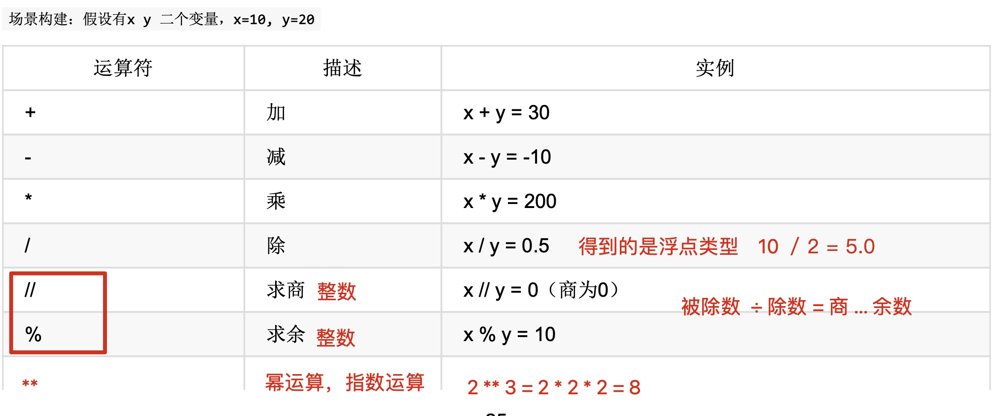


### 比较运算符

比较运算符得到都是 bool 类型

| operator     | 作用                                                         |
| ------------ | ------------------------------------------------------------ |
| >, <, >=, <= | 比较数值                                                     |
| is, not is   | 判断地址是否相同还是不同, 类似java中的==<br>可以使用is 来判断一个引用是否为None |
| ==, !=       | 比较值是否相同, 类似java中的 equals                          |
| in, not in   | 判断一个元素是否在集合中                                     |

~~~python
# 判断一个片段是否在字符串中
print("llo" in "hello") # true

# 判断元素是否在列表中
print(10 in [10, 20, 30]) # true

# 判断key value是否在dict中
print("hello" in {"hello", "world"}) # true

# 判断引用是否为None
a = 100
print(a is None) # false

# 判断两个set的值是否一样
print({10, 20} == {10, 20}) # true
~~~


### 逻辑运算符

逻辑运算符 可以连接多个条件, 在判断和循环中使用

- **and**

  两个条件都为true时, 结果才为true

  短路与: 第一个为false, 第二个就不判断了

- **or**  

  两个条件有一个为true, 结果就为true
  
  短路或: 第一个为true时, 第二个就不判断了

- **not** 

  not后边的条件, 如果本来是 True,变为 False, 本来是 False,变为 True

### 赋值运算符

| 运算符 | 描述     | 示例      |
| ------ | -------- | --------- |
| `=`    | 赋值     | `a = 5`   |
| `+=`   | 加法赋值 | `a += 3`  |
| `-=`   | 减法赋值 | `a -= 3`  |
| `*=`   | 乘法赋值 | `a *= 3`  |
| `/=`   | 除法赋值 | `a /= 3`  |
| `//=`  | 整除赋值 | `a //= 3` |
| `%=`   | 取余赋值 | `a %= 3`  |
| `**=`  | 幂赋值   | `a **= 3` |

**没有++和--,  i++和i--会报错, --i和++i会被解释为正负号**


### 三元运算符

类比java中的`A > B ? A : B `, 在python中的写法是`A if A > B else B`

~~~python
def max(a, b):
    if a > b:
        return a
    else:
        return b
    
def max1(a, b):
    return a if a > b else b
~~~


### 运算符重载

在python中支持运算符重载

当我们在调用a + b时, 实际上调用的是a.\__add__(b), (仅针对运算符, 函数调用a.process(b)不能写成a process b)

所以如果我们要重载+运算符, 只需要在对应的类中实现\__add__方法即可

~~~python
class Point:
    def __init__(self, x = 0, y = 0):
        self.x = x
        self.y = y
    
    def __str__(self):
        return "({0},{1})".format(self.x,self.y)
    
    def __add__(self,other):
        x = self.x + other.x
        y = self.y + other.y
        return Point(x,y)

p1 = Point(2,3)
p2 = Point(-1,2)
print(p1 + p2) # (1,5)
~~~


比如python官方提供的Path这个类,  就重写了`/`这个运算符, 让他用来表示路径

~~~python
from pathlib import Path

BASE_DIR = Path('/path/to/base/directory')
templates_dir = BASE_DIR / 'templates' # 运算符重载, 返回另一个path
~~~


所有可以重载的运算符如下
| 运算符      | 表达式  | 重载的方法     |
| -------------- | --------- | ------------------------ |
| 相加（+）      | p1 + p2   | p1 .__ add __（p2）      |
| 相减（-）      | p1-p2     | p1 .__ sub __（p2）      |
| 相乘（*）      | p1 * p2   | p1 .__ mul __（p2）      |
| 求幂（**）     | p1 ** p2  | p1 .__ pow __（p2）      |
| 相除（/）      | p1 / p2   | p1 .__ truediv __（p2）  |
| 整除（//）     | p1 // p2  | p1 .__ floordiv __（p2） |
| 求模 （%）     | p1％p2    | p1 .__ mod __（p2）      |
| 按位左移（<<） | p1 << p2  | p1 .__ lshift __（p2）   |
| 按位右移（>>） | p1 >> p2  | p1 .__ rshift __（p2）   |
| 按位与（and）  | p1 and p2 | p1 .__ and __（p2）      |
| 按位或（or）   | p1 \| 2   | p1 .__ or __（p2）       |
| 按位异或（^）  | p1 ^ p2   | p1 .__ xor __（p2）      |
| 按位否（~）    | 〜p1      | p1 .__ invert __()       |
| 小于（<）      | p1 <p2   | p1 .__ lt __（p2） |
| 小于等于（<=） | p1 <= p2 | p1 .__ le __（p2） |
| 等于（==）     | p1 == p2 | p1 .__ eq __（p2） |
| 不等于（!=）   | p1！= p2 | p1 .__ ne __（p2） |
| 大于（>）      | p1> p2   | p1 .__ gt __（p2） |
| 大于等于（>=） | p1> = p2 | p1 .__ ge __（p2） |

# if, while, for


### if 和 if not 判断

格式:

~~~python
if (condition_1):
    statement_block_1
elif (condition_2):
    statement_block_2
else:
    statement_block_3
    
    
    
if not (condition): # 条件为false的时候执行
    statement
~~~

如果条件只有一个, 那么可以加括号, 也可以不加括号

如果条件有两个, 必须加括号


**在使用if进行判断时, 如果condition是一个变量, 那么会自动将其转换为bool类型**

~~~python
print('---------以下对象的布尔值为False-----------')
print(bool(False))
print(bool(0))
print(bool(0.0))
print(bool(None))
print(bool(''))  # 长度为0的字符串对象
print(bool(""))  # 长度为0的字符串对象
print(bool([]))  # 空列表[]
print(bool(list()))  # 空列表
print(bool(()))  # 空元组
print(bool(tuple()))  # 空元祖
print(bool({}))  # 空字典
print(bool(dict()))  # 空字典
print(bool(set()))  # 空集合

print('---------除以上，其他对象的布尔值为True-----------')
print(bool(18))
print(bool(True))
print(bool('helloworld'))  # 不是空字符串
~~~


### while循环

格式:

~~~python
while (condition)：
    statements
~~~

案例: 计算1到100的和

~~~python
n = 100
sum = 0
counter = 1
while counter <= n:
    sum = sum + counter
    counter += 1
 
print("1 到 %d 之和为: %d" % (n,sum))
~~~


### while-else 循环

格式:

~~~python
while (expr):
    statement
else:
    additional_statement
~~~

案例: 计算1-100的和, 然后输出

~~~python
n = 100
 
sum = 0
counter = 1
while counter <= n:
    sum = sum + counter
    counter += 1
else:
    print("1 到 %d 之和为: %d" % (n,sum))
~~~


### for循环

格式:

~~~python
for variable in sequence:
    statements
else:
    statements
~~~

案例1: 输出每个字符串的每个字符

~~~python
#!/usr/bin/python3
 
word = 'runoob'
for letter in word:
    print(letter)
~~~

案例2:

~~~python
#!/usr/bin/python3

sum = 0
# 计算1-5的和, 然后输出 ：
for number in range(1, 6):
    print(number)
else:
    print(sum)
~~~


### for else循环

~~~python
for item in range(3):
    pwd = input('请输入密码：')
    if pwd == '8888':
        print('密码正确')
        break
    else:
        print('密码不正确')
else:
    print('对不起，三次密码均输入错误')
~~~


### break和continue

break: 跳出循环体

continue: 结束当前循环


### pass语句

pass不做任何事情, 仅仅是为了保存结构完整

~~~python
# pass不做任务事情, 仅仅是让Class完整, 因为py中没有大括号
class MyEmptyClass:
    pass
~~~


# 容器

### str

#### 定义

1. 使用单引号定义

   ~~~python
   my_str1 = 'hello'
   print(my_str1, type(my_str1))
   ~~~

2. 使用双引号定义

   ~~~python
   my_str2 = "hello"
   print(my_str2, type(my_str2))
   ~~~

3. 使用三引号定义

   ~~~python
   my_str3 = """hello"""
   print(my_str3, type(my_str3))
   my_str4 = '''hello'''
   print(my_str4, type(my_str4))
   ~~~

4. 字符串本身包含引号引号的, 那么就使用别的引号定义, 或者使用转义

   ~~~python
   my_str5 = "I'm 小明" # 本身含有单引号, 那么就使用双引号定义
   my_str6 = 'I\'m 小明' # 使用转移
   ~~~

5. 如果不想使用转义, 只想使用纯文本的, 那么可以在字符串前面加上r

   ~~~python
   my_str8 = r'I\'m 小明'
   print(my_str8)
   ~~~

   

#### 下标

下标(索引): 就是指字符在字符串中的位置编号, 这个编号就是下标

这个编号一般来说都是从左到右进行编号的, 从 0 开始的(Python 中支持负数下标,从右到左进行编号的, 从-1 开始)

下标作用: 可以使用下标获取字符串中某个位置的字符

```python
str1 = 'abcdefg'

# 1. 打印字符串中最开始位置的字符
print(str1[0])  # a

# 2. 打印最后一个位置的数据
print(str1[-1])  # g

# 3. 打印倒数第二个位置的字符
print(str1[-2])  # f

# 打印下标为 2 的数据
print(str1[2])  # c

# 获取字符串中字符的个数(获取字符串的长度)
# len(字符串)   # length(长度)
num = len(str1)
print(num)
# 长度-1 的下标位置是最后一个字符
print(str1[num-1])  # g 最后一个字符,倒数第一个

print(str1[len(str1)-1])  # g 最后一个字符,倒数第一个
```

 

#### 切片

切片: 可以获取字符串中多个字符(多个字符的下标是有规律的, 等差数列)

语法:`str[start:end:step]`

参数: 

- start 是开始位置的下标
- end 是结束位置的下标(注意,不能取到这个位置的字符) 
- step 步长,等差数列的差值, 所取的相邻字符下标之间的差值,默认是 1, 可以不写

```python
切片会得到一个字符串, 即可以获取字符串中的多个字符
str1 = 'abcdefg'

# 1. 获取 abc 字符
print(str1[0:3:1])   # abc
# 1.1 如果步长是 1 可以不写, 最后一个冒号也不写
print(str1[0:3])  # abc
# 1.2 如果开始位置为 0 ,可以不写, 但是冒号必须有
print(str1[:3])  # abc

# 2. 获取 efg 字符
print(str1[4:7])  # efg
print(str1[-3:7])  # efg    
# 2.1 如果最后一个字符也要取, 可以不写, 但是冒号必须有
print(str1[4:])  # efg
# 2.2 如果开始和结束都不写, 获取全部内容, 但是冒号必须有
print(str1[:])  # abcdefg

# 3. 获取 aceg  # 0 2 4 6, 所以步长为 2
print(str1[0:7:2])  # aceg
print(str1[::2])  # aceg


# 4. 特殊应用, 步长为负数, 开始和结束不写,意思全变, 一般不用管,只有一种使用场景
# 反转(逆置) 字符串  字符串[::-1]
print(str1[::-1])  # gfedcba
```

 

#### 字符串的查找方法 find

语法 `字符串.find(sub_str, start, end) `

作用: 在字符串中查找是否存在 sub_str 这样的字符串, 如果找到了返回第一次出现的正数下标, 否则返回-1

参数: 

- sub_str: 要查找的小的字符串

- start: 开始位置, 从哪个下标位置开始查找, 一般不写,默认是 0 

- end: 结束位置, 查找到哪个下标结束, 一般不写,默认是 len()

```python
str1 = "and itcast and itheima and Python"

# 在字符串中查找 and
num = str1.find('and')
print(num)  # 0

# 在字符串中查找 第二个 and 出现的下标, 从第一次出现的后一位开始找
num1 = str1.find('and', num+1)
print(num1)  # 11

# 在字符串中查找 第三个 and 出现的下标, 从第二次出现的后一位开始找
num2 = str1.find('and', num1+1)
print(num2)  # 23

# 在字符串中查找 第四个 and 出现的下标, 从第三次出现的后一位开始找
num3 = str1.find('and', num2+1)
print(num3)  # -1
```

 

#### 字符串的替换方法 replace

作用:  将字符串中 old_str 替换为 new_str, 并返回新的字符串, 原来的字符串不改变

格式: `str.replace(old_str, new_str, count)`  

参数: 

- old_str: 被替换的内容
- new_str: 替换为的内容
- count: 替换的次数, 一般不写,默认是全部替换

```python
str1 = 'good good study'

# 1, 将 str1 中 所有的 g 改为 G
str2 = str1.replace('g', 'G')
print('str1:', str1)   # str1: good good study
print('str2:', str2)   # str2: Good Good study

# 2. 将 str1 中第一个 good 改为 GOOD
str3 = str1.replace('good', 'GOOD', 1)
print('str3:', str3)   # str3: GOOD good study

# 3. 将 str1 中第二个 good 改为 GOOD
# 3.1 先将全部的 good  --> GOOD
str4 = str1.replace('good', "GOOD")
# 3.2 再将第一个 GOOD --> good
str4 = str4.replace('GOOD', 'good', 1)
print('str4:', str4)  # str4: good GOOD study
```


#### 字符串的拆分 split

作用: 将字符串按照 sep 进行分割(拆分), 返回分割后的列表

格式: `str.split(sep, maxsplit) `

- sep, 字符串按照什么进行拆分, 默认是空白字符(空格, 换行\n, tab键\t)
- max_split, 分割次数,一般不写, 全部分割

```python
str1 = "hello world and itcast and itheima and Python"

# 1. 将 str1 按照 and 字符进行拆分
result1 = str1.split('and')
print(result1)  # ['hello world ', ' itcast ', ' itheima ', ' Python']

# 2, 将 str1 按照 and 字符进行拆分, 拆分一次
result2 = str1.split('and', 1)
print(result2)  # ['hello world ', ' itcast and itheima and Python']

# 3. 按照空白字符进行切割
result3 = str1.split()
print(result3)  # ['hello', 'world', 'and', 'itcast', 'and', 'itheima', 'and', 'Python']

# 4. 按照空白字符进行切割, 拆分一次
result4 = str1.split(maxsplit=1)
print(result4)
```

#### 字符串的链接 join

作用: 将多个字符串合并为一个

格式: `str.join(列表)` 

注意: 

- 列表中的数据使用使用 逗号隔开的
- 注意点: 列表中的数据必须都是字符串, 否则会报错


```python
list1 = ['good', 'good', 'study']
# 1. 将 列表中的字符串使用空格连起来
str1 = ' '.join(list1)
print(str1)  # good good study

# 2. 将 列表中的字符串使用 and 连起来
str2 = ' and '.join(list1)
print(str2)  # good and good and study
```


#### 翻转

格式: `str[::-1]`


### list

列表 list, 是使用最多的一种容器(数据类型)
列表中可以存储多个数据, 每个数据之间使用逗号隔开
列表中可以存放任意类型的数据

正向索引从0开始, 负向索引从-1开始

根据需要动态分配和回收内存


#### 创建

1. 定义空列表(没有任何数据的列表)

   ~~~python
   list1 = list()
   print(type(list1), list1)  # <class 'list'> []
   ~~~

2. 将其他的容器转换为列表

   ```python
   # 转换字符串会将字符串中的每个字符作为一个数据存入到列表中
   list2 = list('hello')
   print(type(list2), list2)  # <class 'list'> ['h', 'e', 'l', 'l', 'o']
   ```

3. 直接使用 [] 进行定义(常用)

   ~~~python
   my_list = []
   print(my_list)  # []
   ~~~

4. 定义非空列表

   ~~~python
   my_list1 = [1, '小明', 3.14, False]
   print(my_list1)  # [1, '小明', 3.14, False]
   ~~~

   
   
   

#### 列表的下标和切片

列表支持下标和切片操作, 使用方法和字符串中的使用方法一致

区别: 列表的切片得到的是列表

```python
list1 = [10, 20, 30, 40, 50, 60, 70, 80]

# 获取第一个数据
print(list1[0])

# 获取最后一个数据
print(list1[-1])

# 获取70, 80
print(list1[-2:])

# 获取60, 70
print(list1[-3:-1]) # 左闭右开!!!!!


# 第一第二个数据
print(list1[0:2])  

# start=1,stop=6,step=2
print(list1[1:6:2])

# step为负数, 顺序翻转
print(lst[::-1])
```

 

 #### 长度

```python
# 列表支持 len() 
print(len(['小明', 18, 1.71, True]))  # 4 
```


#### 查找列表中元素的下标 index

在list中, 和string.find类似的函数是index(),   查找指定的元素, 返回其下标, 没有直接报错

格式: `list.index(数据,  start, end )`


#### 查找 - 判断是否存在

判断容器中某个数据是否存在可以使用 in 关键字

```python
if ("小明" in ["小明", 1, 3, 2]):
 	pass
```


#### 查找 - 统计出现的次数

统计出现的次数,使用的是 count() 方法

```python
list = [1, 2, 3, 1]
count = list.count(1)
```

 

#### 添加元素

- 尾部添加(最常用)

  格式: `list.append(数据)`

  返回: None

  ~~~python
  my_list = []
  print(my_list)  # []
  
  my_list.append('郭德纲')
  print(my_list)  # ['郭德纲']
  
  my_list.append('郭麒麟')
  print(my_list)  # ['郭德纲', '郭麒麟']
  ~~~

- 指定下标位置添加, 如果指定的下标位置本来有数据, 原数据会后移

  格式: `list.insert(下标, 数据)`  

  返回: None

  ~~~python
my_list = ['郭德纲', '郭麒麟']
  my_list.insert(1, '岳岳')
  print(my_list)  # ['郭德纲', '岳岳', '郭麒麟']
  ~~~


#### 替换元素

~~~python
# 使用片段替换掉指定位置的片段
lst4 = [10, 20, 30]
lst3 = [True, False, 'hello']
lst4[1:] = lst3
print(lst4) # [10, True, False, 'hello']


lst = [10, 20, 30, 40]
# 替换index为1和2的元素
lst[1:3] = [300, 400, 500, 600]
print(lst) # [10, 300, 400, 500, 600, 40]
~~~


#### 合并列表

格式: `列表1.extend(列表2)`  或者`list1 += list2`

作用: 将列表 2 中的所有数据逐个添加的列表1 的尾部

返回: None

```python
list1 = [1, 2]
list2 = [3, 4]
list1 += (list2)
print(my_list)  # [1, 2, 3, 4]
```


#### 删除元素

- pop

  格式: `list.pop(idx)`

  作用: 删除指定下标的元素,   idx不传的话默认删除最后一个

  返回: 删除的数据

  ~~~python
  my_list = [1, 3, 5, 7, 9, 2, 4, 6, 8, 0]
  
  # 1. 删除最后一个位置的数据
  num = my_list.pop()
  print('删除的数据为:', num)
  print(my_list)  # [1, 3, 5, 7, 9, 2, 4, 6, 8]
  
  # 2. 删除下标为 1 的数据 3
  my_list.pop(1)
  print(my_list)  # [1, 5, 7, 9, 2, 4, 6, 8]
  ~~~

- 使用切片的办法

  ~~~python
  # 使用片段替换掉指定位置的片段
  lst4 = [10, 20, 30, 40]
  
  lst4[1:3] = [] # 删除index为1和2的元素
  print(lst4) # [10, 20]
  ~~~

  

- remove

  格式: `list.remove(value)`

  作用: 删除指定值的元素, 如果要删除的数据不存在, 会报错,  如果有多个, 那么只会删除第一个

  返回: None

  ~~~python
  my_list = [1, 5, 7, 9, 2, 4, 6, 8]
  # 删除数据为 7 的数据
  my_list.remove(7)  # 注意, 如果列表中有多个 7, 只能删除第一个, 如果数据不存在,会报错的
  print(my_list)  # [1, 5, 9, 2, 4, 6, 8]
  ~~~

  

- clear

  清空列表

  ~~~python
  my_list.clear()
  print(my_list)  # []
  ~~~

  

#### 反转

方法1: `new_list = old_list[::-1]`,    得到一个新的列表, 原列表不会发生改变

方法2: ` old_list.reverse()`,  原列表发生改变

```python
my_list = [1, 3, 5, 7, 9, 2, 4, 6, 8, 0]

# 使用切片的方法反转, 会得到一个新列表
list1 = my_list[::-1]
print('my_list:', my_list)
print('list1  :', list1)

# 使用 reverse 方法, 直接修改原列表
my_list.reverse()
print('my_list:', my_list)
```

 

#### 列表的复制

方法1: `new_list = old_list[:]`

方法2: `new_list = old_list.copy()`

 

#### 列表的排序

`list.sort`按照升序

`list.sort(reverse=True)`按照降序


#### 列表嵌套

列表嵌套, 即列表中的内容还是列表
使用下标来确定获取的是什么类型的数据,然后确定可以继续进行什么操作

```python
person_info = [["张三", "18", "功能测试"], ["李四", "20", "自动化测试"]]

print(len(person_info))  # 2
print(person_info[0])  # ['张三', '18', '功能测试']

print(person_info[0][0])  # '张三'

print(person_info[0][0][0])  # 张

# 将 18 改为 19
person_info[0][1] = '19'
print(person_info)  # [['张三', '19', '功能测试'], ['李四', '20', '自动化测试']]

# 给 李四 所在的列表添加一个性别 信息
person_info[1].append('男')
print(person_info)  # [['张三', '19', '功能测试'], ['李四', '20', '自动化测试', '男']]

# 将张三的年龄信息删除
# person_info[0].pop(1)
person_info[0].remove('19')
print(person_info)  # [['张三', '功能测试'], ['李四', '20', '自动化测试', '男']]
```

 

### tuple

元组(tuple)和列表(list)类似,  只是**元素不能改变**

#### 定义

1. 使用 类实例化的方式

   ~~~python
   my_tuple1 = tuple()
   print(type(my_tuple1), my_tuple1)  # <class 'tuple'> ()
   ~~~

2. 直接使用 () 方式

   ~~~python
   # 直接使用 () 定义
   my_tuple4 = (1, "小王", 3.14, False)
   print(my_tuple4)
   
   # 特殊点, 定义只有一个数据的元组时, 数据后边必须有一个逗号
   my_tuple5 = (1,)
   print(my_tuple5)  # (1,)
   ~~~

3. 从其他容器中转换得到

   ~~~python
   my_tuple2 = tuple([1, 2, 3])
   print(my_tuple2)  # (1, 2, 3)
   
   my_tuple3 = tuple('hello')
   print(my_tuple3)  # ('h', 'e', 'l', 'l', 'o')
   ~~~

   

#### 常用方法

由于元组中的数据不能修改,所以只有查看的方法

1. 在元组中也可以使用 下标和切片获取数据
2. 在元组中存在 index 方法, 查找下标, 如果不存在,会报错
3. 在元组中存在 count 方法, 统计数据出现的次数
4. 在元组中可以使用 in 操作, 判断数据是否存在
5. len() 统计个数


 

### dict

1. 字典 dict, 键值对
2. 在字典中一组键值对是一个数据, 多个键值对之间使用 逗号隔开
`变量 = {key: value, key:value, ...}`
3. 一个字典中的键是唯一的,不能重复的, 值可以是任意数据
4. 字典中的键 一般都是 字符串,可以是数字, 不能是列表

#### 定义

1. 使用 类实例化的方法

   ~~~python
   # 创建一个空字典
   my_dict = dict()
   
   # 使用关键字参数创建字典
   my_dict = dict(name='Bob', age=30, city='Los Angeles')
   print(my_dict)  # 输出 {'name': 'Bob', 'age': 30, 'city': 'Los Angeles'}
   
   # 使用列表或元组的列表创建字典
   my_dict = dict([('name', 'Charlie'), ('age', 35), ('city', 'Chicago')])
   print(my_dict)  # 输出 {'name': 'Charlie', 'age': 35, 'city': 'Chicago'}
   ~~~

2. 直接使用`{}`

   ~~~python
   my_dict1 = {}
   print(type(my_dict1), my_dict1)  # <class 'dict'> {}
   
   my_dict2 = {"name": "小明", "age": 18, "height": 1.71, "is_men": True, "like": ["抽烟", "喝酒", "烫头"]}
   ~~~

   

#### 增加和修改操作

语法: `dict[key] = value`

如果键已经存在,就是修改数据值

如果键不存在,就是添加数据(即添加键值对)

```python
my_dict = {"name": "小明", "age": 18, "like": ['抽烟', '喝酒', '烫头']}

# 1. 添加性别信息 sex
my_dict['sex'] = '男'

# 2. 修改年龄为 19
my_dict['age'] = 19

# 3. 添加一个爱好, 学习--> 本质是向列表中添加一个数据
my_dict['like'].append('学习')
```

 

#### 删除

方法1: `del dict[key]`

方法2: `dict.pop[key]`


#### 清空

`dict.clear()`


#### 合并

~~~python
# 使用 ** 运算符合并多个字典
dict1 = {'a': 1, 'b': 2}
dict2 = {'c': 3, 'd': 4}
merged_dict = {**dict1, **dict2}
print(merged_dict)  # 输出 {'a': 1, 'b': 2, 'c': 3, 'd': 4}
~~~


#### 查询- 根据键获取对应的值

字典中没有下标的概念,想要获取数据值,要使用 key(键)来获取

方法1: `dict[key]`,   如果键存在 返回键对应的数据值, 如果键不存在, 会报错

方法2: `dict.get(key, default_value)` ,  如果存在就返回, 不存在就返回default_value, default_value一般为None

方法3: `if key in dict` 或者 `if key not in dict`

 

```python
my_dict = {'name': '小明', 'age': 19, 'like': ['抽烟', '喝酒', '烫头', '学习']}

# 1. 获取 名字
print(my_dict['name'])  # 小明
print(my_dict.get('name'))  # 小明
print(my_dict.get('name', 'zzz'))  # 小明

# 2. 获取 sex 性别
# print(my_dict['sex'])   # 代码会报错, 原因 key 不存在

print(my_dict.get('sex'))  # None
print(my_dict.get('sex', '保密'))  # 保密

# 3. 获取 第二个爱好
print(my_dict['like'][1])  # 喝酒
print(my_dict.get('like')[1])  # 喝酒
```

 

#### 遍历

1. 对字典的key进行遍历

   ~~~python
   for 变量 in 字典:
       print(变量)  # 变量就是字典的 key, 键
       
       
   for 变量 in 字典.keys():  # 字典.keys() 可以获取字典中所有的键
       print(变量)
   ~~~

2. 对 字典的值 进行遍历

   ~~~python
   for 变量 in 字典.values():   # 字典.values() 可以获取字典中所有的值
       print(变量)
   ~~~

3. 对 字典的键值对 进行遍历

   ~~~python
   # 变量1 就是 键, 变量2 就是键对应的值
   for 变量1, 变量2 in 字典.items():  # 字典.items() 获取键值对
       print(变量1, 变量2)
   ~~~

   

### set

和list相比,  **set是无序的, 不重复的**


#### 定义

- 1: 使用`{}`

  ~~~python
  set1 = {1, 2, 3}
  ~~~

- 从其他容器中获取

  ~~~python
  set1 = {[1, 2, 3]}
  ~~~

  

### 对容器进行for循环

~~~python
# 迭代字符串
for charactor in "hello, world":
    print(charactor)

for index, charactor in enumerate("hello, world"):
    print(index, charactor)

# 迭代list
for value in [10, 20, 30, 40, 50]:
    print(value)
for index, valaue in enumerate([10, 20, 30, 40, 50]):
    print(index, valaue)

# 迭代dict
dict = {"aa": "bb", "1": "2"}
for key, value in dict.items(): print(key, value) # 迭代key,value

for index, (key, value) in enumerate(dict.items()): # 迭代index, key, value
    print(index, key, value)

for index, key in enumerate(dict.keys()):  # 迭代index, key
    print(index, key)

for index, value in enumerate(dict.values()):  # 迭代index, value
    print(index, value)

# 迭代tuple
for element in (10, 20, 30, 40):
    print(element)

for index, element in enumerate((10, 20, 30, 40)):
    print(f"Index: {index}, Element: {element}")
~~~


# 函数

## 函数参数


### 形参和实参

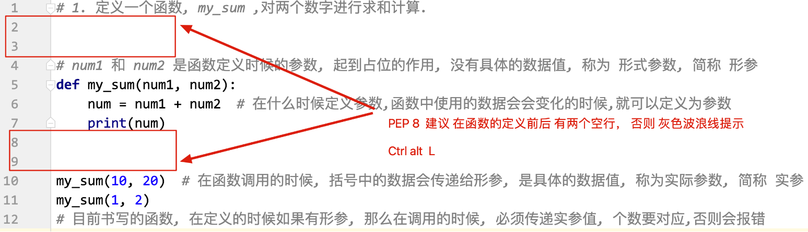


### 缺省参数

缺省参数, 默认参数
在函数定义的时候, 给形参一个默认的数据值, 这个形参就变为缺省参数, 注意, **缺省参数的书写要放在必填参数的后边**

~~~python
def show_info(name, sex='保密'):
    print(name, sex)

show_info('小王')
show_info('小王', '男')
~~~

 

### 可变参数/不定长参数

当我们在书写函数的时候, 不确定参数的具体个数时, 可以使用 不定长参数

比如: 下面的print

```python
print(1, 2, 3)
print(1, 2, 3, 4)
```

1. 不定长位置参数(不定长元组参数)

   规则: 

   1. 在普通参数的前边,加上一个 *,  这个参数就变为不定长位置参数
   2. 这个形参可以接收任意多个 位置传参的数据
   3. 形参的类型是 tuple
   4. 不定长位置参数 要写在普通的参数的后面

   ~~~python
   def add (a, b *args):
       print(args)
   
   add(1, 2, 3, 4, 5) # {4, 5}
   ~~~

2. 不定长关键字参数(不定长字典参数)

   规则: 

   1. 在普通参数的前边,加上 两个 *,  这个参数就变为不定长关键字参数
   2. 这个形参可以接收任意多个 关键字传参的数据
   3. 形参的类型是 dict
   4. 不定长关键字参数,要写在所有参数的最后边

   ~~~python
   def aa(a, b, **kwargs):
       print(kwargs)
   ~~~


> 注意:  函数参数的完整格式如下:
>
> ~~~python
> def 函数名(普通函数, *args, 缺省参数, **kwargs):
>         pass 
> ~~~
>
> **位置参数在前,  关键字参数在后**

比如下面定义一个函数

~~~python
def func1(a, b, *args, c = 1, d = 2, **kwargs):
    print(a, b, args, c, d, kwargs)
    
    
func1(1, 2) # 只给ab传参
func1(1, 2, 3, 4) # args为{3,4}
func1(1,2,c=1,d=3, e=5, f=6) # ab为12, args为{}, c=1, d=3, kwargs={e=5, f=6}
~~~


当需要通过list和dict分别传参给不定长位置参数和不定长关键字参数时, 可以使用如下的方式:

~~~python
def my_sum(*args, **kwargs):
    num = 0  # 定义变量,保存求和的结果
    for i in args:
        num += i
    for j in kwargs.values():
        num += j

    print(num)


my_list = [1, 2, 3, 4]
my_dict = {'a': 1, 'b': 2, 'c': 3, 'd': 4}

# *表示对my_list进行拆包
my_sum(*my_list)  # my_sum(1, 2, 3, 4)
# **表示对dict进行拆包
my_sum(**my_dict)  # my_sum(a=1, b=2, c=3, d=4)
~~~


## 函数的返回值

函数的返回值,可以理解为是 函数整体执行的结果是什么
比如之前使用过的函数: 

1. print()  ---> None
2. input()  ---> 键盘输入的内容
3. type()   ---> 类型
4. len()    ---> 数据的长度(元素的个数)

在函数中想要将一个数据作为返回值 返回, 需要使用 return 关键字(只能在函数中使用)

函数代码执行遇到 return, 会结束函数的执行

```python
def my_sum(a, b):
    num = a + b
    # print(num)  # 代码中没有返回值,只有 print,这个结果只能在函数中用一次,不能后续使用
    # 我们想要将这个求和的结果 在后续的代码中使用, 需要使用 return 将求和的结果进行返回
    return num  # 将这个结果返回到调用的地方法
    # return 之后的代码会执行吗
    print('我是 return 之后的代码, 我会执行吗---> 不会执行')


# 1. 函数中没有 print, 只有 return, 想要查看结果,需要在调用的时候使用 print
print(my_sum(1, 2))

# 2, 想要将函数中返回的结果,在后续代码中使用, 即需要将这个数据保存下来
result = my_sum(10, 20)  # 将求和的结果保存到变量 result 中, 可以在后续代码中使用
print('使用: 1, 直接打印: ', result)
print('使用: 2, 对数字 加 10:', result + 10)

```

 

返回值的说明:

- ~~~python
  def 函数名():   # 返回值 None
     pass  # 代码中没有 return 
  ~~~

- ~~~python
  def 函数名():
      return  # return 后边没有数据, 返回值 None
  ~~~

- ~~~python
  def 函数名():
      return xx   # 返回值是 xx
  ~~~

  

## 函数传参的方式

- 位置传参: 在函数调用的时候, 按照形参的顺序, 将实参值传递给形参

  ~~~python
  def func(a, b, c):
      print(f'a: {a}, b: {b}, c: {c}')
  
  # 位置传参
  func(1, 2, 3)
  ~~~

  

- 关键字传参: 在函数调用的时候, 指定数据值给到那个形参

  ```python
  def func(a, b, c):
      print(f'a: {a}, b: {b}, c: {c}')
      
  # 关键字传参
  func(a=2, b=3, c=1)
  ```


## lambda表达式(匿名函数)

格式:  `变量 = lambda: 一行代码`

特点:

- 匿名函数只能书写一行代码
- 匿名函数的返回值不需要 return, 一行代码(表达式) 的结果就是返回值
- 匿名函数可以作为变量使用, 也可以作为函数使用

~~~python
# lambda表示定义lambda, a, b表示参数
func1 = lambda a, b: a + b

print(func1(10, 20)) # 直接调用
~~~

~~~python
user_list = [
    {"name": "zhangsan", "age": 18},
    {"name": "lisi", "age": 19},
    {"name": "wangwu", "age": 17}
]

user_list.sort(key=lambda x: x['age'], reverse=True) # 直接传入一个lambda用于排序

func1 = lambda: x['age'] # 返回dict的age字段
user_list.sort(key=func1) # 使用func1进行排序
~~~


## 进阶功能

1. 可以在函数中定义函数

   ~~~python
   def hi(name="yasoob"):
       print("now you are inside the hi() function")
    
       def greet():
           return "now you are in the greet() function"
    
       print(greet())
   ~~~

2. 可以将函数返回值

   ~~~python
   def create_counter():
       count = 0  # 外部函数的局部变量
   
       def counter():  # 内部函数
           nonlocal count  # 声明使用外部函数的变量
           count += 1
           return count
   
       return counter  # 返回内部函数
   
   # 创建一个计数器
   my_counter = create_counter()

   # 调用计数器
   print(my_counter())  # 输出: 1
   print(my_counter())  # 输出: 2
   print(my_counter())  # 输出: 3
   ~~~
   
3. 将函数作为参数

   ~~~python
   def apply_operation(operation, x, y):
       return operation(x, y)  # 调用传入的函数
   
   def add(a, b):
       return a + b  # 加法
   
   # 使用 apply_operation 函数
   result = apply_operation(add, 5, 3)
   
   print("Result:", result)  # 输出: Result: 8
   ~~~

   


# 变量进阶


## 变量的引用

1. 在定义变量的时候 `变量 = 数据值`, Python 解释器会在内存中开辟两块空间
2. 变量和数据都有自己的空间
3. 日常简单理解, 将数据保存到变量的内存中, 本质是 将 数据的地址保存到变量对应的内存中
4. 变量中存储数据地址的行为 就是引用 (变量引用了数据的地址, 简单说就是变量中存储数据), 存储的地址称为 引用地址
5. **可以使用 id()  来获取变量中的引用地址(即数据的地址), 如果两个变量的 id() 获取的引用地址一样, 即代表着, 两个变量引用了同一个数据,是同一个数据**
6. 只有 赋值运算符=, 可以改变变量的引用(等号左边数据的引用)
7. python 中数据的传递,都是传递的引用

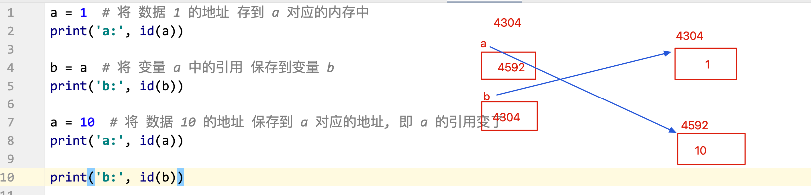

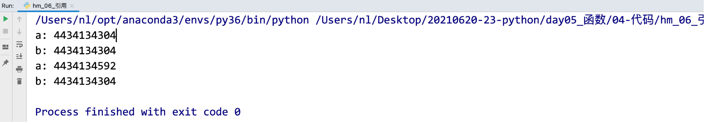

## 可变类型和不可变类型

可变不可变是指: 数据所在的内存是否允许修改, 允许修改就是可变类型, 不允许修改就是不可变类型(不使用=, 变量引用的数据中的内容是否会变化,会变化是可变的, 不会变化是不可变的)

1. 可变类型: 列表 list, 字典 dict, 集合 set
       列表.append()
       字典.pop(键)

2. 不可变类型:int float bool str tuple

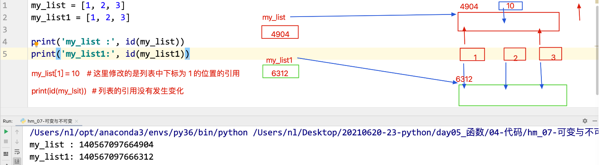

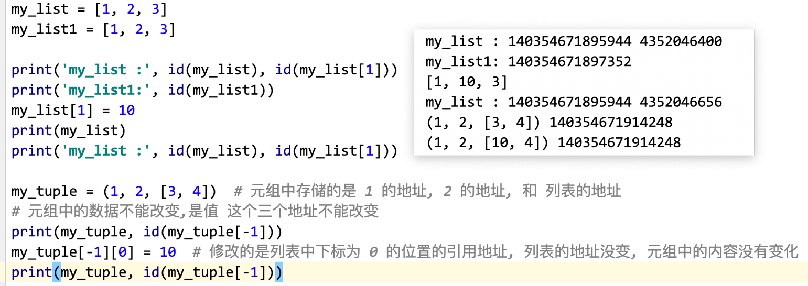

 

## 变量交换

```python
a, b = b, a
print(a, b)
```


## 局部变量, 全局变量, 外部函数变量

根据变量的定义位置, 可以将变量分为局部变量和全局变量

1. 局部变量:  在函数内部(函数的缩进中)定义的变量,称为是局部变量

   特点:

   - 局部变量只能在当前函数内部使用, 不能在其他函数和函数外部使用
   - 在不同函数中,可以定义名字相同的局部变量, 两者之间没有影响
   - 在函数被调用的时候,局部变量被创建, 函数调用结束, 局部变量的值被销毁(删除), 不能使用
   ~~~python
   def func1():
       num = 10  # num 就是局部变量
       print(f"func1 函数中 {num}")
   
   
   def func2():
       num = 100  # 可以在不同函数中定义名字相同的局部变量,没有影响
       print(f"func2 函数中 {num}")
   
   
   func1()  # 10
   func2()  # 100
   func1()  # 10
   ~~~

2. 全局变量: 在函数外部定义的变量, 称为是 全局变量

   特点: 
   - 可以全局读取
   
     ~~~python
     g_num = 10  # 全局变量
    def func1():
         print(f'func1 中 {g_num}')  # 在函数中可以读取全局变量的值
     ~~~
   
   - **在函数内部想要修改全局变量的引用(数据值), 需要添加 global 关键字, 对变量进行声明为全局变量**
   
     ~~~~python
     g_num = 10  # 全局变量
     def func3():
         global g_num  # 想要修改全局变量的值, 需要使用global定义
         g_num = 30  # 修改了全局变量
     print(g_num)
     ~~~~
   
   - **如果在函数中存在同名的全局变量和局部变量, 优先使用局部变量(就近原则)**
   
     ~~~python
     g_num = 10  # 全局变量
     def func2():
         g_num = 20  # 定义局部变量, 不会影响全局变量
         print(f'func2 中 {g_num}') # 优先使用局部变量
     ~~~
   
   - **在函数中可以使用global关键字定义全局变量**
   
     ~~~python
    def func2():
         global g_num # 不能直接定义并赋值
         g_num = 30
     func2() # 必须调用函数才会创建全局变量
     print(g_num) # 30
     ~~~
   
3. 外部函数变量

   ~~~python
   def create_counter():
       count = 0  # 外部函数的局部变量
   
       def counter():  # 内部函数
           nonlocal count  # 声明使用外部函数的变量
           count += 1
           return count
   
       return counter  # 返回内部函数
   
   # 创建一个计数器
   my_counter = create_counter()
   
   # 调用计数器
   print(my_counter())  # 输出: 1
   print(my_counter())  # 输出: 2
   print(my_counter())  # 输出: 3
   ~~~

   

# 组包和拆包

组包(pack): 将多个数据值使用逗号连接, 组成元组

拆包(unpack): 将容器中的数据值使用多个变量分别保存的过程,注意: 变量的个数和容器中数据的个数要保持一致

案例1: 

~~~python
# 组包
c = b, a  # 组包
print(type(c), c)  # <class 'tuple'> (10, 20)

# 拆包
x, y, z = [1, 2, 3]
print(x, y, z)
~~~


### 函数返回多个数据值

```python
# 函数中想要返回一个数据值, 使用 return 关键字

# 将 多个数据值组成容器进行返回, 一般是元组(组包)
def calc(a, b):
    num = a + b
    num1 = a - b
    return num, num1


# 写法一
result = calc(10, 5)
print(result, result[0], result[1])

# 写法二, 直接拆包
x, y = calc(20, 10)
print(x, y)
```

 


# 面对对象

### 定义类

格式如下:

~~~python
# 属性和方法使用下划线风格
# 类名使用大驼峰
class Student:
    print("Student对象创建了")
    
stu = Student() #创建一个Student对象
~~~


### 构造函数

~~~python
class Student:
	# 构造方法, 必须写self, 表示当前对象
    def __init__(self):
        print("Student对象创建了")
~~~

### 析构函数

~~~python
class Student:
	# 析构函数
    def __del__(self):
        print("Student对象销毁了")
~~~


### 访问控制权限

~~~python
class Person:
    def __init__(self, name, age, score):
        self.name = name  # public属性, 随便调

        # protect属性, 和public没什么区别, 按照约定最好只在内部和子类中访问
        # 不要在外边访问, 但是没有严格限制, 只是约定
        self._age = age

        # private 属性, 只能在内部访问, 无法在子类和外部访问
        # python会将private属性和方法重命名为_ClassName__MemberName的形式, 使得其难以访问
        # 所以你也可以直接通过这个名字访问private属性和方法, 但是最好不要
        self.__score = score

    def _info(self): # protect方法, 按照约定最好在内部和子类中使用, 不要在外部中使用
        return f'{self.name} is {self._age} years old, score is {self.__score}'

    def __message(self): # private方法, 只能外部调用, 但是可以通过_ClassName__MemberName的形式来调用
        return f'{self.name} is {self._age}  years old, score is {self.__score}'

    def show(self): # public方法, 随便调用
        print(self.__message())

p = Person('John', 24, 80)
print(p.name)
print(p._age) # 可以从外部访问protected, protected只是约定的最好不要从外部调用
# print(p.__score) # 外部无法访问
print(p._Person__score) # 可以通过_ClassName__MemberName强制访问private

p.show()
p._info() # 可以从外部访问protected, protected只是约定的最好不要从外部调用
p.__message()  # 外部无法访问
p._Person__message() # 可以通过_ClassName__MemberName强制访问private
~~~


### static属性

~~~python
class Student:
	# 类似java中的static属性
    native_place = '吉林'
    # 私有的类属性
    __private_native_place = 'zhangsan'
~~~

在访问静态属性的时候, 可以通过两种方式:

1. 类名.属性名
2. 对象.属性名(极度不推荐)

需要注意的是, 如果使用`对象名.类属性名 = 值`赋值语句, 并不会改变类属性, 而是会给这个对象添加一个和类属性同名的实例属性


### static方法

~~~python
class Student:
	# 静态方法, 在静态方法中不能使用self  (基本不用!!!)
    @staticmethod
    def method():  # 不写self
        print('我使用了静态方法')

    # 类方法, 必须写cls, cls类似java中的Class
    @classmethod
    def cm(cls):
        print('我使用了类方法')
~~~

staticmethod和classmethod的不同只是在于classmethod能够多接受一个cls作为参数


### 动态添加属性和方法

在python中, 可以给对象动态的添加属性, 方法, 类属性, 类方法

~~~python
class Student:
    pass

stu = Student()
stu.age = 18 # 动态添加一个age属性

def show():
    print('show...')
stu2.show = show # 动态添加一个实例方法

Student.number = 0; # 动态添加一个类属性

Student.show = show # 动态添加一个类方法
~~~


### 强制调用私有属性和方法

在python中, 私有的属性和方法在调用的时候, 并不会去判断访问修饰符, python只是简单的将他们换一个名字隐藏起来了, 我们可以使用更换之后的名字来调用他们

所以私有属性和方法就是防君子不防小人

~~~python
class Student:

    __private_class_field = 0

    def __init__(self):
        self.__age = 18

    def __say(self):
        print("say...")

    @classmethod
    def __class_method(cls):
        print("private class method")


stu = Student()
list = dir(stu) # 获取stu的所有属性, 方法, 类方法, 类属性
# 可以看到,
# __say方法被变成了_Student__say,
# __age属性变成了_Student__age
# __private_class_field变成了_Student__private_class_field
# ____class_method变成了_Student__class_method
print(list)

# 所有我们可以使用转换之后的名称来调用他们
stu._Student__say() # 强制调用say方法
print(stu._Student__age) # 强制获取age属性
print(stu._Student__private_class_field) # 强制获取私有的类属性
stu._Student__class_method() # 强制调用私有类方法
~~~


### 方法重载

**python不支持方法重载, 如果需要重载, 使用默认参数**


### 对象的比较

默认情况下, 对象的`==`都是对地址的比较,  但是你可以重写`__eq__()`方法改变这个行为

默认情况下，`!=` 也是基于内存地址的比较，实际操作中，Python会调用 `__ne__()` 方法（如果定义了）。如果没有定义 `__ne__()`，Python 会使用 `__eq__()` 来推导 `!=`。

~~~python
class Point:
    def __init__(self, x, y):
        self.x = x
        self.y = y

    def __eq__(self, other):
        if isinstance(other, Point):
            return self.x == other.x and self.y == other.y
        return False

p1 = Point(1, 2)
p2 = Point(1, 2)
p3 = Point(2, 3)

print(p1 == p2)  # True
print(p1 == p3)  # False
~~~


默认情况下, 对象不能进行大小的比较, 如果需要进行排序比较（例如使用 `sorted()` 函数或 `min()` 等）, 你可以重写如下方法

- `__lt__(self, other)`：定义小于操作 `<`。

- `__le__(self, other)`：定义小于等于操作 `<=`。

- `__gt__(self, other)`：定义大于操作 `>`。

- `__ge__(self, other)`：定义大于等于操作 `>=`。

如果你只重载了 `__lt__()`和`__eq__()`，Python会根据这两个方法自动推导出`<=, >, >=, !=`

~~~python
class Point:
    def __init__(self, x, y):
        self.x = x
        self.y = y

    def __lt__(self, other):
        if isinstance(other, Point):
            return (self.x, self.y) < (other.x, other.y)
        return False

    def __eq__(self, other):
        if isinstance(other, Point):
            return self.x == other.x and self.y == other.y
        return False

p1 = Point(1, 2)
p2 = Point(2, 3)
p3 = Point(1, 2)

print(p1 < p2)   # True
print(p1 <= p3)  # True
print(p2 > p1)   # True
print(p1 >= p3)  # True
~~~


**`__hash__()` 和 `__eq__()` 一致性**

如果你打算使用对象作为字典的键或者存储在集合中，重载 `__eq__()` 方法时，应该同时重载 `__hash__()` 方法。否则，即使两个对象相等，Python也无法正确地将它们视为相同的键或元素。

```python
class Point:
    def __init__(self, x, y):
        self.x = x
        self.y = y

    def __eq__(self, other):
        return (self.x, self.y) == (other.x, other.y)

    def __hash__(self):
        return hash((self.x, self.y))

p1 = Point(1, 2)
p2 = Point(1, 2)
p3 = Point(2, 3)

points = {p1, p2, p3}
print(len(points))  # 2, 因为p1和p2被认为是相同的
```


### Magic属性和方法

1. `__str__`和`__repr__`:   在print的时候调用,  `__str__`的优先级大于`__repr__`

   ~~~python
   class Student:
       def __str__(self):
           return "Student class"
   
       def __repr__(self):
           return __str__()
   ~~~

2. `__dict__`:  使用该属性, 可以获取对象中**所有的public的实例属性**

   ~~~python
   class Student:
   
       def __init__(self):
           self.age = 18
           self.height = 1.72
   
   stu = Student()
   print(stu.__dict__) # {'age': 18, 'height': 1.72}
   ~~~

3. `__len__`:  在调用len()函数的时候调用

   ~~~python
   class Student:
       def __len__(self):
           return 10
       
   print(len(Student())) # 10
   ~~~

4. `__contains__`: 该方法会在调用in和not in时被调用

   ~~~python
   class MyList:
       def __init__(self, list):
           self.list = list
   
       def __contains__(self, item):
           return self.list.__contains__(item)
   
   list = MyList([1,5,6,8,9])
   print(5 in list)
   print(10 not in list)
   ~~~

   

5. `__class__`:  该方法返回一个类的构造函数

   ~~~python
   class Student:
       @classmethod
       def newInstance(cls):
           return cls()   # 传入的cls就是对象的__class__
       
       def clone(self):
           return self.__class__() # 通过构造函数来创建对象
       
   stu = Student()
   stud1 = stu.__class__() # 通过构造函数来创建对象
   ~~~

6. `__getitem__`: 这个方法返回所给键对应的值。当对象是序列时，键是整数。当对象是映射时（字典），键是任意值。

   ~~~python
   class Seq:
       def __init__(self, *args):
           self.list1 = args
           
       def __getitem__(self, key):
           return list1[key]
   seq = Seq(*[1, 2, ,3 ,4])
   print(seq[0]) # 1
   ~~~

   ~~~python
   class Map:
       def __init__(self, **kwargs):
           self.map1 = args
           
       def __getitem__(self, key):
           return map1[key]
   map1 = Map(**{"name": "zhangsan"})
   print(map1[name]) # zhangsan
   ~~~

7. `__call__`方法, 可以使得一个类实例可以像函数一样进行调用，使用方式类似于函数调用。比如

   ~~~python
   class Adder:
       def __init__(self, x):
           self.x = x
   
       def __call__(self, y):
           return self.x + y
   
   add5 = Adder(5)
   print(add5(3))  # 输出8
   print(add5(7))  # 输出12
   ~~~

   

### Getter和Setter

和java类似, 当我们需要getter和setter的时候, 我们如果直接去定义对应的方法, 那么这个操作就太麻烦了

在java中我们可以使用lombok来完成这个功能, 在python中, 我们可以使用`@property`来完成这个功能

~~~python
class Student(object):

    # 定义一个setter
    # @property本身又创建了另一个装饰器@score.setter，负责把一个setter方法变成属性赋值
    @property 
    def score(self):
        return self._score

    # 使用@property创建的另外的装饰器, 来修饰一个setter
    @score.setter
    def score(self, value):
        if not isinstance(value, int):
            raise ValueError('score must be an integer!')
        if value < 0 or value > 100:
            raise ValueError('score must between 0 ~ 100!')
        self._score = value
        
stu = Student()
stu.score = 60 # 转换为stu.score(60)
stu.score # 转换为stu.score()
~~~


# 继承

**python中没有接口**


### 定义

```python
class Animal: # 默认继承Object
    def __init__(self, a, b): # 接受两个参数
		self.a = a
         self.b = b
    
    def eat(self):
        print('要吃东西')

class Dog(Animal): # dog继承animal
    def __init__(self, c, d, a, b):
        print("...")
        super().__init__(a, b) # 给父类传参
    
    def bark(self):
        print('汪汪汪叫....')
        
dog = Dog()
dog.eat()  # 调用父类中的方法
dog.bark()   # 调用自己类中方法
```

<font color=red>python中, 没有像java一样规定, 在构造函数中一定要在第一行调用super的构造函数, 你掉不调用都无所谓, 在哪里调用也无所谓, 尽管这不是一个好习惯, 只需要将`__init__`当做一个普通的函数就好</font>

比如在Dog中, 如果我们不调用父类的`__init__`,  那么这会导致创建出来的对象, 没有ab这两个属性, 但是这并不会导致报错


### 方法重写

~~~python
class Animal:
    def eat(self):
        print('要吃东西')
        
class Dog(Animal): 
    def eat(self):
        super.eat() # 通过super来调用父类的方法
        print('狗要吃东西了, 啊啊啊')
~~~


### 抽象类和抽象方法

在python中类 通过继承`ABCmeta`类来创建抽象类，抽象类是包含抽象方法的类，其中ABCmeta类是所有抽象类的基类。

定义了抽象类后，在要实现抽象方法的前一行使用`@abc.abstractmethod`来定义抽象方法。

抽象方法不包含任何可实现的代码，只能在子类中实现抽象函数的代码。


抽象类的特点:

1. 抽象类不能被实例化
2. 继承抽象类的类必须实现所有的抽象方法后，才能被实例化
3. 抽象类中有抽象方法和正常方法
4. 抽象类中可以添加成员属性


注意：

1. 抽象类中的抽象方法，在子类中必须实现该方法

2. 抽象类不能被实例化

3. 创建抽象方法前，必须先创建抽象类

4. 需要导入abc（abstractclass）类

5. python是动态语言（在程序运行时检查类型，对比：java是静态语言，在程序运行前检查类型）。动态语言调用实例方法，不检查类型，只要方法存在，参数正确，就可以调用 ；

   也就是说，例如：传递给函数 who_am_i(x)的参数 x 不一定是 Person 或 Person 的子类型。任何数据类型的实例都可以，只要它有一个whoAmI()的方法，且参数正确即可

~~~python
from abc import ABC, abstractmethod, ABCMeta

# 抽象类继承ABC类
# class Persion(metaclass = ABCMeta)   # 一样定义抽象类
class Person(ABC): # 推荐使用这种

    def __init__(self, **kwargs):
        self.age = kwargs.get("age")
        self.name = kwargs.get("name")

    def hello(self):
        print "hello, my name is {}, and my age is {}".format(self.name, self.age)

    # 定义抽象方法
    @abstractmethod 
    def say(self):
        pass


class Student(Person):
    def __init__(self, **kwargs):
        super().__init__(**kwargs)
        self.school = kwargs.get("school")

    def say(self):
        print "my school is ", self.school

stu = Student(name="wangming", age=19, school="Henan Politecnic University")
stu.hello()
stu.say()
~~~


### 多继承

在python中, 支持多继承, 语法如下:

~~~python
class A:
	pass
class B:
	pass
class C(B, A):
    pass
~~~

对于多继承, 那么一定有如下的问题:

1. 如果不同的类有相同的方法时, 应该调用哪一个
2. 创建对象的过程中, 构造函数是怎么样调用的

对于这样的问题, python中通过C3线性化来解决


### C3线性化

python中支持多继承, 当我们定义一个类的时候, 首先python会根据C3线性化的规则对类的继承结构进行线性化

规则是: 当前类在先,  然后广度优先搜索父类, 直到Object

比如下面的类结构: 

​      A

/      |    \

B    C    D

\     |     /

​      E

当我们定义了E之后, 他的线性化是: `E -> B -> C -> D -> A -> Object`

如果你不确定一个类的查找顺序, 你可以调用`类名.__mro__`或者`类名.mro()`来查看他的查找顺序, 这两种方式的不同在于前者返回set, 而后者返回list

~~~python
class A:
    def say(self):
        print("aaa")
class B(A):
    def say(self):
        print("bbb")
class C(A):
    def say(self):
        print("ccc")
class D(A):
    def say(self):
        print("ddd")
class E(B, C, D):
    def say(self):
        print("eee")
e = E()
# 返回list
print(E.mro()) # [<class '__main__.E'>, <class '__main__.B'>, <class '__main__.C'>, <class '__main__.D'>, <class '__main__.A'>, <class 'object'>]
# 返回set
print(E.__mro__) # (<class '__main__.E'>, <class '__main__.B'>, <class '__main__.C'>, <class '__main__.D'>, <class '__main__.A'>, <class 'object'>)
~~~


### 如何调用父类中的方法

在继承中, 我们的super()函数返回的到底是什么呢?

**他返回的就是C3线性化时, 上一级的信息, 我们可以使用他来调用上一级的方法**

~~~python
class A:
    def __init__(self): # 调用Object的__init__
        print("A")
class B(A):
    def __init__(self):
        super().__init__() # 调用A的__init__
        print("B")
class C(B):
    def __init__(self):
        super().__init__() # 调用B的__init__
        print("C")
c = C() # A B C
~~~

当然我们也可以直接通过super()来指定我们想要获取C3线性化中的哪一级

~~~python
class A:
    def __init__(self):
        print("A")
class B(A):
    def __init__(self):
        super().__init__()
        print("B")
class C(B):
    def __init__(self):
        super(A, self).__init__() # 直接调用A的__init__
        print("C")
c = C()
~~~


同时我们也可以使用`类名.方法()`来指定我们想要调用的父类的方法

~~~python
class A:
    def __init__(self): # 调用Object的__init__
        print("A")
class B(A):
    def __init__(self):
        super().__init__() # 调用A的__init__
        print("B")
class C(B):
    def __init__(self):
        A.__init__(self) # 直接调用A的init方法, 导致B的init不会执行, 有可能会缺少某些属性
        print("C")
c = C() # A B C
~~~

### 类的创建过程

假如我们有如下类结构:

​      A

/      |    \

B    C    D

\     |     /

​      E

当我们调用`e = E()`来创建一个C对象的时候,  python首先会按照线性化的规则来解析E的继承结构, 结果为`E -> B -> C -> D -> A -> Object`

然后根据线性化的结果从左往右来查找`__new__`方法

如果ABCDE都没有重写`__new__`这个方法, 那么最终就会找到Object这个类上面, 在他上面有这个方法, 定义如下:

~~~python
def __new__(cls)
~~~

他接收一个cls, 表示当前的类型,  然后返回一个对象,  这个返回的对象, 就是python帮我们创建的实例对象. 

我们可以重写`__new__`这个方法, 来自定义一些自己的创建逻辑

~~~python
class A:
    pass
class B(A):
    pass
class C(A):
    def __new__(cls):
        print("c: new_before")
        # 查找上一级中的__new__, 所有这里调用的是D中的__new__
        obj = super().__new__(cls)
        print("c: new_after")
        return obj

class D(A):
    def __new__(cls):
        print("d: new_before")
        # 应为A中没有__new__, 所以这里调用的Object上的方法
        # 这个方法会真正的创建一个对象
        obj = super().__new__(cls)
        print("d: new_after")
        return obj

class E(B, C, D):
    def __new__(cls):
        print("e: new_before")
        # 查找上一级中的__new__, 应为B没有, 所有这里调用的是C中的__new__
        obj = super().__new__(cls) 
        print("e: new_after")
        return obj

e = E()
~~~

结果为

~~~text
e: new_before
c: new_before
d: new_before
d: new_after
c: new_after
e: new_after
~~~


在递归调用完所有的`__new__`之后, 这个对象就真正的创建完成了

之后python会按照线性化的结果, 开始查找`__init__`这个方法中, 并将刚刚创建出来的对象传入, 来对这个对象进行初始化

所以我们的类可以在`__init__`方法中对这个对象进行初始化

~~~python
class A:
    def __init__(self):
        print("a: init_before")
        self.a = 40
        print("a: init_after")

class B(A):
    def __init__(self):
        print("b: init_before")
        # 查找B的线性化上级, 应为C中没有__init__, 所以调用的是D的__init__
        super().__init__()
        self.b = 20
        print("b: init_after")

class C(A):
    def __new__(cls):
        print("c: new_before")
        # 查找上一级中的__new__, 所有这里调用的是D中的__new__
        obj = super().__new__(cls)
        print("c: new_after")
        return obj

class D(A):
    def __new__(cls):
        print("d: new_before")
        # 应为A中没有__new__, 所以这里调用的Object上的方法
        # 这个方法会真正的创建一个对象
        obj = super().__new__(cls)
        print("d: new_after")
        return obj

    def __init__(self):
        print("d: init_before")
        self.d = 40
        print("d: init_after")

class E(B, C, D):
    def __new__(cls):
        print("e: new_before")
        # 查找上一级中的__new__, 应为B没有, 所有这里调用的是C中的__new__
        obj = super().__new__(cls)
        print("e: new_after")
        return obj

    def __init__(self):
        print("e: init_before")
        self.e = 50
        # 查找E的线性化上级, 也就是B, 并调用其__init__
        super(E, self).__init__()
        print("e: init_after")
e = E()
# e: new_before
# c: new_before
# d: new_before
# d: new_after
# c: new_after
# e: new_after
# e: init_before
# b: init_before
# d: init_before
# d: init_after
# b: init_after
# e: init_after
~~~

上面中, 我们通过`super()`来调用上级的`__init__`, 这样就会根据线性化的顺序递归调用`__init__`方法

<font color = red>上面特别要注意的是:  我们并没有在D中调用`super().__init__()`,  所以即使A中重写了`__init__`方法, 也不会调用, 这就导致了创建出来的e对象, 实际上是没有a这个属性的. </font>

<font color = red>尽管这是个不好的习惯, 但是并不会报错 </font>


### `__new__`和`__init__`的参数问题

在上面我们提到, 在创建对象的时候, 会根据线性化的结果来查找并调用`__new__`和`__init__`这两个函数

那么如果我们的`__init__`需要接受参数时应该怎么办呢?

实际上, 当我们调用`e = E()`时, 我们可以给`E()`这个方法传递参数,  这样python会将这些参数全部都传递给第一个找到的`__new__`函数

在调用完`__new__`函数之后, 也会将全部的参数传递给`__init__`, 所以我们可以在`__new__`中定义参数来接收, 或者如果你不确定要接受的参数个数和参数类型的话, 那么直接使用`*args, **kwargs`来一股脑全部接收就好了

~~~python
class A:
    def __init__(self, *args, **kwargs):
        print(args, kwargs)  # ('hello1', 'hello2', 'hello3') {'a': 1, 'b': 2, 'c': 3}
        super().__init__(*args, **kwargs)

    def __new__(cls, msgA, msgB, **kwargs):
        print(msgA) # hello1
        return super().__new__(cls, msgB, **kwargs)

class B:
    def __init__(self, msgA, msgB, msgC, a = None, b= None, c= None):
        print(msgA, msgB, msgC, a, b, c) # hello1 hello2 hello3 1 2 3

    def __new__(cls, msgB, **kwargs):
        print(msgB) # hello2
        return super().__new__(cls) # 调用object的__new__创建对象

class C(A, B):
    def __new__(cls, *args, **kwargs):
        msgA, msgB, msgC = args[:3]

        print(msgC) # hello3
        return super().__new__(cls, msgA, msgB, **kwargs)

C("hello1", "hello2", "hello3", a = 1, b = 2, c = 3)
~~~


### 多继承时方法的查找顺序

在多继承中, 我们在调用属性的时候, 会采用C3线性化的规则来查找方法

C3线性化的规则是:  **先查找自身, 然后广度优先, 从左到右, 最后Object的顺序, 如果没找到就报错**

比如下面的继承结构:

​      A

/      |    \

B    C    D

\     |     /

​      E

查找的顺序依次是: E -> B -> C -> D -> A -> Object


# 文件操作


### 打开文件

格式: `open(file, mode='r', encoding=None)`

参数: 

1. file: 是要打开的文件, 类型是字符串, 文件的路径可以是相对路径,也可以是绝对路径(从根目录开始书写的路径),建议使用相对路径(相对于当前代码文件所在的路径, ./ ../ )

2. mode:  默认参数(缺省参数), 表示的是打开文件的方式 
   | 模式 | 描述                                                         |
   | :--- | :----------------------------------------------------------- |
   | x    | 写模式，新建一个文件，如果该文件已存在则会报错。             |
   | b    | 二进制模式。                                                 |
   | +    | 表示可读可写                                                 |
   | r    | 以只读方式打开文件。**文件的指针将会放在文件的开头**。       |
   | rb   | 以二进制格式打开一个文件用于只读。文件指针将会放在文件的开头。这是默认模式。一般用于非文本文件如图片等。 |
   | r+   | 读写的形式打开。文件指针将会放在文件的开头。                 |
   | rb+  | 以二进制格式打开一个文件用于读写。文件指针将会放在文件的开头。一般用于非文本文件如图片等。 |
   | w    | 打开一个文件只用于写入。如果该文件已存在则打开文件，并从开头开始编辑，**即原有内容会被删除**。如果该文件不存在，创建新文件。 |
   | wb   | 以二进制格式打开一个文件只用于写入。如果该文件已存在则打开文件，并从开头开始编辑，即原有内容会被删除。如果该文件不存在，创建新文件。一般用于非文本文件如图片等。 |
   | w+   | 打开一个文件用于读写。如果该文件已存在则打开文件，并从开头开始编辑，即原有内容会被删除。如果该文件不存在，创建新文件。 |
   | wb+  | 以二进制格式打开一个文件用于读写。如果该文件已存在则打开文件，并从开头开始编辑，即原有内容会被删除。如果该文件不存在，创建新文件。一般用于非文本文件如图片等。 |
   | a    | 打开一个文件用于追加。如果该文件已存在，文件指针将会放在文件的结尾。也就是说，新的内容将会被写入到已有内容之后。如果该文件不存在，创建新文件进行写入。 |
   | ab   | 以二进制格式打开一个文件用于追加。如果该文件已存在，文件指针将会放在文件的结尾。也就是说，新的内容将会被写入到已有内容之后。如果该文件不存在，创建新文件进行写入。 |
   | a+   | 打开一个文件用于读写。如果该文件已存在，文件指针将会放在文件的结尾。文件打开时会是追加模式。如果该文件不存在，创建新文件用于读写。 |
   | ab+  | 以二进制格式打开一个文件用于追加。如果该文件已存在，文件指针将会放在文件的结尾。如果该文件不存在，创建新文件用于读写。 |

3. encoding: 编码方式,(文字和二进制如何进行转换的)
   - gbk: 将一个汉字转换为 2 个字节二进制
   - utf-8: 常用, 将一个汉字转换为 3 个字节的二进制

返回值: 返回的是 文件对象, 后续对文件的操作,都需要这个对象

~~~python
file1 = open("file/to/path", mode='r', encoding="utf-8")
file1.close()
~~~


### with语法

with实现了java中try with resource的功能, 用于关闭文件, 数据库链接, 网络连接, 线程锁

他主要通过上下文管理器接口（实现 `__enter__` 和 `__exit__` 方法的对象）来控制资源的进入与退出。

上下文管理器协议定义了两个关键方法：

* **`__enter__()`**：进入 `with` 语句块时调用，通常用于资源的获取、初始化工作，并返回一个值（该值通常是资源对象本身）。
* **`__exit__()`**：退出 `with` 语句块时调用，通常用于资源的释放和清理。它可以处理异常（如果 `with` 语句块内抛出了异常）。

with语句的工作流程如下:

1. 进入 `with` 语句块时：

   * 执行 `with` 后面的对象的 `__enter__()` 方法。
   * `__enter__()` 方法的返回值会被赋给 `with` 语句的变量（例如：`as f`）。
2. 执行 `with` 语句块中的代码：

   * 资源在 `with` 语句块内被使用，`with` 语句的作用域内执行用户的代码。
3. 退出 `with` 语句块时：

   * 无论是正常结束还是发生异常，都会执行 `__exit__()` 方法。
   * `__exit__()` 方法负责清理资源，比如关闭文件、释放锁等。

伪代码如下:

~~~python
with get_a_context() as f:
    do something()
~~~

等效于

~~~python
context = get_a_context()
f = context.__enter__()

try:
    # do something
finally:
    # 这里的三个参数是调用过程中产生的异常的类型, 实例, 调用栈
    # 系统会自动传递到__exit__函数中, 告诉我们异常
    context.__exit__(None, None, None)
~~~


常见的with语句的使用有如下:

1. 文件操作

   ~~~python
   with open('file.txt', 'r') as file:
       content = file.read()
   # 这里不需要显式调用 file.close()，文件会自动关闭
   ~~~

   上面代码等效于

   ~~~python
   file = open('file.txt', 'r')
   file = file.__enter__()
   
   try:
     # do something
   finally:
     file.__exit__(None, None, None)
   ~~~

2. 数据库连接

   ~~~python
   import sqlite3
   
   with sqlite3.connect('mydatabase.db') as conn:
       cursor = conn.cursor()
       cursor.execute("SELECT * FROM users")
       result = cursor.fetchall()
   # conn 会自动关闭
   ~~~

3. 同步锁

   ~~~python
   import threading
   
   lock = threading.Lock()
   
   with lock:
       # 执行线程安全的操作
       print("Critical section")
   # lock 会自动释放
   ~~~

   

#### 自定义上下文管理器

你可以自定义上下文管理器类，使得 `with` 语句适用于自己的资源管理场景。只需实现 `__enter__()` 和 `__exit__()` 方法。

```python
class MyContextManager:
    def __enter__(self):
        print("Entering the context")
        return self  # 返回一个资源对象

    def __exit__(self, exc_type, exc_value, traceback):
        print("Exiting the context")
        if exc_type:
            print(f"Exception: {exc_type}")
        return True  # 可以选择不让异常继续传播

# 使用自定义上下文管理器
with MyContextManager():
    print("Inside the context")
    raise ValueError("An error occurred")
```

**输出**：

```
Entering the context
Inside the context
Exiting the context
Exception: <class 'ValueError'>
```

####  `with` 语句的异常处理

在 `with` 语句块内部，如果抛出异常，`__exit__()` 方法将被调用，且异常会作为参数传递给 `__exit__()` 方法。你可以在 `__exit__()` 方法中处理异常，或者将异常重新抛出。

```python
class MyContextManager:
    def __enter__(self):
        print("Entering the context")
        return self

    def __exit__(self, exc_type, exc_value, traceback):
        print("Exiting the context")
        if exc_type:
            print(f"Exception type: {exc_type}")
        return False  # 返回 False 让异常继续传播, 返回true表示吃掉这个异常

with MyContextManager():
    print("Inside the context")
    raise ValueError("An error occurred")
```

输出：

```
Entering the context
Inside the context
Exiting the context
Exception type: <class 'ValueError'>
```


如果在 `__exit__()` 中返回 `True`，则可以**抑制异常**，使其不再向上传播。

```python
class MyContextManager:
    def __enter__(self):
        print("Entering the context")
        return self

    def __exit__(self, exc_type, exc_value, traceback):
        print("Exiting the context")
        if exc_type:
            print(f"Exception type: {exc_type}")
        return True  # 返回 True 会抑制异常

with MyContextManager():
    print("Inside the context")
    raise ValueError("An error occurred")
# 异常不会被抛出
```

输出：

```
Entering the context
Inside the context
Exiting the context
Exception type: <class 'ValueError'>
```


### 使用 with 打开文件

类似于java中的try with resource

~~~python
with open('a.txt', 'a', encoding='utf-8') as f:
    f.write('good good study ') # 不用手动close
~~~

上面代码等效于

~~~python
# 这里的context就是file对象本身, 调用file的__enter__()返回的也是self
context = open('a.txt', 'a', encoding='utf-8') 
f = context.__enter__()

try:
    # do something
finally:
    # 这里的三个参数是调用过程中产生的异常的类型, 实例, 调用栈
    # 系统会自动传递到__exit__函数中, 告诉我们异常
    context.__exit__(None, None, None)
~~~


### 写文件

~~~python
file1 = open("file/to/path", mode='w', encoding="utf-8")
file1.write("文件内容") # 会覆盖原来的内容
file1.close()

file2 = open("file/to/path", mode='w', encoding="utf-8")
file2.write("文件内容") # 追加内容
file1.close()
~~~


### 读文件

~~~python
with open('a.txt', 'r', encoding='utf-8') as f:
	content = f.read() # 读取文件全部内容, 保存为str
    # content = f.read(10) # 只读取10字节的内容
	print(content)
~~~

~~~python
with open('b.txt', encoding='utf-8') as f:
    buf = f.readline()  # 一次读取一行
    print(buf)
    print(f.readline())
    
with open('b.txt', encoding='utf-8') as f:
    for i in f:  # 按行读取, 读到文件末尾结束
        print(i, end='')
        
with open('b.txt', encoding='utf-8') as f:
    while True:
        buf = f.readline()
        if len(buf) == 0: # readline()读取结束, 返回空字符串
            break
        else:
            print(buf, end='')
            
with open('b.txt', encoding='utf-8') as f:
    while True:
        buf = f.readline()
        if buf:  # 容器为空, 那么他的bool就为fasle
            print(buf)
        else:
            break
~~~


# 异常

程序在运行时，如果 Python 解释器 遇到到一个错误，会停止程序的执行，并且提示一些错误信息，这就是异常

## 抛出异常

~~~python
if (i == 0) {
    raise Exception();
}
~~~


## 捕获异常

~~~python
try:
    书写可能发生异常的代码
except 异常类型1:  	# 只能捕获指定类型的异常, 如果不是这个异常,还是会报错
    发生了异常1执行的代码  
except (异常类型2, 异常类型3) :
    发生了异常2, 3 执行的代码 
except: 			# 捕获所有类型的异常
    发生了异常...执行的代码 
~~~

~~~python
try:
    可能发生异常的代码
except 异常类型1 as 变量: # 可以将异常转换为变量
    发生异常类型1执行的代码
except (异常类型2 , 异常类型3) as 变量:  
    发生其他类型的异常,执行的代码
except Exception as e:   # 捕获所有类型的异常
    ...
else:
    没有发生异常会执行的代码
finally: 
    不管有没有发生异常,都会执行的代码
~~~


### 自定义异常

~~~python
class MyError(Exception): # 继承Exception
    def __init__(self, message="当抛出的消息为空时的默认消息"):
        super().__init__(message) # 异常的消息
    pass

try:
    raise MyError()
except MyError as e:
    print(f"捕获自定义MyError异常：{e}")
    
try:
    raise MyError("报错啦啦啦啦")
except MyError as e:
    print(f"捕获自定义MyError异常：{e}")
~~~


# 模块和包

## 导入的过程

1. Python 源代码文件就是一个模块
2. 当一个module被导入的时候, module文件会被执行, 不管多少次被导入, 都只会执行一次
3. 如果一个目录下面有`__init__`文件, 那么这个目录会被python识别为包
4. 当一个package被导入的时候, 会执行他的`__init__`文件, 不管多少次被导入, 都只会执行一次


假设我们有如下结构的文件

~~~python
main.py
root
	__init__.py
	sub1
    	__init__.py
        a.py
    sub2
    	__init__.py
        b.py
    c.py
d.py
~~~

各个文件内容如下:

~~~python
# d.py
print("d模块被执行")
def d():
    print("d function")

# c.py
print("c模块被执行")
def c():
    print("c function")
    
# root/__init__.py
print("root的__init__文件被执行")

# sub1/__init__.py
print("sub1的__init__文件被执行")

# sub1/a.py
print("a模块被执行")
def a():
    print("a function")
   
# sub2/__init__.py
print("sub2的__init__文件被执行")

# sub2/b.py
print("b模块被执行")
def b():
    print("b function")
~~~


## 导入模块

此时我们可以在main.py文件中导入模块

~~~python
import d # 直接导入d模块
d.d()
# 输出
# d模块被执行
# d function
~~~

如果一个模块是在包下面,  那我们也可以直接导入他,  python会执行包的`__init__`文件, 以及被导入的模块文件中的`__init__`函数

~~~python
import root.c # 从root包下导入c模块,
import root.sub1.a # 从root.sub1包下导入a模块
import root.sub2.b # 从root.sub2包下导入b模块

root.c.c()
# 输出
# root的__init__文件被执行
# c模块被执行
# sub1的__init__文件被执行
# a模块被执行
# sub2的__init__文件被执行
# b模块被执行
# c function
~~~


## 导入包

我们在导入包的时候, 会执行包下面的`__init__`文件

~~~python
import root # 会执行root/__init__.py文件

root.c.c() # 这行会报错
root.sub1.a.a() # 这行报错
root.sub2.b.b() # 这行报错
~~~

我们在导入root之后, 会执行`__init__`文件, 但是python不会自动的为我们导入c模块和sub1,sub2子模块

**python唯一会做的就是执行`__init__`文件**

所以如我我们想要在导入root模块之后, 自动的导入c模块和sub1, sub2模块, 我们可以在root的`__init__`文件下手动导入

~~~python
# 使用绝对路径
import root.sub1, root.sub2, root.c

# 或者使用相对路径
# from . import c, sub1, sub2
~~~

这样之后我们继续执行上面的代码, 输出如下

~~~python
root的__init__文件被执行
sub1的__init__文件被执行
sub2的__init__文件被执行
c模块被执行
c function
Traceback (most recent call last):
  File "J:\desktop-shortcut\example\example4all\example4python\main.py", line 4, in <module>
    root.sub1.a.a() # 这行报错
AttributeError: module 'root.sub1' has no attribute 'a'
~~~

发现后两行依旧报错, 原因是我们在root的`__init__`文件中, 导入了sub1和sub2子模块, 但是这也仅仅只是会让python去执行`sub1/__init__`和`sub2/__init__`文件, 所以如果我们想要在导入sub和sub2的时候, 自动导入a和b两个模块, 需要添加如下内容

~~~python
# sub1/__init__.py
from . import a

# sub2/__init__.py
from . import b
~~~

再次执行代码, 输出

~~~python
root的__init__文件被执行
sub1的__init__文件被执行
a模块被执行
sub2的__init__文件被执行
b模块被执行
c模块被执行
c function
a function
b function
~~~


## 导入单个变量

在我们使用import 导入包和模块的时候, 会将能够导入的内容全部导入进来, 这样依赖就会污染我们的命名空间, 所有我们可以使用`from .. import ..` 来从包和模块中导入单个变量

比如还是上面的代码

~~~python
from root.c import c # 只从c模块中导入c函数

c() # 可以直接调用c函数, 而不再需要使用root.c.c()了
~~~

## 导入所有变量

你可以使用`from ... import *`来将一个包或者模块中所有的内容导入出来


## as 别名

对于导入的模块和工具可以使用 as 关键字给其起别名

~~~python
import random as rd # 将导入的内容放在rd中
rd.randint(10, 100)
~~~

~~~python
import from random import randint as ri # 给导入的函数起别名
print(ri(10, 100))
~~~


## 相对导入

对于`from ... import ...`的语法, 你也可以使用相对导入

相对导入一般用在同一个包中的模块导入其他模块, 他使用`.`来表示相对路径

~~~shell
from . import module    # 导入当前包中的其他模块或子包
from .. import module   # 导入父目录下的模块或者子包
from ... import module  # 祖父目录（以此类推）
~~~


假设我们有如下的目录结构

~~~shell
my_package/
├── __init__.py         # 包标识文件
├── utils.py            # 工具模块
└── core/
    ├── __init__.py
    ├── calculator.py   # 需要引用上级的 utils.py
    └── validator.py
~~~

案例1：同级模块引用

~~~python
# 在 validator.py 中引用同目录的 calculator.py
from . import calculator       # 导入整个模块
from .calculator import add    # 导入特定函数
~~~

案例2：向上级目录引用


~~~python
# 在 calculator.py 中引用上级的 utils.py
from .. import utils
~~~

案例3：跨子包引用

~~~python
# 假设有 core/tools/helper.py 需要引用 utils.py
from ... import utils  # 两个上级目录
~~~


## import的搜索路径

我们在使用import导入包或者模块的时候, python如何查找包的位置呢

如果你使用的是相对路径来导入, 那么就按照相对路径的方式来查找


如果你使用的是绝对路径的方式

1. 首先python会在执行python命令的目录下查找, 比如我们有如下的代码

   ~~~shell
   from root.sub import a
   ~~~
   那么他会去当前目录下的root下的sub包下看看有没有a这个模块
   
   或者看看当前目录下的root下有没有sub这个模块, 其中有没有a这个函数
   
   **一般来说, 我们都是在项目的根目录下执行python命令的, 所以就会开始从项目的根目录下查找**
   
2.  如果在`执行python命令的目录下`没有查找到对应的包, 那么他会去`PYTHONPATH`环境变量指定的目录中去查找

      ~~~shell
   # 查看PYTHONPATH的值
   echo %PYTHONPATH%
   
   # 在windows下设置永久设置PYTHONPATH环境变量, 追加两个目录, 并保留现有的PYTHONPATH路径
   C:\Users\sys49482>setx PYTHONPATH "%PYTHONPATH%;C:\path\to\custom\folder1;D:\path\to\custom\folder2"
   
   # 把当前目录加入到PYTHONPATH中
   C:\Users\sys49482>setx PYTHONPATH "%PYTHONPATH%;%CD%"
      ~~~
   
3.  如果在`PYTHONPATH`环境变量下没有查找到的话, 那么他会去查找python的标准库中有没有这个包, python标准库的位置一般是`python安装目录/Lib`文件夹中, 你可以通过如下命令来查看

   你可以通过如下命令来查看python的安装目录

   ~~~shell
   # windows
   where python
   # linux
   which python
   ~~~

4. 如果还是没有找到， 那么就去pip的安装目录下查找， 一般是在`python安装目录/lib/site-packages`文件夹中

   你也可以通过通过`pip show pakcage`来查看安装包的路径

   ~~~shell
   C:\Users\sys49482>pip install numpy
   C:\Users\sys49482>pip show numpy
   Name: numpy
   Version: 1.19.5
   Summary: NumPy is the fundamental package for array computing with Python.
   Home-page: https://www.numpy.org
   Author: Travis E. Oliphant et al.
   Author-email: None
   License: BSD
   Location: c:\users\sys49482\appdata\local\programs\python\python36\lib\site-packages
   ~~~


你可以通过如下命令来查看python所有的搜索路径


~~~shell
C:\Users\sys49482>python -m site
sys.path = [
    # 当前执行python命令的路径
    'C:\\Users\\sys49482',
    # PYTHONPATH环境变量指定的路径
    'C:\\path\\to\\custom\\folder1',
    'D:\\path\\to\\custom\\folder2',
    # python的标准库的路径
    'C:\\Users\\sys49482\\AppData\\Local\\Programs\\Python\\Python36\\python36.zip',
    'C:\\Users\\sys49482\\AppData\\Local\\Programs\\Python\\Python36\\DLLs',
    'C:\\Users\\sys49482\\AppData\\Local\\Programs\\Python\\Python36\\lib',
    'C:\\Users\\sys49482\\AppData\\Local\\Programs\\Python\\Python36',
    # pip安装的第三方包的路径
    'C:\\Users\\sys49482\\AppData\\Local\\Programs\\Python\\Python36\\lib\\site-packages',
]
USER_BASE: 'C:\\Users\\sys49482\\AppData\\Roaming\\Python' (doesn't exist)
USER_SITE: 'C:\\Users\\sys49482\\AppData\\Roaming\\Python\\Python36\\site-packages' (doesn't exist)
ENABLE_USER_SITE: True
~~~

上面的sys.path就是所有的搜索路径了, python会从上往下开始查找, 如果找到了就使用, 没找到就报错


## 访问控制权限

python对于什么是可以导出的控制的不严格,   默认情况下, 如果变量, 函数, 类是以`_`单个下划线开始的, 那么我们不能使用`from xxx import *` 来导出他,  但是可以使用`import xxx 和 from xxx import bbb`来导出他

~~~python
# a.py
public_variable = "public"

# 无法通过from module import *的形式被导入
# 但是可以通过 from module import xxx或者import module的形式来导入
_protect_variable = "protected"
~~~

~~~python
# b.py
import a
print(a.public_variable)
print(a._protect_variable)

from a import public_variable, _protect_variable
print(public_variable)
print(_protect_variable)

# 使用from a import *的形式, 只能导出public_variable, 不能导出_protect_variable
~~~


当然了, 你可以在模块或者包的init.py中定义一个`__all__`变量, 来控制`from module import *`能够导出什么

~~~python
# a.py
public_variable = "public"
_protect_variable = "protected"

# __all__是一个字符串列表!!!!!!!!!
__all__ = ["public_variable", "_protect_variable"]
~~~

~~~python
# b.py
from a import *
print(public_variable, _protect_variable)
~~~


## \_\__name\__\_的作用

1. 每个代码文件都是一个模块

2. **在导入模块的时候, 会执行模块中的代码**

3. `__name__` 变量
   `__name__` 变量 是 python 解释器自动维护的变量
   如果代码是直接运行, 那么他的值是 `__main__`

   如果代码是被导入执行, 值是 模块名(即代码文件名)

在代码文件中, 在被导入时不想被执行的代码,可以写在 `if __name__ == "__main__"`: 代码的缩进中


# pip

在我们安装完python之后, 会给我自动安装上pip模块, 我们可以通过如下命令行来查看

~~~python
pip --version
~~~

升级pip

~~~python
python.exe -m pip install --upgrade pip
~~~

默认情况下, pip安装的包会存放在`python安装目录下的lib/site-packages`下面当然也可以使用如下命令来查看

pip的一些命令如下

~~~python
pip install package_name # 安装包

pip install package_name==version_number # 安装指定版本的包
# pip install pytest-metadata==1.11.0

pip uninstall package_name # 卸载包
pip install --upgrade package_name # 升级包
pip show package_name # 查看包的安转位置

pip list # 查看已安装的包和版本

# 如果你要重新安装一个包的话, 那么需要先uninstall, 然后再install
~~~


pip使用镜像

~~~shell
# 临时安装的时候设置
pip3 install numpy -i https://pypi.tuna.tsinghua.edu.cn/simple

# 永久设置
pip config set global.index-url https://pypi.tuna.tsinghua.edu.cn/simple
# 查看镜像
pip config get global.index-url
# 取消进行
pip config unset global.index-url
~~~

pip设置代理

~~~python
pip config set global.proxy 127.0.0.1:7890
pip config set global.proxy-ssl 127.0.0.1:7890
    
# 取消代理
pip config unset unset global.proxy 
pip config unset unset global.proxy-ssl 

# 查看代理
pip config get unset global.proxy 
pip config get unset global.proxy-ssl 
~~~

查看pip的所有设置

~~~shell
pip config list
~~~

当然你也可以直接编辑`C:\Users\Administrator\AppData\Roaming\pip\pip.ini`文件


## pipy

pipy是一个网站, `https://pypi.org/`,  类似于java中的maven中央仓库网站, docker中的dockerhub完整

你可以在其中查找所有的第三方模块, 然后使用pip安装他们


# 装饰器

### 什么是装饰器

装饰器是给现有的模块增添新的小功能，可以对原函数进行功能扩展，而且还不需要修改原函数的内容，也不需要修改原函数的调用。


### 为什么需要装饰器

假设现在我有一个函数如下:

~~~python
def say():
    print("我是攻城狮白玉")
~~~

现在我想要给这个对这个函数进行计时, 查看他调用执行了多久, 我可能会这样做

~~~python
import time
 
def baiyu():
    t1 = time.time()
    print("我是攻城狮白玉")
    print("执行时间为：", time.time() - t1)
~~~

但是如果我有非常多这样的函数呢, 我想要每个函数都添加计时功能, 那么我们可以这样做

~~~python
def say():
    print("我是攻城狮白玉")

# 接受一个函数, 并返回另外一个函数
def count_time(func):
    # 定义一个函数, 函数名随意
    def wrapper():
        t1 = time.time()
        result = func()
        print("执行时间为：", time.time() - t1)
        return result
    
    return wrapper

wrapped_say = count_time(say) # 对wrapper进行包装
wrapped_say()
~~~

其实上面我们就已经实现了一个简单的装饰器`count_time`


### 装饰器的语法糖

你如果看过其他python项目里面的代码里，难免会看到@符号，这个@符号就是装饰器的语法糖。因此上面简单的装饰器还是可以通过语法糖来实现的，这样就可以省去下面这句代码, 而是直接调用方法

~~~python
wrapped_say = count_time(say)
~~~

换句话说，其实使用装饰器的是，默认传入的参数就是被装饰的函数。

~~~python
import time

def count_time(func):
    def wrapper():
        t1 = time.time()
        result = func()
        print("执行时间为：", time.time() - t1)
        return result
    
    return wrapper
 
@count_time
def baiyu():
    print("我是攻城狮白玉")
    time.sleep(2)
 
 
if __name__ == '__main__':
    # 因为装饰器 count_time(baiyu) 返回的时函数对象 wrapper，这条语句相当于  baiyu = wrapper
    # wrapped_say = count_time(say)  

    baiyu()  # 用语法糖之后，就可以直接调用该函数了
~~~


### 给装饰函数传参

当我们的被装饰的函数是带参数的，此时要怎么写装饰器呢？

~~~python
def count_time(func):
    # 需要接受*args, **kwargs, 这样就可以接受任意参数了
    def wrapper(*args,**kwargs):
        t1 = time.time()
        # 不管接受到什么参数, 都传给实际的函数
        result = func(*args,**kwargs)
        print("执行时间为：", time.time() - t1)
        return result
 
    return wrapper

@count_time
def add(a, b):
    return a + b
~~~


### 给装饰器传参

如果对于上面的count_time装饰器, 我们想要打印一些额外的信息呢, 应该怎么办

**那么我们就给count_time函数, 外面再包一层**

~~~python
import time

# count_time外面再包一层, 用来接受装饰器参数
def count_time_args(msg=None):
    def count_time(func):
        def wrapper(*args, **kwargs):
            t1 = time.time()
            result = func(*args,**kwargs)
            print(f"[{msg}]执行时间为：", time.time() - t1)
            return result
        
        return wrapper
    return count_time
 
# 这里替换为最外层的装饰器
@count_time_args(msg="baiyu")
def fun_one():
    time.sleep(1)
    
if __name__ == '__main__':
    fun_one()
~~~


### @wraps装饰器

~~~python
from functools import wraps

def is_login(func):
    @wraps(func)
    def foo(*args,**kwargs):
        return func(*args,**kwargs)
    return foo

def test():
    # 打印当前函数的名字
    print('我是：',test.__name__)

@is_login
def test1():
    print('我是：',test1.__name__)
    
test()
test1()
test2()

>>>>
我是： test
我是： test1
~~~

通过上面我们发现, 通过is_login装饰器装饰的函数, 他的函数名即`__name__`已经发生了改变

所以我们可以通过@wraps来让他保存原来的`__name__`

~~~python
from functools import wraps

def is_login(func):
    @wraps(func)
    def foo(*args,**kwargs):
        return func(*args,**kwargs)
    return foo

def test():
    print('我是：',test.__name__)
    
@is_login
def test1():
    print('我是：',test1.__name__)   
test()
test1()
test2()

>>>>
我是： test
我是： test1
~~~


### 多个装饰器的调用顺序

如果有多个装饰器, 那么会将函数传入最后标注的装饰器进行包装, 然后依次往上传递进行包装

如下面的三个装饰器, 会将原始函数传入最后标注的BaiyuDecorator_3, 然后是BaiyuDecorator_2, 然后是BaiyuDecorator_1

所以最后得到的baiyu函数是这样的一个结构

`baiyu = BaiyuDecorator_1 (BaiyuDecorator_2 (BaiyuDecorator_3(baiyu)))`

~~~python
def BaiyuDecorator_1(func):
    def wrapper(*args, **kwargs):
        print('我是装饰器1 before')
        func(*args, **kwargs)
        print('我是装饰器1 after')
 
    return wrapper
 
def BaiyuDecorator_2(func):
    def wrapper(*args, **kwargs):
        print('我是装饰器1 before')
        func(*args, **kwargs)
        print('我是装饰器1 after')
 
    return wrapper
 
def BaiyuDecorator_3(func):
    def wrapper(*args, **kwargs):
        print('我是装饰器1 before')
        func(*args, **kwargs)
        print('我是装饰器1 after')
 
    return wrapper
 
@BaiyuDecorator_1
@BaiyuDecorator_2
@BaiyuDecorator_3
def baiyu():
    print("我是攻城狮白玉")
 
 
if __name__ == '__main__':
    baiyu()
~~~

结果如下:

~~~txt
我是装饰器1 before
我是装饰器2 before
我是装饰器3 before
我是攻城狮白玉
我是装饰器3 after
我是装饰器2 after
我是装饰器1 after
~~~


### 不带参数的装饰器类

上面我们实现装饰器的方法是使用函数来实现的, 但是我们也可以使用一个类来实现装饰器, 如下:

~~~python
class CountTimeDecorator:
    # 初始化类对象, 传入的func就是被装饰的函数
    # 返回的一个装饰后的对象
    def __init__(self, func):
        self.func = func
        print("执行类的__init__方法")
 	
    # 当调用装饰后的方法方法是, 其实调用的是这个方法
    def __call__(self, *args, **kwargs):
        print("Before call")
        result = self.func(*args, **kwargs)
        print("After call")
	    return result

@CountTimeDecorator
def say():
    print("我是攻城狮白玉")
    time.sleep(2)
    

if __name__ == '__main__':
    say()
~~~

其实很好理解, 上面的类装饰器的语法糖如下:

~~~python
@CountTimeDecorator
def say(): ...
    
wrapped_say = CountTimeDecorator(say) # 包装say方法, 返回一个对象
wrapped_say() # 调用对象, 就相当于调用对象的__call__方法
~~~


### 带参数的装饰器类

当装饰器有参数的时候，__init__() 函数就不能传入**func**（func代表要装饰的函数）了，而**func**是在__call__函数调用的时候传入的

~~~python
class CountTimeDecorator:
    # 不接受func了, 而是接收我们需要传入的参数, 比如接收一个msg
    def __init__(self, msg = None):
        self.msg = msg
        print("执行类的__init__方法")
 	
    # 现在这个__call__就和装饰器函数一样了, 接受一个func, 返回一个函数
    def __call__(self, func):  
        @wrapper(func)
        def wrapper(*args, **kwargs):  
            print("do before")
            result = func(*args, **kwargs)
            print("do after")
		   return result
    
        return wrapper
 
@CountTimeDecorator("hello")
def say():
    print("我是攻城狮白玉")
    time.sleep(2)
    
if __name__ == '__main__':
    say()
    
# 上面代码相当于
decorator = CountTimeDecorator("hello") # 返回一个对象
wrappered_func = decorator.__call__(say) 
wrappered_func()
~~~


### 使用装饰器标注类

~~~python
from functools import wraps

# 定义一个装饰器, 用来装饰类
# 接受cls, 用来表示装饰的是哪个类
# 这个singleton每装饰一个class就会被调用一次
def singleton(cls):
    print("singletion被调用")
    
    """记录已经装饰过的类"""
    instances = {}

    # 返回的这个函数, 会装饰cls的构造函数
    @wraps(cls)
    def wrapper(*args, **kwargs):
        if cls not in instances:
            instances[cls] = cls(*args, **kwargs)
        return instances[cls]

    return wrapper

# 装饰
@singleton
class President:
    """总统(单例类)"""
    pass

p1 = President() # 调用President()就是调用wrapper方法
p2 = President()
print(p1 == p2)
~~~

上面的singletion是一个不接受参数的装饰器, 下面我们定义一个接受参数的装饰器

**其实我们只需要在原来的singletion装饰器外面, 再包装一层, 用来接受参数就可以了**

~~~python
from functools import wraps

# 其实就是singleton外面又包了一层, 用来接受装饰器的参数
def singleton_args(msg = None) {
    def singleton(cls):
     	"""装饰类的装饰器"""
    	instances = {}

   		# 返回的这个函数, 会装饰cls的构造函数
    	@wraps(cls)
    	def wrapper(*args, **kwargs):
        	if cls not in instances:
            	instances[cls] = cls(*args, **kwargs)
        	return instances[cls]

    	return wrapper
    return singletion
}


@singleton_args(mgs = 'hello')
class President:
    """总统(单例类)"""
    pass
~~~


# 语法糖

## 推导式

### 1. 列表推导式

列表推导式用于生成一个新的列表。其基本语法为：

```python
# 通过[]
[expression for item in iterable if condition]

# 通过list函数
list(expression for item in iterable if condition)
```

- `expression` 是基于 `item` 生成新列表中的元素。
  
   - `iterable` 是一个可迭代对象（例如列表、字符串、范围等）。
   
- `condition` 是一个可选的过滤条件，只有满足该条件的 `item` 才会被包含在新列表中。

**示例**:


   ```python
   # 生成一个列表，包含1到10的平方数
   squares = [x**2 for x in range(1, 11)]
   print(squares)  # [1, 4, 9, 16, 25, 36, 49, 64, 81, 100]
   
   # 通过list函数
values = list(value for value in [1, 2, 3] if value > 2 )
   print(values, type(values)) #[3] <class 'list'>

   # 生成一个包含偶数的列表
evens = [x for x in range(20) if x % 2 == 0]
   print(evens)  # [0, 2, 4, 6, 8, 10, 12, 14, 16, 18]
   ```

   ### 2. 集合推导式

   集合推导式用于生成一个新的集合。集合推导式的语法与列表推导式类似，但使用大括号 `{}` 而不是方括号 `[]`。

   **语法**:

   ```python
# 使用花括号
{expression for item in iterable if condition}
# 使用set函数
set(expresssion for item in iterable if condition)
   ```

   **示例**:

   ```python
# 通过{}
   square_set = {x**2 for x in range(1, 11)}
print(square_set)  # {1, 4, 36, 9, 16, 64, 49, 25, 81, 100}
   
# 通过set函数
   values = set(value for value in [1, 2, 3] if value > 2 )
   print(values, type(values)) # {3} <class 'set'>
   
   # 生成一个不重复的集合，包含给定字符串中的字符
unique_chars = {char for char in "hello world"}
   print(unique_chars)  # {' ', 'd', 'e', 'h', 'l', 'o', 'r', 'w'}
   ```

   ### 3. 字典推导式

   字典推导式用于生成一个新的字典。其语法与列表推导式类似，但需要指定键和值。

   **语法**:

   ```python
# 使用花括号
{key_expression: value_expression for item in iterable if condition}
# 使用dict函数
dict((key_expression, value_expression) for item in iterable if condition)
   ```

**示例**:

```python
# 生成一个字典，键为1到5，值为其平方
squares_dict = {x: x**2 for x in range(1, 6)}
print(squares_dict)  # {1: 1, 2: 4, 3: 9, 4: 16, 5: 25}
   
# 交换字典中的键和值
original_dict = {'a': 1, 'b': 2, 'c': 3}
inverted_dict = {value: key for key, value in original_dict.items()}
print(inverted_dict)  # {1: 'a', 2: 'b', 3: 'c'}
   
# 通过dict函数来生成一个dict
original_dict = {'a': 1, 'b': 2, 'c': 3}
dict1 = dict((key, value) for key, value in original_dict.items() if value > 1)
print(dict1, type(dict1)) # {'b': 2, 'c': 3} <class 'dict'>
```

   ### 4. 生成器表达式

   生成器就是java中的迭代器, 生成器表达式就是生成一个惰性求值的迭代器

   **语法**:

   ```python
# 使用小括号
(expression for item in iterable if condition)
   ```

   **示例**:

   ```python
# 创建一个生成器，生成1到10的平方数
squares_gen = (x**2 for x in range(1, 11))
   
# 使用生成器逐个获取元素
for square in squares_gen:
    print(square)
# 依次输出：1, 4, 9, 16, 25, 36, 49, 64, 81, 100
   ```

 


   

# 类型注释

https://muzing.top/posts/84a8da1c/

## 添加注释

1. 给函数添加类型注释

   ~~~python
   def func1(a: int, b: int = 10) -> int:
       return a + b
   
   def say() -> None: # 没有返回值
       print("hello")
       
   def excep() -> NoReturn: # 该方法永远不正常返回
       raise Exception("msg")
   ~~~

2. 8个基本类型的类型注释

   ~~~python
   a: int = 10
   b: bool = True
   c: float = 1.23
   d: str = "hello"
   
   names: list = ["Guido", "Jukka", "Ivan"]
   version: tuple = (3, 7, 1)
   options: dict = {"centered": False, "capitalize": True}
   set1: set = {1, 2, 3}
   ~~~

## 校验注释

**如果传入的参数类型不是指定的参数类型，程序不会出现错误，此时可以使用类型检查模块(比如mypy)通过提示内容确定是否类型输入正确**

1. 通过pip安装mypy

   ~~~bash
   pip install mypy
   ~~~

2. 定义python文件

   ~~~python
   def func1(a: int, b: int = 10) -> int:
       return a + b
   
   func1(10, "str") # 这里校验会报错
   ~~~

3. 通过mypy校验类型

   ~~~bash
   mypy headlines.py
   ~~~


## 泛型

~~~python
# 需要导入typing模块
from typing import Dict, List, Tuple

names: List[str] = ["Guido", "Jukka", "Ivan"] # list, 元素为str
version: Tuple[int, int, int] = (3, 7, 1) # tuple, 有三个int
options: Dict[str, bool] = {"centered": False, "capitalize": True} # dict, key为string, value为bool
    
# 如果不关心类型是list还是tuple, 可以使用Sequence
def square(elems: Sequence[float]) -> List[float]:
    return [x**2 for x in elems]

# 如果元素可以是任何类型
names: List[t] = [1, 2, "hello", True]
~~~


## 类型别名

~~~python
from typing import List, Tuple

Card = Tuple[str, str]
Deck = List[Card]
~~~


## Any

Any可以表示任意类型

~~~python
import random
from typing import Any, Sequence
# Sequence类型, 可以是list和tuple
# Any表示任意类型   
def choose(items: Sequence[Any]) -> Any: 
    return random.choice(items)
~~~


## 类型变量

### 普通的类型变量

类似于java中的类型参数, 可以用在方法中

比如java中的类型参数

~~~java
public static <T> T add(T a, T b){
    return a + b;
}
~~~

上面的代码通过python来实现

~~~python
from typing import Sequence, TypeVar

# 定义一个类型参数, 类似于java中的<T>, 其中T可以随便起名字
T = TypeVar("T")
 
def add(a: T, b: T) -> Choosable:
    return a + b
~~~


### 类型变量约束

可以使用约束类型变量, 使其只能是有限的几种类型:

比如java中, 要限制传入的参数只能是数字

~~~java
public static <T extends Number> T add(T a, T b) {
    return a + b;
}
~~~

在python中, 如果我们要限制一个类型只能是int, float, string, 我们可以使用如下方式:

~~~python
from typing import Sequence, TypeVar

# 现在T只能是int, 或者float, string
T = TypeVar("T", int, float, string)
 
def add(a: T, b: T) -> T:
    return a + b
~~~

## 接口类型

我们知道, 在python中是没有接口的, 那么如果我们在传参的时候, 想要参数的类型是某些带有特定方法的类型时, 应该怎么办呢?

在java中, 我们想要方法传入一个有特定函数的对象, 实现一个接口就行了

~~~java
// 一个带有size的接口
public interface Sized {
    int size();
}

public static int size(Sized obj) {
    return obj.size()
}
~~~

而在python中, 如果我们想要定义一个带有特定方法的类型, 需要如下步骤:

1. 安装`typing-extensions`模块

   ~~~bash
    pip install typing-extensions
   ~~~

2. 定义一个接口类型

   ~~~python
   from typing_extensions import Protocol
   
   # 必须继承Protocol, 表示这是一个接口类型
   class Sized(Protocol):
       def __len__(self) -> int: 
           pass
   ~~~

3. 使用接口类型

   ~~~python
   def len(obj: Sized) -> int:
       return obj.__len__()
   ~~~

   

## Optional 类型

我们来看看下面这个函数

~~~python
def selectById(id, offset = None, limit = None):
    if offset is None:
        offset = 0
    if limit is None:
        limit = 0
    # doSometing
~~~

在上面的函数中, 我们本意想要表达的是, offset和limit可以是int, 但是如果没有传值的时候就是null

所以在添加类型注释的时候, 我们就可以给他标注为Optionnal类型, 

> 注意!!!!     在使用Optional类型的时候, 一定要判断他是否为None, 否则mypy会报错的

如下:

~~~python
from typing import Optional

def selectById(id: int, offset: Optional[int] = None, limit: Optional[int] = None):
    if offset is None:
        offset = 0
    if limit is None:
        limit = 0
    # doSometing
~~~


## Union类型

union类型和c中的union结构体类似, 表示可以是多种类型中的一种

比如下面的方法

~~~python
from typing import Union
def add(a: Union[int, float], b: Union[int, folat]) -> Union[int, float]:
    return a + b
~~~

他和类型变量的不同在于:

~~~python
T = TypeVar("T", int, float)
# 这个方法的入参类型, 返回类型都要相同, 即要么是int, 要么是float
def add(a: T, b: T) -> T: 
    return a + b

# 这个方法的入参, 返回值不需要相同, 只要是int或者float即可
def add(a: Union[int, float], b: Union[int, folat]) -> Union[int, float]:
    return a + b
~~~


## Class类型

### 给Class添加类型注释

对于一个class, 我们可以这样给他添加类型注释

~~~python
class Car:
    value: int # 类变量的类型注释
    
    # self不需要类型注释, 因为显而易见
    # __init__ 永远返回None
    def __init__(self, color: str, height: int) -> None:
        self.color = color
        self.height = height
        
    # del永远返回None    
    def __del__(self) -> None:
        print("Student对象销毁了")
        
    # self不需要注释
    def run(self) -> None: 
        print("run...")
~~~


### Class引用自身类型

当我们在Car这个类中引用Car本身这个类型的话, 我们需要给他添加上引号, 因为Car类还没有完全定义

~~~python
class Car:
    @classmethod
    def newInstance() -> "Car": # 必须使用引号括起来
        return Car()
~~~

但是在python3.7及更高版本, 可以通过如下方式来实现

~~~python
# 导入__future__的annotations属性来实现该功能
from __future__ import annotations

class Car:
    @classmethod
    def newInstance() -> Car: # 不许要使用引号括起来
        return Car()
~~~


### self和cls的特殊情况

上面我们说了, self和cls通常情况下, 我们不需要对其进行类型注释, 因为类型显而易见, 但是有一种情况我们需要对其对象类型注释, 如下:

~~~python
 from datetime import date

 class Animal:
     def __init__(self, name: str, birthday: date) -> None:
         self.name = name
         self.birthday = birthday

     @classmethod
     def newInstance(cls, name: str) -> "Animal":
         return cls(name, date.today())

     def clone(self, name: str) -> "Animal":
         cls = self.__class__
         return cls(name, self.birthday)

 class Dog(Animal):
     def bark(self) -> None:
         print(f"{self.name} says woof!")

 fido = Dog.newInstance("Fido")
 pluto = fido.clone("Pluto")
 fido.bark()
 pluto.bark()
~~~

上面代码在通过mypy类型检测之后, 会报错如下

~~~bash
$ mypy dogs.py
dogs.py:24: error: "Animal" has no attribute "bark"
dogs.py:25: error: "Animal" has no attribute "bark"
~~~

因为我们的newInstance和clone已经通过注释表明了, 返回的类型是一个Animal类型

所以我们的fido, pluto进行类型推断的时候都是Animal类型, 而是没有bark属性的.

为了解决这个问题, 我们应该通过类型变量定义一个类型, 如下:

~~~python
from datetime import date
from typing import Type, TypeVar

# 定义一个类型参数, 类似java中的 <T extends Animal>
TAnimal = TypeVar("TAnimal", bound="Animal")

class Animal:
    def __init__(self, name: str, birthday: date) -> None:
        self.name = name
        self.birthday = birthday

    @classmethod
    # Type[TAnimal]表示一个class类型, 类似java中的Class<TAnimal>
    def newborn(cls: Type[TAnimal], name: str) -> TAnimal:
        return cls(name, date.today())

    def twin(self: TAnimal, name: str) -> TAnimal:
        cls = self.__class__
        return cls(name, self.birthday)

class Dog(Animal):
    def bark(self) -> None:
        print(f"{self.name} says woof!")

fido = Dog.newborn("Fido")
pluto = fido.twin("Pluto")
fido.bark()
pluto.bark()
~~~


## 可变参数的类型注释

~~~python
from typing import Sequence, Mapping

# *args使用Sequence
def concatenate(*args: Sequence[str]) -> str:
    return ''.join(args)

# **kwargs使用Mapping
def print_info(**kwargs: Mapping[str, str]) -> None:
    for key, value in kwargs.items():
        print(f'{key}: {value}')
~~~


## 函数的类型注释

函数以及lambdas、方法和类都由type的Callable对象表示。

参数的类型和返回值通常也表示。例如，Callable[[A1, A2, A3]， Rt]表示一个函数，它有三个参数，分别具有A1、A2和A3类型。函数的返回类型是Rt。

~~~python
from typing import Callable
  
def do_twice(func: Callable[[str], str], argument: str) -> None:
    print(func(argument))
    print(func(argument))
 
def create_greeting(name: str) -> str:
     return f"Hello {name}"
 
do_twice(create_greeting, "Jekyll")
~~~


## 方法重载

**python不支持方法重载, 如果需要重载, 使用默认参数**

但是如果有一个方法, 他可以接受多种类型的参数时, 我们应该怎么来表示呢?

我们可以使用`@overload`装饰器, 使用该装饰器, 搭配类型注释, 就可以达到方法重载的功能

~~~python
class Duck:
    # 定义重载方法, 不需要方法体, 他只起类型提示的功能
    @overload
    def quack(self) -> None: 
        ... # ...表示不需要方法体, 和pass一样
        
    # 同理
    @overload
    def quack(self, mark: str) -> None: 
        ...
    # 该方法会覆盖上面两个方法, 调用时就是调用这个方法
    def quack(self, arg=None):
        if arg:
            print(f"GaGaGa: {arg}")
        else:
            print("GaGaGa!")
            
d = Duck()
d.quack(5) 
~~~

我们可以使用`mypy`对上面的代码进行类型校验, 之后一句会校验失败

因为我们的`quack`方法的`args`参数, 我们通过类型提示告诉他只能接收None, str两种类型


# 反射

todo

# 多线程与锁

## 多线程

### 创建线程

方式1:

~~~python
import threading
import time

def run(n):
    print("task", n)
    time.sleep(1)
    print('2s')


if __name__ == '__main__':
    t1 = threading.Thread(target=run, args=("t1",), name="T1") # 通过一个函数创建线程, 并指定函数参数
    t1.start()
    t1.join()
~~~

方式2:

~~~python
import threading
import time

class MyThread(threading.Thread): # 继承Thread类
    def __init__(self, n):
        super().__init__()  
        self.n = n

    def run(self): # 重构run函数必须要写
        print("task", self.n)
        time.sleep(1)
        print('2s')

if __name__ == "__main__":
    t1 = MyThread("t1")
    t1.start()
	t1.join()
~~~


### 守护线程

当所有非守护线程退出后, 程序就会结束

~~~python
import threading
import time

def run(n):
    print("task", n)
    time.sleep(1)       #此时子线程停1s

if __name__ == '__main__':
    t = threading.Thread(target=run, args=("t1",))
    t.setDaemon(True)   #把子进程设置为守护线程，必须在start()之前设置
    t.start()
    t.join() 
~~~


### 多线程共享全局变量

~~~python
import threading
import time

g_num = 100

def work1():
    global g_num
    for i in range(3):
        g_num += 1
    print("in work1 g_num is : %d" % g_num)

def work2():
    global g_num
    print("in work2 g_num is : %d" % g_num)

if __name__ == '__main__':
    t1 = threading.Thread(target=work1)
    t1.start()
    t1.join()

    t2 = threading.Thread(target=work2)
    t2.start()
    t2.join()
~~~


## 多进程

~~~python
import time
from multiprocessing import Process

def fn(message):
    print(message)
    time.sleep(5)


# 继承Thread类, 实现他的run方法也可以
class MyProcess(Process):
    def run(self):
        print(f"my process: {self.message}")
        time.sleep(5)

    def __init__(self, message):
        super().__init__()
        self.message = message

if __name__ == '__main__':
    for i in range(10):
        # target指定一个函数, args表示给函数传递的参数, args是一个tuple, 单个元素的tuple后面需要加一个逗号, 要不然表示的是字符串
        t = Process(target=fn, args=(f"message: {i}",))
        t.start()

    for i in range(10):
        my_process= MyProcess(i)
        my_process.start()
        
    print("end!!!")
~~~


## 锁

### Lock

~~~python
from threading import Thread,Lock
import os,time

def work():
    global n
    lock.acquire() # 获取锁
    temp=n
    time.sleep(0.1)
    n=temp-1
    lock.release() # 释放锁
    
if __name__ == '__main__':
    lock=Lock() # 创建一个锁
    n=100
    l=[]
    for i in range(100):
        p=Thread(target=work)
        l.append(p)
        p.start()
    for p in l:
        p.join()
~~~

锁有一个语法糖

~~~python
# 定义RLock锁
lock = threading.RLock()

def fuck( thread_name ):
    with lock:
        ...
        with lock: 
            ...
    
threading.Thread( target=fuck, args=("fuck-1", ) ).start()
~~~


### RLock

RLock与Lock的区别在于, RLock是可重入的, 而Lock不可重入

~~~python
import threading
 
# 定义RLock锁
lock = threading.RLock()
 
def fuck( thread_name ):
    lock.acquire() # 上锁
    ...
    lock.acquire() # 上锁 !!! 假设定义的不是RLock，而是Lock，那在这里机会卡死
    ...
    lock.release() # 解锁
    ...
    lock.release() # 解锁
 
threading.Thread( target=fuck, args=("fuck-1", ) ).start()
threading.Thread( target=fuck, args=("fuck-2", ) ).start()
threading.Thread( target=fuck, args=("fuck-3", ) ).start()
~~~


### 信号量

~~~python
def run(n, semaphore):
    semaphore.acquire()   #加锁
    time.sleep(1)
    print("run the thread:%s\n" % n)
    semaphore.release()     #释放

if __name__ == '__main__':
    num = 0
    semaphore = threading.BoundedSemaphore(5)  # 最多允许5个线程同时运行
    for i in range(22):
        t = threading.Thread(target=run, args=("t-%s" % i, semaphore))
        t.start()
    while threading.active_count() != 1:
        pass  # print threading.active_count()
    else:
        print('-----all threads done-----')
~~~


### 事件

python线程的事件用于主线程控制其他线程的执行，事件是一个简单的线程同步对象，其主要提供以下几个方法：

- clear 将flag设置为“False”
- set 将flag设置为“True”
- is_set 判断是否设置了flag
- wait  堵塞直到flag为true

事件处理的机制：全局定义了一个“Flag”，当flag值为“False”，那么event.wait()就会阻塞，当flag值为“True”，那么event.wait()便不再阻塞。

```python
#利用Event类模拟红绿灯
import threading
import time

event = threading.Event()


def lighter():
    count = 0
    event.set()     #初始值为绿灯
    while True:
        if 5 < count <=10 :
            event.clear()  # 红灯，清除标志位
            print("\33[41;1mred light is on...\033[0m")
        elif count > 10:
            event.set()  # 绿灯，设置标志位
            count = 0
        else:
            print("\33[42;1mgreen light is on...\033[0m")

        time.sleep(1)
        count += 1

def car(name):
    while True:
        if event.is_set():      #判断是否设置了标志位
            print("[%s] running..."%name)
            time.sleep(1)
        else:
            print("[%s] sees red light,waiting..."%name)
            event.wait() # 堵塞直到flag设置为True(绿灯)
            print("[%s] green light is on,start going..."%name)

light = threading.Thread(target=lighter,)
light.start()

car = threading.Thread(target=car,args=("MINI",))
car.start()
```


## 线程池

在python中, 提供了 `ThreadPoolExecutor` 用来创建线程池

Exectuor 提供了如下常用方法：

- submit(fn, *args, **kwargs)：将 fn 函数提交给线程池。*args 代表传给 fn 函数的参数，*kwargs 代表以关键字参数的形式为 fn 函数传入参数。
- map(func, *iterables, timeout=None, chunksize=1)：该函数类似于全局函数 map(func, *iterables)，只是该函数将会启动多个线程，以异步方式立即对 iterables 执行 map 处理。
- shutdown(wait=True)：关闭线程池。


程序将 task 函数提交（submit）给线程池后，submit 方法会返回一个 Future 对象，Future 类主要用于获取线程任务函数的返回值。

Future 提供了如下方法：

- cancel()：取消该 Future 代表的线程任务。如果该任务正在执行，不可取消，则该方法返回 False；否则，程序会取消该任务，并返回 True。
- cancelled()：返回 Future 代表的线程任务是否被成功取消。
- running()：如果该 Future 代表的线程任务正在执行、不可被取消，该方法返回 True。
- done()：如果该 Funture 代表的线程任务被成功取消或执行完成，则该方法返回 True。
- result(timeout=None)：获取该 Future 代表的线程任务最后返回的结果。如果 Future 代表的线程任务还未完成，该方法将会阻塞当前线程，其中 timeout 参数指定最多阻塞多少秒。
- exception(timeout=None)：获取该 Future 代表的线程任务所引发的异常。如果该任务成功完成，没有异常，则该方法返回 None。
- add_done_callback(fn)：为该 Future 代表的线程任务注册一个“回调函数”，当该任务成功完成时，程序会自动触发该 fn 函数。


线程池使用完之后应该关闭。调用 shutdown() 方法后的线程池不再接收新任务，但会将以前所有的已提交任务执行完成。当线程池中的所有任务都执行完成后，该线程池中的所有线程都会死亡。

~~~python
from concurrent.futures import ThreadPoolExecutor

def test(value1, value2=None):
    print("%s threading is printed %s, %s"%(threading.current_thread().name, value1, value2))
    time.sleep(2)
    return 'finished'

if __name__ == "__main__":
    # 方式1
    threadPool = ThreadPoolExecutor(max_workers=4, thread_name_prefix="test_") 
    for i in range(0,10):
        # 提交任务, 并指定函数的参数
        future = threadPool.submit(test, i,i+1) 
	    # future.add_done_callback(test_result) # 添加回调函数
        print(future.result()) # 堵塞直到test执行完毕, 并获取结果
        
    threadPool.shutdown(wait=True) # 关闭线程池
    
    # 方式2, with会自动调用shutdown(wait=True)等待所有任务执行完毕, 并返回
    with ThreadPoolExecutor(max_workers=10) as executor:  
        for i in range(100):
            executor.submit(fn, f"thread: {i}")  
            
    print("All tasks completed!")
~~~


## 进程池

在使用进程池的时候, 可以使用`multiprocessing.Pool`, 也可以使用`concurrent.futures.ProcessPoolExecutor`

他们的区别在于:

- 前者的api更为底层, 也更难用,  后者的api和ThreadPoolExecutor一样, 方便好用
- 前者在python2和python3中都支持, 但是后者在python3.2中才引入

推荐使用ProcessPoolExecutor


### ProcessPoolExecutor

ProcessPoolExecutor的api和ThreadPoolExecutor是一样的, 只需要换一个名字就好了

~~~python
from concurrent.futures import ProcessPoolExecutor

def worker(x):
    if x == 5:
        raise ValueError("Error on 5")
    return x * x

if __name__ == "__main__":
    with ProcessPoolExecutor(max_workers=4) as executor:
        futures = [executor.submit(worker, i) for i in range(10)]
        
        for future in futures:
            try:
                result = future.result()
                print("Result:", result)
            except Exception as e:
                print("Exception:", e)
~~~


### Pool

创建进程池:

~~~python
from multiprocessing import Pool

Pool(numprocess ,initializer , initargs)
~~~

1. numprocess：要创建的进程数，如果省略，将默认使用`cpu_count()`的值
2. initializer：进程启动时要执行的初始化函数, 默认为None
3. initargs：执行的函数的参数


主要方法:

`p.apply(func [, args [, kwargs]])`：提交一个任务执行func(*args,\**kwargs)到进程池中执行, 堵塞并返回结果

~~~python
import os,time
from multiprocessing import Pool

def work(n):
    print('%s run' %os.getpid())
    time.sleep(3)
    return n**2

if __name__ == '__main__':
    with Pool(3) as p: # with会关闭pool, 并等待所有任务完成再退出
    	for i in range(10):
        	res=p.apply(work,args=(i,)) # 执行work, 堵塞直到任务执行完, 并返回结果   
    print("all task completed")
~~~


`p.apply_async(func [, args [, kwargs]], [callback])`：

- 在一个池工作进程中执行func(*args,**kwargs)并立即返回一个AsyncResult类的实例

- callback是可调用对象，接收输入参数。当func的结果变为可用时，将理解传递给callback。

- AsyncResult有如下方法:
  - `obj.get()`：返回结果，如果有必要则等待结果到达。timeout是可选的。如果在指定时间内还没有到达，将引发一场。如果远程操作中引发了异常，它将在调用此方法时再次被引发。
  - `obj.ready()`：如果调用完成，返回True
  - `obj.successful()`：如果调用完成且没有引发异常，返回True，如果在结果就绪之前调用此方法，引发异常
  - `obj.wait([timeout])`：等待结果变为可用。
  - `obj.terminate()`：立即终止所有工作进程，同时不执行任何清理或结束任何挂起工作。如果p被垃圾回收，将自动调用此函数

~~~python
from multiprocessing import Pool
import os
import time

def worker(task_id):
    print(f"Process {os.getpid()} is handling task {task_id}")
    time.sleep(1)
    return f"Task {task_id} completed by process {os.getpid()}"

if __name__ == "__main__":
    tasks = range(10)
    pool_size = 4

    # with会关闭pool, 并等待所有任务完成再退出
    with Pool(pool_size) as pool: 
        # results是一个AsyncResult的列表
        results = [pool.apply_async(worker, args=(task_id,)) for task_id in tasks]

        # 获取任务结果
        for result in results:
            print(result.get())  # .get() 会阻塞，等待任务结果
~~~

`map_async(task, iter)`类似于foreach, 迭代iter, 并执行task, 返回的也是一个AsyncResult

~~~python
from multiprocessing import Pool
import os
import time

def worker(task_id):
    print(f"Process {os.getpid()} is handling task {task_id}")
    time.sleep(1)
    return f"Task {task_id} completed"

if __name__ == "__main__":
    iterator = range(10)
    pool_size = 4

    with Pool(pool_size) as pool:
        # 返回的是一个AsyncResult
        result_async = pool.map_async(worker, iterator)
        print("Tasks submitted, doing other work...")

        results = result_async.get()  # 等待所有任务执行完毕, 返回一个list
        print("Results:")
        for result in results:
            print(result)
~~~

`p.close()`：关闭进程池，防止进一步操作。如果所有操作持续挂起，它们将在工作进程终止前完成

`P.join()`：等待所有工作进程退出。此方法只能在`close()`或`teminate()`之后调用


## 多线程与多进程的选择

### GIL（Global Interpreter Lock）全局解释器锁

在非python环境中，单核情况下，同时只能有一个任务执行。多核时可以支持多个线程同时执行。**但是在python中，无论有多少核，同时只能执行一个线程。究其原因，这就是由于GIL的存在导致的。**

GIL的全称是Global Interpreter Lock(全局解释器锁)，来源是python设计之初的考虑，为了数据安全所做的决定。某个线程想要执行，必须先拿到GIL，我们可以把GIL看作是“通行证”，并且在一个python进程中，GIL只有一个。拿不到通行证的线程，就不允许进入CPU执行。GIL只在cpython中才有，因为cpython调用的是c语言的原生线程，所以他不能直接操作cpu，只能利用GIL保证同一时间只能有一个线程拿到数据。而在pypy和jpython中是没有GIL的。

Python多线程的工作过程：
python在使用多线程的时候，调用的是c语言的原生线程。

- 拿到公共数据
- 申请gil
- python解释器调用os原生线程
- os操作cpu执行运算
- 当该线程执行时间到后，无论运算是否已经执行完，gil都被要求释放
- 进而由其他进程重复上面的过程
- 等其他进程执行完后，又会切换到之前的线程（从他记录的上下文继续执行），整个过程是每个线程执行自己的运算，当执行时间到就进行切换（context switch）。

**python针对不同类型的代码执行效率也是不同的：**

1、CPU密集型代码(各种循环处理、计算等等)，在这种情况下，由于计算工作多，ticks计数很快就会达到阈值，然后触发GIL的释放与再竞争（多个线程来回切换当然是需要消耗资源的），所以python下的多线程对CPU密集型代码并不友好。
2、IO密集型代码(文件处理、网络爬虫等涉及文件读写的操作)，多线程能够有效提升效率(单线程下有IO操作会进行IO等待，造成不必要的时间浪费，而开启多线程能在线程A等待时，自动切换到线程B，可以不浪费CPU的资源，从而能提升程序执行效率)。所以python的多线程对IO密集型代码比较友好。

**使用建议？**

python下想要充分利用多核CPU，就用多进程。因为每个进程有各自独立的GIL，互不干扰，这样就可以真正意义上的并行执行，在python中，多进程的执行效率优于多线程(仅仅针对多核CPU而言)。


更进一步的信息查看https://www.cnblogs.com/jiakecong/p/14693491.html

总结就是: 

IO密集型的应用, GIL几乎没有什么影响

CPU密集型的应用, GIL使得多线程的效率与单线程类似, 推荐采用多进程+协程的方式


### 多线程与多进程在GIL的影响下的效率测试


在Python中，计算密集型任务适用于多进程，IO密集型任务适用于多线程

正常来讲，多线程要比多进程效率更高，因为进程间的切换需要的资源和开销更大，而线程相对更小，但是我们使用的Python大多数的解释器是Cpython，众所周知Cpython有个GIL锁，导致执行`计算密集型`任务时多线程实际只能是`单线程`，而且由于线程之间切换的开销导致多线程往往比实际的单线程还要慢，所以在 python 中计算密集型任务通常使用多进程，因为各个进程有各自独立的GIL，互不干扰。

而在`IO密集型`任务中，CPU时常处于等待状态，操作系统需要频繁与外界环境进行交互，如读写文件，在网络间通信等。在这期间GIL会被释放，因而就可以使用真正的多线程。

上面都是理论，接下来实战看看实际效果是否符合理论

```python
"""多线程多进程模拟执行效率"""

from multiprocessing import Pool
from threading import Thread
import time, math


def simulation_IO(a):
    """模拟IO操作"""
    time.sleep(3)


def simulation_compute(a):
    """模拟计算密集型任务"""
    for i in range(int(1e7)):
        math.sin(40) + math.cos(40)
    return


def normal_func(func):
    """普通方法执行效率"""
    for i in range(6):
        func(i)
    return


def mp(func):
    """进程池中的map方法"""
    with Pool(processes=6) as p:
        res = p.map(func, list(range(6)))
    return


def asy(func):
    """进程池中的异步执行"""
    with Pool(processes=6) as p:
        result = []
        for j in range(6):
            a = p.apply_async(func, args=(j, ))
            result.append(a)
        res = [j.get() for j in result]


def thread(func):
    """多线程方法"""
    threads = []
    for j in range(6):
        t = Thread(target=func, args=(j, ))
        threads.append(t)
        t.start()
    for t in threads:
        t.join()


def showtime(f, func, name):
    """
    计算并展示函数的运行时间
    :param f: 多进程和多线程的方法
    :param func: 多进程和多线程方法中需要传入的函数
    :param name: 方法的名字
    :return:
    """
    start_time = time.time()
    f(func)
    print(f"{name} time: {time.time() - start_time:.4f}s")


def main(func):
    """
    运行程序的主函数
    :param func: 传入需要计算时间的函数名
    """
    showtime(normal_func, func, "normal")
    print()
    print("------ 多进程 ------")
    showtime(mp, func, "map")
    showtime(asy, func, "async")
    print()
    print("----- 多线程 -----")
    showtime(thread, func, "thread")


if __name__ == "__main__":
    print("------------ 计算密集型 ------------")
    func = simulation_compute
    main(func)
    print()
    print()
    print()
    print("------------ IO 密集型 ------------")
    func = simulation_IO
    main(func)
```

 结果

[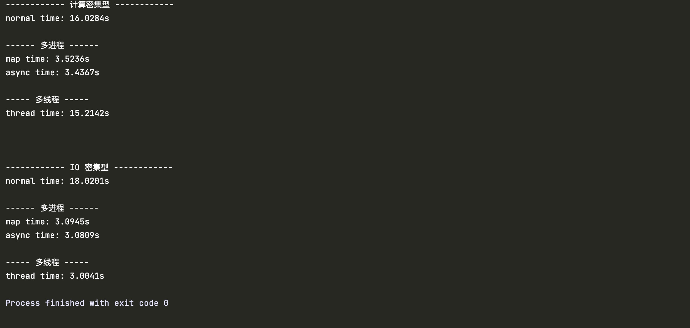](https://img2020.cnblogs.com/blog/1868812/202104/1868812-20210422173736220-234212432.jpg)

|            | 线性执行 | 多进程(map) | 多进程(async) | 多线程   |
| :--------- | :------- | :---------- | :------------ | :------- |
| 计算密集型 | 16.0284s | 3.5236s     | 3.4367s       | 15.2142s |
| IO密集型   | 18.0201s | 3.0945s     | 3.0809s       | 3.0041s  |


结论

从表格中很明显的可以看出：

- 计算密集型任务的速度：多进程 >多线程> 单进程/线程
- IO密集型任务速度： 多线程 > 多进程 > 单进程/线程。

**所以，针对计算密集型任务使用多进程，针对IO密集型任务使用多线程**


# 协程

https://www.bilibili.com/video/BV1AB4y197k6/?spm_id_from=333.788&vd_source=f79519d2285c777c4e2b2513f5ef101a


## 使用Iterator进行迭代


###  可迭代的

在对容器进行迭代的时候, 我们可以使用`for in`来进行迭代

他的原理是: 

1. python会对for in的容器, 调用其`__iter__`方法, 来生成一个迭代器
  2. 然后python会调用迭代器的`__next__`方法来获取下一个元素, 如果没有下一个元素, 那么该方法应该抛出一个StopIteration异常
  3. for in会捕获这个StopIteration异常, 并退出循环

我们可以通过一个while循环来演示for in的执行过程

~~~python
list = [1, 2, 3, 4]
for i in list:
    ...
    
# 等效于

iter = list.__iter__()
while True:
    try:
        i = iter.__next__()
        # do something with i
    except StopIteration:
    	break
~~~


下面是一个自定义的容器

~~~python
class MyMyDataIterator:
    def __init__(self, data):
        self.data = data
        self.index = -1
    def __next__(self):
        self.index += 1
        if self.index < self.data.size:
            return self.data.get_value(self.index)
        else:
            raise StopIteration
            
class MyData:
    # 省略部分代码
    @property
    def size(self):
        return self.size
    
    def get_value(self, index): # 通过索引获取值
        return index
    
    def __iter__(self):
        return MyDataIterator(self)
~~~


### 迭代器也可以是可迭代的

上面说到, 如果一个对象具有\__iter__函数, 那么他是可迭代的

如果一个对象具有\__next__函数, 那么他是迭代器


那么我们可以在一个类同时实现上述两个方法, 那么他即使可迭代的, 也是迭代器

~~~python
class MyList:
    """MyList 实现了迭代器协议 它的实例就是一个迭代器"""

    def __init__(self, list):
        self.idx = 0
        self.list = list

    # 该函数返回一个迭代器对象, 迭代器对象需要有__next__方法
    def __iter__(self):
        print('__iter__')
        return self

    # 该函数返回迭代的元素, 如果迭代结束, 抛出StopIteration异常
    def __next__(self):
        if self.idx < len(self.list):
            val = self.list[self.idx]
            self.idx += 1
            return val
        else:
            raise StopIteration()

# 迭代元素
a = MyList([1,4,6,846,4156,416,541,65,5,64,56,56,4,6,5])
for i in a:
    print(i)
"""
注意a对象只能迭代一次, 如果要迭代多次, 需要单独返回一个迭代器独享
"""
for i in a:
    print(i)
~~~

**上面我们创建了一个类, 他既是迭代器, 又是可迭代的, 但是需要注意, 这样会导致这个类只能被迭代一次**

这样的做法有两个重要的应用场景:

1. 作为数据源

   ~~~python
   from random import random
   
   class Range:
       def __iter__(self, max):
           self.idx = -1
           self.max = max
           return self
       def __next__(self):
           self.idx += 1
           if self.idx < self.max:
               return self.idx
           else:
               raise StopIteration
   ~~~

2. 作为数据管道, 实现一定的数据处理逻辑

   即一个迭代器内部可以拥有另外一个迭代器, 在迭代的时候交由内部的迭代器去迭代, 然后进行一定的数据处理

   ~~~python
   class ActionIterator:
       def __init__(self, iterable, action):
           self.action = action
           self.iter = iterable.__iter__() # 内部保存有另一个迭代器
   
       def __iter__(self):
           return self
   
       def __next__(self):
           while True:
               result = self.iter.__next__() # 这里有可能抛出
               transformed = self.action(result) # 交由action进行一定的数据处理
               if transformed is not None: # 如果返回值不为null, 那么return, 否则下一次循环
                   return transformed
   
   
   class FilterIterator(ActionIterator):
       def __init__(self, iterable, action):
           def filter(args):
               return args if action(args) else None
   
           # action就是不符合条件的返回None
           super().__init__(iterable, filter)
   
   
   class PlusIterator(ActionIterator):
       def __init__(self, iterable, num):
           def plus(args):
               return args + num
   
           # action是给每一个数据都加上num
           super().__init__(iterable, plus)
   
   
   if __name__ == '__main__':
       iterable = [1, 2, 3, 3]
   
       filter = FilterIterator(iterable, lambda x: x > 1) # 只保留大于1的数
       plus = PlusIterator(filter, 3) # 每个数都加3
       for i in plus: # 注意只能迭代一次
           print(i)
   ~~~

   

## 使用yield进行迭代

yield关键字是在python2.2的PEP252中引进的,  他的作用主要是为了作为增强型的生成器


### yield的作用

1. 如果一个函数中具有yield关键字,  那么在调用他的时候, 他不会执行函数, 而是返回一个可迭代的generator(生成器)对象, 并且给函数传递的参数他也会保存下来

   ~~~python
   import inspect
   
   def gen():
       for i in range(4):
           yield i
   g = gen()
   print(inspect.isfunction(gen)) # 判断是不是函数, True
   print(inspect.isgeneratorfunction(gen)) # 判断函数是不是返回生成器, True
   
   print(inspect.isgenerator(gen)) # 判断是不是生成器, False
   print(inspect.isgenerator(g)) # 判断是不是生成器, True
   ~~~

2. 返回的generator是一个可迭代的迭代器对象, 即具有

   - \__iter__: 返回迭代器对象自身
   - \__next__: 每次返回一个迭代器对象, 如果没有数据, 就抛出StopIteration

3. **我们可以通过`next(generator)` 或者 `generator.__next__()`来真正的开始/继续执行这个函数**

4. **当函数执行的时候**, 如果碰到了yield, 那么他会保存调用栈, 然后返回yield的值, 作为`next`的返回值

5. **当函数在执行的时候退出了, 或者碰到了return, 那么会抛出StopIteration并携带return的值, 没有return值就携带None**

6. 生成器具有4个状态

   - **当调用生成器函数创建一个生成器的时候, 此时处于初始状态**
   - **当调用next()方法, 生成器还是开始执行生成器函数, 此时处于运行状态**
   - **当执行函数时, 碰到了yield关键字, 此时会返回next函数, 此时生成器处于暂停状态**
   - **当函数执行完毕时, 抛出StopIteration, 此时生成器处于结束状态**

测试代码如下:

~~~python
def gen(i):
    print(f"gen开始执行, 接受到参数{i}")
    yield i # 程序碰到yield, 并保存调用栈, 并返回i
    print("gen继续执行")
    i += 1
    yield i
    print("gen继续执行")
    i += 1
    yield i
    print("gen函数退出, 抛出StopIteration")
    return "return value"


if __name__ == '__main__':
    g = gen(3)  # 传递参数给gen, 这里不是执行函数, 而是返回一个生成器
    result = next(g) # 调用next()开始执行gen函数
    print(f"第一次调用next, 接受到返回值{result}")

    print("----------------")
    result = g.__next__()  # 调用__next__()继续执行gen函数
    print(f"第一次调用next, 接受到返回值{result}")

    print("----------------")
    result = g.__next__()  # 调用__next__()继续执行gen函数
    print(f"第一次调用next, 接受到返回值{result}")

    print("----------------")
    try:
        result = g.__next__()
    except StopIteration as e:
        print(f"捕获到StopIteration, 携带的返回值为: {e.value}")
# 输出
gen开始执行, 接受到参数3
第一次调用next, 接受到返回值3
----------------
gen继续执行
第一次调用next, 接受到返回值4
----------------
gen继续执行
第一次调用next, 接受到返回值5
----------------
gen函数退出, 抛出StopIteration
捕获到StopIteration, 携带的返回值为: return value
~~~


既然yield函数创建的生成器具有`__next__`和`__iter__`函数, 那么他可以用于for in 循环

~~~python
def range(n):
    for i in range(n):
        yield i

if __name__ == '__main__':
    g = range(3)  # 传递参数给gen, 这里不是执行函数, 而是返回一个生成器
    for i in g:  # 对g调用for循环, 实际上是调用g.__next__()
        print(i)
~~~


### yield的原理

yield和return很像,  都是从函数中返回, 并返回一个值

yield和return的区别在于:

- return会退出调用栈, 销毁局部变量
- yield不会退出调用栈,  而是保存当前的调用栈, 暂停函数, 返回yield的值, 并在下一次执行`next()`方法时从当前位置继续运行，直到生成器被全部遍历完。

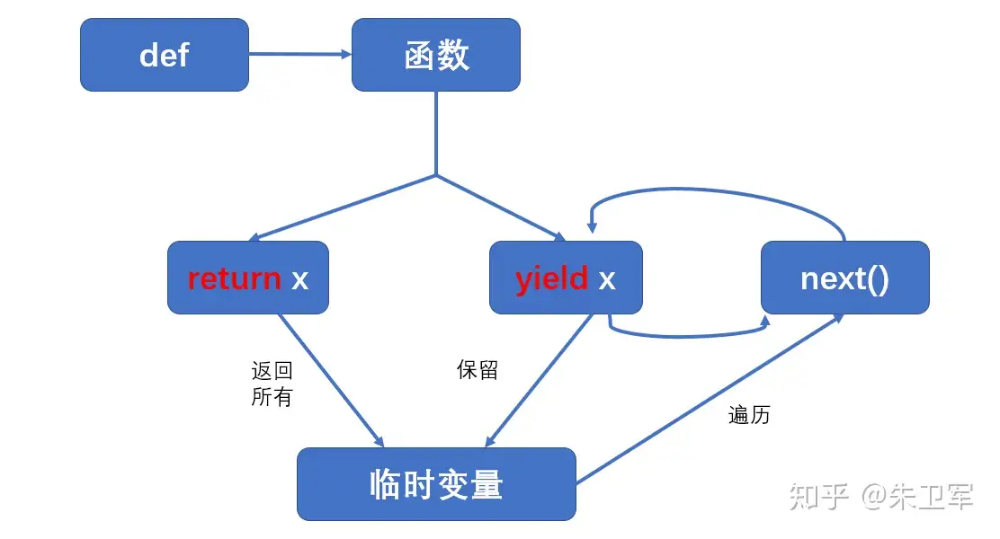


具体详细的原理可以查看, 讲的非常的透彻

 https://www.bilibili.com/video/BV1ba411J7qS/?spm_id_from=333.788&vd_source=f79519d2285c777c4e2b2513f5ef101a


### yield能够实现的功能

1. 可以快速的创建一个可迭代的类

   假设我们想要创建一个可迭代的容器, 如果没有yield, 那么我们使用class来实现, 必须这样做

   ~~~python
   class MyMyDataIterator:
       def __init__(self, data):
           self.data = data
           self.index = -1
       def __next__(self):
           self.index += 1
           if self.index < self.data.size:
               return self.data.get_value(self.index)
           else:
               raise StopIteration
               
   class MyData:
       # 省略部分代码
       @property
       def size(self):
           return self.size
       
       def get_value(self, index): # 通过索引获取值
           return index
       
       def __iter__(self):
           return MyDataIterator(self)
   ~~~

   有了yield之后, 我们完全可以通过yield来创建一个可迭代的类:

   ~~~python
   class MyData:
       # 省略部分代码
       @property
       def size(self):
           return self.size
       
       def get_value(self, index):
           return index
       
       def __iter__(self): # 每次调用__iter__都会返回一个生成器
           index = -1  # 使用局部变量记录迭代的位置
           while index < 2:
               index += 1
               yield self.get_value(index)
   ~~~

   下面是通过yield创建生成器来迭代, 与通过class创建迭代器来迭代的区别

   | 动作           | class实现迭代器                                    | yield生成器          |
   | -------------- | -------------------------------------------------- | -------------------- |
   | 定义迭代器     | class Iterator:<br>    def \__init__(self, *args): | def iter_fun(*args): |
   | 创建迭代器     | Iterator(args)                                     | iter_fun(args)       |
   | next(iterator) | def \__next__(self): return value                  | yield value          |
   | StopIteration  | raise StopIteration                                | return               |
   | iter(iterator) | def \__iter__(self): return self                   | 自动实现             |

2. 多个yield之间构成数据管道, 进行数据处理

   如果没有yield时, 我们需要这样做

   ~~~python
   class ActionIterator:
       def __init__(self, iterable, action):
           self.action = action
           self.iter = iterable.__iter__() # 内部保存有另一个迭代器
   
       def __iter__(self):
           return self
   
       def __next__(self):
           while True:
               result = self.iter.__next__() # 这里有可能抛出
               transformed = self.action(result) # 交由action进行一定的数据处理
               if transformed is not None: # 如果返回值不为null, 那么return, 否则下一次循环
                   return transformed
   
   
   class FilterIterator(ActionIterator):
       def __init__(self, iterable, action):
           def filter(args):
               return args if action(args) else None
   
           # action就是不符合条件的返回None
           super().__init__(iterable, filter)
   
   
   class PlusIterator(ActionIterator):
       def __init__(self, iterable, num):
           def plus(args):
               return args + num
   
           # action是给每一个数据都加上num
           super().__init__(iterable, plus)
   
   
   if __name__ == '__main__':
       iterable = [1, 2, 3, 3]
   
       filter = FilterIterator(iterable, lambda x: x > 1) # 只保留大于1的数
       plus = PlusIterator(filter, 3) # 每个数都加3
       for i in plus: # 注意只能迭代一次
           print(i)
   ~~~

   而如果有了yield之后, 那么我们就可以

   ~~~python
   def action_iter(iterable, action):
       iter = iterable.__iter__()
       while True:
           try:
               result = iter.__next__()
               transformed = action(result)
               if transformed is not None:
                   yield transformed
               else:
                   continue
           except StopIteration:
               return
   
   
   def filter(iterable, predicate):
       f = lambda x: x if predicate(x) else None
       return action_iter(iterable, f)
   
   
   def plus(iterable, num):
       f = lambda x: x + num
       return action_iter(iterable, f)
   
   
   if __name__ == '__main__':
       iterable = [1, 2, 3, 3]
       filtered = filter(iterable, lambda x: x > 1)  # 只保留大于1的数
       plused = plus(filtered, 3)  # 每个数都加3
       for i in plused:  # 注意只能迭代一次
           print(i)
   ~~~

3. 通过一个yield来产生一个数据源

   如果没有yield时, 我们想要实现一个range, 可以使用如下代码

   ~~~python
   class Range:
       def __iter__(self, max):
           self.idx = -1
           self.max = max
           return self
       def __next__(self):
           self.idx += 1
           if self.idx < self.max:
               return self.idx
           else:
               raise StopIteration
   ~~~

   而有了yield之后, 我们可以使用如下代码

   ~~~python
   def range(max):
       idx = 0
       while idx < max:
           yield idx
           idx += 1
   ~~~

   

### 生成器表达式

除了使用yield来快速的创建一个生成器, 我们还可以使用生成器表达式来快速创建一个生成器

~~~python
g = (i for i in range(5))
# 等效于
def gen(n):
    for i in range(n):
        yield i
g = gen(5)

print(g, type(g), g == g.__iter__()) # 生成器返回的迭代器对象是他本身
# 通过for in 来迭代这个迭代器
for i in g:
    print(i)
~~~

下面是使用生成器表达式来快速创建一个可迭代的类

~~~python
class MyList:
    def __init__(self, n):
        self.n = n
    def __iter__(self):
        return (i for i in range(self.n))
for i in MyList(10):
    print(i)
~~~


## yield作为表达式


### send

上面我们说到, yield起初是在python2.2的PEP252中被引入的, 他的作用只是实现一个增强型的生成器, 用于迭代

~~~python
def gen(n):
    for i in range(n):
        yield i
g = gen(5)
for i in g:
    print(i)
~~~

**此时yield是作为语句存在的, 即他只能将yield后面的值发送出去**


而在Python2.5的PEP342中, 对yield进行了增强, 让他从语句升级为了表达式, **即他不仅可以将yield后面的值发送出去, 还可以返回一个值,  这就为协程的实现奠定了基础**


在PEP342中, 为generator添加了一个新的函数send, 这个方法和next方法类似, 都是恢复生成器的执行

不同的点在于send可以接收一个参数,  这个参数在恢复执行的时候会作为yield的返回值返回

此时`next(generator)`就等效于`generator.send(None)`

~~~python
def gen(init):
    print("gen开始执行")
    i = init
    n = yield i  # 程序碰到yield, 并保存调用栈, 并返回i

    print(f"gen继续执行, 接收到send的参数: {n}")
    i += n
    n = yield i

    print(f"gen继续执行, 接收到send的参数: {n}")
    i += n
    n = yield i
    print(f"gen继续执行, 接收到send的参数: {n}")
    print("gen()函数退出, 抛出StopIteration")


if __name__ == '__main__':
    g = gen(3)  # 传递参数给gen, 这里不是执行函数, 而是返回一个生成器
    print("----------------")
    print(g.send(None))  # 开始执行函数, 此时必须send必须传入None
    print("----------------")
    print(g.send(2))  # 继续执行函数, 传入参数2, 他会作为yield的返回值
    print("----------------")
    print(g.send(3))  # 继续执行函数, 传入参数2, 他会作为yield的返回值
    print("----------------")
    try:
        print(g.send(4))  # 继续执行函数
    except StopIteration:
        print("捕获了StopIteration")
    print("----------------")

    
# 打印
----------------
gen开始执行
3
----------------
gen继续执行, 接收到send的参数: 2
5
----------------
gen继续执行, 接收到send的参数: 3
8
----------------
gen继续执行, 接收到send的参数: 4
gen()函数退出, 抛出StopIteration
捕获了StopIteration
----------------
~~~


### yield参与运算

上面我们说到, yield被升级为了一个表达式, 既然是表达式, 那么他就可以参与计算, 作为参数

~~~python
def add_yield_value():
    # yield在参与计算的时候需要加上括号
    # 否则yield + 1中的加号会被解析为正号, yield + 1被解析为yield 1
    x = (yield) + 1 
    print(f"x is {x}")
    
g = add_yield_value()
g.send(None) # 预激生成器
g.send(3)
~~~

同时yield还可以作为参数

~~~python
def add_yield_value():
    # 需要使用括号报告yield, 让他的返回值作为参数
    print((yield))
    
g = add_yield_value()
g.send(None) # 预激生成器
g.send(3)    
~~~


### yield的其他方法

当生成器作为迭代器来使用时,  他的生命周期取决于有多少个元素可以迭代

而如果当做协程来使用的时候, 通常视作是在执行一个任务, 我们希望任务的终止变得可控, 所以新增了一个close方法来结束协程

~~~python
def gen_echo():
    while 1:
        try:
            x = yield
        except GeneratorExit:
            print("exit, bye")  # 这里可以处理善后, 比如释放资源
            return  # 接受到GeneratorExit, 必须return
        else:
            print(x)


g = gen_echo()
g.send(None)

g.send("hello")
g.send("world")
g.close()
# 输出
hello
world
exit, bye
~~~


同时Generator还有一个throw方法, 他和close方法类似, 也是让yield抛出异常,  但是这个异常类型可以自定义

并且在捕获异常之后, 我们不必退出

如果这个异常没有捕获, 那么会导致throw抛出这个异常

~~~python
def gen_echo():
    while 1:
        try:
            x = yield
        except GeneratorExit:
            print("exit, bye")  # 这里可以处理善后, 比如释放资源
            return  # 接受到GeneratorExit, 必须return
        except KeyboardInterrupt:
            print("接收到KeyBoardInterrupt, 但是不退出")
        else:
            print(x)


g = gen_echo()
g.send(None)

g.send("hello")
g.send("world")
# g.close()
g.throw(KeyboardInterrupt)
g.throw(RuntimeError)  # 传入一个RuntimeError, gen_echo处理不了, 会导致throw抛出这个异常

# 输出
hello
world
接收到KeyBoardInterrupt, 但是不退出
Traceback (most recent call last):
  File "C:/Users/Administrator/Desktop/startdjango/book/yield5.py", line 4, in gen_echo
    x = yield
RuntimeError
~~~


## yield from

yield from是在python3.3的PEP380中引入进来的


**yield from 后面必须跟一个可迭代对象, 也就是必须有`__iter__`方法, 一般就是生成器**

**yield from具有返回值, 返回值就是生成器return的结果**

**如果一个函数里面有yield from关键字, 那么他也会返回一个生成器**


### yield from的原理

`RESULT = yield from EXPR`等效于如下代码

~~~python
_i = iter(EXPR) # 获取子生成器

try:
    _y = next(_i) # 预激活生成器
except StopIteration as _e: # 一次yield都没有碰到, 直接结束了
    _r = _e.value # _e.value就是生成器函数的返回值

else:
    while 1:
        try:
            _s = yield _y # 不管子生成器yield什么值出来, 都原样yield出去, 并接受send的值
        except GeneratorExit as _e: # 处理close
            try:
                _m = _i.close
            except AttributeError:
                pass
            else:
                _m()
            raise _e
        except BaseException as _e: # 处理其他异常
            _x = sys.exc_info()
            try:
                _m = _i.throw
            except AttributeError:
                raise _e
            else:
                try:
                    _y = _m(*_x)
                except StopIteration as _e:
                    _r = _e.value
                    break
        else:
            try:
                if _s is None:
                    _y = next(_i)
                else:
                    _y = _i.send(_s) # 不管外部函数send什么进来, 都send到生成器函数中
            except StopIteration as _e:
                _r = _e.value
                break
RESULT = _r # StopIteration带出来的就是生成器函数return的值
~~~

上面的代码经过简化之后如下

~~~python
_i = iter(EXPR) # 获取子生成器

try:
    _y = _i.send(None) # prime
except StopIteration as _e: # 一次yield都没有碰到, 直接结束了
    _r = _e.value # _e.value就是生成器函数的返回值

else:
    while 1:
        try:
            _s = yield _y # 不管子生成器yield什么值出来, 都原样yield出去, 并接受send的值
	    except:
           pass 
        else:
            try:
                _y = _i.send(_s) # 不管外部函数send什么进来, 都send到生成器函数中
            except StopIteration as _e:
                _r = _e.value
                break
RESULT = _r # StopIteration带出来的就是生成器函数return的值
~~~

实际上, 一般的情况下, 外部函数只会`send(None)`来调用, 所以我们的代码还可以简化为

~~~python
_i = iter(EXPR)

while 1:
    try:
        _y = _i.send(None)
    except StopIteration as _e:
        _r = _e.value
        break
    else:
        yield _y
RESULT = _r
~~~

实际上上面的代码的作用就是**透传**

1. **外部函数一直send到yield from,  yield from就send到子生成器**
2. **子生成器在执行的时候, 如果碰到了yield, 就会返回一个值出来, 那么yield from也把这个值yield出去**
3. **当子生成器执行完毕后, 会抛出StopIteration, yield from就会把它捕获, 并作为yield from的返回值**

**这样的话, 在函数嵌套调用的时候, 多个yield from就会形成一个数据通道**

**外层调用send的时候, 执行生成器, 经过yield from, 又回send到下一层生成器, 碰到yield from又回send到下一层生成器, 直到没有yield from的最底层**

**同时最底层调用yield的时候, yield from接收到值之后又回yield到外层, 外层接受到值之后, 经过yield from, 又回yield到外外层, 直到没有yield from的最外层**


### yield from的作用

下面是yield from的执行过程

~~~python
def small_step(x):
    print(f"执行step1")
    yield
    print(f"执行step2")
    yield
    print(f"执行step3")
    yield
    print(f"执行step4")
    print(f"整个函数执行完毕")
    return x + 1

def big_step():
    print(f"开始执行big step")
    small_result = yield from small_step(3)
    print(f"结束执行big step, 结果为{small_result}")
    print("开始执行其他步骤")
    print("执行其他步骤完毕, 返回结果")
    return small_result + 1

def super_step():
    print("开始执行super_step")
    print("调用big_step")
    big_coro = big_step()
    big_result = yield from big_coro
    print(f"调用big_step执行完毕, 结果为{big_result}")
    print("执行其他步骤, 返回结果")
    return big_result + 1


super_coro = super_step()
print("1----------")
super_coro.send(None)
print("2----------")
super_coro.send(None)
print("3----------")
super_coro.send(None)
print("4----------")
try:
    # 这一步会抛出StopIteration, 应为big_step执行完毕
    super_coro.send(None)  
except StopIteration as e:
    result = e.value
    print(f"获取到super的结果, {result}")
~~~

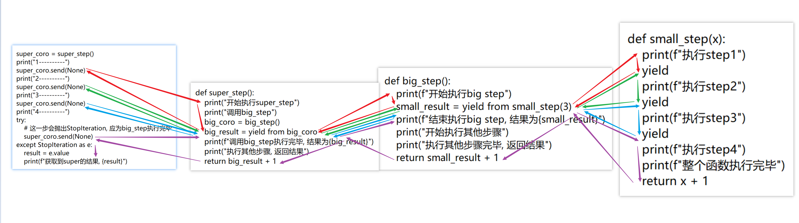

上面的代码和下面这段同步的代码很像

~~~python
def small_step(x):
    print(f"执行step1")
    print(f"执行step2")
    print(f"执行step3")
    print(f"执行step4")
    print(f"整个函数执行完毕")
    return x + 1

def big_step():
    print(f"开始执行big step")
    small_result = small_step(3)
    print(f"结束执行big step, 结果为{small_result}")
    print("开始执行其他步骤")
    print("执行其他步骤完毕, 返回结果")
    return small_result + 1

def super_step():
    print("开始执行super_step")
    print("调用big_step")
    big_result = big_step()
    print(f"调用big_step执行完毕, 结果为{big_result}")
    print("执行其他步骤, 返回结果")
    return big_result + 1


super_result = super_step() # 输出结果为6
~~~

但是一个使用的是协程的方式, 另外一个使用的是同步调用的方式

**实际上yield from会出现的作用就是通过多个yield from构成数据通道, 让我们能够以同步的代码风格来编写协程**


## 从yield到await的演进过程

第一步, 有如下三个同步函数

~~~python
from time import sleep

def one_task():
    print(f"begin task")
    ...  # 执行其他步骤
    print(f"    begin big step")
    big_result = big_step()
    print(f"    end big_step with {big_result}")
    print("end task")


def big_step():
    print("         begin small step")
    small_result = small_step()
    print(f"        end small step with {small_result}")
    return small_result * 1000


def small_step():
    print("             休息一下, 马上回来")
    sleep(2)
    print("             努力工作中")
    return 123

one_task()
~~~


第二步

~~~python
from time import sleep


def one_task():
    print(f"begin task")
    ...  # 执行其他步骤
    print(f"    begin big step")

    # big_result = big_step()

    # big_coro = big_step()
    # while 1:
    #     try:
    #         x = big_coro.send(None)
    #     except StopIteration as e:
    #         big_result = e.value
    #         break
    #     else:
    #         func, args = x()
    #         func(x)

    big_result = yield from big_step()

    print(f"    end big_step with {big_result}")
    print("end task")


def big_step():
    print("         begin small step")
    # small_result = small_step()

    # small_coro = small_step()
    # while 1:
    #     try:
    #         x = small_coro.send(None)
    #     except StopIteration as e:
    #         small_result = e.value
    #         break
    #     else:
    #         yield x
    small_result = yield from small_step()

    print(f"        end small step with {small_result}")
    return small_result * 1000


def small_step():
    print("             休息一下, 马上回来")
    # sleep(2)

    # yield sleep(2)

    yield from YieldFromAble((sleep, 2))
    print("             努力工作中")
    return 123


class YieldFromAble:
    def __init__(self, value):
        self.value = value

    def __iter__(self):
        yield self


class Task:
    def __init__(self, coro):
        self.coro = coro
        self._result = None
        self._done = False

    def run(self):
        while 1:
            try:
                x = self.coro.send(None)
            except StopIteration as e:
                self._result = e.value
                self._done = True
                break
            else:
                func, args = x.value
                func(args)


t = Task(one_task())
t.run()
~~~

第三步

~~~python
import collections
import heapq
import itertools
import random
import threading
from time import sleep, time


async def one_task():
    print(f"begin task")
    ...  # 执行其他步骤
    print(f"    begin big step")

    big_result = await big_step()

    print(f"    end big_step with {big_result}")
    print("end task")


async def big_step():
    print("         begin small step")

    small_result = await small_step()

    print(f"        end small step with {small_result}")
    return small_result * 1000


async def small_step():
    print("             休息一下, 马上回来")

    # 这里最主要的就是, 就是在await之前, 将一个要等待的操作与future关联起来
    # 比如io操作, 一旦变得可读可写, 就要set_future的值
    # 然后再Future中就会调用callback, 然后callback中再次调用run, 然后调用send, 再次回到这里
    fut = Future()
    fake_io(fut)

    await fut

    print("             努力工作中")
    return 123


def fake_io(future):
    def read():
        # 实际上这里要调用nio
        sleep(random.random()) # 假装io堵塞, 或者网络堵塞
        future.set_result(123) # 假设读取到了文件内容, 设置到future中
    threading.Thread(target=read).start()

class Future:
    def __init__(self):
        self._result = None
        self._done = False
        self._callback = []
        global loop
        self.event_loop = loop

    def set_result(self, result):
        if self._done:
            raise RuntimeError('future already done')
        self._result = result
        self._done = True

        for cb in self.callback:
            self.event_loop.call_soon(cb)

    def result(self):
        if self._done:
            return self._done
        raise RuntimeError("future is not done")

    def add_done_callback(self, callback):
        self._callback.append(callback)

    def __await__(self):
        yield self  # 当await future的时候, 把自己yield 出去

        # 当调用了set_result()时, 会调用callback,
        # 而Task里面就添加了一个回调, 用来执行Task.run
        # Task.run又会调用send, 导致这里的yield返回
        # 所以这里肯定可以获取回调
        return self.result()

    __iter__ = __await__  # iter函数就是await函数


class Task(Future):
    def __init__(self, coro):
        super().__init__()
        self.coro = coro
        # self._done = False
        # self._result = None
        self._id = f'Task-{next(task_id_counter)}'
        self.event_loop.call_soon(self.run) # 创建Task的时候, 就自动跑起来

    def run(self):
        print(f'-------{self._id}-------------')
        if not self._done:
            try:
                x = self.coro.send(None)
            except StopIteration as e:
                # self._result = e.value
                # self._done = True
                self.set_result(e.value)
            else:
                # yield出来的一定是一个Future, 因为Future实现了__await__
                assert isinstance(x, Future)

                # 在回调中添加一个self.run
                # 只要调用了set_result, 就会调用run, 继续执行协程
                x.add_done_callback(self.run)
        else:
            print("task is down")


task_id_counter = itertools.count(1)


class EventLoop:
    def __init__(self):
        self._ready = collections.deque()
        self._scheduled = []
        self._stopping = False

    def call_soon(self, callback, *args):
        self._ready.append((callback, args))

    def call_later(self, delay, callback, *args):
        t = time() + delay
        heapq.heappush(self._scheduled, (t, callback, args))

    def stop(self):
        self._stopping = True

    def run_forever(self):
        while 1:  # 保证至少执行一轮
            self.run_once()
            if self._stopping:
                break

    def run_once(self):
        now = time()
        if self._scheduled:
            if self._scheduled[0][0] < now:
                _, callback, args = heapq.heappop(self._scheduled)
                self._ready.append((callback, args))

        num = len(self._ready)
        for i in range(num):
            callback, args = self._ready.popleft()
            callback(*args)


if __name__ == '__main__':
    loop = EventLoop()

    for i in range(10):
        t = Task(one_task())


    loop.call_later(1, loop.stop) # 1秒后关闭调度器

    loop.run_forever()  # 启动调度器
~~~


## asyncio

asyncio是在python3.4的PEP3156中引入的, 作用主要是用来支持协程的

在python3.5的PEP492中又引入了async和await两个关键字, 作为协程的新语法


在asyncio中, 有几个重要的概念

1. event_loop

   一个事件循环, 在while循环中不停的调用协程, 类似于netty中的event_loop

2. coroutine

   与Generator类似, 表示一个协程

   1. coroutine执行完毕后, 会抛出一个StopIteration异常, 并携带返回值 
   2. coroutine对象和生成器类似, 具有send, throw, close函数, 也就意味着还是可以调用send来启动一个协程
   3. 如果函数被标记为了async, 那么对函数的调用不再是执行他, 而是返回一个coroutine对象  (类似生成器)
   4. Coroutine类继承自Awaitable, 所以await后面可以跟一个coroutine

   ~~~python
   # 通过async来定义一个协程函数
   async def hello(name):
       result = f"Hello, {name}"
       time.sleep(1)
       return result
   
   # 获取到协程
   coroutine = hello("zhangsan")
   assert isinstance(coroutine, Coroutine) is True
   
   
   # 通过asyncio的注解来定义一个协程
   # 本质上是一个Generator, 但是可以当做协程来使用
   @asyncio.coroutine
   def hello1(name):
       result = f"Hello, {name}"
       # 异步调用asyncio.sleep(1):
       yield from asyncio.sleep(1)
       return result
   asyncio_coro = hello1("zhangsan")
   assert isinstance(asyncio_coro, Generator) is True
   assert isinstance(asyncio_coro, Coroutine) is False
   ~~~

   

3. future

   类似于netty中的Promise

   注意, Future实现了Awaitable, 所以可以await一个Future

   ~~~python
   fut = Future()
   fut.add_done_callback(print, "hello world") # 添加回调
   
   fut.set_result(1234) # 设置Future的结果
   fut.result() # 获得Future的结果
   
   fut.set_exception(RuntimeError) # 设置Future出现的异常
   fut.exception() # 获取Future的异常
   
   fut.done() # 判断Future是否执行完毕
   fut.cancel("") # 取消Future
   fut.cancelled() # 判断是否取消
   
   fut.add_done_callback(xxx) # 添加callback
   fut.remove_done_callback(xxx) # 移除callback
   
   fut.get_loop() # 返回Future关联的EventLoop
   ~~~

   

4. task

   task继承了Future, 所以Future中可用的方法都可以在Task中使用, 同时可以对一个task进行await

   

   Task主要的作用就是封装一个Coroutine,  然后再在Future中添加一个回调, 用来不停的用send来驱动Coroutine进行执行,  所以一个协程必须通过Task包装, 才可以通过asyncio放到event_loop中执行

   

   因为Task是对一个协程的包装, 所以可以通过cancel, done, result, cancelled来对协程的执行进行一定的控制, 同时也可以添加callback来对协程进行监听

   

   Task与Future相比差别很少, 就多个一个name属性, 还有一个coroutine属性

5. async/await

   await和yield from的作用是类似的, 或者说await就是yield改了一个名字

   作用和yield from也一样, 多个await连在一起作为数据通道

   1. yield from后面跟的对象必须是可迭代的, 也就是有`__iter__`函数

      await后面跟的对象必须具有`__await__`函数,  或者继承父类`Awaitable`

   2. 如果函数被标记为了async, 那么对函数的调用不再是执行他, 而是返回一个coroutine对象  (类似生成器)

   3. await只能够在async函数中使用

      async从底层来说其实可以不用加, 但是语法要求必须加上, 估计是加上可以提现调用者他返回的是coroutine

   4. await的源码就是

      ~~~python
      result = await EXPR
      # 等效于
      
      _i = EXPR.__await__()
      while 1:
          try:
              _y = _i.send(None)
          except StopIteration as _e:
              _r = _e.value
              break
          else:
              yield _y
      RESULT = _r
      ~~~

      

   下面是Awaitable和Coroutine的源码

   ~~~python
   class Awaitable(metaclass=ABCMeta):
       __slots__ = ()
   
       @abstractmethod
       def __await__(self):
           yield
   
       @classmethod
       def __subclasshook__(cls, C):
           if cls is Awaitable:
               return _check_methods(C, "__await__")
           return NotImplemented
       
       
   class Coroutine(Awaitable):
       __slots__ = ()
   
       @abstractmethod
       def send(self, value):
           ...
   
       @abstractmethod
       def throw(self, typ, val=None, tb=None):
           ...
   
       def close(self):
           ...
           
       @classmethod
       def __subclasshook__(cls, C):
           if cls is Coroutine:
               return _check_methods(C, '__await__', 'send', 'throw', 'close')
           return NotImplemented
   ~~~


### event_loop的执行原理

首先我们会使用`asyncio.get_event_loop`获得与当前线程绑定的`_running_loop`, 如果没有那么该方法会自动就创建一个并绑定到`_loop`上, 多次调用只会返回同一个对象

这个函数一般情况下用在事件循环外部

loop中有几个比较重要的变量:
       1. `_ready`: 保存所有已就绪的协程_
       2. `_scheduled`: 保存所有定时调度的协程的列表, 采用小顶堆排序
       3. `_stopping`: 当前loop是否stop
       4. `_closed`: 当前loop是否close

刚创建的loop不会调度任务, 即使`_ready`已经添加了可以调度的协程

我们可以调用`loop.create_task(coroutine)`方法来将一个协程包装为一个task, 该方法还会将task放到`_ready`队列中, 然后返回task

之后我们可以调用`loop.run_until_complete(task)`,  该方法内部会给task添加一个回调函数, 这个函数就是调用`loop.stop()`, 然后调用`loop.run_forever`

调用了run_forever后, loop会将自己设置到当前线程的`_running_loop`上, 并开始一轮又一轮的调度

在每一轮调度的时候, 都会将`_scheduled`中已经就绪的任务, 放到`_ready`中, 然后loop从`_ready`中获取已就绪的任务, 开始执行他们

当我们通过`loop.run_until_complete(task)`添加的task执行完毕之后, 就会调用task的回调函数, 上面说了回调函数内部就是调用`loop.stop`

当调用了stop后, 会将loop的`_stopping`设置为True, 此时loop会在死循环中break出来, 并将`_running_loop`设置为None, 并将`_stopping`设置为False清除这个标记

在stop之后, 还可以调用`run_until_complete`来让loop继续调度

当调用了close后, 会将`_closed`设置为True, 并清除`_ready`,`_scheduled`中的所有任务, 并shutdown executor, close方法必须在stop之后调用

~~~python
async def add(num):
    print(f"receive num: {num}")
    time.sleep(1)
    print("return from add")
    return num + 1

loop = asyncio.get_event_loop()

# 通过协程创建一个task, 并放到调度队列中, 此时还不会调度任务
task = loop.create_task(add(1), name="task1")

# 执行协程, 直到协程执行完毕, 并返回协程的返回值
# 实际上run_until_complete内部就是给task添加了一个callback, 让task执行完毕后再callback中调用stop
# 然后调用run_forever, 这样run_forever开始执行task, 执行完毕执行callback, 然后callback执行stop, 然后死循环break退出
result = loop.run_until_complete(task)
~~~


### 函数说明

asyncio.get_event_loop:

获得与当前线程绑定的`_running_loop`, 如果没有那么该方法会自动就创建一个并绑定到`_loop`上, 多次调用只会返回同一个对象

**这个函数一般情况下用在事件循环外部**


asyncio.get_running_loop:

获取与当前线程绑定的`_running_loop`, 没有就报错

**所以这个函数只能用在事件循环内部, 即async函数内部**


loop.create_task:

接受一个coroutine, 将其包装为task, 并放到loop的`_ready`队列中调度

**一般情况下, 想要添加一个协程到loop中, 就会调用这个函数, 可以在事件循环内部/外部调用**


loop.run_forever:

loop启动死循环, 调度任务, 直到调用了stop将`_stopping`设置为True, 此时会break出来

**这个方法不要自己调用**


loop.stop

将`_stopping`设置为True, 这会导致loop在下一次循环的时候break出来

**这个方法不要自己调用**


loop.close

将loop状态设置为closed, 清空`_ready`和`_shceduled`, 必须在stop方法调用后调用

**一般情况下不要自己调用这个方法**


loop.run_until_complete

接受一个Task或者一个Coroutine, 如果是Coroutine, 就调用loop.create_task来包装为一个Task并放到loop中

堵塞直到Task执行完毕, 然后返回

并给task添加一个回调, 然后调用run_forever开始死循环, 

在loop执行完毕task之后, 会执行回调, 回调内部会调用`loop.stop`来让loop停止调度

~~~python
import asyncio


async def big_step():
    print("开始执行big_step")

    # 想要在协程中执行一个协程, 可以直接await
    result = await small_step()
    result1 = await small_step()

    # 如果有多个想要并发执行的协程, 那么可以如下
    tasks = []
    # 获得正在调度当前协程的loop
    running_loop = asyncio.get_running_loop()
    for second in (3, 3, 3):
        # create_task会直接将协程放到loop中执行
        task = running_loop.create_task(asyncio.sleep(second))
        tasks.append(task)
    # 一个一个的await, 这样可以并发的执行协程
    for task in tasks:
        tasks_result = await task

    # 更好的方式是使用gather, 他接受一系列的coro并将他们封装为task放到loop中调度
    # 当所有任务都执行完毕之后, 返回一个list, 封装所有coro执行的结果
    result_list = await asyncio.gather(*[small_step() for i in range(3)])

    # 还是有一种办法就是调用asyncio.wait来将多个协程合并为一个协程
    down, pending = await asyncio.wait([small_step() for i in range(3)])

    return result


async def small_step():
    print("开始执行small step")
    await asyncio.sleep(2)
    print("停止执行small step")
    return "small"

if __name__ == '__main__':
    ... # do something

    # 方式1, 传入一个task
    loop = asyncio.get_event_loop() # 创建一个事件循环
    task1 = loop.create_task(big_step(), name="big step") # 放入loop中准备调度
    task1.add_done_callback(lambda x: print(x)) # 添加回调
    result = loop.run_until_complete(task1) # 开始调度

    # 方式2, 传入一个协程
    loop1 = asyncio.get_event_loop()
    # 传入一个协程, 内部会自动调用create_task
    loop1.run_until_complete(big_step())
~~~


asyncio.run

接受一个协程或者一个task, 类似`loop.run_until_complete`, 堵塞直到任务执行完毕, 并返回任务的返回值

只能放在事件循环外部调用, 换句话说, 只能在同步方法中调用

内部其实就是`get_event_loop()`, 然后调用`loop.run_until_complete`, run方法结束的时候, 会将`_loop`设置为None, 所以会导致后续的一些asyncio方法无法执行

**所以一般一个程序只会有一个`asyncio.run`方法, 用来执行main函数**

~~~python
async def main():
    ...
    
if __name__ == '__main__':
    asyncio.run(main())
~~~


asyncio.create_task:

接受一个coroutine, 获取与当前线程绑定的`_running_loop`, 然后调用`loop.create_task`将其包装为一个task, 并将其放到与当前线程绑定的`_running_loop`中进行调度, 然后返回task

**这个函数只能在事件循环内部调用**, 即在async函数内部调用, 因为只有eventloop驱动async函数执行的时候`_running_loop`才不为None

~~~python
async def func1():
    print("开始执行func1")

    f2 = asyncio.create_task(func2(), name="func2") # 创建一个task, 并放到loop中调度
    f = asyncio.ensure_future(func2()) # 创建一个task, 放到loop中调度
    f2_result = await f2
    f_result = await f

    print("结束执行func1")
    return "func1"


async def func2():
    print("开始执行func2")
    await asyncio.sleep(1)
    print("结束执行func2")
    return "func2"


if __name__ == '__main__':
    # 通过get_event_loop获取一个loop, 创建一个task,将task放到loop的_ready中
    task = asyncio.ensure_future(func1()) 
    # asyncio.create_task(func1()) # 这里不能调用create_task
    # 开始调度loop, 并等待task执行完毕
    result = asyncio.run(task)
~~~


asyncio.ensure_future:   

接受一个task或者coroutine, 调用`asyncio.get_event_loop()`来获取一个loop, 确保返回的是task并放到了loop中进行调度

- 如果是coroutine, 那么就调用`loop.create_task()`来将coroutine包装为task, create_task的时候会将task添加到loop中进行调度,  然后返回task
- 如果是task,  那么这个task可定是通过`loop.create_task`创建出来的, 已经loop的在调度中, 所以不做任何事情, 直接返回

**这个函数既可以在事件循环内部使用, 也可以在事件循环外部使用**

~~~python
async def func1():
    print("开始执行func1")

    f2 = asyncio.create_task(func2(), name="func2") # 创建一个task, 并放到loop中调度
    f = asyncio.ensure_future(func2()) # 创建一个task, 放到loop中调度
    f2_result = await f2
    f_result = await f

    print("结束执行func1")
    return "func1"


async def func2():
    print("开始执行func2")
    await asyncio.sleep(1)
    print("结束执行func2")
    return "func2"


if __name__ == '__main__':
    # 通过get_event_loop获取一个loop, 创建一个task,将task放到loop的_ready中
    task = asyncio.ensure_future(func1()) 
    # asyncio.create_task(func1()) # 这里不能调用create_task
    # 开始调度loop, 并等待task执行完毕
    result = asyncio.run(task)
~~~


asyncio.gather

接受多个协程或者task, 并调用`asyncio.get_event_loop`来获取一个loop,  并将这些任务丢到loop中进行调度, 并返回一个Task,  只有所有的任务都执行完毕之后, 这个task才算执行完毕

这个Task的执行结果就是一个list, 里面包装了所有任务执行的结果

**这个函数可以在事件循环内部调用, 也可以在事件循环内部调用**

~~~python
import asyncio
async def func1():
    print("开始执行func1")
    task1 = asyncio.gather(func3(), func2()) # 将两个协程丢到loop中调度, 并返回另一个task

    list = await task1 # 这个task返回的结果是一个list, 就是两个协程的结果
    for l in list:
        print(l)

    print("结束执行func1")
    return "func1"

async def func2():
    print("开始执行func2")
    await asyncio.sleep(1)
    print("结束执行func2")
    return "func2"

async def func3():
    print("开始执行func3")
    await asyncio.sleep(1)
    print("结束执行func3")
    return "func3"

if __name__ == '__main__':

    # 通过get_event_loop获取一个loop, 并将3个协程放到loop中
    task = asyncio.gather(func3(), func2(), func1())
    loop = asyncio.get_event_loop()
    result_list = loop.run_until_complete(task) # 启动loop, 并等待task执行完毕
    for result in result_list:
        print(result)
~~~


asyncio.wait

wait和gather类似, 都是将一组协程都放到loop中进行调度, 但是wait具有更多的参数可以选择

**这个函数可以在事件循环内部调用, 也可以在事件循环内部调用**


默认情况下, 只有所有的协程都执行完毕了, 合并后的协程才执行完毕, 可以通过return_when来设置

1. FIRST_COMPLETED: 一个协程执行完毕了就返回, 其余任务继续执行

2. FIRST_EXCEPTION: 一个协程出现了异常就返回, 其余任务继续执行, 否则等待全部任务正常执行

3. ALL_COMPLETED: 等到所有协程执行/异常完毕

默认清除下, 合并后的协程永远不会超时, 可以通过timeout来设置, 如果超时了, 不会抛出异常, 而是直接返回

合并后的协程返回值是一个(done, pending), done是一个set, 包含所有已完成/异常的Task, pending是一个set, 包含所有正在执行的Task

~~~python
async def hello(name):
    result = f"Hello, {name}"
    time.sleep(1)
    return result

loop = asyncio.get_event_loop()
# 创建一组任务, 并放到loop中
tasks = [ asyncio.ensure_future(hello1(i)) for i in range(10) ]

combined_coro = asyncio.wait(tasks, timeout=10, return_when=concurrent.futures.ALL_COMPLETED)
assert isinstance(combined_coro, Coroutine)

# 开始调度
done, pending = loop.run_until_complete(combined_coro)
for task in done:
    assert isinstance(task, Task)
    print(task.done()) # 判断是否完成
    print(task.result()) # 获取结果
    print(task.exception()) # 获取异常
~~~


### 模板

~~~python
async def process(message):
    await asyncio.sleep(1)
    print(message)
    return message

async def do():
    
    task1 = asyncio.create_task(process("hello")) # 添加一个任务
    task2 = asyncio.ensure_future(process("world")) # 添加一个任务
    task1_result = await task1
    task2_result = await task2

    # 添加多个任务
    tasks = [process(f"{i}") for i in range(10)]
    all_task = asyncio.gather(*tasks)
    result_list = await all_task
    [print(result) for result in result_list]


if __name__ == '__main__':
    asyncio.run(do()) # 执行一个任务

    # 执行一批任务
    tasks = [process(f"{i}") for i in range(10)]
    all_task = asyncio.gather(*tasks)
    loop = asyncio.get_event_loop()
    result_list = loop.run_until_complete(all_task)
~~~


# 虚拟环境


python的虚拟环境可以选择的技术方案有:

- anaconda
- miniconda
- conda
- virtualenv
- virtualenvwrapper
- venv
- pipenv
- uv

anaconda和miniconda和conda的区别在于:

- Conda是一个**适用于任何语言的软件包/依赖项/环境管理工具,** 而不仅仅是python的包/环境管理工具
- Anaconda/Miniconda是打包好的Conda安装程序, 可以帮你一键安装 Python + Conda + 一些软件包, 不同之处在于Anaconda同时打包了1500个常用的软件包, 可以一次性安装到你到python环境中, 这样你就不用再一个个安装软件包了, 对新手非常友好. 而Miniconda一个最小的python+conda安装程序, 只包含了最必要的包.
- **我们在选择安装的时候,  可以选择anaconda或者miniconda, 而不能选择直接安装conda**


## anaconda


### 安装anaconda

1. 按照如下文章安转anaconda3, 并配置环境变量

   https://blog.csdn.net/weixin_45242930/article/details/135356097

2. 使用命令来查看anaconda的信息

   ~~~python
   C:\Users\Administrator>conda info
   
        active environment : None
          user config file : C:\Users\Administrator\.condarc
    populated config files :
             conda version : 22.9.0
       conda-build version : 3.22.0
            python version : 3.9.13.final.0
    ......
   ~~~

3. 如果你安装的是旧的anaconda, 那么最好进行一下

   ~~~python
   conda update -n base -c defaults conda          #更新conda
   conda update anaconda       #更新整个anaconda
   conda update anaconda-navigator    # update最新版本的anaconda-navigator   
   ~~~

   

### anaconda换源

**不推荐这种方式, 因为源有可能应为政府原因而关闭, 推荐直接挂代理**

因为在使用anaconda的时候, 如果我们需要安装依赖包, 那么会从外网下载, 速度非常慢, 所以我们要换源

下列命令推荐在`anaconda prompt`这个终端中运行,  当然, 在cmd中也无所谓

1. 查看现有的源

   ~~~python
   conda config --show channels
   ~~~

2. 添加清华源

   ~~~python
   conda config --add channels https://mirrors.tuna.tsinghua.edu.cn/anaconda/pkgs/main/
   conda config --add channels https://mirrors.tuna.tsinghua.edu.cn/anaconda/pkgs/free/
   conda config --add channels https://mirrors.tuna.tsinghua.edu.cn/anaconda/cloud/conda-forge 
   conda config --add channels https://mirrors.tuna.tsinghua.edu.cn/anaconda/cloud/msys2/
   conda config --set show_channel_urls yes
   ~~~

3. 删除源

   ~~~python
   conda config --remove channels https://mirrors.tuna.tsinghua.edu.cn/anaconda/pkgs/free/
   conda config --remove channels https://mirrors.tuna.tsinghua.edu.cn/anaconda/cloud/conda-forge 
   conda config --remove channels https://mirrors.tuna.tsinghua.edu.cn/anaconda/cloud/msys2/
   ~~~

4. 删除所有添加的源, 只使用默认的源

   ~~~python
   conda config --remove-key channels
   ~~~

   

### anaconda添加代理

如果你不想使用换源的方式, 也可以使用代理来加速依赖包的下载

~~~python
conda config --show proxy_servers # 查看当前使用的代理
conda config --set proxy_servers.http http://127.0.0.1:7890
conda config --set proxy_servers.https http://127.0.0.1:7890 # 注意指定http协议
conda config --set ssl_verify false # 禁止使用ssl
~~~


### anaconda相关命令

我们可以在cmd中输入相关的conda命令,   也可以在`anaconda prompt`这个终端中输入命令

这个终端和cmd不同的地方在于, 他可以显示当前系统正在使用的环境名称, 类似git显示当前的所在的分支

比如下图显示的base环境,  就是我们安装的原生python环境

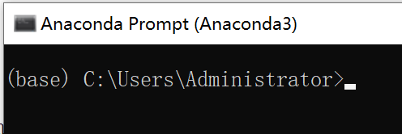

~~~python
conda --version # 查看版本
conda config --show # 查看环境配置
conda info # 查看当前环境的信息(python版本, 安装位置等等)

# 创建环境, 指定环境位置, python版本, 环境名称
# 不指定环境位置, 默认在anaconda安装目录/envs下
conda create -n env_name --prefix=E:/Anaconda3/envs/test python=3.8
conda install python=3.5 # 更改当前环境的python的版本
conda update python # 更新当前环境的python到最新

conda env list # 查看所有的环境
conda activate env_name # 激活环境
conda deactivate # 关闭当前环境并切换到base环境(原生安装的python环境)
conda remove -n env_name --all # 删除环境, 一定要带上--all, 才是删除环境

conda list # 查看当前环境安装了哪些包
conda search package_name # 查询仓库中的包
conda list pkgname # 查询是否安装了pkg, 支持通配符*
conda update pkg # 更新包
conda uninstall package_name # 卸载包, 会同时把依赖这个包的其他包卸载掉

conda clean -p      # 删除没有用的包 --packages
conda clean -t      # 删除tar打包 --tarballs
conda clean -y -all # 删除所有的安装包及cache(索引缓存、锁定文件、未使用过的包和tar包)
~~~

在conda环境下, 尽量使用conda来安装python包, 而不是pip, 应为conda可以统一管理多个环境的包


### pycharm使用conda环境

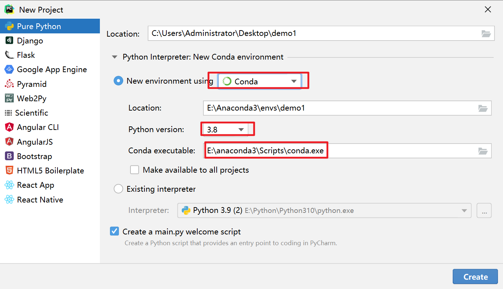

- Locations: 表示当前新创建的虚拟环境的位置
- Python version: 表示当前环境使用的python版本
- Conda executable: 表示conda的位置


在创建完这个项目后,  pycharm会使用conda命令在`anaconda安装目录/envs`下创建一个与项目名项目同名的环境

比如上图中的项目就是在`E:\Anaconda3\envs\`下创建了一个demo1环境


我们可以在settings页面看到当前项目使用的环境信息,   即这个环境安装了哪些包

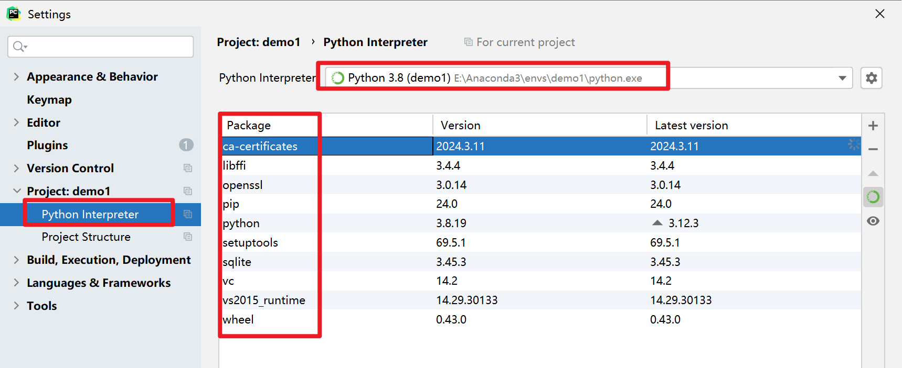


我们点击左侧的`+`号, 即可安装我们需要的包到这个虚拟环境中

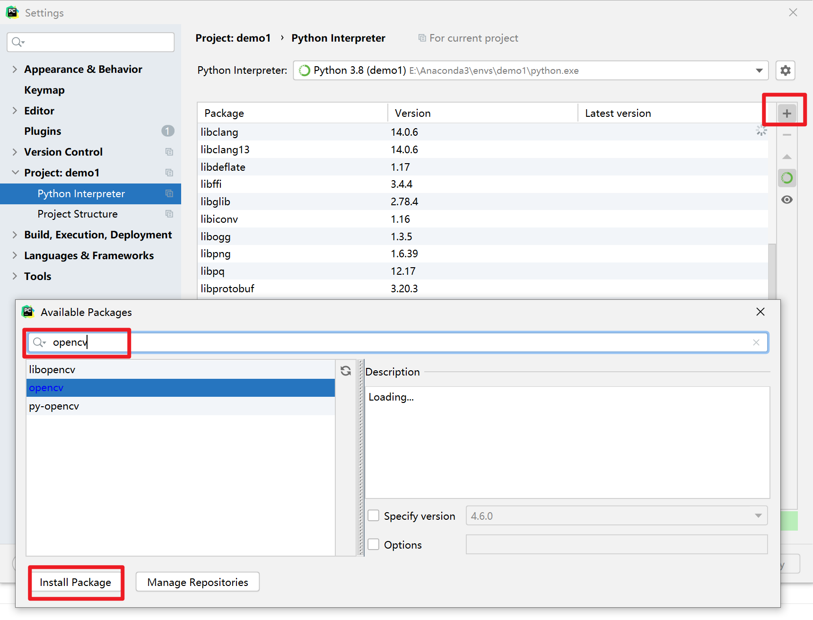


### requirements文件

如果我们下载别人的项目的话, 通常都有一个requirements文件在项目根目录下面

这个文件记录了当前项目使用的依赖包以及版本, 类似与java中的pom.xml,  js中的package.json

但是和pom.xml不同的是, 不是我们在pom.xml中添加依赖, 然后进行下载

而是和package.json类似, 我们先用命令安装依赖, 然后将所有的依赖导出到requirements文件中


下面我们来演示

1. 首先我们使用pycharm创建一个项目, 然后使用配置好conda环境

2. 使用conda安装opencv

   ~~~bash
   conda install opencv==4.4.0
   ~~~

3. 使用pip根据当前环境已经安装的依赖, 来生成requirements文件

   ~~~bash
   pip freeze > requirements.txt
   ~~~

4. 如果我们把它发布出去, 当别人下载了我们的项目之后, 可以使用如下命令来安装requirements文件中的所有依赖

   ~~~bash
   pip install -r requirements.txt
   conda install --yes --file requirements.txt
   ~~~


## uv

uv是rust编写的pyhon包管理工具, 同时也提供了虚拟环境, 依赖管理

可以将其类比为一个npm+nvm


因为是rust编写的项目, 所以提供了二进制程序, 而不需要实现安装python


### 安装

https://docs.astral.sh/uv/getting-started/installation/


#### 安装

**通过Github Release 安装(推荐)**

1. 直接到https://github.com/astral-sh/uv/releases下载二进制文件
2. 配置安装目录到path下

**通过脚本安装**

1. 执行如下脚本来下载二进制文件

   ~~~shell
   # On macOS and Linux and windows使用GitBash.
   curl -LsSf https://astral.sh/uv/install.sh | sh
   ~~~

   默认情况下，uv 安装到`~/.local/bin` 。要更改安装路径，请使用`UV_INSTALL_DIR`

   ~~~shell
   # On macOS and Linux and windows使用GitBash.
   curl -LsSf https://astral.sh/uv/install.sh | env UV_INSTALL_DIR="D:\uv" sh
   ~~~

2. 配置安装目录到path下


#### 配置

| 环境变量                | 作用                       | 备注                                    |
| ----------------------- | -------------------------- | --------------------------------------- |
| `UV_INSTALL_DIR`        | 安装的时候指定uv的安装目录 |                                         |
| `UV_CACHE_DIR`          | uv的缓存的目录             | 可以通过`uv cache dir`查看当前的值      |
| `UV_PYTHON_INSTALL_DIR` | python的安装目录           | 通过`uv python dir`查看当前的值         |
| `UV_PYTHON_BIN_DIR`     | python可执行文件的保存目录 |                                         |
| `UV_TOOL_DIR`           | tool 的安装目录            | 通过`uv tool dir`查看当前的tool安装目录 |
| `UV_TOOL_BIN_DIR`       | tool可执行文件的安装目录   |                                         |
| `HTTPS_PROXY`           | HTTPS代理                  |                                         |
| `HTTP_PROXY`            | HTTP代理                   |                                         |
|                         |                            |                                         |


#### 配置shell 自动补全

~~~shell
# bash and windows下使用gitbash
echo 'eval "$(uv generate-shell-completion bash)"' >> ~/.bashrc
echo 'eval "$(uvx --generate-shell-completion bash)"' >> ~/.bashrc

# 如果在windows下无效, 是因为Git Bash 在 Win 端只会 source ~/.bash_profile 而不会激活 ~/.bashrc 的配置。所以如果你和我一样，喜欢在 ~/.bashrc 配置别名，在 ~/.bash_profile 配置环境的话，
# 解决方法是那就在 ~/.bash_profile 加一行，source ~/.bashrc 就好啦！
~~~

然后重启shell


#### 升级

~~~~shell
uv self update
~~~~


#### 卸载

1. 删除所有uv的数据, 包括python版本,  安装的工具

   ~~~shell
   uv cache clean
   rm -r "$(uv python dir)"
   rm -r "$(uv tool dir)"
   ~~~

2. 删除uv和uvx二进制文件

   ~~~shell
   # 直接删除安装目录中的uv, uvx两个二进制文件
   # 然后删除path即可
   ~~~

   

### python版本管理

~~~shell
uv python list # 查看可用的 Python 版本, 包括已安装的uv管理的, 非uv管理的
uv python list --only-installed # 仅显示已安装的, 包括非uv管理的

uv python install 3.14 # 安装 Python 版本, 默认情况下安装的是cpython。
uv python install pypy@3.10 # 安装py-python
uv python install # 默认安装最新版的c-python

uv python find # 显示当前终端默认使用的python
uv python find >=3.11 # 查找符合条件的已安装的python

uv python pin # 固定当前项目以使用特定的 Python 版本。

uv python uninstall 3.12 # 卸载一个 Python 版本。
~~~

安装完python后, 并不可以直接在命令行直接使用他, 而是要通过`uv run` 或者创建并激活虚拟环境来使用他

(**uv并不是和conda一样, 默认激活一个环境, 这样可以在命令行中直接使用python, uv要求你通过uv run来执行python脚本, 或者在项目中使用uv, 他没有一个默认激活的环境可以自己使用**)


### 运行脚本

1. 如果你的脚本没有依赖任何的库, 那么可以直接运行

   ~~~shell
   print("Hello world")
   ~~~

   ~~~shell
   uv run example.py
   uv run --python 3.10 example.py # 指定python的版本
   ~~~

2. 如果脚本依赖标准库中的模块, 那么也可以直接运行

   ~~~shell
   import os
   print(os.path.expanduser("~"))
   ~~~

   ~~~shell
   uv run example.py
   ~~~

3. 可以向脚本提供参数：

   ```python
   import sys
   
   print(" ".join(sys.argv[1:]))
   ```

   ~~~shell
   $ uv run example.py test
   test
   ~~~

4. 如果你的脚本有依赖的库, 比如如下代码

   ~~~shell
   import time
   from rich.progress import track
   
   for i in track(range(20), description="For example:"):
       time.sleep(0.05)
   ~~~

   他依赖rich库, 那么你可以使用如下代码来执行, 他会创建一个临时的虚拟环境来运行代码

   ~~~shell
   uv run --with rich example.py
   uv run --with 'rich>12,<13' example.py # --with可以指定多个
   ~~~

5. 你也可以在脚本中声明依赖项, 然后uv在执行脚本的时候, 会自动下载这些依赖

   ~~~shell
   # /// script
   # requires-python = ">=3.12" 
   # dependencies = [
   #   "requests<3",
   #   "rich",
   # ]
   # ///
   
   import requests
   from rich.pretty import pprint
   
   resp = requests.get("https://peps.python.org/api/peps.json")
   data = resp.json()
   pprint([(k, v["title"]) for k, v in data.items()][:10])
   ~~~

   

### 使用工具

你可以直接使用`uvx`来执行一些工具, 而无需提前安装他,  `uvx`是`uv tool run` 的别名

uv会将这些工具安装到uv的缓存目录中的一个临时的虚拟环境中

如果你执行`uv cache clean`清除缓存, 那么这些虚拟环境也会被清除

~~~shell
uvx ruff # 自动下载ruff包, 并使用最新版本, 并执行ruff命令
uvx ruff@0.3.0 check # 自动下载ruff@0.3.0 并执行ruff check
uvx ruff@latest check 
uvx --from 'ruff==0.3.0' ruff check # 下载ruff@0.3.0 并执行 ruff check
uvx --from 'ruff>0.2.0,<0.3.0' ruff check
uvx --from httpie http # 下载httpie, 并执行http命令
~~~


当然如果你经常使用某个工具, 那么也可以将他们直接安装`~/.local/bin`, 而不是安装在临时的虚拟环境中

同时uv还会判断这个目录是不是在你的path下, 如果不是, 会提示你执行如下代码来将该目录添加到path下

~~~shell
uv tool install ruff
uv tool install 'httpie>0.1.0'
uv tool install ruff==0.5.0
~~~

你还可以更新工具

~~~shell
uv tool upgrade ruff
uv tool upgrade --all # 更新所有工具
~~~

列出所有已经安转的工具

~~~shell
uv tool list
~~~


你可以通过如下命令来查看安装的tool保存的位置

~~~shell
$ uv tool dir
C:\Users\Administrator\AppData\Roaming\uv\tools
~~~

当然你也可以使用`UV_TOOL_DIR`环境变量来自定义位置


### 虚拟环境

虚拟环境就是一个安装包的集合, 用来隔离python安装环境

**需要配合项目使用, 找不出单独使用的场景, 可以直接看项目部分**


1. 创建虚拟环境

   ~~~shell
   uv venv # 在当前目录下创建一个 .venv 文件夹作为虚拟环境
   uv venv  --python 3.11 # 如果没有安装py3.11, 那么会自动安装
   
   uv venv my-name # 创建my-name/.venv作为虚拟环境
   ~~~

2. 激活环境

   你可以在shell中执行如下命令, 来激活这个环境, 这样这个环境中安装的包就可以直接使用了

   ~~~shell
   # mac or linux or git bash
   source .venv/bin/activate
   
   # windows
   .venv\Scripts\activate
   ~~~

3. 安装依赖到虚拟环境

   ~~~shell
   uv pip install ruff # 安装依赖到当前目录下的 .venv中 
   uv pip install 'ruff>=0.2.0'
   uv pip install 'ruff==0.3.0'
   
   uv pip install -r requirements.txt # 根据项目下的requirements.txt来安装包
   uv pip install -r pyproject.toml # 根据项目下的pyproject.toml来安装包
   ~~~

4. 查看虚拟环境中安转的所有依赖

   ~~~shell
   uv pip list
   ~~~

5. 卸载包

   ~~~shell
   uv pip uninstall flask
   uv pip uninstall flask ruff # 一次性卸载多个包
   ~~~

6. 使用虚拟环境中的命令

   ~~~shell
   ruff check # 需要先激活虚拟环
   ~~~

7. 退出虚拟环境

   ~~~shell
   deactivate
   ~~~

   


### 项目

我们可以通过uv init来创建一个py项目,  创建的模板有三种

- Application

  这种模板主要适用于web服务器, 脚本, 命令行

  ~~~shell
  # 可以通过 -p 3.14 来指定要使用的python的版本
  uv init hello-world
  ~~~

  

  创建的结构如下

  ~~~shell
  .
  ├── .python-version
  ├── README.md
  ├── main.py
  └── pyproject.toml
  ~~~

  `main.py`文件包含一个简单的“Hello world”程序。使用`uv run`尝试一下

- Packaged application 

  这种模板适用于需要发布到PyPI的命令行界面

  ~~~shell
  uv init --package example-pkg
  ~~~

  ~~~shell
  $ tree example-pkg
  example-pkg
  ├── .python-version
  ├── README.md
  ├── pyproject.toml
  └── src
      └── example_packaged_app
          └── __init__.py
  ~~~

  并且还会在`.pyproject.toml`中定义一个构建系统, 以及命令

  ~~~shell
  [project]
  name = "example-pkg"
  version = "0.1.0"
  description = "Add your description here"
  readme = "README.md"
  requires-python = ">=3.11"
  dependencies = []
  
  [project.scripts]
  example-pkg = "example_packaged_app:main"
  
  [build-system]
  requires = ["hatchling"]
  build-backend = "hatchling.build"
  ~~~

- library 库

  这种模板适用于库, 用于提供函数和对象给其他项目使用

  ~~~shell
  uv init --lib example-lib
  ~~~

  ~~~shell
  $ tree example-lib
  example-lib
  ├── .python-version
  ├── README.md
  ├── pyproject.toml
  └── src
      └── example_lib
          ├── py.typed
          └── __init__.py
  ~~~

  并且还会在`.pyproject.toml`中定义一个构建系统

  ~~~shell
  [project]
  name = "example-lib"
  version = "0.1.0"
  description = "Add your description here"
  readme = "README.md"
  requires-python = ">=3.11"
  dependencies = []
  
  [build-system]
  requires = ["hatchling"]
  build-backend = "hatchling.build"
  ~~~

  


#### 完整的项目结构

~~~shell
.
├── .venv
│   ├── bin
│   ├── lib
│   └── pyvenv.cfg
├── .python-version
├── README.md
├── main.py
├── pyproject.toml
└── uv.lock
~~~

1. `.venv`是当前项目的依赖包, 类似node项目的node_modules

2. `.python-version`记录了当前项目使用的python版本, 内容如下

   ~~~shell
   3.13
   ~~~

   如果当前项目下没有这个文件, 那么你可以使用`uv python pin`命令来生成这个文件

3. `pyproject.toml`记录了当前项目的信息, 包括名称, 版本, 依赖

   ~~~toml
   [project]
   name = "hello-world"
   version = "0.1.0"
   description = "Add your description here"
   readme = "README.md"
   dependencies = []
   # requires-python = ">=3.11"
   requires-python = 3.14
   ~~~

   **如果存在这个文件, 那么uv就会将当前目录识别为一个项目**

4. `uv.lock`是一个跨平台的锁定文件，其中包含有关项目依赖项的准确信息, 与`pyproject.toml`不同, 锁定文件包含安装在项目环境中的准确解析版本

   `uv.lock`是一个人类可读的 TOML 文件，但由 uv 管理，不应手动编辑。

5. `requirements.txt`

   类似`uv.lock`, 主要用于别人使用项目的时候导入依赖

   可以使用如下命令来生成这个文件

   ~~~shell
   uv pip compile pyproject.toml -o requirements.txt
   ~~~

   


#### 项目的依赖管理

##### 依赖管理

你可以在项目的根目录下执行如下命令, 来管理项目的依赖

~~~shell
uv add requests
uv add 'requests==2.31.0'
uv add "httpx>=0.20"
uv add "jax; sys_platform == 'linux'" # 添加特定平台的依赖

uv add -r requirements.txt # 根据requirements文件来添加依赖, 常用来克隆别人的项目

uv remove requests
uv remove --dev urllib3 # 移除开发依赖

uv lock --upgrade-package requests # 尝试将指定的包更新到最新兼容版本
~~~

当然, 你也可以手动修改`pyproject.toml`文件, 然后执行如下命令来同步依赖

~~~shell
uv sync
~~~

你还可以使用如下命令来查看所有已经安装的包

~~~shell
uv tree # (推荐)
uv pip list
~~~

你还可以查看已经安装的依赖的具体信息

~~~shell
uv pip show numpy
~~~


`uv add xxx` 和 `uv pip install xxx`的区别在于:

- add会添加依赖到虚拟环境中, 并且同步更新`uv.lock`文件和`.pyproject.toml`文件
- pip install 只是将包安装到虚拟环境中, 而不是动这两个文件


##### 依赖的分类

项目的依赖项可以分为如下几类:

1. 需要打包到真实包中的依赖, 类似requests

   ~~~shell
   uv add httpx
   ~~~

   ~~~toml
   [project]
   name = "example"
   version = "0.1.0"
   dependencies = ["httpx>=0.27.2"]
   ~~~

2. 只在开发时需要,  打包后不需要的依赖, 类似ruff

   ~~~shell
   uv add --dev pytest
   ~~~

   ~~~toml
   [dependency-groups]
   dev = [
     "pytest >=8.1.1,<9"
   ]
   ~~~

   当然你也可以将开发依赖分为多个组, 一类相同的依赖放在同一个组

   ~~~shell
   uv add --group lint ruff
   ~~~

   ~~~shell
   [dependency-groups]
   lint = [
     "ruff"
   ]
   ~~~

3. 构建项目所需要的依赖项

   这些依赖在构建项目的时候需要, 但是在其他时候不需要

   例如，如果项目使用`setuptools`作为其构建后端，则它应该将`setuptools`声明为构建依赖项：

   ```toml
   [project]
   name = "pandas"
   version = "0.1.0"
   
   [build-system]
   requires = ["setuptools>=42"]
   build-backend = "setuptools.build_meta"
   ```

4. 可选的依赖(没懂)

   作为库发布的项目通常会将某些功能设为可选，以减少 默认的依赖关系树。例如，Pandas 有一个 [`excel` extra](https://pandas.pydata.org/docs/getting_started/install.html#excel-files)和 [`plot` extra](https://pandas.pydata.org/docs/getting_started/install.html#visualization)以避免安装 Excel 解析器和`matplotlib` ，除非有人明确要求。使用`package[<extra>]`语法请求 extra，例如`pandas[plot, excel]` 。

   ~~~shell
   uv add httpx --optional network
   ~~~

   ~~~shell
   [project.optional-dependencies]
   network = [
       "httpx>=0.28.1",
   ]
   ~~~

   

##### 包的索引(镜像)

索引按照定义的顺序作为优先级

~~~toml
[[tool.uv.index]]
name = "pytorch"
url = "https://download.pytorch.org/whl/cpu"
default = true
~~~

如果在任何的index中都找不到包, 那么uv会查找默认索引, 即PyPI, 如果要覆盖默认索引, 使用如下代码

~~~toml
[[tool.uv.index]]
name = "pytorch"
url = "https://download.pytorch.org/whl/cpu"
default = true
~~~

默认索引始终被视为最低优先级，无论其在索引列表中的位置如何。


你也可以将包固定到特定的索引上

~~~toml
[tool.uv.sources]
torch = { index = "pytorch" }

[[tool.uv.index]]
name = "pytorch"
url = "https://download.pytorch.org/whl/cpu"
~~~


##### 依赖的来源

依赖的来源可以有多种, 比如git, http, 本地, 镜像, 当前项目的其他模块

1. 别的镜像

   ~~~shell
   # 添加依赖时指定镜像
   uv add torch --index pytorch=https://download.pytorch.org/whl/cpu
   ~~~

   之后uv会将该依赖指向这个镜像

   ~~~shell
   [project]
   dependencies = ["torch"]
   
   [tool.uv.sources]
   torch = { index = "pytorch" }
   
   [[tool.uv.index]]
   name = "pytorch"
   url = "https://download.pytorch.org/whl/cpu"
   ~~~

2. Git

   如果要指定包的来源是git, 那么使用如下命令

   ~~~shell
   uv add git+https://github.com/encode/httpx
   ~~~

   之后的`pyproject.toml`如下

   ~~~toml
   [project]
   dependencies = ["httpx"]
   
   [tool.uv.sources]
   httpx = { git = "https://github.com/encode/httpx" }
   ~~~

   你也可以指定使用的分支的tag, 或者直接指定分钟

   ~~~shell
   uv add git+https://github.com/encode/httpx --tag 0.27.0
   uv add git+https://github.com/encode/httpx --branch main
   ~~~

   如果包不在git的根目录, 那么可以指定子目录

   ~~~shell
   uv add git+https://github.com/langchain-ai/langchain#subdirectory=libs/langchain
   ~~~

3. URL网址

   ~~~shell
   uv add "https://files.pythonhosted.org/packages/5c/2d/3da5bdf4408b8b2800061c339f240c1802f2e82d55e50bd39c5a881f47f0/httpx-0.27.0.tar.gz"
   ~~~

   ~~~shell
   [project]
   dependencies = ["httpx"]
   
   [tool.uv.sources]
   httpx = { url = "https://files.pythonhosted.org/packages/5c/2d/3da5bdf4408b8b2800061c339f240c1802f2e82d55e50bd39c5a881f47f0/httpx-0.27.0.tar.gz" }
   ~~~

   如果包不在文件的根目录, 同样可以指定子目录

4. Path本地目录

   ~~~shell
   uv add /example/foo-0.1.0-py3-none-any.whl
   ~~~

   ~~~shell
   [project]
   dependencies = ["foo"]
   
   [tool.uv.sources]
   foo = { path = "/example/foo-0.1.0-py3-none-any.whl" }
   ~~~

5. Workspace member 工作区成员

   要声明对工作区成员的依赖，请使用`{ workspace = true }`添加成员名称

   ~~~~shell
   [project]
   dependencies = ["foo==0.1.0"]
   
   [tool.uv.sources]
   foo = { workspace = true } # 设置foo包的来源是工作区
   
   [tool.uv.workspace]
   members = [ # 指定工作区成员
     "packages/foo"
   ]
   ~~~~


#### 运行命令

你可以在项目的目录下运行任意的脚本和命令,  uv会递归查找上级目录中的`pyproject.toml`文件

1. 运行工具命令

   ~~~shell
   uv add flask
   uv run -- flask run -p 3000
   
   uv run python -c "import example"
   ~~~

2. 运行脚本

   ~~~shell
   # Require a project dependency
   import flask
   
   print("hello world")
   ~~~

   ~~~shell
   uv run example.py
   ~~~


#### 激活环境

**你可以在shell中激活`.venv`中的虚拟环境, 这样在执行命令的时候, 就不需要使用`uv run`了**

~~~shell
source .venv\Scripts\activate # 激活环境
flask run -p 3000 # 直接执行命令
python example.py # 直接执行python
~~~


#### 锁定和同步

锁定的目的是根据`pyproject.toml`中的依赖项来更新`uv.lock`文件, 同步的作用是根据`uv.lock`更新虚拟环境中的依赖项

**锁定和同步是自动的,  也就是在项目中调用其他命令的时候, 会自动执行锁定和同步, 比如`uv run`**


##### 手动锁定和同步

你可以使用如下命令来创建或者更新`uv.lock`文件

~~~shell
uv lock
~~~

你可以使用如下命令来同步依赖项

~~~shell
uv sync
~~~

##### 同步dev依赖

默认情况下, 开发的依赖项, dev是自动同步的, 但是别的group的依赖不会自动同步, 这个时候你需要通过如下命令来同步其他group中的依赖

~~~shell
uv sync --all-groups
~~~

##### 升级lock文件中的依赖项

你可以升级lock文件中的依赖项, 让venv中的依赖来尽可能的达到最新,  但是也要符合`pyproject.toml`中的版本约束

~~~shell
uv lock --upgrade # 更新所有lock文件中的依赖
uv lock --upgrade-package <package> # 更新特定版本的依赖
uv lock --upgrade-package <package>==<version>
~~~

##### 导入lock文件

你可以将lock文件中的依赖导出到`requirements.txt`,  这样别人就可以在使用你的项目的时候直接安装依赖了

~~~shell
uv export --format requirements-txt

uv pip install -r requirements.txt # 根据项目下的requirements.txt来安装包
~~~


#### 项目的Entry Points(需要使用build system)

项目的entry points其实就是可以在项目中自定义一些属于项目的命令

命令有三类

- 命令行

  ~~~shell
  [project.scripts]
  hello = "example:hello"
  ~~~

  我们可以调用`uv run hello` , 这样就会执行`example.py`下的`hello`函数

- GUI接口

  这个应该是执行这个命令就会出现一个gui界面

  ~~~shell
  [project.gui-scripts]
  hello = "example:app"
  ~~~

  我们可以调用`uv run hello` , 这样就会执行`example.py`下的`app`函数

- 插件入口点 Plugin entry points(不知道有什么用)

  ~~~shell
  [project.entry-points.'example.plugins']
  a = "example_plugin_a"
  ~~~

  然后，在`example`中，插件将被加载：

  **example/__init__.py**

  ```
  from importlib.metadata import entry_points
  
  for plugin in entry_points(group='example.plugins'):
      plugin.load()
  ```


#### 项目构建

Python 项目通常以源代码发行版 (sdists) 和二进制发行版 (wheels) 的形式发布。前者通常是包含项目源代码和一些其他元数据的`.tar.gz`或`.zip`文件，而后者是包含可直接安装的预构建工件的`.whl`文件。

`uv build`可用于为您的项目构建源分布和二进制分布（wheel）。

你需要在`.pyproject.toml`中添加一个构建后端

~~~toml
[project.scripts] # 指定一个自定义命令, 可选, 如果你的包没有命令, 那么就不需要
hello = "example:hello"

[build-system] # 指定一个构建后端, 必须
requires = ["hatchling"]
build-backend = "hatchling.build"
~~~

当使用`uv build`时，uv 充当[构建前端](https://peps.python.org/pep-0517/#terminology-and-goals), 但他的作用仅仅是确定要使用的 Python 版本并调用构建后端。具体的构建工作, 例如包含的文件和分发文件名，由构建后端决定 ，在[`[build-system]`](https://docs.astral.sh/uv/concepts/projects/config/#build-systems)中定义。有关构建配置的信息可在相应工具的文档中找到。


默认情况下， `uv build`将在当前目录中构建项目，并将构建的工件放在`dist/`子目录中：

~~~shell
$ uv build
$ ls dist/
hello-world-0.1.0.tar.gz
hel1o-world-0.1.0-py3-none-any.whl

$ uv build path/to/project  # 生成到指定目录下
~~~

之后就可以将whl文件发布到 PyPI上面供别人下载了, 别人可以使用`uv pip install`或者`uv add`来添加这个依赖, 然后使用`uv run hello`, 那么他就会执行`example.py`的hello函数了


#### 工作区

uv中的工作区类似于maven中的多模块,  一个大的项目下具有多个子项目, 每个项目都有一个`pyproject.toml`, 但是只有一个`uv.lock`文件, 以保证工作区以一组一致的依赖项进行运行。


常见的工作区结构如下

~~~shell
albatross
├── packages # 在packages下定义子项目
│   ├── bird-feeder
│   │   ├── pyproject.toml # 每个子项目有一个配置文件
│   │   └── src
│   │       └── bird_feeder
│   │           ├── __init__.py
│   │           └── foo.py
│   └── seeds
│       ├── pyproject.toml
│       └── src
│           └── seeds
│               ├── __init__.py
│               └── bar.py
├── pyproject.toml
├── README.md
├── uv.lock
└── src # 在src下保存跟项目的代码
    └── albatross
        └── main.py
~~~


在一个项目的目录下面使用`uv init`来创建子项目, 会自动向父项目的`pyproject.toml`中添加如下内容

~~~shell
[tool.uv.workspace]
members = ["subproject"]
~~~

当然你也可以手动指定哪些目录是子项目, 哪些不是

~~~shell
[tool.uv.workspace]
members = ["packages/*"]
exclude = ["packages/seeds"]
~~~


如果某个子项目依赖另外一个子项目, 那么可以通过如下方式来实现

~~~shell
# 跟项目的pyproject.toml
[tool.uv.workspace]
members = ["packages/a", "packages/b"] # 声明子项目

# a子项目的pyproject.toml
[project]
name = "a"
version = "0.1.0"
requires-python = ">=3.12"
dependencies = ["b"]

[tool.uv.sources]
bird-feeder = { workspace = true }
~~~


在项目根目录的`tool.uv.sources`中可以定义依赖项的来源, 他对所以子项目都有效, 除非子项目中也配置了``tool.uv.sources``来进行覆盖

~~~shell
[project]
name = "albatross"
version = "0.1.0"
requires-python = ">=3.12"

[tool.uv.sources]
tqdm = { git = "https://github.com/tqdm/tqdm" } # 对a, b子项目都有效

[tool.uv.workspace]
members = ["packages/a", "packages/b"]
~~~

### uv整合pycharm

pycharm现在支持uv不是很好, 不要通过pycharm来直接创建一个python项目, 否则pycharm可能会下载一些python版本, 而不是使用uv管理的


- 可以通过`uv init project_name -p 3.12`来创建一个3.12版本的项目
- 然后在pycharm的终端`source .venv\Scripts\activate`来激活环境
- 最后使用`uv run main`来执行一下脚本, 这个时候uv会自动同步和锁定, 也会创建虚拟环境
- 之后就可以直接使用这个项目了


# 打包工具

## nuitka

我们可以使用nuitka来将python文件打包为exe文件,  直接发给别人就可以执行了

- nuitka会分析python文件中使用到的依赖, 并将他们一起打包

使用uv的话, 我们可以运行如下命令来继续打包

~~~shell
# --standalone表示将python解释器也打包进来, 否则编译后的exe文件还是要python解释器才能运行
# --onefile表示打包为一个exe文件
uvx --from nuitka nuitka.cmd main.py --standalone --onefile
~~~

如果你的python中使用到了一些资源文件, 比如图片, nuitka会自动分析并将他们打包进来,  但是有时候可能也分析不到位, 所以你可以自己指定要打包进来的资源文件

~~~shell
# --include-data-files=test.jpg=pgzero/data/icon.png 表示要将当前目录下的test.jpg文件打包为exe文件中的pgzero/data/icon.png
# --include-data-dir=images=images 表示要将当前目录下的images文件夹打包为exe文件中的的data/images
uvx --from nuitka nuitka.cmd main.py \
--standalone --onefile \
--include-data-files=test.jpg=pgzero/data/icon.png \
--include-data-dir=images=data/images
~~~

因为nuitka的参数众多, 你也可以使用别人制作好的nuitka的可视化界面, 比如NuitkaGUI

https://github.com/271374667/NuitkaGUI/releases

# 其他

### with 关键字

1. with关键字的原理

   当代码执行到with关键字时, 他首先会对with关键字后面的代码进行求值

   求值之后, 复制给as 后面的变量

   调用变量的`__enter__`方法

   执行with中代码块的内容

   当代码块执行完毕之后, 调用变量的`__exit__`方法

2. with关键字的使用场景

   1. 用来实现try-with-resource

      ~~~python
      with open('./test_runoob.txt', 'w') as file:
          file.write('hello world !')
      ~~~

      首先会执行`open('./test_runoob.txt', 'w')`进行求值

      然后将求值后的结果复制给file变量

      调用file变量的`__enter__`方法

      执行`file.write('hello world !')`代码块

      调用`file.__exit__()`方法

   2. 用来实现锁

      ~~~python
      locker = RLock() # 获取锁对象
      with locker:
          # do something
      ~~~

      这里没有求值, 直接调用locker的`__enter__`方法来获取锁

      执行代码块

      调用locker的`__exit__`方法来释放锁

      

### 元类


#### 类也是对象

首先要明白一点的是, 在python中, 类也是对象, 所以可以像类一样赋值

~~~python
class Student:
    pass

Student_Copy = Student # 将类复制给变量
print (Student)  # 将类作为参数

Student.age = 30 # 给类添加一个静态属性
print( hasattr(Student, 'age') ) # true
~~~

#### 类可以动态创建

同时类在python中也是动态创建的, python解释器在读取到class关键字的时候, 会在内存中创建一个类的对象

~~~python
# 定义一个函数, 用来动态的创建类
def create_class(name):
    clazz = None
    if name == 'foo':
        class Foo:
            pass
        clazz = Foo
    elif name == 'bar':
        class Bar:
            pass
        clazz = Bar
    return clazz
foo = create_class('foo') # 创建类, 并赋值给foo
f1 = foo() # 调用构造函数, 创建对象
print(f'{foo}, {f1}')

bar = create_class('bar')
b1 = bar()
print(f'{bar}, {b1}')
~~~


除了上面这种通过class来定义类, 我们还可以通过`type`函数来动态的创建一个类

type函数不仅可以返回一个对象的类型, 还可以动态的创建一个类

~~~python
# type不仅可以返回变量的类型, 还可以创建类
print(type(1) )
print(type("1"))
~~~

~~~python
'''
通过type来创建一个MyStudent类
type接受三个参数
第一个是类名, 类型为str
第二个是父类, 类型为tuple, 表示多个父类
第三个是类的静态属性与方法, 类型为dict
    如果要创建实例属性, 可以创建__init__函数, 通过该函数来创建实例属性
'''
getAge = lambda cls: cls.age
MyStudent = type('MyStudent', (), {"age": 10, "gender": "男", "getAge": getAge})
'''
代码类似下面这样
class MyStudent:
        age = 10
        gender = '男'
    def getAge(cls):
        return cls.age
'''
myStudent = MyStudent()
# <class '__main__.MyStudent'>, <__main__.MyStudent object at 0x0000023EBCE87EB0>
print(f'{MyStudent}, {myStudent}')
print(f'{hasattr(MyStudent, "age")}, {hasattr(MyStudent, "gender")}') # True, True
~~~


#### 什么是元类

从上面我们可以发现, 类也是对象, 可以通过**type函数来创建一个类**

那么元类(metaclass)就是可以创建类这个对象的东西, 可以理解为类的工厂

我们可以自定义一个类的元类, 这样我们就可以在类的创建过程中自定义一些东西


当python解释器读取到class这个关键字的时候, 他会查看有没有指定`metaclass`, 如果指定了metaclass那么就会通过这个变量来创建当前这个类, 并且传入所有的静态属性和方法, 父类, 当前类的名字

如果没有指定metaclass, 那么就会使用type函数来创建这个类


假如我们有一个这样的需求, 要求类的静态属性和方法必须全部大写, 那么我们可以这样

~~~python
# 定义一个创建类的函数,  他和type一样接受3个参数
# 这个就是我们自定义的元类

def upper_attr(class_name, class_parents, class_attr):
    #  选择所有不以'__'开头的属性
    #  (a for value in collection if condition)是一个生成器语法, 用来生成迭代器
    attrs = ((name, value) for name, value in class_attr.items() if not name.startswith('__'))
    # 将它们转为大写形式
    uppercase_attr = dict((name.upper(), value) for name, value in attrs)
    # 通过'type'来做类对象的创建
    return type(class_name, class_parents, uppercase_attr)

# 指定当前Person的元类为upper_attr
class Person(metaclass=upper_attr):
    bar = 'bip'

print(f'{hasattr(Person, "BAR")}') # True
~~~

上面我们创建了一个元类, 虽然他是一个函数, 他会把所有的类属性和方法转换为大写

当我们的python解释器解释到class关键字的时候, 他会把当前类的类名, 父类, 静态属性和方法都传入upper_attr方法中,  **我们要在upper_attr函数中要做的就是实现自己的自定义逻辑, 然后通过type函数来构建这个类对象**


上面我们将metaclass指定为了一个函数, 在函数中调用type方法构建类对象, 同时**我们也可以将metaclass指定为一个类, 这个类必须继承type方法, 实现`__new__`方法**, 这样他就会成为一个元类

~~~python
# 这个类必须继承type, 并且实现__new__才能够变成元类
class UpperAttrMetaClass(type):
    # 注意这里接受了一个cls, 就是当前UpperAttrMetaClass类
    def __new__(cls, future_class_name, future_class_parents, future_class_attr):
        attrs = ((name, value) for name, value in future_class_attr.items() if not name.startswith('__'))
        uppercase_attr = dict((name.upper(), value) for name, value in attrs)
        return type(future_class_name, future_class_parents, uppercase_attr)

# 指定Person的元类为UpperAttrMetaClass
class Person(metaclass=UpperAttrMetaClass):
    bar = 'bip'
~~~

上面代码, 当python解释器碰到class Person的时候, 发现Person类指定了metaclass为UpperAttrMetaClass, 同时UpperAttrMetaClass是一个类, 这样python解释器就会将类名, 父类, 静态属性和方法传入UpperAttrMetaClass的`__new__`方法中, 我们在其中只要调用type方法来构建这个类对象就行了

这样创建的Person类, 所有的静态属性和方法都是大写的


但是我们上面在`__new__`中直接调用type方法来创建类对象的办法并不那么面向对象, 我们希望使用一种面向对象的方式来创建这个类对象

比如我们有这样的需求, 我们想要创建类的静态属性和方法都是大写的, 同时我们希望转换之前, 如果静态属性和方法的名字以`xxx`开头, 那么就把他过滤掉, 那么我们可以使用如下的方法来实现

~~~python
class UpperAttrMetaclass(type):
    def __new__(cls, name, bases, dct):
        attrs = ((name, value) for name, value in dct.items() if not name.startswith('__'))
        uppercase_attr = dict((name.upper(), value) for name, value in attrs)
        # 这里调用父类的__new__来构建类对象
        # 下面两种方式是一样的, 推荐使用super这种方式,
        # return super(UpperAttrMetaclass, cls).__new__(cls, name, bases, uppercase_attr)
        return type.__new__(cls, name, bases, uppercase_attr)


class FilterMetaclass(UpperAttrMetaclass):
    def __new__(cls, name, bases, dct):
        # 过滤掉xxx开头的属性和方法
        attrs = ((name, value) for name, value in dct.items() if not name.startswith('xxx'))
        uppercase_attr = dict((name.upper(), value) for name, value in attrs)
        # 调用父类UpperAttrMetaclass来构建类对象
        return super(UpperAttrMetaclass, cls).__new__(cls, name, bases, uppercase_attr)

class Person(metaclass=FilterMetaclass):
    xxxaaa = 'hello'
    bb = "bb"
print(f'{hasattr(Person, "BB")}, {hasattr(Person, "xxxaaa")}, {hasattr(Person, "XXXAAA")}')
# True, False, False
~~~


### 枚举类

当我们需要定义常量时，一个办法是用大写变量通过整数来定义，例如月份：

```python
JAN = 1
FEB = 2
...
NOV = 11
DEC = 12
```

好处是简单，缺点是类型是`int`，并且仍然是变量。

更好的方法是为这样的枚举类型定义一个class类型，然后，每个常量都是class的一个唯一实例。Python提供了`Enum`类来实现这个功能：

```python
from enum import Enum

# Month是枚举类的名字, Jan是值
Month = Enum('Month', ('Jan', 'Feb', 'Mar', 'Apr', 'May', 'Jun', 'Jul', 'Aug', 'Sep', 'Oct', 'Nov', 'Dec'))
```

这样我们就获得了`Month`类型的枚举类，可以直接使用`Month.Jan`来引用一个常量，或者枚举它的所有成员：

```python
for name, member in Month.__members__.items():
    print(name, '=>', member, ',', member.value)
```

`value`属性则是自动赋给成员的`int`常量，默认从`1`开始计数。

如果需要更精确地控制枚举类型，可以从`Enum`派生出自定义类：

```python
from enum import Enum, unique

@unique # @unique装饰器可以帮助我们检查保证没有重复值。
class Weekday(Enum):
    Sun = 0 # Sun的value被设定为0
    Mon = 1
    Tue = 2
    Wed = 3
    Thu = 4
    Fri = 5
    Sat = 6
```


访问这些枚举类型可以有若干种方法：

```python
day1 = Weekday.Mon
print(day1)

day2 = Weekday['Tue']
print(Weekday.Tue.value) # 2

day1 == Weekday.Mon # True
day1 == Weekday.Tue # False
print(Weekday(1)) # Weekday.Mon


Weekday(7)
Traceback (most recent call last):
  ...
ValueError: 7 is not a valid Weekday
>>> for name, member in Weekday.__members__.items():
...     print(name, '=>', member)
...
```

可见，既可以用成员名称引用枚举常量，又可以直接根据value的值获得枚举常量。


## JSON操作

操作json需要如下模块, 他是python自带的

~~~python
# 导入 json
import json
~~~

1. json字符串转换为python对象

   ~~~python
   json_str = '{"name": "Alice", "age": 25, "is_student": false}'
   data = json.loads(json_str)
   
   print(data["name"])
   ~~~

2. 文件转换为python对象

   ~~~python
   with open("data.json", "r") as f:
       data = json.load(f)
       print(data["name"])
   ~~~

3. dict转换为json字符串

   ~~~python
   data = {"name": "Alice", "age": 25, "is_student": False}
   json_str = json.dumps(data)
   ~~~

4. dict写到文件中

   ~~~python
   data = {"name": "Alice", "age": 25, "is_student": False}
   
   with open("output.json", "w") as f:
       json.dump(data, f, indent=4, ensure_ascii=False)
   ~~~

loads和dumps适用于字符串,  load和dump适用于文本


## dataclass

类似java中的lombok

~~~python
import random
from dataclasses import dataclass, field
from typing import ClassVar

"""
使用dataclass装饰的类, 会自动生成如下方法:
__init__方法来生成name和age属性, 
__repr__方法, 打印对象时会输出属性
__eq__方法, 所以在调用 == 比较两个对象的时候, 比较的是属性, 而不是内存地址
"""
# 还可以通过装饰器的属性来详细设置, 比如这里设置生成比较相关的方法, 比较是按照属性的字典序来的
@dataclass(order=True)
class Person:
    name: str = "null"
    age: int = 0
        
    # 通过field来精确控制属性
    # default为0, height不作为对象属性, 打印的时候不输出, 不在比较的时候使用
    height: int = field(default=0, init=False, repr=False, compare=False)
    # default_factory表示通过这个函数来生成属性的默认值
    weight: int = field(default_factory=lambda: random.randint(1, 100))

    # 因为dataclass通过静态属性来生成对象属性, 如果你要定义真正的静态属性
    # 你需要通过如下方式来进行
    people_num: ClassVar[int] = 0

    # 对象生成之后, 会自动调用生命周期函数
    def __post_init__(self):
        Person.people_num += 1


        
 # 如果使用原生的方式的话, 非常的不方便, 要自动定义__repr__和__eq__方法
class Person1:
    def __init__(self, name: str, age: int):
        self.name = name
        self.age = age


if __name__ == '__main__':
    p1 = Person()
    print(Person.name)
    Person.age = 100
    print(Person.age)
~~~

