# Scala入门
## Scala安装和环境准备

### Scala环境搭建

1. 首先确保 JDK1.8 安装成功

2. 下载对应的 Scala 安装文件 scala-2.12.11.zip

3. 解压 scala-2.12.11.zip，我这里解压到 D:\Tools

4. 配置 Scala 的环境变量

   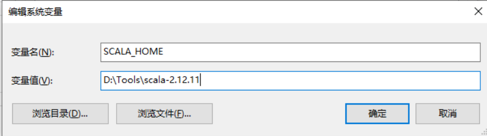
   
5. 在控制台输入如下, 查看scala版本

   ~~~scala
   C:\Users\Administrator>scala --version
   Scala code runner version 2.13.4 -- Copyright 2002-2020, LAMP/EPFL and Lightbend, Inc.
   ~~~

6. 在控制台输入scala, 进行脚本编写

   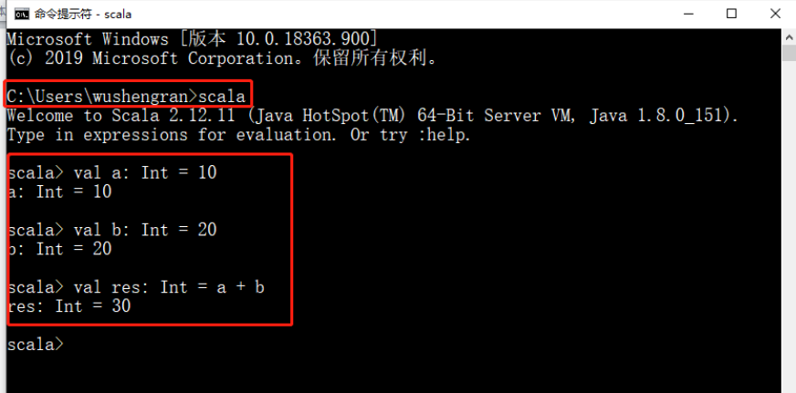

> 注意 1：解压路径不能有任何中文路径，最好不要有空格。
> 注意 2： 环境变量要大写 SCALA_HOME

 

### IDEA安装插件

直接在IDEA的插件市场 安装 Scala插件, 重启即可


## Hello World

### 创建IDEA项目工程

1. 打开 IDEA->点击左侧的 Flie->选择 New->选择 Project…  

   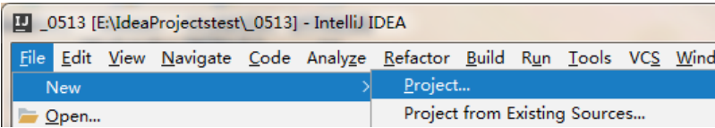

2. 创建一个 Maven 工程， 并点击 next

   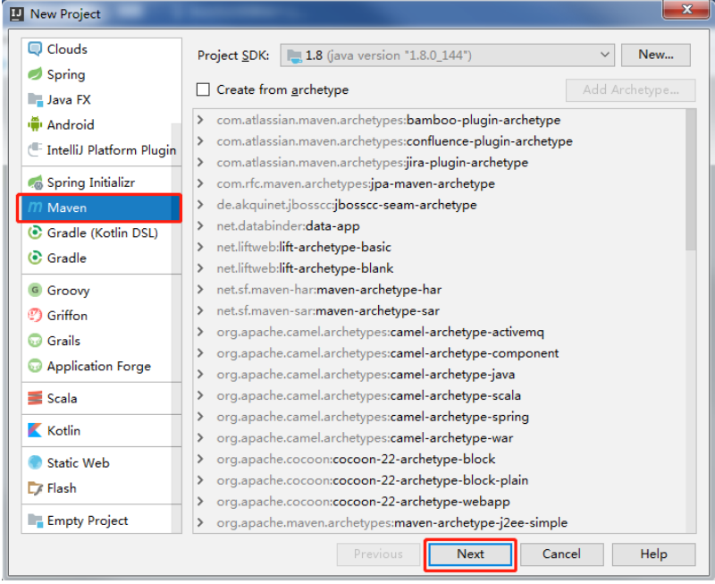

3. GroupId 输入 com.atguigu->ArtifactId 输入 scala->点击 next->点击 Finish 
   注意：工程存储路径一定不要有中文和空格。

4. 指定项目工作目录空间
   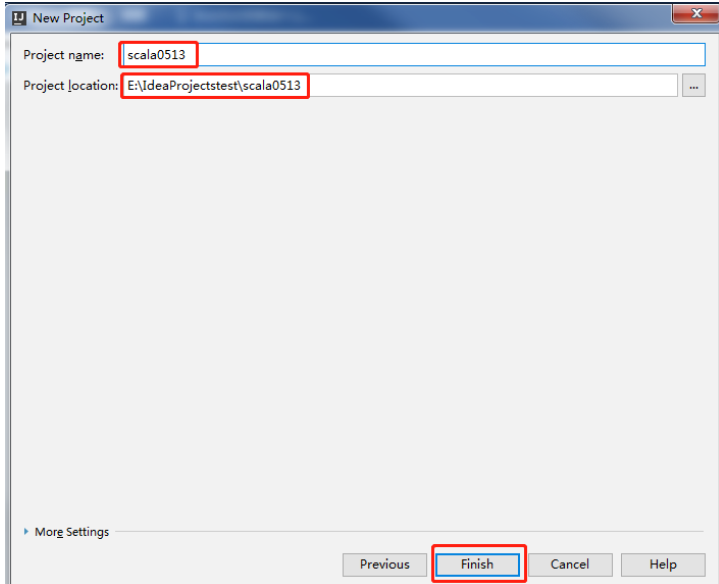

5. 默认下， Maven 不支持 Scala 的开发，需要引入 Scala 框架。

   在 scala0513 项目上， 点击右键-> Add Framework Support... ->选择 Scala->点击 OK
   注意：如果是第一次引入框架， Use libary 看不到，需要选择你的 Scala 安装目录，然
   后工具就会自动识别，就会显示 user libary。

   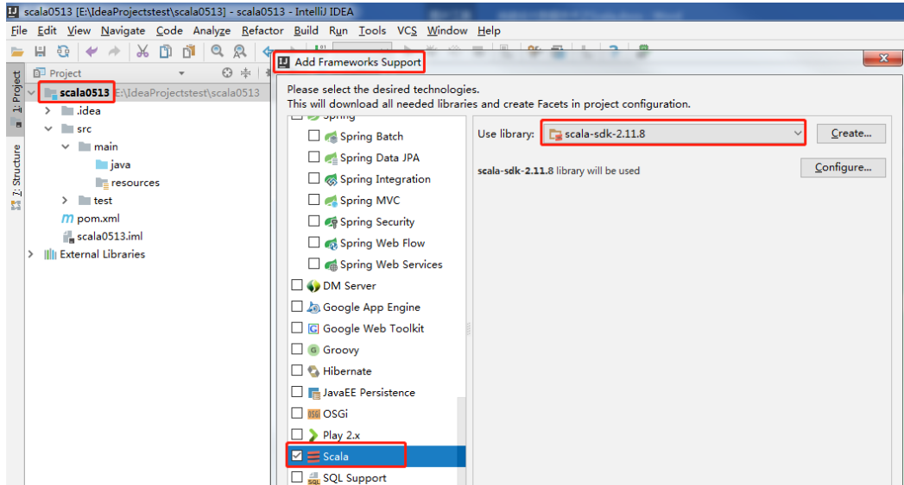

6. 创建项目的源文件目录
   右键点击 main 目录->New->点击 Diretory -> 写个名字（比如 scala）。
   右键点击 scala 目录->Mark Directory as->选择 Sources root， 观察文件夹颜色发生变化。
   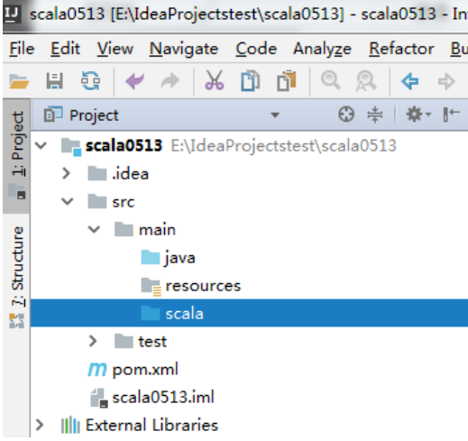

7. 在 scala 包下， 创建包 com.atguigu.chapter01 包名和 Hello 类名，
   右键点击 scala 目录->New->Package->输入 com.atguigu.chapter01->点击 OK。
   右键点击 com.atguigu.chapter01->New->Scala Class->Kind 项选择 Object->Name 项输入
   Hello。

   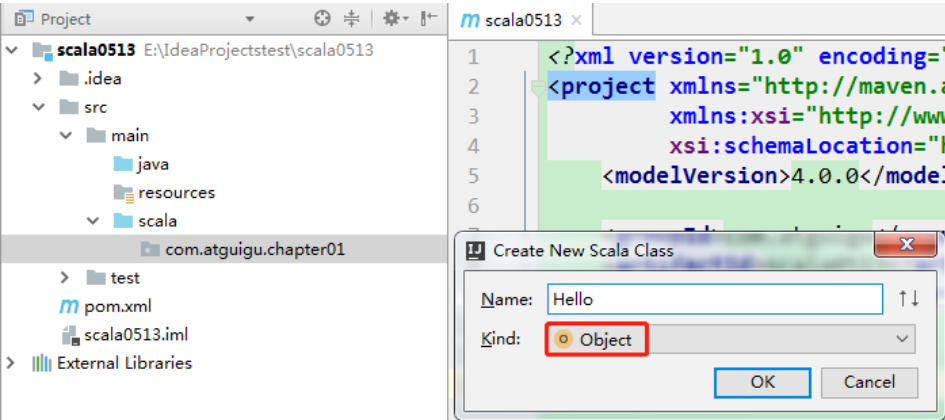

8. 编写输出 Hello Scala 案例
   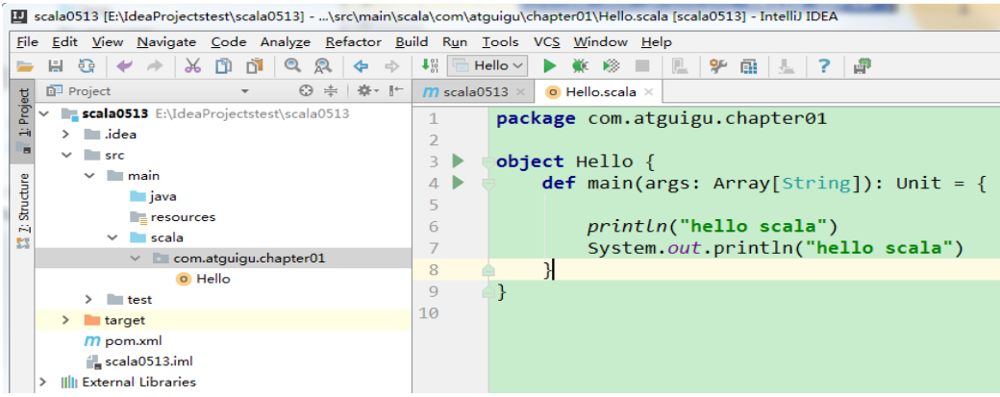


### Class和Object的说明

在scala中, 没有static的概念, 取而代之的是伴生对象, 即该伴生对象是类的一个实例

所有关于类的属性或者方法, 都可以放在这个伴生对象上

可以使用类名来调用伴生对象上的属性和方法


### 反编译Scala程序

1. 在项目的 target 目录 Hello 文件上点击右键->Show in Explorer->看到 object 底层生成
   Hello$.class 和 Hello.class 两个文件

   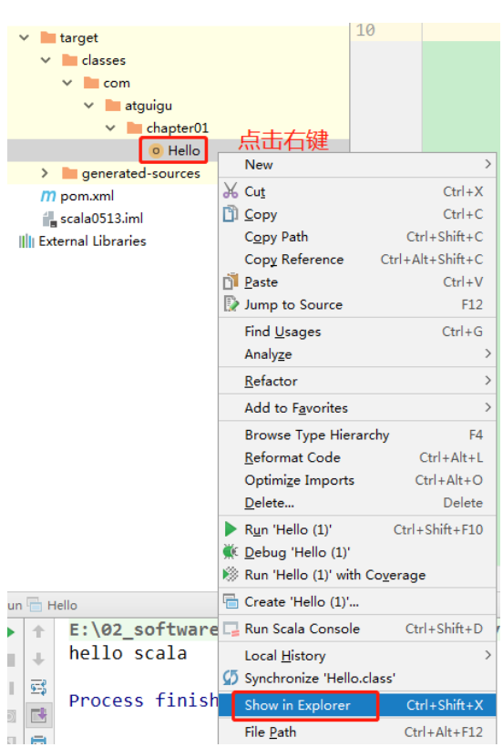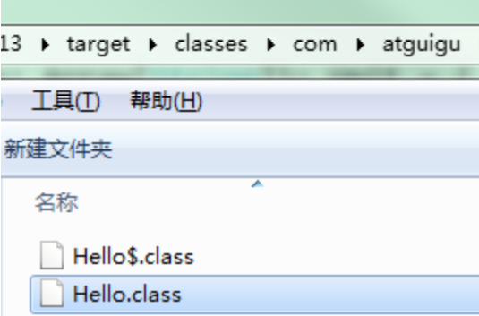

   

2. 采用 Java 反编译工具 jd-gui.exe 反编译代码， 将 Hello.class 拖到 jd-gui.exe 页面  

   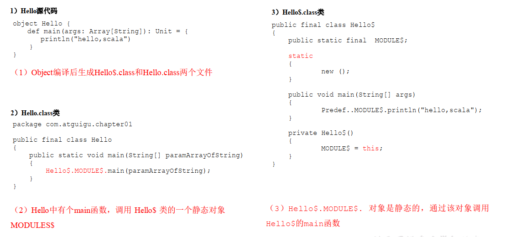

## 关联Scala源码

1. 查看源码
   例如查看 Array 源码。 按住 ctrl 键->点击 Array->右上角出现 Attach Soures…  

   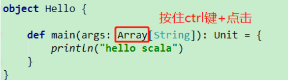

   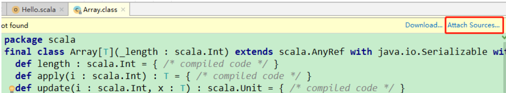

2. 关联源码

   1. 将我们的源码包 scala-sources-2.12.11.tar.gz 拷贝到 D:\Tools\scala-2.12.11\lib 文件夹
      下， 并解压为 scala-sources-2.12.11 文件夹

   2. 点击 Attach Sources…->选择 D:\Tools\scala-2.12.11\lib\scala-sources-2.12.11，这个
      尚硅谷大数据技术之 Scala

      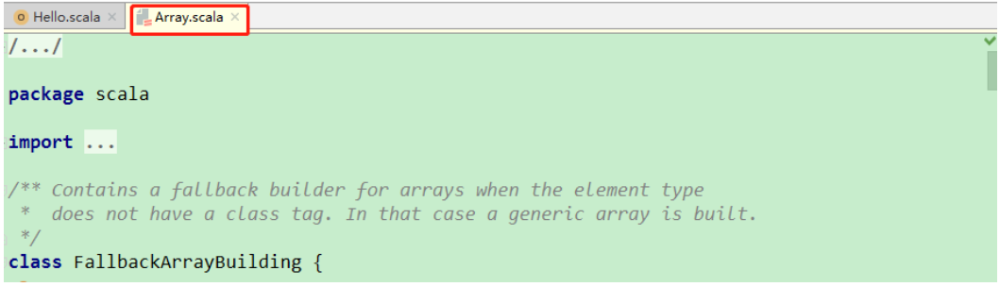


# 变量和基本数据类型

## 注释

1. 单行注释

   ~~~scala
   // 这里是单行注释
   ~~~

2. 多行注释

   ~~~sql
   /*
   	这里是多行注释
   */
   ~~~

3. 文档注释

   ~~~sql
   /*
    *  这里是文档注释
    */
   ~~~

   


## 变量和常量

1. 在scala中, 可以使用var/val声明变量, 格式为`var/val: 类型 = 初始值`

   var是可变的, 类似与java中的普通变量,   val是不可变变量, 类似于java中的final

   ~~~scala
   // 定义变量
   var a: Int = 100
   
   // 定义常量
   val b: Int = 200
   ~~~

2. 变量有自动类型推断

   ~~~scala
   // 自动类型推断
   val c = 300
   ~~~

3. 变量必须要有初始值,  如果变量有类型, 那么可以使用`_`来赋予一个默认的类型初始值

   ~~~scala
   // 如果变量有类型, 那么可以使用_来赋予对应类型的初始值
   val d: Int = _
   
   // 下面这个会报错, 应为不知道什么类型
   val d = _ 
   ~~~

   


## 基本数据类型

1. 在scala中, 基本的数据类型有Byte,Boolean,  Short, Char, Int, Float, Double, Long

   对应java中的8中基本数据类型, 数据类型的范围也是相同的

   ~~~scala
   // Byte
   var n1:Byte = 127
   // Boolean
   var isResult : Boolean = false
   var isResult2 : Boolean = true
   // Short
   var s: Short = 12
   // Char
   var c1: Char = 'a'
   // Int 
   var i: Int = 1000
   // Float
   var n7: Float = 2.2345678912f
   // Double
   var n8: Double = 2.356546d
   // Long
   var n6: Long = 9223372036854775807L
   ~~~

2. Null类型,  只有一个实例null

   **null只能赋值给AnyRef(引用)类型, 而不能给AnyVal(值)类型**

   ~~~scala
   // 赋值给引用类型
   var str: String = null
   // 不能赋值给值类型, 下面会报错
   var i: Int = null 
   ~~~

3. Unit类型, 只有一个实例`()`,  和java中的void类似, 表示不返回任何结果

   ~~~scala
   // unit 表示没有返回值，即 void
   def sayOk(): Unit = {
   }
   ~~~

   

4. Nothing, 如果一个函数只抛出异常, 那么可以使用Nothing作为返回类型

   ~~~scala
   def test(): Nothing = {
   	throw new Exception()
   }
   ~~~

   

## 类型转换

### 自动类型转换

1. 在运算和赋值的时候, 会自动的将精度小的数据类型会自动转换为精度大的数据类型
2. (byte, short)和 char 之间不会相互自动转换。
3. byte， short， char 他们三者可以计算， 在计算时首先转换为 int 类型    

~~~scala
def main(args: Array[String]): Unit = {
	// 自动提升原则：有多种类型的数据混合运算时，系统首先自动将所有数据转换成精度大的那种数值类型，然后再进行计算。
	var n = 1 + 2.0
	println(n) // n 就是 Double
    
	//（ byte， short）和 char 之间不会相互自动转换。
	var n4 : Byte = 1
	//var c1 : Char = n4 //错误
    
	// byte， short， char 他们三者可以计算，在计算时首先转换为 int
	类型。
	var n6 : Byte = 1
	var c2 : Char = 1
	var n : Short = n6 + c2 // Int
}
~~~


### 强制类型转换

将精度大的数值类型转换为精度小的数值类型时, 要加上强制转函数，可能造成精度降低或溢出

~~~scala
// 本质上是调用了Double的toInt()函数
var n1: Int = 2.5.toInt 
~~~


### 基础类型和String类型的转换

1. 基本类型转String类型

   ~~~scala
   def main(args: Array[String]): Unit = {
   	//将基本类型的值+"" 
   	var str1 : String = true + ""
   	var str2 : String = 4.5 + ""
   	var str3 : String = 100 +""
   	//调用相关 API
   	var s1 : String = "12"
   	var n1 : Byte = s1.toByte()
   	var n2 : Short = s1.toShort()
   	var n3 : Int = s1.toInt()
   	var n4 : Long = s1.toLong()
   }
   ~~~

2. String类型转换为基本数据类型

   ~~~scala
   def main(args: Array[String]): Unit = {
   	// 调用String的toXXX方法
       var n4 = "5".toInt()
   }
   ~~~


# 输入和输出

## 输入

可以使用如下函数来获取用户从键盘中的输入, 根据函数不同, 结果也不同

- StdIn.readLine()
- StdIn.readShort()
- StdIn.readDouble()  

~~~scala
def main(args: Array[String]): Unit = {
	// 1 输入姓名
	println("input name:")
	var name = StdIn.readLine()
	// 2 输入年龄
	println("input age:")
	var age = StdIn.readShort()
	// 3 输入薪水
	println("input sal:")
	var sal = StdIn.readDouble()
}
~~~

## 输出

1. 使用`+`进行字符串拼接

   ~~~scala
   var name: String = "jinlian"
   var age: Int = 18
   println(name + " " + age)
   ~~~

2. printf可以使用 %进行传值

   ~~~scala
   var name: String = "jinlian"
   var age: Int = 18
   printf("name=%s age=%d\n", name, age)
   ~~~

3. 可以使用字符串模板

   ~~~scala
   // """"""表示的是多行字符串
   // s表示插值器, 可以在字符串中使用${}来获取变量的值, 或者计算
   // 为了对齐每一行的内容, 可以使用 | 来表示每行的开头, 然后使用stripMargin()方法来格式化
   val s1 =
   s"""
   |select
   | name,
   | age
   |from user
   |where name="$name" and age=${age+2} and sex= ${1+1}
   """.stripMargin
   
   // 如果字符串内有特殊字符, 那么会对其进行转移, 如果不想转义的话, 可以使用raw插值器
   val s = raw"result = \n \t " // 不会进行转义
   
   // 可以使用f插值器, 来传一个格式化的字符串, 类似于C语言中的printf。 \
   // 在使用'f'插值器时，所有变量引用都应该是printf样式格式说明符，如％d，％i，％f等。
   val height = 1.9d
   val name = "TRX"
   println(f"$name%s is $height%2.2f meters tall")
   ~~~

   

# 运算符

## 算数运算符

使用和java类似

| 运算符 | 运算       | 范例       | 结果    |
| ------ | ---------- | ---------- | ------- |
| +      | 正号       | +3         | 3       |
| -      | 负号       | b=4; -b    | -4      |
| +      | 加         | 5+5        | 10      |
| -      | 减         | 6-4        | 2       |
| *      | 乘         | 3*4        | 12      |
| /      | 除         | 5/5        | 1       |
| %      | 取模(取余) | 7%5        | 2       |
| +      | 字符串相加 | “He”+”llo” | “Hello” |

## 关系运算符

scala中的 `==` 类似与java中的 `equals`

scala中的 `eq`类似于java中的 `==`

| 运算符 | 运算     | 范例   | 结果  |
| ------ | -------- | ------ | ----- |
| ==     | 相等于   | 4==3   | false |
| !=     | 不等于   | 4！ =3 | true  |
| <      | 小于     | 4<3    | false |
| >      | 大于     | 4>3    | true  |
| <=     | 小于等于 | 4<=3   | false |
| >=     | 大于等于 | 4>=3   | true  |


## 逻辑运算符

与java中类似

| 运算符 | 描述   | 实例                       |
| ------ | ------ | -------------------------- |
| &&     | 逻辑与 | (A && B) 运算结果为 false  |
| \|\|   | 逻辑或 | (A \|\| B) 运算结果为 true |
| !      | 逻辑非 | !(A && B) 运算结果为 true  |


## 赋值运算符

scala中没有`++`, `--` 

| 运算符 | 描述                                            | 实例                                   |
| ------ | ----------------------------------------------- | -------------------------------------- |
| =      | 简单的赋值运算符，将一个表 达式的值赋给一个左值 | C = A + B 将 A + B 表达式结果赋 值给 C |
| +=     | 相加后再赋值                                    | C += A 等于 C = C + A                  |
| -=     | 相减后再赋值                                    | C -= A 等于 C = C - A                  |
| *=     | 相乘后再赋值                                    | C *= A 等于 C = C * A                  |
| /=     | 相除后再赋值                                    | C /= A 等于 C = C / A                  |
| %=     | 求余后再赋值                                    | C %= A 等于 C = C % A                  |
| <<=    | 左移后赋值                                      | C <<= 2 等于 C = C << 2                |
| >>=    | 右移后赋值                                      | C >>= 2 等于 C = C >> 2                |
| &=     | 按位与后赋值                                    | C &= 2 等于 C = C & 2                  |
| ^=     | 按位异或后赋值                                  | C ^= 2 等于 C = C ^ 2                  |
| \|=    | 按位或后赋值                                    | C \|= 2 等于 C = C \| 2                |


## 位运算符

与java中类似

| 运算符 | 描述           | 实例                                                         |
| ------ | -------------- | ------------------------------------------------------------ |
| &      | 按位与运算符   | (a & b) 输出结果 12 ，二进制解释： 0000 1100                 |
| \|     | 按位或运算符   | (a \| b) 输出结果 61 ，二进制解释： 0011 1101                |
| ^      | 按位异或运算符 | (a ^ b) 输出结果 49 ，二进制解释： 0011 0001                 |
| ~      | 按位取反运算符 | (~a ) 输出结果 -61 ，二进制解释： 1100 0011， 在 一个有符号二进制数的补码形式。 |
| <<     | 左移动运算符   | a << 2 输出结果 240 ，二进制解释： 0011 0000                 |
| >>     | 右移动运算符   | a >> 2 输出结果 15 ，二进制解释： 0000 1111                  |
| >>>    | 无符号右移     | a >>>2 输出结果 15, 二进制解释: 0000 1111                    |


## 运算符的本质

运算符的本质是方法, 然后叠加语法糖

1. 如果方法只有一个参数, 或者没有参数 , 那么()可以省略
2. 在调用方法的时候, 可以省略 `.`

~~~scala
def main(args: Array[String]): Unit = {
	// 标准的加法运算
	val i:Int = 1.+(1)
	// 当调用对象的方法时， .可以省略
	val j:Int = 1 + (1)
	// 如果函数参数只有一个，或者没有参数， ()可以省略
	val k:Int = 1 + 1
}
~~~


# 流程控制

## if-else

1. 结构和java类似,  if-elseif-else

   ~~~scala
   if (条件表达式 1) {
   	执行代码块 1
   }
   else if (条件表达式 2) {
   	执行代码块 2
   }
   else if (条件表达式 3) {
   	执行代码块 3
   }
   else {
   	执行代码块 n
   }
   ~~~

2. scala中万物皆对象, if-else本质上也是一个函数, 所以也可以所有返回值

   ~~~scala
   def main(args: Array[String]): Unit = {
   	println("input age")
   	var age = StdIn.readInt()
   	val res :String = if (age < 18){
   		"童年"
   	}else if(age>=18 && age<30){
   		"中年"
   	}else{
   		"老年"
   	}
   	println(res)
   }
   ~~~

   

## for循环

1. 循环范围

   ~~~scala
   // 左闭右闭
   for(i <- 0 to 3){
   	print(i + " ")
   }
   // 左闭右开
   for(i <- 0 until 3) {
   	print(i + " ")
   }
   ~~~

2. 模式守卫

   ~~~scala
   for(i <- 1 to 3 if i != 2) {
   	print(i + " ")
   }
   ~~~

3. 循环步长

   ~~~scala
   for (i <- 1 to 10 by 2) {
   	println("i=" + i)
   }
   ~~~

4. 嵌套循环

   ~~~scala
   for(i <- 1 to 3; j <- 1 to 3) {
   	println(" i =" + i + " j = " + j)
   }
   
   // 等价于
   for (i <- 1 to 3) {
   	for (j <- 1 to 3) {
   		println("i =" + i + " j=" + j)
   	}
   }
   ~~~

5. 引入变量

   ~~~scala
   for(i <- 1 to 3; j = 4 - i) {
   	println("i=" + i + " j=" + j)
   }
   // 等价于
   for (i <- 1 to 3) {
   	var j = 4 - i
   	println("i=" + i + " j=" + j)
   }
   ~~~

6. 循环返回值,  类似于于python中的收集器

   ~~~scala
   val res = for(i <- 1 to 10) yield i
   println(res) // 返回的是Vector
   ~~~

7. 倒叙

   ~~~scala
   for(i <- 1 to 10 reverse){
   	println(i)
   }
   ~~~

8. <font color=red>在scala中, 如果for循环的推导式有多个表达式时, 一般使用`{}`和换行</font>

   ~~~scala
   for {
   	i <- 1 to 3
   	j = 4 - i
   } {
   	println("i=" + i + " j=" + j)
   }
   // 等价于
   for (i <- 1 to 3) {
   	var j = 4 - i
   	println("i=" + i + " j=" + j)
   }
   ~~~


## While和do While循环

和java中的类似

~~~scala
var i = 0
while (i < 10) {
	println("宋宋，喜欢海狗人参丸" + i)
	i += 1
}
~~~


~~~scala
var i = 0
do {
	println("宋宋，喜欢海狗人参丸" + i)
	i += 1
} while (i < 10)
~~~


## 循环中断

为了能够更契合函数式编码的风格,  scala中没有break和contine, 如果需要使用break和continue, 那么有如下几种办法

1. 使用异常

   ~~~scala
   def main(args: Array[String]): Unit = {
   	try {
   		for (elem <- 1 to 10) {
   			println(elem)
   			if (elem == 5) throw new RuntimeException
   		}
   	} catch {
   		case e =>
   	}
   	println("正常结束循环")
   }
   ~~~

2. 使用scala提供的工具类

   ~~~scala
   // 1. 导入Breaks工具类
   import scala.util.control.Breaks._
   object TestBreak {
   	def main(args: Array[String]): Unit = {
           // 将for循环传入到breakable中, breakable本质上是一个函数
   		breakable {
   			for (elem <- 1 to 10) {
   				println(elem)
   				if (elem == 5) 
                   	break() // 调用break()抛出异常, 退出breakable函数
   			}
   		}
   		println("正常结束循环")
   	}
   }
   ~~~

3. 使用if else

   ~~~scala
   object TestBreak {
   	def main(args: Array[String]): Unit = {
   		for (elem <- 1 to 10) {
   			if (elem % 2 == 1) {
   				println(elem)
   			} else {
   				println("continue")
   			}
   		}
   	}
   }
   ~~~

   


# 函数式编程

## 函数基础

### 函数定义

1. 基本语法

   ~~~scala
   def sum(x: Int, y: Int): Int = {
       return x + y
   }
   
   val c = sum(10, 20) // 调用函数
   ~~~

2. <font color=red>scala中的函数没有重载和重写的概念, 他是一个独立的对象</font>

3. scala可以在函数中定义函数

   ~~~scala
   def sum(x: Int, y: Int): Int = {
       def add(x: Int, y: Int): Int = {
           return x + y
       }
       return add(x, y)
   }
   ~~~

4. <font color=red>函数也是对象, 所以可以赋值给变量</font>

   ~~~scala
   def f(s: String): String = {
         return s + " jinlian"
   }
   val f1 = f _ // 通过下划线表示f作为一个值传递给f1
   val f2 = f(_) // 与上面一样
   val f3: () => String = f // 定义f3的类型, 将f当做一个值, 而非函数调用
   ~~~
~~~
   
5. 函数也是对象, 所以可以作为返回值

   ~~~scala
   def f1() = {
   	def f2() = {}
   	f2 _
   }
   val f = f1()
   // 因为 f1 函数的返回值依然为函数，所以可以变量 f 可以作为函数继续调用
   f()
   // 上面的代码可以简化为
   f1()()
~~~

6. 函数也是对象, 所以可以作为参数

   ~~~scala
   def add(a: Int, b: Int): Int = a + b
   def f1(f: (Int, Int) => Int): Int = {
   	f(2, 4)
   }
   
   f1(add) // 通过f1的形参可以推断出这里要传值而不是函数调用
   f1(add _) // 通过下划线直接指定这里的add是传值
   ~~~

   

### 函数参数

函数的参数有普通参数, 带默认值的参数, 可变参数

如果一个函数的参数三种类型都有, 那么需要按照`普通参数, 带默认值的参数, 可变参数`的格式进行声明

~~~scala
// 默认参数
def add(a: Int, b: Int = 10): Int = {
    return a + b
}
add(10)
add(10, 20)
add(a = 10, b = 20) // 直接指定参数的名称

// 可变参数
def test(s : String*): Unit = {
	println(s)
}
~~~


### 函数的语法糖

1. return可以省略, scala将使用函数体的最后一行的结果作为返回值
2. 如果函数只有一行, 那么可以省略花括号
3. 如果返回值类型可以推断出来, 那么可以省略
4. 如果函数体中有return, 那么就不能省略返回值类型了
5. 如果函数的返回值类型是Unit, Nothing, 那么可以省略返回值类型和等号
6. 如果函数没有参数, 但是在声明的时候添加了`()`, 那么在调用的时候`()`可以省略

~~~scala
  def main(args: Array[String]): Unit = {
    // 0. 函数标准写法
    def f(s: String): String = {
      return s + " jinlian"
    }
    println(f("Hello"))

    // 1. return可以省略, scala将使用函数体的最后一行的结果作为返回值
    def f1(s: String): String = {
      s + " jinlian"
    }
    println(f1("Hello"))

    //2. 如果函数体只有一行代码，可以省略花括号
    def f2(s: String): String = s + " jinlian"
      
    // 3. 返回值类型如果能够推断出来，那么可以省略
    def f3(s: String) = s + " jinlian"
    println(f3("Hello3"))

    // 4. 如果有 return，则不能省略返回值类型，必须指定。
    def f4(): String = {
      return "ximenqing4"
    }
    println(f4())
      
    // 5. 如果返回的是Unit, Nothing,可以省略等号
    def f6(s: String) {
      print(s"hello, $s")
    }
    println(f6())
  }
~~~

如果函数无参，那么参数列表可加可不加

如果添加了参数列表, 那么在调用的时候, 括号可加可不加

如果省略了参数了列表, 那么在调用的时候, 一定要省略小括号

~~~scala
    // 函数无参, 添加了参数列表, 调用时()可加可不加
    def f7(): Int = {
        1+1
    }
    println(f7())
    println(f7)

	// 函数无参, 省略了参数列表, 调用的时候不能添加()
	def f8 = 1 + 1
	println(f8)
	// println(f8()) // 报错
    
~~~


## 函数高级

### 函数表达式

1. 语法

   ~~~scala
   (parameter1: Type1, parameter2: Type2, ...) => { function body }
   ~~~

   以下是一些常见的例子：

   ~~~scala
   (x: Int) => x + 1        // 一个简单的函数，接受一个Int类型的参数，返回这个参数加1
   (x: Int, y: Int) => x + y // 接受两个Int类型参数，返回它们的和
   () => println("Hello!")  // 一个不接受参数的函数，打印一条消息
   ~~~

2. 使用场景

   1. 作为匿名函数传递给高阶函数

      ~~~scala
      val numbers = List(1, 2, 3, 4, 5)
      
      // 使用函数表达式传递给 map 方法
      val doubled = numbers.map((x: Int) => x * 2)
      ~~~
      
   2. 赋值给变量

      ~~~scala
      val addOne = (x: Int) => x + 1
      println(addOne(5)) // 输出: 6
      
      val greet = (name: String) => s"Hello, $name!"
      println(greet("Scala")) // 输出: Hello, Scala!
      ~~~

   3. 作为参数或者返回值

      ~~~scala
      def processNumbers(numbers: List[Int], processor: Int => Int): List[Int] = {
        numbers.map(processor)
      }
      
      val result = processNumbers(List(1, 2, 3, 4), (x: Int) => x * x)
      println(result) // 输出: List(1, 4, 9, 16)
      ~~~


### 函数表达式的语法糖

1. 参数的类型可以省略，会根据形参进行自动的推导
2. 类型省略之后，发现只有一个参数，则圆括号可以省略；
3. 匿名函数如果只有一行， 则大括号也可以省略
4. 如果参数只出现一次，则参数省略且后面参数可以用_代替  

~~~scala
def operation(arr: Array[Int], op: Int => Int) = {
	for (elem <- arr) yield op(elem)
}

// 1. 参数的类型可以省略，会根据形参进行自动的推导;
val arr2 = operation(Array(1, 2, 3, 4), (ele) => {
	ele + 1
})

// 2. 类型省略之后，发现只有一个参数，则圆括号可以省略；
val arr3 = operation(Array(1, 2, 3, 4), ele => {
	ele + 1
})

// 3. 匿名函数如果只有一行，则大括号也可以省略
val arr4 = operation(Array(1, 2, 3, 4), ele => ele + 1)

// 4. 如果参数只出现一次，则参数省略且后面参数可以用_代替
val arr5 = operation(Array(1, 2, 3, 4), _ + 1)
}
// 两个参数也可以
def calculator(a: Int, b: Int, op: (Int, Int) => Int): Int = {
	op(a, b)
}
calculator(2, 3, _ + _)
~~~


### 扩展

~~~scala
// 函数表达式标准语法
val f1: String => Unit = (x: String) => {
    println(s"wusong, $x")
}
// 函数表达式省略花括号,  变量f1省略类型
val f2 = (x: String) => println(s"wusong, $x")


// 标准写法, f8是一个返回函数的函数, 他的类型是 () => String => Unit
def f8(): String => Unit = {
    // 返回一个函数表达式
    return (x: String) => {
        println(s"wusong, $x")
    } 
}
// 函数表达式简化为1行
def f9(): String => Unit = (x: String) => println(s"wusong, $x")
// 函数省略返回值
def f10() = (x: String) => println(s"wusong, $x")
// 函数无参, 可以省略参数列表
def f11 = (x: String) => println(s"wusong, $x")
~~~

到最后你会发现

~~~scala
val f2 = (x: String) => println(s"wusong, $x")
def f10() = (x: String) => println(s"wusong, $x")
def f11 = (x: String) => println(s"wusong, $x")
~~~

他们的区别在于

- f2是一个函数, 传入一个string, 进行打印
- f10是一个返回函数的函数,  每次调用都会返回一个传入string然后打印的函数
- f11和f10相同, 但是在调用的时候不能使用`()`

他们的调用

~~~scala
f2("hello")
f10()("hello")
f11("hello")
~~~


### 扩展2

当一个函数的参数只有一个的时候, 那么我们可以直接给他传递一个代码块, scala会执行代码块, 然后将最后一行作为结果, 作为参数传递给函数

同时小括号可以省略

~~~scala
def printFullName(name: String): Unit = {
  println(s"Hello, $name!")
}
printFullName {
  "Alice"
}
~~~


这种语法使用最多的就是高阶函数了

~~~scala
val numbers = List(1, 2, 3, 4, 5)
numbers.foreach(n => {
  val squared = n * n
  println(s"Square of $n is $squared")
})

numbers.foreach { n =>
  val squared = n * n
  println(s"Square of $n is $squared")
}
~~~

同时这种语法还可以和模式匹配相结合

~~~scala
val numbers = List(1, 2, 3, 4, 5)

numbers.foreach {
  case x if x % 2 == 0 => println(s"$x is even")
  case x => println(s"$x is odd")
}
~~~


## 柯里化

柯里化是将一个接受多个参数的函数转换为一系列接受单个参数的函数的过程。

通俗地说，就是将原本需要一次传入多个参数的函数，转换成可以分多次传入每个参数的形式。

1. 定义柯里化函数

   ~~~scala
   // 定义一个柯里化的加法函数
   def add(x: Int)(y: Int): Int = x + y
   
   // 定义一个柯里化的字符串连接函数
   def concatenate(str1: String)(str2: String): String = str1 + str2
   
   // 定义一个柯里化的函数，用于计算一个线性方程 ax + b
   def linearEquation(a: Int)(b: Int)(x: Int): Int = a * x + b
   ~~~

2. 使用柯里化函数

   ~~~scala
   val result1 = add(2)(3) // 输出: 5
   val result2 = concatenate("Hello, ")("World!") // 输出: Hello, World!
   val result3 = linearEquation(2)(3)(5) // 输出: 13
   ~~~

3. 部分应用函数

   ~~~scala
def sum(x: Int, y:AnyRef, z:Int): Int = x+y+z
   
   // 部分应用函数, 即只传入部分参数, 生成一个新的函数
   val sum1 = sum(10, _, 20) 
   val sum2 = sum(10, _:Int, 20) // 也可以带上类型, 表示限定只能传入Int
   sum1(20) // 50
   ~~~
   
   
   
4. 部分应用柯里化函数

   柯里化函数的一个主要优势是可以方便地进行部分应用，先传递部分参数，然后得到一个新的函数，后续再传递剩余的参数：

   ~~~scala
   // 部分应用 add 函数
   val addTwo = add(2) _ // addTwo 是一个接受一个 Int 并返回 Int 的函数
   println(addTwo(3)) // 输出: 5
   
   // 部分应用 linearEquation 函数
   val yIntercept3 = linearEquation(2)(3) _ // yIntercept3 是一个接受一个 Int 并返回 Int 的函数
   println(yIntercept3(5)) // 输出: 13
   ~~~

5. 将普通函数进行柯里化

   ~~~scala
   val normalAdd: (Int, Int) => Int = (x, y) => x + y
   
   // 将普通函数转换为柯里化函数
   val curriedAdd = normalAdd.curried
   
   println(curriedAdd(2)(3)) // 输出: 5
   ~~~

6. 将柯里化函数转换为普通函数

   ~~~scala
   val curriedFunction: Int => Int => Int = (x: Int) => (y: Int) => x + y
   
   // 将柯里化函数转换为普通函数
   val uncurriedFunction = Function.uncurried(curriedFunction)
   
   println(uncurriedFunction(2, 3)) // 输出: 5
   ~~~

   


# 面向对象

## 包

### 定义包

~~~scala
// 方式1
package com.atguigu.oa

// 方式2
package com{
    package atguigu{
        oa
    }
}
~~~

### 包对象

每个包都有一个与包名相同的包对象, 定义在保对象中的成员, 会作为其包下所有class和object的共享变量, 可以直接访问

1. 如果是使用方式1来定义包, 那么就在这个包下创建一个`package.scala`的文件

   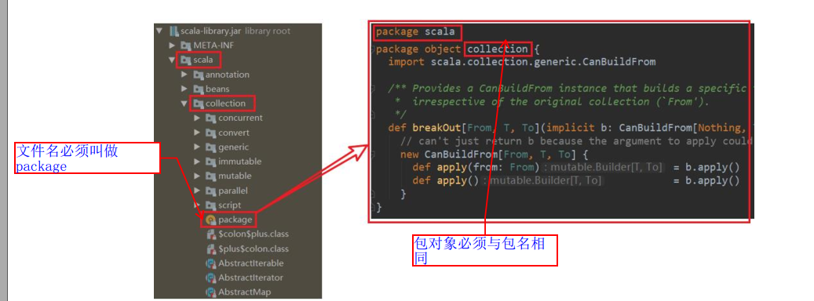

2. 如果是使用方式2来定义包, 那么可以将包对象与包声明放在同一个文件中

   ~~~scala
   package com {
   	object Outer {
   		val out: String = "out"
   		def main(args: Array[String]): Unit = {
   			println(name)
   		}
   	}
   }
   // 包对象与包同级
   package object com {
       val name: String = "com"
   }
   ~~~


### 导包

1. 和 Java 一样，可以在顶部使用 import 导入， 在这个文件中的所有类都可以使用。
2. 局部导入：什么时候使用，什么时候导入。 在其作用范围内都可以使用
3. 通配符导入： `import java.util._`
4. 给类起名： `import java.util.{ArrayList=>JL}`
5. 导入相同包的多个类： `import java.util.{HashSet, ArrayList}`
6. 屏蔽类： `import java.util.{ArrayList =>_}`
7. 可以使用`_root_`来导入jdk下的包

下面是一些使用案例

| import com.atguigu.Fruit              | 引入 com.atguigu 包下 Fruit（ class 和 object）             |
| ------------------------------------- | ----------------------------------------------------------- |
| import com.atguigu._                  | 引入 com.atguigu 下的所有成员                               |
| import com.atguigu.Fruit._            | 引入 Fruit(object)的所有成员                                |
| import com.atguigu.{Fruit,Vegetable}  | 引入 com.atguigu 下的 Fruit 和 Vegetable                    |
| import com.atguigu.{Fruit=>Shuiguo}   | 引入 com.atguigu 包下的 Fruit 并更名为 Shuiguo              |
| import com.atguigu.{Fruit=>Shuiguo,_} | 引入 com.atguigu 包下的所有成员，并将 Fruit 更名 为 Shuiguo |
| import com.atguigu.{Fruit=>_,_}       | 引入 com.atguigu 包下屏蔽 Fruit 类                          |
| new _root_.java.util.HashMap          | 引入的 Java 的绝对路径                                      |


> Scala 中的三个默认导入分别是
> import java.lang._
> import scala._
> import scala.Predef._  


## 类和对象


### 定义类

格式为: 

~~~scala
[修饰符] class 类名 {
	类体
}
~~~

1. scala中不需要和java一样, 类必须和文件名相同

2. 一个scala文件中可以有多个类

3. 修饰符可以是private, protect

4. scala中没有public关键字,  什么都不加默认就是public

5. 如果一个类, 没有类体, 那么就可以省略大括号

   ~~~scala
   class Person(name: String)
   ~~~

   

### 定义属性

~~~scala
class Person {
	var name: String = "bobo" //定义属性
	var age: Int = _ // _表示按照类型给一个默认值
    
    val hight: Int = 100 // val不能使用_设置默认值, 必须显示指定
    
	// 添加该注释, 自动生成getter, setter
	@BeanProperty 
    var sex: String = "男"
    
    // 定义方法
    def sayHi(msg: String): Unit = {
        print(s"${name} - $msg")
    }
	
}
object Person {
	def main(args: Array[String]): Unit = {
		var person = new Person()
		println(person.name)
		person.setSex("女")
		println(person.getSex)
	}
}
~~~

<font color=red>在scala中尽管声明了一个public的age属性, 但是底层这个属性age还是private的, 所以Scala并不推荐将属性设置为private</font>

只是额外生成了一个与属性同名的age()方法, 所以调用object.age的时候其实调用的是object.age(), 无参函数可以省略小括号

而在调用object.age = 15的时候, 实际上调用的是object.age_=(15)

但由于很多 Java 框架都利用反射调用 getXXX 和 setXXX 方法，有时候为了和这些框架兼容，也会为 Scala 的属性设置 getXXX 和 setXXX 方法（通过@BeanProperty 注解实现）。  


### 重载

和java类似, 使用参数类型和个数来判断重载,  而不是使用返回值

~~~scala
class Person {
    def sayHi(msg: String): Unit = {
        print(s"${name} - $msg")
    }
    
    def sayHi(msg: String, name: String) = {}
	
}
~~~


### 访问权限

下面是java和scala中的访问权限对比

|         | scala                      | java           |
| ------- | -------------------------- | -------------- |
| private | 当前类型, 内部类与伴生对象 | 当前类与内部类 |
| default | 当前类与子类               | 当前包         |
| protect | 指定的包名可以访问         | 当前包与子类   |
| public  | 任何地方                   | 任何地方       |


### 创建对象

格式: `val | var  对象名[: 类型] = new 类型()`

~~~scala
class Person {
	var name: String = "canglaoshi"
}
object Person {
	def main(args: Array[String]): Unit = {
     	val person = new Person() // 创建对象
        person.name = "xxx" // 访问属性

        val person1 = new Person() // 使用自动类型推断
	}
}
~~~


### 构造函数

scala中类的构造函数分为: 主构造函数, 辅助构造函数

1. 类只能有一个主构造函数
2. 可以有多个辅助构造函数, 他们之间通过参数类型和参数格式区分
3. 辅助构造函数必须直接或者间接调用主构造函数
4. 如果主构函数没有参数, 那么可以省略小括号

~~~scala
class HelloWorld (b: String){

  var fieldc: String = _
    
  def this(a: Int, b: String) {
    this(b) // 调用主构造函数
    this.fieldc = b
    println("这里是辅助构造器")
  }
    
  // 在这里编写主构造函数代码
  println("这里是主构造器")
    
}
~~~


如果要将主构造函数设置为私有的, 即该类只能调用静态的方法来生成, 那么可以按照如下方法

~~~scala
class Person private (val name: Int){}

object Person{
    def newInstance(name: Int): Person = {
        new Person(name)
    } 
}
~~~


### 构造函数参数

Scala 类的主构造器函数的形参包括三种类型：未用任何修饰、 var 修饰、 val 修饰

1. 未用任何修饰符修饰，这个参数就是一个局部变量
2. var 修饰参数，作为类的成员属性使用，可以修改, scala会为他生成getter方法
3. val 修饰参数，作为类只读属性使用，不能修改  , scala会为他生成getter和setter方法
4. 如果你想要设置属性的访问修饰符, 那么可以在构造函数参数前添加
5. 构造函数参数可以有默认值

~~~scala
class Person(name: String = "张三", private var age: Int, val sex: String) {}

object Test {
	def main(args: Array[String]): Unit = {
		var person = new Person("bobo", 18, "男")
		// 1. 未用任何修饰符修饰，这个参数就是一个局部变量
		// printf(person.name)
        
		// 2. var 修饰参数，作为类的成员属性使用，可以修改
		person.age = 19
		println(person.age)
        
    	// 3. val 修饰参数，作为类的只读属性使用，不能修改
		// person.sex = "女"
	}
}
~~~


### apply方法

在scala中, 可以直接调用变量, scala转而会调用变量的apply方法

~~~scala
class Person(var name: String, var age: Int, val sex: String) {
    def apply() {
        print(s"$name, $age, $sex")
    }
    // 可以重载
    def apply(msg: String){
        print(s"$name, $age, $sex, ${msg}")
    }
}
val p = new Person("zhangsan", 13, "nan")
p()
p("hello")
~~~


### 运算符重载

下面实现了一个分数的类, 同时实现了运算符重载

~~~scala
  class Rational(val n: Int, val d: Int) {
    require(d != 0)

    override def toString: String = {
      n + "/" + d
    }
    def plus (that: Rational): Rational = {
      new Rational(this.n * that.n, this.d * that.d)
    }

    def *(that: Rational): Rational = {
      new Rational(this.n * that.n, this.d * that.d)
    }
  }

  println(new Rational(10, 2) * new Rational(10, 2))
~~~


## 继承

~~~scala
class Person(nameParam: String) {
	var name = nameParam
	var age: Int = _
    val weight: Int = 100
    
	def this(nameParam: String, ageParam: Int) {
		this(nameParam)
		this.age = ageParam
		println("父类辅助构造器")
	}
    
    def sayHi() {
        print("hello")
    }
    
	println("父类主构造器")
}

// 在继承的时候, 必须指定使用父类的哪个构造函数, 并将自己构造函数中的参数传递过去
// 这里指定使用父类的(String, Int)的构造函数
// 并将自己的nameParma和ageParma传递给父类
class Emp(nameParam: String, ageParam: Int) extends Person(nameParam, ageParam) {
	var empNo: Int = _
    
    // 子类可以重写父类的val变量, 但是不能重写var变量
    // 应为var变量是可变的, 直接使用就行了, 没必要重写
    @Override
    val weight: Int = 200
    
	def this(nameParam: String, ageParam: Int, empNoParam: Int) {
		this(nameParam, ageParam)
		this.empNo = empNoParam
		println("子类的辅助构造器")
	}
    println("子类主构造器")
    
    // 子类可以重写父类的方法, 必须标记@Override
    @Override
    def sayHi() {
        print("xxx")
    }
}

object Test {
	def main(args: Array[String]): Unit = {
		new Emp("z3", 11,1001)
	}
}
~~~


## 抽象类

#### 抽象属性和抽象方法

1. 定义抽象类： `abstract class Person{}` //通过 abstract 关键字标记抽象类
2. 定义抽象属性： `val | var name:String` //一个属性没有初始化，就是抽象属性
3. 定义抽象方法： `def hello():String` //只声明而没有实现的方法，就是抽象方法  

~~~scala
abstract class Person {
	val name: String
	def hello(): Unit
    def say(): String = {
        "hello world"
    }
}

class Teacher extends Person {
    // 实现不需要@Override
	val name: String = "teacher"
	def hello(): Unit = {
		println("hello teacher")
	}
    
    // 重写需要@Override
    @Override
    def say(): String = {
        "hello xxx"
    }
}
~~~

1. 抽象类无法实例化

2. 如果父类是抽象类, 那么子类必须实现抽象方法和抽象属性,  否则也要声明为抽象类

3. 子类调用父类中的方法可以使用super

4. 对于重写, 需要对方法标记`@Override`, 而实现不需要

   

#### 匿名子类

和java类似, 直接在new后面加一个大括号

~~~scala
abstract class Person {
	val name: String
	def hello(): Unit
}
object Test {
	def main(args: Array[String]): Unit = {
		val person = new Person {
			override val name: String = "teacher"
			override def hello(): Unit = println("hello teacher")
		}
	}
}
~~~


## 多态

在scala中, 属性和方法都是动态绑定的, 所以在调用对象的属性和方法的时候, 获取到的都是真实类型的属性和方法

而在java中, 只有方法是动态绑定的, 也就是说在调用对象的属性和方法的时候, 只有方法是针对类型的方法

java代码:

~~~java
class Person {
    public String name = "person";

    public void hello() {
        System.out.println("hello person");
    }
}

class Teacher extends Person {
    public String name = "teacher";

    @Override
    public void hello() {
        System.out.println("hello teacher");
    }
}

public class TestDynamic {
    public static void main(String[] args) {
        Teacher teacher = new Teacher();
        Person teacher1 = new Teacher();

        System.out.println(teacher.name);  // teacher
        teacher.hello();                   // hello teacher

        System.out.println(teacher1.name); // person, 因为引用类型是Person, 所以获取的是Person.name
        teacher1.hello();                  // hello teacher 
    }
}
~~~

scala代码

~~~scala
class Person {
  val name: String = "person"
  
  def hello(): Unit = {
    println("hello person")
  }
}

class Teacher extends Person {
  override val name: String = "teacher"
  
  override def hello(): Unit = {
    println("hello teacher")
  }
}

object Test {
  def main(args: Array[String]): Unit = {
    val teacher: Teacher = new Teacher()
    println(teacher.name) // Output: teacher
    teacher.hello()       // Output: hello teacher

    val teacher1: Person = new Teacher
      // 属性和方法获取到的都是实际类型的
    println(teacher1.name) // Output: teacher
    teacher1.hello()       // Output: hello teacher
  }
}
~~~


## 伴生对象

### 语法

Scala语言是完全面向对象的语言， 所以并没在Scala中没有静态的概念 。

但是为了能够和Java语言交互（因为Java中有静态概念），就产生了一种特殊的对象来模拟类对象， 该对象为单例对象。

<font color=red>若单例对象名与类名一致，则称该单例对象这个类的伴生对象，这个类的所有“静态” 内容都可以放置在它的伴生对象中声明  </font>

~~~scala
// 1. 伴生对象采用 object 关键字声明
object Person {
	var country: String = "China"
}
// 2. 伴生对象对应的类称之为伴生类，伴生对象的名称应该和伴生类名一致。
class Person {
	var name: String = "bobo"
}
object Test {
	def main(args: Array[String]): Unit = {
		// 3. 伴生对象中的属性和方法都可以通过伴生对象名（类名）直接调用访问。
		println(Person.country)
	}
}
~~~


### 伴生对象的特殊用法

伴生对象也有apply方法, 所以可以使用apply方法来创建对象, 同时将类的构造函数设置为私有的

~~~scala
object Person{
    def apply(){
        new Person
    }
}
// 设置构造函数为私有
class Person private() {}

val p = Person()
~~~

上面的代码等效于java中的

~~~java
public class Person{
    public static Person newInstance() {
        return Person
    }
    private Person(){}
}
~~~


## 特质

### 声明特质

Scala中没有接口的概念, 但是有特质(trait)

**trait类似于抽象类, 可以有属性和方法, 但是不能实例化**

**一个类可以继承多个特质**

**java中的所有接口, 都可以作为trait使用**

**特质不能有 有参构造函数, 而抽象类可以**

~~~scala
trait PersonTrait {
	var name:String = _ // 声明属性
	def eat():Unit={} // 声明方法
	var age:Int  // 抽象属性
	def say():Unit // 抽象方法
}
~~~


### 继承特质

一个class最多有一个父类, 但是可以继承多个特质

同时特质也可以继承多个特质

在继承的时候, 继承的第一个父类或者特质使用`extends`关键字, 其他使用`with`关键字


~~~scala
trait PersonTrait {
	var name:String = _ // 声明属性
	def eat():Unit={} // 声明方法
	var age:Int  // 抽象属性
	def say():Unit // 抽象方法
}
trait SexTrait {
	var sex: String
}

// 一个类可以实现/继承多个特质
// 所有的 Java 接口都可以当做 Scala 特质使用
class Teacher extends PersonTrait with java.io.Serializable with SexTrait{
    // 实现特质的相关方法
	override def say(): Unit = {
		println("say")
	}
	override var age: Int = _
    override var sex: String = "男"
    
}
~~~

一个特质继承多个特质

~~~scala
trait TraitA {
  def methodA(): String = "Method A"
}

trait TraitB {
  def methodB(): String = "Method B"
}

trait CombinedTrait extends TraitA with TraitB {
  def combinedMethod(): String = s"${methodA()} and ${methodB()}"
}
~~~


### 动态混入

可以在创建对象的时候, 混入特质, 有点像匿名类

~~~scala
trait SexTrait {
	var sex: String
}

object TestTrait {
	def main(args: Array[String]): Unit = {
        
		val t2 = new Teacher with SexTrait {
			override var sex: String = "男"
		}
		//调用混入 trait 的属性
		println(t2.sex)
	}
}
~~~


### 线性化与特质的堆叠

由于一个类可以混入（ mixin）多个 trait，且 trait 中可以有具体的属性和方法

若混入的特质中具有相同的方法（方法名，参数列表，返回值均相同），必然会出现继承冲突问题。

冲突分为以下两种 :

1. 一个类（ Sub）混入的两个 trait（ TraitA， TraitB）中具有相同的具体方法，且两个 trait 之间没有任何关系

   解决这类冲突问题，<font color=red>直接在类（ Sub）中重写冲突方法。  </font>

   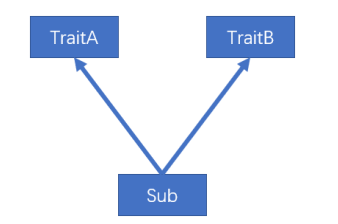

2. 一个类（ Sub）混入的两个 trait（ TraitA， TraitB）中具有相同的具体方法，且两个 trait 继承自相同的 trait(TraitC) ，这就是所谓的“钻石问题”

   解决这类冲突问题， Scala采用了线性化特质叠加的策略。  

   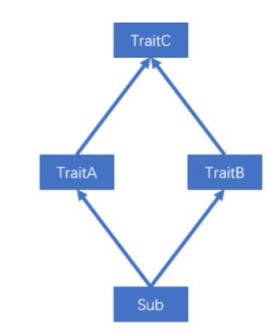

   scala采用的和python的c3线性化类似的规则

   即对于所有的父类和特质, scala会按照特定的顺序将他们排好序, 然后在调用方法的时候, 通过该顺序来查找特定的方法, 规则如下:

   

   

   同时scala中也可以进行特质的堆叠,

   准确来说就是可以使用super来调用下一个线性化顺序中的特定方法

   同时也可以使用super[类名]来调用特定顺序中的特定方法

   

   案例如下: 

   ~~~scala
   // 线性化的顺序为: MyBall -> Color -> Category -> Ball
   trait Ball {
   	def describe(): String = { "ball" }
   }
   trait Category extends Ball {
   	override def describe(): String = {
           // 调用ball的describe
   		"foot-" + super.describe()
   	}
   }
   trait Color extends Ball {
   	override def describe(): String = {
           // 调用category的describe
   		"blue-" + super.describe()
           
           // 直接调用Ball的describe
           // super[Ball].describe
   	}
   }
   class MyBall extends Category with Color {
   	override def describe(): String = {
           // 调用color的describe
   		"my ball is a " + super.describe()
   	}
   }
   
   object TestTrait {
   	def main(args: Array[String]): Unit = {
   		println(new MyBall().describe())
   	}
   }
   ~~~

   

### 自身类型

在scala中,  你可以规定在继承A特质的时候, 必须继承另外一个B特质,  这样你就可以在A特质中直接调用B特质中的方法了

使用该功能可以非常方便的实现依赖注入的功能

~~~scala
trait Config {
  val host: String
  val port: Int
}

trait Server {
  _: Config => // 要求在混入Server的时候, 必须混入Config, 相当于依赖注入

  def start(): Unit = {
    println(s"Server starting on $host:$port")
  }
}

class MyConfig extends Config {
  val host = "localhost"
  val port = 8080
}

class MyServer extends MyConfig with Server

val server = new MyServer
server.start()
// 输出: Server starting on localhost:8080
~~~


### 特质和抽象类的区别

1. 优先使用特质。一个类扩展多个特质是很方便的，但却只能扩展一个抽象类。

2. 如果你需要构造函数参数，使用抽象类。因为抽象类可以定义带参数的构造函数，而特质不行


## 扩展

### 类型检查

1. obj.isInstanceOf[T]：判断 obj 是不是 T 类型。
2. obj.asInstanceOf[T]：将 obj 强转成 T 类型。  
3. classOf 获取对象的类名 

~~~scala
class Person {}

object Person {
  def main(args: Array[String]): Unit = {
    val person = new Person  // Create an instance of Person

    // 1. 检查类型
    val bool: Boolean = person.isInstanceOf[Person]
    if (bool) {
      // 强制类型转换
      val p1: Person = person.asInstanceOf[Person]
      println(p1)
    }

    // 获取class信息
    val pClass: Class[Person] = classOf[Person]
    println(pClass)
  }
}

~~~


### 枚举类和应用类

~~~scala
// 使用Object关键字, 需要继承Enumeration
object Color extends Enumeration {
    // 通过value来定义枚举
	val RED = Value(1, "red")
	val YELLOW = Value(2, "yellow")
	val BLUE = Value(3, "blue")
}

// 继承app类, 然后就可以直接写main方法了
object Test20 extends App {
	println("xxxxxxxxxxx");
}
~~~


### 类型别名

可以使用`type`关键字为类型定义一个类型别名

~~~scala
def main(args: Array[String]): Unit = {
    // 定义类型别名
	type S=String
	var v:S="abc"
	def test():S="xyz"
}
~~~


### 样例类

语法：`case class Person (name: String, age: Int)`
说明

1. 样例类仍然是类，和普通类相比，只是其自动生成了伴生对象，并且伴生对象中
   自动提供了一些常用的方法，如 apply、 unapply、 toString、 equals、 hashCode 和 copy。

2. 样例类是为模式匹配而优化的类，因为其默认提供了 unapply 方法，因此，样例
   类可以直接使用模式匹配，而无需自己实现 unapply 方法。

3. 构造器中的每一个参数都成为 val，除非它被显式地声明为 var（不建议这样做）

   ~~~scala
   case class User(name: String, age: Int)
   
   object TestMatchUnapply {
     def main(args: Array[String]): Unit = {
       // 创建一个 User 对象
       val user: User = User("zhangsan", 11)
       
       // 使用模式匹配解构 User 对象
       val result = user match {
         case User("zhangsan", 11) => "yes" // 如果 user 的名字是 "zhangsan" 且年龄是 11，则匹配成功
         case _ => "no" // 其他情况不匹配
       }
       
       // 打印结果
       println(result)
     }
   }
   ~~~

   

# 类的层级结构

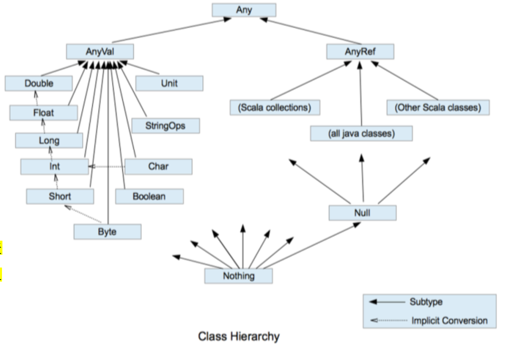


1. Scala中一切都是对象, 都是Any的子类

2. Scala中数据类型分为两大类:  数值类型(AnyVal) 和 引用类型(AnyRef)

3. AnyVal类型对应Java中的8大基础类型和void

4. AnyRef类型对应Java中的引用类型,  实际上AnyRef在字节码中就是Object

5. Scala中的StringOps是对Java中的String增强

6. Unit对应Java中的void，用于方法返回值的位置，表示方法没有返回值。

   Unit是一个数据类型，只有一个对象就是`()`。

7. Null是一个类型，只有一个对象就是null。它是所有引用类型(AnyRef)的子类。

   所以在任何返回AnyRef的函数中, 都可以返回null

8. Nothing，是所有数据类型的子类，主要用在一个函数没有明确返回值时使用，因为这样我们可以把抛出的返回值，返回给任何的变量或者函数。


# 异常

1. 和java类似, 也是try-catch-finally,  越详细的异常写在越前面

   ~~~scala
   def main(args: Array[String]): Unit = {
   	try {
   		var n= 10 / 0
   	}catch {
   		case ex: ArithmeticException=>{
   			// 发生算术异常
   			println("发生算术异常")
   		}
   		case ex: Exception=>{
   			// 对异常处理
   			println("发生了异常 1")
   			println("发生了异常 2")
   		}
   	}finally {
   		println("finally")
   	}
   }
   ~~~

   

2. scala中没有编译器异常, 所有的异常都是在运行时捕获的, 所以没有throws

3. 用 throw 关键字，抛出一个异常对象。所有异常都是 Throwable 的子类型

   ~~~scala
   def test():Nothing = {
   	throw new Exception("不对")
   }
   ~~~

4. java 提供了 throws 关键字来声明异常。它向调用者函数提供了此方法可能引发此异常的信息。 

   在 Scala 中，可以使用 throws 注解来声明异常  

   ~~~scala
   def main(args: Array[String]): Unit = {
   	f11()
   }
   @throws(classOf[NumberFormatException])
   def f11()={
   	"abc".toInt
   }
   ~~~


# 集合

## 集合简介

1. Scala 的集合有三大类：序列 Seq、集 Set、 映射 Map， 所有的集合都扩展自 Iterable
   特质。

2. 对于几乎所有的集合类， Scala 都同时提供了可变和不可变的版本，分别位于以下两
   个包

   不可变集合： `scala.collection.immutable`

   可变集合： `scala.collection.mutable`

3. Scala 不可变集合，就是指该集合对象不可修改，每次修改就会返回一个新对象，而
   不会对原对象进行修改。类似于 java 中的 String 对象

4. 可变集合，就是这个集合可以直接对原对象进行修改，而不会返回新的对象。类似
   于 java 中 StringBuilder 对象

<font color=red>建议：在操作集合的时候，不可变用符号，可变用方法</font>

   

   

   ### 不可变集合继承图

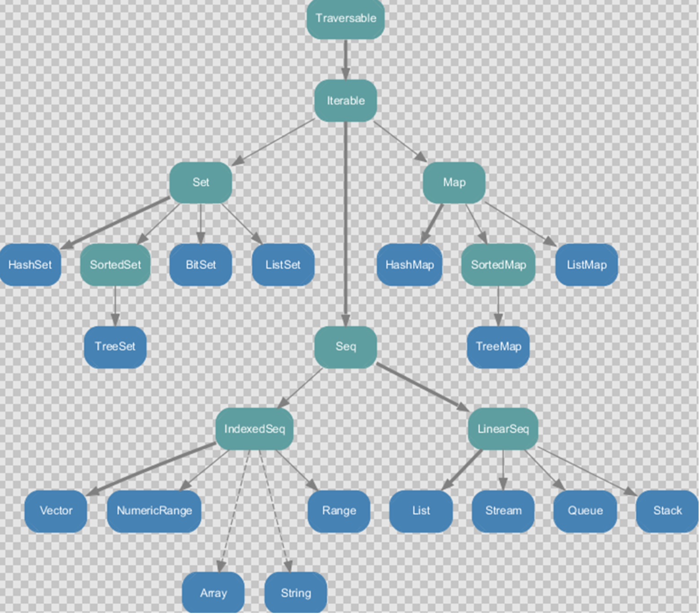

1. Set、 Map 是 Java 中也有的集合
2. Seq 是 Java 没有的，我们发现 List 归属到 Seq 了，因此这里的 List 就和 Java 不是同一个
      概念了
3. 我们前面的 for 循环有一个 1 to 3，就是 IndexedSeq 下的 Range
4. String 也是属于 IndexedSeq
5. 我们发现经典的数据结构比如 Queue 和 Stack 被归属到 LinearSeq(线性序列)
6. 大家注意 Scala 中的 Map 体系有一个 SortedMap，说明 Scala 的 Map 可以支持排序
7.  IndexedSeq 和 LinearSeq 的区别：
   - IndexedSeq 是通过索引来查找和定位，因此速度快，比如 String 就是一个索引集合，通过索引即可定位
   - LinearSeq 是线型的，即有头尾的概念，这种数据结构一般是通过遍历来查找

### 可变集合继承图

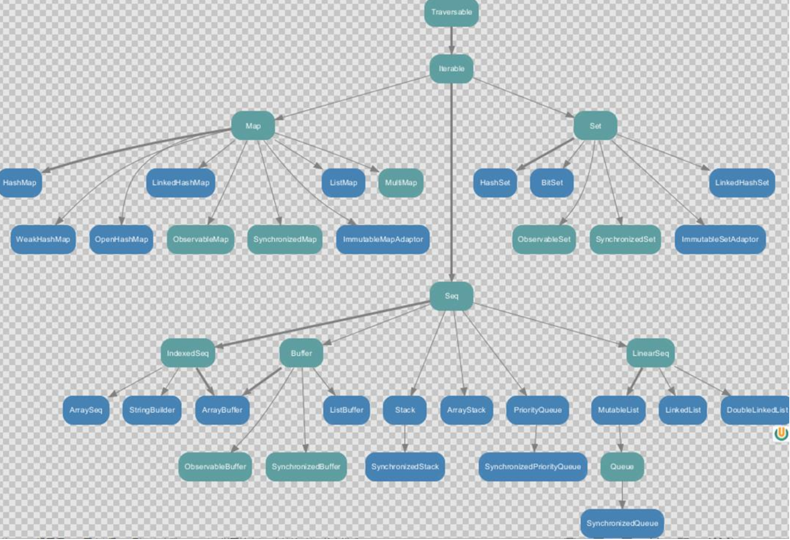        


## 数组
### 定长数组Array

他有两种定义方式:

1. `val arr1 = new Array[Int](10)` 

   ~~~scala
   object TestArray {
     def main(args: Array[String]): Unit = {
       // (1) 数组定义
       val arr01 = new Array(4)  // 创建一个长度为 4 的整数数组
       println(arr01.length) // 打印数组长度: 4
   
       // (2) 数组赋值
       // (2.1) 修改某个元素的值
       arr01(3) = 10 // 将数组的第 4 个元素（索引 3）设为 10
   
       // (2.2) 采用方法的形式给数组赋值
       arr01.update(0, 1) // 使用 update 方法将第一个元素（索引 0）设为 1
   
       // (3) 遍历数组
       // (3.2) 普通遍历
       for (i <- arr01) {
         println(i) // 逐个打印数组中的每个元素
       }
   
       // foreach
       def printx(elem: Int): Unit = {
         println(elem) // 定义一个打印元素的函数
       }
       // 函数foreach
       arr01.foreach(printx) // 使用 foreach 方法和自定义函数遍历并打印数组中的每个元素
   
       // 或者使用简化的 lambda 表达式
       // arr01.foreach((x) => { println(x) }) // 使用 lambda 表达式遍历
       // arr01.foreach(println(_))            // 使用占位符语法遍历
   
       // 最简化的形式
       arr01.foreach(println) // 使用最简化的方式直接遍历并打印每个元素
   
       // (4) 增加元素（由于创建的是不可变数组，增加元素实际上是生成一个新的数组）
       println(arr01.mkString(",")) // 打印原数组
       val ints: Array[Int] = arr01 :+ 5 // 使用 `:+` 操作符向数组增加一个新元素 5，生成新的数组
       println(ints.mkString(",")) // 打印新生成的数组
     }
   }
   ~~~
   
2. `val arr1 = Array(1, 2)​  `

   使用 apply 方法创建数组对象, 直接传入元素
   
   ~~~scala
   object TestArray {
     def main(args: Array[String]): Unit = {
       // 定义一个包含不同类型元素的数组
       var arr02 = Array(1, 3, "bobo")
   
       // 打印数组的长度
       println(arr02.length) // 输出数组的长度
   
       // 遍历数组并打印每个元素
       for (i <- arr02) {
         println(i) // 逐个打印数组中的每个元素
       }
     }
   }
   ~~~
   
   
   
   
   
### 变长数组ArrayBuffer

变长数组使用ArrayBuffer来实现他是有序的的集合

下面是一些方法含义

1. 在末尾添加: append
2. 在开始添加: preppend
3. 在指定位置添加: insert,这里的insert(i: Int, y: Int*)表示在指定位置添加多个元素
4. 添加一个数组: insertAll
5. 删除一个元素使用delete, 传入需要删除的位置和需要删除的元素个数

~~~scala
import scala.collection.mutable.ArrayBuffer

object TestArrayBuffer {
  def main(args: Array[String]): Unit = {
    // (1) 创建并初始赋值可变数组
    val arr01 = ArrayBuffer[Any](1, 2, 3) // 使用 ArrayBuffer 创建可变数组，包含初始值 1, 2, 3

    // (2) 遍历数组
    for (i <- arr01) {
      println(i) // 逐个打印数组中的每个元素
    }
    println(arr01.length) // 打印数组长度，输出: 3
    println("arr01.hash=" + arr01.hashCode()) // 打印数组的哈希码

    // (3) 增加元素
    // (3.1) 追加数据
    arr01 += 4 // 使用 += 操作符向数组追加一个元素 4
    // (3.2) 向数组最后追加多个数据
    arr01.append(5, 6) // 使用 append 方法追加多个元素 5 和 6
    // (3.3) 向指定的位置插入数据
    arr01.insert(0, 7, 8) // 使用 insert 方法在索引 0 位置插入元素 7 和 8

    println("arr01.hash=" + arr01.hashCode()) // 再次打印数组的哈希码，观察是否变化

    // (4) 修改元素
    arr01(1) = 9 // 修改数组第 2 个元素（索引 1）的值为 9

    println("--------------------------")
    for (i <- arr01) {
      println(i) // 再次遍历并打印数组中的每个元素
    }
    println(arr01.length) // 打印修改后数组的长度，输出: 7
  }
}
~~~


   ​       

### 不可变数组与可变数组的转换

1. 定长数组转变长数组

   arr1.toBuffer

2. 变长数组转定长数组

   arr2.toArray

转换出来的数组如何改变,  都与原来的数组无关

   ​     

### 多维数组

~~~scala
object DimArray {
  def main(args: Array[String]): Unit = {
    // 创建爱你一个三行四列的数组
    val arr = Array.ofDim[Int](3, 4)

    // 设置元素
    arr(1)(2) = 88

    // 遍历
    for (i <- arr) { // i是每一行, 一个一维数组
      for (j <- i) {
        print(j + " ")
      }
      println()
    }
  }
}

~~~

## 列表

### 不可变列表 List

1. List 默认为不可变集合, 数据有顺序，可重复
2. List的底层结构是链表, 对头部的操作是O(1), 对尾部的操作是O(n)
3. List一旦创建之后, 里面的元素内容就不能改变了
4. 任何对List内容的修改, 都会返回一个新的List

~~~scala
object TestList {
  def main(args: Array[String]): Unit = {
    // 
    val list: List[Int] = List(1,2,3,4,3)

    // Nil表示创建一个空列表
    // :: 表示添加元素到开始, 并且::是从后开始执行的
    val list5 = 1::2::3::4::Nil // [1, 2, 3, 4]

    // 添加元素到开始
    val list1 = 7::6::5::list

    // 添加到第一个元素位置
    val list2 = list.+:(5)
      val list21 = list +: 5 // 语法糖
      
      // 添加到队尾
      val list22 = list.:+(5)
      val list23 = list :+ 5 // 语法糖

    // 合并两个列表, 生成一个新的列表
      val list3 = List(8,9)
    val list4 = list3:::list1

    // 取指定数据
    println(list(0))

    list5.foreach(println)
  }
}
~~~


### 可变 ListBuffer

1. ListBuffer是可变的集合, 可以在不创建新集合的情况下, 对原有的集合进行增删改
2. ListBuffer的结构为链表, 但它在内部维护了对链表头和尾的引用，所有对头尾的操作都是O(1)

  ~~~scala
import scala.collection.mutable.ListBuffer

object TestList {
  def main(args: Array[String]): Unit = {
    // 1. 创建一个可变集合
    val buffer = ListBuffer(1, 2, 3, 4)

    // 2. 向集合中添加数据
    buffer += 5         // 添加单个元素
    buffer.append(6)    // 使用 append 方法添加元素
    buffer.insert(1, 2) // 在索引 1 处插入元素 2

    // 3. 打印集合数据
    buffer.foreach(println)

    // 4. 修改数据
    buffer(1) = 6       // 使用索引更新元素
    buffer.update(1, 7) // 使用 update 方法更新索引 1 处的元素为 7

    // 5. 删除数据
    buffer -= 5         // 删除单个元素 5
    buffer.remove(5)    // 删除索引 5 处的元素
  }
}
  ~~~


## Set 集合

默认情况下， Scala 使用的是不可变集合，如果你想使用可变集合，需要引用`scala.collection.mutable.Set` 包


### 不可变集合

1. Set 默认是不可变集合，数据无序
2. 数据不可重复
3. 遍历集合

~~~scala
object TestSet {
  def main(args: Array[String]): Unit = {
    // 1. 创建一个不可变集合 Set，数据无序且唯一
    val set = Set(1, 2, 3, 4, 5, 6)

    // 2. 创建另一个不可变集合 Set，尝试添加重复数据
    val set1 = Set(1, 2, 3, 4, 5, 6, 3)
    // 重复的 '3' 不会被添加进集合，所以 set1 仍然是 Set(1, 2, 3, 4, 5, 6)

    // 3. 遍历集合
    for (x <- set1) {
      println(x)
    }

    // 或者使用 foreach 进行遍历
    // set1.foreach(println)
  }
}
~~~

### 可变集合
~~~scala
import scala.collection.mutable

object TestSet {
  def main(args: Array[String]): Unit = {
    // 1. 创建一个可变集合
    val set = mutable.Set(1, 2, 3, 4, 5, 6)

    // 2. 集合添加元素
    set += 8 // 将元素 8 添加到集合中
    println(s"After adding 8: $set")

    // 3. 向集合中添加元素，返回一个新的 Set
    val newSet = set + 9 // 添加元素 9，并返回一个新的 Set，原集合不变
    println(s"New set after adding 9: $newSet")
    println(s"Original set after adding 9: $set")

    // 4. 删除数据
    set -= 5 // 从集合中删除元素 5
    println(s"After removing 5: $set")

    // 5. 打印集合
    set.foreach(println) // 使用 foreach 遍历集合并打印每个元素
    println(set.mkString(",")) // 使用 mkString 将集合的元素拼接成字符串并打印
  }
}
~~~


## Map映射

### 不可变Map

~~~scala
object TestMap {
  def main(args: Array[String]): Unit = {
    // 1. 创建不可变集合 Map
    val map = Map("a" -> 1, "b" -> 2, "c" -> 3)

    // 2. 循环打印键值对
    map.foreach { case (key, value) =>
      println(s"$key -> $value")
    }

    // 3. 访问数据
    // 使用 get 访问 map 集合的数据，会返回特殊类型 Option(选项):
    // 有值 (Some)，无值 (None)
    for (key <- map.keys) {
      println(s"$key = ${map.get(key).getOrElse("Key not found")}")
    }

    // 4. 如果 key 不存在，返回默认值 0
    println(map.get("d").getOrElse(0))  // 使用 getOrElse 处理 key 不存在的情况
    println(map.getOrElse("d", 0))      // 使用 getOrElse 直接指定默认值

    // 或者使用以下方法，效果相同
    println(s"Value for 'd' using map.get: ${map.get("d").getOrElse(0)}")
    println(s"Value for 'd' using map.getOrElse: ${map.getOrElse("d", 0)}")
  }
}
~~~


### 可变Map

~~~scala
import scala.collection.mutable

object TestSet {
  def main(args: Array[String]): Unit = {
    // 1. 创建一个可变集合 Map
    val map = mutable.Map("a" -> 1, "b" -> 2, "c" -> 3)

    // 2. 打印集合
    map.foreach { 
        case (key, value) => println(s"$key -> $value")
    }

    // 3. 向集合增加数据
    map += ("d" -> 4) // 添加新的键值对 "d" -> 4

    // 4. 向集合中已有的键更新数据，并获取原始值
    val maybeInt: Option[Int] = map.put("a", 4) // 将 "a" 对应的值更新为 4，并返回原始值
    println(maybeInt.getOrElse(0)) // 打印原始值，如果不存在则打印默认值 0

    // 5. 删除数据
    map -= ("b", "c") // 从集合中删除键 "b" 和 "c" 对应的键值对

    // 6. 修改数据
    map.update("d", 5) // 使用 update 方法更新键 "d" 对应的值为 5
    map("d") = 5       // 直接使用索引操作更新键 "d" 对应的值为 5

    // 打印修改后的集合内容
    println("After modifications:")
    map.foreach { case (key, value) =>
      println(s"$key -> $value")
    }
  }
}
~~~


## 元组

~~~scala
object TestTuple {
  def main(args: Array[String]): Unit = {
    // 1. 声明元组的方式：(元素 1, 元素 2, 元素 3)
    val tuple: (Int, String, Boolean) = (40, "bobo", true)

    // 2. 访问元组
    // 2.1 通过元素的顺序进行访问，调用方式：_顺序号
    println(tuple._1) // 访问第一个元素
    println(tuple._2) // 访问第二个元素
    println(tuple._3) // 访问第三个元素

    // 2.2 通过索引访问数据
    println(tuple.productElement(0)) // 使用 productElement 方法访问第一个元素

    // 2.3 通过迭代器访问数据
    for (elem <- tuple.productIterator) {
      println(elem) // 使用 productIterator 迭代访问每个元素
    }

    // 3. Map 中的键值对其实就是元组，只不过元组的元素个数为 2，称之为对偶
    val map = Map("a" -> 1, "b" -> 2, "c" -> 3)
    val map1 = Map(("a", 1), ("b", 2), ("c", 3))

    // 使用 foreach 遍历并打印 Map 的键值对，元组表示键值对
    map.foreach { tuple =>
      println(tuple._1 + "=" + tuple._2)
    }
  }
}
~~~


## 常用函数

### 常用操作

~~~scala
object TestList {
  def main(args: Array[String]): Unit = {
    val list: List[Int] = List(1, 2, 3, 4, 5, 6, 7)

    // 1. 获取集合长度
    println(list.length)

    // 2. 获取集合大小，等同于 length
    println(list.size)

    // 3. 循环遍历集合并打印每个元素
    list.foreach(println)

    // 4. 使用迭代器遍历集合并打印每个元素
    for (elem <- list.iterator) {
      println(elem)
    }

    // 5. 生成字符串，将集合转换为以指定分隔符分隔的字符串
    println(list.mkString(","))

    // 6. 检查集合是否包含指定元素
    println(list.contains(3))
  }
}

~~~

~~~scala
// ++= 是一个用于集合的操作符，用于将右侧集合中的元素追加或合并到左侧的集合中。
// 它适用于可变集合（mutable collections），因为它会修改集合本身
val map1 = mutable.Map("a" -> 1, "b" -> 2)
val map2 = mutable.Map("b" -> 3, "c" -> 4)

map1 ++= map2
println(map1)  // 输出: Map(a -> 1, b -> 3, c -> 4)

val set1 = mutable.Set(1, 2, 3)
val set2 = mutable.Set(3, 4, 5)

set1 ++= set2
println(set1)  // 输出: Set(1, 2, 3, 4, 5)
~~~


### 衍生集合

~~~scala
object TestList {
  def main(args: Array[String]): Unit = {
    val list1: List[Int] = List(1, 2, 3, 4, 5, 6, 7)
    val list2: List[Int] = List(4, 5, 6, 7, 8, 9, 10)

    // 1. 获取集合的头（第一个元素）
    println(list1.head)

    // 2. 获取集合的尾（除了头之外的其余元素）
    println(list1.tail)

    // 3. 获取集合的最后一个元素
    println(list1.last)

    // 4. 获取集合的初始元素（除了最后一个元素之外的所有元素）
    println(list1.init)

    // 5. 反转集合
    println(list1.reverse)

    // 6. 取前（后）n个元素
    println(list1.take(3))        // 取前3个元素
    println(list1.takeRight(3))   // 取后3个元素

    // 7. 去掉前（后）n个元素
    println(list1.drop(3))        // 去掉前3个元素
    println(list1.dropRight(3))   // 去掉后3个元素

    // 8. 计算并集
    println(list1.union(list2))

    // 9. 计算交集
    println(list1.intersect(list2))

    // 10. 计算差集
    println(list1.diff(list2))

    // 11. 拉链操作，将两个集合的对应位置的元素组成元组
    // 注：如果两个集合的元素个数不相等，多余的元素将被省略
    println(list1.zip(list2))

    // 12. 滑窗操作，返回一个迭代器，可以按照指定大小和步长滑动遍历集合
    list1.sliding(2, 5).foreach(println)
  }
}
~~~


### 计算函数

~~~scala
object TestList {
  def main(args: Array[String]): Unit = {
    val list: List[Int] = List(1, 5, -3, 4, 2, -7, 6)

    // 1. 求和
    println(list.sum)

    // 2. 求乘积
    println(list.product)

    // 3. 最大值
    println(list.max)

    // 4. 最小值
    println(list.min)

    // 5. 排序
    // 5.1 按照元素大小排序
    println(list.sortBy(x => x))

    // 5.2 按照元素的绝对值大小排序
    println(list.sortBy(x => x.abs))

    // 5.3 按元素大小升序排序
    println(list.sortWith((x, y) => x < y))

    // 5.4 按元素大小降序排序
    println(list.sortWith((x, y) => x > y))
  }
}
~~~

1. sorted  对一个集合进行自然排序，通过传递隐式的 Ordering
2. sortBy   对一个属性或多个属性进行排序，通过它的类型。
3. sortWith   基于函数的排序，通过一个 comparator 函数，实现自定义排序的逻辑。


### 高级计算函数

~~~scala
object TestList {
  def main(args: Array[String]): Unit = {
    val list: List[Int] = List(1, 2, 3, 4, 5, 6, 7, 8, 9)
    val nestedList: List[List[Int]] = List(List(1, 2, 3), List(4, 5, 6), List(7, 8, 9))
    val wordList: List[String] = List("hello world", "hello atguigu", "hello scala")

    // 1. 过滤
    println(list.filter(x => x % 2 == 0))

    // 2. 转化/映射
    println(list.map(x => x + 1))

    // 3. 扁平化
    println(nestedList.flatten)

    // 4. 扁平化 + 映射（flatMap）
    // 注：flatMap 相当于先进行 map 操作，然后再进行 flatten 操作
    println(wordList.flatMap(x => x.split(" ")))

    // 5. 分组
    println(list.groupBy(x => x % 2))
  }
}

~~~


Reduce函数: 通过指定的逻辑将集合中的数据进行聚合，从而减少数据，最终获取结果。

~~~scala
object TestReduce {
  def main(args: Array[String]): Unit = {
    val list = List(1, 2, 3, 4)

    // 使用 reduce 将列表中的数据两两结合，实现运算规则
    // 这里，reduce 按照从左到右的顺序应用操作，等同于 reduceLeft
    // 计算过程：(1 - 2) = -1, (-1 - 3) = -4, (-4 - 4) = -8
    val i: Int = list.reduce((x, y) => x - y)
    println("i = " + i)  // 输出 i = -8
    

    // 使用 reduceRight 从右向左进行操作
    // 计算过程：(3 - 4) = -1, (2 - (-1)) = 3, (1 - 3) = -2
    val i2 = list.reduceRight((x, y) => x - y)
    println(i2)  // 输出 i2 = -2
  }
}
~~~


Fold函数:  Reduce的一种特殊情况

~~~scala
object TestFold {
  def main(args: Array[String]): Unit = {
    val list = List(1, 2, 3, 4)

    // fold 方法使用了函数柯里化，存在两个参数列表
    // 第一个参数列表为：零值（初始值）
    // 第二个参数列表为：简化规则
    // fold 底层其实调用的是 foldLeft

    // foldLeft 从左到右进行操作
    // 初始值为 1，然后按顺序将列表元素应用到 (x - y) 的操作上
    // 计算过程: 1 - 1 -> 0, 0 - 2 -> -2, -2 - 3 -> -5, -5 - 4 -> -9
    val i = list.foldLeft(1)((x, y) => x - y)
    println(i) // 输出 -9

    // foldRight 从右到左进行操作
    // 初始值为 10，然后按顺序将列表元素应用到 (x - y) 的操作上
    // 计算过程: 3 - 10 -> -7, 2 - (-7) -> 9, 1 - 9 -> -8, 1 - (-8) -> 9
    val i1 = list.foldRight(10)((x, y) => x - y)
    println(i1) // 输出 -8
  }
}
~~~
案例2
~~~scala
import scala.collection.mutable

object TestFold {
  def main(args: Array[String]): Unit = {
    // 创建两个可变的 Map
    val map1 = mutable.Map("a" -> 1, "b" -> 2, "c" -> 3)
    val map2 = mutable.Map("a" -> 4, "b" -> 5, "d" -> 6)

    // 使用 foldLeft 将 map2 的数据合并到 map1
    val map3: mutable.Map[String, Int] = map2.foldLeft(map1) { (map, kv) =>
      val k = kv._1 // 获取键
      val v = kv._2 // 获取值

      // 更新 map1 中的键值对，若键存在则将值相加，否则添加新的键值对
      map(k) = map.getOrElse(k, 0) + v
      map
    }

    // 打印合并后的 Map
    println(map3)
  }
}
~~~


### 普通 WordCount 案例

单词计数： 将集合中出现的相同的单词，进行计数，取计数排名前三的结果

~~~scala
object TestWordCount {
  def main(args: Array[String]): Unit = {
    // 单词计数：将集合中出现的相同的单词进行计数，并取计数排名前三的结果
    val stringList = List("Hello Scala Hbase kafka", "Hello Scala Hbase", "Hello Scala", "Hello")

    // 1) 将每一个字符串转换成一个个单词
    val wordList: List[String] = stringList.flatMap(str => str.split(" "))

    // 2) 将相同的单词放置在一起
    val wordToWordsMap: Map[String, List[String]] = wordList.groupBy(word => word)

    // 3) 对相同的单词进行计数
    // (word, list) => (word, count)
    val wordToCountMap: Map[String, Int] = wordToWordsMap.map { 
        case (word, list) => (word, list.size) 
    }

    // 4) 对计数完成后的结果进行排序（降序）
    val sortList: List[(String, Int)] = wordToCountMap.toList.sortWith {
      (left, right) => left._2 > right._2
    }
    // 5) 对排序后的结果取前 3 名
    val resultList: List[(String, Int)] = sortList.take(3)
    println(resultList) // 输出: List(("Hello", 4), ("Scala", 3), ("Hbase", 2))
  }
}
~~~


### 复杂 WordCount 案例

方式1


```scala
object TestWordCount {
  def main(args: Array[String]): Unit = {
    // 第一种方式（不通用）
    // 输入一个包含元组的列表，其中每个元组包含一个字符串和一个整数
    val tupleList = List(
      ("Hello Scala Spark World", 4),
      ("Hello Scala Spark", 3),
      ("Hello Scala", 2),
      ("Hello", 1)
    )

    // 1) 将元组中的字符串重复指定的次数，并将结果转换成一个列表
    // 例如，("Hello", 2) 会转换为 "Hello Hello"
    val stringList: List[String] = tupleList.map(t => (t._1 + " ") * t._2)
    // 结果: List("Hello Scala Spark World  Hello Scala Spark World  Hello Scala Spark World  Hello Scala Spark World ", "Hello Scala Spark  Hello Scala Spark  Hello Scala Spark ", "Hello Scala  Hello Scala ", "Hello ")

    // 2) 将每一个字符串拆分成单词
    val words: List[String] = stringList.flatMap(_.split(" "))
    // 结果: List("Hello", "Scala", "Spark", "World", "Hello", "Scala", "Spark", "World", "Hello", "Scala", "Spark", "World", "Hello", "Scala", "Spark", "World", "Hello", "Scala", "Spark", "Hello", "Scala", "Spark", "Hello", "Scala", "Hello")

    // 3) 按单词进行分组
    val groupMap: Map[String, List[String]] = words.groupBy(word => word)
    // 结果: Map("Hello" -> List("Hello", "Hello", "Hello", "Hello", "Hello", "Hello", "Hello"), "Scala" -> List("Scala", "Scala", "Scala", "Scala", "Scala"), "Spark" -> List("Spark", "Spark", "Spark", "Spark"), "World" -> List("World", "World", "World", "World"))

    // 4) 对分组后的单词计数
    val wordToCount: Map[String, Int] = groupMap.map { case (word, list) => (word, list.size) }
    // 结果: Map("Hello" -> 7, "Scala" -> 5, "Spark" -> 4, "World" -> 4)

    // 5) 对计数结果进行排序（按单词出现的次数降序排序），并取前 3 名
    val wordCountList: List[(String, Int)] = wordToCount.toList.sortWith {
      (left, right) => left._2 > right._2
    }.take(3)
    // 结果: List(("Hello", 7), ("Scala", 5), ("Spark", 4))

    // 打印结果
    println(wordCountList)
  }
}
```

方式二

~~~scala
object TestWordCount {
  def main(args: Array[String]): Unit = {
    // 输入一个包含元组的列表，每个元组包含一个字符串和一个整数
    val tuples = List(
      ("Hello Scala Spark World", 4),
      ("Hello Scala Spark", 3),
      ("Hello Scala", 2),
      ("Hello", 1)
    )

    // 1) 将字符串拆分为单词，并将每个单词与其对应的权重值关联
    val wordToCountList: List[(String, Int)] = tuples.flatMap {
      case (sentence, weight) =>
        val words = sentence.split(" ")
        words.map(word => (word, weight))
    }
    // 结果：List(("Hello",4), ("Scala",4), ("Spark",4), ("World",4), ("Hello",3), ("Scala",3), ("Spark",3), ("Hello",2), ("Scala",2), ("Hello",1))

    // 2) 按单词进行分组，将相同单词的元组放在一起
    val wordToTupleMap: Map[String, List[(String, Int)]] = wordToCountList.groupBy {
      case (word, _) => word
    }
    // 结果：Map("Hello" -> List(("Hello",4), ("Hello",3), ("Hello",2), ("Hello",1)), "Scala" -> List(("Scala",4), ("Scala",3), ("Scala",2)), "Spark" -> List(("Spark",4), ("Spark",3)), "World" -> List(("World",4)))

    // 3) 将每个单词的元组列表转换为权重值的列表
    val stringToInts: Map[String, List[Int]] = wordToTupleMap.mapValues {
      list => list.map { case (_, count) => count }
    }
    // 结果：Map("Hello" -> List(4, 3, 2, 1), "Scala" -> List(4, 3, 2), "Spark" -> List(4, 3), "World" -> List(4))

    // 4) 计算每个单词的总权重值
    val wordToTotalCountMap: Map[String, Int] = stringToInts.map {
      case (word, counts) => (word, counts.sum)
    }
    // 结果：Map("Hello" -> 10, "Scala" -> 9, "Spark" -> 7, "World" -> 4)

    // 打印结果
    println(wordToTotalCountMap)
  }
}
~~~


## 队列
Scala 也提供了队列（ Queue）的数据结构，队列的特点就是先进先出。

进队和出队的方法分别为 enqueue 和 dequeue。

~~~scala
import scala.collection.mutable

object TestQueue {
  def main(args: Array[String]): Unit = {
    // 创建一个可变的空队列
    val que = new mutable.Queue[String]()
    
    // 向队列中添加元素
    que.enqueue("a", "b", "c")
    
    // 从队列中取出元素并打印
    println(que.dequeue())  // 输出：a
    println(que.dequeue())  // 输出：b
    println(que.dequeue())  // 输出：c
  }
}
~~~


## 并行集合

Scala 为了充分使用多核 CPU，提供了并行集合（有别于前面的串行集合），用于多核环境的并行计算。

~~~scala
object TestPar {
  def main(args: Array[String]): Unit = {
    // 使用普通的 map 进行操作
    val result1 = (0 to 100).map { _ => 
      Thread.currentThread.getName 
    }
    
    // 使用并行的 map 进行操作
    val result2 = (0 to 100).par.map { _ => 
      Thread.currentThread.getName 
    }

    // 打印结果
    println("Sequential processing threads:")
    println(result1)

    println("Parallel processing threads:")
    println(result2)
  }
}
~~~


# 隐式转换和参数

## 隐式转换

当进行函数调用, 参数传递的时候,  如果编译器发现使用的变量的实际类型和期待的类型不一致的时候, 那么他会尝试进行隐式转换

即查找上下文, 然后找到能够将实际类型转换为目标类型的隐式类或者隐式方法/函数

<font color=red>你可以将一个方法, 函数, 类标记为`implicit`, 这样scala就可以使用他们进行转换了,  不标记的即使能够转换也不会使用</font>

1. 隐式方法

   ~~~scala
   object ImplicitConversionExample {
     
       def main(args: Array[String]): Unit = {
           def printString(value: String): Unit = {
               println(value)
           }
           
           // 定义一个隐式方法，将 Int 转换为 String
     		implicit def intToString(value: Int): String = value.toString
         
           // scala会在上下文中查找能调用的隐式转换
           // 如果查找失败就会报错
         
           printString(123)  // 传参的时候隐式转换为String类型
           print(123.length()) // 在调用的时候隐式转换为String类型
     }
   }
   ~~~

2. 隐式类

   **隐式类的构造函数参数只能有一个**

   **隐式类必须被定义在“类”或“伴生对象”或“包对象”里，即隐式类不能是顶级的**  

   ~~~scala
   object TestImplicitClass {
       // 定义隐式类, 可以将Int转换为MyRichInt
   	implicit class MyRichInt(arg: Int) {
   		def myMax(i: Int): Int = {
   			if (arg < i) i else arg
   		}
   		def myMin(i: Int) = {
   			if (arg < i) arg else i
   		}
   	}
       
       def printRichInt(i: MyRichInt){}
       
   	def main(args: Array[String]): Unit = {
   	    println(1.myMax(3)) // 在调用的时候隐式转换为MyRichInt
            printRichInt(1) // 在传参的时候隐式转换为MyRichInt
   	}
   }
   ~~~

   


## 隐式参数

可以在函数或者方法中, 定义隐式参数, 在调用的时候, scala会在上下文中自动查找符合条件的隐式变量并传入

1. 同一个作用域中，相同类型的隐式变量只能有一个  
2. 编译器按照隐式参数的类型去寻找对应类型的隐式值，与隐式变量的名称无关。
3. 如果一个隐式参数有默认值, 那么上下文中能找到对应的隐式参数, 就是会用找到的, 否则使用默认参数

~~~scala
object TestImplicitParameter {
    // 定义一个隐式变量
	implicit val str: String = "hello world!"
    
    // 定义一个隐式参数, 并且带有默认值
	def hello(implicit arg: String="good bey world!"): Unit = {
		println(arg)
	}
    
	def main(args: Array[String]): Unit = {
		hello // 优先使用隐式变量
	}
}
~~~

## 隐式解析机制


当scala需要隐式变量, 隐式类, 隐式函数时, 他会按照如下顺序查找

1. 局部作用域   包括局部变量, 局部定义的函数, 方法参数中的隐式实体
2. 在当前类和当前类的伴生对象中查找隐式实体
3. 在实际类型和期望类型的伴生对象中查找隐式实体
4. 在当前作用域中查找import进来的隐式实体
5. 在当前包和上层包的包对象中查找隐式实体

> 必须是使用implicit指定的隐式实体才可用
>
> 如果查找到多个可用的隐式实体, 那么会报错


# 泛型

## 泛型类

~~~scala
// 定义一个带有类型参数 T 的 Box 类
class Box[T](val content: T) {
  def getContent: T = content
}

// 使用泛型类
val intBox = new Box[Int](42)
val stringBox = new Box[String]("Hello, Scala!")

println(intBox.getContent)  // 输出: 42
println(stringBox.getContent)  // 输出: Hello, Scala!

~~~

## 泛型方法

~~~scala
// 定义一个泛型方法
def printItem[T](item: T): Unit = {
  println(item)
}

// 使用泛型方法
printItem(123)  // 输出: 123
printItem("Scala is awesome!")  // 输出: Scala is awesome!
printItem(3.14)  // 输出: 3.14
~~~

## 泛型特质

~~~scala
// 定义一个带有类型参数 T 的 Container 特质
trait Container[T] {
  def add(item: T): Unit
  def remove(item: T): Unit
  def getItems: List[T]
}

// 实现一个泛型特质
class SimpleContainer[T] extends Container[T] {
  private var items: List[T] = List()

  def add(item: T): Unit = {
    items = item :: items
  }

  def remove(item: T): Unit = {
    items = items.filterNot(_ == item)
  }

  def getItems: List[T] = items
}

// 使用泛型特质
val intContainer = new SimpleContainer[Int]
intContainer.add(1)
intContainer.add(2)
intContainer.remove(1)
println(intContainer.getItems)  // 输出: List(2)
~~~

## 特质的上下边界

定义上边界

~~~scala
// 定义一个带有上边界的泛型方法
// 类似java中的 A extends AnyVal
def printList[A <: AnyVal](list: List[A]): Unit = {
  list.foreach(println)
}

// 使用上边界的泛型方法
printList(List(1, 2, 3))  // 输出: 1, 2, 3

// 以下调用会导致编译错误，因为 String 不是 AnyVal 的子类
// printList(List("Scala", "Generics"))
~~~

定义下边界

~~~~scala
// 定义一个带有下边界的泛型方法
// 类似java中的 A super Int, A只能是Int的父类
def prependToList[A >: Int](item: A, list: List[A]): List[A] = {
  item :: list
}

// 使用下边界的泛型方法
val intList = List(2, 3)
val updatedList = prependToList(1, intList)  // 输出: List(1, 2, 3)
println(updatedList)
~~~~

## 逆变与协变

协变:  如果A是B的子类, 那么Container[A]也是Container[B]的子类

~~~scala
// 定义一个协变的容器
class CovariantContainer[+A](val value: A)

// 协变关系，Int 是 AnyVal 的子类型
// 所以CovariantContainer[Int] 也是 CovariantContainer[AnyVal] 的子类型
val intContainer: CovariantContainer[Int] = new CovariantContainer[Int](42)
val anyValContainer: CovariantContainer[AnyVal] = intContainer  

println(anyValContainer.value)  // 输出: 42
~~~

协变: 如果A是B的子类, 那么Container[A]是Container[B]的父类

~~~scala
// 定义一个逆变的处理器
class ContravariantProcessor[-A] {
  def process(value: A): Unit = println(value)
}

// 使用逆变的处理器
val anyValProcessor: ContravariantProcessor[AnyVal] = new ContravariantProcessor[AnyVal]
val intProcessor: ContravariantProcessor[Int] = anyValProcessor  // 逆变关系，AnyVal 是 Int 的父类型

intProcessor.process(42)  // 输出: 42
~~~

## 泛型约束

### 上下文约束

语法: 

`def f[A : B](a: A) = println(a)      //等同于 def f[A](a:A)(implicit arg:B[A])=println(a)  `

说明: 

上下文限定是将泛型和隐式转换的结合产物

使用上下文限定[A : B]之后，方法默认会多一个`B[A]`类型的隐式参数, 那么在调用的时候, scala就会中上下文中查找这个隐式参数, 如果找不到对应类型的隐式参数，会发生出错误。  

可以使用`implicitly[B[A]]`来获取这个隐式参数

~~~scala
object SortExample {
  // 定义一个泛型方法，使用上下文约束 [A: Ordering]
  def sortList[A: Ordering](list: List[A]): List[A] = {
    // 通过上下文约束获取隐式的 Ordering 实例
    val ordering = implicitly[Ordering[A]]
    // 使用 scala.collection.SortedSet 进行排序
    list.sorted(ordering)
  }

  def main(args: Array[String]): Unit = {
    // 对整数列表进行排序
    val intList = List(3, 1, 4, 1, 5, 9)
    val sortedIntList = sortList(intList)
    println(s"Sorted integers: $sortedIntList")
    // 输出: Sorted integers: List(1, 1, 3, 4, 5, 9)
  }
}
~~~

上下文约束经常使用在定义泛型函数的时候, 比如如下有一个泛型函数

~~~scala
def main(args: Array[String]): Unit = {
    val arr = createArray(1,2)
    println(arr.mkString(","))
  }

// 根据参数类型的不同, 产生不同的数组
  def createArray[T](one: T, two: T) = {
    val arr = new Array[T](2)  
    arr(0) = one
    arr(1) = two
    arr
  }
~~~

上面代码在IDE中不会报错, 但是在编译运行的时候会报错, 这是因为Java的泛型擦除功能, 导致createArray并不能创建出对应类型的Array数组

这个时候我们就可以使用上下文限定了

~~~scala
def main(args: Array[String]): Unit = {
    val arr = createArray(1,2)
    println(arr.mkString(","))
  }

// 这个参数还会隐式的接收一个ClassTag[T]的参数, 这个参数表明了泛型的类型
// 这样就不怕泛型擦除了
  def createArray[T:ClassTag](one: T, two: T) = {
    val arr = new Array[T](2)   
    arr(0) = one
    arr(1) = two
    arr
  }
~~~


### 视图约束

在Scala中，使用 `[T <% U]` 来表示视图约束。表示类型参数 `T` 可以被隐式转换为 `U`。

~~~scala
// T可以隐式转换为String
def printStringLength[T <% String](value: T): Unit = {
  println(s"Length: ${value.length}")
}

// 使用视图约束的泛型方法
printStringLength("Scala")  // 输出: Length: 5

// 如果存在 T -> String 的隐式转换，则以下代码也是有效的
implicit def intToString(value: Int): String = value.toString
printStringLength(12345)  // 输出: Length: 5
~~~


# 模式匹配


## 基本语法

~~~scala
	def main(args: Array[String]): Unit = {
		var a: Int = 10
		var b: Int = 20
		var operator: Char = 'd'
        // match本质上是函数, 所以有返回值
		var result = operator match {
			case '+' => a + b
			case '-' => a - b
			case '*' => a * b
			case '/' => a / b
             // 匹配所有情况
			// case _ => "illegal"
            
             // 匹配所有情况, 获取到了匹配的变量operator
             case i => s"illegal, $i"
		}
		println(result)
	}
~~~

1. 采用 match 关键字声明，每个分支采用 case 关键字进行声明
2. 当需要匹配时，会从第一个 case 分支开始，如果匹配成功，那么执行对应的逻辑代码，如果匹配不成功，继续执行下一个分支进行判断。
3. 如果所有 case 都不匹配，那么会执行 `case _ `分支，类似于 Java 中 default 语句，
   若此时没有 `case _ `分支，那么会抛出 MatchError。
4. 每个 case 中，不需要使用 break 语句，自动中断 case。
5. match case 语句可以匹配任何类型，而不只是字面量。
6. => 后面的代码块，直到下一个 case 语句之前的代码是作为一个整体执行，可以使用{}括起来，也可以不括。


## 模式守卫的本质

match本质上是一个函数 , 所以可以将其赋值给一个变量,  可以有返回值

~~~scala
object TestMatchGuard {
   	def main(args: Array[String]): Unit = {
        // match赋值给函数
   		def abs(x: Int) = x match {
   			case i: Int if i >= 0 => i
   			case j: Int if j < 0 => -j
   			case _ => "type illegal"
   		}
   		println(abs(-5))
        
        val i = 10
        val msg = i match {
            case 10: "equals"
            case _: "not equals"
        }
   }
}
~~~


## 模式守卫

如果想要表达匹配某个范围的数据，就需要在模式匹配中增加条件守卫。

~~~scala
object TestMatchGuard {
   	def main(args: Array[String]): Unit = {
   		def abs(x: Int) = x match {
   			case i: Int if i >= 0 => i
   			case j: Int if j < 0 => -j
   			case _ => "type illegal"
   		}
   		println(abs(-5))
   }
}
~~~

   

## 模式匹配类型

### 匹配常量
Scala 中，模式匹配可以匹配所有的字面量，包括字符串，字符，数字，布尔值等等。

~~~scala
object TestMatchVal {
  def main(args: Array[String]): Unit = {
    println(describe(6))
  }

  def describe(x: Any) = x match {
    case 5 => "Int five"
    case "hello" => "String hello"
    case true => "Boolean true"
    case '+' => "Char +"
    case _ => "Unknown" // 增加一个默认的 case 以处理其他情况
  }
}
~~~


### 匹配类型

需要进行类型判断时，可以使用前文所学的 isInstanceOf[T]和 asInstanceOf[T]，也可使用模式匹配实现同样的功能。

~~~scala
object TestMatchClass {
  def describe(x: Any): String = x match {
    case i: Int => "Int"
    case s: String => "String hello"
    case m: List[_] => "List"
    case c: Array[Int] => "Array[Int]"
    case someThing => "something else " + someThing
  }

  def main(args: Array[String]): Unit = {
    // 泛型擦除
    println(describe(List(1, 2, 3, 4, 5)))
    // List和其他集合类型会泛型擦除
    // 但是Array编译后是Java中的数组, 所以不会有泛型擦除
    println(describe(Array(1, 2, 3, 4, 5, 6)))
    println(describe(Array("abc")))
  }
}
~~~


### 匹配数组
scala 模式匹配可以对集合进行精确的匹配，例如匹配只有两个元素的、且第一个元素为 0 的数组。

~~~scala
object TestMatchArray {
  def main(args: Array[String]): Unit = {
    // 遍历一个数组的集合
    for (arr <- Array(
      Array(0),
      Array(1, 0),
      Array(0, 1, 0),
      Array(1, 1, 0),
      Array(1, 1, 0, 1),
      Array("hello", 90)
    )) {
      // 使用模式匹配处理不同的数组
      val result = arr match {
        case Array(0) => "0"                  // 匹配 Array(0)
        case Array(x, y) => s"$x, $y"         // 匹配有两个元素的数组，并将元素值赋给 x 和 y
        case Array(0, _*) => "以 0 开头的数组"  // 匹配以 0 开头的任意长度的数组
        case Array(x, 1, y) => s"$x, $y" // 匹配有三个元素的数组, 并且第二个元素为1
        case _ => "something else"            // 匹配其他任意数组
      }
      println(s"result = $result")
    }
  }
}
~~~


### 匹配列表
方式一

~~~scala
object TestMatchList {
  def main(args: Array[String]): Unit = {
    // 定义一个数组，其中包含了若干 List 集合
    val lists = Array(
      List(0),
      List(1, 0),
      List(0, 0, 0),
      List(1, 0, 0),
      List(88) // 要匹配 List(88) 这样的只含有一个元素的列表，并原值返回
    )

    // 遍历数组中的每一个 List
    for (list <- lists) {
      val result = list match {
        case List(0) => "0"                  // 匹配 List(0)
        case List(x, y) => s"$x, $y"         // 匹配有两个元素的 List，并将元素值赋给 x 和 y
        case List(0, _*) => "0 ..."          // 匹配以 0 开头的任意长度的 List
        case List(singleElement) => singleElement.toString  // 匹配只有一个元素的 List，并返回该元素的值
        case _ => "something else"           // 匹配其他任意的 List
      }
      println(result)
    }
  }
}
~~~

方式二

~~~scala
object TestMatchList {
  def main(args: Array[String]): Unit = {
    val list: List[Int] = List(1, 2, 5, 6, 7)

    list match {
        
      case first :: second :: rest => 
        println(s"$first - $second - $rest") // 匹配第一个元素和第二个元素，并将其余的元素作为 rest 列表,  效果是拆分数组
      case _ => 
        println("something else") // 匹配其他情况
    }
  }
}
~~~


### 匹配元组
~~~scala
object TestMatchTuple {
  def main(args: Array[String]): Unit = {
    // 对一个元组集合进行遍历
    val tuples = Array(
      (0, 1), 
      (1, 0), 
      (1, 1), 
      (1, 0, 2)  // 注意这里是一个三元组
    )

    for (tuple <- tuples) {
      val result = tuple match {
        case (0, _) => "0 ..."               // 匹配第一个元素是 0 的元组
        case (y, 0) => s"$y 0"               // 匹配第二个元素是 0 的二元元组
        case (a, b) => s"$a $b"              // 匹配其他的二元元组
        case _ => "something else"           // 匹配其他任意情况
      }
      println(result)
    }
  }
}
~~~

扩展案例 

~~~scala
object TestGeneric {

  def main(args: Array[String]): Unit = {
    // 特殊的模式匹配 1: 打印元组的第一个元素
    for (elem <- Array(("a", 1), ("b", 2), ("c", 3))) {
      println(elem._1) // 使用 _1 提取元组的第一个元素
    }

    println("--------------")

    // 使用模式匹配提取元组中的元素
    for ((word, count) <- Array(("a", 1), ("b", 2), ("c", 3))) {
      println(word) // 直接使用模式匹配提取 word
    }

    for ((word, _) <- Array(("a", 1), ("b", 2), ("c", 3))) {
      println(word) // 只提取元组中的第一个元素，忽略第二个元素
    }

    for (("a", count) <- Array(("a", 1), ("b", 2), ("c", 3))) {
      println(count) // 匹配第一个元素是 "a" 的元组，并打印第二个元素
    }

    println("--------------")

    // 特殊的模式匹配 2: 给元组元素命名
    var (id, name, age): (Int, String, Int) = (100, "zs", 20)
    println((id, name, age)) // 打印命名后的元组元素

    println("--------------")

    // 特殊的模式匹配 3: 遍历集合中的元组，对 count 进行操作
    var list: List[(String, Int)] = List(("a", 1), ("b", 2), ("c", 3))
    println(list.map { case (word, count) => (word, count * 2) }) // 使用模式匹配提取元组元素并进行操作

    var list1 = List(("a", ("a", 1)), ("b", ("b", 2)), ("c", ("c", 3)))
    println(list1.map { case (groupKey, (word, count)) => (word, count * 2) }) // 嵌套元组的模式匹配
  }
}
~~~


### 匹配对象
~~~scala
class User(val name: String, val age: Int)

object User {
  // apply 方法用于创建 User 实例
  def apply(name: String, age: Int): User = new User(name, age)
  
  // unapply 方法用于解构 User 对象
  // 返回值根据要解构的属性来方法, 没有特别规定
  def unapply(user: User): Option[(String, Int)] = {
    if (user == null) None
    else Some(user.name, user.age)
  }
}

object TestMatchUnapply {
  def main(args: Array[String]): Unit = {
    // 调用User方法, 会转而调用伴生对象的apply方法, 来构建对象
    val user: User = User("zhangsan", 11)
    
    val result = user match {
        // 在匹配对象的时候, 会调用伴生对象的unapply()来结构对象, 获取name和age
        // 然后判断name和age和这里的是否相等
      case User("zhangsan", 11) => "yes" 
      case _ => "no" 
    }
    
    // 打印结果
    println(result)
  }
}
~~~


### 匹配样例类

1. 样例类仍然是类，和普通类相比，只是其自动生成了伴生对象，并且伴生对象中
      自动提供了一些常用的方法，如 apply、 unapply、 toString、 equals、 hashCode 和 copy。

2. 样例类是为模式匹配而优化的类，因为其默认提供了 unapply 方法，因此，样例
   类可以直接使用模式匹配，而无需自己实现 unapply 方法。

3. 构造器中的每一个参数都成为 val，除非它被显式地声明为 var（不建议这样做）

   ~~~scala
   case class User(name: String, age: Int)
   
   object TestMatchUnapply {
     def main(args: Array[String]): Unit = {
       val user: User = User("zhangsan", 11)
         
       val result = user match {
         case User("zhangsan", 11) => "yes"
         case _ => "no" 
       }
         
       println(result)
     }
   }
   ~~~


## 变量声明中的模式匹配
~~~scala
case class Person(name: String, age: Int)

object TestMatchVariable {
  def main(args: Array[String]): Unit = {
    // 变量模式匹配 1: 解构元组
    val (x, y) = (1, 2)
    println(s"x=$x, y=$y") // 打印解构后的元组元素

    // 变量模式匹配 2: 解构数组
    val Array(first, second, _*) = Array(1, 7, 2, 9)
    println(s"first=$first, second=$second") // 打印解构后的数组前两个元素
      
    val first :: second :: rest = Array(1, 7, 2, 9) // 拆分数组

    // 调用伴生对象的apply来生成对象
    val p = Person("zhangsan", 16)
      // 调用伴生对象的unapply来结构对象, 也被称为提取器
      // 详细参考https://docs.scala-lang.org/zh-cn/tour/extractor-objects.html
      val Person(name, age) = p
    println(s"name=$name, age=$age") // 打印解构后的 case class 元素
  }
}
~~~


## for 表达式中的模式匹配
~~~scala
object TestMatchFor {
  def main(args: Array[String]): Unit = {
    val map = Map("A" -> 1, "B" -> 0, "C" -> 3)
    
    // 遍历输出所有的 k-v 对
    for ((k, v) <- map) {
      println(k + " -> " + v)
    }
    println("----------------------")
    
    // 只输出 value 为 0 的 k-v 对，同时过滤掉 value 不为 0 的情况
    for ((k, 0) <- map) {
      println(k + " --> " + 0)
    }
    println("----------------------")
    
    // 输出满足条件 v >= 1 的 k-v 对
    for ((k, v) <- map if v >= 1) {
      println(k + " ---> " + v)
    }
  }
}
~~~


## 偏函数

### 定义偏函数

在Scala中，偏函数由`PartialFunction`类表示，它是一个函数类型，可以用`PartialFunction[A, B]`来表示一个从类型`A`到类型`B`的偏函数。它的主要特性是：

- 它只对某些输入值有效。
- 它有一个`isDefinedAt`方法，可以用来检查某个输入值是否在其定义域内。
- 它可以像普通函数一样应用于输入值，但只有在输入值在定义域内时才会成功。

~~~scala
val second = new PartialFunction[List[Int], Option[Int]] {
	//检查输入参数是否合格
	override def isDefinedAt(list: List[Int]): Boolean = list match {
		case x :: y :: _ => true // 返回元素的第二个元素
		case _ => false
	}
    //执行函数逻辑
	override def apply(list: List[Int]): Option[Int] = list match {
		case x :: y :: _ => Some(y)
	}
}

println(pf(2)) // 输出: two
println(pf.isDefinedAt(4)) // 输出: false
~~~


### 偏函数字面量

Scala提供了一种更简洁的方式来定义偏函数，那就是使用偏函数字面量。它使用带有`case`关键字的模式匹配来定义：

```scala
val second = new PartialFunction[List[Int], Option[Int]] {
	case x :: y :: _ => Some(y)
}
```


### 偏函数的使用

偏函数不能像 `second(List(1,2,3))` 这样直接使用，因为这样会直接调用 apply 方法，而应该调用 applyOrElse 方法, 如下

~~~scala
second.applyOrElse(List(1,2,3), (_: List[Int]) => None)

// applyOrElse 的执行逻辑
if (ifDefinedAt(list)) 
	apply(list) 
else 
	default
~~~


### 偏函数的组合

偏函数PartialFunction中, 有特殊的方法可以将两个偏函数组合为一个新的偏函数

1. orElse:  新的偏函数首先尝试应用第一个偏函数，如果第一个偏函数不定义该输入，则尝试第二个偏函数

   ~~~scala
   val pf1: PartialFunction[Int, String] = {
     case 1 => "one"
     case 2 => "two"
   }
   
   val pf2: PartialFunction[Int, String] = {
     case 3 => "three"
     case 4 => "four"
   }
   
   val combinedPf: PartialFunction[Int, String] = pf1.orElse(pf2)
   
   println(combinedPf(1)) // 输出: one
   println(combinedPf(3)) // 输出: three
   println(combinedPf.isDefinedAt(5)) // 输出: false
   ~~~

2. andThen: 新的函数会先应用偏函数，然后将结果传递给另一个函数进行进一步处理。

   ~~~scala
   val pf: PartialFunction[Int, Int] = {
     case x if x > 0 => x * 2
   }
   
   val plusOne: Int => String = x => s"The result is ${x + 1}"
   
   val combinedFunction = pf.andThen(plusOne)
   
   println(combinedFunction(5)) // 输出: The result is 11
   println(combinedFunction.isDefinedAt(-1)) // 输出: false
   ~~~

3. lift:  将一个偏函数转换为一个常规函数，后者返回一个`Option`类型的值。

   如果偏函数对输入值未定义，返回`None`，否则返回`Some`包装的值。

   `lift`是一个有用的工具，可以避免应用偏函数时抛出`MatchError`。

   ~~~scala
   val pf: PartialFunction[Int, String] = {
     case 1 => "one"
     case 2 => "two"
   }
   
   val liftedPf: Int => Option[String] = pf.lift
   
   println(liftedPf(1)) // 输出: Some(one)
   println(liftedPf(3)) // 输出: None
   ~~~

4. 使用`andThen`与`orElse`的组合

   ~~~scala
   val pf1: PartialFunction[Int, Int] = {
     case x if x > 0 => x * 2
   }
   
   val pf2: PartialFunction[Int, Int] = {
     case x if x < 0 => x * -1
   }
   
   // 首先应用pf1或者pf2, 然后将结果加上10
   val combinedPf: PartialFunction[Int, Int] = pf1.orElse(pf2).andThen(_ + 10)
   
   println(combinedPf(5)) // 输出: 20
   println(combinedPf(-3)) // 输出: 13
   println(combinedPf.isDefinedAt(0)  // 输出: false
   ~~~

5. 使用`orElse`和`orElse`的组合

   ~~~scala
   val pf1: PartialFunction[Int, String] = {
     case 1 => "one"
   }
   
   val pf2: PartialFunction[Int, String] = {
     case 2 => "two"
   }
   
   val pf3: PartialFunction[Int, String] = {
     case 3 => "three"
   }
   
   val combinedPf: PartialFunction[Int, String] = pf1.orElse(pf2).orElse(pf3)
   
   println(combinedPf(1)) // 输出: one
   println(combinedPf(2)) // 输出: two
   println(combinedPf(3)) // 输出: three
   println(combinedPf.isDefinedAt(4)) // 输出: false
   ~~~

   

### 模式匹配与偏函数的组合

~~~scala
sealed trait Event
case class Login(user: String) extends Event
case class Logout(user: String) extends Event
case class Error(code: Int, message: String) extends Event

val handleLogin: PartialFunction[Event, String] = {
  case Login(user) => s"User $user logged in"
}

val handleLogout: PartialFunction[Event, String] = {
  case Logout(user) => s"User $user logged out"
}

val handleError: PartialFunction[Event, String] = {
  case Error(code, message) => s"Error $code: $message"
}

val handleEvent: PartialFunction[Event, String] = handleLogin.orElse(handleLogout).orElse(handleError)

val events: List[Event] = List(Login("Alice"), Logout("Bob"), Error(404, "Not Found"))
events.collect(handleEvent).foreach(println)
// 输出:
// User Alice logged in
// User Bob logged out
// Error 404: Not Found
~~~


# todo

~~~scala
  class Rational( n: Int,  d: Int) {
    require(d != 0)

    override def toString: String = {
      n + "/" + d
    }
    def plus (that: Rational): Rational = {
      new Rational(this.n * that.n, this.d * that.d)
    }
  }
~~~

在构造函数的章节, 说n和d如果不加val和var的话, 那么他们就不会作为成员变量

如果这样的话, 为什么在toString方法中还可以访问这两个变量, 并且编译不会报错, 说明n和d是Ratinal的成员变量,  

可是为什么在plus中不能访问n和d, 并且编译报错说n和d不是成员变量