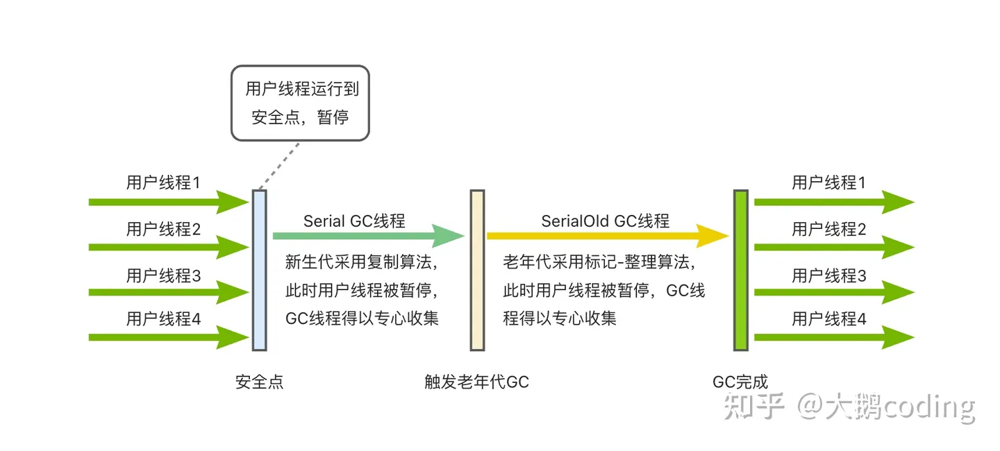
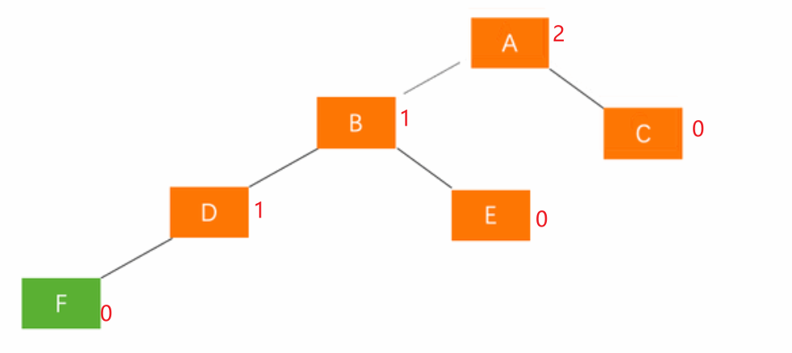
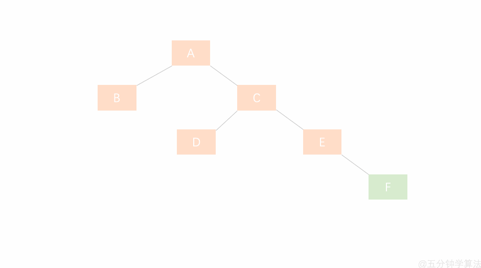

## 锁的分类

- 互斥锁：用于保证在任何时刻，都只能有一个线程访问该对象。当获取锁操作失败时，线程会进入睡眠，等待锁释放时被唤醒。
- 读写锁：rwlock，分为读锁和写锁。处于读操作时，可以允许多个线程同时获得读操作。但是同一时刻只能有一个线程可以获得写锁。其它获取写锁失败的线程都会进入睡眠状态，直到写锁释放时被唤醒。 注意：写锁会阻塞其它读写锁。当有一个线程获得写锁在写时，读锁也不能被其它线程获取；写者优先于读者（一旦有写者，则后续读者必须等待，唤醒时优先考虑写者）。适用于读取数据的频率远远大于写数据的频率的场合。
- 自旋锁：spinlock，在任何时刻同样只能有一个线程访问对象。但是当获取锁操作失败时，不会进入睡眠，而是会在原地自旋，直到锁被释放。这样节省了线程从睡眠状态到被唤醒期间的消耗，在加锁时间短暂的环境下会极大的提高效率。但如果加锁时间过长，则会非常浪费CPU资源。
- RCU：即read-copy-update，在修改数据时，首先需要读取数据，然后生成一个副本，对副本进行修改。修改完成后，再将老数据update成新的数据。使用RCU时，读者几乎不需要同步开销，既不需要获得锁，也不使用原子指令，不会导致锁竞争，因此就不用考虑死锁问题了。而对于写者的同步开销较大，它需要复制被修改的数据，还必须使用锁机制同步并行其它写者的修改操作。在有大量读操作，少量写操作的情况下效率非常高。

## 线程池ThreadPoolExecutor

### 线程池主要工作方式

一个ExecutorService使用可能的几个池线程之一执行每个提交的任务，通常使用Executors工厂方法配置。
线程池解决两个不同的问题：由于减少了每个任务的调用开销，它们通常在执行大量异步任务时提供改进的性能，并且它们提供了一种限制和管理资源的方法，包括在执行集合时消耗的线程任务。 每个ThreadPoolExecutor还维护一些基本的统计信息，例如已完成的任务数。
为了在广泛的上下文中有用，此类提供了许多可调整的参数和可扩展性挂钩。 但是，强烈建议程序员使用更方便的Executors工厂方法Executors.newCachedThreadPool （无界线程池，具有自动线程回收）、 Executors.newFixedThreadPool （固定大小线程池）和Executors.newSingleThreadExecutor （单个后台线程），它们为最常见的使用场景。 否则，在手动配置和调整此类时使用以下指南：
核心和最大池大小
ThreadPoolExecutor将根据 corePoolSize（请参阅getCorePoolSize ）和getCorePoolSize （请参阅getMaximumPoolSize ）设置的边界自动调整池大小（请参阅getPoolSize ）。 在方法execute(Runnable)提交新任务时，如果运行的线程少于 corePoolSize，则会创建一个新线程来处理请求，即使其他工作线程处于空闲状态。 否则，如果正在运行的线程少于 maximumPoolSize，则只有在队列已满时才会创建一个新线程来处理请求。 通过将 corePoolSize 和 maximumPoolSize 设置为相同，您可以创建一个固定大小的线程池。 通过将 maximumPoolSize 设置为一个基本上无界的值，例如Integer.MAX_VALUE ，您可以允许池容纳任意数量的并发任务。 最典型的是，核心和最大池大小仅在构造时设置，但它们也可以使用setCorePoolSize和setMaximumPoolSize动态更改。
按需构建
默认情况下，即使是核心线程也只有在新任务到达时才最初创建和启动，但这可以使用方法prestartCoreThread或prestartAllCoreThreads动态覆盖。 如果您使用非空队列构造池，您可能想要预启动线程。
创建新线程
使用ThreadFactory创建新线程。 如果没有另外指定，则使用Executors.defaultThreadFactory ，它创建的线程都在同一个ThreadGroup并且具有相同的NORM_PRIORITY优先级和非守护进程状态。 通过提供不同的 ThreadFactory，您可以更改线程的名称、线程组、优先级、守护进程状态等。如果ThreadFactory在通过从newThread返回 null 的询问时未能创建线程，则执行程序将继续，但可能无法执行任何任务。 线程应该拥有“modifyThread” RuntimePermission 。 如果工作线程或其他使用池的线程不具备此权限，则服务可能会降级：配置更改可能无法及时生效，关闭池可能会一直处于可以终止但未完成的状态。
保活时间
如果池中当前有超过 corePoolSize 的线程，则多余的线程如果空闲时间超过 keepAliveTime（请参阅getKeepAliveTime(TimeUnit) ）将被终止。 这提供了一种在未积极使用池时减少资源消耗的方法。 如果池稍后变得更加活跃，则将构建新线程。 也可以使用setKeepAliveTime(long, TimeUnit)方法动态更改此参数。 使用Long.MAX_VALUE TimeUnit.NANOSECONDS值Long.MAX_VALUE有效地禁止空闲线程在关闭之前终止。 默认情况下，保持活动策略仅在有超过 corePoolSize 个线程时应用，但方法allowCoreThreadTimeOut(boolean)也可用于将此超时策略应用于核心线程，只要 keepAliveTime 值不为零.
排队
任何BlockingQueue都可用于传输和保存提交的任务。 此队列的使用与池大小交互：
如果正在运行的线程少于 corePoolSize，则 Executor 总是喜欢添加新线程而不是排队。
如果 corePoolSize 或更多线程正在运行，Executor 总是喜欢将请求排队而不是添加新线程。
如果请求无法排队，则会创建一个新线程，除非这会超过 maximumPoolSize，在这种情况下，任务将被拒绝。
排队的一般策略有以下三种：
直接交接。 工作队列的一个很好的默认选择是SynchronousQueue ，它将任务移交给线程而不用其他方式保留它们。 在这里，如果没有线程可立即运行，则将任务排队的尝试将失败，因此将构建一个新线程。 在处理可能具有内部依赖性的请求集时，此策略可避免锁定。 直接切换通常需要无限的maximumPoolSizes 以避免拒绝新提交的任务。 这反过来又承认了当命令平均到达速度超过它们可以处理的速度时无限线程增长的可能性。
无界队列。 使用无界队列（例如，没有预定义容量的LinkedBlockingQueue ）将导致新任务在所有 corePoolSize 线程都忙时在队列中等待。 因此，不会创建超过 corePoolSize 的线程。 （因此maximumPoolSize的值没有任何影响。）当每个任务完全独立于其他任务时，这可能是合适的，因此任务不会影响彼此的执行； 例如，在网页服务器中。 虽然这种排队方式在平滑请求的瞬时爆发方面很有用，但它承认当命令的平均到达速度超过它们的处理速度时，工作队列可能会无限增长。
有界队列。 有界队列（例如， ArrayBlockingQueue ）在与有限的 maximumPoolSizes 一起使用时有助于防止资源耗尽，但可能更难以调整和控制。 队列大小和最大池大小可以相互权衡：使用大队列和小池可以最大限度地减少 CPU 使用率、操作系统资源和上下文切换开销，但会导致人为地降低吞吐量。 如果任务频繁阻塞（例如，如果它们受 I/O 限制），则系统可能能够为比您允许的更多线程安排时间。 使用小队列通常需要更大的池大小，这会使 CPU 更忙，但可能会遇到不可接受的调度开销，这也会降低吞吐量。
被拒绝的任务
当 Executor 已经关闭，并且当 Executor 对最大线程和工作队列容量使用有限边界并且饱和时，在方法execute(Runnable)提交的新任务将被拒绝。 在任一情况下， execute方法调用RejectedExecutionHandler.rejectedExecution(Runnable, ThreadPoolExecutor)其的方法RejectedExecutionHandler 。 提供了四个预定义的处理程序策略：
在默认的ThreadPoolExecutor.AbortPolicy ，处理程序在拒绝时抛出运行时RejectedExecutionException 。
在ThreadPoolExecutor.CallerRunsPolicy ，调用execute的线程运行任务。 这提供了一个简单的反馈控制机制，可以减慢提交新任务的速度。
在ThreadPoolExecutor.DiscardPolicy ，无法执行的任务被简单地丢弃。
在ThreadPoolExecutor.DiscardOldestPolicy ，如果执行器没有关闭，工作队列头部的任务会被丢弃，然后重试执行（可能会再次失败，导致重复执行）。
可以定义和使用其他类型的RejectedExecutionHandler类。 这样做需要小心，特别是当策略设计为仅在特定容量或排队策略下工作时。
钩子方法
此类提供protected可beforeExecute(Thread, Runnable)和afterExecute(Runnable, Throwable)方法，这些方法在每个任务执行之前和之后调用。 这些可用于操作执行环境； 例如，重新初始化 ThreadLocals、收集统计信息或添加日志条目。 此外，可以覆盖已terminated方法以执行在 Executor 完全终止后需要完成的任何特殊处理。
如果钩子、回调或 BlockingQueue 方法抛出异常，内部工作线程可能会依次失败、突然终止并可能被替换。
队列维护
方法getQueue()允许访问工作队列以进行监视和调试。 强烈建议不要将此方法用于任何其他目的。 提供的两种方法remove(Runnable)和purge可用于在大量排队任务被取消时协助存储回收。
开垦
即不再在程序中引用，也没有剩余线程都可以被回收（垃圾回收）没有被明确地关闭池。 您可以通过设置适当的保持活动时间、使用零核心线程的下限和/或设置allowCoreThreadTimeOut(boolean)来配置池以允许所有未使用的线程最终死亡。
扩展示例。 此类的大多数扩展都会覆盖一个或多个受保护的挂钩方法。 例如，这是一个添加简单暂停/恢复功能的子类：

~~~java
 class PausableThreadPoolExecutor extends ThreadPoolExecutor {
   private boolean isPaused;
   private ReentrantLock pauseLock = new ReentrantLock();
   private Condition unpaused = pauseLock.newCondition();

   public PausableThreadPoolExecutor(...) { super(...); }

   protected void beforeExecute(Thread t, Runnable r) {
     super.beforeExecute(t, r);
     pauseLock.lock();
     try {
       while (isPaused) unpaused.await();
     } catch (InterruptedException ie) {
       t.interrupt();
     } finally {
       pauseLock.unlock();
     }
   }

   public void pause() {
     pauseLock.lock();
     try {
       isPaused = true;
     } finally {
       pauseLock.unlock();
     }
   }

   public void resume() {
     pauseLock.lock();
     try {
       isPaused = false;
       unpaused.signalAll();
     } finally {
       pauseLock.unlock();
     }
   }
 }
~~~


### 关于AQS的说明

#### 框架基础

AQS，线程同步器其实就是一个获取和释放共享资源，以及获取共享资源失败如何处理的框架，在其内部维护了两个重要的东西：

- voliatle int state(代表共享资源)，获取共享资源和释放共享资源的过程大致上就是对共享资源的修改。

  

- 一个FIFO的双向链表(代表抢锁失败的线程的一个队列)， **其基础逻辑就是把获取共享资源失败的线程加入到队列结尾，并将线程park住。队列头部是一个代表占用线程的一个虚拟节点，该节点释放共享资源的时候会唤醒他的下一个节点(如果需要唤醒的话)。**

AQS定义了两种资源共享方式：**Exclusive(独占，即某一时刻只能有一个线程能够成功获得锁，比如互斥锁ReentrantLock)， Share(共享，即某一时刻可以有多个线程获得锁， 比如Semaphore、CountDownLatch )。**

不同的线程同步器竞争共享资源的方式也不同，使用AQS的时候只要实现对共享资源state的获取与释放即可，至于具体的获取资源失败的线程的队列的维护(获取资源失败入队列，释放资源出队列并唤醒下一节点， 中断或者获取资源超时出队列)交给AQS维护就好了。**所以在本章中只讲获取成功和失败，释放成功和失败共享资源应该如何处理线程，而什么时候应该成功和失败应该是AQS子类应该处理的。**

自定义的同步器实现主要可以实现一下集中方法：

~~~java
// 尝试以独占的方式获取资源，成功返回true，否则false
protected boolean tryAcquire(int);
// 尝试释放资源，成功释放返回true， 否则false
protected boolean tryRelease(int arg);

// 尝试以共享共享的方式获取资源， 获取失败返回负值。
// 如果在共享模式下获取成功但后续节点在共享模式获取不能成功，则为零。
// 如果在共享模式下获取成功并且后续节点在共享模式获取也可能成功，则为正值。
protected int tryAcquireShared(int arg);
protected boolean tryReleaseShared(int arg);

// 该线程是否正在独占资源，只有用到condition才需要实现他
protected boolean isHeldExclusively();
~~~

一般来说，自定义同步器要么是独占方法，要么是共享方式，**他们也只需实现tryAcquire-tryRelease、tryAcquireShared-tryReleaseShared中的一种即可**。但AQS也支持自定义同步器同时实现独占和共享两种方式，如ReentrantReadWriteLock。


#### 节点状态解析

对于每一个等待获取资源的线程， AQS都会将其包装成一个Node节点并把它加入到队列中。Node节点中包含了等待线程的引用，该线程获取锁的模式(独占/共享)，当前节点的前后节点的引用，以及最重要的节点的等待状态，共有5种取值CANCELLED、SIGNAL、CONDITION、PROPAGATE、0。

- **CANCELLED**(1)：表示当前结点已取消调度。当timeout或被中断（响应中断的情况下），会触发变更为此状态，进入该状态后的结点将不会再变化。
- **SIGNAL**(-1)：表示后续结点正在或者马上被park住，当前节点释放资源后需要unpark后续节点
- **CONDITION**(-2)：表示结点等待在Condition上，当其他线程调用了Condition的signal()方法后，CONDITION状态的结点将**从等待队列转移到同步队列中**，等待获取同步锁。
- **PROPAGATE**(-3)：该状态是只在共享模式下使用的一个中间状态，表示下一个acquireShared操作需要无条件的唤醒下一个节点，该状态后续为专门讲到。
- **0**：新结点入队时的默认状态。

注意，**负值表示结点处于有效等待状态，而正值表示结点已被取消。所以源码中很多地方用>0、<0来判断结点的状态是否正常**。


#### 独占模式解析

> 主要步骤

在AQS中以独占模式获取和释放共享资源的方法有以下几种：

1. acquire：以独占方式获取共享资源，忽略中断，直到获取到共享资源才返回。
2. acquireInterruptibly：以独占方式获取共享资源，获取到共享资源或者中断才返回。
3. tryAcquireNanos：以独占方式获取共享资源，获取到共享资源或者中断或者超时返回。
4. release：以独占方式释放共享资源。

前三个获取锁的步骤都是大同小异，只在个别地方有差异。

独占模式下获取共享资源的步骤大体如下：

1. 调用tryAcquire方法尝试获取资源，获取成功直接返回
2. 获取失败调用addWaiter将当前线程包装成Node节点并加入到双向队列的尾部。
3. 调用acquireQueued方法使线程堵塞，该堵塞线程将会被释放共享资源的线程唤醒然后再次竞争共享资源，失败再次堵塞，一直循环，直到获取到共享资源然后返回。
4. 如果线程在堵塞过程中被中断， 将会清除中断位并标记起来。如果获取资源成功后，有标记的话就自己调用interrupt方法中断自己补一个中断位。


> acquire(int)

下面是源码解析，主要以acquire为例，该方法时独占模式下线程获取共享资源的顶层入口

~~~java
    public final void acquire(int arg) {
        if (!tryAcquire(arg) &&
            acquireQueued(addWaiter(Node.EXCLUSIVE), arg))
            selfInterrupt();
    }
~~~

函数流程如下：

1. tryAcquire尝试获取共享资源，如果成功直接返回，这里体现了非公平锁，每个线程获取锁时会尝试直接抢占加塞一次，而CLH队列中可能还有别的线程在等待。
2. 获取共享资源失败就通过addWaiter将当前线程包装成Node节点并加入到双向队列的尾部，并标记为独占模式，返回新添加的Node
3. 调用acquireQueued，在该方法中堵塞，被唤醒，一直循环直到获取到共享资源，如果过程中被中断过返回true，否则false
4. 如果acquireQueued返回true，说明被中断过，整个if中的条件成立，调用selfInterrupt自己中断自己补一个中断位

**需要注意的是tryAcquire是需要子类去实现何时可以获取共享资源成功的，AQS并不负责这个。所以在这里并不讨论，只说明获取失败后如何处理。**

### 线程池源码

问题： 

状态判断


为何重新判断


释放共享资源的步骤如下：

1. 调用tryRelease尝试释放共享资源，如果释放失败直接返回。
2. 如果释放共享资源成功，参看队列头结点的waitStatus看是否需要唤醒后继节点的线程。

### 可监控的线程池

https://tech.meituan.com/2020/04/02/java-pooling-pratice-in-meituan.html

https://juejin.cn/post/7074579161201229838


### 线程池

> 基本概述

```
/**
 * 当通过execute提交方法的时候, 如果线程数量小于corePoolSize, 那么会创建新线程来处理该请求, 即使其他线程空闲
 * 否则会将他们放在队列中, 如果队列也已经满了, 那么会创建新线程来处理新请求
 * 如果线程数等于maximumPoolSize, 那么会执行拒绝策略
 *
 * 当pool中线程超过corePoolSize的线程, 那么多余的线程如果空闲时间超过keepAliveTime, 将会被终止
 *
 * 队列一般有三种:
 *   1. SynchronousQueue,
 *   2. ArrayBlockingQueue, 有界队列
 *   3. LinkedBlockingQueue(没有预定义容量的情况下), 无界队列
 *
 * 拒绝策略有四种:
 *   1. AbortPolicy, 抛出RejectedExecutionException
 *   2. CallerRunsPolicy, 在caller线程中执行任务
 *   3. Discard, 直接丢弃
 *   4. DiscardOldestPolicy, 丢弃队列头部的任务
 */
```

> 线程池属性标识以及状态流转

```java
    // int的原子类
    // 高3位: 线程池状态
    // 低29位: 线程池中的线程个数
    private final AtomicInteger ctl = new AtomicInteger(ctlOf(RUNNING, 0));
    private static final int COUNT_BITS = Integer.SIZE - 3;
    private static final int COUNT_MASK = (1 << COUNT_BITS) - 1;
    // 线程池的状态
    private static final int RUNNING    = -1 << COUNT_BITS;
    private static final int SHUTDOWN   =  0 << COUNT_BITS;
    private static final int STOP       =  1 << COUNT_BITS;
    private static final int TIDYING    =  2 << COUNT_BITS;
    private static final int TERMINATED =  3 << COUNT_BITS;
    // Packing and unpacking ctl
    private static int runStateOf(int c)     { return c & ~COUNT_MASK; }
    private static int workerCountOf(int c)  { return c & COUNT_MASK; }
    private static int ctlOf(int rs, int wc) { return rs | wc; }
```


> command的包装

我们通过submit创建command给线程池后, 他会包装为一个RunnableFuture对象, 

~~~java
public <T> Future<T> submit(Callable<T> task) {
        if (task == null) throw new NullPointerException();
        RunnableFuture<T> ftask = newTaskFor(task);
        execute(ftask);
        return ftask;
}
~~~

RunnableFuture有如下几种状态

~~~java
    private volatile int state;
    private static final int NEW          = 0; // 初始状态, 任务可能没有执行, 也可能正在执行
    private static final int COMPLETING   = 1; // 任务已经完成了, 正在设置outcome
    private static final int NORMAL       = 2; // 设置outcome完成, 任务正常完成
    private static final int EXCEPTIONAL  = 3; // 设置outcome完成, 任务出现异常, outcome就是异常
    private static final int CANCELLED    = 4; // 任务已经被取消了, 如果任务还没有开始执行, 那么不会执行了, 如果已经执行了, 那就让他执行
    private static final int INTERRUPTING = 5; // 任务已经被取消了, 如果任务还没执行, 那么就不执行了, 如果已经仔细了, 那么中断他
    private static final int INTERRUPTED  = 6; // 任务中断完毕
~~~


下面我们来看看RunnableFuture的run方法

~~~java
    public FutureTask(Callable<V> callable) {
        if (callable == null)
            throw new NullPointerException();
        this.callable = callable;
        this.state = NEW;       // ensure visibility of callable
    }
	public void run() {
        // 如果当前state不为new,
        // 或者当前state为new, 但是cas 设置runner为当前线程失败
        // 都说明了当前task已经有别的线程执行了
        if (state != NEW ||
                !UNSAFE.compareAndSwapObject(this, runnerOffset,
                        null, Thread.currentThread()))
            return;
        try {
            Callable<V> c = callable;
            if (c != null && state == NEW) {
                V result;
                boolean ran;
                try {
                    result = c.call(); // 执行call方法, 获得返回值
                    ran = true; // 标记为正常结束
                } catch (Throwable ex) {
                    result = null;
                    ran = false; // 标记为异常结束
                    // 设置ex为outcome
                    // 该方法会将状态从new -> completing, 然后赋值outcome, 然后将状态改为exceptional
                    setException(ex);
                }
                if (ran)
                    // 正常结束
                    // 将状态从new -> completing, 然后赋值outcome, 然后将状态改为normal
                    set(result);
            }
        } finally {
            // runner must be non-null until state is settled to
            // prevent concurrent calls to run()
            runner = null; // 重置runner
            // state must be re-read after nulling runner to prevent
            // leaked interrupts
            int s = state;
            // 判断当前任务的状态是否被中断, 并做响应的处理
            if (s >= INTERRUPTING)
                handlePossibleCancellationInterrupt(s);
        }
        
        
    // 取消掉任务, mayInterruptIfRunning表示在取消的时候, 是否要中断任务
    // 如果为false, 那么如果任务还没有开始执行, 就不会执行了, 如果正在执行, 那么就让他执行完毕但是不赋值outcome
    // 如果为true, 那么如果任务还没有开始执行, 就不会执行了, 如果正在执行, 那么就中断他同时不赋值outcome
    // 如果当前任务正在堵塞, 那么callable.run方法会抛出InterruptedException
    public boolean cancel(boolean mayInterruptIfRunning) {
        // 如果state不是new, 或者cas将状态改为INTERRUPTING, CANCELLED失败, 
        // 说明任务已经执行完了, 无法取消
        // 如果mayInterruptIfRunning为false, 那么仅仅只是切换了状态, 正在执行的任务会正常执行完毕, 只是不会赋值outcome
        if (!(state == NEW &&
                UNSAFE.compareAndSwapInt(this, stateOffset, NEW,
                        mayInterruptIfRunning ? INTERRUPTING : CANCELLED)))
            // 返回false, 表示无法取消
            return false;
        try {    // in case call to interrupt throws exception
            // 如果mayInterruptIfRunning为true, 中断线程
            if (mayInterruptIfRunning) {
                try {
                    Thread t = runner;
                    if (t != null)
                        t.interrupt();
                } finally { // final state
                    UNSAFE.putOrderedInt(this, stateOffset, INTERRUPTED);
                }
            }
        } finally {
            finishCompletion();
        }
        // 取消任务成功
        return true;
    }
~~~

> 线程池的执行

线程池将Runnable的任务包装成一个FutureTask之后, 开始执行任务

~~~java
public void execute(Runnable command) {
        if (command == null)
            throw new NullPointerException();
        int c = ctl.get();
        // 如果worker数量 < corePoolSize
        if (workerCountOf(c) < corePoolSize) {
            // 新建核心线程并添加worker
            // 并发操作可能会导致添加核心worker失败
            if (addWorker(command, true))
                return;
            c = ctl.get(); // 添加核心线程失败, 说明有并发, 需要重新获取ctl
        }
        // 如果线程池是running, 并且如果worker数量 >= corePoolSize, 或者添加worker失败
        // 那么将command添加到queue中
        if (isRunning(c) && workQueue.offer(command)) {
            int recheck = ctl.get();
            // 重新检查是否为running, 如果不是, 那么remove并且reject掉command
            if (! isRunning(recheck) && remove(command))
                reject(command);
            // 如果还是running, 那么还要检测一下worker是否为0
            // 如果allowCoreThreadPool=true, 那么核心线程也会消亡
            // 就怕进入到这里的时候, 核心线程集体消亡
            else if (workerCountOf(recheck) == 0)
                addWorker(null, false);
        }
        // 如果添加到queue中失败, 那么尝试创建非核心线程, 并执行worker
        else if (!addWorker(command, false))
            // 如果创建非核心的worker也失败, 那么直接拒绝command
            reject(command);
    }
~~~

~~~java
// 如果firstTask不为null, 那么是正常的添加worker
    // 如果firstTask为null, 那么就是添加一个worker来处理queue中的任务, 防止queue中还有任务, 但是worker已经全部gg了
    private boolean addWorker(Runnable firstTask, boolean core) {
        retry:
        for (int c = ctl.get();;) {
            /*
                条件可以改写为
                    (runStateAtLeast(c, SHUTDOWN) && runStateAtLeast(c, STOP)) ||
                    (runStateAtLeast(c, SHUTDOWN) && firstTask != null)  ||
                    (runStateAtLeast(c, SHUTDOWN) && workQueue.isEmpty())
                然后改写为
                    (runStateAtLeast(c, SHUTDOWN) && runStateAtLeast(c, STOP)) ||
                    (runStateAtLeast(c, SHUTDOWN) && (firstTask != null || workQueue.isEmpty())

                (runStateAtLeast(c, SHUTDOWN) && runStateAtLeast(c, STOP)) 表示
                    如果状态至少是stop, 那么状态可能是stop tiding terminated, 这些状态不接受新任务了

                (runStateAtLeast(c, SHUTDOWN) && (firstTask != null || workQueue.isEmpty())
                    如果上面情况不成立, 那么当前状态可能是running和stop, 如果runStateAtLeast(c, SHUTDOWN) 成立, 那么状态只能是shutdown
                    也就是说如果状态是shutdown, 并且firstTask不为null或者workQueue不是空的, 那么不能添加worker
                    也就是说如果状态是shutdown, 那么只有firstTask为null, 并且queue不为空的情况下才能添加worker, 防止queue中的任务没有worker来处理

             */
            // 如果状态至少是stop, 那么不能添加worker, 或者如果状态是shutdown, 那么只有firstTask为null, 并且queue不为空的情况下才能添加worker
            // !!!!!!!!!!!!!!!!!! 也就是说要么状态是running, 要么状态是shutdown并且firstTask为null, 并且queue不为空, 才有可能跳过这个条件 !!!!!!!
            if (runStateAtLeast(c, SHUTDOWN)
                    && (runStateAtLeast(c, STOP)
                    || firstTask != null
                    || workQueue.isEmpty()))
                return false;
            for (;;) {
                // 这个条件在jdk1.8是  workerCountOf(c) >= CAPACITY || workerCountOf(c) >= (core ? corePoolSize : maximumPoolSize)
                // 即如果线程数已经到达容量上线了( 2^29 -1 ), 那么创建失败
                // 或者如果创建的是核心线程数, 并且worker已经大于corePoolSize了, 也创建失败
                // 或者创建的是非核心线程数, 并且worker已经大于maximumPoolSize了, 也创建失败
                if (workerCountOf(c)
                        >= ((core ? corePoolSize : maximumPoolSize) & COUNT_MASK))
                    return false;
                // 将worker数量+1, 如果成功, 那么跳出自旋
                if (compareAndIncrementWorkerCount(c))
                    break retry;

                c = ctl.get();  // cas失败, 重新加载ctl

                // 上面已经说了, 执行到这里, 要么状态是running, 要么状态是shutdown并且firstTask为null, 并且queue不为空
                // 所以如果状态还是shutdown, 那么就要在外层for循环中自旋重新判断firstTask和queue是否满足条件
                // 如果状态是running, 那么只需要在内层循环中cas将worker数量+1就好了
                if (runStateAtLeast(c, SHUTDOWN))
                    // 进行外层cas
                    continue retry;
                // 进行内层cas
            }
        }

        // 执行到这里, 要么state是running, 要么state是shutdown并且firstTask为null, 并且queue不为空
        // 并且已经将worker数量加1了
        // 接下来就要创建worker了
        boolean workerStarted = false;
        boolean workerAdded = false;
        Worker w = null;
        try {
            w = new Worker(firstTask); // 创建worker
            final Thread t = w.thread;
            if (t != null) {
                final ReentrantLock mainLock = this.mainLock;
                mainLock.lock(); // 加锁, 防止创建worker的时候别的线程调用shutdown等方法干掉线程池, 干掉线程池需要先获取锁
                try {
                    // Recheck while holding lock.
                    // Back out on ThreadFactory failure or if
                    // shut down before lock acquired.
                    int c = ctl.get();

                    // 如果状态是running, 或者状态是shutdown并且firstTask为null
                    if (isRunning(c) ||
                            (runStateLessThan(c, STOP) && firstTask == null)) {
                        if (t.getState() != Thread.State.NEW)
                            throw new IllegalThreadStateException();
                        // 添加线程到集合中
                        workers.add(w);
                        workerAdded = true;
                        int s = workers.size();
                        if (s > largestPoolSize)
                            largestPoolSize = s; //记录线程池达到的最大线程数量
                    }
                } finally {
                    mainLock.unlock();
                }
                if (workerAdded) {
                    t.start(); // 启动线程, 有可能这个线程的start方法已经被别人调用过了, 会报错
                    workerStarted = true;
                }
            }
        } finally {
            if (! workerStarted)
                // 如果线程的start方法被别人调用过了,
                // 那么将worker数量-1, 从worker集合中移除worker, 尝试关闭线程池
                addWorkerFailed(w);
        }
        return workerStarted;
    }
~~~

我们来看看worker线程到底是怎么执行的

~~~java
public void run() {
    runWorker(this);
}
final void runWorker(Worker w) {
        Thread wt = Thread.currentThread();
        Runnable task = w.firstTask; // 获取worker的任务
        w.firstTask = null; // 清除worker的任务
        w.unlock(); // allow interrupts

        // 线程有两种情况会退出运行: 1. 拿不到任务, 自动消亡  2. 执行task过程中抛出异常
        // 这个标识线程是否是因为用户的Exception而退出运行的
        boolean completedAbruptly = true;
        try {
            // 如果task不为空
            // 如果task为空, 就从queue中获取task
            while (task != null || (task = getTask()) != null) {
                w.lock();
                // If pool is stopping, ensure thread is interrupted;
                // if not, ensure thread is not interrupted.  This
                // requires a recheck in second case to deal with
                // shutdownNow race while clearing interrupt
                // 如果线程池状态至少是stop, 即stop tiding terminated, 那么要对线程进行中断
                if ((runStateAtLeast(ctl.get(), STOP) ||
                        (Thread.interrupted() &&
                                runStateAtLeast(ctl.get(), STOP))) &&
                        !wt.isInterrupted())
                    wt.interrupt();
                try {
                    beforeExecute(wt, task); // 执行钩子
                    try {
                        task.run();
                        afterExecute(task, null); // 执行钩子
                    } catch (Throwable ex) {
                        afterExecute(task, ex); // 执行钩子
                        throw ex;
                    }
                } finally {
                    task = null;
                    w.completedTasks++;
                    w.unlock();
                }
            }
            completedAbruptly = false; // 非用户异常而退出运行
        } finally {
            // 没有拉到任务, 要线程消亡,
            // 可能是因为状态是stop, 也可能是状态是shutdown并且queue为空了
            // 也有可能就是简单的没拿到任务超时了
            // 也有可能是用户的任务报错了
            processWorkerExit(w, completedAbruptly);
        }
    }
~~~

上面可以看到, 如果一个线程拉不到任务, 就会消亡掉, 那么下面看看在什么情况下会拉取不到任务

~~~java
private Runnable getTask() {
        boolean timedOut = false; // Did the last poll() time out?

        for (;;) {
            int c = ctl.get();

            // 判断线程池状态
            // 如果状态至少是stop, 那么不接受任务了, 直接返回null, 让线程消亡
            // 或者状态是shutdown并且queue已经空了, 表示处理完了任务了, 也要让线程消亡掉
            if (runStateAtLeast(c, SHUTDOWN)
                    && (runStateAtLeast(c, STOP) || workQueue.isEmpty())) {
                decrementWorkerCount();
                return null;
            }

            int wc = workerCountOf(c);

            // Are workers subject to culling?
            // 判断当前线程在pool任务的时候是否要设置超时时间
            // 如果设置了allowCoreThreadTimeOut, 或者worker数量大于corePoolSize
            // 这个时候要是拉取不到任务, 线程就要消亡
            boolean timed = allowCoreThreadTimeOut || wc > corePoolSize;

            // 没看懂这个条件, 但是可以肯定, 超时的线程会返回null消亡
            if ((wc > maximumPoolSize || (timed && timedOut))
                    && (wc > 1 || workQueue.isEmpty())) {
                if (compareAndDecrementWorkerCount(c))
                    return null;
                continue; // 自旋
            }

            try {
                Runnable r = timed ?
                        workQueue.poll(keepAliveTime, TimeUnit.NANOSECONDS) :
                        workQueue.take();
                if (r != null)
                    return r;
                timedOut = true; // 拉到了任务就直接返回了, 这里拉不到任务, 所以设置timeout, 然后自旋重新
            } catch (InterruptedException retry) {
                timedOut = false;
            }
        }
    }
~~~

同时下面看看线程是如何消亡的

~~~java
private void processWorkerExit(Worker w, boolean completedAbruptly) {
        // 如果是因为用户任务报错, 导致线程消亡, 那么要线程数-1
        // 如果是get不到任务而导致线程消亡, completedAbruptly=false,
        // 并且worker数在getTask()方法中就已经-1了, 这里不必再减一了
        if (completedAbruptly)
            decrementWorkerCount();

        final ReentrantLock mainLock = this.mainLock;
        mainLock.lock();
        try {
            completedTaskCount += w.completedTasks;
            workers.remove(w); // 移除线程
        } finally {
            mainLock.unlock();
        }

        tryTerminate();

        int c = ctl.get();
        // 如果是stop tiding terminated, 那么只需要移除线程就好了
        // 如果是running, shutdown, 那么要执行一些额外的判断
        if (runStateLessThan(c, STOP)) {
            // 如果线程不是由于用户的exception消亡的
            if (!completedAbruptly) {
                // 判断当前线程池中需要保留的最少线程数, 如果运行core thread timeout, 那么就是0
                int min = allowCoreThreadTimeOut ? 0 : corePoolSize;
                // 如果最小线程为0, 并且队列不为空, 那么min=1, 至少需要一个线程来处理剩余的任务
                if (min == 0 && ! workQueue.isEmpty())
                    min = 1;
                // 判断线程数是否大于min, 如果大于, 那么return, 让线程挂掉
                if (workerCountOf(c) >= min)
                    return; // replacement not needed
            }
            // 如果是用户异常导致的, 或者当前worker数量已经小于min
            // 那么要重新添加一个worker来补偿
            addWorker(null, false);
        }
    }
~~~


## Reference

https://www.cnblogs.com/binlovetech/p/18245598

### 1. Reference的概念

#### 1.1 StrongReference

大部分 Java 对象之间的关系都是强引用，只要对象与 GcRoot 之间有强引用关系的存在，那么JVM宁愿报OutOfMemory也不会回收他

~~~java
Object gcRoot = new Object();
~~~

#### 1.2 SoftReference

如果一个对象只有一个软引用引用着他, 那么只有当内存不足的时候, 才会回收他

后面我们通过 `SoftReference#get` 方法获取到的引用对象将会是 Null （Object 对象已被回收)。

~~~java
SoftReference gcRoot = new SoftReference<Object>(new Object());
~~~


#### 1.3 WeakReference

如果一个对象只有一个弱引用在引用着他, 那么只要发生了gc, 就会回收他

后面我们通过 `WeakReference#get` 方法获取到的引用对象将会是 Null （Object 对象已被回收)。

~~~java
WeakReference gcRoot = new WeakReference<Object>(new Object());
~~~


#### 1.4 PhantomReference

虚引用其实和 WeakReference 差不多，他们共同的特点都是一旦发生 GC，PhantomReference 和 WeakReference 所引用的对象都会被 GC 掉

不同的是 PhantomReference 无法像其他引用类型一样能够通过 get 方法获取到被引用的对象。

~~~java
public class PhantomReference<T> extends Reference<T> {
    public T get() {
        return null;
    }
}
~~~

看上去这个 PhantomReference 好像是没啥用处，因为它既不能影响被引用对象的生命周期，也无法通过它来访问被引用对象。

但是PhantomReference一个重要的功能就是, 我们可以在创建PhantomReference的时候指定一个ReferenceQueue, 这样当PhantomReference保存的值被gc之后, JVM会将PhantomReference放到这个ReferenceQueue中,  我们可以从ReferenceQueue中将PhantomReference取出来, 这样我们就知道对应的referent被gc了, 从而进行一些资源清理的动作, 类似对象的析构函数

~~~java
public class ReferenceTest {

    public static class MustRelease extends PhantomReference<Object> {

        public static final ReferenceQueue<Object> queue = new ReferenceQueue<>();

        // Reference需要被gc root强引用才会生效, 否则Reference和保存的值会被直接gc掉
        // 所有创建的MustRelease都放在这里, 组成一个双向链表, 进行强引用
        private static MustRelease first = null;
        private MustRelease next = null;
        private MustRelease prev = null;

        // 执行资源清理的动作
        private final Runnable doRelease;

        private MustRelease(Object referent, Runnable doRelease) {
            // 所有referent被gc的MustRelease都会被放到这个队列中
            super(referent, queue);
            this.doRelease = doRelease;
        }

        public static MustRelease create(Object referent, Runnable doRelease){
            return add(new MustRelease(referent, doRelease));
        }

        // 将创建的MustRelease头插法到链表中
        private static synchronized MustRelease add(MustRelease m) {
            if (first != null) {
                m.next = first;
                first.prev = m;
            }
            first = m;
            return m;
        }

        // 从链表中移除MustRelease
        private static synchronized boolean remove(MustRelease m) {
            // 如果m已经被移除了
            if (m.next == m)
                return false;
            // 如果移除的是头结点
            if (first == m) {
                if (m.next != null)
                    first = m.next;
                else
                    first = m.prev;
            }
            // 移除的是中间节点
            if (m.next != null)
                m.next.prev = m.prev;
            if (m.prev != null)
                m.prev.next = m.next;
            // 将m的next和prev都指向自己, 表示一个被删除了
            m.next = m;
            m.prev = m;
            return true;
        }

        public void clean(){
            // 从链表中移除this, 使得当前Reference对象可以被gc
            if (!remove(this)) {
                return;
            }
            try {
                // 执行清理
                doRelease.run();
            } catch (Throwable e) {
                e.printStackTrace();
            }
        }

        static {
            // 启动一个线程, 从queue中不停的获取MustRelease, 这些对象的referent已经被gc了
            new Thread(() -> {
                while (true) {
                    try {
                        // remove()会阻塞, 直到队列中有元素
                        // remove(timeout)会堵塞, 直到有元素或者timeout时间到了
                        // poll()不会堵塞, 如果没有元素就直接返回null
                        MustRelease mustRelease = (MustRelease)queue.remove();

                        mustRelease.doRelease.run(); // 执行资源清理的动作
                    } catch (InterruptedException e) {
                        e.printStackTrace();
                    }
                }
            }).start();
        }
    }

    public static void main(String[] args) {
        MustRelease mustRelease = new MustRelease(new Object(), () -> {
            System.out.println("do release");
        });
        System.gc(); // 回收object对象
        System.out.println("end");
    }
}
~~~

需要注意的是, **不管软引用还是弱引用, 还是虚引用, 都必须被其他gcroot强引用, 否则Reference和他保存的值referent都是不可达的, 那么只要有gc的时候, Reference和他保存的值referent都会被回收掉, 起不到作用**


### 2. Reference的原理

在这里提出一个疑问? **PhantomReference保存的referent被gc后, 对应的PhantomReference会被放到对应的ReferenceQueue中,  那么他是怎么被放进去的?**

要回答这个问题, 我们首先来看看Reference这个类的字段

~~~java
public abstract class Reference<T> {
    private T referent; // 保存的值
    volatile ReferenceQueue<? super T> queue; // 当referent被gc后, Reference需要放入的队列
    volatile Reference next;
    private transient Reference<T> discovered;
}
~~~

当GC的时候, JVM如果发现了

- 一个对象只能通过WeakReference, PhantomReference可达
- 内存不足时只能通过SoftReference可达

**那么就会将该对象gc, 并将对应的Reference使用头插法插入到叫做 `_reference_pending_list` 变量的链表中, 同时将对应Reference保存的值referent设置为null**

`_reference_pending_list` 链表中的 Reference 对象通过 Reference 类中的 `discovered` 字段相互连接。

```java
public abstract class Reference<T> {
     private transient Reference<?> discovered;
}
```


而在Reference中还有这样一段代码

~~~java
public abstract class Reference<T> {

    static {
        ThreadGroup tg = Thread.currentThread().getThreadGroup();
        // 获取 system thread group
        for (ThreadGroup tgn = tg;
             tgn != null;
             tg = tgn, tgn = tg.getParent());
        // 创建 system thread : ReferenceHandler
        Thread handler = new ReferenceHandler(tg, "Reference Handler");
        // 设置 ReferenceHandler 线程的优先级为最高优先级
        handler.setPriority(Thread.MAX_PRIORITY);
        handler.setDaemon(true);
        handler.start();  
    }
}
~~~

可以看到, Reference 类被加载的时候会创建一个ReferenceHandler守护线程，同时拥有最高的优先级, 这样可以尽最大可能保证 ReferenceHandler 线程被及时的调度到

而这个线程的作用就是执行processPendingReferences方法, 从`_reference_pending_list`中不停的取元素, 然后处理他们

~~~java
public abstract class Reference<T> {
	private static class ReferenceHandler extends Thread {
        public void run() {
            while (true) {
                processPendingReferences();
            }
        }
    }
    // 获取JVM内部的_reference_pending_list的值, 即获取链表的第一个元素并清除他
    private static native Reference<Object> getAndClearReferencePendingList();
	// 判断_reference_pending_list是否有值
    private static native boolean hasReferencePendingList();
	// 堵塞直到_reference_pending_list有值
    private static native void waitForReferencePendingList();
    // 当前是否在处理Reference
    private static boolean processPendingActive = false;
    
    private static void processPendingReferences() {
        // ReferenceHandler 线程等待 JVM 向 _reference_pending_list 填充 Reference 对象
        // GC 之后，如果有 Reference 对象需要处理，JVM 则将 ReferenceHandler 线程 唤醒
        waitForReferencePendingList();
        Reference<Object> pendingList;
        synchronized (processPendingLock) {
            // 获取 _reference_pending_list，随后将 _reference_pending_list 置为 null
            // 方便 JVM 在下一轮 GC 处理其他 Reference 对象
            pendingList = getAndClearReferencePendingList();
            //  true 表示 ReferenceHandler 线程正在处理 pendingList
            processPendingActive = true;
        }
  
        // 将 pendingList 中的 Reference 对象挨个从链表中摘下处理
        while (pendingList != null) {
            Reference<Object> ref = pendingList;
            // 获取下一个要处理的元素
            pendingList = ref.discovered;
            // 断开两个Reference之间的连接
            ref.discovered = null;

            if (ref instanceof Cleaner) {
                // 如果ref是Cleaner子类型, 那么调用其clean方法清除资源
                ((Cleaner)ref).clean();
                // 唤醒其他线程
                synchronized (processPendingLock) {
                    processPendingLock.notifyAll();
                }
            } else {
                // 如果对应的ref不是Cleaner值类型, 并且指定了ReferenceQueue
                // 就将Reference入队列
                ReferenceQueue<? super Object> q = ref.queue;
                if (q != ReferenceQueue.NULL) q.enqueue(ref);
            }
        }
        // 处理完了链表中的所有元素, 将是否正在处理Reference设置为false
        // 并唤醒其他线程
        synchronized (processPendingLock) {
            processPendingActive = false;
            processPendingLock.notifyAll();
        }
    }
}    
~~~


说大白话就是

- JVM会将referent被gc的Reference放到内部的_reference_pending_list链表中
- ReferenceHandler形成会从中不停的取元素, 如果是Cleaner就执行clean方法, 否则就放入到ReferenceQueueu中

### 3. Reference的应用

#### DirectByteBuffer

在java中, 我们可以通过如下方式来创建堆内存和直接内存的ByteBuffer

~~~java
// 堆内存的ByteBuffer, 由gc自动回收
ByteBuffer buffer = ByteBuffer.allocate(1024 * 1024); 
// 直接内存的ByteBuffer, 真实类似的DirectByteBuffer
ByteBuffer buffer1 = ByteBuffer.allocateDirect(1024 * 1024);
~~~

现在我们提出问题, 

- 当DirectByteBuffer被gc回收的时候, 那么他底层使用的字节内存是怎么被回收的

- DirectByteBuffer又是怎么限制直接内存的使用大小的


##### DirectByteBuffer内存的释放

要回答这个两个问题, 我们首先要看看DirectByteBuffer的创建过程

~~~java
class DirectByteBuffer extends MappedByteBuffer implements DirectBuffer {
    private final Cleaner cleaner;

    DirectByteBuffer(int cap) { 

        ...... 省略 .....   
        // 检查堆外内存整体用量是否超过了 -XX:MaxDirectMemorySize
        // 如果超过则尝试等待一下 JVM 回收堆外内存，回收之后还不够的话则抛出 OutOfMemoryError
        Bits.reserveMemory(size, cap);   
        // 底层调用 malloc 申请虚拟内存
        base = UNSAFE.allocateMemory(size);

        ...... 省略 .....   

        cleaner = Cleaner.create(this, new Deallocator(base, size, cap));
    }
}
~~~

首先我们先来看看后面的Cleaner设计

~~~java
public class Cleaner extends PhantomReference<Object>{

    private static final ReferenceQueue<Object> dummyQueue = new ReferenceQueue<>();

    private static Cleaner first = null;

    private Cleaner next = null, prev = null;
    
    private static synchronized Cleaner add(Cleaner cl) {
		// ...
    }

    private static synchronized boolean remove(Cleaner cl) {
		// ...
    }
        private final Runnable thunk;

    private Cleaner(Object referent, Runnable thunk) {
        super(referent, dummyQueue);
        this.thunk = thunk;
    }

    public static Cleaner create(Object ob, Runnable thunk) {
        return add(new Cleaner(ob, thunk));
    }

    public void clean() {
        if (!remove(this))
            return;
        try {
            thunk.run();
        } catch (final Throwable x) {
            // ...
        }
    }
~~~

首先我们可以看到, Cleaner继承自PhantomReference, 并且每当创建一个DirectByteBuffer的时候, 都会将this传入到Reference的referent中

同时在创建的时候,  还会将创建的Cleaner添加到一个链表中, 这个链表强引用着所有的Cleaner, 这样就保证了PhantomReference不会失效()

~~~java
    // 静态的头结点, 强引用所有Cleaner实例
	private static Cleaner first = null;
	// 双向节点
    private Cleaner next = null, prev = null;
	// 添加实例到头结点, 采用头插法
    private static synchronized Cleaner add(Cleaner cl) {}
	// 移除节点
    private static synchronized boolean remove(Cleaner cl) {}
~~~


因为Cleaner继承自PhantomReference, 这样当DirectByteBuffer只能通过Cleaner可达的时候, JVM就会将DirectByteBuffer进行回收, 并将Cleaner的referent设置为null, 同时将对应的Cleaner放到JVM内部的` _reference_pending_list`链表中


同时在Reference类中还定义了一个ReferenceHandler线程,  他会从 `_reference_pending_list` 链表中不停的获取第一个元素, 然后判断他是不是Cleaner子类, 如果是的话就执行对应的clean方法, 如果不是的话, 那么就将其放入到对应的ReferenceQueue中

所以此时ReferenceHandler就会仔细对应Cleaner的clean方法

~~~java
    private static void processPendingReferences() {
        // 堵塞直到_reference_pending_list有值
        waitForReferencePendingList();
        Reference<Object> pendingList;
        synchronized (processPendingLock) {
            // 从JVM的_reference_pending_list链表中获取第一个元素并清除
            pendingList = getAndClearReferencePendingList();
            // 表示当前正在处理Reference
            processPendingActive = true;
        }
        while (pendingList != null) {
            Reference<Object> ref = pendingList;
            // 获取下一个要处理的元素
            pendingList = ref.discovered;
            // 断开两个Reference之间的连接
            ref.discovered = null;

            if (ref instanceof Cleaner) {
                // 如果ref是Cleaner子类型, 那么调用其clean方法清除资源
                ((Cleaner)ref).clean();
            } else {
                // 如果对应的ref不是Cleaner值类型, 并且指定了ReferenceQueue
                // 就将Reference入队列
                ReferenceQueue<? super Object> q = ref.queue;
                if (q != ReferenceQueue.NULL) q.enqueue(ref);
            }
        }

    }
~~~

而在Cleaner的clean方法中, 就是清理对应的直接内存

~~~java
    public void clean() {
        if (!remove(this))
            return;
        try {
            thunk.run();
        } catch (final Throwable x) {
            // ...
        }
    }
    private static class Deallocator implements Runnable {
        private long address;
        public void run() {
            // 是否直接内存
            UNSAFE.freeMemory(address);
            address = 0;
            Bits.unreserveMemory(size, capacity);
        }
    }
~~~

##### DirectByteBuffer直接内存限制

当我们使用 `ByteBuffer#allocateDirect` 来向 JVM 申请 direct memory 的时候，direct memory 的容量是受到 `-XX:MaxDirectMemorySize` 参数限制的，在 ZGC 中 `-XX:MaxDirectMemorySize` 默认为堆的最大容量（`-Xmx`）。

```java
class DirectByteBuffer extends MappedByteBuffer implements DirectBuffer
{
    private final Cleaner cleaner;

    DirectByteBuffer(int cap) {                   // package-private

        ...... 省略 .....   
        // 检查堆外内存整体用量是否超过了 -XX:MaxDirectMemorySize
        // 如果超过则尝试等待一下 JVM 回收堆外内存，回收之后还不够的话则抛出 OutOfMemoryError
        Bits.reserveMemory(size, cap);   
        // 底层调用 malloc 申请虚拟内存
        base = UNSAFE.allocateMemory(size);

        ...... 省略 .....   

        cleaner = Cleaner.create(this, new Deallocator(base, size, cap));
    }
}
```

所以在创建 DirectByteBuffer 之前，需要通过 `Bits.reserveMemory` 来检查一下当前 direct memory 的使用量是否已经超过了 `-XX:MaxDirectMemorySize` 的限制，如果超过了就需要进行一些补救的措施，尝试去回收一部分 direct memory 用以满足本次申请的容量需求。

检查当前 direct memory 使用量是否超过限制的逻辑在 `tryReserveMemory` 函数中完成：

```java
    // -XX:MaxDirectMemorySize 最大允许使用的 direct memory 容量
    private static volatile long MAX_MEMORY = VM.maxDirectMemory();
    // 向 OS 实际申请的内存，考虑到内存对齐的情况，实际向 OS 申请的内存会比指定的 cap 要多
    private static final AtomicLong RESERVED_MEMORY = new AtomicLong();
    // 已经使用的 direct memory 总量 
    private static final AtomicLong TOTAL_CAPACITY = new AtomicLong();

    private static boolean tryReserveMemory(long size, long cap) {

        long totalCap;
        while (cap <= MAX_MEMORY - (totalCap = TOTAL_CAPACITY.get())) {
            if (TOTAL_CAPACITY.compareAndSet(totalCap, totalCap + cap)) {
                RESERVED_MEMORY.addAndGet(size);
                COUNT.incrementAndGet();
                return true;
            }
        }
        // 已经超过了最大 direct memory 容量的限制则返回 false
        return false;
    }
```

如果 tryReserveMemory 返回 `false` 表示当前系统中 direct memory 的使用量已经超过了 `-XX:MaxDirectMemorySize` 的限制，随后就会调用 `waitForReferenceProcessing` 检查一下当前系统中是否还有待处理的 Reference 对象（Cleaner）没有处理。

如果有的话，就让当前 Java 业务线程在 `processPendingLock` 上等待一下，目的是等待 ReferenceHandler 线程去调用 Cleaner 释放 direct memory。等到 ReferenceHandler 线程处理完这些 Cleaner 就会将当前业务线程从 `processPendingLock` 上唤醒。

随后 waitForReferenceProcessing 方法返回 `true` ，表示 _reference_pending_list 中的的这些 Cleaner 已经被 ReferenceHandler 线程处理完了，又释放了一些 direct memory。

如果当前系统中没有待处理的 Cleaner , 那么就返回 false ，说明系统中已经没有任何可回收的 direct memory 了。

```java
public abstract class Reference<T> {

    private static boolean waitForReferenceProcessing()
        throws InterruptedException
    {
        synchronized (processPendingLock) {
            // processPendingActive = true 表示 ReferenceHandler 线程正在处理 PendingList 中的 Cleaner，那么就等待 ReferenceHandler 处理完
            // hasReferencePendingList 检查 JVM 中的 _reference_pending_list 是否包含待处理的 Reference 对象
            // 如果还有待处理的 Reference，那么也等待一下
            if (processPendingActive || hasReferencePendingList()) {
                // 等待 ReferenceHandler 线程处理 Cleaner 释放 direct memory
                processPendingLock.wait();
                return true;
            } else {
                // 当前系统中没有待处理的 Reference，直接返回 false
                return false;
            }
        }
    }
}
```

当 Java 业务线程从 waitForReferenceProcessing 上唤醒之后，如果 ReferenceHandler 线程已经回收了一些 direct memory（返回 true），那么就尝试再次调用 `tryReserveMemory` 检查一下当前系统中剩余的 direct memory 容量是否满足本次申请的需要。

如果还是不满足，那么就循环调用 waitForReferenceProcessing 持续查看当前系统是否有可回收的 direct memory，如果确实没有任何 direct memory 可以被回收了（返回 false）那么就退出循环。

退出循环之后，那么就说明当前系统中已经没有可回收的 direct memory 了，这种情况下 JDK 就会调用 `System.gc()` 来立即触发一次 `Full GC`，尝试让 JVM 在去回收一些没有任何强引用的 directByteBuffer。

如果当前系统中确实存在一些没有任何强引用的 directByteBuffer，那么本轮 GC 就可以把它们回收掉，于此同时，与这些 directByteBuffer 关联的 Cleaner 也会被 JVM 放入 _reference_pending_list 中。

那么 JDK 就会再次调用 waitForReferenceProcessing 去等待 ReferenceHandler 线程处理这些 Cleaner 释放 direct memory。等到 ReferenceHandler 线程处理完之后，再去调用 `tryReserveMemory` 查看当前 direct memory 的容量是否满足本次申请的需要。

如果还是不满足，但本次 GC 回收的 Cleaner 已经全部被执行完了，系统中已经没有可回收的 direct memory 了，那该怎么办呢 ？

此时 JDK 再去调用 waitForReferenceProcessing 就会返回 false，最后的一个补救措施就是让当前 Java 业务线程在一个 `while (true)` 循环中睡眠 —— `Thread.sleep(sleepTime)`, 最多睡眠 9 次，每次睡眠时间按照 `1, 2, 4, 8, 16, 32, 64, 128, 256 ms` 依次递增，目的是等待其他线程触发 GC，尝试看看后面几次的 GC 是否能回收到一些 direct memory。

> 这里不让当前线程继续触发 System.gc 的目的是，我们刚刚已经触发一轮 GC 了，仍然没有回收到足够的 direct memory，那如果再次立即触发 GC ,收效依然不会很大，所以这里选择等待其他线程去触发。

如果在睡眠了 9 次之后，也就是尝试等待 `511 ms` 之后，依然没有足够的 direct memory ，那么就抛出 OOM 异常。

JDK 这里选择连续睡眠的应对场景还有另外一种，如果 `System.gc()` 触发的是一次 `Concurrent Full GC`，那么 Java 业务线程是可以与 GC 线程一起并发执行的。

此时 JDK 去调用 waitForReferenceProcessing 有很大可能会返回 false，因为 GC 线程可能还没有遍历标记到 Cleaner 对象，自然 JVM 中的 _reference_pending_list 啥也没有。

连续睡眠应对的就是这种并发执行的情况，每次睡眠时间由短逐渐变长，尽可能及时的感知到 _reference_pending_list 中的变化。

以上就是 Bits.reserveMemory 函数的核心逻辑，明白这些之后，在看源码的实现就很清晰了。


```java
    static void reserveMemory(long size, long cap) {
         // 首先检查一下 direct memory 的使用量是否已经超过了 -XX:MaxDirectMemorySize 的限制
        if (tryReserveMemory(size, cap)) {
            return;
        }

        final JavaLangRefAccess jlra = SharedSecrets.getJavaLangRefAccess();
        boolean interrupted = false;
        try {      
            boolean refprocActive;
            do {
                try {
                    // refprocActive = true 表示 ReferenceHandler 线程又释放了一些 direct memory
                    // refprocActive = false 表示当前系统中没有待处理的 Cleaner，系统中已经没有任何可回收的 direct memory 了
                    refprocActive = jlra.waitForReferenceProcessing();
                } catch (InterruptedException e) {
                    // Defer interrupts and keep trying.
                    interrupted = true;
                    refprocActive = true;
                }
                // 再次检查 direct memory 的容量是否能够满足本次分配请求
                if (tryReserveMemory(size, cap)) {
                    return;
                }
            } while (refprocActive);

            // 此时系统中已经没有任何可回收的 direct memory 了
            // 只能触发 gc，尝试让 JVM 再去回收一些没有任何强引用的 directByteBuffer
            System.gc();
             
            // 下面开始睡眠等待 ReferenceHandler 线程调用 Cleaner 释放 direct memory
            // 初始睡眠时间, 单位 ms
            long sleepTime = 1;
            // 睡眠次数，最多睡眠 9 次
            int sleeps = 0;
            while (true) {
                if (tryReserveMemory(size, cap)) {
                    return;
                }
                // MAX_SLEEPS = 9
                if (sleeps >= MAX_SLEEPS) {
                    break;
                }
                try {
                    // 等待 ReferenceHandler 线程处理 Cleaner 释放 direct memory （返回 true）
                    // 当前系统中没有任何可回收的 direct memory，则 Thread.sleep 睡眠 (返回 false)
                    if (!jlra.waitForReferenceProcessing()) {
                        // 睡眠等待其他线程触发 gc，尝试看看后面几轮 gc 是否能够回收到一点 direct memory
                        // 最多睡眠 9 次，每次睡眠时间按照 1, 2, 4, 8, 16, 32, 64, 128, 256 ms 依次递增
                        Thread.sleep(sleepTime);
                        sleepTime <<= 1;
                        sleeps++;
                    }
                } catch (InterruptedException e) {
                    interrupted = true;
                }
            }

            // 在尝试回收 direct memory 511 ms 后触发 OOM
            throw new OutOfMemoryError
                ("Cannot reserve "
                 + size + " bytes of direct buffer memory (allocated: "
                 + RESERVED_MEMORY.get() + ", limit: " + MAX_MEMORY +")");

        } finally {
        }
    }
```

从上面 Bits.reserveMemory 的源码实现中我们可以体会到，监控当前 JVM 进程 direct memory 的使用量是非常重要的，如果 direct memory 的使用量达到了 `-XX:MaxDirectMemorySize` 的限制，那么此时我们再去通过 `ByteBuffer#allocateDirect`来向 JVM 申请 direct memory 的话，就会引起很大的阻塞延迟。

首先当前线程会阻塞在 processPendingLock 上去等待 ReferenceHandler 线程去处理 Cleaner 释放 direct memory。

如果当前系统中没有可回收的 direct memory，当前线程又会触发一次 Full GC，如果 Full GC 之后也没有回收足够的 direct memory 的话，当前线程还会去睡眠等待其他线程触发 GC，极端的情况下需要睡眠 9 次，也就是说在 `511 ms` 之后才会去触发 OOM。所以监控系统中 direct memory 的用量是非常非常重要的。


#### WeakHashMap

WeakHashMap的使用案例如下

~~~java
    public static void main(String[] args) {
        WeakHashMap<String, String> map = new WeakHashMap<>();
        String key = "key";
        map.put(key, "hello");
        String value = map.get(key);
        System.out.println(value); // hello

        key = null;
        System.gc();
        value = map.get(key);
        System.out.println(value); // null
    }
~~~

**下面我们就来讲讲WeakHashMap的原理**

首先 WeakHashMap 的内部包含了一个 ReferenceQueue 的实例 —— queue，WeakHashMap 的底层数据结构是一个哈希表 —— table，table 中的元素类型为 Entry 结构。

```java
public class WeakHashMap<K,V> extends AbstractMap<K,V>  implements Map<K,V> {
    Entry<K,V>[] table;
    private final ReferenceQueue<Object> queue = new ReferenceQueue<>();
}
```

Entry 是一个 WeakReference，弱引用了 key，强引用了 value，在构造 Entry 实例的时候需要传入一个 ReferenceQueue，当 key 被 GC 回收的时候，这个 Entry 实例就会被 ReferenceHandler 线程从 JVM 中的 `_reference_pending_list` 转移到这里的 ReferenceQueue 中。

```java
    private static class Entry<K,V> extends WeakReference<Object> implements Map.Entry<K,V> {
        V value;
        final int hash;
        Entry<K,V> next;

        Entry(Object key, V value, ReferenceQueue<Object> queue, int hash, Entry<K,V> next) {
            super(key, queue);
            this.value = value;
            this.hash  = hash;
            this.next  = next;
        }
}
```

从 WeakHashMap 的 put 方法实现中我们可以看到，构建 Entry 实例的时候传入的这个 ReferenceQueue 正是 WeakHashMap 内部的 queue 实例。

```java
    public V put(K key, V value) {
        Object k = maskNull(key);
        int h = hash(k);
        Entry<K,V>[] tab = getTable();
        int i = indexFor(h, tab.length);

        ...... 省略 ......

        Entry<K,V> e = tab[i];
        // 创建 Entry 的时候会传入 ReferenceQueue
        tab[i] = new Entry<>(k, value, queue, h, e);

        return null;
    }
```


**当 Entry 对象中的 key 在 WeakHashMap 之外存在强引用的时候，那么 key 是不会被 GC 回收的。当这个强引用被断开之后，发生 GC 的时候，这个 key 就会被 GC 回收掉，以此同时，与 key 关联的这个 Entry 对象（WeakReference）就会被 JVM 放入 _reference_pending_list 中。**

**随后 ReferenceHandler 线程会将 Entry 对象从 _reference_pending_list 中转移到 WeakHashMap 内部的这个 ReferenceQueue 中。**


从这里我们也可以看到，ReferenceQueue 中保存的正是 WeakHashMap 所有已经被 GC 回收的 key 对应的 Entry 对象。key 都已经被回收了，那么这个 Entry 对象以及其中的 value 也没什么用了。

**调用 WeakHashMap 的任意方法都会触发对 ReferenceQueue 的检测，遍历 ReferenceQueue，将队列中所有的 Entry 对象以及其中的 value 清除掉，当下一次 GC 的时候，这些 Entry 对象以及 value 就可以被回收了，防止内存泄露的发生。**

```java
    private void expungeStaleEntries() {
        for (Object x; (x = queue.poll()) != null; ) {
            synchronized (queue) {

             ... 将 ReferenceQueue 中的 Entry 全部从 WeakHashMap 中删除 ...

            }
        }
    }
```


#### ThreadLocal

ThreadLocal 顾名思义是线程本地变量，当我们在程序中定义了一个 ThreadLocal 对象之后，那么在多线程环境中，每个线程都会拥有一个独立的 ThreadLocal 对象副本，这就使得多线程可以独立的操作这个 ThreadLocal 变量不需要加锁。

为了完成线程本地变量的语义，JDK 在 Thread 中添加了一个 ThreadLocalMap 对象，用来持有属于自己本地的 ThreadLocal 变量副本。

```java
public class Thread implements Runnable {
        ThreadLocal.ThreadLocalMap threadLocals = null;
}
```

由于我们通常在程序中会定义多个 ThreadLocal 变量，所以 ThreadLocalMap 被设计成了一个哈希表的结构 —— `Entry[] table`，多个 ThreadLocal 变量的本地副本就保存在这个 table 中。

```java
static class ThreadLocalMap {
        private Entry[] table;
}
```

table 中的每一个元素是一个 Entry 结构，Entry 被设计成了一个 WeakReference，由 Entry 来弱引用持有 ThreadLocal 对象（作为 key）, 强引用持有 value 。这样一来，ThreadLocal 对象和它所对应的 value 就被 Entry 关联起来了。

```java
static class Entry extends WeakReference<ThreadLocal<?>> { 
        Object value;
        Entry(ThreadLocal<?> k, Object v) {       
                // 弱引用     
                super(k);
                // 强引用
                value = v;
        }
}
```

当某一个线程开始调用 ThreadLocal 对象的 get 方法时：

```java
        ThreadLocal<Object> gcRoot = new ThreadLocal<Object>(){
            @Override
            protected Object initialValue() {
                return new Object();
            }
        };

        gcRoot.get();
```

JDK 首先会找到本地线程中保存的 ThreadLocal 变量副本 —— ThreadLocalMap，然后以 ThreadLocal 对象为 key —— 也就是上面 `gcRoot` 变量引用的 ThreadLocal 对象，到哈希表 table 中查找对应的 Entry 结构（WeakReference），近而通过 `Entry. value` 找到该 ThreadLocal 对象对应的 value 值返回。

```java
public class ThreadLocal<T> {
    public T get() {
        Thread t = Thread.currentThread();
        // 获取本地线程中存储的 ThreadLocal 变量副本
        ThreadLocalMap map = getMap(t);
        if (map != null) {
            // 以 ThreadLocal 对象为 key，到哈希表 table 中查找对应的 Entry 结构
            ThreadLocalMap.Entry e = map.getEntry(this);
            if (e != null) {
                // 返回该 threadLocal 对象对应的 value。
                T result = (T)e.value;
                return result;
            }
        }
        // 如果 threadLocal 对象还未设置 value 值的话，则调用 initialValue 初始化 threadLocal 对象的值
        return setInitialValue();
    }
}
```

以上面这段示例代码为例，当前系统中的这个 ThreadLocal 对象 —— 也就是由 `gcRoot` 变量指向的 ThreadLocal 对象，存在以下两条引用链：


- 一条是 `Thead对象 -> ThreadLocalMap对象->Entry对象` 这条弱引用链。
- 另一条则是有 `gcRoot变量 -> ThreadLocal对象` 这条强引用链。

当我们通过 `gcRoot = null` 来断开 gcRoot 变量到 ThreadLocal 对象的强引用之后，ThreadLocal 对象在系统中就只剩下一条弱引用链存在了。


**Entry 被设计成一个 WeakReference，由它来弱引用 ThreadLocal 对象的好处就是，当系统中不存在任何对这个 ThreadLocal 对象的强引用之后，发生 GC 的时候这个 ThreadLocal 对象就会被回收掉。后续我们在通过 `Entry.get()` 获取 Key（ThreadLocal 对象）的时候就会得到一个 Null 。**

虽然现在 ThreadLocal 对象已经被 GC 掉了，但 JDK 对于 Reference 的处理流程还没有结束，事实上对于 Reference 的处理是需要 GC 线程以及 Java 业务线程相互配合完成的，这也是本文我们要重点讨论的主题。（唠叨了这么久，终于要引入主题了）

**GC 线程负责回收被 WeakReference 引用的对象，也就是这里的 ThreadLocal 对象。但别忘了这里的 Entry 对象本身也是一个 WeakReference 类型的对象。被它弱引用的对象现在已经回收掉了，那么与其关联的 Entry 对象以及 value 其实也没啥用处了。**

**但如上图所示，Entry 对象以及 value 对象却还是存在一条强引用链，虽然他们没什么用了，但仍然无法被回收，如果 Java 业务线程不做任何处理的话就会导致内存泄露。**

在 ThreadLocal 的设计中 ，Java 业务线程清理无用 Entry 的时机有以下三种：

1. 当我们在线程中通过 `ThreadLocal.get()` 获取任意 ThreadLocal 变量值的时候，如果发生哈希冲突，随后采用**开放定址**解决hash冲突的过程中，如果发现 key 为 null 的 Entry，那么就将该 Entry以及与其关联的 vakue 设置为 null。最后以此 Entry 对象为起点遍历整个 ThreadLocalMap 清理所有无用的 Entry 对象。

   **但这里需要注意的是如果 `ThreadLocal.get()` 没有发生哈希冲突（直接命中），或者在解决哈希冲突的过程中没有发现 key 为 null 的 Entry**，那么就不会触发无用 Entry 的清理，仍然存在内存泄露的风险。

```java
       private int expungeStaleEntry(int staleSlot) {
            Entry[] tab = table;
            int len = tab.length;

            // 将当前遍历到的 Entry 以及与其关联的 value 设置为 null 
            tab[staleSlot].value = null;
            tab[staleSlot] = null;
            size--;
    
            Entry e;
            int i;
            // 遍历整个 ThreadLocalMap，清理无用的 Entry
            for (i = nextIndex(staleSlot, len);
                 (e = tab[i]) != null;
                 i = nextIndex(i, len)) {
                ThreadLocal<?> k = e.get();
                if (k == null) {
                    e.value = null;
                    tab[i] = null;
                    size--;
                } 
            }
            return i;
        }
```

2. 当我们在线程中通过 `ThreadLocal.set(value)`设置任意 ThreadLocal 变量值的时候，如果直接通过 ThreadLocal 变量定位到了 Entry 的位置，那么直接设置 value 返回，并不会触发无用 Entry 的清理。如果在定位 Entry 的时候发生哈希冲突，随后会通过开放定址在 ThreadLocalMap 中寻找到一个合适的 Entry 位置。并从这个位置开始向后扫描 `log2(size)` 个 Entry，如果在扫描的过程中发现有一个是无用的 Entry，那么就会遍历整个 ThreadLocalMap 清理所有无用的 Entry 对象。**但如果恰好这 `log2(size)` 个 Entry 都是有用的，即使后面存在无用的 Entry 也不会再清理了，这也导致了内存泄露的风险。**

```java
        // 参数 i 表示开发定址定位到的 Entry 位置
        // n 为当前 ThreadLocalMap 的 size
        private boolean cleanSomeSlots(int i, int n) {
            boolean removed = false;
            Entry[] tab = table;
            int len = tab.length;
            do {
                i = nextIndex(i, len);
                Entry e = tab[i];
                // 如果发现有一个是无用 Entry
                if (e != null && e.refersTo(null)) {
                    // 遍历整个 ThreadLocalMap 清理所有无用的 Entry 对象
                    i = expungeStaleEntry(i);
                }
            } while ( (n >>>= 1) != 0); // 向后扫描 log2(size) 个 Entry
            return removed;
        }
```

3. 前面介绍的 get , set 方法只是顺手清理一下 ThreadLocalMap 中无用的 Entry，但并不一定保证能够触发到清理动作，所以仍然面临内存泄露的风险。**一个更加安全有效的方式是我们需要在使用完 ThreadLocal 对象的时候，手动调用它的 `remove` 方法，及时清理掉 Entry 对象并通过 `Entry.clear()` 断开 Entry 到 ThreadLocal 对象之间的弱引用关系，这样一来，当 ThreadLocal 对象被 GC 的时候，与它相关的 Entry 对象以及 value 也会被一并 GC ，这样就彻底杜绝了内存泄露的风险。**

```java
        private void remove(ThreadLocal<?> key) {
            Entry[] tab = table;
            int len = tab.length;
            // 确定 key 在 table 中的起始位置
            int i = key.threadLocalHashCode & (len-1);
            for (Entry e = tab[i];
                 e != null;
                 e = tab[i = nextIndex(i, len)]) {
                if (e.refersTo(key)) {
                    // 断开 Entry  到 ThreadLocal 对象之间的弱引用关系
                    e.clear();
                    // 清理 key 为 null 的 Entry 对象。
                    expungeStaleEntry(i);
                    return;
                }
            }
        }
```

#### ResourceLeakDetector 

Netty 中的资源泄露探测工具 ResourceLeakDetector 也是通过 WeakReference 来探测资源是否存在泄露的，默认是开启的，但我们也可以通过 `-Dio.netty.leakDetection.level=DISABLED` 来关闭资源泄露探测。

Netty 中的 ByteBuf 是一种内存资源，我们可以通过 ResourceLeakDetector 来探测我们的工程是否存在内存泄露的状况，这里面有一个非常重要的类 DefaultResourceLeak 就是一个弱引用 WeakReference。由它来弱引用 ByteBuf。

```java
private static final class DefaultResourceLeak<T> extends WeakReference<Object> implements ResourceLeakTracker<T>, ResourceLeak {

    private final Set<DefaultResourceLeak<?>> allLeaks;

    DefaultResourceLeak(
                Object referent,
                ReferenceQueue<Object> refQueue,
                Set<DefaultResourceLeak<?>> allLeaks) {
            // 弱引用 ByteBuf
            super(referent, refQueue);    
            // 将弱引用 DefaultResourceLeak 放入全局 allLeaks 集合中
            allLeaks.add(this);
            this.allLeaks = allLeaks;
    }
}
```

在每创建一个 ByteBuf 的时候， Netty 都会创建一个 DefaultResourceLeak 实例来弱引用 ByteBuf，并且会将这个 DefaultResourceLeak 实例放入到一个全局的 allLeaks 集合中。Netty 中的每个 ByteBuf 都会有一个 refCnt 来表示对这块内存的引用情况。

```java
public abstract class AbstractReferenceCountedByteBuf extends AbstractByteBuf {
   // 引用计数
   private volatile int refCnt = updater.initialValue();
}
```

对于 ByteBuf 的每一次引用 —— `ByteBuf.retain()`，都会增加一次引用计数 refCnt。对于 ByteBuf 的每一次释放 —— `ByteBuf.release()`,都会减少一次引用计数 refCnt。当引用计数 refCnt 为 0 时，Netty 就会将与 ByteBuf 弱引用关联的 DefaultResourceLeak 实例从 allLeaks 中删除。

由于 DefaultResourceLeak 只是用来追踪 ByteBuf 的资源泄露情况，它并不能影响 ByteBuf 是否存活，所以 Netty 这里只是让 DefaultResourceLeak 来弱引用一下 ByteBuf。当 ByteBuf 在系统中没有任何强引用或者软引用时，那么就只有一个 DefaultResourceLeak 实例在弱引用它了，发生 GC 的时候 ByteBuf 就会被回收掉。

Netty 判断是否发生内存泄露的时机就发生在 ByteBuf 被 GC 的时候，这时 Netty 会拿到被 GC 掉的 ByteBuf 对应的弱引用 DefaultResourceLeak 实例，然后检查它的 allLeaks 集合是否仍然包含这个 DefaultResourceLeak 实例，如果包含就说明 ByteBuf 有内存泄露的情况。

因为如果 ByteBuf 的引用计数 refCnt 为 0 时，Netty 就会将弱引用 ByteBuf 的 DefaultResourceLeak 实例从 allLeaks 中删除。ByteBuf 现在都被 GC 了，它的 DefaultResourceLeak 实例如果还存在 allLeaks 中，那说明我们就根本没有调用 `ByteBuf.release()` 去释放内存资源。

在探测到内存泄露发生之后，后续 Netty 就会通过 `reportLeak()` 将内存泄露的相关信息以 `error` 的日志级别输出到日志中。


## 多线程状态

#### 常用方法

> sleep

强制当前正在执行的线程休眠（），但是不会释放锁，不需要在同步块中调用，当前线程sleep时如果

> yield

释放线程所占有的CPU资源，从而让其他线程有机会运行，但是并不能保证某个特定的线程能够获得CPU资源。谁能获得CPU完全取决于调度器，在有些情况下调用yield方法的线程甚至会再次得到CPU资源。所以，依赖于yield方法是不可靠的，它只能尽力而为。yield()并不释放锁。

> sleep与yield的区别

- sleep让当前正在执行的线程暂停一段时间，并**进入阻塞状态**，则可以通过调用Thread类的静态sleep()方法来实现。当前线程调用sleep()方法进入阻塞状态后，在其睡眠时间内，该线程不会获得执行的机会，而**其它任何优先级的线程都可以得到执行的机会**，即使系统中没有其它可执行的线程，处于sleep()的线程也不会执行，sleep()是用来暂停线程的执行。

  yield()方法是一个和sleep()方法有点相似的方法，它也是Thread类提供的一个静态方法。可以让当前正在执行的线程暂停，但它不会阻塞该线程，只是**将该线程转入就绪状态**。yeild()只是让当前线程暂停一下，**让系统的线程调度器重新调度一次**，完全可能的情况是：当某个线程调用了yield()线程暂停之后，线程调度器又将其调度出来重新执行。
  当某个线程调用了yield()方法暂停之后，**只有优先级与当前线程相同，或者优先级比当前线程更高的处于就绪状态的线程才会获得执行机会**。

- sleep()方法的声明抛出了InterruptedException异常，所以调用sleep()方法时要么捕捉异常，要么抛出该异常。

- sleep()方法比yield()方法具有更好的可移动性，所以建议不要使用yield()方法来控制并发线程的执行


> 暂停线程suspend(废弃)和resume(废弃)

> 停止线程stop

> 中断线程interrupt

调用interrupt方法仅仅是在当前线程中打了一个停止的标记，并不是真正的停止线程。线程中断并不会立即终止线程，而是通知目标线程，有人希望你终止。至于目标线程收到通知后会如何处理，则完全由目标线程自行决定。

~~~java
public boolean Thread.isInterrupted() //判断是否被中断
public static boolean Thread.interrupted() //判断是否被中断，并清除当前中断状态
~~~

这两个方法使得当前线程能够感知到是否被中断了（通过检查标志位）。否则当前线程是不会管这个标志位的，也就不会被中断了。

~~~java
@Override
public void run() {
    super.run();
    for(int i = 0; i <= 200000; i++) {
        //判断是否被中断
        if(Thread.currentThread().isInterrupted()){
            //处理中断逻辑
            break;
        }
        System.out.println("i=" + i);
    }
}
~~~

Thread.sleep() 方法会抛出一个 InterruptedException 异常，当线程被 sleep() 休眠时，如果被中断，这会就抛出这个异常。
（注意：Thread.sleep() 方法由于中断而抛出的异常，是会清除中断标记的。）

> wait, notify, notifyAlls

wait()方法使当前线程进行等待，并阻塞在当前代码处直到接到通知或者被中断为止。在调用wait()方法之前，线程必须获得调用wait()方法的对象的对象级别锁，即只能在同步块或者同步方法中调用wait()方法。如果调用wait时没有获得该对象的锁，则抛出IllegalMonitorStateException。执行wait()后，当前线程释放锁。接到通知后，在wait()返回前，线程需要与其他线程竞争重新获得锁。

wait(long)方法与wait()类似，但超过设定时间自动唤醒。

当线程wait状态时，调用线程对象的interrupt()方法出现InterruptedException异常。

notify()也要在同步方法中，即调用时当前线程必须获得调用对象的对象级别锁。没有持有锁抛出IllegalMonitorStateException。该方法用来通知那些可能等待该对象的对象锁的其他线程。如果有多个线程等待，线程规划器随机挑选一个呈wait状态的线程，对其发出notify。执行notify()后，当前线程不会立刻释放该对象锁，要等到退出synchronized代码块后才会释放锁。当第一个获得该对象锁的wait线程运行完毕，他会是否掉该对象锁，此时如果该对象没有再次使用notify语句，则即便该对象已经空闲，其他wait状态的线程依旧阻塞知道该对象发出notify或者notifyAll。

若notify时，没有wait的线程，该notify将被忽略。

notifyAll()与notify()类似，只是唤醒所有wait的线程。

因线程调度的随机性，若先线程A先调用notify()之后线程B才进入wait()状态，将会导致线程B永久wait。

> wait与sleep的区别

- wait需要在同步块中调用， 释放锁。sleep不需要再同步块中调用，不释放锁。
- wait需要notify唤醒，而sleep可以自动醒来。
- sleep是静态方法，wait是对象方法.

> join


#### 线程中断


## ReentrantLock

> Condition

> 公平锁, 先进先出

## Lock类

```
ReentrantReadWriteLock.ReadLock
ReentrantReadWriteLock.WriteLock
```

## synchrioized


# 分布式

## 分布式唯一id

https://www.bilibili.com/video/BV1Mu41177ra/?vd_source=f79519d2285c777c4e2b2513f5ef101a

使用分布式唯一id有三种办法

1. 数据库自增

   - 在单机的情况下运转很好, 但是如果mysql是分布式架构,  那么使用mysql自增组件的范围分区的话, 会造成尾部热点(写完一个库在写另外一个库)

     其实自增组件的插入效率非常高, 所以变通的方式是不使用自增主键做数据分片, 而使用业务的用户id做数据分片, 这样每个用户的数据都集中在一个库, 更内聚

   - 两张数据表合并的时候可能会产生主键冲突

2. UUID

   格式为: xxxxxxxx—xxxx—xxxx—xxxx—xxxxxxxxxxxx

   32个十六进制数, 128bit

   uuid有很多版本, 不同版本的生成规则不一样, 但是大体上是使用时间, mac地址, 随机数等生成

   - 全局唯一性最好

   - 格式太长了, 浪费空间

   - 不是有序的, 在插入到mysql中, 会造成主键索引重排和磁盘碎片

     (如下图, 一个页16k, 每条数据5k, 那么一个页最多3条数据, 如果要把id=5的数据写入, 需要将id=5的数据从page10移动到page28中, 然后再将id=4的数据写入到page10中, 然后更新page15指向page28的指针)

     

   

3. 雪花算法

   占用62bit

   

   - 第一位固定为0, 表示正数
   - 10位机器id, , 那么最多可以使用1024个服务
   - 41位时间戳, 毫秒, 能使用69年, 到2039年就失效了, 建议时间戳减去上线时的时间戳, 这样就可以使用69年了
   - 12位序列化, 表示1毫秒可以取4096个号码
   - 严重依赖机器的时钟, 如果发生时钟回拨, 可能会生成重复id

     - 可以在取号的时候, 比较上一次的号码, 如果变小了说明时钟回拨了, 直接抛出异常
     - sleep一定时间, 重新取号
     - 多时钟, 即依赖多个时钟


我们在选择算法的时候, 必须满足一下几个条件

1. id不是连续的, 防止爬虫
2. id必须是单调递增的, 防止mysql页分裂
3. id必须是信息安全的, 即无法预测下一个id
4. id必须全局唯一

综上选择雪花算法是最好的,  当然如果是单机的情况下, 使用数据库自增更简单(如果id要展示在前端的话, 就不要使用了, 会有安全问题)

一般情况下不需要考虑时钟回拨, 如果出现了回拨, 直接抛异常发邮件提醒, 停机处理


## 接口幂等

### 什么时候需要幂等

1. 前端重复提交

   用户在新增页面快速点击多次, 造成很多重复的订单

2. 消息重复消费

   mq将消息给消费者消费, 但是消费完返回ack给mq时网络中断, 这时候mq会重复发给消费端进行消费

3. 页面回退再次提交

   用户下单完成后, 点击返回按钮返回上一个页面, 重新点击下单按钮, 如果没有幂等, 也会造成重复下单的问题

4. 微服务相互调用

   分布式系统中, 通过prc或者feign进行调用, 如果网络波动, feign会触发重试机制, 所以我们要保证接口幂等

### 如何实现幂等

**实现幂等, 关键要识别两个一模一样的提交, 他到底是重复提交, 还是不同的提交**, 比如下单中, 用户就是买了一模一样的东西, 所有参数都是一样的, 要识别他到底是下单按钮快速点击, 还是就是买了一样的东西

1. 前端提交按钮disable

2. 通过数据库唯一索引保证, 

   - 可以在要提交的表中添加一个唯一字段, 前端发送请求前, 先请求一个流水号, 这个可以是雪花算法生成, 然后将这个流水号一起发送到后端, 并插入到字段中, 如果已经处理过了会插入失败
   - 专门弄一个防重表, 将唯一流水号插入到防重表中, 每次处理之前查一下这个流水号有没有

3. 通过redis token

   还是前端先请求一个唯一流水号, 后端将他放到redis中, 前端将流水号一起带过来, 后端接收到先查询redis中有没有流水号, 如果有删掉, 然后处理业务, 如果没有, 说明已经处理过了

   这种方案有一定危险性

   - 先删除token还是先执行业务

     - 先执行业务后删除token, 那么分布式环境下还是有可能重复
     - 先删除token后执行业务, 如果业务调用失败, 前端重新发送请求还是会失败
     - **综上要先删除token, 后执行业务, 如果业务调用失败, 要重新请求token**

   - token的获取, 比较, 删除不是原子性的, 需要使用lua脚本

     ~~~LUA
     if redis.call('get', KEYS[1]) == ARGV[1]
     	then return redis.call('del', KEYS[1])
     else 
         return 0
     end
     ~~~

4. 还有一种简单的方式就是:

   通过(userId/ip) + 类名 + 方法名 + 参数进行md5作为唯一key, 通过redis的setnx来设置这个value, 然后通过expired设置过期时间,  那么如果相同的请求发送到服务器,  那么setnx就会失败

   注意这种方式, 参数中不能和时间有关的参数, 否则拦截不住

5. 


# JVM

#### jvm内存结构

1. 程序计数器: 线程私有, 当前线程执行的字节码的行号指示器
2. java虚拟机栈: 线程私有, 执行方法的时候创建的栈帧
3. 本地方法栈: 线程私有, 执行native方法时创建的栈帧
4. java堆: 存放实例对象
5. no-heap非堆:
   - code cache: jit将字节码转换为汇编, 保存在这里
   - metaspace: 存储已经加载的类信息, 常量, 静态变量,  还有运行时常量池
6. 直接内存: 人如其名


#### 内存参数

- -Xms20m, 设置堆最小20m

- -Xmx20m, 设置堆最大20m

- -XX:+PrintGCDetails  在gc的时候打印日志

- -Xmn10m,  新生代10m, 剩余的为老年代

- -XX:NewRatio=2, 新生代和老年代比例为1:2

- -XX:SurvivorRatio=8, 设置新生代中eden和Survivor的比例

- -XX:+HeapDumpOnOutOfMemoryError

- jps 查看java的进程号

  

- jmap -dump:file=a 26050,    dump文件, a表示文件名称, 26050表示要dump的java进程


**jvm选项的规程**

- 如果不是X开始的, 那么就是标准选项, 任何版本的jvm都可以使用

  (java -version)

- 如果是X开头的, 那么是部分版本才有的

  (java -Xms 10m)

- 如果是XX开头的, 那么是不稳定的参数, 随时有可能被移除

  (java -XX:+PrintGCDetails,  +表示开启, -表示关闭)  


#### jvm和gc配置的一些建议

https://www.bilibili.com/video/BV1MU4y1N79m/?spm_id_from=333.999.0.0&vd_source=f79519d2285c777c4e2b2513f5ef101a

对jvm的配置, 都是在**代码没问题的前提**下进行的, 如果代码有问题, 比如资源没有关闭, 那么任何配置都是白费的

同时不谈应用场景的调优都是不切实际的, 不同的业务场景做出的选择也是不一样的, 

**为了能够调优, 就必须要收集jvm的各种参数, 所以要在应用程序中增加监控, 进行各种指标的埋点, 对性能数据进行收集, 在这些数据的基础之上, 进行调优**


1. **jdk1.8优先使用G1收集器**(jdk1.9默认使用G1收集器)

   因为G1收集器足够的简单, 够智能, 否则也不会在jdk1.9中被作为默认的收集器

2. G1一般不设置新生代大小, G1的新生代是动态调整的

3. 默认情况下, G1 stw的最大时间上限是200ms, 可以适当调大这个时间, 增加每次GC能够收集的垃圾的数据, 减少stw的次数, 推荐200~500ms的区间

   缺点就是每次stw的时间会增加

4. **-Xms和-Xmx设置相同**,  这样在程序启动的时候就会分配足够的内存, 可以减少在程序运行时动态内存调整所带来的内存数据交换的工作量

5. 评估Xmx的方法:  

   - 在上生产之前, 先预估一下业务量, 然后通过这个业务量压测一下需要多少内存

   - 在上生产之前, 可以将内存设置的比预估的大一点, 然后开启GC的监控日志

     ~~~bash
     # 打印gc日志到/logs/gc.log下, 同时打印gc的时间, 并且打印GC时各种详细数据, 如gc前堆内存大小等等
     -Xloggc:/logs/gc.log -XX:+PrintGCTimeStamps -XX:+PrintGCDetails
     ~~~

   - 根据GC日志, 查看在GC的时候, 堆内存的大小, 在这个峰值基础性 * 2 ~3倍即可

6. 调整java虚拟机栈: -Xss:128k/256k

   java虚拟机栈是每一个线程都有的, 对于方法调用中的引用类型的对象, 都是放在堆中的, 只有指向对象的指针, 和基本的数据类型(int float)是分配在虚拟机栈上面

   默认每个线程的虚拟机栈是1m, 如果有1000个线程就会有1G的内存占用, 而绝大多数业务所使用的虚拟机栈都不会超过128k, 如果超过了256k, 就应该考虑是不是代码写的有问题了

~~~bash
# -XX:+UseG1GC 使用G1
# -Xms2G -Xmx2G最大内存, 最小内存设置一样
# -Xss256k 设置每个线程使用的虚拟机栈大小
# -XX:MaxGCPauseMillis=300 设置G1 stw的时间上限

# 打印gc日志到/logs/gc.log下, 同时打印gc的时间, 并且打印GC时各种详细数据, 如gc前堆内存大小等等
java -jar -XX:+UseG1GC -Xms2G -Xmx2G -Xss256k -XX:MaxGCPauseMillis=300 -Xloggc:/logs/gc.log 
-Xloggc:/logs/gc.log -XX:+PrintGCTimeStamps -XX:+PrintGCDetails
~~~


#### 引用的类别

1. 强引用: 只要引用还在对象就不会被回收

   ~~~java
   List list = new ArrayList();
   ~~~

2. 软引用: 在内存溢出之前, 会对这些对象进行gc, 如果还是不够就报错

   ~~~java
       @Test
       public void test() {
           String hello = new String("hello");
           SoftReference<String> softReference = new SoftReference<>(hello);
           hello = null;
   
           String world = new String("world");
           WeakReference<String> weakReference = new WeakReference<>(world);
           world = null;
           
           System.gc();
           System.out.println(softReference.get()); // hello
           System.out.println(weakReference.get()); // null
       }
   ~~~

   

3. 弱引用:  只要执行gc, 不管内存够不够都回收他们

4. 虚引用: 不影响生存时间, 只是在gc的时候会收到一个系统通知

#### 判断对象是否需要回收的算法

1. 引用计数法

   给对象添加一个引用计数器, 当有地方引用他时就加1, 当引用失效时就减一

   很难解决循环引用的问题

2. 可达性算法

   从GC Roots(虚拟机栈中引用的变量, 本地方法栈中引用的变量, 方法区的常量, 类的静态属性)开始向下搜索, 当一个对象不可达时, 说明可以gc了

   

#### 垃圾清除算法

1. 标记清除算法

   先标记处所有需要回收的对象, 然后统一回收

   缺点是标记和清除效率都不高, 而且产生内存碎片导致没有连续空间分配大对象而不得不进行另一次gc

   

2. 标记整理算法

   先标记所有要清理的对象, 然后让所有存活的对象都向一端移动, 直接清理掉边界外的内存

   

3. 复制算法

   将内存分为两块地方,  每次只使用其中的一块, 当一块用完以后, 就将还存活的对象复制到另外一块上面, 然后在清理掉原来上面的所有对象

   

4. 分带收集算法

   将java堆分为新生代和老年代, 新生代使用复制算法, 老年代使用标记清理或者标记整理算法


#### 内存的分配和回收策略

> 内存空间和使用的垃圾算法

堆内存使用分代收集算法, 被分为新生代和老年代, 默认比例为1:2

在**新生代中使用复制算法**, **老年代中标记整理算法**

其中新生代又分成**eden和2个survivor区, 他们分别是survivor from区和survivor to区**

**eden和survivor的比例默认为为8:1**

> 新生代

发生在新生代的gc被称为minorGC

发生时机: 在分配对象的时候没有足够的空间

 

**新生代可用的区域是eden区和1个survivor区**, 对象会优先分配在eden中(连续内存空间的java对象, 比如bety[]会直接分配在老年区), 当eden中没有足够空间时, 会进行一次MinorGC

当垃圾回收的时候, 会使用复制算法, 将eden区和其中一个survivor区存活的对象拷贝到另外一个survivor区域中, 如果survivor不够, 那么会通过担保机制将**这些存活的对象全部**提前移入老年代

> 老年代

发生在老年代的gc称为FullGC/MajorGC

发生的时机: 

- 在发生MinorGC之前, 老年区连续空间小于新生代所有对象空间(防止新生代全部晋升到老年代, 或者空间担保失败)并且连续空间小于历次晋升对象的平均大小,  那么就会发生FullGC

> 对象如何到老年代

- 新生代的对象每熬过一个minorGC, 年龄就增加1岁, 到了15岁(-XX:MaxTenuringThreshold=15)时被移动到老年代

- 当Survivor中某一年龄的所有对象总和大于Survivor空间的一半, 会把年龄大于等于该年龄的对象直接移入老年代, 无需等待到MaxTenuringThreshold
- 空间担保机制
- 大对象直接分配在老年区

> 为什么要两个survivor区域

假如只有一个survivor区域, 开始分配对象在eden, 进行gc后复制到survivor区域, 那么下次再次gc的时候, 如果在survivor区域使用标记清除算法, 那么这个区域就会产生内存碎片, 如果使用标记整理算法的话, 效率又太慢了

所有弄两个survivor, 这样eden和1个survivor都可以使用复制算法将对象弄到另外一个survivor区域

#### 垃圾收集器

jdk9服务端默认使用G1

jdk8默认使用Parallel Scavenge + Parallel Old

> 新生代垃圾收集器

1. Serial(-XX:UseSerialGC) **stop the world**

   单线程, 复制算法, 适合小内存的情况(内存不大, stop the world时间段)

   

2. ParNew(-XX:+UseParNewGC) **stop the world**

   Serial的多线程版本

   

3. Parallel Scavenge(-XX:+UseParallelGC) **stop the world**

   和ParNew很像, 但是可以控制垃圾回收的时间

   -XX:MaxGCPauseMillis设置垃圾回收的最大停顿时间, 单位毫秒, 停顿越小, 回收的时间就越小

   -XX:GCTimeRatio设置垃圾收集时间占比的计算因子, 当设置成15，那就是 1 / (1+15) = 0.0625，就是允许最大垃圾收集时间占总时间的6.25%，当设置成99的时候，就是 1 / (1+99) = 0.01，也就是允许最大垃圾收集时间占总时间的1%

> 老年代垃圾收集器

1. Serial Old(-XX:+UseSerialOldGC)

   Serial的老年代版本, 单线程, stop the world, 标记整理算法

   

2. Parallel Old(-XX:+UseParallelOldGC)

   Parallel Scavenge的老年代版本, 标记整理算法

   

3. CMS(-XX:+UseConcMarkSweepGC)

   多线程, 低停顿, **标记清除**算法会产生内存碎片

   四个步骤:

   1. 初始标记: stop the world, 标记GCRoots直接关联到的对象, 速度很快
   2. 并发标记: 对GCRoots Tracing, 
   3. 重新标记: stop the world, 修正并发标记期间因用户程序运行导致变动的对象的标记记录, 停顿时间会比步骤1长一点
   4. 并发清除: 多线程清除

   

4. Garbage First(G1)

   g1改变了java堆内存老年代和新生代的布局方式, 而是将新生代分为很多相同大小的区域(Region), 新生代老年代不在固定, 每个Region都可以根据情况扮演Eden, Survivor, 老年代, Humongous区域

   大对象会被存储到Humongous区域，G1大多数情况下会把这个区域当作老年代来看待。如果对象占用空间超过Region的容量，就会存放到N个连续的 Humongous Region 中。

   

   四个步骤：

   1. 初始标记
      Stop The World, 只标记 GC Roots 能直接关联的对象，时间很短

   2. 并发标记
      从GC Root开始, 找出存活的对象。这个步骤耗时较长，但用户线程可以和GC线程并发执行。
   3. 最终标记
      Stop The World, 处理并发标记阶段，用户线程继续运行产生的引用变动
   4. 筛选回收
      Stop The World, 使用的是复制算法, 回收使用的是**复制算法**，把需要回收的这些Region里存活的对象，复制到空闲的Region中，然后清理掉旧Region全部空间, 因为需要移动存活的对象，所以不可避免的要暂停用户线程，这个步骤支持多条线程并行回收

   


#### visualvm的使用

https://www.cnblogs.com/krock/p/14419459.html

https://www.cnblogs.com/wade-xu/p/4369094.html

1. 在https://visualvm.github.io/download.html下载vmsual

2. 在visualvm中安装 如下几个 插件

   

   

3. 使用一下代码作为实例， 并添加vm参数

   ~~~java
   public static void main(String[] args)
           throws InterruptedException, XMLSignatureException, NoSuchAlgorithmException {
           // xms堆最小数 xmx堆最大数 xmn新生代数 SurvivorRatio eden和Survivor的比例
           // 启动时添加-Xms20m -Xmx20m -Xmn10m -XX:SurvivorRatio=8 -XX:+PrintGCDetails
   
           ArrayList<Thread> threads = new ArrayList<>();
           for (int i = 0; i < 3; i++) {
               Thread thread = new Thread(() -> {
                   while (true) {
                       byte[] bytes = new byte[1024];
                       for (int j = 0; j < 1000000; j++) {
                           String hash = "35454B055CC325EA1AF2126E27707052";
                           String password = "ILoveJava";
                           MessageDigest md = null;
                           try {
                               md = MessageDigest.getInstance("MD5");
                           } catch (NoSuchAlgorithmException e) {
                               throw new RuntimeException(e);
                           }
                           md.update(password.getBytes());
                           byte[] digest = md.digest();
                           String myHash = DatatypeConverter.printHexBinary(digest).toUpperCase();
                       }
                       try {
                           Thread.sleep(500);
                       } catch (InterruptedException e) {
                           throw new RuntimeException(e);
                       }
                   }
               });
               thread.setName("thread-" + i);
               thread.start();
               threads.add(thread);
           }
   
           System.out.println("hello");
   
       }
   ~~~

4. 在这里可以看到我们添加的vm参数

   

5. 通过visual GC查看内存情况

   https://blog.csdn.net/qq_28369007/article/details/105857310#Graphs%E7%AA%97%E5%8F%A3

   

6. 通过Threads查看线程的状态与执行时间

   https://blog.csdn.net/luo15242208310/article/details/121370797

   

   还可以查看每个线程的调用栈,  下图需要安装Threads Inspector插件

   

7. 通过Sample->cpu -> cpu samples查看每个线程的调用栈, 以及每个方法的占用时间

   通过这种方式可以查看到底是哪个方法特别占用时间

   

8. 通过sample->cpu->thread cpu time查看每个线程占用了多少cpu时间, 这样可以找到正在执行大任务的线程

   

9. 通过Sample -> memory -> heap histogram 查看堆内存中各个类实例所占用的内存大小

   

   

10. 通过Sample -> memory -> per thead allocations查看每个线程创建的对象占用堆内存的大小和百分比

    

#### 线程dump

1. 生成线程dump

   - idea

     

   - 通过visual vm

     

   - jstack查看所有线程在某一时刻的状态和调用栈

     jstack pid

     jstack pid >> a.txt 输出到文件

#### 堆内存dump

1. jmap -dump:file=filename pid 直接dump到文件中

2. jmap -heap pid 打印内存信息

3. 通过visula vm

   

#### cpu占用过高解决

https://www.bilibili.com/video/BV1rT41157QN/?spm_id_from=333.999.0.0&vd_source=f79519d2285c777c4e2b2513f5ef101a

1. 通过top命令, 查看cpu占用过高的进程, 看是否是我们自己的java进程

   

2. 如果是, 那么通过如下命令查看每个线程的cpu占用情况

   ~~~bash
   # -m表示打印所有线程, -p指定进程, -o指定打印的格式
   ps -m -p 进程号 -o THREAD,tid,time
   ~~~

   

   

3. 因为上面显示的tid是十进制的, 而jstack打印的线程号是16进制的, 所以要将10进制的线程号转换为16进制的线程号

   ~~~bash
   printf "%x\n" 线程号
   ~~~

   

4. 通过jstack来打印这个线程的调用栈

   ~~~bash
   # -A表示最多打印100行, 如果不够可以调大
   jstack 进程号 | grep 16进制的线程号 -A100
   ~~~

   

   下面是jstack各项数据的含义

   - 最前面的是线程名称；当我们通过Thread来创建线程的时候，线程会被命名为`Thread-(序号)`；当我们使用连接池通过ThreadFactory来创建线程时，线程会被命名为 `pool-(序号)-thread-(序号)`；

   - tid，指的是线程id；

   - prio，指的是线程优先级，值越大优先级越高；

   - os_prio，表示的对应操作系统线程的优先级，由于并不是所有的操作系统都支持线程优先级，所以可能会出现都为0的情况；

   - nid，操作系统映射的线程id，每一个java线程都有一个对应的操作系统线程；

   - java.lang.Thread.State:RUNNABLE，当前线程的状态；如果是WATTING状态，后面会跟上调用哪个方法导致的watting状态；

   - 另外线程是否持有锁信息等，如果持有锁，则是locked<>；而如果是正在等待获取锁，则是 wating for <>；

5. 查看这个线程到底在干什么, 定位问题代码


#### jdk的一些命令

1. jps: 查看当前机器上的java进行和pid

   添加-mlvV参数, 可以打印java进程启动时的jvm参数

   

2. jstack: 查看线程栈

   格式: `jstack pid`

   添加参数 -l, 可以打印线程持有的锁的相关信息

   添加参数 -e, 可以打印线程的其他信息

3. jstat

   https://zhuanlan.zhihu.com/p/515185667

   1. `jstat -class pid 查看class类加载的情况

      

   3. `jstat -gc  pid`

      ~~~sh
      $ jstat -gc 3346 #用于查看JVM中堆的垃圾收集情况的统计
       S0C    S1C    S0U    S1U      EC       EU        OC         OU       MC     MU    CCSC   CCSU   YGC     YGCT    FGC    FGCT     GCT  
      128.0  128.0   0.0   128.0   1024.0   919.8    15104.0     2042.4   8448.0 8130.4 1024.0 996.0       7    0.019   0      0.000    0.019
      ~~~

      - S0C：年轻代中第一个survivor（幸存区）的容量 （字节）
      - S1C：年轻代中第二个survivor（幸存区）的容量 (字节)
      - S0U：年轻代中第一个survivor（幸存区）目前已使用空间 (字节)
      - S1U：年轻代中第二个survivor（幸存区）目前已使用空间 (字节)
      - EC：年轻代中Eden（伊甸园）的容量 (字节)
      - EU：年轻代中Eden（伊甸园）目前已使用空间 (字节)
      - OC：Old代的容量 (字节)
      - OU：Old代目前已使用空间 (字节)
      - MC：metaspace(元空间)的容量 (字节)
      - MU：metaspace(元空间)目前已使用空间 (字节)
      - CCSC：当前压缩类空间的容量 (字节)
      - CCSU：当前压缩类空间目前已使用空间 (字节)
      - YGC：从应用程序启动到采样时年轻代中gc次数
      - YGCT：从应用程序启动到采样时年轻代中gc所用时间(s)
      - FGC：从应用程序启动到采样时old代(全gc)gc次数
      - FGCT：从应用程序启动到采样时old代(全gc)gc所用时间(s)
      - GCT：从应用程序启动到采样时gc用的总时间(s)

   3. `jstat -gcutil pid` 查看垃圾收集情况

      ```text
      [root@hadoop ~]# jstat -gcutil 3346 #显示垃圾收集信息
      S0 S1 E O M CCS YGC YGCT FGC FGCT GCT
      52.97 0.00 42.10 13.92 97.39 98.02 8 0.020 0 0.000 0.020
      ```

      - S0：年轻代中第一个survivor（幸存区）已使用的占当前容量百分比
      - S1：年轻代中第二个survivor（幸存区）已使用的占当前容量百分比
      - E：年轻代中Eden（伊甸园）已使用的占当前容量百分比
      - O：old代已使用的占当前容量百分比
      - M：元数据区已使用的占当前容量百分比
      - CCS：压缩类空间已使用的占当前容量百分比
      - YGC ：从应用程序启动到采样时年轻代中gc次数
      - YGCT ：从应用程序启动到采样时年轻代中gc所用时间(s)
      - FGC ：从应用程序启动到采样时old代(全gc)gc次数
      - FGCT ：从应用程序启动到采样时old代(全gc)gc所用时间(s)
      - GCT：从应用程序启动到采样时gc用的总时间(s)

   4. `jstat -gccause pid` 同-gcutil, 同时显示最后一次gc的原因

      ```text
      [root@hadoop ~]# jstat -gccause 3346 #显示垃圾回收的相关信息（通-gcutil）,同时显示最后一次或当前正在发生的垃圾回收的诱因
      S0 S1 E O M CCS YGC YGCT FGC FGCT GCT LGCC GCC
      52.97 0.00 46.09 13.92 97.39 98.02 8 0.020 0 0.000 0.020 Allocation Failure No GC
      ```

      - LGCC：最后一次GC原因
      - GCC：当前GC原因（No GC 为当前没有执行GC）

   5. `jstat -gccapacity pid` 用于查看新生代、老生代及持久代的存储容量情况

   6. `jstat -gcnew pid` 查看新生代垃圾回收统计

      ```text
      [root@hadoop ~]# jstat -gcnew 3346 #用于查看新生代垃圾收集的情况
      S0C S1C S0U S1U TT MTT DSS EC EU YGC YGCT
      128.0 128.0 67.8 0.0 1 15 64.0 1024.0 362.2 8 0.020
      ```

      S0C：年轻代中第一个survivor（幸存区）的容量 (字节)
      S1C：年轻代中第二个survivor（幸存区）的容量 (字节)
      S0U：年轻代中第一个survivor（幸存区）目前已使用空间 (字节)
      S1U：年轻代中第二个survivor（幸存区）目前已使用空间 (字节)
      TT：持有次数限制
      MTT：最大持有次数限制
      DSS：期望的幸存区大小
      EC：年轻代中Eden（伊甸园）的容量 (字节)
      EU：年轻代中Eden（伊甸园）目前已使用空间 (字节)
      YGC：从应用程序启动到采样时年轻代中gc次数
      YGCT：从应用程序启动到采样时年轻代中gc所用时间(s)

   7. `jstat -gcnewcapacity pid` 查看新生代存储容量的情况

   8. `jstat -gcold pid` 查看老年代的垃圾收集器情况

   9. `jstat -gcoldcapacity pid` 查看老年代内存统计

      

   10. `jstat -printcompilation pid` 输出JIT编译的方法信息

   11. `jstat -compiler pid` 查看jvm中jit的编译情况

       ~~~sh
       $ jstat -compiler 3346 #用于查看HotSpot中即时编译器编译情况的统计
       Compiled Failed Invalid   Time   FailedType FailedMethod
            404      0       0     0.19          0
       ~~~

       - Compiled：编译任务执行数量
       - Failed：编译任务执行失败数量
       - Invalid：编译任务执行失效数量
       - Time：编译任务消耗时间
       - FailedType：最后一个编译失败任务的类型
       - FailedMethod：最后一个编译失败任务所在的类及方法

4. jmap: 查看堆内存的信息

   1. jmap -histo pid   查看堆内存中实例的个数和占用的字节数

      

   2. jmap -dump:file=a.hprof  dump堆内存信息到文件中

   3. jmap -clstats pid  查看classloader的相关信息

   4. jmap -heap pid   打印堆内存信息

      

# 集合

#### ArrayList介绍

- 线程不安全
- 底层使用数组来实现, 有序, 能够进行随机读写, 添加修改快, 插入删除慢(需要移动元素)
- 元素可以为null
- 初始容量为10, 数组不够用的时候扩容容量变成原来的1.5倍, 最大容量为Int.Max
- 扩容1.5倍的原因在于, 扩容需要分配比原来数组更大的连续地址空间, 如果初始容量10,扩容2倍的话, 每次需要分配的连续空间是10, 20, 40, 80, 160. 你会发现第三次分配需要40连续空间, 而前两次分配的总的连续空间为30, 不能重用原来的连续空间. 如果是1.5倍的话每次需要分配10 15 22 33 49, 在第三次分配的时候需要22, 而前两次分配的连续地址空间为25, 可以重用之前分配的连续空间, 在第五次分配的时候需要49, 而前两次分配的连续空间为22+33=55, 也可以重用空间
- 在调用ArrayList迭代器后, 只能通过iterator.remove来修改结构了(ArrayList.add, remove方法将不能再使用), 否则将保存ConcurrentModificationException

#### Vector

- 线程安全

- 底层使用数组

- 所有的增删改查方法都加了synchronized关键字, 效率慢

- 每次扩容变成原来的2倍

  

  

  

#### 为什么ArrayList线程不安全

https://blog.csdn.net/u012859681/article/details/78206494

ArrayList添加元素需要如下步骤:

1. 判断容量是否足够, 不足就扩容
2. 赋值
3. size++

~~~java
public boolean add(E e) {
        ensureCapacityInternal(size + 1);  // 确保容量
        elementData[size++] = e;
        return true;
    }
private void ensureExplicitCapacity(int minCapacity) {
        modCount++;

        // 容量不足就翻倍
        if (minCapacity - elementData.length > 0)
            grow(minCapacity);
    }
~~~

可能出现如下情况: 

1. 两个线程都判断容量充足, 都不扩容, 然后第一个添加完毕后, 第二个添加可能导致数组越界
2. 赋值阶段两个线程都可能取size进行赋值, 导致后一个线程的值覆盖前一个线程的值
3. size++线程不安全

#### 需要线程安全的List怎么办

1. 使用Vector

2. 使用Collectors.synchronizedList()方法传入一个ArrayList, 原理是该方法返回一个List, 该List所有的增删改方法都会添加synchronized关键字, 然后调用ArrayList对应方法

   Collectors.synchronizedList()和Vector实现同步的方式都差不多, 但是还是**推荐使用Collectors.synchronizedList()**, 因为该方法可以包装任何以List, 可以保留List的原来的特性, 比较通用

   

   Collectors.synchronizedList()返回的List的Iterator没有做同步处理, 需要用户自己做同步

   ~~~java
   public Iterator<E> iterator() {
       return list.iterator(); // Must be manually synched by user!
   }
   
   final Iterator<String> iterator = list.iterator();
   synchronized (list) {
       while (iterator.hasNext()) {
           final String next = iterator.next();
           System.out.println(next);
       }
   }
   ~~~

3. 使用CopyOnWriteList


#### LinkedList

- 继承了List, Deque(双端队列)接口, 可以当做队列和栈来使用
- 底层使用双向链表来实现
- 头尾操作快, 随机读写慢(因为需要一步一步进行遍历)
- 内部元素可以为null
- 线程不安全


#### ArrayDeque

- 实现的Deque接口, 没有实现List接口
- 底层使用循环数组实现
- 每次扩容为2倍, 初始容量为16
- 线程不安全
- 元素不能为null
- 在需要使用队列和栈的时候推荐使用ArrayDeque而非LinkedList因为
  - 数组的寻址效率比链表高
  - LinkedLit每次add都需要创建Node对象, 这个过程会触发对象创建, 比较慢


#### HashMap

- 线程不安全
- key和value都可以为null, 如果key为null, hash为0, 永远存放在第一个桶中
- 初始容量16, 最大容量2^30, 负载因子0.75, 达到容量的0.75之后扩容为原来的两倍
- 底层使用的是数组加链表的数据结构, 当链表长度达到8并且数组长度大于64以后将会转化为红黑树, 当红黑树的节点小于6个的时候将会把红黑树退化成链表, 树化阈值是8而退化阈值是6是因为如果两者相同, 那么频繁的增删操作有可能导致反复的退化和树化. 

- put方法的步骤: 
  1. 计算key的hash, 对数组长度取余, 获取到需要插入的数组下标
  2. 如果该数组位置为null, 直接放入, 如果放入后数组元素超过阈值, 需要对数组扩容
  3. 如果数组位置有元素, 判断该位置上的存储的是TreeNode(TreeNode继承自Entry)
     - 如果是TreeNode说明当前节点组成的是红黑树, 调用红黑树的方法插入到对应位置
     - 当前节点组成的是链表, 插入到链表的尾端, 如果插入节点之后链表长度超过8就将当前链表转换为红黑树
- 扩容的步骤:
  1. 
- 在调用HashMap的任何迭代器后, 都只能通过iterator.remove来修改结构了(即不能添加, 也不能调用HashMap.remove来进行删除), 否则将保存ConcurrentModificationException
- HashMap要求equals的对象返回相同的hashcode, 因为在hashmap查找的时候会去相同hashcode的桶中调用equals方法判断两个对象是否equals, 这就要求equals相同的对象的hashcode一样

>  为什么HashMap扩容为2倍

1. 需要注意到在获取key的数组下标的时候, 使用key的hash对数组长度取余使用的方法是(n - 1) & hash, 这里的n是数组长度. 

   可以使用这种方式的原因是hashmap每次扩容2倍, 所以n永远是2的幂, 在二进制是永远是高位为1, 其余位是0. 下面以n=16位例:

   

   (n-1) & hash相当于把hash的高位抹去了, 使用这种方式求余能够加速计算

2. 在扩容的时候, 需要对已经hash分布到数组中的所有元素重新计算hash值，分配到新的数组中。需要巨大的计算资源。而如果容量是2的幂的话， 上图中n=16，翻倍后数组长度为32， 进行重hash

   

   会发现重hash的位置要么是原来位置, 要么是原来位置+原来数组长度. 这样就减少了计算量和位移量. (原理就是翻倍后相当于n-1的高位添加了一个1, 那么进行&运行的时候, 低位运算结果不变, 高位运算的结果要么是0(原位置), 要么是1(原位置+原长度))

#### LinkedHashMap

LinkedHashMap和HashMap的区别在于, 在迭代数据的时候LinkedHashMap是按照元素添加的顺序来迭代数组的, 而HashMap的迭代是按照存储的顺序.

实现原理是: LinkedHashMap继承HashMap, 并且他的Entry比HashMap.Entry对两个属性, 用以记录当前节点上一个添加的节点和下一个添加的节点. 这样就形成了一个链表, 迭代的时候只要迭代before, after这个链表就好了

~~~java
static class Entry<K,V> extends HashMap.Node<K,V> {
        Entry<K,V> before, after;
        Entry(int hash, K key, V value, Node<K,V> next) {
            super(hash, key, value, next);
        }
    }
~~~


#### HashSet和LinkedHashSet

HashSet和LinkedHashSet的区别: LinkedHashSet的迭代是按照添加顺序的, 而HashSet不是. 

HashSet内部是使用的HashMap来实现的, 即所有添加进HashSet中的数据都会添加进HashMap, 并且entry.value 都是同一个对象

~~~java
private transient HashMap<E,Object> map;
private static final Object PRESENT = new Object();
public boolean add(E e) {
        return map.put(e, PRESENT)==null;
}
~~~

LinkedHashSet的实现原理与HashSet类似, 只不过上面的map类型是一个LinkedHashMap


#### TreeMap和TreeSet

TreeMap和HashMap的区别在于TreeMap迭代的时候是按照key的大小来排序的

TreeMap内部使用的数据结构是红黑树


# 数据结构

#### 二叉树

需要符合的特性

- 每个节点最多只有两个子节点

  

这样的数因为没有顺序性所以没有办法进行查找


#### 二叉查找树(BST)

Binary Search Tree[BST], 需要符合的特性

1. 某节点的左子树节点值仅包含小于该节点值
2. 某节点的右子树节点值仅包含大于该节点值
3. 左右子树每个也必须是二叉查找树


BST树在极端的情况下会退化成链表, 查找效率不高, 所以`为了查找效率高我们需要在插入删除的时候使用一定的平衡算法, 让他的左右子数的高度差不要差太多, 所以就有了平衡二叉查找树和红黑树`


#### 二叉树的左旋右旋

> 左旋(逆时针)

下图展示了对节点66进行左旋的过程, 即

1. 66做77左子树
2. 77的左子树做66的右子树


> 右旋

下图展示了66节点的右旋过程

1. 66做60的左子树
2. 60的左子树做66的右子树


#### 平衡二叉查找树(AVL树)

平衡二叉查找树在二叉查找树的基础上添加了一个条件, 即`任意一个节点的左右子树高度差不能超过二`


上图60节点的左右子树高度差为2, 所以不是. 


上图66节点的左右子树高度差为2, 所以不是


上图任意一个节点的左右子树高度差都不超过二, 所以是平衡二叉树

> 平衡二叉查找树的平衡因子

对于每一个节点, 我们都给他定义一个属性叫做`平衡因子`, 即当前节点的左子树和右子树的高度差的绝对值,  下图展示了一个数的各个节点的高度差


只要有了这个高度差, 我们就知道了在插入和删除的时候是那个节点发生了不平衡, 我们只需要对这个节点进行调整就行了, 在插入删除的时候, 一个有四种不平衡的情况, 下面一一讲解

> LL的情况导致不平衡

对于下面这种情况, 我们在原本平衡的树上插入f的时候, 这个时候a的平衡因子为2, 导致了不平衡, 因为我们是在`a的左节点的左节点上插入的f, 所以这种情况称为LL的情况`

针对LL的情况, 我们只需要`右旋a节点`就能够解决不平衡的问题




> RR的情况导致不平衡

如下图所示, 我们在一颗本来平衡的树上插入了f节点, 这样就导致了a节点的平衡因子是2, 因为我们是`在a节点的右子节点的右子节点上面插入的f节点所导致的不平衡, 这种情况我们称为RR的情况`

针对RR的情况, 我们只需要`左旋A节点`就能够解决不平衡的问题




> LR的情况导致不平衡

如下图所示, 我们在一颗本来平衡的树上插入了f节点, 这样就导致了a节点的平衡因子是2, 因为我们是`在a节点的左子节点的右子节点上面插入的f节点所导致的不平衡, 这种情况我们称为LR的情况`


针对LR的情况, 我们只需要两个步骤

1. `左旋a的左子节点`

   

2. `右旋a节点`

   

> RL的情况导致不平衡

如下图所示, 我们在一颗本来平衡的树上插入了f节点, 这样就导致了a节点的平衡因子是2, 因为我们是`在a节点的右子节点的左子节点上面插入的f节点所导致的不平衡, 这种情况我们称为RL的情况`


针对RL的情况, 我们做如下两个步骤

1. `右旋a的右孩子`

   

2. `左旋a`

   

#### 红黑树

在使用AVL树的时候, 我们发现`AVL的平衡条件过于严格, 导致几乎每次的插入和删除都需要对树进行平衡`, 所以AVL数比较适合在读多写少的情况下使用, 同时我们需要一种相对AVL树不那么平衡的树(`牺牲一定的读性能, 增加写性能`), 于是就有了红黑树

红黑树的特性如下: 

1. 每个节点都有红色或者黑色
2. 根节点必须是黑色
3. 父子节点不能同时为红色
4. 红黑树的叶子节点是Null节点, 并且是黑色的
5. 任意的节点到叶子节点(Null节点)所经历的黑色节点的数量是相同的


#### bitmap

https://juejin.cn/post/7074747080492711943

作用: 

- 大数据量去重(40亿QQ号去重)

  使用redis的bitmap, 弄长度为40亿的bitmap, 将qq号对应的下标标位1, 下次再来同样的qq号, 那么通过下标可以得知已经存在了

- 防止redis缓存


# 其他

### 五种限流算法

https://www.bilibili.com/video/BV11k4SerE74/?spm_id_from=333.1007.tianma.1-2-2.click&vd_source=f79519d2285c777c4e2b2513f5ef101a

https://zhuanlan.zhihu.com/p/376564740

1. 固定窗口

   将事件分割为一个一个的时间窗口, 每个时间窗口只运行固定次数的请求

   **缺点是具有明显的临界问题**

   查看`RateLimiterFixedWindow`

2. 滑动窗口计数算法

   使用滑动窗口计数算法有两种实现方式

   1. 将一个大的窗口分为多个小的窗口, 然后分别统计落在每个小窗口上的请求,  小窗口越多越准确, 同时占用内存也越多

      具体实现查看`SlidingWindowCountRateLimiter2`

   2. 保存当前窗口和前一个窗口的请求次数,  当请求到来的时候, 计算以请求时间开始的时间窗口的权重

      具体算法是: count = previousWindowCount * weight + currentWindowCount, 这个weight是前一个窗口占当前请求的窗口的百分比

      https://www.rdiachenko.com/posts/arch/rate-limiting/sliding-window-algorithm/

      因为我们只保存了前一个窗口和当前窗口的请求次数, 所以我们假定了前一个窗口的请求是均匀到来的, 所以可以使用这种方式来计算

      所以使用这种算法具有一定的误差, 但是却非常的节省内存

      具体实现查看`SlidingWindowCountRateLimiter`

3. 滑动窗口日志算法

   这种算法是保存每一个请求的时间, 假如限流100次, 那么就将当前请求与100次以前的请求比较, 超过了窗口大小就允许, 否则拒绝

   这种算法实现简单, 但是内存要求比较大, 因为要保存每一个请求

   具体实现参考: `SlidingWindowLogRateLimiter`

4. 令牌桶算法

   假定有一个令牌桶, 令牌桶有最大容量 我们每次以恒定的速率往桶内放入令牌,  每次请求都会消耗掉一个令牌

   当令牌不够的时候, 就丢弃掉这个请求

   这种算法的优点是能够应对突发的流量

   实现参考`TokenBucketRateLimiter`

5. 漏桶算法

   假定有一个漏桶, 他有最大容量, 请求就像水流一样以任意速度流入桶内, 当桶满了的时候, 就丢弃掉请求

   桶以能定的速度漏出请求, 只有漏出来的请求才能够被处理

   这种算法的确定是不能应对突发的流量,  优点是能够严格的保存恒定的数据处理请求

   实现参考`LeakyBucketRateLimiter`


**分布式的限流算法:**

我们可以使用redis来实现分布式的限流算法

1. 使用string来实现固定窗口限流

   即计算请求属于哪个窗口, 然后去redis查询这个窗口的请求次数

   实现参考`RedisLuaLimiterByIncr`

2. 使用list实现滑动窗口日志限流算法

   这种使用list来保存每一次请求的时间, 然后去redis查询第n次之前的请求进行比较, 如果小于时间窗口, 那么就要拒绝

   实现参考`RedisLuaLimiterByList`

3. 使用zset来实现滑动窗口日志限流算法

   使用zset来保存每一层请求的时间, score就是请求的时间,  然后以当前请求创建一个窗口, 根据score比较窗口内value的数量, 如果超过limit, 那么就要拒绝, 否则通过

   实现参考`RedisLuaLimiterByZset`


**限流最重要的是通过http响应告诉客户端被限流了, 所以对于http响应状态码,** 

1. 我们可以返回429太多请求了, 同时我们在http响应头中, 可以携带一下几个参数来说明限流的情况

   - X-RateLimit-Limit: 被限制的数量
   - X-RateLimit-Remaining: 剩余能够请求的次数
   - X-RateLimit-Reset: 重置的时间
   - X-RateLimit-Used: 已发送的请求次数
   - X-RateLimit-Resource: 限速的资源名称

2. 或者返回503表示服务不可用, 并设置

   Retry-After: 距离下次重试请求需要等待的时间(s)


### 加密数据模糊查询

https://blog.csdn.net/CXikun/article/details/130883272

https://www.bilibili.com/video/BV1LV25YWEu1/?spm_id_from=333.1007.tianma.1-1-1.click&vd_source=f79519d2285c777c4e2b2513f5ef101a

比如对于用户注册, 我们保存到数据库中的手机号, 需要对他进行**对称加密**

但是在查询手机号的时候, 应该怎么样进行模糊查询呢


此时我们可以在保存数据库之前, 对手机号进行分词, 分词规则为每3位数字进行分词

比如12345678911就可以分出来123, 234, 345, 456, 567.......等等

然后将这些分词一样进行加密, 保存到另外一张表中

~~~sql
create table `encrypt_value_mapping` (
  id bigint not null,
  user_id bigint not null, -- 关联的用户id
  encrypt_value varchar(255) not null -- 分词加密后的结果
)
~~~

当用户要进行模糊查询的时候,   我们先对模糊查询的条件进行加密

此时我们可以通过如下sql来查询

~~~sql
select * from encrypt_value_mapping s1 join user s2 on s1.user_id = s2.id
where s1.encrypt_value = '加密后的模糊查询条件' 
~~~

查询出来的结果有可能有多条,  因为不同的手机号都有可能有234这个分词

所以我们还需要对查询出来的手机号进行解密,  然后再次进行过滤

这样就可以等到结果了

**需要注意,  这样只能支持3个数字的模糊查询, 因为本质上来说还是对所有可能模糊查询的条件进行了关联**

**如果想要支持手机号前三位, 后四位模糊查询, 那么只需要对手机号的前三位和后四位进行分词, 然后加密保存即可**