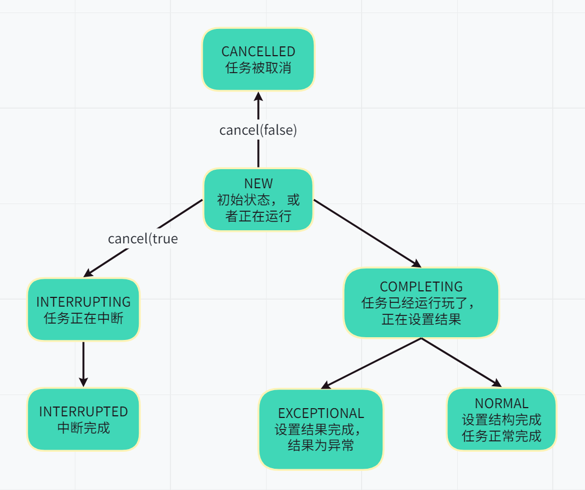
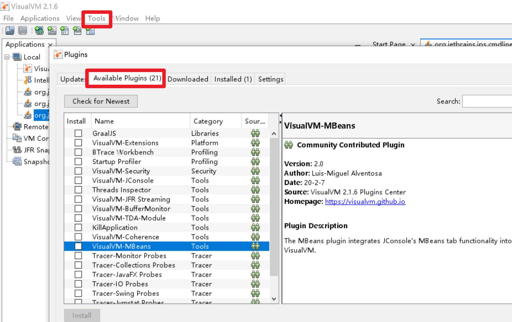
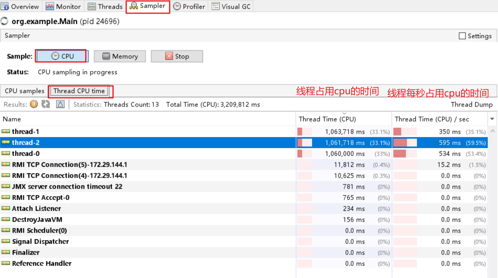
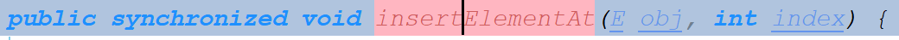

## 线程池ThreadPoolExecutor

### 线程池主要工作方式

一个ExecutorService使用可能的几个池线程之一执行每个提交的任务，通常使用Executors工厂方法配置。
线程池解决两个不同的问题：由于减少了每个任务的调用开销，它们通常在执行大量异步任务时提供改进的性能，并且它们提供了一种限制和管理资源的方法，包括在执行集合时消耗的线程任务。 每个ThreadPoolExecutor还维护一些基本的统计信息，例如已完成的任务数。
为了在广泛的上下文中有用，此类提供了许多可调整的参数和可扩展性挂钩。 但是，强烈建议程序员使用更方便的Executors工厂方法Executors.newCachedThreadPool （无界线程池，具有自动线程回收）、 Executors.newFixedThreadPool （固定大小线程池）和Executors.newSingleThreadExecutor （单个后台线程），它们为最常见的使用场景。 否则，在手动配置和调整此类时使用以下指南：
核心和最大池大小
ThreadPoolExecutor将根据 corePoolSize（请参阅getCorePoolSize ）和getCorePoolSize （请参阅getMaximumPoolSize ）设置的边界自动调整池大小（请参阅getPoolSize ）。 在方法execute(Runnable)提交新任务时，如果运行的线程少于 corePoolSize，则会创建一个新线程来处理请求，即使其他工作线程处于空闲状态。 否则，如果正在运行的线程少于 maximumPoolSize，则只有在队列已满时才会创建一个新线程来处理请求。 通过将 corePoolSize 和 maximumPoolSize 设置为相同，您可以创建一个固定大小的线程池。 通过将 maximumPoolSize 设置为一个基本上无界的值，例如Integer.MAX_VALUE ，您可以允许池容纳任意数量的并发任务。 最典型的是，核心和最大池大小仅在构造时设置，但它们也可以使用setCorePoolSize和setMaximumPoolSize动态更改。
按需构建
默认情况下，即使是核心线程也只有在新任务到达时才最初创建和启动，但这可以使用方法prestartCoreThread或prestartAllCoreThreads动态覆盖。 如果您使用非空队列构造池，您可能想要预启动线程。
创建新线程
使用ThreadFactory创建新线程。 如果没有另外指定，则使用Executors.defaultThreadFactory ，它创建的线程都在同一个ThreadGroup并且具有相同的NORM_PRIORITY优先级和非守护进程状态。 通过提供不同的 ThreadFactory，您可以更改线程的名称、线程组、优先级、守护进程状态等。如果ThreadFactory在通过从newThread返回 null 的询问时未能创建线程，则执行程序将继续，但可能无法执行任何任务。 线程应该拥有“modifyThread” RuntimePermission 。 如果工作线程或其他使用池的线程不具备此权限，则服务可能会降级：配置更改可能无法及时生效，关闭池可能会一直处于可以终止但未完成的状态。
保活时间
如果池中当前有超过 corePoolSize 的线程，则多余的线程如果空闲时间超过 keepAliveTime（请参阅getKeepAliveTime(TimeUnit) ）将被终止。 这提供了一种在未积极使用池时减少资源消耗的方法。 如果池稍后变得更加活跃，则将构建新线程。 也可以使用setKeepAliveTime(long, TimeUnit)方法动态更改此参数。 使用Long.MAX_VALUE TimeUnit.NANOSECONDS值Long.MAX_VALUE有效地禁止空闲线程在关闭之前终止。 默认情况下，保持活动策略仅在有超过 corePoolSize 个线程时应用，但方法allowCoreThreadTimeOut(boolean)也可用于将此超时策略应用于核心线程，只要 keepAliveTime 值不为零.
排队
任何BlockingQueue都可用于传输和保存提交的任务。 此队列的使用与池大小交互：
如果正在运行的线程少于 corePoolSize，则 Executor 总是喜欢添加新线程而不是排队。
如果 corePoolSize 或更多线程正在运行，Executor 总是喜欢将请求排队而不是添加新线程。
如果请求无法排队，则会创建一个新线程，除非这会超过 maximumPoolSize，在这种情况下，任务将被拒绝。
排队的一般策略有以下三种：
直接交接。 工作队列的一个很好的默认选择是SynchronousQueue ，它将任务移交给线程而不用其他方式保留它们。 在这里，如果没有线程可立即运行，则将任务排队的尝试将失败，因此将构建一个新线程。 在处理可能具有内部依赖性的请求集时，此策略可避免锁定。 直接切换通常需要无限的maximumPoolSizes 以避免拒绝新提交的任务。 这反过来又承认了当命令平均到达速度超过它们可以处理的速度时无限线程增长的可能性。
无界队列。 使用无界队列（例如，没有预定义容量的LinkedBlockingQueue ）将导致新任务在所有 corePoolSize 线程都忙时在队列中等待。 因此，不会创建超过 corePoolSize 的线程。 （因此maximumPoolSize的值没有任何影响。）当每个任务完全独立于其他任务时，这可能是合适的，因此任务不会影响彼此的执行； 例如，在网页服务器中。 虽然这种排队方式在平滑请求的瞬时爆发方面很有用，但它承认当命令的平均到达速度超过它们的处理速度时，工作队列可能会无限增长。
有界队列。 有界队列（例如， ArrayBlockingQueue ）在与有限的 maximumPoolSizes 一起使用时有助于防止资源耗尽，但可能更难以调整和控制。 队列大小和最大池大小可以相互权衡：使用大队列和小池可以最大限度地减少 CPU 使用率、操作系统资源和上下文切换开销，但会导致人为地降低吞吐量。 如果任务频繁阻塞（例如，如果它们受 I/O 限制），则系统可能能够为比您允许的更多线程安排时间。 使用小队列通常需要更大的池大小，这会使 CPU 更忙，但可能会遇到不可接受的调度开销，这也会降低吞吐量。
被拒绝的任务
当 Executor 已经关闭，并且当 Executor 对最大线程和工作队列容量使用有限边界并且饱和时，在方法execute(Runnable)提交的新任务将被拒绝。 在任一情况下， execute方法调用RejectedExecutionHandler.rejectedExecution(Runnable, ThreadPoolExecutor)其的方法RejectedExecutionHandler 。 提供了四个预定义的处理程序策略：


可以定义和使用其他类型的RejectedExecutionHandler类。 这样做需要小心，特别是当策略设计为仅在特定容量或排队策略下工作时。
钩子方法
此类提供protected可beforeExecute(Thread, Runnable)和afterExecute(Runnable, Throwable)方法，这些方法在每个任务执行之前和之后调用。 这些可用于操作执行环境； 例如，重新初始化 ThreadLocals、收集统计信息或添加日志条目。 此外，可以覆盖已terminated方法以执行在 Executor 完全终止后需要完成的任何特殊处理。
如果钩子、回调或 BlockingQueue 方法抛出异常，内部工作线程可能会依次失败、突然终止并可能被替换。
队列维护
方法getQueue()允许访问工作队列以进行监视和调试。 强烈建议不要将此方法用于任何其他目的。 提供的两种方法remove(Runnable)和purge可用于在大量排队任务被取消时协助存储回收。
开垦
即不再在程序中引用，也没有剩余线程都可以被回收（垃圾回收）没有被明确地关闭池。 您可以通过设置适当的保持活动时间、使用零核心线程的下限和/或设置allowCoreThreadTimeOut(boolean)来配置池以允许所有未使用的线程最终死亡。
扩展示例。 此类的大多数扩展都会覆盖一个或多个受保护的挂钩方法。 例如，这是一个添加简单暂停/恢复功能的子类：

~~~java
 class PausableThreadPoolExecutor extends ThreadPoolExecutor {
   private boolean isPaused;
   private ReentrantLock pauseLock = new ReentrantLock();
   private Condition unpaused = pauseLock.newCondition();

   public PausableThreadPoolExecutor(...) { super(...); }

   protected void beforeExecute(Thread t, Runnable r) {
     super.beforeExecute(t, r);
     pauseLock.lock();
     try {
       while (isPaused) unpaused.await();
     } catch (InterruptedException ie) {
       t.interrupt();
     } finally {
       pauseLock.unlock();
     }
   }

   public void pause() {
     pauseLock.lock();
     try {
       isPaused = true;
     } finally {
       pauseLock.unlock();
     }
   }

   public void resume() {
     pauseLock.lock();
     try {
       isPaused = false;
       unpaused.signalAll();
     } finally {
       pauseLock.unlock();
     }
   }
 }
~~~


### 关于AQS的说明

#### 框架基础

AQS，线程同步器其实就是一个获取和释放共享资源，以及获取共享资源失败如何处理的框架，在其内部维护了两个重要的东西：

- voliatle int state(代表共享资源)，获取共享资源和释放共享资源的过程大致上就是对共享资源的修改。

  

- 一个FIFO的双向链表(代表抢锁失败的线程的一个队列)， **其基础逻辑就是把获取共享资源失败的线程加入到队列结尾，并将线程park住。队列头部是一个代表占用线程的一个虚拟节点，该节点释放共享资源的时候会唤醒他的下一个节点(如果需要唤醒的话)。**

AQS定义了两种资源共享方式：**Exclusive(独占，即某一时刻只能有一个线程能够成功获得锁，比如互斥锁ReentrantLock)， Share(共享，即某一时刻可以有多个线程获得锁， 比如Semaphore、CountDownLatch )。**

不同的线程同步器竞争共享资源的方式也不同，使用AQS的时候只要实现对共享资源state的获取与释放即可，至于具体的获取资源失败的线程的队列的维护(获取资源失败入队列，释放资源出队列并唤醒下一节点， 中断或者获取资源超时出队列)交给AQS维护就好了。**所以在本章中只讲获取成功和失败，释放成功和失败共享资源应该如何处理线程，而什么时候应该成功和失败应该是AQS子类应该处理的。**

自定义的同步器实现主要可以实现一下集中方法：

~~~java
// 尝试以独占的方式获取资源，成功返回true，否则false
protected boolean tryAcquire(int);
// 尝试释放资源，成功释放返回true， 否则false
protected boolean tryRelease(int arg);

// 尝试以共享共享的方式获取资源， 获取失败返回负值。
// 如果在共享模式下获取成功但后续节点在共享模式获取不能成功，则为零。
// 如果在共享模式下获取成功并且后续节点在共享模式获取也可能成功，则为正值。
protected int tryAcquireShared(int arg);
protected boolean tryReleaseShared(int arg);

// 该线程是否正在独占资源，只有用到condition才需要实现他
protected boolean isHeldExclusively();
~~~

一般来说，自定义同步器要么是独占方法，要么是共享方式，**他们也只需实现tryAcquire-tryRelease、tryAcquireShared-tryReleaseShared中的一种即可**。但AQS也支持自定义同步器同时实现独占和共享两种方式，如ReentrantReadWriteLock。


#### 节点状态解析

对于每一个等待获取资源的线程， AQS都会将其包装成一个Node节点并把它加入到队列中。Node节点中包含了等待线程的引用，该线程获取锁的模式(独占/共享)，当前节点的前后节点的引用，以及最重要的节点的等待状态，共有5种取值CANCELLED、SIGNAL、CONDITION、PROPAGATE、0。

- **CANCELLED**(1)：表示当前结点已取消调度。当timeout或被中断（响应中断的情况下），会触发变更为此状态，进入该状态后的结点将不会再变化。
- **SIGNAL**(-1)：表示后续结点正在或者马上被park住，当前节点释放资源后需要unpark后续节点
- **CONDITION**(-2)：表示结点等待在Condition上，当其他线程调用了Condition的signal()方法后，CONDITION状态的结点将**从等待队列转移到同步队列中**，等待获取同步锁。
- **PROPAGATE**(-3)：该状态是只在共享模式下使用的一个中间状态，表示下一个acquireShared操作需要无条件的唤醒下一个节点，该状态后续为专门讲到。
- **0**：新结点入队时的默认状态。

注意，**负值表示结点处于有效等待状态，而正值表示结点已被取消。所以源码中很多地方用>0、<0来判断结点的状态是否正常**。


#### 独占模式解析

> 主要步骤

在AQS中以独占模式获取和释放共享资源的方法有以下几种：

1. acquire：以独占方式获取共享资源，忽略中断，直到获取到共享资源才返回。
2. acquireInterruptibly：以独占方式获取共享资源，获取到共享资源或者中断才返回。
3. tryAcquireNanos：以独占方式获取共享资源，获取到共享资源或者中断或者超时返回。
4. release：以独占方式释放共享资源。

前三个获取锁的步骤都是大同小异，只在个别地方有差异。

独占模式下获取共享资源的步骤大体如下：

1. 调用tryAcquire方法尝试获取资源，获取成功直接返回
2. 获取失败调用addWaiter将当前线程包装成Node节点并加入到双向队列的尾部。
3. 调用acquireQueued方法使线程堵塞，该堵塞线程将会被释放共享资源的线程唤醒然后再次竞争共享资源，失败再次堵塞，一直循环，直到获取到共享资源然后返回。
4. 如果线程在堵塞过程中被中断， 将会清除中断位并标记起来。如果获取资源成功后，有标记的话就自己调用interrupt方法中断自己补一个中断位。


> acquire(int)

下面是源码解析，主要以acquire为例，该方法时独占模式下线程获取共享资源的顶层入口

~~~java
    public final void acquire(int arg) {
        if (!tryAcquire(arg) &&
            acquireQueued(addWaiter(Node.EXCLUSIVE), arg))
            selfInterrupt();
    }
~~~

函数流程如下：

1. tryAcquire尝试获取共享资源，如果成功直接返回，这里体现了非公平锁，每个线程获取锁时会尝试直接抢占加塞一次，而CLH队列中可能还有别的线程在等待。
2. 获取共享资源失败就通过addWaiter将当前线程包装成Node节点并加入到双向队列的尾部，并标记为独占模式，返回新添加的Node
3. 调用acquireQueued，在该方法中堵塞，被唤醒，一直循环直到获取到共享资源，如果过程中被中断过返回true，否则false
4. 如果acquireQueued返回true，说明被中断过，整个if中的条件成立，调用selfInterrupt自己中断自己补一个中断位

**需要注意的是tryAcquire是需要子类去实现何时可以获取共享资源成功的，AQS并不负责这个。所以在这里并不讨论，只说明获取失败后如何处理。**

### 线程池源码

问题： 

状态判断


为何重新判断


释放共享资源的步骤如下：

1. 调用tryRelease尝试释放共享资源，如果释放失败直接返回。
2. 如果释放共享资源成功，参看队列头结点的waitStatus看是否需要唤醒后继节点的线程。

### 可监控的线程池

https://tech.meituan.com/2020/04/02/java-pooling-pratice-in-meituan.html

https://juejin.cn/post/7074579161201229838


### 线程池

> 基本概述

```
/**
 * 当通过execute提交方法的时候, 如果线程数量小于corePoolSize, 那么会创建新线程来处理该请求, 即使其他线程空闲
 * 否则会将他们放在队列中, 如果队列也已经满了, 那么会创建新线程来处理新请求
 * 如果线程数等于maximumPoolSize, 那么会执行拒绝策略
 *
 * 当pool中线程超过corePoolSize的线程, 那么多余的线程如果空闲时间超过keepAliveTime, 将会被终止
 *
 * 队列一般有三种:
 *   1. SynchronousQueue,
 *   2. ArrayBlockingQueue, 有界队列
 *   3. LinkedBlockingQueue(没有预定义容量的情况下), 无界队列
 *
 * 拒绝策略有四种:
 *   1. AbortPolicy, 抛出RejectedExecutionException
 *   2. CallerRunsPolicy, 在caller线程中执行任务
 *   3. Discard, 直接丢弃
 *   4. DiscardOldestPolicy, 丢弃队列头部的任务
 */
```

> 线程池属性标识以及状态流转

```java
    // int的原子类
    // 高3位: 线程池状态
    // 低29位: 线程池中的线程个数
    private final AtomicInteger ctl = new AtomicInteger(ctlOf(RUNNING, 0));
    private static final int COUNT_BITS = Integer.SIZE - 3;
    private static final int COUNT_MASK = (1 << COUNT_BITS) - 1;
    // 线程池的状态
    private static final int RUNNING    = -1 << COUNT_BITS;
    private static final int SHUTDOWN   =  0 << COUNT_BITS;
    private static final int STOP       =  1 << COUNT_BITS;
    private static final int TIDYING    =  2 << COUNT_BITS;
    private static final int TERMINATED =  3 << COUNT_BITS;
    // Packing and unpacking ctl
    private static int runStateOf(int c)     { return c & ~COUNT_MASK; }
    private static int workerCountOf(int c)  { return c & COUNT_MASK; }
    private static int ctlOf(int rs, int wc) { return rs | wc; }
```


> command的包装

我们通过submit创建command给线程池后, 他会包装为一个RunnableFuture对象, 

~~~java
public <T> Future<T> submit(Callable<T> task) {
        if (task == null) throw new NullPointerException();
        RunnableFuture<T> ftask = newTaskFor(task);
        execute(ftask);
        return ftask;
}
~~~

RunnableFuture有如下几种状态

~~~java
    private volatile int state;
    private static final int NEW          = 0; // 初始状态, 任务可能没有执行, 也可能正在执行
    private static final int COMPLETING   = 1; // 任务已经完成了, 正在设置outcome
    private static final int NORMAL       = 2; // 设置outcome完成, 任务正常完成
    private static final int EXCEPTIONAL  = 3; // 设置outcome完成, 任务出现异常, outcome就是异常
    private static final int CANCELLED    = 4; // 任务已经被取消了, 如果任务还没有开始执行, 那么不会执行了, 如果已经执行了, 那就让他执行
    private static final int INTERRUPTING = 5; // 任务已经被取消了, 如果任务还没执行, 那么就不执行了, 如果已经仔细了, 那么中断他
    private static final int INTERRUPTED  = 6; // 任务中断完毕
~~~




下面我们来看看RunnableFuture的run方法

~~~java
    public FutureTask(Callable<V> callable) {
        if (callable == null)
            throw new NullPointerException();
        this.callable = callable;
        this.state = NEW;       // ensure visibility of callable
    }
	public void run() {
        // 如果当前state不为new,
        // 或者当前state为new, 但是cas 设置runner为当前线程失败
        // 都说明了当前task已经有别的线程执行了
        if (state != NEW ||
                !UNSAFE.compareAndSwapObject(this, runnerOffset,
                        null, Thread.currentThread()))
            return;
        try {
            Callable<V> c = callable;
            if (c != null && state == NEW) {
                V result;
                boolean ran;
                try {
                    result = c.call(); // 执行call方法, 获得返回值
                    ran = true; // 标记为正常结束
                } catch (Throwable ex) {
                    result = null;
                    ran = false; // 标记为异常结束
                    // 设置ex为outcome
                    // 该方法会将状态从new -> completing, 然后赋值outcome, 然后将状态改为exceptional
                    setException(ex);
                }
                if (ran)
                    // 正常结束
                    // 将状态从new -> completing, 然后赋值outcome, 然后将状态改为normal
                    set(result);
            }
        } finally {
            // runner must be non-null until state is settled to
            // prevent concurrent calls to run()
            runner = null; // 重置runner
            // state must be re-read after nulling runner to prevent
            // leaked interrupts
            int s = state;
            // 判断当前任务的状态是否被中断, 并做响应的处理
            if (s >= INTERRUPTING)
                handlePossibleCancellationInterrupt(s);
        }
        
        
    // 取消掉任务, mayInterruptIfRunning表示在取消的时候, 是否要中断任务
    // 如果为false, 那么如果任务还没有开始执行, 就不会执行了, 如果正在执行, 那么就让他执行完毕但是不赋值outcome
    // 如果为true, 那么如果任务还没有开始执行, 就不会执行了, 如果正在执行, 那么就中断他同时不赋值outcome
    // 如果当前任务正在堵塞, 那么callable.run方法会抛出InterruptedException
    public boolean cancel(boolean mayInterruptIfRunning) {
        // 如果state不是new, 或者cas将状态改为INTERRUPTING, CANCELLED失败, 
        // 说明任务已经执行完了, 无法取消
        // 如果mayInterruptIfRunning为false, 那么仅仅只是切换了状态, 正在执行的任务会正常执行完毕, 只是不会赋值outcome
        if (!(state == NEW &&
                UNSAFE.compareAndSwapInt(this, stateOffset, NEW,
                        mayInterruptIfRunning ? INTERRUPTING : CANCELLED)))
            // 返回false, 表示无法取消
            return false;
        try {    // in case call to interrupt throws exception
            // 如果mayInterruptIfRunning为true, 中断线程
            if (mayInterruptIfRunning) {
                try {
                    Thread t = runner;
                    if (t != null)
                        t.interrupt();
                } finally { // final state
                    UNSAFE.putOrderedInt(this, stateOffset, INTERRUPTED);
                }
            }
        } finally {
            finishCompletion();
        }
        // 取消任务成功
        return true;
    }
~~~

> 线程池的执行

线程池将Runnable的任务包装成一个FutureTask之后, 开始执行任务

~~~java
public void execute(Runnable command) {
        if (command == null)
            throw new NullPointerException();
        int c = ctl.get();
        // 如果worker数量 < corePoolSize
        if (workerCountOf(c) < corePoolSize) {
            // 新建核心线程并添加worker
            // 并发操作可能会导致添加核心worker失败
            if (addWorker(command, true))
                return;
            c = ctl.get(); // 添加核心线程失败, 说明有并发, 需要重新获取ctl
        }
        // 如果线程池是running, 并且如果worker数量 >= corePoolSize, 或者添加worker失败
        // 那么将command添加到queue中
        if (isRunning(c) && workQueue.offer(command)) {
            int recheck = ctl.get();
            // 重新检查是否为running, 如果不是, 那么remove并且reject掉command
            if (! isRunning(recheck) && remove(command))
                reject(command);
            // 如果还是running, 那么还要检测一下worker是否为0
            // 如果allowCoreThreadPool=true, 那么核心线程也会消亡
            // 就怕进入到这里的时候, 核心线程集体消亡
            else if (workerCountOf(recheck) == 0)
                addWorker(null, false);
        }
        // 如果添加到queue中失败, 那么尝试创建非核心线程, 并执行worker
        else if (!addWorker(command, false))
            // 如果创建非核心的worker也失败, 那么直接拒绝command
            reject(command);
    }
~~~

~~~java
// 如果firstTask不为null, 那么是正常的添加worker
    // 如果firstTask为null, 那么就是添加一个worker来处理queue中的任务, 防止queue中还有任务, 但是worker已经全部gg了
    private boolean addWorker(Runnable firstTask, boolean core) {
        retry:
        for (int c = ctl.get();;) {
            /*
                条件可以改写为
                    (runStateAtLeast(c, SHUTDOWN) && runStateAtLeast(c, STOP)) ||
                    (runStateAtLeast(c, SHUTDOWN) && firstTask != null)  ||
                    (runStateAtLeast(c, SHUTDOWN) && workQueue.isEmpty())
                然后改写为
                    (runStateAtLeast(c, SHUTDOWN) && runStateAtLeast(c, STOP)) ||
                    (runStateAtLeast(c, SHUTDOWN) && (firstTask != null || workQueue.isEmpty())

                (runStateAtLeast(c, SHUTDOWN) && runStateAtLeast(c, STOP)) 表示
                    如果状态至少是stop, 那么状态可能是stop tiding terminated, 这些状态不接受新任务了

                (runStateAtLeast(c, SHUTDOWN) && (firstTask != null || workQueue.isEmpty())
                    如果上面情况不成立, 那么当前状态可能是running和stop, 如果runStateAtLeast(c, SHUTDOWN) 成立, 那么状态只能是shutdown
                    也就是说如果状态是shutdown, 并且firstTask不为null或者workQueue不是空的, 那么不能添加worker
                    也就是说如果状态是shutdown, 那么只有firstTask为null, 并且queue不为空的情况下才能添加worker, 防止queue中的任务没有worker来处理

             */
            // 如果状态至少是stop, 那么不能添加worker, 或者如果状态是shutdown, 那么只有firstTask为null, 并且queue不为空的情况下才能添加worker
            // !!!!!!!!!!!!!!!!!! 也就是说要么状态是running, 要么状态是shutdown并且firstTask为null, 并且queue不为空, 才有可能跳过这个条件 !!!!!!!
            if (runStateAtLeast(c, SHUTDOWN)
                    && (runStateAtLeast(c, STOP)
                    || firstTask != null
                    || workQueue.isEmpty()))
                return false;
            for (;;) {
                // 这个条件在jdk1.8是  workerCountOf(c) >= CAPACITY || workerCountOf(c) >= (core ? corePoolSize : maximumPoolSize)
                // 即如果线程数已经到达容量上线了( 2^29 -1 ), 那么创建失败
                // 或者如果创建的是核心线程数, 并且worker已经大于corePoolSize了, 也创建失败
                // 或者创建的是非核心线程数, 并且worker已经大于maximumPoolSize了, 也创建失败
                if (workerCountOf(c)
                        >= ((core ? corePoolSize : maximumPoolSize) & COUNT_MASK))
                    return false;
                // 将worker数量+1, 如果成功, 那么跳出自旋
                if (compareAndIncrementWorkerCount(c))
                    break retry;

                c = ctl.get();  // cas失败, 重新加载ctl

                // 上面已经说了, 执行到这里, 要么状态是running, 要么状态是shutdown并且firstTask为null, 并且queue不为空
                // 所以如果状态还是shutdown, 那么就要在外层for循环中自旋重新判断firstTask和queue是否满足条件
                // 如果状态是running, 那么只需要在内层循环中cas将worker数量+1就好了
                if (runStateAtLeast(c, SHUTDOWN))
                    // 进行外层cas
                    continue retry;
                // 进行内层cas
            }
        }

        // 执行到这里, 要么state是running, 要么state是shutdown并且firstTask为null, 并且queue不为空
        // 并且已经将worker数量加1了
        // 接下来就要创建worker了
        boolean workerStarted = false;
        boolean workerAdded = false;
        Worker w = null;
        try {
            w = new Worker(firstTask); // 创建worker
            final Thread t = w.thread;
            if (t != null) {
                final ReentrantLock mainLock = this.mainLock;
                mainLock.lock(); // 加锁, 防止创建worker的时候别的线程调用shutdown等方法干掉线程池, 干掉线程池需要先获取锁
                try {
                    // Recheck while holding lock.
                    // Back out on ThreadFactory failure or if
                    // shut down before lock acquired.
                    int c = ctl.get();

                    // 如果状态是running, 或者状态是shutdown并且firstTask为null
                    if (isRunning(c) ||
                            (runStateLessThan(c, STOP) && firstTask == null)) {
                        if (t.getState() != Thread.State.NEW)
                            throw new IllegalThreadStateException();
                        // 添加线程到集合中
                        workers.add(w);
                        workerAdded = true;
                        int s = workers.size();
                        if (s > largestPoolSize)
                            largestPoolSize = s; //记录线程池达到的最大线程数量
                    }
                } finally {
                    mainLock.unlock();
                }
                if (workerAdded) {
                    t.start(); // 启动线程, 有可能这个线程的start方法已经被别人调用过了, 会报错
                    workerStarted = true;
                }
            }
        } finally {
            if (! workerStarted)
                // 如果线程的start方法被别人调用过了,
                // 那么将worker数量-1, 从worker集合中移除worker, 尝试关闭线程池
                addWorkerFailed(w);
        }
        return workerStarted;
    }
~~~

我们来看看worker线程到底是怎么执行的

~~~java
public void run() {
    runWorker(this);
}
final void runWorker(Worker w) {
        Thread wt = Thread.currentThread();
        Runnable task = w.firstTask; // 获取worker的任务
        w.firstTask = null; // 清除worker的任务
        w.unlock(); // allow interrupts

        // 线程有两种情况会退出运行: 1. 拿不到任务, 自动消亡  2. 执行task过程中抛出异常
        // 这个标识线程是否是因为用户的Exception而退出运行的
        boolean completedAbruptly = true;
        try {
            // 如果task不为空
            // 如果task为空, 就从queue中获取task
            while (task != null || (task = getTask()) != null) {
                w.lock();
                // If pool is stopping, ensure thread is interrupted;
                // if not, ensure thread is not interrupted.  This
                // requires a recheck in second case to deal with
                // shutdownNow race while clearing interrupt
                // 如果线程池状态至少是stop, 即stop tiding terminated, 那么要对线程进行中断
                if ((runStateAtLeast(ctl.get(), STOP) ||
                        (Thread.interrupted() &&
                                runStateAtLeast(ctl.get(), STOP))) &&
                        !wt.isInterrupted())
                    wt.interrupt();
                try {
                    beforeExecute(wt, task); // 执行钩子
                    try {
                        task.run();
                        afterExecute(task, null); // 执行钩子
                    } catch (Throwable ex) {
                        afterExecute(task, ex); // 执行钩子
                        throw ex;
                    }
                } finally {
                    task = null;
                    w.completedTasks++;
                    w.unlock();
                }
            }
            completedAbruptly = false; // 非用户异常而退出运行
        } finally {
            // 没有拉到任务, 要线程消亡,
            // 可能是因为状态是stop, 也可能是状态是shutdown并且queue为空了
            // 也有可能就是简单的没拿到任务超时了
            // 也有可能是用户的任务报错了
            processWorkerExit(w, completedAbruptly);
        }
    }
~~~

上面可以看到, 如果一个线程拉不到任务, 就会消亡掉, 那么下面看看在什么情况下会拉取不到任务

~~~java
private Runnable getTask() {
        boolean timedOut = false; // Did the last poll() time out?

        for (;;) {
            int c = ctl.get();

            // 判断线程池状态
            // 如果状态至少是stop, 那么不接受任务了, 直接返回null, 让线程消亡
            // 或者状态是shutdown并且queue已经空了, 表示处理完了任务了, 也要让线程消亡掉
            if (runStateAtLeast(c, SHUTDOWN)
                    && (runStateAtLeast(c, STOP) || workQueue.isEmpty())) {
                decrementWorkerCount();
                return null;
            }

            int wc = workerCountOf(c);

            // Are workers subject to culling?
            // 判断当前线程在pool任务的时候是否要设置超时时间
            // 如果设置了allowCoreThreadTimeOut, 或者worker数量大于corePoolSize
            // 这个时候要是拉取不到任务, 线程就要消亡
            boolean timed = allowCoreThreadTimeOut || wc > corePoolSize;

            // 没看懂这个条件, 但是可以肯定, 超时的线程会返回null消亡
            if ((wc > maximumPoolSize || (timed && timedOut))
                    && (wc > 1 || workQueue.isEmpty())) {
                if (compareAndDecrementWorkerCount(c))
                    return null;
                continue; // 自旋
            }

            try {
                Runnable r = timed ?
                        workQueue.poll(keepAliveTime, TimeUnit.NANOSECONDS) :
                        workQueue.take();
                if (r != null)
                    return r;
                timedOut = true; // 拉到了任务就直接返回了, 这里拉不到任务, 所以设置timeout, 然后自旋重新
            } catch (InterruptedException retry) {
                timedOut = false;
            }
        }
    }
~~~

同时下面看看线程是如何消亡的

~~~java
private void processWorkerExit(Worker w, boolean completedAbruptly) {
        // 如果是因为用户任务报错, 导致线程消亡, 那么要线程数-1
        // 如果是get不到任务而导致线程消亡, completedAbruptly=false,
        // 并且worker数在getTask()方法中就已经-1了, 这里不必再减一了
        if (completedAbruptly)
            decrementWorkerCount();

        final ReentrantLock mainLock = this.mainLock;
        mainLock.lock();
        try {
            completedTaskCount += w.completedTasks;
            workers.remove(w); // 移除线程
        } finally {
            mainLock.unlock();
        }

        tryTerminate();

        int c = ctl.get();
        // 如果是stop tiding terminated, 那么只需要移除线程就好了
        // 如果是running, shutdown, 那么要执行一些额外的判断
        if (runStateLessThan(c, STOP)) {
            // 如果线程不是由于用户的exception消亡的
            if (!completedAbruptly) {
                // 判断当前线程池中需要保留的最少线程数, 如果运行core thread timeout, 那么就是0
                int min = allowCoreThreadTimeOut ? 0 : corePoolSize;
                // 如果最小线程为0, 并且队列不为空, 那么min=1, 至少需要一个线程来处理剩余的任务
                if (min == 0 && ! workQueue.isEmpty())
                    min = 1;
                // 判断线程数是否大于min, 如果大于, 那么return, 让线程挂掉
                if (workerCountOf(c) >= min)
                    return; // replacement not needed
            }
            // 如果是用户异常导致的, 或者当前worker数量已经小于min
            // 那么要重新添加一个worker来补偿
            addWorker(null, false);
        }
    }
~~~


# 分布式

## 分布式唯一id

https://www.bilibili.com/video/BV1Mu41177ra/?vd_source=f79519d2285c777c4e2b2513f5ef101a

使用分布式唯一id有三种办法

1. 数据库自增

   - 在单机的情况下运转很好, 但是如果mysql是分布式架构,  那么使用mysql自增组件的范围分区的话, 会造成尾部热点(写完一个库在写另外一个库)

     其实自增组件的插入效率非常高, 所以变通的方式是不使用自增主键做数据分片, 而使用业务的用户id做数据分片, 这样每个用户的数据都集中在一个库, 更内聚

   - 两张数据表合并的时候可能会产生主键冲突

2. UUID

   格式为: xxxxxxxx—xxxx—xxxx—xxxx—xxxxxxxxxxxx

   32个十六进制数, 128bit

   uuid有很多版本, 不同版本的生成规则不一样, 但是大体上是使用时间, mac地址, 随机数等生成

   - 全局唯一性最好

   - 格式太长了, 浪费空间

   - 不是有序的, 在插入到mysql中, 会造成主键索引重排和磁盘碎片

     (如下图, 一个页16k, 每条数据5k, 那么一个页最多3条数据, 如果要把id=5的数据写入, 需要将id=5的数据从page10移动到page28中, 然后再将id=4的数据写入到page10中, 然后更新page15指向page28的指针)

     

   

3. 雪花算法

   占用62bit

   

   - 第一位固定为0, 表示正数
   - 10位机器id, , 那么最多可以使用1024个服务
   - 41位时间戳, 毫秒, 能使用69年, 到2039年就失效了, 建议时间戳减去上线时的时间戳, 这样就可以使用69年了
   - 12位序列化, 表示1毫秒可以取4096个号码
   - 严重依赖机器的时钟, 如果发生时钟回拨, 可能会生成重复id

     - 可以在取号的时候, 比较上一次的号码, 如果变小了说明时钟回拨了, 直接抛出异常
     - sleep一定时间, 重新取号
     - 多时钟, 即依赖多个时钟


我们在选择算法的时候, 必须满足一下几个条件

1. id不是连续的, 防止爬虫
2. id必须是单调递增的, 防止mysql页分裂
3. id必须是信息安全的, 即无法预测下一个id
4. id必须全局唯一

综上选择雪花算法是最好的,  当然如果是单机的情况下, 使用数据库自增更简单(如果id要展示在前端的话, 就不要使用了, 会有安全问题)

一般情况下不需要考虑时钟回拨, 如果出现了回拨, 直接抛异常发邮件提醒, 停机处理


## 接口幂等

### 什么时候需要幂等

1. 前端重复提交

   用户在新增页面快速点击多次, 造成很多重复的订单

2. 消息重复消费

   mq将消息给消费者消费, 但是消费完返回ack给mq时网络中断, 这时候mq会重复发给消费端进行消费

3. 页面回退再次提交

   用户下单完成后, 点击返回按钮返回上一个页面, 重新点击下单按钮, 如果没有幂等, 也会造成重复下单的问题

4. 微服务相互调用

   分布式系统中, 通过prc或者feign进行调用, 如果网络波动, feign会触发重试机制, 所以我们要保证接口幂等

### 如何实现幂等

**实现幂等, 关键要识别两个一模一样的提交, 他到底是重复提交, 还是不同的提交**, 比如下单中, 用户就是买了一模一样的东西, 所有参数都是一样的, 要识别他到底是下单按钮快速点击, 还是就是买了一样的东西

1. 前端提交按钮disable

2. 通过数据库唯一索引保证, 

   - 可以在要提交的表中添加一个唯一字段, 前端发送请求前, 先请求一个流水号, 这个可以是雪花算法生成, 然后将这个流水号一起发送到后端, 并插入到字段中, 如果已经处理过了会插入失败
   - 专门弄一个防重表, 将唯一流水号插入到防重表中, 每次处理之前查一下这个流水号有没有

3. 通过redis token

   还是前端先请求一个唯一流水号, 后端将他放到redis中, 前端将流水号一起带过来, 后端接收到先查询redis中有没有流水号, 如果有删掉, 然后处理业务, 如果没有, 说明已经处理过了

   这种方案有一定危险性

   - 先删除token还是先执行业务

     - 先执行业务后删除token, 那么分布式环境下还是有可能重复
     - 先删除token后执行业务, 如果业务调用失败, 前端重新发送请求还是会失败
     - **综上要先删除token, 后执行业务, 如果业务调用失败, 要重新请求token**

   - token的获取, 比较, 删除不是原子性的, 需要使用lua脚本

     ~~~LUA
     if redis.call('get', KEYS[1]) == ARGV[1]
     	then return redis.call('del', KEYS[1])
     else 
         return 0
     end
     ~~~

4. 还有一种简单的方式就是:

   通过(userId/ip) + 类名 + 方法名 + 参数进行md5作为唯一key, 通过redis的setnx来设置这个value, 然后通过expired设置过期时间,  那么如果相同的请求发送到服务器,  那么setnx就会失败

   注意这种方式, 参数中不能和时间有关的参数, 否则拦截不住

5. 


# JVM

#### jvm内存结构

1. 程序计数器: 线程私有, 当前线程执行的字节码的行号指示器

2. java虚拟机栈: 线程私有, 执行方法的时候创建的栈帧

3. 本地方法栈: 线程私有, 执行native方法时创建的栈帧

4. java堆: 存放实例对象

5. 方法区: 

   方法区中保存的是

   1. metaspace: 存储已经加载的类信息, 常量, 静态变量
   2. code cache: jit将字节码转换为汇编, 保存在这里

   需要注意的是: 方法区只是jvm规范中提出来的名词, 具体的实现

   - 在jdk7和以前, 永久代是作为方法区的实现,  **永久代是堆内存的一部分**

     因为永久代是在堆内存上, 所以其大小受堆内存大小限制, 如果永久代中有大量的数据, 很容易oom

   - 在jdk8的时候, 删除了永久代, 使用元空间作为方法区的实现, 元空间使用的是native memory

     因为用的是native memory, 所以只受本机内存限制, 可以动态调整大小

6. 直接内存: 人如其名


#### 字符串常量池的位置

如果你通过new String()来创建字符串, 那么他和普通对象一样在堆内存中

如果你通过字符串字面量来创建字符串, 那么会在常量池中创建字符串


常量池的位置经历过三个阶段

1. 在jdk7以前, 常量池位于永久代, 很难被gc

   

2. 在jdk7的时候, 常量池移到了堆内存中, 可以被gc

   

   

3. 在jdk8的时候, 永久代被移除, 使用元空间替代

   

   


#### 内存参数

- -Xms20m, 设置堆最小20m

- -Xmx20m, 设置堆最大20m

- -XX:+PrintGCDetails  在gc的时候打印日志

- -Xmn10m,  新生代10m, 剩余的为老年代

- -XX:NewRatio=2, 新生代和老年代比例为1:2

- -XX:SurvivorRatio=8, 设置新生代中eden和Survivor的比例

- -XX:+HeapDumpOnOutOfMemoryError

- jps 查看java的进程号

  

- jmap -dump:file=a 26050,    dump文件, a表示文件名称, 26050表示要dump的java进程


**jvm选项的规程**

- 如果不是X开始的, 那么就是标准选项, 任何版本的jvm都可以使用

  (java -version)

- 如果是X开头的, 那么是部分版本才有的

  (java -Xms 10m)

- 如果是XX开头的, 那么是不稳定的参数, 随时有可能被移除

  (java -XX:+PrintGCDetails,  +表示开启, -表示关闭)  


#### jvm和gc配置的一些建议

https://www.bilibili.com/video/BV1MU4y1N79m/?spm_id_from=333.999.0.0&vd_source=f79519d2285c777c4e2b2513f5ef101a

对jvm的配置, 都是在**代码没问题的前提**下进行的, 如果代码有问题, 比如资源没有关闭, 那么任何配置都是白费的

同时不谈应用场景的调优都是不切实际的, 不同的业务场景做出的选择也是不一样的, 

**为了能够调优, 就必须要收集jvm的各种参数, 所以要在应用程序中增加监控, 进行各种指标的埋点, 对性能数据进行收集, 在这些数据的基础之上, 进行调优**


1. **jdk1.8优先使用G1收集器**(jdk1.9默认使用G1收集器)

   因为G1收集器足够的简单, 够智能, 否则也不会在jdk1.9中被作为默认的收集器

2. G1一般不设置新生代大小, G1的新生代是动态调整的

3. 默认情况下, G1 stw的最大时间上限是200ms, 可以适当调大这个时间, 增加每次GC能够收集的垃圾的数据, 减少stw的次数, 推荐200~500ms的区间

   缺点就是每次stw的时间会增加

4. **-Xms和-Xmx设置相同**,  这样在程序启动的时候就会分配足够的内存, 可以减少在程序运行时动态内存调整所带来的内存数据交换的工作量

5. 评估Xmx的方法:  

   - 在上生产之前, 先预估一下业务量, 然后通过这个业务量压测一下需要多少内存

   - 在上生产之前, 可以将内存设置的比预估的大一点, 然后开启GC的监控日志

     ~~~bash
     # 打印gc日志到/logs/gc.log下, 同时打印gc的时间, 并且打印GC时各种详细数据, 如gc前堆内存大小等等
     -Xloggc:/logs/gc.log -XX:+PrintGCTimeStamps -XX:+PrintGCDetails
     ~~~

   - 根据GC日志, 查看在GC的时候, 堆内存的大小, 在这个峰值基础性 * 2 ~3倍即可

6. 调整java虚拟机栈: -Xss:128k/256k

   java虚拟机栈是每一个线程都有的, 对于方法调用中的引用类型的对象, 都是放在堆中的, 只有指向对象的指针, 和基本的数据类型(int float)是分配在虚拟机栈上面

   默认每个线程的虚拟机栈是1m, 如果有1000个线程就会有1G的内存占用, 而绝大多数业务所使用的虚拟机栈都不会超过128k, 如果超过了256k, 就应该考虑是不是代码写的有问题了

~~~bash
# -XX:+UseG1GC 使用G1
# -Xms2G -Xmx2G最大内存, 最小内存设置一样
# -Xss256k 设置每个线程使用的虚拟机栈大小
# -XX:MaxGCPauseMillis=300 设置G1 stw的时间上限

# 打印gc日志到/logs/gc.log下, 同时打印gc的时间, 并且打印GC时各种详细数据, 如gc前堆内存大小等等
java -jar -XX:+UseG1GC -Xms2G -Xmx2G -Xss256k -XX:MaxGCPauseMillis=300 -Xloggc:/logs/gc.log 
-Xloggc:/logs/gc.log -XX:+PrintGCTimeStamps -XX:+PrintGCDetails
~~~


#### 引用的类别

1. 强引用: 只要引用还在对象就不会被回收

   ~~~java
   List list = new ArrayList();
   ~~~

2. 软引用: 在内存溢出之前, 会对这些对象进行gc, 如果还是不够就报错

   ~~~java
       @Test
       public void test() {
           String hello = new String("hello");
           SoftReference<String> softReference = new SoftReference<>(hello);
           hello = null;
   
           String world = new String("world");
           WeakReference<String> weakReference = new WeakReference<>(world);
           world = null;
           
           System.gc();
           System.out.println(softReference.get()); // hello
           System.out.println(weakReference.get()); // null
       }
   ~~~

   

3. 弱引用:  只要执行gc, 不管内存够不够都回收他们

4. 虚引用: 不影响生存时间, 只是在gc的时候会收到一个系统通知

#### 判断对象是否需要回收的算法

1. 引用计数法

   给对象添加一个引用计数器, 当有地方引用他时就加1, 当引用失效时就减一

   很难解决循环引用的问题

2. 可达性算法

   从GC Roots(虚拟机栈中引用的变量, 本地方法栈中引用的变量, 方法区的常量, 类的静态属性)开始向下搜索, 当一个对象不可达时, 说明可以gc了

   


#### 内存的分配和回收策略

> 内存空间和使用的垃圾算法

堆内存使用分代收集算法, 被分为新生代和老年代, 默认比例为1:2

在**新生代中使用复制算法**, **老年代中标记整理算法**

其中新生代又分成**eden和2个survivor区, 他们分别是survivor from区和survivor to区**

**eden和survivor的比例默认为为8:1**

> 新生代

发生在新生代的gc被称为minorGC

发生时机: 在分配对象的时候没有足够的空间

 

**新生代可用的区域是eden区和1个survivor区**, 对象会优先分配在eden中(连续内存空间的java对象, 比如bety[]会直接分配在老年区), 当eden中没有足够空间时, 会进行一次MinorGC

当垃圾回收的时候, 会使用复制算法, 将eden区和其中一个survivor区存活的对象拷贝到另外一个survivor区域中, 如果survivor不够, 那么会通过担保机制将**这些存活的对象全部**提前移入老年代

> 老年代

发生在老年代的gc称为FullGC/MajorGC

发生的时机: 

- 在发生MinorGC之前, 老年区连续空间小于新生代所有对象空间(防止新生代全部晋升到老年代, 或者空间担保失败)并且连续空间小于历次晋升对象的平均大小,  那么就会发生FullGC

> 对象如何到老年代

- 新生代的对象每熬过一个minorGC, 年龄就增加1岁, 到了15岁(-XX:MaxTenuringThreshold=15)时被移动到老年代

- 当Survivor中某一年龄的所有对象总和大于Survivor空间的一半, 会把年龄大于等于该年龄的对象直接移入老年代, 无需等待到MaxTenuringThreshold
- 空间担保机制
- 大对象直接分配在老年区

> 为什么要两个survivor区域

假如只有一个survivor区域, 开始分配对象在eden, 进行gc后复制到survivor区域, 那么下次再次gc的时候, 如果在survivor区域使用标记清除算法, 那么这个区域就会产生内存碎片, 如果使用标记整理算法的话, 效率又太慢了

所有弄两个survivor, 这样eden和1个survivor都可以使用复制算法将对象弄到另外一个survivor区域


#### visualvm的使用

https://www.cnblogs.com/krock/p/14419459.html

https://www.cnblogs.com/wade-xu/p/4369094.html

1. 在https://visualvm.github.io/download.html下载vmsual

2. 在visualvm中安装 如下几个 插件

   

   

3. 使用一下代码作为实例， 并添加vm参数

   ~~~java
   public static void main(String[] args)
           throws InterruptedException, XMLSignatureException, NoSuchAlgorithmException {
           // xms堆最小数 xmx堆最大数 xmn新生代数 SurvivorRatio eden和Survivor的比例
           // 启动时添加-Xms20m -Xmx20m -Xmn10m -XX:SurvivorRatio=8 -XX:+PrintGCDetails
   
           ArrayList<Thread> threads = new ArrayList<>();
           for (int i = 0; i < 3; i++) {
               Thread thread = new Thread(() -> {
                   while (true) {
                       byte[] bytes = new byte[1024];
                       for (int j = 0; j < 1000000; j++) {
                           String hash = "35454B055CC325EA1AF2126E27707052";
                           String password = "ILoveJava";
                           MessageDigest md = null;
                           try {
                               md = MessageDigest.getInstance("MD5");
                           } catch (NoSuchAlgorithmException e) {
                               throw new RuntimeException(e);
                           }
                           md.update(password.getBytes());
                           byte[] digest = md.digest();
                           String myHash = DatatypeConverter.printHexBinary(digest).toUpperCase();
                       }
                       try {
                           Thread.sleep(500);
                       } catch (InterruptedException e) {
                           throw new RuntimeException(e);
                       }
                   }
               });
               thread.setName("thread-" + i);
               thread.start();
               threads.add(thread);
           }
   
           System.out.println("hello");
   
       }
   ~~~

4. 在这里可以看到我们添加的vm参数

   

5. 通过visual GC查看内存情况

   https://blog.csdn.net/qq_28369007/article/details/105857310#Graphs%E7%AA%97%E5%8F%A3

   

6. 通过Threads查看线程的状态与执行时间

   https://blog.csdn.net/luo15242208310/article/details/121370797

   

   还可以查看每个线程的调用栈,  下图需要安装Threads Inspector插件

   

7. 通过Sample->cpu -> cpu samples查看每个线程的调用栈, 以及每个方法的占用时间

   通过这种方式可以查看到底是哪个方法特别占用时间

   

8. 通过sample->cpu->thread cpu time查看每个线程占用了多少cpu时间, 这样可以找到正在执行大任务的线程

   

9. 通过Sample -> memory -> heap histogram 查看堆内存中各个类实例所占用的内存大小

   

   

10. 通过Sample -> memory -> per thead allocations查看每个线程创建的对象占用堆内存的大小和百分比

    

#### 线程dump

1. 生成线程dump

   - idea

     

   - 通过visual vm

     

   - jstack查看所有线程在某一时刻的状态和调用栈

     jstack pid

     jstack pid >> a.txt 输出到文件

#### 堆内存dump

1. jmap -dump:file=filename pid 直接dump到文件中

2. jmap -heap pid 打印内存信息

3. 通过visula vm

   

#### cpu占用过高解决

https://www.bilibili.com/video/BV1rT41157QN/?spm_id_from=333.999.0.0&vd_source=f79519d2285c777c4e2b2513f5ef101a

1. 通过top命令, 查看cpu占用过高的进程, 看是否是我们自己的java进程

   

2. 如果是, 那么通过如下命令查看每个线程的cpu占用情况

   ~~~bash
   # -m表示打印所有线程, -p指定进程, -o指定打印的格式
   ps -m -p 进程号 -o THREAD,tid,time
   ~~~

   

   

3. 因为上面显示的tid是十进制的, 而jstack打印的线程号是16进制的, 所以要将10进制的线程号转换为16进制的线程号

   ~~~bash
   printf "%x\n" 线程号
   ~~~

   

4. 通过jstack来打印这个线程的调用栈

   ~~~bash
   # -A表示最多打印100行, 如果不够可以调大
   jstack 进程号 | grep 16进制的线程号 -A100
   ~~~

   

   下面是jstack各项数据的含义

   - 最前面的是线程名称；当我们通过Thread来创建线程的时候，线程会被命名为`Thread-(序号)`；当我们使用连接池通过ThreadFactory来创建线程时，线程会被命名为 `pool-(序号)-thread-(序号)`；

   - tid，指的是线程id；

   - prio，指的是线程优先级，值越大优先级越高；

   - os_prio，表示的对应操作系统线程的优先级，由于并不是所有的操作系统都支持线程优先级，所以可能会出现都为0的情况；

   - nid，操作系统映射的线程id，每一个java线程都有一个对应的操作系统线程；

   - java.lang.Thread.State:RUNNABLE，当前线程的状态；如果是WATTING状态，后面会跟上调用哪个方法导致的watting状态；

   - 另外线程是否持有锁信息等，如果持有锁，则是locked<>；而如果是正在等待获取锁，则是 wating for <>；

5. 查看这个线程到底在干什么, 定位问题代码

## jvm参数汇总

### Debug相关

#### 参数解析

~~~shell
# -Xdebug: 启用 JVM 的调试模式（已过时，现代 JDK 通常不需要显式指定）。
# -Xrunjdwp指定调试协议的具体参数，格式为 key=value，多个参数用逗号分隔
#     transport=dt_socket: 使用 Socket 通信（而非共享内存 dt_shmem），适用于远程调试
#     suspend=n: n表示不挂起 JVM 启动，立即执行程序。y表示挂起，直到调试器连接之后, 才开始执行程序
#     server=y: JVM 作为 调试服务端（等待调试器连接）。若设为 n，则 JVM 会主动连接调试器（较少用）
#     address=*:5555: 表示所有地址的都可以通过5555来开启debug, 改为 localhost:5555 仅允许本地调试
#     address=*:5555这种方式只有在jdk9+支持, 如果你是在jdk8, 那么需要使用addreee=0.0.0.0:5555这种方式

-Xdebug -Xrunjdwp:transport=dt_socket,suspend=n,server=y,address=0.0.0.0:5555


# 在jkd5+, 推荐使用如下格式, -Xdebug 和 -Xrunjdwp已经逐渐被废弃, 合并为-agentlib
-agentlib:jdwp=transport=dt_socket,server=y,suspend=n,address=0.0.0.0:5555
~~~


#### 实际使用情况

~~~shell
# 启动一个可远程调试的 Spring Boot 应用
java -agentlib:jdwp=transport=dt_socket,server=y,suspend=n,address=0.0.0.0:5555 \
     -jar spring-boot-app.jar
~~~


### 内存相关

#### 参数解析

##### 堆内存

堆内存是 JVM 中存储对象实例的主要区域，由 **新生代（Young Generation）** 和 **老年代（Old Generation）** 组成。

| 参数                | 作用                                                         | 示例                                      |
| ------------------- | ------------------------------------------------------------ | ----------------------------------------- |
| `-Xms`              | **初始堆大小**（JVM 启动时分配的堆内存）                     | `-Xms512m`（初始 512MB）                  |
| `-Xmx`              | **最大堆大小**（堆内存上限）                                 | `-Xmx4g`（最大 4GB）                      |
| `-Xmn`              | **新生代大小**（Young Generation）                           | `-Xmn256m`（新生代 256MB）                |
| `-XX:NewRatio`      | **新生代与老年代的比例**（默认 `2`，即 1:2）                 | `-XX:NewRatio=3`（新生代:老年代=1:3）     |
| `-XX:SurvivorRatio` | **Eden 区与 Survivor 区的比例**（默认 `8`，即 Eden:Survivor=8:1:1） | `-XX:SurvivorRatio=6`（Eden:S0:S1=6:1:1） |

**示例：**

```bash
# 一般就指定一下-Xms, -Xmx就行了, 其他的使用默认就好了
java -Xms512m -Xmx4g -jar app.jar
```


##### 永久代(PermGen),  非堆(Non-Heap Memory)相关

非堆内存包括 **方法区（Metaspace）、JIT 代码缓存、线程栈** 等。

| 参数                        | 作用                                           | 示例                             |
| --------------------------- | ---------------------------------------------- | -------------------------------- |
| `-XX:MetaspaceSize`         | **初始 Metaspace 大小**（JDK 8+ 替代 PermGen） | `-XX:MetaspaceSize=256m`         |
| `-XX:MaxMetaspaceSize`      | **Metaspace 上限**（默认无限制）               | `-XX:MaxMetaspaceSize=512m`      |
| `-Xss`                      | **每个线程的栈大小**（默认 1MB，Linux x64）    | `-Xss256k`（减少线程栈大小）     |
| `-XX:ReservedCodeCacheSize` | **JIT 编译代码缓存大小**                       | `-XX:ReservedCodeCacheSize=256m` |

**示例：**

```bash
# 实际使用中, 一般不指定这些参数, 使用默认的就好了
java -XX:MetaspaceSize=256m -XX:MaxMetaspaceSize=512m -Xss256k -jar app.jar
```


##### 直接内存

直接内存（NIO 使用的 `ByteBuffer.allocateDirect()`）不受堆限制，但受系统内存限制。

| 参数                      | 作用                                   | 示例                         |
| ------------------------- | -------------------------------------- | ---------------------------- |
| `-XX:MaxDirectMemorySize` | **直接内存上限**（默认与 `-Xmx` 相同） | `-XX:MaxDirectMemorySize=1g` |


##### 容器相关

在容器中，JVM 默认读取的是宿主机的内存，需特殊配置：

| 参数                               | 作用                                                         | 示例                                    |
| ---------------------------------- | ------------------------------------------------------------ | --------------------------------------- |
| `-XX:+UseCGroupMemoryLimitForHeap` | 启用容器内存感知(在jdk8u191+使用这个参数)                    |                                         |
| `-XX:MaxRAMFraction`               | 设置jvm堆内存的最大值 占物理内存的最大重量的比例, 默认为4    | `-XX:MaxRAMFraction=4`(堆占1/4=25%)     |
| `-XX:+UseContainerSupport`         | 启用容器内存感知（JDK 8u191+ 默认开启）                      | 无需显式设置                            |
| `-XX:MaxRAMPercentage`             | 堆内存占容器内存的百分比（在jdk8u191之后替代 `MaxRAMFraction`） | `-XX:MaxRAMPercentage=75.0`（堆占 75%） |
| `-XX:InitialRAMPercentage`         | 初始堆内存百分比                                             | `-XX:InitialRAMPercentage=50.0`         |

如果你想要查看当前的jdk, 那么你可以如下命令来查看这个参数的默认值

~~~shell
[test@node1 Matrix]$ java -XX:+PrintFlagsFinal -version | grep MaxRAMPercentage
double MaxRAMPercentage     = 25.000000      {product}

# 如果不支持这个参数的话, 那么不会打印任何信息
# 上面命令的原理在于 通过java -version来启动了一个java进程, 然后通过-XX:+PrintFlagsFinal打印所有的jvm参数, 因为我们没有设置任何参数, 所以打印的都是默认值
~~~


#### 实际使用情况

如果你的服务是跑在物理机上的,  那么一般就指定一下和最大最小参数

直接内存按照实际情况指定, 永久带的参数一般不指定

~~~shell
java -Xms512m -Xmx4g -jar app.jar
~~~


如果你的服务是跑在容器里面的, 那么不需要通过`-Xms -Xmx`来指定jvm参数, 因为容器有一个request和limit参数, 他的内存容量是动态调整的, 所以你通过`-Xms -Xmx`来写死内存是不合适的, 会导致request和limit失去作用

~~~shell
# 在容器中允许堆占用一般的内存
java  -XX:MaxRAMFraction=2 -jar app.jar

# 新版推荐, 初始堆内存占容器最大内存的25%, 最大堆内存占用容器最大内存的75%
java -XX:MaxRAMPercentage=75.0 -XX:InitialRAMPercentage=25% -jar app.jar
~~~

### GC相关

| 参数                        | 作用                                      | 示例/说明                                                    |
| --------------------------- | ----------------------------------------- | ------------------------------------------------------------ |
| `-XX:+PrintGCDetails`       | **打印详细的 GC 日志**                    | 包括 Minor GC、Full GC 的详细信息                            |
| `-Xloggc:/opt/gc.log`       | **指定 GC 日志文件路径**                  | 日志会写入该文件, 必须确保/opt路径存在, 并且jvm有权写入      |
| `-XX:+PrintGCDateStamps`    | **在日志中添加日期**                      | 格式：`2023-10-05T14:30:00.123+0800`                         |
| `-XX:+PrintGCTimeStamps`    | **在日志中添加 JVM 启动后的时间戳（秒）** | 格式：`123.456: [GC ...]`                                    |
| `-XX:+UseGCLogFileRotation` | **启用日志轮转**                          | 避免单个日志文件无限增长, 当前正在打印的日志名为`gc.log`, 轮转后的日志名为`gc.log.0, gc.log.1` |
| `-XX:NumberOfGCLogFiles=10` | **保留最多 10 个日志文件**                | 旧的会被覆盖                                                 |
| `-XX:GCLogFileSize=100M`    | **每个日志文件最大 100MB**                | 超过后轮转到新文件                                           |


### OOM相关

#### 参数解析

- `-XX:+ExitOnOutOfMemoryError`: 在oom的时候, 退出程序

- `-XX:+HeapDumpOnOutOfMemoryError`:  在oom的时候, dump堆内存文件和线程栈文件

- `-XX:HeapDumpPath=/opt/custom/gc.hprof`: 指定dump文件的路径, 请保证`/opt/custom/`路径存在, 并且jvm有权写入

  


### 其他参数

`-server`: 让jdk在server模式下启动

在早期的jdk中, 有client和server两种启动模式, client模式主要用在桌面端, server模式主要用在服务器上

client模式和server模式的区别在于他们使用的垃圾收集器的不同

- client端倾向于的垃圾收集器, gc频繁, 一次耗时较短, 吞吐量低, 因为在桌面端, 所以用户不会有明显的卡顿感觉
- server端倾向于的垃圾收集器, gc较少, 一次耗时较长, 吞吐量高

在比较新的jdk中, 都只支持server模式了


`-XX:+PrintFlagsFinal`: 打印当前程序的所有jvm参数, 如果你不设置任何的jvm参数, 那么打印的就是默认值, 尝尝使用如下的命令来查看jvm参数的默认值

~~~shell
java -XX:+PrintFlagsFinal -version | grep jvm_options
~~~

### 实验性质的参数

上面的一些参数, 在低版本中可能没有, 也可能是实验性质的参数, 默认情况下不能使用

要查看你的jdk版本中某个参数是否有效, 是不是实验性质的参数, 可以通过如下命令来查看

~~~shell
[test@node1 Matrix]$ java -XX:+PrintFlagsFinal -version | grep MaxRAMPercentage
double MaxRAMPercentage     = 25.000000      {product}

# 如果不支持这个参数的话, 那么不会打印任何信息
# 
~~~

上面命令的原理在于 通过`java -version`来启动了一个java进程, 然后通过`-XX:+PrintFlagsFinal`打印所有的jvm参数, 因为我们没有设置任何参数, 所以打印的都是默认值

- 如果没有打印任何的信息, 说明当前jvm不支持这个参数

- 如果打印了`{product}` 或 `{manageable}`, 说明这个参数可以直接使用

  如果打印的是`{experimental}` 或 `{develop}`, 说明这个参数是实验性质的参数, 那么需要通过`-XX:+UnlockExperimentalVMOptions`来启用这个参数

- `-XX:+UnlockExperimentalVMOptions`必须加在依赖他的参数的前面

  ~~~shell
  # 正确顺序
  java -XX:+UnlockExperimentalVMOptions -XX:MaxRAMFraction=2 ...
  
  # 错误顺序（MaxRAMFraction 不会生效）
  java -XX:MaxRAMFraction=2 -XX:+UnlockExperimentalVMOptions ...
  ~~~

  

### G1参数

`-XX:+UseG1GC `: 在jdk8中, 指定使用G1垃圾收集器, 在jdk9中不需要指定, 默认使用g1

`-XX:MaxGCPauseMillis=200`: G1最大的停顿时间

`-XX:+UseStringDeduplication`: 在gc的过程中, G1扫描String对象, 如果发现底层的char[]或者byte[]一样, 那么会合并, 减少内存的使用, 字符串常量池（如字面量 `"abc"`）中的字符串不参与去重。可通过 JVM 日志（`-Xlog:gc+stringdedup*=debug`）观察去重统计。

`-XX:+PrintStringDeduplicationStatistics`: 打印字符串去重的统计信息


### 实际使用情况

~~~shell
GC_LOG_OPTS="-XX:+PrintGCDetails -Xloggc:/opt/custom/syslog/syslogRule/gc/gc_log/syslog-receive-gc.log  -XX:+PrintGCDateStamps -XX:+PrintGCTimeStamps -XX:+UseGCLogFileRotation -XX:NumberOfGCLogFiles=10 -XX:GCLogFileSize=100M"
JVM_OOM_OPTS="-XX:+HeapDumpOnOutOfMemoryError -XX:+ExitOnOutOfMemoryError -XX:HeapDumpPath=/opt/custom/syslog/syslogRule/gc/oom_dump/gc.hprof"

JAVA_OPTS="-XX:MaxRAMPercentage=80.0  -XX:+UseG1GC -XX:MaxGCPauseMillis=200 -XX:+UseStringDeduplication  -XX:+PrintFlagsFinal "

DEBUG_OPTS="-Xdebug -Xrunjdwp:transport=dt_socket,suspend=n,server=y,address=0.0.0.0:5555"

JAVA_CLASS_PATH="..."

# 所有的变量都不要加引号, 否则会导致shell的插值出问题
java -cp $JAVA_CLASS_PATH $JAVA_OPTS $GC_LOG_OPTS $JVM_OOM_OPTS $SYSTEM_PROP $DEBUG_OPTS "com.h3c.StartApplication"
~~~


## GC算法

1. 标记清除算法

   先标记处所有需要回收的对象, 然后统一回收

   缺点是标记和清除效率都不高, 而且产生内存碎片导致没有连续空间分配大对象而不得不进行另一次gc

   

2. 标记整理算法

   先标记所有要清理的对象, 然后让所有存活的对象都向一端移动, 直接清理掉边界外的内存

   

3. 复制算法

   将内存分为两块地方,  每次只使用其中的一块, 当一块用完以后, 就将还存活的对象复制到另外一块上面, 然后在清理掉原来上面的所有对象

   

4. 分带收集算法

   将java堆分为新生代和老年代, 新生代使用复制算法, 老年代使用标记清理或者标记整理算法


## 垃圾收集器

### 年轻代的垃圾收集器

1. Serial **stop the world**

   单线程, 复制算法, 在gc阶段会stw

   

2. ParNew **stop the world**

   Serial的多线程版本

   

3. Parallel Scavenge **stop the world**

   在单次gc时, 尽可能回收多的垃圾, 并在很长一段时间内不gc, 以达到单位时间的吞吐量最大

   他有如下的几个配置参数:

   -XX:MaxGCPauseMillis设置垃圾回收的最大停顿时间, 单位毫秒, 停顿越小, 回收的时间就越小

   -XX:GCTimeRatio: 设置垃圾收集时间占比的计算因子, 范围在0-100, 当设置成15，那就是 1 / (1+15) = 0.0625，就是允许最大垃圾收集时间占总时间的6.25%，当设置成99的时候，就是 1 / (1+99) = 0.01，也就是允许最大垃圾收集时间占总时间的1%

   -XX:+UseAdaptiveSizePolicy: 当这个参数打开之后，就不需要手工指定新生代的大小（-Xmn）、Eden与Survivor区的比例（-XX：SurvivorRatio）、晋升老年代对象年龄（-XX：PretenureSizeThreshold）等细节参数了，虚拟机会根据当前系统的运行情况收集性能监控信息，动态调整这些参数以提供最合适的停顿时间或者最大的吞吐量，这种调节方式称为GC自适应的调节策略。

### 老年代的垃圾收集器

1. Serial Old

   Serial的老年代版本, 单线程, stop the world, 标记整理算法

   

2. Parallel Old

   Parallel Scavenge的老年代版本, 标记整理算法

   

3. CMS (**在jdk14被删除**)

   CMS全名为: Concurrent Mark Sweep, 目标是尽可能减少停顿的时间, 但是相应的吞吐量就会下降

   多线程, 低停顿, **标记清除**算法会产生内存碎片

   四个步骤:

   1. 初始标记: stop the world, 标记GCRoots直接关联到的对象, 速度很快
   2. 并发标记: 对GCRoots Tracing
   3. 重新标记: stop the world, 修正并发标记期间因用户程序运行导致变动的对象的标记记录, 停顿时间会比步骤1长一点
   4. 并发清除: 多线程清除

   

   由于CMS在第4步骤并发清理的时候, 用户线程还在运行, 此时还会在老年带产生垃圾, 所以CMS不会向其他老年代收集器一样在老年代几乎快填满的时候收集, 而是当老年带使用到了一定阈值的时候就垃圾收集, 默认是92%, 可以通过`-XX:CMSInitiatingOccupancyFraction`来指定

   如果CMS预留的内存无法满足程序需要, 那么就会出现`Concurrent Mode Failure`, 此时会临时启动Serial Old来对老年代垃圾收集, 所以这个参数设置的太高, 很容易导致大量的`Concurrent Mode Failure`, 性能反而降低

   
   
   缺点: 
   
   1. 使用标记清楚算法, 容易产生内存碎片
   
   
   
   

### G1收集器

https://www.bilibili.com/video/BV1ZV4y1i7hc?spm_id_from=333.788.videopod.episodes&vd_source=f79519d2285c777c4e2b2513f5ef101a&p=10

#### 概述

g1改变了java堆内存老年代和新生代的布局方式, 而是将新生代分为**很多相同大小的**区域(Region)

新生代老年代不在固定, 每个Region都可以根据情况扮演Eden, Survivor, 老年代, Humongous区域

如果一个对象的大小**大于等级**Region的50%, 那么会被认为是大对象, 被存储到Humongous区域，G1大多数情况下会把这个区域当作老年代来看待。如果对象占用空间超过Region的容量，就会存放到N个连续的 Humongous Region 中。


当jvm启动的时候, G1会分配Eden region, 然后application 开始运行, 并且在eden region中分配对象

当一个eden region填充满的时候, 会填充另外eden region, 直到所有的eden region填充满了, 然后启动young gc


#### 跨代引用 (inter-generation references)

G1会追踪所有从old region或者humongous region指向eden region或者survivor region的指针, 因为我们单独查看一个region的时候, 引用关系可能会像下面这样


此时DFE对象都是垃圾, 都应该被回收, 但是我们从整个堆的角度来看, 所有的引用关系可能会像下面这样


此时DFE都不是垃圾, 所以G1必须追踪所有的跨代引用, **因为G1在执行young gc的时候, 只会查看eden region和survivors region, 而不会查看整个heap, 因为那样成本太高了**


那么G1如何如何追踪这些inter-generation references呢?

首先在eden region的特定区域, 会有一个叫Remembered Set的数据结构, 他记录了有哪些其他代的对象引用了当前region中的对象和其他代对象的地址

Card Table


同时g1使用名为**write barrier**来追踪跨代引用, 他是一小段代码, 每当你的应用程序执行`object.field = xxx`的时候, jvm就会将write barrier注入到你的代码中

所以你每次运行`object.field = xxx`的时候, 就会运行`write barrier`以便追踪跨代指针

此时G1知道是什么对象指向了什么对象, 他会将所以的信息都保存到一个card中, 然后将其标记为dirty (脏表), 然后将这个card放入一个名为dirty card queue的队列中

dirty card queue被拆分为四个区域, 分别用白绿黄红颜色表示


当程序运行的时候, 越来越多的dirty card被加入到队列中

- 当dirty card的数量小于白色区域的时候, 那么无事发生

- 当diryt card的数据超过白色区域达到绿色区域的时候, G1会启动一个refinement thread的后台线程, 这个后台线程会从dirty card queue中读取dirty card, 然后根据dirty card中保存的信息, 来更新region中的RememberedSet, 以保证RememberedSet中的数据是最新的

- 当dirty card中的数量超过绿色区域到达黄色区域的时候, G1已经启动了所有的refinement thread来消费dirty card queue
- 当dirty card的数据到达红色区域的时候, 意味着所有的refinement thread的消费能力远远低于指针变更的速度, 那么G1会触发垃圾回收, 垃圾回收会拖慢程序运行的数据, 也会拖慢指针变更的数据, 这给了G1一点时间来尽快消费这些dirty card

为什么不在执行`object.field = xxx`的时候立即更新RememberedSet, 因为如果多个线程都要立即更新RememberedSet的话, 那么一定会产生激烈的竞争, 就免不了要加锁, 所以使用了一个dirty card queue来避免竞争, 当数据在绿色区域的时候, 只有一个线程会更新RememberedSet, 根本就不需要加锁


#### young gc

G1在执行young gc的时候, 仍然要需要stop the world, 所以第一件事就是停止所有的线程, 这可能会花费一点时间

在这个时候, G1会构建CollectionSet, CollectionSet是在当前gc的过程中, 需要查看的所有region

**在young gc的时候, 他包含了所有的eden region和survivor region, 因为当前只是young gc, 他不扫描old region和humongous region**

当所有的线程都停止后

- 第一步, G1会从GC Root开始扫描所有存活的对象, 这包括静态成员, 然后从所有线程的线程栈中扫描局部变量, 一帧一帧的扫描知道线程栈的底部, 扫描出所有的局部变量

- 第二步, G1会**消费完**dirty card queue中的所有dirty card, 并根据dirty card中的信息更新Remembered Set, 以保持Remembered Set中的信息是最新的, 因为

  1. 有可能我们的应用修改指针很少, dirty card的数量还没有达到绿色区域, 此时所有的指针变更记录都保存在dirty card queue中
  2. 有可能我们的应用修改指针非常快, dirty card queue中仍然有未消费完的dirty card

- 第三步, 检查所有RememberedSet中的指针, 并沿着指针找打到底是哪个old region的对象引用了当前region中的对象, 并将该对象标记为存活

- 第四步, 将上面的静态成员, 局部变量, RememberedSet中记录的young region中的对象, 将这些作为GC Root, 开始扫描所有的存活对象, 在这一步会执行很多事情, 包括

  - 记录对象是不是Phantom Reference, Weak Reference, Soft Reference
  - 计算垃圾收集一个region需要多久的时间, 和回收整个年轻代需要的时间
  - **通过停顿预测模型和垃圾回收区域的选择, 选择合适的region, 并将这些region中的存活对象, 拷贝到survivor区域**,  将年龄到达15岁的对象copy到一个未使用的region, 并将其标记为old region

- 第五步, 处理Phantom Reference, Weak Reference, Soft Reference, final方法

  这一步在JDK8中默认是单线程完成的, 你也可以通过`-XX:+ParallelRefProcEnabled`开启多线程处理, 

  也可以通过`-XX:PrintReferenceGC`来打印更多的信息

  在JDK9中是默认开启并行处理的, 并且在jdk9中可以通过如下指定来查看Reference的处理信息

  ~~~shell
  # 如果要指定多个output, 那么可以指定多个-Xlog选项
  # gc表示gc相关的日志, heap表示堆内存的信息, phases表示gc各个步骤的信息, ref表示gc时处理软引用弱引用虚引用的信息
  -Xlog:gc*,heap*,phases*,ref*=info:stdout:time,pid,tid,level,tags
  -Xlog:gc*,heap*,phases*,ref*=info:file=gc-%p-%t.log:time,pid,tid,level,tags:filesize=10M,filecount=10
  ~~~

#### old gc

当整个heap的使用率达到45%的时候, 就会产生old gc, 可以通过`-XX:InitiatingHeapOccupancyPercent=45`来指定

old gc会标记old region中所有存活的对象, 这一步骤和程序的运行是并发执行的, 这主要是通过三色标记算法来实现的

三色标记算法的原理如下:

1. 首先g1会将gc root标记为黑色, 黑色表示对象是存活的, 
2. 然后将他们引用的对象标记为灰色, 然后将其放入一个队列中,  灰色表示一个对象是存活的, 但是没有处理他们的引用对象
3. g1从队列中获取一个灰色的对象, 将其标记为黑色的, 然后将其引用的对象标记为灰色的, 并放入队列中
4. g1不停地从队列中获取灰色的对象, 直到处理完所有
5. 此时所有黑色的对象都是存活的, 所有的白色对象都是垃圾, 无法被访问的

因为三色标记的过程中和应用是并行执行的, 所以也有可能会存在多表, 漏标的情况

1. 比如有一个黑色对象A, 一个灰色对象B引用了一个对象C

   

   此时一个线程执行了`A.c = C; B.c = null`, 然后gc线程从队列中将B pop出来, 并将其标记为黑色, , 那么会变为如下的情况

   

   此时检查B.c的时候, 发现为null, 而A对象因为是黑色的, 也不会再处理, 那么C对象就漏标了
   
2. 如果有一个灰色对象A， 引用了一个对象B， 当我们将A从队列中pop出来， 将其标记为黑色， 然后将B对象标记为灰色， 并放入队列中， 如果此时另外一个线程执行了`A.b = null`, 那么B对象此时就算是多标了, 实际上他是垃圾

对应多标的对象, 其实不要紧, 因为在下一次old gc的时候会将其回收掉, 但是对于漏标的对象, 因为已经回收了, 此时会导致jvm爆炸, 所以一定要避免

所以为了应对漏标的情况, G1使用了一个`write barrier`用来检测一个指针被删除的情况, 即`B.c = null`的情况, 此时G1会将c对象仍然标记为alive, 这项技术被称为Snapshot-At-The-Beginning (SATB) 即:

- 在**并发标记期间**, GC线程和应用线程会出现并发的情况, 此时通过一个`write barrier`来检测`B.c = null`的情况, 并将c标记为alive, 并将这些对象加入到一个队列中


在触发Old GC的时候, 会首先执行一个Young GC, 并且在Young GC遍历对象的时候, 会记录哪些对象属于老年代, 这样Old GC的时候, 就知道从哪里开始了.

当Young GC结束的时候, 会释放应用线程, 然后就会进入并发标记阶段, 通过三色标记算法来标记存活的对象.

在并发标记的过程中, 他会记录软弱引用等等, 同时还会计算每个region中存活的个数以此来判断region的活跃度

并发标记结束之后, 他会stop the world, 然后进入重标记阶段, 在这个阶段, 他会处理通过SATB技术添加到队列中的c对象, 即标记他们和他们的子对象为alive

之后, 会进入Clean阶段, 在这个阶段会立即回收那些全部都是垃圾的region


   


#### 问答

1. region的大小和个数怎么计算

   - Region的大小可以通过 `-XX:G1HeapRegionSize=1m` 来设置 Region 的大小，可以设定为1m-512m, 并且必须是2的幂。

   - Region的最大个数为2048个

   - 默认情况下, JVM会自动设置region的大小和个数, 即尽量满足region的个数为2048个

     比如你设置-Xmx100m, 那么因为region最小都是1m, 所以此时region个数为100, 大小为1m

     如果你设置-Xmx3000m, 那么因为region最大只能有2048个, 所以此时不能设置为1m, 所以此时region大小为2m, 个数为1500个

     如果你设置-Xmx5000m, 如果region还是2m的话, 显然个数会超过2048, 所以此时region大小为4m, 个数为1250

   - region在jdk9-17的时候, 最大为32m, 在jdk18的时候, 最大为512m

   - 你可以通过如下命令来查看region的个数和大小

     ~~~shell
     jcmd 26604 GC.heap_info
     26604:
      garbage-first heap   total 786432K, used 456358K [0x0000000500c00000, 0x0000000800000000)
       region size 2048K, 205 young (419840K), 23 survivors (47104K)
      Metaspace       used 85185K, capacity 88310K, committed 88620K, reserved 1126400K
       class space    used 10108K, capacity 11298K, committed 11392K, reserved 1048576K
       
     # 上面的region size为2m, 205个young region, 一共410m, 23个survivors region, 一共47m
     ~~~

2. 新生代和老年代的比例是怎么样的

   - 你可以通过`-XX:G1NewSizePercent=5 -XX:G1MaxNewSizePercent=60`来指定来指定新生代占堆内存的初始比例和最大百分比, 默认是5和60, 新生代的大小会随着每一次的gc而增大, 直到60%

   - 你也可以通过`-XX:newSize=10m -XX:MaxNewSize=100m`来设置新生代的初始大小和最大大小, 默认是5%和60%, 新生代的大小随着每次的gc而增大, 直到MaxNewSize
   - 你也可以通过 `-XX:NewRatio=6`来直接设置新生代的占比为(heap size)/(6+1)的大小


#### GC日志的查看

在jdk9的时候, jvm引入了统一的日志记录框架, 用于替代 JDK 8 及以前的老式 GC 和诊断日志参数，如 `-Xloggc`、`-XX:+PrintGCDetails` 等。所以以前的参数都过期了, 要使用新的参数

我们可以通过`java -Xlog:help`来查看帮助手册

语法是`-Xlog[:[tag=level][:[output][:[decorators][:output-options]]]]`

1. tag: 指定要输出哪些日志以及他们, 比如`gc`, `jit`, `safepoint`, `heap`等等, `*`表示通配符, 所有的tag可以查看help手册
2. level: 要输出的日志的等级,  off, trace, debug, info, warning, error
3. output: 输出到哪里,  stdout, stderr, file=xxx.log,  文件名中可以使用%p, %t, %hn来表示jvm的pid, 启动时间, hostname
4. decorators: 日志中要包含的额外信息, time , utctime , uptime , timemillis , uptimemillis , timenanos , uptimenanos , hostname , pid, tid, level, tags
    Decorators can also be specified as 'none' for no decoration.
5. output-options: 输出的选项, firesize=5M,  filecount=10, 指定日志文件大小为5M, 最多保留10个日志文件


常用的参数

~~~shell
# 如果要指定多个output, 那么可以指定多个-Xlog选项
# gc表示gc相关的日志, heap表示堆内存的信息, phases表示gc各个步骤的信息, ref表示gc时处理软引用弱引用虚引用的信息
-Xlog:gc*,heap*,phases*,ref*=info:stdout:time,pid,tid,level,tags
-Xlog:gc*,heap*,phases*,ref*=info:file=gc-%p-%t.log:time,pid,tid,level,tags:filesize=10M,filecount=10
~~~

打印日志如下

~~~shell
# 开始的分别是time,pid,tid,level,tags, tags记录的是gc的步骤, GC(7454)表示是第7454次gc, Young GC，普通模式（Normal），G1 Evacuation Pause（转移存活对象）
[2025-06-13T11:47:47.069+0800][21852][32740][info][gc,start     ] GC(7454) Pause Young (Normal) (G1 Evacuation Pause)
# 使用了10个GC线程中的3个来执行对象转移(Evacuation)
[2025-06-13T11:47:47.069+0800][21852][32740][info][gc,task      ] GC(7454) Using 3 workers of 10 for evacuation
# 对象转移的准备阶段, 耗时0.0ms
[2025-06-13T11:47:47.069+0800][21852][32740][info][gc,phases    ] GC(7454)   Pre Evacuate Collection Set: 0.0ms
# 对象转移的拷贝阶段, 耗时0.2ms
[2025-06-13T11:47:47.069+0800][21852][32740][info][gc,phases    ] GC(7454)   Evacuate Collection Set: 0.2ms
# 对象转移的后续操作, 耗时0.2ms
[2025-06-13T11:47:47.069+0800][21852][32740][info][gc,phases    ] GC(7454)   Post Evacuate Collection Set: 0.2ms
# 对象转移的其他操作, 耗时0.2ms
[2025-06-13T11:47:47.069+0800][21852][32740][info][gc,phases    ] GC(7454)   Other: 0.2ms
# eden区的占用从73变为0, 总的eden region为73个
[2025-06-13T11:47:47.069+0800][21852][32740][info][gc,heap      ] GC(7454) Eden regions: 73->0(73)
# survivor区的占用从1个变为1个, 总的survivor region为10个
[2025-06-13T11:47:47.069+0800][21852][32740][info][gc,heap      ] GC(7454) Survivor regions: 1->1(10)
# old region的占用从25个变为了25个
[2025-06-13T11:47:47.069+0800][21852][32740][info][gc,heap      ] GC(7454) Old regions: 25->25
# humongous区的占用没有变化
[2025-06-13T11:47:47.070+0800][21852][32740][info][gc,heap      ] GC(7454) Humongous regions: 15->15
# 元空间的占用从13775k变为了13775k, 总的元空间为1062912k
[2025-06-13T11:47:47.070+0800][21852][32740][info][gc,metaspace ] GC(7454) Metaspace: 13775K->13775K(1062912K)
# 总结: 堆内存从113M变为了39M, 最大的堆内存为128M, 耗时0.889ms
[2025-06-13T11:47:47.070+0800][21852][32740][info][gc           ] GC(7454) Pause Young (Normal) (G1 Evacuation Pause) 112M->39M(128M) 0.889ms
# cpu在用户态耗时0.00s, 在内核态耗时0.00s, 总的耗时0.00s
[2025-06-13T11:47:47.070+0800][21852][32740][info][gc,cpu       ] GC(7454) User=0.00s Sys=0.00s Real=0.00s
~~~


#### 停顿预测模型和垃圾回收区域的选择

在使用G1的时候, 我们可以通过`-XX:MaxGCPauseMillis=100`来指定单次gc能够占用的时间为100ms, 默认值是200ms

- 如果设置的太小, 以至于young region都回收不完, 那么会导致频繁的gc, 大量的对象超过15岁被转移到老年代

  **<font color=red>造成的现象就是young gc频繁和full gc频繁, mix gc的频率很少, eden region的占用比例一直很小, 并且无法增长, old region的占用比例很大</font>**

- 如果设置的太大, 那么单次gc的时间太长, 也是不能接受的

停顿预测模型的原理是根据以前的垃圾回收时间, 来决定本地要gc的region的个数, **尽量**满足用户设定的时间, 不一定能保证一定小于`MaxGCPauseMillis`

在jvm内部是有一个衰减方差公式来根据前几次gc的时间和gc的region个数, 来计算gc单个region的耗时, 比如计算出来单个region耗时100ms, MaxGCPauseMillis为200ms, 那么就只能gc两个region

https://www.bilibili.com/video/BV1ZV4y1i7hc?spm_id_from=333.788.videopod.episodes&vd_source=f79519d2285c777c4e2b2513f5ef101a&p=10


假如G1计算出来, 本次gc只能回收两个region, 那么要选择哪两个region来回收比较合理呢?

从上面gc日志可以看出来, gc主要的大部分耗时都是在Evacuate Collection阶段, 也就是将存活的对象copy到新的region的阶段,  所以一个region的存活数量越多, copy的时间就越长, gc的时间也越长, 而且还不能释放多少空间, 相反, 一个region的存活数量越少, copy的时间就越短, gc的时间越短, 释放的空间也越大

所以存活数量越少的region, 越有回收的价值, 耗时短, 释放空间多


#### 垃圾回收机制

首先在G1中, 存在3中垃圾回收机制

1. Yuang GC(新生代回收): 只回收新生代, 频率高, 速度快, 一般几十毫秒到几百毫秒
2. Mix GC: 回收全部新生代 + 部分老年代,  频率一般
3. Full GC: 全部堆空间, 速度慢, 频率高, 距离oom不远了, 一般是秒级


Yuang GC的过程:   **Yuang GC全程都是stw的**

1. 如果年轻代的区域快要占满了, 那么就会触发Yuang GC
2. 首先从GC Root标记所有存活的对象, 
3. 根据停顿预测模型和垃圾回收区域选择, 选择合适的region和个数
4. 将选择的region中存活的对象转移到survivor区中
5. 将达到年龄的对象移动到old区, 默认是15岁
6. 如果花费的时间没有到达200ms, 通过`-XX:MaxGCPauseMillis`控制, 那么会进行78步骤
7. 尝试调整新生代的大小, 增大或者缩小
8. 判断是否要启动并发标记, 如果成功了就要进行mixedGC


MixedGC的过程

1. mixed发生在yuanggc之后, yuanggc之后会判断是否要并发标记, 如果堆内存的占用超过45%就要(因为已经发生了yuanggc, 所以这45%大部分是老年代或者大对象), 可以通过`-XX:InitiatingHeapOccupancyPercent`设置, 默认是45%

2. 如果超过了45%, 就会开始并发标记, 这一步不会stw, 但是时间略长.

   mixedGC不需要初始标记, 因为mixed gc 是紧接着 yuang gc的, 在yuang gc的时候就已经初始标记了, mixed gc会把如下的对象作为gc root

   - 新的survivor region的对象
   - 老年代中gc root直接引用的对象
   - 解决跨区引用的老年代RSet

3. 重新标记, 这一步会stw, 速度非常快

4. 统计出每个region存活的对象的数量, 通过停顿预测模型和垃圾回收区域的选择, 在根据剩余gc的时间, 选择合适的区域

5. 


三种方式分别在什么时候发生: 

1. 首先对象会分配在Eden区, 大对象直接分配在Humongous
2. 如果所有Eden区满了, 那么会触发yuang gc, 将所有的存活对象移到Survivor区, 然后释放Eden区, 然后将更多的region设置为新生代
3. 如果之后Eden区又满了, 那么会将Eden和Survivor区的存活对象, 转移到另外一个Survivor区, 然后再将更多的region设置为新生代, 直到60%堆内存大小
4. 如果对象超过了一定的年龄, 那么就会被移入Old区
5. 如果将新生代移入老年代的时候, 发现老年代达到一定的阈值了, 那么会发生mix gc, 回收所有的新生代和这一部分老年代, 同时将更多的region设置为老年代
6. 如果后面又发生了几次yuang gc, 然后在把新生代对象移入到老年代的时候, 又达到了老年代的阈值, 那么又发生了mix gc, 回收所有的新生代和这一部分老年代, 同时将更多的region设置为老年代, 直到老年代的大小达到最大
7. 后面又发生了几次yuang gc, 然后在把新生代对象移入到老年代的时候, 又达到了老年代的阈值, 此时老年代的大小达到最大, 那么就会触发full gc, 回收所有的新生代和老年代
8. 如果full gc之后, 还是无法将新生代移入到老年代, 那么就oom了


四个步骤：

      1. 初始标记
         Stop The World, 只标记 GC Roots 能直接关联的对象，时间很短
    
      2. 并发标记
         从GC Root开始, 找出存活的对象。这个步骤耗时较长，但用户线程可以和GC线程并发执行。
      3. 最终标记
         Stop The World, 处理并发标记阶段，用户线程继续运行产生的引用变动
      4. 筛选回收
         Stop The World, 使用的是复制算法, 回收使用的是**复制算法**，把需要回收的这些Region里存活的对象，复制到空闲的Region中，然后清理掉旧Region全部空间, 因为需要移动存活的对象，所以不可避免的要暂停用户线程，这个步骤支持多条线程并行回收

   


### JDK默认的垃圾收集器

jdk9默认使用G1

jdk8默认使用Parallel Scavenge + Parallel  Old 

如果你不确定, 那么还可以使用如下命令来查看jdk默认的垃圾收集器

~~~shell
#PrintCommandLineFlags表示打印所有的jvm启动参数, 包括默认和显示指定的
java -XX:+PrintCommandLineFlags -version   

-XX:InitialHeapSize=788547840 -XX:MaxHeapSize=12616765440 -XX:+PrintCommandLineFlags -XX:+UseCompressedClassPointers -XX:+UseCompressedOops -XX:+UseParallelGC
java version "1.8.0_271"
Java(TM) SE Runtime Environment (build 1.8.0_271-b09)
Java HotSpot(TM) 64-Bit Server VM (build 25.271-b09, mixed mode)
~~~


### 如何查看当前的垃圾收集器

如果查看一个java进程的垃圾收集器

~~~shell
jinfo pid # 不同的jdk版本看到的格式是不同的, 但是大体一样

Java System Properties:
# ...
# 这里会包含当前系统所有的SystemProperties

VM Flags:
XX:InitialHeapSize=805306368 -XX:MarkStackSize=4194304 -XX:MarkStackSizeMax=536870912 -XX:MaxHeapSize=12876513280 -XX:MaxNewSize=7725907968 -XX:MinHeapDeltaBytes=8388608 -XX:MinHeapSize=8388608 -XX:NonNMethodCodeHeapSize=6946816 -XX:NonProfiledCodeHeapSize=122421248 -XX:ProfiledCodeHeapSize=122290176 -XX:ReservedCodeCacheSize=251658240 -XX:+SegmentedCodeCache -XX:SoftMaxHeapSize=12876513280 -XX:ThreadPriorityPolicy=1 -XX:-UnlockExperimentalVMOptions -XX:+UseCompressedOops -XX:+UseG1GC -XX:-UseLargePagesIndividualAllocation # 这里是所有的jvm参数, 包括默认值, 显示指定的, 自适应的, 可以看到这里有UseG1GC, 所以使用的是G1垃圾收集器

VM Arguments:
jvm_args: -XX:ThreadPriorityPolicy=1 -XX:+UnlockExperimentalVMOptions -XX:+EnableJVMCIProduct -XX:-UnlockExperimentalVMOptions --add-exports=java.base/jdk.internal.misc=jdk.graal.compiler # 这里是所有显示指定的jvm参数
java_command: HelloWorld # 这里是执行java命令启动jvm时, java命令的command line
java_class_path (initial): .
Launcher Type: SUN_STANDARD
~~~


### 垃圾收集器的选择


上面这个图片是所有的老年代和新生代能够选择的垃圾收集器的组合

| 参数                    | 说明                                                         |
| ----------------------- | ------------------------------------------------------------ |
| -XX:+UseSerialGC        | 指定使用Serial + Serial Old                                  |
| -XX:+UseParNewGC        | 指定使用ParNew + Serial Old                                  |
| -XX:+UseConcMarkSweepGC | 使用ParNew + CMS + Serial Old作为垃圾收集器<br>Serial Old收集器将作为CMS收集器出现Concurrent Mode Failure |
| -XX:+ParallelGC         | 在jdk1.4~1.5的时候, 这个参数会使用ParallelScavenge+SerialOld<br>必须同时加上-XX:+ParallelOldGC才会启用ParallelScavenge+ParallelOld<br>在jdk1.8的时候, 这个参数默认就使用Parallel Scavenge + Parallel Old |
| -XX:+ParallelOldGC      | 在jdk1.8的时候, 这个参数没什么用了                           |
| -XX:+UseG1GC            | 使用g1                                                       |

在jdk9及其以上版本, 无脑使用g1, 而且越是占用内存多的应用, 越应该使用g1

因为其他垃圾收集器都是等内存占用满了才回收的, 那么内存占用越大, 单次垃圾回收的时间也越长, 按照经验来说1G内存的垃圾耗时要200ms, 如果是64g的应用, 那么单次垃圾回收就要13s左右, 是不可接受的

而使用G1垃圾回收的话, 有停顿预测模型和回收部分region区域, 可以显著降低单次垃圾回收的时间


在jdk8的版本, 根据使用场景来确定

- 如果追求单次的stw时间段, 那么选ParNew + CMS + Serial Old, 特别是直面用户的应用
- 如果追求较大的吞吐量, 能接受单次相对较长的stw时间, 那么选Parallel Scavenge + Parallel Old


## JDK的命令行工具

### jps

1. jps: 查看当前机器上的java进行和pid

   添加-mlvV参数, 可以打印java进程启动时的jvm参数

   


### jinfo


### jstack

   jstack: 查看线程栈

   格式: `jstack pid`

   添加参数 -l, 可以打印线程持有的锁的相关信息

   添加参数 -e, 可以打印线程的其他信息

### jstat

   https://zhuanlan.zhihu.com/p/515185667

   1. `jstat -class pid 查看class类加载的情况

      

   2. `jstat -gc  pid`

      ~~~sh
      $ jstat -gc 3346 #用于查看JVM中堆的垃圾收集情况的统计
       S0C    S1C    S0U    S1U      EC       EU        OC         OU       MC     MU    CCSC   CCSU   YGC     YGCT    FGC    FGCT     GCT  
      128.0  128.0   0.0   128.0   1024.0   919.8    15104.0     2042.4   8448.0 8130.4 1024.0 996.0       7    0.019   0      0.000    0.019
      ~~~

      - S0C：年轻代中第一个survivor（幸存区）的容量 （字节）
      - S1C：年轻代中第二个survivor（幸存区）的容量 (字节)
      - S0U：年轻代中第一个survivor（幸存区）目前已使用空间 (字节)
      - S1U：年轻代中第二个survivor（幸存区）目前已使用空间 (字节)
      - EC：年轻代中Eden（伊甸园）的容量 (字节)
      - EU：年轻代中Eden（伊甸园）目前已使用空间 (字节)
      - OC：Old代的容量 (字节)
      - OU：Old代目前已使用空间 (字节)
      - MC：metaspace(元空间)的容量 (字节)
      - MU：metaspace(元空间)目前已使用空间 (字节)
      - CCSC：当前压缩类空间的容量 (字节)
      - CCSU：当前压缩类空间目前已使用空间 (字节)
      - YGC：从应用程序启动到采样时年轻代中gc次数
      - YGCT：从应用程序启动到采样时年轻代中gc所用时间(s)
      - FGC：从应用程序启动到采样时old代(全gc)gc次数
      - FGCT：从应用程序启动到采样时old代(全gc)gc所用时间(s)
      - GCT：从应用程序启动到采样时gc用的总时间(s)

   3. `jstat -gcutil pid` 查看垃圾收集情况

      ```text
      [root@hadoop ~]# jstat -gcutil 3346 #显示垃圾收集信息
      S0 S1 E O M CCS YGC YGCT FGC FGCT GCT
      52.97 0.00 42.10 13.92 97.39 98.02 8 0.020 0 0.000 0.020
      ```

      - S0：年轻代中第一个survivor（幸存区）已使用的占当前容量百分比
      - S1：年轻代中第二个survivor（幸存区）已使用的占当前容量百分比
      - E：年轻代中Eden（伊甸园）已使用的占当前容量百分比
      - O：old代已使用的占当前容量百分比
      - M：元数据区已使用的占当前容量百分比
      - CCS：压缩类空间已使用的占当前容量百分比
      - YGC ：从应用程序启动到采样时年轻代中gc次数
      - YGCT ：从应用程序启动到采样时年轻代中gc所用时间(s)
      - FGC ：从应用程序启动到采样时old代(全gc)gc次数
      - FGCT ：从应用程序启动到采样时old代(全gc)gc所用时间(s)
      - GCT：从应用程序启动到采样时gc用的总时间(s)

   4. `jstat -gccause pid` 同-gcutil, 同时显示最后一次gc的原因

      ```text
      [root@hadoop ~]# jstat -gccause 3346 #显示垃圾回收的相关信息（通-gcutil）,同时显示最后一次或当前正在发生的垃圾回收的诱因
      S0 S1 E O M CCS YGC YGCT FGC FGCT GCT LGCC GCC
      52.97 0.00 46.09 13.92 97.39 98.02 8 0.020 0 0.000 0.020 Allocation Failure No GC
      ```

      - LGCC：最后一次GC原因
      - GCC：当前GC原因（No GC 为当前没有执行GC）

   5. `jstat -gccapacity pid` 用于查看新生代、老生代及持久代的存储容量情况

   6. `jstat -gcnew pid` 查看新生代垃圾回收统计

      ```text
      [root@hadoop ~]# jstat -gcnew 3346 #用于查看新生代垃圾收集的情况
      S0C S1C S0U S1U TT MTT DSS EC EU YGC YGCT
      128.0 128.0 67.8 0.0 1 15 64.0 1024.0 362.2 8 0.020
      ```

      S0C：年轻代中第一个survivor（幸存区）的容量 (字节)
      S1C：年轻代中第二个survivor（幸存区）的容量 (字节)
      S0U：年轻代中第一个survivor（幸存区）目前已使用空间 (字节)
      S1U：年轻代中第二个survivor（幸存区）目前已使用空间 (字节)
      TT：持有次数限制
      MTT：最大持有次数限制
      DSS：期望的幸存区大小
      EC：年轻代中Eden（伊甸园）的容量 (字节)
      EU：年轻代中Eden（伊甸园）目前已使用空间 (字节)
      YGC：从应用程序启动到采样时年轻代中gc次数
      YGCT：从应用程序启动到采样时年轻代中gc所用时间(s)

   7. `jstat -gcnewcapacity pid` 查看新生代存储容量的情况

   8. `jstat -gcold pid` 查看老年代的垃圾收集器情况

   9. `jstat -gcoldcapacity pid` 查看老年代内存统计

      

   10. `jstat -printcompilation pid` 输出JIT编译的方法信息

   11. `jstat -compiler pid` 查看jvm中jit的编译情况

       ~~~sh
       $ jstat -compiler 3346 #用于查看HotSpot中即时编译器编译情况的统计
       Compiled Failed Invalid   Time   FailedType FailedMethod
            404      0       0     0.19          0
       ~~~

       - Compiled：编译任务执行数量
       - Failed：编译任务执行失败数量
       - Invalid：编译任务执行失效数量
       - Time：编译任务消耗时间
       - FailedType：最后一个编译失败任务的类型
       - FailedMethod：最后一个编译失败任务所在的类及方法

### jmap: 查看堆内存的信息

   1. jmap -histo pid   查看堆内存中实例的个数和占用的字节数

      

   2. jmap -dump:file=a.hprof  dump堆内存信息到文件中

   3. jmap -clstats pid  查看classloader的相关信息

   4. jmap -heap pid   打印堆内存信息

      


# 集合

#### ArrayList介绍

- 线程不安全
- 底层使用数组来实现, 有序, 能够进行随机读写, 添加修改快, 插入删除慢(需要移动元素)
- 元素可以为null
- 初始容量为10, 数组不够用的时候扩容容量变成原来的1.5倍, 最大容量为Int.Max
- 扩容1.5倍的原因在于, 扩容需要分配比原来数组更大的连续地址空间, 如果初始容量10,扩容2倍的话, 每次需要分配的连续空间是10, 20, 40, 80, 160. 你会发现第三次分配需要40连续空间, 而前两次分配的总的连续空间为30, 不能重用原来的连续空间. 如果是1.5倍的话每次需要分配10 15 22 33 49, 在第三次分配的时候需要22, 而前两次分配的连续地址空间为25, 可以重用之前分配的连续空间, 在第五次分配的时候需要49, 而前两次分配的连续空间为22+33=55, 也可以重用空间
- 在调用ArrayList迭代器后, 只能通过iterator.remove来修改结构了(ArrayList.add, remove方法将不能再使用), 否则将保存ConcurrentModificationException

#### Vector

- 线程安全

- 底层使用数组

- 所有的增删改查方法都加了synchronized关键字, 效率慢

- 每次扩容变成原来的2倍

  

  

  

#### 为什么ArrayList线程不安全

https://blog.csdn.net/u012859681/article/details/78206494

ArrayList添加元素需要如下步骤:

1. 判断容量是否足够, 不足就扩容
2. 赋值
3. size++

~~~java
public boolean add(E e) {
        ensureCapacityInternal(size + 1);  // 确保容量
        elementData[size++] = e;
        return true;
    }
private void ensureExplicitCapacity(int minCapacity) {
        modCount++;

        // 容量不足就翻倍
        if (minCapacity - elementData.length > 0)
            grow(minCapacity);
    }
~~~

可能出现如下情况: 

1. 两个线程都判断容量充足, 都不扩容, 然后第一个添加完毕后, 第二个添加可能导致数组越界
2. 赋值阶段两个线程都可能取size进行赋值, 导致后一个线程的值覆盖前一个线程的值
3. size++线程不安全

#### 需要线程安全的List怎么办

1. 使用Vector

2. 使用Collectors.synchronizedList()方法传入一个ArrayList, 原理是该方法返回一个List, 该List所有的增删改方法都会添加synchronized关键字, 然后调用ArrayList对应方法

   Collectors.synchronizedList()和Vector实现同步的方式都差不多, 但是还是**推荐使用Collectors.synchronizedList()**, 因为该方法可以包装任何以List, 可以保留List的原来的特性, 比较通用

   

   Collectors.synchronizedList()返回的List的Iterator没有做同步处理, 需要用户自己做同步

   ~~~java
   public Iterator<E> iterator() {
       return list.iterator(); // Must be manually synched by user!
   }
   
   final Iterator<String> iterator = list.iterator();
   synchronized (list) {
       while (iterator.hasNext()) {
           final String next = iterator.next();
           System.out.println(next);
       }
   }
   ~~~

3. 使用CopyOnWriteList


#### LinkedList

- 继承了List, Deque(双端队列)接口, 可以当做队列和栈来使用
- 底层使用双向链表来实现
- 头尾操作快, 随机读写慢(因为需要一步一步进行遍历)
- 内部元素可以为null
- 线程不安全


#### ArrayDeque

- 实现的Deque接口, 没有实现List接口
- 底层使用循环数组实现
- 每次扩容为2倍, 初始容量为16
- 线程不安全
- 元素不能为null
- 在需要使用队列和栈的时候推荐使用ArrayDeque而非LinkedList因为
  - 数组的寻址效率比链表高
  - LinkedLit每次add都需要创建Node对象, 这个过程会触发对象创建, 比较慢


#### HashMap

- 线程不安全
- key和value都可以为null, 如果key为null, hash为0, 永远存放在第一个桶中
- 初始容量16, 最大容量2^30, 负载因子0.75, 达到容量的0.75之后扩容为原来的两倍
- 底层使用的是数组加链表的数据结构, 当链表长度达到8并且数组长度大于64以后将会转化为红黑树, 当红黑树的节点小于6个的时候将会把红黑树退化成链表, 树化阈值是8而退化阈值是6是因为如果两者相同, 那么频繁的增删操作有可能导致反复的退化和树化. 

- put方法的步骤: 
  1. 计算key的hash, 对数组长度取余, 获取到需要插入的数组下标
  2. 如果该数组位置为null, 直接放入, 如果放入后数组元素超过阈值, 需要对数组扩容
  3. 如果数组位置有元素, 判断该位置上的存储的是TreeNode(TreeNode继承自Entry)
     - 如果是TreeNode说明当前节点组成的是红黑树, 调用红黑树的方法插入到对应位置
     - 当前节点组成的是链表, 插入到链表的尾端, 如果插入节点之后链表长度超过8就将当前链表转换为红黑树
- 扩容的步骤:
  1. 
- 在调用HashMap的任何迭代器后, 都只能通过iterator.remove来修改结构了(即不能添加, 也不能调用HashMap.remove来进行删除), 否则将保存ConcurrentModificationException
- HashMap要求equals的对象返回相同的hashcode, 因为在hashmap查找的时候会去相同hashcode的桶中调用equals方法判断两个对象是否equals, 这就要求equals相同的对象的hashcode一样

>  为什么HashMap扩容为2倍

1. 需要注意到在获取key的数组下标的时候, 使用key的hash对数组长度取余使用的方法是(n - 1) & hash, 这里的n是数组长度. 

   可以使用这种方式的原因是hashmap每次扩容2倍, 所以n永远是2的幂, 在二进制是永远是高位为1, 其余位是0. 下面以n=16位例:

   

   (n-1) & hash相当于把hash的高位抹去了, 使用这种方式求余能够加速计算

2. 在扩容的时候, 需要对已经hash分布到数组中的所有元素重新计算hash值，分配到新的数组中。需要巨大的计算资源。而如果容量是2的幂的话， 上图中n=16，翻倍后数组长度为32， 进行重hash

   

   会发现重hash的位置要么是原来位置, 要么是原来位置+原来数组长度. 这样就减少了计算量和位移量. (原理就是翻倍后相当于n-1的高位添加了一个1, 那么进行&运行的时候, 低位运算结果不变, 高位运算的结果要么是0(原位置), 要么是1(原位置+原长度))

#### LinkedHashMap

LinkedHashMap和HashMap的区别在于, 在迭代数据的时候LinkedHashMap是按照元素添加的顺序来迭代数组的, 而HashMap的迭代是按照存储的顺序.

实现原理是: LinkedHashMap继承HashMap, 并且他的Entry比HashMap.Entry对两个属性, 用以记录当前节点上一个添加的节点和下一个添加的节点. 这样就形成了一个链表, 迭代的时候只要迭代before, after这个链表就好了

~~~java
static class Entry<K,V> extends HashMap.Node<K,V> {
        Entry<K,V> before, after;
        Entry(int hash, K key, V value, Node<K,V> next) {
            super(hash, key, value, next);
        }
    }
~~~


#### HashSet和LinkedHashSet

HashSet和LinkedHashSet的区别: LinkedHashSet的迭代是按照添加顺序的, 而HashSet不是. 

HashSet内部是使用的HashMap来实现的, 即所有添加进HashSet中的数据都会添加进HashMap, 并且entry.value 都是同一个对象

~~~java
private transient HashMap<E,Object> map;
private static final Object PRESENT = new Object();
public boolean add(E e) {
        return map.put(e, PRESENT)==null;
}
~~~

LinkedHashSet的实现原理与HashSet类似, 只不过上面的map类型是一个LinkedHashMap


#### TreeMap和TreeSet

TreeMap和HashMap的区别在于TreeMap迭代的时候是按照key的大小来排序的

TreeMap内部使用的数据结构是红黑树


# 数据结构

#### 二叉树

需要符合的特性

- 每个节点最多只有两个子节点

  

这样的数因为没有顺序性所以没有办法进行查找


#### 二叉查找树(BST)

Binary Search Tree[BST], 需要符合的特性

1. 某节点的左子树节点值仅包含小于该节点值
2. 某节点的右子树节点值仅包含大于该节点值
3. 左右子树每个也必须是二叉查找树


BST树在极端的情况下会退化成链表, 查找效率不高, 所以`为了查找效率高我们需要在插入删除的时候使用一定的平衡算法, 让他的左右子数的高度差不要差太多, 所以就有了平衡二叉查找树和红黑树`


#### 二叉树的左旋右旋

> 左旋(逆时针)

下图展示了对节点66进行左旋的过程, 即

1. 66做77左子树
2. 77的左子树做66的右子树


> 右旋

下图展示了66节点的右旋过程

1. 66做60的左子树
2. 60的左子树做66的右子树


#### 平衡二叉查找树(AVL树)

平衡二叉查找树在二叉查找树的基础上添加了一个条件, 即`任意一个节点的左右子树高度差不能超过二`


上图60节点的左右子树高度差为2, 所以不是. 


上图66节点的左右子树高度差为2, 所以不是


上图任意一个节点的左右子树高度差都不超过二, 所以是平衡二叉树

> 平衡二叉查找树的平衡因子

对于每一个节点, 我们都给他定义一个属性叫做`平衡因子`, 即当前节点的左子树和右子树的高度差的绝对值,  下图展示了一个数的各个节点的高度差


只要有了这个高度差, 我们就知道了在插入和删除的时候是那个节点发生了不平衡, 我们只需要对这个节点进行调整就行了, 在插入删除的时候, 一个有四种不平衡的情况, 下面一一讲解

> LL的情况导致不平衡

对于下面这种情况, 我们在原本平衡的树上插入f的时候, 这个时候a的平衡因子为2, 导致了不平衡, 因为我们是在`a的左节点的左节点上插入的f, 所以这种情况称为LL的情况`

针对LL的情况, 我们只需要`右旋a节点`就能够解决不平衡的问题


> RR的情况导致不平衡

如下图所示, 我们在一颗本来平衡的树上插入了f节点, 这样就导致了a节点的平衡因子是2, 因为我们是`在a节点的右子节点的右子节点上面插入的f节点所导致的不平衡, 这种情况我们称为RR的情况`

针对RR的情况, 我们只需要`左旋A节点`就能够解决不平衡的问题


> LR的情况导致不平衡

如下图所示, 我们在一颗本来平衡的树上插入了f节点, 这样就导致了a节点的平衡因子是2, 因为我们是`在a节点的左子节点的右子节点上面插入的f节点所导致的不平衡, 这种情况我们称为LR的情况`


针对LR的情况, 我们只需要两个步骤

1. `左旋a的左子节点`

   

2. `右旋a节点`

   

> RL的情况导致不平衡

如下图所示, 我们在一颗本来平衡的树上插入了f节点, 这样就导致了a节点的平衡因子是2, 因为我们是`在a节点的右子节点的左子节点上面插入的f节点所导致的不平衡, 这种情况我们称为RL的情况`


针对RL的情况, 我们做如下两个步骤

1. `右旋a的右孩子`

   

2. `左旋a`

   

#### 红黑树

在使用AVL树的时候, 我们发现`AVL的平衡条件过于严格, 导致几乎每次的插入和删除都需要对树进行平衡`, 所以AVL数比较适合在读多写少的情况下使用, 同时我们需要一种相对AVL树不那么平衡的树(`牺牲一定的读性能, 增加写性能`), 于是就有了红黑树

红黑树的特性如下: 

1. 每个节点都有红色或者黑色
2. 根节点必须是黑色
3. 父子节点不能同时为红色
4. 红黑树的叶子节点是Null节点, 并且是黑色的
5. 任意的节点到叶子节点(Null节点)所经历的黑色节点的数量是相同的


#### bitmap

https://juejin.cn/post/7074747080492711943

作用: 

- 大数据量去重(40亿QQ号去重)

  使用redis的bitmap, 弄长度为40亿的bitmap, 将qq号对应的下标标位1, 下次再来同样的qq号, 那么通过下标可以得知已经存在了

- 防止redis缓存


# 其他

### 五种限流算法

https://www.bilibili.com/video/BV11k4SerE74/?spm_id_from=333.1007.tianma.1-2-2.click&vd_source=f79519d2285c777c4e2b2513f5ef101a

https://zhuanlan.zhihu.com/p/376564740

1. 固定窗口

   将事件分割为一个一个的时间窗口, 每个时间窗口只运行固定次数的请求

   **缺点是具有明显的临界问题**

   查看`RateLimiterFixedWindow`

2. 滑动窗口计数算法

   使用滑动窗口计数算法有两种实现方式

   1. 将一个大的窗口分为多个小的窗口, 然后分别统计落在每个小窗口上的请求,  小窗口越多越准确, 同时占用内存也越多

      具体实现查看`SlidingWindowCountRateLimiter2`

   2. 保存当前窗口和前一个窗口的请求次数,  当请求到来的时候, 计算以请求时间开始的时间窗口的权重

      具体算法是: count = previousWindowCount * weight + currentWindowCount, 这个weight是前一个窗口占当前请求的窗口的百分比

      https://www.rdiachenko.com/posts/arch/rate-limiting/sliding-window-algorithm/

      因为我们只保存了前一个窗口和当前窗口的请求次数, 所以我们假定了前一个窗口的请求是均匀到来的, 所以可以使用这种方式来计算

      所以使用这种算法具有一定的误差, 但是却非常的节省内存

      具体实现查看`SlidingWindowCountRateLimiter`

3. 滑动窗口日志算法

   这种算法是保存每一个请求的时间, 假如限流100次, 那么就将当前请求与100次以前的请求比较, 超过了窗口大小就允许, 否则拒绝

   这种算法实现简单, 但是内存要求比较大, 因为要保存每一个请求

   具体实现参考: `SlidingWindowLogRateLimiter`

4. 令牌桶算法

   假定有一个令牌桶, 令牌桶有最大容量 我们每次以恒定的速率往桶内放入令牌,  每次请求都会消耗掉一个令牌

   当令牌不够的时候, 就丢弃掉这个请求

   这种算法的优点是能够应对突发的流量

   实现参考`TokenBucketRateLimiter`

5. 漏桶算法

   假定有一个漏桶, 他有最大容量, 请求就像水流一样以任意速度流入桶内, 当桶满了的时候, 就丢弃掉请求

   桶以能定的速度漏出请求, 只有漏出来的请求才能够被处理

   这种算法的确定是不能应对突发的流量,  优点是能够严格的保存恒定的数据处理请求

   实现参考`LeakyBucketRateLimiter`


**分布式的限流算法:**

我们可以使用redis来实现分布式的限流算法

1. 使用string来实现固定窗口限流

   即计算请求属于哪个窗口, 然后去redis查询这个窗口的请求次数

   实现参考`RedisLuaLimiterByIncr`

2. 使用list实现滑动窗口日志限流算法

   这种使用list来保存每一次请求的时间, 然后去redis查询第n次之前的请求进行比较, 如果小于时间窗口, 那么就要拒绝

   实现参考`RedisLuaLimiterByList`

3. 使用zset来实现滑动窗口日志限流算法

   使用zset来保存每一层请求的时间, score就是请求的时间,  然后以当前请求创建一个窗口, 根据score比较窗口内value的数量, 如果超过limit, 那么就要拒绝, 否则通过

   实现参考`RedisLuaLimiterByZset`


**限流最重要的是通过http响应告诉客户端被限流了, 所以对于http响应状态码,** 

1. 我们可以返回429太多请求了, 同时我们在http响应头中, 可以携带一下几个参数来说明限流的情况

   - X-RateLimit-Limit: 被限制的数量
   - X-RateLimit-Remaining: 剩余能够请求的次数
   - X-RateLimit-Reset: 重置的时间
   - X-RateLimit-Used: 已发送的请求次数
   - X-RateLimit-Resource: 限速的资源名称

2. 或者返回503表示服务不可用, 并设置

   Retry-After: 距离下次重试请求需要等待的时间(s)


### 加密数据模糊查询

https://blog.csdn.net/CXikun/article/details/130883272

https://www.bilibili.com/video/BV1LV25YWEu1/?spm_id_from=333.1007.tianma.1-1-1.click&vd_source=f79519d2285c777c4e2b2513f5ef101a

比如对于用户注册, 我们保存到数据库中的手机号, 需要对他进行**对称加密**

但是在查询手机号的时候, 应该怎么样进行模糊查询呢


此时我们可以在保存数据库之前, 对手机号进行分词, 分词规则为每3位数字进行分词

比如12345678911就可以分出来123, 234, 345, 456, 567.......等等

然后将这些分词一样进行加密, 保存到另外一张表中

~~~sql
create table `encrypt_value_mapping` (
  id bigint not null,
  user_id bigint not null, -- 关联的用户id
  encrypt_value varchar(255) not null -- 分词加密后的结果
)
~~~

当用户要进行模糊查询的时候,   我们先对模糊查询的条件进行加密

此时我们可以通过如下sql来查询

~~~sql
select * from encrypt_value_mapping s1 join user s2 on s1.user_id = s2.id
where s1.encrypt_value = '加密后的模糊查询条件' 
~~~

查询出来的结果有可能有多条,  因为不同的手机号都有可能有234这个分词

所以我们还需要对查询出来的手机号进行解密,  然后再次进行过滤

这样就可以等到结果了

**需要注意,  这样只能支持3个数字的模糊查询, 因为本质上来说还是对所有可能模糊查询的条件进行了关联**

**如果想要支持手机号前三位, 后四位模糊查询, 那么只需要对手机号的前三位和后四位进行分词, 然后加密保存即可**