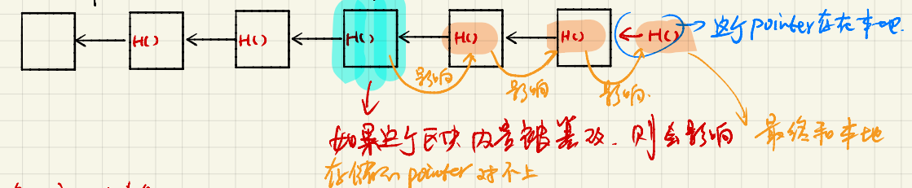
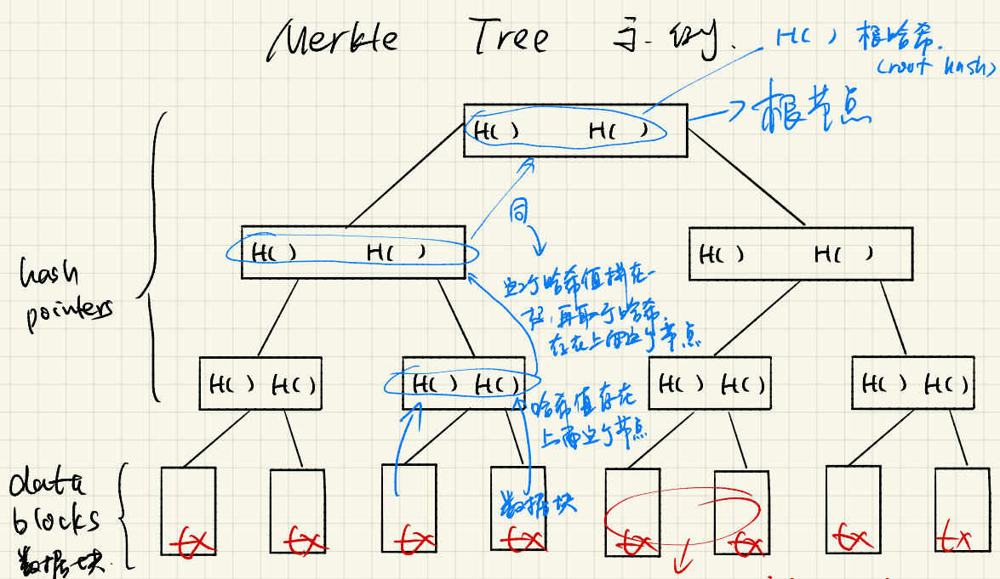
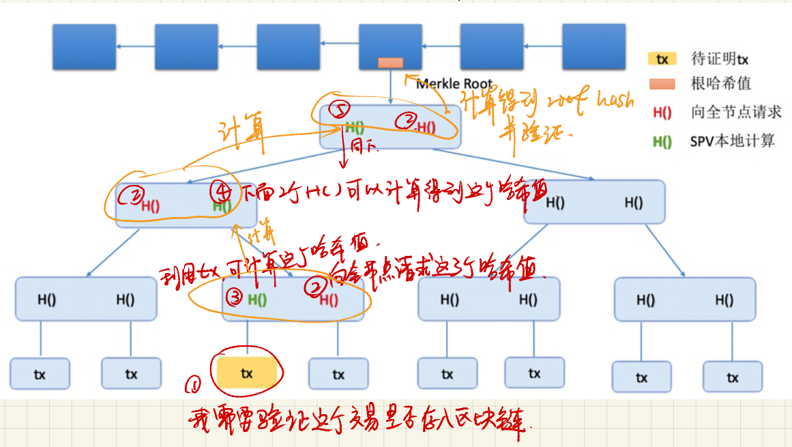
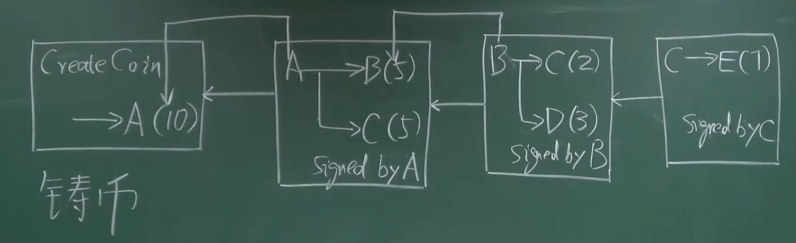
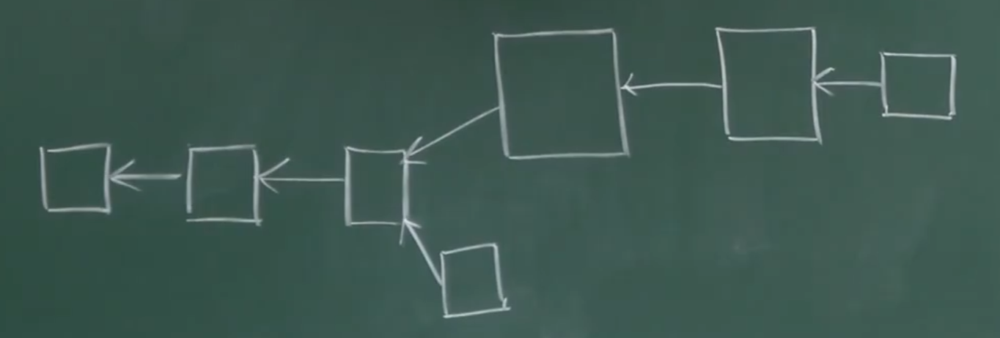
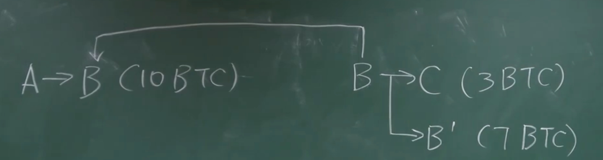

# BTC

### BTC-密码学原理

比特币用到的密码学两个功能: 

1. 哈希
2. 非对称加密

> 哈希

三个特效:

1. collision resistance (碰撞的抗性)

   即给定m, 可求得H(m), 当很难找到m', 使得H(m) = H(m')

   即无法人为制造哈希碰撞

2. hiding(单向不可逆性)

   给定m, 可求得H(m), 但是给定H(m), 无法求得m

3. pazzle friend

   哈希值的计算是不可预测的, 想要H(m)落在某个范围内, 没有什么好的办法, 只能一个一个试

   mining: 不断调整随机数nonce, 使得H(block header) <= target

> 非对称机密

公钥加密, 私钥解密. 私钥加密, 公钥解密.

两个应用场景:

1. 加密通讯

   加密通讯需要四个钥匙

   a->b消息, a使用b的公钥加密消息, b使用自己的私钥解密

   b->a消息, b使用a的公钥加密消息, a使用自己的私钥解密

2. 数字签名

   私钥加密, 公钥解密. 

### BTC-数据结构

btc中主要使用到了两种数据结构:

1. 链表

   btc中的链表使用的是hash指针, 使用hash指针可以保证数据块的内容不被篡改

   

2. Merkle Tree

   Merkle Tree的叶子节点是data blocks, 保存了交易信息. 非叶子节点是hash pointers.

   优点: 对Merkle Tree的任何修改都会反应到root hash上, 所以只要保证root hash不变就可以保存整个tree的内容没有被修改

   

   merkle tree的作用: 提供merkle proof. 即证明某个交易被写入到了区块链中

   

   为什么全节点不直接告诉轻节点某个交易是否存在?

   因为节点可能有恶意, 实际上不存在他说存在, 所以需要全节点提供hash值以保证真的存在(零知识证明)

   merkle tree只能证明某个交易在区块链中, 无法证明某个区交易不在区块中

### BTC-协议

数字货币需要解决的两个问题:

1. 谁有权发行货币

2. 怎么验证交易的有效性, 即找a->b的交易中, 

   如何确保a的钱不是凭空而来的

   如何确保这笔交易确实是a发起的而不是别人

   如何保证交易会不被回滚

   如何确保不会double spending attack

3. 防止双花攻击

   即a的十块钱不会在短时间内花两次.

> 怎么验证交易的有效性

btc中, 每个交易(transaction)分为input和output两个部分, input需要说明币的来源和发送者的公钥, output说明收款人的公钥的哈希, 即钱包的地址

1. 如果a的钱不是凭空来的

   对之前的区块中包含的交易进行回溯, 即可知道每个人有多少钱, 并将这些信息保存在内存中(UTXO  unspending transaction output)

2. 如何确保这笔交易是a自己发起的, 而不是由c伪造的(c可以伪造一笔交易, 并给出自己的公钥, 并且使用自己的私钥加密, 但是币的来源指向a的交易)

   a需要对当前交易进行签名并且给出自己的公钥, 签名需要与公钥对应, 并且公钥需要与来源中的接受者的公钥的hash对应上. 

3. 如何防止double spending attack

   a需要通过区块链中包含的交易进行回溯, 确定交易的币确实是a所拥有并且没有花过

4. 如何保证交易不会被回滚

   可以多等几个confirm, 即等自己的交易信息打包在区块链上, 并且该区块的后面几个区块已经被挖出来了

> 谁拥有权力发行货币

获得打包权的机器可以在区块链的交易列表Transaction中包含一个Coinbase交易, 即铸币交易, 该交易会产生一定数额的货币.

### BTC-分叉

fork: 对当前区块链的状态有分歧而造成的分叉

- state fork: 两个miner在差不多的时间挖到了矿

  forking attack: 故意造成分叉, 使得某些交易回滚

- protocol fork: 因为代码升级而导致的分叉

  - hard fork: 将限制改得宽松, 导致旧节点不认可新区块

    将btc中区块大小限制由1M改为4M, 1M大概1000000字节, 一个交易250字节, 所以一个区块可以包含4000个交易, 并且1个区块需要需要十分钟才能产生, 所以每秒只能记录7个交易

    

    升级之后, 旧节点不认可新节点产生的区块, 所以导致旧节点会一直沿着自己的链挖

  - soft fork: 将限制改得更严格, 旧节点可以认可新节点

    将btc中的区块大小有1m改为512k

    

# ETH

### 账户

比特币: 

- 基于交易的账本(transaction-based ledger), 要想知道某个账户有多少钱, 需要回溯区块链, 形成utxo, 然后从utxo中查. 

- 使用的时候必须将钱包中的币都花出去, 不能只花一部分, 所以在转账的时候需要将多余的部分交易到自己的另外一个地址

  

以太坊: 

- 基于账户的交易(account-based ledger), 系统中需要显示记录每个地址上的余额. 转账的时候不需要说明币的来源, 只需要检测余额. 导致的问题: 重放攻击(replay attack), 即在后面的区块上面回放之前的交易记录
- 解决replay attack: 在系统中记录每个地址有史以来发布的交易数(nonce, 这里的nonce是交易数, btc中的nonce是随机数), 交易中的交易数如果小于等于当前系统中记录的交易数, 认为是之前的交易, 不再处理

以太坊账户分类:

- externally owned account(外部账户): 与btc中的账户类似, 通过公私钥控制, 有balance(余额)和nonce两个状态(这里的nonce是交易数, btc中的nonce是随机数)
- smart contract account(合约账户): 不使用公私钥控制, 不能发起交易(交易必须由外部账户发起).除了有balance和nonce两个状态, 还有code(代码), storage(相关状态)

### 账户状态的数据结构

问题: 如何提供merkle proof, 证明某个账户的余额

> eth出块时间与网络延迟的思考

当前btc大约十分钟出一个块, 导致交易确认的时间过长. eth需要加快出块时间

但是时间是多长合适呢, 这就需要考察p2p网络中一个区块需要多久能够遍布全网

当前结论是12秒左右可以, 所以eth就将出块时间设计为12秒, 实际为14-15

如果将出块时间设计为6秒会出现上面问题呢, 上面说到一个区块需要十二秒才可以遍布全网, 那么假设a挖出区块#123发布全网, b因为网络延时6秒后才收到这个区块, 从a挖出区块到b接收到消息的这6秒时间内, b一直在挖这个#123区块, 但是实际这个区块已经挖出来了, 导致b在这6秒的时间里一直在做无用功, 同时也意味着b永远会跟主网差一个区块, 一直做无用功, 永远无法挖出有用的区块. 如果b的延迟是12秒, 意味着b永远差主网2个区块

> 助记词与私钥

助记词可以导出私钥, 那么导出的过程?