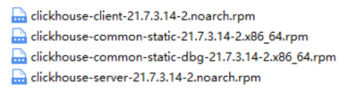
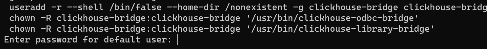
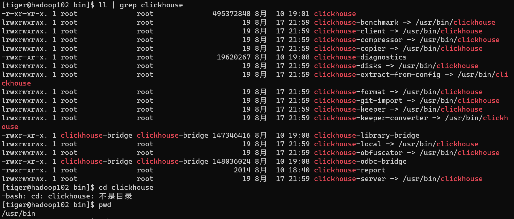
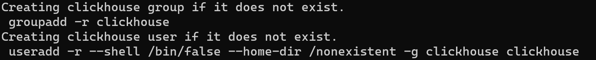
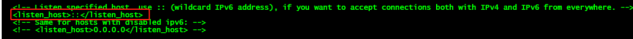
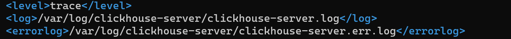
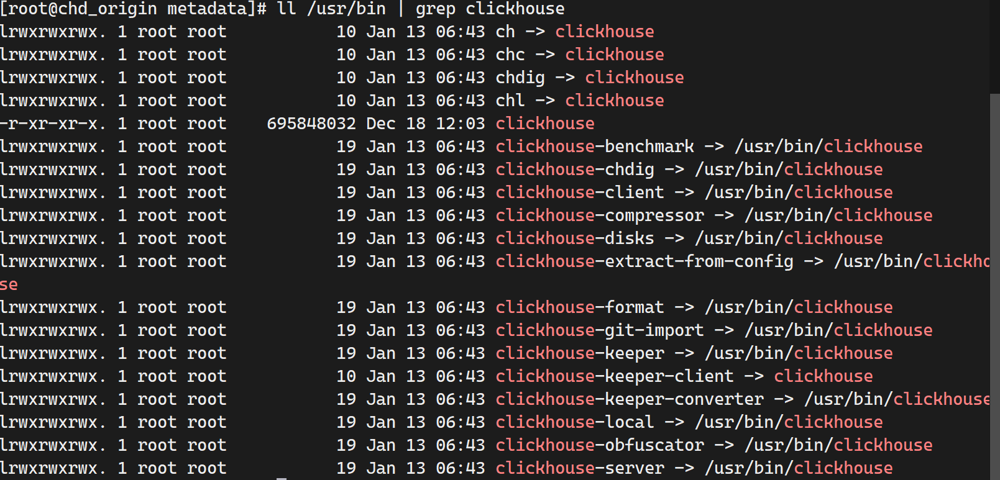
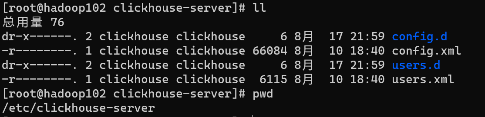
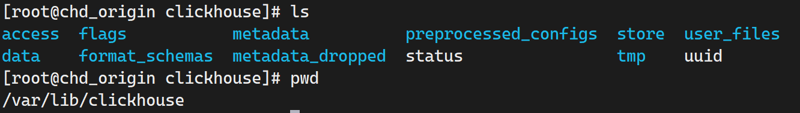

# 单机安装

1. 关闭防火墙

2. centos取消打开文件限制数量

   - 在 `/etc/security/limits.conf `和`/etc/security/limits.d/20-nproc.conf` 文件的末尾加入以下内容

     ~~~shell
     * soft nofile 65536
     * hard nofile 65536
     * soft nproc 131072
     * hard nproc 131072
     ~~~

3. 安装依赖

   ~~~shell
   sudo yum install -y libtool
   ~~~

4. centos 关闭selinux

   - 临时关闭使用`setenforce 0`, 不用重启
   - 永久关闭, 修改`/etc/selinux/config` 中的 `SELINUX=disabled`  

5. 在https://repo.clickhouse.tech/rpm/stable/x86_64/下载rpm包

   

   或者直接使用如下的命令

   ~~~shell
   wget https://packages.clickhouse.com/rpm/stable/clickhouse-common-static-dbg-25.9.7.56.x86_64.rpm
   wget https://packages.clickhouse.com/rpm/stable/clickhouse-client-25.9.7.56.x86_64.rpm
   wget https://packages.clickhouse.com/rpm/stable/clickhouse-server-25.9.7.56.x86_64.rpm
   wget https://packages.clickhouse.com/rpm/stable/clickhouse-common-static-25.9.7.56.x86_64.rpm
   ~~~

   

6. 通过rmp安装ck

   ~~~shell
   sudo rpm -ivh *.rpm
   ~~~

   安装过程中会提示输入默认用户`default`的密码, 如果不需要密码可以直接回车

   

   之后你也可以在`/etc/clickhouse-server/users.xml`修改这个`default`用户的密码

7. 安装完成后, ck相关命令在分别在`/usr/bin/`下

   

   创建过程中将会创建一个clickhouse用户和clickhouse组

   

   ck的其他文件如下

   

8. 修改配置文件, 使得其他机器可以访问ck

   ~~~shell
   sudo vim /etc/clickhouse-server/config.xml
   ~~~

   把 <listen_host>::</listen_host> 的注释打开

   

9. 在`/etc/clickhouse-server/config.xml`中修改ck的tcp端口, 默认为9000, 容易冲突

   ~~~xml
   <tcp_port>9000</tcp_port>
   ~~~

10. 在`/etc/clickhouse-server/config.xml`可以修改ck日志打印相关配置

    

    

11. 关闭ck的开机自启, 因为是测试使用

    ~~~shell
    sudo systemctl disable clickhouse-server
    sudo systemctl start clickhouse-server
    ~~~

12. ck server启停命令

    ~~~shell
    systemctl start clickhouse-server
    clickhouse start
    clickhouse restart
    
    systemctl stop clickhouse-server
    clickhouse stop
    
    systemctl status clickhouse-server
    clickhouse status
    ~~~

13. 启动ck client

    ~~~shell
    # -m 交互式终端使用分号表示sql语句的结尾, 而不是回车
    # --query 'sql' 跟hive -e一样, 直接执行后面的sql, 而不是开启交互式终端
    # --password 指定密码, 没有密码的话不用指定password
    # --user指定用户, 如果不指定的话默认使用default用户
    clickhouse-client -m -h localhost --port 9000 --password 111
    ~~~


## clickhouse的相关目录

1. 在你安装完clickhouse之后, 他会将所有的可执行命令放在`/usr/bin`目录下面, 这样你就可以直接在终端执行命令了

   

2. 所有的clickhouse-server的配置文件都保存在`/etc/clickhouse-server`下

   

3. 所有的clickhouse-client的配置文件都保存在`/etc/clickhouse-client`

   

4. 所有的clickhouse-server的数据文件都保存在`/var/lib/clickhouse`

   

   - metadata中保存的是数据库和表相关的DDL sql文件, 也是数据库和表的元信息
   - store中保存的是所有atomic表的数据
   - uuid中保存的是表名到uuid的映射
   - metadata_dropped中保存的是已经删除的表的相关sql文件
   - data用于保存老版本的ordinary数据库的表数据


# 数据库引擎

在clickhouse中, 创建数据库的时候可以指定多种数据库引擎, 每种数据库引擎都有不一样的功能, 你可以通过如下sql来查看数据库使用的引擎

~~~sql
SHOW CREATE DATABASE demo;
~~~

他会显示建表语句中的数据库引擎的类型


## Atomic

开源版本的clickhouse默认使用的数据库引擎, sql语句如下

~~~sql
CREATE DATABASE test 
[ENGINE = Atomic] 
[SETTINGS disk=...];
~~~


atomic就是原子的意思, 表示他可以原子性的修改表的元数据, 比如drop table, rename table, alter table等等, 而不会出现中间状态, 因为在atomic数据库中

- 所有的元数据和数据都是保存到本地的`/var/lib/clickhouse/metadata`和`/var/lib/clickhouse/metadata`中, **所以一般都是单机版本的clickhouse使用这种数据库类型**

- clickhouse会自动为每个表生成一个uuid, 当然你也可以自己指定, 但是不建议这么做

  ~~~shell
  CREATE TABLE name UUID '28f1c61c-2970-457a-bffe-454156ddcfef' (
  n UInt64
  ) ENGINE = ...;
  ~~~

- 表的数据会保持到`/var/lib/clickhouse/store/xxx/xxxyyyyy-yyyy-yyyy-yyyy-yyyyyyyyyyyy/`, 其中xxx是uuid的前缀, 你可以通过如下的sql语句来查询表的uuid

  ~~~sql
  SELECT
      database,
      name,
      uuid
  FROM system.tables
  WHERE database = 'demo_atomic'
    AND name = 'events';
    
     ┌─database────┬─name───┬─uuid─────────────────────────────────┐
  1. │ demo_atomic │ events │ ba8c8dff-31c0-4cb4-a408-f051a7b82a31 │
     └─────────────┴────────┴──────────────────────────────────────┘
  ~~~

- 对于drop table, 不会立刻删除数据, 只是将表的元数据移动到了``/var/lib/clickhouse/metadata_dropped`, 并将这个表标记为删除, 之后再对表数据进行删除

- 你可以直接在建表语句的settings字段中指定disk, 表示存储表元数据目录

  ~~~sql
  CREATE TABLE db (n UInt64) ENGINE = Atomic SETTINGS disk=disk(type='local', path='/var/lib/clickhouse-disks/db_disk');
  ~~~

  如果没有指定的话, 那么默认会使用`database_disk.disk`中指定的磁盘

  你可以通过如下的sql来查看一个atomic数据库的表在本地的存放位置

  ~~~sql
  SELECT
      database,
      name,
      uuid,
      data_paths
  FROM system.tables
  WHERE database = 'demo_atomic'
    AND name = 'events';
     ┌─database────┬─name───┬─uuid─────────────────────────────────┬─data_paths──────────────────────────────────────────────────────────────┐
  1. │ demo_atomic │ events │ ba8c8dff-31c0-4cb4-a408-f051a7b82a31 │ ['/var/lib/clickhouse/store/ba8/ba8c8dff-31c0-4cb4-a408-f051a7b82a31/'] │
     └─────────────┴────────┴──────────────────────────────────────┴─────────────────────────────────────────────────────────────────────────┘
  ~~~

  

## Shared

Shared和Atomic类似, 能够支持元数据的原子更新, 每个表都有uuid, 数据都保在在`/var/lib/clickhouse/store/xxx/xxxyyyyy-yyyy-yyyy-yyyy-yyyyyyyyyyyy/`中

但是不同的点在于Shared数据库的元数据都保存在keeper中, 而不会保存在本地的`/var/lib/metadata/`中, 所以这种数据库引擎一般都是在clickhouse集群中使用, 多个实例共享元数据, 但是需要注意的是, 数据还是保存在本地的

要想使用Shared数据库引擎, 你必须:

- 运行Clickhouse Keeper 或者zookeeper
- 在`/etc/clickhouse-server/config.xml`中配置了keeper的地址
- 所有clickhouse的实力连接的同一个keeper

之后你就可以使用如下的sql来建立一个Shared数据库

~~~sql
CREATE DATABASE demo_shared
ENGINE = Shared;

-- 验证数据库类型
SHOW CREATE DATABASE demo_shared;
~~~


## Lazy

这种数据库引擎很少用, 他的核心目标只有一个: 减少内存占用

当你第一次使用这个表的时候,  clickhouse会磁盘中加载表结构和表的数据, 所以在第一次访问的时候会特别的慢

如果你在指定的时间之后不再访问这个表, 那么他又会将内存中的元数据和表数据卸载掉, 下次使用的时候重新加载

同时Lazy数据库引擎也没有DDL的原子性, 并且他只能和*Log模型的表一起使用

你在绝大部分场景中都不应该使用这种数据库引擎, 而是应该使用Atomic数据库引擎, 他只适合那些好久才使用一次的表

~~~sql
CREATE DATABASE testlazy 
ENGINE = Lazy(expiration_time_in_seconds); -- 指定多久之后卸载表
~~~


## Replicated

// todo


## PostgreSQL

用于将一整个Postgres数据库映射到ck中。**支持在ck中对pg进行select, insert(不支持update, delete)**，以便在 ClickHouse 和 PostgreSQL 之间交换数据。


他的使用场景是:

1. 维度表
2. 配置表
3. Lookup
4. 查询范围小, 条件过滤强的sql

千万不要在ck中进行大数据量的查询pg


你可以通过如下的sql来创建一个PostgresSQL

~~~sql
CREATE DATABASE test_database
ENGINE = PostgreSQL(
    'host:port', 'database', 'user', 'password'[, `schema`, `use_table_cache`]);
~~~

- use_table_cache表示是否缓存pg的表结构到ck中, 默认值为0, 表示实时查询pg的表结构, 如果设置为1, 那么将会缓存pg的表结构, 在使用的时候不再实时查询

- 如果pg中的表结构变更了, 那么你也可以使用`detach`和`attach`查询进行更新

你可以通过 `SHOW TABLES` 和 `DESCRIBE TABLE` 实时访问远程 PostgreSQL 中的表列表和表结构。


使用这种数据库引擎的时候, 会将pg表中的字段类型映射为ck的字段类型

| PostgreSQL       | ClickHouse                                                   |
| ---------------- | ------------------------------------------------------------ |
| DATE             | [Date](https://clickhouse.com/docs/sql-reference/data-types/date) |
| TIMESTAMP        | [DateTime](https://clickhouse.com/docs/sql-reference/data-types/datetime) |
| REAL             | [Float32](https://clickhouse.com/docs/sql-reference/data-types/float) |
| DOUBLE           | [Float64](https://clickhouse.com/docs/sql-reference/data-types/float) |
| DECIMAL, NUMERIC | [Decimal](https://clickhouse.com/docs/sql-reference/data-types/decimal) |
| SMALLINT         | [Int16](https://clickhouse.com/docs/sql-reference/data-types/int-uint) |
| INTEGER          | [Int32](https://clickhouse.com/docs/sql-reference/data-types/int-uint) |
| BIGINT           | [Int64](https://clickhouse.com/docs/sql-reference/data-types/int-uint) |
| SERIAL           | [UInt32](https://clickhouse.com/docs/sql-reference/data-types/int-uint) |
| BIGSERIAL        | [UInt64](https://clickhouse.com/docs/sql-reference/data-types/int-uint) |
| TEXT, CHAR       | [String](https://clickhouse.com/docs/sql-reference/data-types/string) |
| INTEGER          | Nullable([Int32](https://clickhouse.com/docs/sql-reference/data-types/int-uint)) |
| ARRAY            | [Array](https://clickhouse.com/docs/sql-reference/data-types/array) |


### 使用案例

1. 在ck中映射pg数据库

   ~~~sql
   CREATE DATABASE test_database
   ENGINE = PostgreSQL('postgres1:5432', 'test_database', 'postgres', 'mysecretpassword', 'schema_name',1);
   
   SHOW DATABASES;
   ┌─name──────────┐
   │ default       │
   │ test_database │
   │ system        │
   └───────────────┘
   ~~~

2. 在ck中查询表结构和数据

   ~~~sql
   SHOW TABLES FROM test_database;
   ┌─name───────┐
   │ test_table │
   └────────────┘
   
   DESCRIBE TABLE test_database.test_table;
   ┌─name───┬─type──────────────┐
   │ id     │ Nullable(Integer) │
   │ value  │ Nullable(Integer) │
   └────────┴───────────────────┘
   
   SELECT * FROM test_database.test_table;
   ┌─id─┬─value─┐
   │  1 │     2 │
   └────┴───────┘
   ~~~

3. 通过ck插入数据到pg中

   ~~~sql
   INSERT INTO test_database.test_table VALUES (3,4);
   SELECT * FROM test_database.test_table;
   ┌─int_id─┬─value─┐
   │      1 │     2 │
   │      3 │     4 │
   └────────┴───────┘
   ~~~

4. 通过pg修改表结构, 因为`use_table_cache`设置为了1, 所以会缓存元数据, 如果元数据变更了, 需要手动同步

   ~~~sql
   -- 修改pg中的表结构
   postgre> ALTER TABLE test_table ADD COLUMN data Text
   
   -- ck中查看表结构, 未发生变化
   ┌─name───┬─type──────────────┐
   │ id     │ Nullable(Integer) │
   │ value  │ Nullable(Integer) │
   └────────┴───────────────────┘
   
   -- 手动同步表结构, 二选一即可
   DETACH TABLE test_database.test_table;
   ATTACH TABLE test_database.test_table;
   
   -- 重新查询
   DESCRIBE TABLE test_database.test_table;
   ┌─name───┬─type──────────────┐
   │ id     │ Nullable(Integer) │
   │ value  │ Nullable(Integer) │
   │ data   │ Nullable(String)  │
   └────────┴───────────────────┘
   ~~~


## MySQL

和Postgres数据库引擎一样, 用于将mysql中的整个数据库映射到ck中, **支持在ck中对mysql进行select, insert(不支持update, delete)**

~~~sql
CREATE DATABASE [IF NOT EXISTS] db_name [ON CLUSTER cluster]
ENGINE = MySQL('host:port', 'database' , 'user', 'password')
~~~


ck会将mysql中的数据类型转换为对应的ck数据类型, 如下是映射关系

| MySQL                            | ClickHouse                                                   |
| -------------------------------- | ------------------------------------------------------------ |
| UNSIGNED TINYINT                 | [UInt8](https://clickhouse.com/docs/sql-reference/data-types/int-uint) |
| TINYINT                          | [Int8](https://clickhouse.com/docs/sql-reference/data-types/int-uint) |
| UNSIGNED SMALLINT                | [UInt16](https://clickhouse.com/docs/sql-reference/data-types/int-uint) |
| SMALLINT                         | [Int16](https://clickhouse.com/docs/sql-reference/data-types/int-uint) |
| UNSIGNED INT, UNSIGNED MEDIUMINT | [UInt32](https://clickhouse.com/docs/sql-reference/data-types/int-uint) |
| INT, MEDIUMINT                   | [Int32](https://clickhouse.com/docs/sql-reference/data-types/int-uint) |
| UNSIGNED BIGINT                  | [UInt64](https://clickhouse.com/docs/sql-reference/data-types/int-uint) |
| BIGINT                           | [Int64](https://clickhouse.com/docs/sql-reference/data-types/int-uint) |
| FLOAT                            | [Float32](https://clickhouse.com/docs/sql-reference/data-types/float) |
| DOUBLE                           | [Float64](https://clickhouse.com/docs/sql-reference/data-types/float) |
| DATE                             | [Date](https://clickhouse.com/docs/sql-reference/data-types/date) |
| DATETIME, TIMESTAMP              | [DateTime](https://clickhouse.com/docs/sql-reference/data-types/datetime) |
| BINARY                           | [FixedString](https://clickhouse.com/docs/sql-reference/data-types/fixedstring) |

其他所有类型的字段, 都映射为ck中的String类型


### 使用案例

1. 在mysql中建表

   ~~~sql
   mysql> USE test;
   Database changed
   
   mysql> CREATE TABLE `mysql_table` (
       ->   `int_id` INT NOT NULL AUTO_INCREMENT,
       ->   `float` FLOAT NOT NULL,
       ->   PRIMARY KEY (`int_id`));
   Query OK, 0 rows affected (0,09 sec)
   
   mysql> insert into mysql_table (`int_id`, `float`) VALUES (1,2);
   Query OK, 1 row affected (0,00 sec)
   
   mysql> select * from mysql_table;
   +------+-----+
   | int_id | value |
   +------+-----+
   |      1 |     2 |
   +------+-----+
   1 row in set (0,00 sec)
   ~~~

2. 在ck中操作mysql

   ~~~sql
   CREATE DATABASE mysql_db ENGINE = MySQL('localhost:3306', 'test', 'my_user', 'user_password') SETTINGS read_write_timeout=10000, connect_timeout=100;
   
   SHOW DATABASES
   ┌─name─────┐
   │ default  │
   │ mysql_db │
   │ system   │
   └──────────┘
   
   SHOW TABLES FROM mysql_db
   ┌─name─────────┐
   │  mysql_table │
   └──────────────┘
   
   SELECT * FROM mysql_db.mysql_table
   ┌─int_id─┬─value─┐
   │      1 │     2 │
   └────────┴───────┘
   
   INSERT INTO mysql_db.mysql_table VALUES (3,4)
   SELECT * FROM mysql_db.mysql_table
   ┌─int_id─┬─value─┐
   │      1 │     2 │
   │      3 │     4 │
   └────────┴───────┘
   ~~~

   

## SQLite

和PostgreSQL一样, 用于将一整个sqlite数据库映射到ck中

~~~sql
    CREATE DATABASE sqlite_database
    ENGINE = SQLite('db_path') -- 指定sqlite的文件路径
~~~

ck会将sqlite中的数据类型映射为ck中的数据类型, 映射关系如下

| SQLite  | ClickHouse                                                   |
| ------- | ------------------------------------------------------------ |
| INTEGER | [Int32](https://clickhouse.com/docs/sql-reference/data-types/int-uint) |
| REAL    | [Float32](https://clickhouse.com/docs/sql-reference/data-types/float) |
| TEXT    | [String](https://clickhouse.com/docs/sql-reference/data-types/string) |
| BLOB    | [String](https://clickhouse.com/docs/sql-reference/data-types/string) |


### 使用案例

1. 在ck中创建sqlite的映射

   ~~~sql
   CREATE DATABASE sqlite_db ENGINE = SQLite('sqlite.db');
   ~~~

2. 查询数据

   ~~~sql
   SHOW TABLES FROM sqlite_db;
   ┌──name───┐
   │ table1  │
   │ table2  │
   └─────────┘
   
   SELECT * FROM sqlite_db.table1;
   ┌─col1──┬─col2─┐
   │ line1 │    1 │
   │ line2 │    2 │
   │ line3 │    3 │
   └───────┴──────┘
   ~~~

3. 将ck中的数据插入到sqlite中

   ~~~sql
   CREATE TABLE clickhouse_table(
       `col1` String,
       `col2` Int16
   ) ENGINE = MergeTree() ORDER BY col2;
   
   INSERT INTO clickhouse_table VALUES ('text',10);
   
   INSERT INTO sqlite_db.table1 SELECT * FROM clickhouse_table;
   
   SELECT * FROM sqlite_db.table1;
   ┌─col1──┬─col2─┐
   │ line1 │    1 │
   │ line2 │    2 │
   │ line3 │    3 │
   │ text  │   10 │
   └───────┴──────┘
   ~~~

   

## Backup

在ck中, 运行你通过backup和restore命令来备份恢复数据库和表, backup会为数据库创建一个备份

当然你可以将这个备份创建为一个数据库, 然后对这个数据库进行查询

想要具体了解可以查看

https://clickhouse.com/docs/engines/database-engines/backup

https://clickhouse.com/docs/operations/backup/disk


## MaterializedPostgreSQL

使用这种数据库引擎, 在创建数据库的时候必须指定要同步的pg的表, 之后ck会开始全量同步这些表中的数据到ck中, 之后从pg 的wal中拉取后续的更新到ck中, 进行增量同步


你可以通过如下的sql来创建数据库

~~~sql
CREATE DATABASE [IF NOT EXISTS] db_name [ON CLUSTER cluster]
ENGINE = MaterializedPostgreSQL(
    'host:port', 'database', 'user', 'password'
) 
[SETTINGS ...]
~~~

根据settings他有三种模式

1. 一个 `MaterializedPostgreSQL` 引擎数据库, 同步pg中的一整个schema中的所有的表

   ~~~sql
   CREATE DATABASE postgres_database
   ENGINE = MaterializedPostgreSQL(
       'postgres1:5432', 'postgres_database', 'postgres_user', 'postgres_password'
   )
   SETTINGS 
   -- 指定同步的schema, 会自动同步所有的表
   materialized_postgresql_schema = 'postgres_schema';
   
   SELECT * FROM postgres_database.table1;
   ~~~

   之后你可以使用pg中表名在ck中进行查询

   ~~~sql
   SELECT * FROM postgres_database.table1;
   ~~~

2. 一个 `MaterializedPostgreSQL` 引擎数据库, 同步多个schema下的多个表

   ~~~sql
   CREATE DATABASE database1
   ENGINE = MaterializedPostgreSQL(
       'postgres1:5432', 'postgres_database', 'postgres_user', 'postgres_password'
   )
   SETTINGS 
   -- 指定需要同步的表
   materialized_postgresql_tables_list = 'schema1.table1,schema2.table2,schema1.table3',
   materialized_postgresql_tables_list_with_schema = 1;
   ~~~

   之后你需要通过`schema_name.table_name`来访问表

   ~~~sql
   SELECT * FROM database1.`schema1.table1`;
   SELECT * FROM database1.`schema2.table2`;
   ~~~

3. 一个 `MaterializedPostgreSQL` 引擎数据库, 同步pg中的多个schema的所有的表

   ~~~sql
   CREATE DATABASE database1
   ENGINE = MaterializedPostgreSQL(
       'postgres1:5432', 'postgres_database', 'postgres_user', 'postgres_password'
   )
   SETTINGS 
   -- 指定要同步的schema
   materialized_postgresql_schema_list = 'schema1,schema2,schema3';
   ~~~

   之后你可以通过如下的sql来访问这些表

   ~~~sql
   SELECT * FROM database1.`schema1.table1`;
   SELECT * FROM database1.`schema1.table2`;
   SELECT * FROM database1.`schema2.table2`;
   ~~~


在同步的时候, 你也可以同步表中指定的列

~~~sql
REATE DATABASE database1
ENGINE = MaterializedPostgreSQL(
    'postgres1:5432', 'postgres_database', 'postgres_user', 'postgres_password'
)
SETTINGS 
materialized_postgresql_tables_list = 'schema1.table1(co1, col2),schema1.table2,schema1.table3(co3, col5, col7)
~~~


需要注意的是:

1. 这种数据库引擎是实验性质的, 要使用他需要再配置文件中将`allow_experimental_database_materialized_postgresql` 设置为 1，或使用 `SET` 命令：

   ~~~sql
   SET allow_experimental_database_materialized_postgresql=1
   ~~~

2. 如果pg中后续增加了新表, 那么不会自动同步, 需要你手动

   ~~~sql
   -- 手动指定需要同步的新表, 然后ck会开始同步数据到ck中
   ATTACH TABLE postgres_database.new_table;
   ~~~

3. PostgreSQL的复制协议不允许复制表结构的变更, 但是表结构的变更可以被检测到, 所以一到pg中的表结构发生了变更, 比如添加/删除了字段, 那么ck就会停止同步这个表, 你需要使用 `ATTACH` / `DETACH PERMANENTLY` 查询来完全重新加载表。如果 DDL 语句没有破坏复制（例如，重命名列），则表仍会接收更新（插入操作按位置执行）。


使用这种数据库对pg有如下的要求

1. 在 PostgreSQL 配置文件中， [wal_level](https://www.postgresql.org/docs/current/runtime-config-wal.html) 设置的值必须为 `logical` ， `max_replication_slots` 参数的值必须至少为 `2` 。

2. 每个复制的表都必须要下面二者之一

   - 主键

   - 唯一索引, 并且将唯一索引设置为replica Identity

     ~~~sql
     postgres# CREATE TABLE postgres_table (a Integer NOT NULL, b Integer, c Integer NOT NULL, d Integer, e Integer NOT NULL);
     postgres# CREATE unique INDEX postgres_table_index on postgres_table(a, c, e);
     postgres# ALTER TABLE postgres_table REPLICA IDENTITY USING INDEX postgres_table_index;
     ~~~


## DataLakeCatalog

`DataLakeCatalog` 数据库引擎使您能够将 ClickHouse 连接到外部的catalog，并进行数据查询，而无需重复数据。这使 ClickHouse 转变为一个强大的查询引擎，可与您现有的数据湖基础架构无缝协作。

`DataLakeCatalog` 引擎支持以下catalog：

- **AWS Glue Catalog** -  AWS 环境中的 Iceberg 表
- **Databricks Unity Catalog** - 适用于 Delta Lake 和 Iceberg 表
- **Hive Metastore** - 适用于hive的catalog
- **REST Catalogs** - 任何支持 Iceberg REST 规范的目录


更多细节和使用案例查看https://clickhouse.com/docs/engines/database-engines/datalakecatalog


# 数据类型

每个数据类型都有他们的默认值, 如果你在插入的时候没有指定这些列的值, 那么就是默认值, 比如0, 空字符串, false等等


而对于Nullable类型, 如果没有指定的话, 默认为NULL


## 整型

有符号整型: Int8, Int16, Int32, Int64, Int128, Int256

无符号整型: UInt8, UInt16, UInt32, UInt64, UInt128, UInt256

他们是范围和Java中的范围类型


上述的类型也有他们的别名, 如下面的表格

| Type    | Alias                                                        |
| ------- | ------------------------------------------------------------ |
| `Int8`  | `TINYINT`, `INT1`, `BYTE`, `TINYINT SIGNED`, `INT1 SIGNED`   |
| `Int16` | `SMALLINT`, `SMALLINT SIGNED`                                |
| `Int32` | `INT`, `INTEGER`, `MEDIUMINT`, `MEDIUMINT SIGNED`, `INT SIGNED`, `INTEGER SIGNED` |
| `Int64` | `BIGINT`, `SIGNED`, `BIGINT SIGNED`, `TIME`                  |
| `UInt8`  | `TINYINT UNSIGNED`, `INT1 UNSIGNED`                      |
| `UInt16` | `SMALLINT UNSIGNED`                                      |
| `UInt32` | `MEDIUMINT UNSIGNED`, `INT UNSIGNED`, `INTEGER UNSIGNED` |
| `UInt64` | `UNSIGNED`, `BIGINT UNSIGNED`, `BIT`, `SET`              |

> 使用场景: 个数, 数量, id


## 浮点型

Float32, Float64, 需要注意浮点数在计算的时候有误差

他们的别名如下

| Type      | Alias                        |
| --------- | ---------------------------- |
| `Float32` | `FLOAT`, `REAL`, `SINGLE`    |
| `Float64` | `DOUBLE`, `DOUBLE PRECISION` |


> 使用场景: 一般数据值比较小, 不涉及大量的统计计算, 精度要求不高, 比如商品的重量


## 布尔类型

`bool` 类型在内部存储为 UInt8。可能的值为 `true`(内部存储1) ， `false` (内部存储0)

~~~sql
SELECT true AS col, toTypeName(col);
┌─col──┬─toTypeName(true)─┐
│ true │ Bool             │
└──────┴──────────────────┘

select true == 1 as col, toTypeName(col);
┌─col─┬─toTypeName(equals(true, 1))─┐
│   1 │ UInt8                       │
└─────┴─────────────────────────────┘

-- 在插入的时候, 你也可以直接通过1/0来表示true/false
CREATE TABLE test_bool( `A` Int64, `B` Bool )
ENGINE = Memory;

INSERT INTO test_bool VALUES (1, true),(2,0);
SELECT * FROM test_bool;
┌─A─┬─B─────┐
│ 1 │ true  │
│ 2 │ false │
└───┴───────┘
~~~


## Decimal

- Decimal32(S): 只能保存9位数字, S表示小数的位数

  **比如Decimal32(5)表示小数5位, 整数部分4位, 如果保存的小数位数超过了5位那么会直接截断**

  所以他的取值范围是[-9999.9999, 9999.9999]

- Decimal64(S): 只能保存18位数字, S表示小数位的位数

- Decimal128(S): 只能保存38位数字, S表示小数位的位数

- Decimal128(S): 只能保存76位数字, S表示小数的位数


当然如果你觉得上面的类型太麻烦了, 那么你也可以使用下面两种类型

- Decimal(P, S): 其中P表示能够保存的数字的长度, S表示小数部分的长度, P的取值为[1, 76], S的取值为[0, P]

  比如Decimal(32, 15)就表示保存的数字长度为32位, 小数部分15位, 超过直接截断

  - 如果P是1~9, 那么你实际上就是在使用Decimal32(S)
  - 如果P是10~18, 那么实际上就是使用的Decimal64(S)
  - 如果P是19~38, 那么你实际上就是在使用Decimal128(S)
  - 如果P是39~76, 那么实际上就是使用的Decimal256(S)

- Decimal(P): 等效于Decimal(P, 0), 即没有小数部分

- Decimal: 等效于Decimal(10, 0), 没有小数部分


比如Decimal(10, 4)表示保存10位数字, 其中小数位4位, 整数部分6位

~~~sql
create table decimal_test (
    x Decimal(10, 4)
) engine = TinyLog;

-- 数据被截断
insert into decimal_test values (123456.1234567);

select * from decimal_test;
   ┌───────────x─┐
1. │ 123456.1234 │
   └─────────────┘
~~~


> 使用场景是需要精确计算, 比如金额, 汇率


## 字符串

- String: 字符串可以任务长度, 他可以包含任意的字节集, 包括空字节

- FixedString(N)

  长度固定为N的字符串, N必须是正整数. 

  当插入的数据长度小于N的时候, 会在字符串末尾填充空字节. 

  当插入的数据的长度超过N的时候, 会报错

  > 和String相比, 极少使用FixedString, 即使是固定长度的字段, 比如性别, 名称等等, 考虑到变化性会带来一定的风险且收益不够明显, 所以使用有限


## 枚举类型

Enum8和Enum16

**实际上在Clickhouse中, Enum8和Enum16就是Int8和Int16, 包括数据存储也是使用的他们, Clickhouse会保存Enum到Int的转换, 然后在返回结果的时候进行转换**

~~~sql
create table test_enum (
    x Enum8 ('hello'=1, 'world'=2, 'nihao'=3)
)
engine = TinyLog;

-- 在插入的时候可以直接使用字符串, 或者数字
insert into test_enum values ('hello'), ('world'), (1);

-- 查询
select * from test_enum;
   ┌─x─────┐
1. │ hello │
2. │ world │
3. │ hello │
   └───────┘
   
-- 查询的时候也可以转换为对应的数字
select cast(x, 'Int8') from test_enum
   ┌─CAST(x, 'Int8')─┐
1. │               1 │
2. │               2 │
3. │               1 │
   └─────────────────┘

-- 插入不存在的枚举指会报错
insert into test_enum values ('haha');
Error on processing query: Code: 691. DB::Exception: Unknown element 'haha' for enum
~~~

Enum8和Enum18主要使用在一些状态的字段上面, 算是一种空间优化, 也算是一种数据约束

但是在实际使用过程中往往因为一些**数据内容的变化**而增加一定的维护成本, 所以谨慎使用


## 时间类型

### Date

使用UInt16来存储至1970-01-01天数, 类似'2019-12-16', 范围[1970-01-01, 2149-06-06], 没有时区

~~~sql
CREATE TABLE dt
(
    `timestamp` Date,
    `event_id` UInt8
)
ENGINE = TinyLog;
-- 可以插入字符串或者自1970年的天数
INSERT INTO dt VALUES ('2019-01-01', 1), (17897, 2);

select * from dt;
┌──timestamp─┬─event_id─┐
│ 2019-01-01 │        1 │
│ 2019-01-01 │        2 │
└────────────┴──────────┘
~~~


### Date32

使用Int32来保持自1970-01-01以来的天数, 负数表示1970-01-01以前的时间

时间范围为: [1900-01-01, 2299-12-31]

~~~sql
CREATE TABLE dt32
(
    `timestamp` Date32,
    `event_id` UInt8
)
ENGINE = TinyLog;


INSERT INTO dt32 VALUES ('2100-01-01', 1);

SELECT * FROM dt32;
┌──timestamp─┬─event_id─┐
│ 2100-01-01 │        1 │
└────────────┴──────────┘
~~~


### Time

Time: 只包含时分秒, 没有毫秒, 支持的范围是 [-999:59:59, 999:59:59], 不包含时区

内部使用Int32字节来保存秒数, 因为和DateTime具有相同的字节, 所以性能相当

~~~sql
CREATE TABLE tab
(
    `event_id` UInt8,
    `time` Time
)
ENGINE = TinyLog;

-- 可以插入数字和字符串, 如果是数字的话, 那么是00:00:00的秒数
INSERT INTO tab VALUES (1, '14:30:25'), (2, 52225);

SELECT * FROM tab ORDER BY event_id;
   ┌─event_id─┬──────time─┐
1. │        1 │ 14:30:25 │
2. │        2 │ 14:30:25 │
   └──────────┴───────────┘
~~~


### Time64

带有精度的Time类型, 可以表示微秒, 毫米, 纳秒, 不支持时区

~~~sql
Time64(precision)

Time64(3) -- 精确到毫秒 
Time64(6) -- 精确到微秒 
Time64(9) -- 精确到纳秒 
~~~

支持的范围从[999:59:59.999999999, 999:59:59.999999999], 小数点的位数取决于你设置的精度

他内部使用Decimal来实现

~~~sql
CREATE TABLE tab64
(
    `event_id` UInt8,
    `time` Time64(3)
)
ENGINE = TinyLog;

INSERT INTO tab64 VALUES (1, '14:30:25');

SELECT * FROM tab64 ORDER BY event_id;
   ┌─event_id─┬────────time─┐
1. │        1 │ 14:30:25.000 │
   └──────────┴──────────────┘
~~~

在比较的时候需要手动将字符串转换为Time64

~~~sql
SELECT * FROM tab64 WHERE time = toTime64('14:30:25', 3);
~~~


### DataTime

Datetime: 保存年月日时分秒, 带时区, 时间范围是[1970-01-01 00:00:00, 2106-02-07 06:28:15]

内部使用Int32保存自1970-01-01 00:00:00以来的秒数, unix时间戳

时区信息不保存在数据中, 而是在元数据中, 创建表时，您可以为 `DateTime` 类型列显式设置时区。例如： `DateTime('UTC')` 。如果未设置时区，ClickHouse 将在服务器启动时使用服务器设置或操作系统设置中的[时区](https://clickhouse.com/docs/operations/server-configuration-parameters/settings#timezone)参数值。


`Date` 类型需要 2 个字节的存储空间，而 `DateTime` 需要 4 个字节。然而，在压缩过程中，Date 和 DateTime 之间的大小差异会变得更加显著。这种差异的放大是由于 `DateTime` 中的分钟和秒更难压缩。此外，对 `Date` 进行筛选和聚合也比对 `DateTime` 更快。


~~~sql
CREATE TABLE dt
(
    `timestamp` DateTime('Asia/Istanbul'),
    `event_id` UInt8
)
ENGINE = TinyLog;

-- 可以插入字符串, 或者数字, 如果是数字表示自1970年以来的秒数
-- 需要注意的是, 如果你插入的是字符串, 那么他表示的就是当前列的时区的时间
-- 如果插入的是数字, 那么表示的是UTC时区的自1970年以来的秒数
INSERT INTO dt VALUES ('2019-01-01 00:00:00', 1), (1546300800, 2);
SELECT * FROM dt;
┌───────────timestamp─┬─event_id─┐
│ 2019-01-01 00:00:00 │        1 │
│ 2019-01-01 03:00:00 │        2 │
└─────────────────────┴──────────┘
~~~


### Datetime64

表示一个瞬时, 带时区, 可以指定精度

~~~sql
DataTime(precision, [timezone])

DateTime64(3, 'Asia/Istanbul') -- 精确到毫秒
DateTime64(6, 'Asia/Istanbul') -- 精确到微秒
DateTime64(9, 'Asia/Istanbul') -- 精确到纳秒
~~~

支持的范围: [1900-01-01 00:00:00, 2299-12-31 23:59:59.999999999], 小数点后的位数取决于精度


他的内部使用一个Int64来表示自`1970-01-01 00:00:00 UTC`以来的秒/毫秒/微秒/纳秒, 取决于精度

时区信息不保存在数据中, 而在列的元数据中

~~~sql
CREATE TABLE dt64
(
    `timestamp` DateTime64(3, 'Asia/Istanbul'),
    `event_id` UInt8
)
ENGINE = TinyLog;

-- 如果插入的是字符串, 表示的是ck当前时区的时间
-- 如果是integer, 那么表示的是自1970-01-01 !!!UTC!!! 以来的ticket数, 取决于精度
INSERT INTO dt64 VALUES (1546300800123, 1),  ('2019-01-01 00:00:00', 3);

SELECT * FROM dt64;
┌───────────────timestamp─┬─event_id─┐
│ 2019-01-01 03:00:00.123 │        1 │
│ 2019-01-01 00:00:00.000 │        3 │
└─────────────────────────┴──────────┘
~~~

在进行比较的时候, 字符串并不会自动转换为Datetime64, 所以需要手动转换

~~~sql
SELECT * FROM dt64 WHERE timestamp = toDateTime64('2019-01-01 00:00:00', 3, 'Asia/Istanbul');
~~~


## Nullable(T)

允许列中的值为null, 比如Nullable(Int8)表示存储Int8的列, 但是可以为NULL

如果你在插入数据的时候, 没有指定Nullable(Int8)的值, 那么他默认为NULL, 而对于Int8的列, 如果你在插入的时候没有指定默认值, 那么他默认为0


`T` 不能是任何复合数据类型 [Array](https://clickhouse.com/docs/sql-reference/data-types/array) 、 [Map](https://clickhouse.com/docs/sql-reference/data-types/map) 和 [Tuple](https://clickhouse.com/docs/sql-reference/data-types/tuple) ，但复合数据类型可以包含 `Nullable` 类型的值，例如 `Array(Nullable(Int8))` 。

**`Nullable` 类型的字段不能包含在表索引中。**


> 不要使用Nullable, 除了要比普通的列占据更大的存储空间, 对性能的影响也是负面的, 如果一定要使用的话, 使用一个业务不可能的值来表示, 比如空字符串, -1


~~~sql
CREATE TABLE nullable (
    `n` Nullable(UInt32)
) ENGINE = MergeTree ORDER BY tuple();

INSERT INTO nullable VALUES (1) (NULL) (2) (NULL);

-- 查看一个字段是否为null, 获取他的null属性, 如果是null的话, 那么返回1
SELECT n.null FROM nullable;
┌─n.null─┐
│      0 │
│      1 │
│      0 │
│      1 │
└────────┘
~~~

## UUID

使用16字节来保持uuid, 类似`61f0c404-5cb3-11e7-907b-a6006ad3dba0`

uuid的默认值为`00000000-0000-0000-0000-000000000000`, 如果在插入的时候没有指定列的值, 那么就会使用默认值

由于历史原因，UUID 是按后半部分排序的。因此，**UUID 不应直接用作表的主键、排序键或分区键。**

~~~sql
CREATE TABLE tab (uuid UUID) ENGINE = Memory;

INSERT INTO tab 
SELECT generateUUIDv4() FROM numbers(50);

SELECT * FROM tab ORDER BY uuid;
┌─uuid─────────────────────────────────┐
│ 36a0b67c-b74a-4640-803b-e44bb4547e3c │
│ e3776711-6359-4f22-878d-bf290d052c85 │
│                [...]                 │
│ 06892f64-cc2d-45f3-bf86-f5c5af5768a9 │
└──────────────────────────────────────┘
~~~


如果非要UUID作为主键或者排序键的话, 可以将UUID转换为UInt128类型

~~~sql
CREATE TABLE tab (uuid UUID) ENGINE = Memory;
INSERT INTO tab 
SELECT generateUUIDv4() FROM numbers(50);

SELECT * FROM tab ORDER BY toUInt128(uuid);
~~~


## IPv4

IPv4 地址。以 UInt32 格式存储在 4 个字节中。

~~~sql
CREATE TABLE hits (url String, from IPv4)
ENGINE = MergeTree() ORDER BY url;

INSERT INTO hits (url, from) VALUES ('https://wikipedia.org', '116.253.40.133')('https://clickhouse.com', '183.247.232.58')('https://clickhouse.com/docs/en/', '116.106.34.242');

SELECT * FROM hits;
┌─url────────────────────────────────┬───────────from─┐
│ https://clickhouse.com/docs/en/ │ 116.106.34.242 │
│ https://wikipedia.org              │ 116.253.40.133 │
│ https://clickhouse.com          │ 183.247.232.58 │
└────────────────────────────────────┴────────────────┘
~~~

数值以紧凑的二进制形式存储：

```sql
SELECT toTypeName(from), hex(from) FROM hits LIMIT 1;
┌─toTypeName(from)─┬─hex(from)─┐
│ IPv4             │ B7F7E83A  │
└──────────────────┴───────────┘
```


## IPv6

IPv6 地址。以 16 字节的 UInt128 大端序存储。

~~~sql
CREATE TABLE hits (url String, from IPv6) ENGINE = MergeTree() ORDER BY url;

INSERT INTO hits (url, from) VALUES ('https://wikipedia.org', '2a02:aa08:e000:3100::2')('https://clickhouse.com', '2001:44c8:129:2632:33:0:252:2')('https://clickhouse.com/docs/en/', '2a02:e980:1e::1');

SELECT * FROM hits;
┌─url────────────────────────────────┬─from──────────────────────────┐
│ https://clickhouse.com          │ 2001:44c8:129:2632:33:0:252:2 │
│ https://clickhouse.com/docs/en/ │ 2a02:e980:1e::1               │
│ https://wikipedia.org              │ 2a02:aa08:e000:3100::2        │
└────────────────────────────────────┴───────────────────────────────┘
~~~

数值以紧凑的二进制形式存储：

```sql
SELECT toTypeName(from), hex(from) FROM hits LIMIT 1;
┌─toTypeName(from)─┬─hex(from)────────────────────────┐
│ IPv6             │ 200144C8012926320033000002520002 │
└──────────────────┴──────────────────────────────────┘
```


## 几何类型

主要用来表示几何的数据类型, 他有如下的几个数据类型: Point, Ring, LineString, MultiLineString, Polygon, MultiPolygon, Geometry, Related Content


### Point

表示一个点的坐标, 内部通过`Tuple(Float64, Float64)`来实现的, 用来保存x, y坐标

~~~sql
CREATE TABLE geo_point (
    p Point
) ENGINE = Memory();
INSERT INTO geo_point VALUES((10, 10));
SELECT p, toTypeName(p) FROM geo_point;

┌─p───────┬─toTypeName(p)─┐
│ (10,10) │ Point         │
└─────────┴───────────────┘
~~~


### Ring

表示一个多边形, 你可以通过多个点的坐标来描述这个多边形的顶点, 这样这个多边形的形状也就定好了

Ring内部是通过Array(Point)来实现的

~~~sql
CREATE TABLE geo_ring (
    r Ring
) ENGINE = Memory();

INSERT INTO geo_ring VALUES(
    [(0, 0), (10, 0), (10, 10), (0, 10)]
);

SELECT r, toTypeName(r) FROM geo_ring;
┌─r─────────────────────────────┬─toTypeName(r)─┐
│ [(0,0),(10,0),(10,10),(0,10)] │ Ring          │
└───────────────────────────────┴───────────────┘
~~~


### LineString

折线, 你可以通过折线的顶点来描述这个折线的形状

内部是通过Array(Point)来实现的

~~~sql
CREATE TABLE geo_linestring (
    l LineString
) ENGINE = Memory();
INSERT INTO geo_linestring VALUES(
    [(0, 0), (10, 0), (10, 10), (0, 10)]
);
SELECT l, toTypeName(l) FROM geo_linestring;
┌─r─────────────────────────────┬─toTypeName(r)─┐
│ [(0,0),(10,0),(10,10),(0,10)] │ LineString    │
└───────────────────────────────┴───────────────┘
~~~


### MultiLineString

多条折线, 内部是通过Array(LineString)来实现的

~~~sql
CREATE TABLE geo_multilinestring (l MultiLineString) ENGINE = Memory();
INSERT INTO geo_multilinestring VALUES(
    [[(0, 0), (10, 0), (10, 10), (0, 10)], [(1, 1), (2, 2), (3, 3)]]
);

SELECT l, toTypeName(l) FROM geo_multilinestring;
┌─l───────────────────────────────────────────────────┬─toTypeName(l)───┐
│ [[(0,0),(10,0),(10,10),(0,10)],[(1,1),(2,2),(3,3)]] │ MultiLineString │
└─────────────────────────────────────────────────────┴─────────────────┘
~~~


### Polygon

描述带有孔洞的多边形,  内部使用Array(Ring)来实现的

其中第一个元素是用来描述多边形的形状的,  其余的元素是用来描述孔洞的

~~~sql
CREATE TABLE geo_polygon (pg Polygon) ENGINE = Memory();
INSERT INTO geo_polygon VALUES([[(20, 20), (50, 20), (50, 50), (20, 50)], [(30, 30), (50, 50), (50, 30)]]);
SELECT pg, toTypeName(pg) FROM geo_polygon;
┌─pg────────────────────────────────────────────────────────────┬─toTypeName(pg)─┐
│ [[(20,20),(50,20),(50,50),(20,50)],[(30,30),(50,50),(50,30)]] │ Polygon        │
└───────────────────────────────────────────────────────────────┴────────────────┘
~~~


### MultiPolygon

用来描述多个多边形的, 内部使用Array(Polygon)来实现

~~~sql
CREATE TABLE geo_multipolygon (mpg MultiPolygon) ENGINE = Memory();

--这个多边形由两个独立的多边形组成——第一个多边形没有孔，第二个多边形有一个孔：
INSERT INTO geo_multipolygon VALUES(
    [
        [[(0, 0), (10, 0), (10, 10), (0, 10)]], 
        [[(20, 20), (50, 20), (50, 50), (20, 50)],[(30, 30), (50, 50), (50, 30)]]
    ]
);
SELECT mpg, toTypeName(mpg) FROM geo_multipolygon;
┌─mpg─────────────────────────────────────────────────────────────────────────────────────────────┬─toTypeName(mpg)─┐
│ [[[(0,0),(10,0),(10,10),(0,10)]],[[(20,20),(50,20),(50,50),(20,50)],[(30,30),(50,50),(50,30)]]] │ MultiPolygon    │
└─────────────────────────────────────────────────────────────────────────────────────────────────┴─────────────────┘
~~~


### Geometry

Geometry可以存储上述的所有几何类型,  用来描述最通用的几何

他就等效于`Variant(Point, Ring, LineString, MultiLineString, Polygon, MultiPolygon)`

~~~sql
CREATE TABLE IF NOT EXISTS geo (
    geom Geometry
) ENGINE = Memory();
INSERT INTO geo VALUES ((1, 2));
SELECT * FROM geo;
   ┌─geom──┐
1. │ (1,2) │
   └───────┘
~~~

~~~sql
CREATE TABLE IF NOT EXISTS geo_dst (geom Geometry) ENGINE = Memory();

CREATE TABLE IF NOT EXISTS geo (geom String, id Int) ENGINE = Memory();
INSERT INTO geo VALUES ('POLYGON((1 0,10 0,10 10,0 10,1 0),(4 4,5 4,5 5,4 5,4 4))', 1);
INSERT INTO geo VALUES ('POINT(0 0)', 2);
INSERT INTO geo VALUES ('MULTIPOLYGON(((1 0,10 0,10 10,0 10,1 0),(4 4,5 4,5 5,4 5,4 4)),((-10 -10,-10 -9,-9 10,-10 -10)))', 3);
INSERT INTO geo VALUES ('LINESTRING(1 0,10 0,10 10,0 10,1 0)', 4);
INSERT INTO geo VALUES ('MULTILINESTRING((1 0,10 0,10 10,0 10,1 0),(4 4,5 4,5 5,4 5,4 4))', 5);
INSERT INTO geo_dst SELECT readWKT(geom) FROM geo ORDER BY id;

SELECT * FROM geo_dst;
   ┌─geom─────────────────────────────────────────────────────────────────────────────────────────────────────────────┐
1. │ [[(1,0),(10,0),(10,10),(0,10),(1,0)],[(4,4),(5,4),(5,5),(4,5),(4,4)]]                                            │
2. │ (0,0)                                                                                                            │
3. │ [[[(1,0),(10,0),(10,10),(0,10),(1,0)],[(4,4),(5,4),(5,5),(4,5),(4,4)]],[[(-10,-10),(-10,-9),(-9,10),(-10,-10)]]] │
4. │ [(1,0),(10,0),(10,10),(0,10),(1,0)]                                                                              │
5. │ [[(1,0),(10,0),(10,10),(0,10),(1,0)],[(4,4),(5,4),(5,5),(4,5),(4,4)]]                                            │
   └──────────────────────────────────────────────────────────────────────────────────────────────────────────────────┘
~~~


## Array(T)

Array(T): 由T类型元素构成的数组, T可以是任意类型, 包括数组

但是不推荐使用多维数组, 因为Clickhouse对多维数组的支持有限, 比如不能再MergeTree中存储多维数组


创建方式

1. 使用array函数

   ~~~sql
   -- array构造一个数组, toTypeName获取字段的类型
   select array(1, 2) as x, toTypeName(x) ;
      ┌─x─────┬─toTypeName(x)─┐
   1. │ [1,2] │ Array(UInt8)  │
      └───────┴───────────────┘
      
   -- array中的元素只能有一个类型, 否则会报错
   select array(1, 2, 'haha') as x, toTypeName(x) ;
   Code: 386. DB::Exception: Received from localhost:9000. DB::Exception: There is no supertype for types UInt8, UInt8, String because some of them are String/FixedString/Enum and some of them are not: In scope SELECT [1, 2, 'haha'] AS x, toTypeName(x). (NO_COMMON_TYPE)
   ~~~

2. 使用中括号创建数组

   ~~~sql
   select [1, 2] as x, toTypeName(x) ;
      ┌─x─────┬─toTypeName(x)─┐
   1. │ [1,2] │ Array(UInt8)  │
      └───────┴───────────────┘
   ~~~


## Tuple(T1, T2)

元组包含多个元素，每个元素都有各自的[类型 ](https://clickhouse.com/docs/sql-reference/data-types)。元组必须至少包含一个元素。


创建Tuple, 使用tuple函数

~~~sql
SELECT tuple(1, 'a') AS x, toTypeName(x)
┌─x───────┬─toTypeName(tuple(1, 'a'))─┐
│ (1,'a') │ Tuple(UInt8, String)      │
└─────────┴───────────────────────────┘
~~~

也可以直接使用小括号来创建元祖

~~~sql
SELECT (1, 'a') AS x, (today(), rand(), 'someString') AS y, ('a') AS not_a_tuple;
┌─x───────┬─y──────────────────────────────────────┬─not_a_tuple─┐
│ (1,'a') │ ('2022-09-21',2006973416,'someString') │ a           │
└─────────┴────────────────────────────────────────┴─────────────┘
~~~


创建元祖表

~~~sql
CREATE TABLE named_tuples (
    `a` Tuple(s String, i Int64)
) ENGINE = Memory;

INSERT INTO named_tuples VALUES (('y', 10)), (('x',-10));

SELECT a.s FROM named_tuples; -- by name
SELECT a.2 FROM named_tuples; -- by index
~~~


元祖主要用在in的比较中

~~~sql
select * from aaa where xxx in ('aaa', 'bbb')
~~~


## Map(K, V)

主要用来保存键值对, 和Java中的Map不同, **这里的map中的key是可以重复的, 因为内部的实现是Array(Tuple(K, V))**

- k可以是除了Nullable 和 LowCardinality(Nullable)以外的任何类型

- v可以是任何类型


**你可以使用m[k] 来获取map中所有k对应的v,  这个操作会扫描整个map, 所以耗时和map的大小呈线性关系**

~~~sql
CREATE TABLE tab (
    m Map(String, UInt64)
) ENGINE=Memory;

INSERT INTO tab VALUES ({'key1':1, 'key2':10}), ({'key1':2,'key2':20}), ({'key1':3,'key2':30});
-- 你也可以使用下面这种方式来插入一个map
-- INSERT INTO tab VALUES (map('key1', 1, 'key2', 2, 'key3', 3));

-- 获取每一行的map, 然后从其中获取对应的key2对应的value
SELECT m['key2'] FROM tab;
┌─arrayElement(m, 'key2')─┐
│                      10 │
│                      20 │
│                      30 │
└─────────────────────────┘
~~~

**!!!如果这一行的map中, 没有对应的key, 那么会返回value的默认值!!!**

~~~sql
CREATE TABLE tab (
    m Map(String, UInt64)
) ENGINE=Memory;
INSERT INTO tab VALUES ({'key1':100}), ({});


-- 第二行的map中没有key1, 所以返回UInt64的默认值0
SELECT m['key1'] FROM tab;
┌─arrayElement(m, 'key1')─┐
│                     100 │
│                       0 │
└─────────────────────────┘
~~~


## Variant(T1, T2, ...)

这种数据类型是表示这一列可以是T1, T2等多种类型, 或者直接是NULL

比如Variant(Date, String, UInt64)表示这一列的元素可以是Int32, String, UInt64, NULL这4种元素中的一种

Variant中的类型可以指定为除了除 Nullable(...)、LowCardinality(Nullable(...)) 和 Variant(...) 类型之外的任意类型

> 不建议使用相似的类型作为变体（例如不同的数值类型，如 `Variant(UInt32, Int64)` ，或不同的日期类型，如 `Variant(Date, DateTime)` ），因为处理此类类型的值可能会导致歧义。


~~~sql
CREATE TABLE test (
    -- v可以是UInt64, String, Array(UInt64)
    v Variant(UInt64, String, Array(UInt64))
) ENGINE = Memory;

INSERT INTO test VALUES (NULL), (42), ('Hello, World!'), ([1, 2, 3]);
SELECT v FROM test;
~~~

类型转换

~~~sql
SELECT 'Hello, World!'::Variant(UInt64, String, Array(UInt64)) as variant, toTypeName(variant) AS type_name ;
~~~


**你可以从Variant中读取特定类型的值** 

~~~sql
CREATE TABLE test (
    v Variant(UInt64, String, Array(UInt64))
) ENGINE = Memory;

INSERT INTO test VALUES (NULL), (42), ('Hello, World!'), ([1, 2, 3]);

-- v.String表示v是String类型, 那么原样返回, 如果不是就看String类型能否嵌套在Nullable中, 如果可以就返回null, 如果不行就返回空值
SELECT v, v.String, v.UInt64, v.`Array(UInt64)` FROM test;
┌─v─────────────┬─v.String──────┬─v.UInt64─┬─v.Array(UInt64)─┐
│ ᴺᵁᴸᴸ          │ ᴺᵁᴸᴸ          │     ᴺᵁᴸᴸ │ []              │
│ 42            │ ᴺᵁᴸᴸ          │       42 │ []              │
│ Hello, World! │ Hello, World! │     ᴺᵁᴸᴸ │ []              │
│ [1,2,3]       │ ᴺᵁᴸᴸ          │     ᴺᵁᴸᴸ │ [1,2,3]         │
└───────────────┴───────────────┴──────────┴─────────────────┘
~~~


如果你要获取每一行的值的类型, 那么可以使用`variantType`函数

~~~sql
CREATE TABLE test (v Variant(UInt64, String, Array(UInt64))) ENGINE = Memory;
INSERT INTO test VALUES (NULL), (42), ('Hello, World!'), ([1, 2, 3]);
SELECT variantType(v) FROM test;
┌─variantType(v)─┐
│ None           │
│ UInt64         │
│ String         │
│ Array(UInt64)  │
└────────────────┘
~~~


## Nested

Nested并不是一个真正独立的数据类型, 他是**一组等长的<font color=red>Array</font>列的语法糖**

比如你定义了如下的表

~~~sql
CREATE TABLE logs
(
    message     String,
    calls Nested (
        target_service LowCardinality(String),
        duration_ms    UInt32,
        success        UInt8
    ),
    trace_id String
)
ENGINE = Memory;
~~~

他们他就等效于如下的表

~~~sql
CREATE TABLE logs
(
    message     String,
    calls.target_service Array(LowCardinality(String)),
    calls.duration_ms    Array(UInt32),
    calls.success        Array(UInt8)
    trace_id, String
)
ENGINE = Memory;
~~~

**只不过calls.target_service, calls.duration_ms, calls.success中的元素个数必须相同, 否则会报错**


你可以使用如下的sql来进行数据的插入

~~~sql
INSERT INTO logs VALUES
(
    'create order failed',
    -- 每一个子列都是数组
    ['inventory','payment','coupon'],
    [12, 230, 5],
    [1, 0, 1],
    'trace-001'
);
~~~

你不能直接来查询calls这个列, 如果要获取对应的信息, 那么要查询对应的子类

~~~sql
SELECT
    trace_id,
    calls.target_service,
    calls.duration_ms,
    calls.success
FROM logs;
┌─trace_id──┬─calls.target_service─────────────┬─calls.duration_ms─┬─calls.success─┐
│ trace-001 │ ['inventory','payment','coupon'] │ [12,230,5]        │ [1,0,1]       │
└───────────┴──────────────────────────────────┴───────────────────┴───────────────┘
~~~


你可以使用如下的语法, 将Array中的元素炸裂为一行

~~~sql
SELECT
    trace_id, message, 
    call.target_service, call.duration_ms, call.success
FROM logs
ARRAY JOIN calls AS call;

┌─trace_id──┬─message─────────────┬─call.target_service─┬─call.duration_ms─┬─call.success─┐
│ trace-001 │ create order failed │ inventory           │               12 │            1 │
│ trace-001 │ create order failed │ payment             │              230 │            0 │
│ trace-001 │ create order failed │ coupon              │                5 │            1 │
└───────────┴─────────────────────┴─────────────────────┴──────────────────┴──────────────┘
~~~

只炸裂某个字段也是可以的

~~~sql
SELECT
    trace_id,
    service
FROM logs
ARRAY JOIN calls.target_service AS service;
┌─trace_id──┬─service───┐
│ trace-001 │ inventory │
│ trace-001 │ payment   │
│ trace-001 │ coupon    │
└───────────┴───────────┘
~~~


## LowCardinality(T)

低基数, 将其他数据类型的内部表示形式更改为字典编码。

他的主要场景是:  假如我有一个列是低基数的, 他只有有限的百来个值, 那么我就可以使用LowCardinality, clickhouse内部会保存一个内存表, 表中是值和数字的映射, 然后在实际保存的时候, 只保存对应的数字

T的类型可以是String, FxiedString, Date, DateTime和除了Deimal之外的所有数字类型


他和枚举的区别在于, 枚举你需要提前确定所有的值, 但是LowCardinality不需要, 只要他是低基数的值即可

> Note: <font color=red>**不推荐对少于8字节的类型使用LowCardinality**</font>, 效率不高, 因为如果这个类型的字节较少, 那么实际存储的映射数字都更大了, 实际会导致存储上升, 并且MergeTree表引擎在合并的时候时间也会增加


> 使用 `LowCardinality` 数据类型的效率取决于数据的多样性。如果字典包含少于 10,000 个不同的值，ClickHouse 通常能展现出更高的数据读取和存储效率。如果字典包含超过 100,000 个不同的值，ClickHouse 的性能可能不如使用普通数据类型。

> 对于低基数的, 大于8字节的字符串, 建议使用 `LowCardinality` 而不是 Enum。LowCardinality 在使用上更加灵活 `LowCardinality` 并且通常能达到相同甚至更高的效率。


~~~sql
CREATE TABLE lc_t
(
    `id` UInt16,
    `strings` LowCardinality(String)
)
ENGINE = MergeTree()
ORDER BY id
~~~


## Dynamic

动态的类型, 可以存储任何类型的值

**他的主要作用是在同一列中存储类型不同的值, 并在查询的时候还能保留类型信息**

使用案例如下

~~~sql
CREATE TABLE test (d Dynamic) ENGINE = Memory;

INSERT INTO test VALUES (NULL), (42), ('Hello, World!'), ([1, 2, 3]);

SELECT d, dynamicType(d) FROM test;
┌─d─────────────┬─dynamicType(d)─┐
│ ᴺᵁᴸᴸ          │ None           │
│ 42            │ Int64          │
│ Hello, World! │ String         │
│ [1,2,3]       │ Array(Int64)   │
└───────────────┴────────────────┘
~~~


Dynamic是强类型的, 他本质上一个`类型+值`的封装, , 在存储的时候, 会先保存数据的类型, 然后再按照类型的不同对进行进行编码保存, 可以理解为`(value_type_tag, value_data)`


他和Variant的区别在于, Variant的性能相对来说会好一点, 因为Dynamic的类型是未知的,需要运行时动态的发现, 而Variant在定义的时候就指定了只能允许少数的几个类型, 如果你知道需要存储的类型, 那么优先使用Variant


你可以从Dynamic的列中读取特定的数据类型的值, 比如读取所有String类型的值

如果这个值是String, 那么原样返回, 如果不是String, 那么看这个类型是否可以嵌套在Nullable中, 如果可以就返回NULL, 否则返回这个类型的默认值

~~~sql
CREATE TABLE test (d Dynamic) ENGINE = Memory;
INSERT INTO test VALUES (NULL), (42), ('Hello, World!'), ([1, 2, 3]);

-- d.String 表示读取所有String类型的列
SELECT d, dynamicType(d), d.String, d.Int64, d.`Array(Int64)`, d.Date, d.`Array(String)` FROM test;
┌─d─────────────┬─dynamicType(d)─┬─d.String──────┬─d.Int64─┬─d.Array(Int64)─┬─d.Date─┬─d.Array(String)─┐
│ ᴺᵁᴸᴸ          │ None           │ ᴺᵁᴸᴸ          │    ᴺᵁᴸᴸ │ []             │   ᴺᵁᴸᴸ │ []              │
│ 42            │ Int64          │ ᴺᵁᴸᴸ          │      42 │ []             │   ᴺᵁᴸᴸ │ []              │
│ Hello, World! │ String         │ Hello, World! │    ᴺᵁᴸᴸ │ []             │   ᴺᵁᴸᴸ │ []              │
│ [1,2,3]       │ Array(Int64)   │ ᴺᵁᴸᴸ          │    ᴺᵁᴸᴸ │ [1,2,3]        │   ᴺᵁᴸᴸ │ []              │
└───────────────┴────────────────┴───────────────┴─────────┴────────────────┴────────┴─────────────────┘
~~~


在定义Dynamic列的时候, 你还可以指定一个可选的max_types的参数, 他用来限制这个Dynamic列中最多有多少种“**不同类型**”可以各自拥有独立的子列, 他的取值是0~254, 默认值为32, 超过 N 种类型后，新出现的类型不再创建独立子列，而是被塞进一个“共享的二进制结构”里

~~~sql
CREATE TABLE test (
    d Dynamic(max_types=64)
) ENGINE = Memory;
~~~


## JSON

JSON对象, **生产中不推荐在25.3版本以下的ck中使用这个类型, 25.3以上的版本JSON已经生产就绪**


### 什么时候使用JSON类型

JSON类型是专门为了查询, 筛选和聚合具有动态的, 不可预测的JSON对象中的字段而设计的, 他通过将JSON对象拆分为单独的子列来实现这一点,  相较于Map或者String等类型, 可以显著的减少数据的读取量, 并且在查询子字段的时候能够加速


但是这样也有一些缺点

- insert会变慢, 因为要将JSON拆分子列, 执行类型推断以及管理灵活的存储结构,  这样会导致JSON的插入速度比String要慢
- 在读取整个JSON对象的时候会比较慢, 因为需要重新将子列合并为整个JSON对象
- 在存储方面, 相较于单个字符串,维护单独的子列会增加结构开销


在如下的情况下可以使用JSON类型

- 数据结构动态, 不可预知, 不同的数据有不同的键值
- 字段类型或模式会随时间变化，或者在记录之间有所不同
- 您需要查询、筛选或聚合 JSON 对象中的特定路径，但这些对象的结构无法预先预测。
- 您的用例涉及半结构化数据，例如日志、事件或用户生成的内容，但这些数据的模式不一致。


### 什么时候使用String

- 您的数据结构已知且一致——在这种情况下，请使用普通列、 `Tuple` 、 `Array` 、 `Dynamic` 或 `Variant` 类型。
- 仅对整个JSON对象进行查询, 不对JSON中的字段进行查询

- 您无需查询或筛选数据库中的各个 JSON 字段。
- `JSON` 仅仅是一种传输/存储格式，ClickHouse 本身并不对其进行分析。


> 如果 `JSON` 是一个opaque document，不会在数据库内部进行分析，而只是存储和检索，那么它应该存储为 `String` 字段。只有当需要高效地查询、筛选或聚合动态 `JSON` 结构中的特定字段时， `JSON` 类型的优势才能体现出来。
>
> 您还可以混合使用不同的方法——对可预测的顶级字段使用标准列，对有效负载的动态部分使用 `JSON` 列。


### JSON的参数


### 创建JSON

要声明一个JSON类型的列, 可以使用以下的语法

~~~sql
<column_name> JSON
(
    -- 可选, 指示可以将多少个path作为子列分别存储在单独的列中, 默认是1024
    -- 如果超过了这个限制, 那么其他所有path都将存储在一个结构中
    max_dynamic_paths=N, 
    -- 可选, 只是在单个path
    max_dynamic_types=M, 
    some.path TypeName, 
    SKIP path.to.skip, 
    SKIP REGEXP 'paths_regexp'
)
~~~


## QBit

> QBit在2026/01的时候还处于Beta阶段, 要使用这个类型需要设置`SET enable_qbit_type = 1`

## Nested


## Demains


## AggregateFunction


## SimpleAggregateFunction


## 其他


# 表引擎

