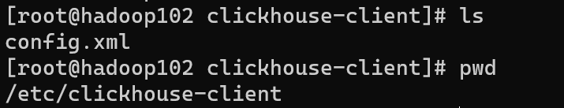

# 单机安装

1. 关闭防火墙

2. centos取消打开文件限制数量

   - 在 `/etc/security/limits.conf `和`/etc/security/limits.d/20-nproc.conf` 文件的末尾加入以下内容

     ~~~shell
     * soft nofile 65536
     * hard nofile 65536
     * soft nproc 131072
     * hard nproc 131072
     ~~~

3. 安装依赖

   ~~~shell
   sudo yum install -y libtool
   ~~~

4. centos 关闭selinux

   - 临时关闭使用`setenforce 0`, 不用重启
   - 永久关闭, 修改`/etc/selinux/config` 中的 `SELINUX=disabled`  

5. 在https://repo.clickhouse.tech/rpm/stable/x86_64/下载rpm包

   

   或者直接使用如下的命令

   ~~~shell
   wget https://packages.clickhouse.com/rpm/stable/clickhouse-common-static-dbg-25.9.7.56.x86_64.rpm
   wget https://packages.clickhouse.com/rpm/stable/clickhouse-client-25.9.7.56.x86_64.rpm
   wget https://packages.clickhouse.com/rpm/stable/clickhouse-server-25.9.7.56.x86_64.rpm
   wget https://packages.clickhouse.com/rpm/stable/clickhouse-common-static-25.9.7.56.x86_64.rpm
   ~~~

   

6. 通过rmp安装ck

   ~~~shell
   sudo rpm -ivh *.rpm
   ~~~

   安装过程中会提示输入默认用户`default`的密码, 如果不需要密码可以直接回车

   

   之后你也可以在`/etc/clickhouse-server/users.xml`修改这个`default`用户的密码

7. 安装完成后, ck相关命令在分别在`/usr/bin/`下

   

   创建过程中将会创建一个clickhouse用户和clickhouse组

   

   ck的其他文件如下

   

8. 修改配置文件, 使得其他机器可以访问ck

   ~~~shell
   sudo vim /etc/clickhouse-server/config.xml
   ~~~

   把 <listen_host>::</listen_host> 的注释打开

   

9. 在`/etc/clickhouse-server/config.xml`中修改ck的tcp端口, 默认为9000, 容易冲突

   ~~~xml
   <tcp_port>9000</tcp_port>
   ~~~

10. 在`/etc/clickhouse-server/config.xml`可以修改ck日志打印相关配置

    

    

11. 关闭ck的开机自启, 因为是测试使用

    ~~~shell
    sudo systemctl disable clickhouse-server
    sudo systemctl start clickhouse-server
    ~~~

12. ck server启停命令

    ~~~shell
    systemctl start clickhouse-server
    clickhouse start
    clickhouse restart
    
    systemctl stop clickhouse-server
    clickhouse stop
    
    systemctl status clickhouse-server
    clickhouse status
    ~~~

13. 启动ck client

    ~~~shell
    # -m 交互式终端使用分号表示sql语句的结尾, 而不是回车
    # --query 'sql' 跟hive -e一样, 直接执行后面的sql, 而不是开启交互式终端
    # --password 指定密码, 没有密码的话不用指定password
    # --user指定用户, 如果不指定的话默认使用default用户
    clickhouse-client -m -h localhost --port 9000 --password 111
    ~~~


## clickhouse的相关目录

1. 在你安装完clickhouse之后, 他会将所有的可执行命令放在`/usr/bin`目录下面, 这样你就可以直接在终端执行命令了

   

2. 所有的clickhouse-server的配置文件都保存在`/etc/clickhouse-server`下

   

3. 所有的clickhouse-client的配置文件都保存在`/etc/clickhouse-client`

   


## clickhouse的数据目录

所有的clickhouse-server的数据文件都保存在`/var/lib/clickhouse`


- uuid中保存的是表名/库名到uuid的映射

  在clickhouse中, 每个表和数据库都有一个uuid,  ck在使用的时候实际上是使用的这个uuid, 而不是表名/库名, 所以你如果修改名字的话, 实际上是非常快的, 不需要改全部的东西, 只需要修改uuid这个文件即可

- metadata_dropped中保存的是已经删除的表的相关sql文件


`/var/lib/clickhouse`中的metdata, data, store需要详细讲一下, 我们先试用如下的sql来创建一个案例

~~~sql
create database log_db;
use log_db;
CREATE TABLE log_db.log_with_partition_index
(
    ts          DateTime,
    service     String,
    level       LowCardinality(String),
    duration_ms UInt32,
    trace_id    String,

    -- 二级跳数索引
    INDEX idx_level level TYPE set(0) GRANULARITY 4,
    INDEX idx_duration duration_ms TYPE minmax GRANULARITY 1
)
ENGINE = MergeTree
PARTITION BY toYYYYMMDD(ts)
ORDER BY (service, ts)
SETTINGS index_granularity = 8192;

INSERT INTO log_db.log_with_partition_index VALUES
('2026-01-25 10:00:00', 'order', 'INFO', 120, 't1'),
('2026-01-25 10:01:00', 'order', 'ERROR', 500, 't2'),
('2026-01-25 11:00:00', 'pay',   'INFO', 80,  't3'),

('2026-01-26 09:00:00', 'order', 'INFO', 200, 't4'),
('2026-01-26 09:01:00', 'pay',   'ERROR', 900, 't5'),
('2026-01-26 10:00:00', 'pay',   'INFO', 100, 't6');
~~~

之后我们来查看`/var/lib/clickhouse`中的目录

~~~shell
[root@cdh clickhouse]# ls
access  flags           metadata          preprocessed_configs  store  user_files
data    format_schemas  metadata_dropped  status                tmp    uuid
~~~


### metadata

`metadata`保存的是clickhouse中的元数据, 我们来看看他的结构

~~~shell
[root@cdh clickhouse]# tree metadata
metadata
|-- default.sql
|-- information_schema.sql
|-- INFORMATION_SCHEMA.sql
|-- log_db -> ../store/c4f/c4f038fd-117b-48f7-ac0c-3cc116073956
|-- log_db.sql
|-- system -> ../store/2e8/2e8ea662-1cdd-475b-9a01-e4f6ba38f2fd
`-- system.sql
~~~

- `default.sql,information_schema.sql,INFORMATION_SCHEMA.sql,system.sql, log_db.sql `都是数据库的ddl语句, 用于保存数据库的元数据

  ~~~shell
  [root@cdh clickhouse]# cat metadata/log_db.sql 
  ATTACH DATABASE _ UUID 'c4f038fd-117b-48f7-ac0c-3cc116073956'
  ENGINE = Atomic
  ~~~

  从上面我们可以看到, `log_db`数据库的uuid就是`c4f038fd-117b-48f7-ac0c-3cc116073956`

- `log_db, system`中保存的都是对应数据库中的表的ddl, 他们通过软链接链接到`/var/lib/clickhouse/store`下面

  比如`log_db`目录会软连接到`../store/c4f/c4f038fd-117b-48f7-ac0c-3cc116073956`, 其中`c4f038fd-117b-48f7-ac0c-3cc116073956`就是数据库的uuid, 这个我们可以通过`log_db.sql`中看出来, 然后`c4f`其实就是uuid的前三位

  我们再来看下`log_db`中的文件

  ~~~shell
  [root@cdh clickhouse]# tree metadata/log_db
  metadata/log_db
  `-- log_with_partition_index.sql
  ~~~

  上面的`log_with_partition_index.sql`就是表对应的ddl

  ~~~shell
  [root@cdh clickhouse]# cat metadata/log_db/log_with_partition_index.sql 
  ATTACH TABLE _ UUID '684ec291-3536-4f23-9116-7bc4943a29bb'
  (
      `ts` DateTime,
      `service` String,
      `level` LowCardinality(String),
      `duration_ms` UInt32,
      `trace_id` String,
      INDEX idx_level level TYPE set(0) GRANULARITY 4,
      INDEX idx_duration duration_ms TYPE minmax GRANULARITY 1
  )
  ENGINE = MergeTree
  PARTITION BY toYYYYMMDD(ts)
  ORDER BY (service, ts)
  SETTINGS index_granularity = 8192
  ~~~
  
  


### data

我们再让看看data目录, 其实这个目录保存的是真正的数据的目录

~~~shell
[root@cdh clickhouse]# tree data
data
|-- log_db
|   `-- log_with_partition_index -> ../../store/684/684ec291-3536-4f23-9116-7bc4943a29bb
`-- system
    |-- asynchronous_metric_log -> ../../store/479/47938e11-c3ab-49cd-b271-c3408a5cd661
    |-- error_log -> ../../store/43f/43f552c9-a20a-4d66-805d-d89fefb30276
    |-- metric_log -> ../../store/dcb/dcbbf379-7002-4d8b-b6ed-678d7741f27f
    |-- part_log -> ../../store/483/483bab45-3dfb-4405-9dea-2cc92530c0ef
    |-- processors_profile_log -> ../../store/933/933d057e-80c4-49f9-ae25-bebba588e3ff
    |-- query_log -> ../../store/f70/f7038f13-3755-4fff-9e8a-2ed5dad82c98
    |-- text_log -> ../../store/06d/06d3170b-fdf2-42e0-b6ad-bb21f1dc8548
    `-- trace_log -> ../../store/8c6/8c6c314e-6fbe-4c1b-8ce7-531e37c39d82
~~~

上面的`log_db, system`就是对应的数据库名, 然后`log_with_partition_index`就是对应的表名, 他们又是通过软链接链接到`store`目录下面的

`store/684/684ec291-3536-4f23-9116-7bc4943a29bb`这里的`684ec291-3536-4f23-9116-7bc4943a29bb`其实就表的uuid, 然后`648`是uuid的前三位, 这个我们可以通过上面的`metadata/log_db/log_with_partition_index.sql `已经查看过了


### store

最后再让看看store目录, 因为store目录太深了, 这里只列出了两种种类的目录

~~~shell
[root@cdh clickhouse]# tree store/c4f/c4f038fd-117b-48f7-ac0c-3cc116073956/  store/684/684ec291-3536-4f23-9116-7bc4943a29bb/
store/c4f/c4f038fd-117b-48f7-ac0c-3cc116073956/
`-- log_with_partition_index.sql
store/684/684ec291-3536-4f23-9116-7bc4943a29bb/
|-- 20260125_1_1_0
|   |-- checksums.txt
|   |-- columns_substreams.txt
|   |-- columns.txt
|   |-- count.txt
|   |-- data.bin
|   |-- data.cmrk4
|   |-- default_compression_codec.txt
|   |-- metadata_version.txt
|   |-- minmax_ts.idx
|   |-- partition.dat
|   |-- primary.cidx
|   |-- serialization.json
|   |-- skp_idx_idx_duration.cmrk4
|   |-- skp_idx_idx_duration.idx2
|   |-- skp_idx_idx_level.cmrk4
|   `-- skp_idx_idx_level.idx
|-- 20260126_2_2_0
|   |-- checksums.txt
|   |-- columns_substreams.txt
|   |-- columns.txt
|   |-- count.txt
|   |-- data.bin
|   |-- data.cmrk4
|   |-- default_compression_codec.txt
|   |-- metadata_version.txt
|   |-- minmax_ts.idx
|   |-- partition.dat
|   |-- primary.cidx
|   |-- serialization.json
|   |-- skp_idx_idx_duration.cmrk4
|   |-- skp_idx_idx_duration.idx2
|   |-- skp_idx_idx_level.cmrk4
|   `-- skp_idx_idx_level.idx
|-- detached
`-- format_version.txt
~~~

- 首先就是`store/c4f/c4f038fd-117b-48f7-ac0c-3cc116073956/`, 他里面保存的是`log_test`数据库中的表的sql

  ~~~shell
  store/c4f/c4f038fd-117b-48f7-ac0c-3cc116073956/
  `-- log_with_partition_index.sql
  ~~~

- 然后是`store/684/684ec291-3536-4f23-9116-7bc4943a29bb/`, 他里面保存的是`log_with_partition_index`这个表的原始数据

  我们实现来看第一层级目录

  ~~~shell
  |-- 20260126_2_2_0
  |-- 20260126_2_2_0
  |-- detached
  `-- format_version.txt
  ~~~

  - `20260126_2_2_0,20260126_2_2_0`这两个是是分区值, 里面保存的是对应分区的数据

    其中的`20260126_2_2_0`分别是

    - PartitionId: 当前分区的分区id
    - 如果当前没有指定分区key, 那么会默认生成一个目录名为all的分区, 所有数据存放在这个目录下面
      - 如果分区列为整型, 那么就直接使用他本来的值作为分区id
      - 如果为日期类型, 那么就是日期的字符串作为分区id
      - 如果是其他的类型, 比如String, Float那么就使用他的128位hash值来作为分区id

    - MinBlockNum: 当前分区中的最小分区编号, 自增类型, 从1开始向上递增, 每产生一个新的分区目录就向上递增一个数字
  - MaxBlockNum: 当前分区中的最大分区编号, 新创建的分区MinBlockNum等于MaxBlockNum的编号
    
  - MergeLevel: 当前分区的合并等级, 分区每次合并都会加1, 合并次数越多, 当前分区中的数据量就越大
  
- `detached`目录中保存是已经卸载的分区目录, 这些目录表示的分区已经被卸载了, 不再参与查询, merge, ttl, replica同步, 但是又希望分区数据完整保存, 不进行删除, 随时可以恢复
  
  你可以将一个分区目录手动detach, 使用的如下的sql
  
    ~~~shell
  ALTER TABLE log_db.log_with_partition_index DETACH PART '20260126_2_2_0';
    ~~~
  
    这会将`20260126_2_2_0`这个分区目录卸载掉, 之后你可以通过如下的sql将分区目录重新加载回来
  
  ~~~sql
    ALTER TABLE log_db.log ATTACH PART '20260126_2_2_0';
  ~~~
  
- `format_version.txt`文件中保存的是分区目录的结构版本, 他的内容一般就是1或者2
  
  可以理解为
  
  | 值   | 含义（概念）             |
  | ---- | ------------------------ |
  | 1    | 初代 Atomic 表目录       |
  | 2    | 支持新版 part / txn 机制 |
  
  
  
  之后我们再来看看分区目录中有什么内容
  
  数据是按照分区存放的, 每个分区中都有如下的文件
  
  ~~~shell
  |-- 20260126_2_2_0 # 对应的分区值
  |   |-- checksums.txt 
  |   |-- columns_substreams.txt 
  |   |-- columns.txt
  |   |-- count.txt
  |   |-- data.bin
|   |-- data.cmrk4
  |   |-- default_compression_codec.txt
|   |-- metadata_version.txt
  |   |-- minmax_ts.idx
|   |-- partition.dat
  |   |-- primary.cidx
|   |-- serialization.json
  |   |-- skp_idx_idx_duration.cmrk4
  |   |-- skp_idx_idx_duration.idx2
  |   |-- skp_idx_idx_level.cmrk4
  |   `-- skp_idx_idx_level.idx
  ~~~
  
  - `checksums.txt`文件里面保存了当前分区中所有其他文件的checksums, 大小, 用于一致性校验
  
  - `columns.txt`中保存的是列的名字和类型
  
    ~~~shell
  [root@cdh 20260125_1_1_0]# cat columns.txt 
    columns format version: 1
    5 columns:
    `ts` DateTime
    `service` String
    `level` LowCardinality(String)
    `duration_ms` UInt32
    `trace_id` String
    ~~~
    
  - `columns_substreams.txt`中保存每一列的信息
  
    ~~~shell
    [root@cdh 20260125_1_1_0]# cat columns_substreams.txt 
    columns substreams version: 1
    5 columns: # 说明有5个列
    1 substreams for column `ts`:
            ts # 字段ts生产了一个单独的列
    1 substreams for column `service`:
            service
    3 substreams for column `level`: # 字段level生成了3个列
            level.dict_prefix  # 这是字典值的前缀, 用于加速字典值的查询的
            level.dict # 这个列保存的是level对应的字段值, INFO, ERROR这些, 常驻内存
            level  # 这个列保存的是level实际存储的值, 是字典值对应的数字
    1 substreams for column `duration_ms`:
            duration_ms
    1 substreams for column `trace_id`:
            trace_id
    ~~~
  
  - `count.txt`中保持的是当前这个分区的行数
  
    ~~~shell
    [root@cdh 20260125_1_1_0]# cat count.txt
    3
    ~~~
  
  - `metadata_version.txt`中保存的是一个版本信息, 不知道干嘛的
  
    ~~~shell
    [root@cdh 20260125_1_1_0]# cat metadata_version.txt 
    0
    ~~~
  
  - `default_compression_codec.txt`中保存的是当前分区的列的数据文件`data.bin`使用的压缩算法
  
    LZ4的特点是压缩和解压速度非常快, cpu占用低, 但是压缩率一般
  
    ~~~shell
    [root@cdh 20260125_1_1_0]# cat default_compression_codec.txt
    CODEC(LZ4)
    ~~~
  
  - `serialization.json`中保持的是每一列数据的序列化方式
  
    ~~~shell
    [root@cdh 20260125_1_1_0]# cat serialization.json
    {"columns":[{"kind":"Default","name":"duration_ms","num_defaults":0,"num_rows":3},{"kind":"Default","name":"service","num_defaults":0,"num_rows":3},{"kind":"Default","name":"trace_id","num_defaults":0,"num_rows":3},{"kind":"Default","name":"ts","num_defaults":0,"num_rows":3}],"version":0}
    ~~~
  
    `kind:Default`表示是当前数据类型默认的序列号方式
  
  - `partition.dat`中保持的是当前分区值的hash
  
    ~~~shell
    [root@cdh 20260125_1_1_0]# cat partition.dat 
    %5
    ~~~
  
  - `minmax_ts.idx`记录了当前分区中分区key的最大最小值
  
  - `primary.cidx`是一个主键索引文件
  
  - `data.bin`中保持的是具体的数据, 按列存储, 按 granule（默认 8192 行）切分, 
  
    每列的数据可能经过 **列级压缩**（如你看到的 `default_compression_codec.txt → LZ4`）
  
    不同列的 substream 数据在 `data.bin` 中顺序写入，解压时按 `columns_substreams.txt` 和 `serialization.json` 解析
  
  - `data.cmrk4`是主键索引在data.bin文件中的变异量, 这样如果在主键的稀疏索引中找到了另一个合适的范围, 那么就可以使用这个文件来快速定位data.bin中的数据
  
  - `skp_idx_idx_duration.cmrk4`和`skp_idx_idx_duration.idx2`
  
    // todo
  
  - `skp_idx_idx_level.cmrk4`和`skp_idx_idx_level.idx`
  
    // todo


# 多节点集群安装

1. 首先在三个节点上面都按照上面的步骤进行单机安装

2. 启动Zookeeper

3. 在clickhouse的配置文件指定zk的地址, 有两种方式

   1. 在`/etc/clickhouse-server/config.xml`中指定zk的地址

      先在`config.xml`中搜索zookeeper字段, 然后找到该位置, 添加如下的内容

      ~~~xml
        <zookeeper-servers>
          <node index="1">
            <host>hadoop102</host>
            <port>2181</port>
          </node>
          <node index="2">
            <host>hadoop103</host>
            <port>2181</port>
          </node>
          <node index="3">
            <host>hadoop104</host>
            <port>2181</port>
          </node>
        </zookeeper-servers>
      ~~~

      

   2. 在`/etc/clickhouse-server/config.d` 目录下创建一个名为 `metrika.xml`的配置文件,内容如下：  

      ~~~xml
      <?xml version="1.0"?>
      <yandex>
        <zookeeper-servers>
          <node index="1">
            <host>hadoop102</host>
            <port>2181</port>
          </node>
          <node index="2">
            <host>hadoop103</host>
            <port>2181</port>
          </node>
          <node index="3">
            <host>hadoop104</host>
            <port>2181</port>
          </node>
        </zookeeper-servers>
      </yandex>
      ~~~

      修改文件的所有者和所属组

      ~~~shell
      chowm clickhouse:clickhouse /etc/clickhouse-server/config.d/metrika.xml
      ~~~

      在`/etc/clickhouse-server/config.xml`中导入这个配置文件, 搜索include_from字样, 找到位置, 然后添加如下的内容

      ~~~xml
      <zookeeper incl="zookeeper-servers" optional="true" />
      <include_from>/etc/clickhouse-server/config.d/metrika.xml</include_from>
      ~~~
   
4. 同步所有文件到其他的节点

5. 在所有节点上面重启clickhouse服务

   ~~~shell
   clickhouse restart
   ~~~

# 数据库引擎

在clickhouse中, 创建数据库的时候可以指定多种数据库引擎, 每种数据库引擎都有不一样的功能, 你可以通过如下sql来查看数据库使用的引擎

~~~sql
SHOW CREATE DATABASE demo;
~~~

他会显示建表语句中的数据库引擎的类型


## Atomic

开源版本的clickhouse默认使用的数据库引擎, sql语句如下

~~~sql
CREATE DATABASE test 
[ENGINE = Atomic] 
[SETTINGS disk=...];
~~~


atomic就是原子的意思, 表示他可以原子性的修改表的元数据, 比如drop table, rename table, alter table等等, 而不会出现中间状态, 因为在atomic数据库中

- 所有的元数据和数据都是保存到本地的`/var/lib/clickhouse/metadata`和`/var/lib/clickhouse/store`中, **所以一般都是单机版本的clickhouse使用这种数据库类型**

- clickhouse会自动为每个表生成一个uuid, 当然你也可以自己指定, 但是不建议这么做

  ~~~shell
  CREATE TABLE name UUID '28f1c61c-2970-457a-bffe-454156ddcfef' (
  n UInt64
  ) ENGINE = ...;
  ~~~

- 表的数据会保持到`/var/lib/clickhouse/store/xxx/xxxyyyyy-yyyy-yyyy-yyyy-yyyyyyyyyyyy/`, 其中xxx是uuid的前缀, 你可以通过如下的sql语句来查询表的uuid

  ~~~sql
  SELECT
      database,
      name,
      uuid
  FROM system.tables
  WHERE database = 'demo_atomic'
    AND name = 'events';
    
     ┌─database────┬─name───┬─uuid─────────────────────────────────┐
  1. │ demo_atomic │ events │ ba8c8dff-31c0-4cb4-a408-f051a7b82a31 │
     └─────────────┴────────┴──────────────────────────────────────┘
  ~~~

- 对于drop table, 不会立刻删除数据, 只是将表的元数据移动到了``/var/lib/clickhouse/metadata_dropped`, 并将这个表标记为删除, 之后再对表数据进行删除

- 你可以直接在建表语句的settings字段中指定disk, 表示存储表元数据目录

  ~~~sql
  CREATE TABLE db (n UInt64) ENGINE = Atomic SETTINGS disk=disk(type='local', path='/var/lib/clickhouse-disks/db_disk');
  ~~~

  如果没有指定的话, 那么默认会使用`database_disk.disk`中指定的磁盘

  你可以通过如下的sql来查看一个atomic数据库的表在本地的存放位置

  ~~~sql
  SELECT
      database,
      name,
      uuid,
      data_paths
  FROM system.tables
  WHERE database = 'demo_atomic'
    AND name = 'events';
     ┌─database────┬─name───┬─uuid─────────────────────────────────┬─data_paths──────────────────────────────────────────────────────────────┐
  1. │ demo_atomic │ events │ ba8c8dff-31c0-4cb4-a408-f051a7b82a31 │ ['/var/lib/clickhouse/store/ba8/ba8c8dff-31c0-4cb4-a408-f051a7b82a31/'] │
     └─────────────┴────────┴──────────────────────────────────────┴─────────────────────────────────────────────────────────────────────────┘
  ~~~

  

## Shared

Shared和Atomic类似, 能够支持元数据的原子更新, 每个表都有uuid, 数据都保在在`/var/lib/clickhouse/store/xxx/xxxyyyyy-yyyy-yyyy-yyyy-yyyyyyyyyyyy/`中

但是不同的点在于Shared数据库的元数据都保存在keeper中, 而不会保存在本地的`/var/lib/metadata/`中, 所以这种数据库引擎一般都是在clickhouse集群中使用, 多个实例共享元数据, 但是需要注意的是, 数据还是保存在本地的

要想使用Shared数据库引擎, 你必须:

- 运行Clickhouse Keeper 或者zookeeper
- 在`/etc/clickhouse-server/config.xml`中配置了keeper的地址
- 所有clickhouse的实力连接的同一个keeper

之后你就可以使用如下的sql来建立一个Shared数据库

~~~sql
CREATE DATABASE demo_shared
ENGINE = Shared;

-- 验证数据库类型
SHOW CREATE DATABASE demo_shared;
~~~


## Lazy

这种数据库引擎很少用, 他的核心目标只有一个: 减少内存占用

当你第一次使用这个表的时候,  clickhouse会磁盘中加载表结构和表的数据, 所以在第一次访问的时候会特别的慢

如果你在指定的时间之后不再访问这个表, 那么他又会将内存中的元数据和表数据卸载掉, 下次使用的时候重新加载

同时Lazy数据库引擎也没有DDL的原子性, 并且他只能和*Log模型的表一起使用

你在绝大部分场景中都不应该使用这种数据库引擎, 而是应该使用Atomic数据库引擎, 他只适合那些好久才使用一次的表

~~~sql
CREATE DATABASE testlazy 
ENGINE = Lazy(expiration_time_in_seconds); -- 指定多久之后卸载表
~~~


## Replicated

// todo


## PostgreSQL

用于将一整个Postgres数据库映射到ck中。**支持在ck中对pg进行select, insert(不支持update, delete)**，以便在 ClickHouse 和 PostgreSQL 之间交换数据。


他的使用场景是:

1. 维度表
2. 配置表
3. Lookup
4. 查询范围小, 条件过滤强的sql

千万不要在ck中进行大数据量的查询pg


你可以通过如下的sql来创建一个PostgresSQL

~~~sql
CREATE DATABASE test_database
ENGINE = PostgreSQL(
    'host:port', 'database', 'user', 'password'[, `schema`, `use_table_cache`]);
~~~

- use_table_cache表示是否缓存pg的表结构到ck中, 默认值为0, 表示实时查询pg的表结构, 如果设置为1, 那么将会缓存pg的表结构, 在使用的时候不再实时查询

- 如果pg中的表结构变更了, 那么你也可以使用`detach`和`attach`查询进行更新

你可以通过 `SHOW TABLES` 和 `DESCRIBE TABLE` 实时访问远程 PostgreSQL 中的表列表和表结构。


使用这种数据库引擎的时候, 会将pg表中的字段类型映射为ck的字段类型

| PostgreSQL       | ClickHouse                                                   |
| ---------------- | ------------------------------------------------------------ |
| DATE             | [Date](https://clickhouse.com/docs/sql-reference/data-types/date) |
| TIMESTAMP        | [DateTime](https://clickhouse.com/docs/sql-reference/data-types/datetime) |
| REAL             | [Float32](https://clickhouse.com/docs/sql-reference/data-types/float) |
| DOUBLE           | [Float64](https://clickhouse.com/docs/sql-reference/data-types/float) |
| DECIMAL, NUMERIC | [Decimal](https://clickhouse.com/docs/sql-reference/data-types/decimal) |
| SMALLINT         | [Int16](https://clickhouse.com/docs/sql-reference/data-types/int-uint) |
| INTEGER          | [Int32](https://clickhouse.com/docs/sql-reference/data-types/int-uint) |
| BIGINT           | [Int64](https://clickhouse.com/docs/sql-reference/data-types/int-uint) |
| SERIAL           | [UInt32](https://clickhouse.com/docs/sql-reference/data-types/int-uint) |
| BIGSERIAL        | [UInt64](https://clickhouse.com/docs/sql-reference/data-types/int-uint) |
| TEXT, CHAR       | [String](https://clickhouse.com/docs/sql-reference/data-types/string) |
| INTEGER          | Nullable([Int32](https://clickhouse.com/docs/sql-reference/data-types/int-uint)) |
| ARRAY            | [Array](https://clickhouse.com/docs/sql-reference/data-types/array) |


### 使用案例

1. 在ck中映射pg数据库

   ~~~sql
   CREATE DATABASE test_database
   ENGINE = PostgreSQL('postgres1:5432', 'test_database', 'postgres', 'mysecretpassword', 'schema_name',1);
   
   SHOW DATABASES;
   ┌─name──────────┐
   │ default       │
   │ test_database │
   │ system        │
   └───────────────┘
   ~~~

2. 在ck中查询表结构和数据

   ~~~sql
   SHOW TABLES FROM test_database;
   ┌─name───────┐
   │ test_table │
   └────────────┘
   
   DESCRIBE TABLE test_database.test_table;
   ┌─name───┬─type──────────────┐
   │ id     │ Nullable(Integer) │
   │ value  │ Nullable(Integer) │
   └────────┴───────────────────┘
   
   SELECT * FROM test_database.test_table;
   ┌─id─┬─value─┐
   │  1 │     2 │
   └────┴───────┘
   ~~~

3. 通过ck插入数据到pg中

   ~~~sql
   INSERT INTO test_database.test_table VALUES (3,4);
   SELECT * FROM test_database.test_table;
   ┌─int_id─┬─value─┐
   │      1 │     2 │
   │      3 │     4 │
   └────────┴───────┘
   ~~~

4. 通过pg修改表结构, 因为`use_table_cache`设置为了1, 所以会缓存元数据, 如果元数据变更了, 需要手动同步

   ~~~sql
   -- 修改pg中的表结构
   postgre> ALTER TABLE test_table ADD COLUMN data Text
   
   -- ck中查看表结构, 未发生变化
   ┌─name───┬─type──────────────┐
   │ id     │ Nullable(Integer) │
   │ value  │ Nullable(Integer) │
   └────────┴───────────────────┘
   
   -- 手动同步表结构, 二选一即可
   DETACH TABLE test_database.test_table;
   ATTACH TABLE test_database.test_table;
   
   -- 重新查询
   DESCRIBE TABLE test_database.test_table;
   ┌─name───┬─type──────────────┐
   │ id     │ Nullable(Integer) │
   │ value  │ Nullable(Integer) │
   │ data   │ Nullable(String)  │
   └────────┴───────────────────┘
   ~~~


## MySQL

和Postgres数据库引擎一样, 用于将mysql中的整个数据库映射到ck中, **支持在ck中对mysql进行select, insert(不支持update, delete)**

~~~sql
CREATE DATABASE [IF NOT EXISTS] db_name [ON CLUSTER cluster]
ENGINE = MySQL('host:port', 'database' , 'user', 'password')
~~~


ck会将mysql中的数据类型转换为对应的ck数据类型, 如下是映射关系

| MySQL                            | ClickHouse                                                   |
| -------------------------------- | ------------------------------------------------------------ |
| UNSIGNED TINYINT                 | [UInt8](https://clickhouse.com/docs/sql-reference/data-types/int-uint) |
| TINYINT                          | [Int8](https://clickhouse.com/docs/sql-reference/data-types/int-uint) |
| UNSIGNED SMALLINT                | [UInt16](https://clickhouse.com/docs/sql-reference/data-types/int-uint) |
| SMALLINT                         | [Int16](https://clickhouse.com/docs/sql-reference/data-types/int-uint) |
| UNSIGNED INT, UNSIGNED MEDIUMINT | [UInt32](https://clickhouse.com/docs/sql-reference/data-types/int-uint) |
| INT, MEDIUMINT                   | [Int32](https://clickhouse.com/docs/sql-reference/data-types/int-uint) |
| UNSIGNED BIGINT                  | [UInt64](https://clickhouse.com/docs/sql-reference/data-types/int-uint) |
| BIGINT                           | [Int64](https://clickhouse.com/docs/sql-reference/data-types/int-uint) |
| FLOAT                            | [Float32](https://clickhouse.com/docs/sql-reference/data-types/float) |
| DOUBLE                           | [Float64](https://clickhouse.com/docs/sql-reference/data-types/float) |
| DATE                             | [Date](https://clickhouse.com/docs/sql-reference/data-types/date) |
| DATETIME, TIMESTAMP              | [DateTime](https://clickhouse.com/docs/sql-reference/data-types/datetime) |
| BINARY                           | [FixedString](https://clickhouse.com/docs/sql-reference/data-types/fixedstring) |

其他所有类型的字段, 都映射为ck中的String类型


### 使用案例

1. 在mysql中建表

   ~~~sql
   mysql> USE test;
   Database changed
   
   mysql> CREATE TABLE `mysql_table` (
       ->   `int_id` INT NOT NULL AUTO_INCREMENT,
       ->   `float` FLOAT NOT NULL,
       ->   PRIMARY KEY (`int_id`));
   Query OK, 0 rows affected (0,09 sec)
   
   mysql> insert into mysql_table (`int_id`, `float`) VALUES (1,2);
   Query OK, 1 row affected (0,00 sec)
   
   mysql> select * from mysql_table;
   +------+-----+
   | int_id | value |
   +------+-----+
   |      1 |     2 |
   +------+-----+
   1 row in set (0,00 sec)
   ~~~

2. 在ck中操作mysql

   ~~~sql
   CREATE DATABASE mysql_db ENGINE = MySQL('localhost:3306', 'test', 'my_user', 'user_password') SETTINGS read_write_timeout=10000, connect_timeout=100;
   
   SHOW DATABASES
   ┌─name─────┐
   │ default  │
   │ mysql_db │
   │ system   │
   └──────────┘
   
   SHOW TABLES FROM mysql_db
   ┌─name─────────┐
   │  mysql_table │
   └──────────────┘
   
   SELECT * FROM mysql_db.mysql_table
   ┌─int_id─┬─value─┐
   │      1 │     2 │
   └────────┴───────┘
   
   INSERT INTO mysql_db.mysql_table VALUES (3,4)
   SELECT * FROM mysql_db.mysql_table
   ┌─int_id─┬─value─┐
   │      1 │     2 │
   │      3 │     4 │
   └────────┴───────┘
   ~~~

   

## SQLite

和PostgreSQL一样, 用于将一整个sqlite数据库映射到ck中

~~~sql
    CREATE DATABASE sqlite_database
    ENGINE = SQLite('db_path') -- 指定sqlite的文件路径
~~~

ck会将sqlite中的数据类型映射为ck中的数据类型, 映射关系如下

| SQLite  | ClickHouse                                                   |
| ------- | ------------------------------------------------------------ |
| INTEGER | [Int32](https://clickhouse.com/docs/sql-reference/data-types/int-uint) |
| REAL    | [Float32](https://clickhouse.com/docs/sql-reference/data-types/float) |
| TEXT    | [String](https://clickhouse.com/docs/sql-reference/data-types/string) |
| BLOB    | [String](https://clickhouse.com/docs/sql-reference/data-types/string) |


### 使用案例

1. 在ck中创建sqlite的映射

   ~~~sql
   CREATE DATABASE sqlite_db ENGINE = SQLite('sqlite.db');
   ~~~

2. 查询数据

   ~~~sql
   SHOW TABLES FROM sqlite_db;
   ┌──name───┐
   │ table1  │
   │ table2  │
   └─────────┘
   
   SELECT * FROM sqlite_db.table1;
   ┌─col1──┬─col2─┐
   │ line1 │    1 │
   │ line2 │    2 │
   │ line3 │    3 │
   └───────┴──────┘
   ~~~

3. 将ck中的数据插入到sqlite中

   ~~~sql
   CREATE TABLE clickhouse_table(
       `col1` String,
       `col2` Int16
   ) ENGINE = MergeTree() ORDER BY col2;
   
   INSERT INTO clickhouse_table VALUES ('text',10);
   
   INSERT INTO sqlite_db.table1 SELECT * FROM clickhouse_table;
   
   SELECT * FROM sqlite_db.table1;
   ┌─col1──┬─col2─┐
   │ line1 │    1 │
   │ line2 │    2 │
   │ line3 │    3 │
   │ text  │   10 │
   └───────┴──────┘
   ~~~

   

## Backup

在ck中, 运行你通过backup和restore命令来备份恢复数据库和表, backup会为数据库创建一个备份

当然你可以将这个备份创建为一个数据库, 然后对这个数据库进行查询

想要具体了解可以查看

https://clickhouse.com/docs/engines/database-engines/backup

https://clickhouse.com/docs/operations/backup/disk


## MaterializedPostgreSQL

使用这种数据库引擎, 在创建数据库的时候必须指定要同步的pg的表, 之后ck会开始全量同步这些表中的数据到ck中, 之后从pg 的wal中拉取后续的更新到ck中, 进行增量同步


你可以通过如下的sql来创建数据库

~~~sql
CREATE DATABASE [IF NOT EXISTS] db_name [ON CLUSTER cluster]
ENGINE = MaterializedPostgreSQL(
    'host:port', 'database', 'user', 'password'
) 
[SETTINGS ...]
~~~

根据settings他有三种模式

1. 一个 `MaterializedPostgreSQL` 引擎数据库, 同步pg中的一整个schema中的所有的表

   ~~~sql
   CREATE DATABASE postgres_database
   ENGINE = MaterializedPostgreSQL(
       'postgres1:5432', 'postgres_database', 'postgres_user', 'postgres_password'
   )
   SETTINGS 
   -- 指定同步的schema, 会自动同步所有的表
   materialized_postgresql_schema = 'postgres_schema';
   
   SELECT * FROM postgres_database.table1;
   ~~~

   之后你可以使用pg中表名在ck中进行查询

   ~~~sql
   SELECT * FROM postgres_database.table1;
   ~~~

2. 一个 `MaterializedPostgreSQL` 引擎数据库, 同步多个schema下的多个表

   ~~~sql
   CREATE DATABASE database1
   ENGINE = MaterializedPostgreSQL(
       'postgres1:5432', 'postgres_database', 'postgres_user', 'postgres_password'
   )
   SETTINGS 
   -- 指定需要同步的表
   materialized_postgresql_tables_list = 'schema1.table1,schema2.table2,schema1.table3',
   materialized_postgresql_tables_list_with_schema = 1;
   ~~~

   之后你需要通过`schema_name.table_name`来访问表

   ~~~sql
   SELECT * FROM database1.`schema1.table1`;
   SELECT * FROM database1.`schema2.table2`;
   ~~~

3. 一个 `MaterializedPostgreSQL` 引擎数据库, 同步pg中的多个schema的所有的表

   ~~~sql
   CREATE DATABASE database1
   ENGINE = MaterializedPostgreSQL(
       'postgres1:5432', 'postgres_database', 'postgres_user', 'postgres_password'
   )
   SETTINGS 
   -- 指定要同步的schema
   materialized_postgresql_schema_list = 'schema1,schema2,schema3';
   ~~~

   之后你可以通过如下的sql来访问这些表

   ~~~sql
   SELECT * FROM database1.`schema1.table1`;
   SELECT * FROM database1.`schema1.table2`;
   SELECT * FROM database1.`schema2.table2`;
   ~~~


在同步的时候, 你也可以同步表中指定的列

~~~sql
REATE DATABASE database1
ENGINE = MaterializedPostgreSQL(
    'postgres1:5432', 'postgres_database', 'postgres_user', 'postgres_password'
)
SETTINGS 
materialized_postgresql_tables_list = 'schema1.table1(co1, col2),schema1.table2,schema1.table3(co3, col5, col7)
~~~


需要注意的是:

1. 这种数据库引擎是实验性质的, 要使用他需要再配置文件中将`allow_experimental_database_materialized_postgresql` 设置为 1，或使用 `SET` 命令：

   ~~~sql
   SET allow_experimental_database_materialized_postgresql=1
   ~~~

2. 如果pg中后续增加了新表, 那么不会自动同步, 需要你手动

   ~~~sql
   -- 手动指定需要同步的新表, 然后ck会开始同步数据到ck中
   ATTACH TABLE postgres_database.new_table;
   ~~~

3. PostgreSQL的复制协议不允许复制表结构的变更, 但是表结构的变更可以被检测到, 所以一到pg中的表结构发生了变更, 比如添加/删除了字段, 那么ck就会停止同步这个表, 你需要使用 `ATTACH` / `DETACH PERMANENTLY` 查询来完全重新加载表。如果 DDL 语句没有破坏复制（例如，重命名列），则表仍会接收更新（插入操作按位置执行）。


使用这种数据库对pg有如下的要求

1. 在 PostgreSQL 配置文件中， [wal_level](https://www.postgresql.org/docs/current/runtime-config-wal.html) 设置的值必须为 `logical` ， `max_replication_slots` 参数的值必须至少为 `2` 。

2. 每个复制的表都必须要下面二者之一

   - 主键

   - 唯一索引, 并且将唯一索引设置为replica Identity

     ~~~sql
     postgres# CREATE TABLE postgres_table (a Integer NOT NULL, b Integer, c Integer NOT NULL, d Integer, e Integer NOT NULL);
     postgres# CREATE unique INDEX postgres_table_index on postgres_table(a, c, e);
     postgres# ALTER TABLE postgres_table REPLICA IDENTITY USING INDEX postgres_table_index;
     ~~~


## DataLakeCatalog

`DataLakeCatalog` 数据库引擎使您能够将 ClickHouse 连接到外部的catalog，并进行数据查询，而无需重复数据。这使 ClickHouse 转变为一个强大的查询引擎，可与您现有的数据湖基础架构无缝协作。

`DataLakeCatalog` 引擎支持以下catalog：

- **AWS Glue Catalog** -  AWS 环境中的 Iceberg 表
- **Databricks Unity Catalog** - 适用于 Delta Lake 和 Iceberg 表
- **Hive Metastore** - 适用于hive的catalog
- **REST Catalogs** - 任何支持 Iceberg REST 规范的目录


更多细节和使用案例查看https://clickhouse.com/docs/engines/database-engines/datalakecatalog


# 数据类型

每个数据类型都有他们的默认值, 如果你在插入的时候没有指定这些列的值, 那么就是默认值, 比如0, 空字符串, false等等


而对于Nullable类型, 如果没有指定的话, 默认为NULL


## 整型

有符号整型: Int8, Int16, Int32, Int64, Int128, Int256

无符号整型: UInt8, UInt16, UInt32, UInt64, UInt128, UInt256

他们是范围和Java中的范围类型


上述的类型也有他们的别名, 如下面的表格

| Type    | Alias                                                        |
| ------- | ------------------------------------------------------------ |
| `Int8`  | `TINYINT`, `INT1`, `BYTE`, `TINYINT SIGNED`, `INT1 SIGNED`   |
| `Int16` | `SMALLINT`, `SMALLINT SIGNED`                                |
| `Int32` | `INT`, `INTEGER`, `MEDIUMINT`, `MEDIUMINT SIGNED`, `INT SIGNED`, `INTEGER SIGNED` |
| `Int64` | `BIGINT`, `SIGNED`, `BIGINT SIGNED`, `TIME`                  |
| `UInt8`  | `TINYINT UNSIGNED`, `INT1 UNSIGNED`                      |
| `UInt16` | `SMALLINT UNSIGNED`                                      |
| `UInt32` | `MEDIUMINT UNSIGNED`, `INT UNSIGNED`, `INTEGER UNSIGNED` |
| `UInt64` | `UNSIGNED`, `BIGINT UNSIGNED`, `BIT`, `SET`              |

> 使用场景: 个数, 数量, id


## 浮点型

Float32, Float64, 需要注意浮点数在计算的时候有误差

他们的别名如下

| Type      | Alias                        |
| --------- | ---------------------------- |
| `Float32` | `FLOAT`, `REAL`, `SINGLE`    |
| `Float64` | `DOUBLE`, `DOUBLE PRECISION` |


> 使用场景: 一般数据值比较小, 不涉及大量的统计计算, 精度要求不高, 比如商品的重量


## 布尔类型

`bool` 类型在内部存储为 UInt8。可能的值为 `true`(内部存储1) ， `false` (内部存储0)

~~~sql
SELECT true AS col, toTypeName(col);
┌─col──┬─toTypeName(true)─┐
│ true │ Bool             │
└──────┴──────────────────┘

select true == 1 as col, toTypeName(col);
┌─col─┬─toTypeName(equals(true, 1))─┐
│   1 │ UInt8                       │
└─────┴─────────────────────────────┘

-- 在插入的时候, 你也可以直接通过1/0来表示true/false
CREATE TABLE test_bool( `A` Int64, `B` Bool )
ENGINE = Memory;

INSERT INTO test_bool VALUES (1, true),(2,0);
SELECT * FROM test_bool;
┌─A─┬─B─────┐
│ 1 │ true  │
│ 2 │ false │
└───┴───────┘
~~~


## Decimal

- Decimal32(S): 只能保存9位数字, S表示小数的位数

  **比如Decimal32(5)表示小数5位, 整数部分4位, 如果保存的小数位数超过了5位那么会直接截断**

  所以他的取值范围是[-9999.9999, 9999.9999]

- Decimal64(S): 只能保存18位数字, S表示小数位的位数

- Decimal128(S): 只能保存38位数字, S表示小数位的位数

- Decimal128(S): 只能保存76位数字, S表示小数的位数


当然如果你觉得上面的类型太麻烦了, 那么你也可以使用下面两种类型

- Decimal(P, S): 其中P表示能够保存的数字的长度, S表示小数部分的长度, P的取值为[1, 76], S的取值为[0, P]

  比如Decimal(32, 15)就表示保存的数字长度为32位, 小数部分15位, 超过直接截断

  - 如果P是1~9, 那么你实际上就是在使用Decimal32(S)
  - 如果P是10~18, 那么实际上就是使用的Decimal64(S)
  - 如果P是19~38, 那么你实际上就是在使用Decimal128(S)
  - 如果P是39~76, 那么实际上就是使用的Decimal256(S)

- Decimal(P): 等效于Decimal(P, 0), 即没有小数部分

- Decimal: 等效于Decimal(10, 0), 没有小数部分


比如Decimal(10, 4)表示保存10位数字, 其中小数位4位, 整数部分6位

~~~sql
create table decimal_test (
    x Decimal(10, 4)
) engine = TinyLog;

-- 数据被截断
insert into decimal_test values (123456.1234567);

select * from decimal_test;
   ┌───────────x─┐
1. │ 123456.1234 │
   └─────────────┘
~~~


> 使用场景是需要精确计算, 比如金额, 汇率


## 字符串

- String: 字符串可以任务长度, 他可以包含任意的字节集, 包括空字节

- FixedString(N)

  长度固定为N的字符串, N必须是正整数. 

  当插入的数据长度小于N的时候, 会在字符串末尾填充空字节. 

  当插入的数据的长度超过N的时候, 会报错

  > 和String相比, 极少使用FixedString, 即使是固定长度的字段, 比如性别, 名称等等, 考虑到变化性会带来一定的风险且收益不够明显, 所以使用有限


## 枚举类型

Enum8和Enum16

**实际上在Clickhouse中, Enum8和Enum16就是Int8和Int16, 包括数据存储也是使用的他们, Clickhouse会保存Enum到Int的转换, 然后在返回结果的时候进行转换**

~~~sql
create table test_enum (
    x Enum8 ('hello'=1, 'world'=2, 'nihao'=3)
)
engine = TinyLog;

-- 在插入的时候可以直接使用字符串, 或者数字
insert into test_enum values ('hello'), ('world'), (1);

-- 查询
select * from test_enum;
   ┌─x─────┐
1. │ hello │
2. │ world │
3. │ hello │
   └───────┘
   
-- 查询的时候也可以转换为对应的数字
select cast(x, 'Int8') from test_enum
   ┌─CAST(x, 'Int8')─┐
1. │               1 │
2. │               2 │
3. │               1 │
   └─────────────────┘

-- 插入不存在的枚举指会报错
insert into test_enum values ('haha');
Error on processing query: Code: 691. DB::Exception: Unknown element 'haha' for enum
~~~

Enum8和Enum18主要使用在一些状态的字段上面, 算是一种空间优化, 也算是一种数据约束

但是在实际使用过程中往往因为一些**数据内容的变化**而增加一定的维护成本, 所以谨慎使用


## 时间类型

### Date

使用UInt16来存储至1970-01-01天数, 类似'2019-12-16', 范围[1970-01-01, 2149-06-06], 没有时区

~~~sql
CREATE TABLE dt
(
    `timestamp` Date,
    `event_id` UInt8
)
ENGINE = TinyLog;
-- 可以插入字符串或者自1970年的天数
INSERT INTO dt VALUES ('2019-01-01', 1), (17897, 2);

select * from dt;
┌──timestamp─┬─event_id─┐
│ 2019-01-01 │        1 │
│ 2019-01-01 │        2 │
└────────────┴──────────┘
~~~


### Date32

使用Int32来保持自1970-01-01以来的天数, 负数表示1970-01-01以前的时间

时间范围为: [1900-01-01, 2299-12-31]

~~~sql
CREATE TABLE dt32
(
    `timestamp` Date32,
    `event_id` UInt8
)
ENGINE = TinyLog;


INSERT INTO dt32 VALUES ('2100-01-01', 1);

SELECT * FROM dt32;
┌──timestamp─┬─event_id─┐
│ 2100-01-01 │        1 │
└────────────┴──────────┘
~~~


### Time

Time: 只包含时分秒, 没有毫秒, 支持的范围是 [-999:59:59, 999:59:59], 不包含时区

内部使用Int32字节来保存秒数, 因为和DateTime具有相同的字节, 所以性能相当

~~~sql
CREATE TABLE tab
(
    `event_id` UInt8,
    `time` Time
)
ENGINE = TinyLog;

-- 可以插入数字和字符串, 如果是数字的话, 那么是00:00:00的秒数
INSERT INTO tab VALUES (1, '14:30:25'), (2, 52225);

SELECT * FROM tab ORDER BY event_id;
   ┌─event_id─┬──────time─┐
1. │        1 │ 14:30:25 │
2. │        2 │ 14:30:25 │
   └──────────┴───────────┘
~~~


### Time64

带有精度的Time类型, 可以表示微秒, 毫米, 纳秒, 不支持时区

~~~sql
Time64(precision)

Time64(3) -- 精确到毫秒 
Time64(6) -- 精确到微秒 
Time64(9) -- 精确到纳秒 
~~~

支持的范围从[999:59:59.999999999, 999:59:59.999999999], 小数点的位数取决于你设置的精度

他内部使用Decimal来实现

~~~sql
CREATE TABLE tab64
(
    `event_id` UInt8,
    `time` Time64(3)
)
ENGINE = TinyLog;

INSERT INTO tab64 VALUES (1, '14:30:25');

SELECT * FROM tab64 ORDER BY event_id;
   ┌─event_id─┬────────time─┐
1. │        1 │ 14:30:25.000 │
   └──────────┴──────────────┘
~~~

在比较的时候需要手动将字符串转换为Time64

~~~sql
SELECT * FROM tab64 WHERE time = toTime64('14:30:25', 3);
~~~


### DataTime

Datetime: 保存年月日时分秒, 带时区, 时间范围是[1970-01-01 00:00:00, 2106-02-07 06:28:15]

内部使用Int32保存自1970-01-01 00:00:00以来的秒数, unix时间戳

时区信息不保存在数据中, 而是在元数据中, 创建表时，您可以为 `DateTime` 类型列显式设置时区。例如： `DateTime('UTC')` 。如果未设置时区，ClickHouse 将在服务器启动时使用服务器设置或操作系统设置中的[时区](https://clickhouse.com/docs/operations/server-configuration-parameters/settings#timezone)参数值。


`Date` 类型需要 2 个字节的存储空间，而 `DateTime` 需要 4 个字节。然而，在压缩过程中，Date 和 DateTime 之间的大小差异会变得更加显著。这种差异的放大是由于 `DateTime` 中的分钟和秒更难压缩。此外，对 `Date` 进行筛选和聚合也比对 `DateTime` 更快。


~~~sql
CREATE TABLE dt
(
    `timestamp` DateTime('Asia/Istanbul'),
    `event_id` UInt8
)
ENGINE = TinyLog;

-- 可以插入字符串, 或者数字, 如果是数字表示自1970年以来的秒数
-- 需要注意的是, 如果你插入的是字符串, 那么他表示的就是当前列的时区的时间
-- 如果插入的是数字, 那么表示的是UTC时区的自1970年以来的秒数
INSERT INTO dt VALUES ('2019-01-01 00:00:00', 1), (1546300800, 2);
SELECT * FROM dt;
┌───────────timestamp─┬─event_id─┐
│ 2019-01-01 00:00:00 │        1 │
│ 2019-01-01 03:00:00 │        2 │
└─────────────────────┴──────────┘
~~~


### Datetime64

表示一个瞬时, 带时区, 可以指定精度

~~~sql
DataTime(precision, [timezone])

DateTime64(3, 'Asia/Istanbul') -- 精确到毫秒
DateTime64(6, 'Asia/Istanbul') -- 精确到微秒
DateTime64(9, 'Asia/Istanbul') -- 精确到纳秒
~~~

支持的范围: [1900-01-01 00:00:00, 2299-12-31 23:59:59.999999999], 小数点后的位数取决于精度


他的内部使用一个Int64来表示自`1970-01-01 00:00:00 UTC`以来的秒/毫秒/微秒/纳秒, 取决于精度

时区信息不保存在数据中, 而在列的元数据中

~~~sql
CREATE TABLE dt64
(
    `timestamp` DateTime64(3, 'Asia/Istanbul'),
    `event_id` UInt8
)
ENGINE = TinyLog;

-- 如果插入的是字符串, 表示的是ck当前时区的时间
-- 如果是integer, 那么表示的是自1970-01-01 !!!UTC!!! 以来的ticket数, 取决于精度
INSERT INTO dt64 VALUES (1546300800123, 1),  ('2019-01-01 00:00:00', 3);

SELECT * FROM dt64;
┌───────────────timestamp─┬─event_id─┐
│ 2019-01-01 03:00:00.123 │        1 │
│ 2019-01-01 00:00:00.000 │        3 │
└─────────────────────────┴──────────┘
~~~

在进行比较的时候, 字符串并不会自动转换为Datetime64, 所以需要手动转换

~~~sql
SELECT * FROM dt64 WHERE timestamp = toDateTime64('2019-01-01 00:00:00', 3, 'Asia/Istanbul');
~~~


## Nullable(T)

允许列中的值为null, 比如Nullable(Int8)表示存储Int8的列, 但是可以为NULL

如果你在插入数据的时候, 没有指定Nullable(Int8)的值, 那么他默认为NULL, 而对于Int8的列, 如果你在插入的时候没有指定默认值, 那么他默认为0


`T` 不能是任何复合数据类型 [Array](https://clickhouse.com/docs/sql-reference/data-types/array) 、 [Map](https://clickhouse.com/docs/sql-reference/data-types/map) 和 [Tuple](https://clickhouse.com/docs/sql-reference/data-types/tuple) ，但复合数据类型可以包含 `Nullable` 类型的值，例如 `Array(Nullable(Int8))` 。

**`Nullable` 类型的字段不能包含在表索引中。**


> 不要使用Nullable, 除了要比普通的列占据更大的存储空间, 对性能的影响也是负面的, 如果一定要使用的话, 使用一个业务不可能的值来表示, 比如空字符串, -1


~~~sql
CREATE TABLE nullable (
    `n` Nullable(UInt32)
) ENGINE = MergeTree ORDER BY tuple();

INSERT INTO nullable VALUES (1) (NULL) (2) (NULL);

-- 查看一个字段是否为null, 获取他的null属性, 如果是null的话, 那么返回1
SELECT n.null FROM nullable;
┌─n.null─┐
│      0 │
│      1 │
│      0 │
│      1 │
└────────┘
~~~

## UUID

使用16字节来保持uuid, 类似`61f0c404-5cb3-11e7-907b-a6006ad3dba0`

uuid的默认值为`00000000-0000-0000-0000-000000000000`, 如果在插入的时候没有指定列的值, 那么就会使用默认值

由于历史原因，UUID 是按后半部分排序的。因此，**UUID 不应直接用作表的主键、排序键或分区键。**

~~~sql
CREATE TABLE tab (uuid UUID) ENGINE = Memory;

INSERT INTO tab 
SELECT generateUUIDv4() FROM numbers(50);

SELECT * FROM tab ORDER BY uuid;
┌─uuid─────────────────────────────────┐
│ 36a0b67c-b74a-4640-803b-e44bb4547e3c │
│ e3776711-6359-4f22-878d-bf290d052c85 │
│                [...]                 │
│ 06892f64-cc2d-45f3-bf86-f5c5af5768a9 │
└──────────────────────────────────────┘
~~~


如果非要UUID作为主键或者排序键的话, 可以将UUID转换为UInt128类型

~~~sql
CREATE TABLE tab (uuid UUID) ENGINE = Memory;
INSERT INTO tab 
SELECT generateUUIDv4() FROM numbers(50);

SELECT * FROM tab ORDER BY toUInt128(uuid);
~~~


## IPv4

IPv4 地址。以 UInt32 格式存储在 4 个字节中。

~~~sql
CREATE TABLE hits (url String, from IPv4)
ENGINE = MergeTree() ORDER BY url;

INSERT INTO hits (url, from) VALUES ('https://wikipedia.org', '116.253.40.133')('https://clickhouse.com', '183.247.232.58')('https://clickhouse.com/docs/en/', '116.106.34.242');

SELECT * FROM hits;
┌─url────────────────────────────────┬───────────from─┐
│ https://clickhouse.com/docs/en/ │ 116.106.34.242 │
│ https://wikipedia.org              │ 116.253.40.133 │
│ https://clickhouse.com          │ 183.247.232.58 │
└────────────────────────────────────┴────────────────┘
~~~

数值以紧凑的二进制形式存储：

```sql
SELECT toTypeName(from), hex(from) FROM hits LIMIT 1;
┌─toTypeName(from)─┬─hex(from)─┐
│ IPv4             │ B7F7E83A  │
└──────────────────┴───────────┘
```


## IPv6

IPv6 地址。以 16 字节的 UInt128 大端序存储。

~~~sql
CREATE TABLE hits (url String, from IPv6) ENGINE = MergeTree() ORDER BY url;

INSERT INTO hits (url, from) VALUES ('https://wikipedia.org', '2a02:aa08:e000:3100::2')('https://clickhouse.com', '2001:44c8:129:2632:33:0:252:2')('https://clickhouse.com/docs/en/', '2a02:e980:1e::1');

SELECT * FROM hits;
┌─url────────────────────────────────┬─from──────────────────────────┐
│ https://clickhouse.com          │ 2001:44c8:129:2632:33:0:252:2 │
│ https://clickhouse.com/docs/en/ │ 2a02:e980:1e::1               │
│ https://wikipedia.org              │ 2a02:aa08:e000:3100::2        │
└────────────────────────────────────┴───────────────────────────────┘
~~~

数值以紧凑的二进制形式存储：

```sql
SELECT toTypeName(from), hex(from) FROM hits LIMIT 1;
┌─toTypeName(from)─┬─hex(from)────────────────────────┐
│ IPv6             │ 200144C8012926320033000002520002 │
└──────────────────┴──────────────────────────────────┘
```


## 几何类型

主要用来表示几何的数据类型, 他有如下的几个数据类型: Point, Ring, LineString, MultiLineString, Polygon, MultiPolygon, Geometry, Related Content


### Point

表示一个点的坐标, 内部通过`Tuple(Float64, Float64)`来实现的, 用来保存x, y坐标

~~~sql
CREATE TABLE geo_point (
    p Point
) ENGINE = Memory();
INSERT INTO geo_point VALUES((10, 10));
SELECT p, toTypeName(p) FROM geo_point;

┌─p───────┬─toTypeName(p)─┐
│ (10,10) │ Point         │
└─────────┴───────────────┘
~~~


### Ring

表示一个多边形, 你可以通过多个点的坐标来描述这个多边形的顶点, 这样这个多边形的形状也就定好了

Ring内部是通过Array(Point)来实现的

~~~sql
CREATE TABLE geo_ring (
    r Ring
) ENGINE = Memory();

INSERT INTO geo_ring VALUES(
    [(0, 0), (10, 0), (10, 10), (0, 10)]
);

SELECT r, toTypeName(r) FROM geo_ring;
┌─r─────────────────────────────┬─toTypeName(r)─┐
│ [(0,0),(10,0),(10,10),(0,10)] │ Ring          │
└───────────────────────────────┴───────────────┘
~~~


### LineString

折线, 你可以通过折线的顶点来描述这个折线的形状

内部是通过Array(Point)来实现的

~~~sql
CREATE TABLE geo_linestring (
    l LineString
) ENGINE = Memory();
INSERT INTO geo_linestring VALUES(
    [(0, 0), (10, 0), (10, 10), (0, 10)]
);
SELECT l, toTypeName(l) FROM geo_linestring;
┌─r─────────────────────────────┬─toTypeName(r)─┐
│ [(0,0),(10,0),(10,10),(0,10)] │ LineString    │
└───────────────────────────────┴───────────────┘
~~~


### MultiLineString

多条折线, 内部是通过Array(LineString)来实现的

~~~sql
CREATE TABLE geo_multilinestring (l MultiLineString) ENGINE = Memory();
INSERT INTO geo_multilinestring VALUES(
    [[(0, 0), (10, 0), (10, 10), (0, 10)], [(1, 1), (2, 2), (3, 3)]]
);

SELECT l, toTypeName(l) FROM geo_multilinestring;
┌─l───────────────────────────────────────────────────┬─toTypeName(l)───┐
│ [[(0,0),(10,0),(10,10),(0,10)],[(1,1),(2,2),(3,3)]] │ MultiLineString │
└─────────────────────────────────────────────────────┴─────────────────┘
~~~


### Polygon

描述带有孔洞的多边形,  内部使用Array(Ring)来实现的

其中第一个元素是用来描述多边形的形状的,  其余的元素是用来描述孔洞的

~~~sql
CREATE TABLE geo_polygon (pg Polygon) ENGINE = Memory();
INSERT INTO geo_polygon VALUES([[(20, 20), (50, 20), (50, 50), (20, 50)], [(30, 30), (50, 50), (50, 30)]]);
SELECT pg, toTypeName(pg) FROM geo_polygon;
┌─pg────────────────────────────────────────────────────────────┬─toTypeName(pg)─┐
│ [[(20,20),(50,20),(50,50),(20,50)],[(30,30),(50,50),(50,30)]] │ Polygon        │
└───────────────────────────────────────────────────────────────┴────────────────┘
~~~


### MultiPolygon

用来描述多个多边形的, 内部使用Array(Polygon)来实现

~~~sql
CREATE TABLE geo_multipolygon (mpg MultiPolygon) ENGINE = Memory();

--这个多边形由两个独立的多边形组成——第一个多边形没有孔，第二个多边形有一个孔：
INSERT INTO geo_multipolygon VALUES(
    [
        [[(0, 0), (10, 0), (10, 10), (0, 10)]], 
        [[(20, 20), (50, 20), (50, 50), (20, 50)],[(30, 30), (50, 50), (50, 30)]]
    ]
);
SELECT mpg, toTypeName(mpg) FROM geo_multipolygon;
┌─mpg─────────────────────────────────────────────────────────────────────────────────────────────┬─toTypeName(mpg)─┐
│ [[[(0,0),(10,0),(10,10),(0,10)]],[[(20,20),(50,20),(50,50),(20,50)],[(30,30),(50,50),(50,30)]]] │ MultiPolygon    │
└─────────────────────────────────────────────────────────────────────────────────────────────────┴─────────────────┘
~~~


### Geometry

Geometry可以存储上述的所有几何类型,  用来描述最通用的几何

他就等效于`Variant(Point, Ring, LineString, MultiLineString, Polygon, MultiPolygon)`

~~~sql
CREATE TABLE IF NOT EXISTS geo (
    geom Geometry
) ENGINE = Memory();
INSERT INTO geo VALUES ((1, 2));
SELECT * FROM geo;
   ┌─geom──┐
1. │ (1,2) │
   └───────┘
~~~

~~~sql
CREATE TABLE IF NOT EXISTS geo_dst (geom Geometry) ENGINE = Memory();

CREATE TABLE IF NOT EXISTS geo (geom String, id Int) ENGINE = Memory();
INSERT INTO geo VALUES ('POLYGON((1 0,10 0,10 10,0 10,1 0),(4 4,5 4,5 5,4 5,4 4))', 1);
INSERT INTO geo VALUES ('POINT(0 0)', 2);
INSERT INTO geo VALUES ('MULTIPOLYGON(((1 0,10 0,10 10,0 10,1 0),(4 4,5 4,5 5,4 5,4 4)),((-10 -10,-10 -9,-9 10,-10 -10)))', 3);
INSERT INTO geo VALUES ('LINESTRING(1 0,10 0,10 10,0 10,1 0)', 4);
INSERT INTO geo VALUES ('MULTILINESTRING((1 0,10 0,10 10,0 10,1 0),(4 4,5 4,5 5,4 5,4 4))', 5);
INSERT INTO geo_dst SELECT readWKT(geom) FROM geo ORDER BY id;

SELECT * FROM geo_dst;
   ┌─geom─────────────────────────────────────────────────────────────────────────────────────────────────────────────┐
1. │ [[(1,0),(10,0),(10,10),(0,10),(1,0)],[(4,4),(5,4),(5,5),(4,5),(4,4)]]                                            │
2. │ (0,0)                                                                                                            │
3. │ [[[(1,0),(10,0),(10,10),(0,10),(1,0)],[(4,4),(5,4),(5,5),(4,5),(4,4)]],[[(-10,-10),(-10,-9),(-9,10),(-10,-10)]]] │
4. │ [(1,0),(10,0),(10,10),(0,10),(1,0)]                                                                              │
5. │ [[(1,0),(10,0),(10,10),(0,10),(1,0)],[(4,4),(5,4),(5,5),(4,5),(4,4)]]                                            │
   └──────────────────────────────────────────────────────────────────────────────────────────────────────────────────┘
~~~


## Array(T)

Array(T): 由T类型元素构成的数组, T可以是任意类型, 包括数组

但是不推荐使用多维数组, 因为Clickhouse对多维数组的支持有限, 比如不能再MergeTree中存储多维数组


创建方式

1. 使用array函数

   ~~~sql
   -- array构造一个数组, toTypeName获取字段的类型
   select array(1, 2) as x, toTypeName(x) ;
      ┌─x─────┬─toTypeName(x)─┐
   1. │ [1,2] │ Array(UInt8)  │
      └───────┴───────────────┘
      
   -- array中的元素只能有一个类型, 否则会报错
   select array(1, 2, 'haha') as x, toTypeName(x) ;
   Code: 386. DB::Exception: Received from localhost:9000. DB::Exception: There is no supertype for types UInt8, UInt8, String because some of them are String/FixedString/Enum and some of them are not: In scope SELECT [1, 2, 'haha'] AS x, toTypeName(x). (NO_COMMON_TYPE)
   ~~~

2. 使用中括号创建数组

   ~~~sql
   select [1, 2] as x, toTypeName(x) ;
      ┌─x─────┬─toTypeName(x)─┐
   1. │ [1,2] │ Array(UInt8)  │
      └───────┴───────────────┘
   ~~~


## Tuple(T1, T2)

元组包含多个元素，每个元素都有各自的[类型 ](https://clickhouse.com/docs/sql-reference/data-types)。元组必须至少包含一个元素。


创建Tuple, 使用tuple函数

~~~sql
SELECT tuple(1, 'a') AS x, toTypeName(x)
┌─x───────┬─toTypeName(tuple(1, 'a'))─┐
│ (1,'a') │ Tuple(UInt8, String)      │
└─────────┴───────────────────────────┘
~~~

也可以直接使用小括号来创建元祖

~~~sql
SELECT (1, 'a') AS x, (today(), rand(), 'someString') AS y, ('a') AS not_a_tuple;
┌─x───────┬─y──────────────────────────────────────┬─not_a_tuple─┐
│ (1,'a') │ ('2022-09-21',2006973416,'someString') │ a           │
└─────────┴────────────────────────────────────────┴─────────────┘
~~~


创建元祖表

~~~sql
CREATE TABLE named_tuples (
    `a` Tuple(s String, i Int64)
) ENGINE = Memory;

INSERT INTO named_tuples VALUES (('y', 10)), (('x',-10));

SELECT a.s FROM named_tuples; -- by name
SELECT a.2 FROM named_tuples; -- by index
~~~


元祖主要用在in的比较中

~~~sql
select * from aaa where xxx in ('aaa', 'bbb')
~~~


## Map(K, V)

主要用来保存键值对, 和Java中的Map不同, **这里的map中的key是可以重复的, 因为内部的实现是Array(Tuple(K, V))**

- k可以是除了Nullable 和 LowCardinality(Nullable)以外的任何类型

- v可以是任何类型


**你可以使用m[k] 来获取map中所有k对应的v,  这个操作会扫描整个map, 所以耗时和map的大小呈线性关系**

~~~sql
CREATE TABLE tab (
    m Map(String, UInt64)
) ENGINE=Memory;

INSERT INTO tab VALUES ({'key1':1, 'key2':10}), ({'key1':2,'key2':20}), ({'key1':3,'key2':30});
-- 你也可以使用下面这种方式来插入一个map
-- INSERT INTO tab VALUES (map('key1', 1, 'key2', 2, 'key3', 3));

-- 获取每一行的map, 然后从其中获取对应的key2对应的value
SELECT m['key2'] FROM tab;
┌─arrayElement(m, 'key2')─┐
│                      10 │
│                      20 │
│                      30 │
└─────────────────────────┘
~~~

**!!!如果这一行的map中, 没有对应的key, 那么会返回value的默认值!!!**

~~~sql
CREATE TABLE tab (
    m Map(String, UInt64)
) ENGINE=Memory;
INSERT INTO tab VALUES ({'key1':100}), ({});


-- 第二行的map中没有key1, 所以返回UInt64的默认值0
SELECT m['key1'] FROM tab;
┌─arrayElement(m, 'key1')─┐
│                     100 │
│                       0 │
└─────────────────────────┘
~~~


## Variant(T1, T2, ...)

这种数据类型是表示这一列可以是T1, T2等多种类型, 或者直接是NULL

比如Variant(Date, String, UInt64)表示这一列的元素可以是Int32, String, UInt64, NULL这4种元素中的一种

Variant中的类型可以指定为除了除 Nullable(...)、LowCardinality(Nullable(...)) 和 Variant(...) 类型之外的任意类型

> 不建议使用相似的类型作为变体（例如不同的数值类型，如 `Variant(UInt32, Int64)` ，或不同的日期类型，如 `Variant(Date, DateTime)` ），因为处理此类类型的值可能会导致歧义。


~~~sql
CREATE TABLE test (
    -- v可以是UInt64, String, Array(UInt64)
    v Variant(UInt64, String, Array(UInt64))
) ENGINE = Memory;

INSERT INTO test VALUES (NULL), (42), ('Hello, World!'), ([1, 2, 3]);
SELECT v FROM test;
~~~

类型转换

~~~sql
SELECT 'Hello, World!'::Variant(UInt64, String, Array(UInt64)) as variant, toTypeName(variant) AS type_name ;
~~~


**你可以从Variant中读取特定类型的值** 

~~~sql
CREATE TABLE test (
    v Variant(UInt64, String, Array(UInt64))
) ENGINE = Memory;

INSERT INTO test VALUES (NULL), (42), ('Hello, World!'), ([1, 2, 3]);

-- v.String表示v是String类型, 那么原样返回, 如果不是就看String类型能否嵌套在Nullable中, 如果可以就返回null, 如果不行就返回空值
SELECT v, v.String, v.UInt64, v.`Array(UInt64)` FROM test;
┌─v─────────────┬─v.String──────┬─v.UInt64─┬─v.Array(UInt64)─┐
│ ᴺᵁᴸᴸ          │ ᴺᵁᴸᴸ          │     ᴺᵁᴸᴸ │ []              │
│ 42            │ ᴺᵁᴸᴸ          │       42 │ []              │
│ Hello, World! │ Hello, World! │     ᴺᵁᴸᴸ │ []              │
│ [1,2,3]       │ ᴺᵁᴸᴸ          │     ᴺᵁᴸᴸ │ [1,2,3]         │
└───────────────┴───────────────┴──────────┴─────────────────┘
~~~


如果你要获取每一行的值的类型, 那么可以使用`variantType`函数

~~~sql
CREATE TABLE test (v Variant(UInt64, String, Array(UInt64))) ENGINE = Memory;
INSERT INTO test VALUES (NULL), (42), ('Hello, World!'), ([1, 2, 3]);
SELECT variantType(v) FROM test;
┌─variantType(v)─┐
│ None           │
│ UInt64         │
│ String         │
│ Array(UInt64)  │
└────────────────┘
~~~


## Nested

Nested并不是一个真正独立的数据类型, 他是**一组等长的<font color=red>Array</font>列的语法糖**

比如你定义了如下的表

~~~sql
CREATE TABLE logs
(
    message     String,
    calls Nested (
        target_service LowCardinality(String),
        duration_ms    UInt32,
        success        UInt8
    ),
    trace_id String
)
ENGINE = Memory;
~~~

他们他就等效于如下的表

~~~sql
CREATE TABLE logs
(
    message     String,
    calls.target_service Array(LowCardinality(String)),
    calls.duration_ms    Array(UInt32),
    calls.success        Array(UInt8)
    trace_id, String
)
ENGINE = Memory;
~~~

**只不过calls.target_service, calls.duration_ms, calls.success中的元素个数必须相同, 否则会报错**


你可以使用如下的sql来进行数据的插入

~~~sql
INSERT INTO logs VALUES
(
    'create order failed',
    -- 每一个子列都是数组
    ['inventory','payment','coupon'],
    [12, 230, 5],
    [1, 0, 1],
    'trace-001'
);
~~~

你不能直接来查询calls这个列, 如果要获取对应的信息, 那么要查询对应的子类

~~~sql
SELECT
    trace_id,
    calls.target_service,
    calls.duration_ms,
    calls.success
FROM logs;
┌─trace_id──┬─calls.target_service─────────────┬─calls.duration_ms─┬─calls.success─┐
│ trace-001 │ ['inventory','payment','coupon'] │ [12,230,5]        │ [1,0,1]       │
└───────────┴──────────────────────────────────┴───────────────────┴───────────────┘
~~~


你可以使用如下的语法, 将Array中的元素炸裂为一行

~~~sql
SELECT
    trace_id, message, 
    call.target_service, call.duration_ms, call.success
FROM logs
ARRAY JOIN calls AS call;

┌─trace_id──┬─message─────────────┬─call.target_service─┬─call.duration_ms─┬─call.success─┐
│ trace-001 │ create order failed │ inventory           │               12 │            1 │
│ trace-001 │ create order failed │ payment             │              230 │            0 │
│ trace-001 │ create order failed │ coupon              │                5 │            1 │
└───────────┴─────────────────────┴─────────────────────┴──────────────────┴──────────────┘
~~~

只炸裂某个字段也是可以的

~~~sql
SELECT
    trace_id,
    service
FROM logs
ARRAY JOIN calls.target_service AS service;
┌─trace_id──┬─service───┐
│ trace-001 │ inventory │
│ trace-001 │ payment   │
│ trace-001 │ coupon    │
└───────────┴───────────┘
~~~


## LowCardinality(T)

低基数, 将其他数据类型的内部表示形式更改为字典编码。

他的主要场景是:  假如我有一个列是低基数的, 他只有有限的百来个值, 那么我就可以使用LowCardinality, clickhouse内部会保存一个内存表, 表中是值和数字的映射, 然后在实际保存的时候, 只保存对应的数字

T的类型可以是String, FxiedString, Date, DateTime和除了Deimal之外的所有数字类型


他和枚举的区别在于, 枚举你需要提前确定所有的值, 但是LowCardinality不需要, 只要他是低基数的值即可

> Note: <font color=red>**不推荐对少于8字节的类型使用LowCardinality**</font>, 效率不高, 因为如果这个类型的字节较少, 那么实际存储的映射数字都更大了, 实际会导致存储上升, 并且MergeTree表引擎在合并的时候时间也会增加


> 使用 `LowCardinality` 数据类型的效率取决于数据的多样性。如果字典包含少于 10,000 个不同的值，ClickHouse 通常能展现出更高的数据读取和存储效率。如果字典包含超过 100,000 个不同的值，ClickHouse 的性能可能不如使用普通数据类型。

> 对于低基数的, 大于8字节的字符串, 建议使用 `LowCardinality` 而不是 Enum。LowCardinality 在使用上更加灵活 `LowCardinality` 并且通常能达到相同甚至更高的效率。


~~~sql
CREATE TABLE lc_t
(
    `id` UInt16,
    `strings` LowCardinality(String)
)
ENGINE = MergeTree()
ORDER BY id
~~~


## Dynamic

动态的类型, 可以存储任何类型的值

**他的主要作用是在同一列中存储类型不同的值, 并在查询的时候还能保留类型信息**

使用案例如下

~~~sql
CREATE TABLE test (d Dynamic) ENGINE = Memory;

INSERT INTO test VALUES (NULL), (42), ('Hello, World!'), ([1, 2, 3]);

SELECT d, dynamicType(d) FROM test;
┌─d─────────────┬─dynamicType(d)─┐
│ ᴺᵁᴸᴸ          │ None           │
│ 42            │ Int64          │
│ Hello, World! │ String         │
│ [1,2,3]       │ Array(Int64)   │
└───────────────┴────────────────┘
~~~


Dynamic是强类型的, 他本质上一个`类型+值`的封装, , 在存储的时候, 会先保存数据的类型, 然后再按照类型的不同对进行进行编码保存, 可以理解为`(value_type_tag, value_data)`


他和Variant的区别在于, Variant的性能相对来说会好一点, 因为Dynamic的类型是未知的,需要运行时动态的发现, 而Variant在定义的时候就指定了只能允许少数的几个类型, 如果你知道需要存储的类型, 那么优先使用Variant


你可以从Dynamic的列中读取特定的数据类型的值, 比如读取所有String类型的值

如果这个值是String, 那么原样返回, 如果不是String, 那么看这个类型是否可以嵌套在Nullable中, 如果可以就返回NULL, 否则返回这个类型的默认值

~~~sql
CREATE TABLE test (d Dynamic) ENGINE = Memory;
INSERT INTO test VALUES (NULL), (42), ('Hello, World!'), ([1, 2, 3]);

-- d.String 表示读取所有String类型的列
SELECT d, dynamicType(d), d.String, d.Int64, d.`Array(Int64)`, d.Date, d.`Array(String)` FROM test;
┌─d─────────────┬─dynamicType(d)─┬─d.String──────┬─d.Int64─┬─d.Array(Int64)─┬─d.Date─┬─d.Array(String)─┐
│ ᴺᵁᴸᴸ          │ None           │ ᴺᵁᴸᴸ          │    ᴺᵁᴸᴸ │ []             │   ᴺᵁᴸᴸ │ []              │
│ 42            │ Int64          │ ᴺᵁᴸᴸ          │      42 │ []             │   ᴺᵁᴸᴸ │ []              │
│ Hello, World! │ String         │ Hello, World! │    ᴺᵁᴸᴸ │ []             │   ᴺᵁᴸᴸ │ []              │
│ [1,2,3]       │ Array(Int64)   │ ᴺᵁᴸᴸ          │    ᴺᵁᴸᴸ │ [1,2,3]        │   ᴺᵁᴸᴸ │ []              │
└───────────────┴────────────────┴───────────────┴─────────┴────────────────┴────────┴─────────────────┘
~~~


在定义Dynamic列的时候, 你还可以指定一个可选的max_types的参数, 他用来限制这个Dynamic列中最多有多少种“**不同类型**”可以各自拥有独立的子列, 他的取值是0~254, 默认值为32, 超过 N 种类型后，新出现的类型不再创建独立子列，而是被塞进一个“共享的二进制结构”里

~~~sql
CREATE TABLE test (
    d Dynamic(max_types=64)
) ENGINE = Memory;
~~~


## JSON

JSON对象, **生产中不推荐在25.3版本以下的ck中使用这个类型, 25.3以上的版本JSON已经生产就绪**


### 什么时候使用JSON类型

JSON类型是专门为了查询, 筛选和聚合具有动态的, 不可预测的JSON对象中的字段而设计的, 他通过将JSON对象拆分为单独的子列来实现这一点,  相较于Map或者String等类型, 可以显著的减少数据的读取量, 并且在查询子字段的时候能够加速


但是这样也有一些缺点

- insert会变慢, 因为要将JSON拆分子列, 执行类型推断以及管理灵活的存储结构,  这样会导致JSON的插入速度比String要慢
- 在读取整个JSON对象的时候会比较慢, 因为需要重新将子列合并为整个JSON对象
- 在存储方面, 相较于单个字符串,维护单独的子列会增加结构开销


在如下的情况下可以使用JSON类型

- 数据结构动态, 不可预知, 不同的数据有不同的键值
- 字段类型或模式会随时间变化，或者在记录之间有所不同
- 您需要查询、筛选或聚合 JSON 对象中的特定路径，但这些对象的结构无法预先预测。
- 您的用例涉及半结构化数据，例如日志、事件或用户生成的内容，但这些数据的模式不一致。


### 什么时候使用String

- 您的数据结构已知且一致——在这种情况下，请使用普通列、 `Tuple` 、 `Array` 、 `Dynamic` 或 `Variant` 类型。
- 仅对整个JSON对象进行查询, 不对JSON中的字段进行查询

- 您无需查询或筛选数据库中的各个 JSON 字段。
- `JSON` 仅仅是一种传输/存储格式，ClickHouse 本身并不对其进行分析。


> 如果 `JSON` 是一个opaque document，不会在数据库内部进行分析，而只是存储和检索，那么它应该存储为 `String` 字段。只有当需要高效地查询、筛选或聚合动态 `JSON` 结构中的特定字段时， `JSON` 类型的优势才能体现出来。
>
> 您还可以混合使用不同的方法——对可预测的顶级字段使用标准列，对有效负载的动态部分使用 `JSON` 列。


### JSON的参数

要声明一个JSON类型的列, 可以使用以下的语法

~~~sql
<column_name> JSON
(
    -- 可选, 指示可以将多少个path作为子列分别存储在单独的列中, 默认是1024
    -- 如果超过了这个限制, 那么其他所有path都将存储在一个结构中
    max_dynamic_paths=N, 
    -- 一个介于1-255之间的可选参数, 指示在单个path列中, 类型为Dynamic的列可以存储多少种不同的类型
    -- 如果超过了这个限制, 那么所有新的类型都将转换为String
    max_dynamic_types=M, 
    
    -- 可选, 指定JSON中特定的路径, 这个路径始终作为特定类型的子列进行存储
    some.path TypeName, 
    -- 可选, 指定在保存JSON的时候, 跳过指定的路径不进行保存
    -- 如果指定的路径是一个嵌套的 JSON 对象，则整个嵌套对象都将被跳过。
    SKIP path.to.skip, 
    -- 可选的正则表达式提示，用于在 JSON 解析过程中跳过某些路径。
    -- 所有匹配此正则表达式的路径都不会存储在 JSON 列中。	
    SKIP REGEXP 'paths_regexp'
)
~~~


### 创建JSON

~~~sql
CREATE TABLE test (json JSON) ENGINE = Memory;
INSERT INTO test VALUES 
('{"a" : {"b" : 42}, "c" : [1, 2, 3]}'), 
('{"f" : "Hello, World!"}'), 
('{"a" : {"b" : 43, "e" : 10}, "c" : [4, 5, 6]}');

SELECT json FROM test;
┌─json────────────────────────────────────────┐
│ {"a":{"b":"42"},"c":["1","2","3"]}          │
│ {"f":"Hello, World!"}                       │
│ {"a":{"b":"43","e":"10"},"c":["4","5","6"]} │
└─────────────────────────────────────────────┘
~~~


你还可以提前定义JSON中对应的path的类型, 比如如下

~~~sql
-- 指定a.b为UInt32类型
CREATE TABLE test (json JSON(a.b UInt32, SKIP a.e)) ENGINE = Memory;
INSERT INTO test VALUES 
('{"a" : {"b" : 42}, "c" : [1, 2, 3]}'), 
('{"f" : "Hello, World!"}'), 
('{"a" : {"b" : 43, "e" : 10}, "c" : [4, 5, 6]}');

SELECT json FROM test;
┌─json──────────────────────────────┐
│ {"a":{"b":42},"c":["1","2","3"]}  │
│ {"a":{"b":0},"f":"Hello, World!"} │
│ {"a":{"b":43},"c":["4","5","6"]}  │
└───────────────────────────────────┘
~~~


如果你不提前指定对应的类型的话, 那么在实际存储的时候, 未知的path的类型被自动推断为Dynamic

~~~sql
CREATE TABLE test (json JSON(a.b UInt32, SKIP a.e)) ENGINE = Memory;
INSERT INTO test VALUES
('{"a" : {"b" : 42, "g" : 42.42}, "c" : [1, 2, 3], "d" : "2020-01-01"}'), 
('{"f" : "Hello, World!", "d" : "2020-01-02"}'),
('{"a" : {"b" : 43, "e" : 10, "g" : 43.43}, "c" : [4, 5, 6]}');
SELECT json FROM test;
┌─json────────────────────────────────────────────────────────┐
│ {"a":{"b":42,"g":42.42},"c":["1","2","3"],"d":"2020-01-01"} │
│ {"a":{"b":0},"d":"2020-01-02","f":"Hello, World!"}          │
│ {"a":{"b":43,"g":43.43},"c":["4","5","6"]}                  │
└─────────────────────────────────────────────────────────────┘

SELECT toTypeName(json.a.b), toTypeName(json.a.g), toTypeName(json.c), toTypeName(json.d) FROM test;
┌─toTypeName(json.a.b)─┬─toTypeName(json.a.g)─┬─toTypeName(json.c)─┬─toTypeName(json.d)─┐
│ UInt32               │ Dynamic              │ Dynamic            │ Dynamic            │
│ UInt32               │ Dynamic              │ Dynamic            │ Dynamic            │
│ UInt32               │ Dynamic              │ Dynamic            │ Dynamic            │
└──────────────────────┴──────────────────────┴────────────────────┴────────────────────┘
~~~

如果你不想返回Dynamic类型, 那么也可以通过`json.some.path.:TypeName`来指定他原本的类型

~~~sql
SELECT
    json.a.g.:Float64,
    dynamicType(json.a.g),
    json.d.:Date,
    dynamicType(json.d)
FROM test
┌─json.a.g.:`Float64`─┬─dynamicType(json.a.g)─┬─json.d.:`Date`─┬─dynamicType(json.d)─┐
│               42.42 │ Float64               │     2020-01-01 │ Date                │
│                ᴺᵁᴸᴸ │ None                  │     2020-01-02 │ Date                │
│               43.43 │ Float64               │           ᴺᵁᴸᴸ │ None                │
└─────────────────────┴───────────────────────┴────────────────┴─────────────────────┘
~~~


你还可以通过`SKIP`来指定保存JSON的时候, 跳过特定的path

~~~sql
-- 跳过a.e不进行存储
CREATE TABLE test (json JSON(a.b UInt32, SKIP a.e)) ENGINE = Memory;
INSERT INTO test VALUES 
('{"a" : {"b" : 42}, "c" : [1, 2, 3]}'), 
('{"f" : "Hello, World!"}'), 
('{"a" : {"b" : 43, "e" : 10}, "c" : [4, 5, 6]}');

SELECT json FROM test;
┌─json──────────────────────────────┐
│ {"a":{"b":42},"c":["1","2","3"]}  │
│ {"a":{"b":0},"f":"Hello, World!"} │
│ {"a":{"b":43},"c":["4","5","6"]}  │
└───────────────────────────────────┘
~~~


JSON 路径以扁平化方式存储。这意味着在保存`{"a.b.c":"42"}`这样的数据的时候，JSON 对象会被扁平化。在返回的时候会以`{"a":{"b":{"c":"42"}}}`的形式进行返回

~~~sql
SELECT CAST('{"a.b.c" : 42}', 'JSON') AS json
   ┌─json───────────────────┐
1. │ {"a":{"b":{"c":"42"}}} │
   └────────────────────────┘
~~~


### 数据转换

你可以使用`::JSON`将各种类型转换为JSON

1. 将String转换为JSON

   ~~~sql
   SELECT '{"a" : {"b" : 42},"c" : [1, 2, 3], "d" : "Hello, World!"}'::JSON AS json;
   ┌─json───────────────────────────────────────────────────┐
   │ {"a":{"b":"42"},"c":["1","2","3"],"d":"Hello, World!"} │
   └────────────────────────────────────────────────────────┘
   ~~~

2. 将Tuple转换为JSON

   ~~~sql
   SET enable_named_columns_in_function_tuple = 1;
   
   SELECT (tuple(42 AS b) AS a, [1, 2, 3] AS c, 'Hello, World!' AS d)::JSON AS json;
   ┌─json───────────────────────────────────────────────────┐
   │ {"a":{"b":"42"},"c":["1","2","3"],"d":"Hello, World!"} │
   └────────────────────────────────────────────────────────┘
   ~~~

3. 将Map转换为JSON

   ~~~sql
   SET use_variant_as_common_type=1;
   SELECT map('a', map('b', 42), 'c', [1,2,3], 'd', 'Hello, World!')::JSON AS json;
   ┌─json───────────────────────────────────────────────────┐
   │ {"a":{"b":"42"},"c":["1","2","3"],"d":"Hello, World!"} │
   └────────────────────────────────────────────────────────┘
   ~~~


### 读取JSON子列

~~~sql
CREATE TABLE test (json JSON(a.b UInt32, SKIP a.e)) ENGINE = Memory;
INSERT INTO test VALUES 
('{"a" : {"b" : 42, "g" : 42.42}, "c" : [1, 2, 3], "d" : "2020-01-01"}'), 
('{"f" : "Hello, World!", "d" : "2020-01-02"}'),
('{"a" : {"b" : 43, "e" : 10, "g" : 43.43}, "c" : [4, 5, 6]}');

SELECT json FROM test;
┌─json────────────────────────────────────────────────────────┐
│ {"a":{"b":42,"g":42.42},"c":["1","2","3"],"d":"2020-01-01"} │
│ {"a":{"b":0},"d":"2020-01-02","f":"Hello, World!"}          │
│ {"a":{"b":43,"g":43.43},"c":["4","5","6"]}                  │
└─────────────────────────────────────────────────────────────┘

SELECT json.a.b, json.a.g, json.c, json.d FROM test;
┌─json.a.b─┬─json.a.g─┬─json.c──┬─json.d─────┐
│       42 │ 42.42    │ [1,2,3] │ 2020-01-01 │
│        0 │ ᴺᵁᴸᴸ     │ ᴺᵁᴸᴸ    │ 2020-01-02 │
│       43 │ 43.43    │ [4,5,6] │ ᴺᵁᴸᴸ       │
└──────────┴──────────┴─────────┴────────────┘
~~~


你也可以通过`getSubcolumn`函数来读取对应的子列

~~~sql
SELECT getSubcolumn(json, 'a.b'), 
getSubcolumn(json, 'a.g'), 
getSubcolumn(json, 'c'), 
getSubcolumn(json, 'd') 
FROM test;
┌─getSubcolumn(json, 'a.b')─┬─getSubcolumn(json, 'a.g')─┬─getSubcolumn(json, 'c')─┬─getSubcolumn(json, 'd')─┐
│                        42 │ 42.42                     │ [1,2,3]                 │ 2020-01-01              │
│                         0 │ ᴺᵁᴸᴸ                      │ ᴺᵁᴸᴸ                    │ 2020-01-02              │
│                        43 │ 43.43                     │ [4,5,6]                 │ ᴺᵁᴸᴸ                    │
└───────────────────────────┴───────────────────────────┴─────────────────────────┴─────────────────────────┘
~~~

如果对应的子列不存在, 那么返回NULL

~~~sql
SELECT json.non.existing.path FROM test;
┌─json.non.existing.path─┐
│ ᴺᵁᴸᴸ                   │
│ ᴺᵁᴸᴸ                   │
│ ᴺᵁᴸᴸ                   │
└────────────────────────┘
~~~


### 读取子对象

`JSON` 类型支持使用特殊语法 `json.^some.path` 将嵌套对象读取为 `JSON` 类型的子列：

~~~sql
CREATE TABLE test (json JSON) ENGINE = Memory;
INSERT INTO test VALUES 
('{"a" : {"b" : {"c" : 42, "g" : 42.42}}, "c" : [1, 2, 3], "d" : {"e" : {"f" : {"g" : "Hello, World", "h" : [1, 2, 3]}}}}'), 
('{"f" : "Hello, World!", "d" : {"e" : {"f" : {"h" : [4, 5, 6]}}}}'),
('{"a" : {"b" : {"c" : 43, "e" : 10, "g" : 43.43}}, "c" : [4, 5, 6]}');
SELECT json FROM test;
┌─json──────────────────────────────────────────────────────────────────────────────────────────────────────┐
│ {"a":{"b":{"c":"42","g":42.42}},"c":["1","2","3"],"d":{"e":{"f":{"g":"Hello, World","h":["1","2","3"]}}}} │
│ {"d":{"e":{"f":{"h":["4","5","6"]}}},"f":"Hello, World!"}                                                 │
│ {"a":{"b":{"c":"43","e":"10","g":43.43}},"c":["4","5","6"]}                                               │
└───────────────────────────────────────────────────────────────────────────────────────────────────────────┘

-- 这里表示读取a.b一整个对象
SELECT json.^a.b, json.^d.e.f FROM test;
┌─json.^`a`.b───────────────────┬─json.^`d`.e.f──────────────────────────┐
│ {"c":"42","g":42.42}          │ {"g":"Hello, World","h":["1","2","3"]} │
│ {}                            │ {"h":["4","5","6"]}                    │
│ {"c":"43","e":"10","g":43.43} │ {}                                     │
└───────────────────────────────┴────────────────────────────────────────┘
~~~

> 将子对象作为子列读取可能效率低下，因为这可能需要对 JSON 数据进行近乎完整的扫描。


### 类型推断

在使用JSON保存数据的时候, 虽然对于没有指定类型的path, ck会将其设置为Dynamic, 但是Dynamic也会推断数据到底是什么类型

具体的推断原理可以查看https://clickhouse.com/docs/sql-reference/data-types/newjson

下面看一些案例

~~~sql
SELECT JSONAllPathsWithTypes('{"a" : "2020-01-01", "b" : "2020-01-01 10:00:00"}'::JSON) AS paths_with_types settings input_format_try_infer_dates=1, input_format_try_infer_datetimes=1;

┌─paths_with_types─────────────────┐
│ {'a':'Date','b':'DateTime64(9)'} │
└──────────────────────────────────┘

SELECT JSONAllPathsWithTypes('{"a" : "2020-01-01", "b" : "2020-01-01 10:00:00"}'::JSON) AS paths_with_types settings input_format_try_infer_dates=0, input_format_try_infer_datetimes=0;
┌─paths_with_types────────────┐
│ {'a':'String','b':'String'} │
└─────────────────────────────┘

SELECT JSONAllPathsWithTypes('{"a" : [1, 2, 3]}'::JSON) AS paths_with_types settings schema_inference_make_columns_nullable=1;
┌─paths_with_types───────────────┐
│ {'a':'Array(Nullable(Int64))'} │
└────────────────────────────────┘
~~~


### 处理JSON数组

包含对象数组的 JSON 路径会被解析为 `Array(JSON)` 类型，并插入到路径的 `Dynamic` 列中

~~~sql
CREATE TABLE test (json JSON) ENGINE = Memory;
INSERT INTO test VALUES
('{"a" : {"b" : [{"c" : 42, "d" : "Hello", "f" : [[{"g" : 42.42}]], "k" : {"j" : 1000}}, {"c" : 43}, {"e" : [1, 2, 3], "d" : "My", "f" : [[{"g" : 43.43, "h" : "2020-01-01"}]],  "k" : {"j" : 2000}}]}}'),
('{"a" : {"b" : [1, 2, 3]}}'),
('{"a" : {"b" : [{"c" : 44, "f" : [[{"h" : "2020-01-02"}]]}, {"e" : [4, 5, 6], "d" : "World", "f" : [[{"g" : 44.44}]],  "k" : {"j" : 3000}}]}}');

SELECT json.a.b, dynamicType(json.a.b) FROM test;
┌─json.a.b──────────────────────────────────────────────────────────────────────────────────────────────────────────────────────────────────────────────────────────┬─dynamicType(json.a.b)────────────────────────────────────┐
│ ['{"c":"42","d":"Hello","f":[[{"g":42.42}]],"k":{"j":"1000"}}','{"c":"43"}','{"d":"My","e":["1","2","3"],"f":[[{"g":43.43,"h":"2020-01-01"}]],"k":{"j":"2000"}}'] │ Array(JSON(max_dynamic_types=16, max_dynamic_paths=256)) │
│ [1,2,3]                                                                                                                                                           │ Array(Nullable(Int64))                                   │
│ ['{"c":"44","f":[[{"h":"2020-01-02"}]]}','{"d":"World","e":["4","5","6"],"f":[[{"g":44.44}]],"k":{"j":"3000"}}']                                                  │ Array(JSON(max_dynamic_types=16, max_dynamic_paths=256)) │
└───────────────────────────────────────────────────────────────────────────────────────────────────────────────────────────────────────────────────────────────────┴──────────────────────────────────────────────────────────┘
~~~

你也可以从json数组中读取子列

~~~sql
SELECT json.a.b.:`Array(JSON)`.c, json.a.b.:`Array(JSON)`.f, json.a.b.:`Array(JSON)`.d FROM test; 
┌─json.a.b.:`Array(JSON)`.c─┬─json.a.b.:`Array(JSON)`.f───────────────────────────────────┬─json.a.b.:`Array(JSON)`.d─┐
│ [42,43,NULL]              │ [[['{"g":42.42}']],NULL,[['{"g":43.43,"h":"2020-01-01"}']]] │ ['Hello',NULL,'My']       │
│ []                        │ []                                                          │ []                        │
│ [44,NULL]                 │ [[['{"h":"2020-01-02"}']],[['{"g":44.44}']]]                │ [NULL,'World']            │
└───────────────────────────┴─────────────────────────────────────────────────────────────┴───────────────────────────┘
~~~

或者使用如下的方式, `json.path[][]` 将被转换为 `json.path.:Array(Array(JSON))`

~~~sql
SELECT json.a.b[].c, json.a.b[].f, json.a.b[].d FROM test;
┌─json.a.b.:`Array(JSON)`.c─┬─json.a.b.:`Array(JSON)`.f───────────────────────────────────┬─json.a.b.:`Array(JSON)`.d─┐
│ [42,43,NULL]              │ [[['{"g":42.42}']],NULL,[['{"g":43.43,"h":"2020-01-01"}']]] │ ['Hello',NULL,'My']       │
│ []                        │ []                                                          │ []                        │
│ [44,NULL]                 │ [[['{"h":"2020-01-02"}']],[['{"g":44.44}']]]                │ [NULL,'World']            │
└───────────────────────────┴─────────────────────────────────────────────────────────────┴───────────────────────────┘
~~~

我们也可以从JSON数组中读取数组的子列

~~~sql
SELECT json.a.b[].c.:Int64, json.a.b[].f[][].g.:Float64, json.a.b[].f[][].h.:Date FROM test;
┌─json.a.b.:`Array(JSON)`.c.:`Int64`─┬─json.a.b.:`Array(JSON)`.f.:`Array(Array(JSON))`.g.:`Float64`─┬─json.a.b.:`Array(JSON)`.f.:`Array(Array(JSON))`.h.:`Date`─┐
│ [42,43,NULL]                       │ [[[42.42]],[],[[43.43]]]                                     │ [[[NULL]],[],[['2020-01-01']]]                            │
│ []                                 │ []                                                           │ []                                                        │
│ [44,NULL]                          │ [[[NULL]],[[44.44]]]                                         │ [[['2020-01-02']],[[NULL]]]                               │
└────────────────────────────────────┴──────────────────────────────────────────────────────────────┴───────────────────────────────────────────────────────────┘
~~~

我们还可以从嵌套的 `JSON` 列中读取子对象子列：

```sql
SELECT json.a.b[].^k FROM test
┌─json.a.b.:`Array(JSON)`.^`k`─────────┐
│ ['{"j":"1000"}','{}','{"j":"2000"}'] │
│ []                                   │
│ ['{}','{"j":"3000"}']                │
└──────────────────────────────────────┘
```


### 处理JSON中的NULL值

如果JSON中的某个字段是null, 那么在保存的时候会直接删除掉这个path

~~~sql
SELECT '{}'::JSON AS json1, '{"a" : null}'::JSON AS json2, json1 = json2
┌─json1─┬─json2─┬─equals(json1, json2)─┐
│ {}    │ {}    │                    1 │
└───────┴───────┴──────────────────────┘
~~~


### 处理带有点号的JSON key

JSON 列内部以扁平化形式存储所有路径和值。这意味着默认情况下，这两个对象被视为相同：

~~~json
{"a" : {"b" : 42}}
{"a.b" : 42}
~~~

并且在查询的时候, 从子列中构建完整对象的时候, 始终根据以点号分隔的路径部分构建嵌套对象

~~~sql
SELECT '{"a" : {"b" : 42}}'::JSON AS json1, '{"a.b" : 42}'::JSON AS json2, JSONAllPaths(json1), JSONAllPaths(json2);
┌─json1────────────┬─json2────────────┬─JSONAllPaths(json1)─┬─JSONAllPaths(json2)─┐
│ {"a":{"b":"42"}} │ {"a":{"b":"42"}} │ ['a.b']             │ ['a.b']             │
└──────────────────┴──────────────────┴─────────────────────┴─────────────────────┘
~~~

如您所见，初始 JSON `{"ab" : 42}` 现在格式化为 `{"a" : {"b" : 42}}` 。

这种限制也会导致无法解析像这样的有效 JSON 对象：

~~~sql
SELECT '{"a.b" : 42, "a" : {"b" : "Hello World!"}}'::JSON AS json;
Code: 117. DB::Exception: Cannot insert data into JSON column: Duplicate path found during parsing JSON object: a.b. You can enable setting type_json_skip_duplicated_paths to skip duplicated paths during insert: In scope SELECT CAST('{"a.b" : 42, "a" : {"b" : "Hello, World"}}', 'JSON') AS json. (INCORRECT_DATA)
~~~


如果您希望保留包含点号的键，并避免将其格式化为嵌套对象，可以启用 [`json_type_escape_dots_in_keys`](https://clickhouse.com/docs/operations/settings/formats#json_type_escape_dots_in_keys) 设置（从 `25.8` 版本开始可用）。启用后，解析 JSON 键时，所有点号都会被转义为 `%2E` ，并在格式化时恢复为原始点号。

~~~sql
SET json_type_escape_dots_in_keys=1;
SELECT '{"a" : {"b" : 42}}'::JSON AS json1, '{"a.b" : 42}'::JSON AS json2, JSONAllPaths(json1), JSONAllPaths(json2);
┌─json1────────────┬─json2────────┬─JSONAllPaths(json1)─┬─JSONAllPaths(json2)─┐
│ {"a":{"b":"42"}} │ {"a.b":"42"} │ ['a.b']             │ ['a%2Eb']           │
└──────────────────┴──────────────┴─────────────────────┴─────────────────────┘

SET json_type_escape_dots_in_keys=1;
SELECT '{"a.b" : 42, "a" : {"b" : "Hello World!"}}'::JSON AS json, JSONAllPaths(json);
┌─json──────────────────────────────────┬─JSONAllPaths(json)─┐
│ {"a.b":"42","a":{"b":"Hello World!"}} │ ['a%2Eb','a.b']    │
└───────────────────────────────────────┴────────────────────┘
~~~


## AggregateFunction


## SimpleAggregateFunction


## 特殊数据类型

这里的特殊数据类型的值不能序列号保存到磁盘上, 也不能在查询结果中输出, 但是可以在查询执行期间作为中间结果


### Express

~~~sql
SELECT
    a + b AS c,
    toDate(ts) AS d
FROM t
WHERE a > 10 AND b < 20;

~~~

这里：

- `a + b`
- `toDate(ts)`
- `a > 10 AND b < 20`

👉 **每一个都是 Expression**


### Set

他主要用于in, not in

~~~sql
SELECT *
FROM orders
WHERE user_id IN (
    SELECT user_id
    FROM vip_users
);
~~~

比如上面的sql中, 会将子查询的结果构建为一个Set, 然后外层扫描的时候, 直接进行O(1)的判断


### Nothing

这种数据类型的唯一用途是表示不需要赋值的情况。因此，您不能创建 `Nothing` 类型的值。

例如，字面值 [NULL](https://clickhouse.com/docs/sql-reference/syntax#null) 的类型为 `Nullable(Nothing)`

`Nothing` 类型也可以用来表示空数组：

~~~sql
SELECT toTypeName(array())
┌─toTypeName(array())─┐
│ Array(Nothing)      │
└─────────────────────┘
~~~


### Interval

这是一个大的类型家族, 里面有多种数据类型,  他们表示时间和日期的间隔, 是`INTERVAL`运算符的返回类型


支持的时间单位有

- `NANOSECOND`
- `MICROSECOND`
- `MILLISECOND`
- `SECOND`
- `MINUTE`
- `HOUR`
- `DAY`
- `WEEK`
- `MONTH`
- `QUARTER`
- `YEAR`

上面的每一个单位, 都是一种单独的数据类型, 比如

~~~sql
SELECT toTypeName(INTERVAL 4 DAY)
┌─toTypeName(toIntervalDay(4))─┐
│ IntervalDay                  │
└──────────────────────────────┘
~~~


你可以将Interval类型和Date, DateTime类型的值进行运算

~~~sql
SELECT now() AS current_date_time, current_date_time + INTERVAL 4 DAY
┌───current_date_time─┬─plus(now(), toIntervalDay(4))─┐
│ 2019-10-23 10:58:45 │           2019-10-27 10:58:45 │
└─────────────────────┴───────────────────────────────┘

SELECT now() AS current_date_time, current_date_time + (INTERVAL 4 DAY + INTERVAL 3 HOUR)
┌───current_date_time─┬─plus(current_date_time, plus(toIntervalDay(4), toIntervalHour(3)))─┐
│ 2024-08-08 18:31:39 │                                                2024-08-12 21:31:39 │
└─────────────────────┴────────────────────────────────────────────────────────────────────┘
~~~


# 表引擎

## TinyLog

以列文件的形式保持在磁盘上面, 不支持索引, 没有并发控制.  一般保存少量数据的小表, 生产环境上作用有限.

可以用于平时联系测试使用

~~~sql
create table tiny_log_test(
  id String,
  name String
) engine = TinyLog;
~~~


## Memory

内存引擎, 数据以未压缩的原始形式直接保持在内存当中, 服务器重启就会消失

支持并发读写, 读写操作不会相互堵塞, 不支持索引

简单的查询有非常非常高的性能表现(**超过10G/s**)

一般用到他的地方不多, 除了测试就是在**需要非常高的性能, 同时数据量有不太大(上限大概1亿行)的场景**

~~~sql
create table tiny_log_test(
  id String,
  name String
) engine = Memory;
~~~


## MergeTree

ClickHouse中最强大的表引擎当属 MergeTree(合并树引擎及该系列 (*MergeTree)中的其他引擎

<font color=red>支持索引和分区</font>, 地位可以相当于 innodb 之于Mysql . 而且基于 MergeTree还衍生除了很多小弟，也是非常有特色的引擎。

~~~sql
create database test;
use test;

create table t_order_mt(
  id UInt32,
  sku_id String,
  total_amount Decimal(16,2),
  create_time Datetime
) engine=MergeTree
partition by toYYYYMMDD(create_time)
primary key (id)
order by (id,sku_id)
SETTINGS index_granularity = 8192;

insert into t_order_mt values
(101,'sku_001',1000.00,'2020-06-01 12:00:00') ,
(102,'sku_002',2000.00,'2020-06-01 11:00:00'),
(102,'sku_004',2500.00,'2020-06-01 12:00:00'),
(102,'sku_002',2000.00,'2020-06-01 13:00:00'),
(102,'sku_002',12000.00,'2020-06-01 13:00:00'),
(102,'sku_002',600.00,'2020-06-02 12:00:00');


select * from t_order_mt;
Query id: 1eef50c7-58ef-4fae-8f2d-63939421174b

┌──id─┬─sku_id──┬─total_amount─┬─────────create_time─┐
│ 102 │ sku_002 │          600 │ 2020-06-02 12:00:00 │
└─────┴─────────┴──────────────┴─────────────────────┘
┌──id─┬─sku_id──┬─total_amount─┬─────────create_time─┐
│ 101 │ sku_001 │         1000 │ 2020-06-01 12:00:00 │
│ 102 │ sku_002 │         2000 │ 2020-06-01 11:00:00 │
│ 102 │ sku_002 │         2000 │ 2020-06-01 13:00:00 │
│ 102 │ sku_002 │        12000 │ 2020-06-01 13:00:00 │
│ 102 │ sku_004 │         2500 │ 2020-06-01 12:00:00 │
└─────┴─────────┴──────────────┴─────────────────────┘
6 rows in set. Elapsed: 0.003 sec.
~~~


### 排序

在MergeTree中, `order by`是必选的, 你可以指定多个排序字段, 这些数据在分区中会按照排序字段进行排序保存

如果不需要排序, 那么可以设置为`order by tuple()`


### 分区

在创建MergeTree的时候, 你可以指定分区字段, 分区字段的作用是减低扫描范围, 优化查询速度

- partition by是一个**可选**字段, 如果不指定的话, 那么就是不分区, 所有数据写入到一个名为`all`的分区中

  ~~~sql
  CREATE DATABASE IF NOT EXISTS demo;
  CREATE TABLE demo.mt_nopart
  (
      id UInt32,
      ts DateTime
  )
  ENGINE = MergeTree
  ORDER BY id;
  INSERT INTO demo.mt_nopart VALUES (1, now());
  ~~~

  ~~~shell
  [root@cdh mt_nopart]# pwd
  /var/lib/clickhouse/data/demo/mt_nopart
  [root@cdh mt_nopart]# ls
  all_1_1_0  detached  format_version.txt
  ~~~

  从上面我们可以看出来, PartitionId为`all`

- **如果指定了分区, 那么不同分区的数据会在store中的不同目录中分开存放, 在进行跨分区统计的时候, ck会以分区为单位并行处理多个分区**

  对应的分区目录是`/var/lib/clickhouse/data/${db_name}/${table_name}/${partitionId}_${minBlockNum}_${maxBlockNum}_${mergeLevel}`

  - PartitionId: 当前分区的分区id
    - 如果当前没有指定分区key, 那么会默认生成一个目录名为all的分区, 所有数据存放在这个目录下面
    - 如果分区列为整型, 那么就直接使用他本来的值作为分区id
    - 如果为日期类型, 那么就是日期的字符串作为分区id
    - 如果是其他的类型, 比如String, Float那么就使用他的128位hash值来作为分区id

  - MinBlockNum: 当前分区中的最小分区编号, 自增类型, 从1开始向上递增, 每产生一个新的分区目录就向上递增一个数字
  - MaxBlockNum: 当前分区中的最大分区编号, 新创建的分区MinBlockNum等于MaxBlockNum的编号
  - MergeLevel: 当前分区的合并等级, 分区每次合并都会加1, 合并次数越多, 当前分区中的数据量就越大

- 任何一个批次的数据写入都会产生一个临时分区，不会纳入任何一个己有的分区。写入后的某个时刻(大概 10-15 分钟后)，clickHouse 会自动执行合并操作

  等不及也可以手动通过 optimize 执行，把临时分区的数据，合并到已有分区中。

    ~~~sql
    optimize table xxxx final
    ~~~

    > 生产一定慎用这个sql, 这个sql的作用还不仅仅是合并分区, 还会对历史数据生产新添加的索引,  如果数据特别多的话, 会导致这个命令卡特别久

    比如我们再次插入数据

    ~~~sql
    insert into t_order_mt values
    (101,'sku_001',1000.00,'2020 06 01 12:00:00') ,
    (102,'sku_002',2000.00,'2020 06 01 11:00:00'),
    (102,'sku_004',2500.00,'2020 06 01 12:00:00'),
    (102,'sku_002',2000.00,'2020 06 01 13:00:00'),
    (102,'sku_002',12000.00,'2020 06 01 13:00:00'),
    (102,'sku_002',600.00,'2020 06 02 12:00:00');
    
    select * from t_order_mt;
    ~~~

    查看数据发现新插入的数据没有纳入任何的分区

    

    我们手动optimize之后

    ~~~sql
  optimize table t_order_mt;
  select * from t_order_mt;
    ~~~

    

    发现已经合并到了之前的分区里面了


### 主键

clickhouse中的主键和其他数据库中的主键不一样, 他不是唯一约束, 意味着可以有两个一样的primary key

**通常情况下你不需要指定主键,  clickhouse会默认使用默认使用`order by`字段作为主键**


主键本质上是一个**稀疏索引**, 首先我们在创建MergeTree表的时候可以指定一个`index_granularity`的参数, 他的默认值为8192, 官方不推荐修改这个值, 除非你的排序列有大量的重复值

`index_granularity`表示的是主键索引的索引力度, 换句话说就是稀疏索引中两个相邻索引间隔多少行数据

**<font color=red>在设置主键的时候, 主键必须是`order by`的前缀字段, 比如`order by`字段是 `(id, sku_id)` 那么主键必须是` id `或者`(id, sku_id)`</font>**


> 主键的一级索引只有在针对主键字段进行查询的时候有加速作用, 否则没有加速作用


### 二级索引

在ClickHouse 的官网上二级索引的功能 在` v20.1.2.4` 之前 是被标注为实验性的, 之后默认是开启的

如果你是老版本的话, 那么可以如下的配置来开启, 这个配置在`v20.1.2.4`被删除了

~~~shell
set allow_experimental_data_skipping_indices=1;
~~~

二级索引本质上是建立在主键稀疏索引上面的一个跳表, 能够快速找到主键索引


下面是测试案例, 我们首先创建一个带二级索引的表

~~~sql
create table t_order_mt2(
  id UInt32,
  sku_id String,
  total_amount Decimal(16, 2),
  create_time Datetime,
  INDEX a total_amount TYPE minmax GRANULARITY 5
) engine=MergeTree
partition by toYYYYMMDD(create_time)
primary key (id)
order by (id, sku_id);

insert into t_order_mt2 values
(101,'sku_001',1000.00,'2020 06 01 12:00:00') ,
(102,'sku_002',2000.00,'2020 06 01 11:00:00'),
(102,'sku_004',2500.00,'2020 06 01 12:00:00'),
(102,'sku_002',2000.00,'2020 06 01 13:00:00'),
(102,'sku_002',12000.00,'2020 06 01 13:00:00'),
(102,'sku_002',600.00,'2020 06 02 12:00:00');
~~~

其中`GRANULARITY 5`是设置二级索引相对于主键的一级索引的索引力度, 这里表示主键索引上的5个数据, 会生成一个二级索引的数据

之后我们使用如下的命令来执行查询, 看看其中的详细过程, 看看二级索引在非主键字段中发挥的作用

~~~shell
[root@cdh ~]# clickhouse-client --send_logs_level=trace <<< 'select * from log_db.t_order_mt2 where total_amount > toDecimal32(900, 2)';
[cdh] 2026.01.28 20:17:11.435069 [ 2594 ] {3e088ba9-4b0f-4baa-be66-90f081c53ed9} <Debug> executeQuery: (from [::1]:47462) (query 1, line 1) select * from log_db.t_order_mt2 where total_amount > toDecimal32(900, 2)  (stage: Complete)
[cdh] 2026.01.28 20:17:11.439997 [ 2594 ] {3e088ba9-4b0f-4baa-be66-90f081c53ed9} <Trace> Planner: Query to stage Complete
[cdh] 2026.01.28 20:17:11.440122 [ 2594 ] {3e088ba9-4b0f-4baa-be66-90f081c53ed9} <Trace> Planner: Query from stage FetchColumns to stage Complete
[cdh] 2026.01.28 20:17:11.440520 [ 2594 ] {3e088ba9-4b0f-4baa-be66-90f081c53ed9} <Trace> QueryPlanOptimizePrewhere: The min valid primary key position for moving to the tail of PREWHERE is -1
[cdh] 2026.01.28 20:17:11.440540 [ 2594 ] {3e088ba9-4b0f-4baa-be66-90f081c53ed9} <Trace> QueryPlanOptimizePrewhere: Moved 1 conditions to PREWHERE
[cdh] 2026.01.28 20:17:11.440642 [ 2594 ] {3e088ba9-4b0f-4baa-be66-90f081c53ed9} <Debug> log_db.t_order_mt2 (06e3314e-1970-4e3f-aede-f5a51078a3d9) (SelectExecutor): Key condition: unknown
[cdh] 2026.01.28 20:17:11.440667 [ 2594 ] {3e088ba9-4b0f-4baa-be66-90f081c53ed9} <Debug> log_db.t_order_mt2 (06e3314e-1970-4e3f-aede-f5a51078a3d9) (SelectExecutor): MinMax index condition: unknown
[cdh] 2026.01.28 20:17:11.440686 [ 2594 ] {3e088ba9-4b0f-4baa-be66-90f081c53ed9} <Trace> log_db.t_order_mt2 (06e3314e-1970-4e3f-aede-f5a51078a3d9) (SelectExecutor): Filtering marks by primary and secondary keys
[cdh] 2026.01.28 20:17:11.446577 [ 2594 ] {3e088ba9-4b0f-4baa-be66-90f081c53ed9} <Debug> log_db.t_order_mt2 (06e3314e-1970-4e3f-aede-f5a51078a3d9) (SelectExecutor): PK index has dropped 0/2 granules, it took 0ms across 2 threads.
[cdh] 2026.01.28 20:17:11.446606 [ 2594 ] {3e088ba9-4b0f-4baa-be66-90f081c53ed9} <Debug> log_db.t_order_mt2 (06e3314e-1970-4e3f-aede-f5a51078a3d9) (SelectExecutor): Index `a` has dropped 1/2 granules, it took 11ms across 2 threads.
[cdh] 2026.01.28 20:17:11.446640 [ 2594 ] {3e088ba9-4b0f-4baa-be66-90f081c53ed9} <Debug> log_db.t_order_mt2 (06e3314e-1970-4e3f-aede-f5a51078a3d9) (SelectExecutor): Query condition cache has dropped 0/1 granules for PREWHERE condition greater(__table1.total_amount, _CAST('900'_Decimal(9, 2), 'Decimal(9, 2)'_String)).
[cdh] 2026.01.28 20:17:11.446661 [ 2594 ] {3e088ba9-4b0f-4baa-be66-90f081c53ed9} <Debug> log_db.t_order_mt2 (06e3314e-1970-4e3f-aede-f5a51078a3d9) (SelectExecutor): Query condition cache has dropped 0/1 granules for WHERE condition greater(total_amount, _CAST('900'_Decimal(9, 2), 'Decimal(9, 2)'_String)).
[cdh] 2026.01.28 20:17:11.446693 [ 2594 ] {3e088ba9-4b0f-4baa-be66-90f081c53ed9} <Debug> log_db.t_order_mt2 (06e3314e-1970-4e3f-aede-f5a51078a3d9) (SelectExecutor): Selected 2/2 parts by partition key, 1 parts by primary key, 2/2 marks by primary key, 1 marks to read from 1 ranges
[cdh] 2026.01.28 20:17:11.446735 [ 2594 ] {3e088ba9-4b0f-4baa-be66-90f081c53ed9} <Trace> log_db.t_order_mt2 (06e3314e-1970-4e3f-aede-f5a51078a3d9) (SelectExecutor): Spreading mark ranges among streams (default reading)
[cdh] 2026.01.28 20:17:11.446795 [ 2594 ] {3e088ba9-4b0f-4baa-be66-90f081c53ed9} <Trace> log_db.t_order_mt2 (06e3314e-1970-4e3f-aede-f5a51078a3d9) (SelectExecutor): Reading 1 ranges in order from part 20200601_1_1_0, approx. 5 rows starting from 0
[cdh] 2026.01.28 20:17:11.450652 [ 2594 ] {3e088ba9-4b0f-4baa-be66-90f081c53ed9} <Debug> executeQuery: Read 5 rows, 155.00 B in 0.015649 sec., 319.5092338168573 rows/sec., 9.67 KiB/sec.
101     sku_001 1000    2020-06-01 12:00:00
102     sku_002 2000    2020-06-01 11:00:00
102     sku_002 2000    2020-06-01 13:00:00
102     sku_002 12000   2020-06-01 13:00:00
102     sku_004 2500    2020-06-01 12:00:00
~~~

上面的debug日志中, 有一句

~~~shell
[cdh] 2026.01.28 20:17:11.446606 [ 2594 ] {3e088ba9-4b0f-4baa-be66-90f081c53ed9} <Debug> log_db.t_order_mt2 (06e3314e-1970-4e3f-aede-f5a51078a3d9) (SelectExecutor): Index `a` has dropped 1/2 granules, it took 11ms across 2 threads.
~~~


### TTL

MergeTree提供了表级别的ttl和列级别的ttl,  只要数据到了指定的时间, 那么就会被设置为数据类型的默认值


#### 列的TTL

首先我们看看列级别的ttl, 使用如下的sql

~~~sql
create table t_order_mt3(
  id UInt32,
  sku_id String,
  -- 指定在create_time的10秒之后, 就过期掉
  total_amount Decimal(16,2) TTL create_time+interval 10 SECOND,
  create_time Datetime
) engine=MergeTree
partition by toYYYYMMDD(create_time)
primary key (id)
order by (id, sku_id);

insert into t_order_mt3 values
(106,'sku_001',1000.00,'2020 06 12 22:52:30'),
(107,'sku_002',2000.00,'2020 06 12 22:52:30'),
(110,'sku_003',600.00,'2020 06 13 12:00:00');

-- 重新查询数据
select * from t_order_mt3;
   ┌──id─┬─sku_id──┬─total_amount─┬─────────create_time─┐
1. │ 106 │ sku_001 │            0 │ 2020-06-12 22:52:30 │
2. │ 107 │ sku_002 │            0 │ 2020-06-12 22:52:30 │
3. │ 110 │ sku_003 │            0 │ 2020-06-13 12:00:00 │
   └─────┴─────────┴──────────────┴─────────────────────┘
~~~

上面我们可以看到, total_amout中的列别置为了默认值


你还可以使用如下的sql来查看, 删除, 修改, 增加某个列的ttl

~~~sql
-- 查看完整表结构，包括 TTL
SHOW CREATE TABLE t_order_mt3;

-- 给total_amount列 添加 / 修改TTL
ALTER TABLE t_order_mt3
MODIFY COLUMN total_amount TTL create_time + INTERVAL 10 SECOND;

-- 移除某个列的ttl
ALTER TABLE t_order_mt3
MODIFY COLUMN total_amount TTL NULL;
~~~

涉及判断的字段必须是 Date 或者 Datetime 类型，推荐使用分区的日期字段。
能够使用的时间周期：

- SECOND
- MINUTE
- HOUR
- DAY
- WEEK
- MONTH
- QUARTER
- YEAR  


#### 表的TTL

~~~sql
DROP TABLE IF EXISTS t_order_mt4;
CREATE TABLE t_order_mt4
(
    id UInt32,
    sku_id String,
    total_amount Decimal(16,2),
    create_time Datetime
)
ENGINE = MergeTree
PARTITION BY toYYYYMMDD(create_time)
PRIMARY KEY (id)
ORDER BY (id, sku_id)
TTL create_time + INTERVAL 10 SECOND;

insert into t_order_mt4 values
(106,'sku_001',1000.00,'2020 06 12 22:52:30'),
(107,'sku_002',2000.00,'2020 06 12 22:52:30'),
(110,'sku_003',600.00,'2020 06 13 12:00:00');

-- 重新查询数据
select * from t_order_mt4;

0 rows in set. Elapsed: 0.005 sec.
~~~

上面可以看到,  所有过期的数据都已经被清空了


你可以使用如下的sql来增删改查表级别的ttl

~~~sql
-- 查看表级别的ttl
SHOW CREATE TABLE t_order_mt3;

-- 增加和修改表的ttl
ALTER TABLE t_order_mt3
MODIFY TTL create_time + INTERVAL 1 MINUTE;

-- 删除表的ttl
ALTER TABLE t_order_mt3
MODIFY TTL NULL;
~~~


## ReplacingMergeTree


## SummingMergeTree


# SQL操作

## Insert

基本和标准的SQL一致

- 比如插入

  ~~~sql
  insert into [table_name] values(…),(….)
  ~~~

- 从表到表的插入

  ~~~sql
  insert into [table_name] select a,b,c from [table_name_2]
  ~~~


## Update和Delete

Clickhouse提供了Delete和Update的能力, 但是他和一般的OLTP数据库不一样, **他是一种很重的操作, 而且不支持事务**

重的原因是每次修改或者删除的时候, **clickhouse都会重新将分区中全部的数据拿出来, 然后修改目标数据, 然后写入到一个新的分区中, 然后删除旧的分区**, 所有要修改的时候尽量做批量的修改, 而不要进行频繁的小的修改

由于操作比较重, 所以在Update和Delete的时候, 分两步执行, **同步执行的部分其实只是新增数据, 新增分区并把就分区打上逻辑失效的标记, 直到触发分区合并的时候, 将原来的数据和新的分区中的数据进行合并, 之后才会删除旧数据并释放磁盘空间**


**如果你非要进行更新的话, 那么推荐你手动来实现类似hive中的效果**

- **在表中多加一个列version, 每次插入的时候先将最大的version查询出来, 然后插入的时候version+1**
- **在查询最新数据的时候, 使用argMax(a,b)来获取最新的数据, 详细用法查询argMax函数**

**如果你要删除的话, 推荐加一个字段_sign, 0表示未删除, 1表示已经删除, 然后在查询的时候, 把version最大的查询出来, 然后根据\_sing来进行判断是否已经被删除了**


Clickhouse的Update和Delete和标准的sql不太一样, 使用的是`alter table`语法

1. 删除操作

   ~~~sql
   alter table t_order_smt delete where sku_id ='sku_001';
   ~~~

2. 修改操作

   ~~~sql
   alter table t_order_smt update total_amount=toDecimal32(2000.00,2) where id
   =102;
   ~~~


## Select

ClickHouse中的Select与标准的SQL差别不大

- 支持子查询

- 支持CTE

- 支持各种JOIN, **但是JOIN操作无法使用缓存, 所以即使是两次相同的JOIN语句**, ClickHouse也会视为两条新的SQL

  **<font color=red>特别是在join查询的时候, A join B 会将B表全部加载到内存中, 然后和A表进行join, 所以千万不要使用mysql中的那种小表驱动大表</font>**

  **<font color=red>并且如果A表和B表如果都是分布式表, 他们的数据分布在不同的节点上, 那么在join的时候, 需要将B表中的数据, 全部传输到不同的A表的节点上面, 进行join</font>**

- 窗口函数

- 不支持自定义函数

- Group By操作增加了with rollup, with cube, with total操作用来计算小计和总和


比如下面的案例

~~~sql
insert into t_order_mt values
(101,'sku_001',1000.00,'2020-06-01 12:00:00'),
(101,'sku_002',2000.00,'2020-06-01 12:00:00'),
(103,'sku_004',2500.00,'2020-06-01 12:00:00'),
(104,'sku_002',2000.00,'2020-06-01 12:00:00'),
(105,'sku_003',600.00,'2020-06-02 12:00:00'),
(106,'sku_001',1000.00,'2020-06-04 12:00:00'),
(107,'sku_002',2000.00,'2020-06-04 12:00:00'),
(108,'sku_004',2500.00,'2020-06-04 12:00:00'),
(109,'sku_002',2000.00,'2020-06-04 12:00:00'),
(110,'sku_003',600.00,'2020-06-01 12:00:00');
~~~

`with rollup`的作用是从右到左丢掉维度进行小计

~~~sql
-- 这个sql一共会返回三个结果
-- 一个是 select id , sku_id, sum(total_amount) from t_order_mt group by id, sku_id的结果
-- 第二个是select id , sku_id, sum(total_amount) from t_order_mt group by id的结果, 因为维度列sku_id被丢掉, 所以所有行的sku_id都被设置为了默认值
-- 第三个是select id , sku_id, sum(total_amount) from t_order_mt的结果, 因为id和sku_id都被丢掉了, 所以所有行都是返回0和空字符串
select id , sku_id, sum(total_amount) from t_order_mt group by
id, sku_id with rollup;
~~~


`with cube`的作用是从右到左丢掉维度列进行小计, 再从左到右去掉维度列进行小计

~~~sql
-- 这个sql一共有4个结果
-- group by id, sku_id
-- group by id
-- group by
-- group by sku_id
select id , sku_id,sum(total_amount) from t_order_mt group by
id,sku_id with cube;
~~~


`with totals`丢掉所有维度列

~~~sql
-- 这个sql有两个结果
-- group by id, sku_id
-- group by
select id , sku_id,sum(total_amount) from t_order_mt group by
id,sku_id with totals;
~~~


## Alter

同 MySQL 的修改字段基本一致

- 新增字段

  ~~~sql
  alter table tableName add column newcolname String after col1;
  ~~~

- 修改字段类型

  ~~~sql
  alter table tableName modify column newcolname String;
  ~~~

- 删除字段

  ~~~sql
  alter table tableName drop column newcolname;
  ~~~


## 导出数据

```shell
clickhouse-client \
--query "select * from t_order_mt where create_time='2020-06-01 12:00:00'" \
--format CSVWithNames > /opt/module/data/rs1.csv
```


# 副本

**副本的目的是为了保证数据的高可用性, 即使一台clickhouse节点挂掉, 也可以从其他的节点中获取相同的数据**

**但是缺点是并没有解决数据的横向库容问题, 即如果一个表特别大的的话, 那么同样会撑爆一个节点, 这个时候就要使用分片技术了, 即对数据进行水平分片, 然后将每个分片的数据分发到不同的节点上面, 进行负载均衡**


## 副本的写入流程


1. **在ck中, 没有master和follower的区别, 所有的节点都是平等的, 都可以进行查询和写入**
2. clickhouse多节点必须依赖Zookeeper作为多节点协调者
3. client往一个节点中写入数据, 那么他会将一个写入日志写到zk中
4. 其他的节点监听zk, 发现数据被写入到了指定的节点
5. 其他节点从目标节点中下载数据到自己节点上面


## 2副本的案例


所有的MergeTree引擎, 他们都有对应的ReplicatedMergeTree引擎作为对应, 这个Replicated引擎是用作多副本的

**副本只能同步数据，不能同步表结构，所以我们需要在多个机器上自己手动建表 , 你需要多少个副本, 就要建多少个表**

比如下面的案例, 我们分别在hadoop102和hadoop103上面建立同一个表的两个副本

~~~sql
-- hadoop102
create table t_order_rep2 (
  id UInt32,
  sku_id String,
  total_amount Decimal(16,2),
  create_time Datetime
) 
-- /clickhouse/table/01/t_order_rep表示当前这个副本表在zk中的元数据的路径
-- 一般按照/clickhouse/table/{当前分片编号}/{table_name} 的格式
-- rep_102表示当前这个副本的名字, 多个副本之间不能同名
engine=ReplicatedMergeTree('/clickhouse/table/01/t_order_rep','rep_102')
partition by toYYYYMMDD(create_time)
primary key (id)
order by (id,sku_id);


-- hadoop103
create table t_order_rep2 (
id UInt32,
sku_id String,
total_amount Decimal(16,2),
create_time Datetime
) engine =ReplicatedMergeTree('/clickhouse/table/01/t_order_rep','rep_103')
partition by toYYYYMMDD(create_time)
primary key (id)
order by (id,sku_id);
~~~

这样建表之后, 我们在hadoop102上面执行insert语句

~~~sql
insert into t_order_rep2 values
(101,'sku_001',1000.00,'2020-06-01 12:00:00'),
(102,'sku_002',2000.00,'2020-06-01 12:00:00'),
(103,'sku_004',2500.00,'2020-06-01 12:00:00'),
(104,'sku_002',2000.00,'2020-06-01 12:00:00'),
(105,'sku_003',600.00,'2020-06-02 12:00:00');
~~~

在hadoop102和hadoop103上面都能查得到


# 分片


副本虽然能够提高数据的可用性，降低丢失风险，**<font color=red>但是每台服务器实际上必须容纳全量数据， 对数据的横向扩容没有解决。</font>**
**<font color=red>要解决数据水平切分的问题，需要引入分片的概念。 通过分片把一份完整的数据进行切分，不同的分片分布到不同的节点上，再通过 Distributed 表引擎来创建一个逻辑表, 将不同节点上面的分片逻辑上构成一个完整的表</font>**

**<font color=red>Distributed 表引擎本身不存储数据， 有点类似于 MyCat 之于 MySql，成为一种中间件，通过分布式逻辑表来写入、分发、路由来操作多台节点不同分片的分布式数据。</font>**  

> 注意： ClickHouse 的集群是表级别的，即有的表是分布式表, 有的表是单节点的表
>
> 实际企业中， 大部分做了高可用， 但是没有用分片，避免降低查询性能以及操作集群的复杂性。  


## 集群写入流程

下面是一个3分配2副本一共六个节点的表的写入流程


在ck中有两种同步模式

- 一种是开启internal_replication, 即使用内部复制, 在这种情况下客户端发送过来的数据, **首先会到分布式表上面, 然后分布式表将数据发送给数据对应的分片的一个副本, 然后由这个副本同步给其他的副本**, 即上面绿色箭头表示的情况
- 第二种方式是关闭internal_replication, 这种情况下client将数据发送给分布式表, 然后通过**分布式表将数据发送给对应的分片的所有副本**, 即上图中的黄色表示的情况

在生产中我们一般都是开启internal_replication, 均衡各个副本的压力


## 集群读取流程

下面是一个3分配2副本一共六个节点的表的读取流程


clickhouse会在读取的时候, 统计每个副本在读取的时候发生的错误数, 然后记录为errors_count

在之后的读取中, 会选择errors_count较小的副本来进行数据的读取, 如果errors_count相同的话, 有三种选择的方式: 随机/顺序/host名相同


## 3节点3分片2副本的集群配置


这种集群配置和ck的多节点安装中的zk的配置类似, 都有两种方式方式

- 直接将副本和分片的配置放在`/etc/clickhouse-server/config.xml`中

- 将配置放在`/etc/clickhouse-server/config.d/metrika.xml`中, 内容如下

  ~~~xml
  <yandex>
    <remote_servers>
      <!-- 集群名称, 自定义-->
      <gmall_cluster>
        <!--集群的第一个分片-->
        <shard>
          <!-- 使用内部复制的方式来写入数据 -->
          <internal_replication>true</internal_replication>
          <!-- 该分片的第一个副本, 在hadoop101上面 -->
          <replica>
            <host>hadoop101</host>
            <port>9000</port>
          </replica>
          <!--该分片的第二个副本, 在hadoop102上面-->
          <replica>
            <host>hadoop102</host>
            <port>9000</port>
          </replica>
        </shard>
          
        <!--集群的第二个分片-->
        <shard>
          <!-- 使用内部复制的方式来写入数据 -->
          <internal_replication>true</internal_replication>
          <replica>
            <!--该分片的第一个副本, 在hadoop102上面-->
            <host>hadoop103</host>
            <port>9000</port>
          </replica>
          <replica>
            <!--该分片的第二个副本, 在hadoop101上面-->
            <host>hadoop101</host>
            <port>9000</port>
          </replica>
        </shard>
        <!--集群的第三个分片-->
        <shard>
          <!-- 使用内部复制的方式来写入数据 -->
          <internal_replication>true</internal_replication>
          <replica>
            <!--该分片的第一个副本, 在hadoop102上面-->
            <host>hadoop102</host>
            <port>9000</port>
          </replica>
          <replica>
            <!--该分片的第二个副本, 在hadoop103上面-->
            <host>hadoop103</host>
            <port>9000</port>
          </replica>
        </shard>
      </gmall_cluster>
    </remote_servers>
  </yandex>
  ~~~

  然后在`/etc/clickhouse-server/config.xml`中配置如下的代码来引入`metrika.xml`

  ~~~xml
  <include_from>/etc/clickhouse-server/config.d/metrika.xml</include_from>
  ~~~

  


# 执行计划

要使用explain 来查看执行计划, 你需要使用20.6.3以上的版本才能支持这个功能

当然你也可以使用clickhouse官方提供的在线demo来进行测试

https://sql.clickhouse.com/?query_id=OBVBSACGRIAMJI16AI42VM


## 基本语法

```sql
EXPLAIN [AST | SYNTAX | PLAN | PIPELINE] 
[setting = value, ...]
SELECT ... [FORMAT ...]
```

在使用explain的时候, 可以显示4中结果, 分别通过AST, SYNTAX, PLAN, PIPELINE来选择

- PLAN: 默认的选项, 如果你直接使用explain而不指定的话, 默认就等于`explian plan`

  他的作用是显示详细的执行计划, 用户可以查看 ClickHouse 如何处理和执行 SQL 查询，具体包括查询的优化过程、表扫描方式、使用的索引、分区策略等。

  ~~~sql
  
  ~~~

  

  同时在`explain plan`的下面也有三个选项

  - header 打印计划中各个步骤的 head 说明，默认关闭，默认值 0;
  - description 打印计划中各个步骤的描述，默认开启，默认值 1
  - actions 打印计划中各个步骤的详细信息，默认关闭，默认值 0


# 建表优化


# 语法优化规则


# 数据一致性


# 物化视图


# MeterializeMySQL引擎


# 常见问题排查


# 其他

~~~sql
-- 统计表的大小
SELECT
    database,
    table,
    formatReadableSize(sum(bytes)) AS size,
    formatReadableSize(sum(data_uncompressed_bytes)) AS uncompressed_size,
    round(sum(data_uncompressed_bytes) / sum(bytes), 2) AS compression_ratio,
    sum(rows) AS rows,
    partition,
    formatReadableSize(max(bytes_on_disk)) AS max_part_size
FROM system.parts
WHERE active
GROUP BY database, table, partition
ORDER BY sum(bytes) DESC;
~~~

