### Hbase安装

1. 安装zk

2. 配置时间同步

3. 启动hdfs

4. 解压tar包到指定目录

5. 配置环境变量HBASE_HOME

6. 修改conf/hbase-env.sh

   ~~~shell
   # 指定使用外部的zk而不是自带的zk
   export HBASE_MANAGES_ZK=false 
   ~~~

7. 修改hbase-site.xml

   ~~~xml
   <configuration>
       <property>
           <!-- 指定hdfs地址 -->
           <name>hbase.rootdir</name>
           <value>hdfs://hadoop102:9000/HBase</value>
       </property>
       <!-- 指定hbase开启分布式 -->
       <property>
           <name>hbase.cluster.distributed</name>
           <value>true</value>
       </property>
       <!-- 配置hbase 端口 -->
       <property>
           <name>hbase.master.port</name>
           <value>16000</value>
       </property>
       <!-- 配置zk地址 -->
       <property>
           <name>hbase.zookeeper.quorum</name>
           <value>hadoop102,hadoop103,hadoop104</value>
       </property>
       <!-- 配置hbase在本机的数据目录, 默认${java.io.tmpdir}/hbase-${user.name} -->
       <property>
           <name>hbase.tmp.dir</name>
           <value>../tmp</value>
       </property>
   </configuration>
   ~~~

8. 修改regionservers

   ~~~shell
   hadoop102
   hadoop103
   hadoop104
   ~~~

9. 将hbase发送到其他机器上面

10. 集群停止和启动

    ~~~~shell
    start-hbase.sh # 在执行该命令的机器上面启动HMaster
    
    stop-hbase.sh
    ~~~~

11. 单节点启动和停止

    ~~~shell
    hbase-daemon.sh start master
    hbase-daemon.sh start regionserver
    
    hbase-daemon.sh stop master
    hbase-daemon.sh stop regionserver
    ~~~

12. 查看hbase页面

    http://hadoop102:16010  

13. shell客户端连接hbase

    ~~~~shell
    hbase shell
    
    hbase:004:0>help #查看所有命令
    hbase:004:0>help "list" #查看具体的命令帮助
    ~~~~

#### Hbase 命令

> 一般操作

~~~~shell
# 查看所有命令
hbase:018:0>help

# 查看具体命令用法
hbase:018:0>help "command"

# 查看系统状态
hbase:018:0> status
1 active master, 0 backup masters, 3 servers, 0 dead, 0.6667 average load

# 查看版本
hbase:019:0> version
2.4.11, r7e672a0da0586e6b7449310815182695bc6ae193, Tue Mar 15 10:31:00 PDT 2022
~~~~

> namespace

~~~shell
# 创建命名空间
hbase> create_namespace 'ns1'
hbase> create_namespace 'ns1', {'PROPERTY_NAME'=>'PROPERTY_VALUE'}

hbase> list_namespace # 查看所有命名空间
hbase> list_namespace 'abc.*' # 根据正则表达式查看命名空间

hbase> describe_namespace 'ns1' # 查看命名空间属性

hbase> drop_namespace 'ns1' # 删除命名空间
~~~

> ddl

## Hbase的数据模型

在hbase中, 有name space, 类似于mysql中的database

hbase启动的时候, 自带两个namespace, 一个为hbase, 是系统内部使用的, 一个是default, 是用户默认的命名空间

每个namespace下面可以保存多个table, 但是hbase中的table与mysql中的table不同

mysql中的table下面有多个列, 但是hbase下面有多个列族(column family), 每个column family下面才是多个列

在创建table的时候, 只需要指定column family即可, 不需要指定列, 列可以在插入数据的时候按需, 动态的进行指定

每个table中每一行都是由一个row key和多个列族注册的, row key在存储上使用字节数组

数据按照row key的字典顺序排序

**查询数据的时候只能按照row key进行检索**

## Hbase表的逻辑结构

- 在hbase中, 可以创建一张表, 每张表必须有一个row_key, 表中所有的数据都是按照row_key进行排序

- 同时每张表可以有多个列族(column family), 每个列族可以有多个列

  在创建表的时候, 只需要指定列族, 而不需要指定列名

  列名在插入数据的时候动态指定即可

- **hbase会对数据按行划分为多个region**

  **每个region又按照列族划分为多个store**

  **每个store由一个内存中的memstore + 多个hdfs上的store file来存储数据**

  store file又被称为hfile

  memstore就是还没有来得及写到hdfs上的store file

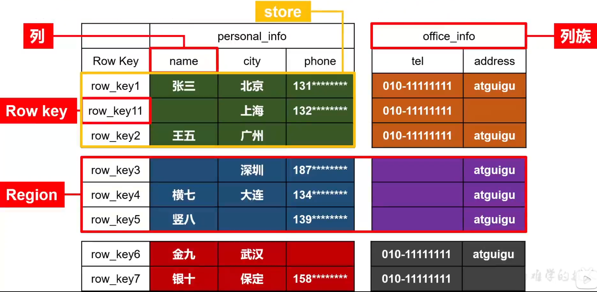

## Hbase物理存储结构

Hbase本质上是基于**changelog**的**nosql**, 内部的数据都是以key, value结构保存的

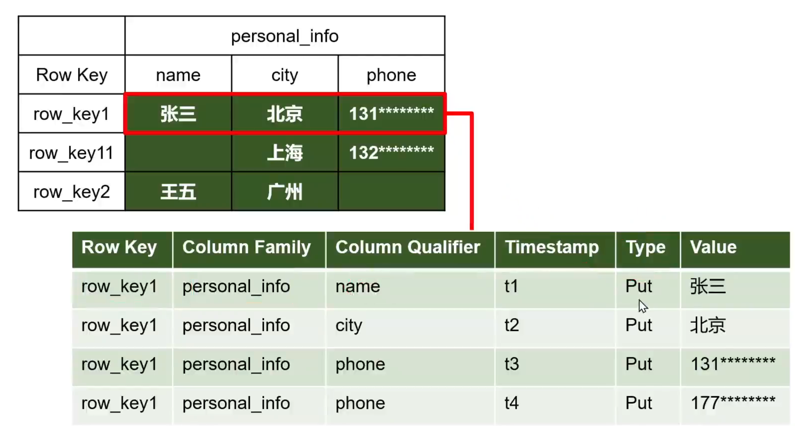

1. 基于changelog

   hbase的数据都是保存到hdfs上的, 而hdfs典型的特点就是不支持修改

   所以hbase为了支持十亿行数据快速修改, 他对数据的保存是基于changelog的

   比如我们修改了一行数据的n个列, 那么hbase就会对这一行数据的每一个字段都生成一个版本

   每个版本都有一个type字段来表示当前的操作, 比如put表示upsert(插入或者修改), delete表示删除

   每个版本的版本号都是时间戳, 也就意味着最新时间戳的那天记录是最新的

2. nosql

   hbase为了能够支持百万列的结构, 实际在底层就是nosql的结构

   比如如下图的一行数据, name=zhangsan, city=北京, phone=131xxx

   他底层保存的实际上是3行数据, 每一个字段都使用一个key,value来保存

   这样他就将百万列转化为了百万行

   key是row key + column family + column qualifier + timestamp + type

   

   在底层存储上, 每一个key-value对都被称为一个cell, 即一行的一个字段如果有多个版本就会有多个cell

   **cell中的数据都是字节数组保存的**

   

   如果一行数据中的个别字段为null, 那么在底层存储上, 根本就不会出现对应的kv对, 所以才能够支持hbase对列的动态, 按需设置

3. hbase中的数据都是保存到hdfs上的

   storefile保存为`${hbase_root_path}/data/${namespace}/${table}/${region_id}/${column_family}/${storefile_id}`

   storefile 内部对应为一条条cell

   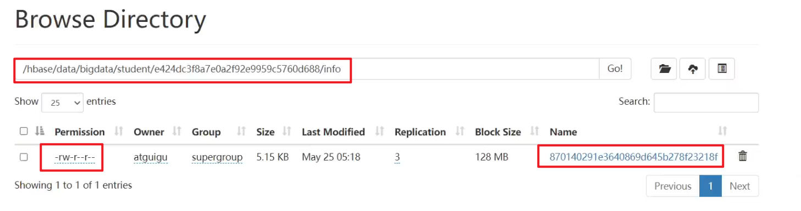

## Hbase基础架构

hbase是典型的master-worker架构, 在hbase中worker被称为region server

master和region server都将自己的信息注册到zookeeper中, 从而实现master对region server的管理

除了master外, 还可以有一个备用的master, 用以实现高可用

### master结构

master通常部署在namenode上, 主要的功能是如下:

1. 启动一个LoadBalancer线程来周期性的读取meta表, 监控region在region server上的分布, 默认5分钟调控一次再平衡, 可以通过`hbase.balancer.period`来控制

2. 启动一个CatalogJanitor(元数据管理器)线程来管理meta表, 定期检查和清理meta表中的过期数据

   管理元数据表hbase:meta, 接受用户对表格, 命名空间的创建, 修改, 删除

3. MasterProcWAL(预写日志管理器):  把 master 需要执行的任务记录到预写日志 WAL 中，如果 master 宕机，让 backupMaster读取日志继续干  

4. 当region server挂掉的时候, 负责的region的容错

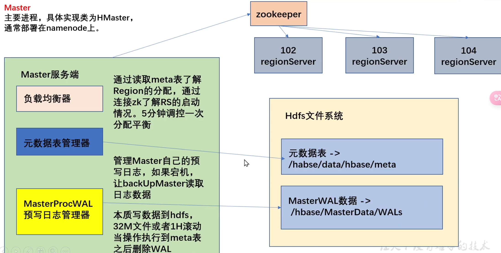

### hbase:meta表简介

hbase:meta表在list命令中会被过滤掉, 但是本质上和其他hbase表一样. 只是这个表的写操作只会由master负责

meta表中的每一行数据都记录了一个region的信息

比如meta表的row key是由`table name, start key, region id`组成

meta表有一个info列族, info列族中有多列, 如下

- info:regioninfo, 存储一个 HRegionInfo 对象。
- info:server,  当前 region 所处的 RegionServer 信息，包含端口号。
- info:serverstartcode  当前 region 被分到 RegionServer 的起始时间。

如果一个表处于切分的过程中，即 region 切分，还会多出两列 info:splitA 和 info:splitB，存储值也是 HRegionInfo 对象，拆分结束后，删除这两列。  

**对hbase:meta表的写操作, 只有master才会进行**

**而对hbase:meta的读取操作, 不需要经过master, 客户端可以直接连接zookeeper 读取目录`/hbase/meta-region-server` 节点信息，会记录 meta 表格由哪个region server管理。然后直接访问对应的region server即可，不需要访问master，这样可以减轻 master 的压力，相当于 master 专注 meta 表的写操作，客户端可直接读取 meta 表**  

### region server 结构

region server主要部署在datanode上, 主要功能如下

1. 当客户端对region进行读写的时候, 由region server负责具体cell的处理
2. region server并不保存具体的数据, 数据都是保存在hdfs上的, region server只是对具体的region进行读写
3. 配合master进行region的容错和再平衡

reguib server内部有几个重要的组件:

1. WAL: 当client往region server中写数据的时候, region server并不会马上把数据写到 store file中, 而是现将数据写到hdfs的指定目录中, 被称为预写日志文件

   同时将数据保存在内存中, 只有当达到一定量的时候, 才会将内存中的数据以store file的形式flush到hdfs上

2. Block Cache 读缓存: 用以保存从store file中读取到的数据, 优化读效率, **每个region server只有一个block cache**

3. MemStore: 写缓存: 作用详细查看hbase写流程

除了上面这些组件, region server中还有一些重要的线程来负责必要的服务

1. region的拆分: 当一个region太大的时候, 会对他进行拆分
2. region的合并: 当一个region经过数据清理之后, 太小了, 那么会将多个小的region合并
3. memstore的flush

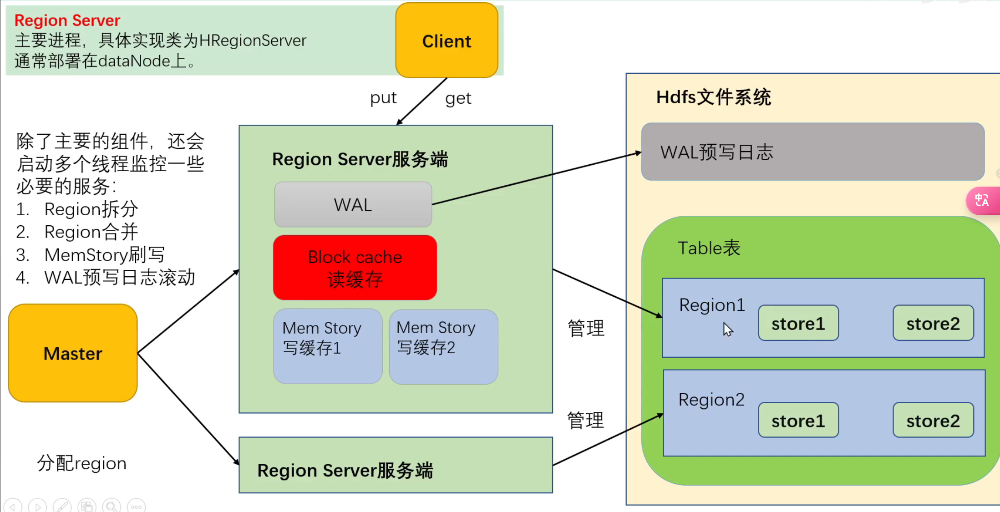

## Hbase写流程

1. 当我们client需要连接到hbase的时候,, 需要指定zk的地址, 此时client会从zk中获取hbase:meta这个表是由哪个region server管理的, 比如hadoop103

2. client访问hadoop103, 获取hbase:meta表中的全部的数据, 缓存在内存中, 被称为MetaCache

   对hbase:meta表的读取不需要经过master, 只有修改元数据需要经过master

3. hbase:meta表中保存了hbase的所有元数据, 在实际企业中, **大小大概在几兆到十几张不等**, 所以创建连接时一个非常耗时的操作

4. 如果hbase:meta中的数据有变更, 那么client的读写请求的过程中就会异常, 此时就会重新读取hbase:meta

5. 我们要写数据时, 首先需要获取表的descripter, 此时client会访问对应的region server判断表是否存在并获取, 这个操作是一个轻量级操作

6. 组装数据, 并调用Table的put方法, 此时client内部会解析row key, 判断这个数据要放在哪个region中, 并对照内存中的MetaCache, 看这个region由哪个region server管理

7. client访问对应的region server, 并将数据发送给他

8. region server接受到数据之后, 会通过WAL的方式将数据写到hdfs一份, 同时根据row key和column family查看将数据写入到内存中的哪个memory store中并**排序**

   **memory store其实就是还没有来得及序列化到hdfs上的store file**

9. 向客户端发送ack

10. 等待memory store的刷写时机时, 刷写到hdfs的指定位置, 形成store file

    **所以store file只是单文件有序**

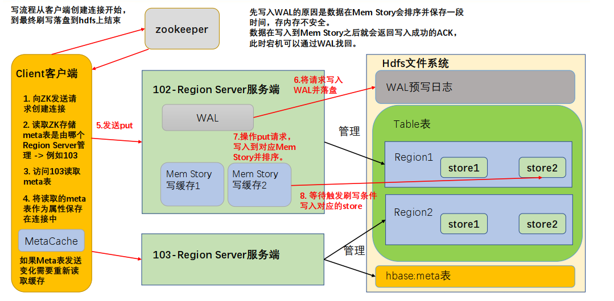

#### In-Memory Compaction

在hbase2.0之前, 数据不停的往hbase的memstore中写数据, 当数据达到一定程度的时候, 就会将memstore flush到磁盘上, 形成一个hfile

在2.0之后, 引入了CompactingMemStore, 在其中数据是以段(Segment)为单位存储的, 一个MemStore中包含多个segment

当数据写入的时候, 首先写入到Active Segment, 也就是当前写入的segment段, 当Active Segment满了之后, 会将这个Segment移动到Pipeline中. 一个pipeline中可以保存多个segment的数据, 这些数据都是不可修改的.

CompactingMemStore会在后台将pipeline中的多个segment合并为一个更大、更紧凑的segment，这就是compaction的过程。

当CompactingMemStore被flush到磁盘时，pipeline中的所有segment会被移到一个snapshot中进行合并然后写入HFile。

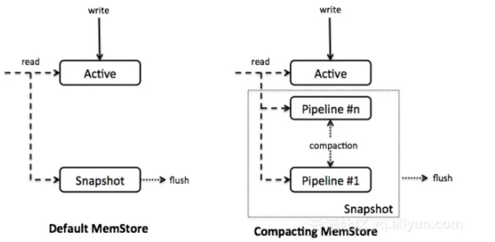

当Active segment flush到pipeline中后，后台会触发一个任务来合并pipeline中的数据。合并任务会扫描pipeline中所有的segment，将segment的索引合并为一个索引。有三种合并策略：

- basic（基础型）

  不清理多余的数据版本，这样就不需要对cell的内存进行拷贝

  basic适用于所有**大量写**模式

- eager（饥渴型）

  eager compaction会过滤重复的数据，清理多余的版本，这会带来额外的开销

  eager模式主要针对数据**大量过期淘汰**的场景，例如：购物车、消息队列等

- adaptive（适应型）

  根据数据的重复情况来决定是否使用eager策略

  该策略会找出cell个数最多的一个，然后计算一个比例，如果比例超出阈值，则使用eager策略，否则使用basic策略

2.0中，默认的In-Memory Compaction策略为basic。可以通过修改hbase-site.xml修改：

~~~xml
<property>
 <name>hbase.hregion.compacting.memstore.type</name>
 <value><none|basic|eager|adaptive></value>
 </property>
~~~

也可以单独设置某个列族的级别：

~~~shell
create ‘<tablename>’, 
{NAME => ‘<cfname>’, IN_MEMORY_COMPACTION => ‘<NONE|BASIC|EAGER|ADAPTIVE>’}
~~~

## MemStore的刷写时机

下面多个条件是**或**的关系

1. 当某个memory store的大小达到了`hbase.hregion.memstore.flush.size(默认128M, hdfs block size)`的时候, 会将该memory store所在的region中的**所有**memory store都flush到hdfs上

   同时如果某个memory store的大小达到了``hbase.hregion.memstore.flush.size`乘以`hbase.hregion.memstore.block.multiplier(默认4)  `的大小, 即默认512M, 那么还会堵塞该memory store

   这样做是防止内存溢出

   

   **为什么要flush同一个region的所有memory story?  why?**

   **首先要搞清楚, 一个region server管理多个region, 每个region又会根据column family划分为多个store**

   **那么每一个store都会有一个内存中的memstore + 多个hdfs上的storefile来存储数据**

   **memstore用来表示还没有来得及序列化的store file, 有多少个列族就会有多少个memstore**

   

   这些memory store其实就是同一批数据的不同列, 那么如果一个memory store的数据达到了128M, 那么其他的memory store应该也差不多, 所以就会一起刷写

   如果一个region中的一个memory store和其他memory store大小差距过大, 那肯定是有些列族中的数据为null, 此时就是使用不当

2. 可以通过`hbase.regionserver.global.memstore.size(默认0.4)`来控制memory store可用空间占总的java堆内存大小的百分比

   通过`hbase.regionserver.global.memstore.size.lower.limit(默认0.95)`来控制当所有的memory store大小达到了总的memory store可用空间后, region会按照其所有memstore的大小顺序(由大到小)依次flush, 直到region server中所有的memstore的总大小减少到上述值以下

   如果所有memstore达到了memstore总的可用空间, 那么会阻止所有往memstore写数据

3. 为了避免数据过长时间处于内存之中， 到达自动刷写的时间，也会触发 memstore flush

   可以通过`hbase.regionserver.optionalcacheflushinterval（默认1 小时）  `

   这个参数是**region server级别的**

4. 当 WAL 文件的数量超过 `hbase.regionserver.max.logs`， region 会按照时间顺序依次进行刷写，直到 WAL 文件数量减小到 `hbase.regionserver.max.log` 以下（该属性名已经废弃，现无需手动设置， 最大值为 32）。  

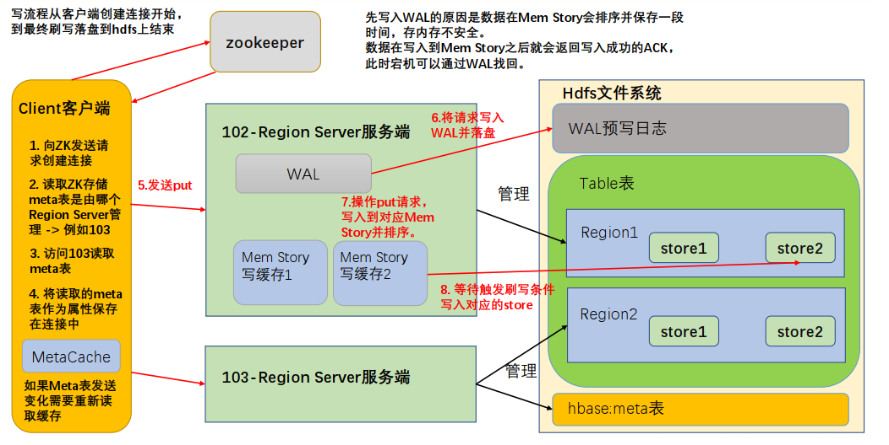

## Hbase读流程

### StoreFile的文件结构

StoreFile又被称为hfile, 他是存储在hdfs上面每一个store文件夹下实际存储数据的文件, 里面存储多种内容, 包括:

- 数据本身(key-value对)
- 当前storefile的元数据记录(当前storefile存储的是哪个region, 哪个column family的)
- 文件信息
- 数据索引(对row key的稀疏索引)
- 元数据索引
- 固定长度的尾部信息(记录文件的版本信息, 用以判断文件是否修改)

kv对按照块大小（默认64K, 可以在建表的时候通过列族的属性创建）保存在文件中， 数据索引按照块创建，块越多，索引越大。 

每一个 HFile 还会维护一个**布隆过滤器** , 用于开始判断一个row key是否在当前hfile中, 如果布隆过滤器说不存在那就一定不存在, 如果存在那么可能存在

kv对内容如下:

- rowlength   key的长度
- row key 的值
- column family length 列族长度
- columnfamily 列族
- columnqualifier 列名
- timestamp  时间戳
- type 操作类型( delete/ put)

由于 HFile 存储经过序列化，所以无法直接查看。可以通过 HBase 提供的命令来查看存储在 HDFS 上面的 HFile 元数据内容。  

~~~shell
bin/hbase hfile -m -f /hbase/data/命名空间/表名/regionID/列族/HFile名
~~~

### 读流程

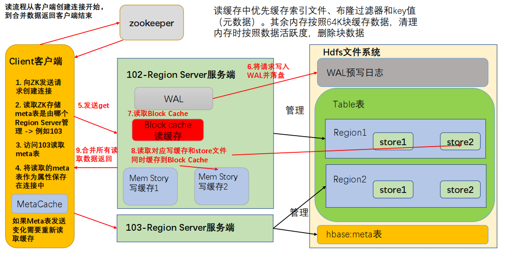

1. 首先通过配置连接上zk, 获取hbase:meta这个表由哪个region server管理

2. 连接上对应的region server, 读取hbase:meta所有数据, 保存在内存中

3. 我们在读取数据的时候, 有两个操作, get和scan

   如果是get操作, 那么会根据row key来计算数据在哪个region上面, 然后根据meta中的元数据来找到对应的region server

   如果是scan操作, 那么会根据start key和end key来计算数据在哪些region上面, `hbase:meta` 表存储了每个 region 的元数据信息，包括每个 region 的起始行键和结束行键，以及对应的 RegionServer 地址。

4. client会将请求发送给一个或者多个region

5. region server接到请求后, region server首先会扫描memstore, 因为他记录的是最新的数据,  同时memstore是在内存中的, 同时也是排好序的, 所以速度非常快

   然后region server会扫描store file, 然后查看对应的store file在block cache中是否有缓存, 如果有缓存那么会直接使用block cache中的缓存

   在扫描store file的时候, storefile是自带稀疏索引的, 可以加快查询

   同时因为store file是排序好的, 所以可以使用二分查找

   同时store file也可以使用布隆过滤器来来判断数据是否存在

6. client从不同的 RegionServer 接收扫描结果，并将这些结果合并起来形成最终的扫描结果。

## StoreFile的合并

由于 memstore 每次刷写都会生成一个新的 HFile， 文件过多读取不方便，所以会进行文件的合并，清理掉过期和删除的数据，会进行 StoreFile Compaction。

Compaction 分为两种，分别是 Minor Compaction 和 Major Compaction。

**触发合并检测的方式:**

1. 每次flush memstore的时候, 都会检测是否能够执行小合并和大合并

2. 后台线程周期性检测: 后台线程会定期检查是否需要执行小合并和大合并，检查周期为`hbase.server.thread.wakefrequency*hbase.server.compactchecker.interval.multiplier`，这里主要考虑的是一段时间内没有写入请求仍然需要做compact检查。

   其中参数 `hbase.server.thread.wakefrequency` 默认值 10000 即 10s，是HBase服务端线程唤醒时间间隔，用于log roller、memstore flusher等操作周期性检查；

   参数 `hbase.server.compactchecker.interval.multiplier` 默认值1000，是compaction操作周期性检查乘数因子。10 * 1000 s 时间上约等于2hrs, 46mins, 40sec。

3. 手动触发：是指通过HBase Shell、Master UI界面或者HBase API等任一种方式 执行 compact、major_compact等命令。

**小合并的执行条件**

Minor Compaction会将临近的若干个较小的 HFile 合并成一个较大的 HFile， 在这个过程中**不会处理已经Deleted或TTL Expired的Cell**

Minor Compaction由如下参数控制:

- `hbase.hstore.compaction.min`(默认 3) : Minor Compaction 的最少文件个数。  
- `hbase.hstore.compaction.max`(默认 10):  为 Minor Compaction 最大文件个数。  
- `hbase.hstore.compaction.min.size`（默认 128M） 为单个 Hfile 文件大小最小值，小于这个数的hfile才会执行Minor Compaction
- `hbase.hstore.compaction.max.size`（默认 Long.MAX_VALUE） 为单个 Hfile 文件大小最大值，高于这个数的hfile不会参与minor compaction
- `hbase.hstore.compaction.ratio`（默认 1.2F） : 不知道干嘛的, 反正不要改动这个参数

**大合并的执行条件**

Major Compaction 会将一个 Store 下的所有的 HFile 合并成一个大 HFile，并且会清理掉**被删除的数据、TTL过期数据、版本号超过设定版本号的数据**。

由参数 `hbase.hregion.majorcompaction(大合并的执行周期, 默认7天)`和`hbase.hregion.majorcompaction.jitter(抖动比例, 默认0.2)`

所以大合并的执行周期会随机在`[7*80%, 7*120%]`天内随机进行, 添加抖动比例的原因是避免所有 RegionServer 同时进行 Major Compaction，从而平滑了系统的负载，减小了对系统性能的突发影响。

因为Major Compaction 会消耗太多性能, 所以在生产环境下都是将`hbase.hregion.majorcompaction`设置为0, 表示关闭自动的Major Compaction, 而是在业务不繁忙的时候, **手动执行compaction命令来抽动触发Major Compaction**

 

## Region切分

Region 切分分为两种，创建表格时候的预分区即自定义分区，同时系统默认还会启动一个切分规则，避免单个 Region 中的数据量太大。

默认情况下, 我们不指定预分区的话, 那么多有的数据都会放到一个region中, 只有这个region太大了, 才会根据系统自动切分来划分为两个region, 这样的话就无法负载均衡了, 所以我们要进行预分区

**需要注意的是, 即使我们设置了预分区, 当region大到一定程度的时候, 还是会对我们设置好的region进行切分, 也就是说第二种规则是一定会生效的**

#### 预分区（自定义分区）
每一个 region 维护着 startRow 与 endRowKey，如果加入的数据符合某个 region 维护的rowKey 范围，则该数据交给这个 region 维护。那么依照这个原则，我们可以将数据所要投放的分区提前大致的规划好，以提高 HBase 性能。

有如下办法来创建预分区

1. 在创建table的时候指定

   ~~~shell
   create 'staff1','info', SPLITS => ['1000','2000','3000','4000']
   ~~~

   此时会创建5个分区, put进来的row key会按照**字典顺序**进行比较, 来判断放到哪个分区

   - row key为 1, 那么放到0分区
   - row key为 100, 放到0分区
   - row key 为 100011, 放到1分区
   - row key 为400, 放到4分区
   - row key 为4000, 放到5分区

   

2. 通过字符串的16进制来分区

   ~~~shell
   create 'staff2','info',{NUMREGIONS => 15, SPLITALGO =>'HexStringSplit'}
   ~~~

   使用这种分区规则时, 会从**0000 0000到ffff ffff的区域(这个区域是默认的)**平均划分为13个段, 这样再加上以前以后, 就会有15个段了

   然后再插入数据的时候, 他会获取row key的前8个字母, 与region的startkey和endkey来进行**字典顺序**比较, 这样就可以确定rowkey要分到哪个region了

   

   **不推荐使用这种分区方式**, 因为这种规则是将00000000和ffffffff转换为**bigint**, 然后平均切分, 但是在和rowkey进行比较的时候, 又是按照**字典顺序**来比较的, 比如上面的案例, 切分15个region后, 每个region的startkey和end key 如下:

   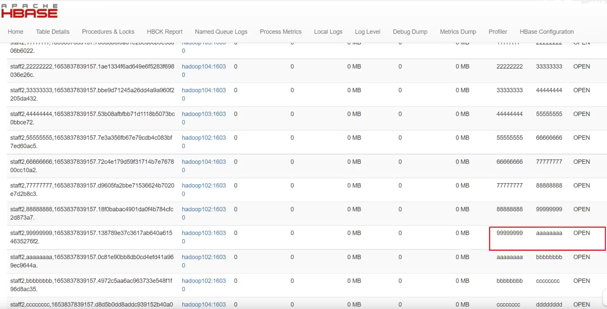

   我们可以看到, 有一个region的范围是从99999999到aaaaaaaa, **这在16进制数字上是均衡的, 但是在字典顺序中9的ascii码为57, a的ascii码为97, 中间有一大块的范围包括A,B,C,D等等**

   同时最后一个分区范围为eeeeeeee到无穷, 这在字典顺序上也是非常大的一块了, 但如果你的rowkey最大就是ffffffff, 他又是均衡的

   

   **所以总结就是, 如果使用这种规则, 那么就必须保存row key的前8位必须是从00000000到ffffffff的十六进制字符串, 如果你的row key中包含其他字符, 那么这种方式就不是均匀的切分**

   

3. 可以在文件中配置预分区的规则, 然后再创建表的时候, 指定预分区的文件

   1. 创建splits.txt, 用来保存预分区规则

      ~~~txt
      aaaa
      bbbb
      cccc
      dddd
      ~~~

   2. 然后执行如下命令

      ~~~shell
      create 'staff3', 'info',SPLITS_FILE => 'splits.txt'
      ~~~

2. 我们还可以使用java api来设置预分区

   ~~~java
   package com.atguigu.hbase;
   import org.apache.hadoop.conf.Configuration;
   import org.apache.hadoop.hbase.HBaseConfiguration;
   import org.apache.hadoop.hbase.TableName;
   import org.apache.hadoop.hbase.client.*;
   import org.apache.hadoop.hbase.util.Bytes;
   import java.io.IOException;
   public class HBaseConnect {
   public static void main(String[] args) throws IOException {
   	// 1.获取配置类
   	Configuration conf = HBaseConfiguration.create();
   	// 2.给配置类添加配置
   	conf.set("hbase.zookeeper.quorum","hadoop102,hadoop103,hadoop104"
   );
   	// 3.获取连接
   	Connection connection = ConnectionFactory.createConnection(conf);
   	// 3.获取 admin
   	Admin admin = connection.getAdmin();
   	// 5.获取 descriptor 的 builder
   	TableDescriptorBuilder builder = TableDescriptorBuilder.newBuilder(TableName.valueOf("bigdata","staff4"));
   	// 6. 添加列族
   	builder.setColumnFamily(ColumnFamilyDescriptorBuilder.newBuilder(
   	Bytes.toBytes("info")).build());
   	// 7.创建对应的切分
   	byte[][] splits = new byte[3][];
   	splits[0] = Bytes.toBytes("aaa");
   	splits[1] = Bytes.toBytes("bbb");
   	splits[2] = Bytes.toBytes("ccc");
   	// 8.创建表
   	admin.createTable(builder.build(),splits);
   	// 9.关闭资源
   	admin.close();
   	connection.close();
   	
   }
   ~~~

   

#### 系统自动拆分

当一个region过大的时候, region server会自动的对这个region进行拆分, 拆分规则如下:

1. 如果当前RegionServer上该表只有一个Region，那么当该Region的大小达到 `2 * hbase.hregion.memstore.flush.size(默认128M)` 时，就会触发切分。这是为了加快初始切分速度，防止单个Region过大。
2. 如果该表已经有多个Region，那么会按照 `hbase.hregion.max.filesize(默认10G)` 进行切分。当Region的大小达到 `hbase.hregion.max.filesize` 时，触发切分。

## Hbase列族压缩

hbase支持的压缩算法有

1. NONE:  不使用压缩算法, 是**默认的选项**
2. LZ4
3. LZO: 和snappy类似, 但是lzo的压缩比高一点, 速度也慢一点, 通常用于热数据
4. SNAPPY: 压缩率一般, 但是压缩和解压速度快, 通常用于**热数据压缩**
5. GZ:  gzip算法, 压缩率最高, 同时压缩和解压很慢, 如果数据只是用来做**备份**, 那么可以使用这个算法
6. BZIP2
7. ZSTD

总结: 热数据用snappy或者lzo, 冷数据用gzip

~~~shell
# 创建表格的时候, 指定列族的压缩方式
create 'iteblog',{NAME=>'f1'}, {NAME=>'f2',COMPRESSION=>'Snappy'}

# 修改表的压缩方式, 不会立即生效, 只有到了major compaction的时候才会生效
alter 'test', {NAME => 'f', COMPRESSION => 'lz4', DATA_BLOCK_ENCODING =>'DIFF'}
# 手动执行major compact
major_compact 'test'
~~~

## Bulk Load

当我们想要往Hbase中大量的写数据的时候, 我们可能会使用MapReduce, 然后再Reduce中连接上Hbase, 然后调用Hbase的put命令

但是这样的话HBase服务器要维护、管理这些连接，以及接受来自客户端的操作，会给HBase的存储、计算、网络资源造成较大消耗。

此时我们就可以使用Bulk Load的方式, 他的基本原理就是使用MapReduce直接生成hfile到hdfs上, 然后让hbase去加载指定的hfile, 这样的话就写数据就绕过了Write to WAL，Write to MemStore及Flush to disk的过程, 不会给hbase带来压力

下面我们来开发一个MapReduce程序, 他从hdfs上读取文件, 然后再mapper中输出hfile到hdfs上

**注意我们编写的mapreduce只有mapper, 没有reducer**

1. 数据集如下:

   | id            | ID         |
   | ------------- | ---------- |
   | code          | 流水单号   |
   | rec_account   | 收款账户   |
   | rec_bank_name | 收款银行   |
   | rec_name      | 收款人姓名 |
   | pay_account   | 付款账户   |
   | pay_name      | 付款人姓名 |
   | pay_comments  | 转账附言   |
   | pay_channel   | 转账渠道   |
   | pay_way       | 转账方式   |
   | status        | 转账状态   |
   | timestamp     | 转账时间   |
   | money         | 转账金额   |

2. 在hbase中创建对应的表

   ~~~shell
   create_namespace "ITCAST_BANK"
   # 这里我们只需要一个列族, 同时因为数据只读不写, 所以采用gzip压缩
   # 同时预分区6个
   create "ITCAST_BANK:TRANSFER_RECORD", { NAME => "C1", COMPRESSION => "GZ"}, { NUMREGIONS => 6, SPLITALGO => "HexStringSplit"}
   ~~~

3. 创建maven项目, 导入依赖

   ~~~xml
   <dependencies>
       <dependency>
           <groupId>org.apache.hbase</groupId>
           <artifactId>hbase-client</artifactId>
           <version>2.1.0</version>
       </dependency>
       <dependency>
           <groupId>org.apache.hbase</groupId>
           <artifactId>hbase-mapreduce</artifactId>
           <version>2.1.0</version>
       </dependency>
       <dependency>
           <groupId>org.apache.hadoop</groupId>
           <artifactId>hadoop-mapreduce-client-jobclient</artifactId>
           <version>2.7.5</version>
       </dependency>
       <dependency>
           <groupId>org.apache.hadoop</groupId>
           <artifactId>hadoop-common</artifactId>
           <version>2.7.5</version>
       </dependency>
       <dependency>
           <groupId>org.apache.hadoop</groupId>
           <artifactId>hadoop-mapreduce-client-core</artifactId>
           <version>2.7.5</version>
       </dependency>
       <dependency>
           <groupId>org.apache.hadoop</groupId>
           <artifactId>hadoop-auth</artifactId>
           <version>2.7.5</version>
       </dependency>
       <dependency>
           <groupId>org.apache.hadoop</groupId>
           <artifactId>hadoop-hdfs</artifactId>
           <version>2.7.5</version>
       </dependency>
       <dependency>
           <groupId>commons-io</groupId>
           <artifactId>commons-io</artifactId>
           <version>2.6</version>
       </dependency>
   </dependencies>
   
   <build>
       <plugins>
           <plugin>
               <groupId>org.apache.maven.plugins</groupId>
               <artifactId>maven-compiler-plugin</artifactId>
               <version>3.1</version>
               <configuration>
                   <target>1.8</target>
                   <source>1.8</source>
               </configuration>
           </plugin>
       </plugins>
   </build>
   ~~~

4. 根据数据创建实体类

   ~~~java
   @Data
   public class TransferRecord {
       private String id;
       private String code;
       private String rec_account;
       private String rec_bank_name;
       private String rec_name;
       private String pay_account;
       private String pay_name;
       private String pay_comments;
       private String pay_channel;
       private String pay_way;
       private String status;
       private String timestamp;
       private String money;
       
       public static TransferRecord parse(String line) {
           TransferRecord transferRecord = new TransferRecord();
           String[] fields = line.split(",");
   
           transferRecord.setId(fields[0]);
           transferRecord.setCode(fields[1]);
           transferRecord.setRec_account(fields[2]);
           transferRecord.setRec_bank_name(fields[3]);
           transferRecord.setRec_name(fields[4]);
           transferRecord.setPay_account(fields[5]);
           transferRecord.setPay_name(fields[6]);
           transferRecord.setPay_comments(fields[7]);
           transferRecord.setPay_channel(fields[8]);
           transferRecord.setPay_way(fields[9]);
           transferRecord.setStatus(fields[10]);
           transferRecord.setTimestamp(fields[11]);
           transferRecord.setMoney(fields[12]);
   
           return transferRecord;
       }
   }
   ~~~

5. 创建mapper

   HBase提供了两个类来专门对MapReduce支持：
   1.	ImmutableBytesWritable：对应rowkey
   2.	MapReduceExtendedCell：对应一个cell

   实现步骤：
   1.	创建一个BankRecordMapper的类继承Mapper类，Mapper的泛型为
   	- 输入key：LongWritable
   	- 输入value：Text
   	- 输出key：ImmutableBytesWritable
   	- 输出value：MapReduceExtendedCell
   2.	将Mapper获取到Text文本行，转换为TransferRecord实体类
   3.	从实体类中获取ID，并转换为rowkey
   4.	使用KeyValue类构建单元格，每个需要写入到表中的字段都需要构建出来单元格
   5.	使用context.write将输出输出
   - 构建输出key：new ImmutableBytesWrite(rowkey)
   - 构建输出的value：new MapReduceExtendedCell(keyvalue对象)

   ~~~java
   import cn.itcast.bank_record.entity.TransferRecord;
   import org.apache.hadoop.hbase.KeyValue;
   import org.apache.hadoop.hbase.io.ImmutableBytesWritable;
   import org.apache.hadoop.hbase.util.Bytes;
   import org.apache.hadoop.hbase.util.MapReduceExtendedCell;
   import org.apache.hadoop.io.LongWritable;
   import org.apache.hadoop.io.Text;
   import org.apache.hadoop.mapreduce.Mapper;
   
   import java.io.IOException;
   
   public class BankRecordMapper extends Mapper<LongWritable, Text, ImmutableBytesWritable, MapReduceExtendedCell> {
       @Override
       protected void map(LongWritable key, Text value, Context context) throws IOException, InterruptedException {
           // 将读取的数据转换为TransferRecord
           TransferRecord transferRecord = TransferRecord.parse(value.toString());
           String rowkey = transferRecord.getId();
   
           // 列蔟
           byte[] cf = Bytes.toBytes("C1");
           byte[] colId = Bytes.toBytes("id");
           byte[] colCode = Bytes.toBytes("code");
           byte[] colRec_account = Bytes.toBytes("rec_account");
           byte[] colRec_bank_name = Bytes.toBytes("rec_bank_name");
           byte[] colRec_name = Bytes.toBytes("rec_name");
           byte[] colPay_account = Bytes.toBytes("pay_account");
           byte[] colPay_name = Bytes.toBytes("pay_name");
           byte[] colPay_comments = Bytes.toBytes("pay_comments");
           byte[] colPay_channel = Bytes.toBytes("pay_channel");
           byte[] colPay_way = Bytes.toBytes("pay_way");
           byte[] colStatus = Bytes.toBytes("status");
           byte[] colTimestamp = Bytes.toBytes("timestamp");
           byte[] colMoney = Bytes.toBytes("money");
   		// 生成cell
           KeyValue idKeyValue = new KeyValue(Bytes.toBytes(rowkey), cf, colId, Bytes.toBytes(transferRecord.getId()));
           KeyValue codeKeyValue = new KeyValue(Bytes.toBytes(rowkey), cf, colCode, Bytes.toBytes(transferRecord.getCode()));
           KeyValue rec_accountKeyValue = new KeyValue(Bytes.toBytes(rowkey), cf, colRec_account, Bytes.toBytes(transferRecord.getRec_account()));
           KeyValue rec_bank_nameKeyValue = new KeyValue(Bytes.toBytes(rowkey), cf, colRec_bank_name, Bytes.toBytes(transferRecord.getRec_bank_name()));
           KeyValue rec_nameKeyValue = new KeyValue(Bytes.toBytes(rowkey), cf, colRec_name, Bytes.toBytes(transferRecord.getRec_name()));
           KeyValue pay_accountKeyValue = new KeyValue(Bytes.toBytes(rowkey), cf, colPay_account, Bytes.toBytes(transferRecord.getPay_account()));
           KeyValue pay_nameKeyValue = new KeyValue(Bytes.toBytes(rowkey), cf, colPay_name, Bytes.toBytes(transferRecord.getPay_name()));
           KeyValue pay_commentsKeyValue = new KeyValue(Bytes.toBytes(rowkey), cf, colPay_comments, Bytes.toBytes(transferRecord.getPay_comments()));
           KeyValue pay_channelKeyValue = new KeyValue(Bytes.toBytes(rowkey), cf, colPay_channel, Bytes.toBytes(transferRecord.getPay_channel()));
           KeyValue pay_wayKeyValue = new KeyValue(Bytes.toBytes(rowkey), cf, colPay_way, Bytes.toBytes(transferRecord.getPay_way()));
           KeyValue statusKeyValue = new KeyValue(Bytes.toBytes(rowkey), cf, colStatus, Bytes.toBytes(transferRecord.getStatus()));
           KeyValue timestampKeyValue = new KeyValue(Bytes.toBytes(rowkey), cf, colTimestamp, Bytes.toBytes(transferRecord.getTimestamp()));
           KeyValue moneyKeyValue = new KeyValue(Bytes.toBytes(rowkey), cf, colMoney, Bytes.toBytes(transferRecord.getMoney()));
   
           // 写出对应的cell
           ImmutableBytesWritable rowkeyWritable = new ImmutableBytesWritable(Bytes.toBytes(rowkey));
           context.write(rowkeyWritable, new MapReduceExtendedCell(idKeyValue));
           context.write(rowkeyWritable, new MapReduceExtendedCell(codeKeyValue));
           context.write(rowkeyWritable, new MapReduceExtendedCell(rec_accountKeyValue));
           context.write(rowkeyWritable, new MapReduceExtendedCell(rec_bank_nameKeyValue));
           context.write(rowkeyWritable, new MapReduceExtendedCell(rec_nameKeyValue));
           context.write(rowkeyWritable, new MapReduceExtendedCell(pay_accountKeyValue));
           context.write(rowkeyWritable, new MapReduceExtendedCell(pay_nameKeyValue));
           context.write(rowkeyWritable, new MapReduceExtendedCell(pay_commentsKeyValue));
           context.write(rowkeyWritable, new MapReduceExtendedCell(pay_channelKeyValue));
           context.write(rowkeyWritable, new MapReduceExtendedCell(pay_wayKeyValue));
           context.write(rowkeyWritable, new MapReduceExtendedCell(statusKeyValue));
           context.write(rowkeyWritable, new MapReduceExtendedCell(timestampKeyValue));
           context.write(rowkeyWritable, new MapReduceExtendedCell(moneyKeyValue));
       }
   }
   ~~~

6. 将hbase的的配置文件`hbase-site.xml`和hadoop的配置文件`core-site.xml`拷贝到resource目录下

   记得在hbase-site.xml中配置zookeeper的地址

7. 创建对应的driver类

   ~~~java
   public class BulkloadDriver {
       public static void main(String[] args) throws IOException, ClassNotFoundException, InterruptedException {
           // 会自动加载hbase-site.xml中的配置
           Configuration configuration = HBaseConfiguration.create();
   
           // 配置JOB
           Job instance = Job.getInstance(configuration);
           instance.setJarByClass(BulkloadDriver.class);
           instance.setMapperClass(BankRecordMapper.class);
   
           // 读取数据的位置
           instance.setInputFormatClass(TextInputFormat.class);
           FileInputFormat.setInputPaths(instance, new Path("hdfs://node1.itcast.cn:8020/bank/input"));
   
           // 输出到hdfs的位置
           FileOutputFormat.setOutputPath(instance, new Path("hdfs://node1.itcast.cn:8020/bank/output"));
           instance.setOutputKeyClass(ImmutableBytesWritable.class);
           instance.setOutputValueClass(MapReduceExtendedCell.class);
   
           // 配置HFileoutputFormat2
           Connection connection = ConnectionFactory.createConnection(configuration);
           // 要生成hfile对应的表
           Table table = connection.getTable(TableName.valueOf("ITCAST_BANK:TRANSFER_RECORD"));
           // 获取表的Region检索对象
           RegionLocator regionLocator = connection.getRegionLocator(TableName.valueOf("ITCAST_BANK:TRANSFER_RECORD"));
           HFileOutputFormat2.configureIncrementalLoad(instance, table, regionLocator);
   
           // 执行job
           if (instance.waitForCompletion(true)) {
               System.out.println("任务执行成功！");
           }
           else {
               System.out.println("任务执行失败！");
               System.exit(1);
           }
       }
   }
   ~~~

8. 等mapreduce执行完毕之后, 我们就可以通过控制台调用如下命令, 将生成的hfile加载到hbase中

   ~~~shell
   # /bank/output表示hfile的目录
   # ITCAST_BANK:TRANSFER_RECORD表示要加载到哪个表下面
   hbase org.apache.hadoop.hbase.tool.LoadIncrementalHFiles /bank/output ITCAST_BANK:TRANSFER_RECORD
   ~~~

   

## Hbase的协处理器(Coprocessor)

**协处理器是phoenix的实现原理**

### 起源

Hbase 作为列族数据库最经常被人诟病的特性包括：

- 无法轻易建立“二级索引”

- 难以执 行求和、计数、排序等操作

比如，在旧版本的(<0.92)Hbase 中，统计数据表的总行数，需要使用 Counter 方法，执行一次 MapReduce Job 才能得到。虽然 HBase 在数据存储层中集成了 MapReduce，能够有效用于数据表的分布式计算。然而在很多情况下，做一些简单的相加或者聚合计算的时候， 如果直接将计算过程放置在 server 端，能够减少通讯开销，从而获 得很好的性能提升

于是， HBase 在 0.92 之后引入了协处理器(coprocessors)，实现一些激动人心的新特性：能够轻易建立二次索引、复杂过滤器(谓词下推)以及访问控制等。

Hbase中的协处理器有两种: observer和endpoint

### observer

Observer 类似于传统数据库中的触发器，当发生某些事件的时候这类协处理器会被 Server 端调用。Observer Coprocessor 就是一些散布在 HBase Server 端代码中的 hook 钩子， 在固定的事件发生时被调用。

比如： put 操作之前有钩子函数 prePut，该函数在 put 操作执行前会被 Region Server 调用；在 put 操作之后则有 postPut 钩子函数

以 Hbase2.0.0 版本为例，它提供了三种观察者接口：

- RegionObserver：提供客户端的数据操纵事件钩子： Get、 Put、 Delete、 Scan 等

- WALObserver：提供 WAL 相关操作钩子。

- MasterObserver：提供 DDL-类型的操作钩子。如创建、删除、修改数据表等。

到 0.96 版本又新增一个 RegionServerObserver

下图是以 RegionObserver 为例子讲解 Observer 这种协处理器的原理

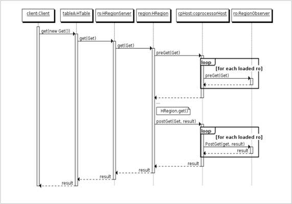   

1. 客户端发起get请求

2. 该请求被分派给合适的RegionServer和Region

3. coprocessorHost拦截该请求，然后在该表上登记的每个RegionObserer上调用preGet()

4. 如果没有被preGet拦截，该请求继续送到Region，然后进行处理

5. Region产生的结果再次被coprocessorHost拦截，调用posGet()处理

6. 加入没有postGet()拦截该响应，最终结果被返回给客户端

### endpoint

Endpoint 协处理器类似传统数据库中的存储过程，客户端可以调用这些 Endpoint 协处理器执行一段 Server 端代码，并将 Server 端代码的结果返回给客户端进一步处理，最常见的用法就是进行聚集操作

如果没有协处理器，当用户需要找出一张表中的最大数据，即max 聚合操作，就必须进行全表扫描，在客户端代码内遍历扫描结果，并执行求最大值的操作。这样的方法无法利用底层集群的并发能力，而将所有计算都集中到 Client 端统一执 行，势必效率低下。

利用 Coprocessor，用户可以将求最大值的代码部署到 HBase Server 端，HBase 将利用底层 cluster 的多个节点并发执行求最大值的操作。即在每个 Region 范围内 执行求最大值的代码，将每个 Region 的最大值在 Region Server 端计算出，仅仅将该 max 值返回给客户端。在客户端进一步将多个 Region 的最大值进一步处理而找到其中的最大值。这样整体的执行效率就会提高很多

下图是 EndPoint 的工作原理：

 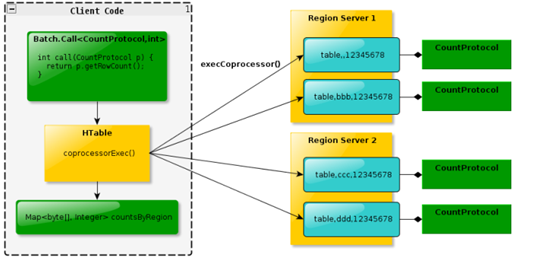

 

### 协处理器的加载和卸载

协处理器的加载方式有两种：

- 静态加载方式（ Static Load）

  这种方式指定的协处理器会对所有的表都起作用, 要使用这种方式, 需要在`hbase-site.xml`中指定

  ~~~xml
  <property> 
      <name>hbase.coprocessor.user.region.classes</name>
   <!-- 如果有多个协处理器, 那么使用逗号隔开-->   <value>org.apache.hadoop.hbase.coprocessor.AggregateImplementation</value> 
  </property>  
  ~~~

- 动态加载方式 （ Dynamic Load）

  动态加载就是在创建一个表的时候, 指定这个表要使用的协处理器

  ~~~shell
  # 创建表的时候指定
  # org.example.MyCoprocessor是协处理器
  # 1101是这个协处理器的优先级, 优先级决定了在多个协处理器同时存在时，哪个协处理器先被执行。值越小，优先级越高。常见的优先级有以下几种：
  # Coprocessor.PRIORITY_HIGHEST：表示最高优先级
  # Coprocessor.PRIORITY_SYSTEM：表示系统优先级
  # Coprocessor.PRIORITY_USER：表示用户优先级
  # Coprocessor.PRIORITY_LOWEST：表示最低优先级
  # arg1=val1,arg2=val2：这是传递给协处理器的参数
  
  create 'my_table', {NAME => 'my_cf', VERSIONS => 1}, 'COPROCESSOR' => '|org.example.MyCoprocessor|1101|arg1=val1,arg2=val2'
  
  # 通过修改表的方式指定协处理器
  disable 'my_table'
  alter 'my_table', 'COPROCESSOR' => '|org.example.MyCoprocessor|1101|arg1=val1,arg2=val2'
  enable 'my_table'
  
  # 删除表中的协处理器
  disable 'my_table'
  alter 'my_table', METHOD => 'table_att_unset', NAME => 'COPROCESSOR$1' # $1表示卸载第一个协处理器
  enable 'my_table'
  ~~~

  

## Phoenix

Apache Phoenix让Hadoop中支持低延迟OLTP和业务操作分析。

- 提供标准的SQL以及完备的ACID事务支持

- 通过利用HBase作为存储，让NoSQL数据库具备通过有模式的方式读取数据，我们可以使用SQL语句来操作HBase，例如：创建表、以及插入数据、修改数据、删除数据等。

- Phoenix通过**协处理器在服务器端执行操作**，最小化客户机/服务器数据传输

### phoenix是否会影响hbase的性能

答案是不会的, 如果我们要查询某些符合条件的数据, 那么我们就要通过scan全表扫描, 然后将数据全部拉取到client端, 在client端进行过滤

而使用了phoenix后, phoenix会在hbase中配置各种协处理器, 是的我们可以在hbase scan数据的时候, 就对数据进行过滤, 从而提高了hbase的性能

### phoenix安装

从http://phoenix.apache.org/download.html下载对应版本的phoenix

1. 上传安装包到Linux系统，并解压

   ~~~bash
   cd /export/software
   tar -xvzf  apache-phoenix-5.0.0-HBase-2.0-bin.tar.gz -C ../server/  
   ~~~

2. 将phoenix的所有jar包添加到所有HBase RegionServer和Master的复制到HBase的lib目录

   ~~~bash
   #  拷贝jar包到hbase lib目录 
   cp /export/server/apache-phoenix-5.0.0-HBase-2.0-bin/phoenix-*.jar /export/server/hbase-2.1.0/lib/
   ~~~

   分发所有jar包

   ~~~bash
   #  进入到hbase lib  目录
   cd /export/server/hbase-2.1.0/lib/
   # 分发jar包到每个HBase 节点
   scp phoenix-*.jar node2.itcast.cn:$PWD
   scp phoenix-*.jar node3.itcast.cn:$PWD
   ~~~

3. 添加如下配置到`hbase-site.xml`中

   ~~~xml
   <!-- 支持HBase命名空间映射 -->
   <property>
       <name>phoenix.schema.isNamespaceMappingEnabled</name>
       <value>true</value>
   </property>
   <!-- 支持索引预写日志编码 -->
   <property>
     <name>hbase.regionserver.wal.codec</name>
     <value>org.apache.hadoop.hbase.regionserver.wal.IndexedWALEditCodec</value>
   </property>
   ~~~

   分发到每个节点

   ~~~shell
   # 将hbase-site.xml分发到每个节点
   scp hbase-site.xml node2.itcast.cn:$PWD
   scp hbase-site.xml node3.itcast.cn:$PWD
   ~~~

4. 将配置后的hbase-site.xml拷贝到phoenix的bin目录

   ~~~bash
   cp  /export/server/hbase-2.1.0/conf/hbase-site.xml /export/server/apache-phoenix-5.0.0-HBase-2.0-bin/bin/
   ~~~

   分发到所有节点

   ~~~bash
   cd /export/server/apache-phoenix-5.0.0-HBase-2.0-bin/bin/
   scp hbase-site.xml node2.itcast.cn:$PWD
   scp hbase-site.xml node3.itcast.cn:$PWD
   ~~~

5. 重新启动HBase

   ~~~bash
   stop-hbase.sh  
   start-hbase.sh  
   ~~~

6. 启动Phoenix客户端，连接Phoenix Server

   注意：第一次启动Phoenix连接HBase会稍微慢一点。

   ~~~bash
   cd /export/server/apache-phoenix-5.0.0-HBase-2.0-bin/ 
   # 使用sqlline工具连接上phoenix, 这里指定的是zk的地址
   bin/sqlline.py node1.itcast.cn:2181  
   ~~~

7. 查看Phoenix中的表  

   ~~~shell
   !table 
   ~~~

8. 查看HBase的Web UI，可以看到Phoenix在default命名空间下创建了一些表，而且该系统表加载了大量的协处理器。

   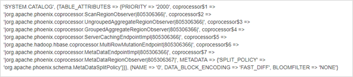

   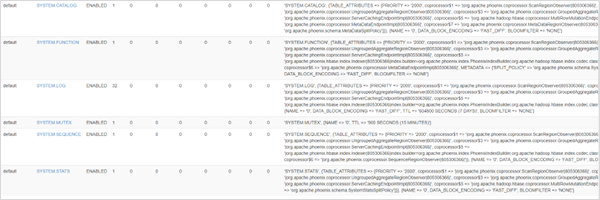

### phoenix基本语法

1. 查看所有的表

   ~~~sql
   !table
   ~~~

2. 查看表的详细信息

   ~~~sql
   !desc 表名
   ~~~

3. 创建表

   ~~~sql
   CREATE TABLE IF NOT EXISTS 表名 (
       ROWKEY名称 数据类型 PRIMARY KEY 
   	列蔟名.列名1 数据类型 NOT NULL,
   	列蔟名.列名2 数据类型 NOT NULL,
   	列蔟名.列名3 数据类型);
   ) COLUMN_ENCODED_BYTES = 2;
   ~~~

   1. primary key就是row key, 也可以使用联合主键

   2. 默认情况下, 如果表名, 列族名, 列名不加双引号, 那么phoenix会自动转换为大写, 如果不想被转换, 可以添加双引号

   3. 默认情况下, phoenix会对列名按照顺序进行编码, 转换为2个字节的数字(Short), 以减少磁盘占用

      `COLUMN_ENCODED_BYTES`这个参数就是表示使用几个字节进行编码, 默认为2, 可以设置的值为0,1, 2, 3, 4,NONE

      ~~~sql
      create table xxx(
      ...
      )
      COLUMN_ENCODED_BYTES = 0;
      ~~~

4. 删除表

   ~~~sql
   drop table if exists 表名;
   ~~~

5. 插入数据

   ~~~sql
   upsert into student values('1001','zhangsan', 10, 'beijing');
   ~~~

6. 查询

   ~~~sql
   select * from ORDER_DTL where age = 10
   select * from ORDER_DTL limit 10 offset 0;
   ~~~

### phoenix数据类型

phoenix中的数据类型有: 

1. varchar:  对应java中的String
2. unsigned_int: 无符号整型
3. unsigned_long: 无符号整型
4. float: 对应java中的float
5. integer: 对应java中的int
6. long: 对应java中的long

### 表的映射

默认情况下， HBase 中已存在的表，通过 Phoenix 是不可见的。如果要在 Phoenix 中操
作 HBase 中已存在的表， 可以在 Phoenix 中进行表的映射。映射方式有两种：视图映射和表映射。

- 视图映射: Phoenix 创建的视图是只读的，所以只能用来做查询，无法通过视图对数据进行修改等
  操作。  
- 表映射: 在 Pheonix 创建表去映射 HBase 中已经存在的表，是可以修改删除 HBase 中已经存在
  的数据的。而且，删除 Phoenix 中的表，那么 HBase 中被映射的表也会被删除。  

1. 在hbase中创建一个表, 有两个列族

   ~~~sql
   create 'test','info1','info2'
   ~~~

2. 在phoenix中创建对应的视图

   ~~~sql
   -- 视图的名字必须是   命名空间.表名
   -- 列名必须是   列组.列名
   -- primary key 指定映射到row key上
   create view "test"(
       id varchar primary key,
       "info1"."name" varchar,
       "info2"."address" varchar
   );
   ~~~

3. 在phoenix中创建对应的表

   ~~~sql
   create table "test"(
       id varchar primary key,
       "info1"."name" varchar,
       "info2"."address" varchar
   ) column_encoded_bytes=0; -- 必须设置为0
   ~~~

### 预分区

默认创建表的方式，则HBase顺序写入可能会受到RegionServer热点的影响。对行键进行加盐可以解决热点问题。在HBase中，可以使用两种方式：

1. ROWKEY预分区

   ~~~sql
   -- 按照用户ID来分区，一共4个分区。并指定数据的压缩格式为GZ。
   drop table if exists ORDER_DTL;
   create table if not exists ORDER_DTL(
       "id" varchar primary key,
       C1."status" varchar,
       C1."money" float,
       C1."pay_way" integer,
       C1."user_id" varchar,
       C1."operation_time" varchar,
       C1."category" varchar
   ) 
   CONPRESSION='GZ'
   SPLIT ON ('3','5','7');
   ~~~

2. 加盐指定数量分区

   通过这种方式, Phoenix会给每个primary key前面都加上一个hash值, 来让他们平均分布到region 中

   ~~~sql
   drop table if exists ORDER_DTL;
   create table if not exists ORDER_DTL(
       "id" varchar primary key,
       C1."status" varchar,
       C1."money" float,
       C1."pay_way" integer,
       C1."user_id" varchar,
       C1."operation_time" varchar,
       C1."category" varchar
   ) 
   CONPRESSION='GZ', SALT_BUCKETS=10;
   ~~~

### 压缩

在创建表的时候, 可以指定底层hbase表的压缩方式

~~~sql
drop table if exists ORDER_DTL;
create table if not exists ORDER_DTL(
	...
) 
CONPRESSION='GZ';
~~~

hbase支持的压缩算法有

1. NONE:  不使用压缩算法, 是**默认的选项**
2. LZ4
3. LZO: 和snappy类似, 但是lzo的压缩比高一点, 速度也慢一点, 通常用于热数据
4. SNAPPY: 压缩率一般, 但是压缩和解压速度快, 通常用于**热数据压缩**
5. GZ:  gzip算法, 压缩率最高, 同时压缩和解压很慢, 如果数据只是用来做**备份**, 那么可以使用这个算法
6. BZIP2
7. ZSTD

总结: 热数据用snappy或者lzo, 冷数据用gzip

### Phoenix JDBC操作

1. 导入依赖

   ~~~xml
   <dependencies>
   	<dependency>
   		<groupId>org.apache.phoenix</groupId>
   		<artifactId>phoenix-client-hbase-2.4</artifactId>
   		<version>5.1.2</version>
   	</dependency>
   </dependencies>
   ~~~

2. 编写代码

   ~~~java
   package com.atguigu.phoenix;
   import java.sql.*;
   import java.util.Properties;
   public class PhoenixClient {
   public static void main(String[] args) throws SQLException {
   	// 指定zk的地址
   	String url = "jdbc:phoenix:hadoop102,hadoop103,hadoop104:2181";
   	// 2. 创建配置
   	// 没有需要添加的必要配置 因为 Phoenix 没有账号密码
   	Properties properties = new Properties();
   	// 3. 获取连接
   	Connection connection = DriverManager.getConnection(url, properties);
   	// 5.编译 SQL 语句
   	PreparedStatement preparedStatement = connection.prepareStatement("select * from student");
   	// 6.执行语句
   	ResultSet resultSet = preparedStatement.executeQuery();
   	// 7.输出结果
   	while (resultSet.next()){
   		System.out.println(resultSet.getString(1) + ":" +
   		resultSet.getString(2) + ":" + resultSet.getString(3));
   	}
   	// 8.关闭资源
   	connection.close();
   	// 由于 Phoenix 框架内部需要获取一个 HBase 连接,所以会延迟关闭
   	// 不影响后续的代码执行
   	System.out.println("hello");
   	}
   }
   ~~~

   

### 二级索引

在phoenix中, 索引有如下几种

1. 全局索引

2. 本地索引

3. 覆盖索引

4. 函数索引

要使用二级索引, 记得在hbase的配置文件中添加如下配置

然后分发到所有机器, 并重启hbase

~~~xml
<!-- phoenix regionserver 配置参数-->
<property>
<name>hbase.regionserver.wal.codec</name>
<value>org.apache.hadoop.hbase.regionserver.wal.IndexedWALEditCodec</value>
</property>
~~~

#### 全局索引

在没有索引的情况下, hbase只能根据row key进行查询数据, 如果要根据其他字段查询数据, 那么只能全表scan

而建立全局索引, 就是会在hbase中建立另外一张表, 这张表的row key为索引字段, value 为这条数据的row key, 这样就可以根据索引查找到对应的row key

因为在插入和修改数据的时候, phoenix要同步对索引表进行修改, 所以全局索引适合**读多写少**的情况

**全局索引通常配合覆盖索引一起使用**

可以使用如下语法创建全局索引

~~~sql
CREATE TABLE IF NOT EXISTS student1 (
	id VARCHAR NOT NULL,
	name VARCHAR NOT NULL,
	age BIGINT,
	addr VARCHAR
	CONSTRAINT my_pk PRIMARY KEY (id, name)
);

create index my_index on student1(age); -- 在age字段上建立索引
drop index my_index on student1; -- 删除索引
~~~

使用explain查看索引是否生效, 我们只要看到`range scan`字样就可以判定生效了

~~~sql
explain select id,name from student1 where age = 10;
+----------------------------------------------------------------
---------+----------------+---------------+---------+
| PLAN |EST_BYTES_READ | EST_ROWS_READ | EST_INF |
+----------------------------------------------------------------
---------+----------------+---------------+---------+
| CLIENT 1-CHUNK PARALLEL 1-WAY ROUND ROBIN RANGE SCAN OVER MY_INDEX
[10] | null | null | null |
| SERVER FILTER BY FIRST KEY ONLY
| null | null | null |
+----------------------------------------------------------------
---------+----------------+---------------+---------+
2 rows selected (0.044 seconds)
~~~

> **全局索引只有在查询的字段只有primary key和索引字段的时候才会生效**
>
> **如果上面的sql多添加一个addr字段就不会生效了**
>
> **类似于mysql的覆盖索引**

#### 覆盖索引

上面我们讲到, 全局索引只能做到mysql的索引覆盖类似的效果, 只要查询字段有一个字段不是索引字段或者主键, 那么就不会走索引字段, 条件极为苛刻

所有phoenix提供了覆盖索引, 他的基本原理就是在索引表中添加一些列, 用以记录这条索引记录中别的字段, 这样我们就可以根据全局索引来查询别的字段了

语法如下

~~~sql
create index my_index on student1(age) include (addr);
-- 此时我们可以查询addr这个字段了, 同时使用全局索引
select id,name,addr from student1 where age = 10;
~~~

#### 本地索引

- 本地索引适合**写多读少**的场景

- 当使用SQL查询数据时，Phoenix会自动选择是否使用本地索引查询数据

- 索引数据和数据表的数据是存放在同一张表中（且是同一个 Region） ，避免了在写操作的时候往不同服务器的索引表中写索引带来的额外开销。  

- **本地索引的数据是保存在一个影子列蔟中**, 虽然读取的时候也是范围扫描，但是没有全局索引快，优点在于不用写多个表了  

**注意：创建表的时候指定了SALT_BUCKETS，是不支持本地索引的。**

使用如下语法创建本地索引

~~~sql
CREATE LOCAL INDEX my_index ON my_table (my_column); -- 可以有多个索引字段
~~~

本地索引的原理??????????

## Hive读写Hbase

如果已经有大量的数据保存到了hbase上, 此时我们需要对这些数据进行分析处理, 那么可以使用hive来读写hbase

如果数据还没有在hbase上, 那么我们可以使用phoenix来插入数据, 这样可以建立索引, 使用phoenix来进行分析

下面是hive读写hbase的步骤:

1. 在hive的配置文件`hive-site.xml`中添加hbase的zk地址

   ~~~xml
   <property>
   	<name>hive.zookeeper.quorum</name>
   	<value>hadoop102,hadoop103,hadoop104</value>
   </property>
   <property>
   	<name>hive.zookeeper.client.port</name>
   	<value>2181</value>
   </property>
   ~~~

   

### hive表底层使用hbase存储

如果还没有hbase表, 那么我们可以创建一张hive表, 底层使用hbase来存储

1. 创建hive表

   ~~~sql
   CREATE TABLE hive_hbase_emp_table(
   	empno int,
   	ename string,
   	job string,
   	mgr int,
   	hiredate string,
   	sal double,
   	comm double,
   	deptno int
   )
   -- 指定保存到hbase
   STORED BY 'org.apache.hadoop.hive.hbase.HBaseStorageHandler' 
   -- 指定hive类到hbase列的映射, 按照顺序
   WITH SERDEPROPERTIES ("hbase.columns.mapping" = ":key,info:ename,info:job,info:mgr,info:hiredate,info:sal,info:comm,info:deptno")
   -- 指定底层hbase的表名
   TBLPROPERTIES ("hbase.table.name" = "hbase_emp_table");
   ~~~

2. 在完成之后我们就有了hive表和hbase表的映射了

3. 此时我们还不能直接往里面加载数据, 我们需要一张中间表来加载文本数据

   ~~~sql
   CREATE TABLE emp(
   	empno int,
   	ename string,
   	job string,
   	mgr int,
   	hiredate string,
   	sal double,
   	comm double,
   	deptno int
   )
   row format delimited fields terminated by '\t';
   
   load data local inpath '/opt/software/emp.txt' into table emp;
   ~~~

4. 加载数据之后, 我们在玩hive表中插入数据

   ~~~sql
   insert into table hive_hbase_emp_table select * from emp;
   ~~~

5. 查看hive表和hbase表中的数据

   ~~~sql
   select * from hive_hbase_emp_table;
   
   scan 'hbase_emp_table'
   ~~~

   

### hive映射hbase表

如果已经创建了hbase表, 那么我们也可以创建一张hive表来进行映射

~~~sql
CREATE EXTERNAL TABLE relevance_hbase_emp(
	empno int,
	ename string,
	job string,
	mgr int,
	hiredate string,
	sal double,
    comm double,
	deptno int
)
STORED BY
'org.apache.hadoop.hive.hbase.HBaseStorageHandler'
-- 按照顺序进行映射
WITH SERDEPROPERTIES ("hbase.columns.mapping" =
":key,info:ename,info:job,info:mgr,info:hiredate,info:sal,info:comm,info:deptno")
TBLPROPERTIES ("hbase.table.name" = "hbase_emp_table");
~~~

## Hbase表的设计

- 在创建hbase表的时候, 列族的数量越少越好, 甚至只设置一个列族, 

  因为当一个store的memstore达到了一定大小进行flush的时候, 会把这个region的所有memstore都一起flush, 所以越多的列族会导致越多的小文件

- 在设计hbase表的时候, 要考虑表中数据的版本问题, 默认情况下hbase表的版本为1, 越少的版本越节约磁盘

- 在设计表的时候, 考虑表的压缩, 如果读写多, 使用snappy/lzo,  如果只是作为备份数据, 那么可以使用gzip, 压缩率最高

- 因为row key, column family, column name都会作为key保存到每一个cell中, 那么column family和column name越短越节省磁盘, 比如column family只使用一个c来表示

### 分区个数的设计

首先我们应该判断下一年会产生的数据量在多大

尽量保存每个region的大小在30-50G的数据量

### rowkey的设计原则

我们在获取hbase中的数据的时候, 主要有两种方式:

1. 通过 get 方式，指定 RowKey 获取唯一一条记录
2. 通过 scan 方式，设置 startRow 和 stopRow 参数进行范围匹配
3. 全表扫描，即直接扫描整张表中所有行记录()

get方式主要用在查询的场景下, 即根据rowkey快速返回一条数据

在查询的场景下, 请求必然是多的, 这就要求我们的数据尽量均匀, 达到负载均衡

scan主要用在统计的场景下, 即scan一批数据用于统计指标, 此时我们就需要同一批数据都在一起, 这样我们只要scan一批数据就好了

我们发现, get要求数据随机, 而scan要求数据都在一起, 所以两者是冲突的, 我们在设计表的时候, 首先应该明确表的使用场景, 然后再设计rowkey

### get场景下rowkey的设计

在get场景下, rowkey有两个原则: 

1. rowkey必须是**可推测的**, 这样可以避免全表扫描
2. rowkey必须让数据分布均匀

通常情况下有如下几种做法: 

1. hash: 拿原 RowKey 或其一部分计算 Hash 值，然后再对 Hash 值做运算作为前缀。

   缺点: 不利于scan, 打乱了原rowkey的自然顺序

2. 加盐:  在原ROWKEY的**前面**添加固定长度的随机数

   缺点: 基于原ROWKEY查询时无法知道随机数是什么，那样在查询的时候就需要全表扫描(**不推荐**)

3. 反转: 如果rowkey的一部分, 尾部的随机性很好, 可以考虑翻转这部分, 比如手机号, 时间的时分秒翻转

   反转有利于数据均衡以及get请求, 但是对于scan是不利的

同时我们还可以考虑翻转时间戳(使用9999-12-31减去当前的时间戳)

因为默认情况下, 旧的数据时间戳小, 在底层存储的时候就放在前面, 但是更多时候我们想要获取的是最新版本的数据

比如我们有一张表用来记录用户的行为, 需要储存在 RowKey 中的维度有：用户 ID（uuid，不会超过十亿）、日历上的日期（date，yyyyMMdd 格式）、记录行为的类型（type，0~99 之间）。记录的详细数据则存储在列 f:data 中。根据查询逻辑，我们可以设计的 RowKey 格式如下：

~~~sql
9~79809782~05~0008839540

各个部分的含义如下：
uuid.toString().hashCode() % 10, 这部分用于分区
99999999 - date, 这部分用于新数据在前面
StringUtils.leftPad(type, 2, "0")
StringUtils.leftPad(uuid, 10, "0")
~~~

### scan场景下的rowkey设计原则

在scan场景下, 我们的rowkey应该尽量的相关的数据聚拢, 这样我们就可以在scan的时候设置startkey和endkey

那么怎么样才能让数据聚拢呢? **将可穷举的维度放在rowkey的前面**

我们有一张表

| user        | date                | pay  |
| ----------- | ------------------- | ---- |
| zhangsan    | 2022-01-05 09:08:00 | 100  |
| zahngsan    | 2021-02-30 09:08:00 | 50   |
| zhangsanfen | 2022-01-05 09:08:00 | 200  |
| lisi        | 2022-12-31 09:08:00 | 150  |

现在我们有如下的需求:

1. 统计zhangsna在2021年12月的花费总额
2. 统计所有用户在2021年12月的花费总额

此时为了user能够长度一致, 就必须在前面填充字符使所有的user长度一致, 一般用一个`char = 1`来填充, 这个字符是不可打印的, 但是在java代码中是可以设置了

这里我们为了方便使用字符串`0`来填充

对于需求1, 我们可以这样设计rowkey: `user-date`

我们在scan的时候, 就可以使用`startkey = 000zhangsan-2021-12`和`endkey=000zhangsan-2021-12.`

**后面这个`.`是为了能够包含12月的所有数据**, 因为rowkey中月份后面是`-`, 所有我们使用acsii中比`-`大的`.`, 这样就可以包含这个月份的所有数据了

对于需求2, 我们可以这样设计rowkey: `date-user`

我们在scan的时候, 就可以使用`startkey = 2021-12`和`endkey=2021-12.`这样就可以包含这个月份的所有数据了

但是我们发现, **同一种设计只能完美的满足一种需求**, 为了尽可能的满足多个需求, 我们要按照**可以穷举的字段放在前面**

比如为了满足需求12, 我们可以这样设计: `yyyy-MM-user-dd-mm-ss`这样来设计

此时对于需求1, 我们的scan可以使用`startkey=2021-12-000zhangsan`和`endkey=2021-12-000zhangsan.`

而对于需求2, 我们的scan可以使用`startkey=2021-12`和`endkey=2021-12.`

**这样的设计有利于数据统计, 但是不利于数据分布均衡**

## 其他

### version

在创建表的时候, 可以指定列族中, 对同一个rowkey能够保存的最大版本和最小版本

1. 通过hbase shell设置

   ~~~shell
   # 创建table的时候设置, version表示能够保存的最大版本, 默认为3
   # min_version表示能够保存的最小版本, 默认为0
   create 'my_table', {NAME => 'info', VERSIONS => 3, MIN_VERSIONS => 1}
   
   # 修改表的属性设置
   alter 'my_table', NAME => 'info', VERSIONS => 3, MIN_VERSIONS => 1
   ~~~

2. 通过javaapi设置

   ~~~java
   ColumnFamilyDescriptor columnFamilyDescriptor = ColumnFamilyDescriptorBuilder
                   .newBuilder(Bytes.toBytes("columnFamily" + i))
                   .setCompressionType(Algorithm.GZ) // 设置压缩算法
                   .setBlocksize(1024 * 1024) // 设置块大小
                   .setBloomFilterType(BloomType.ROWCOL) // 设置布隆过滤器
                   .setMaxVersions(5) // 设置每个列族中每个rowkey能够保存的最大版本
                   .setMinVersions(3) // 设置每个列族中每个rowkey能够保存的最小版本
                   .setInMemoryCompaction(MemoryCompactionPolicy.ADAPTIVE) // 设置in memory compaction的策略
                   .setTimeToLive(1000) // 数据在该列族中的存活时间为 1000 秒。超过这个时间的数据将被自动删除
                   .build();
   ~~~

   

### timestamp

在插入数据到hbase的时候, hbase会使用当前的时间戳作为版本号, 也可以手动指定时间戳, 这样我们就可以插入历史数据了

1. 通过hbase shell

   ~~~shell
   # 没有测试过, 不确定是不是这样写
   put 'my_table', 'row1', 'info:column1', 'value1', TIMESTAMP => 1627889181000
   ~~~

   

2. 通过java api

   ~~~java
           Put put = new Put(Bytes.toBytes(rowKey));
           // 可选的, 设置tiemstamp, 即版本号
           put.setTimestamp(System.currentTimeMillis());
   ~~~

   

### ttl

在创建表的时候, 我们可以设置一个列族的ttl, 用来指定数据在该列族中的存活时间为 1000 秒。超过这个时间的数据将被自动删除

1. 通过hbase shell

   ~~~sql
   create 'my_table', {NAME => 'info', TTL => 86400}
   
   alter 'my_table', NAME => 'info', TTL => 604800
   ~~~

2. 通过java api

   ~~~sql
   ColumnFamilyDescriptor columnFamilyDescriptor = ColumnFamilyDescriptorBuilder
                   .newBuilder(Bytes.toBytes("columnFamily" + i))
                   .setCompressionType(Algorithm.GZ) // 设置压缩算法
                   .setBlocksize(1024 * 1024) // 设置块大小
                   .setBloomFilterType(BloomType.ROWCOL) // 设置布隆过滤器
                   .setMaxVersions(5) // 设置每个列族中每个rowkey能够保存的最大版本
                   .setMinVersions(3) // 设置每个列族中每个rowkey能够保存的最小版本
                   .setInMemoryCompaction(MemoryCompactionPolicy.ADAPTIVE) // 设置in memory compaction的策略
                   .setTimeToLive(1000) // 数据在该列族中的存活时间为 1000 秒。超过这个时间的数据将被自动删除
                   .build();
   ~~~

我们在put数据的数据, 也可以指定当前数据的ttl

~~~java
        Put put = new Put(Bytes.toBytes(rowKey));

        // 设置这条数据的ttl, 过了ttl那么数据会被过期
        put.setTTL(1000 * 60 * 60 * 24 * 7) ;
~~~

