# Hive安装


### Derby数据库简介

derby数据库是有java语言编写的轻量级数据库, 类文件大小大约是 2MB ，并且只使用了 4MB 的 Java 堆。

和mysql等其他数据库不同的是, 他有两种运行模式. 

1. **内嵌模式**: Derby数据库与应用程序共享同一个JVM，通常由应用程序负责启动和停止，对除启动它的应用程序外的其它应用程序不可见，即其它应用程序不可访问它；

2. **网络模式**。Derby数据库独占一个JVM，做为服务器上的一个独立进程运行。在这种模式下，允许有多个应用程序来访问同一个Derby数据库。类似mysql.

> 内嵌模式

1. 下载并解压derby

   https://db.apache.org/derby/derby_downloads.html#For+Java+9+and+Higher

   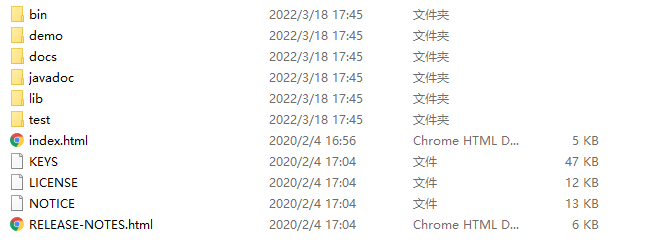

   在bin目录下面有一个ij, 可以使用该脚本来启动一个应用程序, 并使用该引用程序来创建, 连接derby数据库.

   windows下可以双击或者cmd运行, linux下使用bash执行

   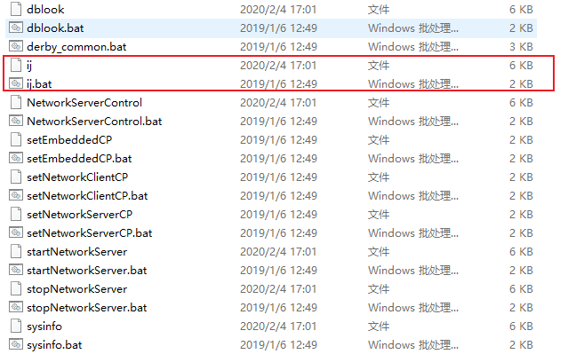

2. 双击ij.bat

   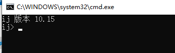

3. 执行`connect 'jdbc:derby:testdb;create=true';`创建数据库.

   - create=true表示没有数据库的话就新建
   - 分号表示语句结尾
   - 执行connect之后, 会查找**执行ij程序的目录下**有没有testdb数据库, 没有的话就新建
   - 当前的ij程序已经连接到了testdb数据库了, 所以其他的程序就无法连接这个数据库了, 因为嵌入模式下, 一个数据库一次只能有一个连接.

   

4. 执行`create table test_table(id bigint);`建表

   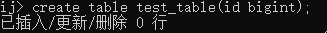

5. 执行`insert into test_table values (20);`插入数据

   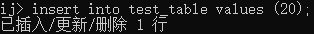

6. 执行`exit;`退出ij.

7. 结束之后可以看到, 在**运行ij的目录**下生成了数据库的文件夹, 这个文件夹包括了testdb的所有数据.

   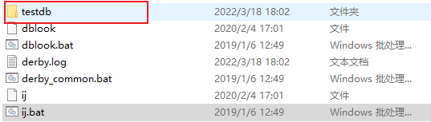

> 嵌入模式总结

嵌入模式下, derby数据库的所有数据都存放在他生成的那个文件夹下面(也就是上面提到的testdb). 

嵌入到应用程序里面的与其说是一个derby数据库, 不如说是一个derby数据管理系统, 来查询修改这个文件夹下面的数据.  所以复制这个文件夹相当于复制了一个数据库.

同时, 这个derby数据管理系统连接上了这个数据库, 就意味着这个文件夹被独占了, 这样嵌入到别的应用程序的derby数据管理系统就没有办法连接这个数据库了.

应用系统和这个derby数据管理系统在同一个jvm中, 应用系统关闭了, 这个derby数据管理系统也就关闭了, 对应数据库的文件夹相当于解除释放了.

并且, 这个数据管理系统在连接时, 也就是上面的ij执行connect时, 会查找当前运行的模型下有没有这个数据库, 如果没有就新建, 所以你只要换一个目录运行ij的话就会发现连接不上了.只能在数据库所在的目录下运行ij才能连接上这个数据库.


### Hive安装使用Derby数据库

**hive安装需要jdk8, jdk11报错**

1. 下载Hive包并解压

   - 下载地址 http://archive.apache.org/dist/hive/
   - tar -xzvf apache-hive-3.1.2-bin.tar.gz

2. 配置环境变量

   在/etc/profile, 和 ~/.bashrc下配置环境变量

   ~~~java
   export HIVE_HOME=/opt/module/hive
   export PATH=$PATH:$HIVE_HOME/bin
   ~~~

3. 初始化derby数据库

   ~~~shell
   bin/schematool -dbType derby -initSchema
   ~~~

4. 启动hive

   ~~~shell
   bin/hive
   ~~~

   默认的元数据库连接地址是`jdbc:derby:;databaseName=metastore_db;create=true`
   
   所以会查找执行hive的默认下有没有这个metastore_db的derby数据库. 如果没有就新建. 
   
   所以会有两个头疼的点
   
   - 相同目录下无法启动两个hive, 因为第一个启动的hive会对元数据库独占, 第二个就无法连接上了
   - 不同目录下启动两个hive, 那么他们回是两个毫不相干的hive, 因为启动时会查找执行hive命令的目录下有没有metastore_db这个数据库, 没有就新建. 因为启动目录不同, 所以会创建两个metastore_db数据库, 这样这两个hive就变成了好不相干的hive了
   
   
   
   

### Hive安装使用MySQL数据库

**hive安装需要jdk8, jdk11报错**

1. 下载Hive包并解压

   - 下载地址 http://archive.apache.org/dist/hive/
   - tar -xzvf apache-hive-3.1.2-bin.tar.gz

2. 配置环境变量

   在/etc/profile, 和 ~/.bashrc下配置环境变量

   ~~~java
   export HIVE_HOME=/opt/module/hive
   export PATH=$PATH:$HIVE_HOME/bin
   ~~~

3. 安装mysql, 并配置mysql 库下的 user 表中的 root 用户允许任意 ip 连接  

   ~~~shell
   mysql> update mysql.user set host='%' where user='root';
   mysql> flush privileges;
   ~~~

4. 从maven仓库下载mysql对应jdbc驱动包到Hive的`lib`目录下

   ~~~shell
   wget https://repo1.maven.org/maven2/mysql/mysql-connector-java/8.0.28/mysql-connector-java-8.0.28.jar
   ~~~

5. 在mysql中创建hive的元数据库

   ~~~shell
   mysql> create database hive_metadata
   ~~~

7. 在`$HIVE_HOME/conf/hive-site.xml`( 没有新建 ) 配置hive到mysql的连接信息

   ~~~xml
   <?xml version="1.0"?>
   <?xml-stylesheet type="text/xsl" href="configuration.xsl"?>
   <configuration>
       <!-- jdbc 连接的 URL -->
       <property>
           <name>javax.jdo.option.ConnectionURL</name>
           <value>jdbc:mysql://hadoop102:3306/hive_metadata?useSSL=false</value>
       </property>
       <!-- jdbc 连接的 Driver-->
       <!-- com.mysql.cj.jdbc.Driver对应8.x  com.mysql.jdbc.Driver对应5.x-->
       <property>
           <name>javax.jdo.option.ConnectionDriverName</name>
           <value>com.mysql.cj.jdbc.Driver</value>
       </property>
       <!-- jdbc 连接的 username-->
       <property>
           <name>javax.jdo.option.ConnectionUserName</name>
           <value>root</value>
       </property>
       <!-- jdbc 连接的 password -->
       <property>
           <name>javax.jdo.option.ConnectionPassword</name>
           <value>000000</value>
       </property>
       <!-- Hive default数据库在hdfs上的地址, 同时该目录也作为其他数据库的父目录, 创建其他数据库时将会在该目录下面创建一个数据库名.db的目录 -->
       <property>
           <name>hive.metastore.warehouse.dir</name>
   		<value>/hive</value>
   	</property>
       
       <!-- 使用hive客户端时, 查询时在第一行显示的列信息 -->
       <property>
   		<name>hive.cli.print.header</name>
   		<value>true</value>
   	</property>
       <!-- 使用hive客户端时, 显示当前所在数据库 -->
   	<property>
   		<name>hive.cli.print.current.db</name>
   		<value>true</value>
   	</property>
   
   </configuration>
   ~~~
   
8. 初始化元数据库

   ~~~shell
   bin/schematool -initSchema -dbType mysql - verbose
   ~~~
   
8. 启动hive

   ~~~hive
   bin/hive
   ~~~


> 遇到的坑

~~~java
Exception in thread "main" java.lang.NoSuchMethodError: com.google.common.base.Preconditions.checkArgument(ZLjava/lang/String;Ljava/lang/Object;)V
    at org.apache.hadoop.conf.Configuration.set(Configuration.java:1357)
    at org.apache.hadoop.conf.Configuration.set(Configuration.java:1338)
    at org.apache.hadoop.mapred.JobConf.setJar(JobConf.java:536)
    at org.apache.hadoop.mapred.JobConf.setJarByClass(JobConf.java:554)
    at org.apache.hadoop.mapred.JobConf.<init>(JobConf.java:448)
    at 
~~~

hadoop-3.2.1（路径：hadoop\share\hadoop\common\lib）中该jar包为 guava-27.0-jre.jar；而hive-3.1.2(路径：hive/lib)中该jar包为guava-19.0.1.jar

将jar包变成一致的版本：删除hive中低版本jar包，将hadoop中高版本的复制到hive的lib中。


### Hive配置优先级、查看、修改

hive配置文件存放在$HIVE_HOME/conf下, 设置配置如下:

- hive-default.xml, 永久有效
- hive-site.xml, 永久有效
- 启动hive时, 通过-hiveconf param=value来设置参数, 仅本次启动有效
- 启动hive后, 通过set param=value来设置参数, 仅本次有效.

优先级有依次增加;


启动hive后, 使用查看所有参数

~~~shell
set;
~~~

启动hive后, 查看单个参数

~~~shell
set param;
~~~


### Hive元数据服务MetaStore

> 概念

MetaSore 是 Hive 元数据存储的地方。Hive 数据库、表、函数等的定义都存储在 Metastore 中。

MetaStore是一个无状态的服务, 可以起多个达到可靠性, 同时MetaStore只负责元数据的关系, 即只提供元数据增删改查的功能, 他并不负责执行

根据系统配置方式，统计信息和授权记录也可以存储在MetaStore中。Hive 或者其他执行引擎在运行时使用此数据来确定如何解析，授权以及有效执行用户查询。

> Meta作用

**客户端连接metastore服务，metastore再去连接MySQL数据库来存取元数据。有了metastore服务，就可以有多个客户端同时连接，而且这些客户端不需要知道MySQL数据库的用户名和密码，只需要连接metastore 服务即可。**

> 配置参数

| 配置参数                              | 参数说明                                                     |
| :------------------------------------ | :----------------------------------------------------------- |
| hive.metastore.local                  | 本地或远程元数据存储。该配置项从Hive 0.10 废弃，而是通过 hive.metastore.uris 来判断，如果为空，则假定为本地模式，否则为远程模式。 |
| hive.metastore.uris                   | 远程元数据存储的 Thrift URI。元数据服务客户端通过该配置连接远程元数据。 |
| javax.jdo.option.ConnectionURL        | 元数据存储的 JDBC 连接 URL                                   |
| javax.jdo.option.ConnectionDriverName | 元数据存储的 JDBC 驱动类                                     |
| javax.jdo.option.ConnectionUserName   | 元数据存储数据库用户名                                       |
| javax.jdo.option.ConnectionPassword   | 元数据存储数据库密码                                         |
| hive.metastore.warehouse.dir          | 数据仓库存储位置                                             |

### MetaStore三种部署模式

> 内嵌模式(hive cli + derby)

默认情况下，MetaStore 服务和 Hive 服务运行在同一个 JVM 中，包含一个内嵌的以本地磁盘作为存储的 Derby 数据库实例。

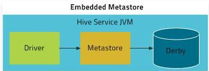

使用内嵌的 MetaStore 是 Hive 入门最简单的方法。但是，每次只有一个内嵌的 Derby 数据库可以访问某个磁盘上的数据库文件，一次只能有一个进程可以连接到数据库，因此它并不是一个实际的解决方案，但对于单元测试来说效果很好，并不适合在生产环境使用。

~~~xml

<property>
    <!-- 本地模式不需要配置 -->
  <name>hive.metastore.uris</name>
  <value/>
</property>
<property>  
  <name>javax.jdo.option.ConnectionURL</name>  
  <value>jdbc:derby:;databaseName=metastore_db;create=true</value> 
</property>  
<property>  
  <name>javax.jdo.option.ConnectionDriverName</name>  
  <value>org.apache.derby.jdbc.EmbeddedDriver</value>  
</property>
~~~

> 本地模式(hive cli+mysql)

如果要支持多会话（以及多租户），需要使用一个独立的数据库。这种配置方式成为本地配置，因为 MetaStore 服务仍然和 Hive 服务运行在同一个进程中，但连接的却是另一个进程中运行的数据库，在同一台机器上或者远程机器上。

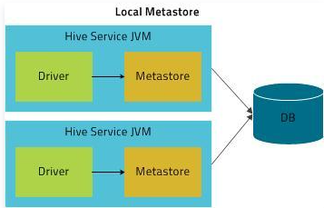

对于独立的 MetaStore，MySQL 是一种很受欢迎的选择。本实例我们 MySQL 为例，具体看看如何配置：

```xml
<property>
    <!-- 本地模式不需要配置 -->
  <name>hive.metastore.uris</name>
  <value/>
</property>
<property>  
  <name>javax.jdo.option.ConnectionURL</name>
  <value>jdbc:mysql://localhost:3306/hive_meta?createDatabaseIfNotExist=true</value>
</property>  
<property>  
  <name>javax.jdo.option.ConnectionDriverName</name>
  <value>com.mysql.cj.jdbc.Driver</value>  
</property>  
<property>  
  <name>javax.jdo.option.ConnectionUserName</name>
  <value>root</value>  
</property>  
<property>  
  <name>javax.jdo.option.ConnectionPassword</name>
  <value>root</value>  
</property>
```

在本地模式下不需要配置 hive.metastore.uris，默认为空表示是本地模式。

如果选择 MySQL 作为 MetaStore 存储数据库，需要提前将 MySQL 的驱动包拷贝到 $HIVE_HOME/lib目录下。

> 远程模式(hive cli/hiveserver2 + metastore + mysql)

在远程模式下，MetaStore 服务和 Hive 服务运行在不同进程中，**甚至不同的机器上**。MetaStore 服务通过 JDBC 与 MetaStore 数据库进行通信（使用 javax.jdo.option.ConnectionURL 属性配置）。同时Hive cli通过thrift协议与MetaStore服务通信(使用hive.metastore.uris配置), 或者可以起一个HiveServer2通过thrift协议与MetaStore服务通信.

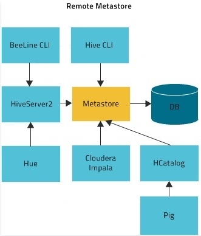

在这种情况下，我们还可以单独部署一台 MetaStore 服务器，以提供更高可用性。这也可以有更好的可管理性/安全性，因为数据库层可以完全防火墙关闭。

**Hive MetaStore 是无状态的，因此可以有多个实例来实现高可用性。**使用 hive.metastore.uris 可以指定多个远程 MetaStore。Hive 将默认使用列表中的第一个，但会在连接失败时随机选择一个，并尝试重新连接。

HiveMetaStore配置：

```xml
<property>  
  <name>javax.jdo.option.ConnectionURL</name>
  <value>jdbc:mysql://localhost:3306/hive_meta?createDatabaseIfNotExist=true</value>
</property>  
<property>  
  <name>javax.jdo.option.ConnectionDriverName</name>
  <value>com.mysql.cj.jdbc.Driver</value>  
</property>  
<property>  
  <name>javax.jdo.option.ConnectionUserName</name>
  <value>root</value>  
</property>  
<property>  
  <name>javax.jdo.option.ConnectionPassword</name>
  <value>root</value>  
</property>
```

Hive客户端配置

~~~xml
<!-- 指定metastore的地址 -->
<property>
	<name>hive.metastore.uris</name>
	<value>thrift://hadoop102:9083</value>
</property>
~~~

通过一下命令启动hive metastore,

nohup:  放在命令开头，表示不挂起,也就是关闭终端进程也继续保持运行状态

&表示后台运行

~~~shell
nohup hive --service metastore 1>/dev/null 2>&1 & 
~~~

启动hive客户端连接metastore

~~~shell
bin/hive
~~~


> Hive修改日志文件位置

- Hive 的 log 默认存放在/tmp/${user.name}/hive.log 

- 修改hive的log存放日志

  - 修改/opt/module/hive/conf/hive-log4j2.properties.template 文件名称为 hive-log4j2.properties

  - 在 hive-log4j2.properties 文件中修改 log 存放位置

    ~~~txt
    hive.log.dir=/opt/module/hive/logs 
    ~~~

    

### HiveServer2

> metastore和hiveserver2的区别

metaStore：

- hive的metaStore提供的是一个服务，而这个服务就是将hive的元数据暴露出去，而不需要通过对hive元数据库mysql的访问才能拿到hive的元数据信息, 可以减少mysql账号密码泄露的可能
- metastore服务实际上就是一种thrift服务，通过它我们可以获取到hive元数据，并且通过thrift获取原数据的方式，屏蔽了数据库访问需要驱动，url，用户名，密码等等细节
- **metastore只提供数据管理的功能, 换句话说, 对hive元数据的增删改查可以通过metastore来执行, 但是也仅此而已**

hiveServer2: 

- HiveServer2（HS2）是一个服务端接口，相当于一个常驻后台的hive客户端, 使远程客户端可以通过jdbc, odbc, thrift连接到HiveServer2上并执行对Hive的查询

  **HiveServer2会从metastore中获取Hive的元数据, 将 SQL 查询解析成逻辑计划，然后优化成执行计划。并将具体的执行计划交给底层的执行引擎去执行**
  
  **可以理解为HiveServer2就是一个常驻后台的Hive-Cli**
  
  
  
- 目前基于Thrift RPC的实现是HiveServer的改进版本，并支持多客户端并发.
  
- hiveServer2启动时需要依赖metastore服务, 所以在启动时需要先启动metaStore, 并在配置文件中配置metastore的地址

> 启动

1. 在hive-site.xml中配置hiveserver2绑定的端口和地址,  已经metastore的地址

   ~~~xml
   <!-- 指定 hiveserver2绑定的端口号 -->
   <property>
   <name>hive.server2.thrift.port</name>
   <value>10000</value>
   </property>
   <!-- 指定 hiveserver2绑定的 host -->
   <property>
   <name>hive.server2.thrift.bind.host</name>
   <value>hadoop102</value>
   </property>
   <!-- 指定metastore的地址 -->
   <property>
   	<name>hive.metastore.uris</name>
   	<value>thrift://hadoop102:9083</value>
   </property>
   ~~~

2. 启动metastore服务

   ~~~shell
   nohup hive --service metastore 1>/dev/null 2>&1 & 
   ~~~

3. 启动hiveserver2服务

   ~~~shell
   nohup hive --service hiveserver2 1>/dev/null 2>&1 & 
   ~~~

4. 判断是否启动

   **可以查看/tmp/username/hive.log查看启动日志的详细信息来判断是否启动**。

   或者浏览器直接访问10002端口来判断, hiveserver2启动后会占用该端口用于hiveserver2的web ui。

   在或者通过命令`netstat -tunlp | grep 10000`看端口是否被占用来判断。

5. 通过dbeaver连接hiveserver2

> 完整的配置文件

~~~xml
<?xml version="1.0"?>
<?xml-stylesheet type="text/xsl" href="configuration.xsl"?>
<configuration>
    <!-- ------------以下是metastore配置 ------------->
    <!-- jdbc 连接的 URL -->
    <property>
        <name>javax.jdo.option.ConnectionURL</name>
        <value>jdbc:mysql://192.168.31.100:3306/hive_metadata?useSSL=false&amp;createDatabaseIfNotExist=true</value>
    </property>
    <!-- jdbc 连接的 Driver-->
    <property>
        <name>javax.jdo.option.ConnectionDriverName</name>
        <value>com.mysql.cj.jdbc.Driver</value>
    </property>
    <!-- jdbc 连接的 username-->
    <property>
        <name>javax.jdo.option.ConnectionUserName</name>
        <value>root</value>
    </property>
    <!-- jdbc 连接的 password -->
    <property>
        <name>javax.jdo.option.ConnectionPassword</name>
        <value>871403165</value>
    </property>

    <!-- default数据库在hdfs上的位置 -->
    <property>
        <name>hive.metastore.warehouse.dir</name>
        <value>/hive</value>
    </property>

    <!-- 使用hive客户端时, select在表头添加列信息 -->
    <property>
        <name>hive.cli.print.header</name>
        <value>true</value>
    </property>
    <!-- 使用hive客户端时, 显示当前所在数据库 -->
    <property>
        <name>hive.cli.print.current.db</name>
        <value>true</value>
    </property>
    <!-- --------以下是hiveserver2配置 ----------->
    <!-- 指定存储元数据要连接的地址 -->
	<property>
        <name>hive.metastore.uris</name>
        <value>thrift://hadoop102:9083</value>
	</property>
	<property>
        <name>hive.server2.enable.doAs</name>
        <value>false</value>
	</property>
	<!-- 指定 hiveserver2 的端口号 -->
	<property>
		<name>hive.server2.thrift.port</name>
		<value>10000</value>
	</property>
	<!-- 指定 hiveserver2 的 host -->
	<property>
		<name>hive.server2.thrift.bind.host</name>
		<value>hadoop102</value>
	</property>
</configuration>
~~~


> 遇到的坑

- hive-site.xml中需要配置hive metastore的地址

- 关于 User:  not allowed to impersonate anonymous  (state=08S01,code=0)的问题， 在hive-site.xml中配置这个属性

  ~~~xml
    <property>
      <name>hive.server2.enable.doAs</name>
      <value>false</value>
    </property>
  ~~~

  这个属性的意思是:  
  
  当设置为true的时候, HiveServer2 将以提交查询的用户身份执行查询sql。这意味着 HiveServer2 将会在执行查询时，使用提交查询用户的权限。这样可以确保用户在查询时只能访问他们有权限访问的数据和资源。
  
  设置为 `false` 时，HiveServer2 将以 HiveServer2 服务启动的用户身份执行所有查询。这种情况下，所有查询将以同一个用户的身份执行，不管是哪个用户提交的查询。
  
  这个属性默认为true


### Hive日志

hive日志配置文件为$HIVE_HOME/conf/hive-log4j2.properties

刚解压是没有这个文件的, 只有一个hive-log4j2.properties.template文件, 可以通过cp命令复制为hive-log4j2.properties

hive默认日志文件位置通过hive-log4j2.properties中的以下两个属性配置, 默认在/tmp/username/hive.log

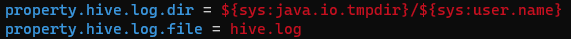

需要注意的是, hive metastore和hiveserver2的日志文件都是这个hive.log, 所以两个进程的日志是混在一起的.

启动时可以通过tail这个hive.log文件来查看是否启动

hiveserver2记录的客户端提交的操作日志在/tmp/username/operation_logs目录下.


### Dbeaver连接HiveServer2

1. 设置host， port

   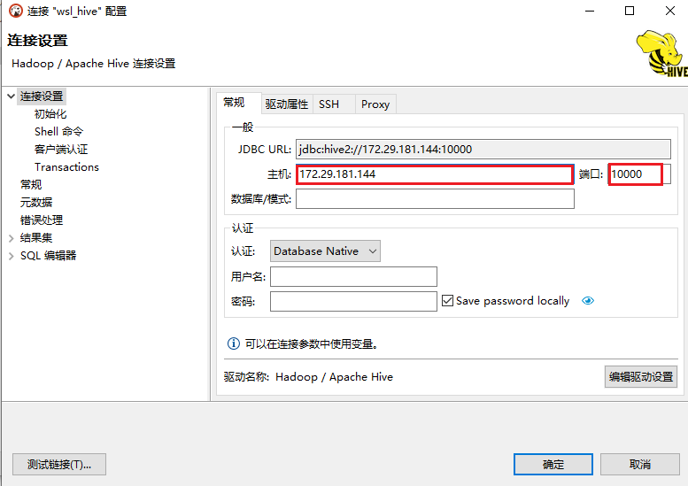

2. 添加jdbc驱动

   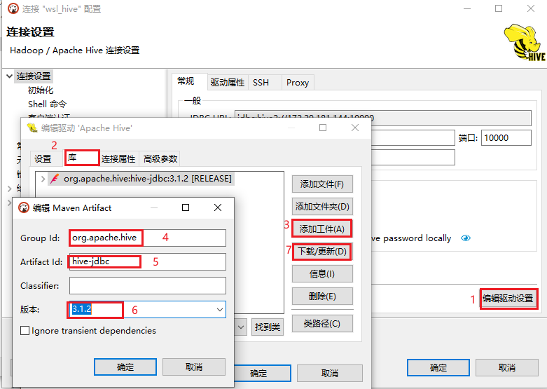

3. 设置aliyun maven

   添加aliyun maven地址：https://maven.aliyun.com/repository/public/

   并且移动到最上面

   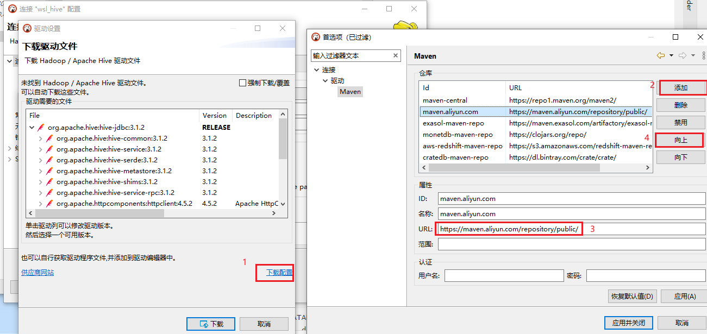

4. 如果下载jar包的过程中出现“Can't open 'https://maven.aliyun.com/repository/public/org/apache/curator/apache-curator/2.12.0/apache-curator-2.12.0.jar': Not Found”，  直接点忽略


### HiveServer2的登录管理

hiveserver2支持的登录方式有: 

1. NONE: (默认)不开启用户安全认证, 任何登录者都拥有超级权限，可以对hive进行任意操作
2. NOSASL: 只需要一个提前设置好的用户名，不需要密码，不填写或者填写错误用户名会导致报错。

3. KERBEROS: 用户需要拥有hive的keytab文件（类似于ssh-key等密钥），有了keytab就相当于拥有了永久的凭证，不需要提供密码，因此只要linux的系统用户对于该keytab文件有读写权限，就能冒充指定用户访问hadoop，因此keytab文件需要确保只对owner有读写权限。
4. LDAP: hive采用ldap统一认证服务，连接访问时需要提供username和password
5. PAM: hive采用pam认证模块，同样需要提供username和password，只是原理大不相同。
6. CUSTOM: hive采用pam认证模块，同样需要提供username和password，只是原理大不相同。

可以通过如下配置来指定

~~~xml
	<property>
		<name>hive.server2.authentication</name>
		<value>NONE</value>
	</property>
	<property>
		特定认证方式的属性
	</property>
~~~


###  Hive模式总结

针对Hive的元数据保存在哪里, 衍生出两种模式

1. derby内嵌数据库

   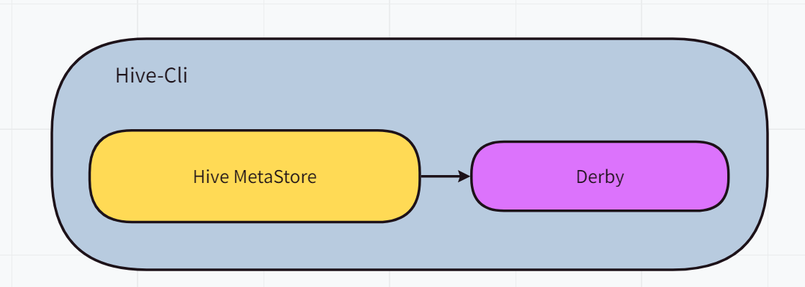

2. mysql外部数据库

   对于元数据保存在mysql中的时候, 又依据metastore运行在哪里, 又眼神出两种模式

   1. 运行在Hive-Cli内部

      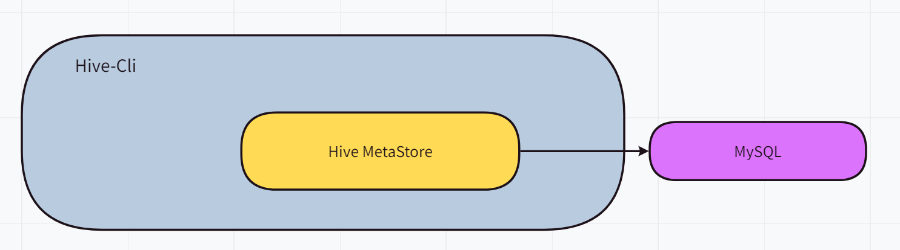

   2. 运行在Hive-Cli外部

      这样我们的dbeaver, datagrap, navicat就可以连接上HiveServer2执行hive sql了

      同时impala也可以利用metastore来存储相关的元数据

      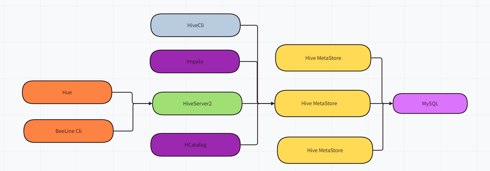

   


### Hive on Spark环境搭建

参考

https://blog.csdn.net/rfdjds/article/details/125389450

https://blog.csdn.net/weixin_52918377/article/details/117123969

https://www.codeleading.com/article/57825802540/

https://www.cnblogs.com/yutianzixia/p/15342773.html

在搭建hive on spark的环境中, 因为hive3.1.2支持的spark版本为2.3.0, 太低了, 想使用spark3.2.2, 所以需要自己手动编译源码. 使用的hadoop版本为hadoop-3.2.1

#### 手动编译hive源码

> 编译环境

- jdk1.8: 因为hive使用的jdk1.8编写的, 如果使用jdk11进行编译的话, 会有一些jdk1.8的类找不到, 导致无法编译成功

- 系统环境选择linux, 因为在maven进行编译的时候会触发shell脚本的执行, 而windwos上无法执行脚本.

  在虚拟机上的linux中编译使用maven打包项目, 不要在wsl中使用maven, 慢得要死

> 编译步骤

1. 下载hive的源码包并解压

2. 使用idea打开项目, 找到根目录下面的pom.xml

3. 修改spark, scala相关的版本

   ~~~xml
   <spark.version>3.2.1</spark.version>
   <scala.binary.version>2.13</scala.binary.version>
   <scala.version>2.13.4</scala.version>
   ~~~

4. 修改SparkCounter.java为如下, 因为Accmulator和AccumutorParam两个类已经不存在了

   ~~~java
   import  java.io.Serializable;  
   import  org.apache.spark.api.java.JavaSparkContext;
   //   org.apache.spark.Accumulator已被删除，由以下类代替
   import  org.apache.spark.util.LongAccumulator;  
   //  org.apache.spark.AccumulatorParam已被删除，一并删除它的实现类
     
   public  class  SparkCounter  implements  Serializable  {  
     private  String  name;  
     private  String  displayName;  
     private  LongAccumulator  accumulator;  
     private  long  accumValue;  
     public  SparkCounter()  {}  
     private  SparkCounter(String  name,  String  displayName,  long  value)  {  
     this.name  =  name;  
     this.displayName  =  displayName;  
     this.accumValue  =  value;  
     }  
     public  SparkCounter(String  name,  String  displayName,  String  groupName,  long  initValue,  JavaSparkContext  sparkContext)  {  
     this.name  =  name;  
     this.displayName  =  displayName;  
     String  accumulatorName  =  groupName  +  "_"  +  name; 
     // 修改累加器的获取方式 
     this.accumulator  =  JavaSparkContext.toSparkContext(sparkContext).longAccumulator(accumulatorName);  
     // 添加参数值
     this.accumulator.setValue(initValue);  
     }  
       
     public  long  getValue()  {  
     if  (this.accumulator  !=  null)  
     return  this.accumulator.value().longValue();    
     return  this.accumValue;  
     }  
     public  void  increment(long  incr)  {  
     this.accumulator.add(incr);  
     }  
     public  String  getName()  {  
     return  this.name;  
     }  
     public  String  getDisplayName()  {  
     return  this.displayName;  
     }  
     public  void  setDisplayName(String  displayName)  {  
     this.displayName  =  displayName;  
     }  
     SparkCounter  snapshot()  {  
     return  new  SparkCounter(this.name,  this.displayName,  this.accumulator.value().longValue());  
     }  
   }
   ~~~

5. 修改ShuffleWriteMetrics.java

   ~~~java
   import java.io.Serializable;  
   import org.apache.spark.executor.TaskMetrics;  
   import org.apache.hadoop.hive.common.classification.InterfaceAudience;  
   /**  
    * Metrics pertaining to writing shuffle data. */@InterfaceAudience.Private  
   public class ShuffleWriteMetrics implements Serializable {  
     
       /** Number of bytes written for the shuffle by tasks. */  
     public final long shuffleBytesWritten;  
     /** Time tasks spent blocking on writes to disk or buffer cache, in nanoseconds. */  
     public final long shuffleWriteTime;  
     
    private ShuffleWriteMetrics() {  
           // For Serialization only.  
     this(0L, 0L);  
     }  
       public ShuffleWriteMetrics(  
               long shuffleBytesWritten,  
    long shuffleWriteTime) {  
           this.shuffleBytesWritten = shuffleBytesWritten;  
    this.shuffleWriteTime = shuffleWriteTime;  
     }  
     
       public ShuffleWriteMetrics(TaskMetrics metrics) { 
       //  metrics.shuffleWriteMetrics().ShuffleBytesWritten()不存在，从名称看类似的方法为bytesWritten()
       // metrics.shuffleWriteMetrics().ShuffleWriteTime()同样不存在，修改为writeTime()
           this(metrics.shuffleWriteMetrics().bytesWritten(),  
     metrics.shuffleWriteMetrics().writeTime());  
     }  
   }
   
   ~~~

6. 修改TestStatsUtils.java中的import语言

   ~~~java
   // import org.spark_project.guava.collect.Sets;
   import com.google.common.collect.Sets;
   ~~~

7. 在wsl中, cd到项目根路径下, 使用一下脚本编译

   ~~~shell
   # -s指定mvn的settings文件
   # -T指定使用12个线程进行并行编译, 可以在打包很慢的情况下使用
   # -P指定激活的profile
   mvn package -DskipTests -Dmaven.javadoc.skip=true -s
    /opt/apache-maven/apache-maven-3.6.3/conf/settings_all_cloud_linux.xml -Pdist
   ~~~

> 遇到的坑

- 如果发现某个项目打包出现错误,  建议进到子项目里面打个包试一下是否报错, 因为整个项目一起打包的话, 会有些同包同名的类冲突

  如果在子项目里面打包成功再在跟项目下面进行打包

- 基本的打包步骤就是这样, 如果遇到其他问题还是要看具体的报错情况

  有时候还是maven这鬼东西发疯。。。

- 如果maven本地仓库有hive需要的依赖的话, 一般的打包时间在五分钟以内

#### 安装hive on spark

1. 将编译好的hive包解压并安装, 参看上面的hive使用mysql的步骤

   - 配置HIVE_HOME

   - 记得在$HIVE_SPARK/lib中下载mysql对应的驱动包

   - 为了处理hive-3.1.2和hadoop-3.1.3中guava包版本冲突的问题需要把hive/lib下的guava19替换成guava27（可以在hadoop\share\hadoop\common\lib下复制一个）

     或者修改hive源码中guava的版本重新编译hive, 参考https://github.com/gitlbo/hive/commits/3.1.2

   - 设置metastore和hiveserver2等配置

2. 因为spark中的jar包是自带hive的jar包的, 而自带的hive jar包版本太低, 会与我们自己使用的hive jar包冲突, 所以必须要有一个不带hive jar包的spark版本, 有两种方法可以获取                          

   - 下载spark源码, 按照官方文档重新编译, https://cwiki.apache.org/confluence/display/Hive/Hive+on+Spark%3A+Getting+Started(需要linux环境)

     ~~~shell
     ./dev/make-distribution.sh --name "hadoop2-without-hive" --tgz "-Pyarn,hadoop-provided,hadoop-2.7,parquet-provided,orc-provided"
     ~~~

   - 从官网下载完整版的jar包，解压后将其jars目录下的hive相关jar包全部删掉(本文即使用此种方法)

3. 从官网下载spark完整的压缩包, 解压并配置环境变量

4. 准备去hive版本的spark

   ~~~shell
   cd $SPARK_HOME
   mv jars/hive-storage-api-2.7.2.jar .   //把这包先移出去
   rm -rf jars/*hive*                     //删除hive相关包
   rm -rf jars/orc*					   //删除orc相关包, 因为hive自带
   rm -rf jars/parquet*                   //删除parquet相关包, 因为hive自带
   mv hive-storage-api-2.7.2.jar jars/    //再移回去
   ~~~

5. 将jar中jar包传到hive上, 给其他机器使用

   ~~~shell
   hdfs dfs -mkdir -p /spark-jars
   hdfs dfs -put jars/* /spark-jars/
   ~~~

6. 在hdfs上创建spark-history存日志

   ~~~shell
   hdfs dfs -mkdir -p /spark-history
   ~~~

7. 修改hive-site.xml, 配置hive对接spark相关的配置

   ~~~xml
     <!--Spark依赖位置，上面上传jar包的hdfs路径-->
   <property>
     <name>spark.yarn.jars</name>
     <value>hdfs://hadoop102:8020/spark-jars/*</value>
   </property>
   <!--Hive执行引擎，使用spark-->
   <property>
     <name>hive.execution.engine</name>
     <value>spark</value>
   </property>
   <!--Hive连接spark-client超时时间-->
   <property>
     <name>hive.spark.client.connect.timeout</name>
     <value>30000ms</value>
   </property>
   ~~~

8. 在hive/conf目录下生成一个spark-default.conf,  用以配置spark的配置

   ~~~conf
   spark.master             yarn
   spark.eventLog.enabled   true
   spark.eventLog.dir       hdfs://bdp3install:8020/spark-history
   spark.executor.memory    4g
   spark.driver.memory      4g
   spark.serializer         org.apache.spark.serializer.KryoSerializer
   spark.executor.cores     2
   spark.yarn.driver.memoryOverhead    400m
   ~~~

9. 启动hivemetastore

   ~~~shell
   cd $HIVE_HOME
   nohup bin/hive --service metastore &
   等metastore启完(9083端口被监听了)
   ~~~

10. 启动hive cli连接metastore,  并想表中插入一条数据

    ~~~shell
    bin/hive
    create table test4(id string );
    insert into test4 values ("zhangsan");
    ~~~

    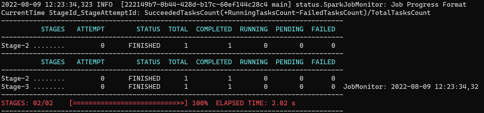

11. 查看yarn web

    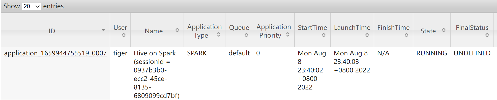

> 遇到的坑

1. 第一次插入数据成功, 但是第二次插入数据失败, 报错

   ~~~java
   java.lang.ClassCastException: org.apache.hadoop.hive.metastore.api.StringColumnStatsData cannot be cast to org.apache.hadoop.hive.metastore.columnstats.cache.StringColumnStatsDataInspector
   ~~~

   网上搜索好像是hive3.2.1的一个bug, 有以下三种方法修复

   - 按照https://blog.csdn.net/weixin_52918377/article/details/117123969中提到的, 按照https://github.com/gitlbo/hive/commits/3.1.2修改源码并重新编译hive

   - 建表之前设置set hive.stats.autogather=false；
   - 建表之后 执行load data inpath “/xxx.txt” into table tal_name;

   2,3 方法可以去掉表的列状态为True的情况 即可重复执行INSERT INTO tb_name values

   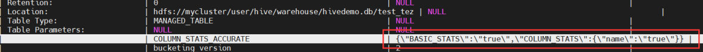


#### hive on spark的原理

在启动hive cli或者有客户端连接到 hiveserver2的时候, 当触发计算的时候, hive会通过rpc调用yarn启动一个spark集群, 因为这个时候涉及到将hdfs上的spark jar包分发的集群上, 所以第一次会慢一点. 

启动spark集群后该集群会一直存在直到hive cli或者连接hiveserver2的连接关闭. 之后每一次的任务执行都会提交到这个spark集群上面.


**所以当我们在使用一些客户端工具, 比如datagrep, dbeaver的时候, 我们不要开多个connection, 因为这样会创建多个connection, 也就会创建多个spark 集群, 我们可以使用多个编辑窗口, 但是使用同一个connection**


### Hive DDL

#### DDL 库

- 建库

  ~~~sql
  CREATE DATABASE [IF NOT EXISTS] database_name 
  [COMMENT  database_comment]  -- 注释
  [LOCATION hdfs_path]  -- 指定库在hdfs存储路径
  [WITH DBPROPERTIES (property_name=property_value, ...)];  -- 指定一下属性, 如创建者, 创建时间
  ~~~

  案例

  ~~~sql
  -- db_hive2.db 是一个目录
  create database db_hive2 location '/db_hive2.db'; 
  ~~~

- 显示所有库

  ~~~sql
  show databases [like 'xxx'];
  ~~~

- 切换库

  ~~~sql
  use db_name
  ~~~

- 删除库

  ~~~sql
  -- 库中有表存在不允许删除, 需要使用cascade强制删除
  drop database [if exists] db_name [cascade] 
  ~~~

- 修改库的properties

  ~~~sql
  alter database db_hive set dbproperties('createtime'='20170830');
  ~~~

- 显示库详细信息
  ~~~sql
  desc [extended] database db_name  -- extended表示详细信息,比如database的properties
  ~~~

#### DDL 表

- 创建表

  ~~~sql
  create [external] table [if not exists] table_name 
  [(col_name data_type [comment col_comment], ...)] 
  [comment table_comment] 
  [partitioned by (col_name data_type [comment col_comment], ...)] 
  [clustered by (col_name, col_name, ...) 
  [sorted by (col_name [asc|desc], ...)] into num_buckets buckets] 
  [row format delimited  
   	[fields terminated by 'char'] 
   	[collection items terminated by 'char'] 
   	[map keys terminated by 'char'] 
   	[lines terminated by 'char']
  [row format SERDE  serde_name  
   	[WITH  SERDEPROPERTIES  (property_name=property_value,  property_name=property_value, ...)] --row format的另一种写法
  [stored as file_format] 
  [location hdfs_path] 
  [tblproperties (property_name=property_value, ...)] 
  [as select_statement | like table_name]
  ~~~

  - create table  创建一个指定名字的表。如果相同名字的表已经存在，则抛出异常； 用户可以用 IF NOT EXISTS  选项来忽略这个异常。

  - external 关键字可以让用户创建一个外部表，在建表的同时可以指定一个指向实 际数据的路径（LOCATION），在删除表的时候，内部表的元数据和数据会被一起删除，而外 部表只删除元数据，不删除数据。

  - comment：为表和列添加注释。

  - partition by 创建分区表

  - clustered by 创建分桶表

  - sorted by 不常用，对桶中数据按照的一个或多个列进行排序

  - ROW FORMAT 

    用户在建表的时候可以自定义 SerDe  或者使用自带的 SerDe。如果没有指定 ROW FORMAT 或者 ROW FORMAT DELIMITED，将会使用自带的 SerDe。

    在建表的时候，用户还需 要为表指定列，用户在指定表的列的同时也会指定自定义的 SerDe，Hive 通过 SerDe 确定表 的具体的列的数据。

    SerDe 是 Serialize/Deserilize 的简称， hive 使用 Serde 进行行对象的序列与反序列化。

  - STORED AS 指定存储文件类型 常用的存储文件类型：SEQUENCEFILE（二进制序列文件）、TEXTFILE（文本）、RCFILE（列式存储格式文件）。如果文件数据是纯文本，可以使用 STORED AS TEXTFILE。如果数据需要压缩，使用 STORED AS SEQUENCEFILE。

  - LOCATION  ：指定表在 HDFS 上的存储位置。

  - AS：后跟查询语句，根据查询结果创建表。

  - LIKE 允许用户复制现有的表结构，但是不复制数据。

- 查看表的建表语句

  ~~~sql
  show create table tbl_name;
  ~~~

- 查看表结构和属性

  ~~~sql
  desc [formatted ]tbl_name -- 不加formatted表示查看表结构, 添加formatted表示查看各种属性
  ~~~

- 查看表是否为内外部表

  ~~~sql
  desc formatted tbl_name -- 查看Table Type字段, MANAGED_TABLE表示内部表, EXTERNAL_TABLE表示外部表
  ~~~

- 外部表与内部表转换

  ~~~sql
  alter table student2 set tblproperties('EXTERNAL'='FALSE'); --设置为FALSE或者true, 区分大小写
  ~~~

- 重命名表

  ~~~sql
  alter table tbl_name rename to tbl_name1
  ~~~

- 修改列

  ~~~sql
  ALTER TABLE table_name CHANGE [COLUMN] col_old_name col_new_name column_type [COMMENT col_comment] [FIRST|AFTER column_name]
  ~~~

- 新增/替换表

  ~~~sql
  ALTER TABLE table_name ADD|REPLACE COLUMNS (col_name data_type [COMMENT col_comment], ...)
  ~~~

  新增字段在所有列的后面(partition 列前)

  替换表示替换当前表的所有列为当前语句的定义的列

- 删除表

  ~~~sql
  drop table tbl_name;
  ~~~


### Hive DML

- 导入数据

  ~~~sql
  load data [local] inpath '数据的 path' [overwrite] into table database_name.tbl_name [partition (partcol1=val1,…)];
  ~~~

  - local:表示从本地加载数据到 hive 表；否则从 HDFS 加载数据到 hive 表

  - inpath:表示加载数据的路径, 如果指定了local，那个inpath为本地路径， 否则为hdfs路径。

  - overwrite:表示覆盖表中已有数据，否则表示追加
  - partition:表示上传到指定分区

- 手动插入数据

  ~~~sql
  insert into tbl_name(column_name) values(xxx), (xxx);
  ~~~

- 根据查询结果插入数据，不支持部分字段插入

  ~~~sql
  [insert into | insert overwrite] tbl_name select ... from ...
  ~~~

  insert into 表示追加

  insert overwrite表示覆盖

  案例

  ~~~sql
  insert overwrite table student partition(month='201707') select id, name where month='201709'
  insert overwrite table student partition(month='201706') select id, name where month='201709';
  ~~~

### hive导入数据的几种方式

1. 将query结果插入数据

   ~~~sql
   INSERT OVERWRITE TABLE tablename1 [PARTITION (partcol1=val1, partcol2=val2 ...) [IF NOT EXISTS]] select_statement1 FROM from_statement;
   INSERT INTO TABLE tablename1 [PARTITION (partcol1=val1, partcol2=val2 ...)] select_statement1 FROM from_statement;
   -- 如果分区列给定一个静态的值, 那就是静态分区, 如果分区没有值,那儿就是动态分区.
   -- 对于动态分区, 动态分区列必须放在select语句中的列最后, 并且与partition()子句中出现的顺序相同
   ~~~

2. 通过sql插入数据

   ~~~sql
   INSERT INTO TABLE tablename [PARTITION (partcol1[=val1], partcol2[=val2] ...)] VALUES values_row [, values_row ...]
   ~~~

3. load data

   ~~~sql
   LOAD DATA [LOCAL] INPATH 'filepath' [OVERWRITE] INTO TABLE tablename [PARTITION (partcol1=val1, partcol2=val2 ...)]
   ~~~

4. 直接在文件所在的位置创建表或者添加分区

   ~~~sql
   -- 如果文件已经在将要创建的表和分区的路径上, 可以不用指定location
   create table (...)
   location ''
   alter table tbl add partition(col=value) [location 'path/to/file']
   ~~~

5. 创建分区或者表之后, 将文件上传到分区或者表路径下, 执行修复命令

   ~~~sql
   hadoop dfs -put file hdfs_path
   ~~~

   ~~~sql
   msck repair table dept_partition2;
   ~~~

6. 使用import导入数据

   使用import导入数据, 和load data区别在于import导入的是一张完整的表, 包括元数据(表结构等等)和表数据, 所以import导入的必须是export导出的数据, 常用于数仓的迁移. 而load data只是负责导入表数据.

   load data和直接在文件路径上创建表或者分区的区别是, load data会将文件拷贝一份到表或者分区路径下, 而直接在表或者分区路径上创建分区则不会.


### Hive UDTF

#### 基本使用说明

https://cwiki.apache.org/confluence/display/Hive/LanguageManual+LateralView

udtf能够将一行转换为多行, 所以也称为炸裂函数

函数语法是: 

~~~sql
-- OUTER的作用在于如果udtf返回0行, 那么用于炸裂的行将不会出现在结果中, 为了防止这种结果, 可以使用outer, 将会生成一个所有列都是null的行
-- SELEC * FROM src LATERAL VIEW explode(array()) C AS a将会导致返回空行, 使用outer可以避免
lateralView:  LATERAL VIEW [OUTER] udtf(expression) tableAlias AS columnAlias (',' columnAlias)*
fromClause: FROM baseTable (lateralView)*
~~~

系统内置的udtf有:

| **Row-set columns types** | **Name(Signature)**                                    | **Description**                                              |
| :------------------------ | :----------------------------------------------------- | :----------------------------------------------------------- |
| T                         | explode(ARRAY<T> a)                                    | 将一个数组炸裂为多行                                         |
| Tkey,Tvalue               | explode(MAP<Tkey,Tvalue> m)                            | 将一个map炸裂为多行, 每一行两个列, 分别为key, value          |
| int,T                     | posexplode(ARRAY<T> a)                                 | 与explode类似, 但是多一列, 是数组的下标                      |
| T1,...,Tn                 | inline(ARRAY\<STRUCT\<f1:T1,...,fn:Tn>> a)             | 将数组炸裂为多行, struct的顶级元素转换为多列                 |
| T1,...,Tn/r               | stack(int r,T1 V1,...,Tn/r Vn)                         | 将n个值转换为r行, 每行n/r列                                  |
|                           |                                                        |                                                              |
| string1,...,stringn       | json_tuple(string jsonStr,string k1,...,string kn)     | 传入json字符串和n个josn key, 返回一行n列, 每列表示json key对应的json value. 这个函数相当于高效版本的`get_json_object`, 因为他可以一次性从json中取出多个值 |
| string 1,...,stringn      | parse_url_tuple(string urlStr,string p1,...,string pn) | 从url中模式匹配出多个值, 传入的参数可以是如下之一: HOST, PATH, QUERY, REF, PROTOCOL, AUTHORITY, FILE, USERINFO, QUERY:\<KEY>.  相当于高效版的`parse_url()` |

案例: 

有以下表pageAds

| pageid (string) | adid_list(array\<int>) |
| :-------------- | :--------------------- |
| front_page      | [1, 2, 3]              |
| contact_page    | [3, 4, 5]              |

以下sql结果如下:

~~~sql
select pageid from pageAds lateral view explode(adid_list) adTable as adid
~~~

| pageid (string) | adid (int) |
| :-------------- | :--------- |
| "front_page"    | 1          |
| "front_page"    | 2          |
| "front_page"    | 3          |
| "contact_page"  | 3          |
| "contact_page"  | 4          |
| "contact_page"  | 5          |

以下sql统计所有adid出现的次数:

```sql
select adid, count(adid) from pageAds lateral view explode(adid_list) adTable as adid group by adid;
```

| int adid | count(adid) |
| -------- | ----------- |
| 1        | 1           |
| 2        | 1           |
| 3        | 2           |
| 4        | 1           |
| 5        | 1           |

> 多个lateral view的使用

一个from子句可以接多个lateral view子句, lateral view可以使用任何出现在他左边的其他表的列.

以下sql是合法的:

~~~sql
-- myTable2从myTable1的列中炸裂开来, myTable1又从exampleTable炸裂开来
SELECT * FROM exampleTable
LATERAL VIEW explode(col1) myTable1 AS myCol1
LATERAL VIEW explode(myCol1) myTable2 AS myCol2;
~~~

有以下表:

| Array<int> col1 | Array<string> col2 |
| --------------- | ------------------ |
| [1, 2]          | [a", "b", "c"]     |
| [3, 4]          | [d", "e", "f"]     |

The query:

```
select myCol1, myCol2 from baseTable 
lateral view expload(col1) myTable1 as myCol1
lateral view explode(col2) myTable2 as myCol2
```

Will produce:

| int myCol1 | string myCol2 |
| ---------- | ------------- |
| 1          | "a"           |
| 1          | "b"           |
| 1          | "c"           |
| 2          | "a"           |
| 2          | "b"           |
| 2          | "c"           |
| 3          | "d"           |
| 3          | "e"           |
| 3          | "f"           |
| 4          | "d"           |
| 4          | "e"           |
| 4          | "f"           |

#### 自定义udtf    

1. 编写

   参考springtest中的hive包中的两个类GenericUDTFJSONTupleExample, GenericUDTFExplodeExample

2. 创建函数

   - 将jar放在hdfs上面, 然后使用`create [temporary] function [db_name.]func_name as 'com.example.hive.udf.Lower using jar 'hdfs:///path/to/jar'`

     如果修改了udtf函数的源码, 只需要将jar包替换, 然后重启hive即可

   - 将jar放在linux任意目录下, 在hive cli里面执行以下命令创建函数

     ~~~sql
     add jar /data/hive/lib/dateUtils.jar
     CREATE TEMPORARY FUNCTION dateUtils as 'DateUtils';    `
     ~~~

     

### Hive 开窗函数

开窗函数的格式

~~~sql
window_func(...) over ([partition by ...] [order by ... [desc|asc]]  [rows between .. and ...])
~~~

over表示进行开窗, 有以下内容: 

- partition by表示按照指定的字段对当前行进行分组开窗, 类似group by

- order by表示对窗口内的函数进行排序

- rows between ... and ... 表示对窗口内的行数进行限制, 类似limit, 可取的值如下
  - current row: 当前行
  - n preceding: 当前行往前n行
  - n following: 当前行往后n行
  - unbounded preceding: 起始行
  - unbounded following: 末尾行

window_func表示窗口函数, 对窗口进行求值, 有聚合窗口函数和排序窗口函数

聚合窗口函数有以下: 

~~~sql
count -- 窗口内求次数
sum -- 窗口内求和
min -- 窗口内求最小
max -- 窗口内求最大
avg -- 窗口内求平均
first_value -- 返回窗口内第一个值
last_value -- 返回窗口内最后一个值
lag -- 返回窗口内 当前行的前第n行
lead -- 返回窗口内 当前行的后第n行
cume_dist -- 计算某个窗口或分区中某个值的累积分布。假定升序排序，则使用以下公式确定累积分布：小于等于当前值x的行数 / 窗口或partition分区内的总行数。其中，x 等于 order by 子句中指定的列的当前行中的值。
~~~

开窗排序函数: 

~~~sql
row_number -- 从1开始对窗口内的数据排序。序号不重复
rank -- 返回当前行在窗口内的排序, 排序从1开始, 如果两个行的排名为 1，则下一个排名为 3。
dense_rank -- 与rank有一点不同, 如两个行的排名为 1，则下一个排名为 2。
percent_rank -- 计算当前行的百分比排名, (当前行的rank值-1)/(分组内的总行数-1). 可以用来计算超过了百分之多少的人。如360小助手开机速度超过了百分之多少的人。
ntile -- 将分区中已排序的行划分为大小尽可能相等的指定数量的排名的组，并返回给定行所在的组的排名。相当于计算当前行所在的梯度
~~~

具体的使用可以参考https://blog.csdn.net/wangpei1949/article/details/81437574


# 第 3 章 Hive 数据类型

#### 数据类型


| 数据类型  | Java类型 | 长度                                                         | 说明                          | 示例                               |
| :-------- | -------- | ------------------------------------------------------------ | ----------------------------- | ---------------------------------- |
| tinyint   | byte     | 1byte有符号整型                                              |                               | 1Y                                 |
| smallint  | short    | 2byte有符号整型                                              |                               | 1S                                 |
| int       | int      | 4byte有符号整型                                              |                               | 1                                  |
| bigint    | long     | 8byte有符号整型                                              |                               | 1L                                 |
| float     | float    | 单精度浮点数, 4字节                                          |                               | 1.0                                |
| double    | double   | 双精度浮点数, 8字节                                          |                               | 1.0                                |
| decimal   | Decimal  | 要指定使用decimal类型, 可以使用DECIMAL(p, s)<br>其中p表示总的位数, s表示小数的位数 | 任意精度类型                  | 1.0                                |
| data      |          |                                                              |                               | '2020-01-01'                       |
| timestamp |          |                                                              |                               | '2020-03-01 00:00:00'              |
| interval  |          |                                                              |                               |                                    |
| string    | String   |                                                              | 变长, 不限定长度              | 'a', "a"                           |
| varchar   |          |                                                              | 变长, 要指定最大长度, 1-65535 | 'a', "a"                           |
| char      |          |                                                              | 定长                          | 'a', "a"                           |
| boolean   | boolean  | 1字节                                                        |                               |                                    |
| binary    |          | byte[]                                                       | 二进制, 底层是字节数组        | true                               |
| struct    | pojo     | 和 c 语言中的 struct 类似，都可以通过“点”符号访 问元素内容。<br>例如，如果某个列的数据类型是 STRUCT<first STRING, last STRING>,那么第 1 个元素可以通过字段.first 来 引用。 |                               | struct<street:string, city:string> |
| map       | Map      | MAP 是一组键-值对元组集合，使用数组表示法可以 访问数据。<br>例如，如果某个列的数据类型是 MAP，其中键->值对是’first’->’John’和’last’->’Doe’，那么可以 通过字段名[‘last’]获取最后一个元素 |                               | map<string, int>                   |
| array     |          | 数组是一组具有相同类型和名称的变量的集合。这些 变量称为数组的元素，每个数组元素都有一个编号，编号从 零开始。<br>例如，数组值为[‘John’, ‘Doe’]，那么第 2 个元素可以通过数组名[1]来进行引用 |                               | array\<string>                     |

https://spark.apache.org/docs/latest/sql-ref-datatypes.html

上面的interval表示的是时间间隔, 所有的格式如下

1. INTERVAL '2' YEAR,  间隔2年
2. INTERVAL '2-07' YEAR TO MONTH, 间隔2年7个月
3. INTERVAL '10' MONTH, 间隔7个月
4. INTERVAL '100' DAY
5. INTERVAL '100 10' DAY TO HOUR
6. INTERVAL '100 10:30' DAY TO MINUTE
7. INTERVAL '100 10:30:40.999999' DAY TO SECOND
8. INTERVAL '123' HOUR
9. INTERVAL '123:10' HOUR TO MINUTE
10. INTERVAL '123:10:59' HOUR TO SECOND
11. INTERVAL '1000' MINUTE
12. INTERVAL '1000:01.001' MINUTE TO SECOND
13. INTERVAL '1000.000001' SECOND

时间间隔主要用在查询的时候, 对时间日期进行加减, 比如

~~~sql
-- 在原有timestamp上增加两天
SELECT event_time, event_time + INTERVAL '2' YEAR AS new_event_time
FROM events;

-- 在原有timestamp上减少两天
SELECT event_time, event_time - INTERVAL '2' YEAR AS new_event_time
FROM events;
~~~


下面是对数据类型的建表语句和插入语句

~~~sql
CREATE TABLE example_table (
    tinyint_col TINYINT,
    smallint_col SMALLINT,
    int_col INT,
    bigint_col BIGINT,
    float_col FLOAT,
    double_col DOUBLE,
    decimal_col DECIMAL(10, 2),
    string_col STRING,
    char_col CHAR(10),
    varchar_col VARCHAR(50),
    boolean_col BOOLEAN,
    binary_col BINARY,
    date_col DATE,
    timestamp_col TIMESTAMP,
    array_col ARRAY<STRING>,
    map_col MAP<STRING, INT>,
    struct_col STRUCT<name: STRING, age: INT>
);
INSERT INTO example_table VALUES
(
    1,                      -- tinyint_col
    100,                    -- smallint_col
    12345,                  -- int_col
    1234567890123,          -- bigint_col
    3.14,                   -- float_col
    3.14159265359,          -- double_col
    cast(123.45 as decimal(10, 2)), -- decimal_col
    'Hello, Hive!',         -- string_col
    'char_data',            -- char_col
    'varchar_data',         -- varchar_col
    true,                   -- boolean_col
    cast('binary_data' as binary), -- binary_col
    cast('2023-01-01' as date),    -- date_col
    cast('2023-01-01 12:34:56' as timestamp), -- timestamp_col
    array('item1', 'item2', 'item3'), -- array_col
    map('key1', 10, 'key2', 20),  -- map_col
    named_struct('name', 'Alice', 'age', 30) -- struct_col, 也可以使用struct(Alice, 30)按照顺序来直接传递属性
);
~~~


#### 数据类型转换

在Hive中, 有些类型可以进行隐式类型转换类似,

例如某表达式需要 INT 类型，TINYINT 会自动转换为 INT 类型，但是 Hive 不会进行反向转化，

例如，某表 达式使用 TINYINT 类型，INT 不会自动转换为 TINYINT 类型，它会返回错误，除非使用 CAST 操作。

**隐式类型转换规则如下**

1. 任何整数类型都可以隐式地转换为一个范围更广的类型，如 TINYINT 可以转换成INT，INT 可以转换成 BIGINT
2. 所有整数类型、FLOAT 和 STRING 类型都可以隐式地转换成 DOUBLE。
3. TINYINT、SMALLINT、INT 都可以转换为 FLOAT。
4. BOOLEAN 类型不可以转换为任何其它的类型。

**显式类型转换**

1. 可以使用 CAST 操作显示进行数据类型转换

   例如 CAST('1' AS INT)将把字符串'1'  转换成整数 1；如果强制类型转换失败，如执行 CAST('X' AS INT)，表达式返回空值 NULL。

2. 将date字段转换为timestamp类型

   ~~~sql
   select cast(date_field as timestamp) from t1;
   ~~~

3. 将timestamp转换为date

   ~~~sql
   select to_date(timestamp_field) from t1;
   ~~~

4. 将timestamp转换为bigint

   ~~~sql
   SELECT UNIX_TIMESTAMP(timestamp_column) AS timestamp_as_bigint
   FROM my_table;
   ~~~

5. 将bigint转换为timestamp

   ~~~sql
   SELECT event_id, from_unixtime(event_time_as_bigint) AS event_time
   FROM events;
   ~~~

   

# 第 4 章 DDL


## 数据库操作

1. 创建数据库, 语法格式如下

   ~~~sql
   CREATE DATABASE [IF NOT EXISTS] database_name 
   [COMMENT database_comment] -- 对当前数据库的说明
   [LOCATION hdfs_path] -- 数据库在hdfs上的默认路径为/user/hive/warehouse/*.db
   [WITH DBPROPERTIES (property_name=property_value, ...)]; -- 指定数据库的一些数据, 通常也是一些备注
   ~~~

   案例如下

   ~~~sql
   create database if not exists hive_db
   comment '这是一个数据库'
   location '/hive_db.db'
   with dbproperties(
       'owner' = 'tiger',
       'create_time' = '1999:10:24'
   )
   ~~~

2. 列举所有数据库

   ~~~sql
   show databases;
   show databases like 'db_hive';
   ~~~

3. 查看数据库详情

   ~~~sql
   -- 两个命令的效果是一样的
   desc database db_hive;
   desc database extended db_hive;
   ~~~

   | db\_name | comment | location                            | owner\_name | owner\_type | parameters |
   | :------- | :------ | :---------------------------------- | :---------- | :---------- | :--------- |
   | gmall    |         | hdfs://hadoop102:8020/hive/gmall.db | tiger       | USER        |            |

4. 切换数据库

   ~~~sql
   use db_name;
   ~~~

5. 删除数据库

   ~~~sql
   -- 如果不是空数据库, 会报错, 使用cascade强制删除
   -- 如果数据库不存在, 会报错, 使用if exist来规避
   drop database [if exist] db_hive2 [cascade]; 
   ~~~

6. 修改数据库的dbproperties

   ~~~sql
   alter database db_hive
   set dbproperties('createtime'='20170830');
   ~~~

   

## 表操作

### 创建数据库表

具体语法如下

~~~sql
create [external] table [if not exists] table_name 
[(col_name data_type [comment col_comment], ...)] 
[comment table_comment] 
[partitioned by (col_name data_type [comment col_comment], ...)] 
[clustered by (col_name, col_name, ...) 
[sorted by (col_name [asc|desc], ...)] into num_buckets buckets] 
[row format delimited  
 	[fields terminated by 'char'] 
 	[collection items terminated by 'char'] 
 	[map keys terminated by 'char'] 
 	[lines terminated by 'char']
[row format SERDE  serde_name  
 	[WITH  SERDEPROPERTIES  (property_name=property_value,  property_name=property_value, ...)] --row format的另一种写法
[stored as file_format] 
[location hdfs_path] 
[tblproperties (property_name=property_value, ...)] 
[as select_statement | like table_name]
~~~

解释说明如下:

- external:  默认情况下, hive创建的内部表, 即删除内部表的时候, 会连带hdfs上的数据一起删除, 而删除外部表的时候, 只删除hive的元数据, 不删除hdfs上的数据

  外部表一般是现有数据, 然后根据数据在创建表

  内部表一般是先创建表, 然后往表中导入数据

- if not exists: 默认情况下, 如果数据库已经存在, create会报错, 使用这个可以避免保存

- comment: 为表添加注释

- partitioned by: 创建分区表

- clustered by: 创建分桶表

- sorted by: 根据字段对桶中的数据进行排序

- row format: 指定每一班数据的存储格式

- stored as: 指定存储文件的类型, 常用的存储文件类型有常用的存储文件类型：

  - SEQUENCEFILE（二进制序列文件）
  - TEXTFILE（按行划分的文件格式）
  - orc
  - rcfile
  - parquet
  - avro
  - jsonfile
  - RCFILE（列式存储格式文件）
  - inputformat “package.input.format” outputformat “package.output.format”(自定义)

- location: 指定表在hdfs上的存储文件, 默认是在`db_location/table_name`下

- as: 后面跟查询语句, 表示根据查询结果来创建表

- like: 后面跟表明, 表示复制一张表的结构, 但是不复制数据


### 插入数据

~~~sql
CREATE TABLE example_table (
    tinyint_col TINYINT,
    smallint_col SMALLINT,
    int_col INT,
    bigint_col BIGINT,
    float_col FLOAT,
    double_col DOUBLE,
    decimal_col DECIMAL(10, 2),
    string_col STRING,
    char_col CHAR(10),
    varchar_col VARCHAR(50),
    boolean_col BOOLEAN,
    binary_col BINARY,
    date_col DATE,
    timestamp_col TIMESTAMP,
    array_col ARRAY<STRING>,
    map_col MAP<STRING, INT>,
    struct_col STRUCT<name: STRING, age: INT>
);
INSERT INTO example_table VALUES
(
    1,                      -- tinyint_col
    100,                    -- smallint_col
    12345,                  -- int_col
    1234567890123,          -- bigint_col
    3.14,                   -- float_col
    3.14159265359,          -- double_col
    cast(123.45 as decimal(10, 2)), -- decimal_col
    'Hello, Hive!',         -- string_col
    'char_data',            -- char_col
    'varchar_data',         -- varchar_col
    true,                   -- boolean_col
    cast('binary_data' as binary), -- binary_col
    cast('2023-01-01' as date),    -- date_col
    cast('2023-01-01 12:34:56' as timestamp), -- timestamp_col
    array('item1', 'item2', 'item3'), -- array_col
    map('key1', 10, 'key2', 20),  -- map_col
    named_struct('name', 'Alice', 'age', 30) -- struct_col
);
~~~


### 其他表操作

1. 重命名表

   ~~~sql
   ALTER TABLE table_name RENAME TO new_table_name
   ~~~

2. 增加, 修改, 替换列信息

   ~~~sql
   -- 修改列
   ALTER TABLE table_name CHANGE [COLUMN] col_old_name col_new_name column_type [COMMENT col_comment] [FIRST|AFTER column_name]
   
   -- 新增和替换列, 新增的列在左右列后面
   ALTER TABLE table_name ADD|REPLACE COLUMNS (col_name data_type [COMMENT col_comment], ...)
   ~~~

3. 查看表结构

   ~~~sql
   desc dept;
   ~~~

4. 查看表的详细信息

   ~~~sql
   desc extend dept;
   ~~~

5. 删除表

   ~~~sql
   drop table dept; 
   ~~~

6. 清除表中的数据

   ~~~sql
   truncate table student; -- 对外部表无效
   ~~~

   

### 内部表与外部表

在hive中创建的表都是内部表, 这种表的数据一般情况下保存hdfs下的`db_location/table_name`下

在删除的表的时候, 会连带hdfs上的数据一起删除


而外部表, 在删除的时候, 只会删除元数据, 不会删除hdfs上的数据

外部表一般用在已经存在数据了, 然后根据数据创建指定的表

比如有如下数据:

~~~sql
7369	SMITH	CLERK	7902	1980-12-17 800.00	20
7499	ALLEN	SALESMAN	7698	1981-2-20	1600.00 300.00 30
~~~

那么将其传到hdfs上

~~~bash
dfs -put /opt/module/datas/student.txt /student;
~~~

然后根据以后的数据建表

~~~sql
-- 根据数据直接建表, 之后就可以直接查询数据了
create external table if not exists emp ( 
    empno int,
    ename string,
    job string,
    mgr int,
    hiredate string, sal double,
    comm double,
    deptno int)
row format delimited fields terminated by '\t'
location '/student';
~~~


#### 内部表与外部表的转换

~~~sql
-- 设置为外部表, 注意true和fasle必须使用大写
alter table student2 set tblproperties('EXTERNAL'='TRUE'); 
-- 设置为内部表, 注意true和fasle必须使用大写
alter table student2 set tblproperties('EXTERNAL'='FALSE'); 
~~~


  

# 第 5 章 数据的导入导出

## 数据导入

1. 通过load语句

   ~~~sql
   -- local表示直接从本地加载数据到hive表, 默认为从hdfs中加载
   -- overwrite表示如果表中已经有数据就覆盖掉, 默认为追加
   -- partition表示要加载到哪一个分区
   load data [local] inpath '数据的 path' [overwrite] into table student [partition (partcol1=val1,…)];
   ~~~

   ~~~sql
   create table student(id string, name string) 
   row format delimited fields terminated by '\t';
   -- load data local inpath一般用在直接使用hive-cli的情况下
   -- 如果不是这种情况, 这个sql语句应该会有问题
   load data local inpath '/user/atguigu/hive/student.txt' into table default.student;
   ~~~

   load data的元素只是简单的copy文件到表目录下, 而不会执行mr任务

   所以load data的文件必须和表文件的存储格式对应, 比如表是textfile的文件, 那么loaddata也必须是文本文件

2. 直接上传对应的文件到hdfs上

   ~~~sql
   -- 直接把数据放到对应的表下面
   dfs -put /opt/module/datas/dept /user/hive/warehouse/mydb.db/dept/ 
   -- 执行修复命令
   msck repair table dept_partition2; 
   ~~~

   

3. 通过insert语句

   ~~~sql
   create table student_par(id int, name string) row format delimited fields terminated by '\t';
   -- insert 语句不支持插入部分字段, 即使是null也要指定
   -- 追加插入
   insert into table student_par values(1,'wangwu'),(2,'zhaoliu');
   -- 如果已经存在数据, 那么就覆盖掉
   insert overwrite table student_par values(1,'wangwu'),(2,'zhaoliu');
   ~~~

   insert 语句还可以将select的结果作为数据插入到hive表中

   ~~~sql
   insert overwrite table student_par
   select id, name from student where month='201709';
   ~~~

   如果表是一张分区表, 那么还可以使用如下sql

   ~~~sql
   from student
   insert overwrite table student partition(month='201707') select id, name where month='201709'
   insert overwrite table student partition(month='201706') select id, name where month='201709';
   ~~~

4. 直接根据查询结果进行建表

   ~~~sql
   create table if not exists student3 as select id, name from student;
   ~~~

5. 直接在建表的时候制定location

   ~~~bash
   dfs -mkdir /student;
   dfs -put /opt/module/datas/student.txt /student;
   ~~~

   

   ~~~sql
   -- 建表之后就可以直接查询了
   -- 注意需要建立external表
   create external table if not exists student5( id int, name string)
   row format delimited fields terminated by '\t' location '/student;
   ~~~

6. 如果数据是之前export出去的, 那么可以使用import导入进来

   ~~~sql
   import table student2
   from '/user/hive/warehouse/export/student'; -- 这里是hdfs地址
   ~~~

   

## 数据导出

1. 通过insert语句导出

   ~~~sql
   -- local表示导出到本地, 否则导出到hdfs
   insert overwrite local directory '/opt/module/hive/data/export/student'
   select * from student;
   ~~~

   在导出的时候还可以指定格式

   ~~~sql
   insert overwrite local directory '/opt/module/hive/data/export/student1'
   ROW FORMAT DELIMITED FIELDS TERMINATED BY '\t'
   select * from student;
   ~~~

2. 或者通过hadoop命令将数据文件直接下载下来

   ~~~bash
   dfs -get /user/hive/warehouse/student/student.txt
   /opt/module/data/export/student3.txt;
   ~~~

3. 通过export命令

   ~~~sql
   export table default.student to '/user/hive/warehouse/export/student'
   ~~~

   import和export主要用于两个hadoop集群之间hive表迁移

4. 通过sqoop导出


# 第 6 章 DQL

[[https: //cwiki.apache.org /confluence/display/Hive/LanguageManual+Select]{.underline}](https://cwiki.apache.org/confluence/display/Hive/LanguageManual%2BSelect)


### 数据准备

~~~sql
-- 部门表
create table if not exists dept( 
    deptno int,
    dname string, 
    loc int
)
row format delimited fields terminated by '\t';
-- 员工表
create table if not exists emp(
    empno int,
    ename string,
    job string,
    mgr int,
    hiredate string, 
    sal double,
    comm double, 
    deptno int)
row format delimited fields terminated by '\t';
~~~

基本数据

~~~txt
-- 员工表数据
7499	ALLEN	SALESMAN	7698	1981-2-20	1600.00	300.00 30
7521	WARD	SALESMAN	7698	1981-2-22	1250.00	500.00 30
7566	JONES	MANAGER 7839	1981-4-2	2975.00	20
7654	MARTIN	SALESMAN	7698	1981-9-28	1250.00	1400.00 30
7698	BLAKE	MANAGER 7839	1981-5-1	2850.00	30
7782	CLARK	MANAGER 7839	1981-6-9	2450.00	10
7788	SCOTT	ANALYST 7566	1987-4-19	3000.00	20
7839	KING	PRESIDENT	1981-11-17 5000.00	10
7844	TURNER	SALESMAN	7698	1981-9-8	1500.00	0.00	30
7876	ADAMS	CLERK	7788	1987-5-23	1100.00	20
7900	JAMES	CLERK	7698	1981-12-3	950.00	30
7902	FORD	ANALYST 7566	1981-12-3	3000.00	20
7934	MILLER	CLERK	7782	1982-1-23	1300.00	10

-- 部门表数据
1	accounting 	1700
0	researc	180
2	sale 190
3	operations 1700
~~~

加载数据

~~~sql
load data local inpath '/opt/module/datas/dept.txt' into table dept;
load data local inpath '/opt/module/datas/emp.txt' into table emp;
~~~


### 基本语法

查询语句语法:

~~~sql
SELECT [ALL | DISTINCT] select_expr, select_expr, ...
FROM table_reference
[WHERE where_condition]
[GROUP BY col_list [having condition]] 
[ORDER BY col_list]
[CLUSTER BY col_list| [DISTRIBUTE BY col_list] [SORT BY col_list]]
[LIMIT number]
~~~

1. 全表查询

   ~~~sql
   select * from emp;
   ~~~

2. 查询特定列

   ~~~sql
   select empno, ename from emp;  -- 大小写不敏感
   ~~~

3. 与mysql类似, 可以设置别名

   ~~~sql
   select empno as no, ename from emp e;  -- 大小写不敏感
   ~~~

4. 与mysql类似, 可以有计算列

   ~~~sql
   select empon - 10 as nodesc from emp; 
   ~~~

5. 与mysql类似, 可以使用where子句

   ~~~sql
   select * from emp where sal >1000;
   ~~~

   **条件查询都可mysql类似, 但是多了1个rlike, 使用真正表达式来匹配对应的value**

   ~~~sql
   -- 匹配所有带有a的员工的信息
   select * from emp where ename RLIKE '[A]'; 
   ~~~

6. 与mysql类似, 可以使用group by和having

   ~~~sql
   select deptno, avg(sal) avg_sal from emp group by deptno having avg_sal > 2000;
   ~~~

7. join和left join, right join, full join和mysql类似

   ~~~sql
   SELECT e.ename, d.dname, l.loc_name FROM	emp e
   JOIN	dept d ON	d.deptno = e.deptno 
   JOIN	location l ON	d.loc = l.loc;
   ~~~

   **上面案例中, hive会先启动一个mapreduce任务, 来join e和d, 然后再启动一个mapreduce任务来join l表**

   优化：当对 3 个或者更多表进行 join 连接时，如果每个 on 子句都使用相同的连接键的 话，那么只会产生一个 MapReduce job

8. **可以使用order by进行全局排序**

   **这样hive只会产生一个reducer来处理所有输出**

9. **可以使用sort by来进行分区有序**

   因为order by需要全局有序, 导致效率非常低, 所以我们可以使用sort by, 他表示分区有序

   我们可以先设置reducer的个数, 也就自然而然的设置了partition的个数

   **然后根据hive会根据整条数据进行hash分区, 分配到每个reducer上, 然后reducer进行分区内排序, 并生成排序文件**

   ~~~sql
   -- 设置reducer个数, 也就设置了partition个数
   set mapreduce.job.reduces=3; 
   -- 查看reducer个数
   set mapreduce.job.reduces;
   select * from emp sort by deptno desc; -- 根据deptno进行排序
   insert overwrite directory '/opt/module/data/sortby-result' select * from emp sort by deptno desc; -- 每个reducer都生成自己的排序文件, 并保存到hdfs上
   ~~~

10. 上面使用sort by, 他是根据整条数据进行hash分区的

    **如果我们想要指定特定的字段进行hash分区,**  **那么可以使用distribute by**, 这样相同的key就可以保存在同一个排序文件上了

    ~~~sql
    set mapreduce.job.reduces=3;
    -- 根据depton进行hash分区, reducers个数为3个, 每个reducer都将排序后的文件保存到/distribute-result上
    insert overwrite local directory '/distribute-result' 
    select * from emp distribute by deptno sort by empno desc;
    ~~~

    **distribute by一定要在sort by 前面**

11. 如果distribute by和sort by使用的字段一直, 那么可以直接使用cluster by

    但是cluster by不能指定排序方式, 只能是升序

    ~~~sql
    -- 两者等价
    select * from emp cluster by deptno;
    select * from emp distribute by deptno sort by deptno;
    ~~~

12. 可以使用with... as... 来定义一个多个子查询, 会将这个片段产生的结果保存到内存中, 供后续的sql使用

    如果子查询结果需要多次使用, 那么这种方式是非常有必要的

    或者在需要多次扫描表的时候, 那么使用这种方式可以只扫描一次表

    ~~~sql
    -- 定义多个子查询供后续使用
    with temp1 as (
        select * from xxx
    ),temp2 as (
        select * from xxx
    )
    select * from temp1,temp2;
    
    -- with ... as ... 也可以嵌套
    with temp2 as (
        with temp1 as (
            select * from xxx
        )
        select * from temp1
    )
    select * from temp2
    
    ~~~

    

# 第 7 章 分区表和分桶表

## 分区

上面我们说过, 我们创建表之后, 默认情况下, hive会将表中的数据保存到`db_location/table_name`下

而分区表就是分目录, 将每个分区的数据保存到`db_location/table_name/partition`文件夹下

在查询时通过 WHERE 子句中的表达式选择查询所需要的指定的分区，这样的查询效率 会提高很多。


下面我们来创建分区表

~~~sql
create table dept_partition( 
    deptno int, 
    dname string
)
partitioned by (day string) -- 必须指定一个额外的字段作为分区字段, 而不能选择表中已有字段作为分区字段
row format delimited fields terminated by '\t';
~~~

插入数据

~~~sql
-- 静态分区方式1
insert into table dept_partition partition(day = '2022-06-08') values (1, '张三'), (2, '李四')
-- 静态分区方式2, 最后一个字段作为分区字段
insert into table dept_partition(1, 'zhangsan', '2022-06-08')


-- 动态分区方式, 最后一个字段current_date作为分区字段, 必须开启动态分区功能
insert into table dept_partition partition(day)
select deptno, dname,  FROM_UNIXTIME(UNIX_TIMESTAMP(), 'yyyy-MM-dd') AS current_date from dept_copy
~~~


导入数据

~~~sql
load data local inpath '/opt/module/hive/datas/dept_20200401.log' into table dept_partition partition(day='20200401'); -- 导入数据的时候, 必须指定导入到哪个分区中
load data local inpath '/opt/module/hive/datas/dept_20200402.log' into table dept_partition partition(day='20200402'); 
load data local inpath '/opt/module/hive/datas/dept_20200403.log' into table dept_partition partition(day='20200403'); 
~~~

结果如下

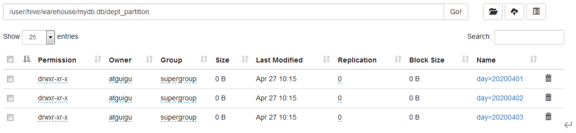

下面是分区表的一些其他操作

1. 单分区查询

   ~~~sql
   select * from dept_partition where day='20200401';
   ~~~

2. 多分区联合查询

   ~~~sql
   select * from dept_partition where day in ('20200401', '20200402', '20200403')
   ~~~

3. 增加分区

   ~~~sql
   alter table dept_partition add partition(day = '20200404')
   ~~~

4. 删除分区

   ~~~sql
   alter table dept_partition drop partition(day = '20200404')
   ~~~

5. 查看表有多少个分区

   ~~~sql
   show partitions dept_partition
   ~~~

6. 查看分区表的详细信息

   ~~~sql
   desc formatted dept_partition
   ~~~


## 多级分区

多级分区就相当于在分区表的基础上再次进行分区, 把数据放到目录的目录中

要实现多级分区, 只需要指定多个partitioned by字段即可

~~~sql
-- 创建分区表
create table dept_partition2( deptno int, dname string, loc string)
partitioned by (day string, hour string)
~~~

插入数据

~~~sql
-- 静态分区方式1
insert into table dept_partition partition(day = '2022-06-08', hour = '4') values (1, '张三'), (2, '李四')
-- 静态分区方式2, 分区字段放在最后, 并按照顺序排列
insert into table dept_partition(1, 'zhangsan', '2022-06-08', '4')


-- 动态分区方式, 分区字段放在最后, 并按照顺序排列, 必须开启动态分区功能
insert into table dept_partition partition(day, current_hour)
select deptno, dname, 
FROM_UNIXTIME(UNIX_TIMESTAMP(), 'yyyy-MM-dd') AS current_date,
HOUR(CURRENT_TIMESTAMP) AS current_hour
from dept_copy
~~~

加载数据
~~~sql
-- 加载数据到分区表
load data local inpath '/opt/module/hive/datas/dept_20200401.log' into table dept_partition2 partition(day='20200401', hour='12');
~~~

查询数据

~~~sql
select * from dept_partition2 where day='20200401' and hour='12';
~~~


## 动态分区

动态分区就是不预先创建分区, 而是在导入数据的时候, 自动根据分区字段创建分区

要开启动态分区, 有几个属性需要设置

~~~sql
-- 开启动态分区功能, 默认为true
set hive.exec.dynamic.partition = true; 
-- 设置为非严格模式（动态分区的模式，默认 strict，表示必须指定至少一个分区为 静态分区，nonstrict 模式表示允许所有的分区字段都可以使用动态分区。）
set hive.exec.dynamic.partition.mode = nonstrict; 
-- 在所有执行 MR 的节点上，最大一共可以创建多少个动态分区。默认 1000
set hive.exec.max.dynamic.partitions = 1000 
-- 在每个执行 MR 的节点上，最大可以创建多少个动态分区。该参数需要根据实际 的数据来设定。比如：源数据中包含了一年的数据，即 day 字段有 365 个值，那么该参数就需要设置成大于 365，如果使用默认值 100，则会报错。
set hive.exec.max.dynamic.partitions.pernode = 100 
-- 整个 MR Job 中，最大可以创建多少个 HDFS 文件。默认 100000
set hive.exec.max.created.files=100000 
-- 当有空分区生成时，是否抛出异常。一般不需要设置。默认 false
set hive.error.on.empty.partition=false 

-- 查看属性可以使用
set xxx;
~~~

下面是具体的案例实操

~~~sql
-- 创建分区表
create table dept_partition_dy(id int, name string) 
partitioned by (loc int)
row format delimited fields terminated by '\t';
-- 设置为非严格模式
set hive.exec.dynamic.partition.mode = nonstrict;


-- 将查询结果插入到分区表中, 进行动态分区
-- select语句中, 分区列必须放在select列的最后面, 并且按照顺序排列好
insert into table dept_partition_dy partition(loc) select deptno, dname, loc from dept;
~~~


## 分桶

**分区表就是分目录, 而分桶表就是分文件, 将一个大的数据集, 分为多个小文件**

**分桶的规则是根据指定的字段进行hash分桶**


准备数据

~~~txt
100 ss1
1 ss2
100 ss3
2 ss4
~~~

创建分桶表

~~~sql
-- 分桶表, 根据id进行分桶, 分四个桶
create table stu_buck(id int, name string) 
clustered by(id) into 4 buckets
row format delimited fields terminated by '\t';

-- 查看表结构
desc formatted stu_buck

-- 导入数据
load data inpath '/student.txt' into table stu_buck;
~~~

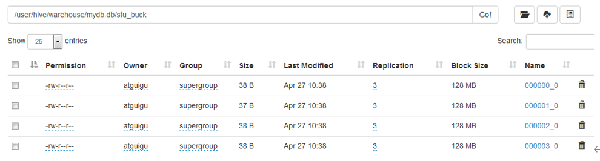


针对分桶表有一个特殊的用法, 就是抽样查询, 即只取数据的一小部分, 进行抽样

~~~sql
select * from stu_buck tablesample(bucket )
~~~


# 第 8 章 文件格式与压缩

## 压缩格式

### MapReduce支持的压缩格式

| 压缩格式 | Hadoop自带？ | 算法    | 文件扩展名 | 是否可切片 | 换成压缩格式后，原来的程序是否需要修改 |
| -------- | ------------ | ------- | ---------- | ---------- | -------------------------------------- |
| DEFLATE  | 是，直接使用 | DEFLATE | .deflate   | 否         | 和文本处理一样，不需要修改             |
| Gzip     | 是，直接使用 | DEFLATE | .gz        | 否         | 和文本处理一样，不需要修改             |
| bzip2    | 是，直接使用 | bzip2   | .bz2       | 是         | 和文本处理一样，不需要修改             |
| LZO      | 否，需要安装 | LZO     | .lzo       | 是         | 需要建索引，还需要指定输入格式         |
| Snappy   | 是，直接使用 | Snappy  | .snappy    | 否         | 和文本处理一样，不需要修改             |

**我们在选择压缩格式的时候, 通常不需要考虑是否支持切片**

因为通常情况下我们的数据不是一个超级大的大文件, 然后应用一个压缩算法,

而是一个数据文件就和一个hdfs block一样大, 然后每个数据文件应用压缩算法

这样的话hive底层使用mapreduce的时候, 只要是从文件中读取文件, 就会使用FileInputFormat来读取分片(因为FileInputFormat是所有从 文件中读取数据的InputFormat的父类)

而FileInputFormat的分片规则就是如果文件超过了分片大小就进行分片, 如果没有超过大小就一个文件一个map task


一般情况下, 如果要压缩率高的文件我们使用gzip, 要压缩和解压缩速度快的话使用snappy


### 压缩格式对应的编解码器

| 压缩格式 | 对应的编码/解码器                          |
| -------- | ------------------------------------------ |
| DEFLATE  | org.apache.hadoop.io.compress.DefaultCodec |
| gzip     | org.apache.hadoop.io.compress.GzipCodec    |
| bzip2    | org.apache.hadoop.io.compress.BZip2Codec   |
| LZO      | com.hadoop.compression.lzo.LzopCodec       |
| Snappy   | org.apache.hadoop.io.compress.SnappyCodec  |


### 压缩参数配置

mapreduce中原生的配置项有:

- io.compression.codecs

  默认值为: `org.apache.hadoop.io.compress.DefaultCodec, org.apache.hadoop.io.compress.GzipCodec, org.apache.hadoop.io.compress.BZip2Codec, org.apache.hadoop.io.compress.Lz4Codec`

  这个值用于指定mapreduce能够使用的解压缩器, **一般不需要修改**

  map和reducec在读取文件的时候, 会自动根据文件后缀名来判断压缩格式, 然后选择合适的解压缩器

- mapreduce.map.output.compress

  默认值`false`, 表示是否开启mapper输出压缩

- mapreduce.map.output.compress.codec

  map输出时默认使用的压缩器, 默认值`org.apache.hadoop.io.compress.DefaultCodec`

  建议使用 LZO、LZ4 或 snappy 编解码器在此 阶段压缩数据

- mapreduce.output.fileoutput.format.compress

  指定reduce输出时是否压缩, 默认值为`false`

- mapreduce.output.fileoutput.format.compress.codec

  reducer输出时使用的压缩方式, 默认值为`org.apache.hadoop.io.compress.DefaultCodec`

- mapreduce.output.fileoutput.format.compress.type

  当reducer输出的文件格式为SequenceFile时, 指定SequenceFile内部的压缩方式

  **这个配置只对SequenceFile有效**

  可选值有: NONE, RECORD, BLOCK,  默认值`RECORD`


## 在计算中使用压缩

hive在计算过程中, 会将sql翻译为mr任务, 那么我们就可以在mr任务中来开启压缩

mr任务中能够开启压缩和解压的地方一共有如下几个位置

1. map输入的文件设置解压

   这个地方无需设置, 会自动根据文件后缀来判断压缩格式, 从而自动进行解压, 所以不需要配置

2. map输出的shuffle文件进行压缩

   ~~~sql
   -- 开启map输出压缩
   set mapreduce.map.output.compress=true; 
   -- 设置map输出的数据压缩
   set mapreduce.map.output.compress.codec= org.apache.hadoop.io.compress.SnappyCodec;
   ~~~

3. reducer输入的文件进行解压

   这个地方无需设置, 会自动根据文件后缀来判断压缩格式, 从而自动进行解压, 所以不需要配置

4. reducer输出的文件在传递给下一个map任务时

   ~~~sql
   -- 启用中间数据压缩
   SET hive.exec.compress.intermediate=true;
   
   -- 使用 Snappy 编解码器压缩中间数据
   SET hive.intermediate.compression.codec=org.apache.hadoop.io.compress.SnappyCodec;
   ~~~

5. reducer输出的文件作为最终文件时

   这样hive在执行mr任务的时候, 不管是`insert overwrite local directory`还是`insert into xxx select xxx`最后生成的文件都是压缩文件了

   ~~~sql
   -- 开启hive最终输出数据压缩功能
   set hive.exec.compress.output=true; 
   -- 开启reduce最终输出数据压缩
   set mapreduce.output.fileoutputformat.compress=true; 
   -- 设置压缩方式
   set mapreduce.output.fileoutputformat.compress.codec = org.apache.hadoop.io.compress.SnappyCodec;
   ~~~


## 存储格式

### Row Format和Store as

Hive会将数据保存到hdfs上, 主要经理的过程如下:

`row object ==> Serializer ==> <key, value> ==> OutputFormat ==> hdfs files`

同时Hive在从hdfs上读取文件的时候, 会反向经历这个过程

`hdfs files ==> InputFormat ==> <key, value> ==> Deserializer ==> row object`


在上述的过程中

- Deserializer 和Serializer  主要将一行数据进行反序列化和序列化

- InputFormat主要负责从文件中读取出一条一条的数据, 转换为key, value, 然后交给Deserializer进行反序列化

- OutputFormat主要负责将序列化后的key,value写入到hdfs文件中


我们可以在创建表的时候

- 通过`row format serde xxx with serdeproperties ( 'xxx' = 'aabb') `来指定对应的SerDe(序列化器和反序列化器)
- 使用`inputformat package.XXX`来指定inputformat, 使用`outputformat package.XXX`来指定outputformat 

格式如下:

建表语法参考https://cwiki.apache.org/confluence/display/Hive/LanguageManual+DDL#LanguageManualDDL-CreateTableCreate/Drop/TruncateTable

~~~sql
create table (...)
  [
   [ROW FORMAT row_format] 
   [STORED AS file_format]
     | STORED BY 'storage.handler.class.name' [WITH SERDEPROPERTIES (...)] 
  ]
  
  row_format
  : DELIMITED [FIELDS TERMINATED BY char [ESCAPED BY char] ]  -- 每个字段的分隔符和转义字符
        [COLLECTION ITEMS TERMINATED BY char] --array中元素分隔符
        [MAP KEYS TERMINATED BY char] -- map中key和value的分隔符
        [LINES TERMINATED BY char] -- 每一行数据的分隔符
        [NULL DEFINED AS char]   -- 当字段为null时使用什么表示
  | SERDE serde_name [WITH SERDEPROPERTIES (property_name=property_value, property_name=property_value, ...)] -- 自定义每条数据的序列化器和反序列化器
 
file_format:
  : SEQUENCEFILE
  | TEXTFILE    -- (Default, depending on hive.default.fileformat configuration)
  | RCFILE      -- (Note: Available in Hive 0.6.0 and later)
  | ORC         -- (Note: Available in Hive 0.11.0 and later)
  | PARQUET     -- (Note: Available in Hive 0.13.0 and later)
  | AVRO        -- (Note: Available in Hive 0.14.0 and later)
  | JSONFILE    -- (Note: Available in Hive 4.0.0 and later)
  | INPUTFORMAT input_format_classname OUTPUTFORMAT output_format_classname   -- 自定义inputformat和outputformat
~~~


### textfile

**只要是按行存储的文件就是一个textfile(即只要每一行数据都是\n结尾的即可)**

每一行的数据可以是一个json, 逗号分割的csv, \t分割的tsv, 只需要指定对应的row format serde 'xxx'


#### 默认情况下的textfile

在默认情况下我们创建一张textfile格式的表

~~~sql
CREATE TABLE student_text_def (id STRING, name STRING) 
STORED AS TEXTFILE; 
~~~

我们利用如下sql来查看表的真实情况

~~~sql
show create table student_text_def;
~~~

打印的sql

~~~sql
CREATE TABLE `student_text_def`(
  `id` string, 
  `name` string)
ROW FORMAT SERDE 
  'org.apache.hadoop.hive.serde2.lazy.LazySimpleSerDe' 
STORED AS INPUTFORMAT 
  'org.apache.hadoop.mapred.TextInputFormat' 
OUTPUTFORMAT 
  'org.apache.hadoop.hive.ql.io.HiveIgnoreKeyTextOutputFormat'
LOCATION
  'hdfs://hadoop102:8020/hive/student_text_def'
TBLPROPERTIES (
  'bucketing_version'='2', 
  'transient_lastDdlTime'='1721810328')
~~~

上面情况下我们可以发现

- 使用`org.apache.hadoop.mapred.TextInputFormat`来从文件中获取每一行数据

- 使用`org.apache.hadoop.hive.ql.io.HiveIgnoreKeyTextOutputFormat`来将数据保存为每一行

- 使用`org.apache.hadoop.hive.serde2.lazy.LazySimpleSerDe`来将每一行数据进行序列化和反序列化

  此时我们可以看到LazySimpleSerDe默认情况下是没有指定任何参数的, 此时对于数据的序列化和反序列化, **他就是按照hadoop的writable接口来实现的, 同时不使用压缩**

  

#### LazySimpleSerDe

默认情况下, 我们使用的是如下配置

~~~sql
ROW FORMAT SERDE  'org.apache.hadoop.hive.serde2.lazy.LazySimpleSerDe' 
STORED AS 
	INPUTFORMAT  'org.apache.hadoop.mapred.TextInputFormat' 
	OUTPUTFORMAT  'org.apache.hadoop.hive.ql.io.HiveIgnoreKeyTextOutputFormat'
~~~

针对LazySimpleSerDe, 我们可以设置每条数据之间的间隔符, map结构中key和value的间隔符, 字段与字段之间的间隔符, array结构中元素与元素之间的间隔符, 如下

~~~sql
create table test
(
    name     string,
    children map<string,int>,
    address  struct<street:string,city:string>,
    favorite array<string>
)
row format serde 'org.apache.hadoop.hive.serde2.lazy.LazySimpleSerDe'
    with serdeproperties ('collection.delim' = '', 
                          'field.delim' = '\t', 
                          'line.delim' = '\n', 
                          'mapkey.delim' = ':') 
stored as
    inputformat 'org.apache.hadoop.mapred.TextInputFormat'
    outputformat 'org.apache.hadoop.hive.ql.io.HiveIgnoreKeyTextOutputFormat';
~~~

上面的形式我们也可以简写为如下

~~~sql
create table test
(
    name     string,
    children map<string,int>,
    address  struct<street:string,city:string>,
    favorite array<string>
)
row format delimited
        fields terminated by '\t' -- 字段与字段之间使用制表符隔开
        collection items terminated by '' -- array和map类型中, 元素与元素使用逗号隔开
        map keys terminated by ':' -- map结构中, key和value使用:隔开
        lines terminated by '\n' -- 每一条数据使用\n隔开 
store as textfile;  -- inputformat和outputformat的简写
~~~


#### 使用CSV格式的文件创建textfile文件

我们可以通过指定LazySimpleSerDe的属性, 来指定他如何序列化和反序列化数据

~~~sql
CREATE TABLE `student_text_def`(
  `id` string, 
  `name` string)
ROW FORMAT DELIMITED
      FIELDS TERMINATED BY ',' -- 指定字段分隔符
      ESCAPED BY '\\' -- 指定转义字符
      LINES TERMINATED BY '\n' -- 指定每一行的分隔符
-- 省略 stored as textfile , 因为默认就是他      
~~~


#### 使用TSV格式的文件创建textfile文件

~~~sql
CREATE TABLE `student_text_def`(
  `id` string, 
  `name` string)
ROW FORMAT DELIMITED
	FIELDS TERMINATED BY '\t' -- TSV每个字段的分隔符为 tab
 	ESCAPED BY '\\'
	LINES TERMINATED BY '\n'
~~~


#### 使用每一行都是JSON的文件创建textfile文件

~~~sql
CREATE TABLE `student_text_def`(
  `id` string, 
  `name` string)
ROW FORMAT SERDE 'org.apache.hive.hcatalog.data.JsonSerDe' --每一行数据都是json
~~~


#### 使用正则表达式来创建匹配数据创建textfile

~~~sql
CREATE EXTERNAL TABLE IF NOT EXISTS cloudfront_logs (
  `Date` DATE,
  Time STRING,
  Location STRING,
  Bytes INT,
  RequestIP STRING,
  Method STRING,
  Host STRING,
  Uri STRING,
  Status INT,
  Referrer STRING,
  os STRING,
  Browser STRING,
  BrowserVersion STRING
 ) 
 -- 使用正则表达式来从每一行中提取regex group来作为每一行的字段
ROW FORMAT SERDE 'org.apache.hadoop.hive.serde2.RegexSerDe'
 WITH SERDEPROPERTIES (
 "input.regex" = "^(?!#)([^ ]+)\\s+([^ ]+)\\s+([^ ]+)\\s+([^ ]+)\\s+([^ ]+)\\s+([^ ]+)\\s+([^ ]+)\\s+([^ ]+)\\s+([^ ]+)\\s+([^ ]+)\\s+[^\(]+[\(]([^\;]+).*\%20([^\/]+)[\/](.*)$"
 ) 
~~~


#### textfile与压缩


**textfile可以结合多种压缩方式, 这些压缩方式都是直接作用在整个textfile文件上的**

**如果使用的压缩方式不支持分片, 那么会导致整个textfile文件都不支持分片** 

但是也不用担心, 因为通常情况下我们的数据文件通常是多个, 每个文件大小与hdfs block大小一致

每个文件使用压缩算法, 这样hive在翻译为mapreduce的时候, 会为每个文件生成一个map task


- 在load data的时候textfile与压缩相结合

  在使用textfile来存储文件的时候, 我们可以直接使用load data来导入一个textfile文件, 也可以load data来导入一个压缩后的textfile文件,  因为我们在使用textfile的时候, 其实就是在使用TexeInputFormat, 他可以根据后缀名自动识别压缩算法

  ~~~sql
  load data inpath "xxx.gzip" into table textfile_ref
  ~~~

- 在执行mr的时候, 最终产生的文本文件使用压缩

  ~~~sql
  -- 开启hive输出文件压缩
  SET hive.exec.compress.output=true; 
  -- 开启reduce输出文件压缩
  SET mapreduce.output.fileoutput.format.compress=true; 
  -- 指定在执行mr时最终产生的文件使用压缩
  SET mapreduce.output.fileoutput.format.compress.codec=org.apache.hadoop.io.compress.BZip2Codec; 
  
  -- 通过insert select来触发mr, 然后生成压缩文件
  INSERT OVERWRITE TABLE student_text_def SELECT * FROM student; 
  -- 导出的文本文件使用压缩
  insert overwrite local directory "xxx" select * from student
  ~~~

- 在建表的时候指定压缩方式, 这样的话我们使用insert这样在insert的时候, 生成的文件默认就是压缩后的文件了

  ~~~sql
  CREATE EXTERNAL TABLE ods_activity_info_full
  (
      `id`              STRING COMMENT '活动id',
      `activity_name` STRING COMMENT '活动名称',
  ) COMMENT '活动信息表'
      PARTITIONED BY (`dt` STRING)
      ROW FORMAT DELIMITED FIELDS TERMINATED BY '\t'
      NULL DEFINED AS ''
  LOCATION '/warehouse/gmall/ods/ods_activity_info_full/'
  -- 指定压缩方式
  TBLPROPERTIES ('compression.codec'='org.apache.hadoop.io.compress.GzipCodec');
  ~~~

  

### sequencefile


#### sequencefile的使用

SequenceFile是行式存储文件, 是hadoop下专有的格式, **支持分片**

SequenceFile中的数据是以key-value的形式保存的, 这样可以方便map任务进行读取

SequenceFile对于key-value的序列化, 就是直接使用mapreduce中的Writable接口来实现


SequenceFile有两部分组成, Header和Body

Header记录了一些元数据信息, 比如key和value的类型, 内部数据块是否压缩, 内部数据库使用的压缩方式等等

Body类似与Map任务生成的shuffle文件, 因为是直接使用的mapreduce的Writable来实现序列化的.


我们可以使用如下sql来生成一个sequencefile格式的表

~~~sql
CREATE TABLE student_seq_def (id STRING, name STRING)
    STORED AS sequencefile ;
~~~

使用如下sql来查看真正的建表语句

~~~sql
show create table student_seq_def;
~~~

输出如下

~~~sql
CREATE TABLE `student_seq_def`(
  `id` string, 
  `name` string)
ROW FORMAT SERDE 
  'org.apache.hadoop.hive.serde2.lazy.LazySimpleSerDe' 
STORED AS INPUTFORMAT 
  'org.apache.hadoop.mapred.SequenceFileInputFormat' 
OUTPUTFORMAT 
  'org.apache.hadoop.hive.ql.io.HiveSequenceFileOutputFormat'
LOCATION
  'hdfs://hadoop102:8020/hive/student_seq_def'
TBLPROPERTIES (
  'bucketing_version'='2', 
  'transient_lastDdlTime'='1721817825')
~~~


#### sequencefile与压缩

**SequenceFile可以对内部的数进行压缩, 有三种模式:** 

**支持三种压缩选择：NONE, RECORD(默认), BLOCK。 Record压缩率低，一般建议使用BLOCK压缩。**


**SequenceFile可以对内部数据进行压缩外, 还可以使用压缩算法对整个SequenceFile进行压缩**

**需要注意的是, 如果压缩算法不支持分片, 那么会导致整个SequenceFile不支持分片**

~~~sql
--创建一个表，格式为文件文件： 
CREATE TABLE student_seq_def 
(id STRING, name STRING) 
STORED AS SEQUENCEFILE; 

-- load data只是简单的copy文件到表目录下, 所以xxx必须是sequencefile文件
-- 或者可以是一个压缩后的sequencefile
load data inpath 'xxx' into table student_seq_def
~~~


我们还可以设置hive在执行mr的时候, 最终产生的sequencefile文件使用压缩

~~~sql
-- 开启hive输出文件压缩
SET hive.exec.compress.output=true; 
-- 开启reduce输出文件压缩
SET mapreduce.output.fileoutput.format.compress=true; 
-- 设置压缩类型
SET mapreduce.output.fileoutput.format.compress.codec=org.apache.hadoop.io.compress.BZip2Codec;  
-- 设置SequenceFile内部使用的压缩算法
set mapreduce.output.fileoutput format.compress.type = BLOCK; -- 必须大写


-- 通过insert select来触发mr, 生成一个sequencefile文件, 并使用压缩算法
INSERT OVERWRITE TABLE student_seq_def SELECT * FROM student; 
~~~


在建表的时候指定压缩方式, 这样的话我们使用insert这样在insert的时候, 生成的文件默认就是压缩后的文件了

~~~sql
CREATE EXTERNAL TABLE ods_activity_info_full
(
    `id`              STRING COMMENT '活动id',
    `activity_name` STRING COMMENT '活动名称',
) COMMENT '活动信息表'
    PARTITIONED BY (`dt` STRING)
    ROW FORMAT DELIMITED FIELDS TERMINATED BY '\t'
    NULL DEFINED AS ''
stored as sequencefile
-- 指定压缩方式
TBLPROPERTIES (
    'compression.codec'='org.apache.hadoop.io.compress.GzipCodec', -- 指定压缩格式
    'mapreduce.output.fileoutput format.compress.type' = 'BLOCK' -- 这个参数不知道有没有用
);
~~~


#### SequenceFile文件结构解析

下面是SequenceFile的读写过程

~~~java
/*
 @author :yinzhengjie
 Blog:http://www.cnblogs.com/yinzhengjie/tag/Hadoop%E8%BF%9B%E9%98%B6%E4%B9%8B%E8%B7%AF/
 EMAIL:y1053419035@qq.com
 */
package cn.org.yinzhengjie.sequencefile;
 
import org.apache.hadoop.conf.Configuration;
import org.apache.hadoop.fs.FileSystem;
import org.apache.hadoop.fs.Path;
import org.apache.hadoop.io.IntWritable;
import org.apache.hadoop.io.SequenceFile;
import org.apache.hadoop.io.Text;
import java.io.IOException;

public class TestSeq {
    public static void main(String[] args) throws IOException {

        // 实例化一个Configuration，它会自动去加载本地的core-site.xml配置文件的fs.defaultFS属性。(该文件放在项目的resources目录即可。)
        Configuration conf = new Configuration();
        // 将hdfs写入的路径定义在本地，需要修改默认我文件系统，这样就可以覆盖到之前在core-site.xml配置文件读取到的数据。
        conf.set("fs.defaultFS", "file:///");
        // 代码的入口点，初始化HDFS文件系统，此时我们需要把读取到的fs.defaultFS属性传给fs对象。
        FileSystem fs = FileSystem.get(conf);
        // 这个path是指是需要在文件系统中写入的数据,由于我修改了默认的配置，将数据会写在本地的windows操作系统，因此我这里给出了windows的路径。
        Path path = new Path("/seq/seqfile");
        if (new File(String.valueOf(path)).exists()) {
            boolean delete = new File(String.valueOf(path)).delete();
            System.out.println(delete);
        }
        createSeq(fs, conf, path);
        readSeq(fs, path, conf);

        new SequenceFileTest().test();
    }

    // 写入数据
    public static void createSeq(FileSystem fs, Configuration conf, Path path) throws IOException {
        // 通过SequenceFile的createWriter内部类创建一个序列化容器(写入器)，需要传入上面我们定义的三个参数。并指定序列化的key和value类型。

        // 指定元数据
        Metadata metadata = new Metadata();
        metadata.set(new Text("hello"), new Text("world"));
        metadata.set(new Text("aa"), new Text("bb"));

        SequenceFile.Writer writer = SequenceFile.createWriter(conf,
            Writer.file(path),
            Writer.keyClass(Text.class),
            Writer.valueClass(IntWritable.class),
            Writer.compression(CompressionType.NONE),
            Writer.metadata(metadata));

        for (int i = 0; i < 3; i++) {
            Text key = new Text("yinzhengjie" + i);
            IntWritable value = new IntWritable(i);
            writer.append(key, value);
        }
        // 释放资源
        writer.close();
    }

    // 读取数据
    public static void readSeq(FileSystem fs, Path path, Configuration conf) throws IOException {
        // 实例化一个反序列化容器（读取器），需要传递三个参数，
        SequenceFile.Reader reader = new SequenceFile.Reader(fs, path, conf);
        // 创建两个容器
        Text key = new Text();
        IntWritable value = new IntWritable();
        // 通过reader读取器的next方法，将定义好的两个容器传进去
        while (reader.next(key, value)) {
            System.out.printf("姓名:[%s]\n年龄:[%s]\n", key.toString(), value.get());
        }
    }
 }
~~~

上面我们的createSeq会创建一个文件, 其中保存了3个key-value对, 分别是{"yinzhengjie0": 0}, {"yinzhengjie1": 1}, {"yinzhengjie2": 2}

我们直接使用notepad++打开, 然后以16进制的形式打开, 结果如下

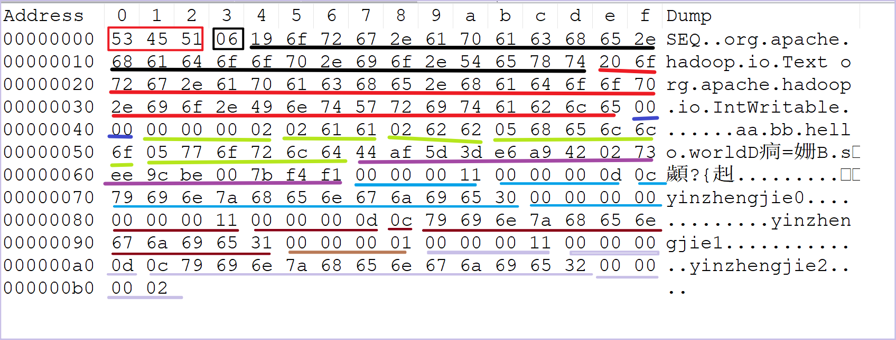

上面的内容主要可以分为两部分:

1. 文件头

   - 版本号: 开头的534551, 表示SEQ

   - 分隔符: 黑色框框的06, 是固定的分隔符

   - key的类型: 使用黑色下划线表示, 其中开始的19表示字符串的长度

   - value的类型: 使用红色下划线表示, 其中开始的20表示字符串的长度

   - 是否压缩, 是否块压缩: 使用深蓝色下划线表示, 这里是否0000, 表示两个都为false

   - 元数据: 使用浅绿色下划线表示

     开始的`00 00 00 02`是元数据的个数, 表示有两个元素

     后面的`02 6161 02 6262`表示key的长度为2, key内容为aa, value长度为2, 内容为bb

     后面的`05  68656c6c6f  05  776f726c64`表示key的长度为5, key的内容为hello, value的长度为2, value为world

   - 16字节的随机内容: 使用紫色下划线表示

2. 数据体

   - 数据体的长度: `00000011`, 表示数据体有17个字节

   - key的长度: `0000000d`, 表示key所占的字节数, 13字节

   - key的内容: `0c 79696e7a68656e676a696530`, 0c表示key的实际长度, 后面是key的实际内容

     (为什么这里还有一个长度, 因为key的Text类型的, 在序列化Text的时候, 会自带一个长度)

   - value的内容: `00000000` 应为value是IntWritable类型, 所以占4字节

   - 后面的就是紧接着的下一个key-value对, 使用咖啡色标注

需要注意的是, 在写SequenceFile的时候, 每个一段时间, 都会自动插入4字节的Int为`-1`和16字节的随机数组, 用来表示同步标记, 使用这个同步标记, mapreduce就可以对SequenceFile进行分片了


#### SequenceFile的压缩

SequenceFile自身就支持在序列化的时候对数据进行压缩, 压缩的方式有

1. NONE: 不使用压缩

2. RECORD: 只压缩value, 默认

   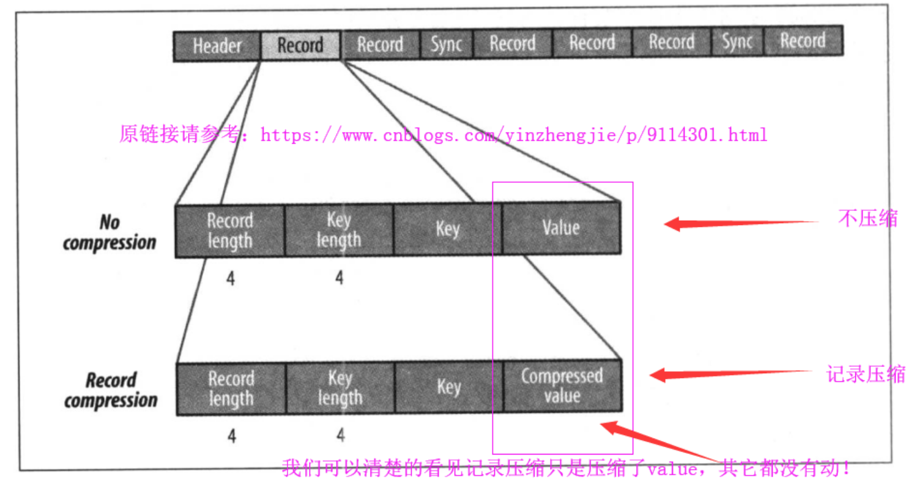

3. BLOCK: 多个key-value组合汇聚为block, 以block为单位进行压缩, block的大小可以配置, 这种方式压缩率最大

   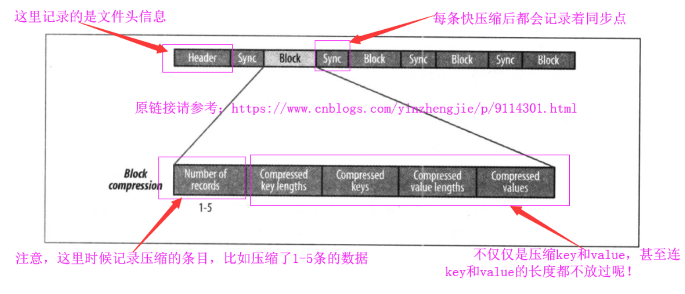


#### SequenceFile源码

在我们调用`SequenceFile.createWriter`的时候, 会根据不同的压缩类似创建不同的writer

~~~java
  public static Writer createWriter(Configuration conf, Writer.Option... opts
                                    ) throws IOException {
    Writer.CompressionOption compressionOption = 
      Options.getOption(Writer.CompressionOption.class, opts);
    CompressionType kind;
    if (compressionOption != null) {
        // 获取通过代码设置的压缩类型
        // 可以通过Writer.compression(CompressionType.NONE)指定
      kind = compressionOption.getValue();
    } else {
        // 获取io.seqfile.compression.type指定的压缩类型
        // 否则使用默认的RECORD
      kind = getDefaultCompressionType(conf);
      opts = Options.prependOptions(opts, Writer.compression(kind));
    }
      // 根据类型创建不同的writer
      // RecordCompressWriter和BlockCompressWriter是Writer的子类
    switch (kind) {
      default:
      case NONE:
        return new Writer(conf, opts);
      case RECORD:
        return new RecordCompressWriter(conf, opts);
      case BLOCK:
        return new BlockCompressWriter(conf, opts);
    }
  }
~~~

在Writer的构造函数中, 会初始化Writer

~~~java
    Writer(Configuration conf, 
           Option... opts) throws IOException {
    // 设立部分代码
      init(
          conf, out, ownStream, keyClass, valueClass,
          codec, metadata, syncInterval);
    }
~~~

在init方法中会创建出要输出的文件, 并往其中写文件头

~~~java
void init(Configuration config, FSDataOutputStream outStream,
              boolean ownStream, Class key, Class val,
              CompressionCodec compCodec, Metadata meta,
              int syncIntervalVal)
      throws IOException {
// 省略部分代码
      if (appendMode) {
          // 如果是追加默认, 那么先在文件后面追加一个sync标记
          // sync标记用于分片
        sync();
      } else {
          // 否则添加文件头
        writeFileHeader();
      }
    }
~~~

writerFileHeader代码如下

~~~java
    private void writeFileHeader() 
      throws IOException {
        // 设置版本号
      out.write(VERSION);
        // 设置key的类型
      Text.writeString(out, keyClass.getName());
      Text.writeString(out, valClass.getName()); // value的类型
      
      out.writeBoolean(this.isCompressed()); // 是否压缩
      out.writeBoolean(this.isBlockCompressed()); // 是否block压缩
      
      if (this.isCompressed()) {
          // 如果是压缩, 设置codec的类型
        Text.writeString(out, (codec.getClass()).getName());
      }
        // 写元数据
      this.metadata.write(out);
        // 写一个sync标记, 表示文件头结束
      out.write(sync);                       // write the sync bytes
      out.flush();                           // flush header
    }
~~~

sync代码如下

~~~java
    public void sync() throws IOException {
      if (sync != null && lastSyncPos != out.getPos()) {
          // SYNC_ESCAPE = -1
        out.writeInt(SYNC_ESCAPE);                // mark the start of the sync
          // sync是一个16字节的随机数组
        out.write(sync);                          // write sync
        lastSyncPos = out.getPos();               // update lastSyncPos
      }
    }
~~~


### RCFile

存储方式：**数据按行分块，每块按列存储**, 支持分片

首先，其将数据按行分块，保同一行的数据位于同一个块上，避免读一个记录需要读取多个block。其次，块数据列式存储，有利于数据压缩和快速的列存取，并且能跳过不必要的列读取

**基本不用**


### ORCFile

ORCFile是经过优化的RCFile, **也是数据按照行分块, 每块数据按照列存储**, 支持分片

ORC文件是自描述的, 内部存储了元数据信息, 内部使用二进制存储

~~~sql
-- 不需要再指定row format了, 指定了stored as orc就会使用对应的row format
create table orc_table(
    column_specs
)
stored as orc 
tblproperties('property_name' = 'property_value', ....)
~~~

orc文件格式支持如下参数:

| 参数                 | 默认值         | 说明                                                         |
| -------------------- | -------------- | ------------------------------------------------------------ |
| orc.compress         | ZLIB           | 压缩格式: 可选项: NONE, ZLIB(默认), SNAPPY(常用)             |
| orc.compress.size    | 262144(256kb)  | 每个压缩块的大小(orc文件是分块压缩的, 而不是对整个文件进行压缩, 所以压缩完之后还是可以切片的) |
| orc.stripe.size      | 67108864(64MB) | 每个stripe的大小, **推荐设置为hdfs的bolck大小**              |
| orc.row.index.stride | 10000          | 每隔多少行建立一条索引                                       |


我们使用如下sql来创建orc存储格式的表

~~~sql
create table test_orc(id int, name string) stored as orc
~~~

然后来查看他的完整格式

~~~sql
show create table text_orc
~~~

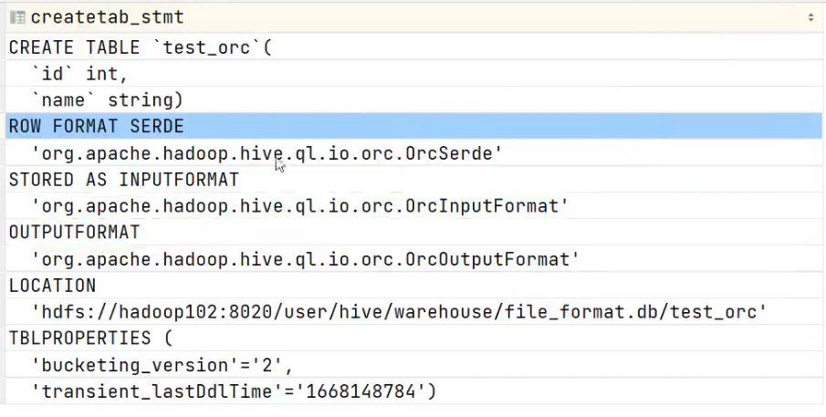

之后我们可以向orc表中导入数据

- 方式1

  ~~~sql
  -- xxx必须是orc文件, 因为load data只是简单的copy文件到hdfs的表目录下
  load data inpath 'xxx' into table text_orc; 
  ~~~

- 方式2

  ~~~sql
  -- 通过insert into 来插入数据
  insert into text_orc select ....
  ~~~

- 方式3

  ~~~sql
  -- 如果确实有一个文本文件要导入到orc表中, 那么要创建一个临时表, 然后load文本文件到临时表中
  -- 然后通过insert into select 到orc表中
  ~~~

  

#### ORCFile的格式

一个ORC文件中可以包含多个stripe，每个stripe一般为HDFS的块大小，每一个stripe包含多条记录，这些记录按照列进行独立存储。

**ORC默认会对任何一块数据和索引信息使用ZLIB压缩**，因此ORC文件占用的存储空间也更小

每次读取ORC文件都是以Striper为单位的

每个Stripe里有三部分组成，分别是

- Index Data

  一个轻量级的 index，默认是每隔 1W 行做一个索引。 同时还会保存各个column的最大值, 最小值等信息, 进行快速过滤

- Row Data

  存的是具体的数据，先取部分行，然后对这些行按列进行存储。

  对每个 列进行了编码，分成多个 Stream 来存储

- Stripe Footer

  包含了各个column的编码信息

每个文件有一个 File Footer，这里面存的是每个 Stripe 的行数,起始位置, 索引长度, 数据长度, Footer长度，每个 Column 的数据类 型信息等, 同时还包含有各个column的统计信息: 最大值, 最小值, hasNull等信息

每个文件的尾部是一个 PostScript，这里面记录了整个文件的压缩类型以及 FileFooter 的长度信息等。

在读取文件时，会 seek 到文件尾部读 PostScript，从里面解析到 File Footer 长度，再读 FileFooter，从里面解析到各个 Stripe 信息，再读各个 Stripe，即从后 往前读。

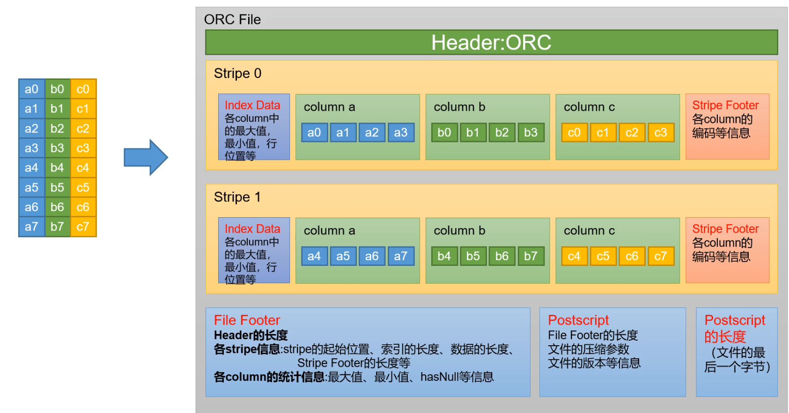


### Parquet

Parquet 文件是以二进制方式存储的，所以是不可以直接读取的，

文件中包括该文件的 数据和元数据，因此 Parquet 格式文件是自解析的。

**支持分片**

~~~sql
--创建表, 不需要指定row format, 只需要指定stored as parquet其他的会自动配置
CREATE TABLE parquet_table (
    column_specs
) 
STORED AS PARQUET
tblproperties ('property_name = property_value'); 
~~~

支持的参数如下

| 参数                | 默认值       | 说明                                                         |
| ------------------- | ------------ | ------------------------------------------------------------ |
| parquet.compression | uncompressed | 压缩格式: uncompressed, snappy, gzip, lzo, brotli, lz4<br>压缩是对内部数据块压缩, 所以还是可以分片的 |
| parquet.block.size  | 134211728    | row group 大小, **建议设置与hdfs block大小一致**             |
| parquet.page.size   | 1048576      | page大小                                                     |

之后我们可以向oparquet表中导入数据

- 方式1

  ~~~sql
  -- xxx必须是parquet文件, 因为load data只是简单的copy文件到hdfs的表目录下
  load data inpath 'xxx' into table parquet_table; 
  ~~~

- 方式2

  ~~~sql
  -- 通过insert into 来插入数据
  insert into parquet_table select ....
  ~~~

- 方式3

  ~~~sql
  -- 如果确实有一个文本文件要导入到parquet表中, 那么要创建一个临时表, 然后load文本文件到临时表中
  -- 然后通过insert into select 到parquet表中
  ~~~

  

#### parquet文件格式

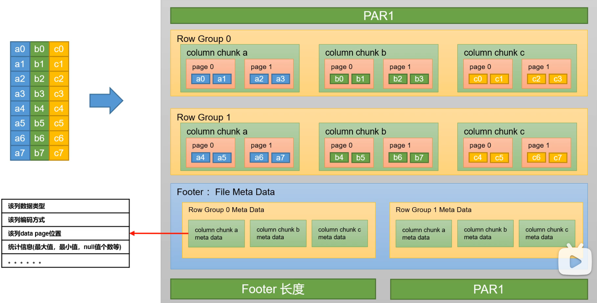

parquet和orc类似, 都是按行划分为一个个的row group, 然后row group中的数据按列存储为一个个的column chunk

column chunk根据列类型的不同会使用不同的压缩算法, 通过column chunk中还有各种不同的page

page的类型有3中:

- 数据页: 保存具体的数据
- 字典页: 保存列值的编码字典, 比如如果列是枚举类型, 那么可以将具体的枚举值保存到字典中, 然后数据页中保存1, 2, 3这些数字来表示枚举
- 索引页: 用来存储当前行组下该列的索引

Row Group后面是Footer, 由一个个的Row Group Meta Data组成, Row Group Meta Data又由对应的column chunk meta data组成

column chunk meta data中保存的是对应column chunk的编码信息, 数据类型, data page的位置, 统计信息(最大值, 最小值, null值的个数)等等

再后面存储的是footer的长度

然后再文件的开头和文件的结尾都有magic number, 为'PAR1'


在读取parquet的时候, 会先从文件尾部读取到footer的长度, 然后读取footer, 获取其中的row group meta data, 然后获取对应的column chunk meta data, 然后定位到具体的column chunk, 然后读取数据


#### Parquet数据模型

Parquet文件是一种支持复杂嵌套结构的列式文件存储结构

每一个数据模型的schema包含多个字段，每一个字段又可以包含多个字段，每一个字段有三个属性：重复数、数据类型和字段名

重复数可以是以下三种：required(出现1次)，repeated(出现0次或多次)，optional(出现0次或1次)。每一个字段的数据类型可以分成两种：group(复杂类型)和primitive(基本类型)。

基础类型有以下几种: BOOLEAN, INT32, INT64, INT96(deprecated), FLOAT, DOUBLE, BYTE_ARRAY, FIXED_LEN_BYTE_ARRAY

例如Dremel中提供的Document的schema示例，它的定义如下：

```
message Document {
    required int64 DocId;
    optional group Links {
        repeated int64 Backward;
        repeated int64 Forward;
    }
    repeated group Name {
        repeated group Language {
            required string Code;
            optional string Country;
        }
        optional string Url;
    }
}
```

可以把这个Schema转换成树状结构，根节点可以理解为repeated类型，如下图: 

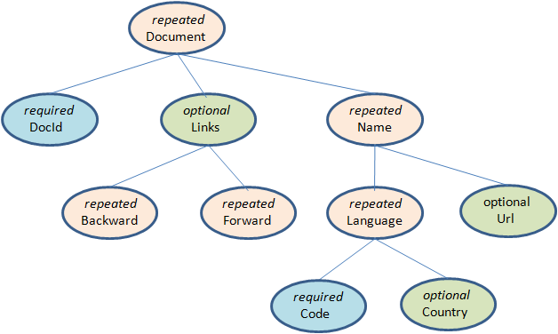

可以看出在Schema中所有的基本类型字段都是叶子节点，在这个Schema中一共存在6个叶子节点，如果把这样的Schema转换成扁平式的关系模型，就可以理解为该表包含六个列。Parquet中没有Map、Array这样的复杂数据结构，但是可以通过repeated和group组合来实现这样的需求。在这个包含6个字段的表中有以下几个字段和每一条记录中它们可能出现的次数：

```
DocId                 int64    只能出现一次 
Links.Backward        int64    可能出现任意多次，但是如果出现0次则需要使用NULL标识 
Links.Forward         int64    同上 
Name.Language.Code    string   同上 
Name.Language.Country string   同上 
Name.Url              string   同上
```


#### Parquet文件结构

Parquet文件是以二进制方式存储的，所以是不可以直接读取的，文件中包括该文件的数据和元数据，因此Parquet格式文件是自解析的。在HDFS文件系统和Parquet文件中存在如下几个概念。

- HDFS块(Block)：它是HDFS上的最小的副本单位，HDFS会把一个Block存储在本地的一个文件并且维护分散在不同的机器上的多个副本，通常情况下一个Block的大小为256M、512M等。
- HDFS文件(File)：一个HDFS的文件，包括数据和元数据，数据分散存储在多个Block中。
- 行组(Row Group)：**按照行将数据物理上水平划分为多个单元**，每一个行组包含一定的行数，在一个HDFS文件中至少存储一个行组，Parquet读写的时候会将整个行组缓存在内存中，所以如果每一个行组的大小是由内存大小决定的，例如记录占用空间比较小的Schema可以在每一个行组中存储更多的行。
- 列块(Column Chunk)：在一个行组中每一列保存在一个列块中，行组中的所有列连续的存储在这个行组文件中。一个列块中的值都是相同类型的，不同的列块可能使用不同的算法进行压缩。
- 页(Page)：每一个列块划分为多个页，一个页是最小的编码的单位，在同一个列块的不同页可能使用不同的编码方式。页也有不同的分类: 数据页、字典页和索引页。数据页用于存储当前行组中该列的值，字典页存储该列值的编码字典，每一个列块中最多包含一个字典页，索引页用来存储当前行组下该列的索引，目前Parquet中还不支持索引页，但是在后面的版本中增加。

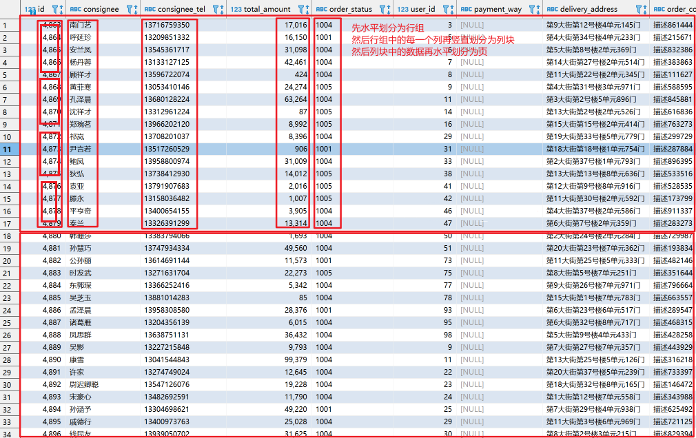


以下示例展示了一个有M个Row Group, N个Column Chunk的Parquet文件结构, 文件的开始是4字节的magic number "PAR1", 用于校验他是否是一个Parquet文件。然后是多个Column Chunk。之后是File Metadata, 其中记录了Parquet文件的schema, 每个Column Chunk的在文件中的offset, 还记录了每个Column Chunk的排序顺序, 最大值, 最小值等等信息。读取文件的时候， 首先应该先读取文件的File Metadata找到他们感兴趣的所有列块， 然后顺序读取列块。之后是4个字节用以记录File Metadata的长度， 通过该值和文件长度可以计算出File Metadata的offset。 之后同样是四个字节的magic number。

~~~text
4-byte magic number "PAR1"
<Column 1 Chunk 1 + Column Metadata>
<Column 2 Chunk 1 + Column Metadata>
...
<Column N Chunk 1 + Column Metadata>
<Column 1 Chunk 2 + Column Metadata>
<Column 2 Chunk 2 + Column Metadata>
...
<Column N Chunk 2 + Column Metadata>
...
<Column 1 Chunk M + Column Metadata>
<Column 2 Chunk M + Column Metadata>
...
<Column N Chunk M + Column Metadata>
File Metadata
4-byte length in bytes of file metadata (little endian)
4-byte magic number "PAR1"
~~~

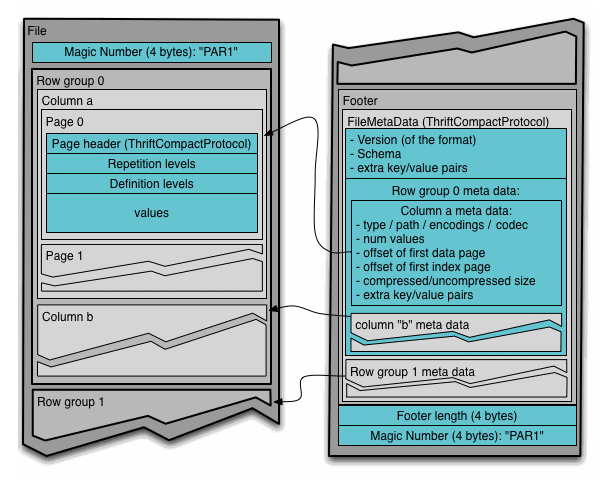


#### Parquet FileMetadata

Parquet的文件元数据使用Thrift中的TCompactProtocol协议进行序列化保存在文件中， FileMetadata的Thrift文件在https://github.com/apache/parquet-format/blob/master/src/main/thrift/parquet.thrift，该文件定义了File Metadata中保存的所有信息, 其中根节点是struct FileMetadata. 以下对一些重要的信息进行解析

~~~thrift
struct FileMetaData {
  1: required i32 version // parquet版本
  2: required list<SchemaElement> schema; //所有列的元数据, 按照schema的树形态进行深度有限遍历得到这个list, SchemaElement中记录有当前列嵌套的子节点个数, 所以根据这两个信息能够复原整个schema的结构
  3: required i64 num_rows // 当前文件的行数
  4: required list<RowGroup> row_groups // 记录所有行组相关信息
  5: optional list<KeyValue> key_value_metadata  // 一些其他的可选信息
  ...
}

struct SchemaElement {
  1: optional Type type // 当前列的类型, 如果未设置说明当前列不是叶子节点
  2: optional i32 type_length // 针对FIXED_LEN_BYTE_ARRAY类型, 设置其长度
  3: optional FieldRepetitionType repetition_type // 列的重复类型,即:optional,repeated,required
  4: required string name // 当前列明
  5: optional i32 num_children; // 当前列的子节点个数
  6: optional ConvertedType converted_type;  // 指定当前列的逻辑类型, 已过期, 使用LogicalType表示
  7: optional i32 scale // 针对decimal类型记录其精度和长度
  8: optional i32 precision // 同上
  9: optional i32 field_id; // 记录当前列的id(不知道干嘛用)
  10: optional LogicalType logicalType // 当前列的逻辑类型
}

struct RowGroup {
  1: required list<ColumnChunk> columns // 当前行组中所有列块信息
  2: required i64 total_byte_size // 当前行组大小
  3: required i64 num_rows //行组行数
  4: optional list<SortingColumn> sorting_columns // 存储当前行组按照哪个列进行排序, 排序顺序是啥, 是否null_first
  5: optional i64 file_offset //行组相对文件开始的offset
  6: optional i64 total_compressed_size // 行组压缩大小? 不大清楚
  7: optional i16 ordinal // 不清楚
}

struct ColumnChunk {
  1: optional string file_path // 列块所存储的文件路径
  2: required i64 file_offset // ColumnMetaData在文件中的偏移量(冗余)
  3: optional ColumnMetaData meta_data // 列块的元数据信息
  4: optional i64 offset_index_offset // OffsetIndex的偏移量
  5: optional i32 offset_index_length // 列块在文件中的偏移量
  6: optional i64 column_index_offset // ColumnIndex的偏移量
  7: optional i32 column_index_length // ColumnIndex的长度
  8: optional ColumnCryptoMetaData crypto_metadata
  9: optional binary encrypted_column_metadata
}
struct ColumnMetaData {
  1: required Type type // 当前列的类型
  2: required list<Encoding> encodings // 当前列的所有编码
  3: required list<string> path_in_schema // 当前列在schema中的路径
  4: required CompressionCodec codec // 压缩相关
  5: required i64 num_values // 当前列的行数
  6: required i64 total_uncompressed_size
  7: required i64 total_compressed_size
  8: optional list<KeyValue> key_value_metadata // 其他的键值对
  9: required i64 data_page_offset // 当前列块的第一个数据页的offset
  10: optional i64 index_page_offset // 当前列块的第一个索引页的offset
  11: optional i64 dictionary_page_offset // 当前列块的第一个字典页的offset
  12: optional Statistics statistics; // 当前列块的统计信息, 包括最大值, 最小值, null值的数量, distinct的数量
  13: optional list<PageEncodingStats> encoding_stats;
  14: optional i64 bloom_filter_offset; // Byte offset from beginning of file to Bloom filter data.
}
~~~

#### Parquet 页的结构

在Parquet文件结构的图中, 展示了Parquet Column Chunk中包含多个Page, 并且Page中还含有Page header, Repetition levels, Definition levels, values等结构, 下面详细说明

Page header中保存的信息在https://github.com/apache/parquet-format/blob/master/src/main/thrift/parquet.thrift中的struct PageHeader中有说明

~~~thrift
struct PageHeader {
  1: required PageType type // 页的类型:数据页, 索引页, 字典页, 数据页V2
  2: required i32 uncompressed_page_size
  3: required i32 compressed_page_size
  4: optional i32 crc
  5: optional DataPageHeader data_page_header; // 关于数据页的说明, 只有在当前是数据页时才设置
  6: optional IndexPageHeader index_page_header; // 同上
  7: optional DictionaryPageHeader dictionary_page_header; // 同上
  8: optional DataPageHeaderV2 data_page_header_v2; // 同上
}

struct DataPageHeader {
  1: required i32 num_values // 当前数据页有多少个值
  2: required Encoding encoding // 当前数据页编码
  3: required Encoding definition_level_encoding; // definition level的编码 
  4: required Encoding repetition_level_encoding; // repetition level的编码
  5: optional Statistics statistics; // 当前数据页的一些详细信息(最大值, 最小值, distinct count值, null值的个数) 
}
// 索引页Parquet并未实现
struct IndexPageHeader {
  // TODO
}
struct DictionaryPageHeader {
  1: required i32 num_values; // 字典页中的值的个数
  2: required Encoding encoding // 字典页编码
  3: optional bool is_sorted; // 如果true, 字典页按照升序排序
}
struct DataPageHeaderV2 {
  1: required i32 num_values // 当前数据页值的个数
  2: required i32 num_nulls
  3: required i32 num_rows // 当前数据页行的个数(因为parquet支持repeated级别, 即一个字段可以有多个值, 所以num_values大于num_rows)
  4: required Encoding encoding
  5: required i32 definition_levels_byte_length;
  6: required i32 repetition_levels_byte_length;
  7: optional bool is_compressed = 1;
  8: optional Statistics statistics;
}
~~~

> 关于字典页的说明

如果在一个列中的值是有限个, 比如一个列表示季节, 那个他的值只有春夏秋冬四个, 那么这一列在存储的时候就可以采用字典页存储, 即使用0,1,2,3表示春夏秋冬, 这一只需要记录数组与值之间的对应关系即可, 减小了存储空间

#### Parquet LogicalType

在Parquet中, 因为只支持BOOLEAN, INT32, INT64, INT96(deprecated), FLOAT, DOUBLE, BYTE_ARRAY, FIXED_LEN_BYTE_ARRAY这几种类型无法满足大部分的类型需要, 比如没有String， UUID, Timestamp, Decimal, Date, Time类型。针对以上情况， 使用现有的primitive类型来实现上述功能， 如逻辑类型String采用BYTE_ARRAY来实现， UUID使用16字节的FIXED_LEN_BYTE_ARRAY来实现， Date使用int32来实现

具体的逻辑类型， 以及逻辑类型的具体实现， 可以查看https://github.com/apache/parquet-format/blob/master/LogicalTypes.md


#### 映射下推(Project PushDown)

说到列式存储的优势，映射下推是最突出的，它意味着在获取表中原始数据时只需要扫描查询中需要的列，由于每一列的所有值都是连续存储的，所以分区取出每一列的所有值就可以实现TableScan算子，而避免扫描整个表文件内容。

在Parquet中原生就支持映射下推，执行查询的时候可以通过Configuration传递需要读取的列的信息，这些列必须是Schema的子集，映射每次会扫描一个Row Group的数据，然后一次性得将该Row Group里所有需要的列的Cloumn Chunk都读取到内存中，每次读取一个Row Group的数据能够大大降低随机读的次数，除此之外，Parquet在读取的时候会考虑列是否连续，如果某些需要的列是存储位置是连续的，那么一次读操作就可以把多个列的数据读取到内存。

#### 谓词下推(Predicate PushDown)

在数据库之类的查询系统中最常用的优化手段就是谓词下推了，通过将一些过滤条件尽可能的在最底层执行可以减少每一层交互的数据量，从而提升性能，例如”select count(1) from A Join B on A.id = B.id where A.a > 10 and B.b < 100”SQL查询中，在处理Join操作之前需要首先对A和B执行TableScan操作，然后再进行Join，再执行过滤，最后计算聚合函数返回，但是如果把过滤条件A.a > 10和B.b < 100分别移到A表的TableScan和B表的TableScan的时候执行，可以大大降低Join操作的输入数据。

无论是行式存储还是列式存储，都可以在将过滤条件在读取一条记录之后执行以判断该记录是否需要返回给调用者，在Parquet做了更进一步的优化，优化的方法时对每一个Row Group的每一个Column Chunk在存储的时候都计算对应的统计信息，包括该Column Chunk的最大值、最小值和空值个数。通过这些统计值和该列的过滤条件可以判断该Row Group是否需要扫描。另外Parquet未来还会增加诸如Bloom Filter和Index等优化数据，更加有效的完成谓词下推。

在使用Parquet的时候可以通过如下两种策略提升查询性能：1、类似于关系数据库的主键，对需要频繁过滤的列设置为有序的，这样在导入数据的时候会根据该列的顺序存储数据，这样可以最大化的利用最大值、最小值实现谓词下推。2、减小行组大小和页大小，这样增加跳过整个行组的可能性，但是此时需要权衡由于压缩和编码效率下降带来的I/O负载。


#### Striping/Assembly算法的作用

详细内容在https://www.cnblogs.com/ITtangtang/p/7681019.htm

Parquet是一个支持复杂嵌套功能的列式文件存储格式, 下面使用一个简单的数据模型来说明问题

~~~text
message nested {
     repeated group level1 {
          repeated string level2;
     }
}
~~~

在上述Parquet中, 因为nested， level1都是非叶子节点， 在实际的文件存储中并不会有。只有叶子节点level2会实际存储，但是有因为level2和level2的重复级别都是repeated， 所以针对下面两个值：

~~~text
r1:[[a,b,c,] , [d,e,f,g]]
r2:[[h] , [i,j]]
~~~

因为Parquet是列式存储，在文件中存储起来会像这个样子

~~~
abcdefghij
~~~

这个时候问题就来了， 要如何才能够将拆散的数据重新组合起来， 怎么能够知道abc属于同一个level2的不同值， defg属于另外一个level2的不同值， 并且这两个level2同属于同一个level1。 

使用Striping/Assembly算法能够解决这个问题, 关于这篇论文的简单说明在https://www.cnblogs.com/ITtangtang/p/7681019.htm中

#### java读写Parquet文件

一下两种方式都是将java对象转换为avro的schema, 然后使用Parquet的支持来生成Parquet文件

1. 参考https://github.com/guihaojin/ParquetDemo/blob/master/src/main/java/com/guihaojin/demo/Main.java

   ~~~java
   package com.guihaojin.demo;
   
   import static org.apache.parquet.hadoop.ParquetFileWriter.Mode.OVERWRITE;
   import static org.apache.parquet.hadoop.metadata.CompressionCodecName.SNAPPY;
   
   import java.io.IOException;
   import java.util.ArrayList;
   import java.util.List;
   
   import org.apache.avro.reflect.ReflectData;
   import org.apache.hadoop.conf.Configuration;
   import org.apache.hadoop.fs.Path;
   import org.apache.parquet.avro.AvroParquetReader;
   import org.apache.parquet.avro.AvroParquetWriter;
   import org.apache.parquet.hadoop.ParquetReader;
   import org.apache.parquet.hadoop.ParquetWriter;
   
   public class Main {
   
       public static void main(String[] args) throws IOException {
   
           List<Team> teams = new ArrayList<>();
   
           Team team1 = new Team("A");
           team1.addMember(new Person("Alice", 1));
           team1.addMember(new Person("Amy", 3));
   
           Team team2 = new Team("B");
           team2.addMember(new Person("Bob", 20));
           team2.addMember(new Person("Blare", 14));
           team2.addMember(new Person("Beep", 5));
   
           teams.add(team1);
           teams.add(team2);
   
           Path dataFile = new Path("/tmp/demo.snappy.parquet");
   
           // Write as Parquet file.
           try (ParquetWriter<Team> writer = AvroParquetWriter.<Team>builder(dataFile)
                   .withSchema(ReflectData.AllowNull.get().getSchema(Team.class))
                   .withDataModel(ReflectData.get())
                   .withConf(new Configuration())
                   .withCompressionCodec(SNAPPY)
                   .withWriteMode(OVERWRITE)
                   .build()) {
   
               for (Team team : teams) {
                   writer.write(team);
               }
           }
   
           // Read from Parquet file.
           try (ParquetReader<Team> reader = AvroParquetReader.<Team>builder(dataFile)
                   .withDataModel(new ReflectData(Team.class.getClassLoader()))
                   .disableCompatibility()
                   .withConf(new Configuration())
                   .build()) {
               Team team;
   
               while ((team = reader.read()) != null) {
                   System.out.println(team);
               }
           }
       }
   }
   ~~~

2. 参考http://www.hydrogen18.com/blog/writing-parquet-records.html

   ~~~java
   package com.hydrogen18.examples;
   
   // Generic Avro dependencies
   import org.apache.avro.Schema;
   
   // Hadoop stuff
   import org.apache.hadoop.fs.Path;
   
   // Generic Parquet dependencies
   import org.apache.parquet.schema.MessageType;
   import org.apache.parquet.hadoop.metadata.CompressionCodecName;
   import org.apache.parquet.hadoop.ParquetWriter;
   
   // Avro->Parquet dependencies
   import org.apache.parquet.avro.AvroSchemaConverter;
   import org.apache.parquet.avro.AvroParquetWriter;
   
   public final class Main {
     public static void main(String[] args){
       Schema avroSchema = UserRank.getClassSchema();
       MessageType parquetSchema = new AvroSchemaConverter().convert(avroSchema);    
   
       UserRank dataToWrite[] = new UserRank[]{
         new UserRank(1, 3),
         new UserRank(2, 0),
         new UserRank(3, 100)
       };
   
   
       Path filePath = new Path("./example.parquet");
       int blockSize = 1024;
       int pageSize = 65535;
       try(
         AvroParquetWriter parquetWriter = new AvroParquetWriter(
           filePath, 
           avroSchema, 
           CompressionCodecName.SNAPPY, 
           blockSize, 
           pageSize)
         ){
         for(UserRank obj : dataToWrite){
           parquetWriter.write(obj); 
         }
       }catch(java.io.IOException e){
         System.out.println(String.format("Error writing parquet file %s", e.getMessage()));
         e.printStackTrace();
       }
   
     }
   }
   ~~~


### avro

~~~sql
--创建表 
CREATE TABLE student_avro_snappy (id STRING, name STRING) 
ROW FORMAT DELIMITED 
    FIELDS TERMINATED BY ',' 
    LINES TERMINATED BY '\n' 
STORED AS AVRO; 

--导入数据 
INSERT OVERWRITE TABLE student_avro_snappy SELECT id,name FROM student; 
--查询数据 
SELECT * FROM student_avro_snappy; 
~~~


## 总结

在实际生产上, 对于层级比较低的文件, 我们一般会使用textfile+gzip

而对于其他文件, 我们一般使用orc+ snappy或者parquet+snappy

并且在执行mr任务的时候, 开启压缩

~~~sql
-- 开启map输出压缩
set mapreduce.map.output.compress=true; 
-- 设置map输出的数据压缩
set mapreduce.map.output.compress.codec= org.apache.hadoop.io.compress.SnappyCodec;

-- 启用中间数据压缩
SET hive.exec.compress.intermediate=true;
-- 使用 Snappy 编解码器压缩中间数据
SET hive.intermediate.compression.codec=org.apache.hadoop.io.compress.SnappyCodec;

-- 开启hive最终输出数据压缩功能
set hive.exec.compress.output=true; 
-- 开启reduce最终输出数据压缩
set mapreduce.output.fileoutputformat.compress=true; 
-- 设置压缩方式
set mapreduce.output.fileoutputformat.compress.codec = org.apache.hadoop.io.compress.SnappyCodec;
~~~


# 第 9 章 函数

函数章节包括 普通函数, 炸裂函数, 窗口函数, 聚合函数, 自定义udf

具体的内容可以查看word文本


# 第 10 章 企业级优化

具体内容查看word


