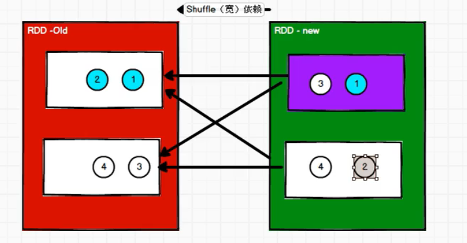

# 第1章 Spark概述


## Spark 是什么

Spark 是一种基于内存的快速、通用、可扩展的大数据分析计算引擎。


## Spark and Hadoop

在之前的学习中，Hadoop 的 MapReduce 是大家广为熟知的计算框架，那为什么咱们还要学习新的计算框架 Spark 呢，这里就不得不提到Spark 和Hadoop 的关系。

首先从时间节点上来看:

-   Hadoop

    -   2006 年 1 月，Doug Cutting 加入Yahoo，领导Hadoop 的开发

    -   2008 年 1 月，Hadoop 成为 Apache 顶级项目

    -   2011 年 1.0 正式发布

    -   2012 年 3 月稳定版发布

    -   2013 年 10 月发布 2.X (Yarn)版本

-   Spark

    -   2009 年，Spark 诞生于伯克利大学的AMPLab 实验室

    -   2010 年，伯克利大学正式开源了 Spark 项目

    -   2013 年 6 月，Spark 成为了 Apache 基金会下的项目

    -   2014 年 2 月，Spark 以飞快的速度成为了 Apache 的顶级项目

    -   2015 年至今，Spark 变得愈发火爆，大量的国内公司开始重点部署或者使用 Spark

然后我们再从功能上来看:

-   Hadoop

    -   Hadoop 是由 java 语言编写的，在分布式服务器集群上存储海量数据并运行分布式分析应用的开源框架

    -   作为 Hadoop 分布式文件系统，HDFS 处于 Hadoop 生态圈的最下层，存储着所有的数据， 支持着 Hadoop 的所有服务。 它的理论基础源于 Google 的TheGoogleFileSystem 这篇论文，它是GFS 的开源实现。

    -   MapReduce 是一种编程模型，Hadoop 根据 Google 的 MapReduce 论文将其实现， 作为 Hadoop 的分布式计算模型，是 Hadoop 的核心。基于这个框架，分布式并行程序的编写变得异常简单。综合了 HDFS 的分布式存储和 MapReduce 的分布式计算，Hadoop 在处理海量数据时，性能横向扩展变得非常容易。

    -   HBase 是对 Google 的 Bigtable 的开源实现，但又和 Bigtable 存在许多不同之处。HBase 是一个基于HDFS 的分布式数据库，擅长实时地随机读/写超大规模数据集。它也是 Hadoop 非常重要的组件。

-   Spark

    -   Spark 是一种由 Scala 语言开发的快速、通用、可扩展的大数据分析引擎

    -   Spark Core 中提供了 Spark 最基础与最核心的功能

    -   Spark SQL 是Spark 用来操作结构化数据的组件。通过 Spark SQL，用户可以使用SQL 或者 Apache Hive 版本的 SQL 方言（HQL）来查询数据。

    -   Spark Streaming 是 Spark 平台上针对实时数据进行流式计算的组件，提供了丰富的处理数据流的API。

由上面的信息可以获知，Spark 出现的时间相对较晚，并且主要功能主要是用于数据计算， 所以其实 Spark 一直被认为是Hadoop 框架的升级版。

## Spark or MapReduce

Hadoop 的 MR 框架和Spark 框架都是数据处理框架，那么我们在使用时如何选择呢？

-   Hadoop MapReduce 由于其设计初衷并不是为了满足循环迭代式数据流处理，因此在多并行运行的数据可复用场景（如：机器学习、图挖掘算法、交互式数据挖掘算法）中存在诸多计算效率等问题。所以 Spark 应运而生，Spark 就是在传统的MapReduce 计算框架的基础上，利用其计算过程的优化，从而大大加快了数据分析、挖掘的运行和读写速度，并将计算单元缩小到更适合并行计算和重复使用的RDD 计算模型。

-   机器学习中 ALS、凸优化梯度下降等。这些都需要基于数据集或者数据集的衍生数据反复查询反复操作。MR 这种模式不太合适，即使多 MR 串行处理，性能和时间也是一个问题。数据的共享依赖于磁盘。另外一种是交互式数据挖掘，MR 显然不擅长。而Spark 所基于的 scala 语言恰恰擅长函数的处理。

-   Spark 是一个分布式数据快速分析项目。它的核心技术是弹性分布式数据集（Resilient Distributed Datasets），提供了比MapReduce 丰富的模型，可以快速在内存中对数据集进行多次迭代，来支持复杂的数据挖掘算法和图形计算算法。

-   **Spark 和Hadoop 的根本差异是多个作业之间的数据通信问题 : Spark 多个作业之间数据通信是基于内存，而 Hadoop 是基于磁盘。**

-   Spark Task 的启动时间快。Spark 采用 fork 线程的方式，而 Hadoop 采用创建新的进程的方式。

-   Spark 只有在 shuffle 的时候将数据写入磁盘，而 Hadoop 中多个 MR 作业之间的数据交互都要依赖于磁盘交互

-   Spark 的缓存机制比HDFS 的缓存机制高效。

经过上面的比较，我们可以看出在绝大多数的数据计算场景中，Spark 确实会比 MapReduce 更有优势。但是Spark 是基于内存的，所以在实际的生产环境中，由于内存的限制，可能会由于内存资源不够导致 Job 执行失败，此时，MapReduce 其实是一个更好的选择，所以 Spark 并不能完全替代 MR。

## Spark 核心模块

{width="5.427083333333333in" height="2.2395833333333335in"}

- #### Spark Core

  Spark Core 中提供了 Spark 最基础与最核心的功能，Spark 其他的功能如：Spark SQL， Spark Streaming，GraphX, MLlib 都是在 Spark Core 的基础上进行扩展的

- #### Spark SQL

  Spark SQL 是Spark 用来操作结构化数据的组件。通过 Spark SQL，用户可以使用 SQL

  或者Apache Hive 版本的 SQL 方言（HQL）来查询数据。

- #### Spark Streaming

  Spark Streaming 是 Spark 平台上针对实时数据进行流式计算的组件，提供了丰富的处理数据流的API。

- #### Spark MLlib

  MLlib 是 Spark 提供的一个机器学习算法库。MLlib 不仅提供了模型评估、数据导入等额外的功能，还提供了一些更底层的机器学习原语。

- #### Spark GraphX

  GraphX 是 Spark 面向图计算提供的框架与算法库。


# 第2章 Spark 快速上手


1. 创建 Maven 项目

2. 增加 Scala 插件

   Spark 由 Scala 语言开发的，所以本课件接下来的开发所使用的语言也为 Scala，咱们当前使用的 Spark 版本为 3.0.0，默认采用的 Scala 编译版本为 2.12，所以后续开发时。我们依然采用这个版本。开发前请保证 IDEA 开发工具中含有 Scala 开发插件

   {width="2.4208333333333334in" height="1.604861111111111in"}

3. 增加依赖关系

   修改 Maven 项目中的POM 文件，增加 Spark 框架的依赖关系。本课件基于 Spark3.0 版本，使用时请注意对应版本。

   ~~~scala
   <dependencies>
       <dependency>
           <groupId>org.apache.spark</groupId>
           <artifactId>spark-core_2.12</artifactId>
           <version>3.0.0</version>
       </dependency>
   </dependencies>
   <build>
       <plugins>
           <!-- 该插件用于将 Scala 代码编译成 class 文件 -->
           <plugin>
               <groupId>net.alchim31.maven</groupId>
               <artifactId>scala-maven-plugin</artifactId>
               <version>3.2.2</version>
               <executions>
                   <execution>
                       <!-- 声明绑定到 maven 的 compile 阶段 -->
                       <goals>
                           <goal>testCompile</goal>
                       </goals>
                   </execution>
               </executions>
           </plugin>
           <plugin>
               <groupId>org.apache.maven.plugins</groupId>
               <artifactId>maven-assembly-plugin</artifactId>
               <version>3.1.0</version>
               <configuration>
                   <descriptorRefs>
                       <descriptorRef>jar-with-dependencies</descriptorRef>
                   </descriptorRefs>
               </configuration>
               <executions>
                   <execution>
                       <id>make-assembly</id>
                       <phase>package</phase>
                       <goals>
                           <goal>single</goal>
                       </goals>
                   </execution>
               </executions>
           </plugin>
       </plugins>
   </build>
   ~~~

4. 配置日志文件, 因为程序在执行的时候会产生大量的执行日志, 而我们只需要查看执行结果

   在`resources`目录下创建`log4j.properties`文件, 内容如下

   ~~~scala
   log4j.rootCategory=ERROR, console
   log4j.appender.console=org.apache.log4j.ConsoleAppender
   log4j.appender.console.target=System.err
   log4j.appender.console.layout=org.apache.log4j.PatternLayout
   log4j.appender.console.layout.ConversionPattern=%d{yy/MM/ddHH:mm:ss} %p %c{1}: %m%n
   # Set the default spark-shell log level to ERROR. When running the spark-shell,the
   # log level for this class is used to overwrite the root logger's log level, so that
   # the user can have different defaults for the shell and regular Spark apps.
   log4j.logger.org.apache.spark.repl.Main=ERROR
   # Settings to quiet third party logs that are too verbose
   log4j.logger.org.spark_project.jetty=ERROR
   log4j.logger.org.spark_project.jetty.util.component.AbstractLifeCycle=ERROR
   log4j.logger.org.apache.spark.repl.SparkIMain$exprTyper=ERROR
   log4j.logger.org.apache.spark.repl.SparkILoop$SparkILoopInterpreter=ERROR
   log4j.logger.org.apache.parquet=ERROR
   log4j.logger.parquet=ERROR
   # SPARK-9183: Settings to avoid annoying messages when looking up nonexistent UDFs in SparkSQL with Hive support
   log4j.logger.org.apache.hadoop.hive.metastore.RetryingHMSHandler=FATAL
   log4j.logger.org.apache.hadoop.hive.ql.exec.FunctionRegistry=ERROR
   ~~~

5. 实现WordCount并运行

   ~~~scala
   // 创建 Spark 运行配置对象
   val sparkConf = new SparkConf().setMaster("local[*]").setAppName("WordCount")
   // 创建 Spark 上下文环境对象（连接对象）
   val sc : SparkContext = new SparkContext(sparkConf)
   // 读取文件数据
   val fileRDD: RDD[String] = sc.textFile("input/word.txt")
   // 将文件中的数据进行分词
   val wordRDD: RDD[String] = fileRDD.flatMap( _.split(" ") )
   // 转换数据结构 word => (word, 1)
   val word2OneRDD: RDD[(String, Int)] = wordRDD.map((_,1))
   // 将转换结构后的数据按照相同的单词进行分组聚合
   val word2CountRDD: RDD[(String, Int)] = word2OneRDD.reduceByKey(_+_)
   // 将数据聚合结果采集到内存中
   val word2Count: Array[(String, Int)] = word2CountRDD.collect()
   // 打印结果
   word2Count.foreach(println)
   //关闭 Spark 连接
   sc.stop()
   ~~~

6. 异常处理

   如果本机操作系统是 Windows，那么直接在idea中执行spark程序的时候, 会出现如下异常：

   

   出现这个问题的原因，并不是程序的错误，而是Spark需要使用到hadoop相关的东西, 所以我们要执行如下的步骤

   1. 下载hadoop安装包, 解压到一个目录下面

   2. 因为官网提供的hadoop安装包是在linux下编译的, 在windows下并不能直接使用

      所以正常来说, 我们要使用的hadoop安装包是要在windwos下编译的, 那么就要下载hadoop的源码在windows上编译之后才能够使用

      但是这样太麻烦了, 同时windwos上编译的安装包和linux上编译的安装包, 大部分内容都相同, 只有在bin目录下的部分文件不同

      所以我们可以使用别人编译好的windows安装包, 然后替换掉我们下载的安装包中的不同内容

      这样就可以了

      

      我们在网上搜`hadoo-winutils`,  然后再其中找到对应版本的文件, 复制到`hadoop安装目录/bin`目录下就可以了

      

   3. 在我们弄好了hadoop相关文件之后, 我们还需要告诉spark  hadoop相关文件的位置, 有三种方式

      - 在 IDEA 中配置`Run Configuration`，添加`HADOOP_HOME `变量

        {width="5.760060148731409in" height="0.6302077865266842in"}

        {width="5.726536526684164in" height="0.9817705599300087in"}

        {width="5.614017935258093in" height="3.8475in"}

      - 或者直接在环境变量中设置`HADOOP_HOME`

      - 或者在spark应用程序中设置`System.setProperty("hadoop.home.dir", "file:///D:/software/hadoop/");`

      


# 第3章 Spark 运行架构

## 运行模式

### Sandalone模式

spark依据资源调度框架的不同可以分为Standalone模式和YARN模式

在Standalone模式下, 不需要依赖其他的资源调度框架，自身就实现了资源调度的功能

在这种模式下, 架构图如下


Master负责资源的调度与分配, 并进行集群的监控, 类似与Yarn的ResourceManager

Worker负责创建出具体的Executor进程, 类似于Yarn中的TaskManger

Driver的功能类似于Yarn中的ApplicationMaster, 负责

-   执行 Spark 任务中的 main 方法, 将用户程序转化为作业（job）
-   向Master申请资源
-   在 Executor 之间调度任务(task)
-   跟踪Executor 的执行情况
-   通过UI 展示查询运行情况

Executor负责具体spark的任务的执行, 并将结果返回给Driver

### Yarn模式

在Yarn模式下, 运行模式与Standalone模式类似, 只是Yarn的ResourceManager和TaskManager替换了Master和Worker, 并且Executor不在是一个独立的程序, 而是跑在了Container中

同时在Yarn模式下, 又依据Drive运行在哪里可以分为

1. Yarn-Client模式:  Driver运行在提交任务的本地机器上, 一般用于测试环境
2. Yarn-Cluster模式: Driver运行在Yarn上, 一般用于生成环境


### Local模式

该模式主要是用来测试使用, local模式不需要提前启动集群, 而是在需要执行任务的时候就启动一个程序模拟spark集群, 任务执行完毕之后就关闭, 这种模式一般用在教学，调试，演示


**Local模式可以在Linux和Windows下运行, 所有用来编写代码的时候非常有效**


### K8S & Mesos模式

Mesos 是 Apache 下的开源分布式资源管理框架，它被称为是分布式系统的内核,在
Twitter 得到广泛使用,管理着 Twitter 超过 30,0000 台服务器上的应用部署，但是在国内，依
然使用着传统的Hadoop 大数据框架，所以国内使用 Mesos 框架的并不多，但是原理其实都
差不多，这里我们就不做过多讲解了。  


容器化部署是目前业界很流行的一项技术，基于Docker 镜像运行能够让用户更加方便
地对应用进行管理和运维。 容器管理工具中最为流行的就是Kubernetes（k8s），而 Spark
也在最近的版本中支持了k8s 部署模式。这里我们也不做过多的讲解。给个链接大家自己感
受一下： https://spark.apache.org/docs/latest/running-on-kubernetes.html  


## 提交流程

所谓的提交流程，其实就是我们开发人员根据需求写的应用程序通过 Spark 客户端提交给 Spark 运行环境执行计算的流程。

在不同的部署环境中，这个提交过程基本相同，但是又有细微的区别，我们这里不进行详细的比较

但是因为国内工作中，将 Spark 引用部署到Yarn 环境中会更多一些，所以**本课程中的提交流程是基于 Yarn 环境的**。

{width="4.043707349081365in" height="3.0011450131233595in"}

1. Yarn Client 模式

   - Driver 在任务提交的本地机器上运行

   - Driver 启动后会和ResourceManager 通讯申请启动ApplicationMaster

   - ResourceManager 分配 container，在合适的NodeManager 上启动ApplicationMaster，负责向ResourceManager 申请 Executor 内存

   - ResourceManager 接到 ApplicationMaster 的资源申请后会分配 container，然后ApplicationMaster 在资源分配指定的NodeManager 上启动 Executor 进程

   - Executor 进程启动后会向Driver 反向注册，Executor 全部注册完成后Driver 开始执行main 函数

   - 之后执行到 Action 算子时，触发一个 Job，并根据宽依赖开始划分 stage，每个stage 生成对应的TaskSet，之后将 task 分发到各个Executor 上执行。


2. Yarn Cluster 模式
   - 在 YARN Cluster 模式下，任务提交后会和ResourceManager 通讯申请启动ApplicationMaster
   - 随后ResourceManager 分配 container，在合适的 NodeManager 上启动 ApplicationMaster，此时的 ApplicationMaster 就是Driver。
   - Driver 启动后向 ResourceManager 申请Executor 内存，ResourceManager 接到ApplicationMaster 的资源申请后会分配container，然后在合适的NodeManager 上启动Executor 进程
   - Executor 进程启动后会向Driver 反向注册，Executor 全部注册完成后Driver 开始执行main 函数
   - 之后执行到 Action 算子时，触发一个 Job，并根据宽依赖开始划分 stage，每个stage 生成对应的TaskSet，之后将 task 分发到各个Executor 上执行。


# 第4章 Spark 部署


## Local 模式

local模式不需要提前启动集群, 而是在需要执行任务的时候就启动一个程序模拟spark集群, 任务执行完毕之后就关闭, 这种模式一般用在教学，调试，演示


**这种模式也可以运行在windows环境中**


如果要使用Local模式, 我们只需要将 spark-3.0.0-bin-hadoop3.2.tgz 文件上传到Linux 并解压缩，放置在指定位置，路径中不要包含中文或空格即可


我们有两种方式来启动一个Local模式

1. 方式1:  使用交互式控制台

   进入spark解压缩后的目录, 执行`bin/spark-shell`命令, 此时会创建出一个进程, 来模拟spark集群

   同时还会进入交互式控制台, 我们可以在这里编写scala和spark相关的代码, 并执行

   {width="5.758833114610674in" height="1.405in"}

   {width="5.755534776902887in" height="0.287082239720035in"}

   同时该进程启动后, 会在`4040`端口生成一个网页, 可以输入网址进行 Web UI 监控页面访问

   

2. 方式2: 使用命令行工具

   我们可以先编写好spark程序, 然后打包为jar包, 然后再spark目录下执行如下命令

   ~~~bash
   # --class 表示要执行程序的主类， 此处可以更换为咱们自己写的应用程序
   # --master local[2] 部署模式，默认为本地模式，数字表示分配的虚拟CPU 核数量
   # spark-examples_2.12-3.0.0.jar 运行的应用类所在的 jar 包， 实际使用时，可以设定为咱们自己打的 jar 包
   # 数字 10 表示程序的入口参数，用于设定当前应用的任务数量
   bin/spark-submit \
   --class org.apache.spark.examples.SparkPi \
   --master local[2] \
   ./examples/jars/spark-examples_2.12-3.0.0.jar \
   10
   ~~~

   执行之后, 同样会生成一个进程来模拟spark集群, 然后执行任务, 同时也会在`4040`开启一个Web UI界面

   进程执行完毕或者Ctrl+C 后, 就会退出

   {width="5.628500656167979in" height="1.845832239720035in"}

如果在local模式下, spark任务要读取文件, 可以将文件放在`spark目录/data`下


## Standalone模式

standalone模式下, 我们要先启动一个spark集群, 之后我们就可以往spark集群中提交任务了

### 部署

下面是Standalone模式的搭建流程

1. 集群规划

   | Linux1 | Linux2        | Linux3 |
   | ------ | ------------- | ------ |
   | Worker Master | Worker | Worker |

2. 解压缩文件

   将 spark-3.0.0-bin-hadoop3.2.tgz 文件上传到Linux 并解压缩在指定位置  

   ~~~bash
   # 解压到/opt/module下
   tar -zxvf spark-3.0.0-bin-hadoop3.2.tgz -C /opt/module
   cd /opt/module
   # 将解压目录重命名
   mv spark-3.0.0-bin-hadoop3.2 spark-standalone
   ~~~

3. 修改配置文件

   - 进入解压缩后路径的 conf 目录，修改 `slaves.template` 文件名为 `slaves`

     新版本将`worker.template`修改为`worker`

     ~~~scala
     mv slaves.template slaves
     ~~~

   - 修改 slaves 文件，添加work 节点

     ~~~scala
     linux1
     linux2
     linux3
     ~~~

   - 修改 spark-env.sh.template 文件名为 spark-env.sh

     ~~~bash
     mv spark-env.sh.template spark-env.sh
     ~~~

   - 修改 spark-env.sh 文件，添加 JAVA_HOME 环境变量和集群对应的 master 节点

     ~~~sh
     export JAVA_HOME=/opt/module/jdk1.8.0_144
     SPARK_MASTER_HOST=linux1
     SPARK_MASTER_PORT=7077
     ~~~

4. 分发 spark 目录到其他两台节点

   ~~~scala
xsync spark-standalone
   ~~~
   
5. 启动集群
   
   ~~~bash
sbin/start-all.sh
   ~~~
   
   {width="5.748997156605425in" height="0.9609372265966755in"}
   
6. 查看三台服务器运行进程
   
    ~~~text
    ================linux1================
    3330 Jps
    3238 Worker
    3163 Master
    ================linux2================
    2966 Jps
    2908 Worker
    ================linux3================
    2978 Worker
    3036 Jps
    ~~~
    
7. 查看 Master 资源监控Web UI 界面: `http://linux1:8080`

    

### 提交任务

启动了Spark集群之后, 我们就可以往spark中提交任务了, 使用如下命令

~~~bash
# --class 表示要执行程序的主类
# --master 表示提交到独立部署的Spark集群中
# spark-examples_2.12-3.0.0.jar 运行类所在的 jar 包
# 数字 10 表示程序的入口参数，用于设定当前应用的任务数量
bin/spark-submit \
--class <main-class>
--master <master-url> \
... # other options
<application-jar> \
[application-arguments]
~~~

{width="5.727754811898513in" height="2.003020559930009in"}

Spark在执行任务的时候, 会产生多个 Executor进程

{width="5.709777996500438in" height="1.3794783464566929in"}

执行任务时，默认采用服务器集群节点的总核数，每个节点内存 1024M。

{width="5.689511154855643in" height="0.46718722659667544in"}


### 配置历史服务器

由于 spark-shell 停止掉后，集群监控 linux1:4040 页面就看不到历史任务的运行情况，所以
开发时都配置历史服务器记录任务运行情况  

1. 修改 spark-defaults.conf.template 文件名为 spark-defaults.conf

   ~~~bash
   mv spark-defaults.conf.template spark-defaults.conf
   ~~~

2. 修改 spark-default.conf 文件，配置日志存储路径

   **注意hdfs的路径需要提前存在**

   ~~~conf
   spark.eventLog.enabled true
   spark.eventLog.dir hdfs://linux1:8020/directory
   ~~~

3. 修改 spark-env.sh 文件, 添加日志配置

   ~~~shell
   export SPARK_HISTORY_OPTS="
   -Dspark.history.ui.port=18080
   -Dspark.history.fs.logDirectory=hdfs://linux1:8020/directory
   -Dspark.history.retainedApplications=30"
   ~~~

   -   参数 1 含义：WEB UI 访问的端口号为 18080

   -   参数 2 含义：指定历史服务器日志存储路径

   -   参数 3 含义：指定保存Application 历史记录的个数，如果超过这个值，旧的应用程序信息将被删除，这个是内存中的应用数，而不是页面上显示的应用数。

4. 分发配置文件

   ~~~shell
   xsync conf
   ~~~

5. 重新启动集群和历史服务器

   ~~~shell
   sbin/stop-all.sh
   sbin/start-all.sh
   sbin/start-history-server.sh  
   ~~~

6.  重新执行任务

   {width="5.761805555555555in" height="1.9236111111111112in"}

7. 查看历史服务：http://linux1:18080

   


### 配置高可用

所谓的高可用是因为当前集群中的 Master 节点只有一个，所以会存在单点故障问题。所以
为了解决单点故障问题，需要在集群中配置多个 Master 节点，一旦处于活动状态的 Master
发生故障时，由备用 Master 提供服务，保证作业可以继续执行。 这里的高可用一般采用
Zookeeper 设置  

1. 集群配置

|       | Linux1                  | Linux2                  | Linux3           |
| ----- | ----------------------- | ----------------------- | ---------------- |
| Spark | Master Zookeeper Worker | Master Zookeeper Worker | Zookeeper Worker |

2. 启动zk

   ~~~bash
   xstart zk
   ~~~

3. 修改 spark-env.sh 文件添加如下配置  

   ~~~shell
   注释如下内容：
   #SPARK_MASTER_HOST=linux1
   #SPARK_MASTER_PORT=7077
   添加如下内容:
   #Master 监控页面默认访问端口为 8080，但是可能会和 Zookeeper 冲突，所以改成 8989，也可以自
   定义，访问 UI 监控页面时请注意
   SPARK_MASTER_WEBUI_PORT=8989
   export SPARK_DAEMON_JAVA_OPTS="
   -Dspark.deploy.recoveryMode=ZOOKEEPER
   -Dspark.deploy.zookeeper.url=linux1,linux2,linux3
   -Dspark.deploy.zookeeper.dir=/spark"
   ~~~

4. 分发配置文件  

   ~~~shell
   xsync conf/
   ~~~

5. 启动集群

   ~~~shell
   sbin/start-all.sh
   ~~~

   

6. 启动 linux2 的单独 Master 节点，此时 linux2 节点 Master 状态处于备用状态

   ~~~shell
   [root@linux2 spark-standalone]# sbin/start-master.sh
   ~~~

   {width="5.775803805774278in" height="2.1125in"}

7. 提交应用到高可用集群

   ~~~shell
bin/spark-submit \
   --class org.apache.spark.examples.SparkPi \
--master spark://linux1:7077,linux2:7077 \
   ./examples/jars/spark-examples_2.12-3.0.0.jar \
   10
   ~~~
   
8. 停止 linux1 的 Master 资源监控进程
   
   {width="5.719795494313211in" height="1.0805205599300087in"}
   
9. 查看 linux2 的 Master 资源监控Web UI，稍等一段时间后，linux2 节点的 Master 状态提升为活动状态

   {width="5.759722222222222in" height="2.4856517935258093in"}

   

   


## Yarn模式

独立部署（Standalone）模式由 Spark 自身提供计算资源，无需其他框架提供资源。这种方式降低了和其他第三方资源框架的耦合性，独立性非常强。但是你也要记住，Spark 主要是计算框架，而不是资源调度框架，所以本身提供的资源调度并不是它的强项，所以还是和其他专业的资源调度框架集成会更靠谱一些。所以接下来我们来学习在强大的Yarn 环境下 Spark 是如何工作的（其实是因为在国内工作中，Yarn 使用的非常多）

### 部署与提交

1. 解压缩文件

   将 spark-3.0.0-bin-hadoop3.2.tgz 文件上传到 linux 并解压缩，放置在指定位置。

   ~~~shell
   tar -zxvf spark-3.0.0-bin-hadoop3.2.tgz -C /opt/module
   cd /opt/module
   # 重命名解压缩目录
   mv spark-3.0.0-bin-hadoop3.2 spark-yarn
   ~~~

2. 修改配置文件

   1. 修改 hadoop 配置文件/opt/module/hadoop/etc/hadoop/yarn-site.xml, 并分发

      ~~~scala
      <!--是否启动一个线程检查每个任务正使用的物理内存量，如果任务超出分配值，则直接将其杀掉, 默认是 true -->
      <property>
      	<name>yarn.nodemanager.pmem-check-enabled</name>
      	<value>false</value>
      </property>
      <!--是否启动一个线程检查每个任务正使用的虚拟内存量，如果任务超出分配值，则直接将其杀掉，默认是 true -->
      <property>
      	<name>yarn.nodemanager.vmem-check-enabled</name>
      	<value>false</value>
      </property>
      ~~~

   2. 修改 `spark-env.sh.template`为`conf/spark-env.sh`

      ~~~shell
      mv spark-env.sh.template spark-env.sh
      ~~~

   3. 给`conf/spark-env.sh`添加 `JAVA_HOME` 和`YARN_CONF_DIR` 配置

      ~~~shell
      export JAVA_HOME=/opt/module/jdk1.8.0_144
      YARN_CONF_DIR=/opt/module/hadoop/etc/hadoop
      ~~~

3. 启动HDFS和YARN集群

4. 提交应用

   ~~~shell
   bin/spark-submit \
   --class org.apache.spark.examples.SparkPi \
   --master yarn \
   --deploy-mode cluster \
   ./examples/jars/spark-examples_2.12-3.0.0.jar \
   10
   ~~~

   {width="5.697424540682415in" height="2.071353893263342in"}

5. 查看 http://linux2:8088 页面，点击History，查看历史页面

   {width="5.631973972003499in" height="2.5966666666666667in"}

   


### 配置历史服务器

1. 修改 spark-defaults.conf.template 文件名为 spark-defaults.conf

   ~~~scala
   mv spark-defaults.conf.template spark-defaults.conf
   ~~~

2. 修改 spark-default.conf 文件，配置日志存储路径

   注意：需要启动 hadoop 集群，HDFS 上的目录需要提前存在。

   ~~~conf
   spark.eventLog.enabled   true
   spark.eventLog.dir hdfs://linux1:8020/directory
   ~~~

3. 修改 spark-env.sh 文件, 添加日志配置

   ~~~shell
   export SPARK_HISTORY_OPTS="
   -Dspark.history.ui.port=18080
   -Dspark.history.fs.logDirectory=hdfs://linux1:8020/directory
   -Dspark.history.retainedApplications=30"
   ~~~

   -   参数 1 含义：WEB UI 访问的端口号为 18080
   -   参数 2 含义：指定历史服务器日志存储路径
   -   参数 3 含义：指定保存Application 历史记录的个数，如果超过这个值，旧的应用程序信息将被删除，这个是内存中的应用数，而不是页面上显示的应用数。

4. 修改 spark-defaults.conf

   ~~~shell
   spark.yarn.historyServer.address=linux1:18080
   spark.history.ui.port=18080
   ~~~

5. 启动历史服务

   ~~~shell
   sbin/start-history-server.sh
   ~~~

6. 重新提交应用  

   ~~~shell
   bin/spark-submit \
   --class org.apache.spark.examples.SparkPi \
   --master yarn \
   --deploy-mode client \
   ./examples/jars/spark-examples_2.12-3.0.0.jar \
   10
   ~~~

   {width="5.7195833333333335in" height="1.5417705599300087in"}

7. Web 页面查看日志：http://linux2:8088

   

   


## 提交参数说明

在提交应用中，完整的提交命令如下, 同时还可以指定一些其他的命令

~~~bash
bin/spark-submit \
--class <main-class>
--master <master-url> \
... # other options
<application-jar> \
[application-arguments]
~~~

| 参数                      | 解释                                                        |
|------|-------|
| \--class                  | Spark 程序中包含主函数的类                                  |
| \--master                 | 提交到哪个集群上面<br>可以选值有local\[\*\],  spark://linux1:7077,  Yarn |
| --num-executors | 配置Executor的数量 |
| \--executor-memory 1G     | 指定每个 executor 可用内存为 1G   |
| \--total-executor-cores 2 | 指定所有executor 使用的cpu 核数为 2 个     |
| \--executor-cores         | 指定每个executor 使用的cpu 核数           |
| application-jar           | 打包好的应用 jar，包含依赖。这个 URL 在集群中全局可见。 <br>比如 hdfs:// 共享存储系统，<br>如果是file:// path， 那么所有的节点在path下都需要相同的文件 |
| application-arguments | 传给 main()方法的参数           |


# 第5章 Spark 核心编程


## RDD概念

### 基本概念

RDD（Resilient Distributed Dataset）叫做弹性分布式数据集，是 Spark 中最基本的数据处理模型。代码中是一个抽象类，它代表一个弹性的、不可变、可分区、里面的元素可并行计算的集合。


**RDD可以类比于一个封装了执行逻辑的类, 由最开始的读取文件操作生成一个RDD, 后续在这个RDD上执行的操作, 都会将原始的这个RDD包装, 生成一个新的RDD**

RDD于Flink逻辑流图中的算子类似, 但是又不同, Flink中的算子之间是相互独立的, 只封装了自己的计算逻辑

而RDD是依赖于前一个RDD的, RDD里面不仅有当前自己的计算逻辑, 还封装了之前所有的RDD


RDD由如下几个核心的属性:

1. 分区列表

   由子类实现, 返回该RDD的所有分区, 分区用于分布式并行计算

   

2. 分区函数

   spark

   

3. RDD之间的依赖关系

   RDD 是计算模型的封装，当需求中需要将多个计算模型进行组合时，就需要将多个 RDD 建
   立依赖关系  

   

4. 分区器（可选）

   即计算每个数据到底应该发送到哪个Partition中

   

5. 首选位置（可选）

   计算数据时，可以根据计算节点的状态选择不同的节点位置进行计算

   


### 执行原理

从计算的角度来讲，数据处理过程中需要计算资源（内存 & CPU）和计算模型（逻辑）。执行时，需要将计算资源和计算模型进行协调和整合。

Spark 框架在执行时，先申请资源，然后将应用程序的数据处理逻辑分解成一个一个的计算任务。然后将任务发到已经分配资源的计算节点上, 按照指定的计算模型进行数据计算。最后得到计算结果。

RDD 是 Spark 框架中用于数据处理的核心模型，接下来我们看看，在 Yarn 环境中，RDD 的工作原理:

1. 启动 Yarn 集群环境


2. Spark 通过申请资源创建调度节点和计算节点


3. Spark 框架根据需求将计算逻辑根据分区划分成不同的任务

   

4. 调度节点将任务根据计算节点状态发送到对应的计算节点进行计算


从以上流程可以看出 RDD 在整个流程中主要用于将逻辑进行封装，并生成 Task 发送给Executor 节点执行计算，接下来我们就一起看看 Spark 框架中RDD 是具体是如何进行数据处理的。


## RDD 创建

在 Spark 中创建RDD 的创建方式可以分为四种：

1. 从集合（内存）中创建 RDD

   从集合中创建RDD，[Spark](https://www.iteblog.com/archives/tag/spark/) 主要提供了两个方法：parallelize 和 makeRDD

   ~~~scala
     val sparkConf = new SparkConf().setMaster("local[*]").setAppName("spark")
     val sparkContext = new SparkContext(spark Conf)
     val rdd1 = sparkContext.parallelize(List(1, 2, 3, 4))
     val rdd2 = sparkContext.makeRDD(List(1, 2, 3, 4))
     rdd1.collect().foreach(println)
   ~~~

   从底层代码实现来讲，makeRDD 方法其实就是parallelize 方法

   ~~~scala
   def makeRDD[T: ClassTag](seq: Seq[T], numSlices: Int = defaultParallelism): RDD[T] =
       withScope { parallelize(seq, numSlices) }
   ~~~

2. 从外部存储（文件）创建RDD

   包括：本地的文件系统，所有Hadoop 支持的数据集， 比如HDFS、HBase 等

   ~~~scala
   val sparkConf =new SparkConf().setMaster("local[*]").setAppName("spark")
   val sparkContext = new SparkContext(sparkConf)
   val fileRDD: RDD[String] = sparkContext.textFile("input")
   fileRDD.collect().foreach(println)
   sparkContext.stop()
   ~~~

3. 从其他 RDD 创建

   主要是通过一个RDD 运算完后，再产生新的RDD。详情请参考后续章节

4. 直接创建 RDD（new）

   使用 new 的方式直接构造RDD，一般由Spark 框架自身使用。


## RDD并行度 

默认情况下，Spark 可以将一个作业切分多个任务后，发送给 Executor 节点并行计算，而能够并行计算的任务数量我们称之为并行度。这个数量可以在构建RDD 时指定. 

同时从内存中创建RDD和从文件中创建RDD时, 并行度的生成规则不一样

1. 从内存中创建RDD的并行度

   ~~~scala
     /**
      * 从内存中读取数据的并行度和分区规则
      */
     @Test
     def partitionFromMemory(): Unit = {
       val list: List[Int] = List(1, 2, 3, 4, 5, 6)
   
       val sparkConf: SparkConf = new SparkConf().setMaster("local[*]").setAppName("xxx")
   
       // sparkConf.set("spark.default.parallelism", "3")
   
       val context: SparkContext = new SparkContext(sparkConf)
   
       /**
        * 1. 先获取分区个数
        *    1. 先获取参数中指定的分区个数
        *    2. 如果参数中没有指定分区个数, 那么就获取配置中spark.default.parallelism设置的分区个数
        *    3. 如果spark.default.parallelism也没有设置, 那么就获取cpu核心数作为分区个数
        * 2. 获取了分区个数之后, 就是对数据进行分区了, 具体的数据分区规则如下:
        *       数据的分区规则是: i为第n个分区数, 从0开始, numSlices为分区数
        *       基本的思想就是按照顺序平均分配
        *       val start = ((i * length) / numSlices).toInt
        *       val end = (((i + 1) * length) / numSlices).toInt
        *       如果7个数据分三个区, 那么三个分区的数据下标分别的[0, 1] [2, 3] [4, 5, 6]
        *       分区不均匀的话就是前面的少一点数据
        */
       val rdd: RDD[Int] = context.makeRDD(list)
   
       // 指定读取后的记录的分区个数
       val rdd1: RDD[Int] = context.makeRDD(list, 3)
   
   
       context.stop()
     }
   ~~~

2. 从文件系统中创建RDD的并行度设置

   ~~~scala
     @Test
     def partitionFromFile(): Unit = {
       val sparkConf: SparkConf = new SparkConf().setMaster("local[*]").setAppName("xxx")
   
       // 指定默认的并行度
       sparkConf.set("spark.default.parallelism", "3")
   
       val context: SparkContext = new SparkContext(sparkConf)
   
       /**
        * 1. 先获取最小分区个数
        *      1. 通过参数指定最小分区个数
        *      2. 如果没有通过参数指定分区个数, 那么默认使用math.min(defaultParallelism, 2)
        * 2. 获取了最小分区个数后, 计算真实的分区个数
        *      spark读取文件底层还是使用了mapreduce的 [[org.apache.hadoop.mapred.TextInputFormat]]
        *      所以具体的分区规则还是[[org.apache.hadoop.mapred.TextInputFormat#getSplits(org.apache.hadoop.mapreduce.JobContext]]
        *      具体规则如下:
        *        1. 计算所有文件的大小totalSize
        *        2. 计算每个分区的读取的数据大小 goalSize = totalSize / minPartitions
        *        3. 计算剩余文件大小 totalSize % goalSize, 如果该剩余文件大小超过0.1 * goalSize, 那么就成立新分区, 否则和最后一个分区合并
        *      比如总文件大小totalSize=7bytes, minPartitions=2, 那么目标分区大小goalSize=7/2=3bytes
        *      那么分两个区就还剩下1字节, 这1字节超过了目标分区大小的0.1, 那么就新成立一个分区, 所以总共需要3个分区
        */
       val fileRDD1: RDD[String] = context.textFile("input/")
       fileRDD1.saveAsTextFile("output1/")
   
       // 指定读取后的记录的最小分区个数
       val fileRDD: RDD[String] = context.textFile("input/", 3)
       fileRDD.saveAsTextFile("output/")
   
       context.stop()
     }
   ~~~

   

## RDD算子

在RDD的所有能够调用的方法中, 可以将方法分为以下几类

1. 转换算子

   转换算子只是对执行逻辑的包装, 实际上并不触发任务的执行

   转换算子可以根据操作的RDD是1个还是2个分为: 

   1. 单RDD操作

      只有1个RDD执行的操作

   2. 双RDD操作

      需要两个RDD才能执行的操作

   同时RDD又可以根据元素的类型分为单Value操作, 和Key-Value类型的操作

   1. Key-Value类型的操作

      如果RDD中数据的元素是一个**二元组**, 那么Spark会默认将第一个元素作为key, 第二个元素作为value, 那么他就可以执行key-value类型的操作了

      **要将value类型的RDD转换为key-value类型的rdd, 只需要通过map转换类型为二元组就行了**

      或者直接使用keyBy

   2. Value类型的操作: 

      如果RDD中的元素不是一个二元组, 那么就认为他是一个单Value类型的RDD, 那么他只能进行单Value操作

   

2. 行动算子

   只有当代码执行到行动算子的时候才会在行动算子的代码中, 触发任务的提交与执行


### 转换算子

#### 单RDD 单Value操作

##### map

将处理的数据逐条进行映射转换，这里的转换可以是类型的转换，也可以是值的转换  

~~~scala
  @Test
  def map(): Unit = {
    val sparkConf: SparkConf = new SparkConf()
    //.setMaster("spark://192.168.31.8:7077")
      .setMaster("local[*]")
      .setAppName("xxx")
    val context: SparkContext = new SparkContext(sparkConf)

    // 设置分区数为1, 发现需要所有的算子处理完一个数据才会开始处理下一个数据
    val list: RDD[Int] = context.makeRDD(List(1, 2, 3, 4), 1)

    // 需要传入T => U类型函数
    val result: RDD[Int] = list
      .map((x: Int) => {
        println(s"步骤1处理数据: $x")
        x
      })
      .map((x: Int) => {
        println(s"步骤2处理数据: $x")
        x
      })

    result.collect().foreach(println)
    context.stop()
  }
~~~


##### mapPartitions

将待处理的数据以分区为单位发送到计算节点进行处理，这里的处理是指可以进行任意的处理，哪怕是过滤数据  

~~~scala
  /**
   * mapPartition因为会将一个分区的数据发送给算子, 所以比较占用内存
   */
  @Test
  def mapPartition(): Unit = {
    val sparkConf: SparkConf = new SparkConf().setMaster("local[*]").setAppName("xxx")
    val context: SparkContext = new SparkContext(sparkConf)

    val list: RDD[Int] = context.makeRDD(List(1, 2, 3, 4), 1)
    // mapPartitions将一个分区中的所有数据通过Iterator传入
    // 返回出去的也要是一个Iterator
    // 需要传入一个Iterator[T] => Iterator[U]类型的函数
    val result: RDD[Int] = list.map((x: Int) => {
      println(s"步骤1处理数据: $x")
      x
    }).map((x: Int) => {
      println(s"步骤2处理数据: $x")
      x
    }).mapPartitions((itor: Iterator[Int]) => {
      // 保留条件为真的数据
      println("map partition 开始")
      val iterator: Iterator[Int] = itor.map(_ * 2).filter(_ > 4).iterator
      iterator.foreach(print)
      println("map partition 结束")
      iterator
    })
    result.collect().foreach(println)

    context.stop()
  }
~~~


##### mapPartitionsWithIndex

与mapPartitions类似, 只是多个一个分区索引

~~~scala
  @Test
  def mapPartitionsWithIndex(): Unit = {
    val sparkConf: SparkConf = new SparkConf().setMaster("local[*]").setAppName("xxx")
    val context: SparkContext = new SparkContext(sparkConf)

    val list: RDD[Int] = context.makeRDD(List(1, 2, 3, 4), 1)
    // mapPartitionsWithIndex与mapPartitions相同, 只不过传入了分区的索引
    // 需要传入一个(Int, Iterator[T]) => Iterator[U]类型的函数
    val result: RDD[Int] = list.mapPartitionsWithIndex((index: Int, itor: Iterator[Int]) => {
      println(s"当前传入数据的分区是$index")
      // 保留条件为真的数据
      itor.map(_ * 2).filter(_ > 4).iterator
    })
    result.collect().foreach(println)

    context.stop()
  }
~~~


##### map和mapPartitions的区别

1. 数据处理角度
   Map 算子是分区内一个数据一个数据的执行，类似于串行操作。 

   而 mapPartitions 算子是以分区为单位进行批处理操作。

   

2. 功能的角度
   Map 算子主要目的将数据源中的数据进行转换和改变。但是不会减少或增多数据。
   MapPartitions 算子需要传递一个迭代器，返回一个迭代器，没有要求的元素的个数保持不变， 所以可以增加或减少数据
   
   
   
3. 性能的角度
   Map 算子因为类似于串行操作，所以性能比较低，而是 mapPartitions 算子类似于批处理，所以性能较高。

   但是mapPartitions 算子会长时间占用内存，那么这样会导致内存可能不够用，出现内存溢出的错误。所以在内存有限的情况下，不推荐使用。使用 map 操作。    


##### flatMap

将处理的数据进行扁平化后再进行映射处理，所以算子也称之为扁平映射  

~~~scala
  @Test
  def map(): Unit = {
    val sparkConf: SparkConf = new SparkConf().setMaster("local[*]").setAppName("xxx")
    val context: SparkContext = new SparkContext(sparkConf)

    // 设置分区数为1, 发现需要所有的算子处理完一个数据才会开始处理下一个数据
    val list: RDD[String] = context.makeRDD(List("hello world", "hello spark"), 1)
    // 需要传入T => TraversableOnce[U]类型的函数
    val result: RDD[String] = list.flatMap((x: String) => {
      x.split(" ")
    })
    result.collect().foreach(println)
    context.stop()
  }
~~~


##### glom

将同一个分区的数据直接转换为相同类型的内存数组进行处理，分区不变  

~~~scala
  @Test
  def glom(): Unit ={
    val sparkConf: SparkConf = new SparkConf().setMaster("local[*]").setAppName("xxx")
    val context: SparkContext = new SparkContext(sparkConf)


    val list: RDD[Int] = context.makeRDD(List(1, 2, 3, 4), 2)

    // 需求: 同一个分区取最大值, 不同分区所有最大值求和

    // glom前后数据的分区不变, 也就是说glom只是将同一个分区中的数据进行合并, 但是并不会改变分区数
    // 这个函数会将分区中的所有数据都加载到内存中来
    val glom: RDD[Array[Int]] = list.glom()

    val max: RDD[Int] = glom.map(_.max)
    val sum: Int = max.collect().sum
    println(sum)

    context.stop()
  }
~~~


##### groupBy

将数据根据指定的规则进行分组, 分区个数默认不变，但是数据会被打乱重新组合，我们将这样的操作称之为shuffle。

**极限情况下，数据可能被分在同一个分区中一个组的数据在一个分区中**

~~~scala
  @Test
  def groupBy(): Unit = {
    val sparkConf: SparkConf = new SparkConf().setMaster("local[*]").setAppName("xxx")
    val context: SparkContext = new SparkContext(sparkConf)

    // 设置分区数为1, 发现需要所有的算子处理完一个数据才会开始处理下一个数据
    val list: RDD[Int] = context.makeRDD(List(1, 2, 3, 4), 1)

    // 实现一个分组函数, 按照奇偶性来分组
    // 传入的是当前的数据, 返回一个key, 相同的key放在一个分组
    // 分组将会导致shuffle
    def groupByFunction(data: Int): Int = {
      data % 2
    }

    // 返回的类型是RDD[(K, Iterable[T])]
    val group: RDD[(Int, Iterable[Int])] = list.groupBy(groupByFunction)

    group.collect().foreach(println)

    context.stop()
  }
~~~


##### filter

将数据根据指定的规则进行筛选过滤，符合规则的数据保留，不符合规则的数据丢弃。

**当数据进行筛选过滤后，分区不变，但是分区内的数据可能不均衡，生产环境下，可能会出现数据倾斜**  

~~~scala
  def filter(): Unit = {
    val sparkConf: SparkConf = new SparkConf().setMaster("local[*]").setAppName("xxx")
    val context: SparkContext = new SparkContext(sparkConf)


    val list: RDD[String] = context.makeRDD(List("hello world", "hello spark"), 1)

    // 过滤数据
    list.filter(_.startsWith("hello")).collect()
      .foreach(println)

    context.stop()
  }
~~~


##### sample

根据指定的规则从数据集中抽取一小部分数据, 根据第一个参数使用不同的算法来抽取

1. 如果参数为true, 那么使用伯努利算法, 他的特点是抽取数据不放回, 即先抽取的数据在后续抽取中不可能抽取到

   伯努利算法：又叫 0、 1 分布。例如扔硬币，要么正面，要么反面。
   具体实现：根据种子和随机算法算出一个数和第二个参数比较，小于第二个参数要，大于不要

   

   第二个参数：抽取的几率，范围在[0,1]之间     0：全不取； 1：全取；
   第三个参数：随机数种子  

   

2. 如果参数为false, 那么使用泊松算法, 他的特点是抽取数据之后放回去, 即同一个数据可以被抽取到两次

   第二个参数: 重复数据的几率，范围大于等于 0.表示每一个元素被期望抽取到的次数  

   第三个参数: 随机数种子


sample的主要使用场景就是

1. 提取小部分数据用于测试
2. 提取小部分数据, 然后来测试数据不均衡的问题

~~~scala
  @Test
  def sample (): Unit = {
    val sparkConf: SparkConf = new SparkConf().setMaster("local[*]").setAppName("xxx")
    val context: SparkContext = new SparkContext(sparkConf)


    val list: RDD[Int] = context.makeRDD(List(1, 2, 3, 4), 2)
    /**
     * 这个函数主要的作用是对数据集进行随机抽样
     */
    val value: RDD[Int] = list.sample(true, 0.4, 1)

    context.stop()
  }
~~~


##### distinct

将数据集中重复的数据去重

~~~scala
  @Test
  def distinct(): Unit = {
    val sparkConf: SparkConf = new SparkConf().setMaster("local[*]").setAppName("xxx")
    val context: SparkContext = new SparkContext(sparkConf)


    val list: RDD[Int] = context.makeRDD(List(1, 2, 3, 4), 2)

    // map(x => (x, null)).reduceByKey((x, _) => x, numPartitions).map(_._1)
    // 上面是distinct的原理, 先reduce?????, reduce不会导致重分区吗
    val value: RDD[Int] = list.distinct()

    context.stop()
  }
~~~


distinct的原理如下: 

~~~scala
rdd.map(x => (x, null)) // 转换为二元组
	.reduceByKey((x, _) => x, numPartitions) // 相同key进行聚合
	.map(x => x._1) // 最后把value丢掉, 只要key
~~~


##### coalesce

调整当前RDD的分区个数，常常用于大数据集过滤后，提高小数据集的执行效率

当 spark 程序中，存在过多的小任务的时候，可以通过 coalesce 方法，收缩合并分区，减少分区的个数，减小任务调度成本

**如果是放大分区个数的话, 不进行shuffle是无效的**

~~~scala
  @Test
  def coalesce(): Unit = {
    val sparkConf: SparkConf = new SparkConf().setMaster("local[*]").setAppName("xxx")
    val context: SparkContext = new SparkContext(sparkConf)


    val list: RDD[Int] = context.makeRDD(List(1, 2, 3, 4, 5, 6), 4)

    /**
     * coalesce的作用是调整分区, 不仅可以缩小也可以放大,
     * 如果是放大的话, 不进行shuffle是无效的
     */
    // 使用coalesce将上面四个分区缩减为2个分区, 默认不进行shuffle
    // 即之前同一个分区中的数据进行coalesce之后还是在一个分区中
    val value: RDD[Int] = list.coalesce(2)

    // 进行shuffle, 所有分区中的数据打乱重新进行分区
    val value1: RDD[Int] = list.coalesce(2, shuffle = true)

    context.stop()
  }
~~~


##### repartition

该操作内部其实执行的是 coalesce 操作，参数 shuffle 的默认值为 true。

无论是将分区数多的RDD 转换为分区数少的RDD，还是将分区数少的 RDD 转换为分区数多的RDD，repartition 操作都可以完成，因为无论如何都会经 shuffle 过程。

~~~scala
  @Test
  def coalesce(): Unit = {
    val sparkConf: SparkConf = new SparkConf().setMaster("local[*]").setAppName("xxx")
    val context: SparkContext = new SparkContext(sparkConf)


    val list: RDD[Int] = context.makeRDD(List(1, 2, 3, 4, 5, 6), 4)

    // 底层调用的就是coalesce(numPartitions, shuffle = true), 必定进行shuffle
    // 所以效果可以参考coalesce
    val value: RDD[Int] = list.repartition(2)

    context.stop()
  }
~~~

##### sortBy

该操作用于排序数据。在排序之前，可以将数据通过 f 函数进行处理，之后按照 f 函数处理的结果进行排序，默认为升序排列。

排序后新产生的 RDD 的分区数与原RDD 的分区数一致。

**中间存在 shuffle 的过程**

~~~scala
  @Test
  def coalesce(): Unit = {
    val sparkConf: SparkConf = new SparkConf().setMaster("local[*]").setAppName("xxx")
    val context: SparkContext = new SparkContext(sparkConf)


    val list: RDD[Int] = context.makeRDD(List(1, 2, 3, 4, 5, 6), 4)

    // 根据函数返回的key进行排序, 默认为升序
    // 排序的过程存在shuffle
    // 可以改变分区
    list.sortBy((x: Int) => x, ascending = true, 4)

    context.stop()
  }
~~~


##### keyBy

~~~scala
  @Test
  def coalesce(): Unit = {
    val sparkConf: SparkConf = new SparkConf().setMaster("local[*]").setAppName("xxx")
    val context: SparkContext = new SparkContext(sparkConf)


    val list: RDD[Int] = context.makeRDD(List(1, 2, 3, 4, 5, 6), 4)

    // 将value 转换为 key, value的形式, 类似于map的操作
    // 这个操作不会导致shuffle, 只是将一个value类型转换为一个key-value类型, 而key-value的本质就是二元组
    // _*2用于根据指定的value生成对应的key
    val value: RDD[(Int, Int)] = list.keyBy(_ * 2)

    context.stop()
  }
~~~


#### 单RDD Key-Value操作

如果要将一个单value类型的RDD转换为一个key-value类型的RDD, 那么使用map算子将类型转换为一个二元组类型既可以

或者使用keyBy算子也可以


##### partitionBy

函数签名

~~~scala
def partitionBy(partitioner: Partitioner): RDD[(K, V)]
~~~

函数说明:  将数据按照指定Partitioner 重新进行分区。Spark 默认的分区器是HashPartitioner

~~~scala
  @Test
  def partitionBy(): Unit = {
    val sparkConf: SparkConf = new SparkConf().setMaster("local[*]").setAppName("xxx")
    val context: SparkContext = new SparkContext(sparkConf)

    // 转换为tuple类型
    val list1: RDD[(Int, Int)] = context.makeRDD(List(1, 2, 3, 4, 5, 6), 2).map((_, 1))

    // 这里使用RDD.rddToPairRDDFunctions将RDD类型隐式转换为PairRDDFunctions类型, 才有partitionBy方法
    // 传入一个hash分区器, 之后的分区大小为3
    // 如果传入的分区器与分区个数都相同, 不会有任何作用
    val result: RDD[(Int, Int)] = list1.partitionBy(new HashPartitioner(3))

    result.glom().collect().foreach(println)
    context.stop()
  }
~~~

1. 如果重分区的分区器和当前RDD 的分区器一样怎么办？

   代码里面会判断, 如果分区器类型和分区个数都一致的话,  那么什么都不做

2. Spark 还有其他分区器吗？

   还有一个RangePartitioner

3. 如果想按照自己的方法进行数据分区怎么办？

   自定义分区器

   ~~~scala
     @Test
     def customPartitioner(): Unit = {
       val sparkConf: SparkConf = new SparkConf().setMaster("local[*]").setAppName("xxx")
       val context: SparkContext = new SparkContext(sparkConf)
   
       // 转换为tuple类型
       val list1: RDD[(Int, Int)] = context.makeRDD(List(1, 2, 3, 4, 5, 6), 2).map((_, 1))
   
       // 自定义分区器, 默认两个分区, 大于3的分区1, 其他分区0
       // 分区从0开始
       val result: RDD[(Int, Int)] = list1.partitionBy(new Partitioner(){
         override def numPartitions: Int = 2
   
         override def getPartition(key: Any): Int = {
             key match {
               case i: Int if i > 3 => 1
               case _ => 0
             }
         }
       })
       result.collect().foreach(println)
       context.stop()
     }
   ~~~

   

   

   

##### reduceByKey

函数签名

~~~scala
def reduceByKey(func: (V, V) => V): RDD[(K, V)]

def reduceByKey(func: (V, V) => V, numPartitions: Int): RDD[(K, V)]
~~~

函数说明: 将相同key的数据两两进行聚合, 先区间内聚合, 然后再区间之间聚合, 存在shuffle

~~~scala
  @Test
  def reduceByKey(): Unit = {
    val sparkConf: SparkConf = new SparkConf().setMaster("local[*]").setAppName("xxx")
    val context: SparkContext = new SparkContext(sparkConf)

    val list1: RDD[(String, Int)] = context.makeRDD(List(("a", 1), ("a", 2), ("a", 3), ("b", 4)), 2)

    // 先进行区间内聚合, 然后进行区间聚合
    // 需要传入(V, V) => V类型的函数
    val result: RDD[(String, Int)] = list1.reduceByKey((x, y) => x + y)

    // 可以传入一个Partitioner对reduce之后的key 进行分区
    val value: RDD[(String, Int)] = list1.reduceByKey(new Partitioner {
      override def numPartitions: Int = 2

      override def getPartition(key: Any): Int = {
        key match {
          case i: Int => 1
          case _ => 2
        }
      }
    }, (x, y) => x + y)
    result.glom().collect().foreach(println)
    context.stop()
  }
~~~


##### groupByKey

函数签名

~~~~scala
def groupByKey(): RDD[(K, Iterable[V])]
def groupByKey(numPartitions: Int): RDD[(K, Iterable[V])]
def groupByKey(partitioner: Partitioner): RDD[(K, Iterable[V])]
~~~~

函数说明:   将key相同的数据进行分组, 存在shunffle

~~~scala
  @Test
  def groupByKey(): Unit = {
    val sparkConf: SparkConf = new SparkConf().setMaster("local[*]").setAppName("xxx")
    val context: SparkContext = new SparkContext(sparkConf)

    val list1: RDD[(String, Int)] = context.makeRDD(List(("a", 1), ("a", 2), ("a", 3), ("b", 4)), 2)


    // 相同的key分在同一个组, 可以修改分区数量
    val result1: RDD[(String, Iterable[Int])] = list1.groupByKey(3)
    // groupByKey与groupBy的区别在于, groupBy需要传入一个T => K类型的函数来计算key, 并且返回的类型不一样
    val groupByResult: RDD[(String, Iterable[(String, Int)])] = list1.groupBy((tuple: (String, Int)) => tuple._1)

    // 可以自定义分区器
    val result2: RDD[(String, Iterable[Int])] = list1.groupByKey(new Partitioner {
      override def numPartitions: Int = 1

      override def getPartition(key: Any): Int = {
        0
      }
    })

    result1.collect().foreach(println)

    context.stop()
  }
~~~

reduceByKey 和 groupByKey 的区别？

**从 shuffle 的角度**：reduceByKey 和 groupByKey 都存在 shuffle 的操作，但是reduceByKey 可以在 shuffle 前对分区内相同 key 的数据进行预聚合（combine）功能，这样会减少落盘的数据量，而groupByKey 只是进行分组，不存在数据量减少的问题，reduceByKey 性能比较高。

**从功能的角度**：reduceByKey 其实包含分组和聚合的功能。GroupByKey 只能分组，不能聚合，所以在分组聚合的场合下，推荐使用 reduceByKey，如果仅仅是分组而不需要聚合。那么还是只能使用groupByKey


##### aggregateByKey

函数签名

~~~scala
def aggregateByKey[U: ClassTag](zeroValue: U)(seqOp: (U, V) => U, combOp: (U, U) => U): RDD[(K, U)]
~~~

函数说明: 将数据根据不同的规则进行分区内计算和分区间计算, 存在shuffle

~~~scala
  @Test
  def groupByKey1(): Unit = {
    val sparkConf: SparkConf = new SparkConf().setMaster("local[*]").setAppName("xxx")
    val context: SparkContext = new SparkContext(sparkConf)

    val list1: RDD[(String, Int)] = context.makeRDD(List(("a", 1), ("a", 2), ("a", 3),
      ("b", 4)), 2)

    /**
     * aggerateByKey一共有三个参数
     * 1. 聚合的初始值, 被应用于区间内聚合
     * 2. 区间内聚合函数, 可以返回另外一个类型
     * 3. 区间之间的聚合函数
     *
     * 上述两个函数都允许修改第一个参数, 以防止频繁创建对象造成的垃圾回收
     */
    val aggregateWithinPartition: (StringBuilder, Int) => StringBuilder = (combineValue: StringBuilder, value: Int) => {
      combineValue.append(value)
    }

    val aggregateBetweenPartition: (StringBuilder, StringBuilder) => StringBuilder = (aggregateValue: StringBuilder, value: StringBuilder) => {
      aggregateValue.append(value)
    }

    val result: RDD[(String, StringBuilder)] = list1.aggregateByKey(new StringBuilder("|"))(aggregateWithinPartition, aggregateBetweenPartition)

    result.collect().foreach(println)

    context.stop()
  }
~~~

相同key求平均值

~~~scala
  @Test
  def groupByKey2(): Unit = {
    val sparkConf = new SparkConf().setMaster("local[*]").setAppName("Operator")
    val sc = new SparkContext(sparkConf)

    val rdd = sc.makeRDD(List(
      ("a", 1), ("a", 2), ("b", 3),
      ("b", 4), ("b", 5), ("a", 6)
    ),2)

    // aggregateByKey最终的返回数据结果应该和初始值的类型保持一致
    //val aggRDD: RDD[(String, String)] = rdd.aggregateByKey("")(_ + _, _ + _)
    //aggRDD.collect.foreach(println)

    // 获取相同key的数据的平均值 => (a, 3),(b, 4)
    // 初始值为一个tuple, _1表示总数, _2表示次数
    val newRDD : RDD[(String, (Int, Int))] = rdd.aggregateByKey( (0,0) )(
      ( t, v ) => {
        (t._1 + v, t._2 + 1)
      },
      (t1, t2) => {
        (t1._1 + t2._1, t1._2 + t2._2)
      }
    )

    val resultRDD: RDD[(String, Int)] = newRDD.mapValues {
      case (num, cnt) => {
        num / cnt
      }
    }
    resultRDD.collect().foreach(println)

    sc.stop()
  }
~~~


##### foldByKey

函数签名

~~~scala
def foldByKey(zeroValue: V)(func: (V, V) => V): RDD[(K, V)]
~~~

函数说明:  当分区内计算规则和分区间计算规则相同时，aggregateByKey 就可以简化为foldByKey

~~~scala
  @Test
  def groupByKey(): Unit = {
    val sparkConf: SparkConf = new SparkConf().setMaster("local[*]").setAppName("xxx")
    val context: SparkContext = new SparkContext(sparkConf)

    val list1: RDD[(String, Int)] = context.makeRDD(List(("a", 1), ("a", 2), ("a", 3), ("b", 4)), 2)

    /**
     * 如果aggregateByKey的区间内聚合函数与区间之间的聚合函数相同
     * 可以使用foldByKey
     */
    val foldPartition: (Int, Int) => Int = _+_
    val result: RDD[(String, Int)] = list1.foldByKey(0)(foldPartition)

    result.collect().foreach(println)

    context.stop()
  }
~~~

##### combineByKey

函数签名

~~~scala
def combineByKey[C]( createCombiner: V => C, mergeValue: (C, V) => C,mergeCombiners: (C, C) => C): RDD[(K, C)]
~~~

函数说明:

最通用的对key-value 型 rdd 进行聚集操作的聚集函数（aggregation function）。类似于aggregate()，但是combineByKey()允许用户返回值的类型与输入不一致。

存在shuffle

~~~scala
  @Test
  def combineByKey(): Unit = {
    val sparkConf: SparkConf = new SparkConf().setMaster("local[*]").setAppName("xxx")
    val context: SparkContext = new SparkContext(sparkConf)

    val list1: RDD[(String, Int)] = context.makeRDD(List(("a", 1), ("a", 2), ("a", 3), ("b", 4)), 2)

    /**
     * combineByKey一共有三个参数
     * 1. 一个函数, 传入key的第一个值, 获取聚合的初始值, 该初始值被应用于聚合后续的其他值
     * 2. 区间内聚合函数, 可以返回另外一个类型
     * 3. 区间之间的聚合函数
     *
     * 上述两个函数都允许修改第一个参数, 以防止频繁创建对象造成的垃圾回收
     */
    val defaultValueFunction: Int => StringBuilder = (firstValue: Int) => {
      new StringBuilder("|").append(firstValue)
    }
    val aggregateWithinPartition: (StringBuilder, Int) => StringBuilder = (combineValue: StringBuilder, value: Int) => {
      combineValue.append(value)
    }

    val aggregateBetweenPartition: (StringBuilder, StringBuilder) => StringBuilder = (aggregateValue: StringBuilder, value: StringBuilder) => {
      aggregateValue.append(value)
    }

    val result: RDD[(String, StringBuilder)] = list1.combineByKey(defaultValueFunction, aggregateWithinPartition, aggregateBetweenPartition)

    result.collect().foreach(println)

    context.stop()
  }
~~~


##### reduce, aggregate, fold, combine的不同

~~~scala
  /**
   * 说明reduceByKey, aggregateByKey, foldByKey, combineByKey的不同
   */
  @Test
  def difference(): Unit = {
    val sparkConf: SparkConf = new SparkConf().setMaster("local[*]").setAppName("Operator")
    val sc: SparkContext = new SparkContext(sparkConf)


    val rdd: RDD[(String, Int)] = sc.makeRDD(List(
      ("a", 1), ("a", 2), ("b", 3),
      ("b", 4), ("b", 5), ("a", 6)
    ), 2)

    /*
    下面四个函数都是计算相同key的sum,
    其实reduceByKey, aggregateByKey, foldByKey的不同在于对combineByKey调用传入的第一个参数的不同
    combineByKey :
            combineByKeyWithClassTag(
                createCombiner,  // 传入相同key的第一个值, 处理后返回一个初始值, 用于后续其他值的聚合
                mergeValue,      // 表示分区内数据的处理函数
                mergeCombiners,  // 表示分区间数据的处理函数
                )
    reduceByKey:
             combineByKeyWithClassTag[V](
                 (v: V) => v, // 原样返回第一个值
                 func, // 分区内计算规则
                 func, // 分区间计算规则
                 )

    aggregateByKey :
            combineByKeyWithClassTag[U](
                (v: V) => cleanedSeqOp(createZero(), v), // 初始值和第一个key的value值进行的分区内数据操作
                cleanedSeqOp, // 分区内计算规则
                combOp,       // 分区间计算规则
                )

    foldByKey:
            combineByKeyWithClassTag[V](
                (v: V) => cleanedFunc(createZero(), v), // 初始值和第一个key的value值进行的分区内数据操作
                cleanedFunc,  // 分区内计算规则
                cleanedFunc,  // 分区间计算规则
                )

     四个函数都需要分区内聚合函数和分区间聚合函数
     combineByKey的还需要一个函数, 传入相同key的第一个值,返回一个新值用于与后续key的聚合
     reduceByKey对这个函数的传入是(v: V) => v, 相当于传入的第一个值原样返回
     aggregateByKey对这个函数的传入是(v: V) => cleanedFunc(createZero(), v), 先将初始值和相同key的第一个值进行分区内聚合, 返回

         */
    rdd.reduceByKey(_ + _) // wordcount
    rdd.aggregateByKey(0)(_ + _, _ + _) // wordcount
    rdd.foldByKey(0)(_ + _) // wordcount
    rdd.combineByKey(v => v, (x: Int, y) => x + y, (x: Int, y: Int) => x + y) // wordcount

    sc.stop();
  }
~~~


##### sortByKey

函数签名

~~~scala
def sortByKey(ascending: Boolean = true, numPartitions: Int = self.partitions.length): RDD[(K, V)]
~~~

函数说明:   按照key进行排序, key必须已经实现了Ordered接口(特质)

~~~scala
  @Test
  def combineByKey(): Unit = {
    val sparkConf: SparkConf = new SparkConf().setMaster("local[*]").setAppName("xxx")
    val context: SparkContext = new SparkContext(sparkConf)

    val list1: RDD[(String, Int)] = context.makeRDD(List(("a", 1), ("a", 2), ("a", 3), ("b", 4)), 2)

    // 按照字典序降序排列
    val result: RDD[(String, Int)] = list1.sortByKey(ascending = false)
    result.collect().foreach(println)

    context.stop()
  }
~~~


#### 双RDD 单Value操作

##### intersection

函数签名

~~~scala
def intersection(other: RDD[T]): RDD[T]
~~~

函数说明:   对源RDD 和参数RDD 求交集后返回一个新的RDD

~~~scala
  @Test
  def intersection(): Unit = {
    val sparkConf: SparkConf = new SparkConf().setMaster("local[*]").setAppName("xxx")
    val context: SparkContext = new SparkContext(sparkConf)


    val list1: RDD[Int] = context.makeRDD(List(1, 2, 3, 4, 5, 6), 4)
    val list2: RDD[Int] = context.makeRDD(List(3, 4, 5, 6, 7, 8), 4)

    // 求交集, 两个rdd的类型必须一致
    // 重复元素将被去掉
    val result: RDD[Int] = list1.intersection(list2, 3)

    result.collect().foreach(println)

    context.stop()
  }
~~~

##### union

函数签名

~~~scala
def union(other: RDD[T]): RDD[T]
~~~

函数说明: 对源RDD 和参数RDD 求并集后返回一个新的RDD

~~~scala
  @Test
  def unio(): Unit = {
    val sparkConf: SparkConf = new SparkConf().setMaster("local[*]").setAppName("xxx")
    val context: SparkContext = new SparkContext(sparkConf)


    val list1: RDD[Int] = context.makeRDD(List(1, 2, 3, 4, 5, 6), 4)
    val list2: RDD[Int] = context.makeRDD(List(3, 4, 5, 6, 7), 4)

    // 求交集, 两个rdd的类型必须一致
    // 重复元素将显示多次, 使用distinct去重
    val result: RDD[Int] = list1.union(list2)

    result.collect().foreach(println)

    context.stop()
  }
~~~

##### subtract

函数签名

~~~scala
def subtract(other: RDD[T]): RDD[T]
~~~

函数说明:  以一个 RDD 元素为主，去除两个 RDD 中重复元素，将其他元素保留下来。求差集

~~~scala
  @Test
  def subtract(): Unit = {
    val sparkConf: SparkConf = new SparkConf().setMaster("local[*]").setAppName("xxx")
    val context: SparkContext = new SparkContext(sparkConf)


    val list1: RDD[Int] = context.makeRDD(List(1, 2, 3, 4, 5, 6), 4)
    val list2: RDD[Int] = context.makeRDD(List(3, 4, 5, 6, 7), 4)

    // 求差集, 两个rdd的类型必须一致
    val result: RDD[Int] = list1.subtract(list2)

    result.collect().foreach(println)

    context.stop()
  }
~~~

##### zip

函数签名

~~~scala
def zip[U: ClassTag](other: RDD[U]): RDD[(T, U)]
~~~

函数说明: 将两个 RDD 中的元素，以键值对的形式进行合并。其中，键值对中的Key 为第 1 个 RDD中的元素，Value 为第 2 个 RDD 中的相同位置的元素。

~~~scala
  @Test
  def subtract(): Unit = {
    val sparkConf: SparkConf = new SparkConf().setMaster("local[*]").setAppName("xxx")
    val context: SparkContext = new SparkContext(sparkConf)


    val list1: RDD[Int] = context.makeRDD(List(1, 2, 3, 4, 5, 6), 2)
    val list2: RDD[String] = context.makeRDD(List("3", "4", "5", "7", "8", "9"), 2)

    // 拉链, 两个rdd中元素位置相同的组成一个tuple
    // 两个rdd中分区数相同, 分区中元素个数需要相同
    // 两个rdd可以不同类型
    val result: RDD[(Int, String)] = list1.zip(list2)

    result.collect().foreach(println)

    context.stop()
  }
~~~


#### 双RDD Key-Value操作

##### join

函数签名

~~~scala
def join[W](other: RDD[(K, W)]): RDD[(K, (V, W))]
~~~

函数说明: 相同key的value做笛卡尔积, 类似于sql中的inner join

~~~scala
  @Test
  def join(): Unit = {
    val sparkConf: SparkConf = new SparkConf().setMaster("local[*]").setAppName("Operator")
    val sc: SparkContext = new SparkContext(sparkConf)

    val rdd1: RDD[(String, Int)] = sc.makeRDD(List( ("a", 1), ("a", 2), ("c", 3) ))
    val rdd2: RDD[(String, Int)] = sc.makeRDD(List( ("a", 5), ("c", 6),("a", 4) ))

    // 内连接, 与sql中类似
    // 两个rdd的key的类型需要相同
    val joinRDD: RDD[(String, (Int, Int))] = rdd1.join(rdd2)

    // (a,(1,5))
    // (a,(1,4))
    // (a,(2,5))
    // (a,(2,4))
    // (c,(3,6))
    joinRDD.collect().foreach(println)

    sc.stop()
  }
~~~


#####  leftOuterJoin, rightOuterJoin, fullOuterJoin
函数签名
~~~scala
def leftOuterJoin[W](other: RDD[(K, W\]): RDD\[(K, (V, Option[W]))]
~~~
函数说明:  类似于 SQL 语句的左外连接

~~~scala
  @Test
  def outJoin(): Unit = {
    val sparkConf: SparkConf = new SparkConf().setMaster("local[*]").setAppName("Operator")
    val sc: SparkContext = new SparkContext(sparkConf)

    val rdd1: RDD[(String, Int)] = sc.makeRDD(List( ("a", 1), ("b", 2), ("c", 3) ))
    val rdd2: RDD[(String, Int)] = sc.makeRDD(List( ("a", 4), ("b", 5),("c", 6) ))

    // 左外连接, 右外连接, 与sql中一样
    // 注意返回的是option
    val leftJoinRDD: RDD[(String, (Int, Option[Int]))] = rdd1.leftOuterJoin(rdd2)
    val rightJoinRDD: RDD[(String, (Option[Int], Int))] = rdd1.rightOuterJoin(rdd2)
    val fullJoinRDD: RDD[(String, (Option[Int], Option[Int]))] = rdd1.fullOuterJoin(rdd2)

    leftJoinRDD.collect().foreach(println)
    rightJoinRDD.collect().foreach(println)

    sc.stop()

  }
~~~

##### cogroup

函数签名

~~~scala
def cogroup[W](other: RDD[(K, W)]): RDD[(K, (Iterable[V], Iterable[W]))]
~~~

函数说明:  在类型为(K,V)和(K,W)的RDD 上调用，返回一个(K,(Iterable\<V\>,Iterable\<W\>))类型的 RDD

~~~scala
  def coGroup(): Unit = {

    val sparkConf: SparkConf = new SparkConf().setMaster("local[*]").setAppName("Operator")
    val sc: SparkContext = new SparkContext(sparkConf)

    val rdd1: RDD[(String, Int)] = sc.makeRDD(List( ("a", 1), ("b", 2), ("c", 3) ))
    val rdd2: RDD[(String, Int)] = sc.makeRDD(List( ("a", 4), ("b", 5),("c", 6),("c", 7) ))

    // 两个rdd中相同的key放在一起
    val cgRDD: RDD[(String, (Iterable[Int], Iterable[Int]))] = rdd1.cogroup(rdd2)
    cgRDD.collect().foreach(println)

    sc.stop()

  }
~~~

#### 案例实操
1. 数据准备 

   agent.log：时间戳，省份，城市，用户，广告，中间字段使用空格分隔。

2. 需求描述

   统计出每一个省份**每个广告被点击数量**排行的 Top3

3. 功能实现

   方式1

   ~~~scala
     def topN1(): Unit = {
       val sparkConf: SparkConf = new SparkConf().setMaster("local[*]").setAppName("Operator")
       val sc: SparkContext = new SparkContext(sparkConf)
   
       // 1. 获取原始数据：时间戳，省份，城市，用户，广告
       val dataRDD: RDD[String] = sc.textFile("input/agent.log")
   
       // 2. 将原始数据进行结构的转换。时间戳，省份，城市，用户，广告 => ((省份，广告), 1 )
       val mapRDD: RDD[((String, String), Int)] = dataRDD.map(
         line => {
           val datas = line.split(" ")
           ((datas(1), datas(4)), 1)
         }
       )
   
       // 3. 将转换结构后的数据，进行分组聚合
       //    ((省份，广告), 1 ) => ((省份，广告), sum)
       val reduceRDD: RDD[((String, String), Int)] = mapRDD.reduceByKey(_ + _)
   
       // 4. 将聚合的结果进行结构的转换
       //    ((省份，广告), sum ) => (省份,(广告, sum))
       val newMapRDD: RDD[(String, (String, Int))] = reduceRDD.map {
         case ((prv, ad), sum) => (prv, (ad, sum))
       }
   
       val result: RDD[(String, ArrayBuffer[(String, Int)])] = newMapRDD
         .aggregateByKey(ArrayBuffer[(String, Int)]())((list: ArrayBuffer[(String, Int)], data: (String, Int)) => {
           list.appended(data)
             .sortBy((d: (String, Int)) => d._2)(Ordering.Int.reverse)
             .take(3)
         }, (list1: ArrayBuffer[(String, Int)], list2: ArrayBuffer[(String, Int)]) => {
           list1.appendedAll(list2)
             .sortBy((d: (String, Int)) => d._2)(Ordering.Int.reverse)
             .take(3)
         })
   
       result.collect().foreach(println)
     }
   ~~~

   方式2

   ~~~scala
     def topN2(): Unit = {
   
       val sparkConf: SparkConf = new SparkConf().setMaster("local[*]").setAppName("Operator")
       val sc: SparkContext = new SparkContext(sparkConf)
   
       // 1. 获取原始数据：时间戳，省份，城市，用户，广告
       val dataRDD: RDD[String] = sc.textFile("input/agent.log")
   
       // 2. 将原始数据进行结构的转换。时间戳，省份，城市，用户，广告 => ((省份，广告), 1 )
       val mapRDD: RDD[((String, String), Int)] = dataRDD.map(
         line => {
           val datas = line.split(" ")
           ((datas(1), datas(4)), 1)
         }
       )
   
       // 3. 将转换结构后的数据，进行分组聚合
       //    ((省份，广告), 1 ) => ((省份，广告), sum)
       val reduceRDD: RDD[((String, String), Int)] = mapRDD.reduceByKey(_ + _)
   
       // 4. 将聚合的结果进行结构的转换
       //    ((省份，广告), sum ) => (省份,(广告, sum))
       val newMapRDD: RDD[(String, (String, Int))] = reduceRDD.map {
         case ((prv, ad), sum) => (prv, (ad, sum))
       }
   
       // 5. 将转换结构后的数据根据省份进行分组
       //    ( 省份, 【( 广告A, sumA )，( 广告B, sumB )】 )
       val groupRDD: RDD[(String, Iterable[(String, Int)])] = newMapRDD.groupByKey()
   
       // 6. 将分组后的数据组内排序（降序），取前3名
       val resultRDD = groupRDD.mapValues(
         iter => {
           // 需要确认toList会不会将所有的数据加载到内存中来???!!!
           iter.toList.sortBy(_._2)(Ordering.Int.reverse).take(3)
         }
       )
       // 7. 采集数据打印在控制台
       resultRDD.collect().foreach(println)
       sc.stop()
     }
   ~~~

   

### 行动算子

#### reduce

函数签名

~~~scala
def reduce(f: (T, T) => T): T
~~~

函数说明: 聚集RDD 中的所有元素，先聚合分区内数据，再把数据拉到Driver端进行分区之间的聚合

~~~scala
  @Test
  def reduce(): Unit ={
    val sparkConf: SparkConf = new SparkConf().setMaster("local[*]").setAppName("xxx")
    val context: SparkContext = new SparkContext(sparkConf)
      
    val list: RDD[Int] = context.makeRDD(List(1, 2, 3, 4), 1)

    val i: Int = list.reduce(_ + _)
    println(s"sum is $i")
    context.stop()
  }
~~~


#### collect

函数签名

~~~scala
def collect(): Array[T]
~~~

函数说明: 在驱动程序中，以数组Array 的形式返回数据集的所有元素

~~~scala
  @Test
  def collect(): Unit = {
    val sparkConf = new SparkConf().setMaster("local[*]").setAppName("Operator")
    val sc = new SparkContext(sparkConf)
    val rdd = sc.makeRDD(List(1,2,3,4))


    // collect方法会将不同分区的数据按照分区顺序采集到Driver端内存中，形成数组
    val ints: Array[Int] = rdd.collect()
    println(ints.mkString(","))

    sc.stop()
  }
~~~


#### count

函数签名

~~~scala
def count(): Long
~~~

函数说明:   返回RDD 中元素的个数

~~~scala
  @Test
  def count(): Unit = {
    val sparkConf = new SparkConf().setMaster("local[*]").setAppName("Operator")
    val sc = new SparkContext(sparkConf)
    val rdd = sc.makeRDD(List(1,2,3,4))

    // count : 数据源中数据的个数
    val cnt = rdd.count()
    println(cnt)

    sc.stop()
  }
~~~

#### first

函数签名

~~~scala
def first(): T
~~~

函数说明:  返回RDD 中的第一个元素

~~~scala
  @Test
  def first(): Unit = {
    val sparkConf = new SparkConf().setMaster("local[*]").setAppName("Operator")
    val sc = new SparkContext(sparkConf)
    val rdd = sc.makeRDD(List(1,2,3,4))

    // first : 获取数据源中数据的第一个
    val first = rdd.first()
    println(first)

    sc.stop()
  }
~~~


#### take

函数签名

~~~scala
def take(num: Int): Array[T]
~~~

函数说明: 返回一个由RDD 的前 n 个元素组成的数组

~~~scala
  @Test
  def take(): Unit = {
    val sparkConf = new SparkConf().setMaster("local[*]").setAppName("Operator")
    val sc = new SparkContext(sparkConf)
    val rdd = sc.makeRDD(List(1,2,3,4), 2)

    // 获取前三个数据
    val ints: Array[Int] = rdd.take(3)
    println(ints.mkString(","))

    sc.stop()
  }
~~~


#### takeOrdered

函数签名

~~~scala
def takeOrdered(num: Int)(implicit ord: Ordering[T]): Array[T]
~~~

函数说明:   返回该 RDD 排序后的前 n 个元素组成的数组

~~~scala
  @Test
  def takeOrdered(): Unit = {
    val sparkConf = new SparkConf().setMaster("local[*]").setAppName("Operator")
    val sc = new SparkContext(sparkConf)
    val rdd = sc.makeRDD(List(1,2,3,4))

    // takeOrdered : 数据排序后，取N个数据
    val rdd1 = sc.makeRDD(List(4,2,3,1))
    val ints1: Array[Int] = rdd1.takeOrdered(3)
    println(ints1.mkString(","))

    sc.stop()
  }
~~~


#### aggregate

函数签名

~~~scala
def aggregate[U: ClassTag](zeroValue: U)(seqOp: (U, T) => U, combOp: (U, U) => U): U
~~~

函数说明:  分区的数据通过初始值和分区内的数据进行聚合，然后再和初始值进行分区间的数据聚合

~~~scala
  @Test
  def aggregate(): Unit = {
    val sparkConf: SparkConf = new SparkConf().setMaster("local[*]").setAppName("xxx")
    val context: SparkContext = new SparkContext(sparkConf)

    val list1: RDD[Int] = context.makeRDD(List(1, 2, 3, 4, 5, 6), 2)

    /*
     传入三个参数
     1. 聚合的初始值, 这个初始值会被应用于区间内聚合和区间之间聚合!!!!!!
     2. 分区内聚合的函数 (U, T) => U, 说明可以改变类型
     3. 分区间聚合的函数 (U, U) => U, 不能改变类型
     返回的结果为||456|123     或者||123|456
     结果不一定, 因为有两个分区, 看哪个分区先分区内聚合完谁就在前面
     */
    val str: String = list1.map((int: Int) => int.toString)
      .aggregate("|")(_ + _, _ + _)

    println(str)
  }
~~~


#### fold

函数签名

~~~scala
def fold(zeroValue: T)(op: (T, T) => T): T
~~~

函数说明:   折叠操作，aggregate 的简化版操作

~~~scala
  @Test
  def fold(): Unit = {
    val sparkConf = new SparkConf().setMaster("local[*]").setAppName("Operator")
    val sc = new SparkContext(sparkConf)
    val rdd = sc.makeRDD(List(1,2,3,4),2)


    // aggregateByKey : 初始值只会参与分区内计算
    // aggregate : 初始值会参与分区内计算,并且和参与分区间计算
    val result = rdd.fold(10)(_+_)

    println(result)

    sc.stop()
  }
~~~


#### countByKey

函数签名

~~~scala
def countByKey(): Map[K, Long]
~~~

函数说明:  统计每种 key 的个数

~~~scala
  def countByKey(): Unit = {
    val sparkConf = new SparkConf().setMaster("local[*]").setAppName("Operator")
    val sc = new SparkContext(sparkConf)
    val rdd = sc.makeRDD(List(("a", 1),("a", 2),("a", 3)))

    val stringToLong: collection.Map[String, Long] = rdd.countByKey()
    println(stringToLong)

    sc.stop()
  }
~~~


#### save 相关算子

函数签名

~~~scala
def saveAsTextFile(path: String): Unit  // 保存为Text文件
def saveAsObjectFile(path: String): Unit // 对象文件是将对象序列化后保存的文件，采用 Java 的序列化机制
def saveAsSequenceFile(path: String, codec: Option[Class[_ <: CompressionCodec]] = None): Unit //  SequenceFile 文件是Hadoop 用来存储二进制形式的key-value 对而设计的一种平面文件
File)。
~~~

函数说明: 将数据保存到不同格式的文件中

~~~scala
  def save(): Unit = {
    val sparkConf = new SparkConf().setMaster("local[*]").setAppName("Operator")
    val sc = new SparkContext(sparkConf)
    val rdd = sc.makeRDD(List(("a", 1),("a", 2),("a", 3)))

    rdd.saveAsTextFile("output")
    rdd.saveAsObjectFile("output1")
    // saveAsSequenceFile方法要求数据的格式必须为K-V类型
    rdd.saveAsSequenceFile("output2")

    sc.stop()
  }
~~~


#### foreach

函数签名

~~~scala
def foreach(f: T => Unit): Unit 
~~~

函数说明:  分布式遍历RDD 中的每一个元素，调用指定函数

~~~scala
  def foreach(): Unit = {
    val sparkConf = new SparkConf().setMaster("local[*]").setAppName("Operator")
    val sc = new SparkContext(sparkConf)
    val rdd = sc.makeRDD(List(1,2,3,4))

    // foreach 其实是Executor端内存数据打印
    rdd.foreach(println)
    sc.stop()
  }
~~~

## RDD序列化和闭包

#### 闭包检查

从计算的角度, 算子以外的代码都是在Driver 端执行, 算子里面的代码都是在 Executor 端执行。

那么在 scala 的函数式编程中，就会导致算子内经常会用到算子外的数据，这样就形成了闭包的效果, 代码如下:

~~~scala
  def main(args: Array[String]): Unit = {
      
      // 这一整段代码执行在Driver上
    val sparkConf = new SparkConf().setMaster("local[*]").setAppName("Operator")
    val sc = new SparkContext(sparkConf)
    val rdd = sc.makeRDD(List(1,2,3,4))
      
      val user = new User(10)

    rdd.foreach(num => {
        // 这段代码执行在Executor上
        println(s"age = ${user.age}")
    })
    sc.stop()
  }

class User(var age)
~~~

如果使用的算子外的数据无法序列化，就意味着无法传值给Executor 端执行，就会发生错误，所以需要在执行任务计算前，检测闭包内的对象是否可以进行序列化，这个操作我们称之为闭包检测。

**要让我们的对象可以实例化, 必须要实现Serializable接口才可以, 或者直接使用样例类**

#### 序列化

Java 的序列化能够序列化任何的类。但是比较重（字节多），序列化后，对象的提交也比较大。 

Spark 出于性能的考虑， Spark2.0 开始支持另外一种Kryo 序列化机制。Kryo 速度是 Serializable 的 10 倍。

**当 RDD 在 Shuffle 数据的时候，简单数据类型、数组和字符串类型默认使用 Kryo 来序列化。**

**注意：即使使用Kryo 序列化，也要继承Serializable 接口。**

~~~scala
import org.apache.spark.{SparkConf, SparkContext}
import org.apache.spark.rdd.RDD

object SerializableKryo {
  def main(args: Array[String]): Unit = {
    val conf: SparkConf = new SparkConf()
      .setAppName("SerDemo")  
      .setMaster("local[*]")  
      // 替换默认的 Java 序列化机制为 Kryo 序列化
      .set("spark.serializer", "org.apache.spark.serializer.KryoSerializer")
      // 注册需要使用 Kryo 序列化的自定义类
      .registerKryoClasses(Array(classOf[Searcher]))


    val sc = new SparkContext(conf)
    val rdd: RDD[String] = sc.makeRDD(Array("hello world", "hello atguigu", "atguigu", "hahah"), 2)

    val searcher = new Searcher("hello")
    val result: RDD[String] = searcher.getMatchedRDD1(rdd)
    result.collect.foreach(println)
    sc.stop()
  }
}

// 自定义的搜索器类
case class Searcher(val query: String) {
  // 判断字符串是否包含 query
  def isMatch(s: String): Boolean = {
    s.contains(query)
  }

  // 使用 isMatch 方法过滤 RDD
  def getMatchedRDD1(rdd: RDD[String]): RDD[String] = {
    rdd.filter(isMatch)
  }

  // 使用 lambda 表达式过滤 RDD
  def getMatchedRDD2(rdd: RDD[String]): RDD[String] = {
    val q = query
    rdd.filter(_.contains(q))
  }
}

~~~

## RDD 依赖关系

#### 血缘关系


如上图所示, 是一个WordCount程序的执行步骤, 其中RDD4依赖RDD3, RDD3依赖RDD2, RDD2依赖RDD1

这样连续的多个RDD之间的依赖, 我们称为血缘关系


在每个RDD中, 都会记录当前RDD依赖了哪个RDD, 以及当前RDD执行的操作逻辑

这样当一个RDD发生错误的时候, 他就可以根据血缘关系, 重新读取数据源进行计算


**我们可以通过如下程序来递归查看RDD的所有依赖**

~~~scala
  def main(args: Array[String]): Unit = {
    val sparkConf: SparkConf = new SparkConf()
      .setMaster("local") 
      .setAppName("WordCount")
    val context: SparkContext = new SparkContext(sparkConf)
      
    val fildRDD: RDD[String] = context.textFile("input/")
    println(fildRDD.toDebugString)
    println("----------------------------------------")

    val words: RDD[String] = fildRDD.flatMap(_.split(" "))
    println(words.toDebugString)
    println("----------------------------------------")

    val tuple: RDD[(String, Int)] = words.map((_, 1))
    println(tuple.toDebugString)
    println("----------------------------------------")

    val reduce: RDD[(String, Int)] = tuple.reduceByKey(_ + _)
    println(reduce.toDebugString)
    println("----------------------------------------")

    val result: Array[(String, Int)] = reduce.collect()
      
    // 9. 关闭连接
    context.stop()
  }
~~~

结果如下: 

~~~scala
// textFile返回的是一个MapPartitionsRDD, 他依赖于HadoopRDD
(4) input/ MapPartitionsRDD[1] at textFile at WordCount.scala:20 []
 |  input/ HadoopRDD[0] at textFile at WordCount.scala:20 []
----------------------------------------
// FlatMap返回的是一个MapPartitionsRDD, 他依赖MapPartitionsRDD, 而这个MapPartitionsRDD又依赖HadoopRDD
(4) MapPartitionsRDD[2] at flatMap at WordCount.scala:25 []
 |  input/ MapPartitionsRDD[1] at textFile at WordCount.scala:20 []
 |  input/ HadoopRDD[0] at textFile at WordCount.scala:20 []
----------------------------------------
(4) MapPartitionsRDD[3] at map at WordCount.scala:30 []
 |  MapPartitionsRDD[2] at flatMap at WordCount.scala:25 []
 |  input/ MapPartitionsRDD[1] at textFile at WordCount.scala:20 []
 |  input/ HadoopRDD[0] at textFile at WordCount.scala:20 []
----------------------------------------
(4) ShuffledRDD[4] at reduceByKey at WordCount.scala:35 []
 +-(4) MapPartitionsRDD[3] at map at WordCount.scala:30 []
    |  MapPartitionsRDD[2] at flatMap at WordCount.scala:25 []
    |  input/ MapPartitionsRDD[1] at textFile at WordCount.scala:20 []
    |  input/ HadoopRDD[0] at textFile at WordCount.scala:20 []
----------------------------------------
~~~


#### 依赖类型

如果每一个父(上游)RDD 的 Partition 最多被子（下游）RDD 的一个 Partition 使用, 那么我们称之为OneToOneDependencies, 也称为窄依赖


如果同一个父（上游）RDD 的 Partition 被多个子（下游）RDD 的 Partition 依赖，会引起 Shuffle, 此时我们称这种依赖关系为ShuffleDependencies, 也称为宽依赖



#### 阶段(Stage)划分

如果上游RDD与下游RDD的依赖关系是OnToOneDependencies, 那么他们就可以划为同一个Stage, 此时他们使用一个Task来执行, 如下图所示

Spark中的窄依赖类似于Flink中的算子链


如果上下游的RDD的之间的依赖关系是ShuffleDependencies, 那么他们要划为两个Stage, 并且每个Stage都需要一个Task来执行

**并且需要前一个Stage的所有分区任务都执行完毕之后, 才会执行下一个Stage的分区任务, 因为下一个Stage依赖上一个Stage的所有数据**


在划分完Stage之后, Spark会根据每个Stage的分区个数, 然后来生成指定数量的Task

下面是Spark中Application, Job, Stage, Task他们之间的关系

-   Application：初始化一个 SparkContext 即生成一个Application；
-   Job：<font color=red>**一个Action 算子就会生成一个Job；**</font>
-   Stage：每一个Shuffle操作, 都会导致前后的RDD划分为两个Stage, Stage 等于宽依赖(ShuffleDependency)的个数加 1
-   Task：一个 Stage 阶段中，<font color=red>**最后一个RDD 的分区个数就是Task 的个数**。每个Task需要一个Executor来执行</font>

**注意：Application-\>Job-\>Stage-\>Task 每一层都是 1 对 n 的关系。**


如果一个任务, 他有5个RDD, 并且有3个宽依赖, 那么他就要划分为4个Stage, 如果分区个数是2, 那么这个任务总共可以分为8个子任务, **但是并不是8个子任务会同时启动, 而是前一个Stage执行完毕之后, 再执行下一个Stage的分区子任务**

{width="5.105469160104987in" height="2.8510411198600174in"}

Stag划分的源码可以查看:https://www.bilibili.com/video/BV11A411L7CK?p=96&vd_source=f79519d2285c777c4e2b2513f5ef101a


## RDD 持久化

### RDD Cache 换成和 Persist缓存

假设我们有如下代码来执行WordCount

~~~scala
  def main(args: Array[String]): Unit = {
    val sparkConf: SparkConf = new SparkConf()
      .setMaster("local") 
      .setAppName("WordCount")

    val context: SparkContext = new SparkContext(sparkConf)
    val fildRDD: RDD[String] = context.textFile("input/")
    val words: RDD[String] = fildRDD.flatMap(_.split(" "))
    val tuple: RDD[(String, Int)] = words.map((_, 1))
      
      // 执行reduceByKey
    val reduce: RDD[(String, Int)] = tuple.reduceByKey(_ + _)
    val result: Array[(String, Int)] = reduce.collect()
    result.foreach(println)
    context.stop()
  }
~~~

此时如果我们要对map之后的操作再执行一个分组操作, 但是对于map之前的操作都是相同的

~~~scala
  def main(args: Array[String]): Unit = {
    val sparkConf: SparkConf = new SparkConf()
      .setMaster("local") 
      .setAppName("WordCount")

    val context: SparkContext = new SparkContext(sparkConf)
    val fildRDD: RDD[String] = context.textFile("input/")
    val words: RDD[String] = fildRDD.flatMap(_.split(" "))
    val tuple: RDD[(String, Int)] = words.map((_, 1))
      // 操作1
    val reduce: RDD[(String, Int)] = tuple.reduceByKey(_ + _)
    val result: Array[(String, Int)] = reduce.collect()
    result.foreach(println)
      // 操作2
      tuple.groupByKey().collect().foreach(println)
      
    context.stop()
  }
~~~

此时我们对于重复的步骤, 进行了RDD对象的重用, 所以我们可能在具体执行任务的时候, reduceByKey和groupByKey都会重用上一步map生成的结果, 如下图所示


但是真实情况却不是这样的, 因为我们只是**在代码里面进行了对象的重用, 在实际执行的时候, 每个行动算子都会生成一个Job, 而每个Job都会分析自己的血缘, 然后从头开始执行数据**, 具体的执行图如下


这个Application一共会生成两个Job, 并且两个Job之间并不会重用数据

如果我们想要reduceByKey和groupByKey都重用map执行之后的结果呢?

那么我们就要将map执行的结果进行持久化到内存或者文件中, 让reduceByKey和groupByKey可以使用, 如下图所示


具体代码如下

~~~scala
  def main(args: Array[String]): Unit = {
    val sparkConf: SparkConf = new SparkConf()
      .setMaster("local") 
      .setAppName("WordCount")

    val context: SparkContext = new SparkContext(sparkConf)
    val fildRDD: RDD[String] = context.textFile("input/")
    val words: RDD[String] = fildRDD.flatMap(_.split(" "))
    val tuple: RDD[(String, Int)] = words.map((_, 1))
      
      // 在执行map之后, 调用cache/persist方法进行持久化
      mapRDD.cache()
      mapRDD.persist(StorageLevel.xxx)
      
      // 操作1
    val reduce: RDD[(String, Int)] = tuple.reduceByKey(_ + _)
    val result: Array[(String, Int)] = reduce.collect()
    result.foreach(println)
      // 操作2
      tuple.groupByKey().collect().foreach(println)
      
    context.stop()
  }
~~~

上面代码中, `cache`和`persist`都可以执行持久化, 但是`cache`默认将结果持久化到内存中, 而persist可以指定持久化的`level`, 不同的level的作用如下


缓存有可能丢失，或者存储于内存的数据由于内存不足而被删除，RDD 的缓存容错机制保证了即使缓存丢失也能保证计算的正确执行。

通过基于RDD 的一系列转换，丢失的数据会被重算，由于RDD 的各个 Partition 是相对独立的，因此只需要计算丢失的部分即可， 并不需要重算全部Partition。

Spark 会自动对一些 Shuffle 操作的中间数据做持久化操作(比如：reduceByKey)。这样做的目的是为了当一个节点 Shuffle 失败了避免重新计算整个输入。但是，在实际使用的时候，如果想重用数据，仍然建议调用 persist 或 cache。


### RDD CheckPoint 检查点

所谓的检查点其实就是通过将RDD 中间结果写入磁盘

由于血缘依赖过长会造成容错成本过高，这样就不如在中间阶段做检查点容错，如果检查点之后有节点出现问题，那么后续的RDD可以直接从检查点中获取对应的文件, 而不需要重新计算


同时checkpoint生成的持久化文件一般保存在hdfs中, 并且在执行完成之后也不会被删除

**另外为了保证checkpoint能够正常的生成持久化文件, spark会另外提交一个任务, 专门执行checkpoint之前的所有RDD操作, 从而生成checkpoint操作, 而不会使用RDD执行过程中产生的结果用来checkpoint文件**

~~~scala
  def main(args: Array[String]): Unit = {
    val sparkConf: SparkConf = new SparkConf()
      .setMaster("local")
      .setAppName("WordCount")
    val context: SparkContext = new SparkContext(sparkConf)

    // 设置检查点路径, 一般是放在分布式存储中, 但是也可以放在本地文件系统中
//    context.setCheckpointDir("hdfs://hadoop102/spark/checkpoint")
    context.setCheckpointDir("cp")

    val fildRDD: RDD[String] = context.makeRDD(List("hello world", "hello spark"))
    val words: RDD[String] = fildRDD.flatMap(_.split(" "))
    val tuple: RDD[(String, Int)] = words.mapPartitions(iterator => {
      println("word")
      iterator.map(word => (word, 1)).iterator
    })

    // 在执行map之后, 调用cache/persist方法进行持久化
    tuple.checkpoint()

    // 操作1
    val reduce: RDD[(String, Int)] = tuple.reduceByKey(_ + _)
    val result: Array[(String, Int)] = reduce.collect()
    println(result.mkString("Array(", ", ", ")"))

    // 操作2
    println(tuple.groupByKey().collect().mkString("Array(", ", ", ")"))

    context.stop()
  }
~~~

上面代码输出

~~~scala
word
word
Array((spark,1), (hello,2), (world,1))
Array((spark,Seq(1)), (hello,Seq(1, 1)), (world,Seq(1)))
~~~

**上面的`println("word")`被执行的2次, 因为正常的RDD进行数据的计算会执行一次mapPartitions, 而执行checkpoint的任务会执行checkpoint之前的所有RDD操作, 所以mapPartitions还会再执行一次**

如果想要checkpoint不单独提交一个任务去执行, 可以在调用checkpoint之前再调用persist, 这样的话checkpoint就不会作为一个单独的任务进行提交的, 而是会把persist生成的文件执行作为checkpoint的结果进行保存

~~~scala
  def main(args: Array[String]): Unit = {
    val sparkConf: SparkConf = new SparkConf()
      .setMaster("local")
      .setAppName("WordCount")
    val context: SparkContext = new SparkContext(sparkConf)

    // 设置检查点路径, 一般是放在分布式存储中, 但是也可以放在本地文件系统中
//    context.setCheckpointDir("hdfs://hadoop102/spark/checkpoint")
    context.setCheckpointDir("cp")

    val fildRDD: RDD[String] = context.makeRDD(List("hello world", "hello spark"))
    val words: RDD[String] = fildRDD.flatMap(_.split(" "))
    val tuple: RDD[(String, Int)] = words.mapPartitions(iterator => {
      println("word")
      iterator.map(word => (word, 1)).iterator
    })

      // 在checkpoint之前调用持久化方法
      tuple.cache()
    // 在执行map之后, 调用cache/persist方法进行持久化
    tuple.checkpoint()

    // 操作1
    val reduce: RDD[(String, Int)] = tuple.reduceByKey(_ + _)
    val result: Array[(String, Int)] = reduce.collect()
    println(result.mkString("Array(", ", ", ")"))

    // 操作2
    println(tuple.groupByKey().collect().mkString("Array(", ", ", ")"))

    context.stop()
  }
~~~

输出结果如下:

~~~scala
word
Array((spark,1), (hello,2), (world,1))
Array((spark,Seq(1)), (hello,Seq(1, 1)), (world,Seq(1)))
~~~

可以看到word只输出了一遍, 应为cache/persist会将RDD计算的结果进行持久化, 而checkpoint又会将cache/persist的持久化文件作为结果上传到分布式文件系统, 所以上面的word只会输出一遍


同时我们在执行checkpoint的时候, 因为会将数据持久化到分布式文件系统中, 此时在执行后续的操作的时候, **后续RDD会直接以我们checkpoint生成的持久化文件作为数据源, 而不是从头开始计算, 所以checkpoint会切断血缘关系**

~~~scala
  @Test
  def checkpoint3(): Unit = {
    val sparkConf: SparkConf = new SparkConf()
      .setMaster("local")
      .setAppName("WordCount")
    val context: SparkContext = new SparkContext(sparkConf)

    // 设置检查点路径, 一般是放在分布式存储中, 但是也可以放在本地文件系统中
    //    context.setCheckpointDir("hdfs://hadoop102/spark/checkpoint")
    context.setCheckpointDir("cp")

    val fildRDD: RDD[String] = context.makeRDD(List("hello world", "hello spark"))
    val words: RDD[String] = fildRDD.flatMap(_.split(" "))
    val tuple: RDD[(String, Int)] = words.mapPartitions(iterator => {
      println("word")
      iterator.map(word => (word, 1)).iterator
    })

    // 执行checkpoint之前执行cache
    tuple.cache()

      // 在行动算子之前查看血缘
    println(tuple.toDebugString)
    
    // 操作1
    val reduce: RDD[(String, Int)] = tuple.reduceByKey(_ + _)
    val result: Array[(String, Int)] = reduce.collect()
    println(result.mkString("Array(", ", ", ")"))

    // 操作2
    println(tuple.groupByKey().collect().mkString("Array(", ", ", ")"))

      // 在行动算子之后查看血缘关系
    println(tuple.toDebugString)

    context.stop()
  }
~~~

上面代码输出

~~~scala
// 行动算子之前的血缘关系
(1) MapPartitionsRDD[2] at mapPartitions at CheckPointOperator.scala:90 [Memory Deserialized 1x Replicated]
 |  MapPartitionsRDD[1] at flatMap at CheckPointOperator.scala:89 [Memory Deserialized 1x Replicated]
 |  ParallelCollectionRDD[0] at makeRDD at CheckPointOperator.scala:88 [Memory Deserialized 1x Replicated]
word
Array((spark,1), (hello,2), (world,1))
Array((spark,Seq(1)), (hello,Seq(1, 1)), (world,Seq(1)))
// 行动算子之后的血缘关系
(1) MapPartitionsRDD[2] at mapPartitions at CheckPointOperator.scala:90 [Memory Deserialized 1x Replicated]
 |       CachedPartitions: 1; MemorySize: 368.0 B; DiskSize: 0.0 B
 |  MapPartitionsRDD[1] at flatMap at CheckPointOperator.scala:89 [Memory Deserialized 1x Replicated]
 |  ParallelCollectionRDD[0] at makeRDD at CheckPointOperator.scala:88 [Memory Deserialized 1x Replicated]
~~~

上面我们看到, 只执行行动算子之后, cache方法会在我们的血缘关系之中添加一个CachePartitions的血缘

上面代码我们将`tuple.cache()`换成`tuple.checkpoint()`之后再执行, 输出结果如下:

~~~scala
// 执行行动算子之前的血缘
(1) MapPartitionsRDD[2] at mapPartitions at CheckPointOperator.scala:90 []
 |  MapPartitionsRDD[1] at flatMap at CheckPointOperator.scala:89 []
 |  ParallelCollectionRDD[0] at makeRDD at CheckPointOperator.scala:88 []
word
word
Array((spark,1), (hello,2), (world,1))
Array((spark,Seq(1)), (hello,Seq(1, 1)), (world,Seq(1)))
// 执行行动算子之后的血缘
(1) MapPartitionsRDD[2] at mapPartitions at CheckPointOperator.scala:90 []
 |  ReliableCheckpointRDD[4] at collect at CheckPointOperator.scala:103 []
~~~

可以看到tuple的血缘关系直接变成了ReliableCheckpointRDD, 说明checkpoint会切断血缘关系


### Cache, Persist, CheckPoint的区别

1. cache: 

   - 将数据临时存储在内存中, 进行数据的重用, 不安全
   - 不会改变血缘关系

2. persist: 

   - 将数据保存在内存或者磁盘中进行数据的重用
   - 涉及到磁盘IO, 性能较低, 但是数据安全
   - **如果任务执行完毕, 持久化文件就会被删除**
   - 不会改变血缘关系
   - 直接将RDD生成的结果缓存起来

3. checkpoint: 

   - 将数据持久的保存到分布式文件系统中,  即使**任务完成之后, 持久化文件也不会被删除**

   - 因为checkpoint文件不会被删除, 所以可以跨作业使用

   - 涉及到磁盘IO, 性能较低, 但是数据安全

   - **会切断血缘关系**

   - **会单独提交一个任务去生成一个checkpoint持久化文件, 可以配合cache/persist一起使用, 从而让checkpoint将RDD的计算结果直接进行持久化** 

     

## RDD 分区器

Spark 目前支持Hash 分区器和 Range 分区器，和用户自定义分区器。

Hash 分区为当前的默认分区器。

分区器直接决定了RDD 中分区的个数、RDD 中每条数据经过Shuffle 后进入哪个分区，进而决定了Reduce 的个数。

-   只有Key-Value 类型的RDD 才有分区器，非 Key-Value 类型的RDD 分区的值是 None
-   每个RDD 的分区 ID 范围：0 \~ (numPartitions - 1)，决定这个值是属于那个分区的。

每一个分区器都需要继承Partitioner接口, 并实现其中的两个方法

~~~scala
abstract class Partitioner extends Serializable {
  def numPartitions: Int
  def getPartition(key: Any): Int
}
~~~


### 系统分区器

 **Hash 分区**：对于给定的 key，计算其hashCode,并除以分区个数取余

~~~scala
import org.apache.spark.Partitioner
import org.apache.spark.util.Utils

class HashPartitioner(partitions: Int) extends Partitioner {

  // 确保分区数量是非负的
  require(partitions >= 0, s"Number of partitions ($partitions) cannot be negative.")

  // 返回分区的数量
  def numPartitions: Int = partitions

  // 根据key计算对应的分区号
  def getPartition(key: Any): Int = key match {
    case null => 0 // 如果键为 null，则分配到第一个分区
    case _ => Utils.nonNegativeMod(key.hashCode, numPartitions) // 否则，使用哈希值计算分区号
  }

  // 判断两个 HashPartitioner 是否相等
  override def equals(other: Any): Boolean = other match {
    case h: HashPartitioner => h.numPartitions == numPartitions // 如果两个 HashPartitioner 的分区数相同，则认为它们相等
    case _ => false // 否则，不相等
  }

  // 返回当前 HashPartitioner 的哈希码
  override def hashCode: Int = numPartitions
}
~~~


**Range 分区**：将一定范围内的数据映射到一个分区中，尽量保证每个分区数据均匀，而且分区间有序

~~~scala
class RangePartitioner[K: Ordering : ClassTag, V](
  partitions: Int,
  rdd: RDD[_ <: Product2[K, V]],
  private var ascending: Boolean = true
) extends Partitioner {

  // 允许 partitions = 0，这在对空的 RDD 进行排序时会发生。
  require(partitions >= 0, s"Number of partitions cannot be negative but found $partitions.")

  // 隐式获取 Ordering[K] 实例
  private var ordering = implicitly[Ordering[K]]

  // 存储前 (partitions - 1) 个分区的上限边界的数组
  private var rangeBounds: Array[K] = {
    // 通常，这里会有计算 rangeBounds 的代码。
    // 例如，通过对 RDD 进行采样，然后对样本进行排序和分割。
    // 但在这里省略具体实现，只用 "..." 占位。
    ...
  }

  // 返回分区的数量
  def numPartitions: Int = rangeBounds.length + 1

  // 二分搜索方法的引用，初始化时决定具体使用哪个二分搜索实现
  private var binarySearch: ((Array[K], K) => Int) = CollectionsUtils.makeBinarySearch[K]

  // 根据键返回分区号
  def getPartition(key: Any): Int = {
    val k = key.asInstanceOf[K]
    var partition = 0

    if (rangeBounds.length <= 128) {
      // 如果分区数量少于或等于128，使用简单的线性搜索
      while (partition < rangeBounds.length && ordering.gt(k, rangeBounds(partition))) {
        partition += 1
      }
    } else {
      // 分区数量超过128，使用二分搜索
      partition = binarySearch(rangeBounds, k)
      if (partition < 0) {
        partition = -partition - 1
      }
      if (partition > rangeBounds.length) {
        partition = rangeBounds.length
      }
    }

    if (ascending) {
      partition // 如果是升序，直接返回计算出的分区号
    } else {
      rangeBounds.length - partition // 如果是降序，返回调整后的分区号
    }
  }

  // 判断两个 RangePartitioner 是否相等
  override def equals(other: Any): Boolean = other match {
    // 具体的相等逻辑通常会比较 partitions, ascending 和 rangeBounds。
    // 这里省略具体实现，只用 "..." 占位。
    ...
  }

  // 返回当前 RangePartitioner 的哈希码
  override def hashCode(): Int = {
    // 通常会根据 partitions, ascending 和 rangeBounds 的 hashCode 计算。
    // 这里省略具体实现，只用 "..." 占位。
    ...
  }

  // 自定义序列化方法，用于将对象写出到输出流
  @throws(classOf[IOException])
  private def writeObject(out: ObjectOutputStream): Unit = Utils.tryOrIOException {
    // 通常会先写出父类的数据，然后写出自己的数据。
    // 这里省略具体实现，只用 "..." 占位。
    ...
  }

  // 自定义反序列化方法，用于从输入流读取对象
  @throws(classOf[IOException])
  private def readObject(in: ObjectInputStream): Unit = Utils.tryOrIOException {
    // 通常会先读入父类的数据，然后读入自己的数据。
    // 这里省略具体实现，只用 "..." 占位。
    ...
  }
}
~~~


#### 自定义分区器

~~~scala
  @Test
  def customPartitioner(): Unit = {
    val sparkConf: SparkConf = new SparkConf().setMaster("local[*]").setAppName("xxx")
    val context: SparkContext = new SparkContext(sparkConf)

    // 转换为tuple类型
    val list1: RDD[(Int, Int)] = context.makeRDD(List(1, 2, 3, 4, 5, 6), 2).map((_, 1))

    // 自定义分区器, 默认两个分区, 大于3的分区1, 其他分区0
    // 分区从0开始
    val result: RDD[(Int, Int)] = list1.partitionBy(new Partitioner(){
      override def numPartitions: Int = 2

      override def getPartition(key: Any): Int = {
          key match {
            case i: Int if i > 3 => 1
            case _ => 0
          }
      }
    })

    result.collect().foreach(println)
    context.stop()
  }
~~~


## 累加器

累加器用来把Executor 端变量信息聚合到Driver 端。在Driver 程序中定义的变量，在Executor 端的每个Task 都会得到这个变量的一份新的副本，每个 task 更新这些副本的值后， 传回Driver 端进行 merge。

要实现累加器, 必须要继承抽象类AccumulatorV2

```scala
/**
 * 继承Accumulator需要两个泛型
 * IN: 输入的累加的值
 * OUT: 聚合完毕之后的结果类型
 */
abstract class AccumulatorV2[IN, OUT] {
  // 判断是否是初始状态
  def isZero: Boolean
  // 为当前累加器创建一个copy
  def copy(): AccumulatorV2[IN, OUT]

  // 重置当前的累加器
  def reset(): Unit

  // 进行分区内的累加
  def add(v: IN): Unit

  // 当前的累加器聚合另一个分区的累加器的结果
  def merge(other: AccumulatorV2[IN, OUT]): Unit

  // 返回最终的结果
  def value: OUT
}
```


### 系统累加器

Spark内置提供了如下类型的累加器

- LongAccumulator:  用于对 `Long` 类型的整数进行累加

  ~~~scala
  val sc = new SparkContext(conf)
  val longAcc = sc.longAccumulator("Long Accumulator")
  
  sc.parallelize(1 to 100).foreach(x => longAcc.add(x))
  println(s"Accumulator value: ${longAcc.value}")
  ~~~

- DoubleAccumulator: 用于对 `Double` 类型的浮点数进行累加

  ~~~scala
  val sc = new SparkContext(conf)
  val doubleAcc = sc.doubleAccumulator("Double Accumulator")
  
  sc.parallelize(1 to 100).foreach(x => doubleAcc.add(x.toDouble))
  println(s"Accumulator value: ${doubleAcc.value}")
  ~~~

下面利用累加器, 实现reduce的功能

~~~scala
val rdd = sc.makeRDD(List(1,2,3,4,5))
// 声明累加器
var sum = sc.longAccumulator("sum");
rdd.foreach( num => {
	// 使用累加器
	sum.add(num)
	}
)

// 获取累加器的值
println("sum = " + sum.value)
~~~

在使用累加器的时候, 需要注意的点有

1. 必须使用行动算子触发累加器的执行

   ~~~scala
   val sc = new SparkContext(conf)
   val longAcc = sc.longAccumulator("Long Accumulator")
   
   sc.parallelize(1 to 100).map(x => {
       longAcc.add(x)
       X
   })
   // 没有行动算子的触发执行, 所以累加器不会执行
   println(s"Accumulator value: ${longAcc.value}")
   ~~~

2. 如果有多个行动算子, 那么累加器会执行多次

   ~~~scala
   val sc = new SparkContext(conf)
   val longAcc = sc.longAccumulator("Long Accumulator")
   
   val rdd = sc.parallelize(1 to 100).map(x => {
       longAcc.add(x)
       x
   })
   // 多个行动算子, 触发多次执行, 那么就会进行多次累加
   // 如果不想要多次累加, 那么可以使用cache, persist, checkpoint等方法
   rdd.collect()
   rdd.collect()
   println(s"Accumulator value: ${longAcc.value}")
   ~~~

   

### 自定义累加器

```scala
import org.apache.spark.util.AccumulatorV2
import scala.collection.mutable

@Test
def test() {
    // 使用自定义累加器
	val sc = new SparkContext(conf)
	val wordCountAcc = new WordCountAccumulator
    // 注册累加器
	sc.register(wordCountAcc, "WordCount Accumulator")
	// 进行累加
	sc.parallelize(Seq("hello", "world", "hello")).foreach(word => wordCountAcc.add(word))
	println(s"Accumulator value: ${wordCountAcc.value}")
}

// 自定义的单词计数累加器
class WordCountAccumulator extends AccumulatorV2[String, mutable.Map[String, Long]] {

  // 用于存储单词计数的可变 Map
  private var map: mutable.Map[String, Long] = mutable.Map()

  // 判断累加器是否为初始状态
  override def isZero: Boolean = map.isEmpty

  // 复制累加器
  override def copy(): AccumulatorV2[String, mutable.Map[String, Long]] = {
    // 创建一个新的累加器实例
    val newAcc = new WordCountAccumulator
    // 将当前累加器的 map 克隆到新的累加器实例中
    newAcc.map ++= this.map.clone()
    newAcc
  }

  // 重置累加器
  override def reset(): Unit = {
    map.clear()
  }

  // 向累加器中增加数据（In）
  override def add(word: String): Unit = {
    // 查询 map 中是否存在相同的单词
    // 如果有相同的单词，那么单词的数量加 1
    // 如果没有相同的单词，那么在 map 中增加这个单词
    map(word) = map.getOrElse(word, 0L) + 1L
  }

  // 合并两个累加器
  override def merge(other: AccumulatorV2[String, mutable.Map[String, Long]]): Unit = {
    val map1 = map
    val map2 = other.value

    // 两个 Map 的合并
    map = map1.foldLeft(map2) { (innerMap, kv) =>
      innerMap(kv._1) = innerMap.getOrElse(kv._1, 0L) + kv._2
      innerMap
    }
  }

  // 返回累加器的最终结果（Out）
  override def value: mutable.Map[String, Long] = map
}
```


## 广播变量

广播变量用来高效分发较大的对象。向所有工作节点发送一个较大的只读值，以供一个或多个 Spark 操作使用。比如，如果你的应用需要向所有节点发送一个较大的只读查询表， 广播变量用起来都很顺手。在多个并行操作中使用同一个变量，但是 Spark 会为每个任务分别发送。


下面使用广播变量来模拟一个参数

~~~scala
  @Test
  def broadcast(): Unit = {

    val sparkConf: SparkConf =
      new SparkConf().setMaster("local[*]").setAppName("xxx")
    val context: SparkContext = new SparkContext(sparkConf)

    val rdd1 = context.makeRDD(List(("a", 1), ("b", 2), ("c", 3), ("d", 4)), 4)
    val adder: Int = 10


    // 声明广播变量
    context.broadcast(adder)

    rdd1.map{
        // 每个map都使用广播变量
      case (key, value) => (key, value + adder)
    }.collect().foreach(println)

    context.stop()

  }
~~~


# 第6章 Spark 案例实操


在之前的学习中，我们已经学习了 Spark 的基础编程方式，接下来，我们看看在实际的工作中如何使用这些 API 实现具体的需求。这些需求是电商网站的真实需求，所以在实现功能前，咱们必须先将数据准备好。


上面的数据图是从数据文件中截取的一部分内容，表示为电商网站的用户行为数据，主要包含用户的 4 种行为：搜索，点击，下单，支付。数据规则如下：

-   数据文件中每行数据采用下划线分隔数据

-   每一行数据表示用户的一次行为，这个行为只能是 4 种行为的一种

-   如果搜索关键字为 null,表示数据不是搜索数据

-   如果点击的品类 ID 和产品 ID 为-1，表示数据不是点击数据

-   针对于下单行为，一次可以下单多个商品，所以品类 ID 和产品 ID 可以是多个，id 之间采用逗号分隔，如果本次不是下单行为，则数据采用 null 表示

- 支付行为和下单行为类似详细字段说明：

  | 编号 | 字段名称       | 字段类型 | 字段含义           |
  | ---- | -------------- | -------- | ------------------ |
  | 1    | date           | String   | 用户点击行为的日期 |
  | 2    | user_id        | Long     | 用户的 ID          |
  | 3    | session_id     | String   | Session 的 ID      |
  | 4    | page_id        | Long     | 某个页面的 ID      |
  | 5    | action_time    | String   | 动作的时间点       |
  | 6    | search_keyword | String   | 用户搜索的关键词   |
  | 7    | click_category_id  | Long   | 某一个商品品类的 ID|
  | 8    | click_product_id   | Long   | 某一个商品的 ID |
  | 9    | order_category_ids | String | 一次订单中所有品类的 ID 集合 |
  | 10   | order_product_ids  | > String | > 一次订单中所有商品的ID集合|
  | 11   | pay_category_ids   | > String | > 一次支付中所有品类的 ID 集合|
  | 12   | pay_product_ids    | > String | > 一次支付中所有商品的 ID 集合   |
  | 13   | city_id            | > Long   | > 城市 id              |

样例类：

~~~scala
/用户访问动作表
case class UserVisitAction(
	date: String,//用户点击行为的日期
	user_id: Long,//用户的 ID
	session_id: String,//Session 的 ID
	page_id: Long,//某个页面的 ID
	action_time: String,//动作的时间点
	search_keyword: String,//用户搜索的关键词
	click_category_id: Long,//某一个商品品类的 ID
	click_product_id: Long,//某一个商品的 ID
	order_category_ids: String,//一次订单中所有品类的 ID 集合
	order_product_ids: String,//一次订单中所有商品的 ID 集合
	pay_category_ids: String,//一次支付中所有品类的 ID 集合
	pay_product_ids: String,//一次支付中所有商品的 ID 集合
	city_id: Long
)//城市 id
~~~


### 需求 1：Top10 热门品类

{width="5.782657480314961in" height="1.5640616797900262in"}

#### 需求说明

品类是指产品的分类，大型电商网站品类分多级，咱们的项目中品类只有一级，不同的公司可能对热门的定义不一样。我们按照每个品类的点击、下单、支付的量来统计热门品类。

鞋 点击数 下单数 支付数

衣服 点击数 下单数 支付数

电脑 点击数 下单数 支付数

例如，综合排名 = 点击数\*20%+下单数\*30%+支付数\*50%

本项目需求优化为：先按照点击数排名，靠前的就排名高；如果点击数相同，再比较下单数；下单数再相同，就比较支付数。

#### 实现方案一

分别统计每个品类点击的次数，下单的次数和支付的次数：

（品类，点击总数）（品类，下单总数）（品类，支付总数）


#### 实现方案二

一次性统计每个品类点击的次数，下单的次数和支付的次数：

（品类，（点击总数，下单总数，支付总数））


#### 实现方案三

使用累加器的方式聚合数据


### 需求 2：Top10 热门品类中每个品类的 Top10 活跃 Session 统计

在需求一的基础上，增加每个品类用户 session 的点击统计


### 需求 3：页面单跳转换率统计
1. 页面单跳转化率

   计算页面单跳转化率，什么是页面单跳转换率，比如一个用户在一次 Session 过程中访问的页面路径 3,5,7,9,10,21，那么页面 3 跳到页面 5 叫一次单跳，7-9 也叫一次单跳， 那么单跳转化率就是要统计页面点击的概率。

   比如：计算 3-5 的单跳转化率，先获取符合条件的 Session 对于页面 3 的访问次数（PV） 为 A，然后获取符合条件的 Session 中访问了页面 3 又紧接着访问了页面 5 的次数为 B，那么 B/A 就是 3-5 的页面单跳转化率。

{width="5.915106080489939in" height="0.7333333333333333in"}

2. 统计页面单跳转化率意义

   产品经理和运营总监，可以根据这个指标，去尝试分析，整个网站，产品，各个页面的表现怎么样，是不是需要去优化产品的布局；吸引用户最终可以进入最后的支付页面。

   数据分析师，可以此数据做更深一步的计算和分析。

   企业管理层，可以看到整个公司的网站，各个页面的之间的跳转的表现如何，可以适当调整公司的经营战略或策略。


