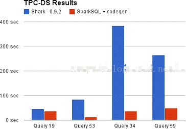
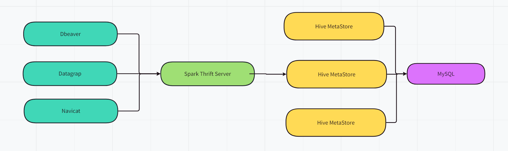

# 第1章 SparkSQL 概述

## SparkSQL 是什么

Spark SQL 是Spark 用于结构化数据(structured data)处理的 Spark 模块。

{width="3.062498906386702in" height="1.0416666666666667in"}

{width="5.7385728346456695in" height="0.4739577865266842in"}


## Hive and SparkSQL的关系


Hive 是早期唯一运行在Hadoop 上的SQL-on-Hadoop 工具。但是 MapReduce 计算过程中大量的中间磁盘落地过程消耗了大量的 I/O，降低的运行效率，为了提高 SQL-on-Hadoop 的效率，大量的SQL-on-Hadoop 工具开始产生，其中表现较为突出的是：

-   Drill

-   Impala

-   Shark

其中 Shark 是伯克利实验室 Spark 生态环境的组件之一，是基于Hive 所开发的工具，它修改了下图所示的右下角的内存管理、物理计划、执行三个模块，并使之能运行在 Spark 引擎上。

{width="4.633701881014873in" height="1.6358967629046368in"}

Shark 的出现，使得SQL-on-Hadoop 的性能比Hive 有了 10-100 倍的提高。


但是，随着Spark 的发展，对于野心勃勃的Spark 团队来说，Shark 对于 Hive 的太多依赖（如采用 Hive 的语法解析器、查询优化器等等），制约了 Spark 的One Stack Rule Them All 的既定方针，制约了 Spark 各个组件的相互集成，所以提出了 SparkSQL 项目。**SparkSQL 抛弃原有 Shark 的代码，汲取了 Shark 的一些优点，如内存列存储（In-Memory Columnar Storage）、Hive 兼容性等，重新开发了SparkSQL 代码；由于摆脱了对Hive 的依赖性，SparkSQL无论在数据兼容、性能优化、组件扩展方面都得到了极大的方便，真可谓"退一步，海阔天空"。**

- 数据兼容方面 SparkSQL 不但兼容Hive，还可以从RDD、parquet 文件、JSON 文件中获取数据，未来版本甚至支持获取RDBMS 数据以及 cassandra 等NOSQL 数据；

- 性能优化方面 除了采取 In-Memory Columnar Storage、byte-code generation 等优化技术外、将会引进Cost Model 对查询进行动态评估、获取最佳物理计划等等；

  {width="2.691839457567804in" height="1.8711450131233596in"}

-   组件扩展方面 无论是 SQL 的语法解析器、分析器还是优化器都可以重新定义，进行扩展。

2014 年 6 月 1 日 Shark 项目和 SparkSQL 项目的主持人Reynold Xin 宣布：停止对 Shark 的开发，团队将所有资源放SparkSQL 项目上，至此，Shark 的发展画上了句话，但也因此发展出两个支线：SparkSQL 和 Hive on Spark。


其中 SparkSQL 作为 Spark 生态的一员继续发展，而不再受限于 Hive，只是兼容 Hive；而Hive on Spark 是一个Hive 的发展计划，该计划将 Spark 作为Hive 的底层引擎之一，也就是说，Hive 将不再受限于一个引擎，可以采用 Map-Reduce、Tez、Spark 等引擎。

对于开发人员来讲，SparkSQL 可以简化RDD 的开发，提高开发效率，且执行效率非常快，所以实际工作中，基本上采用的就是 SparkSQL。


## Spark on Hive和Hive on Spark的区别

- Hive on Spark

  就是在Hive中执行Hive SQL, 然后Hive将SQL根据底层的执行引擎, 翻译成执行引擎对应的执行计划, Hive支持的执行器有

  - MapReduce
  - Spark
  - Tez

  而Hive on Spark就是Spark作为底层的执行引擎, 将Hive SQL翻译为具体的Spark任务来执行

- Spark on Hive

  就是开发人员直接编写Spark SQL或者Spark RDD的任务, 来执行具体的任务
  
  但是Spark并不保存具体的元数据信息
  
  比如我们有两个Spark SQL任务, 这两个任务都需要使用一样的数据源, 那么就可以将数据源定义为一张表
  
  那么我们就需要在两个Spark SQL中都定义这样一张表, 应为Spark只负责执行, 但是不负责具体的元数据的保存
  
  **所以Spark on  Hive就是Spark可以借助Hive的元数据管理(HiveMetastore), 将相关的元数据保存到Hive中, 这样Spark任务就可以跨作业执行了**
  
  同样的还有Flink on Hive, Flink将元数据信息通过HiveMetastore保存到数据库中,  进行跨作业执行
  
  


## SparkSQL 特点

1. 易整合

   无缝的整合了 SQL 查询和 Spark 编程

2. 统一的数据访问

   **使用相同的方式连接不同的数据源**
   
3. 兼容 Hive
   **在已有的仓库上直接运行 SQL 或者 HiveQL**
   {width="5.591018153980753in" height="1.1399989063867018in"}

4. 标准数据连接
   **通过 JDBC 或者 ODBC 来连接**
   {width="5.630435258092739in" height="1.045in"}


## DataFrame和DataSet

Spark SQL 为了简化RDD 的开发， 提高开发效率，提供了 2 个编程抽象，类似Spark Core 中的RDD

-   DataFrame
-   DataSet

### DataFrame 是什么

比如我们有一个RDD[Person]类型的RDD, **如果我们将其添加上Schema元信息, 将Person的每一个字段都设置为一列,  将其映射为一张表, 那么Saprk就知道了每一列的名字, 每一列的类型, 那么他就变成的DataFrame**

应为DataFrame带上了Schema信息, 那么Spark SQL就可以对他做针对性的优化, 从而提升性能

{width="3.687361111111111in" height="1.939721128608924in"}


比如我们执行一个如下代码

~~~scala
users.join(events, users("id" === events("uid"))).filter(events("date") > "2015-01-01")
~~~

因为Spark中有users表的元数据信息, 知道每一列的名字与类型, 所以执行先进行filter操作, 然后执行join, 然后再执行filter, 提高join的效率

而如果是RDD的话, 就只能一步一步来执行了


**DataFrame类似与Flink中提供的Table API, 将RDD映射为一个表对象, 然后可以将其注册为视图, 在视图上执行sql, 或者类似于Table API一样调用函数**


### DataSet 是什么

在RDD转为DataSet的时候, 我们给RDD添加上了schema的信息, 但是针对于每一行数据, Spark会认为他就是一个Row类型,  我们从Row中获取对应列的值的时候, 只能使用列名


所以我们可以给DataSet添加上类型信息, 这样对于每一行的数据, Spark就知道他其实是一个对象, 这样我们就可以直接调用字段来获取对应的值了


 DataSet 是分布式数据集合, 是DataFrame 的一个扩展。

它提供了RDD 的优势（强类型，使用强大的 lambda 函数的能力）以及Spark SQL 优化执行引擎的优点。

DataSet 也可以使用功能性的转换（操作 map，flatMap，filter 等等）。

-   DataSet 是DataFrame API 的一个扩展，是SparkSQL 最新的数据抽象

-   用户友好的 API 风格，既具有类型安全检查也具有DataFrame 的查询优化特性；

-   用样例类来对DataSet 中定义数据的结构信息，样例类中每个属性的名称直接映射到

 DataSet 中的字段名称；

-   **DataSet 是强类型的。比如可以有 DataSet\[Car\]，DataSet\[Person\]。**

-   **DataFrame 是DataSet 的特列，DataFrame=DataSet\[Row\] ，所以可以通过 as 方法将DataFrame 转换为DataSet。**Row 是一个类型，跟 Car、Person 这些的类型一样，所有的表结构信息都用 Row 来表示。获取数据时需要指定顺序

# 第2章 SparkSQL 核心编程

 本课件重点学习如何使用 Spark SQL 所提供的 DataFrame 和DataSet 模型进行编程.， 以及了解它们之间的关系和转换，<font color=red>关于具体的SQL 书写不是我们的重点。</font>


## 快速上手

### 使用spark-shell

1. 在`spark-shell`中, 程序启动的时候就会为我们创建两个对象

   1. sc: SparkContext

      这个对象主要用于执行RDD

   2. spark: SparkSession
   
      他实际上是SQLContext和HiveContext的组合, SQLContext用于执行Spark SQL, HiveContext用于执行Hive SQL
   
      {width="5.776798993875765in" height="1.3110411198600176in"}
   
2. 假如我们在`spark安装目录/bin/input`下有文本`users.json`

   ~~~json
   {"name":"zhangsan", "age": 18},
   {"name":"lisi", "age": 18}
   ~~~

3. 我们可以在`bin`中执行`spark-shell`中执行如下程序, 然后执行如下代码:

   


### 使用spark-sql

在spark的安装目录下, 有一个`bin/spark-sql`执行程序, 可以执行执行这个程序, 然后就可以在其中编写spark-sql了


## IDEA 开发SparkSQL

 实际开发中，都是使用 IDEA 进行开发的。

1. 添加依赖

   ~~~xml
   <dependency>
   	<groupId>org.apache.spark</groupId>
   	<artifactId>spark-sql_2.12</artifactId>
   	<version>3.0.0</version>
   </dependency>
   ~~~

2. 代码实现

   ~~~scala
   import org.apache.spark.sql.{SparkSession, DataFrame, Dataset, Row}
   import org.apache.spark.{SparkConf, SparkContext}
   import org.apache.spark.rdd.RDD
   
   object SparkSQL01_Demo {
       
     // 用户数据模型
     case class User(id: Int, name: String, age: Int)
       
     def main(args: Array[String]): Unit = {
       // 创建上下文环境配置对象
       val conf: SparkConf = new SparkConf()
         .setMaster("local[*]")
         .setAppName("SparkSQL01_Demo")
   
       // 创建 SparkSession 对象
       val spark: SparkSession = SparkSession.builder()
         .config(conf)
         .getOrCreate()
   
       // RDD=>DataFrame=>DataSet 转换需要引入隐式转换规则，否则无法转换
       // spark 不是包名，是上下文环境对象名
       import spark.implicits._
   
      // 代码编写.....
   
       // 释放资源
       spark.stop()
     }
   }
   ~~~

   


## DataFrame

### 创建 DataFrame

1. 从文件中创建, 调用`session.read.xxx`方法读取对应类型的文件

   从文件中读取数据时, 如果读取的数字，不能确定是什么类型，所以用 bigint 接收，可以和Long 类型转换，但是和 Int 不能进行转换

   ~~~scala
     def main(args: Array[String]): Unit = {
       val conf: SparkConf = new SparkConf().setMaster("local[*]").setAppName("sql")
       val context: SparkContext = SparkContext.getOrCreate(conf)
       val session: SparkSession = SparkSession.builder().config(conf).getOrCreate()
   
       // 读取json创建dataframe
       val user: DataFrame = session.read.json("sql_data/user.json")
       // 从csv文件中创建dataFrame
       val userCSV: DataFrame = session.read.csv("sql/data/user.csv")
   
       // 断开连接
       session.stop();
       context.stop();
     }
   ~~~

2. 从集合中创建

   ~~~scala
     def main(args: Array[String]): Unit = {
       val conf: SparkConf = new SparkConf().setMaster("local[*]").setAppName("sql")
       val context: SparkContext = SparkContext.getOrCreate(conf)
       val session: SparkSession = SparkSession.builder().config(conf).getOrCreate()
   
       // 从集合中创建dataframe
       val user1: DataFrame = session.createDataFrame(List(("zhqangsan", 12), ("lisi", 199), ("wanwu", 22))).toDF("name", "age")
   
       // 断开连接
       session.stop();
       context.stop();
     }
   ~~~

3. 从RDD中创建

   ~~~scala
     def main(args: Array[String]): Unit = {
       val conf: SparkConf = new SparkConf().setMaster("local[*]").setAppName("sql")
       val context: SparkContext = SparkContext.getOrCreate(conf)
       val session: SparkSession = SparkSession.builder().config(conf).getOrCreate()
   
       // 从rdd中创建dataframe
       val rdd: RDD[(String, Int)] = context.makeRDD(List(("zhqangsan", 12), ("lisi", 199), ("wanwu", 22)))
       val frame: DataFrame = session.createDataFrame(rdd)
   
       // 断开连接
       session.stop();
       context.stop();
     }
   ~~~

4. 从对Hive Table的查询中返回

   稍后讨论

### 对DataFrame使用SQL

如果想要对DataFrame执行sql, 那么要先将DataFrame注册为视图, 有两种方式可以将DataFrame注册为一张表:

1. 创建临时视图, 当session断开的时候, 视图就会失效

   ~~~scala
     def main(args: Array[String]): Unit = {
       val conf: SparkConf = new SparkConf().setMaster("local[*]").setAppName("sql")
       val context: SparkContext = SparkContext.getOrCreate(conf)
       val session: SparkSession = SparkSession.builder().config(conf).getOrCreate()
   
       // 读取json创建dataframe
       val user: DataFrame = session.read.json("sql_data/user.json")
   
       user.createTempView("user_temp") // 如果有重名的view将报错, 只能在当前session中读取到该view, session断开后view消失
       user.createOrReplaceTempView("user_temp") // 创建或者替换
   
       val userResult: DataFrame = session.sql("select * from user_temp")
       userResult.show()
   
       // 断开连接
       session.stop();
       context.stop();
     }
   ~~~

2. 创建全局临时视图, 当session断开的时候, 视图失效, 但是视图可以跨session访问

   在访问全局临时视图的时候, 必须指定全路径:  `global_temp.user_temp`

   ~~~scala
     def main(args: Array[String]): Unit = {
       val conf: SparkConf = new SparkConf().setMaster("local[*]").setAppName("sql")
       val context: SparkContext = SparkContext.getOrCreate(conf)
       val session: SparkSession = SparkSession.builder().config(conf).getOrCreate()
   
       // 读取json创建dataframe
       val user: DataFrame = session.read.json("sql_data/user.json")
         
       user.createGlobalTempView("user_global_temp") // 创建global view,  可以跨session读取该view, session断开后view消失
       user.createOrReplaceGlobalTempView("user_global_temp")
   
       val userResult: DataFrame = session.sql("select * from global_temp.user_temp")
       userResult.show()
         
         // 跨session访问
         val userResult: DataFrame = session.newSession().sql("select * from global_temp.user_temp")
       userResult.show()
   
       // 断开连接
       session.stop();
       context.stop();
     }
   ~~~

   

### DataFrame的DSL语法

DataFrame 提供一个特定领域语言(domain-specific language, DSL)去管理结构化的数据。

可以在 Scala, Java, Python 和 R 中使用 DSL，使用 DSL 语法风格不必去创建临时视图了

**DataFrame的DSL语法类似于Flink中提供的Table API**

在使用DSL语法的时候, 要导入`SparkSession`对象中的`implicites._`

~~~scala
  def main(args: Array[String]): Unit = {
    val conf: SparkConf = new SparkConf().setMaster("local[*]").setAppName("sql")
    val context: SparkContext = SparkContext.getOrCreate(conf)
    val session: SparkSession = SparkSession.builder().config(conf).getOrCreate()

    // 读取json
    val user: DataFrame = session.read.json("sql_data/user.json")

    // 查看user的schema
    println(user.printSchema())

    // 获取schema
    val schema: StructType = user.schema

    // 导入的session不是包名, 而是SparkSession对象!!!!!!!
    import session.implicits._ 
      
    // 查看username列, 和age + 1列
    user.select($"username", $"age" + 1).show 
    
    // 查看age大于30的数据
    user.filter($"age" > 30).show
    
    // 按照age分组, 进行count
    user.groupBy("age").count.show
    
    // 断开连接
    session.stop()
    context.stop()
  }
~~~

输出如下:

~~~scala
root
 |-- age: long (nullable = true)
 |-- username: string (nullable = true)

()
+--------+---------+
|username|(age + 1)|
+--------+---------+
|zhangsna|       19|
|   wanwu|       19|
|    lisi|      101|
+--------+---------+

+---+--------+
|age|username|
+---+--------+
|100|    lisi|
+---+--------+

+---+-----+
|age|count|
+---+-----+
|100|    1|
| 18|    2|
+---+-----+
~~~

## DataSet

 DataSet 是具有强类型的数据集合，需要提供对应的类型信息。

### 创建 DataSet

~~~scala
  case class Person(var name: String, var age: Long)
  def main(args: Array[String]): Unit = {


    val conf: SparkConf = new SparkConf().setMaster("local[*]").setAppName("sql")
    val context: SparkContext = SparkContext.getOrCreate(conf)
    val session: SparkSession = SparkSession.builder().config(conf).getOrCreate()
    import session.implicits._

    /**
     * 使用样例类创建DataSet
     */

    val list: Seq[Person] = Seq(Person("zhangsan", 123), Person("lisi", 23))
    val ds: Dataset[Person] = list.toDS()
    ds.show

    /**
     * 通过RDD来获取DataSet
     */
    val rdd: RDD[Person] = context.makeRDD(Seq(Person("zhangsan", 123), Person("lisi", 23)))
    val ds1: Dataset[Person] = rdd.toDS()
    ds1.show

    // 断开连接
    session.stop()
    context.stop()
  }
~~~


### 对DataSet使用SQL

和DataFrame类似, 需要注册视图, 然后再使用


### DataSet的DSL语法

和DataFrame一样


### DataSet相较于DataFrame的优点

相较于DataSet, 你可以明确知道每一行数据的类型, 所以

- DataSet提供了类型安全的的操作
- DataSet可以和函数式编程结合

~~~scala
  case class Person(name: String, age: Int)


  def main(args: Array[String]): Unit = {
    val spark = SparkSession.builder()
      .appName("DatasetVsDataFrame")
      .master("local[*]") // 使用本地模式
      .getOrCreate()

    import spark.implicits._

    // 创建一个 Seq[Person] 并转换为 Dataset
    val peopleSeq = Seq(Person("Alice", 30), Person("Bob", 25), Person("Charlie", 35))
    val peopleDS: Dataset[Person] = peopleSeq.toDS()

    // 创建 DataFrame
    val peopleDF: DataFrame = peopleDS.toDF()

    // 类型安全的 API 示例
    demonstrateTypeSafety(spark, peopleDS, peopleDF)

    // 函数式编程接口示例
    demonstrateFunctionalProgramming(spark, peopleDS, peopleDF)

    spark.stop()
  }

  def demonstrateTypeSafety(spark: SparkSession, peopleDS: Dataset[Person], peopleDF: DataFrame): Unit = {
    import spark.implicits._

    println("\nType Safety Comparison:")
    // Dataset 的类型安全操作
    val adultsDS: Dataset[Person] = peopleDS.filter(_.age > 30)
    adultsDS.show()

    // DataFrame 的操作：注意这里需要使用字符串列名，并且返回的是 Row 对象
    val adultsDF: DataFrame = peopleDF.filter($"age" > 30)
    adultsDF.show()

    // 如果在 DataFrame 中拼写错误，编译时不会报错，但会在运行时抛出异常
    // val wrongColumnDF = peopleDF.filter($"ages" > 30) // 会在运行时出错
  }

  def demonstrateFunctionalProgramming(spark: SparkSession, peopleDS: Dataset[Person], peopleDF: DataFrame): Unit = {
    import spark.implicits._
    println("\nFunctional Programming Comparison:")

    // Dataset 使用 map 进行操作，直接操作类型化对象
    val namesDS: Dataset[String] = peopleDS.map(person => person.name)
    namesDS.show()

    // DataFrame 使用 select + expr 进行操作，需要指定列名，返回的是 Row 对象
    val namesDF: DataFrame = peopleDF.select($"name")
    namesDF.show()
  }
~~~


## RDD 和 DataFrame和DataSet互转

在 IDEA 中开发程序时，如果需要RDD 与DF 或者DS 之间互相操作，那么需要引入` import spark.implicits._`

这里的 spark 不是Scala 中的包名，而是创建的 sparkSession 对象的变量名称，所以必须先创建 SparkSession 对象再导入。<font color=red> **这里的 spark 对象不能使用var 声明，因为 Scala 只支持val 修饰的对象的引入。**</font>

 **实际开发中，一般通过样例类将 RDD 转换为 DataFrame**

**实际上DataFrame就是DataSet[Row]**

~~~scala
object _03_Convert {
  case class Person(name: String, age: Int)
    
  def main(args: Array[String]): Unit = {
    val conf: SparkConf = new SparkConf().setMaster("local[*]").setAppName("sql")
    val context: SparkContext = SparkContext.getOrCreate(conf)
    val session: SparkSession = SparkSession.builder().config(conf).getOrCreate()
    import session.implicits._

    val value: RDD[(String, Int)] = context.makeRDD(List("zhangsan" -> 18, "lisi" -> 17, "wanwu" -> 10))

    // rdd <==> dataframe
    val frame: DataFrame = value.toDF("name", "age") // rdd转换为DataFrame, 需要传入对应的列名
    val value1: RDD[Row] = frame.rdd // DataFrame 转换为 rdd

    // dataframe <==> dataset
    val dataSet: Dataset[Person] = frame.as[Person] // DataFrame转换为DataSet
    val frame1: DataFrame = dataSet.toDF() // DataSet转换为DataFrame
    val frame2: DataFrame = dataSet.toDF("name1", "age1") // DataSet转换为DataFrame, 并重新命名列

    // rdd <==> dataset
    val personRDD: RDD[Person] = context.makeRDD(List(Person("zhangsna", 15), Person("wanwu", 10), Person("lisi", 199)))
    val dataSet2: Dataset[Person] = personRDD.toDS()  // 需要通过样例类获取结构信息才能够转换为DataSet
    val rdd: RDD[Person] = dataSet2.rdd // DataSet转换为rdd

    // 断开连接
    session.stop();
    context.stop()
  }
}
~~~


## RDD、DataFrame、DataSet 三者的异同

在 SparkSQL 中 Spark 为我们提供了两个新的抽象，分别是 DataFrame 和 DataSet。他们和 RDD 有什么区别呢？

如果同样的数据都给到这三个数据结构，他们分别计算之后，都会给出相同的结果。不同是的他们的执行效率和执行方式。**在后期的 Spark 版本中，DataSet 有可能会逐步取代RDD和 DataFrame 成为唯一的API 接口。**

**三者的共性**

-   RDD、DataFrame、DataSet 全都是 spark 平台下的分布式弹性数据集，为处理超大型数据提供便利;

-   三者都有惰性机制，在进行创建、转换，如 map 方法时，不会立即执行，只有在遇到

 Action 如 foreach 时，三者才会开始遍历运算;

-   三者有许多共同的函数，如 filter，排序等;
-   在对DataFrame 和Dataset 进行操作许多操作都需要这个包:import spark.implicits.\_（在创建好 SparkSession 对象后尽量直接导入）
-   三者都会根据 Spark 的内存情况自动缓存运算，这样即使数据量很大，也不用担心会内存溢出
-   三者都有 partition 的概念
-   DataFrame 和DataSet 均可使用模式匹配获取各个字段的值和类型

**三者的区别**

1. RDD
   - RDD 一般和 spark mllib 同时使用
   - RDD 不支持 sparksql 操作

2. DataFrame
   - 与 RDD 和 Dataset 不同，DataFrame 每一行的类型固定为Row，每一列的值没法直接访问，只有通过解析才能获取各个字段的值
   - DataFrame 与DataSet 一般不与 spark mllib 同时使用
   - DataFrame 与DataSet 均支持 SparkSQL 的操作，比如 select，groupby 之类，还能注册临时表/视窗，进行 sql 语句操作
   - DataFrame 与DataSet 支持一些特别方便的保存方式，比如保存成 csv，可以带上表头，这样每一列的字段名一目了然(后面专门讲解)

3. DataSet

   - Dataset 和DataFrame 拥有完全相同的成员函数，区别只是每一行的数据类型不同。

     DataFrame 其实就是DataSet 的一个特例 type DataFrame = Dataset\[Row\]

   - DataFrame 也可以叫Dataset\[Row\],每一行的类型是 Row，不解析，每一行究竟有哪些字段，各个字段又是什么类型都无从得知，只能用上面提到的 getAS 方法或者共性中的第七条提到的模式匹配拿出特定字段。

     而Dataset 中，每一行是什么类型是不一定的，在自定义了 case class 之后可以很自由的获得每一行的信息

**三者的互相转换**


{width="5.454022309711286in" height="3.1968744531933506in"}


## 用户自定义函数UDF

 用户可以通过 `spark.udf` 功能添加自定义函数，实现自定义功能。

### UDF

```scala
  def main(args: Array[String]): Unit = {
    val conf: SparkConf = new SparkConf().setMaster("local").setAppName("udf")
    val session: SparkSession = SparkSession.builder().config(conf).getOrCreate()
    import session.implicits._

    val frame: DataFrame = session.read.json("sql_data/user.json")

    frame.createOrReplaceTempView("user")
    val prefixFunc = (x:String) => "prefix_" + x

    session.udf.register("addPrefix", prefixFunc)
    session.sql("select addPrefix(username) from user").show()

    session.stop()
  }
```


### UDAF

强类型的Dataset 和弱类型的 DataFrame 都提供了相关的聚合函数， 如 count()， countDistinct()，avg()，max()，min()。

除此之外，用户可以设定自己的自定义聚合函数。

在Spark3.0以前, 通过继承 UserDefinedAggregateFunction 来实现用户自定义聚合函数, 但是该函数是弱类型的, 使用的时候不方便

从Spark3.0 版本后，UserDefinedAggregateFunction 已经不推荐使用了。可以统一采用强类型聚合函Aggregator

 下面是一个计算平均工资的小需求

1. 使用RDD实现

   ~~~scala
   import org.apache.spark.{SparkConf, SparkContext}
   
   object SimpleRDDExample {
     def main(args: Array[String]): Unit = {
       // 配置和创建 SparkContext
       val conf: SparkConf = new SparkConf().setAppName("SimpleRDDExample").setMaster("local[*]")
       val sc: SparkContext = new SparkContext(conf)
   
       // 创建一个 RDD 并进行 map 和 reduce 操作
       val res: (Int, Int) = sc.makeRDD(List(
         ("zhangsan", 20), 
         ("lisi", 30), 
         ("wangwu", 40)
       )).map { case (name, age) =>
         (age, 1)
       }.reduce { (t1, t2) =>
         (t1._1 + t2._1, t1._2 + t2._2)
       }
   
       // 打印结果
       println(res._1 / res._2)
   
       // 关闭 SparkContext
       sc.stop()
     }
   }
   
   ~~~

2. 使用累加器实现

   ~~~scala
   import org.apache.spark.util.AccumulatorV2
   
   class MyAC extends AccumulatorV2[Int, Int] {
     // 定义累加器的内部状态
     private var sum: Int = 0
     private var count: Int = 0
   
     // 判断累加器是否为初始状态
     override def isZero: Boolean = sum == 0 && count == 0
   
     // 复制累加器
     override def copy(): AccumulatorV2[Int, Int] = {
       val newMyAc = new MyAC
       newMyAc.sum = this.sum
       newMyAc.count = this.count
       newMyAc
     }
   
     // 重置累加器
     override def reset(): Unit = {
       sum = 0
       count = 0
     }
   
     // 向累加器中增加数据
     override def add(v: Int): Unit = {
       sum += v
       count += 1
     }
   
     // 合并两个累加器
     override def merge(other: AccumulatorV2[Int, Int]): Unit = {
       other match {
         case o: MyAC =>
           this.sum += o.sum
           this.count += o.count
         case _ =>
       }
     }
   
     // 返回累加器的结果
     override def value: Int = if (count == 0) 0 else sum / count
   }
   ~~~

3. 使用UserDefinedAggregateFunction实现

   ~~~scala
   import org.apache.spark.sql.{Row, SparkSession}
   import org.apache.spark.sql.expressions.MutableAggregationBuffer
   import org.apache.spark.sql.expressions.UserDefinedAggregateFunction
   import org.apache.spark.sql.types._
   
       // spark 2.x使用这种方式
       class Avg extends UserDefinedAggregateFunction{
   
         // 定义聚合函数的输入类型
         override def inputSchema: StructType = StructType(Array(StructField("xxx", IntegerType)))
   
         // 定义聚合函数的缓冲区(中间状态)的数据类型
         override def bufferSchema: StructType = StructType(Array(StructField("sum", LongType),
           StructField("cnt", IntegerType)))
   
         // 初始化缓冲区,  需要与上面定义的缓冲区的类型一致
         override def initialize(buffer: MutableAggregationBuffer): Unit = {
           // 缓冲区按上面定义的缓冲区数据类型的索引保存和读取自己需要的数据
   
           // 这里buffer(0) = 0表示更新缓冲区中sum的值
           buffer(0) = 0L
           buffer(1) = 0
         }
         // 定义聚合函数的结果的类型
         override def dataType: DataType = DoubleType
   
         // 是否稳定: 对于相同的输入是否有相同的输出
         override def deterministic: Boolean = true
   
         // 进行聚合
         override def update(buffer: MutableAggregationBuffer, input: Row): Unit = {
           // 缓冲区按上面定义的缓冲区数据类型的索引保存和读取自己需要的数据
           // 传入的数据Row按照定义的输入数据结构的索引来获取数据
   
           // 这里的buffer.getLong(0)表示获取sum的值
           // input.getLong(0)表示获取输入数据中xxx的值
           buffer(0) = buffer.getLong(0) + input.getInt(0).toLong
           buffer(1) = buffer.getInt(1) + 1
         }
   
         // 两个buffer进行聚合, 第二个参数buffer2虽然是row类型但是还是按照缓冲区的方式来取值
         override def merge(buffer1: MutableAggregationBuffer, buffer2: Row): Unit = {
           buffer1(0) = buffer1.getLong(0) + buffer2.getLong(0)
           buffer1(1) = buffer1.getInt(1) + buffer2.getInt(1)
         }
   
         // 这里的buffer虽然是Row类型, 但是还是按照buffer的方式来计算最后的结果
         override def evaluate(buffer: Row): Any = buffer.getLong(0).toDouble / buffer.getInt(1)
       }
   
       val conf: SparkConf = new SparkConf().setMaster("local").setAppName("udf")
       val session: SparkSession = SparkSession.builder().config(conf).getOrCreate()
   
       val frame: DataFrame = session.createDataFrame(List(("zhangsan", 12), ("lisi", 199), ("wanwu", 22), ("zhangsan", 13))).toDF("name", "age")
       val avgUdaf = new Avg
   
       // 注册udaf函数
       session.udf.register("myAvg", avgUdaf)
       frame.createOrReplaceTempView("user")
   
       // 使用udaf进行查询
       session.sql("select name, myAvg(age) from user group by name").show()
   
       session.stop()
     }
   ~~~

   

4. 使用Aggregator实现

   ~~~scala
   case class User(username: String, age: Long)
   
   case class Buffer(var sum: Long, var count: Long)
   
   // 需要三个泛型, 输入类型, 中间状态类型, 输出类型
   class Avg extends Aggregator[User, Buffer, Double] {
   
     // 初始化, 该方法需要返回一个初始的中间状态
     override def zero: Buffer = {
       Buffer(0L, 0L)
     }
   
     // 聚合输入的值
     override def reduce(b: Buffer, a: User): Buffer = {
       // 这种方式每次都要新建一个tuple, 所以可以定义一个case class用以保存中间状态
       b.sum += a.age
       b.count += 1
       b
     }
   
     // 合并两个中间状态
     override def merge(b1: Buffer, b2: Buffer): Buffer = {
       b1.sum += b2.sum
       b1.count += b2.count
       b1
     }
   
     // 返回结果值
     override def finish(buffer: Buffer): Double = {
       buffer.sum.toDouble / buffer.count
     }
   
     // 中间结果的编码方式, 如果是scala自带的类型, 可以调用Encoders.scalaXXX
     // 如果是自定义的类, 调用Encoders.product
     // 如果是tuple, 可以使用Encoders.tuple(Encoders.scalaLong, Encoders.scalaInt)
     override def bufferEncoder: Encoder[Buffer] = {
       Encoders.product
     }
   
     override def outputEncoder: Encoder[Double] = {
       Encoders.scalaDouble
     }
   }
   
     // spark 3.x使用这种方式
     @Test
     def newMethod(): Unit = {
   
       // 创建 SparkSession
       val spark = SparkSession.builder()
         .appName("SparkSQLUDAFDemo")
         .master("local[*]")
         .getOrCreate()
   
       import spark.implicits._
   
       // 示例数据
       val ds = Seq(User("zhangsan", 18L), User("lisi", 100L), User("zhangsan", 199L)).toDS()
   
       // 创建自定义的聚合函数
       val avg = new Avg
   
       // 创建并注册自定义的聚合函数 (使用 SQL API)
       spark.udf.register("avgAge", functions.udaf(avg))
   
       // 在 SQL 查询中使用聚合函数
       ds.createOrReplaceTempView("user")
       spark.sql("SELECT avgAge(age) AS average_age FROM user").show()
   
       // 停止 SparkSession
       spark.stop()
     }
   ~~~

   

## 数据的读取和保存

### 通用的读写方式

~~~scala
  // 通用的读写文件
  @Test
  def load_save(): Unit = {
    val conf: SparkConf = new SparkConf().setMaster("local").setAppName("load_save")
    val session: SparkSession = SparkSession.builder().config(conf).getOrCreate()
    // 指定默认的读取和输出的文件类型
    conf.set("spark.sql.sources.default", "json")


    // 通过load来指定加载路径或者文件, 如果指定路径下有多个文件会一起加载
    // 通过format指定读取的文件类型, 默认为parquet, 可以通过spark.sql.sources.default来修改默认读取的文件类型
    // format可以指定的值为csv, jdbc, json, orc, parquet, textFile, text, avro
    val frame: DataFrame = session.read.format("json").load("sql_data/user.json")

    // 通过format来指定输出文件的格式, 默认为parquet, 可以通过spark.sql.sources.default来修改默认输出的文件类型
    // 通过save来指定保存路径, 需要指定路径, 不能指定文件名
    // 指定输出文件的书写方式: append将文件输出在指定路径下, overwrite删除路径下文件再输出, error表示路径已存在就报错, ignore表示路径已存在就不输出文件
    // 通过option来指定文件格式相关的属性, 不同的文件格式有不同的属性
    frame.write.option("header", "true").format("csv").mode("overwrite").save("sql_data/csv")
  }
~~~

### JSON

~~~scala
  // json文件读写
  @Test
  def json(): Unit = {
    // 读取json文件要求文件的每一行必须是一个json串, 不能一个json对象占据多行
    val frame: DataFrame = session.read.json("sql_data/user.json")
    frame.write.mode("overwrite").json("sql_data/json")
  }
~~~


### Parquet

~~~scala
  @Test
  def parquet(): Unit = {
    // 读取parquet文件
    val df = session.read.load("sql_data/users.parquet")
    df.show

    //保存为 parquet 格式
    df.write.mode("append").save("output")
  }
~~~


### CSV

~~~scala
  // csv文件读写
  @Test
  def csv(): Unit = {
    // sep表示分隔符为逗号
    // header表示读取的文件是否带表头
    // inferSchema表示指定推断类型
    val frame: DataFrame = session.read.option("sep", ",").option("header", "true").option("inferSchema", "true").csv("sql_data/csv")
    frame.write.mode("append").json("sql_data/csv")
  }
~~~


### JDBC

导入依赖

~~~scala
<dependency>
	<groupId>mysql</groupId>
	<artifactId>mysql-connector-java</artifactId>
	<version>5.1.27</version>
</dependency>
~~~


~~~scala
  @Test
  def jdbc(): Unit = {

    /**
     * 方式1
     */
    val frame: DataFrame = session.read
      .option(JDBCOptions.JDBC_URL, "jdbc:mysql://192.168.31.8:3306/gmall")
      .option(JDBCOptions.JDBC_DRIVER_CLASS, "com.mysql.jdbc.Driver")
      .option("user", "root")
      .option("password", "871403165")
      .option(JDBCOptions.JDBC_TABLE_NAME, "sku_info")
      .option(JDBCOptions.JDBC_BATCH_FETCH_SIZE, "10")
      .format("jdbc")
      .load()
    frame.show

    /**
     * 方式2
     */
    val frame1: DataFrame = session
      .read.format("jdbc")
      .options(Map("url" -> "jdbc:mysql://linux1:3306/spark-sql?user=root&password=123123",
        "dbtable" -> "user",
        "driver" -> "com.mysql.jdbc.Driver"
      ))
      .load()
    frame1.show

    /**
     * 方式3
     */
    val props: Properties = new Properties()
    props.setProperty("user", "root")
    props.setProperty("password", "123123")
    val frame2: DataFrame = session.read.jdbc("jdbc:mysql://linux1:3306/spark-sql", "user", props)
    frame2.show

    /**
     * 写jdbc方式1
     */
    frame.write
      .format("jdbc")
      .option("url", "jdbc:mysql://linux1:3306/spark-sql")
      .option("user", "root")
      .option("password", "123123")
      .option("dbtable", "user")
      .mode(SaveMode.Append)
      .save()

    /**
     * 写jdbc方式2
     */
    val props1: Properties = new Properties()
    props1.setProperty("user", "root")
    props1.setProperty("password", "123123")
    frame.write.mode(SaveMode.Append).jdbc("jdbc:mysql://linux1:3306/spark-sql","user", props)
  }
~~~


### Hive

参考Spark on Hive


## Spark on Hive

https://www.bilibili.com/video/BV11A411L7CK?p=177&spm_id_from=pageDriver&vd_source=f79519d2285c777c4e2b2513f5ef101a

### Hive架构

要先了解Spark on Hive, 我们要先来了解Hive的相关组件以及架构

在Hive中, 主要有如下组件:

1. 数据库

   用来保存表结构先关的信息

2. metastore

   连接数据库, 提供了元数据的管理功能(增删改查)

3. HiveCli

   连接上metastore, 我们可以在cli上面编写hive sql, 然后他会从metastore上获取相关元数据, 生成执行计划, 并优化执行计划, 提交计划给底层的执行引擎执行

4. HiveServer2

   hive cli是一个控制台, 我们只要关闭了就没办法编写hive sql了, 所以hive提供了hiveServer2, 他是一个常驻的程序, 运行通过jdbc连接上他, 然后提交sql给他执行

   hiveServer2就类似于一个常驻版的hive-cli

针对Hive的元数据保存在哪里, 衍生出两种模式

1. derby内嵌数据库

   

2. mysql外部数据库

   对于元数据保存在mysql中的时候, 又依据metastore运行在哪里, 又衍生出两种模式

   1. 运行在Hive-Cli内部

      

   2. 运行在Hive-Cli外部

      这样我们的dbeaver, datagrap, navicat就可以连接上HiveServer2执行hive sql了

      同时impala也可以利用metastore来存储相关的元数据

      


### Spark on Hive架构

Spark on Hive的主要架构就是: Spark利用Hive的metastore, 存储元数据, 比如表结构相关信息, 这样Spark就可以跨作业执行了, **同时spark也可以读取Hive相关的表**

同时Spark on Hive也可Hive一样, 根据metastore运行在哪里, 可以分为两种模式

1. metastore就运行在Spark程序中

   

2. metastore单独运行

   

同时Spark也提供了和HiveServer2一样的组件, 就是Spark Thrift Server

甚至可以说Spark Thrift Server就是Spark从Hive那里将HiveServer2 copy过来的

所以我们只要启动Spark Thrift Server, 我们就可以通过jdbc的方式连接上Spark Thrift Server, 执行Spark SQL




#### 内嵌的metastore

内嵌的metastore就是说直接启动Spark, 然后Spark会在程序内部运行一个HiveMetastore, 然后Spark与这个内存的HiveMetastore进行交互


##### 使用spark-shell或者spark-sql连接内置的Hive

如果是通过`spark-shell`或者`spark-sql`启动的spark, 此时我们执行`create table xxx`, 那么spark就会和这个内置的HiveMetastore进行交互, 那么这个内置的Hive会将元数据保存在`$SPARK_HOME/metastore_db`, 将真实数据保存在`$SPARK_HOME/spark-warehouse`

**因为已经保存了元数据文件和具体的数据, 那么在下次启动spark-shell或者spark-sql的时候, 这个内置的Hive还是可以从这些文件中恢复, 只要元数据文件和具体的数据不删除, 我们就可以多次启动spark-shell进行跨作业执行sql**


##### 使用代码连接内置的Hive

如果是通过代码启动的spark, 那么我们自己的程序就会在内部模拟一个HiveMetastore, 这个内置的Hive会将元数据放在`项目根目录/metastore_db`, 将真实数据放在`项目根目录/spark-warehouse`下, 也可以通过`spark.sql.warehouse.dir`来指定真实数据的位置

使用代码来连接内置的Hive, 有如下步骤

1. 添加hive的依赖

   ~~~scala
           <!-- spark连接Hive -->
   <!-- scala版本为3.13, spark版本为3.2.1 -->
           <dependency>
               <groupId>org.apache.spark</groupId>
               <artifactId>spark-hive_${scala.version}</artifactId>
               <version>${spark.version}</version>
               <!-- <scope>provided</scope> -->
           </dependency>
           <dependency>
               <groupId>org.apache.hive</groupId>
               <artifactId>hive-exec</artifactId>
               <version>1.2.1</version>
               <!-- <scope>provided</scope> -->
           </dependency>
   ~~~

2. 启动Spark的Hive支持

   ~~~scala
     @Test
     def connectToEmbededHive(): Unit = {
       /**
        * 连接内置的Hive
        *     1. 导入Hive依赖
        *     2. spark启动Hive的支持
        *     3. 设置Hive真实数据的位置, 默认在项目根目录下的spark-warehouse下
        */
       val spark: SparkSession = SparkSession
         .builder()
         // 设置Hive真实数据的位置
         // 一般是放在hdfs上
         .config("spark.sql.warehouse.dir", "warehouse")
         .enableHiveSupport()
         .master("local[*]")
         .appName("sql")
         .getOrCreate()
         
       spark.sql(
         """
           |create table user(username string, age int);
           |""".stripMargin)
       spark.sql(
         """
           |insert into user(username, age) values("zhangsan", 12), ("lisi", 14)
           |""".stripMargin)
       spark.sql(
         """
           |select * from user""".stripMargin).show
       spark.stop()
     }
   ~~~

   

3. 设置Hadoop相关, 不设置可能会报错, 也可能不报错

   ~~~scala
   System.setProperty("HADOOP_USER_NAME", "root")
   ~~~

   


#### 外部的metastore

外置的metastore就是, 我们先启动一个metastore, 然后我们的Spark连接上这个metastore, 这样Spark就可以读取Hive中的表, 同时也可以将Spark中创建的表的元数据保存到元数据库中, 这样我们在进行跨作业执行任务的时候, 对于相同的表就不需要多次创建了

有两种方式可以让Spark连接外部的metastore:

1. 通过`spark-shell`或者`spark-sql`来启动Spark, 然后Spark连接外部的Hive
2. 通过代码运行spark, 然后Spark去连接外部的Hive


##### 使用spark-shell或者spark-sql连接外部的Hive

使用这种方式我们有如下几个步骤

-   Spark 要接管 metastore 需要把hive-site.xml 拷贝到conf/目录下
-   把 Mysql 的驱动 copy 到 jars/目录下, 应为hive的元数据的保存在mysql中的
-   **如果访问不到 hdfs，则需要把 core-site.xml 和 hdfs-site.xml 拷贝到 conf/目录下**
-   重启 spark-shell

~~~bash
scala> spark.sql("show tables").show
20/04/25 22:05:14 WARN ObjectStore: Failed to get database global_temp, returning
NoSuchObjectException
+ + + +
|database| tableName|isTemporary|
+ + +
false|
+
| default| emp|
| default|hive_hbase_emp_table|
| default| relevance_hbase_emp|
| default| staff_hive|
| default| ttt|
| default| user_visit_action|
false|
false|
false|
false|
false|
+ + + +
~~~


##### 使用代码连接外部的Hive

使用代码来连接内置的Hive, 有如下步骤

1. 添加hive的依赖

   ~~~xml
           <!-- spark连接Hive -->
   <!-- scala版本为3.13, spark版本为3.2.1 -->
           <dependency>
               <groupId>org.apache.spark</groupId>
               <artifactId>spark-hive_${scala.version}</artifactId>
               <version>${spark.version}</version>
               <!-- <scope>provided</scope> -->
           </dependency>
           <dependency>
               <groupId>org.apache.hive</groupId>
               <artifactId>hive-exec</artifactId>
               <version>1.2.1</version>
               <!-- <scope>provided</scope> -->
           </dependency>
   <!-- hive的元数据保存在mysql中, 所以需要提供mysql依赖-->
           <dependency>
               <groupId>mysql</groupId>
               <artifactId>mysql-connector-java</artifactId>
               <version>8.0.28</version>
           </dependency>
   ~~~

2. 将hive-site.xml文件拷贝到项目的resource目录下

3. 启动Spark的Hive支持

   ~~~scala
     @Test
     def connectToEmbededHive(): Unit = {
       /**
        * 连接内置的Hive
        *     1. 导入Hive依赖
        *     2. spark启动Hive的支持
        *     3. 设置Hive真实数据的位置, 默认在项目根目录下的spark-warehouse下
        */
       val spark: SparkSession = SparkSession
         .builder()
         // 此时连接的是外部的Hive, 但是spark只会把元数据放在hive中
         // 对于真实的数据文件, 我们还是可以指定位置
         .config("spark.sql.warehouse.dir", "hdfs://linux1:8020/user/hive/warehouse")
         .enableHiveSupport()
         .master("local[*]")
         .appName("sql")
         .getOrCreate()
         
       spark.sql(
         """
           |create table user(username string, age int);
           |""".stripMargin)
       spark.sql(
         """
           |insert into user(username, age) values("zhangsan", 12), ("lisi", 14)
           |""".stripMargin)
       spark.sql(
         """
           |select * from user""".stripMargin).show
       spark.stop()
     }
   ~~~

4. 设置Hadoop相关, 不设置可能会报错, 也可能不报错

   ~~~scala
   System.setProperty("HADOOP_USER_NAME", "root")
   ~~~

   


#### Spark Thrift Server

Spark Thrift Server是一个和HiveServer2一模一样的东西, 代码都是直接copy的

他的作用和HiveServer2在Hive中的作用是一样的, 就是一个常驻的进程, 我们可以通过jdbc连接上他, 然后提交spark sql去让他执行, 就像执行mysql一样

Spark Thrift Server和HiveServer2一样, 也需要连接Hive Metastore来获取元数据, 所以在启动Spark Thrift Server之前需要启动Hive Metastore


我们按照如下步骤来启动Spark Thrift Server

1. 启动Hive Metastore

2. Spark 要接管 Hive 需要把hive-site.xml 拷贝到conf/目录下

3. 把 Mysql 的驱动 copy 到 jars/目录下

4. 如果访问不到 hdfs，则需要把 core-site.xml 和 hdfs-site.xml 拷贝到 conf/目录下

5. 启动Thrift Server

   ~~~scala
   sbin/start-thriftserver.sh
   ~~~

6. 使用dbeaver连接thriftserver

   1. 设置host， port

      

   2. 添加jdbc驱动

      

   3. 设置aliyun maven

      添加aliyun maven地址：https://maven.aliyun.com/repository/public/

      并且移动到最上面

      

   4. 如果下载jar包的过程中出现“Can't open 'https://maven.aliyun.com/repository/public/org/apache/curator/apache-curator/2.12.0/apache-curator-2.12.0.jar': Not Found”，  直接点忽略


# 第3章 SparkSQL具体语法

https://spark.apache.org/docs/latest/sql-ref-null-semantics.html

## 支持的数据类型

1. 数字类型

   | 类型  | scala类型 | 大小  | 范围         |      | 说明 |
   | ----- | --------- | ----- | ------------ | ---- | ---- |
   | byte  | Byte      | 1byte | -128~127     |      |      |
   | short | Short     | 2byte | -32768~32767 |      |      |
   |       |           |       |              |      |      |
   |       |           |       |              |      |      |

   


# 第4章 SparkSQL 项目实战

## 数据准备

我们这次 Spark-sql 操作中所有的数据均来自 Hive，首先在 Hive 中创建表,，并导入数据。

一共有 3 张表： 1 张用户行为表，1 张城市表，1 张产品表

~~~sql
CREATE TABLE `user_visit_action`(
	`date` string,
	`user_id` bigint,
	`session_id` string,
	`page_id` bigint,
	`action_time` string,
	`search_keyword` string,
	`click_category_id` bigint,
	`click_product_id` bigint,
	`order_category_ids` string,
	`order_product_ids` string,
	`pay_category_ids` string,
	`pay_product_ids` string,
	`city_id` bigint)
	row format delimited fields terminated by '\t';
load data local inpath 'input/user_visit_action.txt' into table user_visit_action;
CREATE TABLE `product_info`(
	`product_id` bigint,
	`product_name` string,
	`extend_info` string)
	row format delimited fields terminated by '\t';
load data local inpath 'input/product_info.txt' into table product_info;

CREATE TABLE `city_info`(
	`city_id` bigint,
	`city_name` string,
	`area` string)
	row format delimited fields terminated by '\t';
load data local inpath 'input/city_info.txt' into table city_info;
~~~


## 需求：各区域热门商品 Top3

### 需求简介

这里的热门商品是从点击量的维度来看的，计算各个区域前三大热门商品，并备注上每个商品在主要城市中的分布比例，超过两个城市用其他显示。

 例如：

| 地区 | 商品名称 | 点击次数 | 城市备注                           |
| ---- | -------- | -------- | ---------------------------------- |
| 华北 | 商品 A   | 100000   | 北京 21.2%，天津 13.2%，其他 65.6% |
| 华北 | 商品 P   | 80200    | 北京 63.0%，太原 10%，其他 27.0%   |
| 华北 | 商品 M   | 40000    | 北京 63.0%，太原 10%，其他 27.0%   |
| 东北 | 商品 J   | 92000    | 大连 28%，辽宁 17.0%，其他 55.0%   |


### 需求分析

-   查询出来所有的点击记录，并与 city_info 表连接，得到每个城市所在的地区，与

 Product_info 表连接得到产品名称

-   按照地区和商品 id 分组，统计出每个商品在每个地区的总点击次数

-   每个地区内按照点击次数降序排列

-   只取前三名

-   城市备注需要自定义 UDAF 函数


### 功能实现

-   连接三张表的数据，获取完整的数据（只有点击）

-   将数据根据地区，商品名称分组

-   统计商品点击次数总和,取Top3

-   实现自定义聚合函数显示备注
