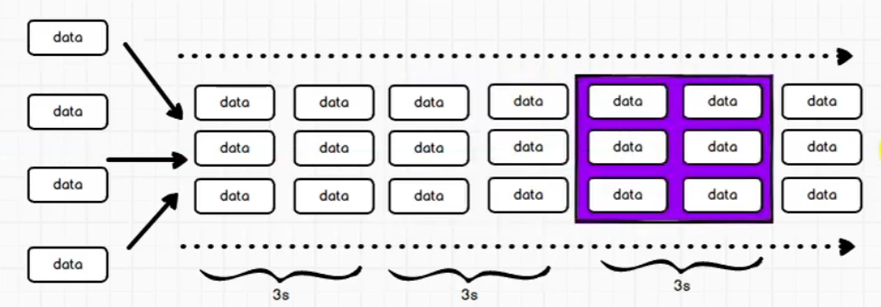

# 第1章 SparkStreaming 概述

## Spark Streaming 是什么

Spark Streaming 用于流式数据的处理。

但是Spark Streaming底层是RDD, 所以还无法做到Flink类似的毫秒级别

SparkStreaming是准实时的, 微批次的, 一般延迟在秒级别


## Spark Streaming 架构


1. 应用执行并启动Driver, Driver在内部创建StreamingContext和SparkContext
2. Driver启动一个Executor去执行Receiver
3. Receiver不断从数据源中获取信息, 并将持久化保存在内存或者磁盘, 同时备份给另外一个Executor
4. 每隔一段时间, Receiver都将这段时间内接收到的数据封装为一个Block, 发送给StreamingContext
5. **StreamingContext接受到Block后, 将其分转为一个RDD, 并且交给SparkContext**
6. SparkContext接受到RDD后, 启动Executor去执行Task, 处理当前这一批次的RDD数据
7. 依次循环


### 背压机制

Spark 1.5 以前版本，用户如果要限制 Receiver 的数据接收速率，可以通过设置静态配制参数`spark.streaming.receiver.maxRate`的值来实现，此举虽然可以通过限制接收速率，来适配当前的处理能力，防止内存溢出，但也会引入其它问题。

比如：producer 数据生产高于 maxRate，当前集群处理能力也高于 maxRate，这就会造成资源利用率下降等问题。

为了更好的协调数据接收速率与资源处理能力，1.5 版本开始 Spark Streaming 可以动态控制数据接收速率来适配集群数据处理能力。

背压机制（即 Spark Streaming Backpressure）: 根据JobScheduler 反馈作业的执行信息来动态调整Receiver 数据接收率。通过属性"spark.streaming.backpressure.enabled"来控制是否启用 backpressure 机制，默认值false，即不启用。

# 第 2 章 Dstream 入门

和 Spark 基于 RDD 的概念很相似，Spark Streaming将一段时间内接受到的数据封装为RDD,  而这些RDD依据时间组成序列, 被称为DStream



## WordCount 案例实操

需求：使用 netcat 工具向 9999 端口不断的发送数据，通过 SparkStreaming 读取端口数据并统计不同单词出现的次数

1. 添加依赖

   ~~~xml
           <!-- spark streaming scala版本为2.13, scala版本为3.2.1-->
           <dependency>
               <groupId>org.apache.spark</groupId>
               <artifactId>spark-streaming_${scala.version}</artifactId>
               <version>${spark.version}</version>
           </dependency>
   ~~~

2. 编写代码

   ~~~scala
     def main(args: Array[String]): Unit = {
   
       val sparkConf: SparkConf = new SparkConf().setMaster("local[*]").setAppName("StreamWordCount")
       // 初始化 SparkStreamingContext, 并定义每一批数据的时间
       val ssc = new StreamingContext(sparkConf, Seconds(3))
   
   
       // 从Socket中获取数据, 作为数据源, 并创建DStream
       // 可以在控制台执行 nc -lk 9999 来启动一个socket服务
       val lineStreams: ReceiverInputDStream[String] = ssc.socketTextStream("localhost", 9999)
       // 将每行数据进行拆分，得到单词
       val wordStreams: DStream[String] = lineStreams.flatMap(_.split(" "))
       // 将单词映射成元组（word,1）
       val wordAndOneStreams: DStream[(String, Int)] = wordStreams.map((_, 1))
       // 将相同的单词次数做统计
       val wordAndCountStreams: DStream[(String, Int)] = wordAndOneStreams.reduceByKey(_ + _)
   
       // 打印, 每一个批次到来的时候, 都会print, 打印当前批次数据执行后的结果
       // 打印的结果不会累加, 只是当前这一批次的数据的结果
         // 所以准确来说, 这是对一批次数据的wordcount 
       wordAndCountStreams.print()
   
       //启动 SparkStreamingContext, 并等待关闭
       ssc.start()
       ssc.awaitTermination()
     }
   ~~~

3. 启动netcat

   ~~~bash
   nc -lk 9999
   ~~~

4. 启动程序

5. 通过netcat向SparkStreaming发送数据

6. 输出结果如下:

   ~~~text
   -------------------------------------------
   Time: 1720609011000 ms
   -------------------------------------------
   (nsdakjfa,1)
   
   -------------------------------------------
   Time: 1720609014000 ms
   -------------------------------------------
   (sdjk,1)
   (sdjnfs,1)
   (djs,1)
   
   -------------------------------------------
   Time: 1720609017000 ms
   -------------------------------------------
   (djfks,1)
   (sdjks,1)
   ~~~

   


## DStream 创建

### 通过RDD队列

通过这种方式来创建DStream仅用于测试过程中

~~~scala
  def main(args: Array[String]): Unit = {

    val conf: SparkConf = new SparkConf().setMaster("local[*]").setAppName("RDDStream")
    val ssc = new StreamingContext(conf, Seconds(4))

    // 创建 RDD 队列
    val rddQueue = new mutable.Queue[RDD[Int]]()
    // 创建 QueueInputDStream, 用于保存RDD
    val inputStream: InputDStream[Int] = ssc.queueStream(rddQueue, oneAtATime = false)
    // 处理队列中的 RDD 数据
    val mappedStream: DStream[(Int, Int)] = inputStream.map((_, 1))
    val reducedStream: DStream[(Int, Int)] = mappedStream.reduceByKey(_ + _)
    // 打印结果
    reducedStream.print()
    // 启动任务
    ssc.start()

    // 循环创建并向 RDD 队列中放入 RDD
    for (i <- 1 to 5) {
      // 创建RDD并放入队列中, 让SparkStreaming读取数据
      rddQueue += ssc.sparkContext.makeRDD(1 to 300, 10)
      Thread.sleep(2000)
    }

    ssc.awaitTermination()
  }
~~~

### 通过Socket

~~~scala
  def main(args: Array[String]): Unit = {

    val sparkConf: SparkConf = new SparkConf().setMaster("local[*]").setAppName("StreamWordCount")
    // 初始化 SparkStreamingContext, 并定义每一批数据的时间
    val ssc = new StreamingContext(sparkConf, Seconds(3))


    // 从Socket中获取数据, 作为数据源, 并创建DStream
    // 可以在控制台执行 nc -lk 9999 来启动一个socket服务
    val lineStreams: ReceiverInputDStream[String] = ssc.socketTextStream("localhost", 9999)
    // 将每行数据进行拆分，得到单词
    val wordStreams: DStream[String] = lineStreams.flatMap(_.split(" "))
    // 将单词映射成元组（word,1）
    val wordAndOneStreams: DStream[(String, Int)] = wordStreams.map((_, 1))
    // 将相同的单词次数做统计
    val wordAndCountStreams: DStream[(String, Int)] = wordAndOneStreams.reduceByKey(_ + _)

    //打印
    wordAndCountStreams.print()

    //启动 SparkStreamingContext, 并等待关闭
    ssc.start()
    ssc.awaitTermination()

  }
~~~

### 通过自定义Receiver

下面自定义一个Receiver, 从Socket中读取文本

~~~scala
  def main(args: Array[String]): Unit = {
    //1.初始化 Spark 配置信息
    val sparkConf: SparkConf = new SparkConf().setMaster("local[*]")
      .setAppName("StreamWordCount")
    //2.初始化 SparkStreamingContext
    val ssc = new StreamingContext(sparkConf, Seconds(5))
    //3.创建自定义 receiver 的 Streaming
    val lineStream: ReceiverInputDStream[String] = ssc.receiverStream(new CustomerReceiver("hadoop102", 9999))
    //4.将每一行数据做切分，形成一个个单词
    val wordStream: DStream[String] = lineStream.flatMap(_.split("\t"))
    //5.将单词映射成元组（word,1）
    val wordAndOneStream: DStream[(String, Int)] = wordStream.map((_, 1))
    //6.将相同的单词次数做统计
    val wordAndCountStream: DStream[(String, Int)] = wordAndOneStream.reduceByKey(_ + _)
    //7.打印
    wordAndCountStream.print()
    //8.启动 SparkStreamingContext
    ssc.start()
    ssc.awaitTermination()
  }

  /**
   * 自定义Receiver, 必须继承Receiver接口
   * Receiver中有一个泛型, 表示接受到的数据的类型
   * Receiver的构造函数有一个参数, 表示Receiver对于接受到的数据, 应该使用什么持久化策略
   * StorageLevel.MEMORY_ONLY: 对于接受到的数据, 只保存到内存中
   */
  class SocketReceiver(host: String, port: Int ) extends Receiver[String](StorageLevel.MEMORY_ONLY) with Logging {

    private var socket: Socket = _

    def onStart(): Unit = {
      logInfo(s"正在连接 $host:$port")
      try {
        socket = new Socket(host, port)
      } catch {
        case e: ConnectException =>
          restart(s"连接错误 $host:$port", e)
          return
      }
      logInfo(s"成功连接 $host:$port")

      // Start the thread that receives data over a connection
      new Thread("Socket Receiver") {
        setDaemon(true)
        override def run(): Unit = {
          receive()
        }
      }.start()
    }

    def onStop(): Unit = {
      // in case restart thread close it twice
      synchronized {
        if (socket != null) {
          socket.close()
          socket = null
          logInfo(s"Closed socket to $host:$port")
        }
      }
    }

    /** Create a socket connection and receive data until receiver is stopped */
    def receive(): Unit = {
      try {
        val reader = new BufferedReader(new InputStreamReader(socket.getInputStream, StandardCharsets.UTF_8))
        val str = reader.readLine()
        while (!isStopped && str != null) {
          store(str)
        }
        reader.close()

        if (!isStopped()) {
          // 不是停止, 说明readline被中断了, 要重启任务
          restart("Socket data stream had no more data")
        } else {
          // 否则就是Receiver被停止了
          logInfo("Stopped receiving")
        }
      } catch {
        case NonFatal(e) =>
          logWarning("Error receiving data", e)
          restart("Error receiving data", e)
      } finally {
        onStop()
      }
    }
  }
~~~

### 通过Kafka

需要说明的是, 我们之前说过Spark Streaming的架构如图所示


但是在使用spark streaming 读取 kafka数据的时候, 架构是如下的


即Receiver直接运行在执行Task的Executor中, 而不是运行在一个单独的Executor, 使用这样的结构的话, 那么Receiver就可以根据Task的消费能力去拉取数据了, **实现背压**

1. 添加依赖

   ```xml
   <!-- spark streaming 对接kafka -->
   <dependency>
       <groupId>org.apache.spark</groupId>
       <artifactId>spark-streaming-kafka-0-10_${scala.version}</artifactId>
       <version>${spark.version}</version>
   </dependency>
   ```

2. 编写代码

   ~~~scala
     def main(args: Array[String]): Unit = {
   
       val sparkConf: SparkConf = new SparkConf().setAppName("ReceiverWordCount").setMaster("local[*]")
       val ssc = new StreamingContext(sparkConf, Seconds(3))
       // 定义 Kafka 参数
       val kafkaPara: Map[String, Object] = Map[String, Object](
         // 指定kafka的集群地址
         ConsumerConfig.BOOTSTRAP_SERVERS_CONFIG -> "linux1:9092,linux2:9092,linux3:9092",
         // 指定consumer group id
         ConsumerConfig.GROUP_ID_CONFIG -> "atguigu",
         "key.deserializer" -> "org.apache.kafka.common.serialization.StringDeserializer",
         "value.deserializer" -> "org.apache.kafka.common.serialization.StringDeserializer"
       )
       // 读取 Kafka 数据创建 DStream
       val kafkaDStream: InputDStream[ConsumerRecord[String, String]] =
         KafkaUtils.createDirectStream[String, String](ssc,
           LocationStrategies.PreferConsistent,
           // 指定kafka的topic
           ConsumerStrategies.Subscribe[String, String](Set("atguigu"), kafkaPara))
       // 将每条消息的 KV 取出
       val valueDStream: DStream[String] = kafkaDStream.map(record => record.value())
       // 计算 WordCount
       valueDStream.flatMap(_.split(" "))
         .map((_, 1))
         .reduceByKey(_ + _)
         .print()
   
       //7.开启任务
       ssc.start()
       ssc.awaitTermination()
     }
   ~~~

   

## DStream的操作

DStream 上的操作与 RDD 的类似，分为Transformations（转换）和Output Operations（输出）两种，此外转换操作中还有一些比较特殊的原语，如：updateStateByKey()、transform()以及各种Window 相关的原语。

- Transformations: 即对于一段时间内的数据封装的RDD, 我们应该怎么处理这个RDD, 比如map, filter等等

  Transformations类似于RDD中的转换算子

- Output: 即我们对RDD经过Transformations后, 那么对于Transformations后这一批数据的结果, 我们要怎么处理,  比如输出到控制台, 输出到文件系统, 输出到数据库中等等

  **Output类似于RDD中的行动算子**

  与RDD 中的惰性求值类似，**如果一个 DStream 及其派生出的DStream 都没有被执行输出操作，那么这些DStream 就都不会被求值。**如果 StreamingContext 中没有设定输出操作，整个context 就都不会启动。


### 无状态的Transformations

无状态转化操作就是把简单的RDD 转化操作应用到每个批次上，也就是转化DStream 中的每一个RDD。

部分无状态转化操作列在了下表中  

需要记住的是，尽管这些函数看起来像作用在整个流上一样，但事实上每个DStream 在内部是由许多RDD（批次）组成，且无状态转化操作是**单独**应用到每个 RDD 上的。

例如reduceByKey, 他只会针对当前这一批数据进行聚合, 而不会和以往的数据进行聚合

{width="5.882365485564304in" height="2.973957786526684in"}

#### 普通的transformation

下面是一些简单的Transformations案例:

~~~scala
  @Test
  def generalOperations(): Unit = {

    val conf: SparkConf = new SparkConf().setMaster("local[*]").setAppName("RDDStream")
    val ssc = new StreamingContext(conf, Seconds(4))

    // 创建 RDD 队列
    val rddQueue = new mutable.Queue[RDD[String]]()
    // 创建 QueueInputDStream, 用于保存RDD
    // oneAtTime表示每个时间段只从queue中读取一个RDD作为数据
    val inputStream: InputDStream[String] = ssc.queueStream(rddQueue, oneAtATime = true)


    // 处理队列中的 RDD 数据
    val result: DStream[(String, Int)] = inputStream.flatMap(str => str.split(","))
      .filter(word => !word.startsWith("g")) // 过滤掉g开头的单词
      .map(word => (word, 1))
      .repartition(3) // 改变分区数
      .reduceByKey((v1, v2) => v1 + v2)
    result.print()

    // 启动任务
    ssc.start()

    // 启动另外一个线程, 来生成数据
    new DataGenetor(rddQueue, ssc).start()
    ssc.awaitTermination()
  }

class DataGenetor(val queue: mutable.Queue[RDD[String]], val ssc: StreamingContext) extends Thread {
  override def run(): Unit = {
      val firstList = List("hello", "fucking", "grateful", "scared", "gorgeous")
      val secondList = List("world", "car", "bird", "view", "queue", "")
      while (true) {
        // 随机生成一批数据的个数
        val count: Int = new Random().nextInt(8)
        val list = mutable.ListBuffer[String]()

        // 开始随机生成这批数据, 并放入队列中
        for (_ <- 0 to count) {
          val first = firstList(new Random().nextInt(firstList.length))
          val second = secondList(new Random().nextInt(secondList.length))
          list.append(s"$first, $second")
        }
        // 构造RDD, 并放入Queue中
        queue += ssc.sparkContext.makeRDD(list.toList, 1)
        Thread.sleep(2000)
      }
  }
}
~~~


#### transform

如果上面的map, flatmap, filter等等函数无法满足你的需求, 那么DStream还提供了一个底层的transform函数, 这个函数可以让你直接操作接收到的RDD数据

Transform 允许 DStream 上执行任意的RDD-to-RDD 函数。即使这些函数并没有在DStream 的 API 中暴露出来，通过该函数可以方便的扩展 Spark API。该函数每一批次调度一次。其实也就是对 DStream 中的 RDD 应用转换。

~~~scala
  @Test
  def transform(): Unit = {
    val conf: SparkConf = new SparkConf().setMaster("local[*]").setAppName("RDDStream")
    val ssc = new StreamingContext(conf, Seconds(4))

    // 创建 RDD 队列
    val rddQueue = new mutable.Queue[RDD[String]]()
    // 创建 QueueInputDStream, 用于保存RDD
    // oneAtTime表示每个时间段只从queue中读取一个RDD作为数据
    val inputStream: InputDStream[String] = ssc.queueStream(rddQueue, oneAtATime = true)


    // 处理队列中的 RDD 数据
    val result: DStream[(String, Int)] = inputStream.transform(rdd => {
      val words = rdd.flatMap(str => str.split(","))
      val wordAndOne = words.map(word => (word, 1))
      val reduced = wordAndOne.reduceByKey((v1, v2) => v1 + v2)
      reduced
    })
    result.print()

    // 启动任务
    ssc.start()

    // 启动另外一个线程, 来生成数据
    new DataGenetor(rddQueue, ssc).start()

    ssc.awaitTermination()
  }
~~~


#### join

两个流之间的join 需要两个流的批次大小一致，这样才能做到同时触发计算。

join的底层实际上就是rdd1.join(rdd2)

~~~scala
// batchSize表示每一批数据的个数, 
class DataGenetor(val queue: mutable.Queue[RDD[String]], val ssc: StreamingContext, val batchSize: Int = -1)
  extends Thread {

  override def run(): Unit = {
    val firstList = List("hello", "fucking", "grateful", "scared", "gorgeous")
    val secondList = List("world", "car", "bird", "view", "queue", "")
    while (true) {
      // 随机生成一批数据的个数
      var count = batchSize
      if (batchSize == -1) {
        // 如果没有指定batchSize, 则随机生成
        count = new Random().nextInt(8)
      }
      val list = mutable.ListBuffer[String]()

      // 开始随机生成这批数据, 并放入队列中
      for (_ <- 0 to count) {
        val first = firstList(new Random().nextInt(firstList.length))
        val second = secondList(new Random().nextInt(secondList.length))
        list.append(s"$first, $second")
      }
      // 构造RDD, 并放入Queue中
      queue += ssc.sparkContext.makeRDD(list.toList, 1)
      Thread.sleep(2000)
    }
  }
}
  @Test
  def join(): Unit = {
    val conf: SparkConf = new SparkConf().setMaster("local[*]").setAppName("RDDStream")
    val ssc = new StreamingContext(conf, Seconds(4))

    val rddQueue1 = new mutable.Queue[RDD[String]]()
    val inputStream1: InputDStream[String] = ssc.queueStream(rddQueue1, oneAtATime = true)

    val rddQueue2 = new mutable.Queue[RDD[String]]()
    val inputStream2: InputDStream[String] = ssc.queueStream(rddQueue2, oneAtATime = true)

    val result1: DStream[(String, String)] = inputStream1.map(word => {
      val strings: Array[String] = word.split(",")
      (strings(0), strings(1))
    })
    val result2: DStream[(String, String)] = inputStream2.map(word => {
      val strings: Array[String] = word.split(",")
      (strings(0), strings(1))
    })
    // 对同一时间段内的两个RDD数据进行join操作, DStream的泛型必须是二元组, 才可以执行join操作
    // 底层实际上执行的是rdd1.join(rdd2), 所以也必须按照join的规范, 那就是两个RDD中的数据要一致
    // join获得的是相同key的笛卡尔积
    val join1: DStream[(String, (String, String))] = result1.join(result2)
    val join: DStream[(String, (String, Option[String]))] = result1.leftOuterJoin(result2)
    val join3: DStream[(String, (Option[String], String))] = result1.rightOuterJoin(result2)

    join1.print()
    ssc.start()

    // 开始生成数据
    new DataGenetor(rddQueue1, ssc, 5).start()
    new DataGenetor(rddQueue2, ssc, 5).start()

    ssc.awaitTermination()
  }
~~~


### 有状态的Transformations

有状态的transformations常常用在我们不仅需要对当前批次的RDD进行处理, 同时我们还需要获取之前批次的RDD计算的结果, 然后进行汇总合并

最典型的就是wordcount,  我们之前的wordcount都是针对的一段时间内的数据进行wordcount操作, 而实际上真正的wordcount需要我们将当前批次计算的结果, 和之前批次计算的结果进行汇总合并, 这样才形成了真正的wordcount


#### UpdateStateByKey

updateStateByKey类似于聚合器, 可以将每一个批次的RDD计算出来的结果, 进行聚合, 然后将状态保存到checkpoint地址上, 这样每来一批数据, 我们就可以和之前的数据进行聚合了

~~~scala
// batchSize表示每一批数据的个数
class DataGenetor(val queue: mutable.Queue[RDD[String]], val ssc: StreamingContext, val batchSize: Int = -1)
  extends Thread {

  override def run(): Unit = {
    val firstList = List("hello", "fucking", "grateful", "scared", "gorgeous")
    val secondList = List("world", "car", "bird", "view", "queue", "")
    while (true) {
      // 随机生成一批数据的个数
      var count = batchSize
      if (batchSize == -1) {
        // 如果没有指定batchSize, 则随机生成
        count = new Random().nextInt(8)
      }
      val list = mutable.ListBuffer[String]()

      // 开始随机生成这批数据, 并放入队列中
      for (_ <- 0 to count) {
        val first = firstList(new Random().nextInt(firstList.length))
        val second = secondList(new Random().nextInt(secondList.length))
        list.append(s"$first,$second")
      }
      // 构造RDD, 并放入Queue中
      queue += ssc.sparkContext.makeRDD(list.toList, 1)
      Thread.sleep(2000)
    }
  }
}
  @Test
  def updateStateByKey(): Unit = {
    val conf: SparkConf = new SparkConf().setMaster("local[*]").setAppName("RDDStream")
    val ssc = new StreamingContext(conf, Seconds(4))
    // 状态的保存, 需要设置checkpoint地址, 一般设置为hdfs
    ssc.checkpoint("cp")

    val rddQueue1 = new mutable.Queue[RDD[String]]()
    val inputStream1: InputDStream[String] = ssc.queueStream(rddQueue1, oneAtATime = true)


    // 计算出当前批次数据的wordcount
    val wordcountPerBatch: DStream[(String, Int)] = inputStream1.flatMap(str => str.split(","))
      .map(word => (word, 1))
      .reduceByKey((v1, v2) => v1 + v2)
    // 当前批次的wordcount和历史数据的wordcount进行汇总集合

    // updateStateByKey接收一个(Seq[V], Option[S]) => Option[S]类型的函数作为参数
    // S表示的是状态的类型, 这里我们希望记录每个key对应出现的个数, 所以这里S为Int
    // V表示Key对应的value的类型, 这里也是Int
    // values表示对于当前RDD中, key对应的value组成的集合
    // old表示历史数据, 如果是第一次计算, 则old为None
    // 对于每个key, 都会执行一次updateStateFunc
    def updateStateFunc(values: Seq[Int], old: Option[Int]): Option[Int] = {
      // 每个key的count, 和之前的count进行聚合
      val newValue = values.sum + old.getOrElse(0)
      Some(newValue)
    }
    val result: DStream[(String, Int)] = wordcountPerBatch.updateStateByKey(updateStateFunc)
    result.print() // 打印聚合之后的结果

    ssc.start()
    // 开始生成数据
    new DataGenetor(rddQueue1, ssc).start()

    ssc.awaitTermination()
  }
~~~


#### 开窗

SparkStreaming中的开窗和Flink中的开窗不太一样

在Flink中, 开窗后的每一个窗口更像是一个一个的桶, 每个到来的数据都会落在桶里面, 然后等窗口关闭的数据, 就对窗口里面的数据进行计算

**而在SparkStreaming中, 开窗更类似于只打开一个窗口, 窗口内只保存近期一段时间内的数据, 我们只取过去一段时间内的数据进行计算**


比如我们定义3秒一个批次, 即3秒一个RDD, 窗口大小为12秒, 滑动步长为6秒

那么这个窗口就会保存过去12秒的数据, 即4个RDD的数据

同时窗口的滑动步长为6秒, 那么每6秒就会触发一次窗口内数据的计算

**所以上面的窗口的功能实际就是:  对过去12秒的数据进行计算, 每6秒计算一次, 生成一个结果**


**需要注意的是**

**1. 窗口大小以及滑动步长都应该是采集周期的整数倍, 因为不这样的话, 一个RDD中的数据会被分割为前后两个窗口, 但是RDD是无法分割的**

**2. 如果要执行窗口函数, 那么一定要设置监测点保存位置, 因为窗口内的数据需要保存到监测点上**


 关于Window 的操作还有如下方法：

1. reduceByKeyAndWindow(func, windowLength, slideInterval)

   对于窗口内的数据, 根据key的不同, 进行聚合, 生成一个新的DStream

2. window(windowLength, slideInterval)

   对源DStream 窗化的批次进行计算返回一个新的Dstream

3. countByWindow(windowLength, slideInterval)

   计算窗口内元素的个数, 并生成一个新的DStream

4. countByValueAndWindow()

   对窗口内的数据, 进行count distict, 然后生成一个新的DStream

5. reduceByWindow(func, windowLength, slideInterval)

   通过使用自定义函数整合滑动区间流元素来创建一个新的单元素流；

6. reduceByKeyAndWindow(func, windowLength, slideInterval, \[numTasks\]): 当在一个(K,V) 对的DStream 上调用此函数，会返回一个新(K,V)对的 DStream，此处通过对滑动窗口中批次数据使用 reduce 函数来整合每个 key 的 value 值。

简单案例如下:

~~~scala
  @Test
  def window(): Unit = {
    val conf: SparkConf = new SparkConf().setMaster("local[*]").setAppName("RDDStream")
    val ssc = new StreamingContext(conf, Seconds(4))

    // 窗口内的数据, 保存到检查点
    ssc.checkpoint("cp")

    val rddQueue1 = new mutable.Queue[RDD[String]]()
    val inputStream1: InputDStream[String] = ssc.queueStream(rddQueue1, oneAtATime = true)

    val mapDStream: DStream[(String, Int)] = inputStream1.flatMap(str => str.split(","))
      .map(word => (word, 1))


    // 计算过去两个RDD的wordCount, 每间隔4秒计算一次
    val window: DStream[(String, Int)] = mapDStream.window(Seconds(8), Seconds(4))
    window.reduceByKey((v1, v2) => v1 + v2).print()

    // countByWindow就是先window, 然后执行count
    val countDStream: DStream[Long] = mapDStream.countByWindow(Seconds(8), Seconds(4))
    countDStream.print()

    // countByValueAndWindow就是先window, 然后执行countByValue, countByValue就是count(distinct)
    val countByValueAndWindow: DStream[((String, Int), Long)] = mapDStream.countByValueAndWindow(Seconds(8), Seconds(4))
    countByValueAndWindow.print()

    // reduceByWindow就是先window, 然后执行reduce
    val reduceByWindow: DStream[(String, Int)] = mapDStream.reduceByWindow((v1, v2) => (v1._1, v1._2 + v2._2), Seconds(8), Seconds(4))
    reduceByWindow.print()

    // groupByKeyAndWindow就是先window, 然后执行groupByKey
    val groupByKeyAndWindow: DStream[(String, Iterable[Int])] = mapDStream.groupByKeyAndWindow(Seconds(8), Seconds(4))
    groupByKeyAndWindow.print()

    // reduceByKeyAndWindow就是先window, 然后执行reduceByKey
    val reduceByKeyAndWindow: DStream[(String, Int)] = mapDStream.reduceByKeyAndWindow((v1, v2) => v1 + v2, Seconds(8), Seconds(4))
    reduceByKeyAndWindow.print()

    ssc.start()
    // 开始生成数据
    new DataGenetor(rddQueue1, ssc).start()

    ssc.awaitTermination()
  }
~~~


**需要注意的是, 上面的窗口函数都是直接通过窗口内的数据进行计算的, 所以每次触发计算, 都会对窗口内的所有的数据重新执行一遍计算, 比较耗时**

**而reduceByKeyAndWindow还提供了一共重载的方法, 他不对窗口内所有数据进行计算, 而只对新的进入到窗口的RDD进行计算, 然后将结果聚合到原来的结果上, 同时减去退出窗口的RDD的结果可以得到新窗口的结果了**


比如我们的数据采集周期为3s, 那么每3s就会生成一个RDD, 窗口大小为9s, 那么窗口内包含3个RDD的数据, 滑动窗口为3s, 那么每3秒就会触发一次计算

假如现在窗口内3个RDD进行wordcount的结果为:`[(hello, 1), (world, 2)], [(hello, 2), (world, 1)], [(hello, 3), (world, 8)]`

那么整个窗口的结果就是`[(hello, 6), (world, 11)]`

此时如果过去了3s, 那么新的RDD就会进入窗口, 旧的RDD退出窗口

那么我们只需要对新的RDD进行worldCount, 比如结果为`[(hello, 4), (world, 5)]`

那么我们就需要只需要计算[]`[(hello, 6), (world, 11)] + [(hello, 4), (world, 5)] - [(hello, 1), (world, 2)]`就可以了

而不需要重新计算所有数据, 代码如下:

~~~scala
  @Test
  def window(): Unit = {
    val conf: SparkConf = new SparkConf().setMaster("local[*]").setAppName("RDDStream")
    val ssc = new StreamingContext(conf, Seconds(4))

    // 状态的保存, 需要设置checkpoint地址, 一般设置为hdfs
    ssc.checkpoint("cp")

    val rddQueue1 = new mutable.Queue[RDD[String]]()
    val inputStream1: InputDStream[String] = ssc.queueStream(rddQueue1, oneAtATime = true)

    val mapDStream: DStream[(String, Int)] = inputStream1.flatMap(str => str.split(","))
      .map(word => (word, 1))

    // reduceByKeyAndWindow
    // 第一个函数是对新的RDD进行聚合, 第二个函数是将结果减去旧的RDD的结果
    // 这个函数可以提高性能  
    mapDStream.reduceByKeyAndWindow((v1, v2) => v1 + v2, (v1, v2) => v1 - v2, Seconds(8), Seconds(4))

    ssc.start()
      
    // 开始生成数据
    new DataGenetor(rddQueue1, ssc).start()
    ssc.awaitTermination()
  }
~~~


### Output操作

输出操作指定了对流数据经转化操作得到的数据所要执行的操作(例如把结果推入外部数据库或输出到屏幕上)。

与RDD 中的惰性求值类似，如果一个 DStream 及其派生出的DStream 都没有被执行输出操作，那么这些DStream 就都不会被求值。如果 StreamingContext 中没有设定输出操作，整个context 就都不会启动。


 输出操作如下：

- print()：在运行流程序的驱动结点上打印DStream 中每一批次数据的最开始 10 个元素。这用于开发和调试。在 Python API 中，同样的操作叫 print()。

- saveAsTextFiles(prefix, \[suffix\])：以 text 文件形式存储这个 DStream 的内容。

  每一批次的存储文件名基于参数中的 prefix 和 suffix为`prefix-Time_IN_MS\[.suffix]`

- saveAsObjectFiles(prefix, \[suffix\])：以 Java 对象序列化的方式将 Stream 中的数据保存为SequenceFiles 

  每一批次的存储文件名基于参数中的为`prefix-TIME_IN_MS[.suffix]`. Python 中目前不可用。

- saveAsHadoopFiles(prefix, \[suffix\])：将 Stream 中的数据保存为 Hadoop files

  每一批次的存储文件名基于参数中的为`prefix-TIME_IN_MS[.suffix]`。Python API 中目前不可用。

-   foreachRDD(func)：这是最通用的输出操作，即将函数 func 用于产生的 stream 的每一个RDD。其中参数传入的函数 func 应该实现将每一个RDD 中数据推送到外部系统，如将RDD 存入文件或者通过网络将其写入数据库。

下面是一些使用案例

~~~scala
  @Test
  def output(): Unit = {

    val conf: SparkConf = new SparkConf().setMaster("local[*]").setAppName("RDDStream")
    val ssc = new StreamingContext(conf, Seconds(4))
    // 状态的保存, 需要设置checkpoint地址, 一般设置为hdfs
    ssc.checkpoint("cp")

    val rddQueue1 = new mutable.Queue[RDD[String]]()
    val inputStream1: InputDStream[String] = ssc.queueStream(rddQueue1, oneAtATime = true)

    // 计算出当前批次数据的wordcount
    val wordcountPerBatch: DStream[(String, Int)] = inputStream1.flatMap(str => str.split(","))
      .map(word => (word, 1))
      .reduceByKey((v1, v2) => v1 + v2)

    // 当前批次的wordcount和历史数据的wordcount进行汇总集合
    def updateStateFunc(values: Seq[Int], old: Option[Int]): Option[Int] = {
      // 每个key的count, 和之前的count进行聚合
      val newValue = values.sum + old.getOrElse(0)
      Some(newValue)
    }

    val result: DStream[(String, Int)] = wordcountPerBatch.updateStateByKey(updateStateFunc)

    /**
     * 对聚合的结果进行输出
     */
    // 打印到控制台
    result.print()
    // 以文本文件的形式, 保存到checkpoint, 文件名为: prefix-TIME_IN_MS[.suffix]
    result.saveAsTextFiles("text", "txt")
    // 以对象的形式, 保存到checkpoint, 文件名为: prefix-TIME_IN_MS[.suffix]
    result.saveAsObjectFiles("obj", "obj")
    // 以hadoop file的形式, 保存到checkpoint, 文件名为: prefix-TIME_IN_MS[.suffix]
    result.saveAsObjectFiles("hadoop")

    ssc.start()
    // 开始生成数据
    new DataGenetor(rddQueue1, ssc).start()

    ssc.awaitTermination()
  }
~~~

https://developer.aliyun.com/article/922036

**我们在使用foreachRDD的时候, 通常都会创建一个Connection，比如JDBC Connection，然后通过Connection将数据写入外部存储。此时我们特别需要注意代码的执行位置**

~~~scala
// 这里执行在driver端
// ...
dstream.foreachRDD( rdd => {
  // 这里在driver端执行, 对于每个RDD都会执行一遍  
  // ...
  rdd.forPartition(partitionofRecords => {
      // 这里执行在Executor上, 对于每个Executor都只会执行一遍
      // ...
      partitionofRecords.foreach(record => {
          // 这里执行在Executor上, 对于每一个value都会执行一遍
          // ...
      })
  })
})
~~~

**误区一：在RDD的foreach操作外部，创建Connection**

这种方式是错误的，因为它会导致Connection对象被序列化后传输到每个Task中。而这种Connection对象， 实际上一般是不支持序列化的，也就无法被传输。

```scala
dstream.foreachRDD( rdd => {
    val connection = createNewConnection() 
    rdd.foreach( record => {
        connection.send(record) 
    } 
})
```

**误区二：在RDD的foreach操作内部，创建Connection**

这种方式是可以的，但是效率低下。因为它会导致对于RDD中的每一条数据，都创建一个Connection对象。 而通常来说，Connection的创建，是很消耗性能的。

```scala
dstream.foreachRDD( rdd => {
    rdd.foreach( record => {
        val connection = createNewConnection() 
        connection.send(record) 
        connection.close() 
    })
})
```

**合理方式一：使用RDD的foreachPartition操作，并且在该操作内部，创建Connection对象**

这样就相当于为RDD的每个partition创建一个Connection对象，节省资源的多了。

```scala
dstream.foreachRDD( rdd => {
    rdd.foreachPartition( partitionOfRecords => {
        val connection = createNewConnection()
        partitionOfRecords.foreach( record => {
            connection.send(record)
            connection.close() 
        })
    })
})
```

**合理方式二：自己手动封装一个静态连接池，使用RDD的foreachPartition操作，并且在该操作内部，从 静态连接池中，通过静态方法，获取到一个连接，使用之后再还回去。**

这样的话，甚至在多个RDD的 partition之间，也可以复用连接了。而且可以让连接池采取懒创建的策略，并且空闲一段时间后，将其释放掉。

```scala
dstream.foreachRDD( rdd => {
    rdd.foreachPartition( partitionOfRecords => {
        val connection = ConnectionPool.getConnection() 
        partitionOfRecords.foreach( record => {
            connection.send(record)
        )}
        ConnectionPool.returnConnection(connection) 
    })
})
```


## 优雅关闭和重新启动

流式任务需要 7\*24 小时执行，但是有时涉及到升级代码需要主动停止程序，但是分布式程序，没办法做到一个个进程去杀死，并且我们也不能杀死进程 , 应为这会导致数据错乱, 我们应该让程序自然的停止下来。

通常的做法是, 我们启动另外一个线程去监听外部程序, 比如zk, redis, mysql

如果监听到确切的型号, 那么我们就调用`StreamingContext.stop`函数让应用停下来

该函数接受两个参数:

1. stopSparkContext: 关闭spark streaming context的同时是否关闭spark context
2. stopGracefully: 是否优雅的关闭

调用了stop之后, 任务不会立即停止, 而是要等待后续的任务执行完毕了, 将状态相关的数据写到checkpoint之后, 才会关闭

在我们重新恢复任务的时候, 我们可以从checkpoint中重新读取状态, 然后恢复任务, 通常我们会使用`StreamingContext.getActiveOrCreate()`方法, 源码如下

~~~scala
  @Test
  def stopAndRestart(): Unit = {

    // 从检查点恢复, 或者重新创建
    // 需要把所有的操作都放在创建ssc的函数中
    val ssc = StreamingContext.getActiveOrCreate("cp", () => {
      val sparkConf: SparkConf = new SparkConf().setMaster("local[*]").setAppName("StreamWordCount")
      val ssc = new StreamingContext(sparkConf, Seconds(3))
      val lineStreams: ReceiverInputDStream[String] = ssc.socketTextStream("192.168.1.200", 9999)
      val wordStreams: DStream[String] = lineStreams.flatMap(_.split(" "))
      val wordAndOneStreams: DStream[(String, Int)] = wordStreams.map((_, 1))
      val wordAndCountStreams: DStream[(String, Int)] = wordAndOneStreams.reduceByKey(_ + _)
      wordAndCountStreams.print()

      ssc
    })
      // 设置checkpoint的地址, 保证停止的时候可以写入状态
    ssc.checkpoint("cp")

    //启动 SparkStreamingContext, 并等待关闭
    ssc.start()

    new Thread(() => {
      // 监听外部程序, 比如zookeeper, redis等
      // 如果监听到确切的信号, 就关闭
      // stop接受两个参数
      // 1. stopSparkContext: 关闭spark streaming context的同时是否关闭spark context
      // 2. stopGracefully: 是否优雅的关闭
      Thread.sleep(10000)
      ssc.stop(true, true)
    }).start()
    ssc.awaitTermination()
  }
~~~


# 第 3 章 SparkStreaming 案例实操

1.  ## 环境准备

    1.  ### pom 文件

    2.  **工具类**

-   PropertiesUtil

    1.  ## 实时数据生成模块

-   config.properties

-   CityInfo

-   RandomOptions

-   MockerRealTime

 import java.util.{Properties, Random}

 import com.atguigu.bean.CityInfo

 import com.atguigu.utils.{PropertiesUtil, RanOpt, RandomOptions}

 import org.apache.kafka.clients.producer.{KafkaProducer, ProducerConfig, ProducerRecord}

 import scala.collection.mutable.ArrayBuffer

 object MockerRealTime {

 /\*\*

-   模拟的数据

 \*

-   格式 ：timestamp area city userid adid

-   某个时间点 某个地区 某个城市 某个用户 某个广告

 \*/

 def generateMockData(): Array\[String\] = {

 val array: ArrayBuffer\[String\] = ArrayBuffer\[String\]()

 val CityRandomOpt = RandomOptions(RanOpt(CityInfo(1, \"北京\", \"华北\"), 30), RanOpt(CityInfo(2, \"上海\", \"华东\"), 30),

 RanOpt(CityInfo(3, \"广州\", \"华南\"), 10),

 RanOpt(CityInfo(4, \"深圳\", \"华南\"), 20),

 RanOpt(CityInfo(5, \"天津\", \"华北\"), 10))

 val random = new Random()

 // 模拟实时数据：

 // timestamp province city userid adid for (i \<- 0 to 50) {

 val timestamp: Long = System.currentTimeMillis() val cityInfo: CityInfo = CityRandomOpt.getRandomOpt val city: String = cityInfo.city_name

 val area: String = cityInfo.area

 val adid: Int = 1 + random.nextInt(6) val userid: Int = 1 + random.nextInt(6)

 // 拼接实时数据

 array += timestamp + \" \" + area + \" \" + city + \" \" + userid + \" \" + adid

 }

 array.toArray

 }

 def createKafkaProducer(broker: String): KafkaProducer\[String, String\] = {

 // 创建配置对象

 val prop = new Properties()

 // 添加配置prop.put(ProducerConfig.BOOTSTRAP_SERVERS_CONFIG, broker) prop.put(ProducerConfig.KEY_SERIALIZER_CLASS_CONFIG,

\"org.apache.kafka.common.serialization.StringSerializer\") prop.put(ProducerConfig.VALUE_SERIALIZER_CLASS_CONFIG, \"org.apache.kafka.common.serialization.StringSerializer\")

 // 根据配置创建 Kafka 生产者

 new KafkaProducer\[String, String\](prop)

 }

## 需求一：广告黑名单

 实现实时的动态黑名单机制：将每天对某个广告点击超过 100 次的用户拉黑。注：黑名单保存到MySQL 中。

1.  **思路分析**

```{=html}
<!-- -->
```
1.  读取Kafka 数据之后，并对 MySQL 中存储的黑名单数据做校验；

2.  校验通过则对给用户点击广告次数累加一并存入MySQL；

3.  在存入MySQL 之后对数据做校验，如果单日超过 100 次则将该用户加入黑名单。

    1.  ### MySQL 建表

 创建库 spark2020

1.  存放黑名单用户的表

 CREATE TABLE black_list (userid CHAR(1) PRIMARY KEY);

2.  存放单日各用户点击每个广告的次数

    1.  ### 环境准备

 接下来开始实时需求的分析，需要用到 SparkStreaming 来做实时数据的处理，在生产环境中，

 绝大部分时候都是对接的Kafka 数据源，创建一个SparkStreaming 读取 Kafka 数据的工具类。

-   MyKafkaUtil

 import java.util.Properties

 import org.apache.kafka.clients.consumer.ConsumerRecord

 import org.apache.kafka.common.serialization.StringDeserializer import org.apache.spark.streaming.StreamingContext

 import org.apache.spark.streaming.dstream.InputDStream

 import org.apache.spark.streaming.kafka010.{ConsumerStrategies, KafkaUtils, LocationStrategies}

 object MyKafkaUtil {

 //1.创建配置信息对象

 private val properties: Properties = PropertiesUtil.load(\"config.properties\")

 //2.用于初始化链接到集群的地址

 val broker_list: String = properties.getProperty(\"kafka.broker.list\")

 //3.kafka 消费者配置

 val kafkaParam = Map(

 \"bootstrap.servers\" -\> broker_list, \"key.deserializer\" -\> classOf\[StringDeserializer\], \"value.deserializer\" -\> classOf\[StringDeserializer\],

 //消费者组

 \"group.id\" -\> \"commerce-consumer-group\",

 //如果没有初始化偏移量或者当前的偏移量不存在任何服务器上，可以使用这个配置属性

 //可以使用这个配置，latest 自动重置偏移量为最新的偏移量

 \"auto.offset.reset\" -\> \"latest\",

 //如果是 true，则这个消费者的偏移量会在后台自动提交,但是 kafka 宕机容易丢失数据

 //如果是 false，会需要手动维护 kafka 偏移量

 \"enable.auto.commit\" -\> (true: java.lang.Boolean)

 )

 // 创建 DStream，返回接收到的输入数据

 // LocationStrategies：根据给定的主题和集群地址创建 consumer

 // LocationStrategies.PreferConsistent：持续的在所有 Executor 之间分配分区

 // ConsumerStrategies：选择如何在 Driver 和 Executor 上创建和配置 Kafka Consumer

 // ConsumerStrategies.Subscribe：订阅一系列主题

 def getKafkaStream(topic: String, ssc: StreamingContext): InputDStream\[ConsumerRecord\[String, String\]\] = {

 val dStream: InputDStream\[ConsumerRecord\[String, String\]\] = KafkaUtils.createDirectStream\[String, String\](ssc, LocationStrategies.PreferConsistent, ConsumerStrategies.Subscribe\[String, String\](Array(topic), kafkaParam))

 dStream

 }

 }

-   JdbcUtil

 object JdbcUtil {

 //初始化连接池

 var dataSource: DataSource = init()

 //初始化连接池方法

 def init(): DataSource = {

 val properties = new Properties()

 val config: Properties = PropertiesUtil.load(\"config.properties\") properties.setProperty(\"driverClassName\", \"com.mysql.jdbc.Driver\") properties.setProperty(\"url\", config.getProperty(\"jdbc.url\")) properties.setProperty(\"username\", config.getProperty(\"jdbc.user\")) properties.setProperty(\"password\", config.getProperty(\"jdbc.password\")) properties.setProperty(\"maxActive\",

 config.getProperty(\"jdbc.datasource.size\")) DruidDataSourceFactory.createDataSource(properties)

 }

 //获取 MySQL 连接

 def getConnection: Connection = { dataSource.getConnection

 }

 //执行 SQL 语句,单条数据插入

 def executeUpdate(connection: Connection, sql: String, params: Array\[Any\]): Int

 = {

 var rtn = 0

 var pstmt: PreparedStatement = null try {

 connection.setAutoCommit(false)

 pstmt = connection.prepareStatement(sql)

 if (params != null && params.length \> 0) { for (i \<- params.indices) {

 pstmt.setObject(i + 1, params(i))

 }

 }

 rtn = pstmt.executeUpdate() connection.commit() pstmt.close()

 } catch {

 case e: Exception =\> e.printStackTrace()

 }

 rtn

 }

 //执行 SQL 语句,批量数据插入

 def executeBatchUpdate(connection: Connection, sql: String, paramsList: Iterable\[Array\[Any\]\]): Array\[Int\] = {

 var rtn: Array\[Int\] = null

 var pstmt: PreparedStatement = null try {

 connection.setAutoCommit(false)

 pstmt = connection.prepareStatement(sql) for (params \<- paramsList) {

 if (params != null && params.length \> 0) { for (i \<- params.indices) {

 pstmt.setObject(i + 1, params(i))

 }

 pstmt.addBatch()

 }

 }

## ---------------------------------------------------------------------------------------

### 代码实现

-   Ads_log

-   BlackListHandler

 import java.sql.Connection

 import java.text.SimpleDateFormat import java.util.Date

 import com.atguigu.bean.Ads_log import com.atguigu.utils.JdbcUtil

 import org.apache.spark.streaming.dstream.DStream

 object BlackListHandler {

 //时间格式化对象

 private val sdf = new SimpleDateFormat(\"yyyy-MM-dd\")


def addBlackList(filterAdsLogDSteam: DStream\[Ads_log\]): Unit = {

//统计当前批次中单日每个用户点击每个广告的总次数

//1.将数据接转换结构 ads_log=\>((date,user,adid),1)

val dateUserAdToOne: DStream\[((String, String, String), Long)\] = filterAdsLogDSteam.map(adsLog =\> {

//a.将时间戳转换为日期字符串

val date: String = sdf.format(new Date(adsLog.timestamp))

//b.返回值

((date, adsLog.userid, adsLog.adid), 1L)

})

//2.统计单日每个用户点击每个广告的总次数((date,user,adid),1)=\>((date,user,adid),count)

val dateUserAdToCount: DStream\[((String, String, String), Long)\] = dateUserAdToOne.reduceByKey(\_ + \_)

dateUserAdToCount.foreachRDD(rdd =\> { rdd.foreachPartition(iter =\> {

val connection: Connection = JdbcUtil.getConnection

iter.foreach { case ((dt, user, ad), count) =\> JdbcUtil.executeUpdate(connection,

\"\"\"

\|INSERT INTO user_ad_count (dt,userid,adid,count)

\|VALUES (?,?,?,?)

\|ON DUPLICATE KEY

\|UPDATE count=count+?

\"\"\".stripMargin, Array(dt, user, ad, count, count))

val ct: Long = JdbcUtil.getDataFromMysql(connection, \"select count from user_ad_count where dt=? and userid=? and adid =?\", Array(dt, user, ad))

if (ct \>= 30) {

JdbcUtil.executeUpdate(connection, \"INSERT INTO black_list (userid) VALUES (?) ON DUPLICATE KEY update userid=?\", Array(user, user))

}

}

connection.close()

})

})

}

def filterByBlackList(adsLogDStream: DStream\[Ads_log\]): DStream\[Ads_log\] = { adsLogDStream.transform(rdd =\> {

rdd.filter(adsLog =\> {


-   RealtimeApp

    1.  ## 需求二：广告点击量实时统计

描述：实时统计每天各地区各城市各广告的点击总流量，并将其存入MySQL。

1.  **思路分析**

```{=html}
<!-- -->
```
1.  单个批次内对数据进行按照天维度的聚合统计;

2.  结合 MySQL 数据跟当前批次数据更新原有的数据。

    1.  ### MySQL 建表

    2.  **代码实现**

-   DateAreaCityAdCountHandler

-   RealTimeApp

import java.sql.Connection

import com.atguigu.bean.Ads_log

import com.atguigu.handler.{BlackListHandler, DateAreaCityAdCountHandler, LastHourAdCountHandler}

import com.atguigu.utils.{JdbcUtil, MyKafkaUtil, PropertiesUtil} import org.apache.kafka.clients.consumer.ConsumerRecord

import org.apache.spark.SparkConf

import org.apache.spark.streaming.dstream.{DStream, InputDStream} import org.apache.spark.streaming.{Seconds, StreamingContext}

object RealTimeApp {

def main(args: Array\[String\]): Unit = {

//1.创建 SparkConf

val sparkConf: SparkConf = new SparkConf().setMaster(\"local\[\*\]\").setAppName(\"RealTimeApp\")

//2.创建 StreamingContext

val ssc = new StreamingContext(sparkConf, Seconds(3))

//3.读取 Kafka 数据 1583288137305 华南 深圳 4 3 val topic: String =

PropertiesUtil.load(\"config.properties\").getProperty(\"kafka.topic\") val kafkaDStream: InputDStream\[ConsumerRecord\[String, String\]\] =

MyKafkaUtil.getKafkaStream(topic, ssc)

//4.将每一行数据转换为样例类对象

val adsLogDStream: DStream\[Ads_log\] = kafkaDStream.map(record =\> {

//a.取出 value 并按照\" \"切分

val arr: Array\[String\] = record.value().split(\" \")

//b.封装为样例类对象

## ---------------------------------------------------------------------------------------

1.  **需求三：最近一小时广告点击量**

结果展示：

1.  **思路分析**

```{=html}
<!-- -->
```
1.  开窗确定时间范围；

2.  在窗口内将数据转换数据结构为((adid,hm),count); 3）按照广告 id 进行分组处理，组内按照时分排序。

    1.  ### 代码实现

-   LastHourAdCountHandler

## ---------------------------------------------------------------------------------------

-   RealTimeApp

## ---------------------------------------------------------------------------------------

//1.创建 SparkConf

val sparkConf: SparkConf = new SparkConf().setMaster(\"local\[\*\]\").setAppName(\"RealTimeApp\")

//2.创建 StreamingContext

val ssc = new StreamingContext(sparkConf, Seconds(3))

//3.读取 Kafka 数据 1583288137305 华南 深圳 4 3 val topic: String =

PropertiesUtil.load(\"config.properties\").getProperty(\"kafka.topic\") val kafkaDStream: InputDStream\[ConsumerRecord\[String, String\]\] =

MyKafkaUtil.getKafkaStream(topic, ssc)

//4.将每一行数据转换为样例类对象

val adsLogDStream: DStream\[Ads_log\] = kafkaDStream.map(record =\> {

//a.取出 value 并按照\" \"切分

val arr: Array\[String\] = record.value().split(\" \")

//b.封装为样例类对象

Ads_log(arr(0).toLong, arr(1), arr(2), arr(3), arr(4))

})

//5.根据 MySQL 中的黑名单表进行数据过滤

val filterAdsLogDStream: DStream\[Ads_log\] = adsLogDStream.filter(adsLog =\> {

//查询 MySQL,查看当前用户是否存在。

val connection: Connection = JdbcUtil.getConnection

val bool: Boolean = JdbcUtil.isExist(connection, \"select \* from black_list where userid=?\", Array(adsLog.userid))

connection.close()

!bool

})

filterAdsLogDStream.cache()

//6.对没有被加入黑名单的用户统计当前批次单日各个用户对各个广告点击的总次数,

// 并更新至 MySQL

// 之后查询更新之后的数据,判断是否超过 100 次。

// 如果超过则将给用户加入黑名单

BlackListHandler.saveBlackListToMysql(filterAdsLogDStream)

//7.统计每天各大区各个城市广告点击总数并保存至 MySQL 中

DateAreaCityAdCountHandler.saveDateAreaCityAdCountToMysql(filterAdsLogDStream)

//8.统计最近一小时(2 分钟)广告分时点击总数

val adToHmCountListDStream: DStream\[(String, List\[(String, Long)\])\] = LastHourAdCountHandler.getAdHourMintToCount(filterAdsLogDStream)

//9.打印adToHmCountListDStream.print()

//10.开启任务ssc.start() ssc.awaitTermination()

}

}