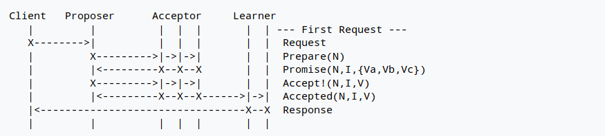
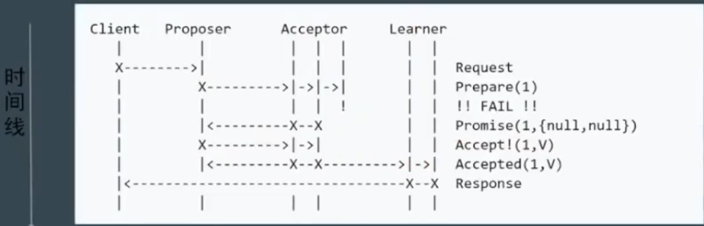
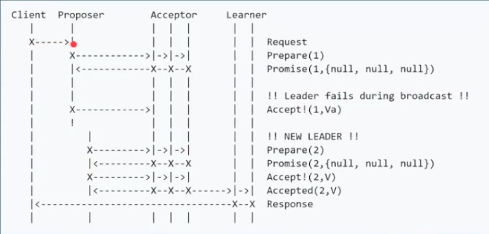
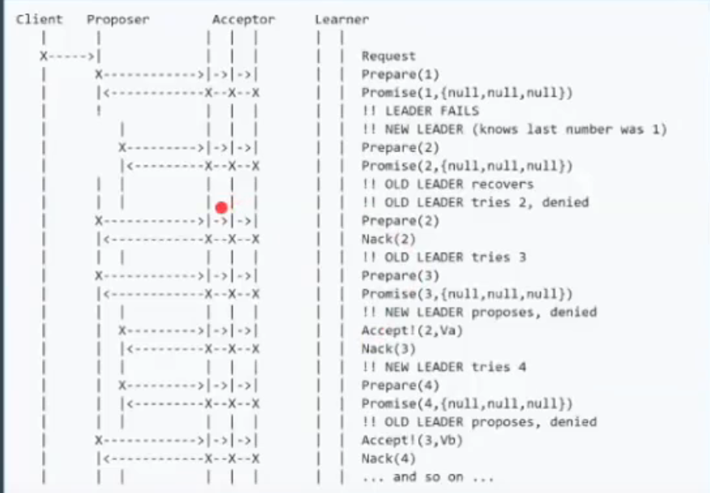
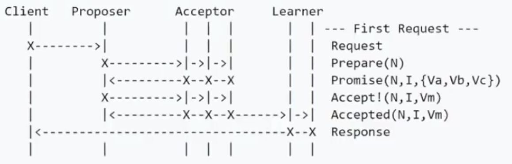
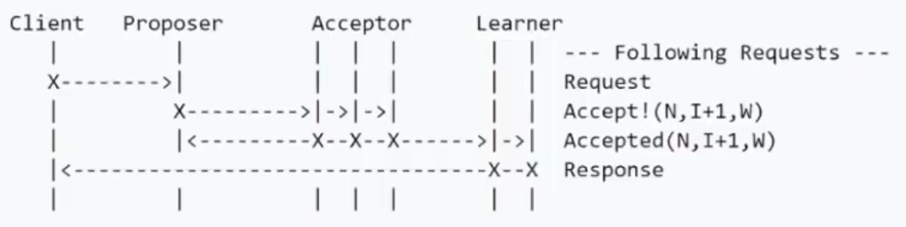
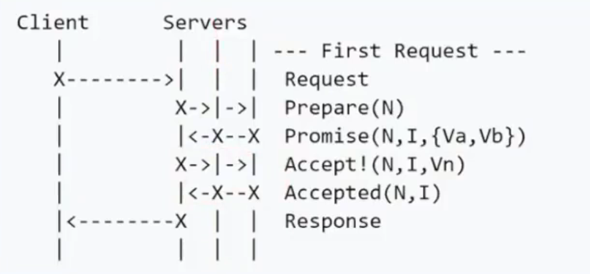

## Paxos 

为描述帕克斯(Paxos)算法，兰波特(Lamport)虚拟了一个叫做帕克斯(Paxos)的希腊城邦,这个岛按照议会民主制的政治模式制订法律，但是没有人愿意将自己的全部时间和精力放在这种事。

所以无论是议员，议长或者传递纸条的服务员都不能承诺别人需要时一定会出现,也无法承诺批准决议或者传递消息的时间。

### Paxos的版本

- Basic Paxos

- Multi Paxos
- Fast Paxos

### 角色划分

- Client:系统外部角色,请求发起者。像民众。

- Proposer:接受Client请求,向集群提出提议(propose)。并在冲突发生时,起到冲突调节的作用。像议员，替民众提出议案。

  Proposer可以有多个

- Accepter(Voter):提议投票和接收者,只有在形成法定人数(Quorum,一般即为majority多数派)时,提议才会最终被接受。像国会。

- Learner:提议接受者,backup,备份,对集群一致性没什么影响。像记录员。类似于ZK中的Observer

### Basic Paxos

#### 流程

- 阶段1:  Prepare

  client发起请求,  其中一个Proposer会接受到请求, 并向集群提出一个提案

  这个提案的编号为N, N必须大于此proposer之前提出的提案编号

  proposer将提案发送给所有的acceptor, 请求他们接受提案

- 阶段2: Promise

  acceptor接受到proposer发送来的提案

  如果提案的编号N大于此acceptor之前接受的任何提案编号, 那么同意提案

  否则拒绝

  之后返回结果给proposer

- 阶段3: Accept

  proposer接受到大多数同意结果, 那么就会发出accept请求, 此请求中包含提案的编号N, 以及提案的内容

- 阶段4: Accepted

  如果此acceptor在此期间没有收到任务编号大于N的提案, 那么接受此提案

  否则忽略

成功的流程

部分节点失败, 但是达到了Quoroms

Proposer失败的流程

活锁问题:

即proposer1提出了提案1, 大多数接受了, 但是在accept这个阶段, proposer2提出了提案2, 大多数也接受了

此时proposer1就没有办法执行accept阶段了, 此时proposer1为了达成提案, 就会把提案换个编号3, 重新发送

这样就会导出proposer2没有办法执行accept阶段了

之后两个proposer一直提出新的提案, 但是都没有办法达成一致

这个技术活锁问题

这个问题在工业上很好解决, 只要提案没办法执行accept就sleep一段时间, 这段时间内其他人的提案就有可能通过

#### 缺点

- 难实现
- 效率低, 需要两轮RPC, 即prepare和accept
- 活锁

### Multi Paxos

项目案例可以查看: 

1. 五八同城

   https://github.com/wuba/WPaxos

2. 微信生产端:

   https://github.com/Tencent/phxpaxos

   

Multi Paxos中提出了Leader的概念, 即唯一的proposer, 所有的请求都需要经过该Leader

在Multi Paxos中, 首先会进行一轮Basic Paxos的流程, 这个流程是为了竞选Leader

在之后的请求中, 所有的提案都是Leader发起的, Acceptor只需要接受即可

此时的请求只需要1轮RPC即可完成

进一步简化, 减少角色之后的流程图

## Raft

Raft可以理解为一个简化版本的Multi Paxos

相较于Multi Paxos, 他将状态机日志复制来达到一致性的问题, 分解为了三个问题

1. Leader Election:  选举
2. Log Replication:  日志复制
3. Safety

并且重新定义了角色

1. Leader
2. Follower
3. Candidate(候选者)

原理动画解释:https://thesecretlivesofdata.com/raft/

场景测试: https://raft.github.io/

代码实现:https://github.com/wenweihu86/raft-java

### 选举机制

在raft中 有两个控制选举的设置, 一个是election timeout

在集群启动的时候, 或者leader宕机之后, 此时所有的节点都是follower

如果某个follower, 当他接受不到leader的心跳后(即等待leader的心跳时间超过election timeout), 会变成候选者

这个超时时间是150ms~300ms的一个随机值(每个follower在自己内部生成这个随机值, 所以每个follower的超时时间是不一样的)

当某个follower的election timout最先超时的时候, 他会变成candidate, 然后将自己的election term + 1(election term表示第几轮投票, term+1表示开始新一轮的投票),    然后投票给自己

接下来他会向其他节点(包括leader)发送 request vote message(携带有candidate的election term), 其他follower接收到这个投票请求之后

会判断candidate的election term是否比自己的大, 如果比自己的大, 说明当前这个follower在这一轮投票过程中还没有投过票, 此时他会判断candidate中的数据有没有比自己的新, 如果更新或者一样, 那么就给candidate投票, 如果比自己的数据旧, 那么就给candidate投拒绝票, 并将自己的election term + 1

然后会重置自己内部的election timeout(防止接受到投票请求之后, 这个节点又变成candidate,又发起投票)

如果candidate的election term比follower的term小, 或者等于, 说明follower在这一轮投票中已经投过票了, 那么就会返回之前的投票结果

一旦candidate获得了大多数投票, 那么他就会变成一个leader

此时他会开始向其他的followers发送 append entries message(携带在心跳中), 

如果candidata没有获得大多数的投票, 说明已经有人提前发起了竞选, 那么他就会等待election timeout, 让其他人能够竞选成功

### 同步机制

如果产生了领导者之后, 所有的更改都要经过leader, 每一个更改都将作为entry保存在leader的日志中

此时entry还是未提交的状态, 所以他不会改变leader节点的值

此时leader会将entry携带在下一个心跳包中发送到follower中, 然后等待大多数的follower已经将entry写入到他们的日志中并响应, 此时这些entry在leader中也是uncommited的状态

当leader接受到了一半的follower(一般的follower,和leader自己的响应, 就超过半数了)的响应后, 那么leader就会执行entry, 然后修改状态机中的值, 此时entry是commited的状态, 然后响应客户端

在下一个心跳包的时候, leader会将提交entry的信息携带上, 发送给follower, 此时所有的follower接受到心跳后, 都会将执行entry, 然后修改状态机的值

此时所有的节点状态都一致了

#### 极端情况

在raft协议下, 消息的写入不止有成功和失败, 还有一种timeout/unknown的状态

即假设有abcde五个节点, a为leader

此时cde节点宕机了,   只有a和b节点同步了这条log,    此时这条log的状态不是成功, 也不是失败

如果后续cde中有一个节点回复过来,  那么这条log就可以成功写入

如果后续ab也宕机了, 但是cde回复了,   那么这条log就会被覆盖, 此时的写入状态就是失败

所以才会有timeout或者unknown这种状态

协议的制定者需要自己来处理这种状态

### 五条公理

Raft算法的五条公理, 即实现raft算法要保证的规则

election safety: 在同一个时刻, 最多只能有一个leader(脑裂之后会回复)

leader append-only: leader一定不会修改或者覆盖修改自己的log, 只会在后面追加

log matching: 即如果两个entry包含相同的term(任期)和index(索引), 那么他们的内容是相同的

leader completeness: 即如果一个entry在某个一个任期内, 被leader提交到了状态机内, 那么在后续任期的leader当中, 这个entry也是提交的状态

state machine safety: 如果leader往状态机内提交了一个entry, 那么其他follower不会提交向他们的状态机内提交一个term和index相同, 但是内容不同的entry

## Zab

Zab是Zookeeper的共识算法, 也是基于Multi Paxos的.  他的流程基本与raft相同

只是在名词上有些不同, 比如Zab中将某一个leader的任期称为epoch, 而在raft中则被称为term

同时在实现上也有些不同, 比如raft保证日志的连续性,  心跳方向为leader到Follower,  zab则相反