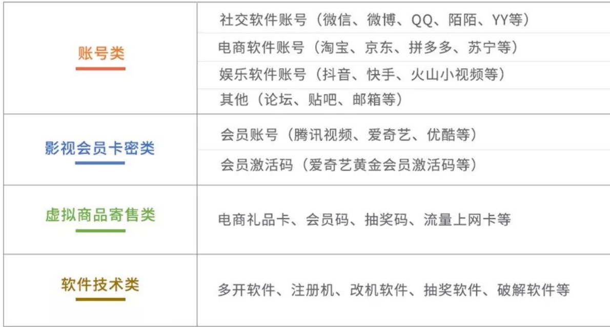

### 直播推流

https://www.bilibili.com/video/BV1gfpte2EDA/?spm_id_from=333.1007.tianma.3-3-9.click&vd_source=f79519d2285c777c4e2b2513f5ef101a

https://www.bilibili.com/video/BV1Xc411T79K/?spm_id_from=333.788&vd_source=f79519d2285c777c4e2b2513f5ef101a

https://www.bilibili.com/list/watchlater?bvid=BV1GXHhesEUE&oid=113077160837635

基本原理就是:

主播通过obs录制视频, 然后obs通过rtmp协议将视频推流到一个指定的地址, 可以是nginx

nginx会将所有的流都保存在内存中, 循环覆盖

然后有一个视频处理服务器, 从nginx中获取视频流, 然后转换为不同分辨率的一个一个的小视频, 推送到cdn中

网页通过hls (http-live-streaming)协议从指定地址的cdn连续的获得视频, 进行播放

关键字:  flv, hls, rtmp协议, ffmpeg

### 发卡平台搭建

https://www.bilibili.com/video/BV1Q9HheXEiN/?spm_id_from=333.1007.tianma.3-4-10.click&vd_source=f79519d2285c777c4e2b2513f5ef101a

### 黑客松

https://www.bilibili.com/video/BV1dFt3eSEYA/?spm_id_from=333.1007.tianma.2-1-4.click&vd_source=f79519d2285c777c4e2b2513f5ef101a

HackQuest平台