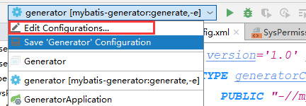
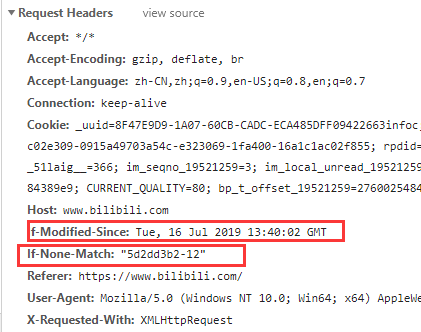
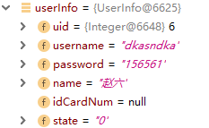
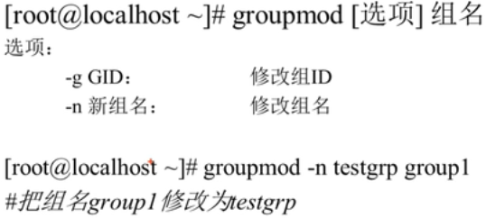
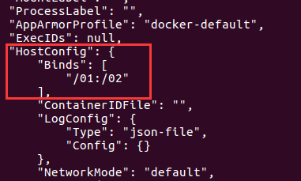
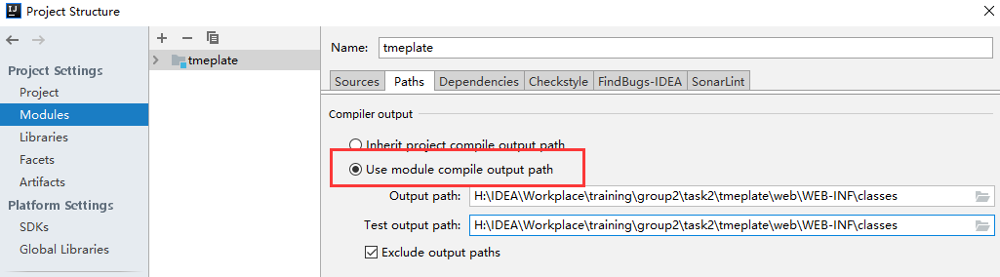
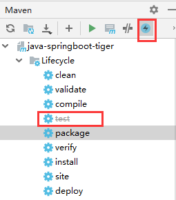

## JSON在java和js中的 转换

#### json转js对象

jquery中的$.parseJSON( jsonstr )

浏览器自带的JSON.parse( jsonstr )

使用json官方的json.js中的parse()

####  js对象转json

JSON.stringify( jsObj )

obj.toJSONString()

#### java对象转json

```xml
<dependency>
  <groupId>com.google.code.gson</groupId>
  <artifactId>gson</artifactId>
  <version>2.8.5</version>
</dependency>
```

new Gson().toJson( obj)

#### json 转 java对象

new Gson().fromJson(jsonStr, Test.class)

第二个参数是json要转换的java对线的class

## 数组和容器的对比

数组的优势: 是一种简单的线性序列, 可以快速访问数组元素, 效率高. 从效率和类型检查的角度讲, 数组是最好的

数组的缺点: 不灵活, 容量需要事先定义好, 不能随需求的变化而扩容


## Spring Aop 切入点表达式

#### 通配符:

1. *:

   - 匹配一个或者多个字符

   - 匹配一级路径

   - 匹配任意访问权限

   - 匹配任意返回类型

   - 匹配任意一个参数

     ```java
   //匹配任意访问权限, 任意返回值, com/一级目录/User类中任意方法名, 第一个参数为int类型, 第二个参数任意类型的方法
     @Pointcut("execution(* * com.*.User.*(int, *))")
     ```
   
   
   
2. ..

   - 匹配任意个任意类型的参数

   - 匹配任意多层路径

     ```java
//匹配任意访问权限, 任意返回类型, 任意路径下的User的任意参数的get()方法
     @Pointcut("execution(* * ..User.get(..)")
    
     //匹配任意访问权限, 任意返回类型, com.service当前包或子包下任意类的get方法
    @Pointcut("execution(* * com.service..*.get(..))")
     ```
   
3. +

   - 只能放在类后面, 表示本类及子类

#### 切面表达式

1.  **execution(范围权限修饰符  返回值类型  全类名(参数表) 异常类型)**

   **其中 范围权限修饰符, 包名, 异常类型 可以省略**

2. **within(全路径类名, 可以使用通配符), 表示匹配当前表达式的所有类都会被当前方法拦截**

   within表达式只能指定到类级别

   ```java
   //within表达式路径和类名都可以使用通配符进行匹配，比如如下表达式将匹配com.spring.service包下的所有类，不包括子包中的类：
   @Pointcut("within(com.spring.service.*)")
          
   //如下表达式表示匹配com.spring.service包及子包下的所有类：
   @Pointcut("within(com.spring.service..*)")
   ```

3. **args(参数类型及数量)**

    **args表达式的作用是匹配指定参数类型和指定参数数量的方法，无论其类路径或者是方法名是什么。这里需要注意的是，args指定的参数必须是全路径的**

   可以使用..通配符, 但是不能使用* (没有验证)

   ```java
   // 匹配入参是String类型的方法, 
   @Pointcut("args(java.lang.String)")
   ```

4. **@Within(注解全限定名)表示匹配带有指定注解的类**

   ```java
   //定义注解@FruitAspect
   //调用Apple的方法时将会进入切面
   @FruitAspect
   public class Apple{
   }
   ```

5. **@annotation(注解全限定名)表示匹配带有指定注解的方法**

   ```java
   
   //定义注解@FruitAspect
   //调用Apple的方法时将会进入切面
   @Pointcut("@annotation(com.tiger.FruitAspect)")
   public class Apple{
       @FruitAspect
       public void eat(){
           sout("eat");
       }
   }
   ```

6. **@args(注解全限定名)表示匹配将注解标注的类作为方法参数的方法**

   ```java
   @Pointcut("@args(com.tiger.Apple)")
   
   bucket.eat(new Apple())
   ```

7. this和target 下三个查看https://www.cnblogs.com/zhangxufeng/p/9160869.html

8. @DeclareParents

9. perthis和pertarget

#### 多条件匹配

在多个表达式之间使用 ||,or表示 或，使用 &&,and表示 与，！表示 非.

#### 通知执行顺序


#### 例子

```java
@Aspect
@Component
public class TestAspect{
    @Pointcut("@execution(* * com.tiger.manager.controller..*.*(..)")
    public void pointcut(){}
    
    @Before("pointcut()")
    public void beforeMethod(JoinPoint joinPoint){
        // 假如joinPoint是public String com.tiger.manager.controller.RestController.get(1, 2)
        System.out.println("目标方法名为:" + joinPoint.getSignature().getName()); //get
        System.out.println("目标方法所属类的简单类名:" +        joinPoint.getSignature().getDeclaringType().getSimpleName()); //RestController
        System.out.println("目标方法所属类的类名:" + joinPoint.getSignature().getDeclaringTypeName()); //com.tiger.manager.RestController
        System.out.println("目标方法声明类型:" + Modifier.toString(joinPoint.getSignature().getModifiers())); //public
        //获取传入目标方法的参数
        Object[] args = joinPoint.getArgs();
        for (int i = 0; i < args.length; i++) {
            System.out.println("第" + (i+1) + "个参数为:" + args[i]); //1,2
        }
        System.out.println("被代理的对象:" + joinPoint.getTarget());
        System.out.println("代理对象自己:" + joinPoint.getThis());
    }
    @Around("pointcut()")
    public void around(ProceedingJoinPoint pjd){
         Object result = null;

        try {
            //前置通知
            System.out.println("目标方法执行前...");
            //执行目标方法
            //result = pjd.proeed();
            //用新的参数值执行目标方法
            result = pjd.proceed(new Object[]{"newSpring","newAop"});
            //返回通知
            System.out.println("目标方法返回结果后...");
        } catch (Throwable e) {
            //异常通知
            System.out.println("执行目标方法异常后...");
            throw new RuntimeException(e);
        }
        //后置通知
        System.out.println("目标方法执行后...");

        return result;
    }
    
    @AfterReturning(value = "within(com.gorge4j.user.controller.*)", returning = "retVal")
    public void after(JoinPoint joinPoint, Object retVal) {
        // 获取封装了署名信息的对象,在该对象中可以获取到目标方法名,所属类的Class等信息
        MethodSignature methodSignature = (MethodSignature) joinPoint.getSignature();
        // 获取方法对象
        Method method = methodSignature.getMethod();
        // 将返回对象转换成 Json 字符串，项目的返回如果不是 Json 的数据格式，那么返回参数就只有 URL
        String strRes = JSONUtils.toJSONString(res);
        log.info("{}.{} - 返回结果: {}", method.getDeclaringClass().getName(), method.getName(), strRes);
    }
}
```

ProceedingJoinPoint是JoinPoint的子类, 只有环绕通知的方法可以传入该类型参数, 其他只能传入JointPoint类型

#### after和afterReturning的区别

```java
try{
    try{
        //@Before
        method.invoke(..);
    }finally{
        //@After
    }
    //@AfterReturning
}catch(){
    //@AfterThrowing
}
```


## IDEA SpringBoot Mybatis逆向工程

1. 添加依赖

   ```xml
           <!-- mybatis springboot starter -->
           <dependency>
               <groupId>org.mybatis.spring.boot</groupId>
               <artifactId>mybatis-spring-boot-starter</artifactId>
               <version>1.3.2</version>
           </dependency>
   
   		<!-- 逆向工程jar包 -->
           <dependency>
               <groupId>org.mybatis.generator</groupId>
               <artifactId>mybatis-generator-core</artifactId>
               <version>1.3.6</version>
           </dependency>
   ```

2. 添加插件

   ````xml
       <build>
           <plugins>
               <plugin>
                   <groupId>org.springframework.boot</groupId>
                   <artifactId>spring-boot-maven-plugin</artifactId>
               </plugin>
               <!-- mybatis-generator自动生成代码插件 -->
               <plugin>
                   <groupId>org.mybatis.generator</groupId>
                   <artifactId>mybatis-generator-maven-plugin</artifactId>
                   <version>1.3.6</version>
                   <dependencies>
                       <dependency>
                           <groupId>mysql</groupId>
                           <artifactId>mysql-connector-java</artifactId>
                           <!--<scope>runtime</scope>-->
                           <version>8.0.13</version>
                       </dependency>
                       
                       <dependency>
                           <groupId>tk.mybatis</groupId>
                           <artifactId>mapper</artifactId>
                           <version>LATEST</version>
                       </dependency>
                   </dependencies>
               </plugin>
           </plugins>
       </build>
   ````

3. 在src/main/resources下添加generatorConfig.xml文件, 内容如下:

   ````xml
   <?xml version='1.0' encoding='UTF-8'?>
   <!DOCTYPE generatorConfiguration
           PUBLIC "-//mybatis.org//DTD MyBatis Generator Configuration 1.0//EN"
           "http://mybatis.org/dtd/mybatis-generator-config_1_0.dtd">
   
   <generatorConfiguration>
       <!-- *************************************** -->
       <!-- 导入属性配置, 之后的driverClass, connectionURL, userId, password, targetPackage, targetProject可以使用列如driverClass="${driver}"来代替 -->
       <!-- <properties resource="generator.properties"></properties> -->
       <!-- ************************************** -->
       
       <context id="mybatisGenerator" targetRuntime="MyBatis3">
           
           <!-- 使用通用mapper插件
            https://github.com/abel533/Mapper/wiki/4.1.mappergenerator  -->
           <plugin type="tk.mybatis.mapper.generator.MapperPlugin">
               <!-- 生成的mapper类会自动继承tk.mybatis.mapper.common.Mapper-->
               <property name="mappers" value="tk.mybatis.mapper.common.Mapper"/>
               <!-- caseSensitive 是否区分大小写，默认值 false。如果数据库区分大小写，
               这里就需要配置为 true，这样当表名为 USER 时，会生成 @Table(name = "USER") 注解
               ，否则使用小写 user 时会找不到表。 -->
               <property name="caseSensitive" value="false"/>
               <!-- forceAnnotation 是否强制生成注解，默认 false，如果设置为 true，
               不管数据库名和字段名是否一致，都会生成注解（包含 @Table 和 @Column）-->
               <property name="forceAnnotation" value="true"/>
               <!-- beginningDelimiter 和 endingDelimiter 开始和结束分隔符，
               对于有关键字的情况下适用 -->
               <property name="beginningDelimiter" value="`"/>
               <property name="endingDelimiter" value="`"/>
               <!-- 在生成的pojo类上加上@Data的lombok注解
                Getter,Setter,ToString,Accessors也是可选的 -->
               <property name="lombok" value="Data"/>
           </plugin>
           
           
           <commentGenerator>
               <!-- 是否去除自动生成的注释 true：是 ： false:否 -->
               <property name="suppressAllComments" value="true" />
           </commentGenerator>
           <!--数据库连接的信息：驱动类、连接地址、用户名、密码 -->
           <jdbcConnection driverClass="com.mysql.cj.jdbc.Driver"
                           connectionURL="jdbc:mysql://localhost:3306/shiro_csdn_demo?serverTimezone=UTC&amp;useUnicode=true&amp;characterEncoding=utf-8"
                           userId="root"
                           password="871403165">
           </jdbcConnection>
   
           <!-- 默认false，把JDBC DECIMAL 和 NUMERIC 类型解析为 Integer，为 true时把JDBC DECIMAL 和
               NUMERIC 类型解析为java.math.BigDecimal -->
           <javaTypeResolver>
               <property name="forceBigDecimals" value="false" />
           </javaTypeResolver>
   
           <!-- targetProject:生成PO类的位置 -->
           <javaModelGenerator targetPackage="com.sqt.generator.bean"
                               targetProject="src/main/java">
               <!-- enableSubPackages:是否让schema作为包的后缀 -->
               <property name="enableSubPackages" value="false" />
               <!-- 从数据库返回的值被清理前后的空格 -->
               <property name="trimStrings" value="true" />
           </javaModelGenerator>
           <!-- targetProject:mapper映射文件生成的位置 -->
           <sqlMapGenerator targetPackage="mapper"
                            targetProject="src/main/resources">
               <!-- enableSubPackages:是否让schema作为包的后缀 -->
               <property name="enableSubPackages" value="false" />
           </sqlMapGenerator>
           <!-- targetPackage：mapper接口生成的位置 -->
           <javaClientGenerator type="XMLMAPPER"
                                targetPackage="com.sqt.generator.mapper"
                                targetProject="src/main/java">
               <!-- enableSubPackages:是否让schema作为包的后缀 -->
               <property name="enableSubPackages" value="false" />
           </javaClientGenerator>
           <!-- 指定数据库表 -->
           <table tableName="user_info" domainObjectName="UserInfo" enableCountByExample="false"
                  enableUpdateByExample="false" enableDeleteByExample="false" enableSelectByExample="false"
                  selectByExampleQueryId="false" />
           <table tableName="user_info"></table>
           <table tableName="sys_role"></table>
           <table tableName="sys_role_permission"></table>
           <table tableName="sys_user_role"></table>
   
           <!-- 有些表的字段需要指定java类型
            <table schema="" tableName="">
               <columnOverride column="" javaType="" />
           </table> -->
       </context>
   </generatorConfiguration>
   ````

   注意字节在xml中写&,会因为未转义而报错要将&写成& amp;

   ````xml
    connectionURL="jdbc:mysql://localhost:3306/shiro_csdn_demo?serverTimezone=UTC&amp;useUnicode=true&amp;characterEncoding=utf-8"
   ````

4. 使用插件生成代码




5. 如果使用的是java类而不是plugin来生成代码需要添加依赖, 但是可以将build中的plugin删除掉

   ```xml
   <dependency>
         <groupId>mysql</groupId>
       <artifactId>mysql-connector-java</artifactId>
          <version>8.0.16</version>
   </dependency>
   ```

   在java包中添加java代码, 执行该代码可以生成, 达到plugin同样的效果

   ```java
   public class Generator {
       public void generator() throws Exception{
           List<String> warnings = new ArrayList<String>();
           boolean overwrite = true;
           /**指向逆向工程配置文件*/
           File configFile = new File("src/main/resources/generatorConfig.xml");
           ConfigurationParser parser = new ConfigurationParser(warnings);
           Configuration config = parser.parseConfiguration(configFile);
           DefaultShellCallback callback = new DefaultShellCallback(overwrite);
           MyBatisGenerator myBatisGenerator = new MyBatisGenerator(config,
                   callback, warnings);
           myBatisGenerator.generate(null);
       }
       public static void main(String[] args) throws Exception {
           try {
               Generator generatorSqlmap = new Generator();
               generatorSqlmap.generator();
           } catch (Exception e) {
               e.printStackTrace();
           }
       }
   }
   ```

   


## SpringBoot自定义starter

按照一般的模式, 我们创建一个启动器, 但是该启动器只用来做依赖导入

然后创建另外一个自动配置模块, 用来定义自动配置

启动器依赖自动配置, 别人只需要引入启动器


我们可以看到, 在mybatis-spring-boot-starter中没有任何java代码,只是在pom文件中定义了依赖, 而自动配置的代码都在mybatis-spring-boot-autoconfiguration中

### 1. 创建自动配置模块

我们来创建一个springboot项目, pom.xml如下

```xml
<?xml version="1.0" encoding="UTF-8"?>
<project xmlns="http://maven.apache.org/POM/4.0.0" xmlns:xsi="http://www.w3.org/2001/XMLSchema-instance"
         xsi:schemaLocation="http://maven.apache.org/POM/4.0.0 http://maven.apache.org/xsd/maven-4.0.0.xsd">
    <modelVersion>4.0.0</modelVersion>
    <parent>
        <groupId>org.springframework.boot</groupId>
        <artifactId>spring-boot-starter-parent</artifactId>
        <version>2.1.6.RELEASE</version>
        <relativePath/> <!-- lookup parent from repository -->
    </parent>

    <groupId>com.sqt.starter</groupId>
    <artifactId>sqt-spring-boot-autoconfigurer</artifactId>
    <version>0.0.1-SNAPSHOT</version>

    <properties>
        <java.version>1.8</java.version>
    </properties>

    <dependencies>
        <dependency>
            <groupId>org.springframework.boot</groupId>
            <artifactId>spring-boot-starter</artifactId>
        </dependency>
    </dependencies>
</project>
```

我们只需要在其中引入spring-boot-starter依赖, 其他可以删除

在其中创建HelloProperties.java

````java
package com.sqt.starter;

import org.springframework.boot.context.properties.ConfigurationProperties;

@ConfigurationProperties("sqt.hello")
public class HelloProperties {

    private String suffix;

    private String prefix;

    public String getSuffix() {
        return suffix;
    }

    public void setSuffix(String suffix) {
        this.suffix = suffix;
    }

    public String getPrefix() {
        return prefix;
    }

    public void setPrefix(String prefix) {
        this.prefix = prefix;
    }
}
````

创建HelloService.java

````java
public class HelloService {

    HelloProperties helloProperties;

    public HelloProperties getHelloProperties() {
        return helloProperties;
    }

    public void setHelloProperties(HelloProperties helloProperties) {
        this.helloProperties = helloProperties;
    }

    public String sayHello(String name){
        return helloProperties.getPrefix() + "-" + name + "-" + helloProperties.getSuffix();
    }
}
````

创建自动配置类

```java
@Configuration
@ConditionalOnWebApplication  //只在web环境中起作用
@EnableConfigurationProperties({HelloProperties.class})
public class HelloServiceAutoConfiguraion {

    @Autowired
    HelloProperties helloProperties;

    @Bean
    public HelloService helloService(){
        HelloService helloService = new HelloService();
        helloService.setHelloProperties(helloProperties);
        return helloService;

    }
}
```

在resources目录下创建META-INF/spring.factories

```properties
#定义自动配置类
org.springframework.boot.autoconfigure.EnableAutoConfiguration=\
  com.sqt.starter.HelloServiceAutoConfiguraion
```

目录如下:


其他没用的东西可以删掉


### 二、创建starter工程

我们创建一个starter工程, 因为这个工程只用来做依赖管理和导入, 所以我们可以创建一个空的maven工程


在pom.xml文件中引入我们的自动配置工程

```xml
<?xml version="1.0" encoding="UTF-8"?>
<project xmlns="http://maven.apache.org/POM/4.0.0"
         xmlns:xsi="http://www.w3.org/2001/XMLSchema-instance"
         xsi:schemaLocation="http://maven.apache.org/POM/4.0.0 http://maven.apache.org/xsd/maven-4.0.0.xsd">
    <modelVersion>4.0.0</modelVersion>

    <groupId>com.sqt.starter</groupId>
    <artifactId>sqt-spring-boot-starter</artifactId>
    <version>1.0-SNAPSHOT</version>


    <dependencies>
        <dependency>
            <groupId>com.sqt.starter</groupId>
            <artifactId>sqt-spring-boot-autoconfigurer</artifactId>
            <version>0.0.1-SNAPSHOT</version>
        </dependency>
    </dependencies>
</project>
```

然后分别将我们的autoConfiguration模块和starter模块install到本地仓库


### 三、编写测试

我们创建一个springboot项目, 在其中引入我们的starter项目

```xml
<dependency>
        <groupId>com.sqt.starter</groupId>
        <artifactId>sqt-spring-boot-starter</artifactId>
        <version>1.0-SNAPSHOT</version>
</dependency>
```

在application.properties配置文件中编写配置

这个配置是在我们autoConfiguration工程中定义的

```properties
sqt.hello.suffix = hello world
sqt.hello.prefix = zhangsan
```

我们来创建一个测试类

```java
@Controller
@ResponseBody
public class LoginController {

    @Autowired
    HelloService helloService;

    @GetMapping("/login")
    public String login(){
        String s = helloService.sayHello("张三");
        return s;
    }
}
```

启动项目


可以看到, 我们在autoConfiguration工程中配置的HelloService被@Autowired了进来, 而不需要我们自动配置.


## @RequestParam 和 @RequestBody的区别

1. 在get请求中, 其Content-Type默认为application/x-www-form-urlencoded, 并且参数都是放在请求头中的, get请求一般没有请求体

   所以在get请求中, 我们可以使用RequestParam来接受用户所提交的在url中的参数,  也可以接受对象没血, 但是不能使用RequestBody来接受, 因为没有请求体


2. 在post请求中, 其Content-Type默认为Content-Type: application/x-www-form-urlencoded, 并且post


## 微服务技术栈

**天上飞的理念, 地上跑的实现**


### SpringClund 和 SpringBoot的关系

springboot专注于快速方便的开发单个个体微服务

springcloud关注全局的微服务协调整理治理框架, 他将springboot开发的一个个单体微服务整合并管理起来,   为各个微服务之间提供配置管理、服务发现、路由、微代理、事件总线、全局锁、决策竞选、分布式会话等集成服务

springboot可以离开springcloud独立使用开发项目, **但springcloud离不开springboot, 属于依赖关系**

**springboot专注于快速、方便的开发单个微服务个体, springcloud关注全局的服务治理框架**


### 成熟的互联网框架


## Eureka 和 Zookeeper的区别

C: Consistensy(强一致性)

A: Availablility(高可用性)

P: Partition tolerance (分区容错性)


任何的分布式系统按照现在的要求最多只能同时较好满足两个

CA: 单点集群, 满足一致性, 可用性的系统, 通常在可扩展 性上不太强大

CP: 满足一致性, 分区容错的系统, 通常性能不是特别的高

AP: 满足高可用, 分区容错性的系统, 通常可能对一致性要求低一些


而对于当前的网络硬件肯定会出现延迟丢包等问题, 所以

**分区容错性是我们必须实现的**

所以我们只能在一致性和可用性之间进行权衡, 没有NoSQL系统能同时保证这三点

因此

**Zookeeper保证的是CP**

**Eureka保证的是AP**


### Zookeeper保证CP

当向注册中心查询服务列表时, 我们可以容忍注册中心返回的是几分钟前的注册消息, 但不能接受服务直接down掉. 也就是说, 服务注册功能对可用性的要求要高于一致性. 但是Zookeeper会出现这样一种情况, 当master节点因为网络故障与其他节点失去联系时, 剩余节点会重新进行leader选举. 问题在于, 选举leader的时间太长, 30~120秒, 且选举期间整个zk集群都是不可用的, 这样就导致在选举期间注册服务瘫痪. 在云部署的环境下, 因网络问题使得zk集群失去master节点是较大概率会发生的事情, 虽然服务最终能够恢复, 但是漫长的选举时间导致的注册长期不可用是不能容忍的.


###  Eureka保证AP

Eureka看明白这一点, 因此在设计时就优先保证可用性. **Eureka各个节点都是平等的**, 几个节点挂掉不会影响正常节点的工作, 剩余的节点依然可以提供注册和查询服务. 而Eureka的客户端在向某个Eureka注册时如果发现连接失败, 则会自动切换至其他节点, 只要有一台Eureka还在, 就能保证注册服务可用(保证可用性), 只不过查到的信息可能不是最新的(不保证强一致性). 除此之外, Eureka还有一种自我保护机制, 如果在15分钟内超过85%的节点都没有正常的心跳, 那么Eureka就认为客户端与注册中心之间出现了网络故障, 此时会出现以下几种情况:

1. Eureka不在从注册列表中移除因为长时间没有收到心跳而应该过期的服务
2. Eureka仍然能够接受新服务的注册和查询请求, 但是不会同步到其他节点上(即保证当前节点依然可用)
3. 当网络稳定时, 当前 实例新的注册信息会被同步到其他节点中

**因此, Eureka可以很好的应对因网络故障导致部分节点失去联系的情况, 而不会出现像zookeeper那样使整个注册服务瘫痪**


## Ribbon 的负载均衡算法


### 切换负载均衡算法

```java
@Configuration
public class ConfigBean {

    //Spring Clound Ribbon是基于Netflix Ribbon实现的一套 **客户端负载均衡**  工具
    @Bean
    @LoadBalanced
    public RestTemplate restTemplate(){
        return new RestTemplate();
    }

    //没有显示定义负载均衡算法, 使用默认的轮训
    //这里定义使用随机算法代替轮训算法, 这里的随机算法是官方自带的几种算法之一
    @Bean
    public IRule myRule(){
        return new RandomRule();
    }

}

```


## Hystrix熔断器


#### 分布式系统面临的问题
复杂分布式体系结构中的应用程序有数十个依赖关系，每个依赖关系在某些时候将不可避免地失败。


#### 服务雪崩
多个微服务之间调用的时候，假设微服务A调用微服务B和微服务C，微服务B和微服务C又调用其它的微服务，这就是所谓的“扇出”。如果扇出的链路上某个微服务的调用响应时间过长或者不可用，对微服务A的调用就会占用越来越多的系统资源，进而引起系统崩溃，所谓的“雪崩效应”.

对于高流量的应用来说，单一的后端依赖可能会导致所有服务器上的所有资源都在几秒钟内饱和。比失败更糟糕的是，这些应用程序还可能导致服务之间的延迟增加，备份队列，线程和其他系统资源紧张，导致整个系统发生更多的级联故障。这些都表示需要对故障和延迟进行隔离和管理，以便单个依赖关系的失败，不能取消整个应用程序或系统。


#### Hystrix概述

Hystrix是一个用于处理分布式系统的**延迟**和**容错**的开源库，在分布式系统里，许多依赖不可避免的会调用失败，比如超时、异常等，Hystrix能够保证在一个依赖出问题的情况下，**不会导致整体服务失败，避免级联故障，以提高分布式系统的弹性。**

“断路器”本身是一种开关装置，当某个服务单元发生故障之后，通过断路器的故障监控（类似熔断保险丝），**向调用方返回一个符合预期的、可处理的备选响应（FallBack），而不是长时间的等待或者抛出调用方无法处理的异常**，这样就保证了服务调用方的线程不会被长时间、不必要地占用，从而避免了故障在分布式系统中的蔓延，乃至雪崩。


#### 服务熔断

熔断机制是应对雪崩效应的一种微服务链路保护机制。
当扇出链路的某个微服务不可用或者响应时间太长时，会进行服务的降级，进而熔断该节点微服务的调用，快速返回"错误"的响应信息。当检测到该节点微服务调用响应正常后恢复调用链路。在SpringCloud框架里熔断机制通过Hystrix实现。Hystrix会监控微服务间调用的状况，当失败的调用到一定阈值，缺省是5秒内20次调用失败就会启动熔断机制。熔断机制的注解是@HystrixCommand。


## SpringMVC 跨重定向请求传递数据

我们知道, 重定向其实是两个请求, 而在第一次请求中的数据在第二次请求中出现的


**那么如果我们需要重定向的功能而且希望第一次请求的数据能复制到下一次的请求中, 该如何实现呢?**


1. 通过在url中拼接参数

   ```java
   return "redirect:/index?name=zhangsan&age=18"
   ```

   ````java
   //完整代码
   public class HelloController {
   
       @GetMapping("hello")
       public String hello(){
           return "redirect:index?name=zhangsan&&age=18";
       }
   
       @GetMapping("index")
       public String index(@RequestParam("name") String name, String age, Model model){
           System.out.println(name + "-" + "age");
           return "index";
       }
   }
   ````

   

   这样, 在重定向的下一次请求中我们就可以获取到name和age了


2. 通过RedirectAttributes

   RedirectAttributes是Spring mvc 3.1版本之后出来的一个功能，专门用于重定向之后还能带参数跳转的, 他有两种带参的方式:

   1. 第一种： **attr.addAttribute("name", "zhangshan");**  

      这种方式就**相当于重定向**之后，在url后面拼接参数，这样在重定向之后的页面或者控制器再去获取url后面的参数就可以了，但这个方式因为是在url后面添加参数的方式，所以**暴露了参数，有风险**

      

      ````java
          @GetMapping("hello")
          public String hello(RedirectAttributes redirectAttributes){
              redirectAttributes.addAttribute("name", "zhangshang");
              redirectAttributes.addAttribute("age", 18);
              return "redirect:index";
          }
      ````

   2. 第二种: **attr.addFlashAttribute("name", "zhangsna")**

      使用这种方式不会在URL后面追加参数

      ```java
          @GetMapping("hello")
          public String hello(RedirectAttributes redirectAttributes){
              redirectAttributes.addFlashAttribute("name", "zhangsan");
              redirectAttributes.addFlashAttribute("age", "18");
              return "redirect:index";
          }
      	//使用@ModelAttribute来获取参数
          @GetMapping("index")
          public String index(@ModelAttribute String name, @ModelAttribute String age){
              System.out.println(name + "-" + age);
              return "index";
          }
      ```

      


最后我们都可以使用th:text标签在页面中取得这个值

````html
<h3 th:text="${name}"></h3>
<h3 th:text="${age}"></h3>
````


## SpringMVC 全局异常处理

#### 1. SimpleMappingExceptionResolver

1. SimpleMappingExceptionResolver继承树

   

   我们可以看到AbstractHandlerExceptionResolver实现了HandlerExceptionResolver中的resolveException, 其具体实现如下:

   ```java
   public ModelAndView resolveException(
   			HttpServletRequest request, HttpServletResponse response, @Nullable Object handler, Exception ex) {
   		 //判断该resolver是否支持handler
   		if (shouldApplyTo(request, handler)) {
               //清除response缓存
   			prepareResponse(ex, response);
               //调用doResolverException, 该方法是抽象方法, 由SimpleMappingExceptionResolver实现
   			ModelAndView result = doResolveException(request, response, handler, ex);
   		    //省略部分代码
   			return result;
   		}
   		else {
   			return null;
   		}
   	}
   ```

   

SimpleMappingExceptionResolver实现了上面AbstractHandlerExceptionResolver留下来的抽象方法doResolveException来处理异常的方法, 实现如下:

```java
protected ModelAndView doResolveException(
			HttpServletRequest request, HttpServletResponse response, @Nullable Object handler, Exception ex) {
        //根据异常类型决定viewName
		String viewName = determineViewName(ex, request);
		if (viewName != null) {
            //根据viewName决定statusCode
			Integer statusCode = determineStatusCode(request, viewName);
			if (statusCode != null) {
				applyStatusCodeIfPossible(request, response, statusCode);
			}
            //根据viewName, ex, request生成ModelAndView
			return getModelAndView(viewName, ex, request);
		}
		else {
			return null;
		}
	}
```

上面我们可以看到通过determineViewName来决定什么类型的异常对应什么样的viewName, 调用determineStatusCode根据viewName来确定statusCode, 我们看看这两个方法是怎么决定的:

```java
	protected String determineViewName(Exception ex, HttpServletRequest request) {
		String viewName = null;
        //如果该ex的类型是我们排除掉的异常, 直接return null;
		if (this.excludedExceptions != null) {
			for (Class<?> excludedEx : this.excludedExceptions) {
				if (excludedEx.equals(ex.getClass())) {
					return null;
				}
			}
		}
		// 匹配该异常对应的viewName
		if (this.exceptionMappings != null) {
            //传入了this.exceptionMappings
            //类型为private Properties exceptionMappings;
            //所以我们只需要通过该properties来设置viewName和ex类型的对应关系
			viewName = findMatchingViewName(this.exceptionMappings, ex);
		}
		// 如果viewName为null,并且设置了默认的错误页面
		if (viewName == null && this.defaultErrorView != null) {
			//省略部分代码
            //返回默认错误页面
			viewName = this.defaultErrorView;
		}
		return viewName;
	}

//根据viewName 获取 statusCode
	protected Integer determineStatusCode(HttpServletRequest request, String viewName) {
		if (this.statusCodes.containsKey(viewName)) {
			return this.statusCodes.get(viewName);
		}
		return this.defaultStatusCode;
	}
```

上述代码我们发现, 只需要通过一个Properties类型来设置异常类型和viewName的对应关系

```java
    @Bean
    public SimpleMappingExceptionResolver simpleMappingExceptionResolver(){
        SimpleMappingExceptionResolver resolver = new SimpleMappingExceptionResolver();
        //表示这个处理器不处理空指针异常和数组越界
        resolver.setExcludedExceptions(NullPointerException.class, ArrayIndexOutOfBoundsException.class);
        //设置我们想要处理的异常和对应的异常页面viewName
        Properties properties = new Properties();
        properties.setProperty("org.apache.shiro.authz.AuthorizationException", "unauthorized");
        resolver.setExceptionMappings(properties);
        //设置默认的异常处理页面
        resolver.setDefaultErrorView("error");
        //设置默认的异常状态码
        resolver.setDefaultStatusCode(503);
        //设置不同错误页面对应的状态码
        Properties properties1 = new Properties();
        properties1.setProperty("unauthorized", "300");
        resolver.setStatusCodes(properties1);
        return resolver;
    }
```


#### 2. 实现HandlerExceptionResolver

实现该方法

```java
	ModelAndView resolveException(
			HttpServletRequest request, HttpServletResponse response, @Nullable Object handler, Exception ex);

```

#### 3. 使用@ExceptionHandler

```java
@RestController
public class UserInfoController {

    @Autowired
    UserInfoService service;

    @RequestMapping("test")
    public String test(){
        throw new RuntimeException("baocuola");
    }
    
    @ExceptionHandler(RuntimeException.class)
	@ResponseStatus(HttpStatus.BAD_REQUEST)
    public String exception(RuntimeException ex){
        Map<String, String> map = new HashMap<>();
        map.put("code", "400");
        map.put("message", ex.getMessage());
        return new Gson().toJson(map);
    }
}
```

当我们访问"/test"的时候, test方法抛出RuntimeException, 因为exception方法声明拦截RuntimeException, 所以将会调用exception方法. 

你也可以指定多个需要处理的异常类型，比如这样@ExceptionHandler(value = {MissingServletRequestParameterException.class,BindException.class})，这样就会处理多个异常了。

因为UserInfoController被@RestController修饰, 所以返回的是json数据, 当只是使用普通的@Controller修饰的时候, 返回值会被解析成错误页面, 这就跟普通的Controller中的方法一样.

但是这样只是在当前Controller里面起作用, 对于其他Controller抛出的异常是不会进行处理的.

如果想在所有的Controller里面统一处理异常的话，可以用@ControllerAdvice来创建一个专门处理的类

```java
@ControllerAdvice
public class AdviceController {

    @ResponseBody
    @@ResponseStatus(HttpStatus.BAD_REQUEST)
    @ExceptionHandler(RuntimeException.class)
    public String exception(RuntimeException ex){
        Map<String, String> map = new HashMap<>();
        map.put("code", "300");
        map.put("message", ex.getMessage());
        return new Gson().toJson(map);
    }
}
```

这样不管是哪个Controller抛出异常都可以被该exception所拦截


参考: <https://blog.csdn.net/liujia120103/article/details/75126124>


## SpringBoot Mybatis PageHelper 分页查询

#### 添加依赖

```xml
<dependency>
    <!-- mybatis -->
    <groupId>org.mybatis.spring.boot</groupId>
    <artifactId>mybatis-spring-boot-starter</artifactId>
    <version>1.3.2</version>
</dependency>
<!--pagehelper -->
<dependency>
    <groupId>com.github.pagehelper</groupId>
    <artifactId>pagehelper-spring-boot-starter</artifactId>
    <version>1.2.5</version>
</dependency>
```

#### 添加配置

```yml
#pagehelper分页插件配置
pagehelper:
  helperDialect=mysql
  
spring:
  datasource:
    druid:
      # 数据库访问配置, 使用druid数据源
      db-type: com.alibaba.druid.pool.DruidDataSource
      driverClassName: com.mysql.cj.jdbc.Driver
      url: jdbc:mysql://localhost:3306/xxx?useUnicode=true&characterEncoding=UTF-8&useJDBCCompliantTimezoneShift=true&useLegacyDatetimeCode=false&serverTimezone=UTC
      username: root
      password: xxx
```

#### 实体类

```java
public class UserInfo {
    private Integer uid;

    private String username;

    private String password;

    private String name;

    private String idCardNum;

    private String state;
}
```

#### Mapper

```java
Page<UserInfo> selectAll();
```

```xml
<select id="selectAll" resultType="UserInfo">
    select * from user_info
</select>
```

#### 测试代码

```java
PageHelper.startPage(2, 3);
Page<UserInfo> page = userInfoMapper.selectAll();
PageInfo<UserInfo> pageInfo = new PageInfo<>(page);

//获取当前页个数
pageInfo.getSize()
    
//获取总个数
pageInfo.getTotal()
```

#### 结果


#### 参数说明

1. reasonable: 分页合理化参数，默认值为`false`。当该参数设置为 `true` 时，`pageNum<=0` 时会查询第一页， `pageNum>pages`（超过总数时），会查询最后一页。默认`false` 时，直接根据参数进行查询。

   查询-1页, reasonable分别为true和false的区别, list没有变, 但是其他参数字段都变了, 设置为true比较好

   

2. `pageSizeZero`：默认值为 `false`，当该参数设置为 `true` 时，如果 `pageSize=0` 或者 `RowBounds.limit = 0` 就会查询出全部的结果（相当于没有执行分页查询，但是返回结果仍然是 `Page` 类型

3. `helperDialect`：分页插件会自动检测当前的数据库链接，自动选择合适的分页方式。 你可以配置`helperDialect`属性来指定分页插件使用哪种方言。配置时，可以使用下面的缩写值：
      `oracle`,`mysql`,`mariadb`,`sqlite`,`hsqldb`,`postgresql`,`db2`,`sqlserver`,`informix`,`h2`,`sqlserver2012`,`derby`
      **特别注意：**使用 SqlServer2012 数据库时，需要手动指定为 `sqlserver2012`，否则会使用 SqlServer2005 的方式进行分页。
      你也可以实现 `AbstractHelperDialect`，然后配置该属性为实现类的全限定名称即可使用自定义的实现方法。

4. `offsetAsPageNum`：默认值为 `false`，该参数对使用 `RowBounds` 作为分页参数时有效。 当该参数设置为 `true` 时，会将 `RowBounds` 中的 `offset` 参数当成 `pageNum` 使用，可以用页码和页面大小两个参数进行分页。

5. `rowBoundsWithCount`：默认值为`false`，该参数对使用 `RowBounds` 作为分页参数时有效。 当该参数设置为`true`时，使用 `RowBounds` 分页会进行 count 查询。

6. `params`：为了支持`startPage(Object params)`方法，增加了该参数来配置参数映射，用于从对象中根据属性名取值， 可以配置 `pageNum,pageSize,count,pageSizeZero,reasonable`，不配置映射的用默认值， 默认值为`pageNum=pageNum;pageSize=pageSize;count=countSql;reasonable=reasonable;pageSizeZero=pageSizeZero`。

7. `supportMethodsArguments`：支持通过 Mapper 接口参数来传递分页参数，默认值`false`，分页插件会从查询方法的参数值中，自动根据上面 `params` 配置的字段中取值，查找到合适的值时就会自动分页。 使用方法可以参考测试代码中的 `com.github.pagehelper.test.basic` 包下的 `ArgumentsMapTest` 和 `ArgumentsObjTest`。

8. `autoRuntimeDialect`：默认值为 `false`。设置为 `true` 时，允许在运行时根据多数据源自动识别对应方言的分页 （不支持自动选择`sqlserver2012`，只能使用`sqlserver`），用法和注意事项参考下面的**场景五**。

9. `closeConn`：默认值为 `true`。当使用运行时动态数据源或没有设置 `helperDialect` 属性自动获取数据库类型时，会自动获取一个数据库连接， 通过该属性来设置是否关闭获取的这个连接，默认`true`关闭，设置为 `false` 后，不会关闭获取的连接，这个参数的设置要根据自己选择的数据源来决定。

#### 关于PageInfo

其实个人感觉不麻烦的情况下可以直接使用Page类而不是用PageInfo类, 但是PageInfo类比Page类强大

可以但是没必要

```java
public class PageInfo<T> extends PageSerializable<T> {
 
    private int pageNum;  //当前页页码

    private int pageSize; //每页页面大小

    private int size;  //当前页页面大小, 因为当前页可能填不满整页, 所以与pageSize区分开

    //由于startRow和endRow不常用，这里说个具体的用法
    //可以在页面中"显示startRow到endRow 共size条数据"

    //当前页面第一个元素在数据库中的行号
    private int startRow;
    //当前页面最后一个元素在数据库中的行号
    private int endRow;
    //总页数
    private int pages;

    //前一页页码
    private int prePage;
    //下一页页码
    private int nextPage;

    //是否为第一页
    private boolean isFirstPage = false;
    //是否为最后一页
    private boolean isLastPage = false;
    //是否有前一页
    private boolean hasPreviousPage = false;
    //是否有下一页
    private boolean hasNextPage = false;
    //导航页码数
    private int navigatePages;
    //所有导航页号, 注意这是一个数组, 就是所有页码的集合, 不理解的可以看上面的结果图片理解
    private int[] navigatepageNums;
    //导航条上的第一页
    private int navigateFirstPage;
    //导航条上的最后一页
    private int navigateLastPage;
```


#### 关于Page类

Page继承了ArrayList, 只需要把他当做ArrayList的增强就好了

```java
public class Page<E> extends ArrayList<E> implements Closeable {
    private static final long serialVersionUID = 1L;

    private int pageNum; //当前页页码

    private int pageSize; //每一页的页面大小

    private int startRow; //第一行在所有结果中的行数

    private int endRow;  //最后一行在所有结果中的行数

    private long total; //所有结果总行数
 
    private int pages;  //总页数

    private boolean count = true; //包含count查询

    private Boolean reasonable;  //分页合理化

    private Boolean pageSizeZero;  //当设置为true的时候，如果pagesize设置为0（或RowBounds的limit=0），就不执行分页，返回全部结果

    private String countColumn;  //进行count查询的列名

    private String orderBy;  //排序

    private boolean orderByOnly;  //只增加排序
}
```


## SpringBoot 文件上传 通过Content-Type和文件头判断文件类型

#### 一、关于MIME

**MIME**的全称是Multipurpose Internet Mail Extensions，即多用途互联网邮件扩展，尽管读起来有些拗口，但大多数人可能都知道，
这是HTTP协议中用来定义文档性质及格式的标准。[IETF RFC 6838](https://tools.ietf.org/html/rfc6838)，对HTTP传输内容类型进行了全面定义。
而**IANA**(互联网号码分配机构)是负责管理所有标准MIME类型的官方机构。可以[在这里](https://www.iana.org/assignments/media-types/media-types.xhtml))找到所有的标准MIME

**服务器通过MIME告知响应内容类型，而浏览器则通过MIME类型来确定如何处理文档；**
**因此为传输内容(文档、图片等)设置正确的MIME非常重要**。

通常Server会在HTTP响应中设置**Content-Type**，如下面的响应：

```
HTTP/1.1 200 OK
Server: Golfe2    
Content-Length: 233
Content-Type: application/html
Date: Sun, 28 Dec 2018 02:55:19 GMT
```

这表示服务端将返回html格式的文档，而同样客户端也可以在HTTP请求中设置**Content-Type**以告知服务器当前所发送内容的格式。
如下面的请求体：

```
POST / HTTP/1.1
Host: localhost:8000
User-Agent: Mozilla/5.0 (Macintosh; Intel Mac OS X 10.9; rv:50.0) Gecko/20100101 Firefox/50.0
Accept: text/html,application/xhtml+xml,application/xml;q=0.9,*/*;q=0.8
Connection: keep-alive
Content-Type: application/json
Content-Length: 465
```

这表示客户端会发送application/json格式的数据到服务端，同时应该注意到**Accept**请求头，这个选项用于告知服务器应该返回什么样的数据格式(由客户端接收并完成解析)。

**MIME的格式**

```
type/subtype
```

这是一个两级的分类，比较容易理解，第一级分类通常包含：

| 类型        | 描述         |
| :---------- | :----------- |
| text        | 普通文本     |
| image       | 某种图像     |
| audio       | 某种音频文件 |
| video       | 某种视频文件 |
| application | 应用数据     |
| multi-part  | 复合内容     |

而二级类型则非常多，以下是一些常用的MIME：

| MIME                              | 描述                         |
| :-------------------------------- | :--------------------------- |
| audio/wav                         | wave音频流媒体文件           |
| audio/webm                        | webm 音频文件格式            |
| audio/ogg                         | ogg多媒体文件格式的音频文件  |
| audio/mpeg                        | mpeg多媒体文件格式的音频文件 |
| image/gif                         | gif图片                      |
| image/jpeg                        | jpeg图片                     |
| image/png                         | png图片                      |
| image/svg+xml                     | svg矢量图片                  |
| application/json                  | json格式                     |
| application/xml                   | xml格式                      |
| application/xhtml+xml             | 扩展html格式                 |
| application/x-www-form-urlencoded | 表单url内容编码              |
| application/octet-stream          | 二进制格式                   |
| application/pdf                   | pdf文档                      |
| application/atom+xml              | atom订阅feed流               |
| multipart/form-data               | 多文档格式                   |
| text/plain                        | 普通文本                     |
| text/html                         | html文档                     |
| text/css                          | css文件                      |
| text/javascript                   | javascript文件               |
| text/markdown                     | markdown文档                 |
| video/mpeg                        | mpeg多媒体视频文件           |
| video/quicktime                   | mov多媒体视频文件            |

#### MIME Type 与 Content-Type 的关系

首先看看tomcat服务器中默认的web.xml中的描述：

```java
<!-- ===================== Default MIME Type Mappings =================== -->
<!-- When serving static resources, Tomcat will automatically generate    -->
<!-- a "Content-Type" header based on the resource's filename extension, -->
<!-- based on these mappings. Additional mappings can be added here (to -->
<!-- apply to all web applications), or in your own application's web.xml -->
<!-- deployment descriptor.   -->
```

再看看apache服务器中mime.types的描述：

```
This file controls what Internet media types are sent to the client for
given file extension(s). Sending the correct media type to the client
is important so they know how to handle the content of the file.
Extra types can either be added here or by using an AddType directive
in your config files. For more information about Internet media types,
please read RFC 2045, 2046, 2047, 2048, and 2077. The Internet media type registry is at http://www.iana.org/assignments/media-types/.
```

**当web服务器收到静态的资源文件请求时，依据请求文件的后缀名在服务器的MIME配置文件中找到对应的MIME Type，再根据MIME Type设置HTTP Response的Content-Type，然后浏览器根据Content-Type的值处理文件。**

也就是说, **文件扩展名=>MIME Type=>Content-Type**


####  通过文件头识别文件

不同的文件类型有不同的文件头, 而文件头部的几个字节被称为Magic Number, 通常用十六进制表示, 可用来判断文件类型.

比如png文件的文件头Magic Number是0x89504E开始的, java class文件Magic Number为Oxcafebabe

我们可以通过判断文件的文件头信息来判断文件的类型, 而且**即使改变文件扩展名文件头信息也是不改变的**.


通过java代码判断文件类型:

```java
public class FileType {

    //默认判断文件头前三个字节内容
    public static int CHECK_BYTES_NUMBER = 3;

    public final static Map<String, String> FILE_TYPE_MAP = new HashMap<String, String>();

    private FileType(){}
    static{
        getAllFileType(); //初始化文件类型信息
    }

    /**
     * Discription:[getAllFileType,常见文件头信息]
     */
    private static void getAllFileType()
    {
        FILE_TYPE_MAP.put("ffd8ffe000104a464946", "jpg"); //JPEG (jpg)
        FILE_TYPE_MAP.put("89504e470d0a1a0a0000", "png"); //PNG (png)
        FILE_TYPE_MAP.put("47494638396126026f01", "gif"); //GIF (gif)
        FILE_TYPE_MAP.put("49492a00227105008037", "tif"); //TIFF (tif)
        FILE_TYPE_MAP.put("424d228c010000000000", "bmp"); //16色位图(bmp)
        FILE_TYPE_MAP.put("424d8240090000000000", "bmp"); //24位位图(bmp)
        FILE_TYPE_MAP.put("424d8e1b030000000000", "bmp"); //256色位图(bmp)
        FILE_TYPE_MAP.put("41433130313500000000", "dwg"); //CAD (dwg)
        FILE_TYPE_MAP.put("3c21444f435459504520", "html"); //HTML (html)
        FILE_TYPE_MAP.put("3c21646f637479706520", "htm"); //HTM (htm)
        FILE_TYPE_MAP.put("48544d4c207b0d0a0942", "css"); //css
        FILE_TYPE_MAP.put("696b2e71623d696b2e71", "js"); //js
        FILE_TYPE_MAP.put("7b5c727466315c616e73", "rtf"); //Rich Text Format (rtf)
        FILE_TYPE_MAP.put("38425053000100000000", "psd"); //Photoshop (psd)
        FILE_TYPE_MAP.put("46726f6d3a203d3f6762", "eml"); //Email [Outlook Express 6] (eml)
        FILE_TYPE_MAP.put("d0cf11e0a1b11ae10000", "doc"); //MS Excel 注意：word、msi 和 excel的文件头一样
        FILE_TYPE_MAP.put("d0cf11e0a1b11ae10000", "vsd"); //Visio 绘图
        FILE_TYPE_MAP.put("5374616E64617264204A", "mdb"); //MS Access (mdb)
        FILE_TYPE_MAP.put("252150532D41646F6265", "ps");
        FILE_TYPE_MAP.put("255044462d312e350d0a", "pdf"); //Adobe Acrobat (pdf)
        FILE_TYPE_MAP.put("2e524d46000000120001", "rmvb"); //rmvb/rm相同
        FILE_TYPE_MAP.put("464c5601050000000900", "flv"); //flv与f4v相同
        FILE_TYPE_MAP.put("00000020667479706d70", "mp4");
        FILE_TYPE_MAP.put("49443303000000002176", "mp3");
        FILE_TYPE_MAP.put("000001ba210001000180", "mpg"); //
        FILE_TYPE_MAP.put("3026b2758e66cf11a6d9", "wmv"); //wmv与asf相同
        FILE_TYPE_MAP.put("52494646e27807005741", "wav"); //Wave (wav)
        FILE_TYPE_MAP.put("52494646d07d60074156", "avi");
        FILE_TYPE_MAP.put("4d546864000000060001", "mid"); //MIDI (mid)
        FILE_TYPE_MAP.put("504b0304140000000800", "zip");
        FILE_TYPE_MAP.put("526172211a0700cf9073", "rar");
        FILE_TYPE_MAP.put("235468697320636f6e66", "ini");
        FILE_TYPE_MAP.put("504b03040a0000000000", "jar");
        FILE_TYPE_MAP.put("4d5a9000030000000400", "exe");//可执行文件
        FILE_TYPE_MAP.put("3c25402070616765206c", "jsp");//jsp文件
        FILE_TYPE_MAP.put("4d616e69666573742d56", "mf");//MF文件
        FILE_TYPE_MAP.put("3c3f786d6c2076657273", "xml");//xml文件
        FILE_TYPE_MAP.put("494e5345525420494e54", "sql");//xml文件
        FILE_TYPE_MAP.put("7061636b616765207765", "java");//java文件
        FILE_TYPE_MAP.put("406563686f206f66660d", "bat");//bat文件
        FILE_TYPE_MAP.put("1f8b0800000000000000", "gz");//gz文件
        FILE_TYPE_MAP.put("6c6f67346a2e726f6f74", "properties");//bat文件
        FILE_TYPE_MAP.put("cafebabe0000002e0041", "class");//bat文件
        FILE_TYPE_MAP.put("49545346030000006000", "chm");//bat文件
        FILE_TYPE_MAP.put("04000000010000001300", "mxp");//bat文件
        FILE_TYPE_MAP.put("504b0304140006000800", "docx");//docx文件
        FILE_TYPE_MAP.put("d0cf11e0a1b11ae10000", "wps");//WPS文字wps、表格et、演示dps都是一样的
        FILE_TYPE_MAP.put("6431303a637265617465", "torrent");


        FILE_TYPE_MAP.put("6D6F6F76", "mov"); //Quicktime (mov)
        FILE_TYPE_MAP.put("FF575043", "wpd"); //WordPerfect (wpd)
        FILE_TYPE_MAP.put("CFAD12FEC5FD746F", "dbx"); //Outlook Express (dbx)
        FILE_TYPE_MAP.put("2142444E", "pst"); //Outlook (pst)
        FILE_TYPE_MAP.put("AC9EBD8F", "qdf"); //Quicken (qdf)
        FILE_TYPE_MAP.put("E3828596", "pwl"); //Windows Password (pwl)
        FILE_TYPE_MAP.put("2E7261FD", "ram"); //Real Audio (ram)
    }


    /**
     * 根据制定文件的文件头判断其文件类型
     * @param filePaht
     * @return
     */
    public static String getFileType(String filePaht){
        String res = null;

        try {
            FileInputStream is = new FileInputStream(filePaht);
            getFileType(is);
        } catch (FileNotFoundException e) {
            e.printStackTrace();
        }
        return res;
    }
    public static String getFileType(InputStream in){
        String res = null;
        try {

            byte[] b = new byte[CHECK_BYTES_NUMBER];
            in.read(b, 0, b.length);
            String fileCode = bytesToHexString(b);

//            System.out.println(fileCode);


            //这种方法在字典的头代码不够位数的时候可以用但是速度相对慢一点
            Iterator<String> keyIter = FILE_TYPE_MAP.keySet().iterator();
            while(keyIter.hasNext()){
                String key = keyIter.next();
                if(key.toLowerCase().startsWith(fileCode.toLowerCase()) || fileCode.toLowerCase().startsWith(key.toLowerCase())){
                    res = FILE_TYPE_MAP.get(key);
                    break;
                }
            }
        } catch (FileNotFoundException e) {
            e.printStackTrace();
        } catch (IOException e) {
            e.printStackTrace();
        }
        return res;
    }

    /**
     * 得到上传文件的文件头
     * @param src
     * @return
     */
    public static String bytesToHexString(byte[] src) {
        StringBuilder stringBuilder = new StringBuilder();
        if (src == null || src.length <= 0) {
            return null;
        }
        for (int i = 0; i < src.length; i++) {
            int v = src[i] & 0xFF;
            String hv = Integer.toHexString(v);
            if (hv.length() < 2) {
                stringBuilder.append(0);
            }
            stringBuilder.append(hv);
        }
        return stringBuilder.toString();
    }

    public static int getCheckBytesNumber() {
        return CHECK_BYTES_NUMBER;
    }

    public static void setCheckBytesNumber(int checkBytesNumber) {
        CHECK_BYTES_NUMBER = checkBytesNumber;
    }
}
```


常见文件头表示如下:

255044PDF 
526563 EML 
D0CF11 PPT 
4D5AEE COM 
E93B03 COM 
4D5A90 EXE 
424D3E BMP 
49492A TIF 
384250 PSD 
C5D0D3 EPS 
0A0501 PCS 
89504E PNG 
060500 RAW 
000002 TGA 
60EA27 ARJ 
526172 RAR 
504B03 ZIP 
495363 CAB 
1F9D8C Z 
524946 WAV 
435753 SWF 
3026B2 WMV 
3026B2 WMA 
2E524D RM 
00000F MOV 
000077 MOV 
000001 MPA 
FFFB50 MP3 
234558 m3u 
3C2144 HTM 
FFFE3C XSL 
3C3F78 XML 
3C3F78 MSC 
4C0000 LNK 
495453 CHM 
805343 scm 
D0CF11 XLS 
31BE00 WRI 
00FFFF MDF 
4D4544 MDS 
5B436C CCD 
00FFFF IMG 
FFFFFF SUB 
17A150 PCB 
2A5052 ECO 
526563 PPC 
000100 DDB 
42494C LDB 
2A7665 SCH 
2A2420 LIB 
434841 FNT 
7B5C72 RTF 
7B5072 GTD 
234445 PRG 
000007 PJT 
202020 BAS 
000002 TAG 
4D5A90 dll 
4D5A90 OCX 
4D5A50 DPL 
3F5F03 HLP 
4D5A90 OLB 
4D5A90 IMM 
4D5A90 IME 
3F5F03 LHP 
C22020 NLS 
5B5769 CPX 
4D5A16 DRV 
5B4144 PBK 
24536F PLL 
4E4553 NES 
87F53E GBC 
00FFFF SMD 
584245 XBE 
005001 XMV 
000100 TTF 
484802 PDG 
000100 TST
414331 dwg 
D0CF11 max

  另外还有一些重要的文件，**没有固定的文件头**，如下： 

**TXT 没固定文件头定义** 
TMP 没固定文件头定义 
INI 没固定文件头定义 
BIN 没固定文件头定义 
DBF 没固定文件头定义 
C 没没固定文件头定义 
CPP 没固定文件头定义 
H 没固定文件头定义 
BAT 没固定文件头定义 

还有一些不同的文件有相同的文件头，最典型的就是下面： 

4D5A90 EXE 
4D5A90 dll 
4D5A90 OCX 
4D5A90 OLB 
4D5A90 IMM 
4D5A90 IME  

#### 文件上传

当我们需要实现上传文件的时候, 为了安全起见, 我们需要判断上传文件的格式, 防止将病毒木马等有害的文件上传到服务器上. 

判断文件类型的三种方式

- 通过文件后缀名

  这个方法只要修改后缀名就可以了

- 通过Content-Type判断

  但是Content-Type取决于文件类型, 文件类型取决于文件扩展名, 所以改变了文件扩展名就改变了Content-Type

- 通过文件头判断文件, 即使文件扩展名改变了文件头也不会改变

文件上传的思路:  先判断Content-Type, Content-Type符合条件的再判断文件头信息

```java
@ResponseBody
    @GetMapping("validate")
    public Map<String, String> validate(@Validated({AllFiled.class}) UserInfo userInfo, BindingResult result){

//        SpringValidatorAdapter adapter = (SpringValidatorAdapter)result;

        Map<String, String> map = new HashMap<String, String>();
        if (result.hasErrors()) {
            List<ObjectError> list  = result.getAllErrors();
            for (ObjectError error :
                    list) {
                FieldError fieldError = (FieldError)error;
                String defaultMessage = fieldError.getDefaultMessage();
                String field = fieldError.getField();
                map.put(field, defaultMessage);
            }
        }
        return map;
    }
//    consumes = {
//        MediaType.MULTIPART_FORM_DATA_VALUE }, produces = MediaType.TEXT_PLAIN_VALUE
    @PostMapping(value = "file")
    @ResponseBody
    public String file(@RequestParam("username") String name, MultipartFile file) throws IOException {

        //获取文件名
        String fileName = file.getOriginalFilename();
        //获取表单提交文件使用的字段
        String partName = file.getName();
        //判断文件是否为空
        boolean empty = file.isEmpty();
        //获取ContentType
        String contentType = file.getContentType();
        //获取文件直接数
        Long size = file.getSize();
        //获取文件所有字节
        byte[] bytes = file.getBytes();
        //获取InputStream
        InputStream in = file.getInputStream();
        //根据文件头获取文件类型
        String type = FileType.getFileType(in);
        
        //业务.....

        StringBuilder builder = new StringBuilder();

        //存储文件
        File root = new File("D:/temp");
        if (!root.isDirectory()) {
            root.mkdirs();
        }
        try {
            file.transferTo(new File(root, name));
            return String.format("Upload to %s", fileName);
        } catch (IllegalStateException e) {
            e.printStackTrace();
        } catch (IOException e) {
            e.printStackTrace();
        }
        return "Upload Failed";
    }
```


  


## 浏览器参数缓存原理

#### 产生缓存的条件:

1. **Get请求**
2. **请求地址不发生改变**

#### 具体原理:

以范围bilibili首页为例:

1. 用户请求b站首页, 但是可以看到浏览器请求了一个名为promete-tag.json的文件(我也不知道干嘛的0.0)

   

2. 我们可以看到响应报文中的响应头参数中有ETag, 和Last-Modified参数

   其中ETag表示资源的唯一表示符, Last-Modified表示上次修改时间

   当浏览器下次再次请求这个URL的时候, 会将这两个参数带上

   其中If-None-Match的值为ETag的值, If-Modified-Since为Last-Modified的值

   浏览器之所以带上这两个参数是想表示: **我这里有promote-tag.json的缓存, 但是我不知道你服务器那里的这个文件有没有变化**.

   

3. 服务器接收到请求报文后, 发现请求报文头里面有If-Modified-Since,If-None-Match参数, 理解浏览器想使用缓存, 于是将If-Modified-Since的值与服务器里promote-tag.json文件的Last-Modified的值相比较, 将If-Modified-Since的值与ETag的值相比较, 若两者都没有变化, 说明服务器里的promote-tag.json和浏览器缓存中的promote-tag.json文件是一致的, 于是发送响应报文给浏览器,响应报文的http状态码为304 Not Modified, 如果两个参数的值不一样, 说明浏览器缓存里的文件和服务器的不一致, 于是发送http状态码为200的响应报文, 并在报文体中携带上新的promote-tag.json文件内容

   

4. 浏览器接受到响应报文的时候,查看http请求状态码, 发现是304, 则使用自己缓存里面的文件, 如果是200, 说明缓存中的文件和服务器中的不一致, 以及被修改了, 所以去响应体里面获取新的promote-tag.json文件


#### 防止缓存

对于动态验证码这种我们不希望使用缓存的文件, 我们可以在请求的时候通过js来动态的在URL后面加上一个时间参数

```js
function reloadCode() {
    $("#img").attr("src", "gifCode?data=" + new Date() + "");
}
```

这样的话我们每次请求的URL都是不同的URL, 这样也就不存在缓存了.


## Mybatis 动态sql

####  小于号大于号转义

Mybatis中的sql语句中的  “<”  和   “>”  号要用转义字符   “`&lt;`”   和  ”`&gt;`“ ，否则会报错！

如查找年龄大于等于指定年龄的用户信息：

```sql
SELECT * FROM T_USER WHERE AGE &gt;=#{age}
```

## [动态SQL](http://www.mybatis.org/mybatis-3/zh/dynamic-sql.html)

MyBatis 的强大特性之一便是它的动态 SQL。如果你有使用 JDBC 或其它类似框架的经验，你就能体会到根据不同条件拼接 SQL 语句的痛苦。例如拼接时要确保不能忘记添加必要的空格，还要注意去掉列表最后一个列名的逗号。利用动态 SQL 这一特性可以彻底摆脱这种痛苦。

虽然在以前使用动态 SQL 并非一件易事，但正是 MyBatis 提供了可以被用在任意 SQL 映射语句中的强大的动态 SQL 语言得以改进这种情形。

动态 SQL 元素和 JSTL 或基于类似 XML 的文本处理器相似。在 MyBatis 之前的版本中，有很多元素需要花时间了解。MyBatis 3 大大精简了元素种类，现在只需学习原来一半的元素便可。MyBatis 采用功能强大的基于 OGNL 的表达式来淘汰其它大部分元素。

- if
- choose (when, otherwise)
- trim (where, set)
- foreach


### if

动态 SQL 通常要做的事情是根据条件包含 where 子句的一部分。比如：

```
<select id="findActiveBlogWithTitleLike"
     resultType="Blog">
  SELECT * FROM BLOG
  WHERE state = ‘ACTIVE’
  <if test="title != null">
    AND title like #{title}
  </if>
</select>
```

这条语句提供了一种可选的查找文本功能。如果没有传入“title”，那么所有处于“ACTIVE”状态的BLOG都会返回；反之若传入了“title”，那么就会对“title”一列进行模糊查找并返回 BLOG 结果（细心的读者可能会发现，“title”参数值是可以包含一些掩码或通配符的）。

如果希望通过“title”和“author”两个参数进行可选搜索该怎么办呢？首先，改变语句的名称让它更具实际意义；然后只要加入另一个条件即可。

```
<select id="findActiveBlogLike"
     resultType="Blog">
  SELECT * FROM BLOG WHERE state = ‘ACTIVE’
  <if test="title != null">
    AND title like #{title}
  </if>
  <if test="author != null and author.name != null">
    AND author_name like #{author.name}
  </if>
</select>
```

### choose, when, otherwise

有时我们不想应用到所有的条件语句，而只想从中择其一项。针对这种情况，MyBatis 提供了 choose 元素，它**有点像 Java 中的 switch 语句**。

还是上面的例子，但是这次变为提供了“title”就按“title”查找，提供了“author”就按“author”查找的情形，若两者都没有提供，就返回所有符合条件的 BLOG（实际情况可能是由管理员按一定策略选出 BLOG 列表，而不是返回大量无意义的随机结果）。

```
<select id="findActiveBlogLike"
     resultType="Blog">
  SELECT * FROM BLOG WHERE state = ‘ACTIVE’
  <choose>
    <when test="title != null">
      AND title like #{title}
    </when>
    <when test="author != null and author.name != null">
      AND author_name like #{author.name}
    </when>
    <otherwise>
      AND featured = 1
    </otherwise>
  </choose>
</select>
```

### trim, where, set

前面几个例子已经合宜地解决了一个臭名昭著的动态 SQL 问题。现在回到“if”示例，这次我们将“ACTIVE = 1”也设置成动态的条件，看看会发生什么。

```
<select id="findActiveBlogLike"
     resultType="Blog">
  SELECT * FROM BLOG
  WHERE
  <if test="state != null">
    state = #{state}
  </if>
  <if test="title != null">
    AND title like #{title}
  </if>
  <if test="author != null and author.name != null">
    AND author_name like #{author.name}
  </if>
</select>
```

如果这些条件没有一个能匹配上会发生什么？最终这条 SQL 会变成这样：

```
SELECT * FROM BLOG
WHERE
```

这会导致查询失败。如果仅仅第二个条件匹配又会怎样？这条 SQL 最终会是这样:

```
SELECT * FROM BLOG
WHERE
AND title like ‘someTitle’
```

这个查询也会失败。这个问题不能简单地用条件句式来解决，如果你也曾经被迫这样写过，那么你很可能从此以后都不会再写出这种语句了。

MyBatis 有一个简单的处理，这在 90% 的情况下都会有用。而在不能使用的地方，你可以自定义处理方式来令其正常工作。一处简单的修改就能达到目的：

```
<select id="findActiveBlogLike"
     resultType="Blog">
  SELECT * FROM BLOG
  <where>
    <if test="state != null">
         state = #{state}
    </if>
    <if test="title != null">
        AND title like #{title}
    </if>
    <if test="author != null and author.name != null">
        AND author_name like #{author.name}
    </if>
  </where>
</select>
```

***where* 元素只会在至少有一个子元素的条件返回 SQL 子句的情况下才去插入“WHERE”子句。而且，若语句的开头为“AND”或“OR”，*where* 元素也会将它们去除。**

如果 *where* 元素没有按正常套路出牌，我们可以通过自定义 trim 元素来定制 *where* 元素的功能。比如，和 *where* 元素等价的自定义 trim 元素为：

```
<trim prefix="WHERE" prefixOverrides="AND |OR ">
  ...
</trim>
```

*prefixOverrides* 属性会忽略通过管道分隔的文本序列（注意此例中的空格也是必要的）。它的作用是移除所有指定在 *prefixOverrides* 属性中的内容，并且插入 *prefix* 属性中指定的内容。

类似的用于动态更新语句的解决方案叫做 *set*。*set* 元素可以用于动态包含需要更新的列，而舍去其它的。比如：

```
<update id="updateAuthorIfNecessary">
  update Author
    <set>
      <if test="username != null">username=#{username},</if>
      <if test="password != null">password=#{password},</if>
      <if test="email != null">email=#{email},</if>
      <if test="bio != null">bio=#{bio}</if>
    </set>
  where id=#{id}
</update>
```

这里，***set* 元素会动态前置 SET 关键字，同时也会删掉无关的逗号，因为用了条件语句之后很可能就会在生成的 SQL 语句的后面留下这些逗号**。（译者注：因为用的是“if”元素，若最后一个“if”没有匹配上而前面的匹配上，SQL 语句的最后就会有一个逗号遗留）

若你对 *set* 元素等价的自定义 trim 元素的代码感兴趣，那这就是它的真面目：

```
<trim prefix="SET" suffixOverrides=",">
  ...
</trim>
```

注意这里我们删去的是后缀值，同时添加了前缀值。

### foreach

动态 SQL 的另外一个常用的操作需求是对一个集合进行遍历，**通常是在构建 IN 条件语句的时候**。比如：

```
<select id="selectPostIn" resultType="domain.blog.Post">
  SELECT *
  FROM POST P
  WHERE ID in
  <foreach item="item" index="index" collection="list"
      open="(" separator="," close=")">
        #{item}
  </foreach>
</select>
```

*foreach* 元素的功能非常强大，它允许你指定一个集合，声明可以在元素体内使用的集合项（item）和索引（index）变量。它也允许你指定开头与结尾的字符串以及在迭代结果之间放置分隔符。这个元素是很智能的，因此它不会偶然地附加多余的分隔符。

**注意** 你可以将任何可迭代对象（如 List、Set 等）、Map 对象或者数组对象传递给 *foreach* 作为集合参数。当使用可迭代对象或者数组时，index 是当前迭代的次数，item 的值是本次迭代获取的元素。当使用 Map 对象（或者 Map.Entry 对象的集合）时，index 是键，item 是值。

到此我们已经完成了涉及 XML 配置文件和 XML 映射文件的讨论。下一章将详细探讨 Java API，这样就能提高已创建的映射文件的利用效率。


## 字符串为空判断

#### 1. 导入dependency

```xml
<dependency>
	<groupId>org.apache.commons</groupId>
	<artifactId>commons-lang3</artifactId>
</dependency>
```

#### 2. isEmpty()

判断某字符串是否为空，为空的标准是str= =null或str.length()==0

```java
StringUtils.isEmpty(null) = true
StringUtils.isEmpty("") = true
StringUtils.isEmpty(" ") = false //注意在StringUtils中空格作非空处理
StringUtils.isEmpty(" ") = false
StringUtils.isEmpty("bob") = false
StringUtils.isEmpty(" bob ") = false
```

#### 3. ==isBlank()==

判断某字符串是否为空或长度为0或由空白符(whitespace)构成

```java
StringUtils.isBlank(null) = true
StringUtils.isBlank("") = true
StringUtils.isBlank(" ") = true
StringUtils.isBlank(" ") = true
StringUtils.isBlank("\t \n \f \r") = true //对于制表符、换行符、换页符和回车符StringUtils.isBlank()均识为空白符
StringUtils.isBlank("\b") = false //"\b"为单词边界符
StringUtils.isBlank("bob") = false
StringUtils.isBlank(" bob ") = false
```

#### 4. isNotEmpty()

判断某字符串是否非空，等于!isEmpty(String str)

```java
StringUtils.isNotEmpty(null) = false
StringUtils.isNotEmpty("") = false
StringUtils.isNotEmpty(" ") = true
StringUtils.isNotEmpty(" ") = true
StringUtils.isNotEmpty("bob") = true
StringUtils.isNotEmpty(" bob ") = true
```

#### 5.isNotBlank()

判断某字符串是否不为空且长度不为0且不由空白符(whitespace)构成，等于!isBlank(String str)

```java
StringUtils.isNotBlank(null) = false
StringUtils.isNotBlank("") = false
StringUtils.isNotBlank(" ") = false
StringUtils.isNotBlank(" ") = false
StringUtils.isNotBlank("\t \n \f \r") = false
StringUtils.isNotBlank("\b") = true
StringUtils.isNotBlank("bob") = true
StringUtils.isNotBlank(" bob ") = true
```


## Mybatis查询返回Map,List

数据库表如下:


### 一、单条记录

#### 返回结果以po类封装

```xml
<select id="selectUserInfoById" resultType="UserInfo">
    select * from user_info where uid = #{id}
</select>
```

```java
 UserInfo selectUserInfoById(int id);
```



#### 返回结果以map封装

map中Key为字段名, value为字段值

```xml
//这里使用别名, 默认返回HashMap
<select id="selectUserInfoById" resultType="map">
    select * from user_info where uid = #{id}
</select>
```

```java
Map selectUserInfoById(int id);
```


### 二、多条记录

#### 返回结果以List<UserInfo>封装

```xml
<select id="selectAll" resultType="UserInfo">
    select * from user_info
</select>
```

```java
List<UserInfo>  selectAll();
```


#### 返回结果以Map<Integer, UserInfo>封装

map中key以@MapKey注释指定, value为每条记录所组成的UserInfo

```xml
<select id="selectAll" resultType="UserInfo">
    select * from user_info
</select>
```

```java
//这里@MapKey表示uid为Map的键
@MapKey("uid")
Map<Integer, UserInfo>  selectAll();
```


#### 返回结果以Map<Integer, Map>封装

```xml
<select id="selectAll" resultType="map">
    select * from user_info
</select>
```

```java
@MapKey("uid")
    Map<Integer, Map> selectAll();
```


#### 返回结果以List<Map>封装

```xml
  <select id="selectAll" resultType="map">
    select * from user_info
  </select>
```

```java
List<Map> selectAll();
```


### 总结

1. 关于mapper.xml中的resultType

   其实不管查询单条记录还是多条记录, 只要想好**查出来的每一条记录**想用什么封装就好, 

   如果想使用map封装resultType="map"

   如果想使用po类封装resultType="UserInfo"

   至于查出来的是**多条记录还是单条记录, 并不影响resultMap**

2. 关于mapper.java中接口的返回值

   在第一部中想好自己的查出来的每一记录怎么封装后, **通过返回值类型来控制多条记录的封装**

   单条记录po封装, 多条记录想放在一个List里面, 那返回值类型就是List<UserInfo>

   单条记录po封装, 多条记录想放在一个Map里面, 那返回值类型就是Map<Integer, UserInfo>,其中map的key使用@MapKey来指定, 类型使用相应类型

   单条记录map封装, 多条记录想放在一个List里面, 那返回值类型就是List<Map>

3. 像List<Map>这样的个人感觉应该使用比较少吧, 虽然可以, 但是没必要
4. 个人感觉po类封装单条记录比map封装单条记录使用比较多, 但是有些时候多表联查查出很多字段,这个时候使用map封装比较好


## JSR-303校验 @Valid, @Validated

#### 空检查

- @Null       验证对象是否为null

- @NotNull    验证对象是否不为null, 无法查检长度为0的字符串

- @NotBlank 检查约束字符串是不是Null还有被Trim的长度是否大于0,只对字符串,且会去掉前后空格

- @NotEmpty 检查约束元素是否为NULL或者是EMPTY.

==@NotNull是通过 ==null来判断==

==@NotEmpty是通过 .size()= =0和.length()= =0判断==

==@NotBlank是通过 .trim().length()= =0判断 按照实际的需求来使用==

#### Booelan检查

- @AssertTrue     验证 Boolean 对象是否为 true  
- @AssertFalse    验证 Boolean 对象是否为 false  

#### 长度检查
- @Size(min=, max=) 验证对象（Array,Collection,Map,String）长度是否在给定的范围之内  
- @Length(min=, max=) Validates that the annotated string is between min and max included.

#### 日期检查

- @Past           验证 Date 和 Calendar 对象是否在当前时间之前  
- @Future     验证 Date 和 Calendar 对象是否在当前时间之后  
- @Pattern    验证 String 对象是否符合正则表达式的规则


#### 数值检查

**建议使用在Stirng,Integer类型，不建议使用在int类型上，因为表单值为“”时无法转换为int，但可以转换为Stirng为"",Integer为null**

- @Min            验证 Number 和 String 对象是否大等于指定的值  
- @Max            验证 Number 和 String 对象是否小等于指定的值  
- @DecimalMax 被标注的值必须不大于约束中指定的最大值. 这个约束的参数是一个通过BigDecimal定义的最大值的字符串表示.小数存在精度
- @DecimalMin 被标注的值必须不小于约束中指定的最小值. 这个约束的参数是一个通过BigDecimal定义的最小值的字符串表示.小数存在精度
- @Digits     验证 Number 和 String 的构成是否合法  
- @Digits(integer=,fraction=) 验证字符串是否是符合指定格式的数字，interger指定整数精度，fraction指定小数精度。
- @Range(min=, max=) 检查数字是否介于min和max之间.
- @Range(min=10000,max=50000,message="range.bean.wage")
  private BigDecimal wage;


- @Valid 递归的对关联对象进行校验, 如果关联对象是个集合或者数组,那么对其中的元素进行递归校验,如果是一个map,则对其中的值部分进行校验.(是否进行递归验证)
- @CreditCardNumber信用卡验证
- @Email  验证是否是邮件地址，如果为null,不进行验证，算通过验证。
- @ScriptAssert(lang= ,script=, alias=)
- @URL(protocol=,host=, port=,regexp=, flags=)

#### 简单举例

```java
public class UserInfo {
   
    @NotBlank(message = "姓名不能为空")
    private String username;

    //    @NotEmpty(message = "密码不能为空")
    @Length(min = 6, max = 10, message = "密码长度只能在6-10之间")
    private String password;

    @Min(value = 18, message = "年龄最小为18")
    @Max(value = 60, message = "年龄最大为60")
    int age;

    @AssertTrue(message = "必须同意条款")
    boolean agree;
}
```

```java
    @ResponseBody
    @GetMapping("validate")
    public Map<String, String> validate(@Valid UserInfo userInfo, BindingResult result){

        Map<String, String> map = new HashMap<String, String>();
        if (result.hasErrors()) {
            List<ObjectError> list  = result.getAllErrors();
            for (ObjectError error :
                    list) {
                FieldError fieldError = (FieldError)error;
                String defaultMessage = fieldError.getDefaultMessage();
                String field = fieldError.getField();
                map.put(field, defaultMessage);
            }
        }
        return map;
    }
```


#### @Validated

@Valid是javax.validation里的。

@Validated是@Valid 的一次封装，是Spring提供的校验机制使用。@Valid不提供分组功能

特殊用法:

- 分组: 当一个实体类需要多种验证方式时，例：对于一个实体类的id来说，新增的时候是不需要的，对于更新时是必须的, 可以通过groups对验证进行分组

```java
public interface AllFiled {
}

public interface First {
}

public interface Secend {
}

public class UserInfo {
    private Integer uid;

    @NotBlank(message = "姓名不能为空", groups = {First.class, AllFiled.class})
    private String username;

    @NotEmpty(message = "密码不能为空", groups = {AllFiled.class})
    @Length(min = 6, max = 10, message = "密码长度只能在6-10之间", groups = {AllFiled.class})
    private String password;

    //临时加的字段
    @Min(value = 18, message = "年龄最小为18", groups = {AllFiled.class})
    @Max(value = 60, message = "年龄最大为60", groups = {AllFiled.class})
    int age;

    //临时加的字段
    @AssertTrue(message = "必须同意条款", groups = {Secend.class, AllFiled.class})
    boolean agree;
}

    @ResponseBody
    @GetMapping("validate")
    public Map<String, String> validate(@Validated({AllFiled.class}) UserInfo userInfo, BindingResult result){

        Map<String, String> map = new HashMap<String, String>();
        if (result.hasErrors()) {
            List<ObjectError> list  = result.getAllErrors();
            for (ObjectError error :
                    list) {
                FieldError fieldError = (FieldError)error;
                String defaultMessage = fieldError.getDefaultMessage();
                String field = fieldError.getField();
                map.put(field, defaultMessage);
            }
        }
        return map;
    }
}
```

**当@Validated分组为空时, 只会验证没有分组的属性, 如上面的uid;**

**当@Validated{First.class}时, 只会验证分组为First.class的字段, 对于其他分组字段和未分组字段都为空**


## CentOS 常用命令:

#### firewall

查看是否开启防火墙:

```txt
firewall-cmd --state
```

查看已经开放的端口：

```
firewall-cmd --list-ports
```

开启端口

```txt
firewall-cmd --zone=public --add-port=80/tcp --permanent
命令含义：

–zone #作用域

–add-port=80/tcp #添加端口，格式为：端口/通讯协议

–permanent #永久生效，没有此参数重启后失效
```

重启防火墙

```
firewall-cmd --reload #重启firewall

systemctl stop firewalld.service #停止firewall

systemctl disable firewalld.service #禁止firewall开机启动

firewall-cmd --state #查看默认防火墙状态（关闭后显示notrunning，开启后显示running）
```

#### 开启关闭服务

```
systemctl stop firewalld.service
systemctl disable firewalld.service`
```


##  yum源更换为163

#### 1. 备份

mv /etc/yum.repos.d/CentOS-Base.repo /etc/yum.repos.d/CentOS-Base.repo.backup

#### 2、下载新的CentOS-Base.repo 到/etc/yum.repos.d/

wget -O /etc/yum.repos.d/CentOS-Base.repo http://mirrors.163.com/.help/CentOS6-Base-163.repo

#### 3. 生成缓存

yum clean all

yum makecache

https://juejin.im/editor/post/5e593407518825495a2779de

https://juejin.im/editor/posts/5e593407518825495a2779de

## CentOS安装Redis

#### 更改yum源

将Centos的yum源更换为国内的163源

备份你的原镜像文件，保证出错后可以恢复：

```
mv /etc/yum.repos.d/CentOS-Base.repo /etc/yum.repos.d/CentOS-Base.repo.backup
```

下载新的`CentOS-Base.repo` 到`/etc/yum.repos.d/`

```
wget -O /etc/yum.repos.d/CentOS-Base.repo http://mirrors.163.com/.help/CentOS6-Base-163.repo
```

生成缓存

```txt
yum clean all
yum makecache
```

### 安装redis

```
yum install redis
```

### 启动redis

```
systemctl start redis.service
```

### 设置redis开机启动

```
systemctl enable redis.service
```

### 修改redis配置

```txt
vim /etc/redis.conf

//开启守护进程
将daemonize yes 改为daemonize yes
//将运行的ip设置为所有
将bind 127.0.0.1 改为bind 0.0.0.0
//运行公网访问redis
将protected-mode yes 改为protected-mode yes

注: 可以使用?直接进行搜索关键字
```

### 高级设置

#### 设置redis密码

打开文件`/etc/redis.conf`，找到其中的`# requirepass foobared`，去掉前面的`#`，并把`foobared`改成你的密码。

`redis.conf`文件默认在`/etc`目录下，你可以更改它的位置和名字，更改后，注意在文件`/usr/lib/systemd/system/redis.service`中，把`ExecStart=/usr/bin/redis-server /etc/redis/6379.conf --daemonize no`中的`redis.conf`的路径改成的新的路径。


## 使用Maven配置文件激活Spring Boot配置文件

转载自<http://dolszewski.com/spring/spring-boot-properties-per-maven-profile/>

有些团队更喜欢[为每个应用程序运行时环境](http://dolszewski.com/spring/dual-jar-war-build-for-spring-boot/)提供[单独的Maven构建配置文件](http://dolszewski.com/spring/dual-jar-war-build-for-spring-boot/)，例如dev，test，prod等。在本文中，我将向您展示如何使用Spring Boot配置文件连接Maven配置文件。您将学习如何使用Maven的*pom.xml*文件设置活动的Spring配置文件。


### Spring配置文件的单独application.properties

您将使用[Spring Boot application.properties文件](http://dolszewski.com/spring/spring-boot-application-properties-file/)来激活其中一个配置文件。如果您的应用程序资源中没有该文件，则现在是创建该文件的正确时机。

通常，我们希望**使用Maven选择活动的Spring配置文件来构建具有所选配置文件的JAR / WAR文件**。该演示将向您展示如何做到这一点。


首先，创建两个额外的配置文件。文件名应与模式*application- {profile} .properties*匹配。将文件添加到Maven项目的*src / main / resources*目录中，位于主application.properties文件旁边。


### Maven配置

然后是时候修改你的*pom.xml了*。您创建了两个配置文件，因此现在需要定义两个Maven配置文件。

在两个Maven配置文件中，定义一个自定义属性并调用它，例如，*activateProperties*。这个名字并不重要。更重要的是它的价值。

**自定义Maven属性的值应与要**使用相应Maven配置文件**激活的Spring配置文件匹配**。在我们的示例中，我们将它们称为*dev*和*release*。

此外，您可以标记默认情况下运行的一个Maven配置文件。如果您不自行选择一个配置文件，则以下示例将激活第一个配置文件。

```xml
<profile>
    <id>dev</id>
    <properties>
        <activatedProperties>dev</activatedProperties>
    </properties>
    <activation>
        <activeByDefault>true</activeByDefault>
    </activation>
</profile>
<profile>
    <id>release</id>
    <properties>
        <activatedProperties>release</activatedProperties>
    </properties>
</profile>
```

### Maven资源过滤

让我们留在pom.xml片刻。在上一步中，您定义了Maven和Spring配置文件之间的映射。但您仍需要**将配置文件映射传输**到Spring Boot应用程序中。

怎么样？

您将使用Maven 在*application.properties*文件中使用定义的Maven配置文件中的值设置名为*spring.profiles.active的* Spring属性。顾名思义，此属性负责激活Spring配置文件。

为此，您需要允许Maven在构建过程中操作资源文件。您可以通过在*pom.xml中*启用[Resources插件的](https://maven.apache.org/plugins/maven-resources-plugin/)过滤来完成此操作。**但是，如果使用*spring-boot-starter-parent*作为*pom.xml*的父级，则可以跳过此步骤。**

```
<build>
    <resources>
        <resource>
            <directory>src/main/resources</directory>
            <filtering>true</filtering>
        </resource>
    </resources>
    …
</build>
```

现在是时候迈出最后一步了。将以下行添加到*application.properties*文件中。

```
spring.profiles.active=@activatedProperties@
```

*@*字符之间的值必须与Maven配置文件中的自定义属性匹配。

### 它是如何工作的？

运行构建时，Resources Plugin将使用当前活动的Maven配置文件中的属性替换*application.properties中*的*activatedProperties*占位符。

启动应用程序后，Spring框架将激活已过滤的*application.properties*文件中定义的Spring配置文件。接下来，框架根据活动配置文件读取其他*application- {profile} .properties*文件。

**需要注意的是：** [Spring Boot 1.3替换了](https://github.com/spring-projects/spring-boot/wiki/Spring-Boot-1.3-Release-Notes#maven-resources-filtering)过滤值[的默认Resources Plugin语法](https://github.com/spring-projects/spring-boot/wiki/Spring-Boot-1.3-Release-Notes#maven-resources-filtering)。框架使用*@ activatedProperties @*而不是*$ {activatedProperties}*表示法。

### 总结

新建application-prod.yml,  application-dev.yml, application-test.yml

内容如下:

```yml
#application-dev.yml
server:
  port: 8081
  
#application-test.yml
server:
  port: 8082
  
#application-prod.yml
server:
  port: 8083
```

在pom文件中添加:

```xml
<profiles>
        <profile>
            <id>dev</id>
            <activation>
                <activeByDefault>true</activeByDefault>
            </activation>
            <properties>
                <!-- 自定义属性 -->
                <profileActive>dev</profileActive>
            </properties>
        </profile>
        <profile>
            <id>test</id>
            <properties>
                <profileActive>test</profileActive>
            </properties>
        </profile>
        <profile>
            <id>prod</id>
            <properties>
                <profileActive>prod</profileActive>
            </properties>
        </profile>
    </profiles>
```

application.yml中添加

```yml
spring:
  profiles:
    active: @profileActive@ #这个必须和pom中自定义字段一样
```

使用下图设置启动方式:


这是我们设置的是启动id为test的配置, 这时@profileActive@被替换成test


## SpringBoot获取项目ip和端口号

```java
import org.springframework.boot.web.context.WebServerInitializedEvent;
import org.springframework.context.ApplicationListener;
import org.springframework.stereotype.Component;
 
import java.net.InetAddress;
import java.net.UnknownHostException;
 
@Component
public class ServerConfig  implements ApplicationListener<WebServerInitializedEvent> {
    private int serverPort;
 
    public String getUrl() {
        InetAddress address = null;
        try {
            address = InetAddress.getLocalHost();
        } catch (UnknownHostException e) {
            e.printStackTrace();
        }
        return "http://"+address.getHostAddress() +":"+this.serverPort;
    }
 
    @Override
    public void onApplicationEvent(WebServerInitializedEvent event) {
        this.serverPort = event.getWebServer().getPort();
    }
 
}
```

2. 业务层调用

   ```java
   @Autowired
   private ServerConfig serverConfig;
    
   public String getUrl() {
      return  serverConfig.getUrl();
   }
   ```


## lombok标签

@Self4j:   标注在类上, 可以直接使用log这个变量


@Data: 标注在类上, `@Data`相当于`@Getter @Setter @RequiredArgsConstructor @ToString @EqualsAndHashCode`这5个注解的合集


@NoArgsConstructor: 标注在类上, 表明该类有无参构造函数


@AllArgsConstructor:  标注在类上, 表明该类有所有参数的构造函数


@ToString: 标注在类上, 表明该类有toString方法


@EqualsAndHashCode: 标注在类上

- 会自动重写equals和hashCode方法

- 它默认使用非静态，非瞬态的属性来判断两个类是否equals

- 它默认仅使用该类中定义的属性且**不调用父类**的方法 

- 可通过参数`of`指定仅使用哪些属性 

- 可通过参数`exclude`排除一些属性 

- callSuper: 上述第三点说明该类在比较的时候不会使用父类中的属性, 但是有时这样会产生问题.

  比如，有多个类有相同的部分属性，把它们定义到父类中，恰好id（数据库主键）也在父类中，那么就会存在部分对象在比较时，子类中的属性都相同, 但是父类中的id属性不相等, z这样两个属性它们并不相等，却因为lombok自动生成的`equals(Object other)` 和 `hashCode()`方法判定为相等，从而导致出错。

  解决:  在使用@Data时同时加上@EqualsAndHashCode(callSuper=true)注解.

  通俗来将callSuper就是用了设置是否调用父类中的属性来判断两个类是否equals.

@Builder: 标注在类上, 构造一个实例, 属性不需要单独设置

  ```java
@Builder
public class User {
        private int foo;
        private final String bar;
 }
 

 User.builder().foo(1).bar("test").build()
  ```

```java
//使用@Builder的方案
public class User {
        private int foo;
        private final String bar;

        private Example(int foo, String bar) {
                this.foo = foo;
                this.bar = bar;
        }

        public static ExampleBuilder builder() {
                return new ExampleBuilder();
        }

        public static class ExampleBuilder<T> {
                private int foo;
                private String bar;

                private ExampleBuilder() {}

                public ExampleBuilder foo(int foo) {
                        this.foo = foo;
                        return this;
                }

                public ExampleBuilder bar(String bar) {
                        this.bar = bar;
                        return this;
                }

                public Example build() {
                        return new Example(foo, bar);
                }
        }
 }
```


## lambda表达式


## Jackson的使用

spring-boot-starter-web默认引入了以下依赖：
```xml
<dependency>
        <groupId>com.fasterxml.jackson.core</groupId>
        <artifactId>jackson-annotations</artifactId>
        <version>2.8.0</version>
</dependency>
<dependency>
        <groupId>com.fasterxml.jackson.core</groupId>
        <artifactId>jackson-core</artifactId>
        <version>2.8.7</version>
</dependency>
<dependency>
        <groupId>com.fasterxml.jackson.core</groupId>
        <artifactId>jackson-databind</artifactId>
        <version>2.8.7</version>
</dependency>
```

#### 嵌套java, Map, List转json

````java
@Data
public class Address {

    private String province;

    private String city;

    private String county;
}

@Data
public class User {

    private String name;

    private Integer age;

    private String userId;

    private List<String> phone;

    private Address address;

    private Map<String, Integer> score;

}	


	@Test
    public void contextLoads() throws JsonProcessingException {
        User user = new User();

        user.setAge(0);
        user.setUserId("userid");

        List<String> phoneList = new ArrayList<>();
        phoneList.add("u9938289439");
        phoneList.add("938849249");
        user.setPhone(phoneList);

        Address address = new Address();
        address.setProvince("江西");
        address.setCity("南昌");
        address.setCounty("红谷滩区");
        user.setAddress(address);

        HashMap<String, Integer> score = new HashMap<>();
        score.put("数学", 100);
        score.put("英语", 34);
        user.setScore(score);


        ObjectMapper objectMapper = new ObjectMapper();
        String json = objectMapper.writeValueAsString(user);
        System.out.println(json);


    }
````

```json
{
    "name":null,
 	"age":0,
    "userId":"userid",
    "phone":[
        "u9938289439",
        "938849249"
    ],
    "address":{
        "province":"江西"
        ,"city":"南昌",
        "county":"红谷滩区"
    },
    "score":{
        "数学":100,
        "英语":34
    }
}
```

####  json转java


#### @JsonIgnore

使用@JsonIgnore标注在**字段**或者**字段的get方法**上, 可以在序列化的时候忽略该字段

#### @JsonIgnoreProperties

上述@JsonIgnore对于单个字段使用, 当我们需要对多个字段使用的时候, 可以使用@JsonIgnoreProperties标注在类上

```java
//不需要序列化该类中的id, name字段
@JsonIgnoreProperties({"id","name"})
class User {
    
}
```

#### @JsonFilter

#### @JsonProperty

@JsonProperty 此注解用于属性上，作用是把该属性的名称序列化为另外一个名称

```java
// 在序列化对象的时候将name改为username
public class User {

    @JsonProperty("username")
    private String name;

}	
```


#### @JsonInclude

```java
@JsonInclude(Include.NON_NULL) 

// 将该标记放在属性上，如果该属性为NULL则不参与序列化 
// 如果放在类上边,那对这个类的全部属性起作用 
// Include.Include.ALWAYS 默认 
// Include.NON_DEFAULT 属性为默认值不序列化 
// Include.NON_EMPTY 属性为 空（“”） 或者为 NULL 都不序列化 
// Include.NON_NULL 属性为NULL 不序列化 
```


#### @JsonSerialize

#### @JsonDeserialize

#### @JsonFormat

```java
// Date类型序列化返回的是一个长整型时间戳, 从1970到该变量时间的毫秒数
// 需要自定义格式日期
@JsonFormat(timezone = "GMT+8", pattern = "yyyy-MM-dd HH:mm:ss")
Date date;
```


## Maven隐含变量

Maven提供了三个隐式的变量可以用来访问环境变量，POM信息，和Maven Settings

#### env

env变量，暴露了你操作系统或者shell的环境变量。比如在Maven POM中一个对\${env.PATH}的引用将会被 ​\${PATH}环境变量替换，在Windows中为%PATH%.

#### project

project变量暴露了POM。可以使用点标记(.)的路径来引用POM元素的值。例如

```xml
<project>
	<modelVersion>4.0.0</modelVersion>
    <groupId>org.sonatype.mavenbook</groupId>
	<artifactId>project-a</artifactId>
	<version>1.0-SNAPSHOT</version>
	<packaging>jar</packaging>
	<build>
		<finalName>${project.groupId}-${project.artifactId</finalName>
	</build>
</project>
```

当你使用mvn help:effective-pom 查看时,你会看到<finalName>org.sonatype.mavenbook-project-a</finalName>


${basedir} 项目根目录 ​

\${project.build.directory} 构建目录, 缺省为target ​

\${project.build.outputDirectory} 构建过程输出目录, 缺省为target/classes

 ​\${project.build.finalName} 产出物名称, 缺省为\${project.artifactId}- \${project.version} 

\${project.packaging} 打包类型缺省为jar

\${project.xxx} 当前pom文件的任意节点的内容

#### settings

settings变量暴露了Maven settings信息。可以使用点标记(.)的路径来引用settings.xml文件中元素的值。

**例如${settings.offline}会引用~/.m2/settings.xml文件中offline元素的值。**


## 关于枚举类

#### 定义枚举类

```java
public enum ResultCode {

    /** 有没有发现写枚举类的这一部分就像是在调用构造方法 */
    SUCCESS(1, "成功"),
    PARAM_IS_INVALID(10001, "参数无效"),
    PARAM_IS_BLANK(10002, "参数为空"),
    PARAM_TYPE_BIND_ERROR(10003, "参数类型错误"),
    PARAM_NOT_COMPLETE(10004, "参数缺失"),
    //上面的逗号可去可不去, 并不会导致编译错误
    ;

    private Integer code;

    private String message;

    //构造函数默认并且必须是private
    ResultCode(Integer code, String message) {
        this.code = code;
        this.message = message;
    }

    public Integer code() {
        return this.code;
    }

    public String message() {
        return this.message;
    }
}
```

#### 枚举类的使用

所有的枚举类在编译之后会自动继承enum类, 并且会自动生成一个values()方法

```java
//只放出部分常见代码
public abstract class Enum<E extends Enum<E>>
        implements Comparable<E>, Serializable {

	/**
	实例的名字, 类型为字符串
	即ResultCode.SUCCESS为SUCCESS, ResultCode.PARAM_IS_INVALID为PARAM_IS_INVALID
	*/
    private final String name;

    public final String name() {
        return name;
    }

	/**
	实例的索引, 从0开始
	即ResultCode.SUCCESS.ordinal()为0, ResultCode.PARAM_IS_INVALID.ordinal()为1
	*/
    private final int ordinal;

    public final int ordinal() {
        return ordinal;
    }
    //toString方法与name()一样
    public String toString() {
        return name;
    }
	//判断两个枚举实例是否一样, 注意这里使用的是==, 直接比引用, 说明枚举类的实例是单例的
    public final boolean equals(Object other) {
        return this==other;
    }
    /**
    比较两个枚举实例的索引详见, 返回的int
    上面我们知道ResultCode.SUCCESS.ordinal()为0, ResultCode.PARAM_IS_INVALID.ordinal()为1
    所以ResultCode.SUCCESS.compareTo(ResultCode.PARAM_IS_INVALID)为0-1=-1
    */
    public final int compareTo(E o) {
		//略去实现代码
    }
}
```

验证: 

```java
//ResultCode.values()会返回ResultCode这个枚举类的所有实例, 类型为ResultCode[]
for (ResultCode resultCode : ResultCode.values()) {
            System.out.println(resultCode.name());
            System.out.println(resultCode.ordinal());
            System.out.println(resultCode.compareTo(ResultCode.SUCCESS));
}
//ResultCode.valueOf()会返回name与参数相等的枚举实例
ResultCode SUCCESS = ResultCode.valueOf("SUCCESS");
System.out.println(SUCCESS.equals(ResultCode.SUCCESS));   //输出为true
```

#### 枚举类中定义抽象方法

```java
/**
 * 枚举类可以有抽象方法，但是必须在它的实例中实现
 */
public enum AbstractWeek {

    MONDAY(0,"星期一") {
        @Override
        public AbstractWeek getNextDay() {
            return TUESDAY;
        }
    }, TUESDAY(1,"星期二") {
        @Override
        public AbstractWeek getNextDay() {
            return WEDNESDAY;
        }
    }, WEDNESDAY(2,"星期三") {
        @Override
        public AbstractWeek getNextDay() {
            return THURSDAY;
        }
    }, THURSDAY(3,"星期四") {
        @Override
        public AbstractWeek getNextDay() {
            return FRIDAY;
        }
    }, FRIDAY(4,"星期五") {
        @Override
        public AbstractWeek getNextDay() {
            return SATURDAY;
        }
    }, SATURDAY(5,"星期六") {
        @Override
        public AbstractWeek getNextDay() {
            return SUNDAY;
        }
    }, SUNDAY(6,"星期日") {
        @Override
        public AbstractWeek getNextDay() {
            return MONDAY;
        }
    };

    private int num;
    private String desc;

    AbstractWeek(int num,String desc) {
        this.num = num;
        this.desc=desc;
    }

    //一个抽象方法
    public abstract AbstractWeek getNextDay();
}
```

#### 反编译与语法糖

```java
public enum Weather {
	
	Sunny(1, "晴天") {
		@Override
		public String test() {
			return "今天阳光明媚！！！\n";
		}
	},
	Rainy(2, "雨天") {
		@Override
		public String test() {
			return "出门别忘带把雨伞哦！！！\n";
		}
	},
	Cloudy(3, "多云") {
		@Override
		public String test() {
			return "别出去登高望远了，你看不远的，呵呵呵！！！\n";
		}
	};
 
	private int value;
	private String label;
 
	private Weather(int value, String label) {
		this.value = value;
		this.label = label;
	}
 
	public int getValue() {
		return value;
	}
 
	public String getLabel() {
		return label;
	}
 
	public abstract String test();

}
```

我们将上述代码进行反编译:

```java
import java.io.PrintStream;
import java.util.*;
 
//枚举类继承了Enum, 所以我们在定义的时候不能再继承其他的类了
//非抽象枚举类默认是final的, 所以不要去继承非抽象的枚举类
public abstract class Weather extends Enum {
 
    //这里s表示name, i表示ordinal
    //构造函数为私有的
	private Weather(String s, int i, int value, String label) {
		super(s, i);
		this.value = value;
		this.label = label;
	}
 
	public int getValue() {
		return value;
	}
 
	public String getLabel() {
		return label;
	}
 
    //我们自己定义的抽象方法
	public abstract String test();

 	//values()返回所有枚举类的实例
	public static Weather[] values() {
		Weather aweather[];
		int i;
		Weather aweather1[];
		System.arraycopy(aweather = ENUM$VALUES, 0, aweather1 = new Weather[i = aweather.length], 0, i);
		return aweather1;
	}
 
	public static Weather valueOf(String s) {
		return (Weather) Enum.valueOf(Weather, s);
	}
 
	Weather(String s, int i, int j, String s1, Weather weather) {
		this(s, i, j, s1);
	}
 
    //这是我们所定义的枚举类实例, 这也是为什么我们在定义枚举类的时候就像是在调用构造函数
    //每一个变量都是public static final
	public static final Weather Sunny;
	public static final Weather Rainy;
	public static final Weather Cloudy;
    
	private int value;
	private String label;
    
	private static final Weather ENUM$VALUES[];
 
	static {
		Sunny = new Weather("Sunny", 0, 1, "\u6674\u5929") {
			public String test() {
				return "\u4ECA\u5929\u9633\u5149\u660E\u5A9A\uFF01\uFF01\uFF01\n";
			}
		};
		Rainy = new Weather("Rainy", 1, 2, "\u96E8\u5929") {
			public String test() {
				return "\u51FA\u95E8\u522B\u5FD8\u5E26\u628A\u96E8\u4F1E\u54E6\uFF01\uFF01\uFF01\n";
			}
		};
		Cloudy = new Weather("Cloudy", 2, 3, "\u591A\u4E91") {
			public String test() {
				return "\u522B\u51FA\u53BB\u767B\u9AD8\u671B\u8FDC\u4E86\uFF0C\u4F60\u770B\u4E0D\u8FDC\u7684\uFF0C\u5475\u5475\u5475\uFF01\uFF01\uFF01\n";
			}
		};
		ENUM$VALUES = (new Weather[] { Sunny, Rainy, Cloudy });
	}
}
```

从上述我们可以看出, 枚举类的实现还是普通的java类, 只不过这个java类的构造函数是私有的, 而且实例的个数是有限个的, 当这个枚举类的实例个数只有一个的时候, 这个类就变成了单例模式了. 


## tk mybatis通用mapper

首先要明白, tk mybatis是国人写的对mybatis的增强包, 而不是mybatis官方出的官方包

其github网址如下: https://github.com/abel533/Mapper/wiki

#### 基于starter的自动配置的通用mapper与springboot集成

- 导入自动配置包

  ```xml
  <!-- 注意此处必须导入自动配置包 -->
  <dependency>
    <groupId>tk.mybatis</groupId>
    <artifactId>mapper-spring-boot-starter</artifactId>
    <version>版本号</version>
  </dependency>
  ```

- 创建接口并继承自己想要的通用mapper

- 在接口上标注@Mapper

  ```java
  @org.apache.ibatis.annotations.Mapper
  public interface SysUserMapper extends Mapper<SysUser>{}
  ```

- 创建对应的mapper.xml

- 配置mapper.xml的位置以及包别名

  ```yml
  mybatis:
    mapper-locations: classpath:/mapper/*.xml
    type-aliases-package: com.sqt.mapper.bean
  ```

配置完成以后就可以使用通用mapper中的方法了

```java
public SysUser getUserByName(String username, String nickname) {
        SysUser sysUser = new SysUser(username, nickname);
    	//这里的selectOne就是通用mapper中的函数
        SysUser sysUser1 = sysUserMapper.selectOne(sysUser);
        //sysUserMapper.
        return sysUser1;
    }
```

注意:  @MapperScan这个注解是有两个不同的定义, 一个是**org**.mybatis.spring.annotation.MapperScan, 这个是mybatis官方写的@MapperScan, 还有一个是**tk**.mybatis.spring.annotation.MapperScan, 这个是通用mapper中定义的

在上述的配置中, 我们只能使用@Mapper来标注我们的mapper类, 而不能使用org.mybatis.spring.annotation.MapperScan类指定我们mapper类的位置, 具体为何可能是tk的作者还没有实现该功能吧(猜的).   而tk.mybatis.spring.annotation.MapperScan的作用将在下面介绍


#### 基于@MapperScan的通用mapper与springboot集成

注意上面标题所指@MapperScan是org.mybatis.spring.annotation.MapperScan

- 导入jar包

  ```xml
  <!-- 二者任选其一 -->
  <dependency>
              <groupId>tk.mybatis</groupId>
              <artifactId>mapper-spring-boot-starter</artifactId>
              <version>2.1.0</version>
  </dependency>
  
  <dependency>
              <groupId>tk.mybatis</groupId>
              <artifactId>mapper</artifactId>
              <version>4.1.5</version>
  </dependency>
  ```

- 创建接口并继承自己想要的通用mapper

  ```java
  public interface SysUserMapper extends Mapper<SysUser>{}
  ```

- 配置@tk.mybatis.spring.annotation.MapperScan

  ````java
  @Component
  @MapperScan(basePackages = {"com.sqt.mapper.mapper"})
  public class MybatisConfig {
  }
  ````

- 创建对应的mapper.xml

- 配置mapper.xml的位置以及包别名

  ```yml
  mybatis:
    mapper-locations: classpath:/mapper/*.xml
    type-aliases-package: com.sqt.mapper.bean
  ```

配置完成以后就可以使用通用mapper中的方法了

#### 配置多个通用mapper


```java
//这个类不能再com.sqt.mapper.mapper中, 因为mapper这个包会被@MapperScan这个注解扫描到
//这样spring会尝试去创建这个BaseMapper, 但是这个BaseMapper只是我们用来创建子接口的
//所以将其放在@MapperScan扫描不到的包中, 这里是com.sqt.mapper.plugin
public interface BaseMapper<T> extends Mapper<T>, SelectAllMapper<T> {
}
```

````java
//这样继承BaseMapper就相当于继承了Mapper和SelectAll
@Repository
public interface SysLogMapper extends BaseMapper<SysLog> {
}
````

#### 总结

使用上面两种中的哪种方式开实现通用mapper还是要看自己的项目导入的通用mapper的jar包

如果是springboot项目导入mapper-spring-boot-starter可以使用自动配置和@MapperScan的方式, 但是建议使用@MapperScan方式

如果是普通的项目只能使用@MapperScan方式


## 单例模式

**实现单例模式的重点是在多线程和序列化的时候保持实例的单一**

#### 饿汉式

```java
public class Singletion {

    /**
     * 优点:
     *      用到这个实例的时候就能够立即拿到，而不需要任何等待时间
     *      由于该实例在类被加载的时候就创建出来了，所以也避免了线程安全问题
     * 缺点:
     *      在类被加载的时候对象就会实例化, 这也许会造成不必要的消耗
     *      如果这个类被多次加载的话也会造成多次实例化
     *      但是怎么样才会导致一个类被加载两次呢??? 网上也没有, 留一个todu吧
     */
    //TODO 如上注释
    private static Singletion instance = new Singletion();

    private Singletion() {

    }

    public Singletion getInstance() {
        return instance;
    }
}
```

#### 静态内部类式

```java
/**
 * 这种方式同样利用了classloder的机制来保证初始化instance时只有一个线程，
 * 它跟饿汉式不同的是（很细微的差别）：
 *      饿汉式是只要Singleton类被装载了，那么instance就会被实例化（没有达到lazy loading效果），
 *      而这种方式是Singleton类被装载了，instance不一定被初始化。
 *      因为SingletonHolder类没有被主动使用，只有显示通过调用getInstance方法时
 *      才会显示装载SingletonHolder类，从而实例化instance。
 *      想象一下，如果实例化instance很消耗资源，我想让他延迟加载，
 *      另外一方面，我不希望在Singleton类加载时就实例化，
 *      因为我不能确保Singleton类还可能在其他的地方被主动使用从而被加载，
 *      那么这个时候实例化instance显然是不合适的。这个时候，这种方式相比饿汉式更加合理。
 */
public class Singletion {

    private static class SingletonHodler {
        private static final Singletion INSTANCE = new Singletion();
    }

    private Singletion(){};

    public static final Singletion getInstance() {
        return SingletonHodler.INSTANCE;
    }

}
```

#### 懒汉式

##### 存在线程安全的模型

```java
public class Singletion implements Serializable{

    private static Singletion instance;

    private Singletion(){};

    /** 这种懒汉模式存在线程安全 */
    public static Singletion getInstance1() {
        if (instance == null) {
            instance = new Singletion();
        }
        return instance;
    }
}
```

##### 线程安全但是效率低下的模型

```java
public class Singletion implements Serializable{

    private static Singletion instance;

    private Singletion(){};

    /**
     * 这种写法在多线程中可以很好工作
     * 但是效率很低下, 因为加锁是整个方法加锁, 该方法的所有操作都是同步进行的
     * 但是对于非第一次操作, 根本不需要同步操作, 可以直接返回instance
     *
     * 但是以上的做法都不能防止序列化和反序列化所带来的危害
     */
    public static synchronized Singletion getInstance2() {
        if (instance == null) {
            instance = new Singletion();
        }
        return instance;
    }   
}
```

##### 双重校验锁

```java
public class Singletion implements Serializable{

    private static volatile Singletion instance;

    private Singletion(){};
    /**
     * 双重校验锁的单例模式
     * 因为java 内存模型, 必须强制线程从主内存区读取
     * 所有要在instance变量上面加volatile
     * @return
     */
    public static Singletion getInstance() {
        if (instance == null) {
            synchronized (Singletion.class) {
                if (instance == null) {
                    instance = new Singletion();
                }
            }
        }
        return instance;
    }
}
```

#### 单例模式与序列化


看下面案例:

```java
public static void main(String[] args) throws IOException, ClassNotFoundException {
        File file = new File("temp");
        ObjectOutputStream oos = new ObjectOutputStream(new FileOutputStream(file));
        oos.writeObject(Singletion.getInstance());
        ObjectInputStream ois = new ObjectInputStream(new FileInputStream(file));
        Singletion newSingletion = (Singletion) ois.readObject();
        System.out.println(newSingletion == Singletion.getInstance()); //false
    }
```

这里的单例采用上面的双重校验锁,  将instance序列化后再反序列化, 得到了两个不一样的对象, 这就破坏了单例模式了


先说怎么解决:

```java
//在单例模式里面加入这个方法解决序列化问题
/**
     * 实现这个方法可以避免序列化的问题, 返回的必须是Object类型
     * @return
     */
    public Object readResolve() {
        return getInstance();
    }
```


原理:

对象的序列化过程通过ObjectOutputStream和ObjectInputputStream来实现的，那么带着刚刚的问题，分析一下ObjectInputputStream 的`readObject` 方法执行情况到底是怎样的。

为了节省篇幅，这里给出ObjectInputStream的`readObject`的调用栈：

```
readObject--->readObject0--->readOrdinaryObject--->checkResolve
```

这里看一下重点代码，`readOrdinaryObject`方法的代码片段

```java
private Object readOrdinaryObject(boolean unshared)
        throws IOException
    {
        //省略部分代码
        
        Object obj;
        try {
        /**
        这里创建的这个obj对象，就是本方法要返回的对象，也可以暂时理解为是ObjectInputStream的readObject返回的对象
        
        isInstantiable：如果一个serializable/externalizable的类可以在运行时被实例化，那么该方法就返回true。
		desc.newInstance：该方法通过反射的方式调用无参构造方法新建一个对象。
		到目前为止，也就可以解释，为什么序列化可以破坏单例了？
		序列化会通过反射调用无参数的构造方法创建一个新的对象。
        */
            obj = desc.isInstantiable() ? desc.newInstance() : null;
        } catch (Exception ex) {
            throw (IOException) new InvalidClassException(
                desc.forClass().getName(),
                "unable to create instance").initCause(ex);
        }
		//省略部分代码

		/**
		hasReadResolveMethod:如果实现了serializable 或者 externalizable接口的类中包含readResolve则返回true
		*/
        if (obj != null &&
            handles.lookupException(passHandle) == null &&
            desc.hasReadResolveMethod())
        {
        	//invokeReadResolve:通过反射的方式调用要被反序列化的类的readResolve方法。
        	//所以，原理也就清楚了，主要在Singleton中定义readResolve方法，并在该方法中指定要返回的对象的生成策略，就可以方式单例被破坏。
            Object rep = desc.invokeReadResolve(obj);
            if (unshared && rep.getClass().isArray()) {
                rep = cloneArray(rep);
            }
            if (rep != obj) {
                // Filter the replacement object
                if (rep != null) {
                    if (rep.getClass().isArray()) {
                        filterCheck(rep.getClass(), Array.getLength(rep));
                    } else {
                        filterCheck(rep.getClass(), -1);
                    }
                }
                handles.setObject(passHandle, obj = rep);
            }
        }

        return obj;
    }
```

#### 使用枚举实现单例

单例的枚举实现在《Effective Java》中有提到，因为其**功能完整、使用简洁、无偿地提供了序列化机制、在面对复杂的序列化或者反射攻击时仍然可以绝对防止多次实例化**等优点，单元素的枚举类型被作者认为是实现Singleton的最佳方法

```java
//比上面的什么双重校验锁简单多了
public enum  Singletion {
    INSTANCE;
}
```

下面深入了解一下为什么枚举会满足线程安全、序列化等标准。

在JDK5 中提供了大量的语法糖，枚举就是其中一种。
所谓 语法糖（Syntactic Sugar），也称糖衣语法，是由英国计算机学家 Peter.J.Landin 发明的一个术语，指在计算机语言中添加的某种语法，这种语法对语言的功能并没有影响，但是但是更方便程序员使用。只是在编译器上做了手脚，却没有提供对应的指令集来处理它。

就拿枚举来说，其实Enum就是一个普通的类，它继承自java.lang.Enum类。

```java
public enum DataSourceEnum {
    DATASOURCE;
}  
```

把上面枚举编译后的字节码反编译，得到的代码如下：

```java
public final class DataSourceEnum extends Enum<DataSourceEnum> {
      public static final DataSourceEnum DATASOURCE;
      public static DataSourceEnum[] values();
      public static DataSourceEnum valueOf(String s);
      static {};
}
```

由反编译后的代码可知，DATASOURCE 被声明为 static 的，根据在[【单例深思】饿汉式与类加载](https://blog.csdn.net/gavin_dyson/article/details/69668946)中所描述的类加载过程，可以知道虚拟机会保证一个类的\<clinit>() 方法在多线程环境中被正确的加锁、同步。所以，枚举实现是在实例化时是线程安全。

当一个Java类第一次被真正使用到的时候静态资源被初始化、Java类的加载和初始化过程都是线程安全的（因为虚拟机在加载枚举的类的时候，会使用ClassLoader的loadClass方法，而这个方法使用同步代码块保证了线程安全）。所以，创建一个enum类型是线程安全的。

也就是说，我们定义的一个枚举，在第一次被真正用到的时候，会被虚拟机加载并初始化，而这个初始化过程是线程安全的。而我们知道，解决单例的并发问题，主要解决的就是初始化过程中的线程安全问题。

所以，由于枚举的以上特性，枚举实现的单例是天生线程安全的。

接下来看看序列化问题：

Java规范中规定，每一个枚举类型极其定义的枚举变量在JVM中都是唯一的，因此在枚举类型的序列化和反序列化上，Java做了特殊的规定。
**在序列化的时候Java仅仅是将枚举对象的name属性输出到结果中，反序列化的时候则是通过 java.lang.Enum 的 valueOf() 方法来根据名字查找枚举对象。**
也就是说，以下面枚举为例，序列化的时候只将 DATASOURCE 这个名称输出，反序列化的时候再通过这个名称，查找对于的枚举类型，因此反序列化后的实例也会和之前被序列化的对象实例相同。

参考:

https://mp.weixin.qq.com/s?__biz=MzI3NzE0NjcwMg==&mid=402577543&idx=1&sn=41c4bf5f46d13806668edacce130468b&scene=21#wechat_redirect

https://cloud.tencent.com/developer/article/1341386

https://blog.csdn.net/moakun/article/details/80688851

https://blog.csdn.net/gavin_dyson/article/details/70832185


## 正则表达式

#### 语法


| 字符 | 说明                                                         |
| ---- | :----------------------------------------------------------- |
| \d   | 匹配一个数字, 等效于[0-9]                                    |
| \D   | 匹配一个非数字字符, 等效于\[^ 0-9]                           |
| .    | **匹配\r(回车符)\n(换行符)之外任意字符, 若要匹配任意字符请使用[\s\S]**, 如果需要匹配点号, 需要使用转义字符\\. |
| []   | **自定义字符集合**, [a-f]表示a到f的任意字符, \[^ 123]表示非123的任意字符<br>**正则表达式中的特殊符号被包括到中括号中则失去特殊意义, 除了^,-之外**, 比如[.]就表示匹配点, .失去了特殊意义<br/>**标准字符集合除小数点外, 被包含在中括号中, 则该自定义字符集合将包含该标准集合** |
| \w   | 匹配一个数字字母下划线, 等效于[a-zA-Z0-9_], **是否包括中文看操作系统** |
| \W   | 匹配一个非字符类, 等效于\[^a-zA-Z0-9_]                       |

| 量词  | 说明                                                         |
| ----- | :----------------------------------------------------------- |
| {n}   | 正好匹配n次, \d{3}匹配3个数字, i{2}匹配2个i                  |
| {n,}  | 匹配至少n次, >=n                                             |
| {n,m} | 匹配至少n次, 至多m次,  **不要将空格插入逗号和数字之间** <br />**贪婪模式: 匹配字符越多越好, 默认**, \d{3,5}将会匹配1234567中的12345 <br />**非贪婪模式: 匹配的字符越少越好, 在量词后面加?表示**,  \d{3,5}?将会匹配1234567中的123和456 |
| *     | 等效于{0,}                                                   |
| +     | 等效于{1,}                                                   |
| ?     | 等效于{0,1}                                                  |

| 空白字符 | 说明                                                         |
| -------- | :----------------------------------------------------------- |
| \s       | 匹配一个空白字符, 包括空格, Tab, 换页符, 回车, 等效于[\f\n\r\t\v] |
| \S       | 匹配一个非空白字符                                           |
| \n       | 匹配一个换行符                                               |
| \r       | 匹配一个回车符                                               |
| \t       | 匹配一个制表符((Tab)                                         |
| \v       | 匹配一个垂直制表符                                           |
| \f       | 匹配一个换页符                                               |

| 字符边界 | 说明                                                         |
| -------- | ------------------------------------------------------------ |
| ^        | 与字符串开始的地方匹配                                       |
| $        | 与字符串结束的地方匹配                                       |
| \b       | 匹配一个位置: **前面的字符和后面的字符不全是\w**<br>比如在下面这个字符串中 `fee*fen&fens fena fenxx `, 其中画竖线是匹配到的位置`|fee|*|fen|&|fens| |fena| |fenxx|`<br>常常用来匹配一个完整的单词, 比如上面那个字符串`fee*fen&fens fena fenxx`, 需要匹配`fen`这个单词, 需要使用`\bfen\b` |

| 匹配模式    | 说明                                                         |
| ----------- | ------------------------------------------------------------ |
| ignore case | **忽略大小写, 默认情况下不忽略**                             |
| single line | 单行模式, 整个文本看做一个字符串, 只有一个开头和结尾<br>小数点"."可以匹配包括换行符\n在内的任何字符 |
| multi line  | 每一行都是一个字符串, 都有开头和结尾<br>**^和$会匹配每一行的开始和结尾**<br>如果需要仅匹配**文本开始和结束**的位置, 可以使用\A和\Z |

| 选择符和分组 | 说明                                    |
| ------------ | --------------------------------------- |
| \| 分值结构  | 或, 匹配左边或右边的表达式              |
| ()           | 捕获组<br>每队括号分配一个编号, 从1开始 |

| 零宽断言(位置匹配、预搜索) | 说明                                                         |
| -------------------------- | ------------------------------------------------------------ |
| (?=exp)                    | 匹配自身出现的位置的后面能匹配表达式的位置<br>"[a-z]+(?=ing)"将会匹配"eating,doing,running"中的eat, do, runn. 不包括ing因为是位置匹配<br>"[a-z]+ing"将会匹配eating, doing, running |
| (?!exp)                    | 匹配自身出现的位置的后面不能匹配表达式的位置                 |
| (?<=exp)                   | 匹配自身出现的位置前面能匹配表达式的位置                     |
| (?<!exp)                   | 匹配自身出现的位置前面不能匹配表达式的位置                   |

#### 正则 踩坑

~~~java
Pattern pattern = Pattern.compile("com\\.controller.*");
Matcher matcher = pattern.matcher("com.controller.HelloController");
System.out.println(matcher.matches());
//如果注释掉reset，下面的matcher.find()将会返回false，而不注释的话将会返回true。原理在于matches()修改了matcher的状态。
//matcher.reset();
if (matcher.find()) {
    System.out.println(matcher.group(0));
}
~~~

~~~java
Pattern pattern = Pattern.compile("com\\.controller.*");
Matcher matcher = pattern.matcher("com.controller.HelloController");
// find()的含义是查找下一个匹配的子序列，所以调用两次find()函数返回的结果是不同的。
matcher.find()  // true
matcher.find()  // false
~~~


#### group的使用

先看下面的例子：

~~~java
String regEx = "count((\\d+)(df))";  
String s = "count000dfdfsdffaaaa1";  
Pattern pat = Pattern.compile(regEx);  
Matcher mat = pat.matcher(s);  
if(mat.find()){
    System.out.println(mat.group()); // count000df
    System.out.println(mat.group(0));// count000df
    System.out.println(mat.group(1));// 000df
    System.out.println(mat.group(2));// 000
    System.out.println(mat.group(2));// df
}
~~~

从上面可以看到，group()和group(0)是表达式匹配到的整个字符串，而group(1)是第一个括号匹配到的字符串，group(2)是第二个字符串匹配到的内容。

如果表达式没有括号的话，那么只有group(0)，调用其他的group会有异常。

group的的顺序是按照左括号的决定的。上面((\\d+)(df))

其实，Java正则表达式中的“组”概念与《正则表达式必知必会》一书中讲述的“子表达式”其实是一样的，只是表述不同而已。


#### Matcher类方法

matches和find的区别：

- find()方法是部分匹配，是查找输入串中与模式匹配的子串，如果该匹配的串有组还可以使用group()函数。

- matches()是全部匹配，是将整个输入串与模式匹配，如果要验证一个输入的数据是否为数字类型或其他类型，一般要用matches()。

| 一般方法                           | 说明                           |
| ---------------------------------- | ------------------------------ |
| Matcher reset()                    | 重置此匹配器。                 |
| Matcher reset(CharSequence input)  | 使用新的输入序列重置此匹配器。 |
| Matcher region(int start, int end) | 设置此匹配器区域的限制。       |
| int regionStart()                  | 报告此匹配器区域的起始索引。   |
| Pattern pattern()                  | 返回此匹配器解释的模式。       |

| 匹配方法            | 说明                                       |
| ------------------- | ------------------------------------------ |
| boolean matches()   | 尝试将整个区域与模式匹配。                 |
| boolean lookingAt() | 尝试将从区域开头开始的输入序列与模式匹配。 |

| 查找方法                  | 说明                                                         |
| ------------------------- | ------------------------------------------------------------ |
| boolean find()            | 尝试查找与模式匹配的输入序列的下一个子序列。                 |
| boolean find(int start)   | 重置此匹配器，然后尝试从**指定的索引处**开始查找与模式匹配的输入序列的下一个子序列。 |
| String group()            | 返回上一个匹配操作期间给定组捕获的输入子序列。               |
| String group(int group)   | 返回在上一个匹配操作期间指定的捕获组捕获的子序列。           |
| String group(String name) | 返回在上一个匹配操作期间由给定的命名捕获组捕获的输入子序列   |
| int groupCount()          | **返回此匹配器模式中捕获组的数量**。                         |
| int start()               | 返回上一个匹配的起始索引                                     |
| int start(int group)      | 返回上一个匹配操作期间给定组捕获的子序列的起始索引。         |
| int end()                 | 返回最后一个字符匹配后的偏移量。                             |
| int end(int group)        | 返回在上一个匹配操作期间由给定组捕获的子序列的最后一个字符之后的偏移量。 |

| 替换方法                                                     | 说明                                                         |
| ------------------------------------------------------------ | ------------------------------------------------------------ |
| Matcher appendReplacement(StringBuffer sb, String replacement) | 实现非终端附加和替换步骤。                                   |
| StringBuffer appendTail(StringBuffer sb)                     | 实现终端附加和替换步骤。                                     |
| static String quoteReplacement(String s)                     | 返回指定String的文字替换String。                             |
| String replaceAll(String replacement)                        | 将具有给定替换字符串的模式匹配的输入序列的每个子序列替换。   |
| String replaceFirst(String replacement)                      | 将具有给定替换字符串的模式匹配的输入序列的第一个子序列替换。 |
|                                                              |                                                              |
|                                                              |                                                              |

| 其他方法                                | 说明                                                         |
| --------------------------------------- | ------------------------------------------------------------ |
| boolean hasAnchoringBounds()            | 查询此匹配器的区域边界的锚定。                               |
| boolean hasTransparentBounds()          | 查询此匹配器的区域边界的透明度。                             |
| boolean hitEnd()                        | 如果在此匹配器执行的最后一个匹配操作中搜索引擎命中输入结尾，则返回`true`。 |
| Matcher useAnchoringBounds(boolean b)   | 设置此匹配器的区域边界的锚定。                               |
| Matcher usePattern(Pattern newPattern)  | 更改此匹配器用于查找匹配项的模式。                           |
| Matcher useTransparentBounds(boolean b) | 设置此匹配器的区域边界的透明度。                             |
| boolean requireEnd()                    | 如果更多输入可以将正匹配更改为负匹配，则返回`true`。         |
| MatchResult toMatchResult()             | 返回此匹配器的匹配状态作为:`MatchResult`。                   |

## Mysql datetime和timestamp的区别

#### 1. 占用空间

| 类型      | 占据字节 | **表示形式**        |
| --------- | -------- | ------------------- |
| datetime  | 8 字节   | yyyy-mm-dd hh:mm:ss |
| timestamp | 4 字节   | yyyy-mm-dd hh:mm:ss |


#### 2. 表示范围

| **类型**  | **表示范围**                                                 |
| --------- | ------------------------------------------------------------ |
| datetime  | '1000-01-01 00:00:00.000000' to '9999-12-31 23:59:59.999999' |
| timestamp | '1970-01-01 00:00:01.000000' to '2038-01-19 03:14:07.999999' |

`timestamp`翻译为汉语即"时间戳"，它是当前时间到 Unix元年(1970 年 1 月 1 日 0 时 0 分 0 秒)的秒数。对于某些时间的计算，如果是以 `datetime` 的形式会比较困难，假如我是 `1994-1-20 06:06:06` 出生，现在的时间是 `2016-10-1 20:04:50`，那么要计算我活了多少秒钟用 `datetime` 还需要函数进行转换，但是 `timestamp` 直接相减就行。

#### 3. 测试

我们新建一个表


插入数据


查看数据，可以看到存进去的是`NULL`，`timestamp`会自动储存当前时间，而 `datetime`会储存`NULL`


把时区修改为东 9 区，再查看数据，会会发现 `timestamp` 比 `datetime` 多一小时


如果插入的是无效的呢？假如插入的是时间戳


结果是`0000-00-00 00:00:00`，根据官方的解释是插入的是无效的话会转为 `0000-00-00 00:00:00`，而时间戳并不是`MySQL`有效的时间格式。

那么什么形式的可以插入呢，下面列举三种

```text
//下面都是 MySQL 允许的形式，MySQL 会自动处理
2016-10-01 20:48:59
2016#10#01 20/48/59
20161001204859
```

#### 4. 选择

- 范围: 如果你的数据范围可能超过`'1970-01-01 00:00:01.000000' to '2038-01-19 03:14:07.999999'`还是选datetime
- 自动更新: 如果想自己的数据自动更新或者自动插入选timestamp
- 时区: 如果自己的业务跨时区使用timestamp

转载自https://segmentfault.com/a/1190000017393602

## Mybatis insert获取id

- 有自增长功能数据库(mysql)

  ```xml
  <insert id="insertAndGetId" useGeneratedKeys="true" keyProperty="userId" parameterType="com.chenzhou.mybatis.User" keyColumn="id">
      insert into user(userName,password,comment)
      values(#{userName},#{password},#{comment})
  </insert>
  
  useGeneratedKeys="true" 表示给主键设置自增长
  keyProperty="userId"  表示将自增长后的Id赋值给实体类中的userId字段。
  keyColumn： 数据库中的自增主键的列名，默认是数据库表的第一列。当主键列不是表中的第一列的时候需要设置，PostgreSQL必须设置。
  
  若userId为非自增长, 报错java.sql.SQLException: Field 'userId' doesn't have a default value
  ```

- 不能自增长的数据库(oracle)

  ```xml
  <insert id="insertUser" parameterType="user" >
          <selectKey keyProperty="id" resultType="long" order="BEFORE" keyColumn="id">
              select xxx_SEQ.nextval from dual
          </selectKey>
          insert into user (id, name, password, type,
          is_delete)
          values (#{id,jdbcType=BIGINT}, #{name}, #{password}, #{type},
          #{delete})
  </insert>
  
  order="AFTER" 表示先执行插入语句，之后再执行查询语句。
  可被设置为 BEFORE 或 AFTER。
  如果设置为 BEFORE,那么它会首先选择主键,设置 keyProperty 然后执行插入语句。
  
  keyProperty="userId"  表示将自增长后的Id赋值给实体类中的userId字段。
  SELECT LAST_INSERT_ID() 表示MySQL语法中查询出刚刚插入的记录自增长Id.
  实体类中uerId 要有getter() and setter(); 方法
  ```

  

## Mybatis中javaType和jdbcType关系

转载自https://blog.csdn.net/a5552157/article/details/78668039

## 备忘用

```xml
<resultMap type="java.util.Map" id="resultjcm">  
    <result property="FLD_NUMBER" column="FLD_NUMBER" javaType="double" jdbcType="NUMERIC"/>  		<result property="FLD_VARCHAR" column="FLD_VARCHAR" javaType="string" jdbcType="VARCHAR"/>  	<result property="FLD_DATE" column="FLD_DATE" javaType="java.sql.Date" jdbcType="DATE"/>  
    <result property="FLD_INTEGER" column="FLD_INTEGER"  javaType="int" jdbcType="INTEGER"/>  		<result property="FLD_DOUBLE" column="FLD_DOUBLE"  javaType="double" jdbcType="DOUBLE"/>  
    <result property="FLD_LONG" column="FLD_LONG"  javaType="long" jdbcType="INTEGER"/>  
    <result property="FLD_CHAR" column="FLD_CHAR"  javaType="string" jdbcType="CHAR"/>  
    <result property="FLD_BLOB" column="FLD_BLOB"  javaType="[B" jdbcType="BLOB" />  
    <result property="FLD_CLOB" column="FLD_CLOB"  javaType="string" jdbcType="CLOB"/>  
    <result property="FLD_FLOAT" column="FLD_FLOAT"  javaType="float" jdbcType="FLOAT"/>  
    <result property="FLD_TIMESTAMP" column="FLD_TIMESTAMP"  javaType="java.sql.Timestamp" jdbcType="TIMESTAMP"/> 
</resultMap> 
MySQL / JDBC/ JAVA之间的类型转换表格

```

### 具体类型转换表格

| **MySQL数据类型**              | JDBC类型(getColumnTypeName) | 默认返回的Java类型(getColumnClassName)                       |
| :----------------------------- | :-------------------------- | ------------------------------------------------------------ |
| `BIT(1)` (new in MySQL-5.0)    | `BIT`                       | `java.lang.Boolean`                                          |
| `BIT( > 1)` (new in MySQL-5.0) | `BIT`                       | `byte[]`                                                     |
| `TINYINT`                      | `TINYINT`                   | `java.lang.Boolean` if the configuration property `tinyInt1isBit` is set to `true` (the default) and the storage size is 1, or `java.lang.Integer` if not. |
| `BOOL`, `BOOLEAN`              | `TINYINT`                   | See `TINYINT`, above as these are aliases for `TINYINT(1)`, currently. |
| `SMALLINT[(M)] [UNSIGNED]`     | `SMALLINT [UNSIGNED]`       | `java.lang.Integer` (regardless of whether it is `UNSIGNED` or not) |
| `MEDIUMINT[(M)] [UNSIGNED]`    | `MEDIUMINT [UNSIGNED]`      | `java.lang.Integer` (regardless of whether it is `UNSIGNED` or not) |
| `INT,INTEGER[(M)] [UNSIGNED]`  | `INTEGER [UNSIGNED]`        | `java.lang.Integer`, if `UNSIGNED` `java.lang.Long`          |
| `BIGINT[(M)] [UNSIGNED]`       | `BIGINT [UNSIGNED]`         | `java.lang.Long`, if UNSIGNED `java.math.BigInteger`         |
| `FLOAT[(M,D)]`                 | `FLOAT`                     | `java.lang.Float`                                            |
| `DOUBLE[(M,B)]`                | `DOUBLE`                    | `java.lang.Double`                                           |
| `DECIMAL[(M[,D])]`             | `DECIMAL`                   | `java.math.BigDecimal`                                       |
| `DATE`                         | `DATE`                      | `java.sql.Date`                                              |
| `DATETIME`                     | `DATETIME`                  | `java.sql.Timestamp`                                         |
| `TIMESTAMP[(M)]`               | `TIMESTAMP`                 | `java.sql.Timestamp`                                         |
| `TIME`                         | `TIME`                      | `java.sql.Time`                                              |
| `YEAR[(2|4)]`                  | `YEAR`                      | If `yearIsDateType` configuration property is set to `false`, then the returned object type is `java.sql.Short`. If set to `true` (the default), then the returned object is of type `java.sql.Date`with the date set to January 1st, at midnight. |
| `CHAR(M)`                      | `CHAR`                      | `java.lang.String` (unless the character set for the column is `BINARY`, then `byte[]` is returned. |
| `VARCHAR(M) [BINARY]`          | `VARCHAR`                   | `java.lang.String` (unless the character set for the column is `BINARY`, then `byte[]` is returned. |
| `BINARY(M)`                    | `BINARY`                    | `byte[]`                                                     |
| `VARBINARY(M)`                 | `VARBINARY`                 | `byte[]`                                                     |
| `TINYBLOB`                     | `TINYBLOB`                  | `byte[]`                                                     |
| `TINYTEXT`                     | `VARCHAR`                   | `java.lang.String`                                           |
| `BLOB`                         | `BLOB`                      | `byte[]`                                                     |
| `TEXT`                         | `VARCHAR`                   | `java.lang.String`                                           |
| `MEDIUMBLOB`                   | `MEDIUMBLOB`                | `byte[]`                                                     |
| `MEDIUMTEXT`                   | `VARCHAR`                   | `java.lang.String`                                           |
| `LONGBLOB`                     | `LONGBLOB`                  | `byte[]`                                                     |
| `LONGTEXT`                     | `VARCHAR`                   | `java.lang.String`                                           |
| `ENUM('value1','value2',...)`  | `CHAR`                      | `java.lang.String`                                           |
| `SET('value1','value2',...)`   | `CHAR`                      | `java.lang.String`                                           |

## 类的加载过程

转载自https://blog.csdn.net/ln152315/article/details/79223441

#### 加载

简单来说，加载指的是把class字节码文件从各个来源通过类加载器装载入内存中。

这里有两个重点：

字节码来源。一般的加载来源包括从本地路径下编译生成的.class文件，从jar包中的.class文件，从远程网络，以及动态代理实时编译

类加载器。一般包括启动类加载器，扩展类加载器，应用类加载器，以及用户的自定义类加载器。

注：为什么会有自定义类加载器？

一方面是由于java代码很容易被反编译，如果需要对自己的代码加密的话，可以对编译后的代码进行加密，然后再通过实现自己的自定义类加载器进行解密，最后再加载。

另一方面也有可能从非标准的来源加载代码，比如从网络来源，那就需要自己实现一个类加载器，从指定源进行加载。

#### 验证
主要是为了保证加载进来的字节流符合虚拟机规范，不会造成安全错误。

包括对于文件格式的验证，比如常量中是否有不被支持的常量？文件中是否有不规范的或者附加的其他信息？

对于元数据的验证，比如该类是否继承了被final修饰的类？类中的字段，方法是否与父类冲突？是否出现了不合理的重载？

对于字节码的验证，保证程序语义的合理性，比如要保证类型转换的合理性。

对于符号引用的验证，比如校验符号引用中通过全限定名是否能够找到对应的类？校验符号引用中的访问性（private，public等）是否可被当前类访问？

#### 准备
主要是为类变量（注意，不是实例变量）分配内存，并且赋予初值。

特别需要注意，初值，不是代码中具体写的初始化的值，而是Java虚拟机根据不同变量类型的默认初始值。

比如8种基本类型的初值，默认为0；引用类型的初值则为null；常量的初值即为代码中设置的值，final static tmp = 456， 那么该阶段tmp的初值就是456

#### 解析
将常量池内的符号引用替换为直接引用的过程。

两个重点：

符号引用。即一个字符串，但是这个字符串给出了一些能够唯一性识别一个方法，一个变量，一个类的相关信息。

直接引用。可以理解为一个内存地址，或者一个偏移量。比如类方法，类变量的直接引用是指向方法区的指针；而实例方法，实例变量的直接引用则是从实例的头指针开始算起到这个实例变量位置的偏移量

举个例子来说，现在调用方法hello()，这个方法的地址是1234567，那么hello就是符号引用，1234567就是直接引用。

在解析阶段，虚拟机会把所有的类名，方法名，字段名这些符号引用替换为具体的内存地址或偏移量，也就是直接引用。

#### 初始化
这个阶段主要是对类变量初始化，是执行类构造器的过程。

换句话说，只对**static修饰的变量或语句进行初始化**。

如果初始化一个类的时候，其父类尚未初始化，则优先初始化其父类。

如果同时包含多个静态变量和静态代码块，则按照自上而下的顺序依次执行。

总结
类加载过程只是一个类生命周期的一部分，在其前，有编译的过程，只有对源代码编译之后，才能获得能够被虚拟机加载的字节码文件；在其后还有具体的类使用过程，当使用完成之后，还会在方法区垃圾回收的过程中进行卸载。


## Spring事务管理

### 事务的基本原理
Spring事务的本质其实就是数据库对事务的支持，使用JDBC的事务管理机制,就是利用java.sql.Connection对象完成对事务的提交，那在没有Spring帮我们管理事务之前，我们要怎么做。
```java
Connection conn = DriverManager.getConnection();
try {  
    conn.setAutoCommit(false);  //将自动提交设置为false                         
    执行CRUD操作 
    conn.commit();      //当两个操作成功后手动提交  
} catch (Exception e) {  
    conn.rollback();    //一旦其中一个操作出错都将回滚，所有操作都不成功
    e.printStackTrace();  
} finally {
    conn.colse();
}
```
事务是一系列的动作，一旦其中有一个动作出现错误，必须全部回滚，系统将事务中对数据库的所有已完成的操作全部撤消，滚回到事务开始的状态，避免出现由于数据不一致而导致的接下来一系列的错误。事务的出现是为了确保数据的完整性和一致性，在目前企业级应用开发中，事务管理是必不可少的。

### 与事务相关的理论知识
众所周知，事务有四大特性（ACID）

1.原子性（Atomicity）事务是一个原子操作，由一系列动作组成。事务的原子性确保动作要么全部完成，要么完全不起作用。

2.一致性（Consistency）事务在完成时，必须是所有的数据都保持一致状态。

3.隔离性（Isolation）并发事务执行之间无影响，在一个事务内部的操作对其他事务是不产生影响，这需要事务隔离级别来指定隔离性。

4.持久性（Durability）一旦事务完成，数据库的改变必须是持久化的。

在企业级应用中，多用户访问数据库是常见的场景，这就是所谓的事务的并发。事务并发所可能存在的问题： 
1.脏读：一个事务读到另一个事务未提交的更新数据。 
2.不可重复读：一个事务两次读同一行数据，可是这两次读到的数据不一样。 
3.幻读：一个事务执行两次查询，但第二次查询比第一次查询多出了一些数据行。 
4.丢失更新：撤消一个事务时，把其它事务已提交的更新的数据覆盖了。

我们可以在java.sql.Connection中看到**JDBC定义了五种事务隔离级别**来解决这些并发导致的问题：

TRANSACTION_NONE JDBC 驱动不支持事务 
TRANSACTION_READ_UNCOMMITTED 允许脏读、不可重复读和幻读。 
TRANSACTION_READ_COMMITTED 禁止脏读，但允许不可重复读和幻读。 
TRANSACTION_REPEATABLE_READ 禁止脏读和不可重复读，单运行幻读。 
TRANSACTION_SERIALIZABLE 禁止脏读、不可重复读和幻读。

**隔离级别越高，意味着数据库事务并发执行性能越差，能处理的操作就越少**。你可以通过conn.setTransactionLevel去设置你需要的隔离级别。 
JDBC规范虽然定义了事务的以上支持行为，但是各个JDBC驱动，数据库厂商对事务的支持程度可能各不相同。 
**出于性能的考虑我们一般设置TRANSACTION_READ_COMMITTED就差不多了，剩下的通过使用数据库的锁来帮我们处理别的，关于数据库的锁这个之后再说。**

了解了基本的JDBC事务，那有了Spring，在事务管理上会有什么新的改变呢？ 
有了Spring，我们再也无需要去处理获得连接、关闭连接、事务提交和回滚等这些操作，使得我们把更多的精力放在处理业务上。事实上Spring并不直接管理事务，而是提供了多种事务管理器。他们将事务管理的职责委托给Hibernate或者JTA等持久化机制所提供的相关平台框架的事务来实现。

### 事务管理方式

spring支持**编程式**事务管理和**声明式**事务管理两种方式。

编程式事务管理使用TransactionTemplate或者直接使用底层的PlatformTransactionManager。对于编程式事务管理，spring推荐使用TransactionTemplate。

声明式事务管理建立在AOP之上的。其本质是对方法前后进行拦截，然后在目标方法开始之前创建或者加入一个事务，在执行完目标方法之后根据执行情况提交或者回滚事务。声明式事务最大的优点就是不需要通过编程的方式管理事务，这样就不需要在业务逻辑代码中掺杂事务管理的代码，只需在配置文件中做相关的事务规则声明(或通过基于@Transactional注解的方式)，便可以将事务规则应用到业务逻辑中。

显然**声明式事务管理要优于编程式事务管理，这正是spring倡导的非侵入式的开发方式**。声明式事务管理使业务代码不受污染，一个普通的POJO对象，只要加上注解就可以获得完全的事务支持。和编程式事务相比，声明式事务唯一不足地方是，后者的最细粒度只能作用到方法级别，无法做到像编程式事务那样可以作用到代码块级别。但是即便有这样的需求，也存在很多变通的方法，比如，可以将需要进行事务管理的代码块独立为方法等等。

**声明式事务管理也有两种常用的方式，一种是基于tx和aop名字空间的xml配置文件，另一种就是基于@Transactional注解。显然基于注解的方式更简单易用，更清爽**。

有了Spring，我们**再也无需要去处理获得连接、关闭连接、事务提交和回滚等这些操作**，使得我们把更多的精力放在处理业务上。事实上Spring并不直接管理事务，而是提供了多种事务管理器。他们将事务管理的职责委托给Hibernate或者JTA等持久化机制所提供的相关平台框架的事务来实现。


### Spring事务管理

Spring事务管理的核心接口是**PlatformTransactionManager** 


事务管理器接口通过getTransaction(TransactionDefinition definition)方法**根据指定的传播行为返回当前活动的事务或创建一个新的事务**，这个方法里面的参数是TransactionDefinition类，这个类就定义了一些基本的事务属性。 
在TransactionDefinition接口中定义了它自己的传播行为和隔离级别 


除去常量，主要的方法有：

```java
int getIsolationLevel();// 返回事务的隔离级别
String getName();// 返回事务的名称
int getPropagationBehavior();// 返回事务的传播行为
int getTimeout();  // 返回事务必须在多少秒内完成
boolean isReadOnly(); // 事务是否只读，事务管理器能够根据这个返回值进行优化，确保事务是只读的
```
### Spring事务的传播属性

由上图可知，Spring定义了7个以PROPAGATION_开头的常量表示它的传播属性。

| 名称                      | 值   | 说明                                                         |
| ------------------------- | ---- | ------------------------------------------------------------ |
| PROPAGATION_REQUIRED      | 0    | 支持当前事务，如果当前没有事务，就新建一个事务。这是最常见的选择，也是**Spring默认的事务的传播。** |
| PROPAGATION_SUPPORTS      | 1    | 支持当前事务，如果当前没有事务，就以非事务方式执行。         |
| PROPAGATION_MANDATORY     | 2    | 支持当前事务，如果当前没有事务，就抛出异常。                 |
| PROPAGATION_REQUIRES_NEW  | 3    | 新建事务，如果当前存在事务，把当前事务挂起。                 |
| PROPAGATION_NOT_SUPPORTED | 4    | 以非事务方式执行操作，如果当前存在事务，就把当前事务挂起。   |
| PROPAGATION_NEVER         | 5    | 以非事务方式执行，如果当前存在事务，则抛出异常。             |
| PROPAGATION_NESTED        | 6    | 如果当前存在事务，则在嵌套事务内执行。如果当前没有事务，则进行与PROPAGATION_REQUIRED类似的操作。 |

### Spring事务的隔离级别

| 名称                       | 值   | 解释                                                         |
| -------------------------- | ---- | ------------------------------------------------------------ |
| ISOLATION_DEFAULT          | -1   | 这是一个PlatfromTransactionManager默认的隔离级别，使用数据库默认的事务隔离级别。另外四个与JDBC的隔离级别相对应 |
| ISOLATION_READ_UNCOMMITTED | 1    | 这是事务最低的隔离级别，它充许另外一个事务可以看到这个事务未提交的数据。这种隔离级别会产生脏读，不可重复读和幻读。 |
| ISOLATION_READ_COMMITTED   | 2    | 保证一个事务修改的数据提交后才能被另外一个事务读取。另外一个事务不能读取该事务未提交的数据。 |
| ISOLATION_REPEATABLE_READ  | 4    | 这种事务隔离级别可以防止脏读，不可重复读。但是可能出现幻读。 |
| ISOLATION_SERIALIZABLE     | 8    | 这是花费最高代价但是最可靠的事务隔离级别。事务被处理为顺序执行。除了防止脏读，不可重复读外，还避免了幻读。 |

调用PlatformTransactionManager接口的getTransaction()的方法得到的是TransactionStatus接口的一个实现 
TransactionStatus接口 


主要的方法有：

```java
void flush();//如果适用的话，这个方法用于刷新底层会话中的修改到数据库，例如，所有受影响的Hibernate/JPA会话。
boolean hasSavepoint(); // 是否有恢复点
boolean isCompleted();// 是否已完成
boolean isNewTransaction(); // 是否是新的事务
boolean isRollbackOnly(); // 是否为只回滚
void setRollbackOnly();  // 设置为只回滚
```

可以看出返回的结果是一些事务的状态，可用来检索事务的状态信息。

### 事务超时

所谓事务超时，就是指一个事务所允许执行的最长时间，如果超过该时间限制但事务还没有完成，则自动回滚事务。在 TransactionDefinition 中以 int 的值来表示超时时间，其单位是秒。

默认设置为底层事务系统的超时值，如果底层数据库事务系统没有设置超时值，那么就是none，没有超时限制。

### 事务只读属性

只读事务用于客户代码只读但不修改数据的情形，只读事务用于特定情景下的优化，比如使用Hibernate的时候。
默认为读写事务。


### spring事务回滚规则

指示spring事务管理器回滚一个事务的推荐方法是在当前事务的上下文内抛出异常。spring事务管理器会捕捉任何未处理的异常，然后依据规则决定是否回滚抛出异常的事务。

默认配置下，spring只有在抛出的异常为运行时unchecked异常时才回滚该事务，也就是抛出的异常为RuntimeException的子类(Errors也会导致事务回滚)，而抛出checked异常则不会导致事务回滚。
可以明确的配置在抛出那些异常时回滚事务，包括checked异常。也可以明确定义那些异常抛出时不回滚事务。

还可以编程性的通过setRollbackOnly()方法来指示一个事务必须回滚，在调用完setRollbackOnly()后你所能执行的唯一操作就是回滚。


### 使用声明式事务中的@Transactional注解

| 属性                   | 类型                               | 描述                                                         |
| :--------------------- | ---------------------------------- | ------------------------------------------------------------ |
| value                  | String                             | 可选的限定描述符，指定使用的事务管理器                       |
| propagation            | enum: Propagation                  | 可选的事务传播行为设置, **默认为PROPAGATION_REQUIRED**       |
| isolation              | enum: Isolation                    | 可选的事务隔离级别设置,**默认为ISOLATION_DEFAULT**           |
| readOnly               | boolean                            | 读写或只读事务，**默认读写**                                 |
| timeout                | int (in seconds granularity)       | 事务的超时时间，**默认值为-1**。如果超过该时间限制但事务还没有完成，则自动回滚事务。 |
| rollbackFor            | Class对象数组，必须继承自Throwable | 导致事务回滚的异常类数组                                     |
| rollbackForClassName   | 类名数组，必须继承自Throwable      | 导致事务回滚的异常类名字数组                                 |
| noRollbackFor          | Class对象数组，必须继承自Throwable | 不会导致事务回滚的异常类数组                                 |
| noRollbackForClassName | 类名数组，必须继承自Throwable      | 不会导致事务回滚的异常类名字数组                             |

- @Transactional 可以作用于接口、接口方法、类以及类方法上。**当作用于类上时，该类的所有 public 方法将都具有该类型的事务属性，同时，我们也可以在方法级别使用该标注来覆盖类级别的定义。**

- 虽然 @Transactional 注解可以作用于接口、接口方法、类以及类方法上，但是 **Spring 建议不要在接口或者接口方法上使用该注解，因为这只有在使用基于接口的代理时它才会生效。另外， @Transactional 注解应该只被应用到 public 方法上，这是由 Spring AOP 的本质决定的。**如果你在 protected、private 或者默认可见性的方法上使用 @Transactional 注解，这将被忽略，也不会抛出任何异常。

- 默认情况下，**只有来自外部的方法调用才会被AOP代理捕获，也就是，类内部方法调用本类内部的其他方法并不会引起事务行为**，即使被调用方法使用@Transactional注解进行修饰。


## Mysql 变量

### 1. 系统变量

#### 1.1 全局变量

全局变量在MYSQL启动的时候由服务器自动将它们初始化为默认值，这些默认值可以通过更改my.ini这个文件来更改。

全局变量查看出来两个列名分别为**variablle_name和value, 可使用这两个列名进行条件查询**


- 查看全局变量

  ```test
  (查看全部的全局变量)
  show global variables;
  
  (条件查询)
  show global variables like 'log%';
  show global variables where variable_name like 'log%' and value = 'on';
  
  (查询单个)
  select @@global.variables;  (查看单个全局变量)
  ```

- 修改全局变量

  ```test
  set global varname := value;
  set @@global.varname := value;
  ```

  

#### 1.2 会话变量

会话变量在每次建立一个新的连接的时候，由MYSQL来初始化。**MYSQL会将当前所有全局变量的值复制一份。来做为会话变量。**（也就是说，如果在建立会话以后，没有手动更改过会话变量与全局变量的值，那所有这些变量的值都是一样的。）

全局变量与会话变量的区别就在于，**对全局变量的修改会影响到整个服务器，但是对会话变量的修改，只会影响到当前的会话（也就是当前的数据库连接）**。

- 查看会话变量

  ```test
  (查看全部的会话变量)
  show session variables;  
  
  (条件查询)
  show variables like 'log%';
  show variables where variable_name like 'log%' and value = 'on';
  
  (查询单个)
  select @@varname;
  select @@session.varname;
  ```

- 修改会话变量

  ```test
  set session varname := value;
  set @@session.varname := value;
  set @@varname := value;
  ```

  

### 2. 用户自定义变量

#### 2.1 用户变量(会话级别)

- 定义并赋值
  ```test
set @变量名 := 值;
  
  ```

select @变量名 :=值;
  ```
  
- 赋值

  ```test
  set @变量名 := 值;

  select @变量名 :=值;

  select 字段 into @变量名 from 表名; (查询结果必须是一个值, 才能赋值给自定义变量)

  例: set @a := 1; select count(student.id) into @a  from student
  ```

- 查看
  ```test
select @变量名
  ```

#### 2.2 局部变量


## [Ubuntu安装Nginx](https://www.cnblogs.com/EasonJim/p/7806879.html)

### 安装

```
sudo apt-get install nginx
```

安装好的文件位置：

/usr/sbin/nginx：主程序

/etc/nginx：存放配置文件

/usr/share/nginx：存放静态文件

/var/log/nginx：存放日志

其实从上面的根目录文件夹可以知道，**Linux系统的配置文件一般放在/etc，日志一般放在/var/log，运行的程序一般放在/usr/sbin或者/usr/bin**。

当然，如果要更清楚Nginx的配置项放在什么地方，可以打开/etc/nginx/nginx.conf

我猜测，Nginx如果指定默认加载/etc/nginx/nginx.conf的配置文件。如果要查看加载的是哪个配置文件，可以用这个命令sudo nginx -t或者ps -ef | grep nginx

然后通过这种方式安装的，会自动创建服务，会自动在/etc/init.d/nginx新建服务脚本，然后就可以使用sudo service nginx {start|stop|restart|reload|force-reload|status|configtest|rotate|upgrade}的命令启动。


### 配置

```shell
# 全局区
worker_processes 1; #一个工作的子进程, 可以自行修改, 当太大无益,因为要争夺cpu, 一般设置为cpu数* 核数

events {  # 一般是配置nginx连接的特性

	# 一个worker能同时允许多少连接, 太大无益, 需要与系统参数配合才行
	worker_connections 1024;
}
http { #配置http服务器的主要段
	server1 {  #这是虚拟主机段
		location {  # 定位, 把特殊的路径或文件再次定位, 如images目录单独处理
		
		}
	}
	
	server2{
	}
}
```


### 常用命令

```shell
#启动nginx
nginx

# 查看版本
nginx -v

# 关闭nginx
nginx -s stop

#重新加载配置文件
nginx -s reload

## 查看 nginx.conf 配置文件目录:/etc/nginx/nginx.conf
$ nginx -t 

## 测试配置文件，只检查配置文件是否存在语法错误
$ nginx -t -c <path-to-nginx.conf>(绝对路径)

## 启动 Nginx 服务
$ nginx  -c <path-to-nginx.conf>(绝对路径)
```


##  Linux常用命令

### Ubuntu软件安装位置

- 安装目录: /usr/share
- 可执行文件: /usr/sbin, /usr/bin
- 配置文件: /etc
- lib文件: /usr/lib
- 日志文件: /var/log

### Vim命令

整页翻页 ctrl-f ctrl-b
f就是forword b就是backward

翻半页
ctrl-d ctlr-u
d=down u=up

光标跳到下一行 ctrl+j

光标跳到下一行 ctrl+p


### 不同文件类型文件名颜色不同

蓝 色：文件夹  
红色：压缩文件   
绿色：可执行文件   
白色：文本文件
红色闪烁：错误的符号链接
淡蓝色：符号链接
黄色：设备文件
灰色:其它文件


可以使用dircolors -p 查看具体的文件类型对应的颜色


### systemctl命令

systemctl list-units            ##列出当前系统服务的状态

systemctl list-unit-files       ##列出服务的开机状态

systemctl status sshd           ##查看指定服务的状态

systemctl stop sshd             ##关闭指定服务

systemctl start sshd            ##开启指定服务

systemctl restart sshd          ##从新启动服务

systemctl enable sshd           ##设定指定服务开机开启

systemctl disable sshd          ##设定指定服务开机关闭

systemctl reload sshd           ##使指定服务从新加载配置

systemctl list-dependencies sshd    ##查看指定服务的倚赖关系

systemctl mask  sshd            ##冻结指定服务

systemctl unmask sshd           ##启用服务

systemctl set-default multi-user.target ##开机不开启图形

systemctl set-default graphical.target  ##开机启动图形


### 查看端口占用

```shell
# 用于查看某一端口的占用情况
lsof -i:端口号
#lsof -i 需要 root 用户的权限来执行(sudo)

#用于查看指定的端口号的进程情况，如查看8000端口的情况
netstat -tunlp |grep 端口号
netstat -ant查看所有被监听的端口
```
#### 实例

```shell
# lsof -i:8000
COMMAND   PID USER   FD   TYPE   DEVICE SIZE/OFF NODE NAME
nodejs  26993 root   10u  IPv4 37999514      0t0  TCP *:8000 (LISTEN)
```


### chmod 修改文件访问权限

####  修改某类用户对于文件的权限

```shell
#格式
chmod [ u / g / o / a ] [ + / - / = ] [ r / w / x ]  filename
# ” * ” 为通配符，表示对当前所在目录下的所有文件(包括目录)做权限修改操作

[ u / g / o / a ] 为权限范围，其中 
u：User，即文件或目录的拥有者 
g：Group，即文件或目录的所属群组 
o：Other，除了文件或目录拥有者和所属群组外，其他用户都属于这个范围 
a：All，即全部用户

权限操作 
+表示增加权限 
-表示取消权限 
=表示取消之前的权限，并给予唯一的权限

权限代号 
r：读取权限，数字代号为 “4” 
w：写入权限，数字代号为 “2” 
x：执行权限，数字代号为 “1” 
-：不具备任何权限，数字代号为 “0”

file,文件名（路径）

#案例
#修改所属群组对nginx.conf的访问权限为 rw
sudo chmod g=rw nginx.conf

#给其他人加上nginx.conf的rw权限
sudo chmod o+rw nginx.conf

#给其他人加上对当前目录下所有文件的w权限
sudo chmod o+w *
```


#### 同时制定三类用户的权限

```shell
chmod 权限 filename

# 给nginx.conf文件指定777的权限
sudo chmod 777 nginx.conf

sudo chmod 774 *

# -R 处理指定目录及子目录下的所有文件
sudo chmod -R 774 /code/
```

#### 查看文件 more

- Enter 向下n行，需要定义。默认为1行
- 空格键 向下滚动一屏
- b 返回上一屏
- V 调用vi编辑器
- !命令 调用Shell，并执行命令
- q 退出more


## 用户和用户组管理

### 1. 用户配置文件

#### 1.1 用户信息文件/etc/passwd


使用 man 5 passwd(不用指定路径) 来查看帮助文档


- 第一个字段: 用户名称

- 第二个字段: 密码标识

  如果该字段为"x", 则该用户有密码, 加密密码存于/etc/shadow文件中

  如果该字段为空, 则该用户没有密码, 可以直接登录, 但是没有密码的用户只能本地登录, 不能远程登录

- 第三字段: UID(用户id)

  - 0:		                超级用户

  - 1-499:                 系统用户(伪用户), 类似于npc, 不能登录, 不能删除

  - 500(1000)-65535:        普通用户, 根据版本不同开始序列不同, centos7从1000开始

    **可以将一个用户的uid改为0, 这样系统会将其视为管理员**

- 第四个字段: GID (用户初始组id), **用户组可以分为初始组和附加组**

  - 初始值:  用户一登录就立刻拥有这个用户组的相关权限, 每个用户的初始组只能有一个, 即用户创建的时候会为该用户创建一个同用户名的组作为该用户初始组
  - 附加组: 用户可以加入多个其他的用户组, 并拥有这些组的权限, 附加组可以有多个
  
- 第五个字段: 用户的备注或者说明信息

- 第六个字段: 用户主目录(家目录),  默认为/home/用户名/, 超级用户家目录为/root/

- 第七个字段: 可选的命令解释器(shell)

    

#### 1.2 影子文件/etc/shadow


#### 1.3 组信息文件/etc/group


用户列表是该组的附加用户, 这个字段中无法看到该组的初始用户

#### 1.4 组密码文件/etc/gshadow


### 2. 用户管理相关文件

#### 2.1 用户的家目录

- 普通用户: /home/用户名, 所有者和所属组都是此用户, 权限是700
- 超级用户: /root/, 所有者和所属组都是root用户, 权限是500

#### 2.2 用户邮箱: /var/spool/main/用户名


### 3. 用户管理命令

#### 3.1 用户添加命令useradd


#### 3.2 修改用户密码passwd

- root修改其他用户密码: passwd angerwind
- 普通用户修改自己密码: passwd
- passwd -l angerwind:  暂时锁定angerwind用户, 该操作仅root可做
- passwd -u angerwind: 解锁用户, 仅root可用

#### 3.3 修改用户信息usermod


#### 3.4 修改用户密码状态change

#### 3.5 删除用户userdel

userdel -r angerwind : 删除一个用户同时删除一个该用户的家目录

#### 3.6 用户切换命令su


su - root: 连带环境切换用户

su -root -c "useradd user":  不切换用户的情况下借用root的身份执行一次命令

#### 3.7 查看用户UID, GID和附加组

- id: 查看当前用户

- id 用户名: 查看指定用户信息

  

### 4. 用户组管理命令

#### 4.1 添加用户组


#### 4.2 修改组信息



#### 4.3 删除用户组

groupdel 组名

**当该组是某个用户的初始组时, 该组不能删除**

#### 4.4 把用户添加入组或者从组中删除

```sell
gpasswd [选项] 用户名 组名
-a  把用户加入组
-d  把用户从组中删除
```


##  Ubuntu 安装 Docker CE

> 警告：切勿在没有配置 Docker APT 源的情况下直接使用 apt 命令安装 Docker.

### 准备工作

#### 系统要求

Docker CE 支持以下版本的 [Ubuntu](https://www.ubuntu.com/server) 操作系统：

- Disco 19.04
- Cosmic 18.10
- Bionic 18.04 (LTS)
- Xenial 16.04 (LTS)

Docker CE 可以安装在 64 位的 x86 平台或 ARM 平台上。Ubuntu 发行版中，LTS（Long-Term-Support）长期支持版本，会获得 5 年的升级维护支持，这样的版本会更稳定，因此在生产环境中推荐使用 LTS 版本。

#### 卸载旧版本

旧版本的 Docker 称为 `docker` 或者 `docker-engine`，使用以下命令卸载旧版本：

```
$ sudo apt-get remove docker \
               docker-engine \
               docker.io
```

### 使用 APT 安装

由于 `apt` 源使用 HTTPS 以确保软件下载过程中不被篡改。因此，我们首先需要添加使用 HTTPS 传输的软件包以及 CA 证书。

```
$ sudo apt-get update

$ sudo apt-get install \
    apt-transport-https \
    ca-certificates \
    curl \
    software-properties-common
```

鉴于国内网络问题，强烈建议使用国内源，官方源请在注释中查看。

为了确认所下载软件包的合法性，需要添加软件源的 `GPG` 密钥。

```
$ curl -fsSL https://mirrors.ustc.edu.cn/docker-ce/linux/ubuntu/gpg | sudo apt-key add -


# 官方源
# $ curl -fsSL https://download.docker.com/linux/ubuntu/gpg | sudo apt-key add -
```

然后，我们需要向 `source.list` 中添加 Docker 软件源

```
$ sudo add-apt-repository \
    "deb [arch=amd64] https://mirrors.ustc.edu.cn/docker-ce/linux/ubuntu \
    $(lsb_release -cs) \
    stable"


# 官方源
# $ sudo add-apt-repository \
#    "deb [arch=amd64] https://download.docker.com/linux/ubuntu \
#    $(lsb_release -cs) \
#    stable"
```

> 以上命令会添加稳定版本的 Docker CE APT 镜像源，如果需要测试或每日构建版本的 Docker CE 请将 stable 改为 test 或者 nightly。

#### 安装 Docker CE

更新 apt 软件包缓存，并安装 `docker-ce`：

```
$ sudo apt-get update

$ sudo apt-get install docker-ce
```

### 使用脚本自动安装

在测试或开发环境中 Docker 官方为了简化安装流程，提供了一套便捷的安装脚本，Ubuntu 系统上可以使用这套脚本安装，另外可以通过 `--mirror` 选项使用国内源进行安装：

```
$ curl -fsSL get.docker.com -o get-docker.sh
$ sudo sh get-docker.sh --mirror Aliyun
# $ sudo sh get-docker.sh --mirror AzureChinaCloud
```

执行这个命令后，脚本就会自动的将一切准备工作做好，并且把 Docker CE 的稳定(stable)版本安装在系统中。

### 启动 Docker CE

```
$ sudo systemctl enable docker
$ sudo systemctl start docker
```

### 建立 docker 用户组

默认情况下，`docker` 命令会使用 [Unix socket](https://en.wikipedia.org/wiki/Unix_domain_socket) 与 Docker 引擎通讯。而只有 `root` 用户和 `docker` 组的用户才可以访问 Docker 引擎的 Unix socket。出于安全考虑，一般 Linux 系统上不会直接使用 `root` 用户。因此，更好地做法是将需要使用 `docker` 的用户加入 `docker` 用户组。

建立 `docker` 组：

```
$ sudo groupadd docker
```

将当前用户加入 `docker` 组：

```
$ sudo gpasswd -a angerwind docker
或者
$ sudo usermod -G docker angerwind
```

将用户切换到`docker`组:

```text
newgrp docker     #更新用户组
docker ps    #测试docker命令是否可以使用sudo正常使用
```

退出当前终端并重新登录，进行如下测试。

### 测试 Docker 是否安装正确

```
$ docker run hello-world

Unable to find image 'hello-world:latest' locally
latest: Pulling from library/hello-world
d1725b59e92d: Pull complete
Digest: sha256:0add3ace90ecb4adbf7777e9aacf18357296e799f81cabc9fde470971e499788
Status: Downloaded newer image for hello-world:latest

Hello from Docker!
This message shows that your installation appears to be working correctly.

To generate this message, Docker took the following steps:
 1. The Docker client contacted the Docker daemon.
 2. The Docker daemon pulled the "hello-world" image from the Docker Hub.
    (amd64)
 3. The Docker daemon created a new container from that image which runs the
    executable that produces the output you are currently reading.
 4. The Docker daemon streamed that output to the Docker client, which sent it
    to your terminal.

To try something more ambitious, you can run an Ubuntu container with:
 $ docker run -it ubuntu bash

Share images, automate workflows, and more with a free Docker ID:
 https://hub.docker.com/

For more examples and ideas, visit:
 https://docs.docker.com/get-started/
```

若能正常输出以上信息，则说明安装成功。

### 镜像加速

如果在使用过程中发现拉取 Docker 镜像十分缓慢，可以配置 Docker [国内镜像加速](https://docker_practice.gitee.io/install/mirror.html)。

### 参考文档

- 修改/etc/docker/daemon.json

  ```json
  {
    "registry-mirrors:[
      "https://4q9ahtha.mirror.aliyuncs.com",
      "http://hub-mirror.c.163.com",
      " https://registry.docker-cn.com"
      ]
  }
  
  上述网站分别为阿里云, 163, docker官方中国区
  ```

- 阿里云加速地址查询:https://cr.console.aliyun.com/cn-hangzhou/instances/mirrors, 每个人的加速地址都不一样

- [Docker 官方 Ubuntu 安装文档](https://docs.docker.com/install/linux/docker-ce/ubuntu/)


## Docker命令

### 镜像命令

#### docker images

列出本地主机的镜像文件

详细参数可以通过`docker images -h`来查看

参数说明: 

- -a: 列出本地所有的镜像(含中间镜像)

- -q: 只显示镜像id

- --digests: 显示镜像的摘要信息, 默认不加该参数不显示

- --no-trunc: 显示完整的镜像id, 默认不加该参数只显示前12为image id

例:  docker images -aq (显示所有的镜像id)

#### docker tag

为本地镜像添加新的标签，相当于起别名

docker tag SOURCE_IMAGE[:TAG] TARGET_IMAGE[:TAG]

```shell
docker tag hello-world:lastest my-hello-world:1.2.0
```


两者image id一致，说明他们实际上指向一个镜像文件，只是别名不同


#### docker inspect

检测某个镜像的详细信息，返回的是json格式

```shell
docker inspect hello-world:lastest
[
    {
        "Id": "sha256:fce289e99eb9bca977dae136fbe2a82b6b7d4c372474c9235adc1741675f587e",
        "RepoTags": [
            "hello-world:latest"
        ]
        .....
    }
]

```

#### docker history

查看某个image的各层信息


#### docker search

从docker hub上面搜索镜像

通过`docker search -h`来查看详细参数

用法: docker search [options] term

参数说明: 

- --no-trunc: 显示完整的镜像description
- -f filter: 根据条件显示查询结果
- --automated: 只列出automated build类型的镜像
- --limit int: 只显示指定数的结果

例: **docker search -f stars=30 --limit 5 nginx( 查询stars大于30的nginx的结果, 并且只显示3个), 默认显示25个**

**docker search -f is-official=true nginx（查询官方提供的带nginx关键字的镜像）**


#### docker pull

从仓库拉取某个镜像到本地

用法: docker pull 镜像名[:tag]

例: docker pull tomcat:lastest


#### docker rmi

删除本地的镜像

用法:

-  删除单个: docker rmi 镜像名[:tag] 
- 删除多个:  docker rmi 镜像名1:tag 镜像名2:tag
- 删除全部:  docker rmi $(docker images -qa)

**当同一个镜像拥有多个标签时（通过docker tag指定），docker rmi只是删除多个标签中指定的标签，并不影响镜像文件，但镜像 只剩下一个标签时docker rmi会彻底删除镜像文件**

- 通过镜像id来删除：docker rmi 镜像id

  **这种方式会删除所有指向该镜像的标签，然后删除该镜像本身**

参数: 

- -f, --force: 强制删除, 当该镜像有正在运行的容器时无法删除, 可以使用该参数强制删除

例: docker rmi -f hello-world(强制删除hello-world镜像)


### 容器命令

### docker run

新建并启动容器, 详细参数使用docker run --help查询

用法: docker run [OPTIONS] IMAGE [COMMAND] [ARG...]

参数: 

- **--name: 为容器指定一个名称**

- **-d: 后台运行容器, 并返回容器id, 即启动守护式容器**

- **-i: 以交互模式运行容器, 通常与-t同时使用**

- **-t: 为容器重新分配一个伪输入终端, 通常与-i同时使用**

- -P: 随机端口映射

- -p: 指定端口映射, 有以下四种格式
  - ip:hostPost:containerPort
  - ip:containerPort
  - **hostPort:container**
  - **Post**
  - containerPost
  
  ````shell
  例: docker run --name tomcat1 -it -p 8888:8080 tomcat
  #生成一个tomcat容器, 并且将宿主机的8888端口映射到容器的8080端口上面
  ````
  
  
  
 - **-v: 共享数据卷, 即分别在宿主机和容器上面新建一个文件夹（例/01:/02),并且将宿主机上面的文件夹/01<font color=red>映射</font>(挂载)到容器的这个文件上面,修改宿主机上/01文件夹的内容将影响到容器/02中的内容。同时若容器对于/02有读写权限, 容器对/02的读写也将影响到/01**

   ```shell
   docker run --name tomcat1 -it -v /01:/02 tomcat
   #映射目录使用绝对路径
   #生成一个tomcat,并且在宿主机和容器中生成01和02目录
   #并且将01目录映射到02目录下面
   #生成以后可以使用docker inspect tomcat1查看详细情况
   #图2中Mounts.rw为true , 说明该容器可以对02读写
   #使用docker run --name tomcat1 -it -v /01:/02:ro tomcat
   #表示容器对02文件夹是readonly的
   ```

   


### docker ps

列出当前所有**正在运行**的容器

用法:	docker ps [OPTIONS]

参数:

- -a, --all: 列出当前所有正在运行+历史上运行过的(默认只列举正在运行的)
- -f, --filter filter   Filter output based on conditions provided
-  --format string   Pretty-print containers using a Go template
- -n, --last int        显示n个最近的容器(所有状态)
- -l, --latest          显示最近的容器(所有状态)
-  --no-trunc        显示完整信息
- -q, --quiet           仅显示container id
- -s, --size            显示每个容器大小(默认不显示)

### 退出容器

退出容器有两种方式

- exit: 退出并停止容器
- ctrl+P+Q: 容器不停止退出

### docker start

启动容器

用法: docker start 容器id或者容器名


### docker restart

重启容器

用法: docker restart 容器名或者容器id


### docker stop

停止容器

用法: docker stop 容器名或者容器id


### docker kill

强制停止容器(杀死容器)

用法: docker kill 容器id或者容器名


### docker rm

删除容器

用法: docker rm 容器id或者容器名

参数: 

- -f: 强制删除, 默认无法删除一个真正运行的容器

删除多个容器: docker rm 容器1 容器2...

删除全部容器: 

- docker rm -f $(docker ps -aq)
- docker ps -aq | xargs docker rm

xargs将上一个命令输出传递到下一个命令的输入, 之所以能用到这个命令，关键是由于很多命令不支持|管道来传递参数，而日常工作中有有这个必要，所以就有了 xargs 命令

**xages 与管道的区别**

管道可以实现：将前面的标准输出作为后面的“标准输入”

管道无法实现：将前面的标准输出作为后面的“命令参数”

这个时候，就要有请xargs这位护花使者了。xargs+所擅长的正是“将标准输入作为其指定命令的参数”


### docker logs

显示某个容器的日志

用法: docker logs [options] container

参数:

- -t:  显示时间戳
- -f:  不停的追加新的日志, 需要使用ctrl+c退出日志显示
- --tail string  显示最后几条


### docker attach

绑定标准输入输出错误流到一个容器上, 即重新进入一个容器

用法: docker attach [options] 容器名或容器id

例: docker attach centos1(切换进centos1容器中, 此时执行exit将导致centos1停止)

### docker exec

在容器内壁执行一个命令

用法: docker exec [OPTIONS] CONTAINER COMMAND [ARG...]

例:  

- 在centos1中执行ls(docker exec  centos1 ls)
- **在centos1中开启一个终端(docker exec -it centos1 /bin/bash)**


### docker cp

拷贝容器内的文件到主机上

用法: docker cp 容器id:容器内文件路径  目的主机路径

例: 将centos1容器中的/temp/yum.log拷贝到/root下面

   docker cp centos1:/temp/yum.log /root


### docker commit

提交容器副本使之成为一个新的镜像

用法: docker commit [option] container 用户名/软件名[:TAG]

例: docker commit -a="sqt" -m="commit message" tomcat1 sqt/tomcat:1.2


### docker build


### 重要

#### 启动守护式容器

使用镜像centos:lastest以后台模式启动一个容器

docker run -d centos

问题：使用docker ps -a镜像查看， 发现**<font color=blue>容器已经退出</font>**


很重要的要说明一点： **<font color=red>docker容器后台运行， 就不行有一个前台进程</font>**

容器运行的命令如果不是那些<font color=red>一直挂起的命令</font>(比如运行top, tail), 就是会自动退出

这是docker的机制问题, 如nginx, 正常情况下, 我们配置启动服务只需要启动相应的service

service nginx start

但是这样做, nginx为后台进行模式运行, 就导致docker前台没有运行的应用

这样容器启动后就会立即自杀, 因为他觉得他没什么可做了

所以, 最佳的解决方案是, 将你要运行的程序以前台进程的形式运行


## Dockerfile 命令

- FROM
- MAINTAINER
- RUN
- LABEL
- EXPOSE
- WORKDIR
- ENV
- ADD
- COPY
- VOLUME
- CMD
- ENTRYPOINT
- ARG
- USER
- ONBUILD
- STOPSIGNAL
- HEALTHCHECK


## Linux ssh命令

SSH(远程连接工具)连接原理：**ssh服务是一个守护进程(demon)，系统后台监听客户端的连接，ssh服务端的进程名为sshd,负责实时监听客户端的请求(IP 22端口)，包括公共秘钥等交换等信息。**

ssh服务端由2部分组成： openssh(提供ssh服务)    openssl(提供加密的程序)

ssh的客户端可以用 XSHELL，Securecrt, Mobaxterm等工具进行连接


格式: ssh [command] user@xx.xx.xx.xx

参数: 

- -i 指定私钥
- -v 看起debug模式, 打印详细链接信息
- -p 指定服务端的端口, 默认在22


#### 生成密钥对

1. 生成密钥对, 使用命令ssh-keygen -t rsa. 其中-t为type, 生成密钥使用的算法, 还可以使用dsa算法生成

   

2. 生成的密钥对默认保存在~/.ssh目录下, 公钥为id_rsa.pub, 私钥为id_rsa

3. 把这个密钥对中的公共密钥复制到你要访问的机器上去，并保存为

      ~/.ssh/authorized_keys

   使用scp命令:scp ~/.ssh/id_rsa.pub rh1:/home/user1/.ssh/authorized_keys

### scp复制命令

1.  **scp 命令用于 Linux 之间复制文件和目录**。scp 是加密的

   scp 是 secure copy 的缩写, **scp 是 linux 系统下基于 ssh 登陆进行安全的远程文件拷贝命令。**

   

   格式:  scp [可选参数] [user1@host1]:file1  [user2@host2:]file2

   

## Git


团队内部合作:


跨团队合作:


   


1. 查看历史记录

   - git log

     ```shell
     会以下面的格式输出所有的日志（我当前的git仓库只有三个提交）。如果日志特别多的话，在git bash中，按向下键来查看更多，按q键退出查看日志。
     
     $ git log
     commit c08099d1cf05fdc541752b049a91b92bdcf78a12
     Author: zdk <zdk@menhoo.com>
     Date:   Mon Jun 19 23:08:07 2017 +0800
     
         add hello.txt to git rep
     
     commit 723687a41685667a01dbd6254eb148d19501c3f1
     Author: zdk <zdk@menhoo.com>
     Date:   Sun Jun 18 22:27:29 2017 +0800
     
         add c.txt
     
     commit 1a29bde9519195f14e98270c29d125e9d18b8d87
     Author: zdk <zdk@menhoo.com>
     Date:   Sun Jun 11 22:40:21 2017 +0800
     
         新增了a.txt和b.txt文件
     
     ```

   - git log --online

     ```shell
     --oneline参数可以将每条日志的输出为一行，如果日志比较多的话，用这个参数能够使结果看起来比较醒目。
     
     $ git log --oneline
     c08099d add hello.txt to git rep
     723687a add c.txt
     1a29bde 新增了a.txt和b.txt文件
     ```

   - git log -[length] 显示最近几次提交的版本的信息

     ```shell
     只显示自己两次提交的信息
     $ git log -2 --oneline
     eb595c0 (HEAD -> master) test
     51510ef test
     ```

   - git reflog

     

2. 搜索git日志

   - 通过作者搜索
     有时候会从提交记录中查看一下自己（或某个人）的某次提交，git log命令可以很快地检索出这些信息

     ```shell
     $ git log --author yourname
     可以筛选出yourname用户提交的所有日志。这里的yourname可以包含通配符，从Author: zdk <zdk@menhoo.com>的信息中匹配信息。
     ```

   - 通过提交关键字搜索

     ```shell
     $ git log --grep keywords
     可以从提交的关键字中抓取匹配的commit项。
     ```

     

   - 通过文件名搜索
     有时候，我们想查某个文件的所有修改记录，可以根据文件名来过滤一下只跟这个文件有关的提交，就可以使用-p参数

     ```shell
     git log -p -- readme.md
     
     注意，这个--后面跟的是完整的文件名的相对地址，不是模糊匹配。如果你的文件的相对地址是config/my.config的话，你就需要用下面的命令
     
     git log -p -- config/my.config
     ```

3. 版本前进后退

   - 使用版本索引号

     ```shell
     git reset --hard [版本索引号]
     ```

   - 使用^

     ```shell
     git reset --hard HEAD^
     一个^表示后退一步
     ```

   - 使用~

     ```shell
     git reset --hard HEAD~n
     n表示回退的步数
     ```

4. 分支操作

   - 查看分支 

     - git branch

       ```shell
       $ git branch
       * apple
         master
       ```

     - git branch -v

       ```shell
       $ git branch -v
       * apple  e46d188 change apple.txt
         master b831f21 add helloworld.txt
       
       ```

     - **git branch -a**

       ```shell
       $ git branch -a
       * apple
         master
         remotes/origin/HEAD -> origin/master
         remotes/origin/apple
         remotes/origin/master
       ```

       

   - 创建分支 git branch [branch name]

   - **新分支创建的同时切换分支**

     ```undefined
     git checkout -b newBranch
     ```

     该命令相当于下面这两条命令的执行结果：

     ```undefined
     1. git branch newBranch 
     2. git checkout newBranch
     ```

   - 切换分支 git checkout [branch name]

   - 合并分支 

     - 第一步: 切换到接受合并的分支上, 即想要将dev分支合并到master上, 就要切换到master上

       git checkout [branch_name]

     - 第二步: 执行合并命令

       git merge [branch_name]

5. 合并分支并解决冲突

   将master合并到hot_fix分支上产生冲突, 此时hot_fix显示正在合并中

   

   调用git status显示有未合并的文件

   

   切换到good.txt中, 显示冲突

   

   **修改good.txt解决冲突后将其git add good.txt到暂存区, 表示该文件中的冲突已解决**

   

   **将所有文件中的冲突解决后调用git commit -m 'commit message' 完成合并**

6. 查看和设置远程仓库别名

   - 查看远程库别名

     git remote -v

     

   - 设置远程库别名

     git remote add [远程库别名] [远程库地址]

     

   - 删除远程仓库别名

     git remote rm [远程仓库别名]

7. **设置命令别名**

   git config --global  alias.[命令别名] [原命令]

   ```shell
   git config --global alias.st status
   这样设置之后只要输入git st 就相当于输入了git status
   ```

8. **将远程git仓库里的指定分支拉取到本地（本地不存在的分支）**

   - 当我想从远程仓库里拉取一条本地不存在的分支时：

      ```
      git checkout -b 本地分支名 origin/远程分支名
      ```

      这个将会自动创建一个新的本地分支，并与指定的远程分支关联起来。

      例如远程仓库里有个分支dev2,我本地没有该分支，我要把dev2拉到我本地：

      

      若成功，将会在本地创建新分支dev2,并自动切到dev2上。
     
      如果出现提示：

      ```
      fatal: Cannot update paths and switch to branch 'dev2' at the same time.
      Did you intend to checkout 'origin/dev2' which can not be resolved as commit?
      ```

      表示拉取不成功。我们需要先执行

      ```
      git fetch
      ```

      然后再执行

      ```shell
     git checkout -b 本地分支名 origin/远程分支名
     ```
     
   - 从远程仓库上拉取到本地并新建分支
      ```undefined
      git branch newBranch origin/newBranch
      ```

9. **分支建立追踪关系**

   在某些场合，Git会自动在本地分支与远程分支之间，建立一种追踪关系(tracking)。比如，在`git clone`的时候，所有本地分支默认与远程主机的同名分支，建立追踪关系，也就是说，本地的`master`分支自动”追踪”`origin/master`分支。

   Git也允许手动建立追踪关系。

   ```shell
   $ git branch --set-upstream master origin/next
   ```

   上面命令指定`master`分支追踪`origin/next`分支。

   如果当前分支与远程分支存在追踪关系，`git pull`就可以省略远程分支名。

   ```shell
   $ git pull origin
   ```

   上面命令表示，本地的当前分支自动与对应的`origin`主机”追踪分支”(remote-tracking branch)进行合并。

   如果当前分支只有一个追踪分支，连远程主机名都可以省略。

   ```shell
   $ git pull
   ```

   上面命令表示，当前分支自动与唯一一个追踪分支进行合并。

10. 推送到远程库

    - 推送当前分支到远程仓库并建立追踪关系git push --set-upstram [远程仓库] [分支名]

### git push

语法:

```shell
git push [远程主机名] [本地分支名]:[远程分支名]
```

示例:

```shell
#将当前分支推送到origin的master分支上, 如果master没有就新建
git push origin master

#省略本地分支名, 相当于推送了一个空的分支到master, 相当于删除master
git push origin :master
#等同于
git push --delete master

#如果当前分支有upstream可以省略远程分支名
git push origin

#如果当前分支只有一个upstream可以使用
git push
```

参数使用:

```shell
# [-u | --upstream]
#推送当前分支到origin的master上并设置分支
git push -u origin master

# [-d | --delete]
#删除origin上的master分支
git push --delete origin master
```


### git pull

语法:

```shell
 git pull [远程主机名] [远程分支名]:[本地分支名]
 #与当前分支合并可以省略本地分支名
```

示例:

```shell
#拉取master与当前分支合并
git pull origin master

#当前分支有upstream
git pull origin

#当前分支只有一个upstream
```


### git push 和 git pull默认行为

#### git push

通常对于一个本地的新建分支，例如`git checkout -b develop`, 在develop分支commit了代码之后，如果直接执行`git push`命令，develop分支将不会被push到远程仓库. <font color='red'>我们至少需要显式指定将要推送的分支名</font>，例如`git push origin develop`，才能将本地新分支推送到远程仓库。


当我们通过显式指定分支名进行初次push操作后，本地有了新的commit，此时执行`git push`命令会有什么效果呢？


如果你未曾改动过git config中的`push.default`属性，根据我们使用的git不同版本（Git 2.0之前或之后），`git push`通常会有两种截然不同的行为:

1. develop分支中本地新增的commit被push到远程仓库
2. push失败，并收到git如下的警告

```
fatal: The current branch new has no upstream branch.To push the current branch and set the remote as upstream, use     git push --set-upstream origin develop
```

为什么git版本不同会有两种不同的push行为？

因为在[git的全局配置中，有一个push.default](http://git-scm.com/docs/git-config)属性，其决定了`git push`操作的默认行为。在Git 2.0之前，这个属性的默认被设为'matching'，2.0之后则被更改为了'simple'。

我们可以通过`git version`确定当前的git版本（如果小于2.0，更新是个更好的选择），通过`git config --global push.default 'option'`改变push.default的默认行为（或者也可直接编辑~/.gitconfig文件）。

**push.default** 有以下几个可选值：
**nothing, current, upstream, simple, matching**

其用途分别为：

| 选项         | 用途                                                         |
| ------------ | ------------------------------------------------------------ |
| **nothing**  | push操作无效，除非显式指定远程分支，例如`git push origin develop`（我觉得。。。可以给那些不愿学git的同事配上此项）。 |
| **simple**   | simple和upstream是相似的，只有一点不同，simple必须保证本地分支和它的远程upstream分支同名，否则会拒绝push操作。 |
| **upstream** | push当前分支到它的upstream分支上（这一项其实用于经常从本地分支push/pull到同一远程仓库的情景，这种模式叫做central workflow）。 |
| **matching** | push所有本地和远程两端都存在的同名分支。                     |
| **current**  | push当前分支到远程同名分支，如果远程同名分支不存在则自动创建同名分支。 |

因此如果我们使用了git2.0之前的版本，push.default = matching，git push后则会推送当前分支代码到远程分支，而2.0之后，push.default = simple，如果没有指定当前分支的upstream分支，就会收到上文的fatal提示。


#### git pull

`git pull`的默认行为和`git push`完全不同。当我们执行`git pull`的时候，实际上是做了`git fetch + git merge`操作，fetch操作将会更新本地仓库的remote tracking，也就是refs/remotes中的代码，并不会对refs/heads中本地当前的代码造成影响。

当我们进行pull的第二个行为merge时，对git来说，如果我们没有设定当前分支的upstream，它并不知道我们要合并哪个分支到当前分支，所以我们需要通过下面的代码指定当前分支的upstream：

```shell
git push --set-upstream origin develop 
```

实际上，如果我们没有指定upstream，git在merge时会访问git config中当前分支(develop)merge的默认配置，我们可以通过配置下面的内容指定某个分支的默认merge操作

```config
[branch "develop"]    
    remote = origin    
    merge = refs/heads/develop
```


1. git rm --cached file
2. git checkout -- file 取消改变
3. git reset


## SpringBoot 自定义Servlet, Filter, Listener

- 使用@ServletComponentScan启用servlet, filter, listener

  ```java
  @SpringBootApplication
  @ServletComponentScan
  public class ManagerApplication {
  
  	public static void main(String[] args) {
  		SpringApplication.run(ManagerApplication.class, args);
  	}
  
  }
  ```

  

- Servlet

  ```java
  @WebServlet(name="TestServlet",urlPatterns="/*")
  public class TestServlet extends HttpServlet {
      private Logger logger = LoggerFactory.getLogger(MyServlet1.class);
  
      @Override
      protected void doGet(HttpServletRequest req, HttpServletResponse resp) throws ServletException, IOException {
          doPost(req, resp);
      }
  
      @Override
      protected void doPost(HttpServletRequest req, HttpServletResponse resp) throws ServletException, IOException {
          resp.setContentType("text/html");
          resp.setCharacterEncoding("UTF-8"); //  设置编码，解决中文乱码问题
  
          PrintWriter out = resp.getWriter();
          out.println("<html>");
          out.println("<head>");
          out.println("<title>Hello World</title>");
          out.println("</head>");
          out.println("<body>");
          out.println("<h1>这是：MyServlet1</h1>");
          out.println("</body>");
          out.println("</html>");
      }
  }
  ```

- Filter

  ```java
  @WebFilter(filterName = "countFilter", urlPatterns = {"/*"})
  public class CountFilter implements Filter {
  
      @Override
      public void init(FilterConfig filterConfig) throws ServletException {
  
      }
  
      @Override
      public void doFilter(ServletRequest servletRequest, ServletResponse servletResponse, FilterChain filterChain)
              throws IOException, ServletException {
          filterChain.doFilter(servletRequest, servletResponse);
      }
  
      @Override
      public void destroy() {
  
      }
  }
  ```

- Listener

  ```java
  @WebListener
  public class MyHttpSessionListener implements HttpSessionListener {
      
      @Override
      public void sessionCreated(HttpSessionEvent httpSessionEvent) {
          
      }
  
      @Override
      public void sessionDestroyed(HttpSessionEvent httpSessionEvent) {
          
      }
  }
  ```

  

## Spring与Maven多环境配置

参考:

- https://www.cnblogs.com/0201zcr/p/6262762.html
- 

### 1. Maven Profile

#### 1.1背景

​    在开发过程中，我们的软件会面对**不同的运行环境**，比如开发环境、测试环境、生产环境，而我们的软件在不同的环境中，有的配置可能会不一样，比如数据源配置、日志文件配置、以及一些软件运行过程中的基本配置，那每次我们将软件部署到不同的环境时，都需要修改相应的配置文件，这样来回修改，很容易出错，而且浪费劳动力。 **maven提供了一种方便的解决这种问题的方案，就是profile功能。**


#### 1.2使用maven的profiles标签定义不同的环境

请看如下代码:

```xml
<!-- 项目的pom.xml -->

<profiles>
        <!-- 定义一个开发环境 -->
		<profile>
            <!-- 该环境唯一id -->
			<id>dev</id>
			<properties>
                <!-- 定义了一个属性activeProfile, 其实属性名可以随便写的, 当dev环境被激活时, 可以使用${activeProfile}来应用这个属性, 他的值就是dev  -->
				<activeProfile>dev</activeProfile>
			</properties>
            <!-- 设置该环境默认激活 -->
			<activation>
				<activeByDefault>true</activeByDefault>
			</activation>
		</profile>
		<profile>
			<id>test</id>
			<properties>
				<activeProfile>test</activeProfile>
			</properties>
		</profile>
		<profile>
			<id>prod</id>
			<properties>
				<activeProfile>prod</activeProfile>
			</properties>
		</profile>
	</profiles>
```

在上面我们定义了三个环境分别是dev, test, prod, 其中dev环境默认激活, 并且每个环境都有一个属性activeProfile, 当dev激活时activeProfile=dev, 当test激活时activeProfile=test

**其实使用activeProfile的作用就是一个标识, 标识当前是哪一个环境激活了, 我们可以应用该字段到许多地方, 及其灵活**


#### 1.3<profiles>标签和<resource>标签的结合使用

在上述内容中我们使用<profile>及其子标签分别定义了不同环境中activeProfile的值, 请看如下代码中的使用:

目录结构

```text
├── _pom.xml
├── _src
|   ├──_main
|      |--_java
|      |--_resources
|         |--application.yml
|         |--application-dev.yml
|         |--application-prod.yml
|         |--application-test.yml
|   └── test
```

pom.xml

```xml
<profiles>
      <!-- profiles内容同1.2内容 -->  
</profiles>

<build>
        <resources>
            <!-- 使用如下resource标签将src/main/resources中的以application-开头的yml文件排除掉 -->
            <!-- 也就是说maven打包的时候是不会将application-的yml文件开头的文件打包上的-->
            <resource>
                <directory>src/main/resources/</directory>
                <excludes>
                    <exclude>application-*.yml</exclude>
                </excludes>
            </resource>
            <!-- 使用如下resource标签将src/main/resources中的application-${activeProfile}.yml文件包括上 -->
            <!-- 也就是指定maven在打包的时候需要将该文件打包上 -->
            <!-- 当dev环境激活的时候application-${activeProfile}.yml表示的就是application-dev.yml -->
            <resource>
                <directory>src/main/resources</directory>
                <includes>
                    <include>application-${activeProfile}.yml</include>
                </includes>
            </resource>
        </resources>
</build>
```

上述代码就是在dev环境激活的时候, 将src/main/resources文件中application-开头的yml文件不打包, 除了application-dev.yml

**使用maven打包时通过-P参数，-P后跟上profile的唯一id**，如下命令打包

```text
mvn clean package -Pprod
```

在idea中:


查看项目target目录:


### 2. 在yml中引入maven属性

#### 2.1 使用

pom.xml

```xml
<profiles>
    <!-- 定义三个环境dev, prod, test, 其中dev环境默认激活 -->
    <!-- 定义代码省略, 参考上面的定义 -->
</profiles>
<build>
        <resources>
            <!-- 使用如下resource标签将src/main/resources中的以application-开头的文件和application.yml排除掉 -->
            <!-- 也就是说maven打包的时候是不会将application-开头的文件和application.yml打包上的-->
            <resource>
                <directory>src/main/resources/</directory>
                <excludes>
                    <exclude>application.yml</exclude>
                    <exclude>application-*.yml</exclude>
                </excludes>
            </resource>
            <!-- 使用如下resource标签将src/main/resources中的application.yml和application-${activeProfile}.yml文件包括上 -->
            <!-- 也就是指定maven在打包的时候需要将该文件打包上 -->
            <!-- 当dev环境激活的时候application-${activeProfile}.yml表示的就是application-dev.yml -->
            <resource>
                <directory>src/main/resources</directory>
                <!-- 这个filtering非常重要, 意思是需要maven-resources-plugin将include文件中引用的maven属性进行解析 -->
                <filtering>true</filtering>
                <includes>
                    <include>application.yml</include>
                    <include>application-${activeProfile}.yml</include>
                </includes>
            </resource>
        </resources>
        <plugins>
            <!-- 导入该插件来解析yml中引用的maven属性 -->
            <plugin>
                <groupId>org.apache.maven.plugins</groupId>
                <artifactId>maven-resources-plugin</artifactId>
            </plugin>
        </plugins>
</build>
```

上述代码使用maven-resources-plugin插件将application.yml和application-${activeProfile}.yml中引用的mavne属性进行解析, **注意一定要开启filtering**

**不熟悉的话可以百度 [maven filtering]和[在yml中引入maven属性] 熟悉或者获取更多使用技巧**

application.yml

```yml
spring:
  profiles:
    # 引入我们定义的自定义变量
    active: '@activeProfile@'
  application:
    # 引用<name>标签中的值
    name: '@project.name@'
```

这样当我们激活dev环境的时候, maven将会打包application.yml和application-dev.yml, 并且将spring.profiles.active和spring.application.name进行解析


#### 2.2 遇到的坑, 参考https://www.cnblogs.com/0201zcr/p/6262762.html

**这段只是引用别人博客中内容, 未实际验证**

在application.xml文件中不能出现@关键字，就算你注释了也不行。当出现@了，之后的所有环境变量将不会被注入

　　如：


### 3. Spring Profile多环境配置

在springboot中, 定义三个配置文件, application.yml, application-dev.yml, application-test.yml, application-prod.yml

在application.yml中配置通用的配置, application-dev.yml配置开发环境下的配置

在pom.xml中

```xml
<profiles>
    <!-- 定义三个环境dev, prod, test, 其中dev环境默认激活 -->
    <!-- 定义代码省略, 参考上面的定义 -->
</profiles>
<build>
        <resources>
            <!-- 使用如下resource标签将src/main/resources中的以application-开头的文件和application.yml排除掉 -->
            <!-- 也就是说maven打包的时候是不会将application-开头的文件和application.yml打包上的-->
            <resource>
                <directory>src/main/resources/</directory>
                <excludes>
                    <exclude>application.yml</exclude>
                    <exclude>application-*.yml</exclude>
                </excludes>
            </resource>
            <!-- 使用如下resource标签将src/main/resources中的application.yml和application-${activeProfile}.yml文件包括上 -->
            <!-- 也就是指定maven在打包的时候需要将该文件打包上 -->
            <!-- 当dev环境激活的时候application-${activeProfile}.yml表示的就是application-dev.yml -->
            <resource>
                <directory>src/main/resources</directory>
                <!-- 这个filtering非常重要, 意思是需要maven-resources-plugin将include文件中引用的maven属性进行解析 -->
                <filtering>true</filtering>
                <includes>
                    <include>application.yml</include>
                    <include>application-${activeProfile}.yml</include>
                </includes>
            </resource>
        </resources>
        <plugins>
            <!-- 导入该插件来解析yml中引用的maven属性 -->
            <plugin>
                <groupId>org.apache.maven.plugins</groupId>
                <artifactId>maven-resources-plugin</artifactId>
            </plugin>
        </plugins>
</build>
```


并且在application.yml中

```yml
spring:
  profiles:
    active: '@activeProfile@'
```

这样当pom.xml中定义的dev环境激活时, active被修改成dev(详细参考第2部分), spring读取application.yml后将会读取application-dev.yml中的配置, 如果两个配置重复, 以application-dev.yml中的为准

同时, 我们还可以使用@Profile来配置不同环境下的Bean 

比方说我们在dev, test环境下需要使用Swagger, 但是在prod环境下不使用Swagger

```java
@Configuration
@Profile({"dev", "test"})
@EnableSwagger2
public class Swagger2Config {
    
}
```

@Profile将会匹配spring.profiles.active参数, 上面代码的意思是只用在dev或者test环境被激活的时候才配置Swagger2Config

#### @Profile可以使用的地方

- @component或@Configuration修饰的类上
- 作为元注解修饰自定义注解
- 任何@Bean修饰的方法上

#### @Profile取反

```java
@Configuration
@Profile("!prod")
@EnableSwagger2
public class Swagger2Config {
    
}
// 上面代码意思是在非prod环境下配置Swagger2Config, 即该bean在dev和prod环境中都会生效
```

### 4. spring.profiles.include属性

在application.yml中

```yml
spring:
  profiles:
    include: database
```

意味着不管是在什么环境中, 都会去加载application-database.yml中的**独有的配置**, 非独有配置将不会生效


## Maven resources标签

构建Maven项目的时候，如果没有进行特殊的配置，Maven会按照标准的目录结构查找和处理各种类型文件。

**src/main/java和src/test/java** 

这两个目录中的所有*.java文件会分别在comile和test-comiple阶段被编译，编译结果分别放到了target/classes和targe/test-classes目录中，但是这**两个目录中的其他文件都会被忽略掉**。

 

**src/main/resouces和src/test/resources**

这两个目录中的文件也会分别被复制到target/classes和target/test-classes目录中。


当我们有一个文件src/config/config.properties时, 我们希望将该文件打包到target/classes中可以使用

```xml
<resource>
   <directory>src/config</directory>
</resource>
```

当我们想把src/config/打包进来, 但是不想打包application.yml时

```xml
<resource>
   <directory>src/config</directory>
    <excludes>
        <exclude>application.yml</exclude>
    </excludes>
</resource>
```

**使用如下命令只会打包config.properties**

```xml
<resource>
   <directory>src/config</directory>
    <includes>
        <include>application.yml</include>
    </includes>
</resource>
```


## 在properties和yml中引用maven变量

使用插件:

```xml
<plugin>
    <groupId>org.apache.maven.plugins</groupId>
    <artifactId>maven-resources-plugin</artifactId>
</plugin>
```

指定需要解析的文件或者文件夹

```xml
<resource>
  <directory>src/main/resources</directory>
    <!-- 开启过滤解析 -->
  <filtering>true</filtering>              
</resource>
```

在properties中引用

```properties
#使用 ${XXX}
spring.application.name=${project.name}
```

在yml中引用

```yml
# 使用 '@XXX@'
spring:
  application:
    name: '@project.name@'
```


## SpringBoot 测试用例

### 1、测试的类型

- Unit test ： 单元测试是关注单一的类，检查这个类中的代码是否按预期正确执行
- Integration test：检查开发的模块和其它模块整合时是否正确执行
- End-to-End test：将整个系统作为一个整体，然后从用户的角度去进行测试，看系统在实际应用中是否正确执行

```json
{"old_password": "123456", "new_password": "123456789"}
```


## git 初始化仓库

1. 新建并初始化仓库

   - 创建一个test文件夹, 并调用git bash使用git init

     

2. 设置签名, 改签名用于识别用户

   - 单个仓库设置

     ```shell
     git config user.name 用户名
     git config user.email 邮箱
     ```

   - 全局设置(对于当前电脑登录的用户)

     ```shell
     git config --global user.name 用户名
     git config --global user.email 邮箱
     ```

3. 设置命令别名

   ```shell
   git config --global alias.cmt commit   # 将commit别名设置为cmt
   git config --global alias.st status    # 将status别名设置为st
   git config --global alias.co checkout  # 将checkout别名设置为co
   ```
   
   
   
4. 查看仓库状态git status

   


## .gitignore文件的配置

- **.gitignore忽略规则的优先级**
  在 .gitingore 文件中，每一行指定一个忽略规则，Git检查忽略规则的时候有多个来源，它的优先级如下（由高到低）：
  1. 从命令行中读取可用的忽略规则
  2. 当前目录定义的规则
  3. 父级目录定义的规则，依次递推
  4. $GIT_DIR/info/exclude 文件中定义的规则
  5. core.excludesfile中定义的全局规则

- 定义Git全局的.gitignore文件

  除了可以在项目中定义 .gitignore 文件外，还可以设置全局的git .gitignore文件来管理所有Git项目的行为。这种方式在不同的项目开发者之间是不共享的，是属于项目之上Git应用级别的行为。这种方式也需要创建相应的 .gitignore 文件，可以放在任意位置。然后在使用以下命令配置Git：

  ```shell
  # git config --global core.excludesfile ~/.gitignore
  ```

- 匹配规则

  ```text
  1）空格不匹配任意文件，可作为分隔符，可用反斜杠转义
  2）以“＃”开头的行都会被 Git 忽略。即#开头的文件标识注释，可以使用反斜杠进行转义。
  3）可以使用标准的glob模式匹配。所谓的glob模式是指shell所使用的简化了的正则表达式。
  4）以斜杠"/"开头表示目录；"/"结束的模式只匹配文件夹以及在该文件夹路径下的内容，但是不匹配该文件；"/"开始的模式匹配项目跟目录；如果一个模式不包含斜杠，则它匹配相对于当前 .gitignore 文件路径的内容，如果该模式不在 .gitignore 文件中，则相对于项目根目录。
  5）以星号"*"通配多个字符，即匹配多个任意字符；使用两个星号"**" 表示匹配任意中间目录，比如`a/**/z`可以匹配 a/z, a/b/z 或 a/b/c/z等。
  6）以问号"?"通配单个字符，即匹配一个任意字符；
  7）以方括号"[]"包含单个字符的匹配列表，即匹配任何一个列在方括号中的字符。比如[abc]表示要么匹配一个a，要么匹配一个b，要么匹配一个c；如果在方括号中使用短划线分隔两个字符，表示所有在这两个字符范围内的都可以匹配。比如[0-9]表示匹配所有0到9的数字，[a-z]表示匹配任意的小写字母）。
  8）以叹号"!"表示不忽略(跟踪)匹配到的文件或目录，即要忽略指定模式以外的文件或目录，可以在模式前加上惊叹号（!）取反。
  需要特别注意的是：如果文件的父目录已经被前面的规则排除掉了，那么对这个文件用"!"规则是不起作用的。也就是说"!"开头的模式表示否定，该文件将会再次被包含，如果排除了该文件的父级目录，则使用"!"也不会再次被包含。可以使用反斜杠进行转义。
  ```

  


## git diff

**使用--stat参数表示仅显示统计信息, 而不显示具体的差异**

- git diff [<options>] --no-index [--] <path> <path>

  显示文件系统上两个文件的差异, 当两者至少一个文件在git管理下, 或者在git 仓库中运行该命令, 你可以省略--no-index参数

- git diff [<options>] [--] [<path>…] 显示工作区和暂存区的差异

- git diff [<options>] --cached/--staged [<commit>] [--] [<path>...] 

  显示暂存区和提交版本的差异, commit默认为HEAD, --cached和--staged同义

  ```shell
  # 显示暂存区中readme.md和上次提交的差异
  git diff --cached HEAD readme.md
  git diff --cached readme.md
  git diff --staged readme.md
  
  # 显示暂存区中readme.md和上上次提交的差异
  git diff --cachd HEAD^^ readme.md
  ```

- git diff [<options>] <commit> [--] [<path>...]

  - 显示工作区与提交版本的差异

    ```shell
    # 显示工作区与上次提交的差异, 也就是显示待提交的内容
    git diff HEAD
    
    # 显示工作区中readme.md与上次提交时的差异
    git diff HEAD readme.md
    
    # 显示工作区中readme.md与上上次提交时的差异
    git diff HEAD^ readme.md
    ```
  

    - <commit>也可以表示分支名, 此时显示的是当前分支工作区与分支最近一次提交的差异

      ```shell
      # 显示工作区中readme.md与test分支最近一次提交的差异
      # 该命令不加--的话是有歧义的, 有可能你是想比较test和readme.md的差异
      git diff test -- readme.md
            
      # 显示工作区与test分支最近一次提交
        
      # 该命令不加--是有歧义的, 有可能你是想比较工作区的test和暂存区中的test文件
      git diff test -- 
      ```
  
- git diff [<options>] <commit> <commit> [--] [<path>...]
  
  git diff [<options>] <commit>..<commit> [--] [<path>...]
  
  - 当commit为提交版本时, 比较两个版本差异
  
    ```shell
    # 把上次提交的readme.md和上上次提交的readme.md相比较
    git diff HEAD HEAD^ readme.md
    
    # 把上次提交和上上次提交相比较
    git diff HEAD HEAD^ readme.md
    ```
  
    **需要注意的是git diff HEAD HEAD^和git diff HEAD^ HEAD是不同的结果**
  
    ```shell
    当我们在readme.md中添加一行 11111并且提交
    git diff HEAD HEAD^ readme.md 显示 +11111
    git diff HEAD^ HEAD readme.md 显示 -11111
    ```
  
    
  
  - 当commit为分支名时, 比较两个分支的差异, 
  
    ```shell
    # 把test分支和dev分支相比较
    # --不能省略, 否则有歧义
  git diff test dev --
    
    #把test分支的readme.md和dev分支的readme.md相比较
    git diff test dev -- readme.md
    ```
    
    **需要注意的是git diff test dev -- 和git diff dev test --是不同结果的**
  
  
  
- git diff [<options>] <commit1>...<commit2> [--] [<path>...]
  
  查看输出自commit1和commit2分别开发以来，commit2分支上的变更。两者必须有共同的祖先
  
  ```shell
  # 现有分支dev, 内有一个readme.md
  git checkout -b test # 创建一个test branch, 现在两个分支readme.md一样
  
  # 在dev分支上的readme.md添加一行11111并提交, test分支上的readme.md不修改
  git diff test...dev readme.md  # 显示+11111
  git diff dev...test readme.md  # 显示没有差异, 因为test和dev分来以后, test分支上的readme.md没有被修改
  ```


## git add

​    git add [filename]

- git add . 

  不加参数默认为提交未跟踪文件(unchecked)和被修改(modified)文件，不包括被删除(deleted)文件

- git add -u . 

  -u 表示将已跟踪文件中的修改和删除的文件添加到暂存区，不包括新增加的文件，注意这些被删除的文件被加入到暂存区再被提交并推送到服务器的版本库之后这个文件就会从git系统中消失了。

- git add -A . 

  表示将所有的已跟踪的文件的修改与删除和新增的未跟踪的文件都添加到暂存区。

5. 将暂存区内容提交到本地库 git commit

   - git commit -m “message”

     ```shell
     这种是比较常见的用法，-m 参数表示可以直接输入后面的“message”，如果不加 -m参数，那么是不能直接输入message的，而是会调用一个编辑器一般是vim来让你输入这个message，
     
     message即是我们用来简要说明这次提交的语句。还有另外一种方法，当我们想要提交的message很长或者我们想描述的更清楚更简洁明了一点，我们可以使用这样的格式，如下：
     
     git commit -m ‘
     message1
     message2
     message3’
     ```

   - git commit -a -m “massage”

     ```shell
     加的-a参数可以将所有已跟踪文件中的执行修改或删除操作的文件都提交到本地仓库，即使它们没有经过git add添加到暂存区
     注意，新加的文件（即没有被git系统管理的文件）是不能被提交到本地仓库的。建议一般不要使用-a参数，正常的提交还是使用git add先将要改动的文件添加到暂存区，再用git commit 提交到本地版本库。
     ```

## Git配置文件

**<font color='red'>git config 默认修改local config, 如果要修改system config和global config请添加--system和--global命令</font>**

**1. Git配置文件位置**

- system config: 包含了适用于系统所有用户和所有项目的值。
  - windows:    /Git安装目录/mingw64/etc/gitconfig
  - linux:     /etc/gitconfig
- global config: 只适用于当前登录用户的配置。

  - windows:   C:/Users/用户名/.gitconfig
  - linux:    ~/.gitconfig

  ```shell
  git config --global alias.st status
  # global配置位于该文件中
  ```

- local config: 适用于特定git项目的配置。

  - windows:    位于git仓库中的.git/config
  - linux:    位于git仓库中的.git/config

  ```shell
  git config alias.st status 
  # 局部配置位于该文件中
  ```

对于同一配置项，三个配置文件的优先级是1<2<3

**2. 编辑Git配置文件**

- git config --local -e 编辑仓库级别配置文件
- git config --global -e 编辑用户级别配置文件
- git config --system -e 编辑系统级别配置文件

**3. 查看Git配置**

- git config --local -l:  查看具体仓库配置(必须要进入到具体的目录下)
- git config --global -l: 查看全局配置
- git config --system -l: 查看系统配置

**4. 删除Git配置**

git config [--local / --global / --system] --unset section.key

```shell
删除status命令别名st
git config --unset alias.st   # 默认删除local config中的alias.st
```

## git branch

- 创建新分支

  - 创建新分支, 但不切换

    ```shell
    git branch branchname
    ```

  - 创建新分支并且切换过去

    ```shell
    git checkout -b branchname
    ```

- 查看分支

  ```shell
  # 查看本地分支
  git branch
  
  # 查看所有分支(远程和本地)
  git branch -a
  
  # 查看远程分支
  git branch -r
  
  # 查看上游分支
  git branch -vv
  ```


- 重命名分支

  ```shell
  # 重命名分支
  git branch -m nowbranch newbranch
  
  # 强制重命名
  git branch -M nowbranch newbranch
  ```

- 删除本地分支

  ```shell
  # 删除一个已经合并的分支
  git branch -d branchname
  
  # 强制删除一个分支
  git branch -D branchname
  ```


## lambda表达式

1. 基本语法
   - 格式: (x, y) -> {//方法体}
   - 当参数只有一个时, 可省略小括号
   - 当方法体只有一句时, 可以省略大括号
   - 当方法体只有一句时, 自动返回该语句执行结果
   - 参数类型可以不写, 使用自动类型推断

官方内置四个函数式接口

```java
// 函数型接口
public Function<T, R> {
    R apply(T t);
}
//断言型接口
public Predicate<T> {
    boolean test(T t);
}
public BiPredicate<T, U> {
    boolean test(T t, U u)'
}
//消费型接口
public Consumer<T> {
    void accpt(T t);
}
//供给型接口
public Supplier<T> {
    T get();
}
```

#### lambda方法引用

```java

```

## Stream API

- 创建Stream

  - Collection系列集合, 直接调用stream方法

    ```java
    List<String> strings = Arrays.asList("he", "ha", "hi");
    //创建串行流
    Stream<String> stream = strings.stream();
    //创建并行流
    Stream<String> stringStream = strings.parallelStream();
    ```

  - 数组, 调用Arrays.stream(T[] values)

    ```java
    String[] list = {"12", "adn", "jskl"};
    Arrays.stream(list);
    ```

  - 个别的值调用Stream.of(T... values)

    ```java
    Stream<String>  list = Stream.of("ahdah", "sjdka", "ksda");
    ```

- Stream的中间操作

  - 流的操作类型分为两种：

    - **Intermediate**：一个流可以后面跟随零个或多个 intermediate 操作。其目的主要是打开流，做出某种程度的数据映射/过滤，然后返回一个新的流，交给下一个操作使用。这类操作都是惰性化的（lazy），就是说，仅仅调用到这类方法，并没有真正开始流的遍历。
  - **Terminal**：一个流只能有一个 terminal 操作，当这个操作执行后，流就被使用“光”了，无法再被操作。所以这必定是流的最后一个操作。Terminal 操作的执行，才会真正开始流的遍历，并且会生成一个结果，或者一个 side effect。
  
  在对于一个 Stream 进行多次转换操作 (Intermediate 操作)，每次都对 Stream 的每个元素进行转换，而且是执行多次，这样时间复杂度就是 N（转换次数）个 for 循环里把所有操作都做掉的总和吗？其实不是这样的，转换操作都是 lazy 的，多个转换操作只会在 Terminal 操作的时候融合起来，一次循环完成。我们可以这样简单的理解，**Stream 里有个操作函数的集合，每次转换操作就是把转换函数放入这个集合中，在 Terminal 操作的时候循环 Stream 对应的集合，然后对每个元素执行所有的函数**
  
- 筛选与切片
  
  
  
- 映射
  
  
  
- 排序
  
  
  
  - 查找与匹配
  
    
  
  - 规约
  
    

## Javaweb项目的创建, 部署

### 创建项目


在web-inf目录下新建两个文件夹


设置classs为编译后得产出路径



设置lib为jar包路径


在src中编写创建com.tiger.HelloServlet

```java
@WebServlet(urlPatterns = {"/hello"}, name = "helloServlet")
public class HelloServlet extends HttpServlet {

    public HelloServlet() {
        super();
    }
    @Override
    public void doGet(HttpServletRequest request, HttpServletResponse response) throws ServletException, IOException {
        response.setContentType("text/html;charset=UTF-8");
        PrintWriter out = response.getWriter();
        out.println("this is HelloServlet");
        out.flush();
        out.close();
    }
    @Override
    public void doPost(HttpServletRequest request, HttpServletResponse response) throws ServletException, IOException {
        // TODO Auto-generated method stub
    }

}
```

修改index.jsp

```jsp
<%@ page contentType="text/html;charset=UTF-8" language="java" %>
<html>
  <head>
    <title>$Title$</title>
  </head>
  <body>
  hello world
  </body>
</html>
```

### 在IDEA中运行

设置tomcat的路径


设置项目路径


运行项目

在浏览器中访问localhost:8080/template即可访问到index.jsp页面(我这里项目名写错了, 并不妨碍访问, 跟随自己的项目路径就好了)


访问localhost:8080/template/hello即可访问到HelloServlet


### 将项目打包成war包, 并部署在外部tomcat中

创建一个archive artifacts, **exploded和archive的区别是, archive打包的是一个整体的war包, tomcat运行的时候需要将该war包展开(解压缩), 而exploded是展开的, 将相当于打包成一个文件夹**


项目没有meta-inf目录, 选择新建一个, 


将项目打包


我这里将两个artifacts都打包了, **在项目的out文件夹下, 可以看出archive类型的是一个完整的war包, 而exploded类型的是展开的, 尽管两个都可以使用**


将template_war.war复制到tomcat路径下的webapp里面, 或者将tmeplate_war_exploded文件夹复制到webapp里面, 看你是使用archive还是exploded类型的, 我这里选择archive类型的

在tomcat路径下的bin目录中执行startup.bat(windows)/startup.sh(linux)


分别访问localhost:8080/tmeplate_war和localhost:8080/tmeplate_war/hello


项目默认的项目名时localhost:8080/war包名

你也可以修改tomcat的端口,和项目的访问路径

- 修改tomcat端口, 在tomcat/conf/server.xml中找到Connector, 修改port

  ```xml
  <Connector port="8080" protocol="HTTP/1.1"
                 connectionTimeout="20000"
                 redirectPort="8443" />
  ```

- 修改项目路径, 在tomcat/conf/server.xml中找到Host, 添加一个Context, docBase表示的是项目的路径, 可以使用相对路径(相对于tomcat路径下的webapps)和绝对路径, path表示项目的url路径, 修改之后可以使用localhost:8080/javaweb去访问项目了

  ```xml
  <Host name="localhost"  appBase="webapps"
              unpackWARs="true" autoDeploy="true">
  
          <!-- SingleSignOn valve, share authentication between web applications
               Documentation at: /docs/config/valve.html -->
          <!--
          <Valve className="org.apache.catalina.authenticator.SingleSignOn" />
          -->
  		
  		<Context path="javaweb" docBase="tmeplate_war" reloadable="true" />
  		
          <!-- Access log processes all example.
               Documentation at: /docs/config/valve.html
               Note: The pattern used is equivalent to using pattern="common" -->
          <Valve className="org.apache.catalina.valves.AccessLogValve" directory="logs"
                 prefix="localhost_access_log" suffix=".txt"
                 pattern="%h %l %u %t &quot;%r&quot; %s %b" />
  ```

  

## Springboot 部署在外部tomcat

使用外部tomcat后, application.yml中的server配置将无效, 应该该配置仅针对内置的tomcat)

1. **继承继承SpringBootServletInitializer**

   - 外部容器部署的话，就不能依赖于Application的main函数了，而是要以类似于web.xml文件配置的方式来启动Spring应用上下文，此时我们需要在启动类中继承SpringBootServletInitializer并实现configure方法：

     ```java
     import org.springframework.boot.SpringApplication;
     import org.springframework.boot.autoconfigure.SpringBootApplication;
     import org.springframework.boot.builder.SpringApplicationBuilder;
     import org.springframework.boot.web.support.SpringBootServletInitializer;
     
     //类似于@MapperScan要注解在这个类上面, 而不是启动类
     @SpringBootApplication
     public class MainApplication extends SpringBootServletInitializer {
     
         @Override
         protected SpringApplicationBuilder configure(SpringApplicationBuilder application) {
             return application.sources(MainApplication.class);
         }
     
         public static void main(String[] args) {
             SpringApplication.run(MainApplication.class, args);
         }
     
     }
     ```

2. **pom.xml修改相关配置**

   *首先介绍下maven中scope依赖范围的概念，因为后续涉及到这个会有问题。*

   *依赖范围就是用来控制依赖和三种classpath(编译classpath，测试classpath、运行classpath)的关系，Maven有如下几种依赖范围：*

   - *compile:编译依赖范围。如果没有指定，就会默认使用该依赖范围。使用此依赖范围的Maven依赖，对于编译、测试、运行三种classpath都有效。典型的例子是spring-code,在编译、测试和运行的时候都需要使用该依赖。*
   - *test: 测试依赖范围。使用次依赖范围的Maven依赖，只对于测试classpath有效，在编译主代码或者运行项目的使用时将无法使用此依赖。典型的例子是Jnuit,它只有在编译测试代码及运行测试的时候才需要。*
   - *provided:已提供依赖范围。使用此依赖范围的Maven依赖，对于编译和测试classpath有效，但在运行时候无效。典型的例子是servlet-api,编译和测试项目的时候需要该依赖，但在运行项目的时候，由于容器以及提供，就不需要Maven重复地引入一遍。*

   如果要将最终的打包形式改为war的话，还需要对pom.xml文件进行修改，因为spring-boot-starter-web中包含内嵌的tomcat容器，所以直接部署在外部容器会冲突报错。这里有两种方法可以解决，如下

   - 排除内嵌的tomcat

     ```xml
         <dependency>
           <groupId>org.springframework.boot</groupId>
           <artifactId>spring-boot-starter-web</artifactId>
           <!-- 排除内嵌的tomcat, 这样打出的war包中，在lib目录下才不会包含Tomcat相关的jar包，否则将会出现启动错误。 -->
           <exclusions>
             <exclusion>
               <groupId>org.springframework.boot</groupId>
               <artifactId>spring-boot-starter-tomcat</artifactId>
             </exclusion>
           </exclusions>
         </dependency>
         <!-- tomcat-embed-jasper中scope必须是provided。 因为SpringBootServletInitializer需要依赖 javax.servlet，而tomcat-embed-jasper下面的tomcat-embed-core中就有这个javax.servlet，如果没用provided，最终打好的war里面会有servlet-api这个jar，这样就会跟tomcat本身的冲突了。这个关键点同样适应于下面说的第二种方法。
     -->
         <dependency>
           <groupId>org.apache.tomcat.embed</groupId>
           <artifactId>tomcat-embed-jasper</artifactId>
           <scope>provided</scope>
         </dependency>
     
     
     ```

   - 直接添加如下配置

     ```xml
      <dependency>
             <groupId>org.springframework.boot</groupId>
             <artifactId>spring-boot-starter-tomcat</artifactId>
             <scope>provided</scope>
         </dependency>
         <dependency>
             <groupId>org.apache.tomcat.embed</groupId>
             <artifactId>tomcat-embed-jasper</artifactId>
             <scope>provided</scope>
         </dependency>
     ```

3. **由jar变成war**

   ```xml
   <packaging>war</packaging>
   ```

4. **设置war包名字**

   ```xml
   <build>
       <finalName>java-springboot-tiger</finalName>
   </build>
   ```

5. **打包**

   设置maven打包时跳过test, 选择test点击如下按钮,    然后选择clean, package

   

6. **访问**

   将该war包放在tomcat/webapps中,启动tomcat

7. **在idea中配置tomcat运行该项目**

   

   


## logback 格式化日志

```text
d, date 显示日期
r, relative 程序启动以来经过的毫秒数
level, le, p 日志等级
t, thread 线程名
lo, logger, c 日志记录器名字
m, message, msg 日志消息
M, method 调用记录的方法
class, C 调用记录的类
L, line 调用记录的行号
cn, contextName 自动以的contextName
n, 换行
```

## logback配置文件模板

```xml
<?xml version="1.0" encoding="UTF-8" ?>
<!DOCTYPE configuration>
<!-- scan: 当此属性设置为true时，配置文件如果发生改变，将会被重新加载，默认值为true
     scanPeriod: 设置监测配置文件是否有修改的时间间隔，单位milliseconds，seconds，minutes 和 hours，默认单位是毫秒。当scan为true时，此属性生效。默认的时间间隔为1分钟。 -->
<!-- debug: 默认false,解析配置文件时，出现警告的信息或者错误信息，logback打印出自身的状态信息。
 true: 正常情况下也打印出状态信息 -->
<configuration debug="true" scan="true" scanPeriod="60 seconds">

  <Property name="log.name" value="${log.name:-${contextName}}" />
  <Property name="log.path" value="${log.path:-./data/logs}" />
  <Property name="log.level" value="${log.level:-info}" />
  <contextName>java-springboot-tiger</contextName>

  <Property name="patternTemplate"
    value="[%-5level] [%contextName] %d{yyyy-MM-dd HH:mm:ss.SSS} [%thread][%X{traceId}] %logger - %msg%n" />
  <jmxConfigurator />
  <shutdownHook class="ch.qos.logback.core.hook.DelayingShutdownHook" />
  <!-- 控制台输出日志 -->
  <appender name="STDOUT" class="ch.qos.logback.core.ConsoleAppender">
    <encoder class="ch.qos.logback.classic.encoder.PatternLayoutEncoder">
      <pattern>${patternTemplate}</pattern>
    </encoder>
  </appender>

    <!-- FILE和DataAndSize不能指定同一个日志输出文件 -->
  <!-- 文件输出日志 (文件大小策略进行文件输出，超过指定大小对文件备份) -->
  <appender name="FILE" class="ch.qos.logback.core.rolling.RollingFileAppender">
    <File>${log.path}/${log.name}.log</File>
    <rollingPolicy class="ch.qos.logback.core.rolling.TimeBasedRollingPolicy">
      <!-- 每日滚动 -->
      <FileNamePattern>${log.path}/%d{yyyy-MM-dd}/${log.name}.%i.zip</FileNamePattern>
      <timeBasedFileNamingAndTriggeringPolicy
        class="ch.qos.logback.core.rolling.SizeAndTimeBasedFNATP">
        <!-- 超过15MB按照%i进行滚动 -->
        <maxFileSize>15MB</maxFileSize>
      </timeBasedFileNamingAndTriggeringPolicy>
      <!-- 控制保留的归档文件的最大数量 -->
       <maxHistory>30</maxHistory>
    </rollingPolicy>
    <encoder class="ch.qos.logback.classic.encoder.PatternLayoutEncoder">
      <pattern>${patternTemplate}</pattern>
    </encoder>
  </appender>

  <!-- 按照毫秒和1MB进行滚动 -->
  <appender name="DataAndSize" class="ch.qos.logback.core.rolling.RollingFileAppender">
    <file>${log.path}/${log.name}.log</file>
    <encoder class="ch.qos.logback.classic.encoder.PatternLayoutEncoder">
      <pattern>${patternTemplate}</pattern>
    </encoder>
    <!-- 按秒和1MB进行归档 -->
    <rollingPolicy class="ch.qos.logback.core.rolling.SizeAndTimeBasedRollingPolicy">
      <fileNamePattern>${log.path}/%d{yyyy-MM-dd HH:mm:ss.SSS}/${log.name}.%i.zip</fileNamePattern>
      <maxFileSize>1MB</maxFileSize>
    </rollingPolicy>
  </appender>


  <!-- 异步输出 -->
  <appender name="ASYNC" class="ch.qos.logback.classic.AsyncAppender">
    <!-- 不丢失日志。默认如果队列的 80% 已满，则会丢弃 TRACT、DEBUG、INFO 级别的日志 -->
    <discardingThreshold>20</discardingThreshold>
    <!-- 更改默认的队列的深度,该值会影响性能.默认值为256 -->
    <queueSize>2048</queueSize>
    <includeCallerData>true</includeCallerData>
    <neverBlock>true</neverBlock>
    <!-- 停应用时最多等待多少毫秒处理 queue 中日志,暂定 10 秒 -->
    <maxFlushTime>10000</maxFlushTime>
    <!-- 添加附加的 appender，最多只能添加一个 -->
    <appender-ref ref="FILE" />
  </appender>

    <!-- 使用条件判断需要导入如下包 
    <dependency>
      <groupId>org.codehaus.janino</groupId>
      <artifactId>janino</artifactId>
      <version>3.0.6</version>
    </dependency>
-->
    <if condition='java表达式, 只能访问上下文和系统属性'>
    <then>
      <!--日志异步到数据库 -->
      <appender name="DB" class="ch.qos.logback.classic.db.DBAppender">
      <!--日志异步到数据库 -->
      <connectionSource class="ch.qos.logback.core.db.DriverManagerConnectionSource">
      <!--连接池 -->
      <dataSource class="com.mchange.v2.c3p0.ComboPooledDataSource">
      <driverClass>com.mysql.jdbc.Driver</driverClass>
      <url>jdbc:mysql://127.0.0.1:3306/databaseName</url>
      <user>root</user>
      <password>root</password>
      </dataSource>
      </connectionSource>
      </appender>
    </then>
  </if>

  <root level="${log.level}">
    <appender-ref ref="STDOUT" />
    <appender-ref ref="ASYNC" />
  </root>

  <!-- 特别注意，此处的 com.tiger根据实际项目情况进行修改，一般对应到公司的一级域名处 -->
  <logger name="com.tiger" additivity="true" level="info" />
  <logger name="org.springframework.core.env" additivity="true" level="info" />
  <logger name="org.springframework.beans.factory.support" additivity="true" level="info" />
  <!-- mybatis 暂时没有集成，日志暂不开启，后续集成了再开启 -->
  <logger name="org.apache.ibatis.logging" additivity="false" level="info" />
  <logger name="org.apache.tomcat.util.net" additivity="true" level="error" />
  <!-- 关闭 dubbo 协议日志的输出 -->
  <logger name="com.alibaba.dubbo.rpc.protocol.dubbo" additivity="false" level="OFF" />

</configuration>
```

## Springboot Actuator

###  1. 启用springboot actuator

```xml
<dependency>
        <groupId>org.springframework.boot</groupId>
        <artifactId>spring-boot-starter-actuator</artifactId>
</dependency>
```

### 2. endpoint

endpoint可以帮助你监控应用的信息, 例如，health endpoint提供基本的应用程序运行状况信息

为了远程调用endpoint, 你必须通过http或者jmx去暴露该endpoint

默认情况下, 你可以使用http去访问/actuator/endpoint-id来获取该endpoint所提供的信息

例如: 你可以访问/actuator/health来获取应用的基本进行状况

#### 内置的endpoint

| ID                 | Description                                                  |
| :----------------- | :----------------------------------------------------------- |
| `auditevents`      | Exposes audit events information for the current application. Requires an `AuditEventRepository` bean. |
| `beans`            | Displays a complete list of all the Spring beans in your application. |
| `caches`           | Exposes available caches.                                    |
| `conditions`       | Shows the conditions that were evaluated on configuration and auto-configuration classes and the reasons why they did or did not match. |
| `configprops`      | Displays a collated list of all `@ConfigurationProperties`.  |
| `env`              | Exposes properties from Spring’s `ConfigurableEnvironment`.  |
| `flyway`           | Shows any Flyway database migrations that have been applied. Requires one or more `Flyway` beans. |
| `health`           | Shows application health information.                        |
| `httptrace`        | Displays HTTP trace information (by default, the last 100 HTTP request-response exchanges). Requires an `HttpTraceRepository` bean. |
| `info`             | Displays arbitrary application info.                         |
| `integrationgraph` | Shows the Spring Integration graph. Requires a dependency on `spring-integration-core`. |
| `loggers`          | Shows and modifies the configuration of loggers in the application. |
| `liquibase`        | Shows any Liquibase database migrations that have been applied. Requires one or more `Liquibase` beans. |
| `metrics`          | Shows ‘metrics’ information for the current application.     |
| `mappings`         | Displays a collated list of all `@RequestMapping` paths.     |
| `scheduledtasks`   | Displays the scheduled tasks in your application.            |
| `sessions`         | Allows retrieval and deletion of user sessions from a Spring Session-backed session store. Requires a Servlet-based web application using Spring Session. |
| `shutdown`         | Lets the application be gracefully shutdown. Disabled by default. |
| `threaddump`       | Performs a thread dump.                                      |

如果你的应用是web application (Spring MVC, Spring WebFlux, or Jersey), 以下endpoint也是可用的:

| ID           | Description                                                  |
| :----------- | :----------------------------------------------------------- |
| `heapdump`   | Returns an `hprof` heap dump file.                           |
| `jolokia`    | Exposes JMX beans over HTTP (when Jolokia is on the classpath, not available for WebFlux). Requires a dependency on `jolokia-core`. |
| `logfile`    | Returns the contents of the logfile (if `logging.file.name` or `logging.file.path` properties have been set). Supports the use of the HTTP `Range` header to retrieve part of the log file’s content. |
| `prometheus` | Exposes metrics in a format that can be scraped by a Prometheus server. Requires a dependency on `micrometer-registry-prometheus`. |

#### 2.1 启用endpoints

默认的, 除了shutdown以外的endpoint都是默认启用的, 使用如下配置关闭默认启用的endpoints, 然后为单独的endpoint配置是否启用

```yml
management:
  endpoints:
    enable-by-default: false
  endpoint:
    info:
      enabled: true
```

`enabled`选项控制着该endpoint是否被创建, 他的相关bean是否存在上下文中.

#### 2.2 暴露endpoints

一些endpoints将会暴露敏感的信息, 下表显示了默认情况下内置的endpoints的暴露情况

| ID                 | JMX  | Web  |
| :----------------- | :--- | :--- |
| `auditevents`      | Yes  | No   |
| `beans`            | Yes  | No   |
| `caches`           | Yes  | No   |
| `conditions`       | Yes  | No   |
| `configprops`      | Yes  | No   |
| `env`              | Yes  | No   |
| `flyway`           | Yes  | No   |
| `health`           | Yes  | Yes  |
| `heapdump`         | N/A  | No   |
| `httptrace`        | Yes  | No   |
| `info`             | Yes  | Yes  |
| `integrationgraph` | Yes  | No   |
| `jolokia`          | N/A  | No   |
| `logfile`          | N/A  | No   |
| `loggers`          | Yes  | No   |
| `liquibase`        | Yes  | No   |
| `metrics`          | Yes  | No   |
| `mappings`         | Yes  | No   |
| `prometheus`       | N/A  | No   |
| `scheduledtasks`   | Yes  | No   |
| `sessions`         | Yes  | No   |
| `shutdown`         | Yes  | No   |
| `threaddump`       | Yes  | No   |

你可以使用如下配置去选择endpoint是否暴露http端口或者jmx:

| Property                                    | Default        |
| :------------------------------------------ | :------------- |
| `management.endpoints.jmx.exposure.exclude` |                |
| `management.endpoints.jmx.exposure.include` | `*`            |
| `management.endpoints.web.exposure.exclude` |                |
| `management.endpoints.web.exposure.include` | `info, health` |

`include`表示需要暴露的endpoint, exclude表示不用暴露的, exclude选项优先于include选项, exclude和include都是list, *表示所有endpoint, 在yml中\*表示特殊用法, 使用"\*"代替

for example:

```yml
# 只暴露health, info的jxm
management:
  endpoints:
   jmx:
     exposure:
       include: info, health
# 暴露所有除了info, health的web端口
    web:
      exposure:
        include: "*"
        exclude: info, health
```


## druid配置项


## SpringBoot 定时任务

#### 开启定时任务

```java
@SpringBootApplication
@EnableScheduling
public class Application {

	public static void main(String[] args) {
		SpringApplication.run(Application.class, args);
	}
}
```

#### 使用注解配置定时任务

```java
@Component
public class Scheduler2Task {

    private static final SimpleDateFormat dateFormat = new SimpleDateFormat("HH:mm:ss");

    @Scheduled(cron="*/6 * * * * ?")
    public void reportCurrentTime() {
        System.out.println("现在时间：" + dateFormat.format(new Date()));
    }

}

//参数说明
//@Scheduled 参数可以接受两种定时的设置，一种是我们常用的cron="*/6 * * * * ?",一种是 fixedRate = 6000，两种都表示每隔六秒打印一下内容。

//fixedRate 说明

@Scheduled(fixedRate = 6000) //上一次开始执行时间点之后6秒再执行
@Scheduled(fixedDelay = 6000) //上一次执行完毕时间点之后6秒再执行
@Scheduled(initialDelay=1000, fixedRate=6000) //第一次延迟1秒后执行，之后按 fixedRate 的规则每6秒执行一次
```

#### 定时任务设置规则

| 序号 | 说明 | 是否必填 | 允许填写的值      | 允许的通配符      |
| ---- | ---- | -------- | ----------------- | ----------------- |
| 1    | 秒   | 是       | 0-59              | , - * /           |
| 2    | 分   | 是       | 0-59              | , - * /           |
| 3    | 时   | 是       | 0-23              | , - * /           |
| 4    | 日   | 是       | 1-31              | , - * ? / L W C   |
| 5    | 月   | 是       | 1-12或JAN-DEC     | , - * /           |
| 6    | 周   | 是       | 1-7或SUN-SAT      | , - * ? / L W C # |
| 7    | 年   | 否       | empty 或1970-2099 | , - * /           |

通配符说明:

\* 表示所有值. 例如:在分的字段上设置 "*",表示每一分钟都会触发

? 表示不指定值。使用的场景为不需要关心当前设置这个字段的值。

例如:要在每月的10号触发一个操作，但不关心是周几，所以需要周位置的那个字段设置为"?" 具体设置为 0 0 0 10 * ?

\- 表示区间。例如 在小时上设置 "10-12",表示 10,11,12点都会触发。

, 表示指定多个值，例如在周字段上设置 "MON,WED,FRI" 表示周一，周三和周五触发

/ 用于递增触发。如在秒上面设置"5/15" 表示从5秒开始，每增15秒触发(5,20,35,50)。 在月字段上设置'1/3'所示每月1号开始，每隔三天触发一次。

L 表示最后的意思。在日字段设置上，表示当月的最后一天(依据当前月份，如果是二月还会依据是否是润年[leap])。**在周字段上表示星期六，相当于"7"或"SAT"。**如果在周字段上，在"L"前加上数字，则表示该数据的最后一个，"6L"这样的格式,则表示“本月最后一个星期五"

W 表示离指定日期的最近那个工作日(周一至周五). 例如在日字段上设置"15W"，表示离每月15号最近的那个工作日触发。如果15号正好是周六，则找最近的周五(14号)触发, 如果15号是周未，则找最近的下周一(16号)触发.如果15号正好在工作日(周一至周五)，则就在该天触发。如果指定格式为 "1W",它则表示每月1号往后最近的工作日触发。如果1号正是周六，则将在3号下周一触发。(注，"W"前只能设置具体的数字,不允许区间"-").

\# 序号(表示每月的第几个周几)，例如在周字段上设置"6#3"表示在每月的第三个周日.注意如果指定"6#5",正好第五周没有周日，则不会触发该配置(用在母亲节和父亲节再合适不过了) ；

小提示：
'L'和 'W'可以组合使用。如果在日字段上设置"LW",则表示在本月的最后一个工作日触发；
周字段的设置，若使用英文字母是不区分大小写的，即MON 与mon相同；

```text
CronTrigger配置完整格式为： [秒] [分] [小时] [日] [月] [周] [年]
示例：
没有年份的默认为empty, 即表示每年

0 0 10,14,16 * * ? 每天上午10点，下午2点，4点
0 0/30 9-17 * * ?   朝九晚五工作时间内每半小时
0 0 12 ? * WED 表示每个星期三中午12点 
"0 0 12 * * ?" 每天中午12点触发 
"0 15 10 ? * *" 每天上午10:15触发 
"0 15 10 * * ?" 每天上午10:15触发 
"0 15 10 * * ? *" 每天上午10:15触发 
"0 15 10 * * ? 2005" 2005年的每天上午10:15触发 
"0 * 14 * * ?" 在每天下午2点到下午2:59期间的每1分钟触发 
"0 0/5 14 * * ?" 在每天下午2点到下午2:55期间的每5分钟触发 
"0 0/5 14,18 * * ?" 在每天下午2点到2:55期间和下午6点到6:55期间的每5分钟触发 
"0 0-5 14 * * ?" 在每天下午2点到下午2:05期间的每1分钟触发 
"0 10,44 14 ? 3 WED" 每年三月的星期三的下午2:10和2:44触发 
"0 15 10 ? * MON-FRI" 周一至周五的上午10:15触发 
"0 15 10 15 * ?" 每月15日上午10:15触发 
"0 15 10 L * ?" 每月最后一日的上午10:15触发 
"0 15 10 ? * 6L" 每月的最后一个星期五上午10:15触发 
"0 15 10 ? * 6L 2002-2005" 2002年至2005年的每月的最后一个星期五上午10:15触发 
"0 15 10 ? * 6#3" 每月的第三个星期五上午10:15触发 
```


#### 使用接口配置定时任务

```java
@Component
public abstract class ConfigurerScheduling implements SchedulingConfigurer {

    /**
     * @brief 定时任务名称
     */
    private String schedulerName;

    /**
     * @brief 定时任务周期表达式
     */
    private String cron;

    @Override
    public void configureTasks(ScheduledTaskRegistrar scheduledTaskRegistrar) {
        scheduledTaskRegistrar.setScheduler(taskScheduler());
        scheduledTaskRegistrar.addTriggerTask(
                //执行定时任务
                () -> {
                    processTask();
                },
                //设置触发器
                triggerContext -> {
                    // 初始化定时任务周期
                    if (StringUtils.isEmpty(cron)) {
                        cron = getCron();
                    }
                    CronTrigger trigger = new CronTrigger(cron);
                    return trigger.nextExecutionTime(triggerContext);
                }
        );
    }

    /**
     * 设置TaskScheduler用于注册计划任务
     *
     * @return
     */
    @Bean(destroyMethod = "shutdown")
    public Executor taskScheduler() {
        //设置线程名称
        ThreadFactory namedThreadFactory = new ThreadFactoryBuilder().setNameFormat("demo-pool-%d").build();
        //创建线程池
        return Executors.newScheduledThreadPool(5, namedThreadFactory);
    }

    /**
     * @brief 任务的处理函数
     * 本函数需要由派生类根据业务逻辑来实现
     */
    protected abstract void processTask();


    /**
     * @return String
     * @brief 获取定时任务周期表达式
     * 本函数由派生类实现，从配置文件，数据库等方式获取参数值
     */
    protected abstract String getCron();
}
```

#### 异步的定时任务

默认情况下SpringBoot使用同步的方式来调用定时任务, 当一个定时任务卡死, 会导致其他定时任务也卡死

详情查看https://www.cnblogs.com/mmzs/p/11557583.html

```java
//@Component注解用于对那些比较中立的类进行注释；
//相对与在持久层、业务层和控制层分别采用 @Repository、@Service 和 @Controller 对分层中的类进行注释
@Component
@EnableScheduling   // 1.开启定时任务
@EnableAsync        // 2.开启多线程
public class MultithreadScheduleTask {

        @Async
        @Scheduled(fixedDelay = 1000)  //间隔1秒
        public void first() throws InterruptedException {
            System.out.println("第一个定时任务开始 : " + LocalDateTime.now().toLocalTime() + "\r\n线程 : " + Thread.currentThread().getName());
            System.out.println();
            Thread.sleep(1000 * 10);
        }

        @Async
        @Scheduled(fixedDelay = 2000)
        public void second() {
            System.out.println("第二个定时任务开始 : " + LocalDateTime.now().toLocalTime() + "\r\n线程 : " + Thread.currentThread().getName());
            System.out.println();
        }
    }
```

## SpringBoot异步调用

#### 开启异步调用

```java
@SpringBootApplication
@EnableAsync
public class SpringBootApplication {
    public static void main(String[] args) {
        SpringApplication.run(SpringBootApplication.class, args);
    }
}
```

#### 声明无返回值的异步方法

```java
@Async //标注使用
public void downloadFile() throws Exception { ... } 
```

#### 声明有返回值的异步方法

```java
@Async
public Future<String> listUser() {
    // do something
    return new AsyncResult<String>("完成listUser");
}

// 判断异步方法是否完成
public void testAsyncAnnotationForMethodsWithReturnType()  
   throws InterruptedException, ExecutionException {  
  
    Future<String> future = asyncAnnotationExample.asyncMethodWithReturnType();  
   
    while (true) {  ///这里使用了循环判断，等待获取结果信息  
        if (future.isDone()) {  //判断是否执行完毕  
            System.out.println("Result from asynchronous process - " + future.get()); 
            break;  
        }
    }  
}
```

#### 基于@Async调用中的异常处理机制


在异步方法中，如果出现异常，对于调用者caller而言，是无法感知的。如果确实需要进行异常处理，则按照如下方法来进行处理：

- 自定义实现AsyncTaskExecutor的任务执行器 在这里定义处理具体异常的逻辑和方式。
- 配置由自定义的TaskExecutor替代内置的任务执行器
  示例步骤1，自定义的TaskExecutor

```java
public class ExceptionHandlingAsyncTaskExecutor implements AsyncTaskExecutor {  
    private AsyncTaskExecutor executor;  
    public ExceptionHandlingAsyncTaskExecutor(AsyncTaskExecutor executor) {  
        this.executor = executor;  
     }  
      ////用独立的线程来包装，@Async其本质就是如此  
    public void execute(Runnable task) {       
      executor.execute(createWrappedRunnable(task));  
    }  
    public void execute(Runnable task, long startTimeout) {  
        /用独立的线程来包装，@Async其本质就是如此  
       executor.execute(createWrappedRunnable(task), startTimeout);           
    }   
    public Future submit(Runnable task) { return executor.submit(createWrappedRunnable(task));  
       //用独立的线程来包装，@Async其本质就是如此。  
    }   
    public Future submit(final Callable task) {  
      //用独立的线程来包装，@Async其本质就是如此。  
       return executor.submit(createCallable(task));   
    }   
      
    private Callable createCallable(final Callable task) {   
        return new Callable() {   
            public T call() throws Exception {   
                 try {   
                     return task.call();   
                 } catch (Exception ex) {   
                     handle(ex);   
                     throw ex;   
                   }   
                 }   
        };   
    }  
  
    private Runnable createWrappedRunnable(final Runnable task) {   
         return new Runnable() {   
             public void run() {   
                 try {  
                     task.run();   
                  } catch (Exception ex) {   
                     handle(ex);   
                   }   
            }  
        };   
    }   
    private void handle(Exception ex) {  
      //具体的异常逻辑处理的地方  
      System.err.println("Error during @Async execution: " + ex);  
    }  
}
```

分析： 可以发现其是实现了AsyncTaskExecutor, 用独立的线程来执行具体的每个方法操作。在createCallable和createWrapperRunnable中，定义了异常的处理方式和机制。

`handle()`就是未来我们需要关注的异常处理的地方

#### @Async调用中的事务处理机制

在`@Async`标注的方法，同时也使用`@Transactional`进行标注；在其调用数据库操作之时，将无法产生事务管理的控制，原因就在于其是基于异步处理的操作。

那该如何给这些操作添加事务管理呢？

可以将需要事务管理操作的方法放置到异步方法内部，在内部被调用的方法上添加`@Transactional`

示例：

**方法A，** 使用了`@Async`/`@Transactional`来标注，但是无法产生事务控制的目的。

**方法B，** 使用了`@Async`来标注，B中调用了C、D，C/D分别使用`@Transactional`做了标注，则可实现事务控制的目的。


## SpringBoot自定义注解校验器

定义一个注解, 修饰的字符串长度在6-12之间

```java
@Retention(RetentionPolicy.RUNTIME)
@Target({ElementType.FIELD, ElementType.PARAMETER, ElementType.ANNOTATION_TYPE})
public @interface Password {

    public String message() default "密码格式不合法";

    Class<?>[] groups() default {};

    Class<? extends Payload>[] payload() default {};
}
```

添加校验器, 这里使用了静态内部类

```java
@Retention(RetentionPolicy.RUNTIME)
@Target({ElementType.FIELD, ElementType.PARAMETER, ElementType.ANNOTATION_TYPE})
public @interface Password {

    public String message() default "密码格式不合法";

    Class<?>[] groups() default {};

    Class<? extends Payload>[] payload() default {};

    public static class PasswordValidator implements ConstraintValidator<Password, String> {

        @Override
        public void initialize(Password constraintAnnotation) {

        }

        @Override
        public boolean isValid(String value, ConstraintValidatorContext constraintValidatorContext) {
            int length = StringUtils.length(value);
            if (length >= 6 && length <= 12) {
                return true;
            }
            return false;
        }
    }
}
```

在Password注解上添加校验器

```java
@Constraint(validatedBy = {Password.PasswordValidator.class})
public @interface Password{
    // ....
}
```


## Mybatis一对一，一对多

### 一对一

<font color=red>mybatis的一对一和一对多就是结果集映射</font>

使用Student和Address的例子，即一个学生对应一个地址

创建student类

```java
public class Student {

    private int id;
    private String name;
    private Address address;
  
}
```

创建 Address类

```java
public class Address {
    private String homeAddress;
    private String schoolAddress;
}
```

创建student表

