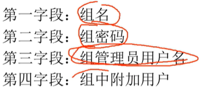
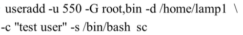
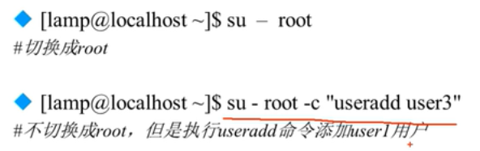
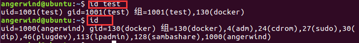

  


## 浏览器参数缓存原理

#### 产生缓存的条件:

1. **Get请求**
2. **请求地址不发生改变**

#### 具体原理:

以范围bilibili首页为例:

1. 用户请求b站首页, 但是可以看到浏览器请求了一个名为promete-tag.json的文件(我也不知道干嘛的0.0)

   

2. 我们可以看到响应报文中的响应头参数中有ETag, 和Last-Modified参数

   其中ETag表示资源的唯一表示符, Last-Modified表示上次修改时间

   当浏览器下次再次请求这个URL的时候, 会将这两个参数带上

   其中If-None-Match的值为ETag的值, If-Modified-Since为Last-Modified的值

   浏览器之所以带上这两个参数是想表示: **我这里有promote-tag.json的缓存, 但是我不知道你服务器那里的这个文件有没有变化**.

   

3. 服务器接收到请求报文后, 发现请求报文头里面有If-Modified-Since,If-None-Match参数, 理解浏览器想使用缓存, 于是将If-Modified-Since的值与服务器里promote-tag.json文件的Last-Modified的值相比较, 将If-Modified-Since的值与ETag的值相比较, 若两者都没有变化, 说明服务器里的promote-tag.json和浏览器缓存中的promote-tag.json文件是一致的, 于是发送响应报文给浏览器,响应报文的http状态码为304 Not Modified, 如果两个参数的值不一样, 说明浏览器缓存里的文件和服务器的不一致, 于是发送http状态码为200的响应报文, 并在报文体中携带上新的promote-tag.json文件内容

   

4. 浏览器接受到响应报文的时候,查看http请求状态码, 发现是304, 则使用自己缓存里面的文件, 如果是200, 说明缓存中的文件和服务器中的不一致, 以及被修改了, 所以去响应体里面获取新的promote-tag.json文件


#### 防止缓存

对于动态验证码这种我们不希望使用缓存的文件, 我们可以在请求的时候通过js来动态的在URL后面加上一个时间参数

```js
function reloadCode() {
    $("#img").attr("src", "gifCode?data=" + new Date() + "");
}
```

这样的话我们每次请求的URL都是不同的URL, 这样也就不存在缓存了.


## Mybatis 动态sql

####  小于号大于号转义

Mybatis中的sql语句中的  “<”  和   “>”  号要用转义字符   “`&lt;`”   和  ”`&gt;`“ ，否则会报错！

如查找年龄大于等于指定年龄的用户信息：

```sql
SELECT * FROM T_USER WHERE AGE &gt;=#{age}
```

## [动态SQL](http://www.mybatis.org/mybatis-3/zh/dynamic-sql.html)

MyBatis 的强大特性之一便是它的动态 SQL。如果你有使用 JDBC 或其它类似框架的经验，你就能体会到根据不同条件拼接 SQL 语句的痛苦。例如拼接时要确保不能忘记添加必要的空格，还要注意去掉列表最后一个列名的逗号。利用动态 SQL 这一特性可以彻底摆脱这种痛苦。

虽然在以前使用动态 SQL 并非一件易事，但正是 MyBatis 提供了可以被用在任意 SQL 映射语句中的强大的动态 SQL 语言得以改进这种情形。

动态 SQL 元素和 JSTL 或基于类似 XML 的文本处理器相似。在 MyBatis 之前的版本中，有很多元素需要花时间了解。MyBatis 3 大大精简了元素种类，现在只需学习原来一半的元素便可。MyBatis 采用功能强大的基于 OGNL 的表达式来淘汰其它大部分元素。

- if
- choose (when, otherwise)
- trim (where, set)
- foreach


### if

动态 SQL 通常要做的事情是根据条件包含 where 子句的一部分。比如：

```
<select id="findActiveBlogWithTitleLike"
     resultType="Blog">
  SELECT * FROM BLOG
  WHERE state = ‘ACTIVE’
  <if test="title != null">
    AND title like #{title}
  </if>
</select>
```

这条语句提供了一种可选的查找文本功能。如果没有传入“title”，那么所有处于“ACTIVE”状态的BLOG都会返回；反之若传入了“title”，那么就会对“title”一列进行模糊查找并返回 BLOG 结果（细心的读者可能会发现，“title”参数值是可以包含一些掩码或通配符的）。

如果希望通过“title”和“author”两个参数进行可选搜索该怎么办呢？首先，改变语句的名称让它更具实际意义；然后只要加入另一个条件即可。

```
<select id="findActiveBlogLike"
     resultType="Blog">
  SELECT * FROM BLOG WHERE state = ‘ACTIVE’
  <if test="title != null">
    AND title like #{title}
  </if>
  <if test="author != null and author.name != null">
    AND author_name like #{author.name}
  </if>
</select>
```

### choose, when, otherwise

有时我们不想应用到所有的条件语句，而只想从中择其一项。针对这种情况，MyBatis 提供了 choose 元素，它**有点像 Java 中的 switch 语句**。

还是上面的例子，但是这次变为提供了“title”就按“title”查找，提供了“author”就按“author”查找的情形，若两者都没有提供，就返回所有符合条件的 BLOG（实际情况可能是由管理员按一定策略选出 BLOG 列表，而不是返回大量无意义的随机结果）。

```
<select id="findActiveBlogLike"
     resultType="Blog">
  SELECT * FROM BLOG WHERE state = ‘ACTIVE’
  <choose>
    <when test="title != null">
      AND title like #{title}
    </when>
    <when test="author != null and author.name != null">
      AND author_name like #{author.name}
    </when>
    <otherwise>
      AND featured = 1
    </otherwise>
  </choose>
</select>
```

### trim, where, set

前面几个例子已经合宜地解决了一个臭名昭著的动态 SQL 问题。现在回到“if”示例，这次我们将“ACTIVE = 1”也设置成动态的条件，看看会发生什么。

```
<select id="findActiveBlogLike"
     resultType="Blog">
  SELECT * FROM BLOG
  WHERE
  <if test="state != null">
    state = #{state}
  </if>
  <if test="title != null">
    AND title like #{title}
  </if>
  <if test="author != null and author.name != null">
    AND author_name like #{author.name}
  </if>
</select>
```

如果这些条件没有一个能匹配上会发生什么？最终这条 SQL 会变成这样：

```
SELECT * FROM BLOG
WHERE
```

这会导致查询失败。如果仅仅第二个条件匹配又会怎样？这条 SQL 最终会是这样:

```
SELECT * FROM BLOG
WHERE
AND title like ‘someTitle’
```

这个查询也会失败。这个问题不能简单地用条件句式来解决，如果你也曾经被迫这样写过，那么你很可能从此以后都不会再写出这种语句了。

MyBatis 有一个简单的处理，这在 90% 的情况下都会有用。而在不能使用的地方，你可以自定义处理方式来令其正常工作。一处简单的修改就能达到目的：

```
<select id="findActiveBlogLike"
     resultType="Blog">
  SELECT * FROM BLOG
  <where>
    <if test="state != null">
         state = #{state}
    </if>
    <if test="title != null">
        AND title like #{title}
    </if>
    <if test="author != null and author.name != null">
        AND author_name like #{author.name}
    </if>
  </where>
</select>
```

***where* 元素只会在至少有一个子元素的条件返回 SQL 子句的情况下才去插入“WHERE”子句。而且，若语句的开头为“AND”或“OR”，*where* 元素也会将它们去除。**

如果 *where* 元素没有按正常套路出牌，我们可以通过自定义 trim 元素来定制 *where* 元素的功能。比如，和 *where* 元素等价的自定义 trim 元素为：

```
<trim prefix="WHERE" prefixOverrides="AND |OR ">
  ...
</trim>
```

*prefixOverrides* 属性会忽略通过管道分隔的文本序列（注意此例中的空格也是必要的）。它的作用是移除所有指定在 *prefixOverrides* 属性中的内容，并且插入 *prefix* 属性中指定的内容。

类似的用于动态更新语句的解决方案叫做 *set*。*set* 元素可以用于动态包含需要更新的列，而舍去其它的。比如：

```
<update id="updateAuthorIfNecessary">
  update Author
    <set>
      <if test="username != null">username=#{username},</if>
      <if test="password != null">password=#{password},</if>
      <if test="email != null">email=#{email},</if>
      <if test="bio != null">bio=#{bio}</if>
    </set>
  where id=#{id}
</update>
```

这里，***set* 元素会动态前置 SET 关键字，同时也会删掉无关的逗号，因为用了条件语句之后很可能就会在生成的 SQL 语句的后面留下这些逗号**。（译者注：因为用的是“if”元素，若最后一个“if”没有匹配上而前面的匹配上，SQL 语句的最后就会有一个逗号遗留）

若你对 *set* 元素等价的自定义 trim 元素的代码感兴趣，那这就是它的真面目：

```
<trim prefix="SET" suffixOverrides=",">
  ...
</trim>
```

注意这里我们删去的是后缀值，同时添加了前缀值。

### foreach

动态 SQL 的另外一个常用的操作需求是对一个集合进行遍历，**通常是在构建 IN 条件语句的时候**。比如：

```
<select id="selectPostIn" resultType="domain.blog.Post">
  SELECT *
  FROM POST P
  WHERE ID in
  <foreach item="item" index="index" collection="list"
      open="(" separator="," close=")">
        #{item}
  </foreach>
</select>
```

*foreach* 元素的功能非常强大，它允许你指定一个集合，声明可以在元素体内使用的集合项（item）和索引（index）变量。它也允许你指定开头与结尾的字符串以及在迭代结果之间放置分隔符。这个元素是很智能的，因此它不会偶然地附加多余的分隔符。

**注意** 你可以将任何可迭代对象（如 List、Set 等）、Map 对象或者数组对象传递给 *foreach* 作为集合参数。当使用可迭代对象或者数组时，index 是当前迭代的次数，item 的值是本次迭代获取的元素。当使用 Map 对象（或者 Map.Entry 对象的集合）时，index 是键，item 是值。

到此我们已经完成了涉及 XML 配置文件和 XML 映射文件的讨论。下一章将详细探讨 Java API，这样就能提高已创建的映射文件的利用效率。


## 字符串为空判断

#### 1. 导入dependency

```xml
<dependency>
	<groupId>org.apache.commons</groupId>
	<artifactId>commons-lang3</artifactId>
</dependency>
```

#### 2. isEmpty()

判断某字符串是否为空，为空的标准是str= =null或str.length()==0

```java
StringUtils.isEmpty(null) = true
StringUtils.isEmpty("") = true
StringUtils.isEmpty(" ") = false //注意在StringUtils中空格作非空处理
StringUtils.isEmpty(" ") = false
StringUtils.isEmpty("bob") = false
StringUtils.isEmpty(" bob ") = false
```

#### 3. ==isBlank()==

判断某字符串是否为空或长度为0或由空白符(whitespace)构成

```java
StringUtils.isBlank(null) = true
StringUtils.isBlank("") = true
StringUtils.isBlank(" ") = true
StringUtils.isBlank(" ") = true
StringUtils.isBlank("\t \n \f \r") = true //对于制表符、换行符、换页符和回车符StringUtils.isBlank()均识为空白符
StringUtils.isBlank("\b") = false //"\b"为单词边界符
StringUtils.isBlank("bob") = false
StringUtils.isBlank(" bob ") = false
```

#### 4. isNotEmpty()

判断某字符串是否非空，等于!isEmpty(String str)

```java
StringUtils.isNotEmpty(null) = false
StringUtils.isNotEmpty("") = false
StringUtils.isNotEmpty(" ") = true
StringUtils.isNotEmpty(" ") = true
StringUtils.isNotEmpty("bob") = true
StringUtils.isNotEmpty(" bob ") = true
```

#### 5.isNotBlank()

判断某字符串是否不为空且长度不为0且不由空白符(whitespace)构成，等于!isBlank(String str)

```java
StringUtils.isNotBlank(null) = false
StringUtils.isNotBlank("") = false
StringUtils.isNotBlank(" ") = false
StringUtils.isNotBlank(" ") = false
StringUtils.isNotBlank("\t \n \f \r") = false
StringUtils.isNotBlank("\b") = true
StringUtils.isNotBlank("bob") = true
StringUtils.isNotBlank(" bob ") = true
```


## Mybatis查询返回Map,List

数据库表如下:


### 一、单条记录

#### 返回结果以po类封装

```xml
<select id="selectUserInfoById" resultType="UserInfo">
    select * from user_info where uid = #{id}
</select>
```

```java
 UserInfo selectUserInfoById(int id);
```


#### 返回结果以map封装

map中Key为字段名, value为字段值

```xml
//这里使用别名, 默认返回HashMap
<select id="selectUserInfoById" resultType="map">
    select * from user_info where uid = #{id}
</select>
```

```java
Map selectUserInfoById(int id);
```


### 二、多条记录

#### 返回结果以List<UserInfo>封装

```xml
<select id="selectAll" resultType="UserInfo">
    select * from user_info
</select>
```

```java
List<UserInfo>  selectAll();
```


#### 返回结果以Map<Integer, UserInfo>封装

map中key以@MapKey注释指定, value为每条记录所组成的UserInfo

```xml
<select id="selectAll" resultType="UserInfo">
    select * from user_info
</select>
```

```java
//这里@MapKey表示uid为Map的键
@MapKey("uid")
Map<Integer, UserInfo>  selectAll();
```


#### 返回结果以Map<Integer, Map>封装

```xml
<select id="selectAll" resultType="map">
    select * from user_info
</select>
```

```java
@MapKey("uid")
    Map<Integer, Map> selectAll();
```


#### 返回结果以List<Map>封装

```xml
  <select id="selectAll" resultType="map">
    select * from user_info
  </select>
```

```java
List<Map> selectAll();
```


### 总结

1. 关于mapper.xml中的resultType

   其实不管查询单条记录还是多条记录, 只要想好**查出来的每一条记录**想用什么封装就好, 

   如果想使用map封装resultType="map"

   如果想使用po类封装resultType="UserInfo"

   至于查出来的是**多条记录还是单条记录, 并不影响resultMap**

2. 关于mapper.java中接口的返回值

   在第一部中想好自己的查出来的每一记录怎么封装后, **通过返回值类型来控制多条记录的封装**

   单条记录po封装, 多条记录想放在一个List里面, 那返回值类型就是List<UserInfo>

   单条记录po封装, 多条记录想放在一个Map里面, 那返回值类型就是Map<Integer, UserInfo>,其中map的key使用@MapKey来指定, 类型使用相应类型

   单条记录map封装, 多条记录想放在一个List里面, 那返回值类型就是List<Map>

3. 像List<Map>这样的个人感觉应该使用比较少吧, 虽然可以, 但是没必要
4. 个人感觉po类封装单条记录比map封装单条记录使用比较多, 但是有些时候多表联查查出很多字段,这个时候使用map封装比较好


## CentOS 常用命令:

#### firewall

查看是否开启防火墙:

```txt
firewall-cmd --state
```

查看已经开放的端口：

```
firewall-cmd --list-ports
```

开启端口

```txt
firewall-cmd --zone=public --add-port=80/tcp --permanent
命令含义：

–zone #作用域

–add-port=80/tcp #添加端口，格式为：端口/通讯协议

–permanent #永久生效，没有此参数重启后失效
```

重启防火墙

```
firewall-cmd --reload #重启firewall

systemctl stop firewalld.service #停止firewall

systemctl disable firewalld.service #禁止firewall开机启动

firewall-cmd --state #查看默认防火墙状态（关闭后显示notrunning，开启后显示running）
```

#### 开启关闭服务

```
systemctl stop firewalld.service
systemctl disable firewalld.service`
```


##  yum源更换为163

#### 1. 备份

mv /etc/yum.repos.d/CentOS-Base.repo /etc/yum.repos.d/CentOS-Base.repo.backup

#### 2、下载新的CentOS-Base.repo 到/etc/yum.repos.d/

wget -O /etc/yum.repos.d/CentOS-Base.repo http://mirrors.163.com/.help/CentOS6-Base-163.repo

#### 3. 生成缓存

yum clean all

yum makecache

https://juejin.im/editor/post/5e593407518825495a2779de

https://juejin.im/editor/posts/5e593407518825495a2779de

## CentOS安装Redis

#### 更改yum源

将Centos的yum源更换为国内的163源

备份你的原镜像文件，保证出错后可以恢复：

```
mv /etc/yum.repos.d/CentOS-Base.repo /etc/yum.repos.d/CentOS-Base.repo.backup
```

下载新的`CentOS-Base.repo` 到`/etc/yum.repos.d/`

```
wget -O /etc/yum.repos.d/CentOS-Base.repo http://mirrors.163.com/.help/CentOS6-Base-163.repo
```

生成缓存

```txt
yum clean all
yum makecache
```

### 安装redis

```
yum install redis
```

### 启动redis

```
systemctl start redis.service
```

### 设置redis开机启动

```
systemctl enable redis.service
```

### 修改redis配置

```txt
vim /etc/redis.conf

//开启守护进程
将daemonize yes 改为daemonize yes
//将运行的ip设置为所有
将bind 127.0.0.1 改为bind 0.0.0.0
//运行公网访问redis
将protected-mode yes 改为protected-mode yes

注: 可以使用?直接进行搜索关键字
```

### 高级设置

#### 设置redis密码

打开文件`/etc/redis.conf`，找到其中的`# requirepass foobared`，去掉前面的`#`，并把`foobared`改成你的密码。

`redis.conf`文件默认在`/etc`目录下，你可以更改它的位置和名字，更改后，注意在文件`/usr/lib/systemd/system/redis.service`中，把`ExecStart=/usr/bin/redis-server /etc/redis/6379.conf --daemonize no`中的`redis.conf`的路径改成的新的路径。


## lombok标签

@Self4j:   标注在类上, 可以直接使用log这个变量


@Data: 标注在类上, `@Data`相当于`@Getter @Setter @RequiredArgsConstructor @ToString @EqualsAndHashCode`这5个注解的合集


@NoArgsConstructor: 标注在类上, 表明该类有无参构造函数


@AllArgsConstructor:  标注在类上, 表明该类有所有参数的构造函数


@ToString: 标注在类上, 表明该类有toString方法


@EqualsAndHashCode: 标注在类上

- 会自动重写equals和hashCode方法

- 它默认使用非静态，非瞬态的属性来判断两个类是否equals

- 它默认仅使用该类中定义的属性且**不调用父类**的方法 

- 可通过参数`of`指定仅使用哪些属性 

- 可通过参数`exclude`排除一些属性 

- callSuper: 上述第三点说明该类在比较的时候不会使用父类中的属性, 但是有时这样会产生问题.

  比如，有多个类有相同的部分属性，把它们定义到父类中，恰好id（数据库主键）也在父类中，那么就会存在部分对象在比较时，子类中的属性都相同, 但是父类中的id属性不相等, z这样两个属性它们并不相等，却因为lombok自动生成的`equals(Object other)` 和 `hashCode()`方法判定为相等，从而导致出错。

  解决:  在使用@Data时同时加上@EqualsAndHashCode(callSuper=true)注解.

  通俗来将callSuper就是用了设置是否调用父类中的属性来判断两个类是否equals.

@Builder: 标注在类上, 构造一个实例, 属性不需要单独设置

  ```java
@Builder
public class User {
        private int foo;
        private final String bar;
 }
 

 User.builder().foo(1).bar("test").build()
  ```

```java
//使用@Builder的方案
public class User {
        private int foo;
        private final String bar;

        private Example(int foo, String bar) {
                this.foo = foo;
                this.bar = bar;
        }

        public static ExampleBuilder builder() {
                return new ExampleBuilder();
        }

        public static class ExampleBuilder<T> {
                private int foo;
                private String bar;

                private ExampleBuilder() {}

                public ExampleBuilder foo(int foo) {
                        this.foo = foo;
                        return this;
                }

                public ExampleBuilder bar(String bar) {
                        this.bar = bar;
                        return this;
                }

                public Example build() {
                        return new Example(foo, bar);
                }
        }
 }
```


## Jackson的使用

spring-boot-starter-web默认引入了以下依赖：
```xml
<dependency>
        <groupId>com.fasterxml.jackson.core</groupId>
        <artifactId>jackson-annotations</artifactId>
        <version>2.8.0</version>
</dependency>
<dependency>
        <groupId>com.fasterxml.jackson.core</groupId>
        <artifactId>jackson-core</artifactId>
        <version>2.8.7</version>
</dependency>
<dependency>
        <groupId>com.fasterxml.jackson.core</groupId>
        <artifactId>jackson-databind</artifactId>
        <version>2.8.7</version>
</dependency>
```

#### 嵌套java, Map, List转json

````java
@Data
public class Address {

    private String province;

    private String city;

    private String county;
}

@Data
public class User {

    private String name;

    private Integer age;

    private String userId;

    private List<String> phone;

    private Address address;

    private Map<String, Integer> score;

}	


	@Test
    public void contextLoads() throws JsonProcessingException {
        User user = new User();

        user.setAge(0);
        user.setUserId("userid");

        List<String> phoneList = new ArrayList<>();
        phoneList.add("u9938289439");
        phoneList.add("938849249");
        user.setPhone(phoneList);

        Address address = new Address();
        address.setProvince("江西");
        address.setCity("南昌");
        address.setCounty("红谷滩区");
        user.setAddress(address);

        HashMap<String, Integer> score = new HashMap<>();
        score.put("数学", 100);
        score.put("英语", 34);
        user.setScore(score);


        ObjectMapper objectMapper = new ObjectMapper();
        String json = objectMapper.writeValueAsString(user);
        System.out.println(json);


    }
````

```json
{
    "name":null,
 	"age":0,
    "userId":"userid",
    "phone":[
        "u9938289439",
        "938849249"
    ],
    "address":{
        "province":"江西"
        ,"city":"南昌",
        "county":"红谷滩区"
    },
    "score":{
        "数学":100,
        "英语":34
    }
}
```

####  json转java


#### @JsonIgnore

使用@JsonIgnore标注在**字段**或者**字段的get方法**上, 可以在序列化的时候忽略该字段

#### @JsonIgnoreProperties

上述@JsonIgnore对于单个字段使用, 当我们需要对多个字段使用的时候, 可以使用@JsonIgnoreProperties标注在类上

```java
//不需要序列化该类中的id, name字段
@JsonIgnoreProperties({"id","name"})
class User {
    
}
```

#### @JsonFilter

#### @JsonProperty

@JsonProperty 此注解用于属性上，作用是把该属性的名称序列化为另外一个名称

```java
// 在序列化对象的时候将name改为username
public class User {

    @JsonProperty("username")
    private String name;

}	
```


#### @JsonInclude

```java
@JsonInclude(Include.NON_NULL) 

// 将该标记放在属性上，如果该属性为NULL则不参与序列化 
// 如果放在类上边,那对这个类的全部属性起作用 
// Include.Include.ALWAYS 默认 
// Include.NON_DEFAULT 属性为默认值不序列化 
// Include.NON_EMPTY 属性为 空（“”） 或者为 NULL 都不序列化 
// Include.NON_NULL 属性为NULL 不序列化 
```


#### @JsonSerialize

#### @JsonDeserialize

#### @JsonFormat

```java
// Date类型序列化返回的是一个长整型时间戳, 从1970到该变量时间的毫秒数
// 需要自定义格式日期
@JsonFormat(timezone = "GMT+8", pattern = "yyyy-MM-dd HH:mm:ss")
Date date;
```


## Maven隐含变量

Maven提供了三个隐式的变量可以用来访问环境变量，POM信息，和Maven Settings

#### env

env变量，暴露了你操作系统或者shell的环境变量。比如在Maven POM中一个对\${env.PATH}的引用将会被 ​\${PATH}环境变量替换，在Windows中为%PATH%.

#### project

project变量暴露了POM。可以使用点标记(.)的路径来引用POM元素的值。例如

```xml
<project>
	<modelVersion>4.0.0</modelVersion>
    <groupId>org.sonatype.mavenbook</groupId>
	<artifactId>project-a</artifactId>
	<version>1.0-SNAPSHOT</version>
	<packaging>jar</packaging>
	<build>
		<finalName>${project.groupId}-${project.artifactId</finalName>
	</build>
</project>
```

当你使用mvn help:effective-pom 查看时,你会看到<finalName>org.sonatype.mavenbook-project-a</finalName>


${basedir} 项目根目录 ​

\${project.build.directory} 构建目录, 缺省为target ​

\${project.build.outputDirectory} 构建过程输出目录, 缺省为target/classes

 ​\${project.build.finalName} 产出物名称, 缺省为\${project.artifactId}- \${project.version} 

\${project.packaging} 打包类型缺省为jar

\${project.xxx} 当前pom文件的任意节点的内容

#### settings

settings变量暴露了Maven settings信息。可以使用点标记(.)的路径来引用settings.xml文件中元素的值。

**例如${settings.offline}会引用~/.m2/settings.xml文件中offline元素的值。**


## 关于枚举类

#### 定义枚举类

```java
public enum ResultCode {

    /** 有没有发现写枚举类的这一部分就像是在调用构造方法 */
    SUCCESS(1, "成功"),
    PARAM_IS_INVALID(10001, "参数无效"),
    PARAM_IS_BLANK(10002, "参数为空"),
    PARAM_TYPE_BIND_ERROR(10003, "参数类型错误"),
    PARAM_NOT_COMPLETE(10004, "参数缺失"),
    //上面的逗号可去可不去, 并不会导致编译错误
    ;

    private Integer code;

    private String message;

    //构造函数默认并且必须是private
    ResultCode(Integer code, String message) {
        this.code = code;
        this.message = message;
    }

    public Integer code() {
        return this.code;
    }

    public String message() {
        return this.message;
    }
}
```

#### 枚举类的使用

所有的枚举类在编译之后会自动继承enum类, 并且会自动生成一个values()方法

```java
//只放出部分常见代码
public abstract class Enum<E extends Enum<E>>
        implements Comparable<E>, Serializable {

	/**
	实例的名字, 类型为字符串
	即ResultCode.SUCCESS为SUCCESS, ResultCode.PARAM_IS_INVALID为PARAM_IS_INVALID
	*/
    private final String name;

    public final String name() {
        return name;
    }

	/**
	实例的索引, 从0开始
	即ResultCode.SUCCESS.ordinal()为0, ResultCode.PARAM_IS_INVALID.ordinal()为1
	*/
    private final int ordinal;

    public final int ordinal() {
        return ordinal;
    }
    //toString方法与name()一样
    public String toString() {
        return name;
    }
	//判断两个枚举实例是否一样, 注意这里使用的是==, 直接比引用, 说明枚举类的实例是单例的
    public final boolean equals(Object other) {
        return this==other;
    }
    /**
    比较两个枚举实例的索引详见, 返回的int
    上面我们知道ResultCode.SUCCESS.ordinal()为0, ResultCode.PARAM_IS_INVALID.ordinal()为1
    所以ResultCode.SUCCESS.compareTo(ResultCode.PARAM_IS_INVALID)为0-1=-1
    */
    public final int compareTo(E o) {
		//略去实现代码
    }
}
```

验证: 

```java
//ResultCode.values()会返回ResultCode这个枚举类的所有实例, 类型为ResultCode[]
for (ResultCode resultCode : ResultCode.values()) {
            System.out.println(resultCode.name());
            System.out.println(resultCode.ordinal());
            System.out.println(resultCode.compareTo(ResultCode.SUCCESS));
}
//ResultCode.valueOf()会返回name与参数相等的枚举实例
ResultCode SUCCESS = ResultCode.valueOf("SUCCESS");
System.out.println(SUCCESS.equals(ResultCode.SUCCESS));   //输出为true
```

#### 枚举类中定义抽象方法

```java
/**
 * 枚举类可以有抽象方法，但是必须在它的实例中实现
 */
public enum AbstractWeek {

    MONDAY(0,"星期一") {
        @Override
        public AbstractWeek getNextDay() {
            return TUESDAY;
        }
    }, TUESDAY(1,"星期二") {
        @Override
        public AbstractWeek getNextDay() {
            return WEDNESDAY;
        }
    }, WEDNESDAY(2,"星期三") {
        @Override
        public AbstractWeek getNextDay() {
            return THURSDAY;
        }
    }, THURSDAY(3,"星期四") {
        @Override
        public AbstractWeek getNextDay() {
            return FRIDAY;
        }
    }, FRIDAY(4,"星期五") {
        @Override
        public AbstractWeek getNextDay() {
            return SATURDAY;
        }
    }, SATURDAY(5,"星期六") {
        @Override
        public AbstractWeek getNextDay() {
            return SUNDAY;
        }
    }, SUNDAY(6,"星期日") {
        @Override
        public AbstractWeek getNextDay() {
            return MONDAY;
        }
    };

    private int num;
    private String desc;

    AbstractWeek(int num,String desc) {
        this.num = num;
        this.desc=desc;
    }

    //一个抽象方法
    public abstract AbstractWeek getNextDay();
}
```

#### 反编译与语法糖

```java
public enum Weather {
	
	Sunny(1, "晴天") {
		@Override
		public String test() {
			return "今天阳光明媚！！！\n";
		}
	},
	Rainy(2, "雨天") {
		@Override
		public String test() {
			return "出门别忘带把雨伞哦！！！\n";
		}
	},
	Cloudy(3, "多云") {
		@Override
		public String test() {
			return "别出去登高望远了，你看不远的，呵呵呵！！！\n";
		}
	};
 
	private int value;
	private String label;
 
	private Weather(int value, String label) {
		this.value = value;
		this.label = label;
	}
 
	public int getValue() {
		return value;
	}
 
	public String getLabel() {
		return label;
	}
 
	public abstract String test();

}
```

我们将上述代码进行反编译:

```java
import java.io.PrintStream;
import java.util.*;
 
//枚举类继承了Enum, 所以我们在定义的时候不能再继承其他的类了
//非抽象枚举类默认是final的, 所以不要去继承非抽象的枚举类
public abstract class Weather extends Enum {
 
    //这里s表示name, i表示ordinal
    //构造函数为私有的
	private Weather(String s, int i, int value, String label) {
		super(s, i);
		this.value = value;
		this.label = label;
	}
 
	public int getValue() {
		return value;
	}
 
	public String getLabel() {
		return label;
	}
 
    //我们自己定义的抽象方法
	public abstract String test();

 	//values()返回所有枚举类的实例
	public static Weather[] values() {
		Weather aweather[];
		int i;
		Weather aweather1[];
		System.arraycopy(aweather = ENUM$VALUES, 0, aweather1 = new Weather[i = aweather.length], 0, i);
		return aweather1;
	}
 
	public static Weather valueOf(String s) {
		return (Weather) Enum.valueOf(Weather, s);
	}
 
	Weather(String s, int i, int j, String s1, Weather weather) {
		this(s, i, j, s1);
	}
 
    //这是我们所定义的枚举类实例, 这也是为什么我们在定义枚举类的时候就像是在调用构造函数
    //每一个变量都是public static final
	public static final Weather Sunny;
	public static final Weather Rainy;
	public static final Weather Cloudy;
    
	private int value;
	private String label;
    
	private static final Weather ENUM$VALUES[];
 
	static {
		Sunny = new Weather("Sunny", 0, 1, "\u6674\u5929") {
			public String test() {
				return "\u4ECA\u5929\u9633\u5149\u660E\u5A9A\uFF01\uFF01\uFF01\n";
			}
		};
		Rainy = new Weather("Rainy", 1, 2, "\u96E8\u5929") {
			public String test() {
				return "\u51FA\u95E8\u522B\u5FD8\u5E26\u628A\u96E8\u4F1E\u54E6\uFF01\uFF01\uFF01\n";
			}
		};
		Cloudy = new Weather("Cloudy", 2, 3, "\u591A\u4E91") {
			public String test() {
				return "\u522B\u51FA\u53BB\u767B\u9AD8\u671B\u8FDC\u4E86\uFF0C\u4F60\u770B\u4E0D\u8FDC\u7684\uFF0C\u5475\u5475\u5475\uFF01\uFF01\uFF01\n";
			}
		};
		ENUM$VALUES = (new Weather[] { Sunny, Rainy, Cloudy });
	}
}
```

从上述我们可以看出, 枚举类的实现还是普通的java类, 只不过这个java类的构造函数是私有的, 而且实例的个数是有限个的, 当这个枚举类的实例个数只有一个的时候, 这个类就变成了单例模式了. 


## 单例模式

**实现单例模式的重点是在多线程和序列化的时候保持实例的单一**

#### 饿汉式

```java
public class Singletion {

    /**
     * 优点:
     *      用到这个实例的时候就能够立即拿到，而不需要任何等待时间
     *      由于该实例在类被加载的时候就创建出来了，所以也避免了线程安全问题
     * 缺点:
     *      在类被加载的时候对象就会实例化, 这也许会造成不必要的消耗
     *      如果这个类被多次加载的话也会造成多次实例化
     *      但是怎么样才会导致一个类被加载两次呢??? 网上也没有, 留一个todu吧
     */
    //TODO 如上注释
    private static Singletion instance = new Singletion();

    private Singletion() {

    }

    public Singletion getInstance() {
        return instance;
    }
}
```

#### 静态内部类式

```java
/**
 * 这种方式同样利用了classloder的机制来保证初始化instance时只有一个线程，
 * 它跟饿汉式不同的是（很细微的差别）：
 *      饿汉式是只要Singleton类被装载了，那么instance就会被实例化（没有达到lazy loading效果），
 *      而这种方式是Singleton类被装载了，instance不一定被初始化。
 *      因为SingletonHolder类没有被主动使用，只有显示通过调用getInstance方法时
 *      才会显示装载SingletonHolder类，从而实例化instance。
 *      想象一下，如果实例化instance很消耗资源，我想让他延迟加载，
 *      另外一方面，我不希望在Singleton类加载时就实例化，
 *      因为我不能确保Singleton类还可能在其他的地方被主动使用从而被加载，
 *      那么这个时候实例化instance显然是不合适的。这个时候，这种方式相比饿汉式更加合理。
 */
public class Singletion {

    private static class SingletonHodler {
        private static final Singletion INSTANCE = new Singletion();
    }

    private Singletion(){};

    public static final Singletion getInstance() {
        return SingletonHodler.INSTANCE;
    }

}
```

#### 懒汉式

##### 存在线程安全的模型

```java
public class Singletion implements Serializable{

    private static Singletion instance;

    private Singletion(){};

    /** 这种懒汉模式存在线程安全 */
    public static Singletion getInstance1() {
        if (instance == null) {
            instance = new Singletion();
        }
        return instance;
    }
}
```

##### 线程安全但是效率低下的模型

```java
public class Singletion implements Serializable{

    private static Singletion instance;

    private Singletion(){};

    /**
     * 这种写法在多线程中可以很好工作
     * 但是效率很低下, 因为加锁是整个方法加锁, 该方法的所有操作都是同步进行的
     * 但是对于非第一次操作, 根本不需要同步操作, 可以直接返回instance
     *
     * 但是以上的做法都不能防止序列化和反序列化所带来的危害
     */
    public static synchronized Singletion getInstance2() {
        if (instance == null) {
            instance = new Singletion();
        }
        return instance;
    }   
}
```

##### 双重校验锁

```java
public class Singletion implements Serializable{

    private static volatile Singletion instance;

    private Singletion(){};
    /**
     * 双重校验锁的单例模式
     * 因为java 内存模型, 必须强制线程从主内存区读取
     * 所有要在instance变量上面加volatile
     * @return
     */
    public static Singletion getInstance() {
        if (instance == null) {
            synchronized (Singletion.class) {
                if (instance == null) {
                    instance = new Singletion();
                }
            }
        }
        return instance;
    }
}
```

#### 单例模式与序列化


看下面案例:

```java
public static void main(String[] args) throws IOException, ClassNotFoundException {
        File file = new File("temp");
        ObjectOutputStream oos = new ObjectOutputStream(new FileOutputStream(file));
        oos.writeObject(Singletion.getInstance());
        ObjectInputStream ois = new ObjectInputStream(new FileInputStream(file));
        Singletion newSingletion = (Singletion) ois.readObject();
        System.out.println(newSingletion == Singletion.getInstance()); //false
    }
```

这里的单例采用上面的双重校验锁,  将instance序列化后再反序列化, 得到了两个不一样的对象, 这就破坏了单例模式了


先说怎么解决:

```java
//在单例模式里面加入这个方法解决序列化问题
/**
     * 实现这个方法可以避免序列化的问题, 返回的必须是Object类型
     * @return
     */
    public Object readResolve() {
        return getInstance();
    }
```


原理:

对象的序列化过程通过ObjectOutputStream和ObjectInputputStream来实现的，那么带着刚刚的问题，分析一下ObjectInputputStream 的`readObject` 方法执行情况到底是怎样的。

为了节省篇幅，这里给出ObjectInputStream的`readObject`的调用栈：

```
readObject--->readObject0--->readOrdinaryObject--->checkResolve
```

这里看一下重点代码，`readOrdinaryObject`方法的代码片段

```java
private Object readOrdinaryObject(boolean unshared)
        throws IOException
    {
        //省略部分代码
        
        Object obj;
        try {
        /**
        这里创建的这个obj对象，就是本方法要返回的对象，也可以暂时理解为是ObjectInputStream的readObject返回的对象
        
        isInstantiable：如果一个serializable/externalizable的类可以在运行时被实例化，那么该方法就返回true。
		desc.newInstance：该方法通过反射的方式调用无参构造方法新建一个对象。
		到目前为止，也就可以解释，为什么序列化可以破坏单例了？
		序列化会通过反射调用无参数的构造方法创建一个新的对象。
        */
            obj = desc.isInstantiable() ? desc.newInstance() : null;
        } catch (Exception ex) {
            throw (IOException) new InvalidClassException(
                desc.forClass().getName(),
                "unable to create instance").initCause(ex);
        }
		//省略部分代码

		/**
		hasReadResolveMethod:如果实现了serializable 或者 externalizable接口的类中包含readResolve则返回true
		*/
        if (obj != null &&
            handles.lookupException(passHandle) == null &&
            desc.hasReadResolveMethod())
        {
        	//invokeReadResolve:通过反射的方式调用要被反序列化的类的readResolve方法。
        	//所以，原理也就清楚了，主要在Singleton中定义readResolve方法，并在该方法中指定要返回的对象的生成策略，就可以方式单例被破坏。
            Object rep = desc.invokeReadResolve(obj);
            if (unshared && rep.getClass().isArray()) {
                rep = cloneArray(rep);
            }
            if (rep != obj) {
                // Filter the replacement object
                if (rep != null) {
                    if (rep.getClass().isArray()) {
                        filterCheck(rep.getClass(), Array.getLength(rep));
                    } else {
                        filterCheck(rep.getClass(), -1);
                    }
                }
                handles.setObject(passHandle, obj = rep);
            }
        }

        return obj;
    }
```

#### 使用枚举实现单例

单例的枚举实现在《Effective Java》中有提到，因为其**功能完整、使用简洁、无偿地提供了序列化机制、在面对复杂的序列化或者反射攻击时仍然可以绝对防止多次实例化**等优点，单元素的枚举类型被作者认为是实现Singleton的最佳方法

```java
//比上面的什么双重校验锁简单多了
public enum  Singletion {
    INSTANCE;
}
```

下面深入了解一下为什么枚举会满足线程安全、序列化等标准。

在JDK5 中提供了大量的语法糖，枚举就是其中一种。
所谓 语法糖（Syntactic Sugar），也称糖衣语法，是由英国计算机学家 Peter.J.Landin 发明的一个术语，指在计算机语言中添加的某种语法，这种语法对语言的功能并没有影响，但是但是更方便程序员使用。只是在编译器上做了手脚，却没有提供对应的指令集来处理它。

就拿枚举来说，其实Enum就是一个普通的类，它继承自java.lang.Enum类。

```java
public enum DataSourceEnum {
    DATASOURCE;
}  
```

把上面枚举编译后的字节码反编译，得到的代码如下：

```java
public final class DataSourceEnum extends Enum<DataSourceEnum> {
      public static final DataSourceEnum DATASOURCE;
      public static DataSourceEnum[] values();
      public static DataSourceEnum valueOf(String s);
      static {};
}
```

由反编译后的代码可知，DATASOURCE 被声明为 static 的，根据在[【单例深思】饿汉式与类加载](https://blog.csdn.net/gavin_dyson/article/details/69668946)中所描述的类加载过程，可以知道虚拟机会保证一个类的\<clinit>() 方法在多线程环境中被正确的加锁、同步。所以，枚举实现是在实例化时是线程安全。

当一个Java类第一次被真正使用到的时候静态资源被初始化、Java类的加载和初始化过程都是线程安全的（因为虚拟机在加载枚举的类的时候，会使用ClassLoader的loadClass方法，而这个方法使用同步代码块保证了线程安全）。所以，创建一个enum类型是线程安全的。

也就是说，我们定义的一个枚举，在第一次被真正用到的时候，会被虚拟机加载并初始化，而这个初始化过程是线程安全的。而我们知道，解决单例的并发问题，主要解决的就是初始化过程中的线程安全问题。

所以，由于枚举的以上特性，枚举实现的单例是天生线程安全的。

接下来看看序列化问题：

Java规范中规定，每一个枚举类型极其定义的枚举变量在JVM中都是唯一的，因此在枚举类型的序列化和反序列化上，Java做了特殊的规定。
**在序列化的时候Java仅仅是将枚举对象的name属性输出到结果中，反序列化的时候则是通过 java.lang.Enum 的 valueOf() 方法来根据名字查找枚举对象。**
也就是说，以下面枚举为例，序列化的时候只将 DATASOURCE 这个名称输出，反序列化的时候再通过这个名称，查找对于的枚举类型，因此反序列化后的实例也会和之前被序列化的对象实例相同。

参考:

https://mp.weixin.qq.com/s?__biz=MzI3NzE0NjcwMg==&mid=402577543&idx=1&sn=41c4bf5f46d13806668edacce130468b&scene=21#wechat_redirect

https://cloud.tencent.com/developer/article/1341386

https://blog.csdn.net/moakun/article/details/80688851

https://blog.csdn.net/gavin_dyson/article/details/70832185


## 正则表达式

#### 语法


| 字符 | 说明                                                         |
| ---- | :----------------------------------------------------------- |
| \d   | 匹配一个数字, 等效于[0-9]                                    |
| \D   | 匹配一个非数字字符, 等效于\[^ 0-9]                           |
| .    | **匹配\r(回车符)\n(换行符)之外任意字符, 若要匹配任意字符请使用[\s\S]**, 如果需要匹配点号, 需要使用转义字符\\. |
| []   | **自定义字符集合**, [a-f]表示a到f的任意字符, \[^ 123]表示非123的任意字符<br>**正则表达式中的特殊符号被包括到中括号中则失去特殊意义, 除了^,-之外**, 比如[.]就表示匹配点, .失去了特殊意义<br/>**标准字符集合除小数点外, 被包含在中括号中, 则该自定义字符集合将包含该标准集合** |
| \w   | 匹配一个数字字母下划线, 等效于[a-zA-Z0-9_], **是否包括中文看操作系统** |
| \W   | 匹配一个非字符类, 等效于\[^a-zA-Z0-9_]                       |

| 量词  | 说明                                                         |
| ----- | :----------------------------------------------------------- |
| {n}   | 正好匹配n次, \d{3}匹配3个数字, i{2}匹配2个i                  |
| {n,}  | 匹配至少n次, >=n                                             |
| {n,m} | 匹配至少n次, 至多m次,  **不要将空格插入逗号和数字之间** <br />**贪婪模式: 匹配字符越多越好, 默认**, \d{3,5}将会匹配1234567中的12345 <br />**非贪婪模式: 匹配的字符越少越好, 在量词后面加?表示**,  \d{3,5}?将会匹配1234567中的123和456 |
| *     | 等效于{0,}                                                   |
| +     | 等效于{1,}                                                   |
| ?     | 等效于{0,1}                                                  |

| 空白字符 | 说明                                                         |
| -------- | :----------------------------------------------------------- |
| \s       | 匹配一个空白字符, 包括空格, Tab, 换页符, 回车, 等效于[\f\n\r\t\v] |
| \S       | 匹配一个非空白字符                                           |
| \n       | 匹配一个换行符                                               |
| \r       | 匹配一个回车符                                               |
| \t       | 匹配一个制表符((Tab)                                         |
| \v       | 匹配一个垂直制表符                                           |
| \f       | 匹配一个换页符                                               |

| 字符边界 | 说明                                                         |
| -------- | ------------------------------------------------------------ |
| ^        | 与字符串开始的地方匹配                                       |
| $        | 与字符串结束的地方匹配                                       |
| \b       | 匹配一个位置: **前面的字符和后面的字符不全是\w**<br>比如在下面这个字符串中 `fee*fen&fens fena fenxx `, 其中画竖线是匹配到的位置`|fee|*|fen|&|fens| |fena| |fenxx|`<br>常常用来匹配一个完整的单词, 比如上面那个字符串`fee*fen&fens fena fenxx`, 需要匹配`fen`这个单词, 需要使用`\bfen\b` |

| 匹配模式    | 说明                                                         |
| ----------- | ------------------------------------------------------------ |
| ignore case | **忽略大小写, 默认情况下不忽略**                             |
| single line | 单行模式, 整个文本看做一个字符串, 只有一个开头和结尾<br>小数点"."可以匹配包括换行符\n在内的任何字符 |
| multi line  | 每一行都是一个字符串, 都有开头和结尾<br>**^和$会匹配每一行的开始和结尾**<br>如果需要仅匹配**文本开始和结束**的位置, 可以使用\A和\Z |

| 选择符和分组 | 说明                                    |
| ------------ | --------------------------------------- |
| \| 分值结构  | 或, 匹配左边或右边的表达式              |
| ()           | 捕获组<br>每队括号分配一个编号, 从1开始 |

| 零宽断言(位置匹配、预搜索) | 说明                                                         |
| -------------------------- | ------------------------------------------------------------ |
| (?=exp)                    | 匹配自身出现的位置的后面能匹配表达式的位置<br>"[a-z]+(?=ing)"将会匹配"eating,doing,running"中的eat, do, runn. 不包括ing因为是位置匹配<br>"[a-z]+ing"将会匹配eating, doing, running |
| (?!exp)                    | 匹配自身出现的位置的后面不能匹配表达式的位置                 |
| (?<=exp)                   | 匹配自身出现的位置前面能匹配表达式的位置                     |
| (?<!exp)                   | 匹配自身出现的位置前面不能匹配表达式的位置                   |

#### 正则 踩坑

~~~java
Pattern pattern = Pattern.compile("com\\.controller.*");
Matcher matcher = pattern.matcher("com.controller.HelloController");
System.out.println(matcher.matches());
//如果注释掉reset，下面的matcher.find()将会返回false，而不注释的话将会返回true。原理在于matches()修改了matcher的状态。
//matcher.reset();
if (matcher.find()) {
    System.out.println(matcher.group(0));
}
~~~

~~~java
Pattern pattern = Pattern.compile("com\\.controller.*");
Matcher matcher = pattern.matcher("com.controller.HelloController");
// find()的含义是查找下一个匹配的子序列，所以调用两次find()函数返回的结果是不同的。
matcher.find()  // true
matcher.find()  // false
~~~


#### group的使用

先看下面的例子：

~~~java
String regEx = "count((\\d+)(df))";  
String s = "count000dfdfsdffaaaa1";  
Pattern pat = Pattern.compile(regEx);  
Matcher mat = pat.matcher(s);  
if(mat.find()){
    System.out.println(mat.group()); // count000df
    System.out.println(mat.group(0));// count000df
    System.out.println(mat.group(1));// 000df
    System.out.println(mat.group(2));// 000
    System.out.println(mat.group(2));// df
}
~~~

从上面可以看到，group()和group(0)是表达式匹配到的整个字符串，而group(1)是第一个括号匹配到的字符串，group(2)是第二个字符串匹配到的内容。

如果表达式没有括号的话，那么只有group(0)，调用其他的group会有异常。

group的的顺序是按照左括号的决定的。上面((\\d+)(df))

其实，Java正则表达式中的“组”概念与《正则表达式必知必会》一书中讲述的“子表达式”其实是一样的，只是表述不同而已。


#### Matcher类方法

matches和find的区别：

- find()方法是部分匹配，是查找输入串中与模式匹配的子串，如果该匹配的串有组还可以使用group()函数。

- matches()是全部匹配，是将整个输入串与模式匹配，如果要验证一个输入的数据是否为数字类型或其他类型，一般要用matches()。

| 一般方法                           | 说明                           |
| ---------------------------------- | ------------------------------ |
| Matcher reset()                    | 重置此匹配器。                 |
| Matcher reset(CharSequence input)  | 使用新的输入序列重置此匹配器。 |
| Matcher region(int start, int end) | 设置此匹配器区域的限制。       |
| int regionStart()                  | 报告此匹配器区域的起始索引。   |
| Pattern pattern()                  | 返回此匹配器解释的模式。       |

| 匹配方法            | 说明                                       |
| ------------------- | ------------------------------------------ |
| boolean matches()   | 尝试将整个区域与模式匹配。                 |
| boolean lookingAt() | 尝试将从区域开头开始的输入序列与模式匹配。 |

| 查找方法                  | 说明                                                         |
| ------------------------- | ------------------------------------------------------------ |
| boolean find()            | 尝试查找与模式匹配的输入序列的下一个子序列。                 |
| boolean find(int start)   | 重置此匹配器，然后尝试从**指定的索引处**开始查找与模式匹配的输入序列的下一个子序列。 |
| String group()            | 返回上一个匹配操作期间给定组捕获的输入子序列。               |
| String group(int group)   | 返回在上一个匹配操作期间指定的捕获组捕获的子序列。           |
| String group(String name) | 返回在上一个匹配操作期间由给定的命名捕获组捕获的输入子序列   |
| int groupCount()          | **返回此匹配器模式中捕获组的数量**。                         |
| int start()               | 返回上一个匹配的起始索引                                     |
| int start(int group)      | 返回上一个匹配操作期间给定组捕获的子序列的起始索引。         |
| int end()                 | 返回最后一个字符匹配后的偏移量。                             |
| int end(int group)        | 返回在上一个匹配操作期间由给定组捕获的子序列的最后一个字符之后的偏移量。 |

| 替换方法                                                     | 说明                                                         |
| ------------------------------------------------------------ | ------------------------------------------------------------ |
| Matcher appendReplacement(StringBuffer sb, String replacement) | 实现非终端附加和替换步骤。                                   |
| StringBuffer appendTail(StringBuffer sb)                     | 实现终端附加和替换步骤。                                     |
| static String quoteReplacement(String s)                     | 返回指定String的文字替换String。                             |
| String replaceAll(String replacement)                        | 将具有给定替换字符串的模式匹配的输入序列的每个子序列替换。   |
| String replaceFirst(String replacement)                      | 将具有给定替换字符串的模式匹配的输入序列的第一个子序列替换。 |
|                                                              |                                                              |
|                                                              |                                                              |

| 其他方法                                | 说明                                                         |
| --------------------------------------- | ------------------------------------------------------------ |
| boolean hasAnchoringBounds()            | 查询此匹配器的区域边界的锚定。                               |
| boolean hasTransparentBounds()          | 查询此匹配器的区域边界的透明度。                             |
| boolean hitEnd()                        | 如果在此匹配器执行的最后一个匹配操作中搜索引擎命中输入结尾，则返回`true`。 |
| Matcher useAnchoringBounds(boolean b)   | 设置此匹配器的区域边界的锚定。                               |
| Matcher usePattern(Pattern newPattern)  | 更改此匹配器用于查找匹配项的模式。                           |
| Matcher useTransparentBounds(boolean b) | 设置此匹配器的区域边界的透明度。                             |
| boolean requireEnd()                    | 如果更多输入可以将正匹配更改为负匹配，则返回`true`。         |
| MatchResult toMatchResult()             | 返回此匹配器的匹配状态作为:`MatchResult`。                   |

## Mysql datetime和timestamp的区别

#### 1. 占用空间

| 类型      | 占据字节 | **表示形式**        |
| --------- | -------- | ------------------- |
| datetime  | 8 字节   | yyyy-mm-dd hh:mm:ss |
| timestamp | 4 字节   | yyyy-mm-dd hh:mm:ss |


#### 2. 表示范围

| **类型**  | **表示范围**                                                 |
| --------- | ------------------------------------------------------------ |
| datetime  | '1000-01-01 00:00:00.000000' to '9999-12-31 23:59:59.999999' |
| timestamp | '1970-01-01 00:00:01.000000' to '2038-01-19 03:14:07.999999' |

`timestamp`翻译为汉语即"时间戳"，它是当前时间到 Unix元年(1970 年 1 月 1 日 0 时 0 分 0 秒)的秒数。对于某些时间的计算，如果是以 `datetime` 的形式会比较困难，假如我是 `1994-1-20 06:06:06` 出生，现在的时间是 `2016-10-1 20:04:50`，那么要计算我活了多少秒钟用 `datetime` 还需要函数进行转换，但是 `timestamp` 直接相减就行。

#### 3. 测试

我们新建一个表


插入数据


查看数据，可以看到存进去的是`NULL`，`timestamp`会自动储存当前时间，而 `datetime`会储存`NULL`


把时区修改为东 9 区，再查看数据，会会发现 `timestamp` 比 `datetime` 多一小时


如果插入的是无效的呢？假如插入的是时间戳


结果是`0000-00-00 00:00:00`，根据官方的解释是插入的是无效的话会转为 `0000-00-00 00:00:00`，而时间戳并不是`MySQL`有效的时间格式。

那么什么形式的可以插入呢，下面列举三种

```text
//下面都是 MySQL 允许的形式，MySQL 会自动处理
2016-10-01 20:48:59
2016#10#01 20/48/59
20161001204859
```

#### 4. 选择

- 范围: 如果你的数据范围可能超过`'1970-01-01 00:00:01.000000' to '2038-01-19 03:14:07.999999'`还是选datetime
- 自动更新: 如果想自己的数据自动更新或者自动插入选timestamp
- 时区: 如果自己的业务跨时区使用timestamp

转载自https://segmentfault.com/a/1190000017393602

## Mybatis insert获取id

- 有自增长功能数据库(mysql)

  ```xml
  <insert id="insertAndGetId" useGeneratedKeys="true" keyProperty="userId" parameterType="com.chenzhou.mybatis.User" keyColumn="id">
      insert into user(userName,password,comment)
      values(#{userName},#{password},#{comment})
  </insert>
  
  useGeneratedKeys="true" 表示给主键设置自增长
  keyProperty="userId"  表示将自增长后的Id赋值给实体类中的userId字段。
  keyColumn： 数据库中的自增主键的列名，默认是数据库表的第一列。当主键列不是表中的第一列的时候需要设置，PostgreSQL必须设置。
  
  若userId为非自增长, 报错java.sql.SQLException: Field 'userId' doesn't have a default value
  ```

- 不能自增长的数据库(oracle)

  ```xml
  <insert id="insertUser" parameterType="user" >
          <selectKey keyProperty="id" resultType="long" order="BEFORE" keyColumn="id">
              select xxx_SEQ.nextval from dual
          </selectKey>
          insert into user (id, name, password, type,
          is_delete)
          values (#{id,jdbcType=BIGINT}, #{name}, #{password}, #{type},
          #{delete})
  </insert>
  
  order="AFTER" 表示先执行插入语句，之后再执行查询语句。
  可被设置为 BEFORE 或 AFTER。
  如果设置为 BEFORE,那么它会首先选择主键,设置 keyProperty 然后执行插入语句。
  
  keyProperty="userId"  表示将自增长后的Id赋值给实体类中的userId字段。
  SELECT LAST_INSERT_ID() 表示MySQL语法中查询出刚刚插入的记录自增长Id.
  实体类中uerId 要有getter() and setter(); 方法
  ```

  

## Mybatis中javaType和jdbcType关系

转载自https://blog.csdn.net/a5552157/article/details/78668039

## 备忘用

```xml
<resultMap type="java.util.Map" id="resultjcm">  
    <result property="FLD_NUMBER" column="FLD_NUMBER" javaType="double" jdbcType="NUMERIC"/>  		<result property="FLD_VARCHAR" column="FLD_VARCHAR" javaType="string" jdbcType="VARCHAR"/>  	<result property="FLD_DATE" column="FLD_DATE" javaType="java.sql.Date" jdbcType="DATE"/>  
    <result property="FLD_INTEGER" column="FLD_INTEGER"  javaType="int" jdbcType="INTEGER"/>  		<result property="FLD_DOUBLE" column="FLD_DOUBLE"  javaType="double" jdbcType="DOUBLE"/>  
    <result property="FLD_LONG" column="FLD_LONG"  javaType="long" jdbcType="INTEGER"/>  
    <result property="FLD_CHAR" column="FLD_CHAR"  javaType="string" jdbcType="CHAR"/>  
    <result property="FLD_BLOB" column="FLD_BLOB"  javaType="[B" jdbcType="BLOB" />  
    <result property="FLD_CLOB" column="FLD_CLOB"  javaType="string" jdbcType="CLOB"/>  
    <result property="FLD_FLOAT" column="FLD_FLOAT"  javaType="float" jdbcType="FLOAT"/>  
    <result property="FLD_TIMESTAMP" column="FLD_TIMESTAMP"  javaType="java.sql.Timestamp" jdbcType="TIMESTAMP"/> 
</resultMap> 
MySQL / JDBC/ JAVA之间的类型转换表格
```

### 具体类型转换表格

| **MySQL数据类型**              | JDBC类型(getColumnTypeName) | 默认返回的Java类型(getColumnClassName)                       |
| :----------------------------- | :-------------------------- | ------------------------------------------------------------ |
| `BIT(1)` (new in MySQL-5.0)    | `BIT`                       | `java.lang.Boolean`                                          |
| `BIT( > 1)` (new in MySQL-5.0) | `BIT`                       | `byte[]`                                                     |
| `TINYINT`                      | `TINYINT`                   | `java.lang.Boolean` if the configuration property `tinyInt1isBit` is set to `true` (the default) and the storage size is 1, or `java.lang.Integer` if not. |
| `BOOL`, `BOOLEAN`              | `TINYINT`                   | See `TINYINT`, above as these are aliases for `TINYINT(1)`, currently. |
| `SMALLINT[(M)] [UNSIGNED]`     | `SMALLINT [UNSIGNED]`       | `java.lang.Integer` (regardless of whether it is `UNSIGNED` or not) |
| `MEDIUMINT[(M)] [UNSIGNED]`    | `MEDIUMINT [UNSIGNED]`      | `java.lang.Integer` (regardless of whether it is `UNSIGNED` or not) |
| `INT,INTEGER[(M)] [UNSIGNED]`  | `INTEGER [UNSIGNED]`        | `java.lang.Integer`, if `UNSIGNED` `java.lang.Long`          |
| `BIGINT[(M)] [UNSIGNED]`       | `BIGINT [UNSIGNED]`         | `java.lang.Long`, if UNSIGNED `java.math.BigInteger`         |
| `FLOAT[(M,D)]`                 | `FLOAT`                     | `java.lang.Float`                                            |
| `DOUBLE[(M,B)]`                | `DOUBLE`                    | `java.lang.Double`                                           |
| `DECIMAL[(M[,D])]`             | `DECIMAL`                   | `java.math.BigDecimal`                                       |
| `DATE`                         | `DATE`                      | `java.sql.Date`                                              |
| `DATETIME`                     | `DATETIME`                  | `java.sql.Timestamp`                                         |
| `TIMESTAMP[(M)]`               | `TIMESTAMP`                 | `java.sql.Timestamp`                                         |
| `TIME`                         | `TIME`                      | `java.sql.Time`                                              |
| `YEAR[(2|4)]`                  | `YEAR`                      | If `yearIsDateType` configuration property is set to `false`, then the returned object type is `java.sql.Short`. If set to `true` (the default), then the returned object is of type `java.sql.Date`with the date set to January 1st, at midnight. |
| `CHAR(M)`                      | `CHAR`                      | `java.lang.String` (unless the character set for the column is `BINARY`, then `byte[]` is returned. |
| `VARCHAR(M) [BINARY]`          | `VARCHAR`                   | `java.lang.String` (unless the character set for the column is `BINARY`, then `byte[]` is returned. |
| `BINARY(M)`                    | `BINARY`                    | `byte[]`                                                     |
| `VARBINARY(M)`                 | `VARBINARY`                 | `byte[]`                                                     |
| `TINYBLOB`                     | `TINYBLOB`                  | `byte[]`                                                     |
| `TINYTEXT`                     | `VARCHAR`                   | `java.lang.String`                                           |
| `BLOB`                         | `BLOB`                      | `byte[]`                                                     |
| `TEXT`                         | `VARCHAR`                   | `java.lang.String`                                           |
| `MEDIUMBLOB`                   | `MEDIUMBLOB`                | `byte[]`                                                     |
| `MEDIUMTEXT`                   | `VARCHAR`                   | `java.lang.String`                                           |
| `LONGBLOB`                     | `LONGBLOB`                  | `byte[]`                                                     |
| `LONGTEXT`                     | `VARCHAR`                   | `java.lang.String`                                           |
| `ENUM('value1','value2',...)`  | `CHAR`                      | `java.lang.String`                                           |
| `SET('value1','value2',...)`   | `CHAR`                      | `java.lang.String`                                           |

## 类的加载过程

转载自https://blog.csdn.net/ln152315/article/details/79223441

#### 加载

简单来说，加载指的是把class字节码文件从各个来源通过类加载器装载入内存中。

这里有两个重点：

字节码来源。一般的加载来源包括从本地路径下编译生成的.class文件，从jar包中的.class文件，从远程网络，以及动态代理实时编译

类加载器。一般包括启动类加载器，扩展类加载器，应用类加载器，以及用户的自定义类加载器。

注：为什么会有自定义类加载器？

一方面是由于java代码很容易被反编译，如果需要对自己的代码加密的话，可以对编译后的代码进行加密，然后再通过实现自己的自定义类加载器进行解密，最后再加载。

另一方面也有可能从非标准的来源加载代码，比如从网络来源，那就需要自己实现一个类加载器，从指定源进行加载。

#### 验证
主要是为了保证加载进来的字节流符合虚拟机规范，不会造成安全错误。

包括对于文件格式的验证，比如常量中是否有不被支持的常量？文件中是否有不规范的或者附加的其他信息？

对于元数据的验证，比如该类是否继承了被final修饰的类？类中的字段，方法是否与父类冲突？是否出现了不合理的重载？

对于字节码的验证，保证程序语义的合理性，比如要保证类型转换的合理性。

对于符号引用的验证，比如校验符号引用中通过全限定名是否能够找到对应的类？校验符号引用中的访问性（private，public等）是否可被当前类访问？

#### 准备
主要是为类变量（注意，不是实例变量）分配内存，并且赋予初值。

特别需要注意，初值，不是代码中具体写的初始化的值，而是Java虚拟机根据不同变量类型的默认初始值。

比如8种基本类型的初值，默认为0；引用类型的初值则为null；常量的初值即为代码中设置的值，final static tmp = 456， 那么该阶段tmp的初值就是456

#### 解析
将常量池内的符号引用替换为直接引用的过程。

两个重点：

符号引用。即一个字符串，但是这个字符串给出了一些能够唯一性识别一个方法，一个变量，一个类的相关信息。

直接引用。可以理解为一个内存地址，或者一个偏移量。比如类方法，类变量的直接引用是指向方法区的指针；而实例方法，实例变量的直接引用则是从实例的头指针开始算起到这个实例变量位置的偏移量

举个例子来说，现在调用方法hello()，这个方法的地址是1234567，那么hello就是符号引用，1234567就是直接引用。

在解析阶段，虚拟机会把所有的类名，方法名，字段名这些符号引用替换为具体的内存地址或偏移量，也就是直接引用。

#### 初始化
这个阶段主要是对类变量初始化，是执行类构造器的过程。

换句话说，只对**static修饰的变量或语句进行初始化**。

如果初始化一个类的时候，其父类尚未初始化，则优先初始化其父类。

如果同时包含多个静态变量和静态代码块，则按照自上而下的顺序依次执行。

总结
类加载过程只是一个类生命周期的一部分，在其前，有编译的过程，只有对源代码编译之后，才能获得能够被虚拟机加载的字节码文件；在其后还有具体的类使用过程，当使用完成之后，还会在方法区垃圾回收的过程中进行卸载。


## Mysql 变量

### 1. 系统变量

#### 1.1 全局变量

全局变量在MYSQL启动的时候由服务器自动将它们初始化为默认值，这些默认值可以通过更改my.ini这个文件来更改。

全局变量查看出来两个列名分别为**variablle_name和value, 可使用这两个列名进行条件查询**


- 查看全局变量

  ```test
  (查看全部的全局变量)
  show global variables;
  
  (条件查询)
  show global variables like 'log%';
  show global variables where variable_name like 'log%' and value = 'on';
  
  (查询单个)
  select @@global.variables;  (查看单个全局变量)
  ```

- 修改全局变量

  ```test
  set global varname := value;
  set @@global.varname := value;
  ```

  

#### 1.2 会话变量

会话变量在每次建立一个新的连接的时候，由MYSQL来初始化。**MYSQL会将当前所有全局变量的值复制一份。来做为会话变量。**（也就是说，如果在建立会话以后，没有手动更改过会话变量与全局变量的值，那所有这些变量的值都是一样的。）

全局变量与会话变量的区别就在于，**对全局变量的修改会影响到整个服务器，但是对会话变量的修改，只会影响到当前的会话（也就是当前的数据库连接）**。

- 查看会话变量

  ```test
  (查看全部的会话变量)
  show session variables;  
  
  (条件查询)
  show variables like 'log%';
  show variables where variable_name like 'log%' and value = 'on';
  
  (查询单个)
  select @@varname;
  select @@session.varname;
  ```

- 修改会话变量

  ```test
  set session varname := value;
  set @@session.varname := value;
  set @@varname := value;
  ```

  

### 2. 用户自定义变量

#### 2.1 用户变量(会话级别)

- 定义并赋值
  ```test
set @变量名 := 值;
  
  ```

select @变量名 :=值;
  ```
  
- 赋值

  ```test
  set @变量名 := 值;

  select @变量名 :=值;

  select 字段 into @变量名 from 表名; (查询结果必须是一个值, 才能赋值给自定义变量)

  例: set @a := 1; select count(student.id) into @a  from student
  ```

- 查看
  ```test
select @变量名
  ```

#### 2.2 局部变量


## [Ubuntu安装Nginx](https://www.cnblogs.com/EasonJim/p/7806879.html)

### 安装

```
sudo apt-get install nginx
```

安装好的文件位置：

/usr/sbin/nginx：主程序

/etc/nginx：存放配置文件

/usr/share/nginx：存放静态文件

/var/log/nginx：存放日志

其实从上面的根目录文件夹可以知道，**Linux系统的配置文件一般放在/etc，日志一般放在/var/log，运行的程序一般放在/usr/sbin或者/usr/bin**。

当然，如果要更清楚Nginx的配置项放在什么地方，可以打开/etc/nginx/nginx.conf

我猜测，Nginx如果指定默认加载/etc/nginx/nginx.conf的配置文件。如果要查看加载的是哪个配置文件，可以用这个命令sudo nginx -t或者ps -ef | grep nginx

然后通过这种方式安装的，会自动创建服务，会自动在/etc/init.d/nginx新建服务脚本，然后就可以使用sudo service nginx {start|stop|restart|reload|force-reload|status|configtest|rotate|upgrade}的命令启动。


### 配置

```shell
# 全局区
worker_processes 1; #一个工作的子进程, 可以自行修改, 当太大无益,因为要争夺cpu, 一般设置为cpu数* 核数

events {  # 一般是配置nginx连接的特性

	# 一个worker能同时允许多少连接, 太大无益, 需要与系统参数配合才行
	worker_connections 1024;
}
http { #配置http服务器的主要段
	server1 {  #这是虚拟主机段
		location {  # 定位, 把特殊的路径或文件再次定位, 如images目录单独处理
		
		}
	}
	
	server2{
	}
}
```


### 常用命令

```shell
#启动nginx
nginx

# 查看版本
nginx -v

# 关闭nginx
nginx -s stop

#重新加载配置文件
nginx -s reload

## 查看 nginx.conf 配置文件目录:/etc/nginx/nginx.conf
$ nginx -t 

## 测试配置文件，只检查配置文件是否存在语法错误
$ nginx -t -c <path-to-nginx.conf>(绝对路径)

## 启动 Nginx 服务
$ nginx  -c <path-to-nginx.conf>(绝对路径)
```


##  Linux常用命令

### Ubuntu软件安装位置

- 安装目录: /usr/share
- 可执行文件: /usr/sbin, /usr/bin
- 配置文件: /etc
- lib文件: /usr/lib
- 日志文件: /var/log

### Vim命令

整页翻页 ctrl-f ctrl-b
f就是forword b就是backward

翻半页
ctrl-d ctlr-u
d=down u=up

光标跳到下一行 ctrl+j

光标跳到下一行 ctrl+p


### 不同文件类型文件名颜色不同

蓝 色：文件夹  
红色：压缩文件   
绿色：可执行文件   
白色：文本文件
红色闪烁：错误的符号链接
淡蓝色：符号链接
黄色：设备文件
灰色:其它文件


可以使用dircolors -p 查看具体的文件类型对应的颜色


### systemctl命令

systemctl list-units            ##列出当前系统服务的状态

systemctl list-unit-files       ##列出服务的开机状态

systemctl status sshd           ##查看指定服务的状态

systemctl stop sshd             ##关闭指定服务

systemctl start sshd            ##开启指定服务

systemctl restart sshd          ##从新启动服务

systemctl enable sshd           ##设定指定服务开机开启

systemctl disable sshd          ##设定指定服务开机关闭

systemctl reload sshd           ##使指定服务从新加载配置

systemctl list-dependencies sshd    ##查看指定服务的倚赖关系

systemctl mask  sshd            ##冻结指定服务

systemctl unmask sshd           ##启用服务

systemctl set-default multi-user.target ##开机不开启图形

systemctl set-default graphical.target  ##开机启动图形


### 查看端口占用

```shell
# 用于查看某一端口的占用情况
lsof -i:端口号
#lsof -i 需要 root 用户的权限来执行(sudo)

#用于查看指定的端口号的进程情况，如查看8000端口的情况
netstat -tunlp |grep 端口号
netstat -ant查看所有被监听的端口
```
#### 实例

```shell
# lsof -i:8000
COMMAND   PID USER   FD   TYPE   DEVICE SIZE/OFF NODE NAME
nodejs  26993 root   10u  IPv4 37999514      0t0  TCP *:8000 (LISTEN)
```


### chmod 修改文件访问权限

####  修改某类用户对于文件的权限

```shell
#格式
chmod [ u / g / o / a ] [ + / - / = ] [ r / w / x ]  filename
# ” * ” 为通配符，表示对当前所在目录下的所有文件(包括目录)做权限修改操作

[ u / g / o / a ] 为权限范围，其中 
u：User，即文件或目录的拥有者 
g：Group，即文件或目录的所属群组 
o：Other，除了文件或目录拥有者和所属群组外，其他用户都属于这个范围 
a：All，即全部用户

权限操作 
+表示增加权限 
-表示取消权限 
=表示取消之前的权限，并给予唯一的权限

权限代号 
r：读取权限，数字代号为 “4” 
w：写入权限，数字代号为 “2” 
x：执行权限，数字代号为 “1” 
-：不具备任何权限，数字代号为 “0”

file,文件名（路径）

#案例
#修改所属群组对nginx.conf的访问权限为 rw
sudo chmod g=rw nginx.conf

#给其他人加上nginx.conf的rw权限
sudo chmod o+rw nginx.conf

#给其他人加上对当前目录下所有文件的w权限
sudo chmod o+w *
```


#### 同时制定三类用户的权限

```shell
chmod 权限 filename

# 给nginx.conf文件指定777的权限
sudo chmod 777 nginx.conf

sudo chmod 774 *

# -R 处理指定目录及子目录下的所有文件
sudo chmod -R 774 /code/
```

#### 查看文件 more

- Enter 向下n行，需要定义。默认为1行
- 空格键 向下滚动一屏
- b 返回上一屏
- V 调用vi编辑器
- !命令 调用Shell，并执行命令
- q 退出more


## 用户和用户组管理

### 1. 用户配置文件

#### 1.1 用户信息文件/etc/passwd


使用 man 5 passwd(不用指定路径) 来查看帮助文档


- 第一个字段: 用户名称

- 第二个字段: 密码标识

  如果该字段为"x", 则该用户有密码, 加密密码存于/etc/shadow文件中

  如果该字段为空, 则该用户没有密码, 可以直接登录, 但是没有密码的用户只能本地登录, 不能远程登录

- 第三字段: UID(用户id)

  - 0:		                超级用户

  - 1-499:                 系统用户(伪用户), 类似于npc, 不能登录, 不能删除

  - 500(1000)-65535:        普通用户, 根据版本不同开始序列不同, centos7从1000开始

    **可以将一个用户的uid改为0, 这样系统会将其视为管理员**

- 第四个字段: GID (用户初始组id), **用户组可以分为初始组和附加组**

  - 初始值:  用户一登录就立刻拥有这个用户组的相关权限, 每个用户的初始组只能有一个, 即用户创建的时候会为该用户创建一个同用户名的组作为该用户初始组
  - 附加组: 用户可以加入多个其他的用户组, 并拥有这些组的权限, 附加组可以有多个
  
- 第五个字段: 用户的备注或者说明信息

- 第六个字段: 用户主目录(家目录),  默认为/home/用户名/, 超级用户家目录为/root/

- 第七个字段: 可选的命令解释器(shell)

    

#### 1.2 影子文件/etc/shadow


#### 1.3 组信息文件/etc/group


用户列表是该组的附加用户, 这个字段中无法看到该组的初始用户

#### 1.4 组密码文件/etc/gshadow



### 2. 用户管理相关文件

#### 2.1 用户的家目录

- 普通用户: /home/用户名, 所有者和所属组都是此用户, 权限是700
- 超级用户: /root/, 所有者和所属组都是root用户, 权限是500

#### 2.2 用户邮箱: /var/spool/main/用户名


### 3. 用户管理命令

#### 3.1 用户添加命令useradd




#### 3.2 修改用户密码passwd

- root修改其他用户密码: passwd angerwind
- 普通用户修改自己密码: passwd
- passwd -l angerwind:  暂时锁定angerwind用户, 该操作仅root可做
- passwd -u angerwind: 解锁用户, 仅root可用

#### 3.3 修改用户信息usermod


#### 3.4 修改用户密码状态change

#### 3.5 删除用户userdel

userdel -r angerwind : 删除一个用户同时删除一个该用户的家目录

#### 3.6 用户切换命令su



su - root: 连带环境切换用户

su -root -c "useradd user":  不切换用户的情况下借用root的身份执行一次命令

#### 3.7 查看用户UID, GID和附加组

- id: 查看当前用户

- id 用户名: 查看指定用户信息

  

### 4. 用户组管理命令

#### 4.1 添加用户组


#### 4.2 修改组信息


#### 4.3 删除用户组

groupdel 组名

**当该组是某个用户的初始组时, 该组不能删除**

#### 4.4 把用户添加入组或者从组中删除

```sell
gpasswd [选项] 用户名 组名
-a  把用户加入组
-d  把用户从组中删除
```


##  Ubuntu 安装 Docker CE

> 警告：切勿在没有配置 Docker APT 源的情况下直接使用 apt 命令安装 Docker.

### 准备工作

#### 系统要求

Docker CE 支持以下版本的 [Ubuntu](https://www.ubuntu.com/server) 操作系统：

- Disco 19.04
- Cosmic 18.10
- Bionic 18.04 (LTS)
- Xenial 16.04 (LTS)

Docker CE 可以安装在 64 位的 x86 平台或 ARM 平台上。Ubuntu 发行版中，LTS（Long-Term-Support）长期支持版本，会获得 5 年的升级维护支持，这样的版本会更稳定，因此在生产环境中推荐使用 LTS 版本。

#### 卸载旧版本

旧版本的 Docker 称为 `docker` 或者 `docker-engine`，使用以下命令卸载旧版本：

```
$ sudo apt-get remove docker \
               docker-engine \
               docker.io
```

### 使用 APT 安装

由于 `apt` 源使用 HTTPS 以确保软件下载过程中不被篡改。因此，我们首先需要添加使用 HTTPS 传输的软件包以及 CA 证书。

```
$ sudo apt-get update

$ sudo apt-get install \
    apt-transport-https \
    ca-certificates \
    curl \
    software-properties-common
```

鉴于国内网络问题，强烈建议使用国内源，官方源请在注释中查看。

为了确认所下载软件包的合法性，需要添加软件源的 `GPG` 密钥。

```
$ curl -fsSL https://mirrors.ustc.edu.cn/docker-ce/linux/ubuntu/gpg | sudo apt-key add -


# 官方源
# $ curl -fsSL https://download.docker.com/linux/ubuntu/gpg | sudo apt-key add -
```

然后，我们需要向 `source.list` 中添加 Docker 软件源

```
$ sudo add-apt-repository \
    "deb [arch=amd64] https://mirrors.ustc.edu.cn/docker-ce/linux/ubuntu \
    $(lsb_release -cs) \
    stable"


# 官方源
# $ sudo add-apt-repository \
#    "deb [arch=amd64] https://download.docker.com/linux/ubuntu \
#    $(lsb_release -cs) \
#    stable"
```

> 以上命令会添加稳定版本的 Docker CE APT 镜像源，如果需要测试或每日构建版本的 Docker CE 请将 stable 改为 test 或者 nightly。

#### 安装 Docker CE

更新 apt 软件包缓存，并安装 `docker-ce`：

```
$ sudo apt-get update

$ sudo apt-get install docker-ce
```

### 使用脚本自动安装

在测试或开发环境中 Docker 官方为了简化安装流程，提供了一套便捷的安装脚本，Ubuntu 系统上可以使用这套脚本安装，另外可以通过 `--mirror` 选项使用国内源进行安装：

```
$ curl -fsSL get.docker.com -o get-docker.sh
$ sudo sh get-docker.sh --mirror Aliyun
# $ sudo sh get-docker.sh --mirror AzureChinaCloud
```

执行这个命令后，脚本就会自动的将一切准备工作做好，并且把 Docker CE 的稳定(stable)版本安装在系统中。

### 启动 Docker CE

```
$ sudo systemctl enable docker
$ sudo systemctl start docker
```

### 建立 docker 用户组

默认情况下，`docker` 命令会使用 [Unix socket](https://en.wikipedia.org/wiki/Unix_domain_socket) 与 Docker 引擎通讯。而只有 `root` 用户和 `docker` 组的用户才可以访问 Docker 引擎的 Unix socket。出于安全考虑，一般 Linux 系统上不会直接使用 `root` 用户。因此，更好地做法是将需要使用 `docker` 的用户加入 `docker` 用户组。

建立 `docker` 组：

```
$ sudo groupadd docker
```

将当前用户加入 `docker` 组：

```
$ sudo gpasswd -a angerwind docker
或者
$ sudo usermod -G docker angerwind
```

将用户切换到`docker`组:

```text
newgrp docker     #更新用户组
docker ps    #测试docker命令是否可以使用sudo正常使用
```

退出当前终端并重新登录，进行如下测试。

### 测试 Docker 是否安装正确

```
$ docker run hello-world

Unable to find image 'hello-world:latest' locally
latest: Pulling from library/hello-world
d1725b59e92d: Pull complete
Digest: sha256:0add3ace90ecb4adbf7777e9aacf18357296e799f81cabc9fde470971e499788
Status: Downloaded newer image for hello-world:latest

Hello from Docker!
This message shows that your installation appears to be working correctly.

To generate this message, Docker took the following steps:
 1. The Docker client contacted the Docker daemon.
 2. The Docker daemon pulled the "hello-world" image from the Docker Hub.
    (amd64)
 3. The Docker daemon created a new container from that image which runs the
    executable that produces the output you are currently reading.
 4. The Docker daemon streamed that output to the Docker client, which sent it
    to your terminal.

To try something more ambitious, you can run an Ubuntu container with:
 $ docker run -it ubuntu bash

Share images, automate workflows, and more with a free Docker ID:
 https://hub.docker.com/

For more examples and ideas, visit:
 https://docs.docker.com/get-started/
```

若能正常输出以上信息，则说明安装成功。

### 镜像加速

如果在使用过程中发现拉取 Docker 镜像十分缓慢，可以配置 Docker [国内镜像加速](https://docker_practice.gitee.io/install/mirror.html)。

### 参考文档

- 修改/etc/docker/daemon.json

  ```json
  {
    "registry-mirrors:[
      "https://4q9ahtha.mirror.aliyuncs.com",
      "http://hub-mirror.c.163.com",
      " https://registry.docker-cn.com"
      ]
  }
  
  上述网站分别为阿里云, 163, docker官方中国区
  ```

- 阿里云加速地址查询:https://cr.console.aliyun.com/cn-hangzhou/instances/mirrors, 每个人的加速地址都不一样

- [Docker 官方 Ubuntu 安装文档](https://docs.docker.com/install/linux/docker-ce/ubuntu/)


## Docker命令

### 镜像命令

#### docker images

列出本地主机的镜像文件

详细参数可以通过`docker images -h`来查看

参数说明: 

- -a: 列出本地所有的镜像(含中间镜像)

- -q: 只显示镜像id

- --digests: 显示镜像的摘要信息, 默认不加该参数不显示

- --no-trunc: 显示完整的镜像id, 默认不加该参数只显示前12为image id

例:  docker images -aq (显示所有的镜像id)

#### docker tag

为本地镜像添加新的标签，相当于起别名

docker tag SOURCE_IMAGE[:TAG] TARGET_IMAGE[:TAG]

```shell
docker tag hello-world:lastest my-hello-world:1.2.0
```


两者image id一致，说明他们实际上指向一个镜像文件，只是别名不同


#### docker inspect

检测某个镜像的详细信息，返回的是json格式

```shell
docker inspect hello-world:lastest
[
    {
        "Id": "sha256:fce289e99eb9bca977dae136fbe2a82b6b7d4c372474c9235adc1741675f587e",
        "RepoTags": [
            "hello-world:latest"
        ]
        .....
    }
]

```

#### docker history

查看某个image的各层信息


#### docker search

从docker hub上面搜索镜像

通过`docker search -h`来查看详细参数

用法: docker search [options] term

参数说明: 

- --no-trunc: 显示完整的镜像description
- -f filter: 根据条件显示查询结果
- --automated: 只列出automated build类型的镜像
- --limit int: 只显示指定数的结果

例: **docker search -f stars=30 --limit 5 nginx( 查询stars大于30的nginx的结果, 并且只显示3个), 默认显示25个**

**docker search -f is-official=true nginx（查询官方提供的带nginx关键字的镜像）**


#### docker pull

从仓库拉取某个镜像到本地

用法: docker pull 镜像名[:tag]

例: docker pull tomcat:lastest


#### docker rmi

删除本地的镜像

用法:

-  删除单个: docker rmi 镜像名[:tag] 
- 删除多个:  docker rmi 镜像名1:tag 镜像名2:tag
- 删除全部:  docker rmi $(docker images -qa)

**当同一个镜像拥有多个标签时（通过docker tag指定），docker rmi只是删除多个标签中指定的标签，并不影响镜像文件，但镜像 只剩下一个标签时docker rmi会彻底删除镜像文件**

- 通过镜像id来删除：docker rmi 镜像id

  **这种方式会删除所有指向该镜像的标签，然后删除该镜像本身**

参数: 

- -f, --force: 强制删除, 当该镜像有正在运行的容器时无法删除, 可以使用该参数强制删除

例: docker rmi -f hello-world(强制删除hello-world镜像)


### 容器命令

### docker run

新建并启动容器, 详细参数使用docker run --help查询

用法: docker run [OPTIONS] IMAGE [COMMAND] [ARG...]

参数: 

- **--name: 为容器指定一个名称**

- **-d: 后台运行容器, 并返回容器id, 即启动守护式容器**

- **-i: 以交互模式运行容器, 通常与-t同时使用**

- **-t: 为容器重新分配一个伪输入终端, 通常与-i同时使用**

- -P: 随机端口映射

- -p: 指定端口映射, 有以下四种格式
  - ip:hostPost:containerPort
  - ip:containerPort
  - **hostPort:container**
  - **Post**
  - containerPost
  
  ````shell
  例: docker run --name tomcat1 -it -p 8888:8080 tomcat
  #生成一个tomcat容器, 并且将宿主机的8888端口映射到容器的8080端口上面
  ````
  
  
  
 - **-v: 共享数据卷, 即分别在宿主机和容器上面新建一个文件夹（例/01:/02),并且将宿主机上面的文件夹/01<font color=red>映射</font>(挂载)到容器的这个文件上面,修改宿主机上/01文件夹的内容将影响到容器/02中的内容。同时若容器对于/02有读写权限, 容器对/02的读写也将影响到/01**

   ```shell
   docker run --name tomcat1 -it -v /01:/02 tomcat
   #映射目录使用绝对路径
   #生成一个tomcat,并且在宿主机和容器中生成01和02目录
   #并且将01目录映射到02目录下面
   #生成以后可以使用docker inspect tomcat1查看详细情况
   #图2中Mounts.rw为true , 说明该容器可以对02读写
   #使用docker run --name tomcat1 -it -v /01:/02:ro tomcat
   #表示容器对02文件夹是readonly的
   ```

   


### docker ps

列出当前所有**正在运行**的容器

用法:	docker ps [OPTIONS]

参数:

- -a, --all: 列出当前所有正在运行+历史上运行过的(默认只列举正在运行的)
- -f, --filter filter   Filter output based on conditions provided
-  --format string   Pretty-print containers using a Go template
- -n, --last int        显示n个最近的容器(所有状态)
- -l, --latest          显示最近的容器(所有状态)
-  --no-trunc        显示完整信息
- -q, --quiet           仅显示container id
- -s, --size            显示每个容器大小(默认不显示)

### 退出容器

退出容器有两种方式

- exit: 退出并停止容器
- ctrl+P+Q: 容器不停止退出

### docker start

启动容器

用法: docker start 容器id或者容器名


### docker restart

重启容器

用法: docker restart 容器名或者容器id


### docker stop

停止容器

用法: docker stop 容器名或者容器id


### docker kill

强制停止容器(杀死容器)

用法: docker kill 容器id或者容器名


### docker rm

删除容器

用法: docker rm 容器id或者容器名

参数: 

- -f: 强制删除, 默认无法删除一个真正运行的容器

删除多个容器: docker rm 容器1 容器2...

删除全部容器: 

- docker rm -f $(docker ps -aq)
- docker ps -aq | xargs docker rm

xargs将上一个命令输出传递到下一个命令的输入, 之所以能用到这个命令，关键是由于很多命令不支持|管道来传递参数，而日常工作中有有这个必要，所以就有了 xargs 命令

**xages 与管道的区别**

管道可以实现：将前面的标准输出作为后面的“标准输入”

管道无法实现：将前面的标准输出作为后面的“命令参数”

这个时候，就要有请xargs这位护花使者了。xargs+所擅长的正是“将标准输入作为其指定命令的参数”


### docker logs

显示某个容器的日志

用法: docker logs [options] container

参数:

- -t:  显示时间戳
- -f:  不停的追加新的日志, 需要使用ctrl+c退出日志显示
- --tail string  显示最后几条


### docker attach

绑定标准输入输出错误流到一个容器上, 即重新进入一个容器

用法: docker attach [options] 容器名或容器id

例: docker attach centos1(切换进centos1容器中, 此时执行exit将导致centos1停止)

### docker exec

在容器内壁执行一个命令

用法: docker exec [OPTIONS] CONTAINER COMMAND [ARG...]

例:  

- 在centos1中执行ls(docker exec  centos1 ls)
- **在centos1中开启一个终端(docker exec -it centos1 /bin/bash)**


### docker cp

拷贝容器内的文件到主机上

用法: docker cp 容器id:容器内文件路径  目的主机路径

例: 将centos1容器中的/temp/yum.log拷贝到/root下面

   docker cp centos1:/temp/yum.log /root


### docker commit

提交容器副本使之成为一个新的镜像

用法: docker commit [option] container 用户名/软件名[:TAG]

例: docker commit -a="sqt" -m="commit message" tomcat1 sqt/tomcat:1.2


### docker build


### 重要

#### 启动守护式容器

使用镜像centos:lastest以后台模式启动一个容器

docker run -d centos

问题：使用docker ps -a镜像查看， 发现**<font color=blue>容器已经退出</font>**


很重要的要说明一点： **<font color=red>docker容器后台运行， 就不行有一个前台进程</font>**

容器运行的命令如果不是那些<font color=red>一直挂起的命令</font>(比如运行top, tail), 就是会自动退出

这是docker的机制问题, 如nginx, 正常情况下, 我们配置启动服务只需要启动相应的service

service nginx start

但是这样做, nginx为后台进行模式运行, 就导致docker前台没有运行的应用

这样容器启动后就会立即自杀, 因为他觉得他没什么可做了

所以, 最佳的解决方案是, 将你要运行的程序以前台进程的形式运行


## Dockerfile 命令

- FROM
- MAINTAINER
- RUN
- LABEL
- EXPOSE
- WORKDIR
- ENV
- ADD
- COPY
- VOLUME
- CMD
- ENTRYPOINT
- ARG
- USER
- ONBUILD
- STOPSIGNAL
- HEALTHCHECK


## Linux ssh命令

SSH(远程连接工具)连接原理：**ssh服务是一个守护进程(demon)，系统后台监听客户端的连接，ssh服务端的进程名为sshd,负责实时监听客户端的请求(IP 22端口)，包括公共秘钥等交换等信息。**

ssh服务端由2部分组成： openssh(提供ssh服务)    openssl(提供加密的程序)

ssh的客户端可以用 XSHELL，Securecrt, Mobaxterm等工具进行连接


格式: ssh [command] user@xx.xx.xx.xx

参数: 

- -i 指定私钥
- -v 看起debug模式, 打印详细链接信息
- -p 指定服务端的端口, 默认在22


#### 生成密钥对

1. 生成密钥对, 使用命令ssh-keygen -t rsa. 其中-t为type, 生成密钥使用的算法, 还可以使用dsa算法生成

   

2. 生成的密钥对默认保存在~/.ssh目录下, 公钥为id_rsa.pub, 私钥为id_rsa

3. 把这个密钥对中的公共密钥复制到你要访问的机器上去，并保存为

      ~/.ssh/authorized_keys

   使用scp命令:scp ~/.ssh/id_rsa.pub rh1:/home/user1/.ssh/authorized_keys

### scp复制命令

1.  **scp 命令用于 Linux 之间复制文件和目录**。scp 是加密的

   scp 是 secure copy 的缩写, **scp 是 linux 系统下基于 ssh 登陆进行安全的远程文件拷贝命令。**

   

   格式:  scp [可选参数] [user1@host1]:file1  [user2@host2:]file2

   


## Stream API

- 创建Stream

  - Collection系列集合, 直接调用stream方法

    ```java
    List<String> strings = Arrays.asList("he", "ha", "hi");
    //创建串行流
    Stream<String> stream = strings.stream();
    //创建并行流
    Stream<String> stringStream = strings.parallelStream();
    ```

  - 数组, 调用Arrays.stream(T[] values)

    ```java
    String[] list = {"12", "adn", "jskl"};
    Arrays.stream(list);
    ```

  - 个别的值调用Stream.of(T... values)

    ```java
    Stream<String>  list = Stream.of("ahdah", "sjdka", "ksda");
    ```

- Stream的中间操作

  - 流的操作类型分为两种：

    - **Intermediate**：一个流可以后面跟随零个或多个 intermediate 操作。其目的主要是打开流，做出某种程度的数据映射/过滤，然后返回一个新的流，交给下一个操作使用。这类操作都是惰性化的（lazy），就是说，仅仅调用到这类方法，并没有真正开始流的遍历。
  - **Terminal**：一个流只能有一个 terminal 操作，当这个操作执行后，流就被使用“光”了，无法再被操作。所以这必定是流的最后一个操作。Terminal 操作的执行，才会真正开始流的遍历，并且会生成一个结果，或者一个 side effect。
  
  在对于一个 Stream 进行多次转换操作 (Intermediate 操作)，每次都对 Stream 的每个元素进行转换，而且是执行多次，这样时间复杂度就是 N（转换次数）个 for 循环里把所有操作都做掉的总和吗？其实不是这样的，转换操作都是 lazy 的，多个转换操作只会在 Terminal 操作的时候融合起来，一次循环完成。我们可以这样简单的理解，**Stream 里有个操作函数的集合，每次转换操作就是把转换函数放入这个集合中，在 Terminal 操作的时候循环 Stream 对应的集合，然后对每个元素执行所有的函数**
  
- 筛选与切片
  
  
  
- 映射
  
  
  
- 排序
  
  
  
  - 查找与匹配
  
    
  
  - 规约
  
    


## logback 格式化日志

```text
d, date 显示日期
r, relative 程序启动以来经过的毫秒数
level, le, p 日志等级
t, thread 线程名
lo, logger, c 日志记录器名字
m, message, msg 日志消息
M, method 调用记录的方法
class, C 调用记录的类
L, line 调用记录的行号
cn, contextName 自动以的contextName
n, 换行
```

## logback配置文件模板

```xml
<?xml version="1.0" encoding="UTF-8" ?>
<!DOCTYPE configuration>
<!-- scan: 当此属性设置为true时，配置文件如果发生改变，将会被重新加载，默认值为true
     scanPeriod: 设置监测配置文件是否有修改的时间间隔，单位milliseconds，seconds，minutes 和 hours，默认单位是毫秒。当scan为true时，此属性生效。默认的时间间隔为1分钟。 -->
<!-- debug: 默认false,解析配置文件时，出现警告的信息或者错误信息，logback打印出自身的状态信息。
 true: 正常情况下也打印出状态信息 -->
<configuration debug="true" scan="true" scanPeriod="60 seconds">

  <Property name="log.name" value="${log.name:-${contextName}}" />
  <Property name="log.path" value="${log.path:-./data/logs}" />
  <Property name="log.level" value="${log.level:-info}" />
  <contextName>java-springboot-tiger</contextName>

  <Property name="patternTemplate"
    value="[%-5level] [%contextName] %d{yyyy-MM-dd HH:mm:ss.SSS} [%thread][%X{traceId}] %logger - %msg%n" />
  <jmxConfigurator />
  <shutdownHook class="ch.qos.logback.core.hook.DelayingShutdownHook" />
  <!-- 控制台输出日志 -->
  <appender name="STDOUT" class="ch.qos.logback.core.ConsoleAppender">
    <encoder class="ch.qos.logback.classic.encoder.PatternLayoutEncoder">
      <pattern>${patternTemplate}</pattern>
    </encoder>
  </appender>

    <!-- FILE和DataAndSize不能指定同一个日志输出文件 -->
  <!-- 文件输出日志 (文件大小策略进行文件输出，超过指定大小对文件备份) -->
  <appender name="FILE" class="ch.qos.logback.core.rolling.RollingFileAppender">
    <File>${log.path}/${log.name}.log</File>
    <rollingPolicy class="ch.qos.logback.core.rolling.TimeBasedRollingPolicy">
      <!-- 每日滚动 -->
      <FileNamePattern>${log.path}/%d{yyyy-MM-dd}/${log.name}.%i.zip</FileNamePattern>
      <timeBasedFileNamingAndTriggeringPolicy
        class="ch.qos.logback.core.rolling.SizeAndTimeBasedFNATP">
        <!-- 超过15MB按照%i进行滚动 -->
        <maxFileSize>15MB</maxFileSize>
      </timeBasedFileNamingAndTriggeringPolicy>
      <!-- 控制保留的归档文件的最大数量 -->
       <maxHistory>30</maxHistory>
    </rollingPolicy>
    <encoder class="ch.qos.logback.classic.encoder.PatternLayoutEncoder">
      <pattern>${patternTemplate}</pattern>
    </encoder>
  </appender>

  <!-- 按照毫秒和1MB进行滚动 -->
  <appender name="DataAndSize" class="ch.qos.logback.core.rolling.RollingFileAppender">
    <file>${log.path}/${log.name}.log</file>
    <encoder class="ch.qos.logback.classic.encoder.PatternLayoutEncoder">
      <pattern>${patternTemplate}</pattern>
    </encoder>
    <!-- 按秒和1MB进行归档 -->
    <rollingPolicy class="ch.qos.logback.core.rolling.SizeAndTimeBasedRollingPolicy">
      <fileNamePattern>${log.path}/%d{yyyy-MM-dd HH:mm:ss.SSS}/${log.name}.%i.zip</fileNamePattern>
      <maxFileSize>1MB</maxFileSize>
    </rollingPolicy>
  </appender>


  <!-- 异步输出 -->
  <appender name="ASYNC" class="ch.qos.logback.classic.AsyncAppender">
    <!-- 不丢失日志。默认如果队列的 80% 已满，则会丢弃 TRACT、DEBUG、INFO 级别的日志 -->
    <discardingThreshold>20</discardingThreshold>
    <!-- 更改默认的队列的深度,该值会影响性能.默认值为256 -->
    <queueSize>2048</queueSize>
    <includeCallerData>true</includeCallerData>
    <neverBlock>true</neverBlock>
    <!-- 停应用时最多等待多少毫秒处理 queue 中日志,暂定 10 秒 -->
    <maxFlushTime>10000</maxFlushTime>
    <!-- 添加附加的 appender，最多只能添加一个 -->
    <appender-ref ref="FILE" />
  </appender>

    <!-- 使用条件判断需要导入如下包 
    <dependency>
      <groupId>org.codehaus.janino</groupId>
      <artifactId>janino</artifactId>
      <version>3.0.6</version>
    </dependency>
-->
    <if condition='java表达式, 只能访问上下文和系统属性'>
    <then>
      <!--日志异步到数据库 -->
      <appender name="DB" class="ch.qos.logback.classic.db.DBAppender">
      <!--日志异步到数据库 -->
      <connectionSource class="ch.qos.logback.core.db.DriverManagerConnectionSource">
      <!--连接池 -->
      <dataSource class="com.mchange.v2.c3p0.ComboPooledDataSource">
      <driverClass>com.mysql.jdbc.Driver</driverClass>
      <url>jdbc:mysql://127.0.0.1:3306/databaseName</url>
      <user>root</user>
      <password>root</password>
      </dataSource>
      </connectionSource>
      </appender>
    </then>
  </if>

  <root level="${log.level}">
    <appender-ref ref="STDOUT" />
    <appender-ref ref="ASYNC" />
  </root>

  <!-- 特别注意，此处的 com.tiger根据实际项目情况进行修改，一般对应到公司的一级域名处 -->
  <logger name="com.tiger" additivity="true" level="info" />
  <logger name="org.springframework.core.env" additivity="true" level="info" />
  <logger name="org.springframework.beans.factory.support" additivity="true" level="info" />
  <!-- mybatis 暂时没有集成，日志暂不开启，后续集成了再开启 -->
  <logger name="org.apache.ibatis.logging" additivity="false" level="info" />
  <logger name="org.apache.tomcat.util.net" additivity="true" level="error" />
  <!-- 关闭 dubbo 协议日志的输出 -->
  <logger name="com.alibaba.dubbo.rpc.protocol.dubbo" additivity="false" level="OFF" />

</configuration>
```


## druid配置项


## Mybatis一对一，一对多

### 一对一

<font color=red>mybatis的一对一和一对多就是结果集映射</font>

使用Student和Address的例子，即一个学生对应一个地址

创建student类

```java
public class Student {

    private int id;
    private String name;
    private Address address;
  
}
```

创建 Address类

```java
public class Address {
    private String homeAddress;
    private String schoolAddress;
}
```

创建student表

