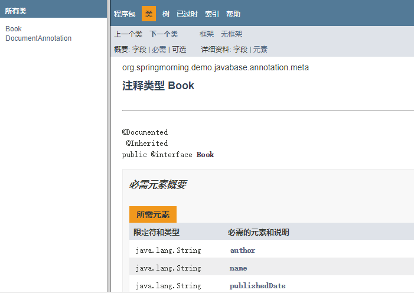
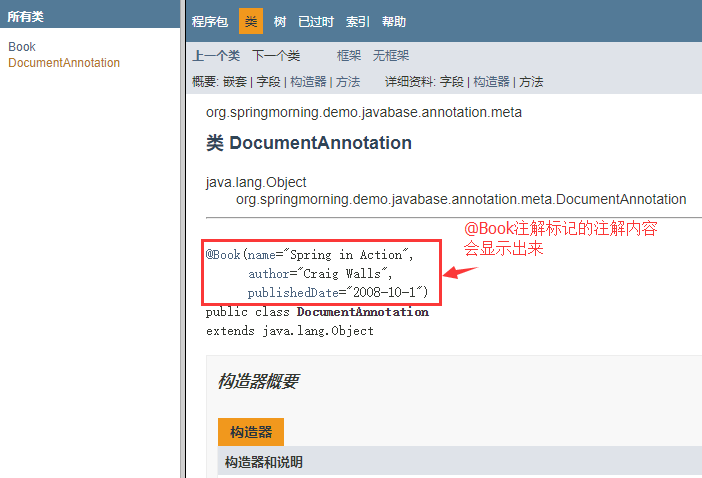

## java注解

#### 元注解

- @Retetion，设置保留期，取值如下

  - RetentionPolicy.SOURCE 注解只在源码阶段保留，在编译器进行编译时它将被丢弃忽视。
  - RetentionPolicy.CLASS 注解只被保留到编译进行的时候，它并不会被加载到 JVM 中。
  - RetentionPolicy.RUNTIME 注解可以保留到程序运行的时候，它会被加载进入到 JVM 中，所以在程序运行时可以获取到它们。

  源代码级别的注解有两个意图, 一是作为文档的补充, 给人看的, 比如Override注解, 二是作为源代码生成器(java和android都有注解处理器APT)的材料，比如lombok。

  同样字节码级别的注解, 可以作为字节码修改, **插桩**, 代理的依据, 可以使用aspectj, **asm**等工具进行字节码修改. 比如一些模块间调用, 如果你直接写代码, 会导致耦合, 此时可以加入一个注解, run一下asm这样的工具, 将注解标注的方法字段以generate的方式插入进去。应用场景：**无痕埋点**，**性能监控**

  运行时级别的注解, 显然是用于反射后参与某些业务逻辑用的, 比如spring依赖注入。

- @Target， 指定注解可以被标注在哪里，取值如下：
  - ElementType.ANNOTATION_TYPE 可以给一个注解进行注解
  - ElementType.CONSTRUCTOR 可以给构造方法进行注解
  - ElementType.FIELD 可以给属性进行注解
  - ElementType.LOCAL_VARIABLE 可以给局部变量进行注解
  - ElementType.METHOD 可以给方法进行注解
  - ElementType.PACKAGE 可以给一个包进行注解
  - ElementType.PARAMETER 可以给一个方法内的参数进行注解
  - ElementType.TYPE 可以给一个类型进行注解，比如类、接口、枚举、注解

- @Document， 该注解标记的元素，javadoc工具在生成文档时，会将注解信息包含在javadoc中

  例如：

  ~~~java
  // 定义一个@Document标注的@Book注解
  package org.springmorning.demo.javabase.annotation.meta;
  
  @Documented
  @Inherited
  public @interface Book {
      //书名
      String name();
      //出版日期
      String publishedDate();
      //作者
      String author();
  }
  
  // 使用@Book注解标注DocumentAnnotation类
  @Book(
          name = "Spring in Action",
          author = "Craig Walls",
          publishedDate = "2008-10-1"
  )
  public class DocumentAnnotation {}
  ~~~

  在项目的src\main\java目录下：

  javadoc -d D:\doc org.springmorning.demo.javabase.annotation.meta -encoding utf-8 -charset utf-8

  说明：

  -d D:\doc 表示：doc文件输入目录为D盘的doc文件夹；

  org.springmorning.demo.javabase.annotation.meta 表示此包中所有类需要生成java doc html文件；

  -encoding utf-8 表示：java代码采用的是utf-8字符编码编写的；

  -charset utf-8 表示：java doc html文件为utf-8字符编码。

  

  

  

  

  如果@Book注解没有被@Document标记，那么被@Book注解标记的DocumentAnnotation类的注解信息就不会包含在java doc html文档

  

- @Repeatable

- @Inherited，指定该注解是可以被继承的。

  ~~~java
  @Inherited
  @Retention(RetentionPolicy.RUNTIME)
  public @interface Test {}
  
  @Test
  public class A{}
  
  public class B extends A{}
  
  // 注解Test被元注解@Inherited标注，说明@Test是可以继承的。
  // @Test标注在了class A上， 并且class B继承了class A
  // class B也被@Test标注了
  ~~~

#### 注解的成员变量

注解只有成员变量，没有成员方法

~~~~java
@Target(ElementType.TYPE)
@Retention(RetentionPolicy.RUNTIME)
public @interface TestAnnotation {
    int id() default 1;
    String msg() default "hello world";
}
~~~~

- 当注解中只有一个名字为value的属性时，应用时可以直接将属性值填到括号里
- 当注解中没有任何属性时，应用时可以不添加括号，例@Test

