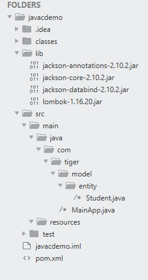
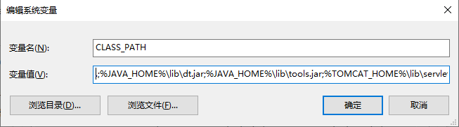
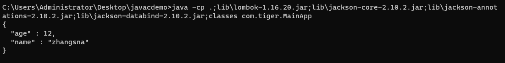
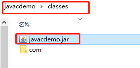

## java注解

#### 元注解

- @Retetion，设置保留期，取值如下

  - RetentionPolicy.SOURCE 注解只在源码阶段保留，在编译器进行编译时它将被丢弃忽视。
  - RetentionPolicy.CLASS 注解只被保留到编译进行的时候，它并不会被加载到 JVM 中。
  - RetentionPolicy.RUNTIME 注解可以保留到程序运行的时候，它会被加载进入到 JVM 中，所以在程序运行时可以获取到它们。

  源代码级别的注解有两个意图, 一是作为文档的补充, 给人看的, 比如Override注解, 二是作为源代码生成器(java和android都有注解处理器APT)的材料，比如lombok。

  同样字节码级别的注解, 可以作为字节码修改, **插桩**, 代理的依据, 可以使用aspectj, **asm**等工具进行字节码修改. 比如一些模块间调用, 如果你直接写代码, 会导致耦合, 此时可以加入一个注解, run一下asm这样的工具, 将注解标注的方法字段以generate的方式插入进去。应用场景：**无痕埋点**，**性能监控**

  运行时级别的注解, 显然是用于反射后参与某些业务逻辑用的, 比如spring依赖注入。

- @Target， 指定注解可以被标注在哪里，取值如下：
  - ElementType.ANNOTATION_TYPE 可以给一个注解进行注解
  - ElementType.CONSTRUCTOR 可以给构造方法进行注解
  - ElementType.FIELD 可以给属性进行注解
  - ElementType.LOCAL_VARIABLE 可以给局部变量进行注解
  - ElementType.METHOD 可以给方法进行注解
  - ElementType.PACKAGE 可以给一个包进行注解
  - ElementType.PARAMETER 可以给一个方法内的参数进行注解
  - ElementType.TYPE 可以给一个类型进行注解，比如类、接口、枚举、注解

- @Document， 该注解标记的元素，javadoc工具在生成文档时，会将注解信息包含在javadoc中

  例如：

  ~~~java
  // 定义一个@Document标注的@Book注解
  package org.springmorning.demo.javabase.annotation.meta;
  
  @Documented
  @Inherited
  public @interface Book {
      //书名
      String name();
      //出版日期
      String publishedDate();
      //作者
      String author();
  }
  
  // 使用@Book注解标注DocumentAnnotation类
  @Book(
          name = "Spring in Action",
          author = "Craig Walls",
          publishedDate = "2008-10-1"
  )
  public class DocumentAnnotation {}
  ~~~

  在项目的src\main\java目录下：

  javadoc -d D:\doc org.springmorning.demo.javabase.annotation.meta -encoding utf-8 -charset utf-8

  说明：

  -d D:\doc 表示：doc文件输入目录为D盘的doc文件夹；

  org.springmorning.demo.javabase.annotation.meta 表示此包中所有类需要生成java doc html文件；

  -encoding utf-8 表示：java代码采用的是utf-8字符编码编写的；

  -charset utf-8 表示：java doc html文件为utf-8字符编码。

  

  

  

  

  如果@Book注解没有被@Document标记，那么被@Book注解标记的DocumentAnnotation类的注解信息就不会包含在java doc html文档

  

- @Repeatable

- @Inherited，指定该注解是可以被继承的。

  ~~~java
  @Inherited
  @Retention(RetentionPolicy.RUNTIME)
  public @interface Test {}
  
  @Test
  public class A{}
  
  public class B extends A{}
  
  // 注解Test被元注解@Inherited标注，说明@Test是可以继承的。
  // @Test标注在了class A上， 并且class B继承了class A
  // class B也被@Test标注了
  ~~~

#### 注解的成员变量

注解只有成员变量，没有成员方法

~~~~java
@Target(ElementType.TYPE)
@Retention(RetentionPolicy.RUNTIME)
public @interface TestAnnotation {
    int id() default 1;
    String msg() default "hello world";
}
~~~~

- 当注解中只有一个名字为value的属性时，应用时可以直接将属性值填到括号里
- 当注解中没有任何属性时，应用时可以不添加括号，例@Test


## 记一次手动编译java项目

#### 项目目录



项目名称为javacdemo，目录如下：

- classes主要用于放置编译后的class文件
- lib主要放置项目引用的jar包
- src按照maven项目的格式
- pom.xml可以忽略，因为要手动编译

两个java文件如下：

Student.java

~~~java
package com.tiger.model.entity;

public class Student {
    private Integer age;
    private String name;
    public Integer getAge() {
        return age;
    }
    public void setAge(Integer age) {
        this.age = age;
    }
    public String getName() {
        return name;
    }
    public void setName(String name) {
        this.name = name;
    }
    public Student(Integer age, String name) {
        this.age = age;
        this.name = name;
    }
}
~~~

Main.java

~~~java
package com.tiger;

import com.fasterxml.jackson.core.JsonProcessingException;
import com.fasterxml.jackson.databind.ObjectMapper;
import com.tiger.model.entity.Student;

public class MainApp {

    public static void main(String[] args) {
        try {
            Student a = new Student(12, "zhangsna");
            ObjectMapper objectMapper = new ObjectMapper();
            String s = objectMapper.writerWithDefaultPrettyPrinter().writeValueAsString(a);
            System.out.println(s);
        } catch (JsonProcessingException e){
            e.printStackTrace();
        }

    }
}
~~~

MainApp引用了jackson相关类和com.tiger.model.entity.Student.java

#### 编译

<font color=red>windows下请使用cmd进行编译，不要使用power shell，貌似是指定-cp时，windwos下多个路径在使用；分开，在linux下使用：隔开。但是power shell输入；认为命令已经结束， 输入：会认为多个路径是同一个路径。</font>

cd到项目根目录下：


编译项目：

~~~shell
javac -d classes -cp lib\*;src\main\java -verbose src\main\java\com\tiger\MainApp.java
~~~

-d 指定项目编译后的class的存放地址。

-cp指定classpath路径，需要用到jar包都存放在lib文件夹下。这里我们使用到了jackson的一些jar包，放在了javacdemo\lib目录下，多个jar包可以一一指定，也可以使用通配符*，他将匹配lib下所有的.jar和.JAR文件。

同时还要指定src\main\java目录，因为编译需要的Student.java存放在该目录下。

~~~shell
lib\*;src\main\java
~~~


-verbose表示输出详细的编译信息。

编译之后查看classes目录


#### 关于javac命令中classpath的作用

当执行javac命令的时候（cp后面的.表示当前目录，为了说明原理添加上，在本例中没什么用）：

~~~shell
javac -d classes -cp .;lib\*;src\main\java -verbose src\main\java\com\tiger\MainApp.java
~~~

javac首先找到并读取src\main\java\com\tiger\MainApp.java（这个就是命令后面指定的）。但是MainApp.java导入了

```
import com.fasterxml.jackson.core.JsonProcessingException;
import com.fasterxml.jackson.databind.ObjectMapper;
import com.tiger.model.entity.Student;
```

这个时候java编译器需要找到这三个类才能编译MainApp，话句话说就是MainApp的编译需要这三个类的参与，但是要去哪里找呢？

>  没有CLASSPATH环境变量，也没有使用-cp或者-classpath的话，默认从当前路径寻找。

但是当前路径是哪个路径的？其实这个命令就是你执行javac命令的路径，我是在C:\Users\Administrator\Desktop\javacdemo目录下执行的javac命令，所以当前路径就是C:\Users\Administrator\Desktop\javacdemo。<font color=red>java编译器查找当前路径+包路径（把需要导入的类的包名中的.转换为路径分隔符）下有没有对应的class文件或者java文件。</font>具体来说就是查找C:\Users\Administrator\Desktop\javacdemo\com\tiger\model\entity\Student.java(Student.class)和C:\Users\Administrator\Desktop\javacdemo\com\fasterxml\jackson\databind\ObjectMapper.java(ObjectMapper.class)。JsonProcessingException类同理。如果没有找到对应class或者java文件报错。找到一个java和class文件，对比两者新旧，java文件新的话将该java文件进行编译并使用编译后的class文件，class文件新的话直接使用该class文件。如果找到多个java文件或者多个class文件报错。

如果我们不指定CLASSPATH环境变量的话，也不使用-cp或者-classpath的话肯定是编译不成功的。因为找不到。

> CLASSPATH的作用与-cp和-classpath的作用相同。使用了-cp或者-classpath，会覆盖CLASSPATH环境变量。

如果你在环境变量中设置了classpath的话同时没有使用-cp和-classpath的话，java编译器会根据CLASSPATH环境变量来查找上述的三个文件，

而如果你使用了-cp或者-classpath的话，java编译器就会根据来你指定的路径来查找上述的三个类。

那么具体怎么个查找法呢？这里以查找Student类为例。

~~~shell
javac -d classes -cp .;lib\*;src\main\java -verbose src\main\java\com\tiger\MainApp.java
~~~

- 根据-cp的指定的路径，首先会查找当前目录下（注意-cp后面的小点，他表示当前路径）是否有Student类的java文件或者class文件，具体就是C:\Users\Administrator\Desktop\javacdemo\com\tiger\model\entity\Student.java(Student.class)文件。
- 然后查找lib下的jackson-core-2.10.2.jar包里面有没有com\tiger\model\entity\Student.java(Student.class)。其实jar包可以看作另类的压缩包，解压后可以看到

- 然后再查找lib下的jackson-annotations-2.10.2.jar包中有没有com\tiger\model\entity\Student.java(Student.class)。
- 同理再查找jackson-detabind-2.10.2.jar。
- 最后查找src\main\java\com\tiger\model\entity\Student.java(Student.class)

找到一个java和class文件，对比两者新旧，java文件新的话将该java文件进行编译并使用编译后的class文件，class文件新的话直接使用该class文件。如果找到多个java文件或者多个class文件报错。

#### java命令中classpath的作用

javac命令中classpath的作用大体上与java命令中的classpath相同，但是要注意一点，

~~~shell
javac -d classes -cp .;lib\*;src\main\java -verbose src\main\java\com\tiger\MainApp.java
~~~

~~~shell
java -cp .;lib\*;classes -verbose com.tiger.MainApp
~~~

上述两个命令，javac指定需要编译的文件为src\main\java\com\tiger\MainApp.java，javac会查找当前路径下的src\main\java\com\tiger\MainApp.java，这和classpath没什么关系，就跟平常的shell命令一样。而对于MainApp中的import的类，java编译器会根据上面的方法在classpath路径中查找。

<font color=red>但是对于java命令指定要运行的com.tiger.MainApp类，他不会把com.tiger转换为com\tiger，然后在当前路径下查找com\tiger\MainApp.class。他会根据classpath去查找com.tiger.MainApp,就像是被import的类一样。</font>对于刚学习的人，这里会有点想当然，然后发现跑不去来，特别记录下。


#### 运行

同样在项目根目录下执行运行命令

~~~shell
java -cp lib\*;classes -verbose com.tiger.MainApp
~~~

-cp指定了运行需要的jar包。因为com.tiger.MainApp是在classes文件夹下，所以要添加classes为classpath，不添加此路径会找不到MainApp类。

-verbose输入详细信息，因为截屏，我没有使用该选项，需要查看过程的同学可以使用该选项



#### 打包成普通jar

> 打包

再项目根目录下运行:

~~~shell
# 切换到classes下
cd classes
jar -cvf javacdemo.jar .
~~~

-c 创建一个jar包

-f 指定jar包的文件名

-v 生成详细的报造，并输出至标准设备


查看classes下,已经生产了javacdemo.jar文件



> 运行

在classes目录删除com文件夹，防止其中的classes干扰我们运行jar包。 然后运行：


~~~shell
# 切换回项目根目录下
cd ..
java -cp lib\*;classes\javacdemo.jar com.tiger.MainApp
~~~

这里指定的classpath中需要有classes\javacdemo.jar，因为com.tiger.MainApp现在javacdemo.jar包中了。


#### 打包成可执行jar包

> 打包

~~~shell
# 编译项目，放在classes下
javac -d classes -cp lib\*;src\main\java src\main\java\com\tiger\MainApp.java

# 把根目录下面的lib里面的jar包拷贝到classes目录下
xcopy lib classes
~~~


~~~shell
# 切换到classes下
cd classes
# 解压三个jar包, 获取需要的class文件
jar -xf jackson-annotations-2.10.2.jar
jar -xf jackson-core-2.10.2.jar
jar -xf jackson-databind-2.10.2.jar
# 删除解压出来的多余的文件
del *.jar
rd /s META-INF
del module-info.class
~~~

这时候已经把所有运行需要的类弄到了classes下。


执行打包命令

~~~shell
jar -cvf javacdemo.jar .
~~~

编辑生成的javacdemo.jar里面的META-INF下的MANI-FEST.MF文件, jar包本质上就是个压缩包, 怎么编辑压缩包里面的文件就不说了

在其中添加一行, <font color=red>注意冒号后面有空格, 要保留两行空白行, 如图片所述, 关于MANI-FEST.MF文件网上挺多坑的，可以查下。</font>

这一行的作用就是<font color=red>告诉java你要运行的主类是哪一个。</font>

~~~text
Main-Class: com.tiger.MainApp
~~~


这时候你就可以把jar包复制到任何一个目录下，执行该jar包只需要


## jar命令详解

jar命令格式：`jar ` `{c t x u f }` `[ v m e 0 M i ]` `[-C 目录]` `文件名...`

其中{ctxu}这四个参数必须选选其一。[v f m e 0 M i ]是可选参数，文件名也是必须的。

-c 创建一个jar包
-t 显示jar中的内容列表
-x 解压jar包
-u 添加文件到jar包中
-f 指定jar包的文件名
-v 生成详细的报造，并输出至标准设备
-m 指定manifest.mf文件.(manifest.mf文件中可以对jar包及其中的内容作一些一设置)
-0 产生jar包时不对其中的内容进行压缩处理
-M 不产生所有文件的清单文件(Manifest.mf)。这个参数与忽略掉-m参数的设置
-i  为指定的jar文件创建索引文件
-C 表示转到相应的目录下执行jar命令,相当于cd到那个目录，然后不带-C执行jar命令

> 创建jar包

~~~shell
jar -cf hello.jar hello
~~~

根据hello目录生成一个hello.jar包

> 创建并显示打包过程

~~~shell
jar -cvf hello.jar hello
~~~

根据hello目录生成一个hello.jar包, 并显示创建过程

> 显示jar包内容

~~~shell
jar -tvf hello.jar
~~~

> 解压jar包

~~~shell
jar -xvf hello.jar
~~~

> 创建jar包, 并指定MANIFEST.MF文件

~~~shell
jar -cvfm hello.jar MANIFEST.MF hello
~~~

创建该jar包后, jar包中的MANIFEST.MF文件与指定的文件内容相同

> 创建不包含META-INF目录及MANIFEST.MF文件的jar包

~~~shell
jar -cvfM hello.jar hello
~~~

> -C选项

~~~shell
jar cvfm hello.jar mymanifest.mf -C hello/
~~~

表示切换到hello目录下然后再执行jar命令

