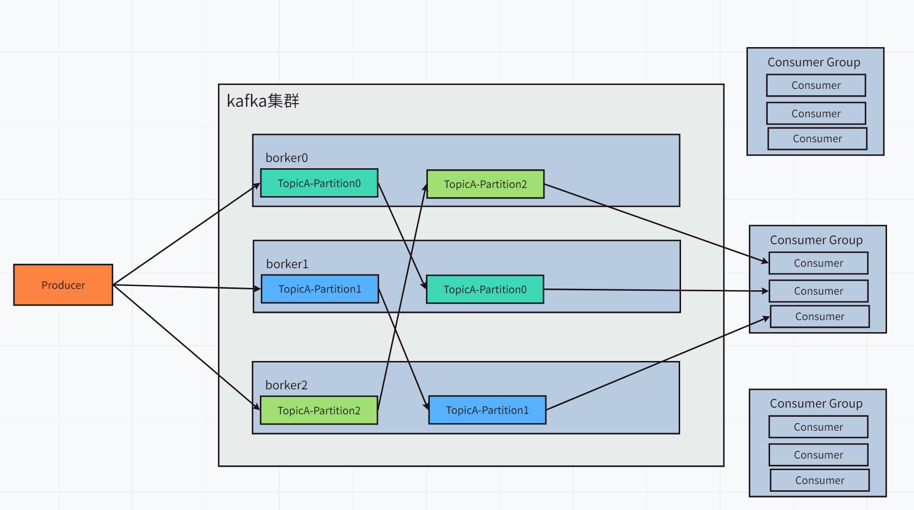
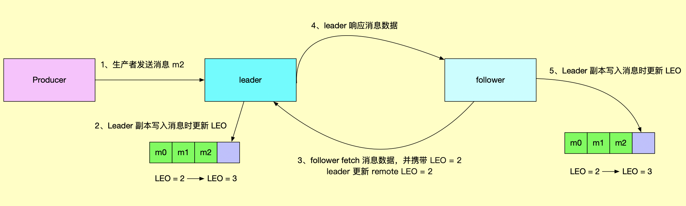

## kafka eagle安装与使用

#### 1. kafka eagle下载

参考官网：https://ke.smartloli.org/

解压

````shell
tar -zxf kafka-eagle-bin-1.2.4.tar.gz -C ./
````

#### 2. 修改kafka启动命令

因为eagle是通过jmx来拉去数据，启动时必须开启kafka的jmx选项，而kafka-server-start.sh中默认并没有开启jmx选项，所以修改kafka-server-start.sh

```shell
# 修改 kafka-server-start.sh 命令中
if [ "x$KAFKA_HEAP_OPTS" = "x" ]; then
export KAFKA_HEAP_OPTS="-Xmx1G -Xms1G"
fi
# 为
if [ "x$KAFKA_HEAP_OPTS" = "x" ]; then
    export KAFKA_HEAP_OPTS="-server -Xms2G -Xmx2G -XX:PermSize=128m
-XX:+UseG1GC -XX:MaxGCPauseMillis=200 -XX:ParallelGCThreads=8 -
XX:ConcGCThreads=5 -XX:InitiatingHeapOccupancyPercent=70"
    export JMX_PORT="9999"
    #export KAFKA_HEAP_OPTS="-Xmx1G -Xms1G"
fi
```

#### 3. 添加kafka eagle环境变量

因为eagle在启动过程中需要读取环境变量，不配置无法启动

~~~~shell
vim /etc/profile

# 在文件末尾添加
# /opt/hadoop/kafka-eagle表示当前eagle的位置
export KE_HOME=/opt/hadoop/kafka-eagle 
export PATH=$PATH:$KE_HOME/bin
~~~~

#### 4. 修改eagle配置文件

~~~properties
# 设置kafka连接的zookeeper集群

# 将文件中的multi zookeeper&kafka cluster list内容修改如下
kafka.eagle.zk.cluster.alias=cluster1
cluster1.zk.list=hadoop102:2181,hadoop103:2181,hadoop104:2181

# 有多套集群可以逗号隔开
kafka.eagle.zk.cluster.alias=cluster1,cluster2
cluster1.zk.list=hadoop102:2181,hadoop103:2181,hadoop104:2181
cluster2.zk.list=hadoop105:2181,hadoop106:2181,hadoop107:2181

~~~
~~~properties
# 注释掉kafka offset storage中的zk那一行
# 表示kafka offset的存储位置
# 这里我们使用的是新版本，存储在kafka中，所以注释掉

cluster1.kafka.eagle.offset.storage=kafka
# cluster1.kafka.eagle.offset.storage=zk
~~~
~~~properties
# 修改文件中enable kafka metrics部分
# 开启图表，修改下列为true
kafka.eagle.metrics.charts=true
~~~

~~~properties
# eagle也要使用数据库存储信息
# 修改kafka jdbc driver address内容如下
# eagle会自动创建数据库
kafka.eagle.driver=com.mysql.jdbc.Driver
kafka.eagle.url=jdbc:mysql://hadoop102:3306/ke?useUnicode=true&ch
aracterEncoding=UTF-8&zeroDateTimeBehavior=convertToNull
kafka.eagle.username=root
~~~


#### 5. 启动eagle

~~~shell
cd ${KE_HOME}/bin

# 添加执行权限
chmod +x ke.sh

# 启动eagle
# 启动后控制台将打印访问地址，登录账户和密码
./ke.sh start

# 关闭eagle
./ke.sh stop

# 查看eagle状态
./ke.sh status
~~~


#### kafka命令行

> kafka启动关闭

```shell
# 启动kafka并堵塞终端
bin/kafka-server-start.sh config/server.properties

# 后台启动kafka
bin/kafka-server-start.sh -daemon config/server.properties

# 关闭kafka
bin/kafka-server-stop.sh stop
```

> topic命令相关

~~~~shell
# 查看当前所有topic
bin/kafka-topics.sh --zookeeper localhost:2181 --list

# 创建topic
bin/kafka-topics.sh --zookeeper localhost:2181 --create --replication-factor 3 --partitions 1 --topic topicName

# 删除副本
bin/kafka-topics.sh --zookeeper localhost:2181 --delete --topic topicName

# 查看topic详情
bin/kafka-topics.sh --zookeeper localhost:2181 --describe --topic topicName

# 修改topic
bin/kafka-topics.sh --zookeeper localhost:2181 --alter --topic topicName --partitions 6
~~~~

> 生产者命令相关

~~~shell
# 生产消息
bin/kafka-console-producer.sh --brokerlist localhost:9092 --topic topicName
> hello world
> hahahah
~~~


> 消费者命令相关

~~~shell
# 消费消息
# --from-beginning 从头消费，否则只能消费到这个消费者启动之后的消息
bin/kafka-console-consumer.sh --bootstrap-server localhost:9092 --from-beginning --topic topicName
~~~

新版本kafka将offset存在一个名为`_comsumer_offsets`的topic中， 该topic默认50个分区，1个副本。


## Kafka基础架构

一个topic存储一类消息, 一个topic分为多个partition, 其中一个为leader对外提供服务, **其他为follower不对外提供服务**, 只做数据冗余. 

partition数可以大于节点数, 这样多个分区会存储在相同的节点上

副本数不能大于节点数, 因为多个副本分布在同一台节点上没有意义

多个Consumer组成一个group对一个topic进行消费, 一个partition只能由一个group中的一个consumer同时进行消费, 不同group不影响

消费完的数据并不会删除, 只会记录当前group对topic的offset

zk中记录当前集群中节点的信息, 以及partition的相关信息

kafka2.8.0之前必须使用zk, 该版本开始可以不需要zk了, 采用kraft算法




#### 消费者分区策略

参考[https://blog.csdn.net/qq_36951116/article/details/100863502](https://blog.csdn.net/qq_36951116/article/details/100863502)

1. **RoundRobin轮询策略**

   **分配策略**：一个消费者组中有多个消费者，一个消费者可以订阅多个主题。该策略会把一个消费者组中所有消费者指定的主题组合成并集，然后按照主题名＋分区号作为hash值进行排序，然后按照顺序轮询分配给组里面的所有消费者。

   

   假如当前有T1，T2两个主题，每个主题三个分区，分别为0，1，2。

   消费者A订阅了T1，B订阅了T2，且AB同属于一个消费者组G。

   那么G这个组就会消费A∪B = {T1, T2}，共两个主题，六个分区。

   

   该策略会把六个分区按照主题名+分区号作为hash值进行排序，假设排序完是T1-1,T1-0,T2-2,T1-2,T2-1,T2-0共六个。然后按照**轮询**分配， 即A分配T1-1，T2-2, T2-1。B分配T1-0，T1-2，T2-0。

   

   **优点**：同一个消费者组的不同消费者之间所消费的分区数量相差最大不会超过1，比较均衡。在上述例子中，AB两个消费者的分区数量一致。

   **缺点**：一个消费者组中的消费者各自指定消费的主题并不会由这个消费者消费，而是拿出来作为整个组要消费的主题，导致消费到同组的其他消费者所指定的主题分区数据。在上述例子中，A可能会消费到T2主题的分区，B也可能会消费到T1主题的分区。而A并没有指定要消费T2分区，B也没有指定要消费T1分区。

   **适用场景**：**在同一个消费者组中的所有消费者各自指定要消费的主题都是一样的情况下**，使用轮询分配更好，不会导致不同消费者之间所消费的分区数差距过大(最大差距不会超过1）。


2. **Range策略（默认分区策略）**

   **分区策略**：针对每个主题进行分配。同一个消费者组中有哪些成员指定了相同的主题，则由这些成员去消费这些分区，其他未指定该主题的成员不会消费到该分区。

   

   假设有主题T1和T2和T3，各自三个分区(0，1,2)。

   消费者组G，有两个消费者A和B。

   其中A指定要消费T1，T2和T3，B要消费T2和T3。

   

   **那么按照每个主题，一个主题一个主题分配给A和B进行消费。同一个组内的消费者也会有排序的，按先后顺序分配消费的分区**，假设A先于B。

   1. 先分配T1主题。由于T1只有A消费，那么就直接T1-0，T1-1，T1-2都分配给A消费了。
   2. 分配主题T2。T2有A和B一起消费，A和B属于同一个消费者组。T2-0，T2-1，T2-2三个分区中，会按照**range**规则把三个分区分配给A和B两个消费者。因为A先与B分配，所以A分配到T2-0，T2-1。B可能分配到T2-2。
   3. 分配T3主题，同上述分配T2主题策略，A分配到T3-0，T3-1。B分配到T3-2。

   

   **优点**：同一个消费者组的不同消费者可以指定自己单独需要消费的主题。只有当其他消费者与当前消费者指定的主题相同时，才会一起分配这个主题的不同分区。**消费者不会消费到自己没有指定的主题。**在上面例子中，T1，T3分别分配给了A，B。而只有T2是AB一起分配。

   **缺点**：当同一个消费者组中多个消费者消费的主题相同时，可能会导致不同消费者之间的分区数差异巨大。上面例子中A配到了T2和T3共四个分区，B分配到了T2和T3共两个分区，两者差异2。

   **适用场景**：同一个消费者组中的不同消费者指定不同的主题进行消费。

   

3. 消费者分区分配的时机： 消费者数量改变（即使消费者数量多余主题分区数），订阅的主题变化，主题的分区数变化。

   

消息的发送涉及到两个线程, 主线程和发射线程

在主线程中, 调用kafkaProducer.send()方法发送消息, 消息经过拦截器, 序列化器, 分区器后进入RecordAccumulator消息收集器

在消息收集器中, 为每个分区都维护着一个对应的双端队列Deque, 队列中的内容是ProducerBatch, 一个ProducerBatch是一批消息.消息收集器中可以保存的消息大小由buffer.memory控制, 默认为32MB. 

如果生产者发送的消息过快, 或者对应的分区过多, 此时消息收集器的空间不够用, KafkaProducer 的 send() 方法会被阻塞，堵塞时间超过max.block.ms 的配置后会抛出异常，此参数的默认值为60000，即60秒。

当一个消息到达对应的Deque后, 会从这个双端队列的尾部获取一个 ProducerBatch（如果没有则新建），查看 ProducerBatch 中是否还可以写入这个 ProducerRecord，如果可以则写入，如果不可以则需要创建一个新的 ProducerBatch。

在新建 ProducerBatch 时评估这条消息的大小是否超过 batch.size 参数的大小，如果不超过，那么就以 batch.size 参数的大小来创建 ProducerBatch，这样在使用完这段内存区域之后，可以通过 BufferPool 的管理来进行复用；如果超过，那么就以消息的大小来创建 ProducerBatch，这段内存区域不会被复用。


RecordAccumulator是一个CopyOnWriteMap的结构(jdk中没有, 自己自定义的), 理由如下:

- 主要数据是topic分区到Deque的对应关系, 所以是map结构, 并且要保证线程安全
- 读多写少, 因为每次来一条消息, 都要根据分区获取对应的Deque, 只有在对应分区没有对应的Deque的时候才会新添加一个key, value.


#### [kafka ISR](https://objcoding.com/2019/11/05/kafka-isr/)

​    ISR（in-sync replica)就是kafka为某个分区维护的一组同步集合，即每个分区都有自己的一个 ISR 集合，处于 ISR 集合中的副本，意味着 follower 副本与 leader 副本保持同步状态，只有处于 ISR 集合中的副本才有资格被选举为 leader。一条 Kafka 消息，只有被 ISR 中的副本都接收到，才被视为“已同步”状态。

follwer 副本与 leader 副本之间的数据同步流程如下：



从上图可看出，leader 的 remote LEO 的值相对于 follower LEO 值，滞后一个 follower RPC 请求，remote LEO 决定 leader HW 值的大小，详情请看「[图解：Kafka 水印备份机制](https://mp.weixin.qq.com/s/WSdebVgIpvJ_c4DpFYqO4w)」。

这也就意味着，leader 副本永远领先 follower 副本，且各个 follower 副本之间的消息最新位移也不尽相同，Kafka 必须要定义一个落后 leader 副本位移的范围，使得处于这个范围之内的 follower 副本被认为与 leader 副本是处于同步状态的，即处于 ISR 集合中。

**（1）0.9.0.0 版本之前的设计**

0.9.0.0 版本之前判断副本之间是否同步，主要是靠参数 replica.lag.max.messages 决定的，即允许 follower 副本落后 leader 副本的消息数量，超过这个数量后，follower 会被踢出 ISR。

replica.lag.max.messages 也很难在生产上给出一个合理值，如果给的小，会导致 follower 频繁被踢出 ISR，如果给的大，broker 发生宕机导致 leader 变更时，肯能会发生日志截断，导致消息严重丢失的问题。

可能你会问，给个适中的值不就行了吗？关键在这里，怎样才是适中？如何界定？

假设现在某个 Kafka 集群追求高吞吐量，那生产者的 batch.size 就会设置得很大，每次发送包含的消息量很多，使消息发送的吞吐量大大提高，如果此时 min.insync.replicas=1，从上图可看出，生产者发送消息保存到 leader 副本后就会响应成功，表示许诺用户保存到至少一个副本的要求已经达到，消息已经成功发送。那问题来了，由于 follower 副本同步 leader 副本的消息是不断地发送 fetch 请求，此时如果 leader 一下子接收到很多消息，就会导致 leader 副本与 follower 副本的消息数量相差很大，如果此时这个差数大于 replica.lag.max.messages 的值，follower 副本就会被踢出 ISR，因此，该集群需要把 replica.lag.max.messages 的值设置成很大才能够避免 follower 副本频繁被踢出 ISR。

所以说，replica.lag.max.messages 的设计是有缺陷的，当生产者发送消息量很大时，该值也需要相应调大，但就会造成消息严重丢失的风险。

有没有更好的解决方案？

**（2）0.9.0.0 版本之后的设计**

在 0.9.0.0 版本之后，Kafka 给出了一个更好的解决方案，去除了 replica.lag.max.messages，，用 replica.lag.time.max.ms 参数来代替，该参数的意思指的是允许 follower 副本不同步消息的最大时间值，即只要在 replica.lag.time.max.ms 时间内 follower 有同步消息，即认为该 follower 处于 ISR 中，这就很好地避免了在某个瞬间生产者一下子发送大量消息到 leader 副本导致该分区 ISR 频繁收缩与扩张的问题了。


#### kafka ack机制

Kafka的ack机制，指的是producer的消息发送确认机制，这直接影响到Kafka集群的吞吐量和消息可靠性。而吞吐量和可靠性就像硬币的两面，两者不可兼得，只能平衡。


|    ack    | 作用                                                         | 优点                             | 缺点         | 备注                                                         |
| :-------: | ------------------------------------------------------------ | -------------------------------- | ------------ | ------------------------------------------------------------ |
|     0     | producer发送消息之后不需要等待任何服务器的响应               | 此策略可以达到最大吞吐量         | 无法保障数据 | 发送消息时网络异常或者leader接收到消息还没来得及写入消息，或者leader写入成功follower还没有拉取之前崩溃会丢失数据 |
| 1（默认） | producer发送消息后，分区的leader将消息写入成功后，即发送成功响应 | 消息可靠性和吞吐量之间的折中选择 |              | leader写入成功follower还没有拉取之前崩溃会丢失数据           |
|  -1或all  | producer发送消息后，等待ISR中所有副本都成功写入消息后才发送成功的响应 | 最强可靠性                       | 效率低       | ISR中只有leader时，会退化成acks=1的情况                      |


#### 


#### 分区Leader选举策略，EOL，HW， isr


#### Controller

Kafka 集群中有一个 broker 会被选举为 Controller，负责管理集群 broker 的上下线，所有 topic 的分区副本分配和 leader 选举等工作。
Controller 的管理工作都是依赖于 Zookeeper 的。  


#### kafka自定义拦截器

- 创建拦截器需要实现ProducerInterceptor并实现其方法

  ~~~java
  public class SimpleInterceptor implements ProducerInterceptor {
  
      // 在kafkaProducer.send()方法执行执行，会先执行所有拦截器栈中的onSend方法
      public ProducerRecord onSend(ProducerRecord record) {
          return record;
      }
  
      // 消息发送成功或者失败时时，在调用callback之前调用。该方法运行在producer的IO线程中，因此不要放在该方法中放入很重的逻辑，会拖慢producer发送效率
      public void onAcknowledgement(RecordMetadata metadata, Exception exception) {
  
      // 调用生产者close方法时调用
      public void close() {
  
      }
  
      // 初始化数据时调用，获取配置信息
      public void configure(Map<String, ?> configs) {
  
      }
  }
  ~~~

- 配置拦截器到kafka中

  ~~~java
  // 设置多个拦截器时，会按顺序调用，因为拦截器是保存在list中的
  properties.put(ProducerConfig.INTERCEPTOR_CLASSES_CONFIG, Arrays.asList(
                  TimeIntercepter.class.toString(),
                  CounterInterceptor.class.toString()));
  ~~~


#### springboot集成kafka

- 导入依赖

  ~~~xml
  <dependency>
    <groupId>org.springframework.kafka</groupId>
    <artifactId>spring-kafka</artifactId>
    <version>2.2.6.RELEASE</version>
  </dependency>
  ~~~

- 添加配置

  ```properties
  spring.kafka.producer.bootstrap-servers=127.0.0.1:9092
  ```

- 创建topic

  ~~~java
  // 启动时自动创建
  @Configuration
  public class KafkaConfig {
      // 启动后没有的话自动创建topic，已有topic但是patition少于设定的数会自动增加
  	@Bean
  	public NewTopic topic2() {
  		return new NewTopic("topic-kl", 1, (short) 1);
  	}
      
      @Bean
  	public KafkaAdmin admin(KafkaProperties properties){
          // 该类可以控制spring对kafka的一些行为
  		KafkaAdmin admin = new KafkaAdmin(properties.buildAdminProperties());
          // 设置broker不可用时，spring是否启动失败，默认fasle
  		admin.setFatalIfBrokerNotAvailable(true);
          // 设置spring是否根据配置的bean自动创建topic，默认true。false的话需要调用显式initialize()方法才会创建上面定义的topic-k1。
          admin.setAutoCreate(true);
  		return admin;
  	}
  }
  ~~~

  ~~~java
  // 通过AdminClient手动创建
  @Autowired
  	private KafkaProperties properties;
  	@Test
  	public void testCreateToipc(){
  		AdminClient client = AdminClient.create(properties.buildAdminProperties());
  		if(client !=null){
  			try {
  				Collection<NewTopic> newTopics = new ArrayList<>(1);
  				newTopics.add(new NewTopic("topic-kl",1,(short) 1));
  				client.createTopics(newTopics);
  			}catch (Throwable e){
  				e.printStackTrace();
  			}finally {
  				client.close();
  			}
  		}
  	}
  ~~~

  ~~~java
      @Test
  	public void testCreateTopic(){
          // 通过命令行创建
  		String [] options= new String[]{
  				"--create",
  				"--zookeeper","127.0.0.1:2181",
  				"--replication-factor", "3",
  				"--partitions", "3",
  				"--topic", "topic-kl"
  		};
  		TopicCommand.main(options);
  	}
  ~~~

- 发送消息

  ~~~java
  	@Autowired
  	private KafkaTemplate<Object, Object> template;
      
  	@Test
  	public void send() {
  		this.template.send("topic_input", "message");
  	}
  
  	@Test
  	// 异步获取ack
  	public void send1() {
  		template.send("","").addCallback(new ListenableFutureCallback<SendResult<Object, Object>>() {
  			@Override
  			public void onFailure(Throwable throwable) {
  				......
  			}
  
  			@Override
  			public void onSuccess(SendResult<Object, Object> objectObjectSendResult) {
  				....
  			}
  		});
  	}
  
  	@Test
  	// 同步获取ack
  	public void send2() {
  		ListenableFuture<SendResult<Object,Object>> future = template.send("topic-kl","kl");
  		try {
  			SendResult<Object,Object> result = future.get();
              ...
  		}catch (Throwable e){
  			e.printStackTrace();
  		}
  	}
  ~~~

- 监听消息

  ~~~java
  // topicPartitions,显示的指定消费哪些Topic和分区的消息,设置每个Topic以及分区初始化的偏移量
  // 设置消费线程并发度
  // 设置消息异常处理器,errorHandler是spring中的beanName，且应该实现KafkaListenerErrorHandler接口。
  @KafkaListener(id = "webGroup", topicPartitions = {
  			@TopicPartition(topic = "topic1", partitions = {"0", "1"}),
  					@TopicPartition(topic = "topic2", partitions = "0",
  							partitionOffsets = @PartitionOffset(partition = "1", initialOffset = "100"))
  			},concurrency = "6",errorHandler = "myErrorHandler")
  	public String listen(String input) {
  		logger.info("input value: {}", input);
  		return "successful";
  	}
  
  
  @Service("myErrorHandler")
  public class MyKafkaListenerErrorHandler implements KafkaListenerErrorHandler {
  	Logger logger =LoggerFactory.getLogger(getClass());
  	@Override
  	public Object handleError(Message<?> message, ListenerExecutionFailedException exception) {
  		logger.info(message.getPayload().toString());
  		return null;
  	}
  	@Override
  	public Object handleError(Message<?> message, ListenerExecutionFailedException exception, Consumer<?, ?> consumer) {
  		logger.info(message.getPayload().toString());
  		return null;
  	}
  }
  ~~~

- 控制kafka listener的启动，停止，继续

  ~~~java
  	@Autowired
  	private KafkaListenerEndpointRegistry registry;
  
  	public void test(){
          // listenerID就是@KafkaListener中的id值“webGroup”
          registry.registry.getListenerContainer(listenerID).pause();
      }
  ~~~


