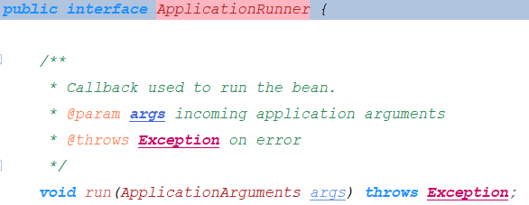
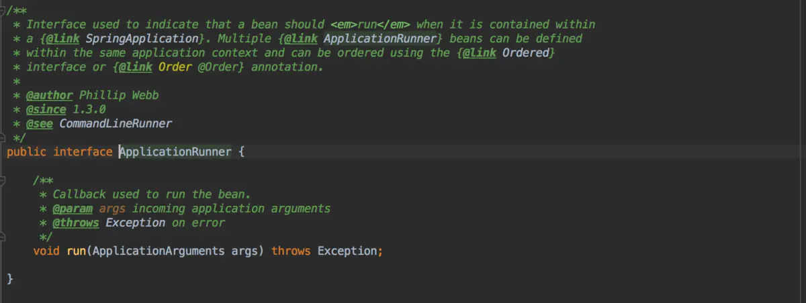

## Spring

### 关于BeanFactory的说明


用于访问Spring bean容器的根接口。是bean容器的基本客户端视图；

该接口的实现对象应该持有多个bean difinition。  每个bean difinition均由String名称唯一标识。

取决于bean的定义，*工厂将返回一个包含对象的独立实例*（原型设计模式），或者返回一个共享实例（Singleton设计模式）。

如果该接口的实现了是HierarchicalBeanFactory，此接口中的所有*操作还将检查父工厂。如果在此工厂实例中未找到bean，则*将询问直接的父工厂。该工厂实例中的Bean应该覆盖任何父工厂中同名的Bean。

BeanFactory实现应尽可能支持标准Bean生命周期接口。全套初始化方法及其标准顺序为：

```shell
# void setBeanName(String name); 让并可以知道自己的bean id。
# Spring 自动调用，并且会在完成Bean属性装配之后，且在调用任何Bean生命周期回调（初始化或者销毁）方法之前就调用这个方法
BeanNameAware's {@code setBeanName}

# void setBeanClassLoader(ClassLoader classLoader);
# 将当前 bean 对象相应的 ClassLoader 注入到当前对象实例中
BeanClassLoaderAware's {@code setBeanClassLoader}

# void setBeanFactory(BeanFactory beanFactory) throws BeansException;
# BeanFactory 容器会将自身注入到当前对象实例中，这样当前对象就会拥有一个 BeanFactory 容器的引用
BeanFactoryAware's {@code setBeanFactory}

EnvironmentAware's {@code setEnvironment}

EmbeddedValueResolverAware's {@code setEmbeddedValueResolver}

ResourceLoaderAware's {@code setResourceLoader}
(only applicable when running in an application context)

ApplicationEventPublisherAware's {@code setApplicationEventPublisher}
(only applicable when running in an application context)

MessageSourceAware's {@code setMessageSource}
(only applicable when running in an application context)

ApplicationContextAware's {@code setApplicationContext}
(only applicable when running in an application context)

ServletContextAware's {@code setServletContext}
(only applicable when running in a web application context)

# 后置处理器postProcessBeforeInitialization，通过实现BeanPostProcessors实现
{@code postProcessBeforeInitialization} methods of BeanPostProcessors

# bean 生命周期的初始化方法， 通过继承InitializingBean实现
InitializingBean's {@code afterPropertiesSet}

# bean 生命周期的初始化方法， 通过@Bean的initMethod属性实现
a custom init-method definition

# 后置处理器postProcessAfterInitialization，通过实现BeanPostProcessors实现
{@code postProcessAfterInitialization} methods of BeanPostProcessors
```

在关闭BeanFactory时，以下生命周期方法适用:


```
{@code postProcessBeforeDestruction} methods of DestructionAwareBeanPostProcessors

DisposableBean's {@code destroy}

a custom destroy-method definition
```

### 关于BeanDefinition的说明


### 关于spring的注解编程模型和@AliasFor注解的说明

https://github.com/spring-projects/spring-framework/wiki/Spring-Annotation-Programming-Model

https://github.com/spring-projects/spring-framework/wiki/MergedAnnotation-API-internals

https://docs.spring.io/spring-framework/docs/current/javadoc-api/ api文档搜索AliasFor的说明

https://www.jianshu.com/p/d6bba708100d

@see MergedAnnotations

@see AttributeMethods

@see AnnotationTypeMappings

@see AnnotationUtils

@see AnnotatedElementUtils

https://studyidea.cn/spring-stereotype-annotations

https://studyidea.cn/articles/2019/07/05/1562314284729.html

https://studyidea.cn/articles/2019/07/10/1562768280760.html

https://studyidea.cn/articles/2019/06/15/1560598141405.html↓↓↓


> Meta-Annotations（元注解）

**A *meta-annotation* is an annotation that is declared on another annotation**. An annotation is therefore *meta-annotated* if it is annotated with another annotation. For example, any annotation that is declared to be *documented* is meta-annotated with `@Documented` from the `java.lang.annotation` package.

标注在注解上的注解，类似于@Documented，@Target。包括@Component也是元注解，因为他可以标注在其他注解上。


> Stereotype Annotations（模式注解）

**A *stereotype annotation* is an annotation that is used to declare the role that a component plays within the application**. For example, the `@Repository` annotation in the Spring Framework is a marker for any class that fulfills the role or *stereotype* of a repository (also known as Data Access Object or DAO).

**`@Component` is a generic stereotype for any Spring-managed component**. Any component annotated with `@Component` is a candidate for component scanning. Similarly, any component annotated with an annotation that is itself meta-annotated with `@Component` is also a candidate for component scanning. For example, `@Service` is meta-annotated with `@Component`.

Core Spring provides several stereotype annotations out of the box, including but not limited to: `@Component`, `@Service`, `@Repository`, `@Controller`, `@RestController`, and `@Configuration`. `@Repository`, `@Service`, etc. are specializations of `@Component`.

模式注解：只要在相应的类上标注这些注解，就能成为 Spring 中组件(Bean)。@Component是spring中通用的模式注解。任何被@Component注解标注的注解都是模式注解（例如@Controller）。任何被@Component标注的注解标注的注解都是模式注解（例如@RestController被@Controller标注，而@Controller被@Component标注，所以@RestController也是模式注解）。


> Composed Annotations（复合注解）

**A *composed annotation* is an annotation that is *meta-annotated* with one or more annotations with the intent of combining the behavior associated with those meta-annotations into a single custom annotation**. For example, an annotation named `@TransactionalService` that is meta-annotated with Spring's `@Transactional` and `@Service` annotations is a composed annotation that combines the semantics of `@Transactional` and `@Service`. `@TransactionalService` is technically also a custom *stereotype annotation*.

复合注解：被一个或者多个元注解标注以结合这些元注解的特性到一个注解上。例如@RestController被@Controller和@ResponseBody标注以结合两者的特性。


> Attribute Overrides（属性覆写）

An ***attribute override*** is an annotation attribute that *overrides* (or *shadows*) an annotation attribute in a meta-annotation. Attribute overrides can be categorized as follows.

1. **Implicit Overrides**: given attribute `A` in annotation `@One` and attribute `A` in annotation `@Two`, if `@One` is meta-annotated with `@Two`, then attribute `A` in annotation `@One` is an *implicit override* for attribute `A` in annotation `@Two` based solely on a naming convention (i.e., both attributes are named `A`).

   ~~~java
   // HelloComponent的value属性隐式覆写Component的value属性
   @Component
   public @interface HelloComponent {
       String value() default "";
   }
   ~~~

2. **Explicit Overrides**: if attribute `A` is declared as an alias for attribute `B` in a meta-annotation via `@AliasFor`, then `A` is an *explicit override* for `B`.

   ~~~java
    @ContextConfiguration
    public @interface XmlTestConfig {
       @AliasFor(annotation = ContextConfiguration.class, attribute = "locations")
       String[] xmlFiles();
    }
   ~~~

3. **Transitive Explicit Overrides**: if attribute `A` in annotation `@One` is an explicit override for attribute `B` in annotation `@Two` and `B` is an explicit override for attribute `C` in annotation `@Three`, then `A` is a *transitive explicit override* for `C` following the [law of transitivity](https://en.wikipedia.org/wiki/Transitive_relation).

   ~~~java
   @RequestMapping
   public @interface CoolMapping{
       @AliasFor(annotation = RequestMapping.class, attribute = "path")
       String requestPath() default "";
   }
   
   @CoolMapping
   public @interface HotMapping{
       @AliasFor(annotation = CoolMapping.class, attribute = "requestPath")
       String hotRequestPath() default "";
   }
   ~~~


> Attribute Aliases属性别名

An ***attribute alias*** is an alias from one annotation attribute to another annotation attribute. Attributes within a set of aliases can be used interchangeably and are treated as equivalent. Attribute aliases can be categorized as follows.

1. **Explicit aliases within an annotation**: if two attributes in one annotation are declared as aliases for each other via `@AliasFor`, they are *explicit aliases*.

   In `@ContextConfiguration`, `value` and `locations` are explicit aliases for each other.

   ```java
    public @interface ContextConfiguration {
   
       @AliasFor("locations")
       String[] value() default {};
   
       @AliasFor("value")
       String[] locations() default {};
   
       // ...
    }
   ```

2. **Explicit alias for attribute in meta-annotation**: if the [`annotation()`](https://docs.spring.io/spring-framework/docs/current/javadoc-api/org/springframework/core/annotation/AliasFor.html#annotation--) attribute of `@AliasFor` is set to a different annotation than the one that declares it, the [`attribute()`](https://docs.spring.io/spring-framework/docs/current/javadoc-api/org/springframework/core/annotation/AliasFor.html#attribute--) is interpreted as an alias for an attribute in a meta-annotation (i.e., an explicit meta-annotation attribute override). This enables fine-grained control over exactly which attributes are overridden within an annotation hierarchy. In fact, with `@AliasFor` it is even possible to declare an alias for the `value` attribute of a meta-annotation.

   In `@XmlTestConfig`, `xmlFiles` is an explicit alias for `locations` in `@ContextConfiguration`. In other words, `xmlFiles` overrides the `locations` attribute in `@ContextConfiguration`.

   ```java
 @ContextConfiguration
    public @interface XmlTestConfig {
   
       @AliasFor(annotation = ContextConfiguration.class, attribute = "locations")
       String[] xmlFiles();
    }
   ```
   
2. **Implicit Aliases**: if two or more attributes in one annotation are declared as explicit overrides for the same attribute in a meta-annotation via `@AliasFor`, they are *implicit aliases*.

   In `@MyTestConfig`, `value`, `groovyScripts`, and `xmlFiles` are all explicit meta-annotation attribute overrides for the `locations` attribute in `@ContextConfiguration`. These three attributes are therefore also implicit aliases for each other.

   ~~~java
    @ContextConfiguration
    public @interface MyTestConfig {
   
       @AliasFor(annotation = ContextConfiguration.class, attribute = "locations")
       String[] value() default {};
   
       @AliasFor(annotation = ContextConfiguration.class, attribute = "locations")
       String[] groovyScripts() default {};
   
       @AliasFor(annotation = ContextConfiguration.class, attribute = "locations")
       String[] xmlFiles() default {};
    }
   ~~~

   

4. **Transitive Implicit Aliases**: given two or more attributes in one annotation that are declared as explicit overrides for attributes in meta-annotations via `@AliasFor`, if the attributes *effectively* override the same attribute in a meta-annotation following the [law of transitivity](https://en.wikipedia.org/wiki/Transitive_relation), they are *transitive implicit aliases*.

   In `@GroovyOrXmlTestConfig`, `groovy` is an explicit override for the `groovyScripts` attribute in `@MyTestConfig`; whereas, `xml` is an explicit override for the `locations` attribute in `@ContextConfiguration`. Furthermore, `groovy` and `xml` are transitive implicit aliases for each other, since **they both effectively override the `locations` attribute in `@ContextConfiguration`.（<font color=red>有效覆写即可传递，不管是显式覆写还是隐式覆写</font>）**

   ```java
    @MyTestConfig
    public @interface GroovyOrXmlTestConfig {
   
       @AliasFor(annotation = MyTestConfig.class, attribute = "groovyScripts")
       String[] groovy() default {};
   
       @AliasFor(annotation = ContextConfiguration.class, attribute = "locations")
       String[] xml() default {};
    }
   ```


> 属性覆写和属性别名的要求

- 覆写和别名的两个属性必须要有默认值，并且默认值一样
- 覆写和别名的两个属性类型必须一样
- AliasFor注解的annotation属性必须引用合适的注解，并且该注解必须标注在原来的注解上
- attribute不写的话表示引用同名的属性

~~~java
// requestPath和RequestMapping的path属性类型一样，必须要有默认值切默认值一样
// annotation必须引用RequestMapping注解，且@RequestMapping需要标注在CoolMapping上
// attribute不写的话表示引用同名的属性
@RequestMapping
public @interface CoolMapping{
    @AliasFor(annotation = RequestMapping.class, attribute = "path")
    String requestPath() default "";
}
~~~

>  Can `@AliasFor` be used with the `value` attributes for `@Component` and `@Qualifier`?

The short answer is: no.

The `value` attributes in `@Qualifier` and in *stereotype* annotations (e.g., `@Component`, `@Repository`, `@Controller`, and any custom stereotype annotations) *cannot* be influenced by `@AliasFor`. The reason is that the special handling of these `value` attributes was in place years before `@AliasFor` was invented. Consequently, due to backward compatibility issues it is simply not possible to use `@AliasFor` with such `value` attributes.

~~~java
// 这样设置的别名是无效的，beanName并不能设置bean的id
@Controller
public @interface BeautifulController{
    @AliasFor(annotation = Controller.class, attribute = "value")
    String beanName() default "";
}

// 这样是可以的，value属性可以设置bean的id，这属于隐式覆写
@Controller
public @interface BeautifulController{
    @AliasFor(annotation = Controller.class)
    String value() default "";
}
~~~


### 关于@ComponentScan的说明

- ComponentScan默认扫描当前类所在的包及其子包

- ComponentScan默认会将@Component及其衍生注解注册成bean

- **在同一个ComponentScan中，excludeFilters的优先级大于includeFilters**

  ~~~java
  // 在同一个@ComponentScan中，同一个类即被include又被exclude， exclude是优先include的，因为源码先处理exclude，所以以下结果为exclude掉了SimpleScopeMetadataResolver
  @ComponentScan(includeFilters = {
          @Filter(type = FilterType.ASSIGNABLE_TYPE, value = {SimpleScopeMetadataResolver.class}, excludeFilters = {
          @Filter(type = FilterType.ASSIGNABLE_TYPE, value = {SimpleScopeMetadataResolver.class})
  })
  public class SpringTestApplication{}
  ~~~

- **若存在多个ComponentScan，每个ComponentScan之间是单独扫描的，不存在联系**，即：

  ~~~java
  // 第一个ComponentScan exclude掉了SimpleScopeMetadataResolver， 但是第二个注解include了SimpleScopeMetadataResolver， 两者之间并无联系，所以整体的结果还是include了SimpleScopeMetadataResolver
  @ComponentScan(excludeFilters = {
          @Filter(type = FilterType.ASSIGNABLE_TYPE, value = {SimpleScopeMetadataResolver.class})
  })
  @ComponentScan(includeFilters = {
          @Filter(type = FilterType.ASSIGNABLE_TYPE, value = {SimpleScopeMetadataResolver.class})
  })
  public class SpringTestApplication{}
  ~~~

  **推荐一个@ComponentScan只进行一个包的包扫描处理。**

- useDefaultFilters等效于@ComponentScan(includeFilters = {@Filter(type = FilterType.ANNOTATION, value = {Component.class})})， 源码也是添加了一个includeFilters

- 对于@ComponentScan，@ComponentScan(excludeFilters = {
          @Filter(type = FilterType.ANNOTATION, value = {Component.class})
  })相当于把Component，Controller，Service，Repository及他们的衍生注解都排除了。

> 关于@Component的includeFilters和excludeFilters的说明

```java
@Retention(RetentionPolicy.RUNTIME)
@Target(ElementType.TYPE)
@Documented
@Repeatable(ComponentScans.class)
public @interface ComponentScan {

   // 通过字符串指定需要扫描的包，@ComponentScan("com.example")
   @AliasFor("basePackages")
   String[] value() default {};

   // see value
   @AliasFor("value")
   String[] basePackages() default {};

   /**
    通过class指定需要扫描的包，若存在com.example.SimpleScan类，则@ComponentScan(basePackageClasses = SimpleScan)表示需要扫描SimpleScan所在的包，即com.example包。
    推荐写一个类似于Serializable一样的无任何属性的接口，并通过basePackageClasses属性进行引用。
    该属性相比较于basePackages更加的安全，因为字符串可能出错。
    */
   Class<?>[] basePackageClasses() default {};

   // 使用该属性可以自定义检测到的Component的bean id
   Class<? extends BeanNameGenerator> nameGenerator() default BeanNameGenerator.class;

   // 使用该属性可以自定义检测到的Component的Scope
   Class<? extends ScopeMetadataResolver> scopeResolver() default AnnotationScopeMetadataResolver.class;

   /**
    * Indicates whether proxies should be generated for detected components, which may be
    * necessary when using scopes in a proxy-style fashion.
    * <p>The default is defer to the default behavior of the component scanner used to
    * execute the actual scan.
    * <p>Note that setting this attribute overrides any value set for {@link #scopeResolver}.
    * @see ClassPathBeanDefinitionScanner#setScopedProxyMode(ScopedProxyMode)
    */
   ScopedProxyMode scopedProxy() default ScopedProxyMode.DEFAULT;

   // 通过该属性可以使只有匹配该pattern的class文件才进行扫描, 默认为"**/*.class"
   String resourcePattern() default ClassPathScanningCandidateComponentProvider.DEFAULT_RESOURCE_PATTERN;

   // 开启该选项的话，会将扫描到的带有@Component及其衍生注解（@Controller,@Service,@Repository）的类自动注册成bean。关闭的话就不会将这些有注解的类注册成bean了，需要自己通过includeFilters属性进行添加。
    // 该属性相当于@ComponentScan(includeFilters = {
        @Filter(type = FilterType.ANNOTATION, value = {Component.class})
})
   boolean useDefaultFilters() default true;

   
   /**
   指定哪些类型适合进行组件扫描。
   进一步将候选组件的范围从basePackages中的所有内容basePackages到与给定过滤器匹配的基本包中的所有内容。
   默认过滤器也将应用指定的includeFilters 
   即使不匹配默认过滤器（即未使用@Component注释），也将    包括与指定过滤器匹配的指定基本软件包下的任何类型
   */
   Filter[] includeFilters() default {};

   Filter[] excludeFilters() default {};

   // 设置检测到的Component是否进行懒加载
   boolean lazyInit() default false;

   /**
    * Declares the type filter to be used as an {@linkplain ComponentScan#includeFilters
    * include filter} or {@linkplain ComponentScan#excludeFilters exclude filter}.
    */
   @Retention(RetentionPolicy.RUNTIME)
   @Target({})
   @interface Filter {

      /**
       * The type of filter to use.
       * <p>Default is {@link FilterType#ANNOTATION}.
       */
      FilterType type() default FilterType.ANNOTATION;

      @AliasFor("classes")
      Class<?>[] value() default {};

      /**
       如果type被设置为FilterType#ANNOTATION，classes请填写注解，spring将会对标有该注解的类进行处理（exclude或者include）
       @ComponentScan(excludeFilters = {@Filter(type = FilterType.ANNOTATION, value = {Component.class})})表示排除被Component及其衍生注解标注的类
       
       如果type被设置为FilterType#ASSINGABLE_TYPE，classes请填写类或者接口，spring将会对该类及其子类进行处理（exclude or include）
       @ComponentScan(includeFilters = {@Filter(type = FilterType.ASSIGNABLE_TYPE, value = {SimpleScopeMetadataResolver.class})})表示要将SimpleScopeMetadataResolver及其子类注册成bean（即使他没有被@Component标注）
       
       如果type被设置为FilterType#CUSTOM，classes请填写自定义的过滤器，该过滤器需要继承TypeFilter接口，自定义TypeFilter可以选择实现以下任何Aware接口，并且将在匹配之前调用它们各自的方法：
       EnvironmentAware
       BeanFactoryAware
       BeanClassLoaderAware
       ResourceLoaderAware
       
       */
      @AliasFor("value")
      Class<?>[] classes() default {};

      /**
       如果type被设置为FilterType#ASPECTJ, pattern被解析为AspectJ表达式
       如果type被设置为FilterType#REGEX, pattern被解析为正则表达式
       */
      String[] pattern() default {};

   }

}
```

> @Component的源码解析

处理@Configuration的代码从ConfigurationClassParser#doProcessConfigurationClass()开始


从上面可以看出来，因为每一个@ComponentScan是在for循环中处理的，所以也就验证了上面所说的：**若存在多个ComponentScan，每个ComponentScan之间是单独扫描的，不存在联系**

下面进入this.componentScanPaser.paser()方法中


下面来开下useDefaultFilters的作用：

进入到ClassPathBeanDefinitionScanner的构造方法里面


从上面可以看出来,useDefaultFilters会导致注册一个默认的AnnotationTypeFilter类型的includeFilters, 这就相当于

```java
@ComponentScan(includeFilters = {
        @Filter(type = FilterType.ANNOTATION, value = {Component.class})
})
```

下面进入doScan()方法来看下


进入findCandidateComponents()


进入到ClassPathScanningCandidateComponentProvider#scanCandidateComponents()方法


下面进入到第一个isCandidateComponent()方法，从下面验证：**在同一个ComponentScan中，excludeFilters的优先级大于includeFilters**


我们上面还记得，如果@ComponentScan的useDefaultFilters = true的话，会向includeFilters中注册一个Filter，debug图片如下，可以看到，这是一个AnnotationTypeFilter，扫描的注解是Component。


下面进入到AnnotationTypeFilter的match()方法，该方法定义在TypeFilter接口中。

### 关于spring Environment的说明

spring中的Environment是一个集成了properties和profile两个方面的集合。

其中properties就是引用的各种配置了，包括配置中心的配置，系统配置，各种框架的配置，数据库的配置。

而profile翻译成中文就是配置文件，很容易让人怀疑他表示的是类似于一系列配置的集合。而事实上他仅仅就是一个字符串而已，这个profile主要是配合@Profile功能使用。与配置没有什么关系。

> PropertySource

对于应用的各种的配置来说，其对应的接口是PropertySource, 这个PropertySource接口不是表示单个配置，而是表示一类配置的集合。**他有一个name属性和一个T类型的source属性，这个T类型中存储的就是具体的配置了。**


这个接口有众多的子类，表示不同种类的配置，如EnumerablePropertySource（可枚举的PropertySource，即通过getPropertyNames()方法可以获取所有的keyName），MapPropertySource，CommandLinePropertySource等等子类，但是查看他们的方法你会发现，**绝大多数的PropertySource只允许在创建的时候通过构造函数传入具体的配置，而不允许创建完之后改变配置**。


> PropertySources

PropertySources接口对应的就是多个PropertySource的集合了，一般一个应用的所有的配置都放在这里面。

PropertySources有一个重要的实现：**MutablePropertySources，意为可变的PropertySources，但是这里的可变并不是配置可变。而是提供了操控PropertySource优先级的能力。**

一个应用中那么多配置，重要有个优先级吧，查看MutablePropertySources你会发现他有个List<PropertySource<?>>的属性，这里面保存的就是各种PropertySource了，**在List里面排在前面的即index小的优先级最高**。（apollo设置spring配置的时候会调用它的addFirst方法把配置放在最前面，即index=0的位置，这样就保证了配置中心的配置优先级最高）。

这是调试的截图：


可以看到一个PropertySources中保存了非常多的PropertySource对象，而一个PropertySource对象中又保存了非常多的配置。

**并且可以发现他同样没有提供修改配置的方法，只提供了修改PropertySource优先级的方法以及一个replace方法。**


> PropertyResolver与ConfigurablePropertyResolver

有了PropertySources保存各种配置项，可以通过其获得配置。但是如果我们需要将配置项解析为不同类型呢？比如需要的配置项是Int，而需要的配置项的类型是String类型。如果我们需要解析一个字符串中的占位符（${prop.name:defaultVale}）并把它替换为对应的配置项呢？如果我们需要验证某个必要的配置项在PropertySources中是否存在呢？这时候PropertyResolver接口就来了。

但是呢，其子类AbstractPropertyResolver并不自己解析属性，而是依赖PropertyPlaceholderHelper和DefaultConversionService这两个类来进行解析属性（单一责任原则？）


### 关于CommandLineRunner和ApplicationRunner接口的说明

https://cloud.tencent.com/developer/article/1524264

https://www.jianshu.com/p/5d4ffe267596





> 主要功能（总结现在前面）

- Spring boot的`CommandLineRunner`和`ApplicationRunner`接口主要用于实现在应用初始化后，去执行一段代码块逻辑，这段初始化代码在整个应用生命周期内**只会执行一次**。

- 只需要实现这两个接口并实现其中的方法，然后像普通的bean一样注册到spring容器里面即可。

- **可以在这两个接口的实现类内autowired依赖**，因为接口调用的时候context已经创建出来了。

- **在这两个接口中抛出异常将会导致spring容器启动失败**
- 通过标注@Order注解或者实现Order，PriorityOrdered接口来控制执行顺序，**PriorityOrdered整体优先Order**，**顺序的数字越低优先级越高，未实现Order，PriorityOrdered接口或者标注@Order默认最低优先级**（看源码可以知道，这两个类是放在一个list里面比较顺序，这就**导致了这两个接口的实现类根据顺序交替执行，而不是先全部执行完某一类接口的实现类在执行另一个接口的实现类**）

> 两者区别



发现二者的官方javadoc一样，区别在于接收的参数不一样。**CommandLineRunner的参数是最原始的参数，没有做任何处理。ApplicationRunner的参数是ApplicationArguments，是对原始参数做了进一步的封装。**

ApplicationArguments是对参数（main方法）做了进一步的处理，可以解析--name=value的，我们就可以通过name来获取value（而CommandLineRunner只是获取--name=value）


**--getOptionNames()方法可以得到foo这样的key的集合。**
 **--getOptionValues(String name)方法可以得到bar这样的集合的value。**

```java
@Component
public class MyApplicationRunner implements ApplicationRunner{

    @Override
    public void run(ApplicationArguments args) throws Exception {
        System.out.println("===MyApplicationRunner==="+                           Arrays.asList(args.getSourceArgs()));
        System.out.println("===getOptionNames========"+args.getOptionNames());
        System.out.println("===getOptionValues======="+args.getOptionValues("foo"));
System.out.println("==getOptionValues========"+args.getOptionValues("developer.name"));
    }
}
// 启动类
@SpringBootApplication
public class Application {
    public static void main(String[] args) {
        SpringApplication.run(Application.class,args);
    }
}
```


打印结果：


> 顺序控制

可以通过标注@Order注解或者实现Order，PriorityOrdered接口来控制CommandLineRunner和ApplicationRunner的顺序，**PriorityOrdered默认比Order优先**，**顺序的数字越低优先级越高，未实现Order接口或者标注@Order默认最低优先级**（看源码可以知道，这两个类是放在一个list里面比较顺序，这就导致了这两个类会交替执行，而不是先全部执行完某一类接口的实现类在执行另一个接口的实现类）

> 源码解析

在spring-boot1.5.22.release版本中，这两个接口的实现执行的时机在于SpringApplication初始化之后，调用的run方法中被调用的。

~~~java
public ConfigurableApplicationContext run(String... args) {
		// 创建 StopWatch 对象，用于统计 run 方法启动时长。
		StopWatch stopWatch = new StopWatch();
		// 启动统计。
		stopWatch.start();
		ConfigurableApplicationContext context = null;
		FailureAnalyzers analyzers = null;
		// 配置 headless 属性。
		configureHeadlessProperty();
		// 获得 SpringApplicationRunListener 数组，
		// 该数组封装于 SpringApplicationRunListeners 对象的 listeners 中。
		SpringApplicationRunListeners listeners = getRunListeners(args);
		// 启动监听，遍历 SpringApplicationRunListener 数组每个元素，并执行。
		listeners.starting();
		try {
			//创建 ApplicationArguments 对象
			ApplicationArguments applicationArguments = new DefaultApplicationArguments(
					args);
			// 加载属性配置，包括所有的配置属性（如：application.properties 中和外部的属性配置）
			ConfigurableEnvironment environment = prepareEnvironment(listeners,
					applicationArguments);
			// 打印 Banner
			Banner printedBanner = printBanner(environment);
			// 创建容器
			context = createApplicationContext();
            analyzers = new FailureAnalyzers(context);
			// 准备容器，组件对象之间进行关联
			prepareContext(context, environment, listeners, applicationArguments,
					printedBanner);
			// 初始化容器
			refreshContext(context);
			// 初始化操作之后执行。
			afterRefresh(context, applicationArguments);
            // 调用监听器的完成动作
            listeners.finished(context, null);
			// 停止时长统计
			stopWatch.stop();
			// 打印启动日志
			if (this.logStartupInfo) {
				new StartupInfoLogger(this.mainApplicationClass)
						.logStarted(getApplicationLog(), stopWatch);
			}
            return context;
		}catch (Throwable ex) {
			// 异常处理
			handleRunFailure(context, listeners, analyzers, ex);
			throw new IllegalStateException(ex);
		}
		
	}
~~~

其中在afterRefresh方法中， 因为是在afterRefresh中调用这两个接口，所以其他的bean都已经被实例化好了（懒加载除外），所以可以在这两个类里面使用自动注入。

~~~java
protected void afterRefresh(ConfigurableApplicationContext context, ApplicationArguments args) {
        // 调用CommandLineRunner和ApplicationRunner
		callRunners(context, args);
	}
~~~

~~~java
	private void callRunners(ApplicationContext context, ApplicationArguments args) {
		List<Object> runners = new ArrayList<Object>();
        
       // 获取容器中所有实现了ApplicationRunner接口的类
		runners.addAll(context.getBeansOfType(ApplicationRunner.class).values());
        // 获取容器中所有实现了ApplicationRunner接口的类
		runners.addAll(context.getBeansOfType(CommandLineRunner.class).values());
        // 通过Order接口，@Order注解，PriorityOrdered接口来排序
		AnnotationAwareOrderComparator.sort(runners);
		for (Object runner : new LinkedHashSet<Object>(runners)) {
            // 调用两个类的run方法
			if (runner instanceof ApplicationRunner) {
				callRunner((ApplicationRunner) runner, args);
			}
			if (runner instanceof CommandLineRunner) {
				callRunner((CommandLineRunner) runner, args);
			}
		}
	}

	private void callRunner(ApplicationRunner runner, ApplicationArguments args) {
		try {
			(runner).run(args);
		}
		catch (Exception ex) {
			throw new IllegalStateException("Failed to execute ApplicationRunner", ex);
		}
	}

	private void callRunner(CommandLineRunner runner, ApplicationArguments args) {
		try {
            // 这里可以看到调用CommandLineRunner传入的参数其实就是ApplicationArguments.getSourceArgs()
			(runner).run(args.getSourceArgs());
		}
		catch (Exception ex) {
			throw new IllegalStateException("Failed to execute CommandLineRunner", ex);
		}
	}
~~~

下面来看下AnnotationAwareOrderComparator如何对两个接口排序的呢？一路追踪下去可以到实现了Comparator<Object>接口的OrderComparator类的doCompare方法，

~~~java
    private int doCompare(Object o1, Object o2, OrderSourceProvider sourceProvider) {
        // 判断两者是否是实现的同一个接口，PriorityOrdered接口整体优先Order接口
        // 这里没有对@Order注释做处理，不知道为什么，但是文档写着@Order接口是有用的。。。。
		boolean p1 = (o1 instanceof PriorityOrdered);
		boolean p2 = (o2 instanceof PriorityOrdered);
		if (p1 && !p2) {
			return -1;
		}
		else if (p2 && !p1) {
			return 1;
		}
        // 不是实现同一个接口的话，上面就return出去了，所以这里比较实现同一个接口的类的顺序
		int i1 = getOrder(o1, sourceProvider);
		int i2 = getOrder(o2, sourceProvider);
		return (i1 < i2) ? -1 : (i1 > i2) ? 1 : 0;
	}

	protected int getOrder(Object obj) {
		Integer order = findOrder(obj);
        // 这里如果不是Order的实现类的话就是最低的优先级了
		return (order != null ? order : Ordered.LOWEST_PRECEDENCE);
	}

	private int getOrder(Object obj, OrderSourceProvider sourceProvider) {
		Integer order = null;
		if (sourceProvider != null) {
			Object orderSource = sourceProvider.getOrderSource(obj);
			if (orderSource != null && orderSource.getClass().isArray()) {
				Object[] sources = ObjectUtils.toObjectArray(orderSource);
				for (Object source : sources) {
					order = findOrder(source);
					if (order != null) {
						break;
					}
				}
			}
			else {
				order = findOrder(orderSource);
			}
		}
		return (order != null ? order : getOrder(obj));
        
    protected Integer findOrder(Object obj) {
		return (obj instanceof Ordered ? ((Ordered) obj).getOrder() : null);
	}
~~~

### 关于ResolvableType的说明

参看https://blog.csdn.net/u012881904/article/details/80813294

[关于java Type的说明](#关于java.lang.reflect.Type的说明)

该类主要用于解析字段，方法返回值和入参，类定义的类型，包括泛型。

如果使用原生的解析方法，类和字段，还有方法上的解析方法都不一样，麻烦。

ResolvableType封装了上述的解析方法，统一了api，使用该类可以轻松解析类型。

创建ResolvableType的方法主要是使用forXXX来创建的

~~~java
public static ResolvableType forClass(@Nullable Class<?> clazz)
public static ResolvableType forRawClass(@Nullable Class<?> clazz)
public static ResolvableType forClassWithGenerics(Class<?> clazz, Class<?>... generics)
public static ResolvableType forConstructorParameter(Constructor<?> constructor, int parameterIndex)
public static ResolvableType forField(Field field)
public static ResolvableType forInstance(Object instance) 

// 这里的implementationClass表示实现类，因为有些类是带有泛型的
// 比如直接forClass(List.class), 那么list上面的泛型是K，给定一个实现类MyList exends List<String>
// 那么forClass(List.class, MyList.class)获得的list上面的泛型是string
public static ResolvableType forClass(Class<?> baseType, Class<?> implementationClass)
// 字段与上面同理，因为字段上面的泛型有可能需要根据实现类来具体决定
public static ResolvableType forField(Field field, Class<?> implementationClass)
~~~

解析字段上面的泛型

~~~java
    public class Three<K,V,F> {}

    public interface Two<K,V> {}

    public class MySimple extends Three<List<String>, Map<String, Number>, Integer[]> implements Two<ArrayList<Double>, AbstractMap<Long, Character>>{}

    public MySimple mySimple = new MySimple();

    @Test
    @SneakyThrows
    public void test(){
        ResolvableType resolvableType =
            ResolvableType.forField(ReflectionUtils.findField(ResolvableTypeTest.class, "mySimple"));
        ResolvableType three = resolvableType.getSuperType();
        ResolvableType number = three.getGeneric(1, 1); // 等同于three.getGeneric(1).getGeneric(1)，下标从0开始。找不到返回NONE
        System.out.println(number);

        Class<?> resolve = number.resolve(); // 返回对应的class类，无法解析返回null
        System.out.println(resolve);

        Arrays.stream(three.getGeneric(1).getGenerics()).forEach(System.out::println); //获取Map上所有的泛型

        System.out.println(three.getGeneric(2).isArray()); // 判断当前代表的类型是否为数组
        System.out.println(three.getGeneric(2).getComponentType()); // 获得数组的元素类型

        ResolvableType two = resolvableType.getInterfaces()[0];
        System.out.println(ResolvableType.forRawClass(two.getGeneric(0).resolve())); // rawClass, 同forClass但是消除了泛型

        System.out.println(two.getGeneric(0).as(AbstractList.class)); // as,类似于强转，将ArrayList<Double>转换为AbstractList<Double>

        System.out.println(two.resolveGeneric(1, 0)); // 同getGeneric(1，0).resolve();
    }
~~~


### 关于TypeDescriptor的所用

与ResolvableType使用类似， ResolvableType主要用于解析类型，而该类主要用于描述一个类型。

~~~java
public class Three<K,V,F> {}

    public interface Two<K,V> {}

    public class MySimple extends Three<List<String>, Map<String, Number>, Integer[]>
        implements Two<ArrayList<Double>, AbstractMap<Long, Character>> {}

    public MySimple mySimple = new MySimple();

    @Test
    @SneakyThrows
    public void test(){
        TypeDescriptor typeDescriptor = TypeDescriptor.valueOf(MySimple.class);
        TypeDescriptor object = TypeDescriptor.forObject(mySimple);
        ResolvableType resolvableType = typeDescriptor.getResolvableType(); // 获取ResolvableType
        typeDescriptor.getType(); // 获取具体的Type类型
        typeDescriptor.getObjectType(); // 同getType，但是会把基础类型转为包装类型

        TypeDescriptor abstractList = TypeDescriptor.collection(AbstractList.class, TypeDescriptor.valueOf(String.class)); //AbstractList<String>
        TypeDescriptor list = abstractList.upcast(List.class); // 向上强转为List<String>
        TypeDescriptor arrayList = abstractList.narrow(Lists.newArrayList()); // 向下强转为ArrayList<String>
        abstractList.getElementTypeDescriptor(); // 获取集合的元素类型

        TypeDescriptor map =
            TypeDescriptor.map(Map.class, TypeDescriptor.valueOf(String.class), TypeDescriptor.valueOf(Integer.class));
        map.isMap();
        map.getMapKeyTypeDescriptor();
        map.getMapValueTypeDescriptor();

        TypeDescriptor array = TypeDescriptor.array(TypeDescriptor.valueOf(String.class));
        array.getElementTypeDescriptor(); //获取数组元素的类型
    }
~~~


### 关于DefaultConversionService的说明

这个类是Spring用来进行数据转换用的，比如有些数据需要从set转换到list，从string到datatime。这是所有数据转换的一个入口。

所有负责具体的转换功能的转换器都注册到这里面来，然后转换时指定数据源，源类型，目的类型就行了，DefaultConversionService会根据源类型和目的类型自动选择转换器来进行转换。所以这里涉及到两个概念：负责具体转换工作的转换器（converter），集合这些转换器的转换服务（conversion service）

> 转换器基本接口


Converter表示1:1的转换器，只能只能将一种类型转换为另一种类型

~~~java
// S,T表示源类型和目的类型
public interface Converter<S, T> {
	T convert(S source);
}
~~~

ConverterFactory表示1：N的转换器，能将一种类型转换为多种类型的数据

```java
// S,R表示源类型和目的类型
public interface ConverterFactory<S, R> {
   <T extends R> Converter<S, T> getConverter(Class<T> targetType);
}
```

GenericConverter表示N：N的转换器

~~~java
// getConvertibleTypes返回的ConvertiblePair中的sourceType和targetType表示源类型和目的类型
// 因为GenericConverter表示N：N所以返回的是一个Set。
public interface GenericConverter {
	Set<ConvertiblePair> getConvertibleTypes();
    
	Object convert(@Nullable Object source, TypeDescriptor sourceType, TypeDescriptor targetType);
    
    class ConvertiblePair {
		private final Class<?> sourceType;
		private final Class<?> targetType;
    }
}
~~~

ConditionalConverter表示有条件的转换器。这个接口常常与上面三个接口一同被其他类继承，表示继承类是在特定条件下才能完成上面三个类的转换功能的。**常常用来处理泛型**

~~~java
public interface ConditionalConverter {
	boolean matches(TypeDescriptor sourceType, TypeDescriptor targetType);
}
~~~

设计原则是：<font color=red>**只在Converter<S, T>，ConverterFactory<S, R>，GenericConverter的ConvertiblePair做类型的限制，而对泛型的限制放在ConditionalConverter上面。**</font>

比如Converter<Map, List>和Converter<Map<String,Integer>, List\<String>>都会让spring认为这个转换器能够将所有的Map转换为List而不管泛型（至于为什么源码里面会讲到）。如果想表达这个转换器只能从Map<String,Integer>转换到List\<String>，请继承Converter<Map,List>和ConditionalConverter，只在Converter<Map,List>上面做Map到List类型的限制，然后在ConditionalConverter的matches方法里面进行泛型的判断。

> 转换服务基本接口


ConversionService表示一个转换服务，能够进行数据转换

~~~java
public interface ConversionService {
	boolean canConvert(@Nullable Class<?> sourceType, Class<?> targetType);

	boolean canConvert(@Nullable TypeDescriptor sourceType, TypeDescriptor targetType);

	<T> T convert(@Nullable Object source, Class<T> targetType);
    
	Object convert(@Nullable Object source, @Nullable TypeDescriptor sourceType, TypeDescriptor targetType);
}
~~~

ConverterRegistry表示对Converter的增删功能

~~~java
public interface ConverterRegistry {
    
	void addConverter(Converter<?, ?> converter);

	<S, T> void addConverter(Class<S> sourceType, Class<T> targetType, Converter<? super S, ? extends T> converter);

	void addConverter(GenericConverter converter);

	void addConverterFactory(ConverterFactory<?, ?> factory);

	void removeConvertible(Class<?> sourceType, Class<?> targetType);
}
~~~

ConfigurableConversionService是上面两个接口的结合，GenericConversionService实现了上面两个接口的所有方法，而DefaultConversionService只是在构造方法里面添加了许多默认的转换器，所以这里只讲GenericConversionSerivce

> GenericConversionSerivce源码

基本逻辑就是对于添加到GenericConversionService里面的Converter和ConverterFactory分别包装成ConditionalGenericConverter类型的ConverterAdapter和ConverterFactoryAdapter，然后获取到对应的ConvertiblePair，保存在一个内部类Converters的Map里面。在转换的时候，将源类型和目的类型包装成ConvertiblePair，然后从Map里面获取对应的转换器。

> 添加Converter源码

~~~java
	public void addConverter(Converter<?, ?> converter) {
        // 这里获取到实现类的Converter接口上的泛型
		ResolvableType[] typeInfo = getRequiredTypeInfo(converter.getClass(), Converter.class);
		if (typeInfo == null && converter instanceof DecoratingProxy) {
			typeInfo = getRequiredTypeInfo(((DecoratingProxy) converter).getDecoratedClass(), Converter.class);
		}
		if (typeInfo == null) {
			throw new IllegalArgumentException("Unable to determine source type <S> and target type <T> for your " +
					"Converter [" + converter.getClass().getName() + "]; does the class parameterize those types?");
		}
        // 包装成一个ConditionalGenericConverter到converter里面
		addConverter(new ConverterAdapter(converter, typeInfo[0], typeInfo[1]));
	}

	private ResolvableType[] getRequiredTypeInfo(Class<?> converterClass, Class<?> genericIfc) {
        // 这里获取到forClass获取到Converter的实现类的类型，然后as方法强转为Converter，不同可以查看ResolvableType的说明
		ResolvableType resolvableType = ResolvableType.forClass(converterClass).as(genericIfc);
        // 获取Converter接口上的两个泛型
		ResolvableType[] generics = resolvableType.getGenerics();
		if (generics.length < 2) {
			return null;
		}
		Class<?> sourceType = generics[0].resolve();
		Class<?> targetType = generics[1].resolve();
		if (sourceType == null || targetType == null) {
			return null;
		}
		return generics;
	}
~~~

上面基本上就是获取实现类的Converter接口上的两个泛型，然后包装成ConverterAdapter，下面看看这个包装类

~~~java
private final class ConverterAdapter implements ConditionalGenericConverter {

		private final Converter<Object, Object> converter;

    	// 这个类保存了源类型和目的类型的Class，并且重写的equals方法
		private final ConvertiblePair typeInfo;

		private final ResolvableType targetType;

		public ConverterAdapter(Converter<?, ?> converter, ResolvableType sourceType, ResolvableType targetType) {
			this.converter = (Converter<Object, Object>) converter;
            // 注意这里的toClass，因为ConvertiblePair里面保存的是Class，这里toClass也就意味着丢掉了sourceType和targetType上面的泛型。
			this.typeInfo = new ConvertiblePair(sourceType.toClass(), targetType.toClass());
			this.targetType = targetType;
		}

		@Override
		public Set<ConvertiblePair> getConvertibleTypes() {
			return Collections.singleton(this.typeInfo);
		}

		@Override
		public boolean matches(TypeDescriptor sourceType, TypeDescriptor targetType) {
			// Check raw type first...
			if (this.typeInfo.getTargetType() != targetType.getObjectType()) {
				return false;
			}
			// Full check for complex generic type match required?
			ResolvableType rt = targetType.getResolvableType();
			if (!(rt.getType() instanceof Class) && !rt.isAssignableFrom(this.targetType) &&
					!this.targetType.hasUnresolvableGenerics()) {
				return false;
			}
			return !(this.converter instanceof ConditionalConverter) ||
					((ConditionalConverter) this.converter).matches(sourceType, targetType);
		}

		@Override
		@Nullable
		public Object convert(@Nullable Object source, TypeDescriptor sourceType, TypeDescriptor targetType) {
			if (source == null) {
				return convertNullSource(sourceType, targetType);
			}
			return this.converter.convert(source);
		}

		@Override
		public String toString() {省略}
	}
~~~


### MutablePropertySources

在spring中属性与配置的来源多种多样，比如系统属性，电脑的环境变量，application.yml，application.property，命令行参数，jdni。该类就是主要用于存放Spring中各种配置与属性，其内部是一个List的PropertySource，所以在List中顺序也就决定了属性的优先级。

先从PropertySource说起，PropertySource表示一个具体的数据源，内部保存了具体的属性与属性值。每个数据源都有一个名称。

需要注意的是，大多数的PropertySource没有提供对属性的add方法，只有get方法，所以一般认为PropertySource是只读的，只有在创建的时候可以设置属性值。又或者这个PropertySource是自己创建的，能够拿到内部保存数据的source引用，通过修改这个source达到修改PropertySource的目的

~~~java
public abstract class PropertySource<T> {

	protected final String name;
	protected final T source;
    
	public PropertySource(String name, T source) {
		this.name = name;
		this.source = source;
	}
	public boolean containsProperty(String name) {
		return (getProperty(name) != null);
	}
    public abstract Object getProperty(String name);
}
~~~

PropertySource有一个子类EnumerablePropertySource，在该方法中添加了一个getPropertyNames方法，很多类都继承了这个类

~~~java
public abstract class EnumerablePropertySource<T> extends PropertySource<T> {
    public abstract String[] getPropertyNames();
}
~~~

下面讲下几个常用的继承类，MapPropertySource和CompositePropertySource

MapPropertySource就是一个map类型的数据源，通过传入name和Map类型的source来创建，这个source保存着内部的所有属性。

~~~java
public class MapPropertySource extends EnumerablePropertySource<Map<String, Object>> {

	public MapPropertySource(String name, Map<String, Object> source) {
		super(name, source);
	}

	@Override
	public Object getProperty(String name) {
		return this.source.get(name);
	}

	@Override
	public boolean containsProperty(String name) {
		return this.source.containsKey(name);
	}

	@Override
	public String[] getPropertyNames() {
		return StringUtils.toStringArray(this.source.keySet());
	}

}
~~~

CompositePropertySource表示一个复合的数据源，即可以将多个数据源组合成一个数据源。

已知的一个使用场景是，如果spring内部定义了一个名为aaa的数据源，而你自己也定义了一个aaa的数据源，那么你可以将这两个数据源组合成一个数据源然后放入spring中。

~~~java
public class CompositePropertySource extends EnumerablePropertySource<Object> {
	// 通过一个LinkedHashSet来保存添加进来的所有的PropertySource
	private final Set<PropertySource<?>> propertySources = new LinkedHashSet<>();

	@Override
	public Object getProperty(String name) {
		// 遍历所有的propertySources获取属性值，否则null
	}

	@Override
	public boolean containsProperty(String name) {
		// 遍历所有的propertySources判断是否contain
	}

	@Override
	public String[] getPropertyNames() {
		// 遍历所有的propertySources获取所有的name
	}
    
	public void addPropertySource(PropertySource<?> propertySource) {
		this.propertySources.add(propertySource);
	}
	public void addFirstPropertySource(PropertySource<?> propertySource) {
		List<PropertySource<?>> existing = new ArrayList<>(this.propertySources);
		this.propertySources.clear();
		this.propertySources.add(propertySource);
		this.propertySources.addAll(existing);
	}
    
	public Collection<PropertySource<?>> getPropertySources() {
		return this.propertySources;
	}
}
~~~

下面再回到MutablePropertySource

~~~java
public class MutablePropertySources implements PropertySources {

	private final List<PropertySource<?>> propertySourceList = new CopyOnWriteArrayList<>();
	public MutablePropertySources() { }

	public MutablePropertySources(PropertySources propertySources) {
		this();
		for (PropertySource<?> propertySource : propertySources) {
			addLast(propertySource);
		}
	}
	@Override
	public boolean contains(String name) {
		for (PropertySource<?> propertySource : this.propertySourceList) {
			if (propertySource.getName().equals(name)) {
				return true;
			}
		}
		return false;
	}

	@Override
	@Nullable
	public PropertySource<?> get(String name) {
		for (PropertySource<?> propertySource : this.propertySourceList) {
			if (propertySource.getName().equals(name)) {
				return propertySource;
			}
		}
		return null;
	}
    // 添加一个PropertySource到第一位，也就是最大优先级
	public void addFirst(PropertySource<?> propertySource) {
		synchronized (this.propertySourceList) {
			removeIfPresent(propertySource);
			this.propertySourceList.add(0, propertySource);
		}
	}
	// 添加到最后
	public void addLast(PropertySource<?> propertySource) {
		synchronized (this.propertySourceList) {
			removeIfPresent(propertySource);
			this.propertySourceList.add(propertySource);
		}
	}
	// 添加到某某数据源前面
	public void addBefore(String relativePropertySourceName, PropertySource<?> propertySource) {
		assertLegalRelativeAddition(relativePropertySourceName, propertySource);
		synchronized (this.propertySourceList) {
			removeIfPresent(propertySource);
			int index = assertPresentAndGetIndex(relativePropertySourceName);
			addAtIndex(index, propertySource);
		}
	}
	// 添加到某某数据源前面
	public void addAfter(String relativePropertySourceName, PropertySource<?> propertySource) {
		assertLegalRelativeAddition(relativePropertySourceName, propertySource);
		synchronized (this.propertySourceList) {
			removeIfPresent(propertySource);
			int index = assertPresentAndGetIndex(relativePropertySourceName);
			addAtIndex(index + 1, propertySource);
		}
	}
	// 防护某某数据源的下标，也就是优先级
	public int precedenceOf(PropertySource<?> propertySource) {
		return this.propertySourceList.indexOf(propertySource);
	}
	// 删除某某数据源
	public PropertySource<?> remove(String name) {
		synchronized (this.propertySourceList) {
			int index = this.propertySourceList.indexOf(PropertySource.named(name));
			return (index != -1 ? this.propertySourceList.remove(index) : null);
		}
	}
	// 替换
	public void replace(String name, PropertySource<?> propertySource) {
		synchronized (this.propertySourceList) {
			int index = assertPresentAndGetIndex(name);
			this.propertySourceList.set(index, propertySource);
		}
	}
}
~~~

上面可以看到，MutablePropertySource就是对PropertySource的一个集合，并且添加了对优先级的控制以及具体属性的调用。


### PropertySourcesPropertyResolver

这个类在Spring的AbstractEnvironment中使用到了，AbstractEnvironment实现了ConfugurablePropertyResolver接口，而其实现就是调用也实现了ConfugurablePropertyResolver的PropertySourcesPropertyResolver的相同方法来实现的。换句话说就是AbstractEnvironment把ConfugurablePropertyResolver这个接口的实现委托给了PropertySourcesPropertyResolver去实现。

上面说到了MutablePropertySources，这个类管理着各种数据源中的属性，提供了对数据源优先级的控制和具体属性的调用。也讲到了ConversionService转换服务，这个接口负责保存各种Converter，然后通过调用Converter将一个类型的变量转换为另一个类型的变量。

那么现在这个类就是集成上面的两个功能以及一个PropertyPlaceholderHelper的功能。PropertyPlaceHolderHelper主要用于解析占位符。

**这样PropertySourcesPropertyResolver这个类就可以先从MutablePropertySources中获取指定的属性，然后通过PropertyPlaceHolderHelper解析其中的占位符，解析完之后通过ConversionService将其转换为指定的类型返回。**

下面先看接口，顶层接口是PropertyResolver，表示属性的解析器

~~~java
public interface PropertyResolver {
	boolean containsProperty(String key);

	String getProperty(String key);

	String getProperty(String key, String defaultValue);

	<T> T getProperty(String key, Class<T> targetType);

	<T> T getProperty(String key, Class<T> targetType, T defaultValue);

	String getRequiredProperty(String key) throws IllegalStateException;

	<T> T getRequiredProperty(String key, Class<T> targetType) throws IllegalStateException;
	// 解析属性，无法解析原样返回
	String resolvePlaceholders(String text);
	// 解析属性，无法解析报错
	String resolveRequiredPlaceholders(String text) throws IllegalArgumentException;
}
~~~

这个接口中定义了两类方法，一类是getProperty获取解析后的属性，一类是resolvePlaceholders解析指定的属性

下面看看他的子接口ConfugurablePropertyResolver

~~~java

public interface ConfigurablePropertyResolver extends PropertyResolver {
	ConfigurableConversionService getConversionService();
	void setConversionService(ConfigurableConversionService conversionService);
    
	void setPlaceholderPrefix(String placeholderPrefix);
	void setPlaceholderSuffix(String placeholderSuffix);

	void setValueSeparator(@Nullable String valueSeparator);

	void setIgnoreUnresolvableNestedPlaceholders(boolean ignoreUnresolvableNestedPlaceholders);

	void setRequiredProperties(String... requiredProperties);
	void validateRequiredProperties() throws MissingRequiredPropertiesException;
}
~~~

这个接口提供了更为具体的抽象方法，如ConversionService的getter/setter，占位符前后缀的setter，占位符中变量名和默认值的分隔符，是否忽略无法解析的占位符，设置与验证必要的属性。

下面看看他的抽象实现类AbstractPropertyResolver和实现类PropertySourcesPropertyResolver，ConfugurablePropertyResolver中添加的接口都是些getter/setter，没啥好看的，直接看重要的public \<T> T getProperty(String key, Class\<T> targetValueType)这个方法的实现，这个实现在PropertySourcesPropertyResolver中

~~~java
	public <T> T getProperty(String key, Class<T> targetValueType) {
		return getProperty(key, targetValueType, true);
	}
	// resolveNestedPlaceholders表示是否解析占位符
	protected <T> T getProperty(String key, Class<T> targetValueType, boolean resolveNestedPlaceholders) {
		if (this.propertySources != null) {
			for (PropertySource<?> propertySource : this.propertySources) {
                // 从MutablePropertySources中获取属性值
				Object value = propertySource.getProperty(key);
				if (value != null) {
                    // 如果是String并且需要解析占位符，调用resolveNestedPlaceholders
					if (resolveNestedPlaceholders && value instanceof String) {
						value = resolveNestedPlaceholders((String) value);
					}
                    // 调用ConversionService转换为指定的类
					return convertValueIfNecessary(value, targetValueType);
				}
			}
		}
		return null;
	}
~~~

上面两个重要的方法resolveNestedPlaceholders和convertValueIfNecessary都是在AbstractPropertyResolver类中，先看resolveNestedPlaceholders

~~~java
	// 根据ignoreUnresolvableNestedPlaceholders判断是否忽略不能解析的占位符调用不同的方法
	protected String resolveNestedPlaceholders(String value) {
		if (value.isEmpty()) {
			return value;
		}
		return (this.ignoreUnresolvableNestedPlaceholders ?
				resolvePlaceholders(value) : resolveRequiredPlaceholders(value));
	}
	// 下面两个方法都是一样的，就是创建的PlaceholderHelper不一样
	public String resolvePlaceholders(String text) {
		if (this.nonStrictHelper == null) {
			this.nonStrictHelper = createPlaceholderHelper(true);
		}
		return doResolvePlaceholders(text, this.nonStrictHelper);
	}
	public String resolveRequiredPlaceholders(String text) throws IllegalArgumentException {
		if (this.strictHelper == null) {
			this.strictHelper = createPlaceholderHelper(false);
		}
		return doResolvePlaceholders(text, this.strictHelper);
	}
		// 创建PlaceholderHelper
		private PropertyPlaceholderHelper createPlaceholderHelper(boolean ignoreUnresolvablePlaceholders) {
          // 这里这几个参数很好理解，技术占位符前缀后缀等待
		return new PropertyPlaceholderHelper(this.placeholderPrefix, this.placeholderSuffix,
				this.valueSeparator, ignoreUnresolvablePlaceholders);
	}
	// 调用helper真正解析占位符，this::getPropertyAsRawString这个方法表示发现了占位符怎么来获取占位符中变量对应的值，也就是通过key获取value
	// 可以看到调用了getPropertyAsRawString，顾名思义就是直接冲MutablePropertySources中直接获取对应变量的值，不再解析
	private String doResolvePlaceholders(String text, PropertyPlaceholderHelper helper) {
		return helper.replacePlaceholders(text, this::getPropertyAsRawString);
	}
	// 这个方法在AbstractPropertyResolver中是抽象方法，由PropertySourcesPropertyResolver实现的
	protected String getPropertyAsRawString(String key) {
        // false表示不再解析占位符
		return getProperty(key, String.class, false);
	}
~~~

看到这里就很好理解了，根据ignoreUnresolvableNestedPlaceholders创建了两个不一样的PropertyPlaceholderHelper，然后在让这个类去解析对应的属性。

在看看convertValueIfNecessary，因为解析出来的属性是String类型的，需要将他转换为指定的T类型

~~~java
	protected <T> T convertValueIfNecessary(Object value, @Nullable Class<T> targetType) {
		if (targetType == null) {
			return (T) value;
		}
		ConversionService conversionServiceToUse = this.conversionService;
		if (conversionServiceToUse == null) {
			if (ClassUtils.isAssignableValue(targetType, value)) {
				return (T) value;
			}
            // 单例模式，获取了DefaultConversionService
			conversionServiceToUse = DefaultConversionService.getSharedInstance();
		}
		return conversionServiceToUse.convert(value, targetType);
	}
~~~

如果this.conversionService为null，直接调用DefaultConversionService转换，在ConfigurablePropertyResolver中有conversionService的getter/setter的喔，可以通过这个来设置不使用默认的DefaultConversionService。


### 关于Binder的说明

这个类的作用主要用于从ConfigurationPropertySource或者Environment中获取指定的属性，然后转换为指定的类返回。与Environment的属性获取，转换的功能相同。

除了可以绑定Environment还可以绑定ConfigurationPropertySource

~~~java
    public void test() {
        StandardEnvironment environment = new StandardEnvironment();
        // 获取Binder对象
        Binder binder = Binder.get(environment);
        
        // 转换以及默认值
        // 与Environment.getProperty(String name, Class<?> target)类型，但是更高级
        String datestr = binder.bind("kaka.cream.date", Bindable.of(String.class))
            // 映射为大写
            .map(String::toUpperCase)
            // 默认值
            .orElse("bad date string");

        // 绑定对象, 指定绑定的属性名，与返回的对象类型
        Student propertiesC = binder.bind("kaka.cream.mail-c", Bindable.of(Student.class)).get();
        
        // 绑定Map
        Map<String, Object> propMap =
            binder.bind("fish.jdbc.datasource", Bindable.mapOf(String.class, Object.class)).get();
        // 绑定List
        List<String> list = binder.bind("kaka.cream.list", Bindable.listOf(String.class)).get();


        // 绑定过程回调函数，高度定制
        // BindHandler是处理绑定过程的事件的回调函数
        LocalDate str =
            binder.bind("kaka.cream.date", Bindable.of(LocalDate.class), new BindHandler() {
                @Override
                public <T> Bindable<T> onStart(ConfigurationPropertyName name, Bindable<T> target,
                    BindContext context) {
                    // name为指定属性名的ConfigurationPropertyName
                    // target为指定的需要绑定的类
                    System.out.println("绑定开始");
                    return target;
                }
                @Override
                public Object onSuccess(ConfigurationPropertyName name, Bindable<?> target, BindContext context,
                    Object result) {
                    System.out.println("绑定成功");
                    return result;
                }
                @Override
                public Object onFailure(ConfigurationPropertyName name, Bindable<?> target, BindContext context,
                    Exception error) throws Exception {
                    System.out.println("绑定失败");
                    return "没有找到匹配的属性";
                }

                @Override
                public void onFinish(ConfigurationPropertyName name, Bindable<?> target, BindContext context,
                    Object result) throws Exception {
                    System.out.println("绑定结束");
                }
            }).get();
    }
~~~


### 关于SpringBoot读取配置文件的说明

springboot版本为2.4.0， 2.4.0版本对读取配置文件做了很大的调整。

> 调用时机

读取配置文件主要在environmentPrepared的时候进行的。


linsteners调用environmentPrepared发送事件给监听environmentPrepared事件的监听器

**在spring-boot:2.4.0的spring.factories中定义了许多ApplicationListener，其中就有EnvironmentPostProcessorApplicationListener**


**EnvironmentPostProcessorApplicationListener会在environmentPrepared的时候从所有的spring.factories中读取EnvironmentPostProcessor，然后将其实例化，并调用他们的postProcessEnvironment方法**

~~~java
public class EnvironmentPostProcessorApplicationListener implements SmartApplicationListener, Ordered {

	public EnvironmentPostProcessorApplicationListener() {
		this(EnvironmentPostProcessorsFactory
				.fromSpringFactories(EnvironmentPostProcessorApplicationListener.class.getClassLoader()));
	}
    
    	private void onApplicationEnvironmentPreparedEvent(ApplicationEnvironmentPreparedEvent event) {
		ConfigurableEnvironment environment = event.getEnvironment();
		SpringApplication application = event.getSpringApplication();
        // getEnvironmentPostProcessors从所有spring.factories中读取EnvironmentPostProcessor然后实例化
		for (EnvironmentPostProcessor postProcessor : getEnvironmentPostProcessors(event.getBootstrapContext())) {
			postProcessor.postProcessEnvironment(environment, application);
		}
	}
}
~~~

读取出来的EnvironmentPostProcessor中就有处理配置文件的ConfigDataEnvironmentPostProcessor这个类，并且这个类也在spring-boot:2.4.0的spring.factories中定义的


> 创建ConfigDataEnvironment

~~~java
public class ConfigDataEnvironmentPostProcessor implements EnvironmentPostProcessor, Ordered {
    
	void postProcessEnvironment(ConfigurableEnvironment environment, ResourceLoader resourceLoader,
			Collection<String> additionalProfiles) {
		try {
			this.logger.trace("Post-processing environment to add config data");
			resourceLoader = (resourceLoader != null) ? resourceLoader : new DefaultResourceLoader();
            // getConfigDataEnvironment获取ConfigDataEnvironment对象
            // 然后调用processAndApply加载对象
			getConfigDataEnvironment(environment, resourceLoader, additionalProfiles).processAndApply();
		}
        // 当environment中有spring.config.use-legacy-processing属性为true时，会报错
        // 回退到2.4.之前的处理逻辑进行加载配置文件
		catch (UseLegacyConfigProcessingException ex) {
			this.logger.debug(LogMessage.format("Switching to legacy config file processing [%s]",
					ex.getConfigurationProperty()));
			postProcessUsingLegacyApplicationListener(environment, resourceLoader);
		}
	}
}
~~~

~~~java
	ConfigDataEnvironment(DeferredLogFactory logFactory, ConfigurableBootstrapContext bootstrapContext,
			ConfigurableEnvironment environment, ResourceLoader resourceLoader, Collection<String> additionalProfiles) {
        // 获取Binder，之前已经说过Binder的作用了
		Binder binder = Binder.get(environment);
        // 通过binder获取environment中的spring.config.use-legacy-processing属性，如果为true报错
        // 被上层catch，并按照之前的2.4之前的版本逻辑加载配置文件
		UseLegacyConfigProcessingException.throwIfRequested(binder);
		this.logFactory = logFactory;
		this.logger = logFactory.getLog(getClass());
		this.notFoundAction = binder.bind(ON_NOT_FOUND_PROPERTY, ConfigDataNotFoundAction.class)
				.orElse(ConfigDataNotFoundAction.FAIL);
		this.bootstrapContext = bootstrapContext;
		this.environment = environment;
        // 加载ConfigDataLocationResolvers，这里也是通过读取spring.factories文件读取ConfigDataLocationResolver然后包装成ConfigDataLocationResolvers
        // ConfigDataLocationResolver在spring.factories中指定了两个，分别是StandardConfigDataLocationResolver，ConfigTreeConfigDataLocationResolver
        // ConfigDataLocationResolver的作用是解析配置文件
        // StandardConfigDataLocationResolver用于解析本地的配置文件
        // ConfigTreeConfigDataLocationResolver貌似（不确定，至少和云有关系）解析云服务器上的配置文件，类型k8s
		this.resolvers = createConfigDataLocationResolvers(logFactory, bootstrapContext, binder, resourceLoader);
		this.additionalProfiles = additionalProfiles;
        // 加载ConfigDataLoaders，与上面类型，从spring.factories中读取ConfigDataLoader接口然后包装成ConfigDataLoaders
        // ConfigDataLoaders在spring.factories中指定的实现类有两个ConfigTreeConfigDataLoader， StandardConfigDataLoader
        // StandardConfigDataLoader用于加载本地的配置文件
        // ConfigTreeConfigDataLoader用于加载云上的配置文件
		this.loaders = new ConfigDataLoaders(logFactory, bootstrapContext);
        // 创建ConfigDataEnvironmentContributors
		this.contributors = createContributors(binder);
	}
~~~

上面比较重要的方法就是创建ConfigDataLocationResolvers，ConfigDataLoaders和ConfigDataEnvironmentContributors，下面着重讲ConfigDataEnvironmentContributors这个核心类。

> 核心类概念

首先来理解下ConfigDataEnvironmentContributor这个核心类

- **这个类表示的是能够向Environment对象提供配置的一个元素，他可以表示一个可能存在配置文件的路径（如file:/config），也可以表示一个配置文件（如application.yml），还可以表示yml中的一段代码块（代码块通过---分隔），也可以表示一个已经存在Environment中已经存在的PropertySource。根据Contributor的properties.imports决定**

- **ConfigDataEnvironmentContributor是不可变的，与String类似，所以修改其中的某个属性都是重新创建一个。**
- **ConfigDataEnvironmentContributor有一个Map<ImportPhase, List\<ConfigDataEnvironmentContributor>>类型的children成员变量，<font color=red>这意味着ConfigDataEnvironmentContributor是一个树形结构。</font>其实也好理解，当Contributer表示的是一个目录时，他的children就是这个解析出来的配置文件或者代码段。**
- **如果Contributor表示的是文件或者代码段时，resource表示的是对应配置文件的Resource。propertySource表示读取到的配置，configurationPropertySource表示propertySource对应的ConfigurationPropertySource类型的包装类**
- **每个Contributor都有Kind类型，用到的时候讲**
- **ConfigDataEnvironmentContributor实现了Iterable接口，调用for的时候会深度优先递归children中ImportPhase.AFTER_PROFILE_ACTIVATION对应的List，然后深度递归Import.BEFORE_PROFILE_ACTIVATION对应的List，最后返回他自己。**
- **<font color=red>properties中保存了一组imports，为List\<ConfigDataLocation>类型，这组imports表示需要解析的资源路径或者资源名称，这些imports会被解析最终转换为Contributior的children。</font>这一组imports很重要**

~~~java
class ConfigDataEnvironmentContributor implements Iterable<ConfigDataEnvironmentContributor> {

	private final ConfigDataResource resource;

	private final PropertySource<?> propertySource;

	private final ConfigurationPropertySource configurationPropertySource;

	private final ConfigDataProperties properties;

	private final boolean ignoreImports;

	private final Map<ImportPhase, List<ConfigDataEnvironmentContributor>> children;

	private final Kind kind;
}
~~~


ConfigDataEnvironmentContributors表示的是一组ConfigDataEnvironmentContributor的集合，里面封装了一个ConfigDataEnvironmentContributor root对象。**上面说过Contributor是一个树结构，那么这个root就是最终的根节点，所有的其他的Contributor都是他的子节点**

并且Contributors实现了Iterable接口，对Contributors的for循环会转换为root对象的for循环。

~~~java
class ConfigDataEnvironmentContributors implements Iterable<ConfigDataEnvironmentContributor> {

	private final Log logger;
	private final ConfigDataEnvironmentContributor root;
	private final ConfigurableBootstrapContext bootstrapContext;
    	@Override
	public Iterator<ConfigDataEnvironmentContributor> iterator() {
		return this.root.iterator();
	}
}
~~~


> 创建ConfigDataEnvironmentContributors

下面回到Contributos的创建

~~~java
	private ConfigDataEnvironmentContributors createContributors(Binder binder) {
		this.logger.trace("Building config data environment contributors");
		MutablePropertySources propertySources = this.environment.getPropertySources();
		List<ConfigDataEnvironmentContributor> contributors = new ArrayList<>(propertySources.size() + 10);
		PropertySource<?> defaultPropertySource = null;
		for (PropertySource<?> propertySource : propertySources) {
			if (DefaultPropertiesPropertySource.hasMatchingName(propertySource)) {
				defaultPropertySource = propertySource;
			}
			else {
				this.logger.trace(LogMessage.format("Creating wrapped config data contributor for '%s'",
						propertySource.getName()));
                // 对于所有已经存在在environment中的PropertySource，创建Contributor，kind为EXISTING
		contributors.add(ConfigDataEnvironmentContributor.ofExisting(propertySource));
			}
		}
        // 添加需要初始化的Contributor，kind为INITIAL_IMPORT
		contributors.addAll(getInitialImportContributors(binder));
		if (defaultPropertySource != null) {
			this.logger.trace("Creating wrapped config data contributor for default property source");
            // defaultPropertySource添加到最后，类型为EXISTING
	contributors.add(ConfigDataEnvironmentContributor.ofExisting(defaultPropertySource));
		}
        // 创建Contributors，传入上面构建的List类型的contributors
		return new ConfigDataEnvironmentContributors(this.logFactory, this.bootstrapContext, contributors);
	}

	private List<ConfigDataEnvironmentContributor> getInitialImportContributors(Binder binder) {
		List<ConfigDataEnvironmentContributor> initialContributors = new ArrayList<>();
        // 从environment中获取spring.config.location，找不到默认为空，并构建Contributor
		addInitialImportContributors(initialContributors, bindLocations(binder, IMPORT_PROPERTY, EMPTY_LOCATIONS));
        // 从environment中获取spring.config.additional-location，找不到默认为空，并构建Contributor
		addInitialImportContributors(initialContributors,
				bindLocations(binder, ADDITIONAL_LOCATION_PROPERTY, EMPTY_LOCATIONS));
        // 从environment中获取spring.config.location，找不到默认为DEFAULT_SEARCH_LOCATIONS，并构建Contributor
        // DEFAULT_SEARCH_LOCATIONS也定义了SpringBoot加载配置文件的优先级，优先级由低到高
        // optional:classpath:/, optional:classpath:/config/, optional:file:./, optional:file:./config/*/, optional:file:./config/
        // optional表示指定的目录可以不存在
		addInitialImportContributors(initialContributors,
				bindLocations(binder, LOCATION_PROPERTY, DEFAULT_SEARCH_LOCATIONS));
		return initialContributors;
	}

	private void addInitialImportContributors(List<ConfigDataEnvironmentContributor> initialContributors,
			ConfigDataLocation[] locations) {
        // 注意这里是从后往前循环，所以ConfigDataLocation的优先级是有低到高！！！
		for (int i = locations.length - 1; i >= 0; i--) {
            // 创建Contributor， kind类型为INITIAL_IMPORT
			initialContributors.add(createInitialImportContributor(locations[i]));
		}
	}
	// Contributors的构造函数，root为新建一个Contributor，Kind为ROOT类型。上面创建的各种类型的Contributor作为子节点都保存在root对象的children变量里面
	ConfigDataEnvironmentContributors(DeferredLogFactory logFactory, ConfigurableBootstrapContext bootstrapContext,
			List<ConfigDataEnvironmentContributor> contributors) {
		this.logger = logFactory.getLog(getClass());
		this.bootstrapContext = bootstrapContext;
		this.root = ConfigDataEnvironmentContributor.of(contributors);
	}
~~~

**<font color=red>创建Contributors的过程其实就是将已经存在在Environment中的PropertySource创建为Kind为EXISTING类型为Contributor。</font>**

**<font color=red>然后获取Environment中的spring.config.location, spring.config.additional-location, spring.config.import创建为Kind为INITIAL_IMPORT类型的Contributor。这三个属性的顺序决定了加载配置文件的优先级。同时对于这三个属性，"/"结尾被认为是目录，否则被认为是文件。上面三个数据都可以通过环境变量，命令行参数，SpringApplication.defaultProperties来设置。</font>**

**<font color=red>创建完上面的Contributor后，创建Contributors，其root对象一个Kind类型为ROOT的Contributor。上面创建的Contributor都作为root的子节点保存在root对象children变量里面。</font>**

创建完之后的ConfigDataEnvironment


> 配置文件如下


~~~yml
# application.property
aaa=100

# appliation-mysql.yml
xx: 111

# application-zk.yml
cc: bb

# application.yml
spring:
  profiles:
    include: mysql, zk
    active: dev, test
    group:
      dev: dev-mysql, dev-zk

---
test: test
spring:
  config:
    activate:
      on-profile: test
---
spring:
  config:
    activate:
      on-profile: dev-mysql
bb: 222

---
spring:
  config:
    activate:
      on-profile: dev-zk
cc: 333

---
spring:
  config:
    activate:
      on-profile: dev-zk
cc: 333
~~~


> processAndApply方法

创建完ConfigDataEnvironment, 调用它的processAndApply方法

processAndApply可以分为process（加载解析配置文件，设置active的profile），apply（将配置文件中属性加载到Environment中），process又可以分为三个阶段

- processInitial，此时未创建ConfigDataActivationContext，使用ConfigDataImport处理Kind为INITIAL_IMPORT类型的Contributor
- processWithoutProfiles，此时创建了ConfigDataActivationContext但是为设置active的profile。貌似用于处理云平台相关配置（k8s）
- processWithProfiles，此时设置了active的profile。

~~~java
	void processAndApply() {
        // 结合ConfigDataLoaders和ConfigDataLocationResolvers的功能，加载并解析配置文件
		ConfigDataImporter importer = new ConfigDataImporter(this.logFactory, this.notFoundAction, this.resolvers,
				this.loaders);
        // 不清楚，不重要貌似
		this.bootstrapContext.register(Binder.class, InstanceSupplier
				.from(() -> this.contributors.getBinder(null, BinderOption.FAIL_ON_BIND_TO_INACTIVE_SOURCE)));
        // 第一阶段
		ConfigDataEnvironmentContributors contributors = processInitial(this.contributors, importer);
		Binder initialBinder = contributors.getBinder(null, BinderOption.FAIL_ON_BIND_TO_INACTIVE_SOURCE);
        // 不清楚，不重要貌似
		this.bootstrapContext.register(Binder.class, InstanceSupplier.of(initialBinder));
		ConfigDataActivationContext activationContext = createActivationContext(initialBinder);
        // 第二阶段，创建了ConfigDataActivationContext，但是没有设置active的profile
		contributors = processWithoutProfiles(contributors, importer, activationContext);
        // 设置active的profile
		activationContext = withProfiles(contributors, activationContext);
        // 第三阶段
		contributors = processWithProfiles(contributors, importer, activationContext);
        // 将加载到的配置文件放入Environment中
		applyToEnvironment(contributors, activationContext);
	}
~~~

> 第一阶段

下面看看第一阶段processInitial

~~~java
	ConfigDataEnvironmentContributors withProcessedImports(ConfigDataImporter importer,
			ConfigDataActivationContext activationContext) {
        // activationContext为null
        // 前两个阶段ImportPhase为BEFORE_PROFILE_ACTIVATION，第三阶段为AFTER_PROFILE_ACTIVATION
		ImportPhase importPhase = ImportPhase.get(activationContext);
		this.logger.trace(LogMessage.format("Processing imports for phase %s. %s", importPhase,
				(activationContext != null) ? activationContext : "no activation context"));
		ConfigDataEnvironmentContributors result = this;
		int processed = 0;
		while (true) {
            // for循环递归root查找需要处理的Contributor，这里按顺序返回Kind为INITIAL_IMPORT的Contributor，也就是通过前面的ConfigDataEnvironment.getInitialImportContributors方法加载进来的。
			ConfigDataEnvironmentContributor contributor = getNextToProcess(result, activationContext, importPhase);
			if (contributor == null) {
				this.logger.trace(LogMessage.format("Processed imports for of %d contributors", processed));
				return result;
			}
            // 处理Kind为UNBOUND_IMPORT类型的Contributor，第一阶段不用管这里
			if (contributor.getKind() == Kind.UNBOUND_IMPORT) {
				Iterable<ConfigurationPropertySource> sources = Collections
						.singleton(contributor.getConfigurationPropertySource());
				PlaceholdersResolver placeholdersResolver = new ConfigDataEnvironmentContributorPlaceholdersResolver(
						result, activationContext, true);
				Binder binder = new Binder(sources, placeholdersResolver, null, null, null);
				ConfigDataEnvironmentContributor bound = contributor.withBoundProperties(binder);
				result = new ConfigDataEnvironmentContributors(this.logger, this.bootstrapContext,
						result.getRoot().withReplacement(contributor, bound));
				continue;
			}
			ConfigDataLocationResolverContext locationResolverContext = new ContributorConfigDataLocationResolverContext(
					result, contributor, activationContext);
			ConfigDataLoaderContext loaderContext = new ContributorDataLoaderContext(this);
            // 获取Contributior.properties.imports, 这个imports表示需要加载的资源路径或者资源名称
			List<ConfigDataLocation> imports = contributor.getImports();
			this.logger.trace(LogMessage.format("Processing imports %s", imports));
            // importer处理这组ConfigDataLocation，扫描指定路径ConfigDataResource表示加载到的文件的Resource，ConfigData表示加载到的属性，如何加载的下面将
			Map<ConfigDataResource, ConfigData> imported = importer.resolveAndLoad(activationContext,
					locationResolverContext, loaderContext, imports);
			this.logger.trace(LogMessage.of(() -> imported.isEmpty() ? "Nothing imported" : "Imported "
					+ imported.size() + " resource " + ((imported.size() != 1) ? "s" : "") + imported.keySet()));
            // 之前说过Contributor是不可变的，与String类型
            // asContributors将imported转换为单个或者多个类型为UNBOND_IMPORT的Contributor
            // withChildren表示创建一个与contributor一样的对象，但是children设置为imported转换出来的List<Contributor>
			ConfigDataEnvironmentContributor contributorAndChildren = contributor.withChildren(importPhase,
					asContributors(imported));
            // 使用contributorAndChildren替换掉contributor，但是是以新建的方式
            // 其实这里的作用就是将imported转换出来的Contributor设置为contributor的children，但是因为Contributors是不可变的，所以搞得这么麻烦！！！！！不知道为啥要设置他为不可变的。
			result = new ConfigDataEnvironmentContributors(this.logger, this.bootstrapContext,
					result.getRoot().withReplacement(contributor, contributorAndChildren));
			processed++;
		}
        // for循环递归root。之前说过，root是树形结构的根节点，深度优先查找子节点，最后返回自己。
        	private ConfigDataEnvironmentContributor getNextToProcess(ConfigDataEnvironmentContributors contributors,
			ConfigDataActivationContext activationContext, ImportPhase importPhase) {
		for (ConfigDataEnvironmentContributor contributor : contributors.getRoot()) {
            // 查找需要处理的Contributor，第一阶段这里返回的都是Kind为INITIAL_IMPORT类型的Contributor，EXISTING类型的不符合条件
            // 这个if真的奇妙，三个阶段总是能够找到符合条件的Contributor，不知道顶层怎么设计的。
			if (contributor.getKind() == Kind.UNBOUND_IMPORT
					|| isActiveWithUnprocessedImports(activationContext, importPhase, contributor)) {
				return contributor;
			}
		}
		return null;
	}
~~~

根据当前配置，处理的imports依次为"optional:file:./config/"  "optional:file:./config/*/"  "optional:file:./" "optional:classpath:/config/" "optional:classpath:/"，**optional表示该路径或者资源可以不存在**。只有当imports为"optional:classpath:/"加载到数据：

其中application.yml对应的ConfigData包含五个PropertySource，分别对应yml文件的五个代码段

application.property对应的ConfigData包含一个PropertySource。


调用contributor.withChildren(importPhase, asContributors(imported))创建contributorAndChildren，可以看到asContributor将imported转换为了六个Kind=UNBOUND_IMPORT类型的Contributor，然后设置为了contributorAndChildren的children变量中。


最后将root中的contributor替换成contributorAndChildren


## JUC

### LockSupport

LockSupport用于堵塞和释放线程。

- park系列方法主要用于堵塞线程，unpark方法用于释放线程

  ~~~java
      private static void setBlocker(Thread t, Object arg) 
      public static void unpark(Thread thread) 
      public static void park(Object blocker) 
      public static void parkNanos(Object blocker, long nanos) 
      public static void parkUntil(Object blocker, long deadline) 
      public static Object getBlocker(Thread t)
      public static void park() 
      public static void parkNanos(long nanos)
      public static void parkUntil(long deadline) 
  ~~~

- blocker对象主要用于线程dump时提供更多的线程信息， 方便定位问题


- LockSupport堵塞线程不需要锁， 底层是调用unsafe的native方法。

- **Thread.interrupt()中断堵塞的线程时， park()方法退出但是不会抛出InterruptException， isInterrupt()返回true，所以退出park()方法时需要执行判断是正常退出还是被中断了。**

- **park()方法堵塞时不会释放锁资源， 与sleep类似**

- 需要注意的是， 在c++代码中， 每个java线程都有一个Parker对象， 其中维护着一个变量_count，这个变量相当于一个许可证。

  unpark使\_count=1，表示许可证可用，而park方法检测许可证是否可用， 如果可用那就消耗掉许可证并直接退出， 如果许可证不可用才堵塞线程知道许可证可用或者堵塞时间到了。

  **所以对于调用先调用unpark方法在调用park方法并不会堵塞线程而是消耗许可证。**

  

  https://zhuanlan.zhihu.com/p/380327398

  https://www.jianshu.com/p/ceb8870ef2c5


### 锁的分类

- 互斥锁：用于保证在任何时刻，都只能有一个线程访问该对象。当获取锁操作失败时，线程会进入睡眠，等待锁释放时被唤醒。
- 读写锁：rwlock，分为读锁和写锁。处于读操作时，可以允许多个线程同时获得读操作。但是同一时刻只能有一个线程可以获得写锁。其它获取写锁失败的线程都会进入睡眠状态，直到写锁释放时被唤醒。 注意：写锁会阻塞其它读写锁。当有一个线程获得写锁在写时，读锁也不能被其它线程获取；写者优先于读者（一旦有写者，则后续读者必须等待，唤醒时优先考虑写者）。适用于读取数据的频率远远大于写数据的频率的场合。
- 自旋锁：spinlock，在任何时刻同样只能有一个线程访问对象。但是当获取锁操作失败时，不会进入睡眠，而是会在原地自旋，直到锁被释放。这样节省了线程从睡眠状态到被唤醒期间的消耗，在加锁时间短暂的环境下会极大的提高效率。但如果加锁时间过长，则会非常浪费CPU资源。
- RCU：即read-copy-update，在修改数据时，首先需要读取数据，然后生成一个副本，对副本进行修改。修改完成后，再将老数据update成新的数据。使用RCU时，读者几乎不需要同步开销，既不需要获得锁，也不使用原子指令，不会导致锁竞争，因此就不用考虑死锁问题了。而对于写者的同步开销较大，它需要复制被修改的数据，还必须使用锁机制同步并行其它写者的修改操作。在有大量读操作，少量写操作的情况下效率非常高。


### 线程池ThreadPoolExecutor

#### 线程池主要工作方式

一个ExecutorService使用可能的几个池线程之一执行每个提交的任务，通常使用Executors工厂方法配置。
线程池解决两个不同的问题：由于减少了每个任务的调用开销，它们通常在执行大量异步任务时提供改进的性能，并且它们提供了一种限制和管理资源的方法，包括在执行集合时消耗的线程任务。 每个ThreadPoolExecutor还维护一些基本的统计信息，例如已完成的任务数。
为了在广泛的上下文中有用，此类提供了许多可调整的参数和可扩展性挂钩。 但是，强烈建议程序员使用更方便的Executors工厂方法Executors.newCachedThreadPool （无界线程池，具有自动线程回收）、 Executors.newFixedThreadPool （固定大小线程池）和Executors.newSingleThreadExecutor （单个后台线程），它们为最常见的使用场景。 否则，在手动配置和调整此类时使用以下指南：
核心和最大池大小
ThreadPoolExecutor将根据 corePoolSize（请参阅getCorePoolSize ）和getCorePoolSize （请参阅getMaximumPoolSize ）设置的边界自动调整池大小（请参阅getPoolSize ）。 在方法execute(Runnable)提交新任务时，如果运行的线程少于 corePoolSize，则会创建一个新线程来处理请求，即使其他工作线程处于空闲状态。 否则，如果正在运行的线程少于 maximumPoolSize，则只有在队列已满时才会创建一个新线程来处理请求。 通过将 corePoolSize 和 maximumPoolSize 设置为相同，您可以创建一个固定大小的线程池。 通过将 maximumPoolSize 设置为一个基本上无界的值，例如Integer.MAX_VALUE ，您可以允许池容纳任意数量的并发任务。 最典型的是，核心和最大池大小仅在构造时设置，但它们也可以使用setCorePoolSize和setMaximumPoolSize动态更改。
按需构建
默认情况下，即使是核心线程也只有在新任务到达时才最初创建和启动，但这可以使用方法prestartCoreThread或prestartAllCoreThreads动态覆盖。 如果您使用非空队列构造池，您可能想要预启动线程。
创建新线程
使用ThreadFactory创建新线程。 如果没有另外指定，则使用Executors.defaultThreadFactory ，它创建的线程都在同一个ThreadGroup并且具有相同的NORM_PRIORITY优先级和非守护进程状态。 通过提供不同的 ThreadFactory，您可以更改线程的名称、线程组、优先级、守护进程状态等。如果ThreadFactory在通过从newThread返回 null 的询问时未能创建线程，则执行程序将继续，但可能无法执行任何任务。 线程应该拥有“modifyThread” RuntimePermission 。 如果工作线程或其他使用池的线程不具备此权限，则服务可能会降级：配置更改可能无法及时生效，关闭池可能会一直处于可以终止但未完成的状态。
保活时间
如果池中当前有超过 corePoolSize 的线程，则多余的线程如果空闲时间超过 keepAliveTime（请参阅getKeepAliveTime(TimeUnit) ）将被终止。 这提供了一种在未积极使用池时减少资源消耗的方法。 如果池稍后变得更加活跃，则将构建新线程。 也可以使用setKeepAliveTime(long, TimeUnit)方法动态更改此参数。 使用Long.MAX_VALUE TimeUnit.NANOSECONDS值Long.MAX_VALUE有效地禁止空闲线程在关闭之前终止。 默认情况下，保持活动策略仅在有超过 corePoolSize 个线程时应用，但方法allowCoreThreadTimeOut(boolean)也可用于将此超时策略应用于核心线程，只要 keepAliveTime 值不为零.
排队
任何BlockingQueue都可用于传输和保存提交的任务。 此队列的使用与池大小交互：
如果正在运行的线程少于 corePoolSize，则 Executor 总是喜欢添加新线程而不是排队。
如果 corePoolSize 或更多线程正在运行，Executor 总是喜欢将请求排队而不是添加新线程。
如果请求无法排队，则会创建一个新线程，除非这会超过 maximumPoolSize，在这种情况下，任务将被拒绝。
排队的一般策略有以下三种：
直接交接。 工作队列的一个很好的默认选择是SynchronousQueue ，它将任务移交给线程而不用其他方式保留它们。 在这里，如果没有线程可立即运行，则将任务排队的尝试将失败，因此将构建一个新线程。 在处理可能具有内部依赖性的请求集时，此策略可避免锁定。 直接切换通常需要无限的maximumPoolSizes 以避免拒绝新提交的任务。 这反过来又承认了当命令平均到达速度超过它们可以处理的速度时无限线程增长的可能性。
无界队列。 使用无界队列（例如，没有预定义容量的LinkedBlockingQueue ）将导致新任务在所有 corePoolSize 线程都忙时在队列中等待。 因此，不会创建超过 corePoolSize 的线程。 （因此maximumPoolSize的值没有任何影响。）当每个任务完全独立于其他任务时，这可能是合适的，因此任务不会影响彼此的执行； 例如，在网页服务器中。 虽然这种排队方式在平滑请求的瞬时爆发方面很有用，但它承认当命令的平均到达速度超过它们的处理速度时，工作队列可能会无限增长。
有界队列。 有界队列（例如， ArrayBlockingQueue ）在与有限的 maximumPoolSizes 一起使用时有助于防止资源耗尽，但可能更难以调整和控制。 队列大小和最大池大小可以相互权衡：使用大队列和小池可以最大限度地减少 CPU 使用率、操作系统资源和上下文切换开销，但会导致人为地降低吞吐量。 如果任务频繁阻塞（例如，如果它们受 I/O 限制），则系统可能能够为比您允许的更多线程安排时间。 使用小队列通常需要更大的池大小，这会使 CPU 更忙，但可能会遇到不可接受的调度开销，这也会降低吞吐量。
被拒绝的任务
当 Executor 已经关闭，并且当 Executor 对最大线程和工作队列容量使用有限边界并且饱和时，在方法execute(Runnable)提交的新任务将被拒绝。 在任一情况下， execute方法调用RejectedExecutionHandler.rejectedExecution(Runnable, ThreadPoolExecutor)其的方法RejectedExecutionHandler 。 提供了四个预定义的处理程序策略：
在默认的ThreadPoolExecutor.AbortPolicy ，处理程序在拒绝时抛出运行时RejectedExecutionException 。
在ThreadPoolExecutor.CallerRunsPolicy ，调用execute的线程运行任务。 这提供了一个简单的反馈控制机制，可以减慢提交新任务的速度。
在ThreadPoolExecutor.DiscardPolicy ，无法执行的任务被简单地丢弃。
在ThreadPoolExecutor.DiscardOldestPolicy ，如果执行器没有关闭，工作队列头部的任务会被丢弃，然后重试执行（可能会再次失败，导致重复执行）。
可以定义和使用其他类型的RejectedExecutionHandler类。 这样做需要小心，特别是当策略设计为仅在特定容量或排队策略下工作时。
钩子方法
此类提供protected可beforeExecute(Thread, Runnable)和afterExecute(Runnable, Throwable)方法，这些方法在每个任务执行之前和之后调用。 这些可用于操作执行环境； 例如，重新初始化 ThreadLocals、收集统计信息或添加日志条目。 此外，可以覆盖已terminated方法以执行在 Executor 完全终止后需要完成的任何特殊处理。
如果钩子、回调或 BlockingQueue 方法抛出异常，内部工作线程可能会依次失败、突然终止并可能被替换。
队列维护
方法getQueue()允许访问工作队列以进行监视和调试。 强烈建议不要将此方法用于任何其他目的。 提供的两种方法remove(Runnable)和purge可用于在大量排队任务被取消时协助存储回收。
开垦
即不再在程序中引用，也没有剩余线程都可以被回收（垃圾回收）没有被明确地关闭池。 您可以通过设置适当的保持活动时间、使用零核心线程的下限和/或设置allowCoreThreadTimeOut(boolean)来配置池以允许所有未使用的线程最终死亡。
扩展示例。 此类的大多数扩展都会覆盖一个或多个受保护的挂钩方法。 例如，这是一个添加简单暂停/恢复功能的子类：

~~~java
 class PausableThreadPoolExecutor extends ThreadPoolExecutor {
   private boolean isPaused;
   private ReentrantLock pauseLock = new ReentrantLock();
   private Condition unpaused = pauseLock.newCondition();

   public PausableThreadPoolExecutor(...) { super(...); }

   protected void beforeExecute(Thread t, Runnable r) {
     super.beforeExecute(t, r);
     pauseLock.lock();
     try {
       while (isPaused) unpaused.await();
     } catch (InterruptedException ie) {
       t.interrupt();
     } finally {
       pauseLock.unlock();
     }
   }

   public void pause() {
     pauseLock.lock();
     try {
       isPaused = true;
     } finally {
       pauseLock.unlock();
     }
   }

   public void resume() {
     pauseLock.lock();
     try {
       isPaused = false;
       unpaused.signalAll();
     } finally {
       pauseLock.unlock();
     }
   }
 }
~~~


### 关于AQS的说明

#### 框架基础

AQS，线程同步器其实就是一个获取和释放共享资源，以及获取共享资源失败如何处理的框架，在其内部维护了两个重要的东西：

- voliatle int state(代表共享资源)，获取共享资源和释放共享资源的过程大致上就是对共享资源的修改。

  

- 一个FIFO的双向链表(代表抢锁失败的线程的一个队列)， **其基础逻辑就是把获取共享资源失败的线程加入到队列结尾，并将线程park住。队列头部是一个代表占用线程的一个虚拟节点，该节点释放共享资源的时候会唤醒他的下一个节点(如果需要唤醒的话)。**

AQS定义了两种资源共享方式：**Exclusive(独占，即某一时刻只能有一个线程能够成功获得锁，比如互斥锁ReentrantLock)， Share(共享，即某一时刻可以有多个线程获得锁， 比如Semaphore、CountDownLatch )。**

不同的线程同步器竞争共享资源的方式也不同，使用AQS的时候只要实现对共享资源state的获取与释放即可，至于具体的获取资源失败的线程的队列的维护(获取资源失败入队列，释放资源出队列并唤醒下一节点， 中断或者获取资源超时出队列)交给AQS维护就好了。**所以在本章中只讲获取成功和失败，释放成功和失败共享资源应该如何处理线程，而什么时候应该成功和失败应该是AQS子类应该处理的。**

自定义的同步器实现主要可以实现一下集中方法：

~~~java
// 尝试以独占的方式获取资源，成功返回true，否则false
protected boolean tryAcquire(int);
// 尝试释放资源，成功释放返回true， 否则false
protected boolean tryRelease(int arg);

// 尝试以共享共享的方式获取资源， 获取失败返回负值。
// 如果在共享模式下获取成功但后续节点在共享模式获取不能成功，则为零。
// 如果在共享模式下获取成功并且后续节点在共享模式获取也可能成功，则为正值。
protected int tryAcquireShared(int arg);
protected boolean tryReleaseShared(int arg);

// 该线程是否正在独占资源，只有用到condition才需要实现他
protected boolean isHeldExclusively();
~~~

一般来说，自定义同步器要么是独占方法，要么是共享方式，**他们也只需实现tryAcquire-tryRelease、tryAcquireShared-tryReleaseShared中的一种即可**。但AQS也支持自定义同步器同时实现独占和共享两种方式，如ReentrantReadWriteLock。


#### 节点状态解析

对于每一个等待获取资源的线程， AQS都会将其包装成一个Node节点并把它加入到队列中。Node节点中包含了等待线程的引用，该线程获取锁的模式(独占/共享)，当前节点的前后节点的引用，以及最重要的节点的等待状态，共有5种取值CANCELLED、SIGNAL、CONDITION、PROPAGATE、0。

- **CANCELLED**(1)：表示当前结点已取消调度。当timeout或被中断（响应中断的情况下），会触发变更为此状态，进入该状态后的结点将不会再变化。
- **SIGNAL**(-1)：表示后续结点正在或者马上被park住，当前节点释放资源后需要unpark后续节点
- **CONDITION**(-2)：表示结点等待在Condition上，当其他线程调用了Condition的signal()方法后，CONDITION状态的结点将**从等待队列转移到同步队列中**，等待获取同步锁。
- **PROPAGATE**(-3)：该状态是只在共享模式下使用的一个中间状态，表示下一个acquireShared操作需要无条件的唤醒下一个节点，该状态后续为专门讲到。
- **0**：新结点入队时的默认状态。

注意，**负值表示结点处于有效等待状态，而正值表示结点已被取消。所以源码中很多地方用>0、<0来判断结点的状态是否正常**。


#### 独占模式解析

> 主要步骤

在AQS中以独占模式获取和释放共享资源的方法有以下几种：

1. acquire：以独占方式获取共享资源，忽略中断，直到获取到共享资源才返回。
2. acquireInterruptibly：以独占方式获取共享资源，获取到共享资源或者中断才返回。
3. tryAcquireNanos：以独占方式获取共享资源，获取到共享资源或者中断或者超时返回。
4. release：以独占方式释放共享资源。

前三个获取锁的步骤都是大同小异，只在个别地方有差异。

独占模式下获取共享资源的步骤大体如下：

1. 调用tryAcquire方法尝试获取资源，获取成功直接返回
2. 获取失败调用addWaiter将当前线程包装成Node节点并加入到双向队列的尾部。
3. 调用acquireQueued方法使线程堵塞，该堵塞线程将会被释放共享资源的线程唤醒然后再次竞争共享资源，失败再次堵塞，一直循环，直到获取到共享资源然后返回。
4. 如果线程在堵塞过程中被中断， 将会清除中断位并标记起来。如果获取资源成功后，有标记的话就自己调用interrupt方法中断自己补一个中断位。


> acquire(int)

下面是源码解析，主要以acquire为例，该方法时独占模式下线程获取共享资源的顶层入口

~~~java
    public final void acquire(int arg) {
        if (!tryAcquire(arg) &&
            acquireQueued(addWaiter(Node.EXCLUSIVE), arg))
            selfInterrupt();
    }
~~~

函数流程如下：

1. tryAcquire尝试获取共享资源，如果成功直接返回，这里体现了非公平锁，每个线程获取锁时会尝试直接抢占加塞一次，而CLH队列中可能还有别的线程在等待。
2. 获取共享资源失败就通过addWaiter将当前线程包装成Node节点并加入到双向队列的尾部，并标记为独占模式，返回新添加的Node
3. 调用acquireQueued，在该方法中堵塞，被唤醒，一直循环直到获取到共享资源，如果过程中被中断过返回true，否则false
4. 如果acquireQueued返回true，说明被中断过，整个if中的条件成立，调用selfInterrupt自己中断自己补一个中断位

**需要注意的是tryAcquire是需要子类去实现何时可以获取共享资源成功的，AQS并不负责这个。所以在这里并不讨论，只说明获取失败后如何处理。**


### 线程池源码

问题： 

状态判断


为何重新判断


释放共享资源的步骤如下：

1. 调用tryRelease尝试释放共享资源，如果释放失败直接返回。
2. 如果释放共享资源成功，参看队列头结点的waitStatus看是否需要唤醒后继节点的线程。


## Java

#### 关于java.lang.reflect.Type的说明

参看https://www.cnblogs.com/binarylei/p/8485609.html

https://www.jianshu.com/p/7e2f0adbd164

JDK 1.5 为了泛型 引入Type，再次之前只有所谓的原始类型。一个Class 就代表一个指定的原始类型。


泛型出现后扩充了数据类型，从只有原始类型扩充了参数化类型、类型变量类型、泛型数组类型。Type 的子接口有：ParameterizedType、TypeVariable、GenericArrayType、WildcardType，实现类有 Class。


其中Class表示一个类的类型，如List.class, Set.class，String[].class

ParameterizedType表示的是参数化类型，如List\<String>, Set\<Integer>, List\<E>, Map<K, V>

~~~java
// 以Simple<List<String>, E extends Number>为例
public interface ParameterizedType extends Type {
    // 1. 获得<>中实际类型，这里是List<String>，E extends Number
    Type[] getActualTypeArguments();

    // 2. 获得 <> 前面实际类型，这里是Simple
    Type getRawType();

    // 3. 如果这个类型是在哪个Type上定义的，上面的List<String>返回Simple，Simple如果是外部类，返回null，如果是内部类返回外部类。
    Type getOwnerType();
}
~~~

~~~java
    List<Set> a1;           // 返回 Set，Class 类型
    List<Set<String>> a2;   // 返回 Set<String>，ParameterizedType 类型
    List<T> a3;             // 返回 T，TypeVariable 类型
    List<? extends Set> a4; // 返回 WildcardType 类型
    List<Set<String>[]> a5; // 返回 GenericArrayType 类型
~~~

TypeVariable表示的是类型变量，如List\<E>中的E，Map<K, V>中的K，V

~~~java
public interface TypeVariable<D extends GenericDeclaration> extends Type, AnnotatedElement {
    // 变量上边界数组，没有指定的话是 Object
    Type[] getBounds();

    // 获取变量被定义在什么 GenericDeclaration 上
    D getGenericDeclaration();

    // 获取变量名字
    String getName();

    // jdk 1.8
    AnnotatedType[] getAnnotatedBounds();
}
~~~

WildcardType表示的是通配符，如List\<? extends List>中的？

~~~java
public interface WildcardType extends Type {
    // 得到上边界 Type 的数组, List<E extends Number>, E的上界是Number
    Type[] getUpperBounds();
    // 得到下边界 Type 的数组，List<E super Number>, E的下界是Number
    Type[] getLowerBounds();
}
~~~

GenericArrayType表示的是泛型数组，如List\<E>[]， Set\<String>[]

~~~java
public interface GenericArrayType extends Type {
    // 获得这个数组元素类型，List[]返回List， List<String>[]返回List<String>
    Type getGenericComponentType();
}
~~~

Class与其他四个的区别是，Class表示某个类的类型，是不带泛型的。而其他四个就是为了表示泛型信息的引入的。


> 泛型擦除

需要提前了解的是， 只有方法的返回值和入参，类定义，类中的成员、静态变量才能在运行时获取泛型信息，而方法的代码块中的泛型信息在运行时是会擦除的。方法代码块中的泛型会在编译器检测是否正确，如果不正确会在编译阶段报错。并且编译的时候会将泛型信息擦除。下面这段代码是可以正常执行的，因为在运行期，泛型被擦除掉了，Set\<Integer>只会被当做Set。

~~~java
Set<Integer> set = new HashSet<>();
Collection stringList = Lists.newArrayList("1", "2", "3");
set.addAll(stringList);
~~~

> 从Class获取Type

从class中获取泛型先关信息的方法一般带有generic字样， 如getGenericSuperclass，getGenericInterfaces方法，这两个方法返回type类型，具体的类型需要看情况。

~~~~java
    public abstract class Class1<E> { }
    public abstract class Class2<E> extends Class1<E> { }
    public abstract class Class3 extends Class2<String> { }
    public abstract class Class4 extends Class3 { }

public void classes(){
        Type type4 = Class4.class.getGenericSuperclass();
        System.out.println(type4);  // Type的具体类型是Class， Class3

        ParameterizedType type3 = (ParameterizedType)Class3.class.getGenericSuperclass();
        Class<String> string = (Class<String>)(type3.getActualTypeArguments()[0]); // 返回泛型参数
        Class<Class2> rawType = (Class<Class2>)type3.getRawType(); // 返回ParameterizedType表示的原始类型
        Class<TypeTest> ownerType = (Class<TypeTest>)type3.getOwnerType(); // 返回ParameterizedType表示的类是在哪个类中定义的，这里是TypeTest，如果不是内部类（顶层类），返回null


        ParameterizedType type2 = (ParameterizedType)Class2.class.getGenericSuperclass();
        TypeVariable typeVariable = (TypeVariable)(type2.getActualTypeArguments()[0]);// 返回泛型参数，这里是E
        Type[] bounds = typeVariable.getBounds(); // 返回E的上界，这里是Object.class, 如果是E extends String，那么返回String.class

    }
~~~~

> 从Field获取Type

~~~java
    class Person<T> {
        public List<CharSequence> charSequenceList;
        public String str;
    }
   @Test
    public void test1() throws NoSuchFieldException {
Field field=Student.class.getField("str");
System.out.println(field.getType());  // class java.lang.String
System.out.println(field.getGenericType()); // class java.lang.String

Field field=Student.class.getField("charSequenceList");
System.out.println(field.getType()); // interface java.util.List
 System.out.println(field.getGenericType());//java.util.List<java.lang.CharSequence>
    }
~~~

> 从方法的入参返回值和构造函数的入参上获取Type

~~~java
public class MethodTest {

    static class Student{
        public Student(List<CharSequence> list) { }
        public Integer test(List<CharSequence> list) { }
    }

    @Test
    public void test1() throws NoSuchMethodException {
            Method method=Student.class.getMethod("test",List.class);
            Class type1=method.getParameterTypes()[0];
            Type type2=method.getGenericParameterTypes()[0];
        	Type type3 = method.getGenericReturnType()
            System.out.println(type1);
            System.out.println(type2);

       Constructor constructor=Student.class.getConstructor(List.class);
            Class type1=constructor.getParameterTypes()[0];
            Type type2=constructor.getGenericParameterTypes()[0];
            System.out.println(type1);
            System.out.println(type2);
        }
    }
}
~~~


## Other


#### 关于ShutdownHook的说明

参考https://www.jb51.net/article/210702.htm

> ShutdownHook的作用

在java程序中，很容易在进程结束时添加一个钩子，即ShutdownHook。通常在程序启动时加入以下代码即可

```java
Runtime.getRuntime().addShutdownHook(new Thread(){
    @Override
    public void run() {
        System.out.println("I'm shutdown hook...");
    }
});
```

有了ShutdownHook我们可以

- 在进程结束时做一些善后工作，例如释放占用的资源，保存程序状态等
- 为优雅（平滑）发布提供手段，在程序关闭前摘除流量

> 何时被调用


> kill

先说kill的情况，系统启动后加载System类，并调用其静态代码块，静态代码块中native方法将使得jvm调用initializeSystenClass()方法来初始化System类。


initialzeSystenClass()方法中调用Terminator.setUp()向Signal类中注册了2个SignalHandler类，分别处理kill命令发送的TERM，INT信号，而这两个信号的handle方法都是调用System.exit()。


用户使用kill命令发送信号给java程序， jvm接受到signal后调用Signal.dispatch()方法异步调用对应handler.handle()方法。上面说到handle()方法将调用Shutdown.exit()。


用户可以通过Signal.handle()方法传入对应的handler和其处理的信号， 来覆盖系统预定义的handler

~~~java
        // 定义一个term的信号， 也就是kill -15发出的信号
		Signal signal = new Signal("TERM");
		// 定义信号的处理方法，并注册
		// 该signal handler将覆盖系统定义的
		// 这将会导致系统直接忽略term信号
        SignalHandler oldHandler = Signal.handle(signal, new SignalHandler() {
            @Override
            public void handle(Signal sig) {
                System.out.println("handle sig");
            }
        });
		// 通过代码触发该信号， 也可以
        Signal.raise(signal);
~~~


> 最后一个非守护线程结束

jvm自动调用Shutdown.shutdown()方法。


> 代码调用

代码调用System.exit()底层是调用Runtime.getRuntime().exit()， 或者直接调用Runtime.getRuntime().exit()


> Shutdown.sequence()

上述三种情况都将调用Shutdown.sequence()方法。该方法将调用runHooks()**同步**执行所有的钩子函数。

这里的hook可以看做是系统级的shutdownHook。


而应用级别的shutdownHook是ApplicationShutdownHooks在静态代码块中通过调用Shutdown.add()方法注册到Shutdown里面的。


我们看下ApplicationShutdownHooks的runHooks()方法， 异步调用所有的自定义的ShutdownHooks。


我们可以通过Runtime.getRuntime().addShutdownHook()来添加我们的自定义的hook


~~~java
Runtime.getRuntime().addShutdownHook(new Thread(()->{
            System.out.println("shutdown...");
        }));
~~~


结束Shutdown.sequence()后将调用runAllFinalizers()方法调用所有对象的finalize()方法。（未细看）

> 总结

不管何种关闭形式都将调用Shutdown.sequence()方法， 该方法同步调用系统级hook， 第二个系统级hook即使ApplicationShutdownHook， 该hook将异步调用自定义的shutdownHook。