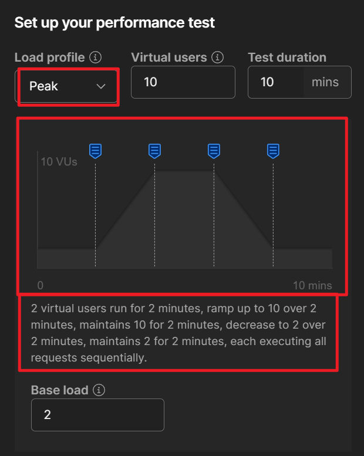

## 深分页优化

https://www.bilibili.com/video/BV1zz9cYCEP9/?spm_id_from=333.1245.0.0&vd_source=f79519d2285c777c4e2b2513f5ef101a

**深分页产生的原因**

当我们执行如下的sql的时候

~~~sql
select p.* from tb_user p limit 50000, 100
~~~

众所周知, mysql是分为server层和engine层的,  查找数据是在engine层的, 然后查找到的所有数据都会返回server层, 然后在server层过滤数据

所以这个sql实际上是在engine层查找了50100条数据,  然后返回给server层, 然后在server层过滤前面50000条, 只保留后面的100条数据, 所以你深分页越深, 返回的数据就越大, 就会越慢

假设你的sql又没有使用到索引覆盖的话, 那么mysql就会根据age上的索引, 找到满足条件的记录的id, 然后回表50100条数据, 然后把这50100条数据返回给server层, 然后server层丢掉前面的50000行数据, 剩下的100条返回给客户端

~~~sql
-- 假设有一个 age 的索引
select p.* from tb_user p where age > 1 limit 50000, 100
~~~

所以这里缓慢的点在于, **深分页越深, 要扫描的行也越多, 回表的次数也越多**

我们最主要的优化, 其实就是**尽可能将查询条件转移到id上, 避免回表**

**在子查询中找出符合条件的id, 然后在外层查询中根据id去查找数据, 这样虽然无法避免子查询扫描50100次, 但是能够用上扫描, 速度很快, 同时外层循环可以使用主键id去查找数据, 这样就可以避免掉50100次回表了**

1. 删除掉不必要的字段, 尽量使用索引覆盖

   ~~~sql
   select id, age from tb_user p where age > 1 limit 50000, 100
   ~~~

   

2. 如果就是没办法使用索引覆盖的话, 那么我们可以现将id查出来, 然后根据id去查询其他没办法使用索引覆盖的字段

   **这样子查询还是要扫描50100条数据, 但是使用到了age索引, 不用回表50100次**

   **同时后续的查询可以使用上主键索引**

   (推荐)

   ~~~sql
   -- 外层子查询使用了id索引, 很快
   select id, age, name from tb_user p join ( 
       -- 子查询还是要扫描50100次, 但是使用了索引, 很快
       -- 同时避免了回表
       select id from tb_user where age > 1 limit 50000, 100 
   ) temp 
   on p.id = temp.id
   ~~~

3. 如果你的id是使用数据库自增的话, 那么可以改写为

   ~~~sql
   select id, age, name from tb_user p join ( select id from tb_user where id > 50000 and age > 1 limit 100 ) temp on p.id = temp.id
   ~~~

4. 如果你的id是自增的话, 那么可以使用**标签记录法**,  即将当前分页的最大id发给前端, 前端下次请求的时候, 将这个最大id再发送过来, 作为过滤条件

   (但是使用这种办法的话, 只能翻页, 不能跨页, 因为跨页的话就不知道上一页的最大id了)

   (推荐)

   ~~~sql
   SELECT id,age,name from tb_user p JOIN ( 
       SELECT id from tb_user WHERE id > 上一页maxId and age >1 LIMIT 100 ) temp 
   on p.id = temp.id;
   ~~~

5. 直接禁止深分页, 深分页根本没有意义, 没有人会翻这么多页

   翻页的效率是小于搜索的, 可以多添加几个条件

   **像淘宝京东商品都是最多翻100页**

## 使用Postman进行压测

https://www.bilibili.com/video/BV1tPsaeoEQn/?spm_id_from=333.1245.0.0&vd_source=f79519d2285c777c4e2b2513f5ef101a

1. 首先我们可以添加一个collection, 用来保存需要压测的接口

   

2. 创建2个要测试的api接口

   

3. 之后点击如图按钮， 运行collection

   
   
4. 勾选要测试的api， 然后选择要进行的测试类型
   
   
   
5. `functional`表示的是功能测试, 即测试这个功能有没有问题

   **注意functional在执行的时候只有一个线程, 也就是只有请求返回才会执行下一次请求**

   

   执行完毕之后可以查看结果

   

6. 对于Performance性能测试, 你可以模拟多少个用户, 持续多久时间, 以及想要模拟的场景是什么

   

   想要模拟的场景有:

   - fixed:  用户按照固定的频率来调用接口

     

   - ramp up: 开始较少的用户调用接口,  之后逐步增加用户

     
   
   - spike: 模拟波峰调用,  先较少用户, 然后一下子并发上来, 然后再降低用户
   
     
     
   - peak: 先较少用户, 然后缓慢增加, 持续一段时间, 然后缓慢减少
     
     
     
     
   
   执行完毕之后, 你可以查看这1分钟只能, 调用接口的频率, 接口错误率, 平均响应时间等等
   
   

## 实现多租户的五种架构

https://www.bilibili.com/video/BV1sNAWeBEr6/?spm_id_from=333.1007.tianma.2-2-5.click&vd_source=f79519d2285c777c4e2b2513f5ef101a

https://www.bilibili.com/video/BV1hu4y1R7BY/?vd_source=f79519d2285c777c4e2b2513f5ef101a

1. 第一种, 独立数据库, 这种安全性是最高的

   Saas根据租户去元数据中查询这个租户用的数据库的账号密码, 然后去连接对应的数据库, 获取对应的数据

   

2. 第二种, 通过表空间schema来隔离数据

   Saas根据租户去元数据中查询这个租户用的哪个表空间, 然后去连接对应的数据库, 获取对应的数据

   

3. 第三种, 通过表字段来隔离

   在查询数据的时候, 需要添加`where tenant_id = ?`来隔离数据

   但是mybatis-plus已经提供了这个能力

   

4. 第四种, 混合模式

   对于一些大客户, 他们的资源消耗比较严重, 一定要使用独立的数据来部署
   
   sass平台先根据租户查询使用的是独立数据库还是独立的schema, 还是根据字段区分, 然后再去查询对应的数据
   
   
   
   缺点是需要一定的开发能力
   
   
   
5. 第五种, 容器化隔离模式
   
   前面四种的定制化功能都太弱了, 对于一些大厂, 一定要客制化的能力, 并且是业务的定制化
   
   这个时候就可以采用k8s来进行, 直接为每个客户都部署一套专人专用的应用和数据库, 然后写一个网关分辨不同的租户, 然后把通过网关将请求路由到对应的服务实例
   
   
   
   优点是隔离性高, 安全性高, 客制化能力强, 确定是成本高
   
   
   
   

## 后端消息如何推送到前端

https://www.bilibili.com/video/BV1R3Nre5EKf/?spm_id_from=333.1007.tianma.2-1-3.click&vd_source=f79519d2285c777c4e2b2513f5ef101a

1. 前端短轮询

2. 前段长轮询

3. 使用sse技术, 即前段请求之后, 连接不要断开, 之后后端可以一直给前端发送数据, chatgpt使用的就是这种技术, 他是http原生自带的功能

   缺点: 只能后端推送给前端, 单项的

4. 升级为websocket, 双向通讯

## SpringBoot配置文件敏感信息加密

https://www.bilibili.com/list/watchlater?bvid=BV1Rysfe5EcG&oid=113209533073249

加入有如下配置

~~~yaml
spring:
  datasource:
    username: xxx
    password: bbb
    url: ccc
    driver-class-name: com.mysql.cj.jdbc.Driver
~~~

在maven中导入

~~~xml
<!-- 导入依赖 -->
<dependency>
    <groupId>com.github.ulisesbocchio</groupId>
    <artifactId>jasypt-spring-boot-starter</artifactId>
    <version>3.0.5</version>
</dependency>

<!-- 导入生成密文的插件 -->
<plugin>
    <groupId>com.github.ulisesbocchio</groupId>
    <artifactId>jasypt-maven-plugin</artifactId>
    <version>3.0.5</version>
</plugin>
~~~

通过如下命令来加密上面的username和password

~~~shell
# -Djasypt.encryptor.password指定加密的密码
# -Djasypt.plugin.value指定要加密的值
mvn jasypt:encrypt-value \
-Djasypt.encryptor.password="123456" \
-Djasypt.plugin.value="xxx"
~~~

之后会输出加密之后的密文

~~~shell
ENC(qXS/FRHFELLPhrYfFegOWKWsH3hKmC9VFcrmY8pWWQrYwVzpMOUL3ILNY/0545Au)
~~~

你只要把这个ENC(XXX)放到原来的位置即可

如果你是通过idea来启动的, 那么只需要配置`环境变量`, `jvm参数`, `程序参数`其中**之一**即可

如果你是通过jar包来启动的话, 那么根据如下命令即可

~~~shell
# 通过jvm参数配置密码
java -jar -Djasypt.encryptor.password=123456 demo-0.0.1-SNAPSHOT.jar

# 或者通过程序参数来配置密码, --会被springboot解析
java -jar demo-0.0.1-SNAPSHOT.jar --jasypt.encryptor.password=123456 

# 或者通过环境变量来配置密码, 因为bash的环境变量不能使用点, 所以spirngboot读取到环境变量, 会自动转换为jasypt.encryptor.password
export jasypt_encryptor_password=123456
java -jar demo-0.0.1-SNAPSHOT.jar
~~~

**原理猜测**: 估计就是在StandardEnvironment加载完毕所有的配置之后,  会调用EnvironmentPostProcessor钩子

估计就是在EnvironmentPostProcessor中, 拿到加密的变量, 然后解析出来, 然后再覆盖掉他

## SpringBoot反编译

https://www.bilibili.com/list/watchlater?bvid=BV14FxFePETN&oid=113209566561400

添加如下的插件

~~~xml
<plugin>
  <groupId>net.roseboy</groupId>
  <artifactId>classfinal-maven-plugin</artifactId>
  <version>1.2.1</version>
  <configuration>
    <!-- #表示启动时不需要密码-->
    <password>123456</password>
    <!-- 需要加密的代码的包, 这里指定加密所有代码 -->
    <!-- 对于代码, 加密之后会删除所有方法体 -->
    <packages>${groupId}</packages>
    <!-- 要加密的配置文件 -->
    <!-- 对于配置文件, 加密之后会删除其中的所有内容 -->
    <cfgfiles>application.yml</cfgfiles>
    <!-- 指定要加密的依赖的jar包 -->
    <libjars></libjars>
  </configuration>
  <executions>
    <execution>
      <phase>package</phase>
      <goals>
        <goal>classFinal</goal>
      </goals>
    </execution>
  </executions>
</plugin>
~~~

之后执行`mvn package`就会在target目录下生成一个带`encrypted`的jar, 之后通过如下命令来启动jar包

~~~shell
# 密码需要放在同级目录下的classfinal.txt中
# 读取这个密码之后会删除他
java -javaagent:yourpaoject-encrypted.jar -jar yourpaoject-encrypted.jar
~~~

**这种办法通过arthas还是可以拿到运行时的字节码, 所以要还要进行名称混淆, ast混淆(Paramorphism), 再叠加一些反调试的手段, 然后再把一些关键的代码写成native代码**

**当然, 等级最高的就是通过native image来打包, 只是需要给反射提供元数据**

## JVM优化之关闭偏向锁

https://www.bilibili.com/video/BV1FWQGYqEPa/?spm_id_from=333.1007.tianma.1-2-2.click&vd_source=f79519d2285c777c4e2b2513f5ef101a

能够受益于偏向锁的程序, 都是在竞争较少的情况下, 比如GUI程序, 大多数的时候都是main线程在执行, 其他线程只是起辅助作用, 这种情况下使用偏向锁性能好

但是对于高并发的场景下, 非常的不适合, 因为高并发场景下, 会有大量的偏向锁撤销, 而这些偏向锁撤销要等到safepoint的时候才能去执行撤销

但是safepoint的主要功能是用来标记整理算法的时候, 用来标记还活着的对象的

**如果这个时候有大量的偏向锁撤销, 会导致本来执行标记的时间被用来执行偏向锁撤销(safepoint有固定的一段时间, 不会太长), 导致拖慢gc**, 可以通过`-XX:-UseBiasedLocking`关闭偏向锁

## Redis实现分布式限流

https://www.bilibili.com/video/BV1VHAJe3ETZ/?spm_id_from=333.1007.tianma.2-2-4.click&vd_source=f79519d2285c777c4e2b2513f5ef101a

导入依赖

~~~java
<dependency>
	<groupId>org.redisson</groupId>
    <artifactId>redisson-spring-boot-starter</artifactId>	
    <version>3.44.0</version>
</dependency>
~~~

~~~java
@Resource
private RedissonClient redissonClient;

@GetMapping("/test")
public string test(){
	// 获取名为"test”的速率限制器实例!
    RRateLimiter limiter = redissonclient.getRateLimiter("test");
    //设置整体速率限制为每5秒最多1次请求, 
    // overall表示集群全局限流, per_client表示单机限流
	limiter.trySetRate(RateType.OVERALL, 10l, Duration.ofseconds(60));
    
     //尝试获取一个许可，最多等待500微秒，如果成功则返回true，否则返回false
    //boolean res = limiter.tryAcquire(1,500,TimeUnit.MICROSECONDS); 
    
    //直接获取一个许可，会阻塞直到获取到许可为止
    //limiter.acquire();
    
	//尝试获取一个许可，不指定等待时间，默认立即返回结果
    boolean res =limiter.tryAcquire();
	if(res){
		return "success";
    }else {
		return "fail";
    }
}
~~~

**原理**

上面代码中, 会创建三个键值对

1. key为`test`, value为hash类型的键值对

   hash中有如下这几个字段

   - rate: 限流多少个
   - interval: 滑动窗口的大小, 毫秒
   - keepAliveTime
   - type: 0表示全局限流

2. key为`{test}:value`的, value类型为string, 表示当前窗口中还有多少个许可可以申请

3. `{test}:permits`的key, value类型为sortedset, 用来记录窗口中的请求, score就是窗口中请求的时间戳, value是8字节的随机值+申请时的许可数量

   

对于单机限流, 也会生成这三个key, 但是格式不一样, 后面会带有Client的id

**注意**

- 限流器是非公平的, 如果多个机器争抢资源, 很有可能会旱的旱死, 涝的涝死

- Rate不要设置太大, 因为Rate越大, SortedSet中保存的信息也就越多, 每次执行lua脚本的性能也就越差

  如果要设置较大的限流阈值, **倾向于小Rate + 小时间窗口的方式**, 而且这种设置方式请求也跟均匀一些

**性能**

RRateLimiter在Redis上保存的信息都必须在一个Redis实例上,  所以限流的qps上限就是Redis单实例的上限, 比如你Redis实例就是1W QPS，你想用RRateLimiter实现一个2w QPS的限流器，必然实现不了。

那有没有突破Redis单实例性能上限的方式?单限流器肯定是实现不了的，**我们可以拆分多个限流器，比如我搞10个限流器，每个限流器的key不一样，然后每台机器随机使用一个限流器限流，如果这个限流器无法获取, 那就换一个限流器重新尝试, 直到成功。**

## 接口响应慢的排查

https://www.bilibili.com/list/watchlater?bvid=BV1yuXjYxEK8&oid=114182879975526

使用arthas的trace命令

~~~bash
curl -O https://arthas.aliyun.com/arthas-boot.jar # 下载
java -jar arthas-boot.jar # 启动

trace com.example.TestController.test -n 5 --skipJDKMethod false # 监控方法的耗时 -n表示打印最近5次的耗时

curl http://localhost:8888/test # 调用接口, 查看耗时
~~~

如果你记不住命令, 也可以在idea中安装`arthas idea`插件,  然后右键选择方法 -> arthas command -> trace

就会把命令复制到剪切板了

## 重复支付怎么解决

https://blog.csdn.net/mzh200801/article/details/135099789

https://zhuanlan.zhihu.com/p/560968924

https://zhuanlan.zhihu.com/p/369614315

https://www.bilibili.com/video/BV1MizEYzERS/?spm_id_from=333.1007.tianma.2-3-6.click&vd_source=f79519d2285c777c4e2b2513f5ef101a

这个问题github找个电商系统看一下, 然后结合上面几个文章就好了, 没对接具体的支付系统的话很多细节会漏掉, 导致云里雾里的

首先要知道的是, **重复支付是允许发生的, 出现了给你退款就好了**

1. 准备2个手机, 登录同一个美团账号
2. 下单一个订单, 但是先别支付
3. 手机1发起微信支付, 会跳转到微信, 但是先别支付
4. 手机2发起支付宝支付, 会跳转到支付宝, 直接支付
5. 手机1输入密码, 完成微信支付

此时同一个订单就付款了两遍, 稍后美团就会给你退一笔款

**出现了重复支付, 怎么处理**

凡事涉及到和第三方进行交互的, 里面涉及到网络问题, 数据一致性的问题, 单靠商户端是很难避免的, 所以大部分app都允许重复支付的

如果真的出现了重复支付, 只有第一笔保留, 其他的给你退款就行了

