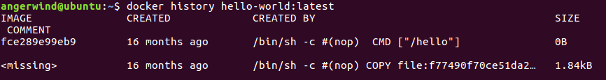
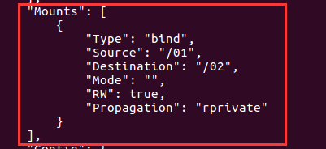

##  Ubuntu 安装 Docker CE

> 警告：切勿在没有配置 Docker APT 源的情况下直接使用 apt 命令安装 Docker.

### 准备工作

#### 系统要求

Docker CE 支持以下版本的 [Ubuntu](https://www.ubuntu.com/server) 操作系统：

- Disco 19.04
- Cosmic 18.10
- Bionic 18.04 (LTS)
- Xenial 16.04 (LTS)

Docker CE 可以安装在 64 位的 x86 平台或 ARM 平台上。Ubuntu 发行版中，LTS（Long-Term-Support）长期支持版本，会获得 5 年的升级维护支持，这样的版本会更稳定，因此在生产环境中推荐使用 LTS 版本。

#### 卸载旧版本

旧版本的 Docker 称为 `docker` 或者 `docker-engine`，使用以下命令卸载旧版本：

```
$ sudo apt-get remove docker \
               docker-engine \
               docker.io
```

### 使用 APT 安装

由于 `apt` 源使用 HTTPS 以确保软件下载过程中不被篡改。因此，我们首先需要添加使用 HTTPS 传输的软件包以及 CA 证书。

```
$ sudo apt-get update

$ sudo apt-get install \
    apt-transport-https \
    ca-certificates \
    curl \
    software-properties-common
```

鉴于国内网络问题，强烈建议使用国内源，官方源请在注释中查看。

为了确认所下载软件包的合法性，需要添加软件源的 `GPG` 密钥。

```
$ curl -fsSL https://mirrors.ustc.edu.cn/docker-ce/linux/ubuntu/gpg | sudo apt-key add -


# 官方源
# $ curl -fsSL https://download.docker.com/linux/ubuntu/gpg | sudo apt-key add -
```

然后，我们需要向 `source.list` 中添加 Docker 软件源

```
$ sudo add-apt-repository \
    "deb [arch=amd64] https://mirrors.ustc.edu.cn/docker-ce/linux/ubuntu \
    $(lsb_release -cs) \
    stable"


# 官方源
# $ sudo add-apt-repository \
#    "deb [arch=amd64] https://download.docker.com/linux/ubuntu \
#    $(lsb_release -cs) \
#    stable"
```

> 以上命令会添加稳定版本的 Docker CE APT 镜像源，如果需要测试或每日构建版本的 Docker CE 请将 stable 改为 test 或者 nightly。

#### 安装 Docker CE

更新 apt 软件包缓存，并安装 `docker-ce`：

```
$ sudo apt-get update

$ sudo apt-get install docker-ce
```

### 使用脚本自动安装

在测试或开发环境中 Docker 官方为了简化安装流程，提供了一套便捷的安装脚本，Ubuntu 系统上可以使用这套脚本安装，另外可以通过 `--mirror` 选项使用国内源进行安装：

```
$ curl -fsSL get.docker.com -o get-docker.sh
$ sudo sh get-docker.sh --mirror Aliyun
# $ sudo sh get-docker.sh --mirror AzureChinaCloud
```

执行这个命令后，脚本就会自动的将一切准备工作做好，并且把 Docker CE 的稳定(stable)版本安装在系统中。

### 启动 Docker CE

```
$ sudo systemctl enable docker
$ sudo systemctl start docker
```

### 建立 docker 用户组

默认情况下，`docker` 命令会使用 [Unix socket](https://en.wikipedia.org/wiki/Unix_domain_socket) 与 Docker 引擎通讯。而只有 `root` 用户和 `docker` 组的用户才可以访问 Docker 引擎的 Unix socket。出于安全考虑，一般 Linux 系统上不会直接使用 `root` 用户。因此，更好地做法是将需要使用 `docker` 的用户加入 `docker` 用户组。

建立 `docker` 组：

```
$ sudo groupadd docker
```

将当前用户加入 `docker` 组：

```
$ sudo gpasswd -a angerwind docker
或者
$ sudo usermod -G docker angerwind
```

将用户切换到`docker`组:

```text
newgrp docker     #更新用户组
docker ps    #测试docker命令是否可以使用sudo正常使用
```

退出当前终端并重新登录，进行如下测试。

### 测试 Docker 是否安装正确

```
$ docker run hello-world

Unable to find image 'hello-world:latest' locally
latest: Pulling from library/hello-world
d1725b59e92d: Pull complete
Digest: sha256:0add3ace90ecb4adbf7777e9aacf18357296e799f81cabc9fde470971e499788
Status: Downloaded newer image for hello-world:latest

Hello from Docker!
This message shows that your installation appears to be working correctly.

To generate this message, Docker took the following steps:
 1. The Docker client contacted the Docker daemon.
 2. The Docker daemon pulled the "hello-world" image from the Docker Hub.
    (amd64)
 3. The Docker daemon created a new container from that image which runs the
    executable that produces the output you are currently reading.
 4. The Docker daemon streamed that output to the Docker client, which sent it
    to your terminal.

To try something more ambitious, you can run an Ubuntu container with:
 $ docker run -it ubuntu bash

Share images, automate workflows, and more with a free Docker ID:
 https://hub.docker.com/

For more examples and ideas, visit:
 https://docs.docker.com/get-started/
```

若能正常输出以上信息，则说明安装成功。

### 镜像加速

如果在使用过程中发现拉取 Docker 镜像十分缓慢，可以配置 Docker镜像加速

- 修改/etc/docker/daemon.json

  ```json
  {
      "registry-mirrors": [
          "https://dockerproxy.cn"
      ]
  }
  
  因为不可抗因素, docker镜像变更很快, 所以具体可用的镜像要使用的时候具体修改
  具体可用的加速镜像查看
  https://xuanyuan.me/blog/archives/1154?from=tencent
  ```

  


## Deepin安装docker和docker-compose

注意卸载docker旧包的时候Images, containers, volumes, 和networks 都保存在 `/var/lib/docker` 卸载的时候不会自动删除这块数据，如果你先删除他们则使用`rm` 来删除

```text
sudo rm -rf /var/lib/docker
sudo rm -rf /var/lib/containerd
```

### 安装docker

### 使用阿里云的自动安装脚本

```text
curl -fsSL https://get.docker.com | bash -s docker --mirror Aliyun
```

**安装docker-compose**

```bash
# 从github下载最新的docker-compose 
sudo wget -c -t 0 https://github.com/docker/compose/releases/download/2.19.1/docker-compose-`uname -s`-`uname -m` -O /usr/local/bin/docker-compose
sudo chmod a+rx /usr/local/bin/docker-compose


#给普通用户权限
chmod +x $DOCKER_CONFIG/cli-plugins/docker-compose
```

检查

```text
docker-compose -v
```


## Docker命令

### 镜像命令

#### docker images

列出本地主机的镜像文件

详细参数可以通过`docker images -h`来查看

参数说明: 

- -a: 列出本地所有的镜像(含中间镜像)

- -q: 只显示镜像id

- --digests: 显示镜像的摘要信息, 默认不加该参数不显示

- --no-trunc: 显示完整的镜像id, 默认不加该参数只显示前12为image id

例:  docker images -aq (显示所有的镜像id)

#### docker tag

为本地镜像添加新的标签，相当于起别名

docker tag SOURCE_IMAGE[:TAG] TARGET_IMAGE[:TAG]

```shell
docker tag hello-world:lastest my-hello-world:1.2.0
```


两者image id一致，说明他们实际上指向一个镜像文件，只是别名不同


#### docker inspect

检测某个镜像的详细信息，返回的是json格式

```shell
docker inspect hello-world:lastest
[
    {
        "Id": "sha256:fce289e99eb9bca977dae136fbe2a82b6b7d4c372474c9235adc1741675f587e",
        "RepoTags": [
            "hello-world:latest"
        ]
        .....
    }
]

```

#### docker history

查看某个image的各层信息




#### docker search

从docker hub上面搜索镜像

通过`docker search -h`来查看详细参数

用法: docker search [options] term

参数说明: 

- --no-trunc: 显示完整的镜像description
- -f filter: 根据条件显示查询结果
- --automated: 只列出automated build类型的镜像
- --limit int: 只显示指定数的结果

例: **docker search -f stars=30 --limit 5 nginx( 查询stars大于30的nginx的结果, 并且只显示3个), 默认显示25个**

**docker search -f is-official=true nginx（查询官方提供的带nginx关键字的镜像）**


#### docker pull

从仓库拉取某个镜像到本地

用法: docker pull 镜像名[:tag]

例: docker pull tomcat:lastest


#### docker rmi

删除本地的镜像

用法:

-  删除单个: docker rmi 镜像名[:tag] 
-  删除多个:  docker rmi 镜像名1:tag 镜像名2:tag
-  删除全部:  docker rmi $(docker images -qa)

**当同一个镜像拥有多个标签时（通过docker tag指定），docker rmi只是删除多个标签中指定的标签，并不影响镜像文件，但镜像 只剩下一个标签时docker rmi会彻底删除镜像文件**

- 通过镜像id来删除：docker rmi 镜像id

  **这种方式会删除所有指向该镜像的标签，然后删除该镜像本身**

参数: 

- -f, --force: 强制删除, 当该镜像有正在运行的容器时无法删除, 可以使用该参数强制删除

例: docker rmi -f hello-world(强制删除hello-world镜像)


### 容器命令

### docker run

新建并启动容器, 详细参数使用docker run --help查询

用法: docker run [OPTIONS] IMAGE [COMMAND] [ARG...]

参数: 

- **--name: 为容器指定一个名称**

- **-d: 后台运行容器, 并返回容器id, 即启动守护式容器**

- **-i: 以交互模式运行容器, 通常与-t同时使用**

- **-t: 为容器重新分配一个伪输入终端, 通常与-i同时使用**

- -P: 随机端口映射

- -p: 指定端口映射, 有以下四种格式

  - ip:hostPost:containerPort
  - ip:containerPort
  - **hostPort:container**
  - **Post**
  - containerPost

  ````shell
  例: docker run --name tomcat1 -it -p 8888:8080 tomcat
  #生成一个tomcat容器, 并且将宿主机的8888端口映射到容器的8080端口上面
  ````

  

 - **-v: 共享数据卷, 即分别在宿主机和容器上面新建一个文件夹（例/01:/02),并且将宿主机上面的文件夹/01<font color=red>映射</font>(挂载)到容器的这个文件上面,修改宿主机上/01文件夹的内容将影响到容器/02中的内容。同时若容器对于/02有读写权限, 容器对/02的读写也将影响到/01**

   ```shell
   docker run --name tomcat1 -it -v /01:/02 tomcat
   #映射目录使用绝对路径
   #生成一个tomcat,并且在宿主机和容器中生成01和02目录
   #并且将01目录映射到02目录下面
   #生成以后可以使用docker inspect tomcat1查看详细情况
   #图2中Mounts.rw为true , 说明该容器可以对02读写
   #使用docker run --name tomcat1 -it -v /01:/02:ro tomcat
   #表示容器对02文件夹是readonly的
   ```

   


### docker ps

列出当前所有**正在运行**的容器

用法:	docker ps [OPTIONS]

参数:

- -a, --all: 列出当前所有正在运行+历史上运行过的(默认只列举正在运行的)
- -f, --filter filter   Filter output based on conditions provided
- --format string   Pretty-print containers using a Go template
- -n, --last int        显示n个最近的容器(所有状态)
- -l, --latest          显示最近的容器(所有状态)
- --no-trunc        显示完整信息
- -q, --quiet           仅显示container id
- -s, --size            显示每个容器大小(默认不显示)

### 退出容器

退出容器有两种方式

- exit: 退出并停止容器
- ctrl+P+Q: 容器不停止退出

### docker start

启动容器

用法: docker start 容器id或者容器名


### docker restart

重启容器

用法: docker restart 容器名或者容器id


### docker stop

停止容器

用法: docker stop 容器名或者容器id


### docker kill

强制停止容器(杀死容器)

用法: docker kill 容器id或者容器名


### docker rm

删除容器

用法: docker rm 容器id或者容器名

参数: 

- -f: 强制删除, 默认无法删除一个真正运行的容器

删除多个容器: docker rm 容器1 容器2...

删除全部容器: 

- docker rm -f $(docker ps -aq)
- docker ps -aq | xargs docker rm

xargs将上一个命令输出传递到下一个命令的输入, 之所以能用到这个命令，关键是由于很多命令不支持|管道来传递参数，而日常工作中有有这个必要，所以就有了 xargs 命令

**xages 与管道的区别**

管道可以实现：将前面的标准输出作为后面的“标准输入”

管道无法实现：将前面的标准输出作为后面的“命令参数”

这个时候，就要有请xargs这位护花使者了。xargs+所擅长的正是“将标准输入作为其指定命令的参数”


### docker logs

显示某个容器的日志

用法: docker logs [options] container

参数:

- -t:  显示时间戳
- -f:  不停的追加新的日志, 需要使用ctrl+c退出日志显示
- --tail string  显示最后几条


### docker attach

绑定标准输入输出错误流到一个容器上, 即重新进入一个容器

用法: docker attach [options] 容器名或容器id

例: docker attach centos1(切换进centos1容器中, 此时执行exit将导致centos1停止)

### docker exec

在容器内壁执行一个命令

用法: docker exec [OPTIONS] CONTAINER COMMAND [ARG...]

例:  

- 在centos1中执行ls(docker exec  centos1 ls)
- **在centos1中开启一个终端(docker exec -it centos1 /bin/bash)**


### docker cp

拷贝容器内的文件到主机上

用法: docker cp 容器id:容器内文件路径  目的主机路径

例: 将centos1容器中的/temp/yum.log拷贝到/root下面

   docker cp centos1:/temp/yum.log /root


### docker commit

提交容器副本使之成为一个新的镜像

用法: docker commit [option] container 用户名/软件名[:TAG]

例: docker commit -a="sqt" -m="commit message" tomcat1 sqt/tomcat:1.2


### docker build


### 重要

#### 启动守护式容器

使用镜像centos:lastest以后台模式启动一个容器

docker run -d centos

问题：使用docker ps -a镜像查看， 发现**<font color=blue>容器已经退出</font>**


很重要的要说明一点： **<font color=red>docker容器后台运行， 就不行有一个前台进程</font>**

容器运行的命令如果不是那些<font color=red>一直挂起的命令</font>(比如运行top, tail), 就是会自动退出

这是docker的机制问题, 如nginx, 正常情况下, 我们配置启动服务只需要启动相应的service

service nginx start

但是这样做, nginx为后台进行模式运行, 就导致docker前台没有运行的应用

这样容器启动后就会立即自杀, 因为他觉得他没什么可做了

所以, 最佳的解决方案是, 将你要运行的程序以前台进程的形式运行


### docker容器内部调用主机上的服务

1. Linux

   Docker版本高于v20.10(2020年12月4日更新）
   在启动docker时，加入如下语句

   ```bash
   --add-host=host.docker.internal:host-gateway
   ```

   而在container内，可以直接请求`host.docker.internal:PORT`，来获取宿主机上提供的各种服务
   如果使用了Docker Compose，则应该将下面的句子加入container的声明中：

   ```yaml
   extra_hosts:
   	- "host.docker.internal:host-gateway"
   ```

2. Mac和Windows:

   Docker版本高于v18.03(2018年3月21日更新) 直接在container内使用`host.docker.internal:PORT`来访问宿主机服务即可

   对于Mac上Docker版本低于上述版本的：

   - Mac Docker版本v17.12到v18.02: 使用`docker.for.mac.host.internal`

   - Mac Docker版本v17.06到v18.11: 使用`docker.for.mac.localhost`

   - 对于更低版本的docker，只能使用老旧的方法了，这里不再多做赘述

3. 测试:

   ~~~bash
   # 创建一个busybox的容器
   docker run -d --name container1 busybox sleep 3600
   # 进入busybox内部
   docker exec -it container1 sh
   
   # 看容器内部能否调用主机上的mysql的端口
   telnet host.docker.internal 3306 
   ~~~

   


## Dockerfile

#### 基本结构

- 首行可以通过注释来指定解析器命令， 后续通过注释说明镜像的相关信息。 
- 主体部分首先使用FROM指令指明所基于的镜像名称， 接下来一般是使用LABEL指令说明维护者信息。
- 后面则是镜像操作指令， 例如RUN指令将对镜像执行跟随的命令。 每运行一条RUN指令，镜像添加新的一层， 并提交。 
- 最后是CMD指令， 来指定运行容器时的操作命令。  

#### FROM

指定所创建镜像的基础镜像

#### ENV

指定环境变量，定义环境变量的同时，可以引用已经定义的环境变量。

指定已有的环境变量会进行**覆盖**

~~~shell
ENV PATH /usr/local/bin:$PATH
~~~

由于镜像的层次文件系统，ENV定义的环境变量在后续层次中才能够被应用，示例如下：

```html
ENV abc=hello
ENV abc=bye def=$abc
ENV ghi=$abc
```

上述定义的结果中，def=hello，ghi=bye

#### LABEL

为生成的镜像添加元数据标签信息，可以在同一个LABEL中指定多个元数据标签

~~~shell
LABEL org.label-schema.schema-version="1.0" \
    org.label-schema.name="CentOS Base Image" \
    org.label-schema.vendor="CentOS" \
    org.label-schema.license="GPLv2" \
    org.label-schema.build-date="20181205"
~~~


#### RUN

格式：

- RUN <command>，在shell终端中运行命令，即/bin/sh -c
- RUN ["executable", "param1", "param2"]，指令会被解析为json数值，必须使用双引号。使用exec执行，不会启动shell环境。

每条 RUN 指令将在当前镜像基础上执行指定命令，并提交为新的镜像层 。 当命令较长时
可以使用＼来换行  

#### WORKDIR

指定工作目录，格式为WORKDIR <工作目录>，目录不存在会新建。


#### COPY、ADD

https://www.cnblogs.com/sparkdev/p/9573248.html

> 构建上下文

但我们使用docker build -t my-image:1.0.0 /home/tiger/test时，该命令将读取指定路径下（包括子目录）的 Dockerfile ，并**将该路径下所有数据作为上下文（ Context）发送给 Docker 服务端** 。 如果上下文过大， 会导致发送大量数据给服务端，延缓创建过程 。 因此除非是生成镜像所必需的文件，不然不要放到上下文路径下 。 

> **COPY 和 ADD 命令不能拷贝上下文之外的本地文件**。

对于 COPY 和 ADD 命令来说，如果要把本地的文件拷贝到镜像中，那么本地的文件必须是在上下文目录中的文件。其实这一点很好解释，因为在执行 build 命令时，**docker 客户端会把上下文中的所有文件发送给 docker daemon**。考虑 docker 客户端和 docker daemon 不在同一台机器上的情况，build 命令只能从上下文中获取文件

> 与WORKDIR协同工作

WORKDIR 命令为后续的 RUN、CMD、COPY、ADD 等命令配置工作目录。在设置了 WORKDIR 命令后，接下来的 COPY 和 ADD 命令中的相对路径就是相对于 WORKDIR 指定的路径。


> 只复制目录中的内容而不包含目录自身


> COPY

简单的将上下文的文件拷贝到镜像容器中，格式为 COPY <src> <dest>，支持Go风格的通配符。

~~~shell
# 因为COPY只拷贝文件而不拷贝目录，需要自己指定目录

COPY check* /testdir/           # 拷贝所有 check 开头的文件
COPY check?.log /testdir/       # ? 是单个字符的占位符，比如匹配文件
~~~

> ADD

ADD 命令可以完成 COPY 命令的所有功能，并且还可以完成两类超酷的功能：

- 自动解压压缩文件并把它们添加到镜像中

  ```shell
  WORKDIR /app
  # 自动解压文件
  ADD nickdir.tar.gz .
  ```

- 从 url 拷贝文件到镜像中
  这是一个更加酷炫的用法！但是在 docker [官方文档的最佳实践](https://docs.docker.com/develop/develop-images/dockerfile_best-practices/#add-or-copy)中却强烈建议不要这么用！！docker 官方建议我们当需要从远程复制文件时，最好使用 curl 或 wget 命令来代替 ADD 命令。原因是，当使用 ADD 命令时，会创建更多的镜像层，当然镜像的 size 也会更大

#### EXPOSE

EXPOSE <端口1> [<端口2>...]

> 两种作用

- 只是说明docker容器开放了哪些端口，并没有将这些端口实际开放了出来！更多的作用是告诉运维人员或容器操作人员该镜像会通过那个端口提供服务，只是一种说明。

  可以使用docker inspect查看EXPOSE将要暴露的端口。

  

- Dockerfile中声明了EXPOSE端口之后，我们使用-P命令进行随机映射的时候，会映射到EXPOSE声明的端口。比如说我们现在对一个tomcat容器进行EXPOSE 8080声明，那么我们进行-P随机映射的时候是会映射到8080端口。


#### USER

指定后续执行RUN，CMD，ENTRYPOINT时使用的用户，没有用户时需要新建用户。

~~~shell
RUN groupadd -g 1000 elasticsearch && useradd elasticsearch -u 1000 -g 1000

USER elasticsearch
~~~

在`docker run`中可以通过`-u`选项来覆盖USER指令的设置

~~~shell
docker run -it -u mysql newmysqldb /bin/bash
mysql@57cd57edba38:/$
~~~


#### ARG

定义构建镜像时需要的参数、用户可以在构建期间通过docker build --build-arg <varname>=<value>将其传递给构建器、如果指定了dockerfile中没有定义的参数，则发发出警告，提示构建参数未被使用。

> 默认值

~~~shell
FROM busybox
ARG user1=someuser
ARG buildno=1
~~~

如果`ARG`指令具有缺省值，并且在构建时未传递任何值，那么构建器将使用缺省值。

> 有效范围

**ARG变量定义从Dockerfile中定义的行开始生效**

**ARG指令定义变量之前、任何对该变量的引用返回的结果都是一个空字符串**。比如

~~~shell
FROM busybox
USER ${user:-some_user} # 定义了默认值为some_user
ARG user
USER $user
# ...
~~~

通过如下进行构建：

~~~shell
docker build --build-arg user=what_user .
~~~

第二行user=some_user, 此时user变量没有定义，所以使用了默认值. 第四行user=what_user，因为使用了通过命令行传递过来的值。


**一个ARG指令的有效范围在其定义的构建阶段内、如果要在多个阶段中都有效、则必须在每个阶段都饮食ARG指令**

```
FROM busybox
ARG SETTINGS=helloworld
RUN echo $SETTINGS
RUN echo $SETTINGS
```

第三行将输出helloworld，第三行输出空字符串。因为RUN命令添加了一层镜像，SETTINGS只在第三行命令中有效。

**使用ARG或ENV指令来指定RUN指令可用的变量，如果ARG和ENV同时指定了一个相同名称的变量、则ENV设置的变量会覆盖ARG设置的变量**


#### VOLUME

通过dockerfile的 VOLUME 指令可以在镜像中创建挂载点，这样只要通过该镜像创建的容器都有了挂载点。

**通过 VOLUME 指令创建的挂载点，无法指定主机上对应的目录，是自动生成的。**

```
#test
FROM ubuntu
MAINTAINER hello1
VOLUME ["/data1","/data2"]
```

上面的dockfile文件通过VOLUME指令指定了两个挂载点 /data1 和 /data2.

我们通过docker inspect 查看通过该dockerfile创建的镜像生成的容器，可以看到如下信息

```
    "Mounts": [
        {
            "Name": "d411f6b8f17f4418629d4e5a1ab69679dee369b39e13bb68bed77aa4a0d12d21",
            "Source": "/var/lib/docker/volumes/d411f6b8f17f4418629d4e5a1ab69679dee369b39e13bb68bed77aa4a0d12d21/_data",
            "Destination": "/data1",
            "Driver": "local",
            "Mode": "",
            "RW": true
        },
        {
            "Name": "6d3badcf47c4ac5955deda6f6ae56f4aaf1037a871275f46220c14ebd762fc36",
            "Source": "/var/lib/docker/volumes/6d3badcf47c4ac5955deda6f6ae56f4aaf1037a871275f46220c14ebd762fc36/_data",
            "Destination": "/data2",
            "Driver": "local",
            "Mode": "",
            "RW": true
        }
    ],
```

> 共享容器卷(挂载点)

~~~shell
docker run --name test1 -it myimage /bin/bash
~~~

上面命令中的 myimage是用前面的dockerfile文件构建的镜像。 这样容器test1就有了 /data1 和 /data2两个挂载点。

下面我们创建另一个容器可以和test1共享 /data1 和 /data2卷 ，这是在 docker run中使用 --volumes-from标记，如：

可以是来源不同镜像，如：

~~~shell
docker run --name test2 -it --volumes-from test1 ubuntu /bin/bash
~~~

也可以是同一镜像，如：

~~~shell
docker run --name test3 -it --volumes-from test1 myimage /bin/bash
~~~

上面的三个容器 test1 , test2 , test3 均有 /data1 和 /data2 两个目录，且目录中内容是共享的，任何一个容器修改了内容，别的容器都能获取到。


#### CMD、ENTRYPOINT

https://www.cnblogs.com/sparkdev/p/8461576.html

https://zhuanlan.zhihu.com/p/30555962

https://www.ctl.io/developers/blog/post/dockerfile-entrypoint-vs-cmd/

> CMD

CMD 指令的目的是：为容器提供默认的执行命令。
CMD 指令有三种使用方式，其中的一种是为 ENTRYPOINT 提供默认的参数：
**CMD ["param1","param2"]**
另外两种使用方式分别是 exec 模式和 shell 模式：
**CMD ["executable","param1","param2"]**  // 这是 exec 模式的写法，注意需要使用双引号。
**CMD command param1 param2**         // 这是 shell 模式的写法。
**注意命令行参数可以覆盖 CMD 指令的设置，但是只能是重写**，却不能给 CMD 中的命令通过命令行传递参数。
一般的镜像都会提供容器启动时的默认命令，但是有些场景中用户并不想执行默认的命令。用户可以通过命令行参数的方式覆盖 CMD 指令提供的默认命令。比如通过下面命令创建的镜像：

```
FROM ubuntu
CMD [ "top" ]
```

在启动容器时我们通过命令行指定参数 ps aux 覆盖默认的 top 命令：


从上图可以看到，命令行上指定的 ps aux 命令覆盖了 Dockerfile 中的 CMD [ "top" ]。实际上，**命令行上的命令同样会覆盖 shell 模式的 CMD 指令**。

> ENTRYPOINT

ENTRYPOINT 指令的目的也是为容器指定默认执行的任务。
ENTRYPOINT 指令有两种使用方式，就是我们前面介绍的 exec 模式和 shell 模式：
**ENTRYPOINT ["executable", "param1", "param2"]**  // 这是 exec 模式的写法，注意需要使用双引号。
**ENTRYPOINT command param1 param2**          // 这是 shell 模式的写法。
exec 模式和 shell 模式的基本用法和 CMD 指令是一样的，下面我们介绍一些比较特殊的用法。

**指定 ENTRYPOINT 指令为 exec 模式时，命令行上指定的参数会作为参数添加到 ENTRYPOINT 指定命令的参数列表中。**用下面的代码构建镜像 test1：

```
FROM ubuntu
ENTRYPOINT [ "top", "-b" ]
```

运行下面的命令：

```
$ docker run --rm test1 -c
```


我们在命令行上添加的参数被追加到了 top 命令的参数列表中。

**由 CMD 指令指定默认的可选参数：**

```
FROM ubuntu
ENTRYPOINT [ "top", "-b" ]
CMD [ "-c" ]
```

使用这段代码构建镜像 test2 并不带命令行参数启动容器：

```
$ docker run --rm test2
```

这时容器中运行的命令为：top -b -c。
如果我们指定命令行参数：

```
$ docker run --rm test2 -n 1
```

-n 1 会覆盖 通过 CMD [ "-c" ] 指定的参数，容器执行的命令为：top -b -n 1


注意上图的输出显示 -c 参数被覆盖了。

**指定 ENTRYPOINT 指令为 shell 模式时，会完全忽略命令行参数：**

```
FROM ubuntu
ENTRYPOINT echo $HOME 
```

把上面的代码编译成镜像 test2，分别不带命令行参数和使用命令行参数 ls 执行命令：


我们看到 ls 命令没有被执行，这说明命令行参数被 ENTRYPOINT 指令的 shell 模式忽略了。

**覆盖默认的 ENTRYPOINT 指令：**
ENTRYPOINT 指令也是可以被命令行覆盖的，只不过不是默认的命令行参数，而是需要显式的指定 --entrypoint 参数。比如我们通过下面的方式覆盖上面镜像中的 echo $HOME 命令：

```
$ docker run --rm --entrypoint hostname test2
```


这里我们使用 hostname 命令覆盖了默认的 echo $HOME 命令。

>  同时使用 CMD 和 ENTRYPOINT 的情况(搞不懂)

对于 CMD 和 ENTRYPOINT 的设计而言，多数情况下它们应该是单独使用的。当然，有一个例外是 CMD 为 ENTRYPOINT 提供默认的可选参数。
我们大概可以总结出下面几条规律：
   • 如果 ENTRYPOINT 使用了 shell 模式，CMD 指令会被忽略。
   • 如果 ENTRYPOINT 使用了 exec 模式，CMD 指定的内容被追加为 ENTRYPOINT 指定命令的参数。
   • 如果 ENTRYPOINT 使用了 exec 模式，CMD 也应该使用 exec 模式。
真实的情况要远比这三条规律复杂，好在 docker 给出了官方的解释，如下图所示：


> 启动时覆盖CMD、ENTRYPOINT

**命令行上的参数会覆盖EXEC和SHELL模式下的CMD命令**

**指定 ENTRYPOINT 指令为 shell 模式时，会完全忽略命令行参数**（上面已经说明）

**指定 ENTRYPOINT 指令为 exec 模式时，命令行上指定的参数会作为参数添加到 ENTRYPOINT 指定命令的参数列表中。**（上面已经说明）


比如, 我们写了一个这样的Dockerfile:

```docker
FROM ubuntu:trusty
CMD ping localhost 
```

如果根据这个Dockerfile构建一个新image, 名字叫demo

```bash
$ docker run -t demo
PING localhost (127.0.0.1) 56(84) bytes of data.
64 bytes from localhost (127.0.0.1): icmp_seq=1 ttl=64 time=0.051 ms
64 bytes from localhost (127.0.0.1): icmp_seq=2 ttl=64 time=0.038 ms
^C
--- localhost ping statistics ---
2 packets transmitted, 2 received, 0% packet loss, time 999ms
rtt min/avg/max/mdev = 0.026/0.032/0.039/0.008 ms
```

可以看出**ping**命令在docker启动后自己执行, 但是我们可以在命令行启动docker镜像时, 执行其他命令行参数, 覆盖默认的CMD

```bash
$ docker run demo hostname
6c1573c0d4c0
```

docker启动后, 并没有执行**ping**命令, 而是运行了**hostname**命令

> 使用shell还是Exec模式（永远使用exec模式）

ENTRYPOINT和CMD指令支持2种不同的写法: shell表示法和exec表示法. 下面的例子使用了shell表示法

**当使用shell表示法时, 命令行程序作为sh程序的子程序运行, docker用/bin/sh -c的语法调用**. 如果我们用docker ps命令查看运行的docker, 就可以看出实际运行的是/bin/sh -c命令

```text
$ docker run -d demo
15bfcddb11b5cde0e230246f45ba6eeb1e6f56edb38a91626ab9c478408cb615

$ docker ps -l
CONTAINER ID IMAGE COMMAND CREATED
15bfcddb4312 demo:latest "/bin/sh -c 'ping localhost'" 2 seconds ago 
```

我们再次运行demo镜像, 可以看出来实际运行的命令是/bin/sh -c 'ping localhost'.

虽然shell表示法看起来可以顺利工作, 但是它其实上有一些小问题存在. 如果我们用docker ps命令查看正在运行的命令, 会有下面的输出:

```text
$ docker exec 15bfcddb ps -f
UID PID PPID C STIME TTY TIME CMD
root 1 0 0 20:14 ? 00:00:00 /bin/sh -c ping localhost
root 9 1 0 20:14 ? 00:00:00 ping localhost
root 49 0 0 20:15 ? 00:00:00 ps -f 
```

PID为1的进程并不是在Dockerfile里面定义的ping命令, 而是/bin/sh命令. **如果从外部发送任何POSIX信号到docker容器, 由于/bin/sh命令不会转发消息给实际运行的ping命令, 则不能安全得关闭docker容器**(参考更详细的文档:[Gracefully Stopping Docker Containers](https://link.zhihu.com/?target=https%3A//www.ctl.io/developers/blog/post/gracefully-stopping-docker-containers/)).

一个更好的选择是用exec表示法:

```docker
CMD ["executable","param1","param2"] 
```

CMD指令后面用了类似于JSON的语法表示要执行的命令. 这种用法告诉docker不需要调用/bin/sh执行命令.

我们修改一下Dockerfile, 改用exec表示法:

```docker
FROM ubuntu:trusty
CMD ["/bin/ping","localhost"] 
```

重新build镜像, 用docker ps命令检查效果:

```text
$ docker build -t demo .
[truncated]

$ docker run -d demo
90cd472887807467d699b55efaf2ee5c4c79eb74ed7849fc4d2dbfea31dce441

$ docker ps -l
CONTAINER ID IMAGE COMMAND CREATED
90cd47288780 demo:latest "/bin/ping localhost" 4 seconds ago 
```

现在没有启动/bin/sh命令, 而是直接运行/bin/ping命令, ping命令的PID是1. **无论你用的是ENTRYPOINT还是CMD命令, 都强烈建议采用exec表示法,**

> 选择CMD还是ENTRYPOINT

大部分Linu发行版的基础镜像里面调用CMD命令, 指定容器启动后执行/bin/sh或/bin/bash. 这样镜像启动默认进入交互式的shell

3个不同的Linux镜像(ubuntu, busybox, debian)都在Dockerfile的最后调用 CMD '/bin/bash'

启动Linux发行版的基础container后, 默认调用shell程序, 符合大多数人的习惯.

**因为CMD命令很容易被docker run命令的方式覆盖, 所以, 如果你希望你的docker镜像的功能足够灵活, 建议在Dockerfile里调用CMD命令.**

**相反, ENTRYPOINT的作用不同, 如果你希望你的docker镜像只执行一个具体程序, 不希望用户在执行docker run的时候随意覆盖默认程序. 建议用ENTRYPOINT.**


### docker 多阶段构建


## 数据卷

#### docker volume create

~~~shell
# 创建并使用
$ docker volume create hello
hello
$ docker run -d -v hello:/world ubuntu:latest ls /world
~~~


#### -mount和-v的区别

https://docs.docker.com/engine/reference/commandline/service_create/#add-bind-mounts-volumes-or-memory-filesystems

The `--mount` flag allows you to mount volumes, host-directories and `tmpfs` mounts in a container.

The `--mount` flag supports most options that are supported by the `-v` or the `--volume` flag, but uses a different syntax

```
docker run -t -i --mount type=bind,src=/data,dst=/data busybox sh

docker run -t -i -v /data:/data busybox sh
```

Docker supports three different kinds of mounts, which allow containers to read from or write to files or directories, either on the host operating system, or on memory filesystems. These types are *data volumes* (often referred to simply as volumes), *bind mounts*, *tmpfs*, and *named pipes*.

| Option                                   | Required                         | Description                                                  |
| :--------------------------------------- | :------------------------------- | :----------------------------------------------------------- |
| **type**                                 |                                  | The type of mount, can be either `volume`, `bind`, `tmpfs`, or `npipe`. Defaults to `volume` if no type is specified.`volume`: mounts a [managed volume](https://docs.docker.com/engine/reference/commandline/volume_create/) into the container.`bind`: bind-mounts a directory or file from the host into the container.`tmpfs`: mount a tmpfs in the container`npipe`: mounts named pipe from the host into the container (Windows containers only). |
| **src** or **source**                    | for `type=bind` and `type=npipe` | `type=volume`: `src` is an optional way to specify the name of the volume (for example, `src=my-volume`). If the named volume does not exist, it is automatically created. If no `src` is specified, the volume is assigned a random name which is guaranteed to be unique on the host, but may not be unique cluster-wide. A randomly-named volume has the same lifecycle as its container and is destroyed when the *container* is destroyed (which is upon `service update`, or when scaling or re-balancing the service)`type=bind`: `src` is required, and specifies an absolute path to the file or directory to bind-mount (for example, `src=/path/on/host/`). An error is produced if the file or directory does not exist.`type=tmpfs`: `src` is not supported. |
| **dst** or **destination** or **target** | yes                              | Mount path inside the container, for example `/some/path/in/container/`. If the path does not exist in the container's filesystem, the Engine creates a directory at the specified location before mounting the volume or bind mount. |
| **readonly** or **ro**                   |                                  | The Engine mounts binds and volumes `read-write` unless `readonly` option is given when mounting the bind or volume. Note that setting `readonly` for a bind-mount does not make its submounts `readonly` on the current Linux implementation. See also `bind-nonrecursive`.`true` or `1` or no value: Mounts the bind or volume read-only.`false` or `0`: Mounts the bind or volume read-write. |

## Docker Compose V3 模板文件常用命令

默认的模板文件名称为 `docker-compose.yml`，格式为 YAML 格式。

`docker-compose.yml`版本需要在第一行指定，这里是`version: "3"`

```yml
version: "3"

services:
  webapp:
    image: examples/web
    ports:
      - "80:80"
    volumes:
      - "/data"
```


#### build

指定 `Dockerfile` 所在文件夹的路径（可以是绝对路径，或者相对 `docker-compose.yml 文件的路径`）。 `Compose` 自动查找`Dockerfile`文件，并利用这个路径上下文自动构建这个镜像，然后使用这个镜像。

~~~yaml
version: '3'
services:
  webapp:
    build: ./dir
~~~

也可以使用 `context` 指令指定 `Dockerfile` 所在文件夹的路径。

使用 `dockerfile` 指令指定 `Dockerfile` 文件名。(类似于`docker build -f filename`)

使用 `arg` 指令指定构建镜像时的变量。(类似于`docker build --build-args varname=value`)

~~~yaml
version: "3.8"
services:
  webapp:
    build:
      # 指定构建路径上下文，默认使用这个路径下的Dockerfile文件
      context: ./dir
      # 指定Dockerfile文件名
      dockerfile: Dockerfile-alternate
      args:
        - arg1: 1
        # boolean需要使用引号
        - arg2: "true"
~~~

同时指定`build`和`image`，Compose将会使用`image`所指定的名字命名构建好的镜像。

下面示例命名构建好的镜像name=webapp，tag=1.0.0

~~~yaml
version: "3.8"
services:
  webapp:
    build:./dir
    image: webapp:1.0.0
~~~

#### command

覆盖容器启动后默认执行的命令。类似于`docker run`后面指定运行的命令行参数。

```yaml
version: "3.8"
services:
  webapp:
    build:./dir
    command: echo "hello world"
```

#### container_name

指定容器名称。默认将会使用 `项目名称_服务名称_序号` 这样的格式。

```yaml
version: "3.8"
services:
  webapp:
    build:./dir
    command: echo "hello world"
```

#### depends_on

解决容器的依赖、启动先后的问题。以下例子中会先启动 `redis` `db` 再启动 `web`

```yaml
version: '3'
services:
  web:
    build: .
    depends_on:
      - db
      - redis
  redis:
    image: redis
  db:
    image: postgres
```

注意：`web` 服务不会等待 `redis` `db` 「完全启动」之后才启动。

#### env_file

从文件中获取环境变量，可以为单独的文件路径或列表。

如果通过 `docker-compose -f FILE` 方式来指定 Compose 模板文件，则 `env_file` 中变量的路径会基于模板文件路径。

如果有变量名称与 `environment` 指令冲突，则按照惯例，以后者为准。

```yaml
env_file:  
  - ./common.env  
  - ./apps/web.env  
  - /opt/secrets.env
```

环境变量文件中每一行必须符合格式，支持 `#` 开头的注释行。

```
# common.env: Set development environment
PROG_ENV=development
```

#### environment

设置环境变量。你可以使用数组或字典两种格式。

只给定名称的变量会自动获取运行 Compose 主机上对应变量的值，可以用来防止泄露不必要的数据。（类似于`docker run -e env_name=value`）

```yaml
environment:  
  RACK_ENV: development  
  SESSION_SECRET:
environment:  
  - RACK_ENV=development  
  - SESSION_SECRET
```

如果变量名称或者值中用到 `true|false，yes|no` 等表达 [布尔](https://yaml.org/type/bool.html) 含义的词汇，最好放到引号里，避免 YAML 自动解析某些内容为对应的布尔语义。

#### expose

暴露端口，但不映射到宿主机，只被连接的服务访问。

仅可以指定内部端口为参数。( 类似于dockerfile中的`EXPOSE`命令 )

```
expose:
 - "3000"
 - "8000"
```

#### image

指定为镜像名称或镜像 ID。如果镜像在本地不存在，`Compose` 将会尝试拉取这个镜像。(类似于`docker run`中指定运行的镜像)

```yaml
version: '3'
services:
  web:
    image: ubuntu
```

#### labels

为容器添加 Docker 元数据（metadata）信息。例如可以为容器添加辅助说明信息。(类似于dockerfile中的`LABEL`命令)

```yaml
labels:
  com.startupteam.description: "webapp for a startup team"
  com.startupteam.department: "devops department"
  com.startupteam.release: "rc3 for v1.0"
```

#### ports

暴露端口信息。

使用宿主端口：容器端口 `(HOST:CONTAINER)` 格式，或者仅仅指定容器的端口（宿主将会随机选择端口）都可以。

```yaml
ports:
 - "3000"
 - "8000:8000"
 - "127.0.0.1:8001:8001"
```

*注意：当使用* *`HOST:CONTAINER`* *格式来映射端口时，如果你使用的容器端口小于 60 并且没放到引号里，可能会得到错误结果，因为* *`YAML`* *会自动解析* *`xx:yy`* *这种数字格式为 60 进制。为避免出现这种问题，建议数字串都采用引号包括起来的字符串格式。*

#### volumes

数据卷所挂载路径设置。可以设置为宿主机路径(`HOST:CONTAINER`)或者数据卷名称(`VOLUME:CONTAINER`)，并且可以设置访问模式 （`HOST:CONTAINER:ro`）。

该指令中路径支持相对路径。

```yaml
volumes:
 - /var/lib/mysql
 - cache/:/tmp/cache
 - ~/configs:/etc/configs/:ro
```

如果路径为数据卷名称，必须在文件中配置数据卷。

```yaml
version: "3"
services:  
  my_src:    
    image: mysql:8.0    
    volumes:      
      - mysql_data:/var/lib/mysql
      
volumes:  mysql_data:
```


## Docker 私服

已知的docker私服有两种方式来搭建

- docker register

  这是docker官方提供的私服, 比较小巧简单, 只负责镜像的存储和消灾, 没有UI界面, 没有项目, 用户, 设计, 等高级的功能

- harbor

  这个是在docker register的基础上进行了扩展, 面相企业级场景

  自带WebUI界面, 提供用户/角色/项目的权限管理, 支持LDAP/AD的集成, 方便接入公司现有的账号体系, 支持多数据中心, 多harbor之间的镜像同步


### 通过docker register搭建私服

1. 下载docker register的docker镜像

   ~~~shell
   docker pull registry:latest
   ~~~

2. 运行这个镜像

   ~~~shell
   # -d让容器在后台运行, 不要占用当前的终端
   # --name指定容器的名字
   # --hostname指定容器的主机名
   # --volume将容器的/var/lib/registry/docker/registry挂载到当前目录下的registry目录下, 实现数据的
   docker run \
     -d \
     --name registry \
     --hostname registry \
     --volume $(pwd)/registry:/var/lib/registry/ \
     --publish 5000:5000 \
     --restart unless-stopped \
     registry:latest
   ~~~

   


## Docker API

docker api的作用是能够让我们通过程序来操作docker,  只要是使用命令行能够执行的, docker api都能够执行

### 启用docker api

1. windows上

   

   

   ~~~yaml
   {
     "hosts": [
       "tcp://0.0.0.0:2375"
     ]
   }
   ~~~

2. linux上

   ~~~yaml
   vim /etc/docker/daemon.json
    
   {
     "hosts": [
     	#tcp是为了其他客户端可以使用http连接上来
     	"tcp://0.0.0.0:2375", 
     	# unix的sock是为了让本机的应用和容器内的应用可以通过该文件连接docker, 而不需要网络, 更高效
     	"unix:///var/run/docker.sock"
     ]
   }
   ~~~

3. 修改文件之后, 记得重启docker

   ~~~bash
   systemctl daemon-reload
   systemctl restart docker
   ~~~

4. 测试

   ~~~bash
   # 查看docker的版本
   [root@slaver2 /]# docker -H tcp://18.16.202.95:2375 version
   # 查看docker 的 所有镜像
   [root@slaver2 ~]# docker -H tcp://18.16.202.95:2375 images
   ~~~

docker api分为3部分:

1. docker engine api

   主要的作用是操作docker

   https://docs.docker.com/reference/api/engine/

2. docker hub api

   https://docs.docker.com/reference/api/hub/latest/

   主要的作用是用来访问docker hub

3. Extensions Api

同时这些api,  docker官方提供了go和python的库, 只需要调库就好了, 对于没有提供库的语音, 那么可以使用http来请求docker, 只需要设置好docker的地址就号了

下面是通过go来启动一个docker容器的案例

~~~go
package main

import (
	"context"
	"io"
	"os"

	"github.com/docker/docker/api/types/container"
	"github.com/docker/docker/api/types/image"
	"github.com/docker/docker/client"
	"github.com/docker/docker/pkg/stdcopy"
)

func main() {
	ctx := context.Background()
	cli, err := client.NewClientWithOpts(client.FromEnv, client.WithAPIVersionNegotiation())
	if err != nil {
		panic(err)
	}
	defer cli.Close()

	reader, err := cli.ImagePull(ctx, "docker.io/library/alpine", image.PullOptions{})
	if err != nil {
		panic(err)
	}

	defer reader.Close()
	// cli.ImagePull is asynchronous.
	// The reader needs to be read completely for the pull operation to complete.
	// If stdout is not required, consider using io.Discard instead of os.Stdout.
	io.Copy(os.Stdout, reader)

	resp, err := cli.ContainerCreate(ctx, &container.Config{
		Image: "alpine",
		Cmd:   []string{"echo", "hello world"},
		Tty:   false,
	}, nil, nil, nil, "")
	if err != nil {
		panic(err)
	}

	if err := cli.ContainerStart(ctx, resp.ID, container.StartOptions{}); err != nil {
		panic(err)
	}

	statusCh, errCh := cli.ContainerWait(ctx, resp.ID, container.WaitConditionNotRunning)
	select {
	case err := <-errCh:
		if err != nil {
			panic(err)
		}
	case <-statusCh:
	}

	out, err := cli.ContainerLogs(ctx, resp.ID, container.LogsOptions{ShowStdout: true})
	if err != nil {
		panic(err)
	}

	stdcopy.StdCopy(os.Stdout, os.Stderr, out)
}
~~~

更多案例和用法可以查看文档

https://docs.docker.com/reference/api/engine/docker 

https://docs.docker.com/reference/api/hub/latest/


## Windows 连接远程的docker

https://www.cnblogs.com/lvbok/p/18546439

https://blog.csdn.net/weixin_51623642/article/details/143742092

https://blog.csdn.net/2301_76154806/article/details/141404952

### docker client连接远程的docker

如果你在windows上,  没有安装docker-desktop, 但是又想要在windows上来访问linux上的集群, 那么你可以借助docker client的功能来连接远程的docker服务器, 从而在windows上执行docker命令, 就能够控制远程的docker服务器

1. 查看Docker服务端版本

   ~~~shell
   docker version
   ~~~

   [

   获取到Docker服务端版本为24.0.7。

2. Docker服务端允许远程访问

   有两种办法:

   1. 修改docker的配置文件

      首先，新建或修改 `/etc/systemd/system/docker.service.d/override.conf` 文件，确保其内容如下：

      ~~~ini
      ## Add this to the file for the docker daemon to use different ExecStart parameters (more things can be added here)
      
      [Service]
      ExecStart=
      ExecStart=/usr/bin/dockerd
      ~~~

      接着，在` /etc/docker/daemon.json` 文件中（如果没有则新建），添加以下内容。请使用您自己的镜像地址，不必强制使用示例中的地址：

      ~~~json
      {
        "registry-mirrors": ["https://2v6jvius.mirror.aliyuncs.com"],
        "hosts": [
          "unix:///var/run/docker.sock",
          "tcp://0.0.0.0:2375"
        ]
      }
      ~~~

   2. 修改docker.service的启动命令, 以开放远程访问
      ~~~shell
      # 编辑
      vim /lib/systemd/system/docker.service
      ~~~

      找到该文件中的
      ```ini
      ExecStart=/usr/bin/dockerd -H fd:// --     containerd=/run/containerd/containerd.sock
      ```
      注释或删除改行，替换为如下命令
      
      ~~~ini
      ExecStart=/usr/bin/dockerd -H tcp://0.0.0.0:2375 -H unix:///var/run/docker.sock
      ~~~
      
      替换保持后退出

   之后就是重启docker服务了

   ~~~shell
   systemctl daemon-reload && systemctl restart docker
   ~~~

   通过以下命令检查端口是否成功开放, 如果看到类似以下的输出，说明端口开放成功

   ```shell
   ss -tuln | grep 2375
   tcp6       0      0 :::2375                 :::*                    LISTEN      8511/dockerd
   ```


   在你本地通过浏览器访问`http://{服务器IP}:2375/version`，当看到页面显示一串JSON时表示已开放远程访问。

3. 下载对应版本客户端

   在Windows访问https://download.docker.com/win/static/stable/x86_64/下载跟服务端版本一致的客户端压缩包。

   

   下载之后解压到指定文件夹，比如我放在`D:\\tools`下。在`D:\\tools`下会多出来一个名字为`docker`的文件夹，里面有如下图**docker.exe、dockerd.exe、docker-proxy.exe**三个文件（docker-compose.exe不用管，后面会讲）。

      

4. 配置环境变量

   在Windows的系统环境变量中添加一个环境变量`DOCKER_HOST`，值配置为`tcp://{IP}:2375`，这个`IP`替换为Docker所在服务器的IP(例如我的`tcp://192.168.169.180:2375`)

   然后再添加一个环境变量`DockerClient`，值配置为`D:\\tools\\docker`，也就是刚刚解压的目录，并且在Path中添加该变量(`%DockerClient%`)，配置该环境变量后可以在任何位置访问`docker.exe`可执行文件。

   [](https://img2024.cnblogs.com/blog/1575518/202411/1575518-20241114172119570-196497538.png)

5. 验证

   打开CMD,在任意文件夹下执行`docker ps`查看是否显示服务器上的容器。


### Docker-Compose连接远程的docker

现在我们来让docker compose命令也连接到远程的docker集群

1. 查看服务端docker-compose版本

   ~~~shell
   docker-compose version
   
   # Docker Compose version v2.29.2
   ~~~

2. 下载相同版本的docker-compose

   访问https://github.com/docker/compose/releases下载对应版本的docker-compose。
   [](https://img2024.cnblogs.com/blog/1575518/202411/1575518-20241114172131237-1957205935.png)

   下载后存放到docker客户端所在的目录`D:\\tools\\docker`下，就是在上面看到的`docker-compose.exe`(文件名称是自己改的，下载下来就是上图的名称)。

3. 验证

   运行命令查看是否生效。

   ~~~shell
   docker-compose ps
   ~~~

   > 注意：运行docker-compose命令所在的文件夹的名称需要注意，不能随便乱取名。我的情况是需要跟服务器上的当前文件夹名称保持一致。我的服务器上docker-compose.yml放在/usr/looveh/tw-feedback下，所以在Windows下执行docker-compose命令时当前目录的名称需要为tw-feedback，否则查询不到容器。


### 配置IDEA连接远程的docker

使用idea连接远程的docker, 首先需要配置好上面的步骤, 让本地有docker client, 并且能够访问远程的docker服务器才可以

1. 在IDEA中安装docker插件, 并重启idea

   

2. 配置连接远程的docker

   

3. 连接成功后, 就可以在IDEA的左下角的Service一栏中, 看到远程的docker镜像和容器了

   

   

4. 当然你还可以使用这个插件, 通过界面的方式来操作docker

   1. 启动容器

      

   2. 拉取镜像

      

   3. 对已有的镜像进行操作

      

   4. 拉取镜像

      注意，写 Docker 镜像地址时，需要在镜像名称后面指定版本号。如果不指定，IDEA 会默认使用 `latest`：

      

      

       

      如遇到拉取超时的情况，可以配置国内镜像源，如阿里云的加速器：

      

5. 根据镜像创建容器并运行

   创建并运行 Docker 容器：

   

   

   新的 IDEA 版本可能需要额外的参数配置：

   

   创建成功后，可以在服务器上查看新创建的容器：

   

6. 容器的停止和删除

   