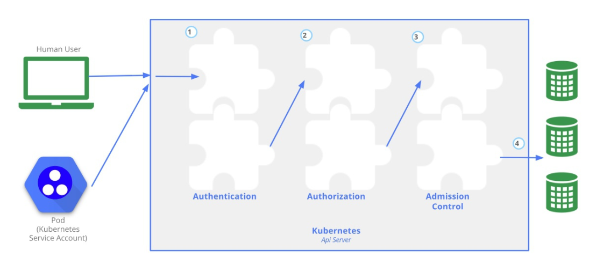
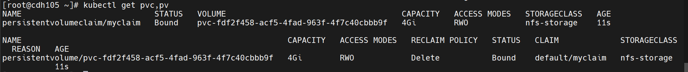
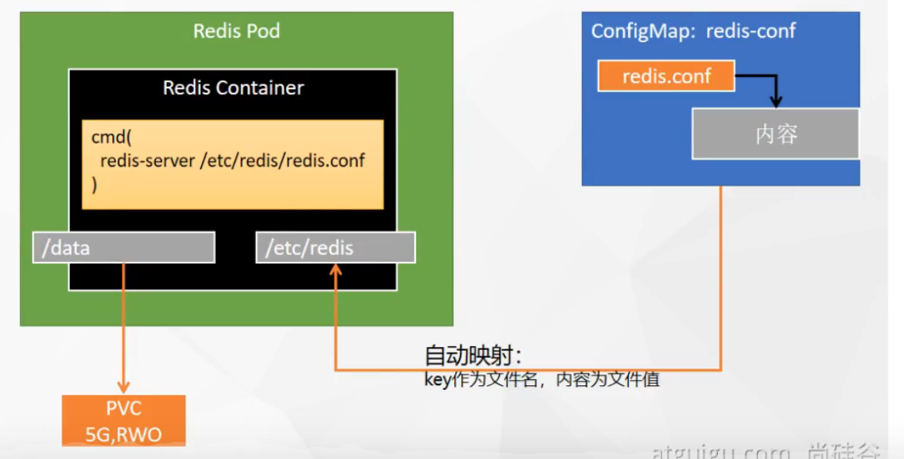

# k8s相关命令

## 集群相关

~~~shell
# 切换当前命令行默认使用的namespace
kubectl config set-context --current --namespace=my-namespace

kubectl get nodes # 查看node状态
kubectl label nodes hostnamexxx  name=value # 给node打label标签
kubectl label nodes hostnamexxx  name=value- # 删除label标签
kubectl get nodes --show-labels # 查看node状态, 带label

kubectl apply -f xxx.yaml # 按照yaml的指示创建对应的资源
kubectl delete -f xxx.yaml # 按照yaml的指示删除对应的资源, 与apply是反向操作
~~~


## pod相关命令

~~~shell
kubectl get pod # 查看默认namespace下有哪些pod, 默认的namespace默认情况下是default
kubectl get pod -n namespace # 查看指定namespace下有哪些pod
kubectl get pod -n namespace -o wild # 查看指定namespace下有哪些pod, 并附带pod的ip和存在的node
kubectl get pod -A # 查看所有namespace中的pods
kubectl get pod -n namespace # 查看指定namespace中的pods
kubectl get pod -n namespace pod_name # 查看一个pod的状态
kubectl get pod pod_name --watch # 监视pod的状态


kubectl describe pod pod_name -n namespace # 查看指定namespace中的pod的详细信息
kubectl describe pod pod_name -n namespace -o yaml # 查看指定namespace的pod的详细情况, 并以yaml的形式显示


kubectl delete pod --all # 删除所有pod
kubectl delete pod -n namespace_name --all # 删除一个namespace中所有的pod
kubectl delete pod -n namespace_name pod_name # 删除一个pod, 如果这个pod被deployment管理了, 那么deployment还会重新创建出一个pod副本


kubectl exec  -n namespace_name pod_name -c container_name -it -- /bin/bash # 进入容器内部, 如果pod只有一个container, 那么可以省略-c参数
kubectl log -n namespace_name pod_name -c container_name # 查看pod中指定容器的日志

kubectl get pod --show-labels # 查看pod的label
kubectl label pod pod_name label1=value1 --overwrite=True # 给pod添加标签, 如果已经存在同名的标签就修改
~~~

如果想要查看当前这个pod是哪个controller创建出来的

```shell
[root@node173 ~]# kubectl describe pod -n service-software seasql-base-0
Name:         seasql-base-0
Namespace:    service-software
Priority:     0
Node:         node173/10.99.209.173
Start Time:   Fri, 04 Jul 2025 14:38:35 +0800
Labels:       ...
Annotations:  ....
Status:       Running
Controlled By:  StatefulSet/seasql-base
Containers:
```

可以通过`Controlled By:  StatefulSet/seasql-base`发现当前的pod是被`seasql-base`这个StatefulSet创建出来的


## deployment相关命令

~~~shell
kubectl create deployment nginx --image=nginx
kubectl expose deployment nginx --port=80 --type=NodePort

# 根据命令生成yaml文件, --dry-run表示不执行命令
kubectl create deployment web1 --image=nginx:1.24 --dry-run -o yaml > deployment.yaml
~~~


## svc相关命令

~~~shell
kubectl expose deployment deploy_name --port=xx --type=NodePort --targetPort=xx --nodePort=xx

kubectl get svc # 查看default命名空间所有svc
kubectl get svc -A # 查看所有命名空间的svc
kubectl get svc -n namespace # 查看指定命名空间的svc
kubectl get svc -n namespace svc_name # 查看指定命名空间的指定svc

kubectl describe svc -n namespace svc_name # 查看svc的详细情况
kubectl describe svc -n namespace svc_nam -o yaml # 以yaml的形式查看svc的详细情况

kubectl delete svc --all # 删除所有的svc
kubectl delete svc -n namespace_name svc_name # 删除指定命名空间的指定svc

kubectl edit svc svc_name # 修改svc的配置
~~~


# 二进制方式安装kubernetes

参考尚硅谷k8s新版视频

https://www.bilibili.com/video/BV1GT4y1A756

## master安装etcd

安装前需要注意的事项

- **在master节点上面单独执行**

- **可以将要下载的东西通过浏览器下载好, 然后放在~目录下**, 通过wget下载会很慢

  需要下载的东西如下:

  https://pkg.cfssl.org/R1.2/cfssl_linux-amd64

  https://pkg.cfssl.org/R1.2/cfssljson_linux-amd64

  https://pkg.cfssl.org/R1.2/cfssl-certinfo_linux-amd64

  https://github.com/etcd-io/etcd/releases/download/v3.4.9/etcd-v3.4.9-linux-amd64.tar.gz


生成etcd证书

~~~shell
cd ~

# 获取cfssl
wget https://pkg.cfssl.org/R1.2/cfssl_linux-amd64
wget https://pkg.cfssl.org/R1.2/cfssljson_linux-amd64
wget https://pkg.cfssl.org/R1.2/cfssl-certinfo_linux-amd64
chmod +x cfssl_linux-amd64 cfssljson_linux-amd64 cfssl-certinfo_linux-amd64
mv cfssl_linux-amd64 /usr/local/bin/cfssl
mv cfssljson_linux-amd64 /usr/local/bin/cfssljson
mv cfssl-certinfo_linux-amd64 /usr/bin/cfssl-certinfo

# 准备etcd证书的配置文件
mkdir -p ~/TLS/{etcd,k8s}
cd TLS/etcd
cat > ca-config.json<< EOF
{
    "signing": {
        "default": {
            "expiry": "87600h"
        },
        "profiles": {
            "www": {
                "expiry": "87600h",
                "usages": [
                    "signing",
                    "key encipherment",
                    "server auth",
                    "client auth"
                ]
            }
        }
    }
}
EOF

cat > ca-csr.json<< EOF
{
    "CN": "etcd CA",
    "key": {
        "algo": "rsa",
        "size": 2048
    },
    "names": [
        {
            "C": "CN",
            "L": "Beijing",
            "ST": "Beijing"
        }
    ]
}
EOF

# 生成证书
cfssl gencert -initca ca-csr.json | cfssljson -bare ca -
ls *pem

# 使用自签ca签发etcd https证书
# !!!!!!!!!!!!!!!!!!!!!!!!!!!!!!!!!!!!!!  修改为自己的集群ip 
cat > server-csr.json<< EOF
{
    "CN": "etcd",
    "hosts": [
        "192.168.31.102",
        "192.168.31.103",
        "192.168.31.104"
    ],
    "key": {
        "algo": "rsa",
        "size": 2048
    },
    "names": [
        {
            "C": "CN",
            "L": "BeiJing",
            "ST": "BeiJing"
        }
    ]
}
EOF

# 生成证书
cfssl gencert -ca=ca.pem -ca-key=ca-key.pem -config=ca-config.json -profile=www server-csr.json | cfssljson -bare server
ls server*pem
~~~

安装etcd

~~~shell
cd ~
# 下载安装包
wget https://github.com/etcd-io/etcd/releases/download/v3.4.9/etcd-v3.4.9-linux-amd64.tar.gz

mkdir /opt/etcd/{bin,cfg,ssl} –p
tar zxvf etcd-v3.4.9-linux-amd64.tar.gz
mv etcd-v3.4.9-linux-amd64/{etcd,etcdctl} /opt/etcd/bin

# 创建etcd配置文件
# !!!!!!!!!!!!!!!!!!!!!!!!!需要修改ip
cat > /opt/etcd/cfg/etcd.conf << EOF
#[Member]
ETCD_NAME="etcd-1"
ETCD_DATA_DIR="/var/lib/etcd/default.etcd"
ETCD_LISTEN_PEER_URLS="https://192.168.31.102:2380"
ETCD_LISTEN_CLIENT_URLS="https://192.168.31.102:2379"
#[Clustering]
ETCD_INITIAL_ADVERTISE_PEER_URLS="https://192.168.31.102:2380"
ETCD_ADVERTISE_CLIENT_URLS="https://192.168.31.102:2379"
ETCD_INITIAL_CLUSTER="etcd-1=https://192.168.31.102:2380,etcd-2=https://192.168.31.103:2380,etcd-3=https://192.168.31.104:2380"
ETCD_INITIAL_CLUSTER_TOKEN="etcd-cluster"
ETCD_INITIAL_CLUSTER_STATE="new"
EOF

# systemd管理etcd
cat > /usr/lib/systemd/system/etcd.service << EOF
[Unit]
Description=Etcd Server
After=network.target
After=network-online.target
Wants=network-online.target
[Service]
Type=notify
EnvironmentFile=/opt/etcd/cfg/etcd.conf
ExecStart=/opt/etcd/bin/etcd \
--cert-file=/opt/etcd/ssl/server.pem \
--key-file=/opt/etcd/ssl/server-key.pem \
--peer-cert-file=/opt/etcd/ssl/server.pem \
--peer-key-file=/opt/etcd/ssl/server-key.pem \
--trusted-ca-file=/opt/etcd/ssl/ca.pem \
--peer-trusted-ca-file=/opt/etcd/ssl/ca.pem \
--logger=zap
Restart=on-failure
LimitNOFILE=65536
[Install]
WantedBy=multi-user.target
EOF

# 拷贝刚刚的证书到目标位置
cp ~/TLS/etcd/ca*pem ~/TLS/etcd/server*pem /opt/etcd/ssl/
~~~

## worker安装etcd

将master上的所有文件拷贝到节点2和节点3上面

~~~shell
scp -r /opt/etcd/ root@192.168.31.103:/opt/
scp -r /opt/etcd/ root@192.168.31.104:/opt/

scp /usr/lib/systemd/system/etcd.service root@192.168.31.103:/usr/lib/systemd/system/ 
scp /usr/lib/systemd/system/etcd.service
root@192.168.31.104:/usr/lib/systemd/system/

scp -r /opt/etcd/ root@192.168.31.103:/opt/
scp -r /opt/etcd/ root@192.168.31.104:/opt/

scp /usr/lib/systemd/system/etcd.service root@192.168.31.103:/usr/lib/systemd/system/
scp /usr/lib/systemd/system/etcd.service root@192.168.31.104:/usr/lib/systemd/system/
~~~

修改节点2和节点3的etcd.conf为当前ip

~~~shell
vi /opt/etcd/cfg/etcd.conf
#[Member]
ETCD_NAME="etcd-2" # 修改此处， 节点 2 改为 etcd-2， 节点 3 改为 etcd-3
ETCD_DATA_DIR="/var/lib/etcd/default.etcd"
ETCD_LISTEN_PEER_URLS="https://192.168.31.102:2380" # 修改此处为当前服务器 IP
ETCD_LISTEN_CLIENT_URLS="https://192.168.31.102:2379" # 修改此处为当前服务器 IP
#[Clustering]
ETCD_INITIAL_ADVERTISE_PEER_URLS="https://192.168.31.102:2380" # 修改此处为当前
服务器 IP
ETCD_ADVERTISE_CLIENT_URLS="https://192.168.31.102:2379" # 修改此处为当前服务器
IP
ETCD_INITIAL_CLUSTER="etcd-1=https://192.168.31.71:2380,etcd-2=https://192.168.31.72:2380,etcd-3=https://192.168.31.73:2380"  # 修改为自己集群的ip

ETCD_INITIAL_CLUSTER_TOKEN="etcd-cluster"
ETCD_INITIAL_CLUSTER_STATE="new"
~~~

自启动

~~~shell
# 设置开机自启动
systemctl daemon-reload
systemctl start etcd
systemctl status etcd
systemctl enable etcd
~~~

查看集群状态

~~~shell
ETCDCTL_API=3 /opt/etcd/bin/etcdctl --cacert=/opt/etcd/ssl/ca.pem --cert=/opt/etcd/ssl/server.pem --key=/opt/etcd/ssl/server-key.pem --endpoints="https://192.168.31.102:2379,https://192.168.31.103:2379,https://192.168.31.104:2379" endpoint health
~~~

## 总结

- 在安装之前下载好多有的包, 否则wget很慢

- **安装好master后不要着急启动, 因为配置了集群, master上的etcd启动后连接不到worker上的etcd, 不会退出命令行, 所有要master和worker一起安装好后, 再启动**

- **其实不用配置etcd集群, 只要配置一个etcd就好, 后面的k8s就用这一个etcd**
- **如果通过systemctl启动失败, 可以将etcd.service中的EnvironmentFile和ExecStart拼接上, 来执行, 如果能够执行, 说明etcd.service配置有问题, 如果不能执行, 说明etcd的配置文件有问题**

## Worker安装docker

先设置稳定的存储库

~~~shell
sudo yum install -y yum-utils
sudo yum-config-manager --add-repo http://mirrors.aliyun.com/docker-ce/linux/centos/docker-ce.repo
~~~

安装docker

~~~shell
sudo yum install docker-ce docker-ce-cli containerd.io -y
~~~

启动docker并运行hello world

~~~shell
sudo systemctl start docker
sudo systemctl enable docker
sudo docker run hello-world
~~~

修改docker镜像为阿里镜像

~~~shell
cat > /etc/docker/daemon.json << eof
{
 "registry-mirrors":["https://6kx4zyno.mirror.aliyuncs.com"]
}
eof
systemctl daemon-reload 
systemctl restart docker
~~~

## master安装kube-apiserver

签发证书

~~~shell
cd ~/TLS/k8s
cat > ca-config.json<< EOF
{
    "signing": {
        "default": {
            "expiry": "87600h"
        },
        "profiles": {
            "kubernetes": {
                "expiry": "87600h",
                "usages": [
                    "signing",
                    "key encipherment",
                    "server auth",
                    "client auth"
                ]
            }
        }
    }
}
EOF
cat > ca-csr.json<< EOF
{
    "CN": "kubernetes",
    "key": {
        "algo": "rsa",
        "size": 2048
    },
    "names": [
        {
            "C": "CN",
            "L": "Beijing",
            "ST": "Beijing",
            "O": "k8s",
            "OU": "System"
        }
    ]
}
EOF
# 生成证书
cfssl gencert -initca ca-csr.json | cfssljson -bare ca -
ls *pem
~~~

使用自签ca签发kube-apiserver https证书

~~~shell
cd ~/TLS/k8s
cat > server-csr.json<< EOF
{
    "CN": "kubernetes",
    "hosts": [
        "127.0.0.1",
        "192.168.31.104",
        "192.168.31.103",
        "192.168.31.102",
        "kubernetes",
        "kubernetes.default",
        "kubernetes.default.svc",
        "kubernetes.default.svc.cluster",
        "kubernetes.default.svc.cluster.local"
    ],
    "key": {
        "algo": "rsa",
        "size": 2048
    },
    "names": [
        {
            "C": "CN",
            "L": "BeiJing",
            "ST": "BeiJing",
            "O": "k8s",
            "OU": "System"
        }
    ]
}
EOF
~~~

生成证书

~~~shell
cfssl gencert -ca=ca.pem -ca-key=ca-key.pem -config=ca-config.json -profile=kubernetes server-csr.json | cfssljson -bare server
ls server*pem
~~~

下载k8s并放到家目录下

~~~shell
cd ~
mkdir -p /opt/kubernetes/{bin,cfg,ssl,logs}
tar -zxvf kubernetes-server-linux-amd64.tar.gz
cd kubernetes/server/bin
cp kube-apiserver kube-scheduler kube-controller-manager /opt/kubernetes/bin
cp kubectl /usr/bin/
~~~

部署kube-apiserver

~~~shell
cat > /opt/kubernetes/cfg/kube-apiserver.conf << EOF
KUBE_APISERVER_OPTS="--logtostderr=false \\
--v=2 \\
--log-dir=/opt/kubernetes/logs \\
--etcd-servers=https://192.168.31.102:2379,https://192.168.31.103:2379,https://192.168.31.104:2379 \\
--bind-address=192.168.31.102 \\
--secure-port=6443 \\
--advertise-address=192.168.31.102 \\
--allow-privileged=true \\
--service-cluster-ip-range=10.0.0.0/24 \\
--enable-admission-plugins=NamespaceLifecycle,LimitRanger,ServiceAccount,ResourceQuota,NodeRestriction \\
--authorization-mode=RBAC,Node \\
--enable-bootstrap-token-auth=true \\
--token-auth-file=/opt/kubernetes/cfg/token.csv \\
--service-node-port-range=30000-32767 \\
--kubelet-client-certificate=/opt/kubernetes/ssl/server.pem \\
--kubelet-client-key=/opt/kubernetes/ssl/server-key.pem \\
--tls-cert-file=/opt/kubernetes/ssl/server.pem \\
--tls-private-key-file=/opt/kubernetes/ssl/server-key.pem \\
--client-ca-file=/opt/kubernetes/ssl/ca.pem \\
--service-account-key-file=/opt/kubernetes/ssl/ca-key.pem \\
--etcd-cafile=/opt/etcd/ssl/ca.pem \\
--etcd-certfile=/opt/etcd/ssl/server.pem \\
--etcd-keyfile=/opt/etcd/ssl/server-key.pem \\
--audit-log-maxage=30 \\
--audit-log-maxbackup=3 \\
--audit-log-maxsize=100 \\
--audit-log-path=/opt/kubernetes/logs/k8s-audit.log"
EOF
~~~

拷贝刚刚的证书

~~~shell
cp ~/TLS/k8s/ca*pem ~/TLS/k8s/server*pem /opt/kubernetes/ssl/
~~~

TLS bootstraping 配置

~~~shell
cat > /opt/kubernetes/cfg/token.csv << EOF
c47ffb939f5ca36231d9e3121a252940,kubelet-bootstrap,10001,"system:nodebootstrapper"
EOF
~~~

systemd管理apiserver

~~~shell
cat > /usr/lib/systemd/system/kube-apiserver.service << EOF
[Unit]
Description=Kubernetes API Server
Documentation=https://github.com/kubernetes/kubernetes
[Service]
EnvironmentFile=/opt/kubernetes/cfg/kube-apiserver.conf
ExecStart=/opt/kubernetes/bin/kube-apiserver \$KUBE_APISERVER_OPTS
Restart=on-failure
[Install]
WantedBy=multi-user.target
EOF
~~~

开机自启

~~~shell
systemctl daemon-reload
systemctl start kube-apiserver
systemctl status kube-apiserver
systemctl enable kube-apiserver
~~~

授权 kubelet-bootstrap 用户允许请求证书

~~~shell
kubectl create clusterrolebinding kubelet-bootstrap \
--clusterrole=system:node-bootstrapper \
--user=kubelet-bootstrap  
~~~

## master安装kube-controller-manager

创建配置文件

~~~shell
cat > /opt/kubernetes/cfg/kube-controller-manager.conf << EOF
KUBE_CONTROLLER_MANAGER_OPTS="--logtostderr=false \\
--v=2 \\
--log-dir=/opt/kubernetes/logs \\
--leader-elect=true \\
--master=127.0.0.1:8080 \\
--bind-address=127.0.0.1 \\
--allocate-node-cidrs=true \\
--cluster-cidr=10.244.0.0/16 \\
--service-cluster-ip-range=10.0.0.0/24 \\
--cluster-signing-cert-file=/opt/kubernetes/ssl/ca.pem \\
--cluster-signing-key-file=/opt/kubernetes/ssl/ca-key.pem \\
--root-ca-file=/opt/kubernetes/ssl/ca.pem \\
--service-account-private-key-file=/opt/kubernetes/ssl/ca-key.pem \\
--experimental-cluster-signing-duration=87600h0m0s"
EOF
~~~

systemd管理controller-manager

~~~shell
cat > /usr/lib/systemd/system/kube-controller-manager.service << EOF
[Unit]
Description=Kubernetes Controller Manager
Documentation=https://github.com/kubernetes/kubernetes
[Service]
EnvironmentFile=/opt/kubernetes/cfg/kube-controller-manager.conf
ExecStart=/opt/kubernetes/bin/kube-controller-manager \$KUBE_CONTROLLER_MANAGER_OPTS
Restart=on-failure
[Install]
WantedBy=multi-user.target
EOF
~~~

开机自启

~~~shell
systemctl daemon-reload
systemctl start kube-controller-manager
systemctl status kube-controller-manager
systemctl enable kube-controller-manager
~~~

## master部署kube-scheduler

创建配置文件

~~~shell
cat > /opt/kubernetes/cfg/kube-scheduler.conf << EOF
KUBE_SCHEDULER_OPTS="--logtostderr=false \\
--v=2 \\
--log-dir=/opt/kubernetes/logs \\
--leader-elect \\
--master=127.0.0.1:8080 \\
--bind-address=127.0.0.1"
EOF
~~~

systemd管理scheduler

~~~shell
cat > /usr/lib/systemd/system/kube-scheduler.service << EOF
[Unit]
Description=Kubernetes Scheduler
Documentation=https://github.com/kubernetes/kubernetes
[Service]
EnvironmentFile=/opt/kubernetes/cfg/kube-scheduler.conf
ExecStart=/opt/kubernetes/bin/kube-scheduler \$KUBE_SCHEDULER_OPTS
Restart=on-failure
[Install]
WantedBy=multi-user.target
EOF
~~~

开机自启动

~~~shell
systemctl daemon-reload
systemctl start kube-scheduler
systemctl status kube-scheduler.service
systemctl enable kube-scheduler
~~~

查看集群状态

~~~shell
kubectl get cs
~~~

## worker部署kubelet

下载k8s包在家目录下

~~~shell
cd ~
tar zxvf kubernetes-server-linux-amd64.tar.gz
mkdir -p /opt/kubernetes/{bin,cfg,ssl,logs}
mkdir -p /root/TLS/k8s/ 
cd kubernetes/server/bin
cp kubelet kube-proxy /opt/kubernetes/bin
cp kubectl /usr/bin/ # 后面要用这个文件
~~~

创建kubelet配置文件, **hostname-override需要改为当前worker节点的主机名**

~~~shell
cat > /opt/kubernetes/cfg/kubelet.conf << EOF
KUBELET_OPTS="--logtostderr=false \\
--v=2 \\
--log-dir=/opt/kubernetes/logs \\
--hostname-override=hadoop104 \\
--network-plugin=cni \\
--kubeconfig=/opt/kubernetes/cfg/kubelet.kubeconfig \\
--bootstrap-kubeconfig=/opt/kubernetes/cfg/bootstrap.kubeconfig \\
--config=/opt/kubernetes/cfg/kubelet-config.yml \\
--cert-dir=/opt/kubernetes/ssl \\
--pod-infra-container-image=lizhenliang/pause-amd64:3.0"
EOF

cat > /opt/kubernetes/cfg/kubelet-config.yml << EOF
kind: KubeletConfiguration
apiVersion: kubelet.config.k8s.io/v1beta1
address: 0.0.0.0
port: 10250
readOnlyPort: 10255
cgroupDriver: cgroupfs
clusterDNS:
  - 10.0.0.2
clusterDomain: cluster.local
failSwapOn: false
authentication:
  anonymous:
    enabled: false
  webhook:
    cacheTTL: 2m0s
    enabled: true
  x509:
    clientCAFile: /opt/kubernetes/ssl/ca.pem
authorization:
  mode: Webhook
  webhook:
    cacheAuthorizedTTL: 5m0s
    cacheUnauthorizedTTL: 30s
evictionHard:
  imagefs.available: "15%"
  memory.available: "100Mi"
  nodefs.available: "10%"
  nodefs.inodesFree: "5%"
EOF
~~~

生成bootstrap.kubeconfig文件, 

~~~shell
# 先把master中/opt/kubernetes/ssl/ca*赋值到worker同样目录下
# 因为worker节点上没有这些东西
scp /root/TLS/k8s/ca* root@192.168.31.103:/root/TLS/k8s/ 

cp /root/TLS/k8s/ca* /opt/kubernetes/ssl/ # 同样拷贝到ssl目录下一份
KUBE_APISERVER="https://192.168.31.102:6443" # apiserver IP:PORT
TOKEN="c47ffb939f5ca36231d9e3121a252940" # 与 token.csv 里保持一致
kubectl config set-cluster kubernetes \
--certificate-authority=/opt/kubernetes/ssl/ca.pem \
--embed-certs=true \
--server=${KUBE_APISERVER} \
--kubeconfig=bootstrap.kubeconfig
kubectl config set-credentials "kubelet-bootstrap" \
--token=${TOKEN} \
--kubeconfig=bootstrap.kubeconfig
kubectl config set-context default \
--cluster=kubernetes \
--user="kubelet-bootstrap" \
--kubeconfig=bootstrap.kubeconfig
kubectl config use-context default --kubeconfig=bootstrap.kubeconfig
~~~

拷贝到配置文件路径下

~~~shell
cp bootstrap.kubeconfig /opt/kubernetes/cfg
~~~

systemd管理kubelet

~~~shell
cat > /usr/lib/systemd/system/kubelet.service << EOF
[Unit]
Description=Kubernetes Kubelet
After=docker.service
[Service]
EnvironmentFile=/opt/kubernetes/cfg/kubelet.conf
ExecStart=/opt/kubernetes/bin/kubelet \$KUBELET_OPTS
Restart=on-failure
LimitNOFILE=65536
[Install]
WantedBy=multi-user.target
EOF
~~~

开机自启动

~~~shell
systemctl daemon-reload
systemctl start kubelet
systemctl status kubelet
systemctl enable kubelet
~~~

在master上批准kublet证书申请并假如集群

~~~shell
# 查看申请
kubectl get csr
NAME AGE SIGNERNAME  REQUESTOR CONDITION
node-csr-uCEGPOIiDdlLODKts8J658HrFq9CZ--K6M4G7bjhk8A 6m3s kubernetes.io/kube-apiserver-client-kubelet kubelet-bootstrap Pending
# 批准申请
kubectl certificate approve node-csr-uCEGPOIiDdlLODKts8J658HrFq9CZ--K6M4G7bjhk8A
# 查看节点
kubectl get node
~~~

## worker部署kube-proxy

创建配置文件

~~~shell
cat > /opt/kubernetes/cfg/kube-proxy.conf << EOF
KUBE_PROXY_OPTS="--logtostderr=false \\
--v=2 \\
--log-dir=/opt/kubernetes/logs \\
--config=/opt/kubernetes/cfg/kube-proxy-config.yml"
EOF
~~~

创建配置参数文件, 需要修改hostnameOverride为当前ip地址

~~~shell
cat > /opt/kubernetes/cfg/kube-proxy-config.yml << EOF
kind: KubeProxyConfiguration
apiVersion: kubeproxy.config.k8s.io/v1alpha1
bindAddress: 0.0.0.0
metricsBindAddress: 0.0.0.0:10249
clientConnection:
  kubeconfig: /opt/kubernetes/cfg/kube-proxy.kubeconfig
hostnameOverride: hadoop104
clusterCIDR: 10.0.0.0/24
EOF
~~~

生成kube-proxy.kubeconfig文件

~~~shell
cd ~/TLS/k8s
# 创建证书请求文件
cat > kube-proxy-csr.json<< EOF
{
    "CN": "system:kube-proxy",
    "hosts": [],
    "key": {
        "algo": "rsa",
        "size": 2048
    },
    "names": [
        {
            "C": "CN",
            "L": "BeiJing",
            "ST": "BeiJing",
            "O": "k8s",
            "OU": "System"
        }
    ]
}
EOF
# 生成证书
cfssl gencert -ca=ca.pem -ca-key=ca-key.pem -config=ca-config.json -profile=kubernetes kube-proxy-csr.json | cfssljson -bare kube-proxy
ls kube-proxy*pem
~~~

生成kubeconfig文件

~~~shell
KUBE_APISERVER="https://192.168.31.102:6443"
kubectl config set-cluster kubernetes \
--certificate-authority=/opt/kubernetes/ssl/ca.pem \
--embed-certs=true \
--server=${KUBE_APISERVER} \--kubeconfig=kube-proxy.kubeconfig
kubectl config set-credentials kube-proxy \
--client-certificate=./kube-proxy.pem \
--client-key=./kube-proxy-key.pem \
--embed-certs=true \
--kubeconfig=kube-proxy.kubeconfig
kubectl config set-context default \
--cluster=kubernetes \
--user=kube-proxy \
--kubeconfig=kube-proxy.kubeconfig
kubectl config use-context default --kubeconfig=kube-proxy.kubeconfig
# 拷贝到指定目录下
cp kube-proxy.kubeconfig /opt/kubernetes/cfg/
~~~

systemd 管理 kube-proxy

~~~shell
cat > /usr/lib/systemd/system/kube-proxy.service<< EOF
[Unit]
Description=Kubernetes Proxy
After=network.target
[Service]
EnvironmentFile=/opt/kubernetes/cfg/kube-proxy.conf
ExecStart=/opt/kubernetes/bin/kube-proxy \$KUBE_PROXY_OPTS
Restart=on-failure
LimitNOFILE=65536
[Install]
WantedBy=multi-user.target
EOF
~~~

开机自启动

~~~shell
systemctl daemon-reload
systemctl start kube-proxy
systemctl status kube-proxy
systemctl enable kube-proxy
~~~

## 部署cni网络

**(没部署好, 一直都是notReady)**

前往https://github.com/containernetworking/plugins/releases/download/v0.8.6/cni-plugins-linux-amd64-v0.8.6.tgz下载cni二进制文件

并赋值到~目录

~~~shell
mkdir /opt/cni/bin /etc/cni/net.d -p
tar zxvf cni-plugins-linux-amd64-v0.8.6.tgz -C /opt/cni/bin
# 部署cni网络
wget https://raw.githubusercontent.com/coreos/flannel/master/Documentation/kube-flannel.yml
sed -i -r "s#quay.io/coreos/flannel:.*-amd64#lizhenliang/flannel:v0.12.0-amd64#g" kube-flannel.yml
kubectl apply -f kube-flannel.yml
kubectl get pods -n kube-flannel
kubectl get node
~~~

授权apiserver访问kubelet

~~~shell
cat > apiserver-to-kubelet-rbac.yaml<< EOF
apiVersion: rbac.authorization.k8s.io/v1
kind: ClusterRole
metadata:
  annotations:
    rbac.authorization.kubernetes.io/autoupdate: "true"
  labels:
    kubernetes.io/bootstrapping: rbac-defaults
  name: system:kube-apiserver-to-kubelet
rules:
  - apiGroups:
      - ""
    resources:
      - nodes/proxy
      - nodes/stats
      - nodes/log
      - nodes/spec
      - nodes/metrics
      - pods/log
    verbs:
      - "*"
 
---
apiVersion: rbac.authorization.k8s.io/v1
kind: ClusterRoleBinding
metadata:
  name: system:kube-apiserver
  namespace: ""
roleRef:
  apiGroup: rbac.authorization.k8s.io
  kind: ClusterRole
  name: system:kube-apiserver-to-kubelet
subjects:
  - apiGroup: rbac.authorization.k8s.io
    kind: User
    name: kubernetes
EOF

kubectl apply -f apiserver-to-kubelet-rbac.yaml
~~~


# kubeadm安装k8s

参考https://zhuanlan.zhihu.com/p/613288409

该文章搭建了多个master的集群, 但是这里只需要一个master

## 安装及优化

### 基本环境配置

1.环境介绍

高可用Kubernetes集群规划

| 主机名 | IP地址         | 说明       |
| ------ | -------------- | ---------- |
| cdh105 | 192.168.31.105 | master节点 |
| cdh106 | 192.168.31.106 | node节点   |
| cdh107 | 192.168.31.107 | node节点   |

2.配置信息

| 配置信息    | 备注      |
| ----------- | --------- |
| 系统版本    | Centos7.9 |
| Docker版本  | 20.10x    |
| Kubeadm版本 | v1.23.17  |

```text
$ cat /etc/redhat-release 
CentOS Linux release 7.9.2009 (Core)
$ docker --version
Docker version 20.10.21, build baeda1f
$ kubeadm version
kubeadm version: &version.Info{Major:"1", Minor:"23", GitVersion:"v1.23.17", GitCommit:"953be8927218ec8067e1af2641e540238ffd7576", GitTreeState:"clean", BuildDate:"2023-02-22T13:33:14Z", GoVersion:"go1.19.6", Compiler:"gc", Platform:"linux/amd64"}
```

3.修改主机名

(1)根据规划信息在每台机器上修改主机名

```shell
hostnamectl set-hostname cdh105
hostnamectl set-hostname cdh106
hostnamectl set-hostname cdh107
```

4.修改host文件

(1)每台机器安装vim工具,如果安装过请忽略

```text
yum install vim -y
```

(2)每台机器上修改hosts文件

```text
$ vim /etc/hosts

192.168.31.105 cdh105
192.168.31.106 cdh106
192.168.31.107 cdh107
```

5.安装yum源

(1)在每台机器上执行以下命令配置默认yum源并安装依赖

```text
curl -o /etc/yum.repos.d/CentOS-Base.repo https://mirrors.aliyun.com/repo/Centos-7.repo
yum install -y yum-utils device-mapper-persistent-data lvm2
```

(2)在每台机器上执行以下命令配置Docker的yum源

```text
yum-config-manager --add-repo https://mirrors.aliyun.com/docker-ce/linux/centos/docker-ce.repo
```

(3)在每台机器上执行以下命令配置kubernetes的yum源

```text
cat <<EOF > /etc/yum.repos.d/kubernetes.repo
[kubernetes]
name=Kubernetes
baseurl=https://mirrors.aliyun.com/kubernetes/yum/repos/kubernetes-el7-x86_64/
enabled=1
gpgcheck=0
repo_gpgcheck=0
gpgkey=https://mirrors.aliyun.com/kubernetes/yum/doc/yum-key.gpg https://mirrors.aliyun.com/kubernetes/yum/doc/rpm-package-key.gpg
EOF

sed -i -e '/mirrors.cloud.aliyuncs.com/d' -e '/mirrors.aliyuncs.com/d' /etc/yum.repos.d/CentOS-Base.repo
```

6.必备工具安装

(1)在每台机器上执行以下命令安装必备工具

```text
yum install wget jq psmisc vim net-tools telnet yum-utils device-mapper-persistent-data lvm2 git -y
```

7.关闭防火墙、swap分区、dnsmasq、selinux

(1)在每台机器上执行以下命令关闭防火墙

```text
systemctl disable --now firewalld
```

(2)在每台机器上执行以下命令关闭selinux

```text
setenforce 0
sed -i 's#SELINUX=enforcing#SELINUX=disabled#g' /etc/sysconfig/selinux
sed -i 's#SELINUX=enforcing#SELINUX=disabled#g' /etc/selinux/config
```

(3)在每台机器上执行以下命令关闭dnsmasq

```text
$ systemctl disable --now dnsmasq
Failed to execute operation: No such file or directory
```

**注意:这里如果是通过VMware虚拟机实践的，会因为没有这个服务而报错!!!**

(4)在每台机器上执行以下命令关闭NetworkManager

```text
systemctl disable --now NetworkManager
```

**注意:公有云不要关闭NetworkManager!!!**

(5)在每台机器上执行以下命令关闭swap分区

```text
#临时关闭
swapoff -a && sysctl -w vm.swappiness=0

#永久关闭
sed -ri '/^[^#]*swap/s@^@#@' /etc/fstab
```

8.时钟同步

(1)在每台机器上执行以下命令安装ntpdate

```text
rpm -ivh http://mirrors.wlnmp.com/centos/wlnmp-release-centos.noarch.rpm
yum install ntpdate -y
```

(2)在每台机器上执行以下命令同步时间

```text
ln -sf /usr/share/zoneinfo/Asia/Shanghai /etc/localtime
echo 'Asia/Shanghai' >/etc/timezone
ntpdate time2.aliyun.com

#添加定时任务
$ crontab -e
*/5 * * * * /usr/sbin/ntpdate time2.aliyun.com
```

9.升级系统

在每台机器上执行以下命令升级系统

```text
yum update -y --exclude=kernel*
```

### 内核配置

Centos7默认内核为3.10

```text
$ uname -a

Linux k8s-master01 3.10.0-1160.el7.x86_64 #1 SMP Mon Oct 19 16:18:59 UTC 2020 x86_64 x86_64 x86_64 GNU/Linux
```

1.内核升级

```text
cd /root
wget http://193.49.22.109/elrepo/kernel/el7/x86_64/RPMS/kernel-ml-devel-4.19.12-1.el7.elrepo.x86_64.rpm
wget http://193.49.22.109/elrepo/kernel/el7/x86_64/RPMS/kernel-ml-4.19.12-1.el7.elrepo.x86_64.rpm
```

在每台机器上执行以下命令安装内核

```text
cd /root && yum localinstall -y kernel-ml*
```

在每台机器上执行以下命令更改内核启动顺序

```text
grub2-set-default  0 && grub2-mkconfig -o /etc/grub2.cfg
grubby --args="user_namespace.enable=1" --update-kernel="$(grubby --default-kernel)"
```

在每台机器上执行以下命令检查默认内核是不是4.19

```text
$ grubby --default-kernel
/boot/vmlinuz-4.19.12-1.el7.elrepo.x86_64
```

(6)在每台机器上执行以下命令重启并检查默认内核是不是4.19

```text
reboot
uname -a

Linux k8s-master02 4.19.12-1.el7.elrepo.x86_64 #1 SMP Fri Dec 21 11:06:36 EST 2018 x86_64 x86_64 x86_64 GNU/Linux
```

2.**配置ipvs模块**, 一定要配置, 不了无法启动k8s

(1)在每台机器上执行以下命令安装ipvsadm

```text
yum install ipvsadm ipset sysstat conntrack libseccomp -y
```

(2)在每台机器上执行以下命令配置ipvs模块,在内核4.19+版本nf_conntrack_ipv4已经改为nf_conntrack， 4.18以下使用nf_conntrack_ipv4即可

```text
modprobe -- ip_vs
modprobe -- ip_vs_rr
modprobe -- ip_vs_wrr
modprobe -- ip_vs_sh
modprobe -- nf_conntrack
```

(3)在每台机器上修改/etc/modules-load.d/ipvs.conf文件，在文件末尾添加以下内容

```text
$ vim /etc/modules-load.d/ipvs.conf
ip_vs
ip_vs_lc
ip_vs_wlc
ip_vs_rr
ip_vs_wrr
ip_vs_lblc
ip_vs_lblcr
ip_vs_dh
ip_vs_sh
ip_vs_fo
ip_vs_nq
ip_vs_sed
ip_vs_ftp
ip_vs_sh
nf_conntrack
ip_tables
ip_set
xt_set
ipt_set
ipt_rpfilter
ipt_REJECT
ipip
```

(4)在每台机器上设置开机自启

```text
systemctl enable --now systemd-modules-load.service
```

(5)在每台机器上执行以下命令开启一些k8s集群中必须的内核参数，所有节点配置k8s内核

```text
cat <<EOF > /etc/sysctl.d/k8s.conf
net.ipv4.ip_forward = 1
net.bridge.bridge-nf-call-iptables = 1
net.bridge.bridge-nf-call-ip6tables = 1
fs.may_detach_mounts = 1
net.ipv4.conf.all.route_localnet = 1
vm.overcommit_memory=1
vm.panic_on_oom=0
fs.inotify.max_user_watches=89100
fs.file-max=52706963
fs.nr_open=52706963
net.netfilter.nf_conntrack_max=2310720

net.ipv4.tcp_keepalive_time = 600
net.ipv4.tcp_keepalive_probes = 3
net.ipv4.tcp_keepalive_intvl =15
net.ipv4.tcp_max_tw_buckets = 36000
net.ipv4.tcp_tw_reuse = 1
net.ipv4.tcp_max_orphans = 327680
net.ipv4.tcp_orphan_retries = 3
net.ipv4.tcp_syncookies = 1
net.ipv4.tcp_max_syn_backlog = 16384
net.ipv4.ip_conntrack_max = 65536
net.ipv4.tcp_max_syn_backlog = 16384
net.ipv4.tcp_timestamps = 0
net.core.somaxconn = 16384
EOF

#应用
sysctl --system
```

上面参数说明:

- net.ipv4.ip_forward：允许系统在网络接口之间转发IP数据包
- net.bridge.bridge-nf-call-iptables：启用iptables处理桥接的网络流量
- net.bridge.bridge-nf-call-ip6tables：启用ip6tables处理桥接的网络流量
- fs.may_detach_mounts：允许在使用时卸载文件系统
- net.ipv4.conf.all.route_localnet：允许本地源IP地址的数据包路由
- vm.overcommit_memory：控制内存分配的过度提交行为
- vm.panic_on_oom：控制当发生内存不足条件时内核崩溃的行为
- fs.inotify.max_user_watches：指定每个用户的最大inotify监视数
- fs.file-max：指定最大打开文件数
- fs.nr_open：指定可打开的文件句柄的最大数
- net.netfilter.nf_conntrack_max：指定最大跟踪连接数
- net.ipv4.tcp_keepalive_time：指定TCP keepalive探测之间的间隔时间
- net.ipv4.tcp_keepalive_probes：指定可以发送的TCP keepalive探测的数量
- net.ipv4.tcp_keepalive_intvl：指定TCP keepalive探测之间的间隔时间
- net.ipv4.tcp_max_tw_buckets：指定timewait套接字的最大数量
- net.ipv4.tcp_tw_reuse：控制timewait套接字是否可以被重用
- net.ipv4.tcp_max_orphans：指定最大孤立套接字数量
- net.ipv4.tcp_orphan_retries：指定孤立套接字的重试次数
- net.ipv4.tcp_syncookies：启用TCP syncookies以防止SYN洪泛攻击
- net.ipv4.tcp_max_syn_backlog：指定侦听队列的最大大小
- net.ipv4.ip_conntrack_max：指定最大跟踪连接数
- net.ipv4.tcp_max_syn_backlog：指定侦听队列的最大大小
- net.ipv4.tcp_timestamps：启用TCP时间戳以进行性能优化
- net.core.somaxconn：指定侦听队列中的最大连接数

(6)重启每台机器

```text
reboot
```

(7)在每台机器上执行以下命令进行验证，有"nf_conntrack"和"ip_vs"字样代表成功

```text
lsmod | grep --color=auto -e ip_vs -e nf_conntrack
```


### Containerd作为Runtime

如果安装的版本低于1.24，选择Docker和Containerd均可，高于1.24选择Containerd作为Runtime。

1.在每台机器上执行以下命令安装docker-ce-20.10,注意这里安装docker时会把Containerd也装上

```text
sudo yum-config-manager --add-repo http://mirrors.aliyun.com/docker-ce/linux/centos/docker-ce.repo
yum install docker-ce-20.10.* docker-ce-cli-20.10.* -y
```

**注意!!:**  如果这里安装docker报兼容性错误, 说明之前安装过docker, 没有删除干净

使用一下命令

~~~shell
$ yum list installed | grep docker
docker-buildx-plugin.x86_64   0.11.2-1.el7   @docker-ce-stable
docker-compose-plugin.x86_64  2.21.0-1.el7  @docker-ce-stable
$ rpm -e docker-buildx-plugin.x86_64 docker-compose-plugin.x86_64
~~~


2.在每台机器上执行以下命令配置Containerd所需的模块

```text
cat <<EOF | sudo tee /etc/modules-load.d/containerd.conf
overlay
br_netfilter
EOF
```

3.在每台机器上执行以下命令加载模块

```text
modprobe -- overlay
modprobe -- br_netfilter
```

4.在每台机器上执行以下命令配置Containerd所需的内核

```text
cat <<EOF | sudo tee /etc/sysctl.d/99-kubernetes-cri.conf
net.bridge.bridge-nf-call-iptables  = 1
net.ipv4.ip_forward                 = 1
net.bridge.bridge-nf-call-ip6tables = 1
EOF
```

5.在每台机器上执行以下命令加载内核

```text
sysctl --system
```

6.在每台机器上执行以下命令配置Containerd的配置文件

```text
mkdir -p /etc/containerd
containerd config default | tee /etc/containerd/config.toml
```

7.在每台机器上执行以下命令将`Containerd`的`Cgroup`改为`Systemd`,找到**containerd.runtimes.runc.options**，添加**SystemdCgroup = true（如果已存在直接修改，否则会报错）**

```text
$ vim /etc/containerd/config.toml
...
...
[plugins."io.containerd.grpc.v1.cri".containerd.runtimes.runc.options]
  BinaryName = ""
  CriuImagePath = ""
  CriuPath = ""
  CriuWorkPath = ""
  IoGid = 0
  IoUid = 0
  NoNewKeyring = false
  NoPivotRoot = false
  Root = ""
  ShimCgroup = ""
  SystemdCgroup = true
```


8.在每台机器上执行以下命令将sandbox_image的Pause镜像改成符合自己版本的地址[http://registry.cn-hangzhou.aliyuncs.com/google_containers/pause:3.6](https://link.zhihu.com/?target=http%3A//registry.cn-hangzhou.aliyuncs.com/google_containers/pause%3A3.6)

```text
$ vim /etc/containerd/config.toml

#原本内容
sandbox_image = "registry.k8s.io/pause:3.6"
#修改后的内容
sandbox_image = "registry.cn-hangzhou.aliyuncs.com/google_containers/pause:3.6"
```


9.在每台机器上执行以下命令启动Containerd，并配置开机自启动

```text
systemctl daemon-reload
systemctl enable --now containerd
systemctl enable --now docker

$ ls /run/containerd/containerd.sock
/run/containerd/containerd.sock
```

10.在每台机器上执行以下命令配置crictl客户端连接的运行时位置

```text
cat > /etc/crictl.yaml <<EOF
runtime-endpoint: unix:///run/containerd/containerd.sock
image-endpoint: unix:///run/containerd/containerd.sock
timeout: 10
debug: false
EOF
```

11.在每台机器上执行以下命令进行验证

```text
$ ctr image ls
REF TYPE DIGEST SIZE PLATFORMS LABELS
```

12.修改docker镜像为阿里镜像

~~~shell
cat > /etc/docker/daemon.json << eof
{
 "registry-mirrors":["https://6kx4zyno.mirror.aliyuncs.com"]
}
eof
systemctl daemon-reload 
systemctl restart docker
~~~

## 搭建集群


### 安装Kubernetes组件Kubeadm&Kubelet

1.在Master01节点查看最新的Kubernetes版本是多少

```text
yum list kubeadm.x86_64 --showduplicates | sort -r
```

2.在每台机器上执行以下命令安装1.23最新版本kubeadm、kubelet和kubectl

```text
yum install kubeadm-1.23* kubelet-1.23* kubectl-1.23* -y
#查看版本
kubeadm version
# 一定要看清楚, 装的是1.23版本的kubenetes
```

**注意!!!!**如果这里安装的不是1.23版本的k8s, 说明之前安装过了其他版本的, 使用以下脚本删除掉

~~~shell
$ yum list installed | grep kube
cri-tools.x86_64                        1.26.0-0                       @kubernetes
kubeadm.x86_64                          1.28.2-0                       @kubernetes
kubectl.x86_64                          1.28.2-0                       @kubernetes
kubelet.x86_64                          1.28.2-0                       @kubernetes
kubernetes-cni.x86_64                   1.2.0-0                        @kubernetes

$  yum remove -y kubeadm.x86_64 kubectl.x86_64 kubelet.x86_64  kubernetes-cni.x86_64
~~~


3.在每台机器上执行以下命令更改Kubelet的配置使用Containerd作为Runtime，如果选择的是docker作为的Runtime,则不需要进行更改

```text
cat >/etc/sysconfig/kubelet<<EOF
KUBELET_KUBEADM_ARGS="--container-runtime=remote --runtime-request-timeout=15m --container-runtime-endpoint=unix:///run/containerd/containerd.sock"
EOF
```

4.在每台机器上执行以下命令设置Kubelet开机自启动（由于还未初始化，没有kubelet的配置文件，此时kubelet无法启动，无需管理）

```text
systemctl daemon-reload
systemctl enable --now kubelet
systemctl status kubelet

```

**说明:由于还未初始化，没有kubelet的配置文件，此时kubelet无法启动，无需管理**

### Master节点初始化

<font color=red>(如果按照以下步骤初始化master节点, 会报错, could not find node cdh105, 猜测应该是哪里的ip地址配错了, 因为这里作者搭建的高可用的master, 而我们这里只搭建了一个master), 可以使用尚硅谷的初始化命令来初始化master  `kubeadm init --apiserver-advertise-address=192.168.1.105 --image-repository registry.aliyuncs.com/google_containers --kubernetes-version v1.23.17 --service-cidr=10.96.0.0/12 --pod-network-cidr=10.244.0.0/16`</font>

> Note: 需要修改上面的ip

1.Master01节点创建kubeadm-config.yaml配置文件如下

```text
cat > kubeadm-config.yaml << eof
apiVersion: kubeadm.k8s.io/v1beta2
bootstrapTokens:
- groups:
  - system:bootstrappers:kubeadm:default-node-token
  token: 7t2weq.bjbawausm0jaxury
  ttl: 24h0m0s
  usages:
  - signing
  - authentication
kind: InitConfiguration
localAPIEndpoint:
  advertiseAddress: 192.168.31.105 #Master01节点的IP地址
  bindPort: 6443
nodeRegistration:
  criSocket: /run/containerd/containerd.sock 
  name: cdh105
  taints:
  - effect: NoSchedule
    key: node-role.kubernetes.io/master

---
apiServer:
  # certSANs:
  # - 192.168.1.38    #VIP地址/公有云的负载均衡地址
  timeoutForControlPlane: 4m0s
apiVersion: kubeadm.k8s.io/v1beta2
certificatesDir: /etc/kubernetes/pki
clusterName: kubernetes
controlPlaneEndpoint: 192.168.31.105:16443 # control plane的地址
controllerManager: {}
dns:
  type: CoreDNS
etcd:
  local:
    dataDir: /var/lib/etcd
imageRepository: registry.cn-hangzhou.aliyuncs.com/google_containers
kind: ClusterConfiguration
kubernetesVersion: v1.23.17 #此处版本号和kubeadm版本一致
networking:
  dnsDomain: cluster.local
  podSubnet: 172.16.0.0/12
  serviceSubnet: 10.0.0.0/16
scheduler: {}

eof
```

2.Master01节点上更新kubeadm文件

```text
kubeadm config migrate --old-config kubeadm-config.yaml --new-config new.yaml
```

3.提前下载镜像，可以节省初始化时间（其他节点不需要更改任何配置，包括IP地址也不需要更改）

```text
kubeadm config images pull --config /root/new.yaml
```

5.所有节点设置开机自启动kubelet

```text
systemctl enable --now kubelet
```

6.Master01节点初始化，初始化以后会在/etc/kubernetes目录下生成对应的证书和配置文件，之后其他Master节点加入Master01即可

```text
kubeadm init --config /root/new.yaml  --upload-certs
```


> Note: 如果初始化失败，重置后再次初始化，命令如下（没有失败不要执行）

```text
kubeadm reset -f ; ipvsadm --clear  ; rm -rf ~/.kube
```

7.Master01节点配置环境变量,用于访问Kubernetes集群

```text
$  mkdir -p $HOME/.kube
$  sudo cp -i /etc/kubernetes/admin.conf $HOME/.kube/config
$  sudo chown $(id -u):$(id -g) $HOME/.kube/config

#查看节点状态
$ kubectl get node
NAME           STATUS     ROLES                  AGE    VERSION
k8s-master01   NotReady   control-plane,master   4m5s   v1.23.17
```

### 添加Master和Node到k8s集群

1.添加Master02节点和Master03节点到k8s集群

```text
$ kubeadm join 192.168.1.38:16443 --token 7t2weq.bjbawausm0jaxury \
    --discovery-token-ca-cert-hash sha256:d0a8d94ca10c0cc4f12d4fcc54c64acb1badf815e1996f7c8248f57dd401eaf7 \
    --control-plane --certificate-key cb5dc10c285a6b74df4bd0b6fc5339f7e4f1db1ef367b972b06d193cc7a3a86b
```

2.添加Node01节点和Node02节点到k8s集群

```text
$ kubeadm join 192.168.1.38:16443 --token 7t2weq.bjbawausm0jaxury \
    --discovery-token-ca-cert-hash sha256:d0a8d94ca10c0cc4f12d4fcc54c64acb1badf815e1996f7c8248f57dd401eaf7
```

3.在Master01节点上查看节点状态

```text
$ kubectl get node 
NAME           STATUS     ROLES                  AGE     VERSION
k8s-master01   NotReady   control-plane,master   7m11s   v1.23.17
k8s-master02   NotReady   control-plane,master   2m28s   v1.23.17
k8s-master03   NotReady   control-plane,master   102s    v1.23.17
k8s-node01     NotReady   <none>                 106s    v1.23.17
k8s-node02     NotReady   <none>                 84s 
```

### 安装cni

从https://raw.githubusercontent.com/coreos/flannel/master/Documentation/kube-flannel.yml下载kube-flannel.yml文件到linux上

~~~shell
$ kubectl apply -f kube-flannel.yml
$ kubectl get pod -n kube-flannel
NAME                    READY   STATUS    RESTARTS   AGE
kube-flannel-ds-c2bpd   1/1     Running   0          4m33s
kube-flannel-ds-xqn7q   1/1     Running   0          4m33s
kube-flannel-ds-zwkrp   1/1     Running   0          4m33s
$ kubectl get pod -n kube-system
NAME                             READY   STATUS    RESTARTS   AGE
coredns-6d8c4cb4d-4hmkp          1/1     Running   0          23m
coredns-6d8c4cb4d-5676h          1/1     Running   0          23m
etcd-cdh105                      1/1     Running   1          23m
kube-apiserver-cdh105            1/1     Running   1          23m
kube-controller-manager-cdh105   1/1     Running   1          23m
kube-proxy-4vf2s                 1/1     Running   0          22m
kube-proxy-855xx                 1/1     Running   0          22m
kube-proxy-m6db6                 1/1     Running   0          23m
kube-scheduler-cdh105            1/1     Running   1          23m
kubectl get nodes
$ NAME     STATUS   ROLES                  AGE   VERSION
cdh105   Ready    control-plane,master   23m   v1.23.17
cdh106   Ready    <none>                 23m   v1.23.17
cdh107   Ready    <none>                 22m   v1.23.17
~~~

### 测试集群

~~~shell
kubectl create deployment nginx --image=nginx
kubectl expose deployment nginx --port=80 --type=NodePort
kubectl get pod,svc  
~~~


访问`cdh105:32015`


# K8S的网络模型

Kubernetes的网络模型假定了所有的Pod都在一个现成可以直接连通的扁平的网络空间中, 这在GCE (Google Compute Engine) 里面是现成的网络模型,  Kubernetes假定这个网络已经存在了

但是在私有云里面搭建Kubernetes集群, 就不能假定这个网络已经存在了, 我们需要自己实现这个网络, 将不同节点上的Docker容器之间的相互访问先打通, 然后才能运行Kubernetes


在同一个Pod之间, 不同的容器因为共享`Pause`容器的网络栈, 所以可以直接通过`localhost`来调用

而不同的Pod之间, 我们可以通过Overlay Network 来相互通讯, 而Overlay Network可以通过Flannel来实现

Pod与Service之间的通讯, 我们可以通过各个节点的Iptables规则来实现

Pod与外网通讯:  Pod向外网发送请求，查找路由表，转发数据包到宿主机的网卡，宿主网卡完成路由选择后，iptables执行Masquerade，把源IP更改为宿主网卡的IP，然后向外网服务器发送请求

外网访问Pod:Service   


# Namespace

namespace主要用于隔离pod, controller, service, pv, pvc等资源

如果我们直接调用`kubectl get xxx` 实际上获取的是`default`命名空间下的资源信息

如果我们要查看其他命名空间中的资源的话, 那么可以调用`kubectl get xxx -n namespace_name` 来获取指定命名空间下的namespace


相关命令

1. 创建namespace

   - 直接命令调用

     ~~~shell
     kubectl create ns xxx # 来创建namespace
     ~~~

   - 通过yaml来调用

     ~~~yaml
     kind: Namespace  #类型为Namespace
     apiVersion: v1 #类型为Namespace
     metadata:
       name: orange-test  #命名空间名称
       labels:
         name: orange-test-v1 
     ~~~

     ```shell
     kubectl create -f ns.yaml
     ```

2. 查看和设置默认的namespace

   ~~~shell
   kubectl config view --minify --output 'jsonpath={..namespace}' # 如果不输出任何内容, 那么使用的是默认的命名空间
   
   kubectl config set-context --current --namespace=<your-namespace> # 设置当前命令行默认使用的namespace, 这样就不用每次输入 -n xxx来指定需要使用的namespace了
   ~~~

   

3. 其他的命令

   ~~~shell
   kubectl get ns # 查看所有的namespace
   
   kubectl delete ns xxx # 删除ns
   ~~~

   


# Pod

对于一个Pod, K8S首先会启动一个名为`Pause`的容器,  然后其他的业务容器会共享`Pause`的网络栈和数据卷, 他有业务容器就可以使用`localhost`的来调用其他的容器中的应用了

同时多个业务容器的端口也不能冲突了, 因为他们共享`Pause`的网络栈


## pod的生命周期以及创建的过程


当我们通过`kubectl create -f xxx.yaml`来创建pod的时候,  Kubernetes

- 首先会对容器的环境进行初始化

- 创建出`Pause`容器, 并挂载数据卷到他身上

- 创建InitC 容器, 来执行一些准备步骤

  如果我们的业务Pod, 需要在存储卷中有特定的文件, 才能够启动, 那么我们就可以通过InitC容器, 让他来准备这些文件, 到存储卷中

  InitC容器可以有多个, 只要上一个InitC容器执行完毕, 正常退出, 那么就会启动下一个InitC容器, 执行下一个步骤

- 所有的InitC容器都正常执行完毕

- **并行**创建Pod中所有的容器, 并且并发执行容器的`containers[].lifecycle.postStart`钩子

- 对容器进行启动探针检测, 就绪探针/存活探针检测

- 执行容器的`containers[].lifecycle.preStop`钩子, 并销毁容器


## InitC容器

一个Pod里面有多个容器,  并且也可以有多个先于业务容器启动的InitC容器

InitC容器与业务容器非常的像, 除了如下两点:

- InitC容器总是运行到完成为止
- 每个InitC容器必须在上一个InitC容器完成后, 才能启动
- 如果pod重启了, 那么所有的InitC容器都必须重新执行

如果Pod的InitC容器启动失败, 那么Kubernetes会根据restartPolicy来重新处理这个Pod


InitC的主要作用有

- 因为InitC容器是在`pause`容器启动之后启动的, 所以可以访问数据卷, 所以可以帮助业务容器来准备一些启动时必须的文件

~~~yaml
apiVersion: v1
kind: Pod
metadata:
  name: multi-init-demo
spec:
  containers:
    - name: main-container
      image: nginx
      ports:
        - containerPort: 80
      volumeMounts:
        - name: shared-data
          mountPath: /usr/share/nginx/html

  initContainers:
    - name: init-download-data
      image: busybox
      command: ['sh', '-c', 'echo "Downloading data..." > /data/index.html']
      volumeMounts:
        - name: shared-data
          mountPath: /data
    - name: init-permissions
      image: busybox
      command: ['sh', '-c', 'chmod 755 /data/index.html']
      volumeMounts:
        - name: shared-data
          mountPath: /data
  volumes:
    - name: shared-data
      emptyDir: {}
~~~

## 探针

探针是由Kubelet对容器的定期诊断,  主要由三种形式的探测

- startupProbe 启动探针

  主要是用来检查容器中的应用是否启动成功, 特别是针对慢启动应用

  如果在规定时间内没有启动成功就会杀死容器并执行restartPolicy

  如果探测成功就表示应用成功启动了, 后续就不会再进行探测了

- livenessProbe 存活探针

  启动探针成功之后才会启动存活探针, 他主要用来检查容器中的应用是否存活

  检查失败会杀死容器,然后根据restartPolicy来操作

  存活探针会伴随pod的一生, 直到pod被删除

- readinessProbe 就绪检查

  启动探针成功之后才会启动继续探针, 他主要用来检查应用是否能够正常提供服务

  检查失败表示当前应用不能正常提供服务, 就把pod的ready状态改为false并从Service的负载均衡中从剔除

  检查成功后, 又会将pod的ready状态改为true,并重新加入到Service的负载均衡中

  当一个 Pod 内的所有容器都就绪时，才能认为该 Pod 就绪

  就绪检查会伴随pod的一生, 直到pod被删除


同时上面的三种形式的探针, 都可以通过如下的三种形式来实现

- ExecAction: 在容器内执行指定命令, 如果命令退出时返回码为0, 那么认为诊断成功
- TCPSocketAction: 对指定容器的端口进行tcp检查,  如果端口打开, 那么认为是诊断成功
- HTTPGetAction: 对指定容器的端口, 调用http get请求, 如果响应状态码 >=200 并且 < 400, 那么认为诊断成功

~~~yaml
apiVersion: v1
kind: Pod
metadata:
  name: jvm-app-with-cmd-probes
spec:
  containers:
    - name: jvm-app
      image: openjdk:17
      # jvm启动之后, 会创建一个app-started文件
      command: ["sh", "-c", "java -jar /app/myapp.jar & touch /tmp/app-started && wait"]

      # 启动探针：
      startupProbe:
        exec:
          # 检测 /tmp/app-started 是否存在, 如果存在, 那么命令的状态码为0, 表示检测成功
          command: ["sh", "-c", "test -f /tmp/app-started"] 
        iniinitialDelaySeconds: 10 # 延迟10s之后开始探测
        timeoutSeconds: 1 # 如果命令1s内没有返回, 认为检测失败了
        periodSeconds: 5  # 每5s执行一次探测
        failureThreshold: 30 # 如果连续30次探测失败了, 那么认为启动失败, 根据restartPolicy处理
        successThreshold: 1 # 连续1次探测成功了后, 认为探测成功了, 因为这里是启动探测, 必须设置为1
        terminationGracePeriodSeconds: 30 # 如果探针失败, 会关闭容器, 然后根据restartPolicy来处理Pod, 这里表示等待容器停止的时间, 超过这个时间会强制停止

      # 存活探针（容器是否挂掉）
      livenessProbe:
        tcpSocket:
          port: 8080 # 看看8080端口是否开启了tcp, 如果开启了认为检测成功
        iniinitialDelaySeconds: 10 
        timeoutSeconds: 1 # 如果命令1s内没有返回, 认为检测失败了
        periodSeconds: 5  # 每5s执行一次探测
        failureThreshold: 30 # 如果连续30次探测失败了, 那么认为启动失败
        successThreshold: 1 # 连续1次探测成功了后, 认为探测成功了, 存活探针这里必须是1
        terminationGracePeriodSeconds: 30 # 如果探针失败, 会关闭容器, 然后根据restartPolicy来处理Pod, 这里表示等待容器停止的时间, 超过这个时间会强制停止

      # 就绪探针（应用是否可以对外服务）
      readinessProbe:
        httpGet:
          # 访问容器的http://8080:/read, 看看状态码是不是>=200 < 400, 如果是, 那么探测成功
          path: /ready
          port: 8080
          HttpHeaders:
          - name: aaa
            value: bbb
        iniinitialDelaySeconds: 10 
        timeoutSeconds: 1 # 如果命令1s内没有返回, 认为检测失败了
        periodSeconds: 5  # 每5s执行一次探测
        failureThreshold: 30 # 如果连续30次探测失败了, 那么认为启动失败
        successThreshold: 3 # 连续3次探测成功了后, 认为探测成功了, 因为这里是启动探测, 必须设置为1
        terminationGracePeriodSeconds: 30 # 如果探针失败, 会关闭容器, 然后根据restartPolicy来处理Pod, 这里表示等待容器停止的时间, 超过这个时间会强制停止
~~~

## 容器的启动和关闭钩子

Kubernetes在启动容器的时候, 会并行的调用`lifecycle.postStart`中的钩子

同时在容器关闭之前, 会调用`lifecycle.preStop`中的钩子

~~~YAML
apiVersion: v1
kind: Pod
metadata:
  name: jvm-lifecycle-demo
spec:
  containers:
    - name: jvm-app
      image: openjdk:17
      command: ["sh", "-c"]
      args:
        - |
          echo "Starting Java app..." && \
          java -jar /app/myapp.jar

      lifecycle:
        postStart:
          exec:
            command:
              - sh
              - -c
              - echo "[postStart] App started at $(date)" >> /tmp/lifecycle.log

        preStop:
          exec:
            command:
              - sh
              - -c
              - |
                echo "[preStop] Cleaning up at $(date)" >> /tmp/lifecycle.log && \
                sleep 5  # 模拟清理动作

      volumeMounts:
        - name: tmp-volume
          mountPath: /tmp

  volumes:
    - name: tmp-volume
      emptyDir: {}
~~~


## Pod的状态

当我们调用`kubectl get pod -n namespace_name`的时候, 会显示pod的状态

~~~shell
kubectl get pods -A
NAMESPACE          NAME                                        READY   STATUS              RESTARTS   AGE
kube-system        calico-kube-controllers-68fb684666-lmrcn    1/1     Running             0          27h
kube-system        calico-node-dq5lx                           1/1     Running             0          27h
~~~

status的状态有如下几种

- Pending 挂起

  表示创建Pod的命令已经被Kubernetes, 但是Pod中还有一个或者多个容器尚未创建. 

  可能是因为还在调度Pod到特定的容器上, 或者通过网络下载镜像

- Running 运行中

  一个Pod已经被绑定到了一个Node上, Pod中所有的容器都已经创建完毕

  至少有一个容器正在运行, 或者正在处于启动/重启状态

- Succeeded 成功

  Pod中所有的容器都一个成功停止, 执行完毕

- Failed 失败

  Pod中所有的容器都已经停止, 并且至少有一个容器是失败停止的

- Unknown 未知

  Kubernetes Master与Node网络通讯失败,  无法获取Pod的状态


## Pod文件格式解析

你可以通过`kubectl explain pod`来查看pod文件中可以写哪些内容

如果你想要看特定的字段下, 有哪些子字段, 那么可以通过类似`kubectl explain pod.apiVersion`, `kubectl explian pod.spec.nodeSelector`的形式来查看

~~~yaml
apiVersion: v1       #必选，版本号，例如v1
kind: Pod       #必选，Pod
metadata:       #必选，元数据
  name: string       #必选，Pod名称
  namespace: string    #必选, Pod所属的命名空间
  labels:      # 指定pod的label
    name1: string1  
    name2: string2
  annotations:       #自定义注释列表
    name1: string1  
    name2: string2
spec:         #必选，Pod中容器的详细定义
#-----------------------重启策略-----------------------------------------------
  # pod重启策略 [Always(默认, 容器退出后总是重启容器) | OnFailure(只有退出状态码为非0时才重启容器) | Never(不管什么情况退出, 都不重启)] 
  # 注意: Always也不是立即重启容器, 而是随重启次数等待越来越长的时间, 在等待的时候会显示CrashLoopBackOff状态
  restartPolicy: Always 
#-----------------------------节点选择器----------------------------------------    
  # 设置NodeSelector表示将该Pod调度到包含这个label的node上，以key：value的格式指定
  # 通过kubectl label node node_name  label_name=value  来给node设置label
  # 通过kubectl get nodes --show-labels 来显示node的label
  nodeSelector: 
    lable1: value
    lable2: value
#----------------------------------------------------------------------------
  affinity:
#-----------------------节点亲和性------------------------------
    nodeAffinity:
      requiredDuringSchedulingIgnoredDuringExecution: # 硬亲和性, 选择的节点的label必须满足这些条件
        nodeSelectorTerms:
          - matchExpressions:
            - key: disktype # key
              operator: In # 操作符[In NotIn Exists Gt Lt Equal DoesNotExists]
              values: # value
              - ssd 
      preferredDuringSchedulingIgnoredDuringExecution: # 软亲和性, 优先选择label满足这些条件的节点
      - weight: 1 # 权重
        preference:
          matchExpressions:
            - key: disktype # key
              operator: In  # 操作符[In NotIn Exists Gt Lt Equal DoesNotExists]
              values: # value
              - ssd 
#---------------------------------------------------------------
  imagePullSecrets: #Pull镜像时使用的secret名称，以key：secretkey格式指定
  - name: string
  hostNetwork: false  #是否使用主机网络模式，默认为false，如果设置为true，表示使用宿主机网络,而不是docker网桥, 同时设置了true将导致同一台主机上无法启动两个相同的副本
#---------------------container-----------------------------------
  containers:      #必选，Pod中容器列表, 是一个数组, 可以指定多个containers
  - name: string     #可选，容器名称, 不写随机创建
    image: string    #必选，容器的镜像名称
    # 可选, 获取镜像的策略 IfnotPresent(默认)表示优先使用本地镜像，否则下载镜像，Nerver表示仅使用本地镜像, Alawys表示总是下载镜像 
    imagePullPolicy: [Always | Never | IfNotPresent] 
    # command和args都是可选的, 都是数组, command不指定时会使用打包时使用的启动命令, args默认为空
    command: ["sh", "-c"]
    args: ["echo Hello && sleep 3600"]
    workingDir: string     #可选,容器的工作目录
#----------- 端口暴露-----------------------------------------------------
    ports:       #需要暴露的端口库号列表
      - name: string     #端口号名称
        containerPort: int   # 需要暴露的容器的端口号
        hostPort: int    # 主机端口号，默认与Container相同, !!!!注意!!!!如果指定了hostPort, 那么同一台主机上无法启动两个相同的副本, 因为端口号会冲突
        protocol: string     #端口协议，支持TCP和UDP，默认TCP
#---------------环境变量-----------------------------------------------------
    env:       #容器运行前需设置的环境变量列表
      - name: string     #环境变量名称
        value: string    #环境变量的值
#--------------------数据卷挂载------------------------------------
    volumeMounts:    #挂载到容器内部的存储卷配置
      - name: string     # 引用pod定义的共享存储卷的名称，需用volumes[]部分定义的的卷名
        mountPath: string    #存储卷在容器内mount的绝对路径，应少于512字符
        readOnly: boolean    #是否为只读模式
#--------------------资源限制-----------------------------------------
    resources:       #资源限制和请求的设置
      limits:      # 资源最大的设置
        cpu: string    #Cpu的限制，1000m表示1个core，将用于docker run --cpu-shares参数
        memory: string     #内存限制，单位可以为Mib/Gib，将用于docker run --memory参数
      requests:      #资源最小的设置
        cpu: string    #Cpu请求，容器启动的初始可用数量
        memory: string     #内存清楚，容器启动的初始可用数量
#--------------资源调整时是否重启-------------------------------------
    # 指定在运行时, 重新分配资源时是否需要重启容器(一般调整cpu都无需重启容器, 而调整内存需要)
    # resourceName: 调整的资源 cpu, memory
    # restartPolicy: NotRequired(默认)不重启容器,  RestartContainer重启容器
    resizePolicy:
      - resourceName: cpu
        restartPolicy: NotRequired
      - resourceName: memory
        restartPolicy: RestartContainer
#-----------------启动销毁钩子函数----------------------
    lifecycle:
      postStart: # 容器创建后立即执行, 和容器的代码是异步执行的
        exec:
          command: ["/bin/sh", "-c", "echo helloworld > /usr/share/message"]
      preStop: # 容器结束前执行
        exec:
          command: ["/bin/sh", "-c", "echo stop > /usr/share/message"]
#--------------------------健康检查和重启机制---------------
    # 探针主要有三种: startupProbe, livenessProbe, readinessProbe
    # 
    # startupProbe 启动探针: 
    #   主要是用来检查容器中的应用是否启动成功, 特别是针对慢启动应用
    #   如果在规定时间内没有启动成功就会杀死容器并执行restartPolicy, 
    #   如果探测成功就表示应用成功启动了, 后续就不会再进行探测了
    # livenessProbe 存活探针: 
    #   启动探针成功之后才会启动存活探针, 他主要用来检查容器中的应用是否存活
    #   检查失败会杀死容器,然后根据restartPolicy来操作
    #   存活探针会伴随pod的一生, 直到pod被删除
    # readinessProbe 就绪检查: 
    #   启动探针成功之后才会启动继续探针, 他主要用来检查应用是否能够正常提供服务
    #   检查失败表示当前应用不能正常提供服务, 就把pod的ready状态改为false并从Service的负载均衡中从剔除
    #   当检查成功后, 又会将pod的ready状态改为true,并重新加入到Service的负载均衡中
    #   当一个 Pod 内的所有容器都就绪时，才能认为该 Pod 就绪
    #   就绪检查会伴随pod的一生, 直到pod被删除
    # 
    # 在实际中, 就绪探针和存活探针都使用相同的http, 但是存活探针的failureThreshold比较大, 这样如果短时间失败就把pod从负载均衡器中提出, 如果长时间失败就会杀死容器
    
    livenessProbe:     
      # 检查方法有exec、httpGet和tcpSocket
      # exec: 执行command进行状态检查, 如果command的退出状态码是0, 表示成功, 其他表示不成功, 可以通过echo $? 来输出上一个命令的退出状态码
      # http: 对容器调用http方式检查状态, 返回>=200  <400范围的状态码表示成功
      # tcopSocket: 发起tcp socket建立成功即表示存活   
      exec:      #对Pod容器内检查方式设置为exec方式
        command: [string]  #exec方式需要制定的命令或脚本
      httpGet:       #对Pod内个容器健康检查方法设置为HttpGet，需要制定Path、port
        path: string
        port: number
        host: string
        scheme: string
        HttpHeaders:
        - name: string
          value: string
      tcpSocket:     #发起tcp socket建立成功即表示存活
         port: number
      initialDelaySeconds: 10  # 初次探测的延迟时间，单位为秒, 如果定义了启动探针，则存活探针和就绪探针的延迟将在启动探针已成功之后才开始计算。 默认是 0 秒，最小值是 0。
      timeoutSeconds: 1   #对容器健康检查探测等待响应的超时时间，单位秒，默认1秒, 最小值1秒
      periodSeconds: 1    #对容器监控检查的定期探测时间设置，单位秒，默认10秒一次, 最小值1秒
      successThreshold: 1 # 探针在失败后，被视为成功的最小连续成功数。默认值是 1。 存活和启动探测的这个值必须是 1。最小值是 1。
      failureThreshold:  # 探针连续失败了 failureThreshold 次之后， Kubernetes 认为总体上检查已失败
      terminationGracePeriodSeconds: 30 # 触发停止操作等待容器停止的时间, 超过这个事件将会强制停止容器, 默认为30 秒，最小值为 1
#---------------------定义数据卷---------------------------------------------
  volumes:       #在该pod上定义共享存储卷列表
    - name: string     # 共享存储卷名称 （volumes类型有很多种）
      emptyDir: {}     #类型为emtyDir的存储卷，与Pod同生命周期的一个临时目录, 即使pod重启和停止。
      
      hostPath: string     #类型为PersistentVolume 的存储卷，表示挂载Pod所在宿主机的目录, 生产上不会使用
        path: string     #Pod所在宿主机的目录，将被用于同期中mount的目录
      secret:      #类型为secret的存储卷，挂载集群与定义的secre对象到容器内部
        scretname: string  
        items:     
        - key: string
          path: string
      configMap:     #类型为configMap的存储卷，挂载预定义的configMap对象到容器内部
        name: string
        # 也可以不写items, 默认会将configmap中的所有配置都作为数据卷
        items:
        - key: string
          path: string
#------------------------init容器------------------
  # 这些容器在 Pod 初始化期间运行, 运行完就结束了, 然后再启动正常的container
  # 文档: https://kubernetes.io/zh-cn/docs/tasks/configure-pod-container/configure-pod-initialization/
  # init C 不能并行执行, 并且执行失败, 会重新执行pod的restartPolicy
  initContainers:
  - name: install
    image: busybox:1.28
    command: ["wget", "-O", "/work-dir/index.html", "http://info.cern.ch"] # 下载文件到挂载目录下, 给业务容器使用
    volumeMounts:
    - name: workdir
      mountPath: "/work-dir"
~~~


# Controller

## ReplicationController 和 ReplicaSet

ReplicationController用来确保容器的副本数始终保持在用户定义的副本数,  即如果有容器异常退出, 那么就会创建出新的Pod来替代;  而如果异常多出来的容器, 那么就会自动回收

在新版本的Kubernetes中建议使用ReplicaSet来替代ReplicationController


ReplicaSet相较于ReplicationController来说, 也是用于保存容器副本数处于用户的期望值上, 但是区别在于ReplicaSet支持集合式的Selector


虽然ReplicaSet可以独立使用, 但是一般还是建议使用Deployment来自动管理ReplicaSet, 因为Deployment相较于ReplicaSet能够支持滚动更新


### yaml

详细的模板信息可以通过`kubectl explain rs `来查看

如果想要查看更详细的字段, 可以通过`kubectl explain rs.spec.replicas`来查看spec下的replicas字段的说明

~~~yaml
apiVersion: extensions/v1beta1
kind: ReplicaSet
metadata:
  name: frontend
spec:
  replicas: 3
  selector:
    matchLabels:
      tier: frontend
  template:
    metadata:
      labels:
        tier: frontend
    spec: # 这一部分跟pod是一样的, pod中可以指定什么这里就能指定什么
      containers:
      - name: php-redis
        image: gcr.io/google_samples/gb-frontend:v3
        env:
        - name: GET_HOSTS_FROM
          value: dns
        ports:
        - containerPort: 80
~~~

然后通过`kubectl create -f rs.yaml`来创建这个ReplicaSet

### 相关shell

~~~ shell
kubectl get rs -A # 查看所有namespace中的rs
kubectl get rs -n namespace # 查看指定namespace中的rs
kubectl get rs -n namespae -o wide # 查看指定namespace中的rs, 并显示相对详细的信息

kubectl describe rs -n namespace rs_name # 描述rs的详细信息
kubectl describe rs -n namespace rs_name -o json # 以json的形式显示rs的详细信息

kubectl delete rs -n namespace_name rs_name # 删除指定的rs, 会连同pod一起删除
~~~


## 实践

1. 查看当前的ReplicaSet是哪个Deployment创建的

   ~~~shell
   ​~~~shell
   [root@node173 ~]# kubectl describe rs -n service-software   seasqlcache-cluster-live-68c59c7dd9
   Name:           seasqlcache-cluster-live-68c59c7dd9
   Namespace:      service-software
   Selector:       app.kubernetes.io/name=seasql-base-live,pod-template-hash=68c59c7dd9
   Labels:         app.kubernetes.io/name=seasql-base-live
                   pod-template-hash=68c59c7dd9
   Annotations:    deployment.kubernetes.io/desired-replicas: 1
                   deployment.kubernetes.io/max-replicas: 2
                   deployment.kubernetes.io/revision: 1
                   meta.helm.sh/release-name: seasqlcache-cluster
                   meta.helm.sh/release-namespace: service-software
   Controlled By:  Deployment/seasqlcache-cluster-live
   Replicas:       1 current / 1 desired
   Pods Status:    1 Running / 0 Waiting / 0 Succeeded / 0 Failed
   Pod Template:
   ...................
   ~~~

   可以看到`Controlled By:  Deployment/seasqlcache-cluster-live`表示当前这个ReplicaSet是被Deployment中的`seasqlcache-cluster-live`创建并控制的

2. 如何查看当前ReplicaSet管理了哪些pod?

   可以通过名字来确认, 如果我们创建了一个名为`example`的ReplicaSet,  那么这个ReplicaSet创建的Pod就会名为`example-${random}`

   ~~~shell
   [root@node173 ~]# kubectl get rs -n service-software | grep seaio-6fc66db57f
   seaio-6fc66db57f                      1         1         1       33h
   [root@node173 ~]# kubectl get pod -n service-software | grep seaio-6fc66db57f
   seaio-6fc66db57f-5nk4v                      1/1     Running             0          33h
   ~~~

   


## Deployment 控制器

### 概述

**一个Deployment只能控制一个Pod, 一个pod可以有多个副本**

Deployment控制器能够实现的功能

1. 副本保持

   Deployment并没有实现直接实现副本保持的功能, 而是通过控制ReplicaSet来间接实现副本控制的功能

   在创建Deployment Controller的时候, 会创建出一个ReplicaSet Controller, 通过ReplicaSet控制器来控制pod的副本数量

   

2. 滚动升级和回滚

   在滚动升级的时候, Deployment Controller会再创建一个ReplicaSet Controller, 然后由这个ReplicaSet来产生新的版本的容器, 原来的ReplicaSet Controller将会被停用(不会删除)

   并且更新过程是这样的:

   1. 新的ReplicaSetController先创建25%replica的容器, 等他们启动
   2. 旧的ReplicaSetController关闭25%replica的容器, 依次循环

   

   而在回滚的时候, 旧的ReplicaSet会被重写启用, 重新创建旧版本的Pod, 而新的ReplicaSet会被停用,并关闭新版本的Pod

3. 扩缩容

4. 暂停和继续Deployment


### yaml解析

~~~yaml
apiVersion: apps/v1      
kind: Deployment     
metadata:       
  name: string       # 必填，Deployment名称, 同时根据该名字生成pod名字, 生成Deployment也会删除pod
  # #必填，Deployment名称空间, 创建的pod也会在该命名空间下
  # 该命名空间必须先存在, 可以通过kubectl create ns xxx 来创建namespace
  # 通过kubectl get ns 查看namespace
  # 通过kubectl delete ns xxx 删除ns
  namespace: string    
  labels:      #自定义标签
    - name: string     #自定义标签名字<key: value>
  annotations:       #自定义注释列表
    - name: string
spec:         #必填，部署的详细定义
  selector: 
    matchLabels:
      name1: string #必填，通过此标签匹配对应pod<key: value>
      name2: string
  replicas: number #必填，副本数量
#-------------template中填写的内容和pod yaml中填写的内容一样----------------------
  template: #必填，应用容器模版定义
    metadata: 
      labels: 
        name: string #必填，遇上面matchLabels的标签相同
    spec: 
      containers:      #必填，定义容器列表
~~~

案例

~~~yaml
apiVersion: extensions/v1beta1
kind: Deployment
metadata:
  name: nginx-deployment
spec:
  replicas: 3
  template:
    metadata:
      labels:
        app: nginx
    spec:
      containers:
      - name: nginx
        image: nginx:1.7.9
        ports:
        - containerPort: 80
~~~

然后通过`kubectl create -f deployment.yaml`命令来创建这个deployment


**如果将Deployment生成的pod的标签改掉, 那么Deployment为了保持副本, 会重新生成pod**

**如果把原来的pod的label改回来, pod会被删除掉一个**


### 扩缩容

~~~shell
kubectl scale deployment deployment --replica 10 # 扩容到10个副本

# 自动根据容器cpu使用率进行扩缩容
# 最小副本10, 最大副本15
# 当容器cpu使用率大于80%的时候进行扩容, 当cpu小于80%的时候缩容
kubectl autoscale deployment deployment_name --min=10 --max=15 --cpu-percent=80
~~~


### 镜像更新和回滚

~~~shell
# 更新镜像, --record的作用是将该命令记录在版本号的change-cause字段中
kubectl set image  deployment/deployment_name  container_name=image_name --record
# 修改nginx-deployment下的容器nginx的镜像 修改为nginx:1.2
kubectl set image deployment/nginx-deployment nginx=nginx:1.25

# 将deployment回滚到上一个版本
kubectl rollout undo deployment/deployment_name 
# deployment回滚到指定版本, 每回滚或者升级都会生成一个新的版本号, 而不是跳回到原来的版本
kubectl rollout undo deployment/deployment_name --to-revision=1

# 查看deployment的回滚过程的执行状态
kubectl rollout status deployment/deployment_name

# 查看deployment的历史版本
kubectl rollout history deployment/deployment_name
~~~


如上图所示:

1. --record将更新deployment的命令记录在change-cause中
2. rollout虽然是回退版本, 但是还是会生成一个新的版本
3. 上面创建了3个ReplicaSet控制器, 其中两个已经停止, 只有一个在运行, 用来控制副本数量


### 相关shell

~~~shell
kubectl get deploy -A # 查看所有的deploy
kubectl get deploy -n namespace # 查看指定命名空间中的deploy

kubectl describe deploy deploy_name -n namespace # 描述namespace中的deploy的详细信息

kubectl delete deploy --all # 删除所有的deploy
kubectl delete deploy -n namespae_name deploy_name # 删除指定命名空间中的deploy
~~~


### 实践

1. 如何查看Deployment创建出来的ReplicaSet, 以及ReplicaSet控制的Pod

   如果我们创建了一个名为`nginx-deployment`的Deployment, 那么这个Deployment创建出来的ReplicaSet的命名就是`nginx-deployment-${hash}`

   同时这个ReplicaSet创建出来的Pod就会名为`nginx-deployment-${hash}-${random}`, 如下图所示

   


## StatefulSet 控制器

通过如下模板创建3个pv, 因为StatefulSet的replicas为3, 需要3个pv, 每个副本都会占据一个pv

~~~yaml
# 创建pv
apiVersion: v1
kind: PersistentVolume
metadata:
  name: pv0004 # pv的名字
  labels:  
    pv-type: example-label
    environment: dev
spec:
  capacity:
    storage: 5Gi # 定义pv的容量
  accessModes:
    - ReadWriteOnce
  persistentVolumeReclaimPolicy: Retain
  storageClassName: nfs
  # 创建的是nfs类型的pv
  nfs:
    path: /nfs/data
    server: cdh107
~~~


~~~yaml
# 创建headless service
apiVersion: v1
kind: Service
metadata:
  name: headless-svc-nginx
  labels:
    app: nginx
spec:
  ports:
    - port: 80
      name: web
  clusterIP: None # 指定ClusterIp为None, 创建无头服务
  selector:
    app: nginx
---
# 创建StatefulSet
apiVersion: apps/v1
kind: StatefulSet
metadata:
  name: web4
spec:
  selector:
    matchLabels:
      app: nginx1
  serviceName: headless-svc-nginx # 使用上面创建的service来创建statefulset
  replicas: 3
  template:
    metadata:
      labels:
        app: nginx1
    spec:
      containers:
        - name: nginx1
          image: nginx:1.24
          ports:
            - containerPort: 80
              name: web
          volumeMounts:
            - name: www
              mountPath: /usr/share/nginx/html
  # 直接创建pvc, 并绑定到pod中, 因为有3个副本, 所以会创建3个pvc
  volumeClaimTemplates: 
    - metadata:
        name: www
      spec:
        accessModes: [ "ReadWriteOnce" ] 
        storageClassName: "nfs"
        resources:
          requests:
            storage: 1Gi
~~~


### StatefulSet的特点

- 顺序部署, 扩展, 删除:

  k8s会按照`{statefulset名称}-{index}`的名称来启动pod的多个副本, 并且多个副本会按照顺序启动,  如上图所示, 先启动web4-0, web4-1, web4-2, 只有前一个副本状态变为running和ready后才会启动下一个副本(基于initContainer实现)

  当删除pod的时候, 会从N-1到0顺序删除所有副本

  **通过init containers来实现**

- pod重新创建后名称不变

  当delete其中一个pod之后, 因为副本原因会重新启动一个pod, pod名称不会变, hostname不会变, 但是ip会变, 如下图所示

  

- 删除pod并不会删除pvc, 需要手动处理

- 通过volumeClaimTemplates字段, k8s会为每一个StatefulSet都创建一个pvc, 名称格式为: `{volumeClaimTemplates.name}-{pod_name}`, 比如上面`{volumeClaimTemplates.name}`是www, 所以创建的pvc分别是www-web4-0, www-web4-1, www-web4-2

  

  

## DaemonSet 控制器

### 概述

Daemon确保在每个node(除了有污点的node)上都运行一个pod副本,  当node加入到集群中时, 会在node上创建一个新的pod, 当node退出集群时, Daemon也会删除在node上的pod副本.

删除DaemonSet会删除所有他创建所有的pod副本

使用DaemonSet的典型用法:

- 在每个集群上运行日志收集: fluentd, logstash
- 在每个集群上运行监控: Prometheus

### yaml解析

~~~yaml
apiVersion: apps/vl
kind: DaemonSet
metadata:
  name: deamonset-example
  labels: 
    app: daemonset
spec:
  selector:
    matchLabels:
      name: deamonset—example
  template:
    metadata:
      labels:
        name: deamonset—example
    spec: 
      containers:
        - name: daemonset-example
          image: nginx:1.24
~~~

然后通过`kubectl apply -f my-daemonset.yaml` 来创建这个DaemonSet

### 相关shell

~~~shell
kubectl get ds -n <namespace> # 查看指定namespace中的ds
kubectl get ds -A # 查看所有的ds

kubectl describe ds <ds-name> -n <namespace> # 查看指定namepsace中的ds的详细信息

kubectl delete ds <ds-name> -n <namespace> # 删除ds, 并删除相关的pod
~~~


## Job控制器

Job 负责批处理任务，我们可以定义并行执行Pod的个数, 多少个Pod执行成功后, Job才算执行成功, 

Pod最多重试次数等等


如果一个Pod失败了, 他会重新启动另外一个Pod来执行任务

Pod执行完毕后, 状态为Completed


### yaml解析

~~~yaml
apiVersion: batch/v1
kind: Job
metadata:
  name: pi1
spec:
  completions: 4 # 总共需要有4个pod副本运行成功, 这个Job才算运行成功，默认为1
  parallelism: 2 # 每次最多并发运行2个pod，默认为1
  backoffLimit: 4 # 如果某个Pod运行失败了, 会重试, 总共最多重试4次, 如果超过了4次, 那么这个Job会被认为执行失败了
  activeDeadlineSeconds: 10 # 整个Job从启动最多允许10s, 超过10s就认为失败了
  ttlSecondsAfterFinished: 60  # Job执行成功60s后, 自动删除掉Job和对应的Pod, 防止占用空间
  template:
    metadata:
      name: pi
    spec: 
      containers:
        - name: pi
          image: perl
          command: ["perl","-Mbignum=bpi", "-wle", "print bpi(2000)"] # 通过perl语言计算圆周率后2000位
      restartPolicy: Never # RestartPolicy仅支持Never或OnFailure
~~~


### 相关shell

~~~shell
kubectl get job -n <namespace> # 查看指定namespace中的ds
kubectl get job -A # 查看所有的ds

kubectl describe job <job-name> -n <namespace> # 查看指定namepsace中的ds的详细信息

kubectl delete job <job-name> -n <namespace> # 删除ds, 并删除相关的pod
~~~


## CronJob控制器

CronJob 管理基于时间的Job，即:

- 在给定时间点只运行一次
- 周期性地在给定时间点运行

典型的用法如下所示:

- 在给定的时间点调度Job 运行
- 创建周期性运行的Job，例如: 数据库备份、发送邮件


CronJob的原理:

- cronjob是通过job controller来控制pod的, 即每次到了运行周期, cronjob都会创建出一个job controller来执行一次任务

  所以删除cronjob并不会删除创建出来的pod,  还需要删除cronjob创建出来的job才会删除pod


### yaml解析

~~~yaml
apiVersion: batch/v1
kind: CronJob
metadata:
  name: hello
spec:
  schedule: "*/1 * * * *" # 必须, 任务运行周期
  startingDeadlineSeconds: 10 # 因为某些原因, cronjob没有被准时的触发(controller manager不可用, kubelet宕机), 那么只要在触发点的10s内, 就可以补偿性触发, 超过了10s的话, 就需要等到下一次调度了
  # 并发策略, 可选, 指定如何处理被cron job创建的job的并发执行
  # Allow: 运行并发运行job
  # Forbid: 禁止并发运行, 如果前一个还没有完成, 则直接跳过下一个
  # Replace: 取消当前运行的job, 换新的来执行
  concurrencyPolicy: Allow
  suspend: false # 可选, 是否要暂停当前的CronJob, 不执行调度, 默认为false, 如果设置为true的话, 那么就相当于暂停了定时调度一样
  successfulJobsHistoryLimit: 3 # 保留最近3个成功执行的Job和关联的Pod, 旧的会被自动Job和Pod会被删除, 节省磁盘, 默认值为3
  failedJobsHistoryLimit: 1 # 保留最近1个执行失败的Job和关联的Pod, 旧的会被自动Job和Pod会被删除, 节省磁盘, 默认值为1
  ttlSecondsAfterFinished: 300 # 自动删除300s以前执行的Job和关联的Pod, 减少磁盘和内存的占用
  jobTemplate:  # 需要运行的任务, 公式同pod
    spec:
      template:
        spec:
          containers:
            - name: hello
              image: busybox
              args:
                - /bin/sh
                - -c
                - date; echo Hello from the Kubernetes cluster
          restartPolicy: OnFailure
~~~


### 相关shell

~~~shell
kubectl get cronjob -n <namespace> # 查看指定namespace中的cronjob
kubectl get cronjob -A # 查看所有的cronjob

kubectl describe cronjob <cronjob-name> -n <namespace> # 查看指定namepsace中的cronjob的详细信息

kubectl patch cronjob <cronjob-name> -n <namespace> -p '{"spec" : {"suspend" : true}}' # 暂停cronjob
kubectl patch cronjob <cronjob-name> -n <namespace> -p '{"spec" : {"suspend" : false}}' # 恢复cronjob


kubectl delete job <job-name> -n <namespace> # 删除cronjob, 不会删除job和关联的pod
~~~


## Horizontal Pod Autoscaling

Horizontal Pod Autoscaling 仅适用于Deployment 和 ReplicaSet, 在v1版本中仅支持根据cpu的利用率扩容, 在vlapha版本中, 支持根据内存和用户自定义的metric扩缩容

# Service

**Service能够通过label匹配一组pod, 并记录这些pod的信息.** 

当有一组java pod需要访问mysql pod的时候, 因为pod的ip是会变化的(pod挂掉了Deployment会重新启动一个pod, 并且这个pod与上一个pod的ip地址是不一样的), 这个时候就需要为mysql pod创建一个service.

java pod只需要访问service的ip, service会把请求通过**轮询**转发到mysql pod中, 这样就可以无视mysql pod的ip变化了 

**并且当pod的副本死亡以后, 创建出来新的pod, svc也能监控到, 并将其更新到负载策略里面**


**只有访问service 的 ip才会进请求转发给后面的一组pod, 即只能进行四层代理, 访问service的hostname是不行的**

**需要使用ingress后, 才能进行七层代理, 即访问域名或者hostname就可以进行请求的转发**

> Note: Service在重新调度之后, ip是会变化的, 所以在实际中, 都是通过ingress调用service的hostname的

Service 在 K8s 中有以下四种类型: ClusterIp,  NodePort, LoadBalancer, ExternalName

## ClusterIp

默认类型，这种类型的Service会被分配一个**仅 cluster 内部**可以访问的虚拟IP, 访问该虚拟ip后会轮询的将请求转发到pod上

同时还会在集群内部的dns上创建一个A记录, 格式为`${service-name}.${namespace}.svc.cluster.local`, 当访问这个域名的时候, 访问到的就是service的ip


~~~yaml
apiVersion: apps/v1
kind: Deployment
metadata:
  name: myapp-deploy
  namespace: default
spec:
  replicas: 3
  selector:
    matchLabels:
      app: myapp
      release: stabel
  template:
    metadata:
      labels:
        app: myapp
        release: stabel
        env: test
    spec:
      containers:
        - name: myapp
          image: nicolaka/netshoot # 这个容器可以执行nslookup
          command: ["top"] # 执行一个前台命令, 防止容器退出
          ports:
            - name: http-web-svc # 端口名字
              containerPort: 80
---
apiVersion: v1
kind: Service
metadata:
  name: myapp
  namespace: default
spec:
  type: ClusterIP
  selector:   # 表现选择器, 选择指定的pod
    app: myapp
    release: stabel
  ports:
    - name: name1
      port: 80 # service占用的端口
      protocol: TCP
      targetPort: http-web-svc # 转发到的端口, 可以直接写端口名字, 也可以使用数字
~~~


可以看到, 通过nslookup进行域名解析, `myapp.default.svc.cluster.local`的ip就是service的ip

## NodePort

这种类似的Service会在`custerlP` 基础上为 Service 在**每台node机器**上绑定一个端口，这样就可以通过访问Node上的端口来访问到容器了


~~~yaml
apiVersion: apps/v1
kind: Deployment
metadata:
  name: myapp-deploy
  namespace: default
spec:
  replicas: 3
  selector:
    matchLabels:
      app: myapp
      release: stabel
  template:
    metadata:
      labels:
        app: myapp
        release: stabel
        env: test
    spec:
      containers:
        - name: myapp
          image: wangyanglinux/myapp:v2
          ports:
            - name: http-web-svc # 端口名字
              containerPort: 80
---
apiVersion: v1
kind: Service
metadata:
  name: myapp
  namespace: default
spec:
  type: NodePort
  selector:   # 表现选择器, 选择指定的pod
    app: myapp
    release: stabel
  ports:
    - name: name1
      port: 80 # 访问service内部ip的端口
      protocol: TCP
      targetPort: http-web-svc # 转发到的端口, 可以直接写端口名字, 也可以使用数字
      nodePort: 30000 # 访问service的外部端口, 必须是在30000-32767, 同时要自己考虑端口冲突
~~~

需要注意的是, 虽然我们访问任何一台机器的NodePort端口, 他都会将我们的请求轮询的转发给Pod, 但是如果我们访问的Node都挂掉了的话, 那么我们的请求是无效的

所以在实际情况中, 我们的Client实际上是将请求发送到Nginx中, 然后通过Nginx做一个方向代理将请求发送到一台机器的NodePort的端口中

同时我们在Nginx中做健康检测, 监测哪些Node的端口是调不通的(Node挂掉了),  然后不将请求转发到这个Node上, 这样就实现了真正的负载均衡


## LoadBalancer

他的主要的功能和NodePort是一样的, 都是在每一台机器上创建一个端口, 访问这个端口就可以负载均衡的访问到对应的Pod

但是他和NodePort的区别在于:

- 我们不需要手动的在NodePort前面加一个nginx, 来实现高可用, 而是通过云供应商提供的服务, 将我们的请求负载均衡到各个Node节点上

  当然了, 这种方式因为引入了云供应商, 所以是要收费的

  


## ExternalName

这种方式主要用于Pod访问集群外部的服务

在集群内部创建一个Service, 这个Service会记录外部应用的ip和port,  这样内部的pod只需要访问这个service就可以范围到外部服务

当外部服务改变时, 只需要修改这个service中记录的ip和port即可, 不需要修改pod中的ip和port

~~~yaml
kind: Service
apiVersion: v1
metadata:
  name: my-service
  namespace: default
spec:
  type: ExternalName
  externalName: hub.atguigu.com
~~~

当查询主机 `my-service.defalut.svc.cluster.local` ( SVC_NAME.NAMESPACE.svc.cluster.local )时，集群的
DNS 服务将返回一个值 hub.atguigu.com 的 CNAME 记录


## Headless Service

对于ClusterIp和NodePort的方式

- 会在集群内部有一个确切的虚拟ip

- 会在集群内部的dns上添加一条A记录, 格式为`service-name.namespace.svc.cluster.local`, 这样pod中的程序访问这个域名, 就会被解析到service的ip上, **service再将请求轮询转发给pod**

  

- 访问service的ip和域名, 就是访问到service, 然后service通过轮询的方式发送请求到pod中

而对于headless service, 

- 不会分配一个确切的虚拟ip

- 会在集群内部的dns上添加一条A记录, 格式为`service-name.namespace.svc.cluster.local`, 但是解析出来的ip并不是service的ip, 而直接是pod的ip, 如果有需要可以自己在客户端做些负载均衡策略

  

  

- 会为每一个pod都添加一个A记录, 格式为`pod-name.service-name.namespace.svc.cluster.local`, 解析出来就直接是pod的ip, 直接访问该域名就可以访问到对应的pod

  

# Ingress

文档: https://kubernetes.github.io/ingress-nginx/deploy/#quick-start

Ingress的主要作用是:  Service只能进行四层代理, 即只有访问service的ip地址才能够进行转发

而Ingress能够进行七层代理, 也就是通过域名访问service

(是在是不理解为啥要这样)

原理: 

1. ingress有很多中实现方案, 其中一种就是ingress-nginx, 他的原理就是在pod中创建了一个nginx pod(ingress-nginx-controller), 然后在创建一个NodePort类型的svc(ingress-nginx-controller)
2. 然后所有的请求通过域名发送到svc中
3. svc转发给nginx,  然后通过nginx中的规则转发到后端pod的service中. 而转发的配置文件不用我们自己手写, ingress会通过yaml进行自动配置好


安装:

~~~shell
kubectl apply -f https://raw.githubusercontent.com/kubernetes/ingress-nginx/controller-v1.8.2/deploy/static/provider/cloud/deploy.yaml

# 等待安装完成
kubectl wait --namespace ingress-nginx \
  --for=condition=ready pod \
  --selector=app.kubernetes.io/component=controller \
  --timeout=120s
# 查看pod状态
kubectl get pods --namespace=ingress-nginx
~~~


使用: 

~~~yaml
apiVersion: apps/v1   
kind: Deployment
metadata:
  name: nginx-dm
spec:
  replicas: 2
  selector:
    matchLabels:
      name: nginx
  template:
    metadata:
      labels:
        name: nginx
    spec:
      containers:
        - name: nginx
          image: nginx:1.24
          imagePullPolicy: IfNotPresent
          ports:
            - containerPort: 80
---
apiVersion: v1
kind: Service
metadata:
  name: nginx-svc
spec:
  ports:
    - port: 80
      targetPort: 80 # 转发到后端的80端口
      protocol: TCP
  selector:
    name: nginx
---
apiVersion: networking.k8s.io/v1 # 配置nginx的转发规则
kind: Ingress
metadata:
  name: nginx-test
spec:
  ingressClassName: nginx # 需要添加这个,否则ingress不会添加到nginx.config中. 参考https://www.cnblogs.com/dudu/p/15548461.html
  rules:
    - host: www1.atguigu.com # 指定访问的域名
      http:
        paths:
          - path: /
            pathType: Prefix
            backend:
              service:
                name: nginx-svc # 转发到的svc
                port: 
                  number: 80
~~~


经过上面的配置, 我们只需要访问`www1.atguigu.com:31864`就会访问到ingress的nodeport端口, 然后转发给nginx, 然后nginx再经过规则转发给后端的service


> Note: 使用上面网站的yml安装ingress-nginx经常会失败, 因为镜像下载不下来, 可以使用下面这个文件
>
> 主要就是将k8s镜像更新为阿里云的镜像

~~~yaml
apiVersion: v1
kind: Namespace
metadata:
  labels:
    app.kubernetes.io/instance: ingress-nginx
    app.kubernetes.io/name: ingress-nginx
  name: ingress-nginx
---
apiVersion: v1
automountServiceAccountToken: true
kind: ServiceAccount
metadata:
  labels:
    app.kubernetes.io/component: controller
    app.kubernetes.io/instance: ingress-nginx
    app.kubernetes.io/name: ingress-nginx
    app.kubernetes.io/part-of: ingress-nginx
    app.kubernetes.io/version: 1.8.2
  name: ingress-nginx
  namespace: ingress-nginx
---
apiVersion: v1
kind: ServiceAccount
metadata:
  labels:
    app.kubernetes.io/component: admission-webhook
    app.kubernetes.io/instance: ingress-nginx
    app.kubernetes.io/name: ingress-nginx
    app.kubernetes.io/part-of: ingress-nginx
    app.kubernetes.io/version: 1.8.2
  name: ingress-nginx-admission
  namespace: ingress-nginx
---
apiVersion: rbac.authorization.k8s.io/v1
kind: Role
metadata:
  labels:
    app.kubernetes.io/component: controller
    app.kubernetes.io/instance: ingress-nginx
    app.kubernetes.io/name: ingress-nginx
    app.kubernetes.io/part-of: ingress-nginx
    app.kubernetes.io/version: 1.8.2
  name: ingress-nginx
  namespace: ingress-nginx
rules:
- apiGroups:
  - ""
  resources:
  - namespaces
  verbs:
  - get
- apiGroups:
  - ""
  resources:
  - configmaps
  - pods
  - secrets
  - endpoints
  verbs:
  - get
  - list
  - watch
- apiGroups:
  - ""
  resources:
  - services
  verbs:
  - get
  - list
  - watch
- apiGroups:
  - networking.k8s.io
  resources:
  - ingresses
  verbs:
  - get
  - list
  - watch
- apiGroups:
  - networking.k8s.io
  resources:
  - ingresses/status
  verbs:
  - update
- apiGroups:
  - networking.k8s.io
  resources:
  - ingressclasses
  verbs:
  - get
  - list
  - watch
- apiGroups:
  - coordination.k8s.io
  resourceNames:
  - ingress-nginx-leader
  resources:
  - leases
  verbs:
  - get
  - update
- apiGroups:
  - coordination.k8s.io
  resources:
  - leases
  verbs:
  - create
- apiGroups:
  - ""
  resources:
  - events
  verbs:
  - create
  - patch
- apiGroups:
  - discovery.k8s.io
  resources:
  - endpointslices
  verbs:
  - list
  - watch
  - get
---
apiVersion: rbac.authorization.k8s.io/v1
kind: Role
metadata:
  labels:
    app.kubernetes.io/component: admission-webhook
    app.kubernetes.io/instance: ingress-nginx
    app.kubernetes.io/name: ingress-nginx
    app.kubernetes.io/part-of: ingress-nginx
    app.kubernetes.io/version: 1.8.2
  name: ingress-nginx-admission
  namespace: ingress-nginx
rules:
- apiGroups:
  - ""
  resources:
  - secrets
  verbs:
  - get
  - create
---
apiVersion: rbac.authorization.k8s.io/v1
kind: ClusterRole
metadata:
  labels:
    app.kubernetes.io/instance: ingress-nginx
    app.kubernetes.io/name: ingress-nginx
    app.kubernetes.io/part-of: ingress-nginx
    app.kubernetes.io/version: 1.8.2
  name: ingress-nginx
rules:
- apiGroups:
  - ""
  resources:
  - configmaps
  - endpoints
  - nodes
  - pods
  - secrets
  - namespaces
  verbs:
  - list
  - watch
- apiGroups:
  - coordination.k8s.io
  resources:
  - leases
  verbs:
  - list
  - watch
- apiGroups:
  - ""
  resources:
  - nodes
  verbs:
  - get
- apiGroups:
  - ""
  resources:
  - services
  verbs:
  - get
  - list
  - watch
- apiGroups:
  - networking.k8s.io
  resources:
  - ingresses
  verbs:
  - get
  - list
  - watch
- apiGroups:
  - ""
  resources:
  - events
  verbs:
  - create
  - patch
- apiGroups:
  - networking.k8s.io
  resources:
  - ingresses/status
  verbs:
  - update
- apiGroups:
  - networking.k8s.io
  resources:
  - ingressclasses
  verbs:
  - get
  - list
  - watch
- apiGroups:
  - discovery.k8s.io
  resources:
  - endpointslices
  verbs:
  - list
  - watch
  - get
---
apiVersion: rbac.authorization.k8s.io/v1
kind: ClusterRole
metadata:
  labels:
    app.kubernetes.io/component: admission-webhook
    app.kubernetes.io/instance: ingress-nginx
    app.kubernetes.io/name: ingress-nginx
    app.kubernetes.io/part-of: ingress-nginx
    app.kubernetes.io/version: 1.8.2
  name: ingress-nginx-admission
rules:
- apiGroups:
  - admissionregistration.k8s.io
  resources:
  - validatingwebhookconfigurations
  verbs:
  - get
  - update
---
apiVersion: rbac.authorization.k8s.io/v1
kind: RoleBinding
metadata:
  labels:
    app.kubernetes.io/component: controller
    app.kubernetes.io/instance: ingress-nginx
    app.kubernetes.io/name: ingress-nginx
    app.kubernetes.io/part-of: ingress-nginx
    app.kubernetes.io/version: 1.8.2
  name: ingress-nginx
  namespace: ingress-nginx
roleRef:
  apiGroup: rbac.authorization.k8s.io
  kind: Role
  name: ingress-nginx
subjects:
- kind: ServiceAccount
  name: ingress-nginx
  namespace: ingress-nginx
---
apiVersion: rbac.authorization.k8s.io/v1
kind: RoleBinding
metadata:
  labels:
    app.kubernetes.io/component: admission-webhook
    app.kubernetes.io/instance: ingress-nginx
    app.kubernetes.io/name: ingress-nginx
    app.kubernetes.io/part-of: ingress-nginx
    app.kubernetes.io/version: 1.8.2
  name: ingress-nginx-admission
  namespace: ingress-nginx
roleRef:
  apiGroup: rbac.authorization.k8s.io
  kind: Role
  name: ingress-nginx-admission
subjects:
- kind: ServiceAccount
  name: ingress-nginx-admission
  namespace: ingress-nginx
---
apiVersion: rbac.authorization.k8s.io/v1
kind: ClusterRoleBinding
metadata:
  labels:
    app.kubernetes.io/instance: ingress-nginx
    app.kubernetes.io/name: ingress-nginx
    app.kubernetes.io/part-of: ingress-nginx
    app.kubernetes.io/version: 1.8.2
  name: ingress-nginx
roleRef:
  apiGroup: rbac.authorization.k8s.io
  kind: ClusterRole
  name: ingress-nginx
subjects:
- kind: ServiceAccount
  name: ingress-nginx
  namespace: ingress-nginx
---
apiVersion: rbac.authorization.k8s.io/v1
kind: ClusterRoleBinding
metadata:
  labels:
    app.kubernetes.io/component: admission-webhook
    app.kubernetes.io/instance: ingress-nginx
    app.kubernetes.io/name: ingress-nginx
    app.kubernetes.io/part-of: ingress-nginx
    app.kubernetes.io/version: 1.8.2
  name: ingress-nginx-admission
roleRef:
  apiGroup: rbac.authorization.k8s.io
  kind: ClusterRole
  name: ingress-nginx-admission
subjects:
- kind: ServiceAccount
  name: ingress-nginx-admission
  namespace: ingress-nginx
---
apiVersion: v1
data:
  allow-snippet-annotations: "true"
kind: ConfigMap
metadata:
  labels:
    app.kubernetes.io/component: controller
    app.kubernetes.io/instance: ingress-nginx
    app.kubernetes.io/name: ingress-nginx
    app.kubernetes.io/part-of: ingress-nginx
    app.kubernetes.io/version: 1.8.2
  name: ingress-nginx-controller
  namespace: ingress-nginx
---
apiVersion: v1
kind: Service
metadata:
  labels:
    app.kubernetes.io/component: controller
    app.kubernetes.io/instance: ingress-nginx
    app.kubernetes.io/name: ingress-nginx
    app.kubernetes.io/part-of: ingress-nginx
    app.kubernetes.io/version: 1.8.2
  name: ingress-nginx-controller
  namespace: ingress-nginx
spec:
  externalTrafficPolicy: Local
  ipFamilies:
  - IPv4
  ipFamilyPolicy: SingleStack
  ports:
  - appProtocol: http
    name: http
    port: 80
    protocol: TCP
    targetPort: http
  - appProtocol: https
    name: https
    port: 443
    protocol: TCP
    targetPort: https
  selector:
    app.kubernetes.io/component: controller
    app.kubernetes.io/instance: ingress-nginx
    app.kubernetes.io/name: ingress-nginx
  type: NodePort
---
apiVersion: v1
kind: Service
metadata:
  labels:
    app.kubernetes.io/component: controller
    app.kubernetes.io/instance: ingress-nginx
    app.kubernetes.io/name: ingress-nginx
    app.kubernetes.io/part-of: ingress-nginx
    app.kubernetes.io/version: 1.8.2
  name: ingress-nginx-controller-admission
  namespace: ingress-nginx
spec:
  ports:
  - appProtocol: https
    name: https-webhook
    port: 443
    targetPort: webhook
  selector:
    app.kubernetes.io/component: controller
    app.kubernetes.io/instance: ingress-nginx
    app.kubernetes.io/name: ingress-nginx
  type: ClusterIP
---
apiVersion: apps/v1
kind: Deployment
metadata:
  labels:
    app.kubernetes.io/component: controller
    app.kubernetes.io/instance: ingress-nginx
    app.kubernetes.io/name: ingress-nginx
    app.kubernetes.io/part-of: ingress-nginx
    app.kubernetes.io/version: 1.8.2
  name: ingress-nginx-controller
  namespace: ingress-nginx
spec:
  minReadySeconds: 0
  revisionHistoryLimit: 10
  selector:
    matchLabels:
      app.kubernetes.io/component: controller
      app.kubernetes.io/instance: ingress-nginx
      app.kubernetes.io/name: ingress-nginx
  strategy:
    rollingUpdate:
      maxUnavailable: 1
    type: RollingUpdate
  template:
    metadata:
      labels:
        app.kubernetes.io/component: controller
        app.kubernetes.io/instance: ingress-nginx
        app.kubernetes.io/name: ingress-nginx
        app.kubernetes.io/part-of: ingress-nginx
        app.kubernetes.io/version: 1.8.2
    spec:
      containers:
      - args:
        - /nginx-ingress-controller
        - --publish-service=$(POD_NAMESPACE)/ingress-nginx-controller
        - --election-id=ingress-nginx-leader
        - --controller-class=k8s.io/ingress-nginx
        - --ingress-class=nginx
        - --configmap=$(POD_NAMESPACE)/ingress-nginx-controller
        - --validating-webhook=:8443
        - --validating-webhook-certificate=/usr/local/certificates/cert
        - --validating-webhook-key=/usr/local/certificates/key
        env:
        - name: POD_NAME
          valueFrom:
            fieldRef:
              fieldPath: metadata.name
        - name: POD_NAMESPACE
          valueFrom:
            fieldRef:
              fieldPath: metadata.namespace
        - name: LD_PRELOAD
          value: /usr/local/lib/libmimalloc.so
        image: registry.cn-hangzhou.aliyuncs.com/google_containers/nginx-ingress-controller:v1.1.1
        imagePullPolicy: IfNotPresent
        lifecycle:
          preStop:
            exec:
              command:
              - /wait-shutdown
        livenessProbe:
          failureThreshold: 5
          httpGet:
            path: /healthz
            port: 10254
            scheme: HTTP
          initialDelaySeconds: 10
          periodSeconds: 10
          successThreshold: 1
          timeoutSeconds: 1
        name: controller
        ports:
        - containerPort: 80
          name: http
          protocol: TCP
        - containerPort: 443
          name: https
          protocol: TCP
        - containerPort: 8443
          name: webhook
          protocol: TCP
        readinessProbe:
          failureThreshold: 3
          httpGet:
            path: /healthz
            port: 10254
            scheme: HTTP
          initialDelaySeconds: 10
          periodSeconds: 10
          successThreshold: 1
          timeoutSeconds: 1
        resources:
          requests:
            cpu: 100m
            memory: 90Mi
        securityContext:
          allowPrivilegeEscalation: true
          capabilities:
            add:
            - NET_BIND_SERVICE
            drop:
            - ALL
          runAsUser: 101
        volumeMounts:
        - mountPath: /usr/local/certificates/
          name: webhook-cert
          readOnly: true
      dnsPolicy: ClusterFirst
      nodeSelector:
        kubernetes.io/os: linux
      serviceAccountName: ingress-nginx
      terminationGracePeriodSeconds: 300
      volumes:
      - name: webhook-cert
        secret:
          secretName: ingress-nginx-admission
---
apiVersion: batch/v1
kind: Job
metadata:
  labels:
    app.kubernetes.io/component: admission-webhook
    app.kubernetes.io/instance: ingress-nginx
    app.kubernetes.io/name: ingress-nginx
    app.kubernetes.io/part-of: ingress-nginx
    app.kubernetes.io/version: 1.8.2
  name: ingress-nginx-admission-create
  namespace: ingress-nginx
spec:
  template:
    metadata:
      labels:
        app.kubernetes.io/component: admission-webhook
        app.kubernetes.io/instance: ingress-nginx
        app.kubernetes.io/name: ingress-nginx
        app.kubernetes.io/part-of: ingress-nginx
        app.kubernetes.io/version: 1.8.2
      name: ingress-nginx-admission-create
    spec:
      containers:
      - args:
        - create
        - --host=ingress-nginx-controller-admission,ingress-nginx-controller-admission.$(POD_NAMESPACE).svc
        - --namespace=$(POD_NAMESPACE)
        - --secret-name=ingress-nginx-admission
        env:
        - name: POD_NAMESPACE
          valueFrom:
            fieldRef:
              fieldPath: metadata.namespace
        image: registry.cn-hangzhou.aliyuncs.com/google_containers/kube-webhook-certgen:v1.1.1
        imagePullPolicy: IfNotPresent
        name: create
        securityContext:
          allowPrivilegeEscalation: false
      nodeSelector:
        kubernetes.io/os: linux
      restartPolicy: OnFailure
      securityContext:
        fsGroup: 2000
        runAsNonRoot: true
        runAsUser: 2000
      serviceAccountName: ingress-nginx-admission
---
apiVersion: batch/v1
kind: Job
metadata:
  labels:
    app.kubernetes.io/component: admission-webhook
    app.kubernetes.io/instance: ingress-nginx
    app.kubernetes.io/name: ingress-nginx
    app.kubernetes.io/part-of: ingress-nginx
    app.kubernetes.io/version: 1.8.2
  name: ingress-nginx-admission-patch
  namespace: ingress-nginx
spec:
  template:
    metadata:
      labels:
        app.kubernetes.io/component: admission-webhook
        app.kubernetes.io/instance: ingress-nginx
        app.kubernetes.io/name: ingress-nginx
        app.kubernetes.io/part-of: ingress-nginx
        app.kubernetes.io/version: 1.8.2
      name: ingress-nginx-admission-patch
    spec:
      containers:
      - args:
        - patch
        - --webhook-name=ingress-nginx-admission
        - --namespace=$(POD_NAMESPACE)
        - --patch-mutating=false
        - --secret-name=ingress-nginx-admission
        - --patch-failure-policy=Fail
        env:
        - name: POD_NAMESPACE
          valueFrom:
            fieldRef:
              fieldPath: metadata.namespace
        image: registry.cn-hangzhou.aliyuncs.com/google_containers/kube-webhook-certgen:v1.1.1
        imagePullPolicy: IfNotPresent
        name: patch
        securityContext:
          allowPrivilegeEscalation: false
      nodeSelector:
        kubernetes.io/os: linux
      restartPolicy: OnFailure
      securityContext:
        fsGroup: 2000
        runAsNonRoot: true
        runAsUser: 2000
      serviceAccountName: ingress-nginx-admission
---
apiVersion: networking.k8s.io/v1
kind: IngressClass
metadata:
  labels:
    app.kubernetes.io/component: controller
    app.kubernetes.io/instance: ingress-nginx
    app.kubernetes.io/name: ingress-nginx
    app.kubernetes.io/part-of: ingress-nginx
    app.kubernetes.io/version: 1.8.2
  name: nginx
spec:
  controller: k8s.io/ingress-nginx
---
apiVersion: admissionregistration.k8s.io/v1
kind: ValidatingWebhookConfiguration
metadata:
  labels:
    app.kubernetes.io/component: admission-webhook
    app.kubernetes.io/instance: ingress-nginx
    app.kubernetes.io/name: ingress-nginx
    app.kubernetes.io/part-of: ingress-nginx
    app.kubernetes.io/version: 1.8.2
  name: ingress-nginx-admission
webhooks:
- admissionReviewVersions:
  - v1
  clientConfig:
    service:
      name: ingress-nginx-controller-admission
      namespace: ingress-nginx
      path: /networking/v1/ingresses
  failurePolicy: Fail
  matchPolicy: Equivalent
  name: validate.nginx.ingress.kubernetes.io
  rules:
  - apiGroups:
    - networking.k8s.io
    apiVersions:
    - v1
    operations:
    - CREATE
    - UPDATE
    resources:
    - ingresses
  sideEffects: None

~~~


# 存储

## ConfigMap

许多应用程序会从配置文件、命令行参数或环境变量中读取配置信息。

ConfigMap AP 给我们提供了向容器中注入配置信息的机制，ConfigMap 可以被用来保存单个属性，也可以用来保存整个配置文件或者JSON 二进制大对象

### ConfigMap的创建

1. 通过配置文件或者目录来创建

   ~~~shell
   $ ls 
   game.properties
   ui.properties
   
   $ cat game.properties
   secret.code.allowed=true
   secret.code.lives=30
   
   $ cat ui.properties
   color.good=purple
   color.bad=yellow
   
   # 将当前文件下的所有properties文件中的配置都导入到当前configmap下
   $ kubectl create configmap game-config --from-file=./
   # 只将指定的文件中的配置包含到configmap中
   $ kubectl create configmap game-config --from-file=./game.properties
   ~~~

   通过上面这种方式创建的configmap,  一个文件名就是一个key, 文件内容就是对应的value

2. 通过命令行创建

   ~~~shell
   kubectl create cm cm_name --from-literal=color.good=purple --from-literal=color.bad=yellow
   ~~~

3. 通过yaml创建

   ~~~yaml
   apiVersion: v1
   kind: ConfigMap
   metadata:
     name: env-config
     namespace: default
   data: 
     key1: value1
     key2: value2
   ~~~

### 相关命令行

~~~shell
kubectl get cm -n namespae # 查看指定命名空间中的configmap
kubectl get cm cm_name -o yaml -n namespace # 以yaml的形式显示configmap的信息

kubectl decribe cm -n namespace_name cm_name # 查看configmap的详细信息

kubectl delete cm -n namespace_name cm_name # 删除configmap
~~~


### 使用configmap

1. 将configmap中的配置加载到环境变量中

   ~~~yaml
   apiVersion: v1
   kind: ConfigMap
   metadata:
     name: env-config
   data: 
     color.good: green
     color.bad: red
   ---
   apiVersion: v1
   kind: ConfigMap
   metadata:
     name: env-config1
   data: 
     color.warn: yellow
     color.forbidden: black
   ---
   apiVersion: v1
   kind: Pod
   metadata:
     name: test
   spec:
     containers:
       - name: test-container1
         image: bash
         command: ["/bin/sh", "-c", "env | grep color"]
         env:
           - name: color.good 
             valueFrom: # 将configmap中的keyvalue挂载到env中
               configMapKeyRef:
                 name: env-config # configmap的名字
                 key: color.good # configmap中key的名字
           - name: color.bad
             valueFrom:
               configMapKeyRef:
                 name: env-config
                 key: color.bad
         envFrom:
           - configMapRef:
               name: env-config1 # configmap的名字, 将整个configmap中的key-value都加载进env
     restartPolicy: Never
   ~~~

   然后通过下面命令可以查看到configmap中的配置确实加载进了容器的env中

   ~~~shell
   [root@cdh105 ~]# kubectl logs test
   color.warn=yellow
   color.bad=red
   color.good=green
   color.forbidden=black
   ~~~

2. 将configmap作为卷挂载进容器中, 作为配置文件

   **默认configmap中的每一个key都作为作为文件名, value作为文件内容**

   ~~~yaml
   apiVersion: v1
   kind: ConfigMap
   metadata:
     name: env-config
   data: 
     color.good: green
     color.bad: red
     color.warn: yellow
     color.forbidden: black
   ---
   apiVersion: v1
   kind: Pod
   metadata:
     name: test
   spec:
     containers:
       - name: test-container1
         image: bash
         command: ["/bin/sh", "-c", "ls /etc/config & cat /etc/config/* & sleep 600s"]
         volumeMounts:
          - name: v1
            mountPath: /etc/config # 将configmap env-config中的所有配置都挂载到/etc/config下
     volumes: # 将名为env-config的configmap, 声明为v1的存储卷
       - name: v1
         configMap:
           name: env-config
     restartPolicy: Never
   ~~~

   通过如下命令来查看结果

   ~~~shell
   [root@cdh105 ~]# kubectl exec test -it -- /bin/sh
   # cd /etc/config
   # ls
   color.bad        color.forbidden  color.good       color.warn
   # cat *
   redblackgreenyellow
   ~~~

## Secret

Secret 解决了密码、token、密钥等敏感数据的配置问题，而不需要把这些敏感数据暴露到镜像或者 Pod Spec中。

Secret 可以以 Volume 或者环境变量的方式使用
Secret 有三种类型:

- **Service Account**: 用来访问 Kubernetes APl，由 Kubernetes 自动创建，并且会自动挂载到 Pod的`/run/secrets/kubernetes.io/serviceaccount` 目录中

- **Opaque**: Opaque和ConfigMap比较类似, 但是他要求value是base64编码的

  **并在作为数据卷和环境变量加载进容器的时候, k8s会先进行base64解码再加载进去**

- **docker-registry**:  在创建pod的时候, 如果镜像在私服, 那么我们将无法拉取进行, 这个时候要进行登录认证, 而登录认证所需要的信息就报错在docker-registry中

### Service Account

当一个pod被创建的时候，pod也需要去k8s-api注册自己的信息，这时候使用的身份验证就是service account
相对于创建证书与私钥的方式，service account突出轻的特点，使用token认证

对于k8s来说，会默认在每一个命名空间下面，创建一个token用于pod进行身份验证, 可以通过如下命令查看

```go
kubectl get secret --all-namespaces # 查看所有的sa
kubectl describe secret secret_name # 查看sa的内容
```


**横线标出来的就是sa的账户名, 如果给pod分配权限, 可以使用这个账户名来和Role进行绑定**


当pod启动的时候，会默认挂载当前namespace下secret进入pod，通过这个secret进行身份验证

默认sa在容器的 `/run/secrets/kubernetes.io/serviceaccount/`下面, 有三个文件:

1. token:  通过api server私钥签名的jwt, 用于容器范围api server时进行认证
2. ca.crt: 跟证书, 用于容器验证 api server发送过来的token确实是api server签名的
3. namespace: 表示这个token的作用域空间

```shell
$ kubectl run nginx --image nginx
deployment "nginx" created
$ kubectl exec nginx -it -- /bin/sh
$ cd /run/secrets/kubernetes.io/serviceaccount
$ ls
ca.crt  namespace  token
# ca.crt是访问apiserver的证书, namespace是当前容器的namespace, token是认证的秘钥信息
```

### Opaque

1. Opaque和ConfigMap比较类似, 但是他要求value是base64编码的

   **并在作为数据卷和环境变量加载进容器的时候, k8s会先进行base64解码再加载进去**

   ~~~yaml
   apiVersion: v1
   kind: Secret
   metadata:
     name: mysecret
   type: Opaque
   data:
     password: YWRtaW4= # admin
     username: dGlnZXI= # tiger
   ~~~

   通过如下命令查看创建的secret

   ~~~shell
   kubectl get secret
   ~~~

   

2. 使用方式

   1. 将secret挂载到volume中

      ~~~yaml
      apiVersion: v1
      kind: Secret
      metadata:
        name: mysecret
      type: Opaque
      data:
        password: YWRtaW4= # admin
        username: dGlnZXI= # tiger
      ---
      apiVersion: v1
      kind: Pod
      metadata:
        name: sep
      spec:
        volumes:
          - name: sev
            secret:
              secretName: mysecret # 将secrets作为卷
        containers:
          - image: bash
            name: bash
            command: ["/bin/sh", "-c", "cd /etc/secrets & ls & cat * & sleep 600s"]
            volumeMounts:
              - name: sev
                mountPath: "/etc/secrets" # 挂载到指定目录下
                readOnly: true
        restartPolicy: Never
      ~~~

      通过如下命令查看结果发现, secrets中的配置已经解密了

      ~~~shell
      $ kubectl exec sep -it -- /bin/bash
      $ cd /etc/secrets
      $ ls
      password  username
      $ cat password
      admin
      ~~~

   2. 将secrets加载进环境变量

      ~~~yaml
      apiVersion: v1
      kind: Secret
      metadata:
        name: mysecret1
      type: Opaque
      data:
        password: YWRtaW4= # admin
        username: dGlnZXI= # tiger
      --- 
      apiVersion: v1
      kind: Pod
      metadata:
        name: test
      spec:
        containers:
          - name: test-container1
            image: bash
            command: ["/bin/sh", "-c", "echo $PASSWORD"]
            env:
              - name: PASSWORD # env中的环境变量名
                valueFrom:
                  secretKeyRef:
                    name: mysecret1 # secret的名字
                    key: password # secret中key的名字
              - name: USERNAME
                valueFrom:
                  secretKeyRef:
                    name: mysecret1
                    key: username
            envFrom:
              - secretRef:
                  name: mysecret1 # configmap的名字, 将整个configmap中的配置都加载进env
        restartPolicy: Never
      ~~~

      通过如下命令查看结果

      ~~~shell
      $ kubectl logs test
      admin
      ~~~

### docker-registry

通过kubectl来创建docker registry类型的secret, 用来给docker私服仓库做认证

~~~shell
$ kubectl create secret docker-registry registrykey_name --docker-server=DOCKER REGISTRY SERVERdocker-username=DOCKER_USER --docker-password=DOCKER_PASSHORD --docke-email=DOCKER_EMAIL 
secret "myregistrykey” created.

# 上面的docker-registry表示secret的类型, registrykey_name表示secret的名称
~~~

~~~yaml
apiVersion: v1
kind: Pod
metadata:
  name: foo
spec:
  containers:
    - name: foo
      image: roc/awangyang:v1  # 拉取私服中的这个镜像需要认证, 所以使用docker registry来认证
  imagePullSecrets:
    - name: registrykey_name # 使用的docker registry
~~~


## Volume

容器磁盘上的文件的生命周期是短暂的，这就使得在容器中运行重要应用时会出现一些问题。

首先，当容器崩溃时，kubelet 会重启它，但是容器中的文件将丢失——容器以干净的状态（镜像最初的状态）重新启动。其次，在Pod 中同时运行多个容器时，这些容器之间通常需要共享文件。Kubernetes 中的 Volume 抽象就很好的解决了这些问题

**Kubernetes 中的卷有明确的寿命 —— 与封装它的 Pod 相同, 只要Pod存在Volume就存在, 当pod消失的时候, Volume就消失了**

### emptyDir

当 Pod 被分配给节点时，首先创建 emptyDir 卷

只要该 Pod 在该节点上运行，该卷就会存在。

正如卷的名字所述，它最初是空的。

该卷可以挂载到每个容器中的相同或不同路径上

pod中的容器共享该卷中的文件

当删除 Pod 时， emptyDir 中的数据将被永久删除

~~~yaml
apiVersion: v1
kind: Pod
metadata:
  name: test-pd
spec:
  containers:
    - image: k8s.gcr.io/test-webserver
      name: test-container
      volumeMounts:
        - mountPath: /cache # 挂载的目录
          name: cache-volume # 挂载的卷的名字
  volumes:
    - name: cache-volume # volumes的名字
      emptyDir: {} # 定义emptyDir
~~~


### hostPath

`hostPath` 卷将主机节点的文件系统中的**文件**或**目录**挂载到集群中

需要注意的是, 因为每次pod所在的node不同, 所以即使同样的配置, 挂载进pod的内容也会不同

~~~yaml
apiVersion: v1
kind: Pod
metadata:
  name: test-pd
spec:
  containers:
    - image: k8s.gcr.io/test-webserver
      name: test-container
      volumeMounts:
        - mountPath: /test-pd # 挂载进容器的目录
          name: test-volume # 挂载的volume的名字
  volumes:
    - name: test-volume
      hostPath:
        path: /data
        # 可选, 如果为空表示不做任何检查
        # DirectoryOrCreate: 如果主机上没有该路径就创建, 权限为0755, 和kubelet具有相同的组和所有权
        # Directory: 必须存在给定的目录
        # FileOrCreate: 如果没有指定的文件, 那么就创建一个空文件, 权限为0644, 和kubelet具有相同的组和所有权
        # File: 必须存在给定的文件
        # Socker: 必须存在给定的套接字
        # CharDevice: 必须存在给定的字符设备
        # BlockDevice: 必须存在给定的块设备
        type: Directory 
~~~

### nfs(net file system)

能够将网络上其他服务器上的目录挂载到本机下面

我们现在需要将目标服务器上一个的目录,  挂载到客户机的一个目录下面, 步骤如下

1. 在目标服务器上安装net, 并指定需要被挂载的目录

   ~~~shell
   yum install -y nfs-common nfs-utils rpcbind # 安装nfs组件
   
   mkdir -p /nfs/data # 创建要被挂载的目录
   chmod 666 /nfs/data
   
   cat > /etc/exports << EOF # 导出要被挂载的目录, 是他能够被挂载到其他客户机的目录下
   /nfs/data *(rw,no_root_squash,no_all_squash,sync)
   EOF
   
   
   systemctl start rpcbind
   systemctl start nfs
   systemctl enable rpcbind
   systemctl enable nfs
   ~~~

2. 在所有的k8s的node主机上安装nfs相关组件, k8s需要通过这个来连接目标服务器

   ~~~shell
   yum install -y nfs-common nfs-utils rpcbind
   ~~~

3. 测试nfs

   ~~~shell
   # 在nfs主机上创建一个文件
   cat << EOF > /nfs/data/test.txt
   hello world
   EOF
   
   # 在nfs客户机上执行
   mkdir /test
   showmount -e cdh107 # 查看cdh107上被导出的, 能够被挂载的目录
   mount -t nfs cdh107:/nfs/data  /test # 将cdh107下的/nfs/data挂载到客户机/test目录下
   umount -t nfs /test # 卸载挂载的目录
   ~~~
   
   
   
4. 通过如下yaml创建pod

   ~~~yaml
   apiVersion: apps/v1
   kind: Deployment
   metadata:
     name: nginx-dep1
   spec:
     replicas: 1
     selector:
       matchLabels:
         app: nginx
     template:
       metadata:
         labels:
           app: nginx
       spec:
         containers:
           - name: nginx
             image: nginx:1.24
             volumeMounts: # 挂载volume
               - name: wwwroot
                 mountPath: /usr/share/nginx/html # 挂载到容器的目录
                 readOnly: false
             ports:
               - containerPort: 80
         volumes: # 声明一个volume
           - name: wwwroot
             nfs:
               server: cdh107 # 指定目标服务器
               path: /nfs/data # 指定目标服务器上需要挂载的目录
   ~~~

   


## PersistentVolume

PersistentVolume类似Volume, 但是他具有独立的生命周期.

PersistentVolumeClaim(PVC)是对PV的申请, 通过在Pod中指定PVC, 之后PVC会去寻找符合条件的pv进行绑定, **pvc和pv是一一映射的**, 即一个pv只能和一个pvc进行绑定, 一个pvc也只能和一个pv绑定

当pvc和pv绑定之后, pod就可以使用pvc了而无需关系pv的实现细节


### 创建pv

下面是通过nfs创建一个PersistentVolume的yaml案例

**记得根据上面创建nfs的Volume的教程安装nfs组件**

~~~yaml
apiVersion: v1
kind: PersistentVolume
metadata:
  name: pv0003 # pv的名字
  namespace: default # pv所在的命名空间
  labels:  # 定义pv的label
    pv-type: example-label
    environment: dev
spec:
  capacity:
    storage: 5Gi # 定义pv的容量
  # 存储卷模式: 可选值: [Filesystem | Block]
  # Filesystem: 文件系统, 默认值
  # Block: 块设备, 支持的类型有AWSElasticBlockStore、AzureDisk、FC、GCEPersistentDisk、iSCSI、Local volume、RBD（Ceph Block Device）、VsphereVolume（alpha）
  volumeMode: Filesystem 
  # 访问模式
  # ReadWriteOnce: 该pv只能被单个几点以读写模式挂载
  # ReadOnlyMany: 该pv可以被多个节点以只读模型挂载
  # ReadWriteMany: 该pv可以被多个节点以读写模型挂载
  accessModes:
    - ReadWriteOnce
  # 回收策略, 用于指定当与之关联的pvc被删除后, pv如何处理
  # Retain(保留): 当对应的pvc被删除后, pv将被保留并被标记为已释放(released), 
  #                   但是不能重新和其他的pvc进行绑定, 因为pv中还保留着上次的数据
  # Delete(删除): 在对应的pvc被删除后, 将pv进行删除, 并删除物理层面的数据
  # Recycle(回收): 已被废弃, 回收策略 Recycle 会在卷上执行一些基本的擦除 （rm -rf /thevolume/*）操作，之后允许该卷和其他的PVC绑定
  persistentVolumeReclaimPolicy: Retain
  # 用于标记资源的特性和性能
  # 具有特定storageClassName的PV只能与相同storageClassName的PVC进行绑定。
  # 没有storageClassName的PV只能与没有storageClassName的PVC进行绑定。
  storageClassName: slow 
  # 挂载参数
  mountOptions:
    - hard
    - nfsvers=4.1
  # 创建的是nfs类型的pv
  nfs:
    path: /nfs/data
    server: cdh107
~~~

查看pv以及他的描述信息

~~~shell
kubectl create -f pv.yaml # 根据yaml创建pv

kubectl get pv -n namespace # 查看指定命名空间中的pv
kubectl get pv -A # 查看所有命名空间中的pv

kubectl describe pv -n namespace_name pv0003 # 查看pv的详细情况
kubectl describe pv -n namespace_name pv0003 -o yaml# 以yaml的形式查看pv的详细情况

kubectl delete pv -n namespace_name pv0003 # 删除pv
~~~


### 创建pvc

下面是一个PersistentVolumeClaims的案例, 通过下面yaml创建pvc后, 他会找到一个符合条件的pv进行绑定

~~~yaml
apiVersion: v1
kind: PersistentVolumeClaim
metadata:
  name: myclaim # 定义pvc的名字
  namespace: default # pvc所在的命名空间
spec:
  accessModes:
    - ReadWriteOnce # 该pvc只会寻找同样accessModes的pv进行绑定
  volumeMode: Filesystem # 该pvc只会寻找同样volumeMode的pv进行绑定
  resources:
    requests:
      storage: 4Gi # 该pvc只会寻找大于等于storage的pv进行绑定
  storageClassName: slow # 该pvc只会寻找相同storageClassName的pv进行绑定
  selector:
    matchLabels: # 定义绑定的pv需要对应的label
      pv-type: example-label
    matchExpressions: # 定义绑定的pv需要对应的label
      - {key: environment, operator: In, values: [dev]}
~~~

相关的shell

~~~shell
kubectl create -f pvc.yaml

kubectl get pvc -n namespace # 查看指定命名空间的pvc
kubectl get pvc -A # 查看所有的pvc

kubectl describe pvc -n namespace_name pvc_name # 查看指定命名空间中的指定pvc的详细情况

kubectl delete pvc -n namespcae_name pvc_name # 删除指定命名空间中的pvc
~~~


如上图所示, pvc以及绑定到了pv0003上面

### 使用pvc

下面是一个使用pvc的案例

```yaml
apiVersion: v1
kind: Pod
metadata:
  name: mypod
spec:
  containers:
    - name: myfrontend
      image: nginx
      volumeMounts:
      - mountPath: "/var/www/html" # 绑定pvc对应的pv到指定路径
        name: mypd
  volumes: # 定义一个pvc类型的volumes
    - name: mypd
      persistentVolumeClaim:
        claimName: myclaim # pvc的名字叫myclaim
```


## 存储卷的细节

- 对于configmap类型的存储卷, 可以配置item, 这样可以不用挂载全部的文件和目录到pod中

  通过key来指定configmap中的key, path指定挂载到pod中文件的名称(默认是文件名就是key)

- volumeMounts中可以指定一个subPath选项

  不过不指定的话, mountPath默认是目录, 会把卷中的所有东西都挂载到mountPath中

  如果指定了subPath的话, mountPath就是subPath(subPath是文件, mountPath就是文件, subPath是目录, mountPath就是文件)

~~~yaml
apiVersion: v1
kind: ConfigMap
metadata:
  name: test-config
data: 
  a: aaa
  b: bbb
  c: ccc
  d: ddd
---
apiVersion: apps/v1
kind: Deployment
metadata:
  labels:
    app: es
  name: es
spec:
  replicas: 1
  selector:
    matchLabels:
      app: es
  template:
    metadata:
      labels:
        app: es
    spec:
      containers:
        - name: container-sgydlp
          image: 'nginx:1.24'
          volumeMounts:
          # 如果不指定subPath的话, /test/c11会被认为是目录, 并且会把a1, b1, c1都挂载到/test/c11/下面
          # 下面指定了subPath, 如果c1是目录, 那么/test/c11就是c1目录
          # 如果c1是文件, 那么/test/c11也是文件
            - name: test-config
              readOnly: true
              mountPath: /test/c11 # 
              subPath: c1 # 因为configmap中指定了别名, 所以这里必须使用别名
            - name: test-config
              readOnly: true
              mountPath: /test/a11 # 
              subPath: a1 
      volumes:
        - name: test-config
          configMap:
            name: test-config
            # 不挂载configmap下面的所有配置, 只配置指定的配置
            items:
              - key: a # configmap下面的key
                path: a1 # 挂载到configmap下的别名(默认就是key)
              - key: b
                path: b1
              - key: c
                path: c1
~~~

上面这样配置可以适用在如下的场景中:

1. 一个共享卷挂载多个目录

   ~~~yaml
   apiVersion: v1
   kind: Pod
   metadata:
     name: my-lamp-site
   spec:
       containers:
       - name: mysql
         image: mysql
         env:
         - name: MYSQL_ROOT_PASSWORD
           value: "rootpasswd"
         volumeMounts:
         # 将site-data下的html目录挂载到/var/lib/mysql
         - mountPath: /var/lib/mysql
           name: site-data
           subPath: mysql
         - name: php
           image: php:7.0-apache
         volumeMounts:
         # 将site-data下的html目录挂载到/var/www/html
         - mountPath: /var/www/html
           name: site-data
           subPath: html
       volumes:
       - name: site-data
         persistentVolumeClaim:
           claimName: my-lamp-site-data
   ~~~

2. ConfigMap和Secret只挂载特定的文件, 并且只挂载到特定路径上, 而不覆盖整个目录

   ~~~yaml
   apiVersion: v1
   kind: Pod
   metadata:
     name: tomcat
   spec:
       containers:
       - name: tomcat
         image: tomcat
         volumeMounts:
         # 如果我不使用subpath, 直接将该ConfigMap 挂载到/opt/tomcat/bin目录下, 那么该目录下已有的文件全部被覆盖.
         - mountPath: /opt/tomcat/bin/setenv.sh
           name: volume-env
           subPath: setenv.sh
       volumes:
       - name: volume-env
           configMap:
             name: env-config
             items:
             # 只挂载指定的文件
               - key: setenv.sh
                 path: setenv.sh # 文件别名
   ~~~

   

# 调度

## 调度过程

调度分为几个部分：

1. 先过滤掉不满足条件的节点，这个过程称为 `predicate` ；
2. 对通过的节点按照优先级排序，这个是 `priority` ；
3. 最后从中选择优先级最高的节点。如果中间任何一步骤有错误，就直接返回错误

Predicate 有一系列的算法可以使用：

- `PodFitsResources` ：节点剩余资源是否大于 pod 请求的资源
- `PodFitsHost` ：如果 pod 指定了 NodeName，检查节点名称是否和 NodeName 匹配
- `PodFitsHostPorts` ：节点上已经使用的 port 是否和 pod 申请的 port 冲突
- `PodSelectorMatches` ：过滤掉和 pod 指定的 label 不匹配的节点
- `NoDiskConflict` ：已经 mount 的 volume 和 pod 指定的 volume 不冲突，除非它们都是只读

如果在 predicate 过程中没有合适的节点，pod 会一直在 pending 状态，不断重试调度，直到有节点满足条件。


经过这个步骤，如果有多个节点满足条件，就继续 priorities 过程： 按照优先级大小对节点排

优先级由一系列键值对组成，键是该优先级项的名称，值是它的权重（该项的重要性）。

这些优先级选项包括：

- `LeastRequestedPriority` ：通过计算 CPU 和 Memory 的使用率来决定权重，使用率越低权重越高。换句话
  说，这个优先级指标倾向于资源使用比例更低的节点

- `BalancedResourceAllocation` ：节点上 CPU 和 Memory 使用率越接近，权重越高。这个应该和上面的一起
  使用，不应该单独使用

- `ImageLocalityPriority` ：倾向于已经有要使用镜像的节点，镜像总大小值越大，权重越高

通过算法对所有的优先级项目和权重进行计算，得出最终的结果


## 亲和性

### 节点亲和性

硬亲和性: **pod必须调度到label满足特定条件的node上**

软亲和性: pod优先调度到label满足特定条件的node上

每个Node上都会有一个label, key为 `kubernetes.io/hostname`, value为`当前主机hostname`

~~~yaml
apiVersion: v1
kind: Pod
metadata:
  name: affinity
  labels:
    app: node-affinity-pod
spec:
  containers:
    - name: with-node-affinity
      image: hub.atguigu.com/library/myapp:v1
  affinity:
    nodeAffinity:
      # 硬亲和性, pod必须调度到label满足以下条件的node上
      requiredDuringSchedulingIgnoredDuringExecution: 
        nodeSelectorTerms:
          # 指定了多个matchExpressions, 那么只要其中一个, 节点就满足了条件
          # 即多个matchExpressions是或的关系
          - matchExpressions:
            # 被分配的节点的label必须满足含有key为disktype, 并且value为ssd或者disk
            # 如果指定了多个条件, 那么他们的关系是且
            - key: disktype
              operator: In # 操作符[In NotIn Exists Gt Lt Equal DoesNotExists]
              values: 
              - ssd 
              - disk
      # 软亲和性, pod优先调度到label满足以下条件的node上
      preferredDuringSchedulingIgnoredDuringExecution: 
      - weight: 1 # 权重
        preference:
          matchExpressions:
            - key: disktype # key
              operator: In  # 操作符[In NotIn Exists Gt Lt Equal DoesNotExists]
              values: # value
              - ssd 
              - disk
~~~

### Pod亲和性和反亲和性

Pod 间亲和性与反亲和性使你可以基于已经在节点上运行的 **Pod** 的标签来约束 Pod 可以调度到的节点，而不是基于节点上的标签。


**在设置亲和性和反亲和性的时候, 需要设置一个label  key为`topologyKey`, 根据node上的该label的value将集群分为多个拓扑区域**

比如有如下四台机器ABCD, 其中AB在上海, CD在深圳, 那么我们可以指定AB节点的label为`location:sh`, CD的label为`location:zs`


我们可以通过`topology=location`将集群分为sh和sz两个拓扑区域

也可以通过`topology=kubernetes.io/hostname`将集群的每一个节点划分为一个拓扑区域, 因为`kubernetes.io/hostname`这个label是每个node都默认有的, 值为每个节点的hostname, 所以能够将每个节点都划分为一个拓扑区域

> Note: 必须要每个节点上都有该label标签, 才能将label key作为topologyKey


Pod 间亲和性的意思为: **如果某个拓扑区域已经有符合某些条件的pod了,  那么就应该将pod分配到这个拓扑区域的随机节点上**

Pod间反亲和性的意思为: **如果某个拓扑区域已经有符合某些条件的pod了,  那么就不应该将pod分配到这个拓扑区域的随机节点上**

以下为pod亲和性案例: 

~~~yaml
apiVersion: v1
kind: Pod
metadata:
  name: java
spec:
  affinity:
    # pod亲和性
    podAffinity:
      # 如果某个拓扑区域上有pod的label满足条件, 就必须调度上这个拓扑区域的节点上
      requiredDuringSchedulingIgnoredDuringExecution:
      - labelSelector:
          matchExpressions:
          - key: app
            operator: In
            values:
            - mysql
        topologyKey: location  # 指定通过location的label来划分拓扑区域
      # 如果某个拓扑区域上有pod的label满足条件, 就优先调度上这个拓扑区域的节点上
      preferredDuringSchedulingIgnoredDuringExecution:
      - weight: 100
        podAffinityTerm:
          labelSelector: # 标签选择器
            matchExpressions:
            - key: app
              operator: In
              values:
              - mysql
          topologyKey: location # 指定通过location的label来划分拓扑区域
  containers:
  - name: java
    image: registry.k8s.io/pause:2.0

~~~

在上面的案例中, 我们通过location来划分拓扑区域, 那么AB为一个拓扑区域, CD为一个拓扑区域

如果在A节点上有pod的label满足app in (mysql),  那么就会将我们创建的名为java的pod 优先/ 必须调度到AB节点上

**这种情况适用于将两个服务的 Pod 放到同一个云提供商可用区内，因为它们彼此之间通信非常频繁**


以下是反亲和性的案例:

~~~yaml

apiVersion: v1
kind: Pod
metadata:
  name: with-pod-affinity
spec:
  affinity:
    # 节点反亲和性
    podAntiAffinity:
      # 如果某个拓扑区域上有pod的label满足条件, 就一定不能调度将pod调度到这个区域的节点上
      requiredDuringSchedulingIgnoredDuringExecution:
      - labelSelector:
          matchExpressions:
          - key: app
            operator: In
            values:
            - java2
        topologyKey: location  # 指定通过location的label来划分拓扑区域
      # 如果某个拓扑区域上有pod的label满足条件, 就优先不将该pod调度到这个区域的节点上
      preferredDuringSchedulingIgnoredDuringExecution:
      - weight: 100
        podAffinityTerm:
          labelSelector:
            matchExpressions:
            - key: security
              operator: In
              values:
              - S2
          topologyKey: location  # 指定通过location的label来划分拓扑区域
  containers:
  - name: java1
    image: registry.k8s.io/pause:2.0
~~~

在上面的案例中, 我们通过location来划分拓扑区域, 那么AB为一个拓扑区域, CD为一个拓扑区域

如果在A节点上有pod的label满足app in (java2),  那么就会将我们创建的名为java1的pod 一定不能/优先不  调度到AB节点上

**这种情况适用于将同一服务的多个 Pod 分布到多个云提供商可用区中。**


### NodeSelector

nodeSelector是最简单的, 能够将pod指定分配到哪个节点上

```yaml
apiVersion: v1
kind: Pod
metadata:
  name: nginx
  labels:
    env: test
spec:
  nodeSelector:
    disktype: ssd # 将pod分配到节点的label中disktype=ssd的节点上
  containers:
  - name: nginx
    image: nginx
    imagePullPolicy: IfNotPresent

```

### NodeName

**强制调度到指定的节点上面, 会跳过Scheduler的调度策略**

使用 `nodeName` 来选择节点的方式有一些局限性：

- 如果所指代的节点不存在，则 Pod 无法运行，而且在某些情况下可能会被自动删除。
- 如果所指代的节点无法提供用来运行 Pod 所需的资源，Pod 会失败， 而其失败原因中会给出是否因为内存或 CPU 不足而造成无法运行。
- 在云环境中的节点名称并不总是可预测的，也不总是稳定的。

~~~yaml
apiVersion: v1
kind: Pod
metadata:
  name: nginx
spec:
  nodeName: foo-node # 调度 Pod 到特定的节点
  containers:
  - name: nginx
    image: nginx
    imagePullPolicy: IfNotPresent
~~~


### 污点和污点容忍

Taint(污点)和Toleration(污点容忍) 可以用来避免pod被分配到不合适的节点上, 每个节点都可以有多个taint, 对于哪些不能容忍taint的pod, 是不会被分配到该节点上的.

#### 污点

每个污点都有key, value, effect组成, 其中value可以为空, effect描述污点的作用, 有以下三个选项

- NoSchedule: 表示k8s不会将pod调度到当前节点上面
- PreferNoSchedule: 表示k8s尽量避免将pod调度到该节点上面
- NoExecute: 表示k8s不会将pod调度到当前节点上面, 同时会将节点上已经存在的pod驱逐(**如果被驱逐的pod被deployment控制, 那么他会漂到其他机器上, 否则就直接没有了**)

~~~~shell
# 设置污点
kubectl taint nodes xxx key1=value1:NoSchedule

# 查看污点
kubectl describe nodes xxx

# 去除污点
kubectl taint nodes xxx key1=value1:NoSchedule-
~~~~

#### 污点容忍


设置了污点的 Node, Pod 将在一定程度上不会被调度到 Node 上。 但我们可以在 Pod 上设置污点容忍 ( Toleration ) , 使得当前pod可以被调度到有污点的节点上.

~~~yaml
apiVersion: v1       
kind: Pod       
metadata:       
  name: string       
spec:         
  containers:      
  - name: nginx     
    image: nginx   
  tolerations:
    # 其中 key, vaule, effect 要与 Node 上设置的 taint 保持一致, 才能容忍污点
    - key: "key1"
      operator: "Equal" # [In NotIn Exists Gt Lt Equal DoesNotExists], 当值为Exists时将会忽略value值
      value: "value1"
      effect: "NoSchedule"
      tolerationSeconds: 3600 # 描述当 Pod 需要被驱逐时可以在 Pod 上继续保留运行的时间
~~~

当不指定 key 值时，表示容忍所有的污点 key：

~~~yaml
tolerations:
  - operator: "Exists"
~~~

当不指定 effect 值时，表示容忍所有的污点作用

~~~yaml
tolerations:
  - key: "key"
    operator: "Exists"
~~~

有多个 Master 存在时，防止资源浪费，可以如下设置

~~~shell
# 设置一个污点, 让pod尽量不要调度到master节点
kubectl taint nodes Node-Name node-role.kubernetes.io/master=:PreferNoSchedule
~~~


# 称加密, 非对称加密, 电子签名, CA证书, HTTPS

## 对称加密

即加密和解密都使用同一套规则, 会面临中间人攻击

## 非对称加密和中间人攻击

每个人都有一对公私钥,   私钥自己保留, 公钥公开给所有人

能够通过公钥加密, 私钥解密,   也可以私钥加密, 公钥解密(电子签名)

比如ab两个人进行通信, 那么ab两个人会分别生成一对公私钥, a(a_pri/a_pub),   b(b_pri, b_pub)

并且两个人都发送公钥给对方

当a发送消息给b的时候, 通过b_pub + message = 密文 发送给b,   b通过b_pri + 密文 = message

当b发送消息给a的时候, 通过a_pub + message = 密文 发送给a,   a通过a_pri + 密文 = message


但是上面的形式, 无法避免中间人攻击, 过程如下

ab分别生成公私钥,.  a(a_pri/a_pub),   b(b_pri, b_pub),   同时有一个中间人c也生成了两对公私钥(ca_pri/ca_pub)(cb_pri/cb_pub)

当a给b发送公钥a_pub的时候,  被中间人c截获, 并替换为自己的公钥ca_pub

当b给a发送公钥b_pub的时候,  被中间人c截获, 并替换为自己的公钥cb_pub

于是a给b发送消息的时候, a就会使用cb_pub进行加密生成密文, 如果这个密文再次被c截获, 就可以通过cb_pri解密, 然后c将解密后的明文通过b_pub进行加密发送给b,   这样b就无法发现自己的信息被截获了


## 电子签名

电子签名同样使用的是非对称加密, 但是和加密通信不同的是, 电子签名通过私钥进行加密, 通过公钥进行解密

通常情况下, 要对一个文件或者信息进行签名,  考虑到信息量很大,  通常使用效率更高且固定长度的 Hash算法(摘要算法)对文件或者信息提取摘要, 然后对提取的摘要通过私钥进行加密, 即签名

因为公钥是公开的, 所有人都能够获取, 所以如果这个签名能够被公钥进行解密, 并且解密出来的摘要和原文件的摘要一致, 那么就可以证明是私钥的持有者进行的加密,  因为只要他才能够生成这样一个特殊的签名


但是这样的方式也有一定的弊端,  即电子签名能够保证`这个签名一定是公钥对应的私钥的持有者进行签名的`, 但是不能够保证`私钥的持有者就是你认为的那个人`

打个比方, A需要对一个电子合同进行签名, 但是他却谎称B的公私钥是自己的公私钥,  并使用B的私钥进行签名, 合同的接收方也使用B的公钥进行解密, 来确认这个合同是A签署的

后面A却说这个合同和自己无关, 是B签署的,  同时B也可以耍赖, 说这个私钥的持有者不是自己


## CA证书 (Certificate Authority)

使用非对称加密来进行通信, 或者电子签名都会有一定的问题

即无法确认公钥是否可信

在加密通信中, 被中间人攻击, 是因为我们无法确认收到的公钥是否就是信息的接收方

在电子签名中, 我们无法确认私钥的持有者到底是谁

所以这个时候就需要一个权威机构来认证, 一个公钥到底属于谁, 该过程如下:

1. CA机构会生成一个公私钥(ca_pub/ca_pri), 并且这个公钥会发布给所有人, 所有人都知道这个公钥是CA机构的
2. A拿着自己的公钥和企业信息找CA机构申请证书, 来证明这个公钥就是A持有的
3. CA机构通过自己的私钥对A的公钥并附带其他信息进行加密
4. A把这个证书和自己的公钥发送给其他人
5. 其他人通过CA机构的公钥对证书进行解密, 得到A的公钥和附带信息, 并和A发送来的公钥做对比, 就能够证明这个公钥确实是A持有的

这样就能够避免加密通信中的中间人攻击

在上面的例子中, ab都找CA机构申请证书, 并且在交换的时候附带证书, 那么他们两个就可以确定, 自己要沟通的人就是对方, 而不是中间人

同时在电子签名中, 也可以通过证书找到对应的公钥的持有者

## CA机构的层级

https://www.bilibili.com/video/BV15P4y1S7Jw/?spm_id_from=333.337.search-card.all.click&vd_source=f79519d2285c777c4e2b2513f5ef101a

在CA机构中, 会有跟CA机构, 和中间CA机构以及一些比较小的CA机构

**跟CA机构是权威的, 是不需要别人证明, 他们的公钥一般会保存着浏览器或者操作系统中, 不能轻易被修改**

即我们不可能所有的证书都找跟CA机构签发, 所以会有一些中间CA机构,  找到跟CA机构申请证书, 用以证明, 自己签发的证书是有效的, 可信的

即跟CA机构给这些中间CA机构做担保

如下图可以查看b站的ca证书


可以看到该证书的颁发机构是GlobalSign RSA OV SSL CA 2018


并且可以在信息信息中发现, 跟CA机构GlobalSign签发了GlobalSign RSA OV SSL CA 2018中间CA机构

然后GlobalSign RSA OV SSL CA 2018中间CA机构签发了b站的证书

## https

https://www.bilibili.com/video/BV1KY411x7Jp/?spm_id_from=333.337.search-card.all.click&vd_source=f79519d2285c777c4e2b2513f5ef101a

## CA证书的详细信息

证书的编码格式:  

- PEM(Privacy Enhanced Mail)，通常用于CA机构，扩展名为`.pem`, `.crt`, `.cer`, 和 `.key`。内容为Base64编码的ASCII码文件，有类似`"-----BEGIN CERTIFICATE-----"` 和 `"-----END CERTIFICATE-----"`的头尾标记。服务器认证证书，中级认证证书和私钥都可以储存为PEM格式（认证证书其实就是公钥）
- DER(Distinguished Encoding Rules)，与PEM不同之处在于其使用二进制而不是Base64编码的ASCII。扩展名为`.der`，但也经常使用`.cer`用作扩展名，所有类型的认证证书和私钥都可以存储为DER格式。Java使其典型使用平台。

证书签名请求:

-  CSR(Certificate Signing Request)，它是向CA机构申请数字×××书时使用的请求文件。在生成请求文件前，我们需要准备一对对称密钥。私钥信息自己保存，请求中会附上公钥信息以及国家，城市，域名，Email等信息，CSR中还会附上签名信息。当我们准备好CSR文件后就可以提交给CA机构，等待他们给我们签名，签好名后我们会收到crt文件，即证书。

  把CSR交给权威证书颁发机构,权威证书颁发机构对此进行签名,完成。保留好`CSR`,当权威证书颁发机构颁发的证书过期的时候,你还可以用同样的`CSR`来申请新的证书,key保持不变.

# CFSSL

https://segmentfault.com/a/1190000038276488

## 1. cfssl 是什么

部署分布式系统服务场景下，如etcd、kubernetes、grpc servers集群时，常用的安全策略除了用户名密码策略外，经常要用到TLS加密和认证策略。一种好用的签名CA证书工具是cfssl工具集。本文讲述以cfssl自签CA证书用于TLS认证技术实践方法。

cfssl的官网地址是：[https://cfssl.org](https://link.segmentfault.com/?enc=2FGHEv13Q1dzbGzMnw6zug%3D%3D.zymjZVIprwMoGc4ef93RKkZcjue61mwm0wOkb8hZj0I%3D)。简单来说，它是美国的一个叫CloudFlare的公司开发的一款开源的工具包，它在CloudFlare公司内部被用来捆绑TLS/SSL证书链，并作为内部证书颁发机构基础架构。

## 2. 安装cfssl软件工具包

cfssl自签证书工具集包含3个软件：

- cfssl: 用于签发证书；
- cfssljson: 将cfssl签发生成的证书(json格式)变成文件承载式文件；
- cfssl-certinfo: 验证查看证书信息。

其官网下载地址是：[https://pkg.cfssl.org](https://link.segmentfault.com/?enc=%2F7A8CFzddBCOSK1HkXc57w%3D%3D.si0gcdGi2gXv2Brdl61TnPo1tp%2B2ZytRj3hGPFf8BbQ%3D)

本文讲述的是CentOS Linux release 7.5.1804 系统下的构建TLS/SSL证书。因此下载linux-amd64版本即可。对应下载1.2版本的如下3个文件即可。
直接执行以下3个命令即可瞬间完成下载3个可执行程序文件：

```awk
wget https://pkg.cfssl.org/R1.2/cfssl_linux-amd64
wget https://pkg.cfssl.org/R1.2/cfssljson_linux-amd64
wget https://pkg.cfssl.org/R1.2/cfssl-certinfo_linux-amd64
```

由于都是linux64系统下可执行程序包，直接重命名后放到/usr/local/bin下,并添加可执行权限即可，如下图所示：

```awk
sudo cp cfssl_linux-amd64  /usr/local/bin/cfssl
sudo chmod +x /usr/local/bin/cfssl
sudo cp cfssljson_linux-amd64 /usr/local/bin/cfssljson
sudo chmod +x /usr/local/bin/cfssljson
sudo cp cfssl-certinfo_linux-amd64  /usr/local/bin/cfssl-certinfo
sudo chmod +x /usr/local/bin/cfssl-certinfo

which cfssl
which cfssljson
which cfssl-certinfo
```


至此cfssl工具包安装完毕。本文同时提供1.2版本的linux-amd64架构的cfssl工具包同时提供下载地址如下：

下载链接见: [https://pan.baidu.com/s/19RXgEUVBci-QFavfMMNHFQ](https://link.segmentfault.com/?enc=lQ%2F%2BMLEMmS%2FSkTk9z4QN9g%3D%3D.lRu7a9AuuUmsr7HNyjcWEImLUkn7X29vApSsGBeZZj%2BKdpniilRXUAPBbUrV8zlL) 提取码: nj8k。


## 2. 使用cfssl创建证书实操指南

用cfssl创建我们需要的证书文件的过程分一下3个步骤：

### 2.1 创建CA根证书及其私钥

根证书及其私钥，也即CA证书和CA证书的私钥，是集群所有节点共享的，只需要创建一个 CA 证书即其私钥，后续创建的所有证书都由它签名。CA根证书创建后一般命名是ca.pem。 CA更证书私钥创建后一般命名是ca-key.pem。

> 注意：
>
> **CA根证书及其私钥，只需要创建一次即可。后续其他证书都由它签名，CA根证书及其私钥一旦改变，其它证书也就无效了。**

创建CA根证书及其私钥过程可依照以下2个步骤：

#### 2.1.1 创建CA根证书签名请求文件ca-csr.json

注意ca-csr.json中csr含义是：Certificate Signing Request，证书签名请求，因此看到 xx-csr.json，你就要知道该文件是证书签名请求文件，有了它，cfssl就可以生成证书和证书私钥了。

ca-csr.json该如何配置呢？ 其实很简单，下图是截取的cfssl官网上给出的一个xx-csr.json的示例：


对csr文件内容解释如下：

- CN：Common Name，所有csr文件都必须有字段，对于 SSL 证书，一般为网站域名；而对于代码签名证书则为申请单位名称；而对于客户端证书则为证书申请者的姓名。

- hosts: 网络请求url中的合法主机名或域名集合。

  下面给出2个hosts的例子：(都包含127.0.0.1,并且都使用的是域名或主机名，并且都预留了额外3个host名带extra字样的为预留host,以备后期扩容只用)

```prolog
     "hosts":[
     "127.0.0.1",
     "baseserver1.online-etcd.freedom.org",
     "baseserver2.online-etcd.freedom.org",
     "baseserver3.online-etcd.freedom.org",
     "baseserver-extra1.online-etcd.freedom.org",
     "baseserver-extra2.online-etcd.freedom.org",
     "baseserver-extra3.online-etcd.freedom.org"
     ]
```

~~~
     "hosts":[
     "127.0.0.1",
     "cent7ax",
     "cent7bx",
     "cent7cx",
     "extra-cent7ax",
     "extra-cent7bx",
     "extra-cent7cx"
    ]
~~~


注意：

> 1) 超过该集合范围的任何请求都不会被支持认证通过。
> 2) CA根证书及其私钥创建过程不需要甚至该字段。其它服务证书创建必须有该字段。
> 3) hosts设置技巧：**一般都把"127.0.0.1"包含进去；推荐使用域名或vip,尽量不要用ip地址，否则后期遇到某个服务所在机器宕机要重新更换某1台或多台机器时会面临证书认证不通过的毁灭性尴尬情况，导致扩容失败，集群服务面临毁灭性灾难。这里强烈推荐用域名或vip地址，另外，如果有条件，配置之处建议多预留1-3个host地址，防止后期扩容困难。**

- key: key字段是必须有的字段，其内容一般也比较固定就是：{"algo":"rsa”,"size":2048}，表示使用的加密算法rsa,密文长度2048。
- names字段：也是必须有字段，是证书对外公开显示的一些字段，常见的有如下：

```awk
C:   (Country)所在国家简称，只能是国家字母缩写，如中国：CN
L：  (Locality) 所在地区/城市简称，如Beijing/San Francisco
ST： (State/Provice)所在州/省份简称,如Beijing/California
O：  (Organization Name) 单位名称，对于 SSL 证书，一般为网站域名；而对于代码签名证书则为申请单位名称；而对于客户端单位证书则为证书申请者所在单位名称
OU： (other)显示其他内容,常见的内容值有“System"、"Website"等
```

~~~
电子邮件 (Email)：    简称E 字段 
多个姓名字段 ：        简称G 字段 
介绍Description ：   介绍字段 
电话号码：            Phone 字段，格式要求 + 国家区号 城市区号 电话号码，如： +86 732 88888888 
地址：               STREET  字段 
邮政编码:            PostalCode 字段 
显示其他内容：        简称OU 字段
~~~


综合上述，最终我们生成的ca-csr.json如下图所示：

```json
{
  "CN": "etcd.freedom.com",
  "key": {
    "algo": "rsa",
    "size": 2048
  },
  "names": [
    {
      "C": "CN",
      "ST": "BeiJing",
      "L": "BeiJing",
      "O": "etcd-op",
      "OU": "System"
    }
  ]
}
```

根据该根证书签名请求文件就可以直接通过cfssl工具包生成CA根证书及其私钥了。

#### 2.1.2 根据CA根证书签名请求文件生成CA根证书及其私钥

直接执行命令：

```stata
cfssl gencert -initca ca-csr.json | cfssljson -bare ca
```

注意：cfssljson -bare + 命名文件名，如本例中的ca，表示生成ca.pem和ca-key.pem,分别为证书和私钥文件。


生成的ca.pem是CA根证书文件，ca-key.pem是其私钥文件。其内容大体如下样式：

至此，CA根证书及其私钥文件已经生成，便可以用它们来签发其他认证文件了。

### 2.2 根据CA根证书及其私钥签名生成其它证书及其私钥

利用CA根证书及其私钥文件签发生成其它证书及其私钥，分为以下3个步骤执行操作：

#### 2.2.1 创建CA根证书配置文件

CA根证书配置文件，一般命名为ca-config.json,它用于配置根证书的使用场景 (profile) 和具体参数 (usage，过期时间、服务端认证、客户端认证、加密等)，后续在签名其它证书时需要指定特定场景 (profile)。

一个ca-config.json例子如下：

```prolog
{
  "signing":{
    "default":{
      "expiry":"175200h"
    },
    "profiles":{
      "etcd-op":{
        "expiry":"175200h",
        "usages":[
          "signing",
          "key encipherment",
          "server auth",
          "client auth"
        ]
      }
    }
  }
}
```

~~~
expiry: 175200h表示20年有效期
profiles: 指定证书使用场景，下面的etcd-op是一个场景名称，后续签名生成证书及其私钥时需要指定该场景(profile)名称
signing：表示该证书可用于签名其它证书，生成的 ca.pem 证书中 CA=TRUE
server auth：表示 client 可以用该该证书对 server 提供的证书进行验证
client auth：表示 server 可以用该该证书对 client 提供的证书进行验证
~~~


#### 2.2.2 创建目标证书签名请求文件

签名生成证书及其私钥，首先需要创建csr即证书签名请求文件，如下所示为一个csr证书签名请求文件的示例：

```prolog
{
  "CN":"etcd.freedom.com",
  "key":{
    "algo":"rsa",
    "size":2048
  },
  "hosts":[
    "127.0.0.1",
    "cent7ax",
    "cent7bx",
    "cent7cx",
    "extra-cent7ax",
    "extra-cent7bx",
    "extra-cent7cx"
  ],
  "names":[
    {
      "C":"CN",
      "ST":"BeiJing",
      "L":"BeiJing",
      "O":"etcd-op",
      "OU":"System"
    }
  ]
}
```

将上述内容内存为签名请求文件，比如etcd-csr.json。

#### 2.2.3 根据CA根证书及其私钥签名生成目标证书和私钥

执行命令：

```routeros
cfssl gencert -ca=ca.pem -ca-key=ca-key.pem -config=ca-config.json -profile=etcd-op etcd-csr.json | cfssljson -bare etcd
```


如上图，其中的报错可以忽略。

上图所示为最终签名生成的证书及其私钥文件，其中etcd.pem为证书文件，etcd-key.pem为私钥文件。其格式大体与前文提及的ca.pem和ca-key.pem相同。都是一个证书文件，一个是私钥文件，二者配成生成。

### 2.3 校验证书

#### 2.3.1 使用openssl命令校验证书

执行命令：

~~~shell
openssl x509  -noout -text -in  etcd.pem
~~~


```applescript
[root@cent7ax cfssl_dir.bak]# openssl x509  -noout -text -in  etcd.pem 
Certificate:
    Data:
        Version: 3 (0x2)
        Serial Number:
            28:fd:f7:a1:e9:f2:03:0b:51:16:18:37:8f:64:46:a9:b6:72:95:67
    Signature Algorithm: sha256WithRSAEncryption
        Issuer: C=CN, ST=BeiJing, L=BeiJing, O=etcd-op, OU=System, CN=etcd.freedom.com
        Validity
            Not Before: Nov 25 01:47:00 2020 GMT
            Not After : Nov 20 01:47:00 2040 GMT
        Subject: C=CN, ST=BeiJing, L=BeiJing, O=etcd-op, OU=System, CN=etcd.freedom.com
        Subject Public Key Info:
            Public Key Algorithm: rsaEncryption
                Public-Key: (2048 bit)
                Modulus:
                    00:ca:4f:a2:09:9f:12:7c:81:a8:09:4d:6f:c3:96:
                    c0:69:da:fc:9d:10:33:4c:2a:56:ba:06:20:3e:2f:
                    52:2f:15:36:a1:11:89:f7:98:56:b6:8f:38:85:82:
                    02:2c:ac:a8:b1:9e:71:6d:fe:e5:06:1f:a7:7a:3e:
                    9c:be:e2:9d:75:3e:69:1b:9e:06:eb:00:1b:74:60:
                    c3:6c:cc:f8:f4:c9:2c:12:d1:aa:2a:72:3f:5b:e0:
                    d0:45:57:f0:ad:88:6e:a0:59:c4:e4:5d:53:cb:6f:
                    ec:8e:fe:33:32:9f:99:ad:e6:3b:ca:ad:7d:4b:19:
                    8c:eb:7d:92:8e:8e:09:8b:a7:49:2a:1e:73:35:eb:
                    e3:59:4f:87:be:8d:12:cb:23:41:f5:34:bf:1a:4d:
                    04:c0:7c:70:99:8f:ce:51:ca:1c:7c:99:45:0e:b1:
                    d7:91:63:58:4c:a3:73:55:cb:d1:8e:eb:de:cd:5b:
                    89:35:30:4d:45:08:c6:09:de:e2:b0:de:56:aa:13:
                    ac:39:cb:e5:2d:06:06:24:63:fa:eb:c8:20:e0:b8:
                    bb:55:bf:d1:83:4a:9a:dc:2c:56:6c:16:7b:e3:06:
                    53:55:d8:d3:57:e3:82:09:3f:8b:91:1b:b8:68:d1:
                    0f:8f:98:4e:07:fc:94:65:69:6f:bd:59:a7:38:08:
                    79:27
                Exponent: 65537 (0x10001)
        X509v3 extensions:
            X509v3 Key Usage: critical
                Digital Signature, Key Encipherment
            X509v3 Extended Key Usage: 
                TLS Web Server Authentication, TLS Web Client Authentication
            X509v3 Basic Constraints: critical
                CA:FALSE
            X509v3 Subject Key Identifier: 
                F0:73:FD:7B:11:AF:96:CF:C7:BF:65:FE:BD:27:5C:39:44:D0:04:CC
            X509v3 Authority Key Identifier: 
                keyid:0F:D9:11:F9:9F:B8:72:B3:25:01:F2:3E:0A:D0:0E:7F:65:D2:91:0A

        X509v3 Subject Alternative Name: 
            DNS:cent7ax, DNS:cent7bx, DNS:cent7cx, DNS:extra-cent7ax, DNS:extra-cent7bx, DNS:extra-cent7cx, IP Address:127.0.0.1
Signature Algorithm: sha256WithRSAEncryption
     83:ce:62:56:62:1c:71:cd:9f:83:44:76:7a:7b:44:60:c2:6c:
     78:ff:91:62:6c:8e:39:61:d4:d3:f8:74:c0:71:65:c3:80:50:
     d1:2c:f3:d6:40:bc:1f:7e:3b:f6:e0:2c:82:4f:6b:8c:09:48:
     22:d7:ea:96:ba:94:99:72:9d:ae:c2:06:15:37:7f:9b:20:02:
     a7:d7:62:eb:7d:7e:93:53:5f:21:80:f8:b6:1c:8d:40:2f:09:
     75:16:db:3f:4e:01:22:d2:7d:a7:eb:e2:49:d6:06:7b:3c:07:
     1c:90:b0:ae:bc:9d:77:8b:a2:a9:5d:57:d9:1a:e8:0a:2a:1d:
     62:86:d8:dd:b8:9f:14:a4:cd:23:36:a9:c4:c6:40:ec:1a:58:
     f5:a1:6e:d3:37:7f:68:36:90:d5:9f:17:ea:a5:4d:47:71:89:
     5a:c9:bc:48:d2:77:54:e4:9e:cd:51:af:de:f2:d9:e4:53:95:
     46:07:a7:73:6a:8b:b1:e5:51:b5:fd:82:c1:73:1e:62:b6:0d:
     8b:30:e6:12:f2:11:d7:0b:97:2c:97:c3:b9:3b:be:31:4a:a3:
     89:18:8b:ed:76:95:67:e3:b5:53:f4:33:a1:0a:aa:1e:88:37:
     f2:f4:d2:56:18:0c:79:84:dd:7a:9a:2f:99:2f:e5:fa:f6:9a:
     d5:ea:09:b8
```

- 确认 `Issuer` 字段的内容和 `ca-csr.json` 一致；
- 确认 `Subject` 字段的内容和 `etcd-csr.json` 一致；
- 确认 `X509v3 Subject Alternative Name` 字段的内容和 `etcd-csr.json` 一致；
- 确认 `X509v3 Key Usage、Extended Key Usage` 字段的内容和 `ca-config.json` 中 `etcd-op`profile 一致；

#### 2.3.2 使用cfssl-certinfo命令校验证书

执行命令：

~~~shell
cfssl-certinfo -cert etcd.pem
~~~

```undefined
[root@cent7ax cfssl_dir.bak]# cfssl-certinfo -cert etcd.pem 
{
 "subject": {
 "common_name": "etcd.freedom.com",
 "country": "CN",
 "organization": "etcd-op",
 "organizational_unit": "System",
 "locality": "BeiJing",
 "province": "BeiJing",
 "names": [
 "CN",
 "BeiJing",
 "BeiJing",
 "etcd-op",
 "System",
 "etcd.freedom.com"
 ]
 },
 "issuer": {
 "common_name": "etcd.freedom.com",
 "country": "CN",
 "organization": "etcd-op",
 "organizational_unit": "System",
 "locality": "BeiJing",
 "province": "BeiJing",
 "names": [
 "CN",
 "BeiJing",
 "BeiJing",
 "etcd-op",
 "System",
 "etcd.freedom.com"
 ]
 },
 "serial_number": "234023291199234768277633047351258036366090605927",
 "sans": [
 "cent7ax",
 "cent7bx",
 "cent7cx",
 "extra-cent7ax",
 "extra-cent7bx",
 "extra-cent7cx",
 "127.0.0.1"
 ],
 "not_before": "2020-11-25T01:47:00Z",
 "not_after": "2040-11-20T01:47:00Z",
 "sigalg": "SHA256WithRSA",
 "authority_key_id": "F:D9:11:F9:9F:B8:72:B3:25:1:F2:3E:A:D0:E:7F:65:D2:91:A",
 "subject_key_id": "F0:73:FD:7B:11:AF:96:CF:C7:BF:65:FE:BD:27:5C:39:44:D0:4:CC",
 "pem": "-----BEGIN CERTIFICATE-----nMIIERjCCAy6gAwIBAgIUKP33oenyAwtRFhg3j2RGqbZylWcwDQYJKoZIhvcNAQELnBQAwbzELMAkGA1UEBhMCQ04xEDAOBgNVBAgTB0JlaUppbmcxEDAOBgNVBAcTB0JlnaUppbmcxEDAOBgNVBAoTB2V0Y2Qtb3AxDzANBgNVBAsTBlN5c3RlbTEZMBcGA1UEnAxMQZXRjZC5mcmVlZG9tLmNvbTAeFw0yMDExMjUwMTQ3MDBaFw00MDExMjAwMTQ3nMDBaMG8xCzAJBgNVBAYTAkNOMRAwDgYDVQQIEwdCZWlKaW5nMRAwDgYDVQQHEwdCnZWlKaW5nMRAwDgYDVQQKEwdldGNkLW9wMQ8wDQYDVQQLEwZTeXN0ZW0xGTAXBgNVnBAMTEGV0Y2QuZnJlZWRvbS5jb20wggEiMA0GCSqGSIb3DQEBAQUAA4IBDwAwggEKnAoIBAQDKT6IJnxJ8gagJTW/DlsBp2vydEDNMKla6BiA+L1IvFTahEYn3mFa2jziFnggIsrKixnnFt/uUGH6d6Ppy+4p11PmkbngbrABt0YMNszPj0ySwS0aoqcj9b4NBFnV/CtiG6gWcTkXVPLb+yO/jMyn5mt5jvKrX1LGYzrfZKOjgmLp0kqHnM16+NZT4e+njRLLI0H1NL8aTQTAfHCZj85Ryhx8mUUOsdeRY1hMo3NVy9GO697NW4k1ME1FCMYJn3uKw3laqE6w5y+UtBgYkY/rryCDguLtVv9GDSprcLFZsFnvjBlNV2NNX44IJP4uRnG7ho0Q+PmE4H/JRlaW+9Wac4CHknAgMBAAGjgdkwgdYwDgYDVR0PAQH/BAQDAgWgnMB0GA1UdJQQWMBQGCCsGAQUFBwMBBggrBgEFBQcDAjAMBgNVHRMBAf8EAjAAMB0GnA1UdDgQWBBTwc/17Ea+Wz8e/Zf69J1w5RNAEzDAfBgNVHSMEGDAWgBQP2RH5n7hynsyUB8j4K0A5/ZdKRCjBXBgNVHREEUDBOggdjZW50N2F4ggdjZW50N2J4ggdjZW50nN2N4gg1leHRyYS1jZW50N2F4gg1leHRyYS1jZW50N2J4gg1leHRyYS1jZW50N2N4nhwR/AAABMA0GCSqGSIb3DQEBCwUAA4IBAQCDzmJWYhxxzZ+DRHZ6e0Rgwmx4/5FinbI45YdTT+HTAcWXDgFDRLPPWQLwffjv24CyCT2uMCUgi1+qWupSZcp2uwgYVN3+bnIAKn12LrfX6TU18hgPi2HI1ALwl1Fts/TgEi0n2n6+JJ1gZ7PAcckLCuvJ13i6KpnXVfZGugKKh1ihtjduJ8UpM0jNqnExkDsGlj1oW7TN39oNpDVnxfqpU1HcYlaybxIn0ndU5J7NUa/e8tnkU5VGB6dzaoux5VG1/YLBcx5itg2LMOYS8hHXC5csl8O5O74xnSqOJGIvtdpVn47VT9DOhCqoeiDfy9NJWGAx5hN16mi+ZL+X69prV6gm4n-----END CERTIFICATE-----n"
}
```

### 2.4 分发证书

最后将上面签名生成的证书文件etcd.pem及其私钥文件etcd-key.pem 拷贝到集群所有需要的地方，即分发证书。典型使用场景有：

- etcd-server集群的安装部署
- grpc servers集群的安装部署
- kubernetes集群的安装部署

等场景都需要使用证书认证。


# 安全

## 机制说明

API Server 是集群内部各个组件通信的中介，也是外部控制的入口。所以 Kubernetes 的安全机制基本就是围绕保护 API Server 来设计的。Kubernetes 使用了认证 (Authentication) 、鉴权 (Authorization) 、准入控制 (AdmissionControl) 三步来保证API Server的安全



## 认证Authentication

### 认证方式

- HTTP Token 认证: 通过一个 Token 来识别合法用户

  HTTP Token 的认证是用一个很长的特殊编码方式的并且难以被模仿的字符串Token 来表达客户的-种方式。Token 是一个很长的很复杂的字符串，每一个 Tken 对应一个用户名存储在 API Server 能访问的文件中。当客户端发起 API 调用请求时，需要在 HTTP Header 里放入 Token

- HTTP Base 认证: 通过 用户名+密码 的方式认证o 用户名+: +密码 用 BASE64 算法进行编码后的字符串放在 HTTP Request 中的 HeatherAuthorization 域里发送给服务端，服务端收到后进行编码，获取用户名及密码

- 最严格的 HTTPS 证书认证: `基于 CA 根证书签名的客户端身份认证方式, 这是最常用的方式`


### 需要认证的节点

1. kubernetes组件对api server的访问: kubectl, controller manager, scheduler, kubelet, kube proxy

   1. 因为Controller Manager, Scheduler, API Server都在同一台机器, 所以直接通过127.0.0.1进行访问, 

      当然也可以关闭API Server在本机上的非安全端口, 这样就必须使用https进行访问 

   2. kubectl, kubelet, kube-proxy访问api server  必须使用https`双向认证`

2. kubernetes管理的pod对 api server的访问

   pod访问api server是通过Secret中的Service Account来进行认证的, 默认在容器的 `/run/secrets/kubernetes.io/serviceaccount/`下面, 有三个文件:

   1. token:  通过api server私钥签名的jwt, 用于容器范围api server时进行认证
   2. ca.crt: 跟证书, 用于容器验证 api server发送过来的token确实是api server签名的
   3. namespace: 表示这个token的作用域空间


## 鉴权

上面认证过程，只是确认通信的双方都确认了对方是可信的，可以相互通信。

而鉴权是确定请求方有哪些资源的权限。API Server 目前支持以下几种授权策略 (通过 API Server 的启动参数“-authorization-mode”设置)

- AlwaysDeny: 表示拒绝所有的请求，一般用于测试
- AIwaysAllow: 允许接收所有请求，如果集群不需要授权流程，则可以采用该策略
- ABAC (Attribute-Based Access Control) : 基于属性的访问控制，表示使用用户配置的授权规则对用户请求进行匹配和控制
- Webbook: 通过调用外部 REST 服务对用户进行授权
- RBAC (Role-Based Access Control) : 基于角色的访问控制，**现行默认规则**

### RBAC授权模式

https://kubernetes.io/zh-cn/docs/reference/access-authn-authz/rbac/#default-roles-and-role-bindings

在RBAC模型中, 有角色, 用户, 资源, 操作, 绑定五个类型

用户通过绑定获取角色身份, 角色可以对特定的资源具有某种操作权限

#### 用户

在kubenetes中, 用户分为三类

1. User
2. Gorup
3. ServiceAccount: 用于容器和api server进行认证

**需要说明的是kubernetes并没有提供用户的创建和删除功能, 而是kubernetes组件(kubectl, kube-proxy)或者是其他自定义用户在向ca申请证书时, 从csr文件中提取的**

**api server会把客户端的证书申请文件(csr文件)中的`CN`字段作为User, 把`names.O`字段作为Group**

~~~
{
  "CN": "admin",
  "hosts": [],
  "key": {
    "algo": "rsa",
    "size": 2048
  },
  "names": [
    {
      "C": "CN",
      "ST": "HangZhou",
      "L": "XS",
      "O": "system:masters",
      "OU": "System"
    }
  ]
}
~~~

Pod使用 ServiceAccount 认证时，service-account-token 中的 JWT 会保存 User 信息

#### 资源

在kubernets中, 能够操作的资源有如下:

1. Pods（Pod资源）：`pods`
2. Services（Service资源）：`services`
3. ReplicationControllers（ReplicationController资源）：`replicationcontrollers`
4. Deployments（Deployment资源）：`deployments`
5. StatefulSets（StatefulSet资源）：`statefulsets`
6. ConfigMaps（ConfigMap资源）：`configmaps`
7. Secrets（Secret资源）：`secrets`
8. PersistentVolumes（PersistentVolume资源）：`persistentvolumes`
9. Namespaces（Namespace资源）：`namespaces`
10. Nodes（Node资源）：`nodes`
11. Events（Event资源）：`events`
12. ServiceAccounts（ServiceAccount资源）：`serviceaccounts`
13. Ingresses（Ingress资源）：`ingresses`
14. HorizontalPodAutoscalers（HorizontalPodAutoscaler资源）：`horizontalpodautoscalers`
15. LimitRanges（LimitRange资源）：`limitranges`
16. ResourceQuotas（ResourceQuota资源）：`resourcequotas`
17. NetworkPolicies（NetworkPolicy资源）：`networkpolicies`
18. CustomResourceDefinitions（CustomResourceDefinition资源）：`customresourcedefinitions`
19. Roles（Role资源）：`roles`
20. RoleBindings（RoleBinding资源）：`rolebindings`
21. ClusterRoles（ClusterRole资源）：`clusterroles`
22. ClusterRoleBindings（ClusterRoleBinding资源）：`clusterrolebindings`

#### 操作

以下是一些常见的操作（verbs）：

1. `get`：允许获取资源的信息。
2. `list`：允许列出资源的信息。
3. `create`：允许创建新资源。
4. `delete`：允许删除资源。
5. `update`：允许更新或修改资源。
6. `patch`：允许对资源进行局部修改。
7. `watch`：允许监视资源的变化。
8. `exec`：允许通过执行命令进入 Pod 内部。
9. `port-forward`：允许进行端口转发，用于远程访问 Pod。
10. `proxy`：允许代理到资源。
11. `connect`：允许通过 WebSocket 连接到 Pod。

这些是一些常见的操作，但还有其他更精细的操作，例如：`deletecollection`（允许删除一组资源）、`bind`（允许将 Pod 绑定到 Node）、`scale`（允许修改 Deployment 或 ReplicationController 的副本数）等

#### 角色

在k8s中, 角色分为两类, `Role`和`ClusterRole`

`Role`只能都对某一个namesapce中的资源进行操作

而`ClusterRole`能够对整个集群中的资源都进行操作

创建Role的案例

~~~yaml
apiVersion: rbac.authorization.k8s.io/v1
kind: Role
metadata:
  namespace: default # 角色所属的namespace
  name: pod-reader # 角色名
rules:
- apiGroups: [""] # "" 标明 core API 组
  resources: ["pods"] # 角色能够控制的资源
  verbs: ["get", "watch", "list"] # 能够对资源进行的操作
~~~
创建ClusterRole的案例
~~~yaml
apiVersion: rbac.authorization.k8s.io/v1
kind: ClusterRole
metadata:
  # "namespace" 被忽略，因为 ClusterRoles 不受名字空间限制
  name: secret-reader
rules:
- apiGroups: [""]
  # 在 HTTP 层面，用来访问 Secret 资源的名称为 "secrets"
  resources: ["secrets"]
  verbs: ["get", "watch", "list"]
~~~

同时可以将操作的资源限制为资源的单个实例

~~~yaml
apiVersion: rbac.authorization.k8s.io/v1
kind: Role
metadata:
  namespace: default
  name: configmap-updater
rules:
- apiGroups: [""]
  # 只能够操作configmaps下的my-configmap
  resources: ["configmaps"]
  resourceNames: ["my-configmap"]
  verbs: ["update", "get"]
~~~

同时还可以使用`*`来表示任何资源和任何操作

~~~shell
apiVersion: rbac.authorization.k8s.io/v1
kind: Role
metadata:
  namespace: default
  name: example.com-superuser
rules:
- apiGroups: ["example.com"]
  resources: ["*"] # 任何资源
  verbs: ["*"] # 任何操作
~~~


同时, 还可以将多个ClusterRole聚合在一起, 组合成一个新的ClusterRole, 他们的权限将会被叠加在一起

~~~shell
# 创建一个带label的角色monitoring-endpoints
apiVersion: rbac.authorization.k8s.io/v1
kind: ClusterRole
metadata:
  name: monitoring-endpoints
  labels:
  # 定义ClusterRole带有的标签
    rbac.example.com/aggregate-to-monitoring: "true"
rules:
- apiGroups: [""]
  resources: ["services", "endpointslices", "pods"]
  verbs: ["get", "list", "watch"]
---
# 创建一个聚合的ClusterRole
apiVersion: rbac.authorization.k8s.io/v1
kind: ClusterRole
metadata:
  name: monitoring # 聚合ClusterRole的名称
aggregationRule:
  clusterRoleSelectors:
  - matchLabels:
      # 通过label选择器, 将所有带有此标签的ClusterRole聚合到这个角色下面, 所以上面的monitoring-endpoints中的权限会聚合带这里
      # 即使在创建这个聚合ClusterRole后新建带有此标签的角色, 也会动态的将他的权限聚合带这个角色下面
      rbac.example.com/aggregate-to-monitoring: "true" 
rules: [] # 控制面自动填充这里的规则
~~~

#### 绑定

在k8s中, 有两种绑定关系, `RoleBinding` 和 `ClusterRoleBinding`

`RoleBinding` 和 `ClusterRoleBinding`  与  `Role`和`ClusterRole`的使用方式一共有三种:

1. 使用`RoleBinding`将用户和`Role`绑定, 使得用户具有某个namespace中的权限

   ~~~yaml
   apiVersion: rbac.authorization.k8s.io/v1
   kind: RoleBinding # 绑定的类型
   metadata:
     name: read-pods #  RoleBinding的名字
     namespace: default # 现在操作的namespace
   subjects:
   # 需要绑定的用户, 可以有多个
   - kind: User # 用户类型, User, Group, ServiceAccount
     name: jane # 用户名字
     apiGroup: rbac.authorization.k8s.io #如果kind类型为ServiceAccount, 这里必须为""
     namespace: xx # 如果kind为ServiceAccount, 必须自动sa的ns, 其他类型可以省略这个字段
   roleRef:
     kind: Role        # 需要绑定的角色的类型: Role, ClusterRole
     name: pod-reader  # 角色的名称
     apiGroup: rbac.authorization.k8s.io
   ~~~

   通过上面的yaml,  jane就具有了pod-reader的权限, 并且权限现在在了default namespace下

2. 使用`RoleBinding`将用户和`ClusterRole`绑定, 虽然`ClusterRole`具有管理整个集群的权限, 但是因为是通过`RoleBinding`进行绑定的, 所以权限也会被现在在某个namesapce下

   这种情况通常是使用在: 创建具有通用权限的, 能够操作整个集群的`ClusterRole`, 然后将他的权限通过`RoleBinding`现在在某个namespace下

   ~~~yaml
   apiVersion: rbac.authorization.k8s.io/v1
   
   kind: RoleBinding # 绑定类型
   metadata:
     name: read-secrets
     namespace: development # 能够操作的namespace
   subjects:
   # 绑定的用户
   - kind: User #[User | ServiceAccount | Group]
     name: dave 
     apiGroup: rbac.authorization.k8s.io #如果kind类型为ServiceAccount, 这里必须为""
     namespace: xx # 如果kind为ServiceAccount, 必须自动sa的ns, 其他类型可以省略这个字段
   # 绑定的角色
   roleRef:
     kind: ClusterRole
     name: secret-reader
     apiGroup: rbac.authorization.k8s.io
   ~~~

   这样dave就拥有了secret-reader的权限, 并且权限限制在了development namespace下

3. 使用`ClusterRoleBinding`将`ClusterRole`和用户进行绑定, 使得用户具有管理整个集群的能力

   ~~~yaml
   # manager组中的所有人都拥有secret-reader的权限, 并且是在任何namespace下
   apiVersion: rbac.authorization.k8s.io/v1
   kind: ClusterRoleBinding
   metadata:
     name: read-secrets-global
   subjects:
   - kind: Group
     name: manager 
     apiGroup: rbac.authorization.k8s.io #如果kind类型为ServiceAccount, 这里必须为""
     namespace: xx # 如果kind为ServiceAccount, 必须自动sa的ns, 其他类型可以省略这个字段
   roleRef:
     kind: ClusterRole
     name: secret-reader
     apiGroup: rbac.authorization.k8s.io
   ~~~
~~~
   
   

#### 内置的ClusterRole

内置的ClusterRole一般分为两类: 面向系统的角色, 面向用户的角色

面向系统的角色一般以`system:`为前缀, 比如如下:

| 默认 ClusterRole              | 默认 ClusterRoleBinding                                   | 描述                                                         |
| ----------------------------- | --------------------------------------------------------- | ------------------------------------------------------------ |
| **system:basic-user**         | **system:authenticated** 组                               | 允许用户以只读的方式去访问他们自己的基本信息。在 v1.14 版本之前，这个角色在默认情况下也绑定在 `system:unauthenticated` 上。 |
| **system:discovery**          | **system:authenticated** 组                               | 允许以只读方式访问 API 发现端点，这些端点用来发现和协商 API 级别。 在 v1.14 版本之前，这个角色在默认情况下绑定在 `system:unauthenticated` 上。 |
| **system:public-info-viewer** | **system:authenticated** 和 **system:unauthenticated** 组 | 允许对集群的非敏感信息进行只读访问，此角色是在 v1.14 版本中引入的。 |


面向用户的角色一般不以`system:`开头, 主要包括`超级用户cluster-admin`, `建议使用ClusterRoleBinding进行绑定的cluster-status`, `建议使用RoleBinding在特定namespace中授权的角色admin edit view`

其中`admin edit view`是`聚合ClusterRole`, 他们的clusterRoleSelectors如下:

​~~~yaml
metadata:
  labels:
    rbac.authorization.k8s.io/aggregate-to-admin: "true"
    rbac.authorization.k8s.io/aggregate-to-edit: "true"
    rbac.authorization.k8s.io/aggregate-to-view: "true"
~~~

所以可以创建具有以上标签的角色, 来给`admin edit view`添加上权限


下面是这个角色的具体描述:

| 默认 ClusterRole  | 默认 ClusterRoleBinding | 描述                                                         |
| ----------------- | ----------------------- | ------------------------------------------------------------ |
| **cluster-admin** | **system:masters** 组   | 允许超级用户在平台上的任何资源上执行所有操作。 当在 **ClusterRoleBinding** 中使用时，可以授权对集群中以及所有名字空间中的全部资源进行完全控制。 当在 **RoleBinding** 中使用时，可以授权控制角色绑定所在名字空间中的所有资源，包括名字空间本身。 |
| **admin**         | 无                      | 允许管理员访问权限，旨在使用 **RoleBinding** 在名字空间内执行授权。如果在 **RoleBinding** 中使用，则可授予对名字空间中的大多数资源的读/写权限， 包括创建角色和角色绑定的能力。 此角色不允许对资源配额或者名字空间本身进行写操作。 此角色也不允许对 Kubernetes v1.22+ 创建的 EndpointSlices（或 Endpoints）进行写操作。 更多信息参阅 [“EndpointSlices 和 Endpoints 写权限”小节](https://kubernetes.io/zh-cn/docs/reference/access-authn-authz/rbac/#write-access-for-endpoints)。 |
| **edit**          | 无                      | 允许对名字空间的大多数对象进行读/写操作。此角色不允许查看或者修改角色或者角色绑定。 不过，此角色可以访问 Secret，以名字空间中任何 ServiceAccount 的身份运行 Pod， 所以可以用来了解名字空间内所有服务账户的 API 访问级别。 此角色也不允许对 Kubernetes v1.22+ 创建的 EndpointSlices（或 Endpoints）进行写操作。 更多信息参阅 [“EndpointSlices 和 Endpoints 写操作”小节](https://kubernetes.io/zh-cn/docs/reference/access-authn-authz/rbac/#write-access-for-endpoints)。 |
| **view**          | 无                      | 允许对名字空间的大多数对象有只读权限。 它不允许查看角色或角色绑定。此角色不允许查看 Secret，因为读取 Secret 的内容意味着可以访问名字空间中 ServiceAccount 的凭据信息，进而允许利用名字空间中任何 ServiceAccount 的身份访问 API（这是一种特权提升）。 |

#### 相关的命令行

> `kubectl create role`

创建 Role 对象，定义在某一名字空间中的权限。例如:

- 创建名称为 “pod-reader” 的 Role 对象，允许用户对 Pods 执行 `get`、`watch` 和 `list` 操作：

  ```shell
  kubectl create role pod-reader --verb=get --verb=list --verb=watch --resource=pods
  ```

- 创建名称为 “pod-reader” 的 Role 对象并指定 `resourceNames`：

  ```shell
  kubectl create role pod-reader --verb=get --resource=pods --resource-name=readablepod --resource-name=anotherpod
  ```

- 创建名为 “foo” 的 Role 对象并指定 `apiGroups`：

  ```shell
  kubectl create role foo --verb=get,list,watch --resource=replicasets.apps
  ```

- 创建名为 “foo” 的 Role 对象并指定子资源权限:

  ```shell
  kubectl create role foo --verb=get,list,watch --resource=pods,pods/status
  ```

- 创建名为 “my-component-lease-holder” 的 Role 对象，使其具有对特定名称的资源执行 get/update 的权限：

  ```shell
  kubectl create role my-component-lease-holder --verb=get,list,watch,update --resource=lease --resource-name=my-component
  ```

>  `kubectl create clusterrole`

创建 ClusterRole 对象。例如：

- 创建名称为 “pod-reader” 的 ClusterRole 对象，允许用户对 Pods 对象执行 `get`、 `watch` 和 `list` 操作：

  ```shell
  kubectl create clusterrole pod-reader --verb=get,list,watch --resource=pods
  ```

- 创建名为 “pod-reader” 的 ClusterRole 对象并指定 `resourceNames`：

  ```shell
  kubectl create clusterrole pod-reader --verb=get --resource=pods --resource-name=readablepod --resource-name=anotherpod
  ```

- 创建名为 “foo” 的 ClusterRole 对象并指定 `apiGroups`：

  ```shell
  kubectl create clusterrole foo --verb=get,list,watch --resource=replicasets.apps
  ```

- 创建名为 “foo” 的 ClusterRole 对象并指定子资源:

  ```shell
  kubectl create clusterrole foo --verb=get,list,watch --resource=pods,pods/status
  ```

- 创建名为 “foo” 的 ClusterRole 对象并指定 `nonResourceURL`：

  ```shell
  kubectl create clusterrole "foo" --verb=get --non-resource-url=/logs/*
  ```

- 创建名为 “monitoring” 的 ClusterRole 对象并指定 `aggregationRule`：

  ```shell
  kubectl create clusterrole monitoring --aggregation-rule="rbac.example.com/aggregate-to-monitoring=true"
  ```

>  `kubectl create rolebinding`

在特定的名字空间中对 `Role` 或 `ClusterRole` 授权。例如：

- 在名字空间 “acme” 中，将名为 `admin` 的 ClusterRole 中的权限授予名称 “bob” 的用户:

  ```shell
  kubectl create rolebinding bob-admin-binding --clusterrole=admin --user=bob --namespace=acme
  ```

- 在名字空间 “acme” 中，将名为 `view` 的 ClusterRole 中的权限授予名字空间 “acme” 中名为 `myapp` 的服务账户：

  ```shell
  kubectl create rolebinding myapp-view-binding --clusterrole=view --serviceaccount=acme:myapp --namespace=acme
  ```

- 在名字空间 “acme” 中，将名为 `view` 的 ClusterRole 对象中的权限授予名字空间 “myappnamespace” 中名称为 `myapp` 的服务账户：

  ```shell
  kubectl create rolebinding myappnamespace-myapp-view-binding --clusterrole=view --serviceaccount=myappnamespace:myapp --namespace=acme
  ```

>  `kubectl create clusterrolebinding`

在整个集群（所有名字空间）中用 ClusterRole 授权。例如：

- 在整个集群范围，将名为 `cluster-admin` 的 ClusterRole 中定义的权限授予名为 “root” 用户：

  ```shell
  kubectl create clusterrolebinding root-cluster-admin-binding --clusterrole=cluster-admin --user=root
  ```

- 在整个集群范围内，将名为 `system:node-proxier` 的 ClusterRole 的权限授予名为 “system:kube-proxy” 的用户：

  ```shell
  kubectl create clusterrolebinding kube-proxy-binding --clusterrole=system:node-proxier --user=system:kube-proxy
  ```

- 在整个集群范围内，将名为 `view` 的 ClusterRole 中定义的权限授予 “acme” 名字空间中名为 “myapp” 的服务账户：

  ```shell
  kubectl create clusterrolebinding myapp-view-binding --clusterrole=view --serviceaccount=acme:myapp
  ```

>  `kubectl auth reconcile`

使用清单文件来创建或者更新 `rbac.authorization.k8s.io/v1` API 对象。

尚不存在的对象会被创建，如果对应的名字空间也不存在，必要的话也会被创建。 已经存在的角色会被更新，使之包含输入对象中所给的权限。如果指定了 `--remove-extra-permissions`，可以删除额外的权限。

已经存在的绑定也会被更新，使之包含输入对象中所给的主体。如果指定了 `--remove-extra-permissions`，则可以删除多余的主体。

例如:

- 测试应用 RBAC 对象的清单文件，显示将要进行的更改：

  ```shell
  kubectl auth reconcile -f my-rbac-rules.yaml --dry-run=client
  ```

- 应用 RBAC 对象的清单文件，保留角色（`roles`）中的额外权限和绑定（`bindings`）中的其他主体：

  ```shell
  kubectl auth reconcile -f my-rbac-rules.yaml
  ```

- 应用 RBAC 对象的清单文件，删除角色（`roles`）中的额外权限和绑定中的其他主体：

  ```shell
  kubectl auth reconcile -f my-rbac-rules.yaml --remove-extra-subjects --re
  ```


# Helm

helm的作用是能让我们一键创建Deployment, Service等等东西,  他的作用就类似于Docker Compose

在helm中有两个重要的概念:

- chart:  chart是已经写好的, 告诉k8s要如何创建Deployment, Service等等东西的文件, 这个chart可以是我们自己创建的, 也可以使用别人创建好的

  同时chart也可以配置参数, 里面也可以写判断条件等等, 用于根据不同的参数, 来生成不同的内容

- release:  我们可以根据chart来进行一次完整的应用的部署,  每次部署产生的Deployment, Service等等东西我们就成为一个release


## 安装

1. 从https://github.com/helm/helm/releases下载heml安装包, 并拷贝到linux上

   注意查看自己的电脑使用的是arm还是amd

2. 解压安装包

   ~~~shell
   tar -xzvf helm-v3.13.1-linux-amd64.tar.gz
   ~~~

3. 移动到/usr/bin目录下

   ~~~shell
   mv linux-amd64/helm /usr/bin/
   ~~~

   

## 添加仓库

~~~shell
helm repo add microsoft http://mirror.azure.cn/kubernetes/charts
helm repo add aliyun https://kubernetes.oss-cn-hangzhou.aliyuncs.com/charts

helm repo list
helm repo update # 更新仓库

helm repo delete microsoft # 删除仓库
~~~


## 创建自定义charts

~~~shell
helm create chart_name 
helm install release_name chart_dir # 根据创建出来的chart文件夹, 生成一个release
helm upgrade release_name chart_dir # 根据chart文件夹, 更新配置
~~~

1. 创建chart目录

   ~~~shell
   helm create hello-world
   ~~~

   

   该命令会在本地目录下创建一个chart_name目录, 里面有charts, templates目录和Charts.yaml, values.yaml文件

   - Chart.yaml: 当前chart属性配置文件, **通常不需要修改**

   - templates: 编写的yaml模板文件放在这个目录

   - values.yaml: 定义变量, 在templates中的文件可以引用到这些变量

   - charts: 不知道干什么的目录, 没有用上

   

2. 将templates中的模板文件全部删除, 并在其中编写yaml文件, 我们现在添加两个

   `deployment.yaml`

   ~~~yaml
   apiVersion: apps/v1
   kind: Deployment
   metadata:
     # 这里引用了一个变量, 通过这个变量可以引用helm install 传入进来的release name
     name: {{.Release.Name}}-deploy 
     # 通过这个变量来引用values.yaml中的ns变量
     namespace: {{.Values.ns}} 
   spec:
     # # 通过这个变量来引用values.yaml中的replicas变量
     replicas: {{.Values.replicas}} 
     selector:
       matchLabels:
         app: {{.Release.Name}}
     template:
       metadata:
         labels:
           app: {{.Release.Name}}
       spec:
         containers:
           - name: {{.Release.Name}}-c
             image: {{.Values.image.name}}:{{.Values.image.tag}}
             ports:
               - name: http-web-svc # 端口名字
                 containerPort: 80
   ~~~

   `service.yaml`

   ~~~yaml
   apiVersion: v1
   kind: Service
   metadata:
     name: {{.Release.Name}}-svc
     namespace: {{.Values.ns}}
   spec:
     type: NodePort
     selector:   # 表现选择器, 选择指定的pod
       app: {{.Release.Name}}
     ports:
       - name: name1
         port: 80 # 访问service内部ip的端口
         protocol: TCP
         targetPort: http-web-svc # 转发到的端口, 可以直接写端口名字, 也可以使用数字
   ~~~

   

3. 在values.yaml中添加变量

   ~~~yaml
   replicas: 3
   ns: default
   image:
     name: nginx
     tag: 1.24
   ~~~

   

4. 查看helm即将用于执行的yaml配置文件

   ~~~shell
   helm install --dry-run web2 hello-world/
   ~~~

   

5. 通过charts目录来安装一个release, 可以使用`--set image.tag=1.25`来覆盖Values中的值

   ~~~shell
   # hello-world
   install web2 hello-world/
   ~~~

   

5. 更新release

   想要更新release, 有两种办法
   
   - 我们直接修改chart中的文件,  比如这里我们将`values.yaml`中的`image.tag`修改为`1.25`, 然后调用如下命令
   
  ~~~shell
     # 根据hello-world中的chart文件, 来更新web2这个release
     # 不真正的更新, 而是查看即将用于执行的配置文件
     helm upgrade web2 hello-world/ --dry-run
     
     # 根据hello-world中的chart文件, 来更新web2这个release
     helm upgrade web2 hello-world/
     ~~~
   
   - 我们也可以直接在命令行中指定属性, 来覆盖`values.yaml`中的`image.tag`属性
   
     ~~~shell
     # 可以先通过helm upgrade web2 hello-world/  --set image.tag=1.25 --dry-run来查看即将用于执行的配置文件
     
     helm upgrade web2 hello-world/  --set image.tag=1.25 # --set会覆盖values.yaml中的属性
     ~~~
   
   


6. 查看历史记录

   ~~~shell
   helm history web2 # 查看名为web2的release的更新记录
   ~~~

   

7. 回滚

   ~~~shell
   helm rollback web2 # 回滚是按照上一个版本的内容,  新生成了一个版本
   ~~~

   

8. 删除

   ~~~shell
   # 使用这种方式删除release, 会删除掉k8s相关的Deployment, Service等等, 
   # 但是实际上他并不是删除, 而是生成了一个新的版本, 并将其标记为删除
   # 这样你通过helm ls就看不到这个release了
   # 并且如果你创建一个同名的release, 他会报错说release已经存在
   helm del web2 # 删除名为web2的release
   
   # 查看所有已经逻辑删除的release
   helm ls --deleted
   
   # 对于已经删除的release, 你可以对他进行还原
   helm rollback web2 5 # 5表示版本号, 可以通过helm status web2查看版本信息
   
   # 真正的完全删除release
   helm delete --purge web2
   ~~~


## 使用第三方charts

我们这里以安装nginx为例, 首先访问https://artifacthub.io/, 搜索框中搜索 `nginx`


点击右侧的install


首先添加通过`helm repo`添加仓库, 然后通过`helm install` 来安装这个nginx 


~~~shell
# 添加nginx的仓库
helm repo add bitnami https://charts.bitnami.com/bitnami

# 根据仓库中的nginx的chart, 创建一个my-nginx的release
helm install my-nginx bitnami/nginx --version 21.0.6

# 当然, 你也可以直接下载仓库中的nginx的chart, 这会下载一个nginx-21.0.6.tgz到本地
helm pull oci://registry-1.docker.io/bitnamicharts/nginx --version 21.0.6
tar -xzvf tar -zxvf nginx-21.0.6.tgz # 解压出一个nginx目录
helm install my-nginx nginx # 根据nginx中的chart来创建my-nginx

# 当然, 你也可以指定release安装到你想要的namespace中
helm install my-nginx nginx --namespace my-ns # 指定安装到my-ns的命名空间中

# 如果你不想要使用nginx/values.yaml来配置chart, 那么也可以自己指定一个文件来替代values.yaml
helm install my-nginx nginx --namespace my-ns -f my-values.yaml # 不要使用默认的values.yaml而是使用my-values.yaml

# 如果你不想要完全覆盖values.yaml中, 只想覆盖个别的属性, 那么可以使用--set属性来覆盖
helm install my-nginx nginx --namespace my-ns --set aaa.bbb=xxx
~~~


## 相关shell

~~~yaml
# 仓库相关
helm repo add microsoft http://mirror.azure.cn/kubernetes/charts
helm repo add aliyun https://kubernetes.oss-cn-hangzhou.aliyuncs.com/charts
helm repo list
helm repo update # 更新仓库
helm repo delete microsoft # 删除仓库
helm search repo charts_name # 从仓库中搜索charts
helm pull chart_name # 将仓库中的chart下载到本地并解压


# chart 相关
helm create chart_name # 创建一个chart模板目录
helm install release_name  charts_name # 根据chart安装release到默认的命名空间中
helm install release_name --namespace <namespace> charts_name # 根据chart安装release到指定的命名空间中
helm install release_name charts_name -f <my-values.yaml> # 根据chart安装release, 不要使用chart中的values.yaml变量文件, 而是使用-f指定的yaml文件
heml install release_name chart_name --set aa.bb=xxx # 根据chart安装release, 并且使用aa.bb来覆盖values.yaml中的变量


# release 相关
helm ls # 查看所有的release
helm status release_name # 查看release的状态

# 删除release
helm del release_name # 逻辑删除一个release
helm ls --deleted # 查看逻辑删除的release
helm rollback release_name reversion # 还原一个逻辑删除的release到指定的版本
heml del --purge release_name  # 完全删除一个release


# install和upgrade都可以添加--dry-run来打印最终的yaml文件
helm install chart_name # 根据chart目录中的配置文件, 创建一个release
helm upgrade chart_name # 根据chart目录中的配置文件, 升级一个release
helm template chart_name # 打印最终的yaml,  和上面两个命令添加--dry-run一样

# 跟新和回滚
helm history release_name # 查看版本
helm rollback release_name # 回滚到上一个版本
heml rollback release_name reversion # 回滚到指定的版本, 也可以回滚已经删除的release
~~~


# kubernetes-dashboard

通过helm安装kubernetes-dashboard

1. 通过`https://artifacthub.io/`查找要安装的charts, 这里以kubernetes-dashboard为例

2. 通过命令行安装

   ~~~shell
   # Add kubernetes-dashboard repository
   helm repo add kubernetes-dashboard https://kubernetes.github.io/dashboard/
   # Deploy a Helm Release named "kubernetes-dashboard" using the kubernetes-dashboard chart
   helm upgrade --install kubernetes-dashboard kubernetes-dashboard/kubernetes-dashboard --create-namespace --namespace kubernetes-dashboard
   
   kubectl get pods -n kubernetes-dashboard
   kubectl get svc -n kubernetes-dashboard
   ~~~

   

3. 因为helm创建的service的类型为ClusterIp, 无法外部访问, 修改service的类型, 将ClusterIp类型改为NodePort类型

   ~~~shell
   kubectl edit svc kubernetes-dashboard -n kubernetes-dashboard
   ~~~

   

4. 访问node的32403端口,  注意上面开放的内部端口是443, 所以需要使用**https**协议

   

5. 上面需要一个service account token才能够登录, 所以需要查看pod `kubernetes-dashboard`的token

   ~~~shell
   kubectl get secret -n kubernetes-dashboard
   kubectl describe secret kubernetes-dashboard-tokn-dxjtv -n kubernetes-dashboard
   ~~~

   

   

6. 将查出来的token复制到界面上, 即可登录成功

7. 因为通过pod的sa进行登录, 所以没有权限调用各种api, 所以必须给sa分配权限, 通过如下文件

   ~~~yaml
   apiVersion: rbac.authorization.k8s.io/v1
   kind: ClusterRoleBinding
   metadata:
     name: cluster-admin-kubernetes-dashboard
   subjects:
   - kind: ServiceAccount
     name: kubernetes-dashboard # sa的用户名通过kubectl describe secret来获得, 就是上图红框中的
     apiGroup: "" # 如果kind为sa, 这里必须为空 , 查看secret部分获得更详细资料
     namespace: kubernetes-dashboard # 如果为sa, 必须指定sa的ns, 查看secret部分获得更详细资料
   roleRef:
     kind: ClusterRole
     name: cluster-admin # 这个是集群内置的角色, 超级管理
     apiGroup: rbac.authorization.k8s.io
   ~~~

   

# kubectl命令行自动补全

1. 在Master01节点上开启kubectl自动补全

```shell
source <(kubectl completion bash) 
echo "source <(kubectl completion bash)" >> ~/.bashrc
```

2. 在Master01节点上为 `kubectl` 使用一个速记别名`k`, 并给k添加自动补全

   将该命令写入到`/etc/bashrc`中, 永久生效

```shell
echo "alias k=kubectl" | sudo tee -a /etc/bashrc
echo "complete -o default -F __start_kubectl k" | sudo tee -a /etc/bashrc
source /etc/bashrc
```


# 卸载docker k8s kubeadmin

~~~shell
# 删除所有容器和镜像
docker kill $(docker ps -a -q)
docker rm $(docker ps -a -q)
docker rmi -f $(docker images -q)
# 停止相关服务
systemctl stop kubelet
systemctl stop etcd
systemctl stop docker
# 卸载 docker
yum remove -y docker \
docker-client \
docker-client-latest \
docker-common \
docker-latest \
docker-latest-logrotate \
docker-logrotate \
docker-selinux \
docker-engine-selinux \
docker-engine
# 清除iptables
iptables -F && iptables -F -t nat
# 卸载k8s和kubeadm
kubeadm reset -f
sudo yum remove -y kubeadm kubectl kubelet kubernetes-cni kube*   
sudo yum autoremove -y
modprobe -r ipip
lsmod
rm -rf ~/.kube/
rm -rf /etc/kubernetes/
rm -rf /etc/systemd/system/kubelet.service.d
rm -rf /etc/systemd/system/kubelet.service
rm -rf /usr/bin/kube*
rm -rf /etc/cni
rm -rf /opt/cni
rm -rf /var/lib/etcd
rm -rf /var/etcd
#更新镜像
yum -y update
~~~


# CentOS使用Clash代理

~~~shell
# 下载clash
mkdir /opt/clash && cd /opt/clash
wget https://dl.ssrss.club/clash-linux-amd64-v1.9.0.gz --no-check-certificate
# 下载clash的订阅文件, 并重命名为config.yaml
wget -O /opt/clash/config.yaml "clash的订阅链接" --no-check-certificate
wget https://dl.ssrss.club/Country.mmdb --no-check-certificate
gunzip -c *.gz > clash && chmod +x clash

# 通过systemctl管理clash
cat > /usr/lib/systemd/system/clash.service <<'EOF'
[Unit]
Description=clash
[Service]
TimeoutStartSec=0
ExecStart=/opt/clash/clash -d /opt/clash
[Install]
WantedBy=multi-user.target
EOF

systemctl enable clash
systemctl start clash
~~~

查看clash的配置文件`config.yaml`


下面的`external-controller`表示外部控制的端口, 默认为`127.0.0.1:9090`, 可以修改为`0.0.0.1`, 表示任何人都可以连接到外部控制器

`secret`表示连接的密码

~~~shell
# 启动clash
systemctl start clash
systemctl enable clash

# 查看是否启动和监听端口
systemctl status clash
netstat -antp | grep 7890
netstat -antp | grep 9090
~~~

~~~shell
# 设置临时代理
export http_proxy=http://127.0.0.1:7890
export https_proxy=http://127.0.0.1:7890
# 取消临时代理
unset http_proxy
unset https_proxy

# 设置永久代理
vim /etc/profile
# 添加如下两行
export http_proxy=http://127.0.0.1:7890
export https_proxy=http://127.0.0.1:7890
~~~

~~~shell
# 测试
curl https://www.google.com.hk/
~~~


访问`http://clash.razord.top`, 可以通过这个界面来控制clash


# KubeSphere

## 在k8s上安装kubeSphere

### 安装nfs

~~~shell
# 在nfs服务器节点上执行
yum install -y nfs-common nfs-utils rpcbind # 安装nfs组件
mkdir -p /nfs/data # 创建挂载的目录
chmod 666 /nfs/data
   
cat > /etc/exports << EOF # 指定要挂载的目录
/nfs/data *(rw,no_root_squash,no_all_squash,sync)
EOF

systemctl start rpcbind
systemctl start nfs
systemctl enable rpcbind
systemctl enable nfs

# 在所有的k8s的node主机上安装nfs相关组件, k8s需要通过这个来连接目标服务器
yum install -y nfs-common nfs-utils rpcbind

# 测试nfs, 在nfs服务器上执行
cat << EOF > /nfs/data/test.txt
hello world
EOF
   
# 在k8s的node节点上执行
mkdir /test
showmount -e cdh107 # 查看能够挂载的目录
mount -t nfs cdh107:/nfs/data  /test # 将/nfs/data挂载到/test目录下
cat /test/test.txt # 查看挂载的文件
umount -t nfs /test # 卸载挂载的目录
~~~

### 配置默认的存储类

该存储类用于动态供应pv, 即不需要事先创建pv, 只需要创建一个pvc, 该存储类就能够动态的根据pvc创建对应的pv, 并将他们绑定在一起

~~~yaml
## 创建了一个存储类
apiVersion: storage.k8s.io/v1
kind: StorageClass
metadata:
  name: nfs-storage
  annotations:
    storageclass.kubernetes.io/is-default-class: "true"
provisioner: k8s-sigs.io/nfs-subdir-external-provisioner
parameters:
  archiveOnDelete: "true"  ## 删除pv的时候，pv的内容是否要备份

---
apiVersion: apps/v1
kind: Deployment
metadata:
  name: nfs-client-provisioner
  labels:
    app: nfs-client-provisioner
  # replace with namespace where provisioner is deployed
  namespace: default
spec:
  replicas: 1
  strategy:
    type: Recreate
  selector:
    matchLabels:
      app: nfs-client-provisioner
  template:
    metadata:
      labels:
        app: nfs-client-provisioner
    spec:
      serviceAccountName: nfs-client-provisioner
      containers:
        - name: nfs-client-provisioner
          image: registry.cn-hangzhou.aliyuncs.com/lfy_k8s_images/nfs-subdir-external-provisioner:v4.0.2
          # resources:
          #    limits:
          #      cpu: 10m
          #    requests:
          #      cpu: 10m
          volumeMounts:
            - name: nfs-client-root
              mountPath: /persistentvolumes
          env:
            - name: PROVISIONER_NAME
              value: k8s-sigs.io/nfs-subdir-external-provisioner
            - name: NFS_SERVER
              value: cdh107 # 指定自己nfs服务器地址
            - name: NFS_PATH  
              value: /nfs/data  # nfs服务器共享的目录
      volumes:
        - name: nfs-client-root
          nfs:
            server: cdh107 # nfs服务器
            path: /nfs/data # nfs服务器共享的目录
---
apiVersion: v1
kind: ServiceAccount
metadata:
  name: nfs-client-provisioner
  # replace with namespace where provisioner is deployed
  namespace: default
---
kind: ClusterRole
apiVersion: rbac.authorization.k8s.io/v1
metadata:
  name: nfs-client-provisioner-runner
rules:
  - apiGroups: [""]
    resources: ["nodes"]
    verbs: ["get", "list", "watch"]
  - apiGroups: [""]
    resources: ["persistentvolumes"]
    verbs: ["get", "list", "watch", "create", "delete"]
  - apiGroups: [""]
    resources: ["persistentvolumeclaims"]
    verbs: ["get", "list", "watch", "update"]
  - apiGroups: ["storage.k8s.io"]
    resources: ["storageclasses"]
    verbs: ["get", "list", "watch"]
  - apiGroups: [""]
    resources: ["events"]
    verbs: ["create", "update", "patch"]
---
kind: ClusterRoleBinding
apiVersion: rbac.authorization.k8s.io/v1
metadata:
  name: run-nfs-client-provisioner
subjects:
  - kind: ServiceAccount
    name: nfs-client-provisioner
    # replace with namespace where provisioner is deployed
    namespace: default
roleRef:
  kind: ClusterRole
  name: nfs-client-provisioner-runner
  apiGroup: rbac.authorization.k8s.io
---
kind: Role
apiVersion: rbac.authorization.k8s.io/v1
metadata:
  name: leader-locking-nfs-client-provisioner
  # replace with namespace where provisioner is deployed
  namespace: default
rules:
  - apiGroups: [""]
    resources: ["endpoints"]
    verbs: ["get", "list", "watch", "create", "update", "patch"]
---
kind: RoleBinding
apiVersion: rbac.authorization.k8s.io/v1
metadata:
  name: leader-locking-nfs-client-provisioner
  # replace with namespace where provisioner is deployed
  namespace: default
subjects:
  - kind: ServiceAccount
    name: nfs-client-provisioner
    # replace with namespace where provisioner is deployed
    namespace: default
roleRef:
  kind: Role
  name: leader-locking-nfs-client-provisioner
  apiGroup: rbac.authorization.k8s.io
~~~

测试:

~~~shell
kubectl get sc
cat << EOF > pvc-test.yaml
apiVersion: v1
kind: PersistentVolumeClaim
metadata:
  name: myclaim # 定义pvc的名字
spec:
  accessModes:
    - ReadWriteOnce # 该pvc只会寻找同样accessModes的pv进行绑定
  volumeMode: Filesystem # 该pvc只会寻找同样volumeMode的pv进行绑定
  resources:
    requests:
      storage: 4Gi # 该pvc只会寻找大于等于storage的pv进行绑定
  storageClassName: nfs-storage # 该pvc只会寻找相同storageClassName的pv进行绑定
EOF
kubectl apply -f pvc-test.yaml
kubectl get pvc, pv
~~~

可以看到只创建了一个pvc, 就同时创建了对应的pvc



### 安装kubeSphere

1. 执行如下命令进行安装

   ~~~shell
   kubectl apply -f https://github.com/kubesphere/ks-installer/releases/download/v3.4.0/kubesphere-installer.yaml
   
   kubectl apply -f https://github.com/kubesphere/ks-installer/releases/download/v3.4.0/cluster-configuration.yaml
   ~~~

2. 查看安装进度

   ~~~shell
   kubectl logs -n kubesphere-system $(kubectl get pod -n kubesphere-system -l 'app in (ks-install, ks-installer)' -o jsonpath='{.items[0].metadata.name}') -f
   ~~~

   如果这个名字执行的时候, pod还没有起来, 就会报如下错误, 耐心等待下就好了

   ~~~shell
   [root@cdh105 ~]# kubectl logs -n kubesphere-system $(kubectl get pod -n kubesphere-system -l 'app in (ks-install, ks-installer)' -o jsonpath='{.items[0].metadata.name}') -f
   Error from server (BadRequest): container "installer" in pod "ks-installer-58f7c6477b-xfjfv" is waiting to start: ContainerCreating
   ~~~

   

   打印上面界面就可以按ctrl+c结束任务了, 这个时候表示安装好了

3. 查看kubeSphere开放的端口,  默认在`30880`, 记得访问node的地址

   ~~~shell
   kubectl get svc/ks-console -n kubesphere-system
   ~~~

4. 使用账号密码访问界面

   ~~~shell
   账号: admin
   密码: P@88w0rd
   ~~~

## KubeSphere项目界面介绍

主界面: 其中包括

1. 应用负载: 主要用来控制Pod, controller,service, ingress
2. 存储: 控制PVC和PV
3. 存储: 控制ServiceAccount, ConfigMap, Opaque


应用负载:

应用对应通过类似helm模板快捷创建的应用

服务对应Service

工作负载对应Controller

任务对应Job和CronJob

路由对应Ingress

容器组对应Pod


存储:


配置:

保密字典对应Opaque

配置字典对应ConfigMap

服务账户对应ServiceAccount


## 通过kubesphere安装应用

https://www.bilibili.com/video/BV13Q4y1C7hS?p=82&vd_source=f79519d2285c777c4e2b2513f5ef101a

https://www.yuque.com/leifengyang/oncloud/vgf9wk#NRstb

### 安装mysql

1. 通过dockerhub找到mysql容器, 发现他如下信息

   - 端口映射: `3306`
   - 环境变量: `MYSQL_ROOT_PASSWORD`
   - 默认的配置文件为`/etc/mysql/my.cnf`
   - 所有在`/etc/mysql/conf.d`和`/etc/mysql/mysql.conf.d`下的所有conf文件都会作为配置文件
   - 数据存放在`/var/lib/mysql`
   - 日志数据存放在`/var/log/mysql`下

2. 根据如下信息编写docker命令

   ~~~shell
   docker run -p 3306:3306 --name mysql-01 \
   -v /mydata/mysql/log:/var/log/mysql \ # 挂载日志目录
   -v /mydata/mysql/data:/var/lib/mysql \ # 挂载数据目录
   -v /mydata/mysql/conf:/etc/mysql/conf.d \ # 挂载配置文件
   -e MYSQL_ROOT_PASSWORD=root \ # 指定mysql root密码
   --restart=always \
   -d mysql:5.7 
   ~~~
   
3. 在kubesphere中创建pvc, 用于挂载数据, k8s会自动创建pv
   
   
   
   选择pvc的名称
   
   
   
   选择pvc的storageClass, accessMode, storage
   
   
   
   添加label
   
   创建完成, 创建了`mysql-data`的pvc, 并且k8s通过storageClass动态创建了对应的pv
   
   
   
   同时在k8s上通过命令行也能够看到
   
   

4. 同理, 创建pvc和pv, 挂载mysql日志

   

5. 创建ConfigMap, 用以保存mysql的配置文件

   

   

   因为ConfigMap进行挂载之后, key作为文件名, data作为内容, 所以key一定要以conf结尾, 如下

   

   创建完成

   

6. 在kubesphere中, 创建StatefulSet类型的控制器和pod

   

   指定基本信息

   

   指定pod相关的设置, 如镜像,  容器名称, 资源限制

   

   指定端口映射, 使用默认端口即可

   

   指定环境变量, 和主机时间同步, 还有其他设置

   

   挂载两个持久卷和ConfigMap

   

7. 查看服务, 发现自动创建了对mysql的headless service

   并且通过其中的DNS属性可以访问到mysql

   

### 安装redis



如上图可以看出: 

- 需要创建configmap, 挂载到/etc/redis下
- 需要pv, 挂载到/data下
- 需要启动命令 redis-server /etc/redis/redis.conf

下面是创建过程

1. 创建configmap配置文件, key为redis.conf, 内容如下:

   ~~~txt
   appendonly yes
   port 6379
   bind 0.0.0.0
   ~~~

2. 配置基础信息

   

3. 设置端口

   

4. 配置启动命令

   

5. 设置同步时间

5. 设置存储卷模板

   

6. 挂载配置文件

   

### 安装elasticsearch


如上图所示, 有如下几个注意点

1. 创建configmap, 有两个key `elasticsearch.yml`和`jvm.options`, 并且需要挂载到/usr/share/elasticsearch/config下面, 内容如下:

   ~~~shell
   cluster.name: "docker-cluster"
   network.host: 0.0.0.0
   ~~~

   ~~~shell
   # 
   ~~~
   

   
2. 一个数据目录, 所以需要创建pvc挂载到/usr/share/elasticsearch/data下面

下面是创建过程

1. 创建configmap

   

2. 设置基本信息

   

3. 设置端口

   

4. 设置时间同步

   

5. 添加pv模板

   

6. 挂载配置文件


## KubeSphere应用商店和应用仓库

### 应用商店

1. 如果没有开启应用商店的话, 可以通过如下方式开启

   ~~~shell
   # 编辑ks-installer
   kubectl edit -n kubesphere-system clusterconfigurations ks-installer
   # 将openpitrix修改为true
   openpitrix:
     store:
       enabled: true # 将“false”更改为“true”。
   ~~~

2. 一段时间后从左上角可以看到应用商店即安装成功

   

3. 可以通过应用商店来安装应用

### 应用仓库

其实应用仓库就是helm中的仓库, 然后就可以通过仓库来安装应用

1. 在https://artifacthub.io/中找到需要安装的charts, 这里以zookeeper为例

   

2. 点击install, 会弹出zookeeper的应用仓库

   

3. 在kubesphere中, 进入到企业空间  > 应用管理 > 应用仓库, 添加

   

4. 添加应用仓库

   

5. 通过应用仓库创建服务,  其实就是通过helm来安装pod

   

   

####  todo

数据卷的类型, 网络模型和iptables ipvs的关系, coredns, ingress, https

容器的状态, pod的状态, statefull容器 dig


