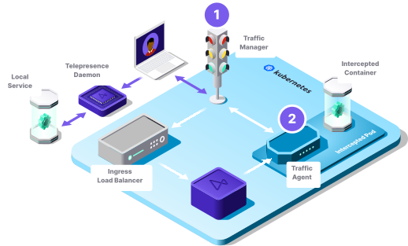
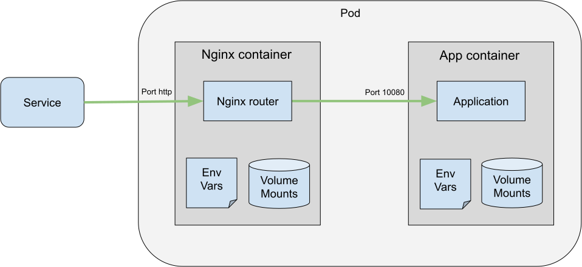
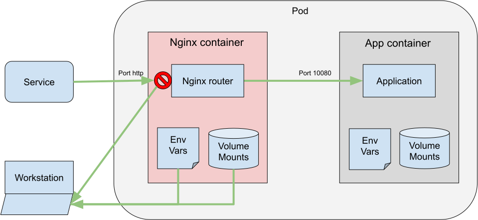
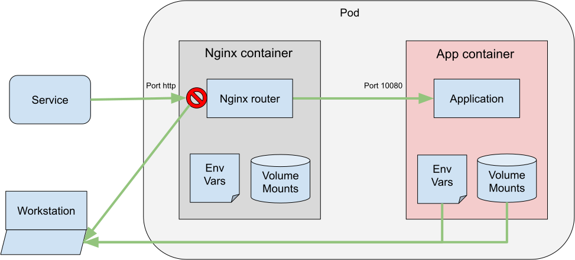
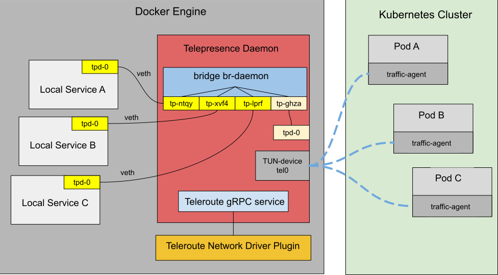
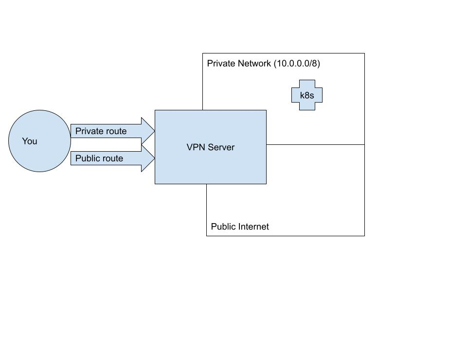
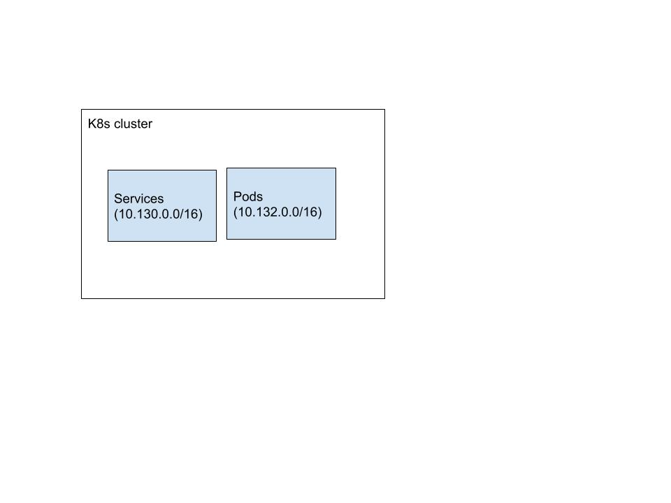
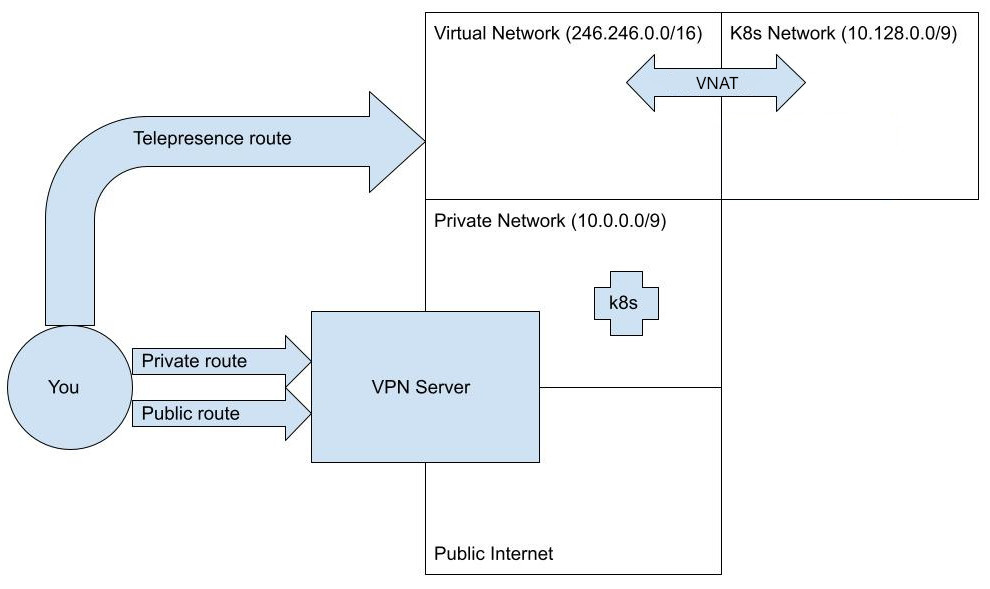
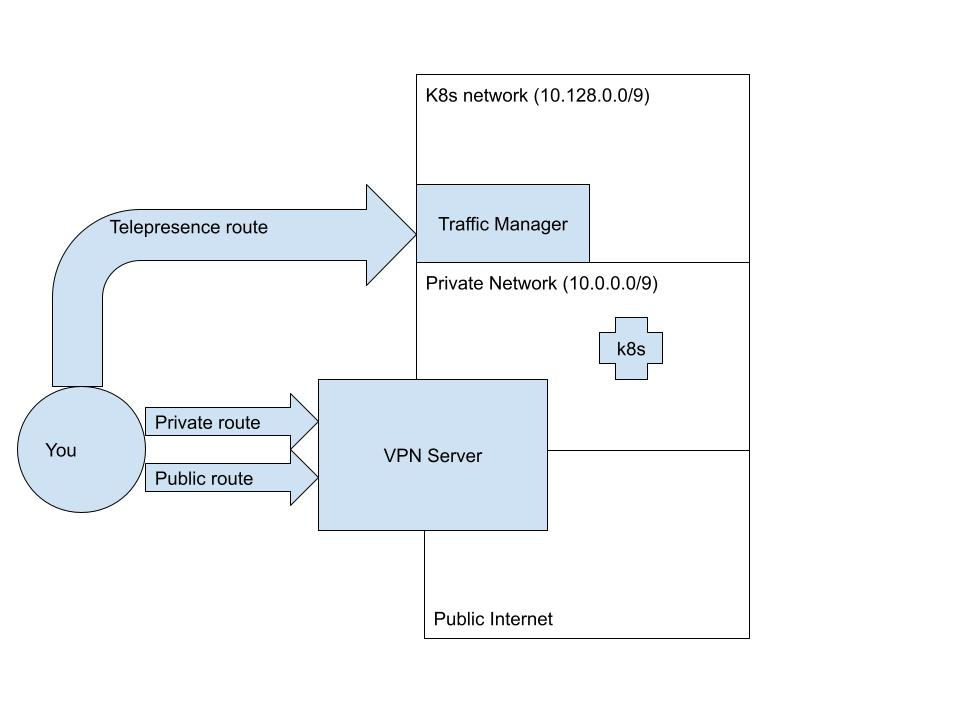

> Based on Telepresence v2.29 official docs, links point to https://telepresence.io

---

# Quick start

https://telepresence.io/docs/quick-start

---

# Install Telepresence

https://telepresence.io/docs/install/client

## Install Client

https://telepresence.io/docs/install/client

## Upgrade Client

https://telepresence.io/docs/install/upgrade

## Install Traffic Manager

https://telepresence.io/docs/install/manager

## Cloud Provider Prerequisites

https://telepresence.io/docs/install/cloud

---

# Core concepts

https://telepresence.io/docs/concepts/devloop

## The developer experience and the inner dev loop

https://telepresence.io/docs/concepts/devloop

## Making the remote local: Faster feedback, collaboration and debugging

https://telepresence.io/docs/concepts/faster

## Intercepts

https://telepresence.io/docs/concepts/intercepts

---

# How do I...

https://telepresence.io/docs/howtos/engage

## Code and debug an application locally

https://telepresence.io/docs/howtos/engage

### 本地开发方法

Telepresence 提供三种强大的方式来在本地开发你的服务：

#### Replace（替换）

- **工作原理：**
  - 将 Kubernetes 集群中的现有容器替换为 Traffic Agent。
  - 将原本发送到被替换容器的流量重新路由到本地工作站。
  - 将被替换容器的远程环境提供给本地工作站使用。
  - 提供对被替换容器挂载卷的读写访问。
- **影响：**
  - Traffic Agent 被注入到目标工作负载的 Pod 中。
  - 被替换的容器从目标工作负载的 Pod 中移除。
  - 当替换操作结束时，被替换的容器会恢复。
- **适用场景：**
  - 你正在处理消息队列消费者，必须停止远程容器。
  - 你正在处理没有配置入站流量的远程容器。

#### Intercept（拦截）

- **工作原理：**
  - 拦截发往特定服务端口（或多个端口）的请求，并将其重新路由到本地工作站。
  - 将目标容器的远程环境提供给本地工作站使用。
  - 提供对目标容器挂载卷的读写访问。
  - 支持使用 HTTP 头和路径过滤流量。
- **影响：**
  - Traffic Agent 被注入到目标工作负载的 Pod 中。
  - 被拦截的流量重新路由到本地工作站，不再到达远程服务。
  - 只有匹配拦截过滤条件的流量才会被重新路由。
  - 所有容器继续正常运行。
- **适用场景：**
  - 你的主要关注点是服务 API，而不是集群的 Pod 和容器。
  - 你希望本地服务只接收特定的入站流量，其他流量不受影响。
  - 你希望远程容器继续处理其他请求或后台任务。

#### Wiretap（窃听）

- **工作原理：**
  - 在特定服务端口（或多个端口）上添加窃听，并将数据发送到本地工作站。
  - 将目标容器的远程环境提供给本地工作站使用。
  - 提供对目标容器挂载卷的只读访问。
  - 支持使用 HTTP 头和路径过滤流量。
- **影响：**
  - Traffic Agent 被注入到目标工作负载的 Pod 中。
  - 所有容器继续正常运行。
  - 所有流量仍然会到达远程服务。
  - 窃听的流量被重新路由到本地工作站。
- **适用场景：**
  - 你需要一个多个开发者可以同时与同一服务交互的解决方案。
  - 你的主要关注点是服务 API，而不是集群的 Pod 和容器。
  - 你希望本地服务只接收特定的入站流量。
  - 你不在乎本地服务发送的响应。
  - 你不希望本地服务中的断点影响远程服务。
  - 你希望本地开发对集群的影响降到最低。

#### Ingest（摄入）

- **工作原理：**
  - 将被摄入容器的远程环境提供给本地工作站使用。
  - 提供对被替换容器挂载卷的只读访问。
- **影响：**
  - Traffic Agent 被注入到目标工作负载的 Pod 中。
  - 没有流量被重新路由，所有容器继续正常运行。
- **适用场景：**
  - 你希望本地开发对集群的影响降到最低。
  - 你不需要从集群路由流量，并且对容器卷的只读访问即可满足需求。

### 前置条件

在开始之前，你需要安装 [Telepresence](/docs/install/client)。本文档在多个示例中使用了 Kubernetes 命令行工具 [`kubectl`](https://kubernetes.io/docs/tasks/tools/install-kubectl/)。OpenShift 用户可以使用 [oc 命令替代](https://docs.openshift.com/container-platform/4.1/cli_reference/developer-cli-commands.html)。

本指南假设你有一个由 Kubernetes Deployment 和 Service 代表的应用，该应用通过 Ingress Controller 公开访问，并且你可以在笔记本电脑上运行该应用的副本。

### 替换你的容器

这种方法提供了从工作站直接连接集群的好处，简化了在熟悉环境中调试和修改应用的过程。请注意，如果 Telepresence 是使用独立二进制文件而非[包安装器](/docs/install/client)安装的，它将需要 root 权限来配置网络接口。远程挂载必须相对于特定的挂载点进行，这可能会增加复杂性。

1. 使用 `telepresence connect` 连接到集群，并尝试 curl 访问 Kubernetes API 服务器。401 或 403 响应码是预期的，表示服务可以到达：

    ```bash
    $ curl -ik https://kubernetes.default
    HTTP/1.1 401 Unauthorized
    Cache-Control: no-cache, private
    Content-Type: application/json
    ...
    ```

    现在你可以像在同一网络上一样访问远程 Kubernetes API 服务器。你可以使用任何本地工具连接到集群中的任何服务。

2. 输入 `telepresence list`，确保你想要拦截的工作负载（本例中为 Deployment）已列出。例如：

    ```bash
    $ telepresence list
    ...
    deployment example-app: ready to engage (traffic-agent not yet installed)
    ...
    ```

3. 获取你想要替换的容器名称（输出已截断）：

    ```bash
    $ kubectl describe deploy example-app
    Name:                   example-app
    Namespace:              default
    CreationTimestamp:      Tue, 14 Jan 2025 03:49:29 +0100
    Labels:                 app=example-app
    Annotations:            deployment.kubernetes.io/revision: 1
    Selector:               app=example-app
    Replicas:               1 desired | 1 updated | 1 total | 0 available | 1 unavailable
    StrategyType:           RollingUpdate
    MinReadySeconds:        0
    RollingUpdateStrategy:  25% max unavailable, 25% max surge
    Pod Template:
      Labels:  app=example-app
      Containers:
       echo-server:
        Image:      ghcr.io/telepresencio/echo-server
        Port:       8080/TCP
    ```

4. 替换容器。请注意 `--container echo-server` 标志是可选的。仅在工作负载有多个容器时才需要：

    ```bash
    $ telepresence replace example-app --container echo-server --env-file /tmp/example-app.env --mount /tmp/example-app-mounts
    Using Deployment example-app
    Container name    : echo-server
    State             : ACTIVE
    Workload kind     : Deployment
    Port forwards     : 10.1.4.106 -> 127.0.0.1
        8080 -> 8080 TCP
    Volume Mount Point: /tmp/example-app-mounts
    ```

    你的工作站现在已经准备就绪。**你可以使用 `/tmp/example-app.env` 文件中的环境和 `/tmp/example-app-mounts` 下的挂载来运行应用。应用可以监听 `localhost:8080` 来接收原本发往被替换容器的流量。**在集群方面，Traffic Agent 容器已经替换了 `echo-server`。

    **Telepresence 默认将所有声明的容器端口映射到 `localhost` 上的相应端口。你可以使用 `--port` 标志更改此行为。例如，`--port 1080:8080` 会将被替换容器的端口 `8080` 映射到 `localhost:1080`。**当容器已知监听 manifest 中未声明的端口时，也可以使用 `--port`。

5. 查询你替换了应用的集群，验证你的本地实例是否被调用。所有之前路由到 Kubernetes Service 的流量现在都路由到了你的本地环境。

现在你可以：
- 即时进行更改，在与 Kubernetes 环境交互时看到更改效果。
- 查询仅在集群网络中暴露的服务。
- 在 IDE 中设置断点来调查 bug。

6. 使用命令 `telepresence leave example-app --container echo-server` 结束替换操作。

### 摄入你的容器

在某些情况下，你想要在本地工作和调试代码，并让它能访问集群中的其他服务，但你不想干扰目标工作负载。这就是 `telepresence ingest` 命令的用途。与 `replace` 命令一样，它会将目标容器的环境和挂载卷提供给本地使用，但它不会替换容器，也不会拦截任何流量。

本示例假设你有 `example-app` Deployment。

1. 连接并从 `example-app` 启动摄入：

    ```bash
    $ telepresence connect
    Launching Telepresence User Daemon
    Launching Telepresence Root Daemon
    Connected to context xxx, namespace default (https://<some url>)
    ```

    ```bash
    $ telepresence ingest example-app --container echo-server --env-file /tmp/example-app.env --mount /tmp/example-app-mounts
    Using Deployment example-app
       Container name    : echo-server
       Workload kind     : Deployment
       Volume Mount Point: /tmp/example-app-mounts
    ```

2. 使用上一步中获取的环境变量和挂载的卷启动本地应用。

现在你可以：
- 在本地应用与集群中的其他服务交互的同时编码和调试。
- 查询仅在集群网络中暴露的服务。
- 在 IDE 中设置断点来调查 bug。

### 拦截你的应用

`telepresence intercept` 命令允许你将特定服务的流量重定向到本地工作站。与 replace 命令相比，intercept 的侵入性更小，因为它：a) 支持使用 HTTP 头或路径精确过滤被拦截的流量，b) 允许原始服务继续运行，处理所有其他与被拦截流量无直接关系的流量和任务。

1. 使用 `telepresence connect` 连接到集群。

2. 拦截集群中发往应用 http 端口的所有流量，并重定向到工作站上的端口 8080。

    ```bash
    $ telepresence intercept example-app --http-header 'x-user=margret' --http-path-prefix '/api' --port 8080:http --env-file ~/example-app-intercept.env --mount /tmp/example-app-mounts
    Using Deployment example-app
    intercepted
      Intercept name: example-app
      State         : ACTIVE
      Workload kind : Deployment
      Destination   : 127.0.0.1:8080
      Intercepting  : HTTP requests with path-prefix /api and header 'X-User: margret'
    ```

    - 对于 `--http-header`：指定你想要过滤的 HTTP 头。你可以通过重复该标志来指定多个头。基于头的拦截优先于仅基于路径的拦截，因此当同一工作负载上有多个拦截活跃时，请求首先会根据基于头的过滤条件进行评估，然后再根据仅基于路径的过滤条件评估。这允许不同开发者使用基于头的个人拦截（例如 `x-user=alice`），而其他人使用基于路径的拦截（例如 `--http-path-prefix /admin/`）而不会冲突。
    - 对于 `--http-path-prefix`：指定你想要过滤的路径前缀。你可以通过重复该标志来指定多个路径前缀。基于路径的拦截优先级低于基于头的拦截。
    - 对于 `--port`：指定本地应用实例运行的端口，以及可选的你要拦截的远程端口。当只有一个服务端口可访问工作负载时，Telepresence 会自动选择远程端口。当工作负载暴露多个端口时，你必须指定要拦截的端口。你可以通过在 `--port` 参数中用冒号指定要拦截的端口（如示例所示），和/或使用 `--service` 标志指定要拦截的服务。
    - 对于 `--env-file`：指定一个文件路径，让 Telepresence 写入目标容器设置的环境变量。

3. 使用上一步中获取的环境变量和挂载的卷启动本地应用。

现在你可以：
- 即时进行更改，在与 Kubernetes 环境交互时看到更改效果，而不影响同一服务的其他用户。
- 查询仅在集群网络中暴露的服务。
- 在 IDE 中设置断点来调查 bug。

### 窃听你的应用

当你想要窃听特定服务的流量并将其副本发送到工作站时，可以使用 `telepresence wiretap` 命令。`wiretap` 比 `intercept` 的侵入性更小，因为它完全不干扰流量。

1. 使用 `telepresence connect` 连接到集群。

2. 对集群中发往应用 http 端口的所有流量设置窃听，并将其发送到工作站上的端口 8080。

    ```bash
    $ telepresence wiretap example-app --port 8080:http --env-file ~/example-app-intercept.env --mount /tmp/example-app-mounts
    Using Deployment example-app
    wiretapped
      Wiretap name  : example-app
      State         : ACTIVE
      Workload kind : Deployment
      Destination   : 127.0.0.1:8080
      Intercepting  : all TCP connections
    ```

    - 对于 `--port`：指定本地应用实例运行的端口，以及可选的你要窃听的远程端口。当只有一个服务端口可访问工作负载时，Telepresence 会自动选择远程端口。当工作负载暴露多个端口时，你必须指定要窃听的端口。你可以通过在 `--port` 参数中用冒号指定要窃听的端口（如示例所示），和/或使用 `--service` 标志指定要窃听的服务。
    - 对于 `--env-file`：指定一个文件路径，让 Telepresence 写入目标容器设置的环境变量。

3. 使用上一步中获取的环境变量和挂载的卷启动本地应用。

现在你可以：
- 查询仅在集群网络中暴露的服务。
- 在 IDE 中设置断点来调查 bug。

#### 使用 Docker 运行一切

这种方法将 Telepresence 网络接口和远程挂载限制在容器内，与[包安装器](/docs/install/client)方法一样，消除了对 root 权限的需求。此外，它允许使用相同的挂载点精确复制目标容器的卷挂载。然而，这种方法需要 docker 来获取集群连接，并且容器化环境在工具链集成、调试和整体开发工作流方面可能会带来挑战。

1. 使用 `telepresence connect --docker` 连接到集群。这会在 docker 容器中启动 Telepresence daemon，并确保该容器可以访问集群网络。

2. 使用 `telepresence curl` 从容器访问 Kubernetes API 服务器。401 或 403 响应码是预期的，表示服务可以到达。`telepresence curl` 命令将从共享 `connect` 调用创建的网络的容器中执行标准 `curl` 命令：

    ```bash
    $ telepresence curl -ik https://kubernetes.default
    HTTP/1.1 401 Unauthorized
    Cache-Control: no-cache, private
    Content-Type: application/json
    ...
    ```

    现在你可以像在同一网络上一样访问远程 Kubernetes API 服务器。

3. 输入 `telepresence list`，确保你想要接入的工作负载已列出。例如：

    ```bash
    $ telepresence list
    ...
    deployment example-app: ready to engage (traffic-agent not yet installed)
    ...
    ```

4. 使用 `replace`、`inject` 或 `intercept` 结合 `--docker-run` 标志来接入容器。使用 `telepresence replace` 的示例：

    ```bash
    $ telepresence replace example-app --container echo-server --docker-run -- <your local container>
    Using Deployment example-app
    intercepted
      Intercept name: example-app
      State         : ACTIVE
      Workload kind : Deployment
      Destination   : 127.0.0.1:8080
      Intercepting  : all TCP connections
    <output from your local container>
    ```

现在你可以：
- 即时进行更改，在与 Kubernetes 环境交互时看到更改效果；但取决于本地容器的配置，这可能需要重新构建。
- 使用 `telepresence curl` 查询仅在集群网络中暴露的服务。
- 在 IDE 的 Remote Debug 配置中设置断点来调查 bug。

## Use Telepresence with Docker

https://telepresence.io/docs/howtos/docker

### 为什么使用 Docker 模式？

在整个组织中推广 Telepresence 可能会比较繁琐，因为[包安装器](https://telepresence.io/docs/install/client)需要组织审批，而且 Telepresence 需要与公司可能有的各种特殊网络配置兼容。

如果你的组织已经批准使用 Docker，则可以考虑这种方式。

### 如何使用？

使用 Telepresence 的 Docker 模式时，用户不需要组织审批包安装器，可以解决多种网络挑战，并且不再需要第三方应用来启用卷挂载。

你只需在任何 Telepresence 命令中添加 docker 标志，它就会在容器中启动 daemon，使其更容易在组织中推广。

下面用一个快速演示来说明，假设有一个名为 default 的默认 Kubernetes 上下文和一个简单的 HTTP 服务：

```bash
$ telepresence connect --docker

Connected to context default, namespace default (https://kubernetes.docker.internal:6443)
```

这种方法将潜在的网络问题范围限制在 Docker 内部，因为一切都保持在 Docker 中。在列出容器时，Telepresence daemon 的名称为 `tp-<你的上下文>-cn`。

```bash
$ docker ps

CONTAINER ID   IMAGE                                        COMMAND                  CREATED          STATUS          PORTS                        NAMES
540a3c12f45b   ghcr.io/telepresenceio/telepresence:2.22.0   "telepresence connec…"   18 seconds ago   Up 16 seconds   127.0.0.1:58802->58802/tcp   tp-default-cn
```

替换集群中的容器并启动对应的本地容器：

```bash
$ telepresence replace echo-sc --docker-run -- ghcr.io/telepresenceio/echo-server:latest

Using Deployment echo-sc

  Container name: echo-sc

  State         : ACTIVE

  Workload kind : Deployment

  Port forwards : 127.0.0.1 -> 127.0.0.1

      8080 -> 8080 TCP

Echo server listening on port 8080.
```

使用 `--docker-run` 会启动作为处理程序的本地容器，使其使用与运行 Telepresence daemon 的容器相同的网络。它还将接收相同的入站流量，并以与被替换的远程容器相同的方式挂载远程卷。

如果你想 curl 你的远程服务，需要从共享 daemon 容器网络的容器中执行。Telepresence 提供了一个 `curl` 命令可以完成这个操作。

```bash
$ telepresence curl echo-sc

  % Total    % Received % Xferd  Average Speed   Time    Time     Time    Current
                                 Dload  Upload   Total   Spent    Left  Speed
100   196  100   196    0     0   4232      0 --:--:-- --:--:-- --:--:--  4260

Request served by 540a3c12f45b

Intercept id b0bd5e75-2618-4bef-ac4e-4c08c4b58ec7:echo-sc/echo-sc

Intercepted container "echo-sc"

HTTP/1.1 GET /

Host: echo-sc

User-Agent: curl/8.11.1

Accept: */*
```

#### 在拦截之前启动本地容器

如果你想使用 `docker run` 手动启动容器，必须确保它共享 daemon 容器的网络。一种方便的方法是使用上面解释的 `--docker-run` 标志，但你也可以使用 `telepresence docker-run` 单独启动容器。这可以在拦截之前或之后执行，并且容器在拦截开关循环时仍会继续运行。

```bash
$ telepresence docker-run ghcr.io/telepresenceio/echo-server:latest

Echo server listening on port 8080.
```

查看启动的容器名称：

```bash
$ docker ps --last 1 --format {{.Names}}

fervent_goodall
```

现在你可以使用 address 标志将拦截的流量重定向到你的 "echo" 容器，例如：

```bash
$ telepresence intercept --port 8080:80 --address echo fervent_goodall
```

> **提示**：使用 `--name` 标志命名你的容器，例如 `telepresence docker-run --name echo ghcr.io/telepresenceio/echo-server:latest`。这将使后续引用更方便。

> **注意**：不要将容器命名为与集群中的服务同名。如果这样做，你会收到名称覆盖服务 IP 的警告，并且该服务将不可达。

#### 使用命名连接

如果你想同时连接多个命名空间，可以使用 `--name` 标志为连接命名，例如：

```bash
$ telepresence connect --docker --name alpha --namespace alpha
```

```bash
$ telepresence connect --docker --name beta --namespace beta
```

现在，有两个连接活跃时，你必须向其他命令传递 `--use <名称模式>` 标志，例如：

```bash
$ telepresence replace echo-easy --use alpha --docker-run -- ghcr.io/telepresenceio/echo-server:latest
```

### 关键要点

- 使用 Telepresence 的 Docker 模式**不需要组织审批包安装器**，使其更容易在组织中推广。
- 它**限制了可能遇到的网络问题**。
- 它**限制了可能遇到的挂载问题**。
- 它**支持在多个命名空间中同时接入**。

## Extend Docker Compose with Telepresence

https://telepresence.io/docs/howtos/docker-compose

### Telepresence Docker Compose 扩展

Docker Compose 文件可以包含 Docker Compose 忽略的扩展。`telepresence compose` 命令的功能类似于 `docker compose`，但它会在将最终的 Compose 规范传递给 Docker Compose 之前，处理 Docker Compose 文件或其覆盖中存在的任何 `x-tele` 扩展。

`x-tele` 扩展在你有一组定义在 Docker Compose 文件中且映射集群中运行的服务时特别有用，你希望本地服务与远程服务交互，反之亦然。`x-tele` 扩展使你的 Compose 服务可以在 Telepresence 接入远程服务时作为处理程序，或者临时充当远程运行服务的代理。

扩展可以直接添加到 `compose.yaml` 文件中，或添加到 `compose.override.yaml`（Docker Compose 会自动合并）。

### 支持的 `x-tele` 扩展

#### 顶层扩展

`x-tele` [顶层扩展](https://telepresence.io/docs/reference/compose#top-level-extension) 用于定义与集群的连接，以及在接入远程服务时覆盖默认挂载行为。

#### 服务扩展

`x-tele` [服务扩展](https://telepresence.io/docs/reference/compose#service-extensions) 用于定义服务在接入远程服务时的行为。

Telepresence 支持以下类型：

| 类型 | 本地服务行为 | 类似于 |
|------|-------------|--------|
| [connect](https://telepresence.io/docs/reference/compose#connect) | 服务可以访问集群资源（DNS 和路由） | `telepresence connect` |
| [proxy](https://telepresence.io/docs/reference/compose#proxy) | 替换为集群中服务的代理 | N/A |
| [wiretap](https://telepresence.io/docs/reference/compose#wiretap) | 接收来自集群中服务的窃听数据 | `telepresence wiretap` |
| [ingest](https://telepresence.io/docs/reference/compose#ingest) | 作为集群中被摄入容器的处理程序 | `telepresence ingest` |
| [intercept](https://telepresence.io/docs/reference/compose#intercept) | 作为集群中被拦截服务的处理程序 | `telepresence intercept` |
| [replace](https://telepresence.io/docs/reference/compose#replace) | 替换集群中的远程容器 | `telepresence replace` |

所有类型都隐含 `connect`，因此依赖于定义集群连接的顶层 `x-tele` 扩展。

### 演练和示例

本文档将使用原本由 Buoyant.io 开发的示例 Emoji 应用，来自 [https://github.com/telepresenceio/emojivoto](https://github.com/telepresenceio/emojivoto) 仓库，提供一些使用 `x-tele` 扩展的示例。这个应用可以使用 `docker compose up` 在本地部署，或使用 `kubectl apply --kustomize` 部署到集群。

#### 初始步骤

示例假设你已在集群中[安装](https://telepresence.io/docs/install/manager)了 Telepresence Traffic Manager。

我们首先确保 Emojivoto 应用可以部署——在本地使用 `docker compose up`，在远程使用集群。

##### 1. 下载 Emojivoto 应用

使用以下命令克隆 emojivoto git 仓库：

```bash
$ git clone https://github.com/telepresenceio/emojivoto.git
```

##### 2. 在本地使用应用

```bash
$ cd emojivoto
```

```bash
$ docker compose up
```

现在在浏览器中打开 [http://localhost:8080/](http://localhost:8080/)。"Emoji Vote" 页面会出现。试一试。

关闭本地应用：

```bash
$ docker compose down
```

##### 3. 在远程使用应用

通过应用 `kustomize/deployment` 目录创建集群资源：

```bash
$ kubectl apply -k kustomize/deployment
namespace/emojivoto created
serviceaccount/emoji created
serviceaccount/voting created
serviceaccount/web created
service/emoji created
service/voting created
service/web created
deployment.apps/emoji created
deployment.apps/vote-bot created
deployment.apps/voting created
deployment.apps/web created
```

检查 Pod 是否已启动运行：

```bash
$ kubectl -n emojivoto get pod
NAME                       READY   STATUS    RESTARTS   AGE
emoji-7d8d6fb869-wp5kc     1/1     Running   0          23s
vote-bot-766b9f68b-9bsqq   1/1     Running   0          23s
voting-7d49b58d7b-n7bc8    1/1     Running   0          23s
web-7cc498695b-7dtcl       1/1     Running   0          23s
```

连接到集群并验证 web 服务是否正常工作。`telepresence serve web` 将启动浏览器并打开指向 "web" 服务的 URL：

```bash
$ telepresence connect -n emojivoto --docker
✔ Connected to context minikube, namespace emojivoto (https://192.168.49.2:8443)           0.8s
```

```bash
$ telepresence serve web
```

### 使用 "proxy" 扩展

假设我们不想在本地运行 "voting" 服务。相反，我们想用集群中运行的对应服务替换它。换句话说，我们希望本地服务充当远程服务的代理。

原始 `compose.yaml` 文件包含以下内容：

```yaml
services:
  web:
    image: ghcr.io/telepresenceio/emojivoto-web:0.3.0
    environment:
      - WEB_PORT=8080
      - EMOJISVC_HOST=emoji:8080
      - VOTINGSVC_HOST=voting:8080
      - INDEX_BUNDLE=dist/index_bundle.js
    ports:
      - "8080:8080"
    depends_on:
      - voting
      - emoji
  vote-bot:
    image: ghcr.io/telepresenceio/emojivoto-web:0.3.0
    entrypoint: emojivoto-vote-bot
    environment:
      - WEB_HOST=web:8080
    depends_on:
      - web
  emoji:
    image: ghcr.io/telepresenceio/emojivoto-emoji:0.3.0
    environment:
      - GRPC_PORT=8080
    ports:
      - "8081:8080"
  voting:
    image: ghcr.io/telepresenceio/emojivoto-voting:0.3.0
    environment:
      - GRPC_PORT=8080
      - POLL_FILE=/data/polls.json
    ports:
      - "8082:8080"
    volumes:
      - data:/data
volumes:
  data:
```

代理需要通过 Telepresence 连接到集群，本例中使用 `emojivoto` 命名空间。连接在顶层 `x-tele` 扩展中定义，每个连接由名称标识，并使用与 `telepresence connect` 命令中使用的标志对应的属性进行配置。顶层扩展结构如下：

```yaml
x-tele:
  connections:
    - name: emojivoto
      namespace: emojivoto
```

要启用代理功能，在 `voting` 服务声明中添加 `proxy` 类型扩展：

```yaml
x-tele:
  type: proxy
  connection: emojivoto
```

`connection: emojivoto` 字段指定代理使用顶层扩展中定义的 `emojivoto` 连接，将其链接到 `emojivoto` 命名空间。当顶层扩展只包含一个连接时，此字段是可选的。类似地，连接声明中的 `name: emojivoto` 也是可选的，仅在定义多个连接时才需要。

> **提示**：与其修改原始 `compose.yaml` 文件，我们可以添加一个新文件 `compose.override.yaml`。Docker Compose 会自动合并此覆盖与 `compose.yaml`。因此，保持原始 `compose.yaml` 不变，添加 `compose.override.yaml` 文件，内容如下（可选的连接名称和代理连接引用都已移除）：

```yaml
x-tele:
  connections:
    - namespace: emojivoto
services:
  voting:
    x-tele:
      type: proxy
```

#### 运行扩展示例

使用 `telepresence compose up` 运行将发现扩展，连接到集群，修改内存中的 Compose 规范版本，使其不再包含 "voting" 服务，更改 DNS 使对此服务的查找找到集群中的服务，并配置路由使 "web" 服务仍然能找到 "voting" 服务。我们可以验证：

```bash
$ telepresence compose
✔ Connected to context minikube, namespace emojivoto (https://192.168.49.2:8443)     2.4s
✔ Proxied service voting                                                             0.0s
[+] Running 4/4
 ✔ Network emojivoto_default        Created                                           0.1s
 ✔ Container emojivoto-emoji-1  Created                                               0.0s
 ✔ Container emojivoto-web-1        Created                                           0.0s
 ✔ Container emojivoto-vote-bot-1   Created                                           0.0s
Attaching to emoji-1, vote-bot-1, web-1
emoji-1     | 2025/07/19 05:42:39 Starting grpc server on GRPC_PORT=[8080]
web-1       | 2025/07/19 05:42:39 Connecting to [voting:8080]
web-1       | 2025/07/19 05:42:39 Connecting to [emoji:8080]
web-1       | 2025/07/19 05:42:39 Starting web server on WEB_PORT=[8080] and MESSAGE_OF_THE_DAY=[]
vote-bot-1  | ✔ Voting for :older_man:
vote-bot-1  | ✔ Voting for :100:
vote-bot-1  | ✔ Voting for :bulb:
...
```

我们现在看到 "Proxied service voting"，然后与 `docker compose up` 的输出相比，没有该服务的进一步输出。但 `vote-bot-1` 继续投票，显然它仍然在与 `voting` 通信。

#### 要点

使用 Telepresence 的 "proxy" 扩展，我们已成功修改了设置，使 compose.yaml 文件中的服务与集群中的服务交互。

#### 代理 web 服务

我们能否代理 web 服务并通过 `localhost:8080` 在浏览器中访问它？让我们使用以下 `compose.override.yaml` 文件试一试：

```yaml
x-tele:
  connections:
    - namespace: emojivoto
services:
  web:
    x-tele:
      type: proxy
      ports:
        - 8080:80
```

值得注意的是，原始 docker-compose 服务将暴露端口 8080，这就是我们的代理必须向其他容器暴露的端口。然而在集群中，web 服务使用端口 80。这就是为什么我们需要在扩展中指定端口映射：

```yaml
      ports:
        - 8080:80
```

有了这个更改，我们可以使用 `telepresence compose up` 运行示例，并在浏览器中通过 `localhost:8080` 连接到 web 服务。

### 使用 "replace" 扩展

之前的示例使用代理将本地服务替换为远程服务。在本示例中，我们将做相反的事情——让远程服务与 Docker Compose 文件中的服务通信。实质上，我们让远程的 `web` 和 `vote-bot` 服务使用我们在本地运行的 `emoji` 和 `vote` 服务。

我们的扩展如下：

```yaml
x-tele:
  connections:
    - namespace: emojivoto
services:
  emoji:
    x-tele:
      type: replace
  voting:
    x-tele:
      type: replace
  vote-bot:
    profiles:
      - notEnabled
```

> **注意**：最后一部分：

```yaml
  vote-bot:
    profiles:
      - notEnabled
```

实际上禁用了本地 `vote-bot` 服务，使只有集群中运行的 vote-bot 活跃。这是可选的，但更容易看出运行示例时发生的情况：

```bash
$ telepresence compose up
✔ Connected to context minikube, namespace emojivoto (https://192.168.49.2:8443)     2.8s
[+] Engaging 2/2
 ✔ emoji  Replaced service emoji                                                      2.0s
 ✔ voting Replaced service voting                                                     1.6s
[+] Running 4/4
 ✔ Network emojivoto_default    Created                                               0.0s
 ✔ Container emojivoto-voting1  Created                                               0.1s
 ✔ Container emojivoto-emoji-1  Created                                               0.1s
 ✔ Container emojivoto-web-1    Created                                               0.1s
Attaching to emoji-1, voting-1, web-1
emoji-1   | 2025/08/05 09:17:39 Starting prom metrics on PROM_PORT=[8801]
emoji-1   | 2025/08/05 09:17:39 Starting grpc server on GRPC_PORT=[8080]
voting-1  | 2025/08/05 09:17:39 Storing votes in file /data/polls.json
voting-1  | 2025/08/05 09:17:39 Starting prom metrics on PROM_PORT=[8801]
voting-1  | 2025/08/05 09:17:39 Starting grpc server on GRPC_PORT=[8080]
voting-1  | 2025/08/05 09:17:39 Using failureRate [0.000000] and artificialDelayDuration [0s]
web-1     | 2025/08/05 09:17:39 Connecting to [voting:8080]
web-1     | 2025/08/05 09:17:39 Connecting to [emoji:8080]
web-1     | 2025/08/05 09:17:39 Starting web server on WEB_PORT=[8080] and MESSAGE_OF_THE_DAY=[]
voting-1  | 2025/07/20 04:39:58 Voted for [:fax:], which now has a total of [12] votes
voting-1  | 2025/07/20 04:39:59 Voted for [:doughnut:], which now has a total of [231] votes
voting-1  | 2025/07/20 04:40:00 Voted for [:flight_departure:], which now has a total of [8] votes
```

我们可以观察到，经过初始延迟（由远程 vote bot 在替换 vote 容器后重新连接引起）后，投票到达了，尽管本地没有运行 vote-bot。此外，如果我们现在在 [http://localhost:8080](http://localhost:8080) 上启动浏览器，我们会看到与通过 `telepresence serve web` 启动的浏览器相同的排行榜。

在集群中，"voting" 和 "emoji" 部署的 Pod 已被替换为 traffic-agent，将所有流量重定向到对应的 "voting" 和 "emoji" Docker Compose 服务。我们可以使用以下命令轻松验证：

```bash
$ kubectl -n emojivoto get pod -l app=voting -o jsonpath='{.items.*.spec.containers.*.name}'
traffic-agent
```

```bash
$ kubectl -n emojivoto get pod -l app=emoji -o jsonpath='{.items.*.spec.containers.*.name}'
traffic-agent
```

#### 远程挂载

一个有趣的观察是投票计数不是从零开始的。相反，它们与集群中 voting 服务使用的投票计数同步。这是因为 "replace" 扩展自动将挂载的 "data" 卷替换为被替换容器中对应卷的远程挂载。此默认行为可以使用挂载策略控制。

##### 阻止远程挂载

要阻止远程挂载，而保留 Docker Compose 创建的卷，我们可以在 `compose.override.yaml` 文件中的顶层 `x-tele` 扩展中添加 `mounts` 对象：

```yaml
x-tele:
  connections:
    - namespace: emojivoto
  mounts:
    - volume: data
      policy: local
```

`mounts` 对象是一个对象列表，每个对象有一个 `volume` 字段（对应 Compose 文件中卷的名称）或一个 `volumePattern`（匹配名称的正则表达式），以及一个 `policy` 字段，可设置为 `local`、`ignore`、`remote` 或 `remoteReadOnly`。默认使用 traffic-agent 对该卷使用的策略。

#### 要点

使用 Telepresence 的 "replace" 扩展，我们已成功修改了设置，使集群中的多个服务被替换为作为 Docker Compose 规范的一部分本地运行的服务。

## Work with large clusters

https://telepresence.io/docs/howtos/large-clusters

### 大量命名空间

#### 问题

当 Telepresence 连接到集群时，它会配置本地 DNS 服务器，使集群中的每个命名空间可以作为顶级域（TLD）使用。例如，如果集群包含命名空间 "example"，则对名称 "my_service.example" 的 curl 将被定向到 Telepresence DNS 服务器，因为它已宣布要解析 "example" 域。

Telepresence 对为其创建 TLD 的命名空间采取保守策略，首先检查命名空间是否可被用户访问。此检查可能耗时，因为每次检查通常需要约一秒钟，这意味着对于有 120 个命名空间的集群，此检查可能需要两分钟。在执行 `telepresence connect` 时等待这么长时间太久了。

#### 解决方法

##### 连接时限制

`telepresence connect` 命令接受标志 `--mapped-namespaces <逗号分隔的名称>`，这将限制 Telepresence 在 DNS 解析器中创建 TLD 的命名空间。这可以大幅减少连接时间，并改善 DNS 解析器的性能。

##### 限制 traffic-manager

在安装或升级 traffic-manager 时，可以通过传递 Helm chart 值 `namespaces` 或 `namespaceSelector` 来限制 traffic-manager 关心的命名空间。这将告诉管理器只管理那些命名空间的连接和接入。命名空间受限的管理器为所有连接到它的客户端创建隐式的 `mapped-namespaces` 集。

### 大量 Pod

#### 问题

Pod 数量很多的集群在某些情况下可能会有问题，当 traffic-manager 无法使用从集群节点获取 pod 子网的默认行为时。管理器将使用回退方法，即获取所有 Pod 的 IP，然后使用这些 IP 计算 pod 子网。这反过来可能导致对 Kubernetes API 服务器的大量请求。

#### 解决方法

如果是 RBAC 权限限制阻止了 traffic-manager 从节点读取 `podCIDR`，则添加必要的权限可能有帮助。但在许多情况下，节点不会有定义的 `podCIDR`。这种情况的回退方案是使用 Helm chart 值手动指定 `podCIDRs`（从而防止扫描和计算）：

```yaml
podCIDRStrategy: environment
podCIDRs:
  - <known podCIDR>
...
```

### Traffic Manager 命名空间

根据使用场景，有时安装多个 Traffic Manager 是有益的，每个管理器负责有限数量的命名空间，且被禁止访问其他命名空间。一个集群可以有任意数量的 Traffic Manager，只要每个管理器管理自己独特的一组命名空间。

连接到 Traffic Manager 的客户端将自动限制在其管理的命名空间。

详见[安装命名空间范围的 traffic-manager](https://telepresence.io/docs/install/manager#limiting-the-namespace-scope)。

## Host a cluster in Docker or a VM

https://telepresence.io/docs/howtos/cluster-in-vm

### 问题

Telepresence 在连接时会创建一个虚拟网络接口（[VIF](https://telepresence.io/docs/reference/tun-device)），将集群子网映射到主机。如果你在本地运行 Kubernetes（例如 Docker Desktop、Kind、Minikube、k3s），可能会遇到网络问题，因为主机上的设备也可以从集群节点访问。

#### 示例

一个 k3s 集群在无头 VirtualBox 机器中运行，使用 "host-only" 网络。此网络允许主机到客户机和客户机到主机的连接。换句话说，集群可以访问主机网络，并且在 Telepresence 连接时也可以访问其 VIF。这意味着从集群的角度来看，现在将有多个接口映射集群子网——集群节点中已有的接口，以及 Telepresence VIF 再次映射的接口。

现在，如果一个请求到达 Telepresence 并被 VIF 映射的子网覆盖，该请求会被路由到集群。如果集群由于某种原因没有找到可以处理该请求的相应监听器，它最终会尝试主机网络并找到 VIF。VIF 将请求路由到集群，现在递归开始了。请求的最终结果可能是一个超时，但由于递归非常消耗资源（大量非常快速的连接请求），这也可能对其他连接产生不良影响。

### 解决方法

#### 防止 VIF 中的递归

要防止 VIF 中的递归连接，请将客户端配置属性 `routing.recursionBlockDuration` 设置为短超时值。`1ms` 的值通常足够。此配置会在建立连接后立即暂时阻止到特定 IP:PORT 对的新连接，从而防止通过 VIF 的循环连接。阻止在指定的持续时间内保持有效。

#### 创建桥接网络

使用 `routing.recursionBlockDuration` 的替代方案是创建桥接网络。它充当链路层（L2）设备，在网络段之间转发流量。通过创建桥接网络，你可以绕过主机的网络栈，使 Kubernetes 集群直接连接到与主机相同的路由器。

要创建桥接网络，你需要更改运行集群节点的客户机的网络设置，使其直接连接到主机上的物理网络设备。配置桥接的细节取决于你使用的虚拟化解决方案类型。

##### Vagrant + Virtualbox + k3s 示例

这是一个 `Vagrantfile` 示例，它将使用桥接网络在三个无头实例中启动一个服务器节点和两个代理节点。它还添加了集群托管 docker 仓库所需的配置（在你想节省带宽时非常方便）。Kubernetes registry manifest 必须在集群启动后使用 `kubectl -f registry.yaml` 应用。

**Vagrantfile:**

```ruby
# -*- mode: ruby -*-
# vi: set ft=ruby :

# bridge is the name of the host's default network device
$bridge = 'wlp5s0'
# default_route should be the IP of the host's default route.
$default_route = '192.168.1.1'
# nameserver must be the IP of an external DNS, such as 8.8.8.8
$nameserver = '8.8.8.8'
# server_name should also be added to the host's /etc/hosts file and point to the server_ip
# for easy access when pushing docker images
server_name = 'multi'
# static IPs for the server and agents. Those IPs must be on the default router's subnet
server_ip = '192.168.1.110'
agents = {
  'agent1' => '192.168.1.111',
  'agent2' => '192.168.1.112',
}

# Extra parameters in INSTALL_K3S_EXEC variable because of
# K3s picking up the wrong interface when starting server and agent
# https://github.com/alexellis/k3sup/issues/306
server_script = <<-SHELL
    sudo -i
    apk add curl
    export INSTALL_K3S_EXEC="--bind-address=#{server_ip} --node-external-ip=#{server_ip} --flannel-iface=eth1"
    mkdir -p /etc/rancher/k3s
    cat <<-'EOF' > /etc/rancher/k3s/registries.yaml
mirrors:
  "multi:5000":
    endpoint:
      - "http://#{server_ip}:5000"
EOF
    curl -sfL https://get.k3s.io | sh -
    echo "Sleeping for 5 seconds to wait for k3s to start"
    sleep 5
    cp /var/lib/rancher/k3s/server/token /vagrant_shared
    cp /etc/rancher/k3s/k3s.yaml /vagrant_shared
    cp /etc/rancher/k3s/registries.yaml /vagrant_shared
    SHELL

agent_script = <<-SHELL
    sudo -i
    apk add curl
    export K3S_TOKEN_FILE=/vagrant_shared/token
    export K3S_URL=https://#{server_ip}:6443
    export INSTALL_K3S_EXEC="--flannel-iface=eth1"
    mkdir -p /etc/rancher/k3s
    cat <<-'EOF' > /etc/rancher/k3s/registries.yaml
mirrors:
  "multi:5000":
    endpoint:
      - "http://#{server_ip}:5000"
EOF
    curl -sfL https://get.k3s.io | sh -
    SHELL

def config_vm(name, ip, script, vm)
  network_script = <<-SHELL
    sudo -i
    ip route delete default 2>&1 >/dev/null || true; ip route add default via #{$default_route}
    cp /etc/resolv.conf /etc/resolv.conf.orig
    sed 's/^nameserver.*/nameserver #{$nameserver}/' /etc/resolv.conf.orig > /etc/resolv.conf
  SHELL
  vm.hostname = name
  vm.network 'public_network', bridge: $bridge, ip: ip
  vm.synced_folder './shared', '/vagrant_shared'
  vm.provider 'virtualbox' do |vb|
    vb.memory = '4096'
    vb.cpus = '2'
  end
  vm.provision 'shell', inline: script
  vm.provision 'shell', inline: network_script, run: 'always'
end

Vagrant.configure('2') do |config|
  config.vm.box = 'generic/alpine314'
  config.vm.define 'server', primary: true do |server|
    config_vm(server_name, server_ip, server_script, server.vm)
  end
  agents.each do |agent_name, agent_ip|
    config_vm.define agent_name do |agent|
      config_vm(agent_name, agent_ip, agent_script, agent.vm)
    end
  end
end
```

添加 registry 的 Kubernetes manifest：

**registry.yaml:**

```yaml
apiVersion: v1
kind: ReplicationController
metadata:
  name: kube-registry-v0
  namespace: kube-system
  labels:
    k8s-app: kube-registry
    version: v0
spec:
  replicas: 1
  selector:
    app: kube-registry
    version: v0
  template:
    metadata:
      labels:
        app: kube-registry
        version: v0
    spec:
      containers:
      - name: registry
        image: registry:2
        resources:
          limits:
            cpu: 100m
            memory: 200Mi
        env:
        - name: REGISTRY_HTTP_ADDR
          value: :5000
        - name: REGISTRY_STORAGE_FILESYSTEM_ROOTDIRECTORY
          value: /var/lib/registry
        volumeMounts:
        - name: image-store
          mountPath: /var/lib/registry
        ports:
        - containerPort: 5000
          name: registry
          protocol: TCP
      volumes:
      - name: image-store
        hostPath:
          path: /var/lib/registry-storage
---
apiVersion: v1
kind: Service
metadata:
  name: kube-registry
  namespace: kube-system
  labels:
    app: kube-registry
    kubernetes.io/name: "KubeRegistry"
spec:
  selector:
    app: kube-registry
  ports:
  - name: registry
    port: 5000
    targetPort: 5000
    protocol: TCP
  type: LoadBalancer
```

## Intercept TLS/mTLS Applications

https://telepresence.io/docs/howtos/mtls

### 概述

Telepresence 需要访问 HTTP 头和路径来执行 HTTP 过滤拦截。当流量使用 TLS/mTLS 加密时，Telepresence 必须解密数据才能检查这些头。本文档说明如何配置 Telepresence 来处理加密流量。

### 解密流量

要解密 TLS/mTLS 流量，Telepresence 需要访问应用使用的 TLS 证书。你可以通过两种方式提供此访问：

1. **挂载现有卷**：使用应用已挂载到卷中的证书。
2. **引用 Secret**：直接挂载包含证书的 Kubernetes Secret。

#### 选项 1：使用挂载的证书

如果你的应用挂载了包含 TLS 证书的卷，Telepresence traffic-agent 会自动挂载相同的卷。你只需使用注解指定证书的路径。

##### 示例

假设你的应用定义了一个 `tls` 卷用于 Secret `tel-cert`，其中包含 `tls.crt` 和 `tls.key`：

```yaml
volumes:
  - name: tls
    secret:
      secretName: tel-cert
```

该卷挂载在 `/etc/certs`：

```yaml
        volumeMounts:
          - name: tls
            mountPath: /etc/certs
            readOnly: true
```

将以下注解添加到你的工作负载，使 Telepresence 能够使用此证书：

```yaml
  template:
    metadata:
      annotations:
        telepresence.io/downstream-tls-path.8443: /etc/certs
```

此注解指示 Telepresence 使用 `/etc/certs` 的证书来解密端口 8443 上的流量。

**注意：**
- 对于多个端口，使用不同的端口后缀重复注解。
- 确保证书被注解中指定端口的所有容器挂载。

#### 使用 Secret

如果你的应用容器没有挂载 TLS 证书，traffic-agent 可以独立挂载 Kubernetes Secret。该 Secret 必须位于与工作负载相同的命名空间中。

将以下注解添加到你的工作负载：

```yaml
  template:
    metadata:
      annotations:
        telepresence.io/downstream-tls-secret.8443: secret-name
```

此注解使 traffic-agent 注入器执行以下操作：
1. 为指定的 Secret 向 Pod 添加一个卷
2. 将该卷挂载到 traffic-agent 可以访问证书的位置

### 加密上游流量

在解密流量并检查 HTTP 过滤器后，Telepresence 必须在将流量转发到应用之前重新加密。对于需要双向 TLS（mTLS）的应用，Telepresence 必须使用客户端 TLS 证书进行上游连接。使用与解密流量类似的注解，但前缀改为 `telepresence.io/upstream-tls-` 而不是 `telepresence.io/downstream-tls-`。

#### 自签名证书

自签名证书在开发环境中很常见，使用它们的服务可以通过 `curl --insecure` 或 `curl -k` 访问。Telepresence 无法检测是否使用了此选项。如果下游流量为 HTTP 过滤而解密，并且应用使用自签名证书，Telepresence 将无法建立安全上游连接，除非跳过验证。

要为自签名证书跳过验证，将以下注解添加到工作负载：

```
telepresence.io/upstream-insecure-skip-verify.<port>: enabled
```

### 使用 --plaintext 选项

拦截或窃听的 `--plaintext` 选项禁用在拦截或窃听期间发送到客户端的流量加密。

### 协议选择

Telepresence 在使用 HTTP/1.x 和 HTTP/2 的明文和 TLS 加密端口上支持 HTTP 过滤拦截。Telepresence 将自动检测应用使用的协议，并为拦截使用适当的协议。这是通过检查 Kubernetes 服务的 [appProtocol](https://kubernetes.io/docs/concepts/services-networking/service/#application-protocol) 完成的，如果没有设置，则通过查看端口名称和编号或探测应用来完成。

Telepresence 永远不会对 `appProtocol` 为 `tcp` 或 `udp` 的服务使用 TLS 或 HTTP/2。这些值意味着"无应用层嗅探"模式，因此设置时，它们实际上排除了在加密流量上使用 HTTP 过滤拦截的所有用途。

#### TLS 检测

Telepresence 将始终对具有以下特征的服务端口使用 TLS：
- 使用 `telepresence.io/downstream-tls-path.<port>` 或 `telepresence.io/downstream-tls-secret.<port>` 注解配置了 TLS 证书。
- `appProtocol` 为 `kubernetes.io/wss`、`wss`、`http2`、`https` 或 `grpc`。
- 名称 `https`。
- 号码 443。

Telepresence 永远不会对 `appProtocol` 为 `kubernetes.io/ws`、`kubernetes.io/h2c` 或 `h2c` 的服务端口使用 TLS。

如果无法从上述条件做出选择，Telepresence 将探测应用以确定是否使用 TLS。

> **注意**：Telepresence 不关心 UDP 端口上的加密，因为 HTTP 过滤器只在 TCP 连接上支持。加密的 UDP 流量仍然可以被拦截，但拦截必须是全局的，因为它发生在传输层。

#### HTTP/2 检测

Telepresence 将始终对 `appProtocol` 为 "kubernetes.io/h2c"、"h2c"、"http2" 或 "grpc" 的服务使用 HTTP/2。

如果无法从上述条件做出选择，Telepresence 将探测应用以确定是否使用 HTTP/2。

#### 探测

探测是确定协议的回退机制。建议通过设置适当的 [appProtocol](https://kubernetes.io/docs/concepts/services-networking/service/#application-protocol) 来避免探测。探测在首次连接到被拦截的服务时进行。

如果探测因为应用启动缓慢而超时，可以使用注解 `telepresence.io/upstream-probe-timeout.<port>` 覆盖默认的 2 秒超时。值必须是数字加持续时间单位，如 `10s` 或 `500ms`。

## Use Telepresence with Azure (Microsoft Learn)

https://learn.microsoft.com/en-us/azure/aks/use-telepresence-aks

---

# Technical reference

https://telepresence.io/docs/reference/architecture

## Architecture

https://telepresence.io/docs/reference/architecture



### Telepresence CLI

Telepresence CLI 编排工作站上的各个组件：它启动 Telepresence Daemon，然后作为 Telepresence User Daemon 的用户友好接口。

### Telepresence Daemon

Telepresence 有运行在开发者工作站上的 Daemon，作为与集群网络通信的主要节点，用于与集群通信和处理被拦截的流量。

#### User-Daemon

User-Daemon 通过与 [Traffic Manager](https://telepresence.io/docs/reference/architecture#traffic-manager) 通信来协调替换、摄入和拦截的创建和删除。所有来自和到集群的请求都通过此 Daemon。

#### Root-Daemon

Root-Daemon 通过设置[虚拟网络设备](https://telepresence.io/docs/reference/tun-device)（VIF）来管理本地工作站和集群之间处理流量所需的网络。

### Traffic Manager

Traffic Manager 是集群中 Traffic Agent 和开发者工作站上 Telepresence Daemon 之间的中央通信节点。它负责将 Traffic Agent sidecar 注入到已接入的 Pod 中，代理所有相关的入站和出站流量，并跟踪活跃的接入。

Traffic Manager 由集群管理员安装。可以使用嵌入在 Telepresence 客户端二进制文件中的 Helm chart（`telepresence helm install`）或直接使用 Helm Chart 安装。

### Traffic Agent

Traffic Agent 是一个 sidecar 容器，用于促进接入。当首次启动 `replace`、`ingest`、`intercept` 或 `wiretap` 时，Traffic Agent 容器会被注入到工作负载的 Pod 中。你可以通过运行 `telepresence list` 或 `kubectl describe pod <pod-name>` 查看 Traffic Agent 的状态。

根据是否有 `replace` 或 `intercept` 活跃，Traffic Agent 会将入站请求路由到你的工作站，或者将其传递给 Pod 中通常处理请求的容器。

当 `wiretap` 活跃时，Traffic Agent 会将入站请求的副本发送到你的工作站。

详见 [Traffic Agent Sidecar](https://telepresence.io/docs/reference/engagements/sidecar)。

## Telepresence CLI

https://telepresence.io/docs/reference/cli/telepresence

### telepresence

https://telepresence.io/docs/reference/cli/telepresence

### telepresence completion

https://telepresence.io/docs/reference/cli/telepresence_completion

### telepresence compose

https://telepresence.io/docs/reference/cli/telepresence_compose

### telepresence config

https://telepresence.io/docs/reference/cli/telepresence_config

### telepresence connect

https://telepresence.io/docs/reference/cli/telepresence_connect

### telepresence curl

https://telepresence.io/docs/reference/cli/telepresence_curl

### telepresence docker-run

https://telepresence.io/docs/reference/cli/telepresence_docker-run

### telepresence gather-logs

https://telepresence.io/docs/reference/cli/telepresence_gather-logs

### telepresence genyaml

https://telepresence.io/docs/reference/cli/telepresence_genyaml

### telepresence helm

https://telepresence.io/docs/reference/cli/telepresence_helm

### telepresence ingest

https://telepresence.io/docs/reference/cli/telepresence_ingest

### telepresence intercept

https://telepresence.io/docs/reference/cli/telepresence_intercept

### telepresence leave

https://telepresence.io/docs/reference/cli/telepresence_leave

### telepresence list

https://telepresence.io/docs/reference/cli/telepresence_list

### telepresence list-contexts

https://telepresence.io/docs/reference/cli/telepresence_list-contexts

### telepresence list-namespaces

https://telepresence.io/docs/reference/cli/telepresence_list-namespaces

### telepresence loglevel

https://telepresence.io/docs/reference/cli/telepresence_loglevel

### telepresence mcp

https://telepresence.io/docs/reference/cli/telepresence_mcp

### telepresence quit

https://telepresence.io/docs/reference/cli/telepresence_quit

### telepresence replace

https://telepresence.io/docs/reference/cli/telepresence_replace

### telepresence revoke

https://telepresence.io/docs/reference/cli/telepresence_revoke

### telepresence serve

https://telepresence.io/docs/reference/cli/telepresence_serve

### telepresence status

https://telepresence.io/docs/reference/cli/telepresence_status

### telepresence uninstall

https://telepresence.io/docs/reference/cli/telepresence_uninstall

### telepresence version

https://telepresence.io/docs/reference/cli/telepresence_version

### telepresence wiretap

https://telepresence.io/docs/reference/cli/telepresence_wiretap

## Laptop-side configuration

https://telepresence.io/docs/reference/config

## Cluster-side configuration

https://telepresence.io/docs/reference/cluster-config

## Using Docker for engagements

https://telepresence.io/docs/reference/docker-run

### 使用命令标志

#### docker 标志

你可以使用以下命令在笔记本电脑上的 Docker 容器中启动 Telepresence daemon：

```bash
$ telepresence connect --docker
```

#### telepresence curl 命令

使用 `telepresence connect --docker` 连接时添加的网络接口无法从主机直接访问。它被限制在 Telepresence daemon 容器中。

你可以使用 `telepresence curl` 命令来 curl 你的集群资源。它将在共享 daemon 容器网络和 DNS 的 Docker 容器中运行 curl。

#### telepresence docker-run 命令

你可以使用 `telepresence docker-run` 命令启动共享 daemon 容器网络和 DNS 的容器。

#### replace/ingest/intercept/wiretap --docker-run 标志

如果你想让你的 `replace`、`ingest`、`intercept` 或 `wiretap` 使用在容器中运行的本地处理程序，可以使用 `--docker-run` 标志。它将建立接入，在前台运行你的容器，然后在容器退出时自动结束接入。它还会确保容器共享 daemon 容器的网络和 DNS。

请注意，使用 `--docker-run` 时，你的标志分为三组：
- 传递给 telepresence `replace`、`ingest`、`intercept` 或 `wiretap` 的一般标志和参数，如工作负载名称或要拦截的端口。`--docker-run` 标志本身就是一般标志的示例。
- 传递给 `docker run` 命令的标志和参数，如 `--env A=B`。
- 传递给启动的容器的标志和参数。

命令的语法为：

```bash
$ telepresence replace <general flags and args> -- <docker run flags and args> <image> <container flags and args>
```

本质上，独立的双横线 `--` 之后的所有内容都发送给 `docker run`。

`--` 将意图传给 `telepresence replace/ingest/intercept/wiretap` 的标志与意图传给 `docker run` 的标志分开。

建议始终将 `--docker-run` 与使用 `telepresence connect --docker` 启动的连接结合使用，因为这使一切侵入性更低：
- 不需要管理员用户访问权限。网络修改被限制在 Docker 网络中。
- 不需要特殊的文件系统挂载软件如 MacFUSE 或 WinFSP。卷挂载在 Docker 引擎中进行。

当两个标志同时使用时，底层发生以下操作：
- 本地容器将使用由 Teleroute 网络驱动控制的网络。这保证处理程序可以访问 Telepresence VIF，从而访问集群。
- 本地容器被配置为使用 daemon 容器提供的 DNS。
- 卷挂载将是自动的，使用 Telemount Docker 卷插件，使目标远程容器暴露的所有卷都挂载到本地处理程序容器上。
- 远程容器的环境成为本地处理程序容器的环境。

#### docker-build 标志

`--docker-build <docker context>` 和可重复的 `docker-build-opt key=value` 标志使 replace/ingest/intercept/wiretap 命令能够即时构建容器。

使用 `--docker-build` 时，参数列表中使用的镜像名称必须是 `IMAGE`。这个词作为占位符，将被构建的镜像 ID 替换。`IMAGE` 的出现因此将传给 `docker run` 的标志和参数与传给容器的标志和参数分开。

`--docker-build` 标志隐含 `--docker-run`。

#### docker-debug 标志

此标志类似于 --docker-build，但允许调试器在容器中以宽松的安全设置运行。

### 不使用 docker 时使用 docker-run 标志

可以在主机上运行的 daemon 中使用 `--docker-run`，这是 Telepresence 的默认行为。

但是不建议这样做，因为你将处于混合模式：虽然处理程序在容器中运行，但 daemon 会修改主机网络，如果需要远程挂载，可能需要额外软件。

保留此特殊组合的能力是出于向后兼容性原因。它可能在 Telepresence 的未来版本中被移除。

`--port` 标志的语义略有不同，可以在本地端口和容器端口必须不同的情况下使用。使用 `--port <local port>:<container port>` 完成。使用 `--port <port>` 语法时，容器端口默认与本地端口相同。

### 示例

假设你正在开发前端服务的新版本。它在你的集群中作为名为 `frontend-v1` 的 Deployment 运行。你在笔记本电脑上使用 Docker 构建了改进版本的容器 `frontend-v2`。要测试它，使用以下命令在笔记本电脑上运行新容器并启动集群服务到本地容器的拦截。

```bash
$ telepresence connect --docker
```

```bash
$ telepresence replace frontend-v1 --docker-run -- frontend-v2
```

现在，假设 `frontend-v2` 镜像是由位于 `images/frontend-v2` 目录中的 `Dockerfile` 构建的。你可以直接构建并替换：

```bash
$ telepresence replace frontend-v1 --docker-build images/frontend-v2 --docker-build-opt tag=mytag -- IMAGE
```

### 自动标志

Telepresence 会自动传递一些相关标志给 Docker 以将容器与远程容器连接。这些标志与命令行中 `--` 之后给出的参数组合：
- `--env-file <file>` 加载远程环境
- `--name intercept-<intercept name>-<intercept port>` 命名 Docker 容器，如果在命令行中显式给出，则省略此标志
- `-v <local mount dir:docker mount dir>` 卷挂载规范，详见 CLI 帮助中的 `--docker-mount` 标志

当与基于容器的 daemon 一起使用时：
- `--rm` 必需，因为卷挂载在容器移除之前无法移除
- `-v <telemount volume>:<docker mount dir>` 从已接入容器传播的卷挂载规范
- `--network <name of containerized daemon>` 网络与容器化 daemon 共享

当与非容器化 daemon 一起使用时：
- `--dns-search tel2-search` 在连接的命名空间中启用单标签名称查找
- `-p <port:container-port>` 拦截的本地端口和容器端口

## Telepresence Compose Extensions

https://telepresence.io/docs/reference/compose

`x-tele` 扩展可以添加在顶层或服务级别。例如：

```yaml
x-tele:
  connections:
    - namespace: <name>
services:
  some-name:
    x-tele:
      type: <extension type>
      ...
```

这些扩展由 `telepresence compose` 识别，它作为扩展的 `docker compose` 命令。Telepresence 将根据扩展创建连接、接入和代理，然后修改 docker compose 文件，添加必要的网络、挂载和环境变量，使扩展的服务正常工作。

### 状态

- **`telepresence compose up`** 将确保扩展的服务处于正确状态。
- **`telepresence compose create`** 类似于 `up`，但不会启动容器，因此一旦所有容器创建完成，就会结束所有现有接入。
- **`telepresence compose stop`** 结束接入，但保持 telepresence 连接，因为现有容器使用由该连接支持的 `teleroute` 网络。
- **`telepresence compose down`** 将结束接入、终止网络并退出 telepresence。
- **`telepresence config`** 将检测项目是否已启动，如果是，则生成扩展的项目文件；否则，生成原始项目文件的规范形式。
- **`telepresence quit`** 将检测是否有 `telepresence compose` 正在运行，如果有，则发出 `telepresence compose down`。

### 顶层扩展

顶层扩展描述了服务扩展使用的连接和挂载配置：

| 名称 | 描述 | 类型 | 默认值 |
|------|------|------|--------|
| connections | 连接配置。 | connection configs | 空 |
| mounts | 挂载配置。 | mount configs | 空 |

#### 连接配置

`connections` 字段是连接配置的列表。当列表为空时，将使用当前 Kubernetes 上下文的默认值创建单个连接。

每个连接配置是一个对象，包含以下字段：

| 名称 | 描述 | 类型 | 默认值 |
|------|------|------|--------|
| name | 连接名称 | string | 基于当前 Kubernetes 上下文和命名空间生成 |
| namespace | 要连接的命名空间 | string | 当前 Kubernetes 上下文中配置的命名空间 |
| also-proxy | Telepresence 除了服务和 Pod 子网外还应代理的子网。 | CIDRs | 空 |
| never-proxy | Telepresence 不应代理的子网。 | CIDRs | 空 |
| manager-namespace | Telepresence Traffic Manager 运行的命名空间。 | string | 客户端配置中指定的名称或 "ambassador" |
| mapped-namespaces | Telepresence 应映射为 DNS 域的命名空间。 | strings | 空 |

#### 挂载配置

`mounts` 字段是挂载配置的列表，控制服务扩展如何处理由 traffic-agent 共享的卷。挂载配置是一个对象，包含以下字段：

| 名称 | 描述 | 类型 | 默认值 |
|------|------|------|--------|
| volume | Docker Compose 卷的名称。与 volumePattern 互斥。 | string | 空 |
| volumePattern | 匹配一个或多个 Docker Compose 卷的正则表达式模式。与 volume 互斥。 | string | 空 |
| policy | "local"、"remote" 或 "remoteReadOnly" | string | 由 traffic-agent 决定 |

挂载策略决定 Docker Compose 如何挂载该卷：

- **local**：Docker Compose 卷不被修改。
- **remote**：Docker Compose 卷被修改为挂载远程卷，没有只读限制。但仍可能受远程卷权限的限制。
- **remoteReadOnly**：Docker Compose 卷被修改为挂载远程卷，有只读限制。

### 服务扩展

`x-tele` 扩展可以添加到 Docker Compose 服务中以扩展服务的行为。扩展必须包含 `type` 字段。可用类型如下：

| 类型 | 本地服务行为 | 类似于 |
|------|-------------|--------|
| [connect](#connect) | 服务可以访问集群资源（DNS 和路由） | `telepresence connect` |
| [proxy](#proxy) | 替换为集群中服务的代理 | N/A |
| [ingest](#ingest) | 作为集群中被摄入容器的处理程序 | `telepresence ingest` |
| [intercept](#intercept) | 作为集群中被拦截服务的处理程序 | `telepresence intercept` |
| [replace](#replace) | 替换集群中的远程容器 | `telepresence replace` |
| [wiretap](#wiretap) | 接收来自集群中服务的窃听数据 | `telepresence wiretap` |

#### connect

`connect` 扩展可以直接使用，但它也是所有其他扩展的基础。它确保扩展的 Docker Compose 服务可以访问集群的网络和 DNS，通过注入 [teleroute](/docs/reference/plugins#teleroute-network-plugin) 网络。扩展可以设置以下字段：

| 名称 | 描述 | 类型 | 默认值 |
|------|------|------|--------|
| connection | 顶层 `x-tele` 扩展中声明的连接名称 | string | 空 |

`connection` 字段仅在顶层 `x-tele` 扩展中声明了多个连接时才需要。

#### proxy

`proxy` 扩展将扩展的 Docker Compose 服务替换为代理，将所有流量重定向到集群中的工作负载。扩展可以设置以下字段：

| 名称 | 描述 | 类型 | 默认值 |
|------|------|------|--------|
| connection | 顶层 `x-tele` 扩展中声明的连接名称 | string | 空 |
| name | 代理的远程服务名称 | string | compose 服务名称 |
| ports | <service-port>:<remote service-port> 映射列表 | strings | 空（按原样路由所有端口） |

#### ingest

`ingest` 确保 Docker Compose 服务共享集群中远程容器的环境和卷。扩展可以设置以下字段：

| 名称 | 描述 | 类型 | 默认值 |
|------|------|------|--------|
| connection | 顶层 `x-tele` 扩展中声明的连接名称 | string | 空 |
| name | 远程工作负载名称（通常是 deployment） | string | compose 服务名称 |
| container | 远程容器名称 | string | 空 |
| to-pod | 从本地 compose 服务转发到远程 pod 的 localhost 的端口 | strings | 空 |

当远程工作负载中声明了多个容器时，`container` 字段是必需的。

#### intercept

`intercept` 确保 Docker Compose 服务接收来自集群中远程容器的流量，并共享其环境和卷。扩展可以设置以下字段：

| 名称 | 描述 | 类型 | 默认值 |
|------|------|------|--------|
| connection | 顶层 `x-tele` 扩展中声明的连接名称 | string | 空 |
| name | 拦截接入名称 | string | compose 服务名称 |
| httpFilters | HTTP 头过滤器。只有匹配头的请求才会被拦截 | object | 空 |
| httpPaths | HTTP 路径过滤器。只有匹配路径的请求才会被拦截。精确路径匹配。 | strings | 空 |
| httpPathPrefixes | HTTP 路径前缀过滤器。只有匹配路径前缀的请求才会被拦截。 | strings | 空 |
| httpPathRegexps | HTTP 路径正则表达式过滤器。只有路径匹配正则表达式的请求才会被拦截。 | strings | 空 |
| workload | 远程工作负载名称（通常是 deployment） | string | 接入名称 |
| ports | 要拦截的服务 <local port>:<service port> | strings | 空 |
| service | 远程服务名称 | string | 空 |
| to-pod | 从本地 compose 服务转发到远程 pod 的 localhost 的端口 | strings | 空 |

`service` 字段是可选的，只要给定的 `ports` 是唯一的。`workload` 在使用不同拦截名称对同一工作负载进行多次拦截时很有用。

#### replace

`replace` 确保 Docker Compose 服务接收来自集群中远程容器的流量，并共享其环境和卷。扩展可以设置以下字段：

| 名称 | 描述 | 类型 | 默认值 |
|------|------|------|--------|
| connection | 顶层 `x-tele` 扩展中声明的连接名称 | string | 空 |
| name | 远程工作负载名称（通常是 deployment） | string | compose 服务名称 |
| container | 远程容器名称 | string | 空 |
| ports | 要替换的服务 <local port>:<container port> | strings | 空 |
| to-pod | 从本地 compose 服务转发到远程 pod 的 localhost 的端口 | strings | 空 |

#### wiretap

`wiretap` 确保 Docker Compose 服务接收来自集群中远程服务的窃听流量，并共享远程容器的环境和卷（只读）。扩展可以设置以下字段：

| 名称 | 描述 | 类型 | 默认值 |
|------|------|------|--------|
| connection | 顶层 `x-tele` 扩展中声明的连接名称 | string | 空 |
| name | 窃听的工作负载名称（通常是 deployment） | string | compose 服务名称 |
| httpFilters | HTTP 头过滤器。只有匹配头的请求才会被窃听 | object | 空 |
| httpPaths | HTTP 路径过滤器。只有匹配路径的请求才会被窃听。精确路径匹配。 | strings | 空 |
| httpPathPrefixes | HTTP 路径前缀过滤器。只有匹配路径前缀的请求才会被窃听。 | strings | 空 |
| httpPathRegexps | HTTP 路径正则表达式过滤器。只有路径匹配正则表达式的请求才会被窃听。 | strings | 空 |
| ports | 要窃听的服务 <local port>:<service port> | strings | 空 |
| service | 远程服务名称 | string | 空 |
| to-pod | 从本地 compose 服务转发到远程 pod 的 localhost 的端口 | strings | 空 |

`service` 字段是可选的，只要给定的 `service ports` 是唯一的。

## Running Telepresence in a Docker container

https://telepresence.io/docs/reference/inside-container

### 在容器中运行 daemon 和接入处理程序

`telepresence connect` 命令现在有 `--docker` 选项。此选项告诉 telepresence 在 Docker 容器中启动 Telepresence daemon。

在容器中运行 daemon 有很多优势。daemon 不再修改主机的网络或 DNS，也不会在主机文件系统中挂载文件。因此，它不需要管理员权限来运行，也不需要像 macFUSE 或 WinFSP 这样的特殊软件来挂载远程文件系统。

接入处理程序（本地运行的进程，可选地接收被拦截的流量）也必须是 Docker 容器，因为这是访问 daemon 提供的集群网络的唯一方式，也是挂载所需 Docker 卷的唯一方式。

### 在容器中运行一切

像 [GitHub Codespaces](https://docs.github.com/en/codespaces/overview) 这样的环境在容器中运行一切。你的 shell、telepresence CLI 及其两个 daemon。这意味着容器必须配置为允许 Telepresence 在你发出 `telepresence connect` 之前设置其虚拟网络接口。

必须满足以下条件：

- 访问 `/dev/net/tun` 设备
- `NET_ADMIN` capability
- 如果使用 IPv6，还需要 sysctl `net.ipv6.conf.all.disable_ipv6=0`

Codespaces 的 `devcontainer.json` 通常需要包含：

```
    "runArgs": [
        "--privileged",
        "--cap-add=NET_ADMIN",
    ],
```

### Kubernetes 认证插件

如果需要 Kubernetes 认证插件，它们必须安装到与 Telepresence 相同的容器中。每个认证插件需要不同的方法。

#### AWS IAM Authenticator

1. 安装 AWS IAM Authenticator Go 二进制文件。

```
FROM golang:alpine AS auth-builder
RUN go install sigs.k8s.io/aws-iam-authenticator/cmd/aws-iam-authenticator@latest

# Dockerfile with telepresence and its prerequisites
FROM alpine

# Install Telepresence prerequisites
RUN apk add --no-cache curl iproute2 sshfs

# Download and install the telepresence binary
RUN curl -fL https://github.com/telepresenceio/telepresence/releases/download/v2.29.0/telepresence-linux-amd64 -o telepresence && \
   install -o root -g root -m 0755 telepresence /usr/local/bin/telepresence

COPY --from=auth-builder /go/bin/aws-iam-authenticator ./aws-iam-authenticator
RUN install -o root -g root -m 0755 aws-iam-authenticator /usr/local/bin/aws-iam-authenticator && \
    rm aws-iam-authenticator
```

2. 确保 authenticator 可以访问你的 kubconfig 和 AWS 配置，通过将它们挂载到容器中：

```
$ docker run \
  --cap-add=NET_ADMIN \
  --device /dev/net/tun:/dev/net/tun \
  --network=host \
  -v ~/.kube/config:/root/.kube/config \
  -v ~/.aws:/root/.aws \
  -it --rm tp-in-docker
```

## Environment variables

https://telepresence.io/docs/reference/environment

Telepresence 在接入集群容器时会导入环境变量。你可以在笔记本电脑上运行的代码中使用这些变量。

有以下几种可用选项：

1. `telepresence replace <workload> --container <container> --env-file <filename>`

    这会将环境变量写入文件。该文件可用于在本地启动容器。`--env-syntax` 选项允许控制文件的语法。有效的语法有 "docker"、"compose"、"sh"、"csh"、"cmd" 和 "ps"，其中 "sh"、"csh" 和 "ps" 可以后缀 ":export"。

2. `telepresence replace <workload> --container <container> --env-file <filename> --env-syntax=json`

    这会将环境变量写入 JSON 文件。该文件可以注入到其他构建过程中。

3. `telepresence replace <workload> --container <container> -- <command>`

    这会在笔记本电脑上运行命令，同时设置 Pod 的环境变量。一旦命令退出，替换操作就会停止（就像运行了 `telepresence leave <workload>`）。这可以与本地服务器命令结合使用，如 `python [FILENAME]` 或 `node [FILENAME]`，在使用通过 ConfigMap 或其他方式在 Pod 上设置的环境变量的同时运行本地服务。

    另一种用法是运行子 shell，例如 Bash：

4. `telepresence replace <workload> -- /bin/bash`

    这将启动替换操作，然后在笔记本电脑上启动子 shell，设置与 Pod 上相同的所有变量。

5. `telepresence replace <workload> --docker-run -- <container>`

    这确保环境被传播到容器中。也适用于 `--docker-build` 和 `--docker-debug`。

### Telepresence 环境变量

除了从被接入容器导入的环境变量外，Telepresence 还添加了一些有用的环境变量：

#### TELEPRESENCE_ROOT

所有远程卷挂载的根目录。详见[卷挂载](/docs/reference/volume)。

#### TELEPRESENCE_MOUNTS

冒号分隔的远程挂载目录列表。

#### TELEPRESENCE_CONTAINER

目标容器的名称。当 Pod 有多个容器时很有用，你想知道哪个容器被 Telepresence 接入了。

## Engagements

https://telepresence.io/docs/reference/engagements/cli

### Configure intercept using CLI

https://telepresence.io/docs/reference/engagements/cli

#### 指定接入的命名空间

默认情况下，接入目标是 `telepresence connect --namespace` 选择的命名空间。`intercept`、`wiretap` 和 `replace` 命令也接受 `--namespace`，当要接入的工作负载在不同的映射命名空间中时使用。`ingest` 继续使用已连接的命名空间。

```
telepresence connect --namespace myns
telepresence replace/ingest/intercept/wiretap hello
```

要在不重新连接的情况下接入另一个映射命名空间中的工作负载，向接入命令传递 `--namespace`：

```
telepresence connect --namespace alpha --mapped-namespaces alpha,beta
telepresence intercept beta-local --workload hello --namespace beta --http-header x-user=susan --port 8080:80
```

单标签 DNS 名称继续在已连接的命名空间中解析。当接入目标是另一个命名空间时，使用命名空间限定名称，如 `hello.beta`。

#### 导入环境变量

Telepresence 可以从被接入的 Pod 导入环境变量，详见[此文档](/docs/reference/environment)。

#### 创建拦截

以下命令将拦截使用头 'X-User: susan' 的 HTTP 请求，并将其代理到你的笔记本电脑。这包括通过入口控制器传入的流量，因此请谨慎使用此选项，以免影响生产环境。

```
telepresence intercept <deployment name> --http-header x-user=susan --port=<TCP port>
```

运行 `telepresence list` 查看活跃拦截的列表。

```
$ telepresence list
deployment dataprocessingnodeservice: intercepted
   Intercept name: <deployment name>
   State         : ACTIVE
   Workload kind : Deployment
   Intercepting  : 10.244.0.13 -> 127.0.0.1
       8080 -> 8080 TCP
   Intercepting  : Intercepting  : HTTP requests with header 'X-User: susan'
```

在笔记本电脑上启动一个服务来接收被拦截的流量，监听端口 8080，例如：

```
$ python3 -m http.server 8080
```

使用 curl 发送带有头 'X-User: susan' 的请求到被拦截的服务。本地运行的服务应该响应该请求。

```
$ curl -H "X-User: susan" http://<deployment name>/
Reply from service running on your local host
```

再次运行相同的 curl 命令，但这次不带头 'X-User: susan'。现在集群中运行的服务应该响应该请求。

```
$ curl http://<deployment name>/
Reply from service running in your cluster
```

最后，运行 `telepresence leave <name of intercept>` 停止拦截。

如果你想更改被拦截的端口，可以像上面那样创建新的拦截，它会更改被拦截的服务端口。

#### 当多个服务匹配你的工作负载时创建拦截

通常，服务和工作负载之间是 1:1 的关系，所以 Telepresence 能够根据你要拦截的工作负载自动检测应该拦截哪个服务。但如果你使用类似 [Argo](https://www.getambassador.io/docs/argo/latest/) 的工具，可能会有两个服务（使用相同的标签）来管理 canary 和稳定服务之间的流量。

幸运的是，如果你知道在拦截工作负载时要使用哪个服务，可以使用 `--service` 标志。所以在上面的例子中，如果你想在拦截工作负载时使用 `echo-stable` 服务，你的命令如下：

```
$ telepresence intercept echo-rollout-<generatedHash> --port <local TCP port> --service echo-stable
Using ReplicaSet echo-rollout-<generatedHash>
intercepted
    Intercept name    : echo-rollout-<generatedHash>
    State             : ACTIVE
    Workload kind     : ReplicaSet
    Destination       : 127.0.0.1:3000
    Volume Mount Point: /var/folders/cp/2r22shfd50d9ymgrw14fd23r0000gp/T/telfs-921196036
    Intercepting      : all TCP connections
```

#### 拦截多个端口

可以拦截使用同一工作负载的多个服务和/或服务端口。通过重复 `--port` 标志来实现。

假设我们有一个服务 `multi-echo`，有两个端口 `http` 和 `grpc`。它们都指向同一个 `multi-echo` deployment。

```
$ telepresence intercept multi-echo-http --workload multi-echo --port 8080:http --port 8443:grpc
Using Deployment multi-echo
intercepted
    Intercept name         : multi-echo-http
    State                  : ACTIVE
    Workload kind          : Deployment
    Intercepting           : 10.1.54.120 -> 127.0.0.1
        8080 -> 8080 TCP
        8443 -> 8443 TCP
    Volume Mount Point     : /tmp/telfs-893700837
```

#### 端口转发被拦截容器的 Sidecar

Sidecar 是与应用容器位于同一 Pod 中的容器；它们通常为应用提供辅助功能，通常可以通过 `localhost:${SIDECAR_PORT}` 访问。例如，sidecar 的常见用途是代理对数据库的请求，你的应用会连接到 `localhost:${SIDECAR_PORT}`，然后 sidecar 会连接到数据库，可能还会增强连接的 TLS 或认证。

当拦截使用 sidecar 的容器时，你可能希望这些 sidecar 的端口在本地应用中也可以通过 `localhost:${SIDECAR_PORT}` 访问，就像在集群中运行一样。Telepresence 的 `--to-pod ${PORT}` 标志实现了这种行为，为给定的端口添加端口转发。

```
$ telepresence intercept <base name of intercept> --port=<local TCP port>:<servicePortIdentifier> --to-pod=<sidecarPort>
Using Deployment <name of deployment>
intercepted
    Intercept name         : <full name of intercept>
    State                  : ACTIVE
    Workload kind          : Deployment
    Destination            : 127.0.0.1:<local TCP port>
    Service Port Identifier: <servicePortIdentifier>
    Intercepting           : all TCP connections
```

如果需要转发多个端口，只需重复该标志（`--to-pod=<sidecarPort0> --to-pod=<sidecarPort1>`）。

#### 拦截 Headless 服务

Kubernetes 支持创建[没有 ClusterIP 的服务](https://kubernetes.io/docs/concepts/services-networking/service/#headless-services)，当它们有 Pod 选择器时，会提供直接指向服务后端 Pod 的 DNS 记录。Telepresence 支持像拦截带有 ClusterIP 的常规服务一样拦截这些 `headless` 服务。例如，如果你有以下服务：

```yaml
---
apiVersion: v1
kind: Service
metadata:
  name: my-headless
spec:
  type: ClusterIP
  clusterIP: None
  selector:
    service: my-headless
  ports:
    - port: 8080
      targetPort: 8080
---
apiVersion: apps/v1
kind: StatefulSet
metadata:
  name: my-headless
  labels:
    service: my-headless
spec:
  replicas: 1
  serviceName: my-headless
  selector:
    matchLabels:
      service: my-headless
  template:
    metadata:
      labels:
        service: my-headless
    spec:
      containers:
        - name: my-headless
          image: jmalloc/echo-server
          ports:
            - containerPort: 8080
          resources: {}
```

你可以像拦截任何其他服务一样拦截它：

```
$ telepresence intercept my-headless --port 8080
Using StatefulSet my-headless
intercepted
    Intercept name    : my-headless
    State             : ACTIVE
    Workload kind     : StatefulSet
    Destination       : 127.0.0.1:8080
    Volume Mount Point: /var/folders/j8/kzkn41mx2wsd\_ny9hrgd66fc0000gp/T/telfs-524189712
    Intercepting      : all TCP connections
```

> **提示**：这使用了一个需要 `NET_ADMIN` 权限的 `initContainer`。如果你的集群管理员已禁用这些权限，你将无法使用数字端口与 agent injector。

#### 没有服务时拦截

你可以通过添加注解来拦截没有服务的工作负载，该注解告知 Telepresence 哪些容器端口可以用于拦截。Telepresence 将在工作负载部署时注入 traffic-agent，你将能够像拦截服务端口一样拦截给定的端口。注解为：

```yaml
      annotations:
        telepresence.io/inject-container-ports: http
```

注解值是端口标识符的逗号分隔列表，由容器端口名称或端口编号组成，可选后缀 `/TCP` 或 `/UDP`。

##### 让我们试一试！

1. 将类似以下的注解部署到你的集群：

```yaml
apiVersion: apps/v1
kind: Deployment
metadata:
  name: echo-no-svc
  labels:
    app: echo-no-svc
spec:
  replicas: 1
  selector:
    matchLabels:
      app: echo-no-svc
  template:
    metadata:
      labels:
        app: echo-no-svc
      annotations:
        telepresence.io/inject-container-ports: http
    spec:
      automountServiceAccountToken: false
      containers:
        - name: echo-server
          image: ghcr.io/telepresenceio/echo-server:latest
          ports:
            - name: http
              containerPort: 8080
          env:
            - name: PORT
              value: "8080"
          resources:
            limits:
              cpu: 50m
              memory: 8Mi
```

2. 连接 telepresence：

```
$ telepresence connect
Launching Telepresence User Daemon
Launching Telepresence Root Daemon
Connected to context kind-dev, namespace default (https://127.0.0.1:36767)
```

3. 列出可拦截的工作负载。如果注解正确，deployment 应出现在列表中：

```
$ telepresence list
deployment echo-no-svc: ready to engage (traffic-agent not yet installed)
```

4. 在本地启动一个拦截处理程序来接收传入的流量。以下是使用简单 Python HTTP 服务的示例：

```
$ python3 -m http.server 8080
```

5. 创建拦截：

```
$ telepresence intercept echo-no-svc
Using Deployment echo-no-svc
   Intercept name    : echo-no-svc
   State             : ACTIVE
   Workload kind     : Deployment
   Destination       : 127.0.0.1:8080
   Volume Mount Point: /tmp/telfs-3306285526
   Intercepting      : all TCP connections
       Address           : 10.244.0.13:8080
```

注意响应中包含一个 "Address"，你可以 curl 它来访问被拦截的 Pod。你将无法 curl 名称 "echo-no-svc"。由于没有该名称的服务，因此也没有它的 DNS 条目。

6. Curl 被拦截的工作负载：

```
$ curl 10.244.0.13:8080
< output from your local service>
```

> **提示**：无服务拦截使用了一个需要 `NET_ADMIN` 权限的 `initContainer`。如果你的集群管理员已禁用这些权限，你将只能使用符号目标端口拦截服务。

#### 指定接入流量目标

默认情况下，假设你的本地应用可以在 `127.0.0.1` 或运行该应用的本地容器的 IP 上可达，被拦截的流量将发送到该地址的 `--port` 给定的端口。如果你想更改此行为并将流量发送到不同的地址，可以使用 `telepresence intercept/replace/wiretap` 的 `--address` 参数。假设你的机器配置为在名为 "stoic_galois" 的容器上响应拦截的 HTTP 请求。你会这样运行：

```
$ telepresence intercept my-service --address stoic-galois --port 8080
Using Deployment my-service
   Intercept name: my-service
   State         : ACTIVE
   Workload kind : Deployment
   Intercepting  : 127.0.0.1 -> stoic-galois
       8080 -> 8080 TCP
```

#### 替换运行中的工作负载

默认情况下，你的应用容器在 Telepresence 拦截其流量时继续运行。这对于有持续后台活动的应用（如从消息队列消费）可能会引起问题。

为了解决这个问题，`telepresence intercept` 命令提供了 `--replace` 标志。使用时，Traffic Agent 替换 Pod 内的应用容器。这确保应用本身不运行，避免意外副作用。一旦拦截会话结束，原始应用容器会自动恢复。

```
$ telepresence intercept my-service --port 8080 --replace
   Intercept name         : my-service
   State                  : ACTIVE
   Workload kind          : Deployment
   Destination            : 127.0.0.1:8080
   Service Port Identifier: proxied
   Volume Mount Point     : /var/folders/j8/kzkn41mx2wsd\_ny9hrgd66fc0000gp/T/telfs-517018422
   Intercepting           : all TCP connections
```

> **注意**：Sidecar 不会被停止。只有目标容器会从 Pod 中移除。

### Traffic Agent Sidecar

https://telepresence.io/docs/reference/engagements/sidecar

当替换容器或拦截服务时，Telepresence Traffic Manager 确保已将 Traffic Agent 注入到目标工作负载中。注入由 Kubernetes Mutating Webhook 触发，只发生一次。Traffic Agent 负责使开发者工作站上的环境和卷可用，并将流量重定向到工作站。

当替换工作负载容器时，所有原本发给它的流量将重新路由到本地工作站，除非使用 `--port` 标志限制。

当拦截时，所有到目标端口的 `tcp` 和/或 `udp` 流量将发送到开发者工作站。

这意味着 `replace` 和 `intercept` 都会影响目标工作负载的所有用户。

#### 支持的工作负载

Kubernetes 有各种[工作负载](https://kubernetes.io/docs/concepts/workloads/)。目前，Telepresence 支持在 `Deployments`、`ReplicaSets`、`StatefulSets` 和 `ArgoRollouts` 上安装 Traffic Agent 容器。Traffic Agent 在用户首次执行 `telepresence replace WORKLOAD`、`telepresence ingest WORKLOAD`、`telepresence intercept WORKLOAD`、`telepresence wiretap WORKLOAD` 或 `telepresence connect --proxy-via CIDR=WORKLAOD` 时安装。

Traffic Agent 也可以通过向 WORKLOADS 的 Pod 模板添加 `telepresence.io/inject-traffic-agent: enabled` 注解来提前安装。

##### Sidecar 注入

Traffic Agent 的实际安装由 mutating admission webhook 执行，它调用 Traffic Manager 命名空间中的 agent-injector 服务。

sidecar 的配置是自动生成的，存储在 configmap `telepresence-agents` 中。

##### 卸载 Traffic Agent

Traffic Agent 一旦安装，通常会保留在工作负载的 Pod 中。可以通过发出命令 `telepresence uninstall WORKLOAD` 来显式移除它。如果从 `telepresence-agents` configmap 中移除其配置，它也会被移除。

移除 `telepresence-agents` configmap 将有效地卸载同一命名空间中所有已注入的 Traffic Agent。

> **注意**
> 如果 Traffic Agent 是使用 Pod 模板注解安装的，卸载将不起作用。

##### 禁用工作负载中的 Traffic Agent

可以通过向 WORKLOADS 的 Pod 模板添加 `telepresence.io/inject-traffic-agent: disabled` 注解来完全禁用 Traffic Agent 安装。这将阻止所有需要 Traffic Agent 的工作负载操作。

##### 禁用工作负载类型

默认情况下，traffic-manager 会观察 `Deployments`、`ReplicaSets` 和 `StatefulSets`。每种当前使用的工作负载类型会增加一定的开销。如果你不接入特定的工作负载类型，可以禁用它以减少开销。这可以通过在安装 traffic-manager 时设置 Helm chart 值 `workloads.<workloadType>.enabled=false` 来实现。以下是禁用工作负载类型的 Helm chart 值：

- `workloads.deployments.enabled=false` 用于 `Deployments`
- `workloads.replicaSets.enabled=false` 用于 `ReplicaSets`
- `workloads.statefulSets.enabled=false` 用于 `StatefulSets`

##### 启用 ArgoRollouts

要使用 `ArgoRollouts`，你必须在安装 traffic-manager 时传递 Helm chart 值 `workloads.argoRollouts.enabled=true`。建议设置 Pod 模板注解 `telepresence.io/inject-traffic-agent: enabled` 以避免创建不需要的修订。

> **注意**
> 虽然我们的许多示例使用 Deployments，但它们也适用于其他支持的工作负载类型。

### Target a specific container

https://telepresence.io/docs/reference/engagements/container

#### 概述

`telepresence replace` 或 `telepresence ingest` 总是针对特定容器，当工作负载有多个容器时，`--container` 标志是必需的。

`telepresence intercept` 或 `telepresence wiretap` 最终针对容器内的特定端口。端口通常通过检查服务的 `targetPort` 和容器的 `containerPort` 之间的关系来确定。

在某些场景中，拥有被拦截端口的容器与拦截目标的容器不同。此容器的唯一目的是将流量从服务路由到目标容器，通常使用直接的 localhost 连接。在这些场景中，使用 `--container` 标志与拦截一起。

#### No intercept

考虑以下场景：



#### Standard Intercept

在替换期间，Telepresence traffic-agent 会将所有原本发给被替换容器的流量重定向到工作站。它还会使 **Nginx 容器** 的环境和挂载可用，因为它被认为是拦截的目标容器。

在拦截期间，Telepresence traffic-agent 会将 `http` 端口重定向到工作站。它还会使 **Nginx 容器** 的环境和挂载可用，因为它被认为是拦截的目标容器。

```
$ telepresence intercept myservice --port http
```



#### Intercept With --container

`--container <name>` 拦截标志在目标是在本地与 App 容器一起工作时很有用。虽然此选项不影响端口选择，但它保证传播到工作站的环境变量和挂载来自指定的容器。

```
$ telepresence intercept myservice --port http --container app
```



### Dealing With Conflicting Engagements

https://telepresence.io/docs/reference/engagements/conflicts

#### 问题

一个组织可能有多个开发者在同一项目上工作，这意味着他们可能同时接入同一工作负载。使用唯一的 HTTP 头过滤器拦截通常是处理此问题的好方法，但在某些情况下，可能需要使用全局拦截甚至替换整个容器。此外，在某些情况下，用户可能使用了过于宽泛的 HTTP 头过滤器拦截，因此与其他用户产生冲突。

有时冲突是不可避免的。拥有第一个拦截的用户必须完成他们的工作才能让其他人继续。但在其他情况下，也许该用户已经下班或被其他任务分心，没有意识到他们的拦截仍然活跃并可能对其他人造成问题。

#### 解决方案

Telepresence 通过三种方式处理这种情况：

1. **连接 TTL（`grpc.connectionTTL`）**：不活跃的客户端有有限的存活时间，在此之后会话将终止。终止由 Traffic Manager 执行，但类似于用户使用 `telepresence quit` 断开连接。此超时由 Helm chart 值 `grpc.connectionTTL` 控制，默认为 **24 小时**。

2. **不活跃阻塞超时（`intercept.inactiveBlockTimeout`）**：不活跃的客户端通常会保留正在进行的拦截，持续时间为 `grpc.connectionTTL`，但阻塞其他拦截尝试的权利将在由 Helm chart 值 `intercept.inactiveBlockTimeout` 控制的更短超时后丧失。默认为 **10 分钟**。

3. **撤销命令（`telepresence revoke <intercept-id>`）**：在某些情况下，客户端可能被认为活跃，尽管没有用户在操作键盘（见下面的活跃客户端语义）。命令 `telepresence revoke <intercept-id>` 可以用来终止此类拦截。由于此命令有一定侵入性，只有拥有在 traffic-manager 命名空间中获取和更新 "traffic-manager" configmap 的 RBAC 权限的用户才能执行。

这意味着用户可以合上笔记本电脑的盖子，第二天回来继续他们的拦截工作，但前提是该拦截没有与其他用户冲突。如果有冲突，它将被标记为冲突，其他用户的尝试将会成功。

#### 活跃客户端语义

只要用户与 Telepresence 交互，客户端就被认为是活跃的。交互方式可以是使用 CLI 或发出触发新隧道创建到集群的 TCP 网络请求。UDP 网络请求——通常来自与 Telepresence 无关的 DNS 请求——或从被拦截 Pod 发起的入站连接，都不会使客户端活跃。

> **注意**：如果客户端运行定期使用 Telepresence VIF 向集群发送 TCP 流量的进程，则客户端将保持活跃。

##### 关键配置值摘要

| Helm Chart 值 | 默认值 | 用途 |
|---|---|---|
| `grpc.connectionTTL` | 24 小时 | 不活跃客户端会话在终止前可以持续的最长时间 |
| `intercept.inactiveBlockTimeout` | 10 分钟 | 不活跃客户端失去阻塞其他拦截尝试权利的时间 |

## Telepresence Docker Plugins

https://telepresence.io/docs/reference/plugins

使用 `telepresence connect --docker` 启动的 Telepresence 客户端将在 Docker 容器中运行。这很好，因为它意味着创建的网络和挂载的卷不会干扰工作站上的网络和挂载。得益于 Docker 插件 Teleroute 和 Telemount，这也意味着这些资源可以以 Docker 网络和 Docker 卷的形式供其他容器使用。

### Teleroute 网络插件

Telepresence Teleroute Docker 网络插件按需安装，确保 daemon 的虚拟网络接口（VIF）提供的集群网络可以从其他容器访问，而不干扰这些容器的网络模式。

#### 技术概述



当用户运行 `telepresence connect --docker` 时，会发生以下事件序列：

1. Telepresence CLI 检查 Teleroute 网络驱动插件是否存在，如果未找到则自动安装。
2. Telepresence CLI 使用默认桥接网络启动 Telepresence daemon 容器，使其被分配一个 Teleroute 网络插件可以连接到的 IP 地址。
3. Telepresence daemon 启动其 `teleroute` gRPC 服务，并创建 "br-daemon" 网络桥接。
4. Telepresence CLI 创建一个使用与 telepresence 连接相同名称的网络。它配置为使用 teleroute 网络驱动，并通过 daemon 在默认桥接上的 IP 地址连接到 Telepresence daemon 的 `teleroute` gRPC 服务。
5. Telepresence CLI 将 daemon 连接到新网络。网络驱动将连接请求转发到 daemon 的 `teleroute` 服务。
6. 作为响应，`teleroute` 服务创建一个 veth-pair，将 "br-daemon" 桥接设置为该 pair 一端的 master，并将另一端（peer）移动到网络插件的网络命名空间。
7. 网络插件然后将 veth peer 再次移动。这次移动到连接容器的命名空间（在这种特定情况下，回到 daemon 容器）。

当另一个容器连接到 teleroute 网络时，会发生类似于步骤 5、6 和 7 的事件。唯一的区别是，现在插件还会向容器添加路由，使其能够连接到 daemon 的 VIF 暴露的子网：

1. 网络驱动将连接请求转发到 daemon 的 `teleroute` 服务。
2. 作为响应，`teleroute` 服务创建一个 veth-pair，将 "br-daemon" 桥接设置为该 pair 一端的 master，并将另一端（peer）移动到网络插件的网络命名空间。
3. 网络插件然后将 veth peer 再次移动。这次移动到连接容器的命名空间。
4. 网络插件添加必要的路由，使连接容器能够通过 daemon 的 IP 访问 daemon 的 VIF 设备。

#### DNS

容器通过连接到 teleroute 网络可以获得访问集群资源所需的所有路由。它还将被配置为使用 Docker 内部 DNS，使同一网络上的所有容器可以互相发现。然而，它没有被配置为解析集群侧名称的 DNS。需要一个额外步骤才能实现这一点。容器必须使用 `--dns <daemon container IP>` 启动，其中 `<daemon container IP>` 是 daemon 容器连接到 teleroute 网络时被分配的 IP。

可以获取容器 IP，然后与网络一起使用：

```
$ telepresence connect --docker --name blue
```

```
$ DAEMON_IP=$(telepresence status --output json | jq -r .daemon.dns.local_address | sed -e 's/:53//')
```

```
$ docker run --network blue --dns $DAEMON_IP --rm -it jonlabelle/network-tools
```

这相当于使用 Telepresence 内置的 `docker-run` 命令：

```
$ telepresence connect --docker --name blue
```

```
$ telepresence docker-run --rm -it jonlabelle/network-tools
```

当 Telepresence 启动 Docker 容器时——无论是通过 `telepresence curl`、`telepresence docker-run` 命令，还是通过接入命令中的 `--docker-{run|build|debug}` 标志——以下操作会发生：

1. 容器将自动连接到 teleroute 网络。
2. 容器的 DNS 将配置为使用 Telepresence daemon 暴露的 DNS 服务器。

### Telemount 卷插件

Telepresence Telemount Docker 卷插件按需安装，确保由 traffic-agent 中 SFTP 服务器提供的远程目录可以作为 Docker 卷挂载。驱动在容器化 Telepresence daemon 启动时配置，这样当 Telepresence 使用 `telepresence {ingest|intercept|replace|wiretap}` 接入远程容器时，可以创建卷。这些命令在 daemon 中使一个端口可用，将网络驱动与远程 SFTP 服务器连接。

当用户运行 `telepresence connect --docker` 时，会发生以下事件序列：

1. 检查 Telemount 卷插件是否存在。如果不存在，则自动安装。
2. daemon 配置自身使用桥接挂载器。此挂载器只是一个代理，使远程 traffic-agent 的 SFTP 服务器使用的端口可以在 daemon 容器的 localhost 上可用。

当 Telepresence 使用接入命令中的 `--docker-{run|build|debug}` 标志接入容器时，会发生以下操作：

1. 建立要挂载的卷的完整列表。扫描命令选项中的 `-v`、`--volume` 和 `--mount` 标志，然后将这些标志与从已接入 Pod 的 traffic-agent 传播的挂载合并。命令选项在合并中具有优先权。
2. 对列表中的每个卷执行 `docker create volume --driver=telemount`，将代理 SFTP 服务器的端口号码传递给卷插件。
3. 容器使用 `-v` 标志指定新创建的卷启动。
4. telemount 根据需要执行卷的 SFTP 挂载。

当容器接入结束时，卷被卸载和移除，telepresence daemon 关闭 SFTP 代理。

## Volume mounts

https://telepresence.io/docs/reference/volume

卷挂载通过 Docker 卷插件和 Docker 卷挂载在使用 `--docker` 和 `--docker-run` 连接时实现。本页描述直接在主机上运行时的挂载方式。

Telepresence 支持本地挂载挂载到你的 Pod 的卷。你可以在开始接入时指定要运行的命令，这可以是子 shell 或本地服务器，如 Python 或 Node。

```
telepresence replace <workload> --mount=/tmp/ -- /bin/bash
```

在这种情况下，Telepresence 替换远程容器，将 Pod 的卷本地挂载到 `/tmp`，并启动 Bash 子 shell。

Telepresence 可以通过使用 `--mount=true` 为你设置随机挂载点，然后你可以在 `telepresence list` 的输出中或使用 `$TELEPRESENCE_ROOT` 变量找到挂载点。

```
$ telepresence replace <workload> --mount=true -- /bin/bash
Using Deployment <mysvc>
replaced
    Container name    : <mycontainer>
    State             : ACTIVE
    Workload kind     : Deployment
    Destination       : 127.0.0.1:<port>
    Volume Mount Point: /var/folders/cp/2r22shfd50d9ymgrw14fd23r0000gp/T/telfs-988349784
bash-3.2$ echo $TELEPRESENCE_ROOT
/var/folders/cp/2r22shfd50d9ymgrw14fd23r0000gp/T/telfs-988349784
```

> **注意**
> 如果未指定挂载选项，`--mount=true` 是默认值，使用 `--mount=false` 禁用卷挂载。

无论使用哪种方法，你在本地运行的代码——无论是从子 shell 还是 `replace` 命令——都需要在前面加上 `$TELEPRESENCE_ROOT` 环境变量才能使用挂载的卷。

例如，Kubernetes 将 secret 挂载到 `/var/run/secrets/kubernetes.io`（即使 Pod spec 中没有 `mountPoint`）。挂载后，要访问这些 secret，你需要更改代码使用 `$TELEPRESENCE_ROOT/var/run/secrets/kubernetes.io`。

> **注意**
> 如果使用 `--mount=true` 但没有命令，你可以使用任一[环境变量](/docs/reference/environment)标志来获取该变量。

## RESTful API service

https://telepresence.io/docs/reference/restapi

### 启用服务器

通过在 [Telepresence Helm Chart](https://github.com/telepresenceio/telepresence/tree/release/v2/charts/telepresence) 中将 `telepresenceAPI.port` 设置为有效端口号来启用服务器。该值可以在安装期间显式传递给 Helm。

### 查询服务器

在集群侧，是可能被拦截的 Pod 的 `traffic-agent` 运行服务器。服务器可以使用 `http://<TELEPRESENCE_API_HOST>:<TELEPRESENCE_API_PORT>/<some endpoint>` 从应用容器访问。Telepresence 确保在安装 `traffic-agent` 时容器具有 `TELEPRESENCE_API_HOST` 和 `TELEPRESENCE_API_PORT` 环境变量。在工作站上，是 `user-daemon` 运行服务器。它使用拦截环境中传递的 `TELEPRESENCE_API_PORT`。这意味着如果环境正确传播到拦截器进程，服务器可以以相同的方式在本地访问。

### 端点

`consume-here` 和 `intercept-info` 端点都旨在用可选的路径查询和一组头进行查询，通常从 Kafka 消息或类似来源获取。Telepresence 在拦截期间在环境变量 `TELEPRESENCE_INTERCEPT_ID` 中提供拦截的 ID。此 ID 必须在 `x-telepresence-caller-intercept-id: = <ID>` 头中提供。Telepresence 需要此信息来正确识别调用者。`<TELEPRESENCE_INTERCEPT_ID>` 在集群中运行时将为空，但在那里提供它也没有害处，因此不需要条件代码。

在测试 `consume-here` 和 `intercept-info` 端点之前，需要满足三个前提条件：

1. 必须有活跃的拦截
2. "/healthz" 端点必须响应 OK
3. 必须知道拦截的 ID。它在 `telepresence list --debug` 的输出中显示为 `ID`。

#### healthz

`http://localhost:<TELEPRESENCE_API_PORT>/healthz` 端点应响应状态码 200 OK。如果不是，则某些配置不正确。检查 `traffic-agent` 容器是否存在，以及 `TELEPRESENCE_API_PORT` 是否已添加到应用容器的环境中和/或传播到本地工作站上运行的拦截器的环境中。

##### 使用 curl 测试端点

当拦截活跃时，可以使用 `curl -v` 测试端点。此示例假设 API 端口配置为 9980。

```
$ curl -v localhost:9980/healthz

* Host localhost:9980 was resolved.
* IPv6: ::1
* IPv4: 127.0.0.1
*   Trying [::1]:9980...
* Connected to localhost (::1) port 9980
* using HTTP/1.x
> GET /healthz HTTP/1.1
> Host: localhost:9980
> User-Agent: curl/8.11.1
> Accept: */*
> 
* Request completely sent off
< HTTP/1.1 200 OK
< Date: Fri, 03 Oct 2025 05:39:47 GMT
< Content-Length: 0
< 
* Connection #0 to host localhost left intact
```

#### consume-here

`http://<TELEPRESENCE_API_HOST>:<TELEPRESENCE_API_PORT>/consume-here` 将响应 "true"（消费消息）或 "false"（将消息留在队列中）。在集群中运行时，此端点在头匹配同一工作负载的正在进行的拦截时将响应 `false`，因为假定由拦截来消费消息。在本地运行时，响应反转。匹配的头意味着消息应该被消费。

##### 使用 curl 测试端点

假设 API 服务器运行在端口 9980，拦截使用 `--http-header x=y` 启动，我们现在可以检查 "/consume-here" 对给定头是否返回 "true"。使用 `telepresence list --debug` 找到拦截的 ID。

```
$ curl -v localhost:9980/consume-here -H 'x-telepresence-caller-intercept-id:9dbb0afa-38ec-48e2-a975-e664e579e197:apitest' -H 'x:y'

* Host localhost:9980 was resolved.
* IPv6: ::1
* IPv4: 127.0.0.1
*   Trying [::1]:9980...
* Connected to localhost (::1) port 9980
* using HTTP/1.x
> GET /consume-here HTTP/1.1
> Host: localhost:9980
> User-Agent: curl/8.11.1
> Accept: */*
> x-telepresence-caller-intercept-id:9dbb0afa-38ec-48e2-a975-e664e579e197:apitest
> x:y
> 
* Request completely sent off
< HTTP/1.1 200 OK
< Content-Type: application/json
< Date: Fri, 03 Oct 2025 05:45:16 GMT
< Content-Length: 4
< 
* Connection #0 to host localhost left intact
true
```

如果你可以从 Pod 中运行 curl，你可以尝试完全相同的 URL。当有正在进行的拦截时，结果应该是 "false"。从 Pod 发出调用时不需要 `x-telepresence-caller-intercept-id`。

#### intercept-info

`http://<TELEPRESENCE_API_HOST>:<TELEPRESENCE_API_PORT>/intercept-info` 旨在用可选的路径查询和一组头进行查询，通常从 Kafka 消息或类似来源获取，将响应包含两个布尔值 `clientSide` 和 `intercepted` 以及 `metadata` 映射的 JSON 结构，该映射对应于创建拦截时使用的 `--metadata` 键值对。当 `intercepted` 为 `false` 时，此字段始终被省略。

##### 使用 curl 测试端点

假设 API 服务器运行在端口 9980，拦截使用 `--http-header x=y --metadata a=b --metadata b=c` 启动，我们现在可以检查 "/intercept-info" 对给定的路径和头是否返回信息。

```
$ curl -v localhost:9980/intercept-info -H 'x-telepresence-caller-intercept-id:9dbb0afa-38ec-48e2-a975-e664e579e197:apitest' -H 'x:y'

* Host localhost:9980 was resolved.
* IPv6: ::1
* IPv4: 127.0.0.1
*   Trying [::1]:9980...
* Connected to localhost (::1) port 9980
* using HTTP/1.x
> GET /intercept-info HTTP/1.1
> Host: localhost:9980
> User-Agent: curl/8.11.1
> Accept: */*
> x-telepresence-caller-intercept-id:9dbb0afa-38ec-48e2-a975-e664e579e197:echo-easy
> x:y
> 
* Request completely sent off
< HTTP/1.1 200 OK
< Content-Type: application/json
< Date: Fri, 03 Oct 2025 05:48:35 GMT
< Content-Length: 38
< 
* Connection #0 to host localhost left intact
{"intercepted":true,"clientSide":true},"metadata":{"a":"b","b":"c"}}
```

## DNS resolution

https://telepresence.io/docs/reference/dns

### DNS 解析器配置

Telepresence DNS 解析器是**动态配置**的，使用 Traffic Manager 当前管理的命名空间来解析名称。关键配置行为：

- 在桌面上本地运行的进程将可以通过 `service-name` 访问**当前连接命名空间中的所有服务**
- 使用 `service-name.namespace` 可以访问其他管理的命名空间
- DNS 解析器可以使用 `<service-name>.<namespace>` 解析服务，无论客户端连接到哪个命名空间，**只要给定的命名空间在 Traffic Manager 管理的集合中**

### 支持的查询类型

Telepresence DNS 解析器能够解析以下类型的查询：

| 查询类型 | 支持 |
|----------|------|
| **A**    | ✅    |
| **AAAA** | ✅    |
| **CNAME**| ✅    |
| **MX**   | ✅    |
| **NS**   | ✅    |
| **PTR**  | ✅    |
| **SRV**  | ✅    |
| **TXT**  | ✅    |

### 出站连接

详见[出站连接](/docs/reference/routing#dns-resolution)了解 DNS 查询的详细信息。

## RBAC

https://telepresence.io/docs/reference/rbac

本文档旨在提供保护和限制 Telepresence 权限的模板。本文档涵盖了在集群中管理 Telepresence 组件所需的全部权限。

关于 Telepresence 的集群权限，有两个一般类别：**用户**和**管理员**。用户预期只拥有创建 Telepresence [接入](/docs/howtos/engage)所需的最低集群权限，除此之外不能影响 Kubernetes 资源。

此外，还需要考虑如何在 Kubernetes 中管理用户和组，这超出了本文的范围。本文将使用 Service Account 来分配角色和绑定。其他 RBAC 管理和执行方法可以在 [Kubernetes RBAC 文档](https://kubernetes.io/docs/reference/access-authn-authz/rbac/) 页面找到。

### 要求

- Kubernetes 版本 1.16+
- 集群管理员权限来应用 RBAC

### 编辑你的 kubeconfig

本指南还假设你使用由 `KUBECONFIG` 环境变量指定的 kubeconfig 文件。这是一个 `yaml` 文件，包含集群的 API 端点信息以及用于认证的用户数据。下面示例中使用的 Service Account 名称叫做 **tp-user**。这可以替换为任何值（即 John 或 Jane），只要对 Service Account 的引用在整个 `yaml` 中保持一致。管理员应用 RBAC 配置后，用户应在当前目录创建一个 `config.yaml`，如下所示：

```yaml
apiVersion: v1
kind: Config
clusters:
- name: my-cluster # Must match the cluster value in the contexts config
  cluster:
    ## The cluster field is highly cloud-dependent.
contexts:
- name: my-context
  context:
    cluster: my-cluster # Must match the name field in the clusters config
    user: tp-user
users:
- name: tp-user # Must match the name of the Service Account created by the cluster admin
  user:
    token: <service-account-token> # See note below
```

Service Account token 将由集群管理员在创建用户的 Service Account 后获取。创建 Service Account 将在同一命名空间中创建关联的 Secret，格式为 `<service-account-name>-token-<uuid>`。此 token 可以由集群管理员通过运行以下命令获取：

```
kubectl get secret -n ambassador <service-account-secret-name> -o jsonpath='{.data.token}' | base64 -d
```

在当前目录创建 `config.yaml` 后，通过运行 `export KUBECONFIG=$(pwd)/config.yaml` 将文件位置导出到 KUBECONFIG。然后你应该可以通过运行 `kubectl config use-context my-context` 切换到此上下文。

### 管理 Telepresence

Telepresence 管理需要创建 `traffic-manager` [deployment](/docs/reference/architecture#traffic-manager) 的权限，这通常由完整的集群管理员执行。

安装后，Telepresence Traffic Manager 将使用 `traffic-manager` ServiceAccount 运行。此账户的设置取决于管理器是使用动态还是静态命名空间选择器安装的。

#### 不使用或使用动态命名空间选择安装

当 Traffic Manager 缺少命名空间选择器或配置了动态命名空间选择器时，它需要集群范围的多种资源访问权限。

#### Traffic Manager 权限

以下是 `traffic-manager` 账户在此配置中所需的权限：

```yaml
---
apiVersion: v1
kind: ServiceAccount
metadata:
  name: traffic-manager
  namespace: ambassador
---
apiVersion: rbac.authorization.k8s.io/v1
kind: ClusterRole
metadata:
  name: traffic-manager
rules:
  - apiGroups: ["apps"]
    resources: ["deployments", "replicasets", "statefulsets"]
    verbs: ["get", "list", "watch"]
  - apiGroups: [""]
    resources: ["namespaces"]
    verbs: ["get", "list"]
  - apiGroups: ["events.k8s.io"]
    resources: ["events"]
    verbs: ["get", "watch"]
  - apiGroups: [""]
    resources: ["pods"]
    verbs: ["get", "list", "watch", "patch"] # patch not needed when agentInjector.enabled is set to false
  - apiGroups: ["networking.k8s.io"]
    resources: ["servicecidrs"]
    verbs: ["list"]
    # If argoRollouts.enabled is set to true
  - apiGroups: ["argoproj.io"]
    resources: ["rollouts"]
    verbs: ["get", "list", "watch"]
  # When using podCIDRStrategy nodePodCIDRs
  - apiGroups: [""]
    resources: ["nodes"]
    verbs: ["get", "list", "watch"]
  # The following is not needed when agentInjector.enabled is set to false
  - apiGroups: [""]
    resources: ["pods"]
    verbs: ["patch"]
  - apiGroups: ["apps"]
    resources: ["deployments", "replicasets", "statefulsets"]
    verbs: ["patch"]
  # If argoRollouts.enabled is set to true
  - apiGroups: ["argoproj.io"]
    resources: ["rollouts"]
    verbs: ["patch"]
---
apiVersion: rbac.authorization.k8s.io/v1
kind: ClusterRoleBinding
metadata:
  name: traffic-manager
subjects:
  - name: traffic-manager
    kind: ServiceAccount
    namespace: default
roleRef:
  apiGroup: rbac.authorization.k8s.io
  name: traffic-manager
  kind: ClusterRole
```

#### 使用静态命名空间选择安装

静态命名空间配置中 `traffic-manager` 账户所需的权限与动态配置非常相似，但会在每个管理的命名空间中安装 `Role`/`RoleBinding`，而不是 `ClusterRole`/`ClusterRoleBinding` 对。

> **注意**：仍然会存在一个 `ClusterRole/ClusterRoleBinding`，允许 traffic-manager 列出 `servicecidr` 资源。该资源是集群范围的，因此需要以下集群范围的规则：

```yaml
  - apiGroups: ["networking.k8s.io"]
    resources: ["servicecidrs"]
    verbs: ["list"]
```

### Telepresence 客户端访问

Telepresence 客户端只需要一小部分 RBAC 权限。连接的最低要求是能够创建到 traffic-manager 的端口转发。

以下配置假设在 traffic-manager 的默认 "ambassador" 命名空间中已创建了 ServiceAccount "tp-user"。

为了连接，客户端必须将 traffic-manager 服务名称解析为 Pod IP 并设置端口转发。这需要在 Traffic Manager 命名空间中有以下 Role/RoleBinding。

#### Traffic Manager 连接权限

```yaml
kind: Role
apiVersion: rbac.authorization.k8s.io/v1
metadata:
  name:  traffic-manager-connect
  namespace: ambassador
rules:
  - apiGroups: [""]
    resources: ["pods"]
    verbs: ["get", "list"]
  - apiGroups: [""]
    resources: ["services"]
    resourceNames: ["traffic-manager"]
    verbs: ["get"]
  - apiGroups: [""]
    resources: ["pods/portforward"]
    verbs: ["create"]
---
apiVersion: rbac.authorization.k8s.io/v1
kind: RoleBinding
metadata:
  name: traffic-manager-connect
  namespace: ambassador
subjects:
  - kind: ServiceAccount
    name: tp-user
    namespace: ambassador
roleRef:
  kind: Role
  name: traffic-manager-connect
  apiGroup: rbac.authorization.k8s.io
```

连接后，客户端最好（但非必需）能够直接在其连接的命名空间中创建到 Traffic Agent 的端口转发。缺少此权限将导致所有流量通过 Traffic Manager 路由，这会对吞吐量产生轻微负面影响。

#### 动态命名空间安装 — 客户端权限

建议在动态命名空间安装中，客户端还具有以下权限：

```yaml
kind: ClusterRole
apiVersion: rbac.authorization.k8s.io/v1
metadata:
  name:  telepresence-ambassador
rules:
- apiGroups:
  - ""
  resources: ["namespaces"]
  verbs: ["get", "list", "watch"]
- apiGroups: [""]
  resources: ["pods"]
  verbs: ["get"]
  # Necessary if the client should be able to gather the pod logs
- apiGroups: [""]
  resources: ["pods"]
  verbs: ["list"]
- apiGroups: [""]
  resources: ["pods/log"]
  verbs: ["get"]
  # All traffic will be routed via the traffic-manager unless a portforward can be created directly to a pod
- apiGroups: [""]
  resources: ["pods/portforward"]
  verbs: ["create"]
---
apiVersion: rbac.authorization.k8s.io/v1
kind: ClusterRoleBinding
metadata:
  name: telepresence-ambassador
subjects:
  - kind: ServiceAccount
    name: tp-user
    namespace: ambassador
roleRef:
  kind: ClusterRole
  name: telepresence-ambassador
  apiGroup: rbac.authorization.k8s.io
```

#### 静态命名空间安装 — 客户端权限（每个命名空间）

静态命名空间安装中，对于客户端应该能够访问的每个命名空间，相应的配置如下：

```yaml
kind: Role
apiVersion: rbac.authorization.k8s.io/v1
metadata:
  name:  telepresence-client
rules:
- apiGroups: [""]
  resources: ["pods"]
  verbs: ["get"]
  # Necessary if the client should be able to gather the pod logs
- apiGroups: [""]
  resources: ["pods"]
  verbs: ["list"]
- apiGroups: [""]
  resources: ["pods/log"]
  verbs: ["get"]
  # All traffic will be routed via the traffic-manager unless a portforward can be created directly to a pod
- apiGroups: [""]
  resources: ["pods/portforward"]
  verbs: ["create"]
---
apiVersion: rbac.authorization.k8s.io/v1
kind: RoleBinding
metadata:
  name: telepresence-client
subjects:
  - kind: ServiceAccount
    name: tp-user
    namespace: ambassador
roleRef:
  kind: Role
  name: telepresence-client
  apiGroup: rbac.authorization.k8s.io
```

用户还需要上面描述的 **Traffic Manager 连接权限**。

## Telepresence and VPNs

https://telepresence.io/docs/reference/vpn

Telepresence 在连接时会创建一个虚拟网络接口（VIF）。此 VIF 配置为路由集群的服务和 Pod 子网，以便用户可以访问集群中的资源。运行 Telepresence 的工作站上已有网络接口路由的子网可能会重叠，这并不罕见。此类冲突必须确定性地解决。

除非另行配置，Telepresence 将通过网络地址转换将集群的子网移开来解决子网冲突。对于大多数用例，这足够了，但有一些需要注意的事项。

### VPN 配置

让我们先回顾 VPN 的功能，并想象一个可能与 Telepresence 冲突的示例配置。通常，VPN 客户端在连接时会向你的机器添加两种路由。第一种用于覆盖你的默认路由；换句话说，它确保你发送到公共互联网的数据包通过私有隧道而不是以太网或 WiFi 适配器。我们称之为 **`公共 VPN 路由`**。第二种路由是 **`私有 VPN 路由`**。这些路由使你的机器可以访问 VPN 内部不可从公共互联网访问的主机。通常，这是一种更有限的路由，仅将你的机器连接到私有网络上的可达主机，如你的 Kubernetes API 服务器。

下图表示当你连接到 VPN 时发生的情况，假设你的私有网络跨越 CIDR 范围：`10.0.0.0/8`。



### Kubernetes 配置

Kubernetes 集群为你做的事情之一是为 Pod 和服务分配 IP 地址。这是 Kubernetes 网络的关键要素之一，因为它允许集群上的应用互相访问。当 Telepresence 将你连接到集群时，它会尝试将你连接到集群分配给服务和 Pod 的 IP 地址。集群管理员可以在创建集群时配置 Kubernetes 集群将放置资源的 CIDR 范围。假设你的集群配置为将服务放在 `10.130.0.0/16`，Pod 放在 `10.132.0.0/16`：



### Telepresence 冲突

当你运行 `telepresence connect` 连接到集群时，它会与 API 服务器通信以确定需要在你的机器上映射的 Pod 和服务 CIDR。如果它检测到这些 CIDR 范围已由 VPN 的 `私有路由` 映射，它将产生错误并通知你冲突的子网：

```
$ telepresence connect

telepresence connect: error: connector.Connect: failed to connect to root daemon: rpc error: code = Unknown desc = subnet 10.43.0.0/16 overlaps with existing route "10.0.0.0/8 via 10.0.0.0 dev utun4, gw 10.0.0.1"
```

Telepresence 提供三种不同的方式来解决此问题：

- **避免冲突** 使用 `--proxy-via` 连接标志
- **允许冲突** 以受控方式
- **使用 docker** 使 telepresence 在具有自己网络配置的容器中运行

### 避免冲突

Telepresence 可以在从工作站路由集群子网时执行虚拟网络地址转换（以下简称 **VNAT**），从而移动这些子网以避免冲突。除非配置为不使用，Telepresence 在检测到冲突时将默认使用 VNAT。

VNAT 通过向 `telepresence connect` 传递 `--vnat` 标志（在 Telepresence 2.21 中引入）来启用。使用此标志时，Telepresence 将执行以下操作：

- 本地 DNS 服务器将把 VNAT 子网中包含的任何 IP 转换为虚拟 IP。
- 对虚拟 IP 的所有访问在路由到集群时将转换回原始 IP。
- 使用 `replace`、`ingest`、`intercept` 或 `wiretap` 时获取的容器环境将被修改，使 VNAT 子网中包含的所有 IP 替换为对应的虚拟 IP。

`--vnat` 标志可以重复使用，使 Telepresence 转换多个子网。

```
$ telepresence connect --vnat CIDR
```

#### 符号 CIDR 名称

CIDR 也可以是标识已知子网或子网列表的符号名称：

| 符号 | 含义 |
|------|------|
| `also` | 使用 --also-proxy 添加的所有子网 |
| `service` | 集群的服务子网 |
| `pods` | 集群的 Pod 子网 |
| `all` | 以上所有 |

#### 虚拟子网配置

Telepresence 在生成本地使用的虚拟 IP 时将使用特殊子网。在 **Linux 或 macOS** 工作站上，此子网将是 E 类子网（通常不用于任何其他目的）。在 **Windows** 上，E 类不被路由，Telepresence 将默认使用 `211.55.48.0/20`。

使用的默认子网可以在客户端配置中覆盖。

**在工作站的 `config.yml` 中：**

```yaml
routing:
  virtualSubnet: 100.10.20.0/24
```

**或作为应用于所有客户端的 Helm chart 值：**

```yaml
client:
  routing:
    virtualSubnet: 100.10.20.0/24
```

##### 示例

假设集群子网（全部由 CIDR `10.124.0.0/9` 覆盖）与使用 `10.0.0.0/9` 的 VPN 有冲突。我们使用以下命令避免冲突：

```
$ telepresence connect --vnat all
```

集群子网现在隐藏在虚拟子网后面，结果配置如下：



#### 通过特定工作负载代理

Telepresence 能够将 VNAT 的所有流量路由到特定工作负载。这在集群的 DNS 配置了解析到回环地址的域时特别有用。这有时在使用配置为监听回环地址然后从那里重新路由的 mesh 时发生。

`--proxy-via` 标志（在 Telepresence 2.19 中引入）类似于 `--vnat`，但参数必须是 **CIDR=WORKLOAD** 的形式。使用此标志时，到给定 CIDR 的所有流量将通过给定的工作负载路由。

**WORKLOAD** 是集群中的 deployment、replicaset、statefulset 或 argo-rollout，其 traffic-agent 将用于定位路由的子网。

##### 示例

假设集群子网（全部由 CIDR `10.124.0.0/9` 覆盖）与使用 `10.0.0.0/9` 的 VPN 有冲突。我们使用以下命令避免冲突：

```
$ telepresence connect --proxy-via all=echo
```

集群子网现在隐藏在虚拟子网后面，所有流量路由到 echo 工作负载。

#### 使用 VNAT 时的注意事项

Telepresence 在某些场景中可能无法准确检测集群侧 IP 地址被本地工作站上运行的服务使用的情况。此限制出现在本地服务从远程来源（如数据库或 configmap）获取 IP 地址，或 IP 地址通过 API 调用发送给它时。

#### 禁用默认 VNAT

使用 VNAT 解决冲突的默认行为可以通过在客户端配置中添加以下内容来禁用。

**在工作站的 `config.yml` 中：**

```yaml
routing:
  autoResolveConflicts: false
```

**或作为应用于所有客户端的 Helm chart 值：**

```yaml
client:
  routing:
    autoResolveConflicts: false
```

显式允许所有冲突也将有效地阻止默认 VNAT 行为。

### 允许冲突

可以通过仔细考虑你的网络布局，然后允许 Telepresence 覆盖冲突的子网来解决冲突。Telepresence 拒绝映射它们，因为映射它们可能使 VPN 内的某些主机完全不可达。然而，你（或你的网络管理员）比任何人都更了解 VPN 内主机的分布情况。

即使私有路由路由了 `10.0.0.0/8` 的全部，主机可能只被部署在 `/8` 空间的某个子块中。例如，假设你恰好知道 VPN 中所有主机都集中在空间的前半部分——`10.0.0.0/9`（并且你知道任何新主机只会从 `/9` 块分配 IP 地址）。在这种情况下，你可以配置 Telepresence 覆盖此 CIDR 块的另一半，这恰好是服务和 Pod 所在的位置。

为此，你只需配置 Telepresence helm chart 中的 `client.routing.allowConflictingSubnets` 标志。你可以直接通过 `telepresence helm upgrade` 来执行：

**在工作站的 `config.yml` 中：**

```yaml
routing:
  allowConflictingSubnets: 10.128.0.0/9
```

**或作为应用于所有客户端的 Helm chart 配置值：**

```yaml
client:
  routing:
    allowConflictingSubnets: 10.128.0.0/9
```

**或使用 `--set` 标志传递 Helm chart 配置：**

```
$ telepresence helm upgrade --set client.routing.allowConflictingSubnets="{10.128.0.0/9}"
```

此操作的结果（假设允许列表为 `/9`）将是如下配置：



#### 路由子网内的本地 DNS 服务器

当路由子网覆盖工作站自己的 DNS 服务器的 IP 地址时（云 VM 上的常见情况，例如 EKS 节点的解析器位于 `172.31.0.2`，而 Pod 子网为 `172.31.0.0/18`），Telepresence 否则会将该 DNS 服务器的查询隧道到集群中，从而破坏所有非集群名称的名称解析。Telepresence 自动检测此情况，并将 DNS 服务器的主机路由添加到 never-proxy 集合，使其在原始接口上保持可达。不需要额外配置，但你仍然可以在 `routing.neverProxySubnets` 下显式列出该地址，如果你更希望在配置中可见。

#### 使用 Docker

使用 `telepresence connect --docker` 使 Telepresence daemon 容器化，这意味着它有自己的网络配置，因此不会与 VPN 冲突。了解更多 docker 信息[这里](/docs/reference/docker-run)。

### 处理冲突的一些有用提示

通过允许冲突来解决时，你可能希望验证在 Telepresence 连接期间路由是否正确。一种方法是检索冲突子网中 IP 的路由。

此示例假设 Telepresence 检测到与使用子网 `100.124.0.0/16` 的 VPN 冲突，然后我们决定使用 allowConflictingSubnets `100.124.150.0/24` 允许其中一小部分冲突。在没有 Telepresence 连接的情况下，我们检查 IP `100.124.150.45` 的路由，发现它通过 Tailscale 设备运行。

**GNU/Linux：**

```
$ ip route get 100.124.150.45
100.64.2.3 dev tailscale0 table 52 src 100.111.250.89 uid 0
```

**macOS / Windows：**（有类似的路由检查命令可用）

现在，在 Telepresence 连接的情况下运行相同命令。输出应该不同，显示同一 IP 通过 Telepresence 虚拟网络路由。这对于允许的冲突应该始终如此。

> **注意**：如果你选择使用 VNAT 来避免冲突，则该 IP 不受影响，仍通过 Tailscale 路由。使用该 IP 的集群资源将从另一个子网使用另一个 IP 可供你访问。

## Networking through Virtual Network Interface

https://telepresence.io/docs/reference/tun-device

### VIF 创建

Telepresence daemon 进程在 Telepresence 连接到集群时创建虚拟网络接口（VIF）。VIF 确保集群的子网在工作站上可用。它还拦截 DNS 请求并将其转发到 traffic-manager，后者再转发到已接入的 agent（如果有），或自行执行主机查找。

### TUN 设备

VIF 是一个 TUN 设备，这意味着它以 L3 IP 包的形式与工作站通信。路由器将识别 UDP 和 TCP 包，并通过其加密的 gRPC API 将其载荷隧道到 traffic-manager。traffic-manager 然后在集群中建立相应的连接。所有协议协商都在客户端进行，因为 VIF 处理 L3 到 L4 的转换（即隧道是 L4，不是 L3）。

### 使用 VIF 的优势

#### 同时支持 TCP 和 UDP

TUN 设备能够路由 TCP 和 UDP 流量。

#### 不需要 SSH

VIF 方法类似于使用 `sshuttle`，但不需要额外软件、配置或连接。使用 VIF 意味着只需要一个通过 Kubernetes apiserver 转发的连接（类似 `kubectl port-forward`），只使用一个端口。客户端不需要 `ssh`，traffic-manager 中也不需要 `sshd`。这也意味着 traffic-manager 容器可以作为默认用户运行。

##### sshfs 不需要 ssh 加密

当 Pod 被接入，其卷被挂载到本地机器时，此挂载由 [sshfs](https://github.com/libfuse/sshfs) 执行。Telepresence 将运行 `sshfs -o slave`，这意味着不是使用 `ssh` 建立加密通信到 `sshd`（后者终止加密并转发到 `sftp`），而是 `sshfs` 直接在其 `stdin/stdout` 对上使用 `sftp` 协议。Telepresence 通过其已经加密的 gRPC API 将此直接隧道到 agent 中的 `sftp`。因此，客户端和 traffic-agent 中都不需要 `sshd`，traffic-agent 容器可以作为默认用户运行。

#### 不需要防火墙规则

有了 VIF，不再需要修改防火墙来建立 IP 路由。VIF 在连接时使集群子网可用，内核自动执行路由。当会话结束时，内核也负责清理。

## Connection Routing

https://telepresence.io/docs/reference/routing

### DNS 解析

当请求连接到主机时，必须确定该主机的 IP。Telepresence 提供 DNS 解析器来帮助完成此任务。目前有四种类型的解析器，但在工作站上任何给定时间只会使用其中一种。它们的共同点是，它们会将一部分主机查找传播到集群中执行。选择通常包括所有以 `.cluster.local` 或当前映射的命名空间结尾的名称，但可以通过 [集群 DNS 配置](/docs/reference/config#dns) 中的 `includeSuffixes` 或 `mappings` 选项添加更多条目。

#### 集群侧 DNS 查找

集群侧主机查找将由已连接命名空间中的 traffic-agent 执行，如果没有这样的 agent，则由 traffic-manager 执行。

#### macOS 解析器

此解析器通过在 `/etc/resolver` 下创建文件来接入 macOS DNS 系统。这些文件对应某个域，包含 Telepresence 解析器的端口号码。Telepresence 为每个当前映射的命名空间和 `include-suffixes` 选项创建一个这样的文件。文件 `telepresence.local` 包含基于当前连接命名空间配置的搜索路径，以便单标签名称可以正确解析。

#### Linux systemd-resolved 解析器

此解析器使用 `systemd-resolved` 将自身注册为 Telepresence [VIF](/docs/reference/tun-device) 的一部分，并使用 DBus API 配置对应于已连接命名空间和 Traffic Manager 管理的命名空间的域和路由。

#### Linux 覆盖解析器

未配置 `systemd-resolved` 的 Linux 系统将使用此解析器。典型情况是在 [Docker 容器内](/docs/reference/inside-container)运行 Telepresence。初始化期间，解析器首先建立到作为 `--dns` 传递的 IP 的 _回退_ 连接，即[本地 DNS 配置](/docs/reference/config#dns)中配置为 `local-ip` 的 IP，或 `/etc/resolv.conf` 中注册的主要 `nameserver`。然后它使用 iptables 实际覆盖该 IP，使对该 IP 的请求转而到达覆盖解析器，除非覆盖解析器自己成功解析，否则将使用 _回退_。

#### Windows 解析器

此解析器使用 [win-tun](https://www.wintun.net/) 设备的 DNS 解析能力，结合 [Win32_NetworkAdapterConfiguration SetDNSDomain](https://docs.microsoft.com/en-us/powershell/scripting/samples/performing-networking-tasks?view=powershell-7.2#assigning-the-dns-domain-for-a-network-adapter)。

#### DNS 缓存

Telepresence DNS 解析器经常更改其配置。Telepresence 不会刷新主机的 DNS 缓存。相反，所有记录将有短的生存时间（TTL），以便此类缓存快速驱逐条目。这会增加 Telepresence 解析器的负载（较短的 TTL 意味着更频繁的查询），为此，Telepresence 现在有内部缓存以最小化发送到集群的 DNS 查询数量。此缓存根据需要刷新，不会造成不稳定。

### 路由

#### 子网

Telepresence `traffic-manager` 服务负责发现集群的服务子网和所有 Pod 使用的子网。为此，它需要在其自己的命名空间中创建虚拟服务[^1]的权限，以及列出、获取和监视节点和 Pod 的能力。大多数集群会在 `Node` 中暴露 `podCIDR` 的 Pod 子网，但其他集群如 Amazon EKS 不会。Telepresence 将回退到从所有 Pod 的 IP 推导子网。如果你想选择特定的子网发现方法，或想自己提供列表，可以使用 [helm](/docs/install/manager) chart 中的 `podCIDRStrategy` 配置值。

[VIF](/docs/reference/tun-device) 将配置的完整子网集是动态的，可能在连接的生命周期中随着新节点到达或从集群消失而改变。该集合由 traffic-manager 在集群中找到的内容和使用 [also-proxy](/docs/reference/config#alsoproxysubnets) 配置选项配置的子网组成。Telepresence 将移除等于或完全被其他子网覆盖的子网。

#### 连接来源

对属于 [VIF](/docs/reference/tun-device) 子网之一的 IP 地址的连接请求将导致在集群中发出连接请求。与主机名查找一样，请求将从已连接命名空间中的 traffic-agent 发出，或者在没有 agent 时由 traffic-manager 发出。

这样做有多个原因。一个是请求必须从正确的命名空间发出。例如：

```
curl some-host
```

产生带有头 `Host: some-host` 的 HTTP 请求。现在，如果像 Istio 这样的服务 mesh 执行基于头的路由，除非请求来自与主机相同的命名空间，它将无法找到该主机。另一个原因是服务 mesh 的配置可能包含非常严格的规则。如果请求来自错误的 Pod，它将被拒绝。

### 递归检测

用于开发的集群（如 Minikube、Minishift 或 k3s）通常运行在与 Telepresence 客户端相同的主机上，通常在 Docker 容器中。此类集群可能可以访问主机网络，这意味着 DNS 和 L4 路由可能遭受递归。

#### DNS 递归

当本地集群的 DNS 解析器无法解析主机名时，它可能回退到查询本地主机网络。这意味着 Telepresence 解析器将被要求解析从集群发出的查询。Telepresence 必须检查此类查询是否是递归的，因为有可能它实际上源自 Telepresence DNS 解析器并被分发到 `traffic-manager` 或 `traffic-agent`。

Telepresence 通过发送一个初始 DNS 查询来解析主机名 "tel2-recursion-check.kube-system" 来处理此问题。如果集群在本地运行，并且可以访问本地主机的网络，则该查询将递归回到 Telepresence 解析器。Telepresence 记住这一点，并更改自身行为，使被认为是递归的查询被检测并响应 NXNAME 记录。Telepresence 尽最大努力执行此解决方案，但在所有情况下可能不完全准确。如果在快速连续中对同一主机名查询多次——即第二次查询在第一次查询收到集群响应之前发出——DNS 解析器可能对第二次查询产生假阴性。

## Route Controller

https://telepresence.io/docs/reference/route-controller

### 概述

在本地 Kubernetes 集群（Kind、minikube、k3d、Docker Desktop）上，当 Telepresence 连接时，已删除的服务可能导致路由循环：

1. 工作站进程通过 TUN 设备到达过期的服务 ClusterIP。
2. TUN 设备将连接转发到 traffic-agent。
3. traffic-agent 拨号同一过期的 ClusterIP。
4. 没有针对它的 kube-proxy 规则，因此数据包遵循节点的默认路由并离开集群。
5. 数据包返回到工作站的 TUN 设备，循环重复。

根本原因是本地集群节点没有服务 CIDR 的黑洞或拒绝路由。已删除（或从未分配）的服务 IP 通过节点的默认路由逸出到外部网络。

**route-controller** 是一个 DaemonSet，用于防止这些循环。它在每个节点上以主机网络和 `NET_ADMIN` 权限运行。启动时，它发现集群的服务 CIDR 并为每个 CIDR 在 iptables `FORWARD` 链中插入 `DROP` 规则。任何转发数据包（即通过主机网络栈的 Pod 流量）目的地为没有活跃 kube-proxy DNAT 规则的 IP 时将被丢弃，而不是通过默认路由逸出。

#### 为什么使用 iptables FORWARD 而不是内核黑洞路由？

服务子网的内核 `RTN_BLACKHOLE` 路由会导致 `connect()` 和 `sendmsg()` 在 socket 层面失败，在任何 iptables hook 触发之前。这会破坏本地生成的流量，如 kube-apiserver 调用 mutating webhook 或 route-controller 本身访问 Kubernetes API 服务器。

iptables `FORWARD` 规则仅对已被接受进入主机转发路径的流量进行评估。kube-proxy 的 PREROUTING DNAT 在到达 FORWARD 链之前将目的地重写为 Pod IP，因此活跃服务的规则完全不受影响。

### 启用 route controller

当 traffic-manager Helm chart 安装时 `image.registry` 设置为 `"local"` 或 `"localhost:*"` 地址（本地集群的惯例）时，route-controller 会自动启用。也可以显式强制启用或强制禁用：

```
# Force-enable (e.g. on a remote cluster that exhibits the same problem)
helm upgrade --install traffic-manager charts/telepresence-oss \
  --set routeController.enabled=true

# Force-disable (e.g. to opt out on a local cluster)
helm upgrade --install traffic-manager charts/telepresence-oss \
  --set routeController.enabled=false
```

#### Helm 值

| 值 | 默认值 | 描述 |
|---|---| ---|
| `routeController.enabled` | `null` | `null` = 自动检测，`true` = 始终启用，`false` = 始终禁用 |
| `routeController.image.registry` | `""` | 镜像仓库（为空时继承 `image.registry`） |
| `routeController.image.name` | `route-controller` | 镜像名称 |
| `routeController.image.pullPolicy` | `""` | 镜像拉取策略（为空时继承 `image.pullPolicy`） |
| `routeController.logLevel` | `""` | 日志级别（为空时继承 `logLevel`） |
| `routeController.serviceCIDRs` | `[]` | 显式服务 CIDR（见[服务 CIDR 发现](#service-cidr-discovery)） |

### 服务 CIDR 发现

route-controller 需要知道集群的服务 CIDR 才能安装 iptables 规则。它按优先级顺序发现：

1. **`SERVICE_CIDRS` 环境变量** — 通过 Helm 值中的 `routeController.serviceCIDRs` 设置（逗号分隔列表，如 `10.96.0.0/12`）。此方法优先于所有其他方法。
2. **Kubernetes ServiceCIDR API**（`networking.k8s.io/v1`，在 Kubernetes 1.33+ 中可用）— 控制器自动从集群列出 `ServiceCIDR` 对象。
3. **回退** — 如果两个来源都不可用，控制器将记录警告并且不安装 iptables 规则。在这种情况下显式设置 `routeController.serviceCIDRs`。

对于 Kubernetes 1.33 之前的集群，显式设置服务 CIDR：

```
helm upgrade --install traffic-manager charts/telepresence-oss \
  --set routeController.enabled=true \
  --set 'routeController.serviceCIDRs={10.96.0.0/12}'
```

要查找现有集群的服务 CIDR，可以检查 kube-apiserver 标志：

```
kubectl -n kube-system get pod kube-apiserver-$(kubectl get node -o jsonpath='{.items[0].metadata.name}') \
  -o jsonpath='{.spec.containers[0].command}' | tr ' ' '\n' | grep service-cluster-ip-range
```

### 验证 route controller

启用后，确认 DaemonSet 正在运行且规则已到位：

```
# Check DaemonSet status
kubectl -n ambassador get daemonset route-controller

# View logs from one node
kubectl -n ambassador logs -l app=route-controller --tail=50

# On a Kind node: inspect iptables FORWARD rules
docker exec kind-control-plane iptables -L FORWARD -n | grep DROP
```

### RBAC

route-controller 使用具有 `ClusterRole` 的专用 `ServiceAccount`，授予：

- 对 `networking.k8s.io/servicecidrs` 的 `get`、`list` 权限（用于在 Kubernetes 1.33+ 上自动发现 CIDR）

这两个资源在启用 route-controller 时自动创建。

## Monitoring

https://telepresence.io/docs/reference/monitoring

Telepresence 提供强大的监控能力，帮助你密切关注 telepresence 活动和流量管理器指标。

### Prometheus 集成

Telepresence 的关键功能之一是与 Prometheus 的无缝集成，这允许你访问实时指标并深入了解系统性能。通过 Prometheus，你可以监控流量管理器的各个方面，包括活跃拦截数量和用户数量。此外，你还可以跟踪消耗相关信息，如开发者使用的拦截数量和连接持续时间。

要为流量管理器启用 Prometheus 指标，请按照以下步骤操作：

#### 1. 配置 Prometheus 端口

首先，你需要通过为流量管理器设置名为 `PROMETHEUS_PORT` 的新环境变量来指定 Prometheus 端口。你可以通过运行以下命令来执行：

```
telepresence helm upgrade --set-string prometheus.port=9090
```

#### 2. 验证 Prometheus 暴露

配置 Prometheus 端口后，你可以通过使用 Kubernetes 端口转发来验证其暴露：

```
kubectl port-forward deploy/traffic-manager 9090:9090 -n ambassador
```

#### 3. 访问 Prometheus 仪表板

设置端口转发后，你可以在 Web 浏览器中导航到 `http://localhost:9090` 访问 Prometheus 仪表板。

在这里，你将找到丰富的内置指标，以及我们添加的自定义指标（见下文），以增强你的跟踪能力。

| **名称** | **类型** | **描述** | **标签** |
|---|---| ---| ---|
| `telepresence_agent_count` | Gauge | 连接的 traffic agent 数量。 | |
| `telepresence_client_count` | Gauge | 连接的客户端数量。 | |
| `telepresence_active_intercept_count` | Gauge | 活跃拦截数量。 | |
| `telepresence_session_count` | Gauge | 会话数量。 | |
| `telepresence_tunnel_count` | Gauge | 隧道数量。 | |
| `telepresence_tunnel_ingress_bytes` | Counter | 从客户端隧道的字节数。 | |
| `telepresence_tunnel_egress_bytes` | Counter | 隧送到客户端的字节数。 | |
| `telepresence_active_http_request_count` | Gauge | 当前正在处理的 HTTP 请求数量。 | |
| `telepresence_active_grpc_request_count` | Gauge | 当前正在处理的 gRPC 请求数量。 | |
| `telepresence_connect_count` | Counter | 每个用户的总连接数。 | `client`, `install_id` |
| `telepresence_connect_active_status` | Gauge | 指示连接是否活跃的标志。1 表示活跃，0 表示不活跃。 | `client`, `install_id` |
| `telepresence_intercept_count` | Counter | 每个用户的总拦截数。 | `client`, `install_id`, `intercept_type` |
| `telepresence_intercept_active_status` | Gauge | 指示拦截是否活跃的标志。1 表示活跃，0 表示不活跃。 | `client`, `install_id`, `workload` |

#### 4. 为 Traffic Manager 指标启用抓取

要确保这些指标由 Prometheus 服务器定期收集并保持历史记录，必须启用抓取。如果你使用默认 Prometheus 配置，可以通过指定特定的 Pod 注解来实现：

```
template:
  metadata:
    annotations:
      prometheus.io/path: /
      prometheus.io/port: "9090"
      prometheus.io/scrape: "true"
```

这些注解指示 Prometheus 从 Traffic Manager Pod 抓取指标，允许你随时间跟踪消耗指标和其他重要数据。

### Grafana 集成

Grafana 在增强 Telepresence 的监控能力方面发挥着关键作用。虽然本文档不包含 Grafana 集成的分步说明，但你可以选择探索集成过程。通过这样做，你可以创建视觉上吸引人的交互式仪表板，提供对你的 telepresence 活动和流量管理器指标的更深入洞察。

此外，我们开发了专用的 Grafana 仪表板供你使用。下面你可以找到仪表板的示例截图，你可以访问 JSON 模型进行配置：

**JSON 模型：**

此仪表板旨在为你提供全面的监控和可视化工具，以有效管理你的 Telepresence 环境。

```json
{
  "__inputs": [
    {
      "name": "DS_PROMETHEUS",
      "label": "Prometheus",
      "description": "",
      "type": "datasource",
      "pluginId": "prometheus",
      "pluginName": "Prometheus"
    }
  ],
  "__elements": {},
  "__requires": [
    {
      "type": "panel",
      "id": "barchart",
      "name": "Bar chart",
      "version": ""
    },
    {
      "type": "grafana",
      "id": "grafana",
      "name": "Grafana",
      "version": "10.1.5"
    },
    {
      "type": "panel",
      "id": "piechart",
      "name": "Pie chart",
      "version": ""
    },
    {
      "type": "datasource",
      "id": "prometheus",
      "name": "Prometheus",
      "version": "1.0.0"
    },
    {
      "type": "panel",
      "id": "stat",
      "name": "Stat",
      "version": ""
    }
  ],
  "annotations": {
    "list": [
      {
        "builtIn": 1,
        "datasource": {
          "type": "grafana",
          "uid": "-- Grafana --"
        },
        "enable": true,
        "hide": true,
        "iconColor": "rgba(0, 211, 255, 1)",
        "name": "Annotations & Alerts",
        "type": "dashboard"
      }
    ]
  },
  "editable": true,
  "fiscalYearStartMonth": 0,
  "graphTooltip": 0,
  "id": null,
  "links": [],
  "liveNow": false,
  "panels": [
    {
      "datasource": {
        "type": "prometheus",
        "uid": "${DS_PROMETHEUS}"
      },
      "fieldConfig": {
        "defaults": {
          "color": {
            "mode": "thresholds"
          },
          "mappings": [],
          "thresholds": {
            "mode": "absolute",
            "steps": [
              {
                "color": "green",
                "value": null
              },
              {
                "color": "red",
                "value": 80
              }
            ]
          }
        },
        "overrides": []
      },
      "gridPos": {
        "h": 7,
        "w": 6,
        "x": 0,
        "y": 0
      },
      "id": 5,
      "options": {
        "colorMode": "value",
        "graphMode": "area",
        "justifyMode": "auto",
        "orientation": "auto",
        "reduceOptions": {
          "calcs": [
            "lastNotNull"
          ],
          "fields": "",
          "values": false
        },
        "textMode": "auto"
      },
      "pluginVersion": "10.1.5",
      "targets": [
        {
          "datasource": {
            "type": "prometheus",
            "uid": "${DS_PROMETHEUS}"
          },
          "editorMode": "code",
          "exemplar": false,
          "expr": "telepresence_agent_count",
          "instant": true,
          "legendFormat": "__auto",
          "range": false,
          "refId": "A"
        }
      ],
      "title": "Number of connected traffic agents",
      "type": "stat"
    },
    {
      "datasource": {
        "type": "prometheus",
        "uid": "${DS_PROMETHEUS}"
      },
      "fieldConfig": {
        "defaults": {
          "color": {
            "mode": "thresholds"
          },
          "mappings": [],
          "thresholds": {
            "mode": "absolute",
            "steps": [
              {
                "color": "green",
                "value": null
              },
              {
                "color": "red",
                "value": 80
              }
            ]
          }
        },
        "overrides": []
      },
      "gridPos": {
        "h": 7,
        "w": 6,
        "x": 6,
        "y": 0
      },
      "id": 6,
      "options": {
        "colorMode": "value",
        "graphMode": "area",
        "justifyMode": "auto",
        "orientation": "auto",
        "reduceOptions": {
          "calcs": [
            "lastNotNull"
          ],
          "fields": "",
          "values": false
        },
        "textMode": "auto"
      },
      "pluginVersion": "10.1.5",
      "targets": [
        {
          "datasource": {
            "type": "prometheus",
            "uid": "${DS_PROMETHEUS}"
          },
          "editorMode": "code",
          "exemplar": false,
          "expr": "telepresence_client_count",
          "instant": true,
          "legendFormat": "__auto",
          "range": false,
          "refId": "A"
        }
      ],
      "title": "Number of connected clients",
      "type": "stat"
    },
    {
      "datasource": {
        "type": "prometheus",
        "uid": "${DS_PROMETHEUS}"
      },
      "fieldConfig": {
        "defaults": {
          "color": {
            "mode": "thresholds"
          },
          "mappings": [],
          "thresholds": {
            "mode": "absolute",
            "steps": [
              {
                "color": "green",
                "value": null
              },
              {
                "color": "red",
                "value": 80
              }
            ]
          }
        },
        "overrides": []
      },
      "gridPos": {
        "h": 7,
        "w": 6,
        "x": 12,
        "y": 0
      },
      "id": 7,
      "options": {
        "colorMode": "value",
        "graphMode": "area",
        "justifyMode": "auto",
        "orientation": "auto",
        "reduceOptions": {
          "calcs": [
            "lastNotNull"
          ],
          "fields": "",
          "values": false
        },
        "textMode": "auto"
      },
      "pluginVersion": "10.1.5",
      "targets": [
        {
          "datasource": {
            "type": "prometheus",
            "uid": "${DS_PROMETHEUS}"
          },
          "editorMode": "code",
          "exemplar": false,
          "expr": "telepresence_active_intercept_count",
          "instant": true,
          "legendFormat": "__auto",
          "range": false,
          "refId": "A"
        }
      ],
      "title": "Number of active intercepts",
      "type": "stat"
    },
    {
      "datasource": {
        "type": "prometheus",
        "uid": "${DS_PROMETHEUS}"
      },
      "fieldConfig": {
        "defaults": {
          "color": {
            "mode": "thresholds"
          },
          "mappings": [],
          "thresholds": {
            "mode": "absolute",
            "steps": [
              {
                "color": "green",
                "value": null
              },
              {
                "color": "red",
                "value": 80
              }
            ]
          }
        },
        "overrides": []
      },
      "gridPos": {
        "h": 7,
        "w": 6,
        "x": 18,
        "y": 0
      },
      "id": 8,
      "options": {
        "colorMode": "value",
        "graphMode": "area",
        "justifyMode": "auto",
        "orientation": "auto",
        "reduceOptions": {
          "calcs": [
            "lastNotNull"
          ],
          "fields": "",
          "values": false
        },
        "textMode": "auto"
      },
      "pluginVersion": "10.1.5",
      "targets": [
        {
          "datasource": {
            "type": "prometheus",
            "uid": "${DS_PROMETHEUS}"
          },
          "editorMode": "code",
          "exemplar": false,
          "expr": "telepresence_session_count",
          "instant": true,
          "legendFormat": "__auto",
          "range": false,
          "refId": "A"
        }
      ],
      "title": "Number of sessions",
      "type": "stat"
    }
  ],
  "refresh": "",
  "schemaVersion": 38,
  "style": "dark",
  "tags": [],
  "templating": {
    "list": []
  },
  "time": {
    "from": "now-30d",
    "to": "now"
  },
  "timepicker": {},
  "timezone": "",
  "title": "Telepresence",
  "uid": "d99c884a-8f4f-43f8-bd4e-bd68e47f100d",
  "version": 5,
  "weekStart": ""
}
```

---

# Comparisons

https://telepresence.io/docs/compare/mirrord

## Telepresence vs mirrord

https://telepresence.io/docs/compare/mirrord

---

# FAQs

https://telepresence.io/docs/faqs

---

# Troubleshooting

https://telepresence.io/docs/troubleshooting

---

# Community

https://telepresence.io/docs/community

---

# Release Notes

https://telepresence.io/docs/release-notes

---

# Licenses

https://telepresence.io/docs/licenses
