# Java集合

#### ArrayList介绍

- 线程不安全
- 底层使用数组来实现, 有序, 能够进行随机读写, 添加修改快, 插入删除慢(需要移动元素)
- 元素可以为null
- 初始容量为10, 数组不够用的时候扩容容量变成原来的1.5倍, 最大容量为Int.Max
- 扩容1.5倍的原因在于, 扩容需要分配比原来数组更大的连续地址空间, 如果初始容量10,扩容2倍的话, 每次需要分配的连续空间是10, 20, 40, 80, 160. 你会发现第三次分配需要40连续空间, 而前两次分配的总的连续空间为30, 不能重用原来的连续空间. 如果是1.5倍的话每次需要分配10 15 22 33 49, 在第三次分配的时候需要22, 而前两次分配的连续地址空间为25, 可以重用之前分配的连续空间, 在第五次分配的时候需要49, 而前两次分配的连续空间为22+33=55, 也可以重用空间
- 在调用ArrayList迭代器后, 只能通过iterator.remove来修改结构了(ArrayList.add, remove方法将不能再使用), 否则将保存ConcurrentModificationException

#### Vector

- 线程安全

- 底层使用数组

- 所有的增删改查方法都加了synchronized关键字, 效率慢

- 每次扩容变成原来的2倍

  

  

  

#### 为什么ArrayList线程不安全

https://blog.csdn.net/u012859681/article/details/78206494

ArrayList添加元素需要如下步骤:

1. 判断容量是否足够, 不足就扩容
2. 赋值
3. size++

~~~java
public boolean add(E e) {
        ensureCapacityInternal(size + 1);  // 确保容量
        elementData[size++] = e;
        return true;
    }
private void ensureExplicitCapacity(int minCapacity) {
        modCount++;

        // 容量不足就翻倍
        if (minCapacity - elementData.length > 0)
            grow(minCapacity);
    }
~~~

可能出现如下情况: 

1. 两个线程都判断容量充足, 都不扩容, 然后第一个添加完毕后, 第二个添加可能导致数组越界
2. 赋值阶段两个线程都可能取size进行赋值, 导致后一个线程的值覆盖前一个线程的值
3. size++线程不安全

#### 需要线程安全的List怎么办

1. 使用Vector

2. 使用Collectors.synchronizedList()方法传入一个ArrayList, 原理是该方法返回一个List, 该List所有的增删改方法都会添加synchronized关键字, 然后调用ArrayList对应方法

   Collectors.synchronizedList()和Vector实现同步的方式都差不多, 但是还是**推荐使用Collectors.synchronizedList()**, 因为该方法可以包装任何以List, 可以保留List的原来的特性, 比较通用

   

   Collectors.synchronizedList()返回的List的Iterator没有做同步处理, 需要用户自己做同步

   ~~~java
   public Iterator<E> iterator() {
       return list.iterator(); // Must be manually synched by user!
   }
   
   final Iterator<String> iterator = list.iterator();
   synchronized (list) {
       while (iterator.hasNext()) {
           final String next = iterator.next();
           System.out.println(next);
       }
   }
   ~~~

3. 使用CopyOnWriteList


#### LinkedList

- 继承了List, Deque(双端队列)接口, 可以当做队列和栈来使用
- 底层使用双向链表来实现
- 头尾操作快, 随机读写慢(因为需要一步一步进行遍历)
- 内部元素可以为null
- 线程不安全


#### ArrayDeque

- 实现的Deque接口, 没有实现List接口
- 底层使用循环数组实现
- 每次扩容为2倍, 初始容量为16
- 线程不安全
- 元素不能为null
- 在需要使用队列和栈的时候推荐使用ArrayDeque而非LinkedList因为
  - 数组的寻址效率比链表高
  - LinkedLit每次add都需要创建Node对象, 这个过程会触发对象创建, 比较慢


#### HashMap

- 线程不安全
- key和value都可以为null, 如果key为null, hash为0, 永远存放在第一个桶中
- 初始容量16, 最大容量2^30, 负载因子0.75, 达到容量的0.75之后扩容为原来的两倍
- 底层使用的是数组加链表的数据结构, 当链表长度达到8并且数组长度大于64以后将会转化为红黑树, 当红黑树的节点小于6个的时候将会把红黑树退化成链表, 树化阈值是8而退化阈值是6是因为如果两者相同, 那么频繁的增删操作有可能导致反复的退化和树化. 

- put方法的步骤: 
  1. 计算key的hash, 对数组长度取余, 获取到需要插入的数组下标
  2. 如果该数组位置为null, 直接放入, 如果放入后数组元素超过阈值, 需要对数组扩容
  3. 如果数组位置有元素, 判断该位置上的存储的是TreeNode(TreeNode继承自Entry)
     - 如果是TreeNode说明当前节点组成的是红黑树, 调用红黑树的方法插入到对应位置
     - 当前节点组成的是链表, 插入到链表的尾端, 如果插入节点之后链表长度超过8就将当前链表转换为红黑树
- 扩容的步骤:
  1. 
- 在调用HashMap的任何迭代器后, 都只能通过iterator.remove来修改结构了(即不能添加, 也不能调用HashMap.remove来进行删除), 否则将保存ConcurrentModificationException
- HashMap要求equals的对象返回相同的hashcode, 因为在hashmap查找的时候会去相同hashcode的桶中调用equals方法判断两个对象是否equals, 这就要求equals相同的对象的hashcode一样

>  为什么HashMap扩容为2倍

1. 需要注意到在获取key的数组下标的时候, 使用key的hash对数组长度取余使用的方法是(n - 1) & hash, 这里的n是数组长度. 

   可以使用这种方式的原因是hashmap每次扩容2倍, 所以n永远是2的幂, 在二进制是永远是高位为1, 其余位是0. 下面以n=16位例:

   

   (n-1) & hash相当于把hash的高位抹去了, 使用这种方式求余能够加速计算

2. 在扩容的时候, 需要对已经hash分布到数组中的所有元素重新计算hash值，分配到新的数组中。需要巨大的计算资源。而如果容量是2的幂的话， 上图中n=16，翻倍后数组长度为32， 进行重hash

   

   会发现重hash的位置要么是原来位置, 要么是原来位置+原来数组长度. 这样就减少了计算量和位移量. (原理就是翻倍后相当于n-1的高位添加了一个1, 那么进行&运行的时候, 低位运算结果不变, 高位运算的结果要么是0(原位置), 要么是1(原位置+原长度))

#### LinkedHashMap

LinkedHashMap和HashMap的区别在于, 在迭代数据的时候LinkedHashMap是按照元素添加的顺序来迭代数组的, 而HashMap的迭代是按照存储的顺序.

实现原理是: LinkedHashMap继承HashMap, 并且他的Entry比HashMap.Entry对两个属性, 用以记录当前节点上一个添加的节点和下一个添加的节点. 这样就形成了一个链表, 迭代的时候只要迭代before, after这个链表就好了

~~~java
static class Entry<K,V> extends HashMap.Node<K,V> {
        Entry<K,V> before, after;
        Entry(int hash, K key, V value, Node<K,V> next) {
            super(hash, key, value, next);
        }
    }
~~~


#### HashSet和LinkedHashSet

HashSet和LinkedHashSet的区别: LinkedHashSet的迭代是按照添加顺序的, 而HashSet不是. 

HashSet内部是使用的HashMap来实现的, 即所有添加进HashSet中的数据都会添加进HashMap, 并且entry.value 都是同一个对象

~~~java
private transient HashMap<E,Object> map;
private static final Object PRESENT = new Object();
public boolean add(E e) {
        return map.put(e, PRESENT)==null;
}
~~~

LinkedHashSet的实现原理与HashSet类似, 只不过上面的map类型是一个LinkedHashMap


#### TreeMap和TreeSet

TreeMap和HashMap的区别在于TreeMap迭代的时候是按照key的大小来排序的

TreeMap内部使用的数据结构是红黑树


#### CopyOnWriteArrayList和CopyOnWriteArraySet

CopyOnWriteArrayList:

- get操作无锁, 但是获取的是老版本的数据

- add操作会加锁, 并且复制数据一份, 对复制的数据进行修改, 然后重新设置引用
- 优点是适合读多写少的环境
- 缺点是如果添加操作频繁, 或者保存的数据太大, 复制内存会占用很大空间, 造成gc

CopyOnWriteArraySet:

- 底层是CopyOnWriteArraySet
- 在add的时候会循环遍历List看有没有重复的元素, 如果有就不加入

~~~java
    public E get(int index) {
        return get(getArray(), index);
    }
	public void add(int index, E element) {
        final ReentrantLock lock = this.lock; // 加锁
        lock.lock();
        try {
            Object[] elements = getArray(); // 获取数据
            int len = elements.length;
            if (index > len || index < 0)
                throw new IndexOutOfBoundsException("Index: "+index+
                                                    ", Size: "+len);
            Object[] newElements;
            int numMoved = len - index;
            if (numMoved == 0)
                newElements = Arrays.copyOf(elements, len + 1); // 进行复制
            else {
                newElements = new Object[len + 1];
                System.arraycopy(elements, 0, newElements, 0, index);
                System.arraycopy(elements, index, newElements, index + 1,
                                 numMoved);
            }
            newElements[index] = element; // 添加元素
            setArray(newElements); // 重新设置数据
        } finally {
            lock.unlock();
        }
    }
~~~


#### ConcurrentHashMap

https://www.bilibili.com/video/BV17i4y1x71z

- ConcurrentHashMap的默认大小为16, 扩容因子为0.75, 每次扩容2倍

- **ConcurrentHashMap的key和value都不能为null**

  因为在HashMap中, 你可以通过map.containsKey来判断一个key是否存在, 如果存在就get他

  但是在ConcurrentHashMap中, 因为他是并发的, 

  你用containsKey判断一个key, 如果存在, 你去get的时候可能无法get到,因为别的线程可能在contain和get之间就把这个key删除了, 这个时候他返回null, 你可能就会奇怪, 到底是value是null, 还是就没有这个key

  所以为了避免歧义, 不准key和value为null, 当get返回null的时候, 明确表示他没有这个key

- 他有一个重要属性sizeCtl:

  - 0: 表示数组未初始化(table==null), 数值初始容量16

    整数: 如果数组未初始化, 那么他就是初始容量

    ​		如果已经初始化, 那么他就是扩容阈值

  - -1: 正在初始化

  - -n: 此时有n-1个线程正在共同完成数组的扩容操作

- ConcurrentHashMap中的链表如果长度超过8, 但是总容量小于64的时候, 会优先扩容

  只有当链表长度超过8, 并且容量大于64, 才会将链表转换为红黑树

- 在添加节点的时候, 如果table[i] == null, 那么会直接通过cas将node插入

  如果table[i] != null, 那么会synchronized (table[i])来锁住他, 进行同步插入

- table是ConcurrentHashMap的底层结构(数组), table[i]有以下几种类型

  1. 如果table[i]的hash大于0, 那么此时table[i]是Node节点, 此时table[i]是链表的头结点

  2. 如果table[i]的hash=-1, 那么此时他是Moved节点, 此时table正在扩容

  3. 如果table[i]的hash=-2, 那么此时table[i]是TreeBin, 红黑树

  4. 如果table[i]的hash=-3, 那么此时table[i]是Reserved节点

     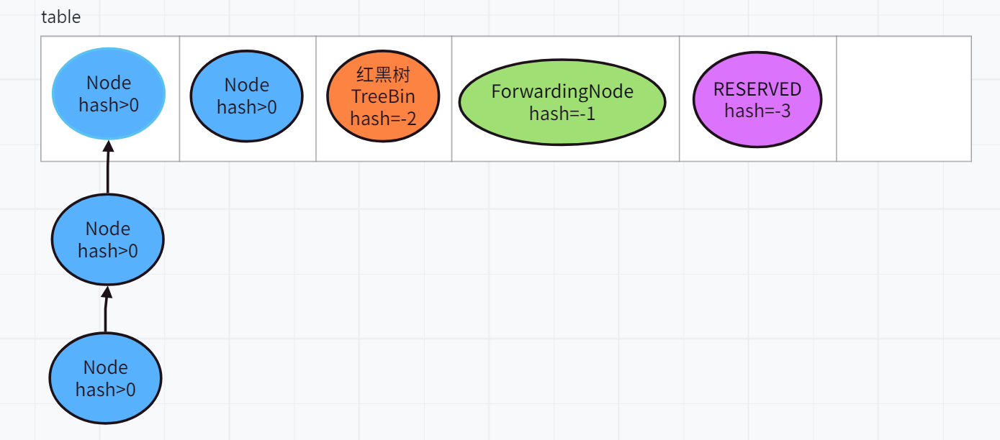

> ConcurrentHashMap 计数原理

插入之后会将count加1, 它使用的是LongAdder的方式来加1的, 即baseCount和一个CounterCell数组来组成一个LongAdder, 在开始的使用使用cas在baseCount上加1, 如果产生竞争, 就随机选一个CounterCell, 对他的value来加1, 所有总的count就是baseCount和所有CounterCell.value的和

这样可以就有将cas的竞争分散到多个值上面

> ConcurrentHashMap扩容过程
- 在加1之后, 会判断是否需要扩容, 扩容的原理创建一个两倍的数组, 然后将原始table分为一段一段的, 每个线程都负责一段长度的数组的迁移,

- 迁移的方向是从后往前迁移的

- 每段的长度为**max(length/8/cpu, 16)**, 当一个线程进来之后, 会计算出自己需要负责迁移的起始和结束的下标, 然后开始迁移数据到新的数组

如下图所示, 一个长度为35的数组进行迁移,  其中蓝色节点表示Node节点, 橙色节点表示BinTree红黑树节点, 紫色节点表示Forwarding节点, 该节点表示当前桶已经迁移完毕


transferIndex表示当前线程从这个位置开始计算自己的负责的这段桶的开始节点和结束节点

i表示当前迁移的桶的下标, bound表示结束的下标


开始是transferIndex=35=length, bound=i=0


计算任务后, transferIndex=bound=transferIndex-16=35-16=19, i=transferIndex-1=34, 即当前线程负责34~19这段桶的数据迁移

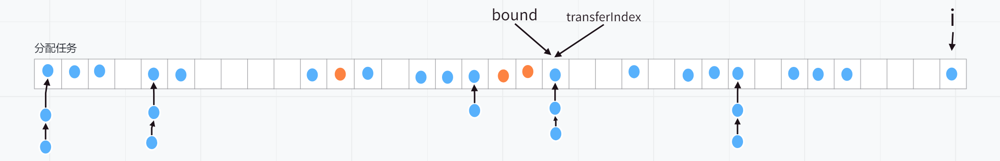

当别的线程进入到扩容的代码后, 会进行辅助迁移数据, 即从transferIndex开始又往前数16个格子, 然后对这段数据进行迁移

当前线程锁住table[i], 然后对这个桶进行迁移, 当table[i]迁移完之后, 将ForwardingNode的一个实例赋值给table[i]


# Java 多线程

#### 强引用 软引用 弱引用 虚引用

- 强引用: 当一个对象具有强引用的时候, 当内存空间不足，Java虚拟机宁愿抛出OutOfMemoryError错误，使程序异常终止，也不回收这种对象。
- 软引用: 当一个对象只有软引用的时候, 只有jvm内存不足的时候才会回收这个对象
- 弱引用: 当一个对象只有弱引用的时候, 只要有gc就会被回收
- 虚引用: 不影响对象的声明周期, 主要用来跟踪对象被垃圾回收的活动

#### ThreadLocal

- 使用方法

  ~~~scala
      val threadLocal: ThreadLocal[Int] = new ThreadLocal[Int]
      threadLocal.set(10) // 设置
      val value: Int = threadLocal.get() // 获取
      threadLocal.remove() // 设置完成后需要remove, 否则会内存泄露
      ThreadLocal.withInitial(() => Random.nextInt()) // 创建一个ThreadLocal对象, 并设置初始值
  ~~~

- 原理: 每一个Thread对象内部都有一个ThreadLocalMap对象, 调用ThreadLocal的set方法都会将this作为key设置到当前线程的ThreadLocalMap对象里面, 所以每次获取都是当前线程中ThreadLocalMap中的值, 所以能够进行线程隔离

- ThreadLocal造成内存泄露的问题

  ~~~~java
  public void test(){
      ThreadLocal tl = new ThreadLocal();
      tl.set("hello");
  }
  ~~~~

  上面代码将会造成内存泄露, 因为test方法结束之后, tl对象的引用被销毁, 所以我们就无法通过tl对象来获取到hello字符串了, 但是在jvm中还是有Thread->ThreadLocalMap-> Entry -> 'hello'的路径关联到hello对象, 导致hello无法gc, 导致内存泄露

  但是因为key是保存在WeakReference中的, 当发生gc的时候key被回收, 所以就可以通过e.get()==null来判断当前entry是否过期，从而在ThreadLocalMap内部通过代码判断来手动释放掉内存。

  

#### ThreadLocalMap

- ThreadLocalMap与HashMap不同(不继承map接口), 使用`环形数组`保存entry, 初始大小16, 阈值2/3, 每次扩容两倍, 使用`线性探测法`来解决hash冲突

- 每个Entry都继承自WeekReference

  


#### sync锁升级


# 数据结构

#### bitmap

https://juejin.cn/post/7074747080492711943

作用: 

- 大数据量去重(40亿QQ号去重)

  使用redis的bitmap, 弄长度为40亿的bitmap, 将qq号对应的下标标位1, 下次再来同样的qq号, 那么通过下标可以得知已经存在了

- 防止redis缓存


# JUC

#### 线程池

> 基本概述

```
/**
 * 当通过execute提交方法的时候, 如果线程数量小于corePoolSize, 那么会创建新线程来处理该请求, 即使其他线程空闲
 * 否则会将他们放在队列中, 如果队列也已经满了, 那么会创建新线程来处理新请求
 * 如果线程数等于maximumPoolSize, 那么会执行拒绝策略
 *
 * 当pool中线程超过corePoolSize的线程, 那么多余的线程如果空闲时间超过keepAliveTime, 将会被终止
 *
 * 队列一般有三种:
 *   1. SynchronousQueue,
 *   2. ArrayBlockingQueue, 有界队列
 *   3. LinkedBlockingQueue(没有预定义容量的情况下), 无界队列
 *
 * 拒绝策略有四种:
 *   1. AbortPolicy, 抛出RejectedExecutionException
 *   2. CallerRunsPolicy, 在caller线程中执行任务
 *   3. Discard, 直接丢弃
 *   4. DiscardOldestPolicy, 丢弃队列头部的任务
 */
```

> 线程池属性标识以及状态流转

```java
    // int的原子类
    // 高3位: 线程池状态
    // 低29位: 线程池中的线程个数
    private final AtomicInteger ctl = new AtomicInteger(ctlOf(RUNNING, 0));
    private static final int COUNT_BITS = Integer.SIZE - 3;
    private static final int COUNT_MASK = (1 << COUNT_BITS) - 1;
    // 线程池的状态
    private static final int RUNNING    = -1 << COUNT_BITS;
    private static final int SHUTDOWN   =  0 << COUNT_BITS;
    private static final int STOP       =  1 << COUNT_BITS;
    private static final int TIDYING    =  2 << COUNT_BITS;
    private static final int TERMINATED =  3 << COUNT_BITS;
    // Packing and unpacking ctl
    private static int runStateOf(int c)     { return c & ~COUNT_MASK; }
    private static int workerCountOf(int c)  { return c & COUNT_MASK; }
    private static int ctlOf(int rs, int wc) { return rs | wc; }
```


> command的包装

我们通过submit创建command给线程池后, 他会包装为一个RunnableFuture对象, 

~~~java
public <T> Future<T> submit(Callable<T> task) {
        if (task == null) throw new NullPointerException();
        RunnableFuture<T> ftask = newTaskFor(task);
        execute(ftask);
        return ftask;
}
~~~

RunnableFuture有如下几种状态

~~~java
    private volatile int state;
    private static final int NEW          = 0; // 初始状态, 任务可能没有执行, 也可能正在执行
    private static final int COMPLETING   = 1; // 任务已经完成了, 正在设置outcome
    private static final int NORMAL       = 2; // 设置outcome完成, 任务正常完成
    private static final int EXCEPTIONAL  = 3; // 设置outcome完成, 任务出现异常, outcome就是异常
    private static final int CANCELLED    = 4; // 任务已经被取消了, 如果任务还没有开始执行, 那么不会执行了, 如果已经执行了, 那就让他执行
    private static final int INTERRUPTING = 5; // 任务已经被取消了, 如果任务还没执行, 那么就不执行了, 如果已经仔细了, 那么中断他
    private static final int INTERRUPTED  = 6; // 任务中断完毕
~~~


下面我们来看看RunnableFuture的run方法

~~~java
    public FutureTask(Callable<V> callable) {
        if (callable == null)
            throw new NullPointerException();
        this.callable = callable;
        this.state = NEW;       // ensure visibility of callable
    }
	public void run() {
        // 如果当前state不为new,
        // 或者当前state为new, 但是cas 设置runner为当前线程失败
        // 都说明了当前task已经有别的线程执行了
        if (state != NEW ||
                !UNSAFE.compareAndSwapObject(this, runnerOffset,
                        null, Thread.currentThread()))
            return;
        try {
            Callable<V> c = callable;
            if (c != null && state == NEW) {
                V result;
                boolean ran;
                try {
                    result = c.call(); // 执行call方法, 获得返回值
                    ran = true; // 标记为正常结束
                } catch (Throwable ex) {
                    result = null;
                    ran = false; // 标记为异常结束
                    // 设置ex为outcome
                    // 该方法会将状态从new -> completing, 然后赋值outcome, 然后将状态改为exceptional
                    setException(ex);
                }
                if (ran)
                    // 正常结束
                    // 将状态从new -> completing, 然后赋值outcome, 然后将状态改为normal
                    set(result);
            }
        } finally {
            // runner must be non-null until state is settled to
            // prevent concurrent calls to run()
            runner = null; // 重置runner
            // state must be re-read after nulling runner to prevent
            // leaked interrupts
            int s = state;
            // 判断当前任务的状态是否被中断, 并做响应的处理
            if (s >= INTERRUPTING)
                handlePossibleCancellationInterrupt(s);
        }
        
        
    // 取消掉任务, mayInterruptIfRunning表示在取消的时候, 是否要中断任务
    // 如果为false, 那么如果任务还没有开始执行, 就不会执行了, 如果正在执行, 那么就让他执行完毕但是不赋值outcome
    // 如果为true, 那么如果任务还没有开始执行, 就不会执行了, 如果正在执行, 那么就中断他同时不赋值outcome
    // 如果当前任务正在堵塞, 那么callable.run方法会抛出InterruptedException
    public boolean cancel(boolean mayInterruptIfRunning) {
        // 如果state不是new, 或者cas将状态改为INTERRUPTING, CANCELLED失败, 
        // 说明任务已经执行完了, 无法取消
        // 如果mayInterruptIfRunning为false, 那么仅仅只是切换了状态, 正在执行的任务会正常执行完毕, 只是不会赋值outcome
        if (!(state == NEW &&
                UNSAFE.compareAndSwapInt(this, stateOffset, NEW,
                        mayInterruptIfRunning ? INTERRUPTING : CANCELLED)))
            // 返回false, 表示无法取消
            return false;
        try {    // in case call to interrupt throws exception
            // 如果mayInterruptIfRunning为true, 中断线程
            if (mayInterruptIfRunning) {
                try {
                    Thread t = runner;
                    if (t != null)
                        t.interrupt();
                } finally { // final state
                    UNSAFE.putOrderedInt(this, stateOffset, INTERRUPTED);
                }
            }
        } finally {
            finishCompletion();
        }
        // 取消任务成功
        return true;
    }
~~~

> 线程池的执行

线程池将Runnable的任务包装成一个FutureTask之后, 开始执行任务

~~~java
public void execute(Runnable command) {
        if (command == null)
            throw new NullPointerException();
        int c = ctl.get();
        // 如果worker数量 < corePoolSize
        if (workerCountOf(c) < corePoolSize) {
            // 新建核心线程并添加worker
            // 并发操作可能会导致添加核心worker失败
            if (addWorker(command, true))
                return;
            c = ctl.get(); // 添加核心线程失败, 说明有并发, 需要重新获取ctl
        }
        // 如果线程池是running, 并且如果worker数量 >= corePoolSize, 或者添加worker失败
        // 那么将command添加到queue中
        if (isRunning(c) && workQueue.offer(command)) {
            int recheck = ctl.get();
            // 重新检查是否为running, 如果不是, 那么remove并且reject掉command
            if (! isRunning(recheck) && remove(command))
                reject(command);
            // 如果还是running, 那么还要检测一下worker是否为0
            // 如果allowCoreThreadPool=true, 那么核心线程也会消亡
            // 就怕进入到这里的时候, 核心线程集体消亡
            else if (workerCountOf(recheck) == 0)
                addWorker(null, false);
        }
        // 如果添加到queue中失败, 那么尝试创建非核心线程, 并执行worker
        else if (!addWorker(command, false))
            // 如果创建非核心的worker也失败, 那么直接拒绝command
            reject(command);
    }
~~~

~~~java
// 如果firstTask不为null, 那么是正常的添加worker
    // 如果firstTask为null, 那么就是添加一个worker来处理queue中的任务, 防止queue中还有任务, 但是worker已经全部gg了
    private boolean addWorker(Runnable firstTask, boolean core) {
        retry:
        for (int c = ctl.get();;) {
            /*
                条件可以改写为
                    (runStateAtLeast(c, SHUTDOWN) && runStateAtLeast(c, STOP)) ||
                    (runStateAtLeast(c, SHUTDOWN) && firstTask != null)  ||
                    (runStateAtLeast(c, SHUTDOWN) && workQueue.isEmpty())
                然后改写为
                    (runStateAtLeast(c, SHUTDOWN) && runStateAtLeast(c, STOP)) ||
                    (runStateAtLeast(c, SHUTDOWN) && (firstTask != null || workQueue.isEmpty())

                (runStateAtLeast(c, SHUTDOWN) && runStateAtLeast(c, STOP)) 表示
                    如果状态至少是stop, 那么状态可能是stop tiding terminated, 这些状态不接受新任务了

                (runStateAtLeast(c, SHUTDOWN) && (firstTask != null || workQueue.isEmpty())
                    如果上面情况不成立, 那么当前状态可能是running和stop, 如果runStateAtLeast(c, SHUTDOWN) 成立, 那么状态只能是shutdown
                    也就是说如果状态是shutdown, 并且firstTask不为null或者workQueue不是空的, 那么不能添加worker
                    也就是说如果状态是shutdown, 那么只有firstTask为null, 并且queue不为空的情况下才能添加worker, 防止queue中的任务没有worker来处理

             */
            // 如果状态至少是stop, 那么不能添加worker, 或者如果状态是shutdown, 那么只有firstTask为null, 并且queue不为空的情况下才能添加worker
            // !!!!!!!!!!!!!!!!!! 也就是说要么状态是running, 要么状态是shutdown并且firstTask为null, 并且queue不为空, 才有可能跳过这个条件 !!!!!!!
            if (runStateAtLeast(c, SHUTDOWN)
                    && (runStateAtLeast(c, STOP)
                    || firstTask != null
                    || workQueue.isEmpty()))
                return false;
            for (;;) {
                // 这个条件在jdk1.8是  workerCountOf(c) >= CAPACITY || workerCountOf(c) >= (core ? corePoolSize : maximumPoolSize)
                // 即如果线程数已经到达容量上线了( 2^29 -1 ), 那么创建失败
                // 或者如果创建的是核心线程数, 并且worker已经大于corePoolSize了, 也创建失败
                // 或者创建的是非核心线程数, 并且worker已经大于maximumPoolSize了, 也创建失败
                if (workerCountOf(c)
                        >= ((core ? corePoolSize : maximumPoolSize) & COUNT_MASK))
                    return false;
                // 将worker数量+1, 如果成功, 那么跳出自旋
                if (compareAndIncrementWorkerCount(c))
                    break retry;

                c = ctl.get();  // cas失败, 重新加载ctl

                // 上面已经说了, 执行到这里, 要么状态是running, 要么状态是shutdown并且firstTask为null, 并且queue不为空
                // 所以如果状态还是shutdown, 那么就要在外层for循环中自旋重新判断firstTask和queue是否满足条件
                // 如果状态是running, 那么只需要在内层循环中cas将worker数量+1就好了
                if (runStateAtLeast(c, SHUTDOWN))
                    // 进行外层cas
                    continue retry;
                // 进行内层cas
            }
        }

        // 执行到这里, 要么state是running, 要么state是shutdown并且firstTask为null, 并且queue不为空
        // 并且已经将worker数量加1了
        // 接下来就要创建worker了
        boolean workerStarted = false;
        boolean workerAdded = false;
        Worker w = null;
        try {
            w = new Worker(firstTask); // 创建worker
            final Thread t = w.thread;
            if (t != null) {
                final ReentrantLock mainLock = this.mainLock;
                mainLock.lock(); // 加锁, 防止创建worker的时候别的线程调用shutdown等方法干掉线程池, 干掉线程池需要先获取锁
                try {
                    // Recheck while holding lock.
                    // Back out on ThreadFactory failure or if
                    // shut down before lock acquired.
                    int c = ctl.get();

                    // 如果状态是running, 或者状态是shutdown并且firstTask为null
                    if (isRunning(c) ||
                            (runStateLessThan(c, STOP) && firstTask == null)) {
                        if (t.getState() != Thread.State.NEW)
                            throw new IllegalThreadStateException();
                        // 添加线程到集合中
                        workers.add(w);
                        workerAdded = true;
                        int s = workers.size();
                        if (s > largestPoolSize)
                            largestPoolSize = s; //记录线程池达到的最大线程数量
                    }
                } finally {
                    mainLock.unlock();
                }
                if (workerAdded) {
                    t.start(); // 启动线程, 有可能这个线程的start方法已经被别人调用过了, 会报错
                    workerStarted = true;
                }
            }
        } finally {
            if (! workerStarted)
                // 如果线程的start方法被别人调用过了,
                // 那么将worker数量-1, 从worker集合中移除worker, 尝试关闭线程池
                addWorkerFailed(w);
        }
        return workerStarted;
    }
~~~

我们来看看worker线程到底是怎么执行的

~~~java
public void run() {
    runWorker(this);
}
final void runWorker(Worker w) {
        Thread wt = Thread.currentThread();
        Runnable task = w.firstTask; // 获取worker的任务
        w.firstTask = null; // 清除worker的任务
        w.unlock(); // allow interrupts

        // 线程有两种情况会退出运行: 1. 拿不到任务, 自动消亡  2. 执行task过程中抛出异常
        // 这个标识线程是否是因为用户的Exception而退出运行的
        boolean completedAbruptly = true;
        try {
            // 如果task不为空
            // 如果task为空, 就从queue中获取task
            while (task != null || (task = getTask()) != null) {
                w.lock();
                // If pool is stopping, ensure thread is interrupted;
                // if not, ensure thread is not interrupted.  This
                // requires a recheck in second case to deal with
                // shutdownNow race while clearing interrupt
                // 如果线程池状态至少是stop, 即stop tiding terminated, 那么要对线程进行中断
                if ((runStateAtLeast(ctl.get(), STOP) ||
                        (Thread.interrupted() &&
                                runStateAtLeast(ctl.get(), STOP))) &&
                        !wt.isInterrupted())
                    wt.interrupt();
                try {
                    beforeExecute(wt, task); // 执行钩子
                    try {
                        task.run();
                        afterExecute(task, null); // 执行钩子
                    } catch (Throwable ex) {
                        afterExecute(task, ex); // 执行钩子
                        throw ex;
                    }
                } finally {
                    task = null;
                    w.completedTasks++;
                    w.unlock();
                }
            }
            completedAbruptly = false; // 非用户异常而退出运行
        } finally {
            // 没有拉到任务, 要线程消亡,
            // 可能是因为状态是stop, 也可能是状态是shutdown并且queue为空了
            // 也有可能就是简单的没拿到任务超时了
            // 也有可能是用户的任务报错了
            processWorkerExit(w, completedAbruptly);
        }
    }
~~~

上面可以看到, 如果一个线程拉不到任务, 就会消亡掉, 那么下面看看在什么情况下会拉取不到任务

~~~java
private Runnable getTask() {
        boolean timedOut = false; // Did the last poll() time out?

        for (;;) {
            int c = ctl.get();

            // 判断线程池状态
            // 如果状态至少是stop, 那么不接受任务了, 直接返回null, 让线程消亡
            // 或者状态是shutdown并且queue已经空了, 表示处理完了任务了, 也要让线程消亡掉
            if (runStateAtLeast(c, SHUTDOWN)
                    && (runStateAtLeast(c, STOP) || workQueue.isEmpty())) {
                decrementWorkerCount();
                return null;
            }

            int wc = workerCountOf(c);

            // Are workers subject to culling?
            // 判断当前线程在pool任务的时候是否要设置超时时间
            // 如果设置了allowCoreThreadTimeOut, 或者worker数量大于corePoolSize
            // 这个时候要是拉取不到任务, 线程就要消亡
            boolean timed = allowCoreThreadTimeOut || wc > corePoolSize;

            // 没看懂这个条件, 但是可以肯定, 超时的线程会返回null消亡
            if ((wc > maximumPoolSize || (timed && timedOut))
                    && (wc > 1 || workQueue.isEmpty())) {
                if (compareAndDecrementWorkerCount(c))
                    return null;
                continue; // 自旋
            }

            try {
                Runnable r = timed ?
                        workQueue.poll(keepAliveTime, TimeUnit.NANOSECONDS) :
                        workQueue.take();
                if (r != null)
                    return r;
                timedOut = true; // 拉到了任务就直接返回了, 这里拉不到任务, 所以设置timeout, 然后自旋重新
            } catch (InterruptedException retry) {
                timedOut = false;
            }
        }
    }
~~~

同时下面看看线程是如何消亡的

~~~java
private void processWorkerExit(Worker w, boolean completedAbruptly) {
        // 如果是因为用户任务报错, 导致线程消亡, 那么要线程数-1
        // 如果是get不到任务而导致线程消亡, completedAbruptly=false,
        // 并且worker数在getTask()方法中就已经-1了, 这里不必再减一了
        if (completedAbruptly)
            decrementWorkerCount();

        final ReentrantLock mainLock = this.mainLock;
        mainLock.lock();
        try {
            completedTaskCount += w.completedTasks;
            workers.remove(w); // 移除线程
        } finally {
            mainLock.unlock();
        }

        tryTerminate();

        int c = ctl.get();
        // 如果是stop tiding terminated, 那么只需要移除线程就好了
        // 如果是running, shutdown, 那么要执行一些额外的判断
        if (runStateLessThan(c, STOP)) {
            // 如果线程不是由于用户的exception消亡的
            if (!completedAbruptly) {
                // 判断当前线程池中需要保留的最少线程数, 如果运行core thread timeout, 那么就是0
                int min = allowCoreThreadTimeOut ? 0 : corePoolSize;
                // 如果最小线程为0, 并且队列不为空, 那么min=1, 至少需要一个线程来处理剩余的任务
                if (min == 0 && ! workQueue.isEmpty())
                    min = 1;
                // 判断线程数是否大于min, 如果大于, 那么return, 让线程挂掉
                if (workerCountOf(c) >= min)
                    return; // replacement not needed
            }
            // 如果是用户异常导致的, 或者当前worker数量已经小于min
            // 那么要重新添加一个worker来补偿
            addWorker(null, false);
        }
    }
~~~


#### synchrioized同步锁原理和锁的升级

https://juejin.cn/post/6844903726545633287

https://www.bilibili.com/video/BV168411e7wr/?spm_id_from=333.999.0.0&vd_source=f79519d2285c777c4e2b2513f5ef101a

锁的状态保存在对象头的mark work中, 有四种, 如下图

(无锁和偏向锁的第57位表示是否开启偏向锁, 下图有点问题)

无锁: 001, 当前锁没有线程持有, 如果线程来持有这个锁的时候, 会直接转变为轻量级锁

偏向锁: 101, 表示当前对象已经开启了偏向锁, 此时如果是初始状态, 线程id为0

轻量级锁: 00, 又称自旋锁

重量级锁: 10, 堵塞

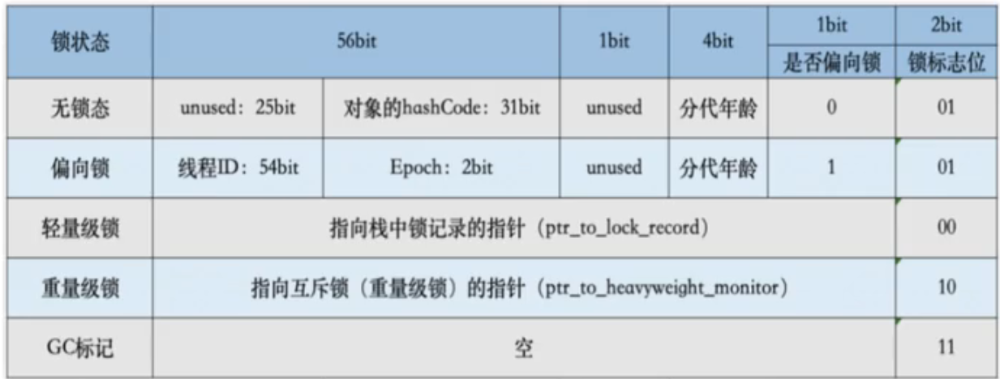

在jvm启动的前4秒, 此时创建的对象的mark work默认都是001, 不启用偏向锁, 因此这个时候jvm内部锁的竞争很激烈, 开启偏向锁没什么意义. 如果线程对这些对象加锁, 会直接升级为轻量级锁

在4秒后, 创建的对象的mark work为101, 开启偏向锁, 但是此时线程id=0, 没有偏向的线程, 此时又称为匿名偏向

> 偏向锁的获取和升级

1. 当该对象第一次被线程获得锁的时候，发现是匿名偏向状态，则会用CAS指令，将`mark word`中的thread id由0改成当前线程Id。如果成功，则代表获得了偏向锁，继续执行同步块中的代码

2. 当被偏向的线程再次进入同步块时，发现锁对象偏向的就是当前线程，那么直接执行同步块

3. 当其他线程进入同步块时，发现已经有偏向的线程了，则会进入到**撤销偏向锁**的逻辑里，一般来说，会在`safepoint`中去查看偏向的线程是否还存活，如果存活且还在同步块中则将锁升级为轻量级锁，原偏向的线程继续拥有锁，当前线程则走入到锁升级的逻辑里；

   如果偏向的线程已经不存活或者不在同步块中，则将对象头的`mark word`改为无锁状态（unlocked），之后再升级为轻量级锁。

需要注意的是, 偏向锁并不会主动撤销, 即使执行完同步代码块之后也不会将thread id改为0, 需要当其他线程过来竞争的时候, 发现thread id不是自己, 那么会在安全点的时候进行偏向锁的撤销

> 轻量级锁

又称自旋锁

线程在执行同步块之前，JVM会先在当前的线程的栈帧中创建一个`Lock Record`，然后将对象头的mark word复制一份到其中（官方称之为`Displaced Mark Word`）以及一个指向对象的指针。下图右边的部分就是一个`Lock Record`。


#### 加锁过程

1.在线程栈中创建一个`Lock Record`，将其`obj`（即上图的Object reference）字段指向锁对象。

2.直接通过CAS指令将`Lock Record`的地址存储在对象头的`mark word`中，如果对象处于无锁状态则修改成功，代表该线程获得了轻量级锁。如果失败，进入到步骤4。

3.如果是当前线程已经持有该锁了，代表这是一次锁重入。设置`Lock Record`第一部分（`Displaced Mark Word`）为null，起到了一个重入计数器的作用。然后结束。

4.如果线程竞争轻量级锁失败, 那么就会开始自旋, 如果自旋超过一定次数还没有获取到锁, 那么就需要升级为重量级锁

#### 解锁过程

1.遍历线程栈,找到所有`obj`字段等于当前锁对象的`Lock Record`。

2.如果`Lock Record`的`Displaced Mark Word`为null，代表这是一次重入，将`obj`设置为null后continue。

3.如果`Lock Record`的`Displaced Mark Word`不为null，则利用CAS指令将对象头的`mark word`恢复成为`Displaced Mark Word`。如果成功，则continue，否则膨胀为重量级锁

> 重量级锁

重量级锁是我们常说的传统意义上的锁，其利用操作系统底层的同步机制去实现Java中的线程同步。

重量级锁的状态下，对象的`mark word`为指向一个堆中monitor对象的指针。

一个monitor对象包括这么几个关键字段：cxq（下图中的ContentionList），EntryList ，WaitSet，owner。

其中cxq ，EntryList ，WaitSet都是由ObjectWaiter的链表结构，owner指向持有锁的线程。


当一个线程尝试获得锁时，如果该锁已经被占用，则会将该线程封装成一个ObjectWaiter对象插入到cxq的队列尾部，然后暂停当前线程。当持有锁的线程释放锁前，会将cxq中的所有元素移动到EntryList中去，并唤醒EntryList的队首线程。

如果一个线程在同步块中调用了`Object#wait`方法，会将该线程对应的ObjectWaiter从EntryList移除并加入到WaitSet中，然后释放锁。当wait的线程被notify之后，会将对应的ObjectWaiter从WaitSet移动到EntryList中。


作者：做个好人君
链接：https://juejin.cn/post/6844903726545633287
来源：稀土掘金
著作权归作者所有。商业转载请联系作者获得授权，非商业转载请注明出处。

# JVM

#### jvm内存结构

1. 程序计数器: 当前线程执行的字节码的行号指示器
2. java虚拟机栈: 线程私有, 执行方法的时候创建的栈帧
3. 本地方法栈: 执行本地方法时创建的栈帧
4. java堆: 存放实例对象
5. 方法区: 存储已经加载的类信息, 常量, 静态变量, 即时编译后的代码
6. 运行时常量池: 是方法区的一部分, 存放字面量
7. 直接内存: 人如其名

方法区和堆是所有线程共有的, 其他都行线程私有的.


#### 内存参数

- -Xms20m, 设置堆最小20m

- -Xmx20m, 设置堆最大20m

- -XX:+PrintGCDetails  在gc的时候打印日志

- -Xmn10m,  新生代10m, 剩余的为老年代

- -XX:SurvivorRatio=8, 设置新生代中eden和Survivor的比例

- -XX:+HeapDumpOnOutOfMemoryError

- jps 查看java的进程号

  

- jmap -dump:file=a 26050,    dump文件, a表示文件名称, 26050表示要dump的java进程


#### 引用的类别

1. 强引用: 只要引用还在对象就不会被回收

   ~~~java
   List list = new ArrayList();
   ~~~

2. 软引用: 在内存溢出之前, 会对这些对象进行gc, 如果还是不够就报错

   ~~~java
       @Test
       public void test() {
           String hello = new String("hello");
           SoftReference<String> softReference = new SoftReference<>(hello);
           hello = null;
   
           String world = new String("world");
           WeakReference<String> weakReference = new WeakReference<>(world);
           world = null;
           
           System.gc();
           System.out.println(softReference.get()); // hello
           System.out.println(weakReference.get()); // null
       }
   ~~~

   

3. 弱引用:  只要执行gc, 不管内存够不够都回收他们

4. 虚引用: 不影响生存时间, 只是在gc的时候会收到一个系统通知

#### 判断对象是否需要回收的算法

1. 引用计数法

   给对象添加一个引用计数器, 当有地方引用他时就加1, 当引用失效时就减一

   很难解决循环引用的问题

2. 可达性算法

   从GC Roots(虚拟机栈中引用的变量, 本地方法栈中引用的变量, 方法区的常量, 类的静态属性)开始向下搜索, 当一个对象不可达时, 说明可以gc了

   

#### 垃圾清除算法

1. 标记清除算法

   先标记处所有需要回收的对象, 然后统一回收

   缺点是标记和清除效率都不高, 而且产生内存碎片导致没有练习空间分配大对象而不得不进行另一次gc

   

2. 标记整理算法

   先标记所有要清理的对象, 然后让所有存活的对象都向一端移动, 直接清理掉边界外的内存

   

3. 复制算法

   将内存分为两块地方,  每次只使用其中的一块, 当一块用完以后, 就将还存活的对象复制到另外一块上面, 然后在清理掉原来上面的所有对象

   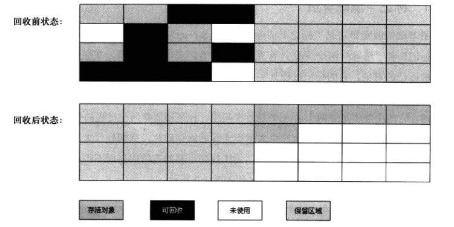

4. 分带收集算法

   将java堆分为新生代和老年代, 新生代使用复制算法, 老年代使用标记清理或者标记整理算法


#### 内存的分配和回收策略

> 内存空间和使用的垃圾算法

堆内存使用分代收集算法, 被分为新生代和老年代, 默认比例为1:2

在**新生代中使用复制算法**, **老年代中标记整理算法**

其中新生代又分成**eden和2个survivor区, 他们分别是survivor from区和survivor to区**

**eden和survivor的比例默认为为8:1**

> 新生代

发生在新生代的gc被称为minorGC

**新生代可用的区域是eden区和1个survivor区**, 对象会优先分配在eden中(连续内存空间的java对象, 比如bety[]会直接分配在老年区), 当eden中没有足够空间时, 会进行一次MinorGC

当垃圾回收的时候, 会使用复制算法, 将eden区和其中一个survivor区存活的对象拷贝到另外一个survivor区域中, 如果survivor不够, 那么会通过担保机制将**这些存活的对象全部**提前移入老年代

> 老年代

发生在老年代的gc称为FullGC/MajorGC

发生的时机: 

- 在发生MinorGC之前, 老年区连续空间小于新生代所有对象空间(防止新生代全部晋升到老年代, 或者空间担保失败)并且连续空间小于历次晋升对象的平均大小,  那么就会发生FullGC

> 对象如何到老年代

- 新生代的对象每熬过一个minorGC, 年龄就增加1岁, 到了15岁(-XX:MaxTenuringThreshold=15)时被移动到老年代

- 当Survivor中某一年龄的所有对象总和大于Survivor空间的一半, 会把年龄大于等于该年龄的对象直接移入老年代
- 空间担保机制
- 大对象直接分配在老年区

> 为什么要两个survivor区域

假如只有一个survivor区域, 开始分配对象在eden, 进行gc后复制到survivor区域, 那么下次再次gc的时候, 如果在survivor区域使用标记清除算法, 那么这个区域就会产生内存碎片, 如果使用标记整理算法的话, 效率又太慢了

所有弄两个survivor, 这样eden和1个survivor都可以使用复制算法将对象弄到另外一个survivor区域

#### 垃圾收集器

jdk9服务端默认使用G1

jdk8默认使用Parallel Scavenge + Parallel Old

> 新生代垃圾收集器

1. Serial(-XX:UseSerialGC) **stop the world**

   单线程, 复制算法, 适合小内存的情况(内存不大, stop the world时间段)

   

2. ParNew(-XX:+UseParNewGC) **stop the world**

   Serial的多线程版本

   

3. Parallel Scavenge(-XX:+UseParallelGC) **stop the world**

   和ParNew很像, 但是可以控制垃圾回收的时间

   -XX:MaxGCPauseMillis设置垃圾回收的最大停顿时间, 单位毫秒, 停顿越小, 回收的时间就越小

   -XX:GCTimeRatio设置垃圾收集时间占比的计算因子, 当设置成15，那就是 1 / (1+15) = 0.0625，就是允许最大垃圾收集时间占总时间的6.25%，当设置成99的时候，就是 1 / (1+99) = 0.01，也就是允许最大垃圾收集时间占总时间的1%

> 老年代垃圾收集器

1. Serial Old(-XX:+UseSerialOldGC)

   Serial的老年代版本, 单线程, stop the world, 标记整理算法

   

2. Parallel Old(-XX:+UseParallelOldGC)

   Parallel Scavenge的老年代版本, 标记整理算法

   

3. CMS(-XX:+UseConcMarkSweepGC)

   多线程, 低停顿, **标记清除**算法会产生内存碎片

   四个步骤:

   1. 初始标记: stop the world, 标记GCRoots直接关联到的对象, 速度很快
   2. 并发标记: 对GCRoots Tracing, 
   3. 重新标记: stop the world, 修正并发标记期间因用户程序运行导致变动的对象的标记记录, 停顿时间会比步骤1长一点
   4. 并发清除: 多线程清除

   

4. Garbage First(G1)

   g1改变了java堆内存老年代和新生代的布局方式, 而是将新生代分为很多相同大小的区域(Region), 新生代老年代不在固定, 每个Region都可以根据情况扮演Eden, Survivor, 老年代, Humongous区域

   大对象会被存储到Humongous区域，G1大多数情况下会把这个区域当作老年代来看待。如果对象占用空间超过Region的容量，就会存放到N个连续的 Humongous Region 中。

   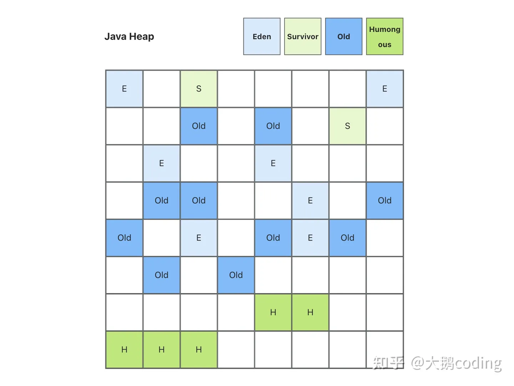

   四个步骤：

   1. 初始标记
      Stop The World, 只标记 GC Roots 能直接关联的对象，时间很短
      
   2. 并发标记
       从GC Root开始, 找出存活的对象。这个步骤耗时较长，但用户线程可以和GC线程并发执行。
   3. 最终标记
       Stop The World, 处理并发标记阶段，用户线程继续运行产生的引用变动
   4. 筛选回收
       Stop The World, 使用的是复制算法, 回收使用的是**复制算法**，把需要回收的这些Region里存活的对象，复制到空闲的Region中，然后清理掉旧Region全部空间, 因为需要移动存活的对象，所以不可避免的要暂停用户线程，这个步骤支持多条线程并行回收

   


#### visualvm的使用

https://www.cnblogs.com/krock/p/14419459.html

https://www.cnblogs.com/wade-xu/p/4369094.html

1. 在https://visualvm.github.io/download.html下载vmsual

2. 在visualvm中安装 如下几个 插件

   

   

3. 使用一下代码作为实例， 并添加vm参数

   ~~~java
   public static void main(String[] args)
           throws InterruptedException, XMLSignatureException, NoSuchAlgorithmException {
           // xms堆最小数 xmx堆最大数 xmn新生代数 SurvivorRatio eden和Survivor的比例
           // 启动时添加-Xms20m -Xmx20m -Xmn10m -XX:SurvivorRatio=8 -XX:+PrintGCDetails
   
           ArrayList<Thread> threads = new ArrayList<>();
           for (int i = 0; i < 3; i++) {
               Thread thread = new Thread(() -> {
                   while (true) {
                       byte[] bytes = new byte[1024];
                       for (int j = 0; j < 1000000; j++) {
                           String hash = "35454B055CC325EA1AF2126E27707052";
                           String password = "ILoveJava";
                           MessageDigest md = null;
                           try {
                               md = MessageDigest.getInstance("MD5");
                           } catch (NoSuchAlgorithmException e) {
                               throw new RuntimeException(e);
                           }
                           md.update(password.getBytes());
                           byte[] digest = md.digest();
                           String myHash = DatatypeConverter.printHexBinary(digest).toUpperCase();
                       }
                       try {
                           Thread.sleep(500);
                       } catch (InterruptedException e) {
                           throw new RuntimeException(e);
                       }
                   }
               });
               thread.setName("thread-" + i);
               thread.start();
               threads.add(thread);
           }
   
           System.out.println("hello");
   
       }
   ~~~

4. 在这里可以看到我们添加的vm参数

   

5. 通过visual GC查看内存情况

   https://blog.csdn.net/qq_28369007/article/details/105857310#Graphs%E7%AA%97%E5%8F%A3

   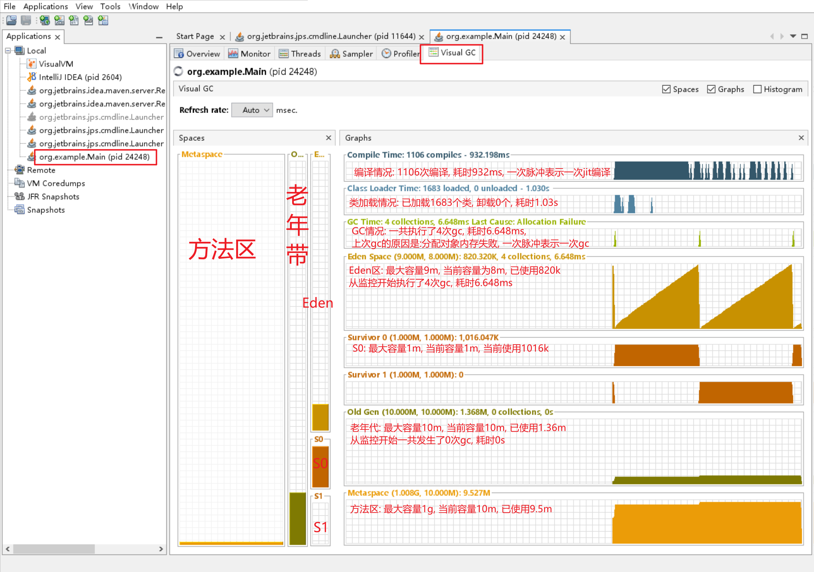

6. 通过Threads查看线程的状态与执行时间

   https://blog.csdn.net/luo15242208310/article/details/121370797

   

7. 通过Sample->cpu -> cpu samples查看每个线程的调用栈, 以及每个方法的占用时间

   通过这种方式可以查看到底是哪个方法特别占用时间

   

8. 通过sample->cpu->thread cpu time查看每个线程占用了多少cpu时间, 这样可以找到正在执行大任务的线程

   

9. 通过Sample -> memory -> heap histogram 查看堆内存中各个类实例所占用的内存大小

   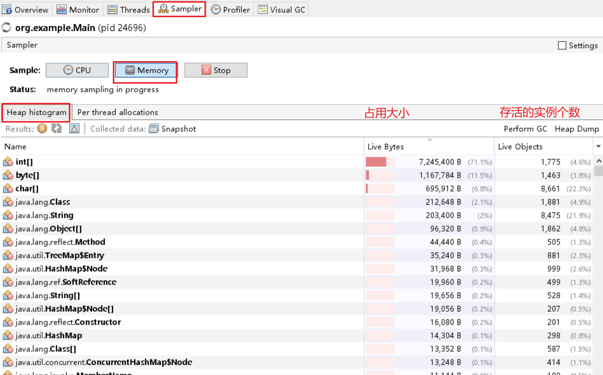

   

10. 通过Sample -> memory -> per thead allocations查看每个线程创建的对象占用堆内存的大小和百分比

    

#### 线程dump

1. 生成线程dump

   - idea

     

   - 通过visual vm

     

   - jstack查看所有线程在某一时刻的状态和调用栈

     jstack pid

     jstack pid >> a.txt 输出到文件

#### 堆内存dump

1. jmap -dump:file=filename pid 直接dump到文件中

2. jmap -heap pid 打印内存信息

3. 通过visula vm

   

#### cpu占用过高解决

1. 通过top命令, 查看cpu占用过高的进程

   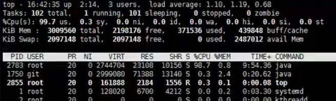

2. 通过`ps H -eo pid, tid, %cpu | grep pid`来查看进程下面有哪些线程, 已经线程的cpu使用情况

   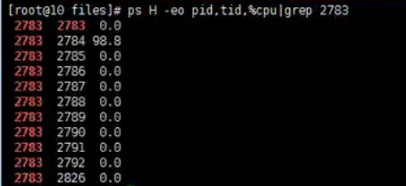

3. 通过jstack来查看线程dump, jstack显示所有线程的调用栈, 但是tid是十六进制的, 所以需要将上面通过ps找到的线程id转换为16进制之后,  再去线程dump中找对应的线程栈

# Spring

# SpringBoot

#### springboot自动装配原理, SPI机制

https://blog.csdn.net/weixin_42556307/article/details/108405009 自动装配原理

https://zhuanlan.zhihu.com/p/353561846 实现spring boot starter


SPI 全称为 Service Provider Interface，是一种服务发现机制。本质就是为了解耦, 将接口和实现分开, 然后通过spi机制找到具体的实现类

具体过程是: 将 接口实现类的全限定名配置在文件中，并由特定的classloader读取配置文件，加载文件中的实现类，这样运行时可以动态的为接口替换实现类

https://juejin.cn/post/7197070078361387069

# 算法

#### 二叉树

需要符合的特性

- 每个节点最多只有两个子节点

  

这样的数因为没有顺序性所以没有办法进行查找


#### 二叉查找树(BST)

Binary Search Tree[BST], 需要符合的特性

1. 某节点的左子树节点值仅包含小于该节点值
2. 某节点的右子树节点值仅包含大于该节点值
3. 左右子树每个也必须是二叉查找树


BST树在极端的情况下会退化成链表, 查找效率不高, 所以`为了查找效率高我们需要在插入删除的时候使用一定的平衡算法, 让他的左右子数的高度差不要差太多, 所以就有了平衡二叉查找树和红黑树`


#### 二叉树的左旋右旋

> 左旋(逆时针)

下图展示了对节点66进行左旋的过程, 即

1. 66做77左子树
2. 77的左子树做66的右子树


> 右旋

下图展示了66节点的右旋过程

1. 66做60的左子树
2. 60的左子树做66的右子树


#### 平衡二叉查找树(AVL树)

平衡二叉查找树在二叉查找树的基础上添加了一个条件, 即`任意一个节点的左右子树高度差不能超过二`


上图60节点的左右子树高度差为2, 所以不是. 


上图66节点的左右子树高度差为2, 所以不是

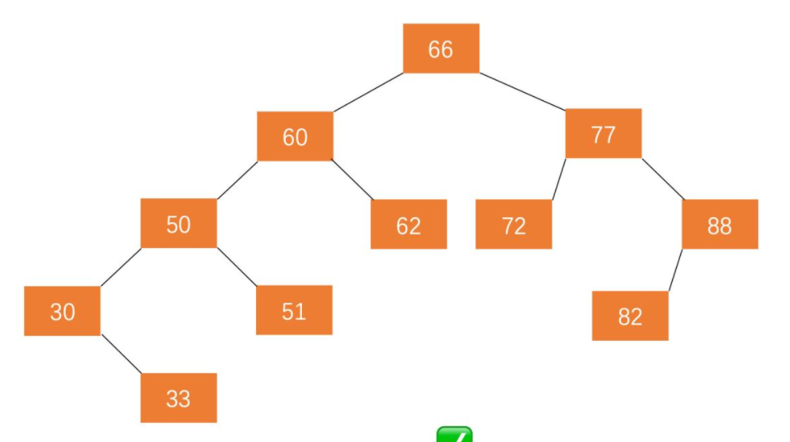

上图任意一个节点的左右子树高度差都不超过二, 所以是平衡二叉树

> 平衡二叉查找树的平衡因子

对于每一个节点, 我们都给他定义一个属性叫做`平衡因子`, 即当前节点的左子树和右子树的高度差的绝对值,  下图展示了一个数的各个节点的高度差

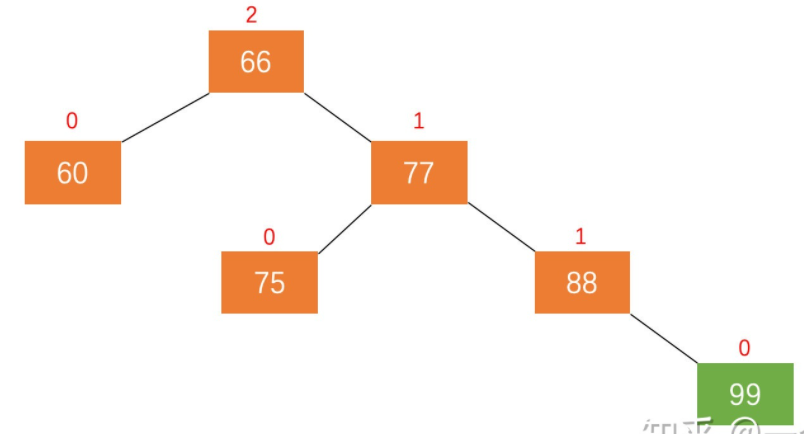

只要有了这个高度差, 我们就知道了在插入和删除的时候是那个节点发生了不平衡, 我们只需要对这个节点进行调整就行了, 在插入删除的时候, 一个有四种不平衡的情况, 下面一一讲解

> LL的情况导致不平衡

对于下面这种情况, 我们在原本平衡的树上插入f的时候, 这个时候a的平衡因子为2, 导致了不平衡, 因为我们是在`a的左节点的左节点上插入的f, 所以这种情况称为LL的情况`

针对LL的情况, 我们只需要`右旋a节点`就能够解决不平衡的问题


> RR的情况导致不平衡

如下图所示, 我们在一颗本来平衡的树上插入了f节点, 这样就导致了a节点的平衡因子是2, 因为我们是`在a节点的右子节点的右子节点上面插入的f节点所导致的不平衡, 这种情况我们称为RR的情况`

针对RR的情况, 我们只需要`左旋A节点`就能够解决不平衡的问题


> LR的情况导致不平衡

如下图所示, 我们在一颗本来平衡的树上插入了f节点, 这样就导致了a节点的平衡因子是2, 因为我们是`在a节点的左子节点的右子节点上面插入的f节点所导致的不平衡, 这种情况我们称为LR的情况`

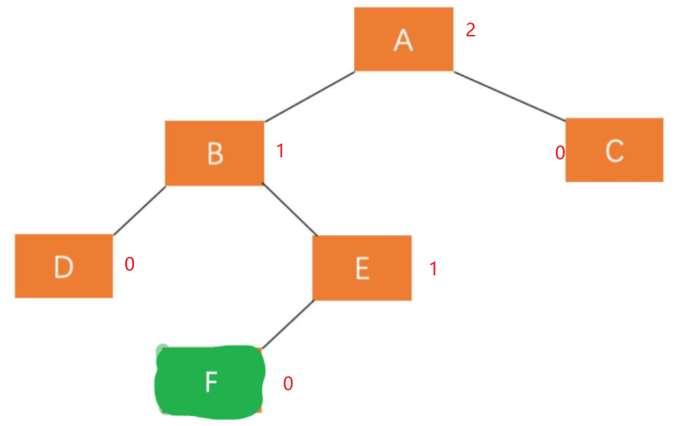

针对LR的情况, 我们只需要两个步骤

1. `左旋a的左子节点`

   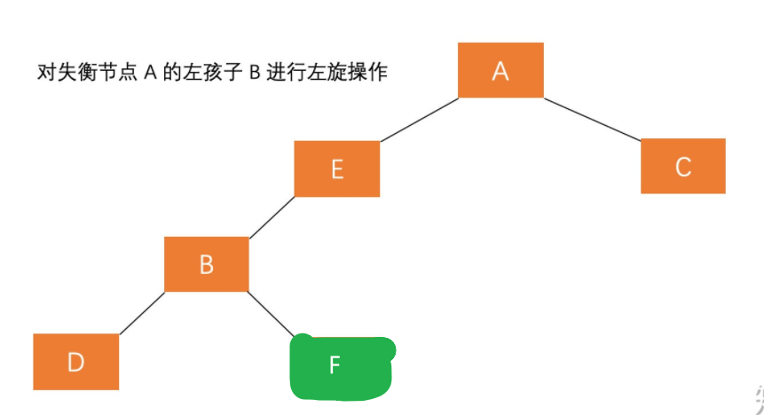

2. `右旋a节点`

   

> RL的情况导致不平衡

如下图所示, 我们在一颗本来平衡的树上插入了f节点, 这样就导致了a节点的平衡因子是2, 因为我们是`在a节点的右子节点的左子节点上面插入的f节点所导致的不平衡, 这种情况我们称为RL的情况`


针对RL的情况, 我们做如下两个步骤

1. `右旋a的右孩子`

   

2. `左旋a`

   

#### 红黑树

在使用AVL树的时候, 我们发现`AVL的平衡条件过于严格, 导致几乎每次的插入和删除都需要对树进行平衡`, 所以AVL数比较适合在读多写少的情况下使用, 同时我们需要一种相对AVL树不那么平衡的树(`牺牲一定的读性能, 增加写性能`), 于是就有了红黑树

红黑树的特性如下: 

1. 每个节点都有红色或者黑色
2. 根节点必须是黑色
3. 父子节点不能同时为红色
4. 红黑树的叶子节点是Null节点, 并且是黑色的
5. 任意的节点到叶子节点(Null节点)所经历的黑色节点的数量是相同的


# MySQL

#### B数和B+数的区别, 为什么使用B+数不使用B数

https://blog.csdn.net/a519640026/article/details/106940115

b数


b+数


两者不同在于, b数的节点包含数据, 而b+数的数据都在叶子节点,并且叶子节点之间有指针相连,  他们的区别是:

- b数的复杂度不固定, 最好的情况为O(1), 一次就能查到数据, 而B+数复杂度固定为O(log n)
- 因为B+数非叶子节点不带数据, 所有每个节点能够划分的区间也更多, 每个节点的查找也跟精确, 同时能够有更多的子节点, 降低层高
- B+树叶节点两两相连可大大增加区间访问性，可使用在范围查询等，而B-树每个节点 key 和 data 在一起，则无法区间查找。


# Mybatis

#### 缓存

> 一级缓存

- SqlSession是MyBatis的关键对象, 类似于JDBC中的Connection

- 一级缓存是SqlSession级别的缓存。

- 不同的sqlSession之间的缓存数据区域是互相不影响的。

- mybatis会把执行方法和参数生成的key, 以及结果放在一个map中, 如果后续执行同一个mapper方法, 参数也相同, 会直接从缓存中取值, **也就是说mapper返回的两个值地址都是相等的**

- **任何的 UPDATE, INSERT, DELETE 语句都会清空所有SqlSession中的所有缓存**, 因为mybatis无法确定你到底修改了哪些数据

  比如一个update student set age = age +1 where age > 10,  mybatis根本就不知道你改了哪些数据, 所以他只好把所有sqlsession中的所有缓存清除掉

> 二级缓存

# ZK


# Redis

#### redis为什么快


#### redis 缓存雪崩, 穿透, 击穿

> 雪崩

**在同一时间, key大量失效**, 导致请求全部打到数据库上面, 导致数据库挂掉

- 在设置缓存的时候, 随机初始化试下时间, 不让所有缓存在同一时间失效
- 把不同的key放到不同redis节点上去, 让他平均分布在节点上, 减小单个节点压力

> 穿透

常见于黑客攻击, 故意访问不存在的数据(使用负数id来请求), **redis和数据库中都没有这样的数据**, 如果大量请求就会导致数据库挂掉

- 过滤掉非法参数

- 不管数据库查没查到数据, 都要更新到数据库中去, 防止被击穿(但是黑客可能换不同的参数)

- 拉黑ip(但是黑客可能换不同的ip)

- 使用布隆过滤器(bitmap数据结构实现), 需要所有用户id放在布隆过滤器中, 实际上不会很大, 100万的数据才3M差不多

  https://blog.csdn.net/lifetragedy/article/details/103945885

  一个二维数组, 每个key经过多个hash函数生成下标, 然后标为1

  查询时经过同样的hash函数计算下标, 如果下标都为1, 那么有可能存在, 如果有1个不为1, 那么一定不存在

  优点: 占用空间小, 插入和查询速度快, 时间复杂度O(k, k为hash函数个数)

  缺点: 误判, 无法做更新和删除操作

  为了减小误差率, 要设置多个hash函数, 因为不同的key经过越多个hash函数还能生成一样的下标的概率是更低的, 但是越多hash函数, 生成的组合也越多, 所以二维数组越大
  
  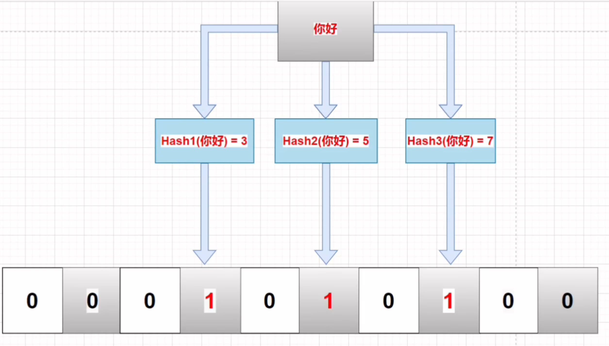

> 击穿

**某个非常热点的key失效, 导致大量使用该key的请求失效, 直接访问数据库**

- 在访问数据库这一步使用分布式锁, 让其中一个数据查询完并更新到redis中, 其他线程sleep后重新到数据库中查找数据


#### 数据库和缓存一致性解决方案

首先明确, 数据库和缓存的一致性是要强一致性还是最终一致性, 如果是需要强一致性, 那么就要使用分布式锁做互斥, 并且写数据库和写缓存搞成一个事务.或者**直接不使用缓存**

如果是最终一致性, 那么无论如何都会有不一致的情况, 只能尽量减少不一致的概率

> 单点问题(缓存双删)

1. 先更新缓存, 后更新数据库

   完全不行, 数据库更新失败会导致数据不一致

   同时并发也有问题:

   - 线程B更新缓存(x=2)
   - 线程A更新缓存(x=1)
   - 线程A写数据库(x=1)
   - 线程B写数据库(x=2)

2. 先更新数据库, 后更新缓存

   不行, 会导致更新过的数据看不见

   同时并发问题:

   - 线程A更新数据库(x=1)
   - 线程B更新数据库(x=2)
   - 线程B写缓存(x=2)
   - 线程A写缓存(x=1)

3. 先删除缓存, 后更新数据库

   有并发问题

   - 线程 A 要更新 X = 2（原值 X = 1）
   - 线程 A 先删除缓存
   - 线程 B 读缓存，发现不存在，从数据库中读取到旧值（X = 1）
   - 线程 A 将新值写入数据库（X = 2）
   - 线程 B 将旧值写入缓存（X = 1）

4. 先更新数据库, 后删除缓存

   - 缓存中 X 刚过期, 不存在（数据库 X = 1）
   - 线程 A 读取数据库，得到旧值（X = 1）
   - 线程 B 更新数据库（X = 2)
   - 线程 B 删除缓存
   - 线程 A 将旧值写入缓存（X = 1）

   但是上面发生的条件比较苛刻, 需要满足

   1. 缓存刚失效  
   2. 读写请求并发  
   3. 更新数据库+删除缓存时间 < 读取数据库+写缓存时间(很难发生, 因为更新数据库要加锁, 一般比读取数据库时间长)

   **所以要采取先更新数据库, 后删除缓存的步骤**, 同时为了保证上面的场景不再产生, 可以**使用缓存双删的做法, 再异步删除一次, 延迟时间要大于读取数据库+写入缓存的时间, 一般1-5s**(但是在极端情况下依旧有可能发生不一致)

> 主从同步(消息队列)

   

在主从同步的情况下, 依旧有可能发生不一致的情况, 所以这里**就不要采用删除缓存的操作了, 直接搞一个canal订阅binlog, 主动更新数据库**


> 保证redis可用性

上面两种情况, 延迟双删和订阅binlog的方法都有可能发生操作redis失败的情况, 这样还是会造成不一致的情况, 所以为了保证一致性, redis要上集群, 使用下面的架构

**订阅系统直接将更新操作放到mq中, 然后再次通过单线程进行消费, 这样可以保证更新缓存的操作不会丢失, 同时单线程保证缓存的有效性**


#### redis 集群的分片算法


> 哈希槽

一个redis集群包括16834个插槽, 每个键都属于其中的一个插槽, 集群中的每个节点负责处理一部分插槽,

集群使用crc16(key) % 16834 来计算key属于哪个插槽, 其中 CRC16(key) 语句用于计算键 key 的 CRC16 校验和 。

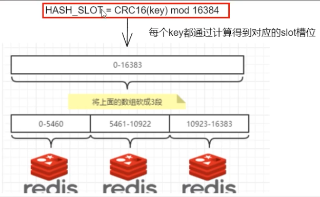

优势: 方便扩容和缩容

如果我想新添加个节点D,我需要从节点 A,B,C中得部槽到D上,如果我想移除节点A,需要将A中的槽移到B和C节点上,然后将没有任何槽的A节点从集群中移除即可.由于从一个节点将哈希槽移动到另一个节点并不会停止服务,所以无论添加删除或者改变某个节点的哈希槽的数量都不会造成集群不可用的状态,

> 哈希取余算法


优点: 简单粗暴

缺点: 扩缩容麻烦, 每次节点变动, 映射关系都需要从新计算,

如果某台机器宕机, 会造成数据混乱

> 一致性哈希算法

1. 通过一致性哈希算法产生的hash值, 所有的hash值可以构成一个空间[0, 2^32-1], 将整个哈希空间构成一个环形

2. 将集群中的各个节点的ip或者主机名进行hash, 这样就确定了每台集群在hash环上的位置

3. 对于给定key的hash, 先确定其在hash环上的位置, 然后其顺时针碰到的第一个节点, 就是其存储的节点


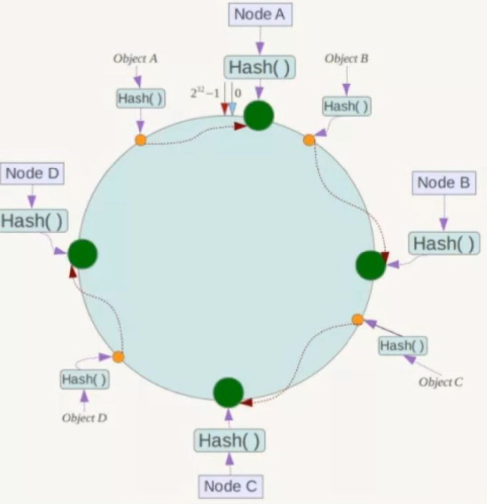

优点: 

1. 如果一台服务器宕机了, 只会影响一部分数据(沿着他逆时针遇到的第一个服务器之间的数据), 其他的不影响

   如果c挂了, 只会影响bc之间的数据, 且这些数据会转移到D进程存储

2. 如果要增加一台节点X, 在ab之间, 那么只需要把a到x之间的数据移动到x上即可, 不用全部洗牌

缺点: 容易造成数据倾斜

> 为什么hash槽是16382

crc16算法的hash值有16bit, 可以产生2^16=65536个值, 也就是说可以分配65536个hash槽, 为什么只使用16384个?


# Kafka


# Spark

# Flink


# Hadoop


# Dubbo


# 数仓

# 分布式事务

### 分布式事务的解决方案

#### 强一致性(需要事务协调器进行协调事务)

不管2pc和3pc, 都需要协调者, 存在协调不一致的问题, 比如一方回滚成功, 一方回滚失败 , 并且存在一定阻塞

> 2pc


> 3pc


> xa


#### 最终一致性

提供良好的性能, 适合高并发场景, 但是无法保证强一致性

> 本地消息表或者消息队列

可能存在写入消息表失败的问题, 或者更新失败的问题

> tcc

tcc要先预留资源, 涉及幂等问题

> saga


# 项目

#### 分布式唯一id

https://www.bilibili.com/video/BV1Mu41177ra/?vd_source=f79519d2285c777c4e2b2513f5ef101a

使用分布式唯一id有三种办法

1. 数据库自增

   - 在单机的情况下运转很好, 但是如果mysql是分布式架构,  那么使用mysql自增组件的范围分区的话, 会造成尾部热点(写完一个库在写另外一个库)

     其实自增组件的插入效率非常高, 所以变通的方式是不使用自增主键做数据分片, 而使用业务的用户id做数据分片, 这样每个用户的数据都集中在一个库, 更内聚

   - 两张数据表合并的时候可能会产生主键冲突

2. UUID

   格式为: xxxxxxxx—xxxx—xxxx—xxxx—xxxxxxxxxxxx
   
   32个十六进制数, 128bit
   
   uuid有很多版本, 不同版本的生成规则不一样, 但是大体上是使用时间, mac地址, 随机数等生成
   
   - 全局唯一性最好
   
   - 格式太长了, 浪费空间
   
   - 不是有序的, 在插入到mysql中, 会造成主键索引重排和磁盘碎片
   
     (如下图, 一个页16k, 每条数据5k, 那么一个页最多3条数据, 如果要把id=5的数据写入, 需要将id=5的数据从page10移动到page28中, 然后再将id=4的数据写入到page10中, 然后更新page15指向page28的指针)
   
     
   
   
   
3. 雪花算法
   
   占用62bit
   
   
   
   - 严重依赖机器的时钟, 如果发生时钟回拨, 可能会生成重复id
   
     可以使用**多时钟**, 即保留上一次生成时间, 如果发生回拨, 将当前获取的时间与上次时间比较, 即可检测出时钟回拨, 切换到另外的时钟即可.
   
   - 41位时间戳能使用69年, 到2039年就失效了, 建议时间戳减去上线时的时间戳, 这样就可以使用69年了

#### 接口幂等

> 什么时候需要幂等

1. 前端重复提交

   用户在新增页面快速点击多次, 造成很多重复的订单

2. 消息重复消费

   mq将消息给消费者消费, 但是消费完返回ack给mq时网络中断, 这时候mq会重复发给消费端进行消费

3. 页面回退再次提交

   用户下单完成后, 点击返回按钮返回上一个页面, 重新点击下单按钮, 如果没有幂等, 也会造成重复下单的问题

4. 微服务相互调用

   分布式系统中, 通过prc或者feign进行调用, 如果网络波动, feign会触发重试机制, 所以我们要保证接口幂等

> 如何实现幂等

实现幂等, 关键要识别两个一模一样的提交, 他到底是重复提交, 还是不同的提交, 比如下单中, 用户就是买了一模一样的东西, 所有参数都是一样的, 要识别他到底是下单按钮快速点击, 还是就是买了一样的东西

1. 前端提交按钮disable

2. 通过数据库唯一索引保证, 

   - 可以在要提交的表中添加一个唯一字段, 前端发送请求前, 先请求一个流水号, 这个可以是雪花算法生成, 然后将这个流水号一起发送到后端, 并插入到字段中, 如果已经处理过了会插入失败
   - 专门弄一个防重表, 将唯一流水号插入到防重表中, 每次处理之前查一下这个流水号有没有

3. 通过redis token

   还是前端先请求一个唯一流水号, 后端将他放到redis中, 前端将流水号一起带过来, 后端接收到先查询redis中有没有流水号, 如果有删掉, 然后处理业务, 如果没有, 说明已经处理过了

   这种方案有一定危险性

   - 先删除token还是先执行业务

     - 先执行业务后删除token, 那么分布式环境下还是有可能重复
     - 先删除token后执行业务, 如果业务调用失败, 前端重新发送请求还是会失败
     - 综上要先删除token, 后执行业务, 如果业务调用失败, 要重新请求token

   - token的获取, 比较, 删除不是原子性的, 需要使用lua脚本

     ~~~LUA
     if redis.call('get', KEYS[1]) == ARGV[1]
     	then return redis.call('del', KEYS[1])
     else 
         return 0
     end
     ~~~


#### bio, nio, select多路复用

> bio

https://zhuanlan.zhihu.com/p/625401360

下面是bio实现socket的代码

~~~c
#include <stdio.h>
#include <stdlib.h>
#include <string.h>
#include <errno.h>
#include <unistd.h>
#include <arpa/inet.h>
#include <sys/socket.h>
#define ERR_MSG(err_code) do {                                     \
    err_code = errno;                                              \
    fprintf(stderr, "ERROR code: %d \n", err_code);                \
    perror("PERROR message");                                      \
} while (0)

const int BUF_LEN = 100;
int main(void)
{
    /* 配置 Server Sock 信息。*/
    struct sockaddr_in srv_sock_addr;
    memset(&srv_sock_addr, 0, sizeof(srv_sock_addr));
    srv_sock_addr.sin_family = AF_INET;
    srv_sock_addr.sin_addr.s_addr = htonl(INADDR_ANY);  // 即 0.0.0.0 表示监听本机所有的 IP 地址。
    srv_sock_addr.sin_port = htons(6666);

    /* 创建 Server Socket。*/
    int srv_socket_fd = 0;
    srv_socket_fd = socket(AF_INET, 
                           SOCK_STREAM, // 表示传输数据使用tcp
                           IPPROTO_TCP)
    /* 设置 Server Socket 选项。*/
    int optval = 1;
 	setsockopt(srv_socket_fd,
                   SOL_SOCKET,    // 表示套接字选项的协议层。
                   SO_REUSEADDR,  // 表示在绑定地址时允许重用本地地址。这样做的好处是，当服务器进程崩溃或被关闭时，可以更快地重新启动服务器，而不必等待一段时间来释放之前使用的套接字。
                   &optval,
                   sizeof(optval))

    /* 绑定 Socket 与 Sock Address 信息。*/
    bind(srv_socket_fd, (struct sockaddr *)&srv_sock_addr, sizeof(srv_sock_addr)))

    /* 开始监听 Client 发出的连接请求。10表示请求队列的最大长度, 请求队列满了之后不再接收队列*/
    listen(srv_socket_fd, 10)


    /* 初始化 Client Sock 信息存储变量。*/
    struct sockaddr cli_sock_addr;
    memset(&cli_sock_addr, 0, sizeof(cli_sock_addr));
    int cli_sockaddr_len = sizeof(cli_sock_addr);

    int cli_socket_fd = 0;

    int recv_len = 0;
    char buff[BUF_LEN] = {0};

    /* 永远接受 Client 的连接请求。*/
    while (1)
    {
        cli_socket_fd = accept(srv_socket_fd,
                                          (struct sockaddr *)(&cli_sock_addr),  // 填充 Client Sock 信息。
                                          (socklen_t *)&cli_sockaddr_len))

        /* 接收指定 Client Socket 发出的数据，*/
        (recv_len = recv(cli_socket_fd, buff, BUF_LEN, 0)
        printf("Recevice data from client: %s\n", buff);

        /* 将收到的数据重新发送给指定的 Client Socket。*/
        send(cli_socket_fd, buff, recv_len, 0);
        printf("Send data to client: %s\n", buff);

        /* 每处理完一次 Client 请求，即关闭连接。*/
        close(cli_socket_fd);
        memset(buff, 0, BUF_LEN);
    }
    close(srv_socket_fd);
    return EXIT_SUCCESS;
}
~~~

client:

~~~c
#include <stdio.h>
#include <stdlib.h>
#include <string.h>
#include <errno.h>
#include <unistd.h>
#include <arpa/inet.h>
#include <sys/socket.h>
#define ERR_MSG(err_code) do {                                     \
    err_code = errno;                                              \
    fprintf(stderr, "ERROR code: %d \n", err_code);                \
    perror("PERROR message");                                      \
} while (0)
const int BUF_LEN = 100;
int main(void)
{
    /* 配置 Server Sock 信息。*/
    struct sockaddr_in srv_sock_addr;
    memset(&srv_sock_addr, 0, sizeof(srv_sock_addr));
    srv_sock_addr.sin_family = AF_INET;
    srv_sock_addr.sin_addr.s_addr = inet_addr("127.0.0.1");
    srv_sock_addr.sin_port = htons(6666);

    int cli_socket_fd = 0;
    char send_buff[BUF_LEN];
    char recv_buff[BUF_LEN];

    /* 永循环从终端接收输入，并发送到 Server。*/
    while (1) {

        /* 创建 Client Socket。*/
        if (-1 == (cli_socket_fd = socket(AF_INET, SOCK_STREAM, IPPROTO_TCP)))
        {
            printf("Create socket ERROR.\n");
            ERR_MSG(errno);
            exit(EXIT_FAILURE);
        }

        /* 连接到 Server Sock 信息指定的 Server。*/
        if (-1 == connect(cli_socket_fd,
                          (struct sockaddr *)&srv_sock_addr,
                          sizeof(srv_sock_addr)))
        {
            printf("Connect to server ERROR.\n");
            ERR_MSG(errno);
            exit(EXIT_FAILURE);
        }

        /* 从 stdin 接收输入，再发送到建立连接的 Server Socket。*/
        fputs("Send to server> ", stdout);
        fgets(send_buff, BUF_LEN, stdin);
        send(cli_socket_fd, send_buff, BUF_LEN, 0);
        memset(send_buff, 0, BUF_LEN);

        /* 从建立连接的 Server 接收数据。*/
        recv(cli_socket_fd, recv_buff, BUF_LEN, 0);
        printf("Recevice from server: %s\n", recv_buff);
        memset(recv_buff, 0, BUF_LEN);

        /* 每次 Client 请求和响应完成后，关闭连接。*/
        close(cli_socket_fd);
    }

    return EXIT_SUCCESS;
}
~~~

上面服务端会造成阻塞的操作有两个, 一个是accept, 一个是recev函数

需要知道的是, Socket是在内核态中的, 每个Socket都有一个线程等待队列, 和数据接收队列

1. 线程等待队列中存放了进程号, 上下文信息, 回调函数信息
2. 数据接收队列保存client发送过来的数据


如果recev函数发现数据接收队列中没有数据到达, 会发生下面这件事

1. 进程让出cpu时间片, 进入堵塞状态
2. 进程的文件描述符进入socket等待队列
3. client发送消息到server网卡上面, 网卡会通过dma控制器将数据写到内核的环形缓冲区中, 并且产生一个IO中断, 内核根据端口将环形缓冲区中的数据复制到数据接收队列, 并且中断程序会调用进程等待队列中的callback函数来唤醒线程
4. 当线程被唤醒的时候, recv会将处于内核态中的数据接收队列中的数据拷贝到用户空间中, 然后返回


#### 双亲委派机制

https://www.zhihu.com/question/466696410

https://blog.csdn.net/qq_39169614/article/details/120557704

https://zhuanlan.zhihu.com/p/651047427

java中有三个类加载器

1. 启动类加载器BoostrapClassLoader: 加载jre/lib/rt.jar中的所有class
2. 扩展类加载器ExtClassLoader: 加载jre/lib/ext目录中jar包的类
3. 应用程序类加载器AppClassLoader: 加载classpath下的class

他们的父子关系不是通过继承来实现的, 而是通过组合实现的

jvm加载类的时候, 调用AppClassLoader.loadClass来加载类, 在这个方法中会调用ExtClassLoader.loadClass来加载类, 在这个方法中又会调用BootstrapClassLoader.loadClass来加载类, 如果发现某个类以及加载过了, 就直接返回.

**为什么需要双亲委派机制**

1. 防止核心类被重写
2. 避免类重复加载

**如何打破双亲委派机制**

除了BootrapClassLoader, 其他两个ClassLoader都继承与ClassLoader, 我们自定义的classloader也要继承ClassLoader

该类的两个方法

- loadclass: 处理双亲委派, 子加载器委托父加载器, 父加载器失败时调用findclass自行加载
- findclass: 当前类加载器根据路径以及class文件名加载字节码文件, 从class文件中读取字节码数组, 然后调用defineClass方法, 根据字节数组, 返回class对象

所以

1. 自定义类加载器, 继承ClassLoader, 重写findClass
2. 打破双亲委派, 重写loadClass

**打破双亲委派的案例**

1. JDBC

   我们在使用jdbc的时候, 通过DriverManager获取connection, 但是这个类在java.sql包下, 是又bootstrapClassLoader加载的

   类加载有个规则:  **如果一个类由A加载器加载, 那么他的依赖类也由这个类加载**

   显然bootstrapClassLoader是无法加载到各个厂商的具体的第三方类, 所以导致NoClassDefException

   所以DriverManager的静态代码块中, 会通过ServiceLoader这个类来加载Driver

   ServiceLoader就是查找meta-inf/service下指定的具体实现类, 对他们一一实例化(**如果有多个实现类, 都会实例化, 不能按需加载**)

   ~~~java
   package com.buhui.ecommerce.jvmjuc.class4;
   public interface TestInterface {
       public  void saySPI();
   }
   public class TestSPI01 implements TestInterface {
       @Override
       public void saySPI() {  System.out.println("spi 01"); }
   }
   public class TestSPI02 implements TestInterface {
       @Override
       public void saySPI() { System.out.println("spi 02"); }
   }
   public class TestSPI03 implements TestInterface {
       @Override
       public void saySPI() { System.out.println("spi 03"); }
   }
   
   ~~~

   

   

   ~~~java
   public class Test {
       public static void main(String[] args) {
   		//加载TestInterface的实现类
           ServiceLoader<TestInterface>loader=ServiceLoader.load(TestInterface.class);
           //创建迭代器
           Iterator<TestInterface>  it=loader.iterator();
           while(it.hasNext()){
               //通过迭代器拿到实现类
               TestInterface testInterface=it.next();
               //调用实现类的方法
               testInterface.saySPI();
           }
       }
   }
   ~~~

2. Tomcat

   部署项目，我们是把war包放到[tomcat](https://www.zhihu.com/search?q=tomcat&search_source=Entity&hybrid_search_source=Entity&hybrid_search_extra={"sourceType"%3A"answer"%2C"sourceId"%3A2219153613})的webapp下，这意味着一个tomcat可以运行多个Web应用程序, Tomcat给每个 Web 应用创建一个类加载器实例 (WebAppClassLoader)该加载器重写了loadClass方法，优先加载当前应用目录下的, 这样就可以隔离各个app的class

   

   


